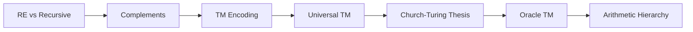
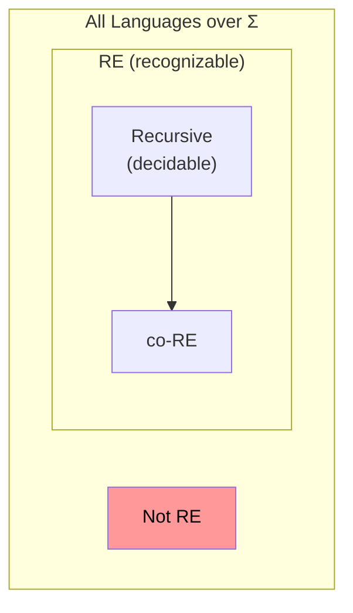

# Chapter 10: Turing Machine Extensions and the Church-Turing Thesis

> **Previous:** [Turing Machines](./09-turing.md) | **Next:** [Decidability](./11-decidability.md)


## Learning Objectives

- Distinguish between recursively enumerable and recursive languages.
- Describe the universal Turing machine and its significance.
- Explain the Church-Turing thesis and its implications.
- Understand the encoding of Turing machines as strings.
- Recognize the limits of TM-based computation.
- Understand the concept of oracles and relativized computation.


## Chapter at a Glance
| Topic | Key Insight | Practical Takeaway |
|-------|------------|-------------------|
| RE vs Recursive | RE may loop; recursive always halts | Decidable vs semi-decidable |
| Universal TM | Simulates any TM on any input | Stored-program computer concept |
| Church-Turing Thesis | Everything computable = TM-computable | Accepted but unprovable claim |
| Oracle TM | TM with external query capability | Relativized computation |
| Arithmetic Hierarchy | Quantifier alternation depth | Classification beyond RE/co-RE |


## Chapter Roadmap


## Theory


### 9.1 Recursively Enumerable vs Recursive Languages

A language L is **recursively enumerable (RE)** if there exists a Turing machine M such that L(M) = L. This means M halts in the accept state for every w ∈ L, and for w ∉ L, M either halts in reject or **loops forever**.

A language L is **recursive** (or **decidable**) if there exists a Turing machine M that **halts on all inputs** and L(M) = L. Such a machine is called a **decider**.

**Relationship:**
- Every recursive language is RE (a decider is a special case of a recognizer).
- There exist RE languages that are NOT recursive (Chapter 10: the halting problem).

**Intuition:** Recognizing a language only requires positive answers to be correct. Deciding requires both positive and negative answers to be correct.

### 9.2 Complement of RE Languages

For a language L:
- If L is recursive, then LÌ… is also recursive (swap accept and reject states in the decider).
- If L is RE, LÌ… may or may not be RE.
- A language is **co-RE** if its complement is RE.
- L is recursive **iff** L is both RE and co-RE.

**Theorem:** L is recursive iff L is RE and co-RE.

**Proof:** If L is recursive, then L is RE and L̅ is recursive (hence RE), so L is RE and co-RE. Conversely, if L is RE via M₁ and L̅ is RE via M₂, construct a decider M that simulates M₁ and M₂ in parallel. One must eventually accept. If M₁ accepts, M accepts; if M₂ accepts, M rejects.

### 9.3 Encoding Turing Machines

To talk about TMs as inputs to other TMs, we need to encode them as strings. Turing machines can be encoded in a standard format:

Let TM M be described as (Q, Σ, Γ, δ, q₀, q_accept, q_reject). We encode:
1. Encode states as strings in {q}* (e.g., q = q₀, qq = q₁, etc.).
2. Encode tape symbols similarly.
3. Encode transitions as tuples: (state, symbol, new_state, new_symbol, direction).
4. Concatenate all parts with separators.

The encoded TM is denoted ⟨M⟩. This encoding allows a TM to examine other TMs as data — a crucial capability.

### 9.4 The Universal Turing Machine

A **universal Turing machine (UTM)** is a TM U that takes as input ⟨M, w⟩ (the encoding of a TM M and an input string w) and simulates M on w. U accepts if M accepts w, rejects if M rejects w, and loops if M loops on w.

**Construction of UTM:**
U uses a *multitape* architecture (simulatable on a single tape):

1. **Tape 1:** Stores the description of M (⟨M⟩).
2. **Tape 2:** Simulates M's tape (copies w, then simulates read/write).
3. **Tape 3:** Stores M's current state.

**Simulation algorithm:**
1. Initialize Tape 2 with w, Tape 3 with qâ‚€.
2. Repeat:
   a. Read symbol under M's head on Tape 2.
   b. Search Tape 1 for a transition matching current state and symbol.
   c. If found: update state on Tape 3, write symbol on Tape 2, move head.
   d. If M is in q_accept → accept. If in q_reject → reject.
   e. If no matching transition → reject.

**Significance:** The UTM is the theoretical basis for stored-program computers. A single machine can simulate any other machine by reading its program. This is exactly what happens when you run a program on your computer.

### 9.5 The Church-Turing Thesis

**Church-Turing Thesis:** Everything that is intuitively computable can be computed by a Turing machine.

This is not a theorem (it cannot be proved) but a **thesis** — a claim about the nature of computation that is universally accepted because:
- Every proposed model of computation (λ-calculus, general recursive functions, Post systems, RAM machines, cellular automata) has been shown equivalent to Turing machines.
- No one has found a computation that humans would call "effective" but that cannot be simulated by a TM.
- The thesis has held for 90+ years despite intensive investigation.

**Variants:**
- **Physical Church-Turing thesis:** Any physically realizable computing device can be simulated by a Turing machine (with implications for quantum computing).
- **Extended Church-Turing thesis:** Probabilistic TMs can simulate any physically realizable computation with at most polynomial slowdown (challenged by quantum computing).

### 9.6 Oracle Turing Machines and Relativization

An **oracle Turing machine** is a TM with an additional "oracle tape" and a special query state. When the machine enters the query state, the oracle (an external device) answers whether a string belongs to some fixed language A.

**Notation:** Má´¬ denotes a Turing machine with oracle A.

Oracle machines allow us to:
- **Classify problems relative to oracles.** For example, Pá´¬ and NPá´¬ are classes relativized to A.
- **Prove relativization results.** There exist oracles A and B such that Pᴬ = NPᴬ and Pᴮ ≠ NPᴮ. This shows that any proof resolving P vs NP must be "non-relativizing" — it cannot work for all possible oracles.

### 9.7 The Arithmetic Hierarchy

Languages definable by alternating quantifiers over recursive predicates form the **arithmetic hierarchy**:
- Σ₁: Languages of the form { x | ∃y R(x,y) } where R is recursive (these are exactly RE).
- Π₁: Languages of the form { x | ∀y R(x,y) } (these are co-RE).
- Σ₂: Languages of the form { x | ∃y₁ ∀y₂ R(x,y₁,y₂) }.
- Π₂: Languages of the form { x | ∀y₁ ∃y₂ R(x,y₁,y₂) }.
- etc.

This hierarchy is strict: Σₙ ⊂ Σ_{n+1} and Πₙ ⊂ Π_{n+1} for all n.

## Examples

### Example 9.1: RE but Not Recursive — The Halting Problem (Preview)

HALT_TM = { ⟨M, w⟩ | M halts on input w }.

- HALT_TM is RE: A UTM can simulate M on w; if M halts (accepts or rejects), the UTM accepts. This shows HALT_TM ∈ RE.
- HALT_TM is not recursive: A diagonalization argument (Chapter 10) shows no decider can correctly determine whether arbitrary M halts on w.

### Example 9.2: A Language That Is Neither RE Nor co-RE

Consider L = { ⟨M₁, M₂⟩ | L(M₁) = L(M₂) } (equivalence of TMs).
- This language is not RE and not co-RE.
- Intuitively: there's no way to check if two TMs accept the same language because either one might loop on some input.

### Example 9.3: Many-One Reductions

To show a language A is not recursive, we can reduce a known non-recursive language (like HALT_TM) to A. If A were recursive, then HALT_TM would be recursive too — contradiction.

For language EMPTY_TM = { ⟨M⟩ | L(M) = ∅ }:
- We can reduce HALT_TM to EMPTY_TM.
- Given ⟨M, w⟩, construct M': on input x, M' simulates M on w; if M accepts w, M' accepts x; otherwise M' loops.
- Then: if M halts on w, L(M') = Σ* ≠ ∅. If M doesn't halt on w, L(M') = ∅.
- So ⟨M, w⟩ ∈ HALT_TM iff ⟨M'⟩ ∉ EMPTY_TM. A decider for EMPTY_TM would give a decider for HALT_TM — impossible.

### Example 9.4: UTMs as Stored-Program Computers

The UTM architecture mirrors modern computers:
- ⟨M⟩ is the **program** (stored in memory).
- w is the **input data**.
- The UTM is the **CPU** that fetches, decodes, and executes instructions.

This is why the UTM is considered the theoretical foundation of general-purpose computing.

### Example 9.5: Relativization

Define Pá´¬ = languages decidable in polynomial time by a TM with oracle A.
Let SAT be the language of satisfiable Boolean formulas.

- If we could decide SAT in polynomial time, then P^SAT = NP^SAT (since an oracle for SAT, the hardest NP problem, would collapse NP into P relative to SAT).
- However, there also exist oracles B where this doesn't hold.
- This "relativization barrier" explains why standard diagonalization techniques cannot resolve P vs NP.


## TypeScript UTM Simulation Concept

While a full UTM simulator requires low-level tape operations, the concept can be illustrated at a high level:

```typescript
type TMDescription = {
  Q: string[];
  gamma: string[];
  delta: Map<string, [string, string, 'L' | 'R']>;
  q0: string;
  qAccept: string;
  qReject: string;
};

function universalTM(description: TMDescription, input: string): boolean {
  const tape = [...input];
  let head = 0;
  let state = description.q0;

  while (state !== description.qAccept &&
         state !== description.qReject) {
    const symbol = head < tape.length ? tape[head] : '_';
    const key = `${state},${symbol}`;
    const transition = description.delta.get(key);
    if (!transition) {
      state = description.qReject;
      break;
    }
    const [nextState, writeSym, direction] = transition;
    if (head >= tape.length) tape.push('_');
    tape[head] = writeSym;
    state = nextState;
    head += direction === 'R' ? 1 : -1;
    if (head < 0) {
      tape.unshift('_');
      head = 0;
    }
  }
  return state === description.qAccept;
}
```

## Diagram: RE, Recursive, and co-RE Relationships



Key properties:
- REC = RE ∩ co-RE
- If L is RE and L̅ is RE, then L is recursive
- The halting problem is in RE \ REC
- Its complement is in co-RE \ REC

## The Encoding of Turing Machines

TMs are encoded as strings over a fixed alphabet. A standard encoding scheme:

```text
⟨M⟩ = (Q)(Σ)(Γ)(δ)(q₀)(q_accept)(q_reject)

Where:
- States: "q" repeated i+1 times = q, qq, qqq, ...
- Symbols: "s" repeated j+1 times = s, ss, sss, ...
- Transition: (state, symbol, new_state, new_symbol, direction)
  where direction is L or R
- Components separated by semicolons
```

This encoding makes TMs countable: each TM maps to a unique natural number. The existence of a universal TM means the set of all computable functions is enumerable by a single machine.

## The Chomsky-Schützenberger Theorem

Every context-free language can be expressed as the homomorphic image of the intersection of a regular language with the Dyck language (balanced parentheses). This deep theorem connects CFGs, automata theory, and algebraic language theory.

## Practical Takeaways

1. **Recognizable ≠ decidable.** When building systems that analyze programs or processes, distinguish between properties that have a definitive yes/no answer (decidable) and those that can only confirm positive cases (recognizable). Static analysis typically deals with recognizable properties.

2. **The UTM proves interpreters exist.** The theoretical existence of a universal TM guarantees that any computation can be simulated. This is why emulators, virtual machines, and interpreters are possible — the concept predates computers.

3. **The Church-Turing thesis guides systems design.** If a computation cannot be described by a TM, it cannot be implemented on any current computer. This sets a fundamental limit on what software can achieve, regardless of hardware advances.

4. **Oracle separation proves proof barriers.** The existence of oracles A and B with P^A = NP^A and P^B ≠ NP^B shows that any P vs NP proof must use non-relativizing techniques — a key insight for complexity theorists.

## Concept Comparison Table
| Language Class | TM Behavior on w ∉ L | TM Behavior on w ∈ L |
|---------------|----------------------|---------------------|
| Recursive (decidable) | Halts (reject) | Halts (accept) |
| RE (recognizable) | May loop | Halts (accept) |
| co-RE | Halts (reject) | May loop |

## Quick Reference
| Concept | Definition |
|---------|-----------|
| Recursive (decidable) | TM always halts |
| RE (recognizable) | TM halts on accept, may loop on reject |
| co-RE | Complement is RE |
| UTM | Simulates any TM on any input |
| Oracle TM | TM with external language query |

## Cross-Application Matrix
| Domain | Concept |
|--------|---------|
| Computing | Stored-program architecture |
| Programming languages | Interpreter = UTM |
| Complexity | Oracle separations |
| AI | Turing test connection |
| Philosophy | Limits of mechanistic computation |

## Chapter Quiz

**Q1.** Every recursive language is:
- A) RE ✓
- B) co-RE only
- C) Neither
- D) Not RE

<details>
<summary>Answer</summary>
**A)** A decider is a special case of a recognizer, so recursive ⊆ RE.
</details>

**Q2.** L is recursive iff:
- A) L is RE
- B) L is RE and co-RE ✓
- C) L is not RE
- D) L is infinite

<details>
<summary>Answer</summary>
**B)** Decidable = TM halts on all inputs = both L and its complement are recognizable.
</details>

**Q3.** The Church-Turing thesis is:
- A) A proven theorem
- B) A universally accepted thesis ✓
- C) A definition
- D) A conjecture that's been disproven

<details>
<summary>Answer</summary>
**B)** It's a thesis about the nature of computation, not provable but universally accepted.
</details>

**Q4.** The UTM demonstrates:
- A) TMs cannot simulate other TMs
- B) Stored-program concept ✓
- C) Halting problem is decidable
- D) TMs are impractical

<details>
<summary>Answer</summary>
**B)** The UTM stores ⟨M⟩ as data and simulates it — the theoretical basis for general-purpose computers.
</details>

**Q5.** Oracle TMs help:
- A) Speed up computation
- B) Classify problems relative to oracles ✓
- C) Prove P = NP
- D) Eliminate nondeterminism

<details>
<summary>Answer</summary>
**B)** Oracle machines create relativized complexity classes and identify proof barriers.
</details>

## Practical Takeaways

1. **The UTM is the stored-program computer.** The universal Turing machine's ability to read and execute a description of another TM is the theoretical foundation for every modern general-purpose computer. An operating system loading a program into memory is a real-world UTM simulation.

2. **RE but not recursive = programs that may loop forever.** Many useful problems are RE but not recursive: whether a program has a bug, whether a function terminates, whether two programs are equivalent. This is why testing cannot prove correctness.

3. **The Church-Turing thesis guides architecture decisions.** If a problem is not computable on a Turing machine, it is not computable on any real computer. This means some problems truly have no algorithmic solution, regardless of hardware advances or programming language improvements.

4. **The arithmetic hierarchy classifies real problems.** Determining if a program halts on all inputs is Π₂⁰ (harder than the halting problem). Determining if a program halts on infinitely many inputs is Π₃⁰. Each quantifier alternation adds fundamental difficulty.

## Summary

- Recursive languages are decidable (TM always halts); RE languages are recognizable (TM may loop).
- L is recursive iff L is both RE and co-RE.
- TMs can be encoded as strings ⟨M⟩, allowing them to be inputs to other TMs.
- The universal TM simulates any TM on any input — the stored-program concept.
- The Church-Turing thesis claims TMs capture all effective computation.
- Oracle TMs relativize computation and create complexity class hierarchies.
- The arithmetic hierarchy classifies languages by quantifier alternation depth.

### Basic

1. Explain why every recursive language is RE but not vice versa.
2. Describe how a UTM simulates another TM. Why is the UTM's ability to read ⟨M⟩ important?
3. State the Church-Turing thesis in your own words.
4. Show that if L is recursive, then LÌ… is recursive.
5. Give an example of a language in RE ∩ co-RE that is not obviously recursive.

### Intermediate

6. Prove: If a language L is RE, then L is recursive iff LÌ… is also RE.
7. Show that the language { ⟨M⟩ | M accepts ε } is RE but not recursive (reduce from the halting problem).
8. Describe how to construct a UTM with 4 states and 6 symbols (or argue why this is the minimum).
9. Prove that the arithmetic hierarchy is strict: Σₙ ≠ Σ_{n+1} for all n ≥ 1.
10. Explain the relevance of the Church-Turing thesis to quantum computing.

### Advanced

11. Prove that the language of descriptions of TMs that accept at least one string (NONEMPTY_TM) is RE but not recursive.
12. Construct an encoding scheme for TMs and prove that the set of all TM descriptions is countable.
13. Prove that there are uncountably many languages but only countably many TMs — conclude that most languages are not RE.
14. Show relativization: find oracles A and B such that Pᴬ = NPᴬ and Pᴮ ≠ NPᴮ.
15. Prove that the universal language U = { ⟨M, w⟩ | M accepts w } is RE but not recursive.

## Further Reading

- **Turing, Alan M.** "On Computable Numbers, with an Application to the Entscheidungsproblem." Proceedings of the London Mathematical Society, 1936. The original paper introducing Turing machines and the halting problem.
- **Davis, Martin.** "What is a Computation?" In *Mathematics Today*, 1978. A accessible overview of the Church-Turing thesis and its implications.
- **Copeland, B. Jack.** *The Essential Turing*. A collection of Turing's most important papers with commentary and historical context.

