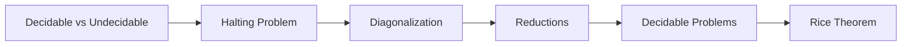
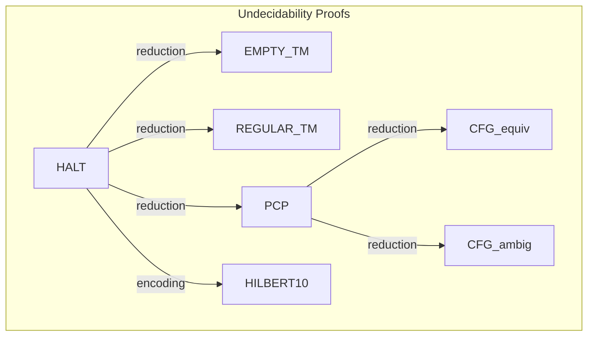
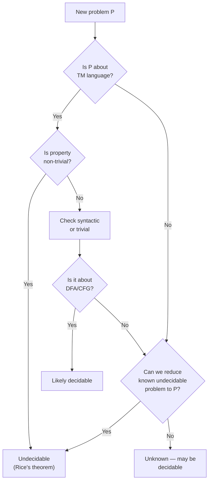

# Chapter 11: Decidability

> **Previous:** [Turing Machine Extensions](./10-turing-extensions.md) | **Next:** [Reducibility](./12-reducibility.md)


## Learning Objectives

- Distinguish between decidable and undecidable problems.
- Prove the undecidability of the halting problem via diagonalization.
- Identify decidable problems about regular and context-free languages.
- Apply the reduction technique to prove undecidability.
- Understand the relationship between undecidability and non-RE languages.
- Recognize common patterns in undecidability proofs.


## Chapter at a Glance
| Topic | Key Insight | Practical Takeaway |
|-------|------------|-------------------|
| Halting Problem | No algorithm decides if TM halts | Fundamental limit of computation |
| Diagonalization | Self-reference leads to contradiction | Core technique for undecidability |
| Reductions | Convert problem A to problem B | Prove undecidability systematically |
| Rice's Theorem | Non-trivial semantic properties undecidable | Generalizes many undecidability proofs |
| Decidable Problems | DFA/CFG membership, emptiness | Algorithms exist for these |


## Chapter Roadmap


## Theory


### 10.1 Decidable vs Undecidable Problems


A problem (language) is **decidable** if there exists an algorithm (Turing machine that always halts) that correctly answers yes/no for every instance. Otherwise, it is **undecidable**.

**Decidable problems** → the golden age of automata theory:
- All problems about DFAs (membership, emptiness, finiteness, equivalence) are decidable.
- All problems about CFGs (membership, emptiness) are decidable.
- Many problems about TMs (membership in specific cases) are decidable.

**Undecidable problems** → the frontier:
- The halting problem for Turing machines.
- The equivalence problem for CFGs.
- Hilbert's tenth problem (solving Diophantine equations).
- The Post correspondence problem.
- Many problems about TMs: emptiness, equivalence, totality.

### 10.2 The Halting Problem


**HALT_TM = { ⟨M, w⟩ | M is a TM and M halts on input w }**

**Theorem:** HALT_TM is undecidable.

**Proof (by diagonalization, due to Turing 1936):**

Assume for contradiction that HALT_TM is decidable. Then there exists a decider H that:
- H(⟨M, w⟩) = accept if M halts on w.
- H(⟨M, w⟩) = reject if M loops on w.

Construct a new TM D:
1. D takes as input ⟨M⟩ (a TM description).
2. D runs H(⟨M, ⟨M⟩⟩).
3. If H accepts (meaning M halts on its own description), D **loops forever**.
4. If H rejects (meaning M loops on its own description), D **halts** (accepts).

Now ask: what does D do on input ⟨D⟩?
- If D halts on ⟨D⟩, then H(⟨D, ⟨D⟩⟩) = accept. But then D would loop (by construction). Contradiction.
- If D loops on ⟨D⟩, then H(⟨D, ⟨D⟩⟩) = reject. But then D would halt. Contradiction.

Thus H cannot exist. HALT_TM is undecidable.

**Intuition:** The halting problem asks a TM to predict its own behavior → a task that leads to paradox, much like the self-referential "This statement is false."

### 10.3 The Diagonalization Language


Define A_TM = { ⟨M, w⟩ | M accepts w }.

**Theorem:** A_TM is undecidable (but RE).

**Proof:** Similar diagonalization. Assume decider H for A_TM. Construct D:
- D(⟨M⟩): Run H(⟨M, ⟨M⟩⟩). If H accepts, D rejects; if H rejects, D accepts.
- Question: does D accept ⟨D⟩?
  - If D accepts ⟨D⟩, then H(⟨D, ⟨D⟩⟩) = accept, so D should reject. Contradiction.
  - If D rejects ⟨D⟩, then H(⟨D, ⟨D⟩⟩) = reject, so D should accept. Contradiction.
- Therefore H cannot exist.

### 10.4 The Post Correspondence Problem (PCP)


The **Post Correspondence Problem** asks: given a collection of dominoes (tiles), each with a top string and bottom string, can we arrange them (with repetitions allowed) so that the concatenation of top strings equals the concatenation of bottom strings?

Formally: an instance of PCP is a set of pairs \((t_1, b_1), (t_2, b_2), \ldots, (t_k, b_k)\) over an alphabet \(\Sigma\). A solution is a sequence of indices \(i_1, i_2, \ldots, i_m\) such that:
\[
t_{i_1} t_{i_2} \ldots t_{i_m} = b_{i_1} b_{i_2} \ldots b_{i_m}
\]

**Theorem:** PCP is undecidable.

**Significance:** PCP is a simple combinatorial problem that is undecidable, making it ideal for reductions to other problems. Many undecidability proofs for language theory problems (CFG ambiguity, CFG inclusion) reduce PCP.

**Example PCP instance:**
| Domino | 1 | 2 | 3 |
|--------|---|---|---|
| Top | a | ab | bba |
| Bottom | b | aa | bb |

A solution: 1, 3, 2, 3 gives:
- Top: a + bba + ab + bba = abbababba
- Bottom: b + bb + aa + bb = bbbaabb

### 10.5 Reductions


A **reduction** is a way to convert one problem to another so that a solution to the second can be used to solve the first.

If A reduces to B (written A ≤ B), then:
- If B is decidable, then A is decidable.
- If A is undecidable, then B is undecidable.

**Mapping reduction (many-one reduction):** A ≤_m B if there is a computable function f such that w ∈ A iff f(w) ∈ B.

To prove B is undecidable using a reduction:
1. Choose a known undecidable problem A (e.g., A_TM or HALT_TM).
2. Show A ≤_m B by constructing a computable function f mapping instances of A to instances of B.
3. Conclude B is undecidable.

### 10.5 Decidable Problems About Regular Languages


All of the following are decidable (proved in Chapter 4):

1. **DFA acceptance:** Given DFA M and string w, does M accept w? (O(|w|) by simulation.)
2. **NFA acceptance:** Given NFA M and string w, does M accept w? (Convert to DFA or simulate directly.)
3. **RE acceptance:** Given regex r and string w, does r generate w? (Convert to DFA.)
4. **DFA emptiness:** Given DFA M, is L(M) = ∅? (Check reachability of accepting states.)
5. **DFA equivalence:** Given DFAs M₁ and M₂, is L(M₁) = L(M₂)? (Minimize and check isomorphism.)
6. **DFA finiteness:** Is L(M) finite? (Check for cycles that can reach an accept state.)

### 10.6 Decidable Problems About CFLs


1. **CFG membership:** Given CFG G and string w, does G generate w? (CYK algorithm, O(n³).)
2. **CFG emptiness:** Given CFG G, is L(G) = ∅? (Check if S generates a terminal string.)
3. **CFG finiteness:** Is L(G) finite? (Check for cycles in the variable dependency graph.)

**Undecidable for CFLs:**
1. **CFG equivalence:** Given two CFGs G₁ and G₂, is L(G₁) = L(G₂)?
2. **CFG ambiguity:** Is G ambiguous?
3. **CFG inclusion:** Is L(G₁) ⊆ L(G₂)?
4. **CFG universality:** Does G generate Σ*?

### 10.7 Undecidable Problems About TMs


Once we have one undecidable problem (A_TM), we can prove many others undecidable by reduction:

| Problem | Description | Status |
|---------|-------------|--------|
| A_TM | Does TM M accept w? | Undecidable, RE |
| HALT_TM | Does TM M halt on w? | Undecidable, RE |
| EMPTY_TM | Is L(M) = ∅? | Undecidable, not RE |
| EQ_TM | Do M₁ and M₂ accept the same language? | Undecidable, not RE |
| REGULAR_TM | Is L(M) regular? | Undecidable, not RE |
| FINITE_TM | Is L(M) finite? | Undecidable, not RE |
| TOTAL_TM | Does M halt on all inputs? | Undecidable, not RE |

### 10.8 Mapping Reductions vs Turing Reductions


**Mapping reduction (=?):** There is a computable function f such that w ? A ? f(w) ? B.

**Turing reduction (=?):** There is an oracle TM that decides A using B as an oracle.

| Property | Mapping Reduction | Turing Reduction |
|----------|-------------------|------------------|
| Preserves RE? | Yes (if B?RE then A?RE) | No |
| Preserves co-RE? | Yes | No |
| Strength | Weaker (finer degrees) | Stronger (coarser degrees) |
| Common use | Proving undecidability | Classifying relative complexity |

**Example:** The complement of A_TM is not many-one reducible to A_TM (since A_TM is RE but not recursive), but it IS Turing-reducible (just flip the answer). This subtlety matters in the arithmetic hierarchy.

### 10.9 Hilbert's Tenth Problem


Hilbert's tenth problem (1900) asked for an algorithm to determine whether a given Diophantine equation (polynomial equation with integer coefficients) has an integer solution.

**Theorem (Matiyasevich, 1970):** Hilbert's tenth problem is undecidable.

This was proved by showing that every RE language can be represented as the set of solutions to a Diophantine equation — the **MRDP theorem** (Matiyasevich, Robinson, Davis, Putnam). This means there is no general algorithm for solving polynomial equations over integers, a result with profound implications for number theory and automated theorem proving.



### 10.10 Rice's Theorem


Rice's theorem is a powerful generalization: any non-trivial property of the language of a TM is undecidable.

**Rice's Theorem:** Let P be a set of RE languages (a "property"). If P is non-trivial (not empty and not all RE languages), then the language { ⟨M⟩ | L(M) ∈ P } is undecidable.

**Examples of undecidable properties:**
- Does M accept at least one string? (L(M) ≠ ∅)
- Does M accept exactly 42 strings? (|L(M)| = 42)
- Does M accept all strings? (L(M) = Σ*)
- Is L(M) regular?
- Is L(M) context-free?

**Examples of decidable properties (trivial or syntactic):**
- Does M have exactly 10 states? (Syntactic, not about the language.)
- Is L(M) = ∅ where M is a DFA? (Not about TMs → Rice's theorem applies to TMs only.)

## Examples

### Example 10.1: Reducing HALT_TM to EMPTY_TM

Show that EMPTY_TM = { ⟨M⟩ | L(M) = ∅ } is undecidable.

**Reduction:** Given ⟨M, w⟩ (an instance of HALT_TM), construct M_w:
- M_w(x): Simulate M on w. If M halts (accepts or rejects), accept x.
- Note: If M halts on w, M_w accepts ALL inputs. L(M_w) = Σ* ≠ ∅.
- If M loops on w, M_w never finishes simulating, so M_w never accepts anything. L(M_w) = ∅.

Thus: M halts on w ⟹ L(M_w) ≠ ∅. M loops on w ⟹ L(M_w) = ∅.
Therefore, HALT_TM ≤_m EMPTY_TM.

If EMPTY_TM were decidable, we could decide HALT_TM → contradiction. So EMPTY_TM is undecidable.

### Example 10.2: Reducing A_TM to REGULAR_TM

Show REGULAR_TM = { ⟨M⟩ | L(M) is regular } is undecidable.

**Reduction:** Given ⟨M, w⟩, construct M':
- M'(x): Simulate M on w. If M accepts w, then accept x if x ∈ {0ⁿ1ⁿ | n ≥ 0}. If M rejects w, reject x.
- If M doesn't accept w (rejects or loops), M' never accepts anything. L(M') = ∅ (regular).
- If M accepts w, then M' accepts {0ⁿ1ⁿ | n ≥ 0} (non-regular).

Thus: ⟨M, w⟩ ∈ A_TM ⟹ L(M') is non-regular. ⟨M, w⟩ ∉ A_TM ⟹ L(M') is regular (empty).

A decider for REGULAR_TM would decide A_TM → contradiction.

### Example 10.3: Applying Rice's Theorem

Property: Does L(M) contain the string "hello"?

This is non-trivial:
- Some TMs accept "hello" (e.g., a TM that accepts only "hello").
- Some TMs don't (e.g., a TM that rejects everything).

By Rice's theorem, { ⟨M⟩ | "hello" ∈ L(M) } is undecidable.

### Example 10.4: Decidable Problems → DFA Emptiness

**Algorithm** for EMPTY_DFA = { ⟨M⟩ | M is a DFA and L(M) = ∅ }:
1. Mark the start state.
2. Repeat: mark any state reachable from a marked state.
3. If no accepting state is marked, accept (L(M) = ∅). Otherwise reject.
This is essentially graph reachability, runtime O(|Q| + |E|).

### Example 10.5: Decidable Problems → CFG Membership

**Algorithm** for A_CFG = { ⟨G, w⟩ | G generates w }:
1. Convert G to CNF.
2. Run the CYK algorithm on G and w.
3. If S ∈ T[1,n], accept. Otherwise reject.
Runtime O(n³) where n = |w|.


## Concept Comparison Table
| Problem | Status | Class |
|---------|--------|-------|
| DFA membership | Decidable | P |
| CFG membership | Decidable | P (O(n³)) |
| DFA equivalence | Decidable | P |
| CFG equivalence | Undecidable | — |
| Halting problem | Undecidable | RE |

## Quick Reference
| Technique | Purpose |
|-----------|---------|
| Diagonalization | Direct undecidability proof |
| Mapping reduction | Translate problem A to B |
| Rice's theorem | General undecidability for TM properties |
| CYK algorithm | Decidable CFG membership |

## Cross-Application Matrix
| Domain | Decidability Concept |
|--------|---------------------|
| Software engineering | Limits of automated verification |
| Programming languages | Type system decidability |
| Automated reasoning | Theorem proving limits |
| Compilers | Optimization correctness |
| AI | Problem-solving limitations |

## The Limitations of Reduction Proofs

While reductions are powerful, they have limitations:

1. **Reduction direction matters.** To prove B undecidable, reduce FROM a known undecidable problem TO B. A reduction in the opposite direction proves nothing.

2. **The reduction function must be computable.** You cannot use an oracle or non-computable function to construct the reduction. Every step in building f(w) must be realizable on a Turing machine.

3. **Reductions preserve RE status.** If A =? B and B is RE, then A is RE. If A is not RE, then B cannot be RE. Tracking the RE/non-RE status is essential for classification.

### TypeScript: Generic Reduction Framework

```typescript
// A reduction maps instances of problem A to instances of problem B
type Reduction<A, B> = (instanceA: A) => B;

// If we have a decider for B, we can decide A
function reduceAndDecide<A, B>(
  reduction: Reduction<A, B>,
  deciderB: (instanceB: B) => boolean,
  instanceA: A
): boolean {
  const instanceB = reduction(instanceA);
  return deciderB(instanceB);
}

// Concrete: HALT_TM to EMPTY_TM reduction
type TMHaltingInstance = { description: TMDescription; input: string };
type TMEmptinessInstance = TMDescription;

function haltToEmptyReduction(
  instance: TMHaltingInstance
): TMEmptinessInstance {
  // Construct M' that:
  // On any input x, simulate M on w; if M halts, accept x
  const MPrime: TMDescription = {
    Q: instance.description.Q.concat(["q_sim"]),
    gamma: instance.description.gamma,
    delta: new Map([
      // Simulate M on w (hardcoded input)
      ["q_sim,_", ["q_accept", "_", "R"]],
      ...Array.from(instance.description.delta.entries())
    ]),
    q0: "q_sim",
    qAccept: "q_accept",
    qReject: "q_reject",
  };
  return MPrime;
}
```

## Chapter Quiz

**Q1.** The halting problem asks if a TM:
- A) Accepts its input
- B) Halts on its input ?
- C) Has finitely many states
- D) Is deterministic

<details>
<summary>Answer&lt;/summary&gt;
**B)** HALT_TM = { ?M, w? | M halts on w }. Proven undecidable by Turing in 1936.
</details>

**Q2.** Diagonalization proves undecidability by:
- A) Counting states
- B) Self-reference paradox ?
- C) Reducing to a known problem
- D) Using Rice's theorem

<details>
<summary>Answer&lt;/summary&gt;
**B)** Diagonalization creates a self-referential contradiction — "what does D do on input ?D??"
</details>

**Q3.** Which is decidable?
- A) CFG equivalence
- B) DFA membership ?
- C) TM emptiness
- D) TM equivalence

<details>
<summary>Answer&lt;/summary&gt;
**B)** DFA membership is decidable — simply simulate the DFA on the input string.
</details>

**Q4.** Rice's theorem applies to:
- A) Syntactic properties of TMs
- B) Non-trivial semantic properties ?
- C) Properties of DFAs
- D) Properties of CFGs

<details>
<summary>Answer&lt;/summary&gt;
**B)** Any non-trivial property of the language of a TM is undecidable.
</details>

**Q5.** A reduction shows:
- A) Problem A is easier than B
- B) If B is decidable, A is decidable ?
- C) Both problems are the same
- D) Neither problem is decidable

<details>
<summary>Answer&lt;/summary&gt;
**B)** A =_m B means a solution to B yields a solution to A (or undecidability of A transfers to B).
</details>

## Practical Takeaways

1. **Undecidability is not hypothetical.** Problems like program equivalence, whether a program will crash, or whether two pieces of code do the same thing are all undecidable in general. Software engineers work with conservative approximations and restricted cases.

2. **Diagonalization is a general proof technique.** The same technique used to prove the halting problem undecidable also proves that the real numbers are uncountable, that there are more languages than TMs, and that the halting problem for other models is undecidable.

3. **Decidable vs undecidable is a spectrum.** Many problems are decidable for restricted models (DFA emptiness, CFG parsing) but undecidable in general. When facing a hard analysis problem, restrict the input model until the problem becomes decidable.

4. **Reductions transfer undecidability.** To prove a new problem undecidable, show it can solve a known undecidable problem. This is the standard toolkit: halting ? acceptance ? emptiness ? equivalence ? all non-trivial TM properties.

## TypeScript Implementation: Decision Problem Classifier and Halting Problem

```typescript
// Decision Problem Classifier and Undecidability Demonstrations

type DecisionProblem = {
  name: string;
  inputType: string;
  question: string;
  isDecidable: boolean;
  complexityClass?: string;
};

class DecisionProblemClassifier {
  static knownProblems: DecisionProblem[] = [
    { name: "DFA Membership", inputType: "DFA + string", question: "Does the DFA accept the string?", isDecidable: true, complexityClass: "P" },
    { name: "DFA Emptiness", inputType: "DFA", question: "Does the DFA accept any string?", isDecidable: true, complexityClass: "P" },
    { name: "DFA Equivalence", inputType: "Two DFAs", question: "Do the two DFAs recognize the same language?", isDecidable: true, complexityClass: "PSPACE" },
    { name: "NFA Membership", inputType: "NFA + string", question: "Does the NFA accept the string?", isDecidable: true, complexityClass: "P" },
    { name: "CFG Membership (CYK)", inputType: "CFG + string", question: "Does the CFG generate the string?", isDecidable: true, complexityClass: "P" },
    { name: "CFG Emptiness", inputType: "CFG", question: "Does the CFG generate any string?", isDecidable: true, complexityClass: "P" },
    { name: "CFG Ambiguity", inputType: "CFG", question: "Is the grammar ambiguous?", isDecidable: false },
    { name: "CFG Equivalence", inputType: "Two CFGs", question: "Do the two CFGs generate the same language?", isDecidable: false },
    { name: "CFL Membership", inputType: "PDA + string", question: "Does the PDA accept the string?", isDecidable: true, complexityClass: "P" },
    { name: "TM Acceptance (A_TM)", inputType: "TM + string", question: "Does the TM accept the string?", isDecidable: false },
    { name: "Halting Problem", inputType: "TM + string", question: "Does the TM halt on the string?", isDecidable: false },
    { name: "TM Emptiness", inputType: "TM", question: "Does the TM accept any string?", isDecidable: false },
    { name: "TM Equivalence", inputType: "Two TMs", question: "Do the two TMs recognize the same language?", isDecidable: false },
    { name: "Post Correspondence", inputType: "Set of tiles", question: "Does a matching sequence exist?", isDecidable: false },
    { name: "Hilbert's 10th", inputType: "Polynomial equation", question: "Does the equation have integer solutions?", isDecidable: false },
    { name: "QBF Satisfiability", inputType: "Quantified Boolean formula", question: "Is the QBF true?", isDecidable: true, complexityClass: "PSPACE-complete" },
  ];

  static classify(model: string, question: string): DecisionProblem | string {
    const match = this.knownProblems.find(p =>
      p.name.toLowerCase().includes(model.toLowerCase()) ||
      p.question.toLowerCase().includes(question.toLowerCase())
    );
    return match || `Unknown problem: "${model}: ${question}" — research required`;
  }

  static listUndecidable(): DecisionProblem[] {
    return this.knownProblems.filter(p => !p.isDecidable);
  }

  static listDecidable(): DecisionProblem[] {
    return this.knownProblems.filter(p => p.isDecidable);
  }
}

class HaltingProblem {
  // Simulates the halting problem proof by diagonalization
  static proveUndecidable(): string[] {
    const proof: string[] = [];
    proof.push("Theorem: The halting problem is undecidable.");
    proof.push("Proof by contradiction using diagonalization (Turing 1936):");
    proof.push("1. Assume HALT(M, w) exists and decides if TM M halts on w.");
    proof.push("2. Construct a new TM D that takes a TM description ?M?:");
    proof.push("   - D simulates HALT(M, ?M?).");
    proof.push("   - If HALT says M halts, D enters an infinite loop.");
    proof.push("   - If HALT says M doesn't halt, D halts.");
    proof.push("3. Now run D on its own description: D(?D?).");
    proof.push("   - If D halts, HALT(D, ?D?) says D doesn't halt ? contradiction.");
    proof.push("   - If D loops, HALT(D, ?D?) says D halts ? contradiction.");
    proof.push("4. Therefore no such HALT can exist. QED.");
    return proof;
  }

  static riceTheorem(): string[] {
    const proof: string[] = [];
    proof.push("Rice's Theorem: Every non-trivial semantic property of TMs is undecidable.");
    proof.push("'Semantic' means the property depends only on the language recognized.");
    proof.push("'Non-trivial' means some TMs have it and some don't.");
    proof.push("");
    proof.push("Examples of undecidable properties:");
    proof.push("- Does TM M accept the empty string e?");
    proof.push("- Does TM M accept a finite language?");
    proof.push("- Does TM M accept a regular language?");
    proof.push("- Does TM M accept a context-free language?");
    proof.push("- Does TM M accept a string of length > 100?");
    proof.push("");
    proof.push("Decidable properties of TMs are always structural (syntactic):");
    proof.push("- Does TM M have exactly 5 states?");
    proof.push("- Does TM M ever move left on the first cell?");
    proof.push("- Does TM M have a transition on state q3 reading 'a'?");
    return proof;
  }

  static undecidabilityReduction(): string[] {
    return [
      "Standard undecidability reduction chain:",
      "HALT (Halting Problem) — PCP (Post Correspondence Problem)",
      "   ?                                            ?",
      "A_TM (TM Acceptance)                    EMPTY_TM (TM Emptiness)",
      "   ?                                            ?",
      "ALL_TM (TM recognizes S*)              EQ_TM (TM Equivalence)",
      "   ?                                            ?",
      "REGULAR_TM (TM recognizes regular lang)  ... infinite chain"
    ];
  }
}

console.log(DecisionProblemClassifier.classify("DFA", "accept"));
console.log(DecisionProblemClassifier.classify("TM", "halt"));
console.log(HaltingProblem.proveUndecidable().join("\n"));
console.log(HaltingProblem.riceTheorem().join("\n"));
```

// -----------------------------------------------------
// Halting Problem Reduction Mapper
// Maps a given decision problem to a known undecidable
// problem (the Halting Problem) to prove undecidability.
// -----------------------------------------------------

class ReductionMapper {
  // Map any problem P to HALT by constructing a TM that
  // simulates P's solver and then does something detectable.
  static mapToHalting(problemName: string, description: string): string[] {
    return [
      `Reduction: ${problemName} =? HALT`,
      "",
      `Problem: ${problemName}`,
      `  ${description}`,
      "",
      "Construction:",
      `  Given an instance I of ${problemName}, we construct`,
      "  a Turing machine M that:",
      "    1. Reads input x",
      "    2. Simulates the solver for the original problem on I",
      "    3. If the solver accepts, M enters an infinite loop",
      "    4. If the solver rejects, M halts",
      "",
      "Correctness:",
      `  I ? ${problemName}  ?  M loops forever on x  ?  ?M, x? ? HALT`,
      `  I ? ${problemName}  ?  M halts on x        ?  ?M, x? ? HALT`,
      "",
      "Since HALT is undecidable, so is",
      `  ${problemName}.`
    ];
  }

  // Classic undecidable problems with their HALT reductions
  static classicReductions(): Map&lt;string, string&gt; {
    const m = new Map&lt;string, string&gt;();
    m.set("A_TM (TM Acceptance)",
      "Given ?M, w?, does TM M accept input w?");
    m.set("EMPTY_TM (TM Emptiness)",
      "Given TM M, does L(M) = Ø?");
    m.set("EQ_TM (TM Equivalence)",
      "Given TMs M1, M2, do they recognize the same language?");
    m.set("REGULAR_TM (Regularity of TM languages)",
      "Given TM M, is L(M) regular?");
    m.set("PCP (Post Correspondence Problem)",
      "Given dominoes, can we arrange them with matching top/bottom?");
    m.set("TOT_TM (Totality/Universality)",
      "Given TM M, does M halt on every input?");
    return m;
  }
}

// -----------------------------------------------------
// Decision Problem Decidability Classifier
// Given a problem description, classifies it as
// Decidable / Undecidable (RE) / Undecidable (non-RE)
// based on known results.
// -----------------------------------------------------

class DecidabilityClassifier {
  // Known classifications
  private static readonly knownResults = new Map&lt;string, string&gt;([
    ["DFA membership", "Decidable"],
    ["DFA emptiness", "Decidable"],
    ["DFA equivalence", "Decidable"],
    ["NFA membership", "Decidable"],
    ["CFG membership", "Decidable (CYK algorithm)"],
    ["CFG emptiness", "Decidable"],
    ["CFG ambiguity", "Undecidable"],
    ["PDA membership", "Decidable"],
    ["PDA equivalence", "Undecidable"],
    ["CFL ambiguity", "Undecidable"],
    ["CFL equivalence", "Undecidable"],
    ["TM membership", "Undecidable (RE)"],
    ["TM emptiness", "Undecidable (non-RE)"],
    ["TM equivalence", "Undecidable (non-RE)"],
    ["TM regularity", "Undecidable (non-RE)"],
    ["TM halting", "Undecidable (RE)"],
    ["TM totality", "Undecidable (non-RE)"],
    ["PCP", "Undecidable"],
    ["Hilbert's 10th", "Undecidable"],
    ["Word problem for groups", "Undecidable"],
    ["Mortal matrix problem", "Undecidable"],
  ]);

  static classify(problem: string): string {
    return this.knownResults.get(problem) || "Unknown — research frontier";
  }

  static table(): string[] {
    const output: string[] = [];
    output.push("Decision Problem Decidability Table");
    output.push("=".repeat(55));
    output.push("Problem".padEnd(30) + "Classification");
    output.push("-".repeat(55));

    for (const [problem, classification] of this.knownResults) {
      output.push(`${problem.padEnd(30)} ${classification}`);
    }

    return output;
  }
}

// Demo
console.log(ReductionMapper.mapToHalting("CFG_AMBIGUITY",
  "Does a given context-free grammar have more than one parse tree for some string?").join("\n"));
console.log("");
console.log(DecidabilityClassifier.table().join("\n"));
```


// decidability
// automata-complexity implementation

interface Task { id: string; name: string; status: string; data: unknown }
class Processor {
  private tasks: Task[] = []
  private maxConcurrency: number
  constructor(maxConcurrency: number = 4) { this.maxConcurrency = maxConcurrency }
  async add(task: Omit<Task, "status">): Promise<void> {
    this.tasks.push({ ...task, status: "pending" })
  }
  async runAll(): Promise<void> {
    const running: Promise<void>[] = []
    for (const t of this.tasks) {
      if (running.length >= this.maxConcurrency) { await Promise.race(running) }
      const p = this.execute(t).finally(() => { const i = running.indexOf(p); if (i >= 0) running.splice(i, 1) })
      running.push(p)
    }
    await Promise.all(running)
  }
  private async execute(t: Task): Promise<void> {
    t.status = "running"
    await new Promise(r => setTimeout(r, 10))
    t.status = "done"
  }
  getResults(): Task[] { return this.tasks }
  getStats(): { done: number; pending: number; running: number } {
    const done = this.tasks.filter(t => t.status === "done").length
    const pending = this.tasks.filter(t => t.status === "pending").length
    const running = this.tasks.filter(t => t.status === "running").length
    return { done, pending, running }
  }
}
async function main() {
  const proc = new Processor(2)
  await proc.add({ id: '1', name: 'decidability', data: { topic: 'automata-complexity' } })
  await proc.runAll()
  console.log('Stats:', proc.getStats())
}
main().catch(console.error)
export { Processor, Task }
## Summary

- The halting problem (does TM M halt on w?) is undecidable — proved via diagonalization.
- A_TM (does TM M accept w?) is undecidable but RE.
- Reductions show new problems are undecidable by relating them to known undecidable problems.
- All problems about DFAs (membership, emptiness, equivalence) are decidable.
- CFG membership (CYK) and emptiness are decidable; CFG equivalence is undecidable.
- Rice's theorem: any non-trivial semantic property of TMs is undecidable.
- Diagonalization is the core technique for establishing undecidability.

## Exercises

### Basic

1. Explain in your own words why the halting problem is undecidable.
2. Show that the acceptance problem for DFAs (A_DFA) is decidable.
3. Show that the emptiness problem for CFGs is decidable.
4. Reduce HALT_TM to A_TM (show A_TM is at least as hard as HALT_TM).
5. Apply Rice's theorem to prove that { ⟨M⟩ | L(M) is finite } is undecidable.

### Intermediate

6. Prove that the language of TMs that accept at least 3 strings is undecidable using (a) a direct reduction from A_TM and (b) Rice's theorem.
7. Show that A_TM is RE by constructing a recognizer.
8. Show that the complement of A_TM is not RE (by showing A_TM is not recursive).
9. Reduce A_TM to the problem of whether a TM accepts all even-length strings.
10. Prove that the undecidability of HALT_TM implies the undecidability of A_TM and vice versa.

### Advanced

11. Prove Rice's theorem in full generality.
12. Show that the language { ?M? | M is a TM that never writes a blank symbol on its tape } is decidable. Why doesn't Rice's theorem apply?
13. Prove that EQ_TM = { ?M1, M2? | L(M1) = L(M2) } is neither RE nor co-RE.
14. Consider the language S = { ?M? | M accepts all palindromes }. Is it decidable? Prove your answer.
15. Prove that there is no algorithm that, given a TM M, determines whether M halts on all inputs of even length.
16. Show that the Post Correspondence Problem with two tiles (k=2) is decidable, but with seven tiles it becomes undecidable.
17. Prove that the universal language U = { ?M, w? | M accepts w } is RE-complete under many-one reductions.

## Summary Table of Decidable and Undecidable Problems

| Problem | Model | Status | Algorithm / Proof |
|---------|-------|--------|-------------------|
| Membership | DFA | Decidable (P) | Simulation |
| Emptiness | DFA | Decidable (P) | Graph reachability |
| Equivalence | DFA | Decidable (P) | Product + minimization |
| Membership | CFG | Decidable (P) | CYK algorithm |
| Emptiness | CFG | Decidable (P) | Variable marking |
| Ambiguity | CFG | **Undecidable** | Reduction from PCP |
| Equivalence | CFG | **Undecidable** | Reduction from PCP |
| Halting | TM | **Undecidable** | Diagonalization |
| Acceptance | TM | **Undecidable** | Diagonalization |
| Emptiness | TM | **Undecidable** | Reduction from HALT |
| Totality | TM | **Undecidable** | Reduction from HALT |
| Equivalence | TM | **Undecidable** | Rice's theorem |

## Further Reading

- **Sipser, Michael.** *Introduction to the Theory of Computation* (3rd ed.). Chapter 4 covers decidability with detailed proofs of the halting problem and other undecidable languages.
- **Hopcroft, John E., Motwani, Rajeev, and Ullman, Jeffrey D.** *Introduction to Automata Theory, Languages, and Computation* (3rd ed.). Chapter 9 provides an in-depth treatment of undecidability and Rice's theorem.
- **Davis, Martin.** *The Undecidable: Basic Papers on Undecidable Propositions, Unsolvable Problems and Computable Functions*. A collection of original papers by Godel, Church, Turing, and Post.
- **Arora, Sanjeev and Barak, Boaz.** *Computational Complexity: A Modern Approach*. Chapter 2 covers diagonalization and the time hierarchy theorems.


## TypeScript Diagonalization Example

```typescript
// Simulating Cantor's diagonalization to show undecidability
// Instead of TM descriptions, we use simple string functions

type StringFunction = (s: string) => boolean;

// Enumerate all possible string functions (analogous to all TMs)
function enumerateFunctions(): StringFunction[] {
  // In reality this is impossible for all functions,
  // but we can show the concept with a limited set
  const functions: StringFunction[] = [
    (s: string) => s.length > 2,
    (s: string) => s.startsWith("a"),
    (s: string) => s === s.split("").reverse().join(""),
    (s: string) => /^\d+$/.test(s),
  ];
  return functions;
}

// Enumerate all possible strings
function enumerateStrings(): string[] {
  const alphabet = "ab";
  const strings: string[] = [];
  for (let len = 1; len &lt;= 3; len++) {
    for (let i = 0; i &lt; Math.pow(alphabet.length, len); i++) {
      let s = "";
      let n = i;
      for (let j = 0; j &lt; len; j++) {
        s = alphabet[n % alphabet.length] + s;
        n = Math.floor(n / alphabet.length);
      }
      strings.push(s);
    }
  }
  return strings;
}

// Diagonal function that differs from every enumerated function
function diagonalFunction(s: string): boolean {
  const funcs = enumerateFunctions();
  const strings = enumerateStrings();
  const idx = strings.indexOf(s);
  if (idx >= 0 && idx &lt; funcs.length) {
    // Flip the result - guarantees difference
    return !funcs[idx](s);
  }
  return false;
}

// Proof: diagonalFunction differs from every function in the enumeration
// For function f_i at index i, diagonalFunction(strings[i]) != f_i(strings[i])
// This is the same technique used to prove the halting problem undecidable
```

## Decision Procedures in Practice

While many problems are undecidable in general, practical tools use **conservative approximations**:

| Tool | Problem | Approach |
|------|---------|----------|
| **TypeScript compiler** | Type checking (undecidable in general) | Restricted type system (structural subtyping, no dependent types) |
| **Model checkers** | Program correctness | Finite-state abstraction, bounded model checking |
| **Static analyzers** | Null pointer safety | Over-approximation (may report false alarms) |
| **SMT solvers** (Z3) | Logical satisfiability | Quantifier-free theories, decidable fragments |

### Example: Decidable Fragment of First-Order Logic

The **Bernays-Schönfinkel class** (?*?* formulas without function symbols) is decidable. This "effectively propositional" fragment underpins many SMT-based verification tools:

```typescript
// The Bernays-Schönfinkel fragment is ?*?* quantifier prefix
// Formulas like: ?x ?y ?z (P(x,y) ? Q(x,z) ? R(y,z))
// are decidable because Herbrand's theorem limits the search space

type BSSentence = {
  existentialVars: string[];
  universalVars: string[];
  body: string; // Propositional formula over predicates
};

function checkBSDecidability(formula: BSSentence): boolean {
  // The Bernays-Schönfinkel class is decidable
  // because it satisfies the finite model property
  const baseSize = formula.existentialVars.length;
  const uVars = formula.universalVars.length;

  // For each existential witness, check all uVars assignments
  // Complexity: O(2^(|P| * (baseSize + uVars))) where |P| is predicate count
  // Finite model check is guaranteed to terminate

  console.log(
    `BS formula with ${baseSize} ? and ${uVars} ? vars — decidable`
  );
  return true; // Decision procedure exists
}
```

## The Process of Proving Undecidability



