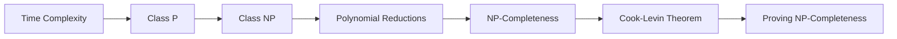
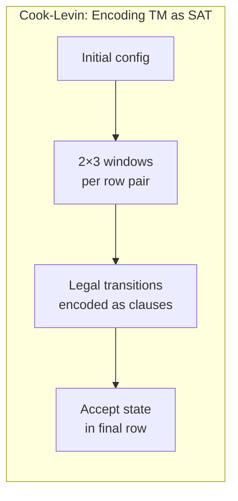
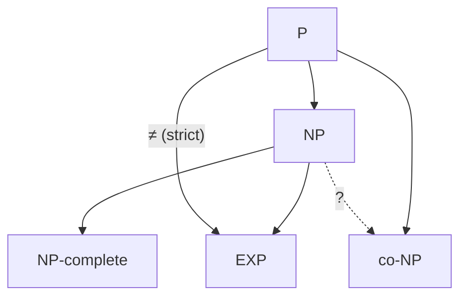
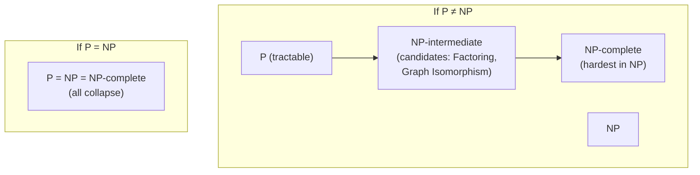

# Chapter 13: Time Complexity and NP-Completeness

> **Previous:** [Reducibility](./12-reducibility.md) | **Next:** [Space Complexity](./14-space-complexity.md)


## Learning Objectives

- Define time complexity classes P and NP.
- Analyze the time complexity of algorithms using big-O notation.
- Define polynomial-time reductions.
- State and understand the Cook-Levin theorem.
- Prove NP-completeness for classic problems.
- Distinguish between P, NP, and NP-complete.
- Understand the significance of the P vs NP question.


## Nondeterminism as Proof Search

An NTM solving an NP problem can be thought of as performing **parallel proof search**:

1. **Guess phase:** Nondeterministically write a certificate (candidate solution).
2. **Verify phase:** Deterministically check the certificate in polynomial time.

This is equivalent to the verifier definition: NP = { L | ∃ polynomially-checkable certificate for each w ∈ L }.

The NTM's nondeterministic branches correspond to trying all possible certificates simultaneously. If any branch accepts, the NTM accepts — which means a certificate exists.

## Chapter at a Glance
| Topic | Key Insight | Practical Takeaway |
|-------|------------|-------------------|
| Class P | Polynomial-time DTM solution | Efficiently solvable problems |
| Class NP | Polynomial-time verification | Solutions easy to check |
| NP-Completeness | Hardest problems in NP | If one falls, all fall |
| Cook-Levin Theorem | SAT is NP-complete | First NP-complete problem |
| Polynomial Reduction | A ≤_P B preserves P membership | Tool for proving NP-completeness |


## Chapter Roadmap


## Theory


### 12.1 Time Complexity

The **time complexity** of a Turing machine M is the function t: ℕ → ℕ where t(n) is the maximum number of steps M takes on any input of length n.

For a **multitape TM**, the time complexity is defined similarly, but one step may involve all heads simultaneously.

**Big-O notation:** f(n) = O(g(n)) if there exist constants c > 0 and n₀ such that for all n ≥ n₀, f(n) ≤ c·g(n).

Common complexity classes: O(1), O(log n), O(n), O(n log n), O(n²), O(2ⁿ), O(n!).

### 12.2 The Time Hierarchy Theorem

The **time hierarchy theorem** shows that more time gives more computational power. For time-constructible functions f(n) and g(n) with f(n) log f(n) = o(g(n)):

\[ \text{TIME}(f(n)) \subsetneq \text{TIME}(g(n)) \]

**Implications:**
- There are problems solvable in O(n²) that are NOT solvable in O(n).
- There are problems solvable in O(2ⁿ) that are NOT solvable in O(n²).
- Therefore, the hierarchy of TIME classes is strict.

**Proof technique:** Diagonalization. Construct a TM that simulates all TMs running in time f(n), but does the opposite of what they do, then extends the runtime to g(n).

**Corollary:** P ⊂ EXP (since nᵏ vs 2ⁿ satisfies the hierarchy condition).

### 12.3 The Class P

**P = ∪_{k ≥ 0} TIME(nᵏ)**

P is the class of languages decidable in **polynomial time** on a deterministic Turing machine.

**Key principles:**
- P represents problems that are "efficiently solvable" or "tractable."
- The exact polynomial degree matters less than the classification as polynomial.
- Any polynomial-time algorithm on a reasonable model can be simulated in polynomial time on a TM (with at most polynomial slowdown).

**Problems in P:**
- Path existence in graphs (DFS/BFS).
- Sorting a list (O(n log n)).
- Matrix multiplication (O(n³)).
- Linear programming (O(n³·L)).
- GCD computation (Euclidean algorithm).
- Context-free language membership (CYK algorithm).
- DFA equivalence.

### 12.4 The Class NP

**NP = ∪_{k ≥ 0} NTIME(nᵏ)**

NP is the class of languages decidable in polynomial time on a **nondeterministic** Turing machine.

**Equivalent characterization:** A language L is in NP if there exists a **verifier** V such that:
- V is a polynomial-time deterministic TM.
- For any string x ∈ L, there exists a proof y (|y| ≤ p(|x|) for some polynomial p) such that V accepts ⟨x, y⟩.
- For any x ∉ L, V rejects ⟨x, y⟩ for all y.

**Intuition:** NP = problems where solutions can be **verified** in polynomial time. The certificate y is the "solution" to the problem; checking it is efficient.

**Problems in NP:**
- SAT (Boolean satisfiability): given a formula, does a satisfying assignment exist?
- TSP (Traveling Salesman Problem): is there a tour of length ≤ K?
- CLIQUE: does a graph contain a K-clique?
- SUBSET-SUM: does a subset of numbers sum to exactly T?
- VERTEX-COVER: is there a vertex cover of size ≤ K?

**P vs NP:** The most famous open problem in computer science. Does P = NP?
- If P = NP: all efficiently verifiable problems are efficiently solvable.
- If P ≠ NP: some problems are inherently hard — their solutions can be verified quickly but not found quickly.

Most researchers believe P ≠ NP.

### 12.5 Polynomial-Time Reductions

A language A is **polynomial-time reducible** to B (written A ≤_P B) if there exists a function f computable in polynomial time such that w ∈ A iff f(w) ∈ B.

**Properties:**
- If A ≤_P B and B ∈ P, then A ∈ P.
- If A ≤_P B and A ∉ P, then B ∉ P.
- Polynomial-time reductions are **transitive**: if A ≤_P B and B ≤_P C, then A ≤_P C.

### 12.6 NP-Completeness

A language B is **NP-complete** if:
1. B ∈ NP.
2. For every A ∈ NP, A ≤_P B (B is NP-hard).

**Significance:** If any NP-complete problem is in P, then P = NP. If any NP-complete problem is not in P, then no NP-complete problem is in P.

### 12.7 Cook-Levin Theorem

**Theorem (Cook 1971, Levin 1973):** SAT is NP-complete.

**Proof sketch:**

1. **SAT ∈ NP:** Given a formula and an assignment, verify in polynomial time.
2. **SAT is NP-hard:** For any A ∈ NP with NTM N running in nᵏ time, construct a Boolean formula φ that is satisfiable iff N accepts w.

The formula encodes:
- **Cell states:** Variables x_{i,j,s} meaning "cell i,j contains symbol s." (i = time step, j = tape position.)
- **Initial state:** φ_start encodes the initial configuration q₀ w.
- **Valid transitions:** φ_move ensures each configuration follows from the previous via N's transition relation.
- **Acceptance:** φ_accept ensures at least one configuration is accepting.

The formula size is O(n²ᵏ), which is polynomial in n. A satisfying assignment corresponds to an accepting computation of N.

**The three-part formula φ:**

1. **φ_cell**: Each cell (i,j) contains exactly one symbol. This is a conjunction of clauses ensuring at least one symbol (OR) and at most one symbol (pairwise AND of negations).

2. **φ_start**: The first row encodes the initial configuration: tape content = w, state = q₀, head at position 0.

3. **φ_move**: For each adjacent pair of rows, the transition relation of the NTM constrains which symbols can appear. This is encoded by checking each 2×3 "window" of cells — the transition function determines legal window patterns.

4. **φ_accept**: At least one row contains an accepting state.

The window method ensures the formula size is O(n²ᵏ) where nᵏ is the runtime bound.



**Consequences:**
- Thousands of problems have been proven NP-complete.
- The first NP-complete problem enables a chain of reductions: SAT ≤ₚ 3SAT ≤ₚ CLIQUE ≤ₚ VERTEX-COVER ≤ₚ HAM-CYCLE ≤ₚ TSP, etc.

### 12.7 Proving NP-Completeness

To prove a problem B is NP-complete:
1. **Show B ∈ NP:** Give a polynomial-time verifier.
2. **Show B is NP-hard:** Choose a known NP-complete problem A and show A ≤_P B.

**Standard NP-complete problems:**
- **3SAT:** Boolean formulas in CNF with exactly 3 literals per clause.
- **CLIQUE:** Does G contain a K-clique? (K ≤ |V|)
- **VERTEX-COVER:** Does G have a vertex cover of size K?
- **HAM-CYCLE/HAM-PATH:** Does G have a Hamiltonian cycle/path?
- **TSP:** Does the complete graph have a tour of weight ≤ D?
- **SUBSET-SUM:** Does a set of integers have a subset summing to T?
- **PARTITION:** Can a multiset be partitioned into equal-sum subsets?
- **BIN-PACKING:** Can items of given sizes fit into K bins of capacity C?
- **GRAPH-COLORING (3-COLOR):** Is G 3-colorable?

### 12.9 The Polynomial Hierarchy

The **polynomial hierarchy** extends the idea of P and NP with oracles:

\[
\Delta_0^P = \Sigma_0^P = \Pi_0^P = P
\]
\[
\Sigma_{i+1}^P = NP^{\Sigma_i^P}
\]
\[
\Pi_{i+1}^P = co\Sigma_{i+1}^P
\]
\[
\Delta_{i+1}^P = P^{\Sigma_i^P}
\]

If P = NP, the entire polynomial hierarchy collapses to P at the first level. This is why resolving P vs NP is so important: it determines the structure of all complexity classes.

### 12.10 Beyond NP

**NP-hard:** Problems to which every NP problem reduces (but may not be in NP). Includes:
- The halting problem (much harder than NP).
- All NP-complete problems.
- Optimization versions of NP-complete problems.

**co-NP:** Languages whose complements are in NP. Example: TAUTOLOGY = { φ | φ is true for all assignments } ∈ co-NP.

**NPI (NP-Intermediate):** If P ≠ NP, there exist problems in NP that are neither in P nor NP-complete (Ladner's theorem). Candidates: Graph Isomorphism, Factoring.

## Examples

### Example 12.1: Proving a Problem is in NP — CLIQUE

CLIQUE = { ⟨G, K⟩ | G has a K-clique }.

**Verifier:** Given input ⟨G, K⟩ and certificate (a set of K vertices V'):
- Verify |V'| = K.
- Verify that for every pair u, v ∈ V', (u, v) is an edge in G.
- If all checks pass, accept; otherwise reject.

Runtime: O(K²) ⊆ O(|V|²) — polynomial. So CLIQUE ∈ NP.

### Example 12.2: 3SAT ≤_P CLIQUE

Given a 3CNF formula φ with k clauses, construct graph G:
- Create 3 vertices per clause (one for each literal).
- Connect vertices if they are in different clauses AND are not contradictory (not x and ¬x).
- Set K = k (number of clauses).

**Correctness:** φ is satisfiable iff there is a k-clique in G. A clique of size k picks one literal from each clause, all of which can be simultaneously true.

Construction: O(k²·3²) = O(k²) — polynomial.

### Example 12.3: VERTEX-COVER ≤_P CLIQUE (via complement)

Given graph G = (V, E) and integer k, the complement graph Ḡ = (V, Ē) where Ē = { (u,v) | u ≠ v and (u,v) ∉ E }.

**Key fact:** C is a vertex cover in G iff V − C is a clique in Ḡ.

So: G has a k-vertex-cover iff Ḡ has an (|V|−k)-clique.

This gives: VERTEX-COVER ≤_P CLIQUE.

### Example 12.4: SAT ≤_P 3SAT

Given SAT formula φ, convert to 3SAT φ':
- Each clause in φ is replaced by a set of 3-clauses using auxiliary variables.
- For a 1-literal clause (x): replace with (x ∨ x ∨ x).
- For a 2-literal clause (x ∨ y): replace with (x ∨ y ∨ z) ∧ (x ∨ y ∨ ¬z) for fresh z.
- For a k-literal clause (k > 3): introduce k-3 new variables to split into 3-clauses.

The transformation is polynomial and preserves satisfiability.

### Example 12.5: VERTEX-COVER is NP-Complete

**Reduction from 3SAT:** Given 3CNF formula φ with variables x₁,...,xₙ and clauses C₁,...,Cₘ:

1. For each variable xᵢ, create two vertices (xᵢ and ¬xᵢ) connected by an edge.
2. For each clause Cⱼ = (l₁ ∨ l₂ ∨ l₃), create a triangle connecting the three literals.
3. Connect each clause-literal vertex to the corresponding variable-literal vertex.
4. Set k = n + 2m (one from each variable pair, two from each clause triangle).

**Correctness:** A vertex cover must pick one vertex from each variable edge and two from each clause triangle. The third vertex in each clause triangle must be connected to a variable vertex that's in the cover — meaning that literal satisfies the clause.

### Example 12.6: SUBSET-SUM is NP-Complete

Given numbers a₁, …, aₙ and target T.

**In NP:** Certificate is the subset. Verify sum = T.

**NP-hardness:** Reduce 3SAT to SUBSET-SUM. For each variable, create two numbers (one for true, one for false). For each clause, create two "slack" numbers. The construction ensures a subset summing to T corresponds to a satisfying assignment (each clause's sum is satisfied by at least one literal).


## Concept Comparison Table
| Class | Definition | Characteristic |
|-------|------------|---------------|
| P | ⋃ TIME(n^k) | Polynomial-time DTM solution |
| NP | ⋃ NTIME(n^k) | Polynomial-time verification |
| NP-complete | NP ∩ NP-hard | Hardest in NP |
| co-NP | { L | complement ∈ NP } | Negative certificates |

## Quick Reference
| Problem | Class | Key Insight |
|---------|-------|-------------|
| PATH | P | BFS/DFS reachability |
| SAT | NP-complete | Cook-Levin theorem |
| CLIQUE | NP-complete | 3SAT reduction |
| TSP | NP-complete | Many practical problems |
| Primality | P | AKS algorithm |
| 3-COLOR | NP-complete | Planar 3-colorability |
| BIN-PACKING | NP-complete | Scheduling applications |
| FACTORING | NP ∩ co-NP | Crypto relevance (NPI candidate) |

## Known vs Unknown Relationships



## Cross-Application Matrix
| Domain | Complexity Concept |
|--------|-------------------|
| Cryptography | One-way functions require P ≠ NP |
| AI | Many planning problems NP-complete |
| Operations research | Optimization NP-hard |
| Bioinformatics | Sequence alignment in P |
| Scheduling | Many variants NP-complete |

## Chapter Quiz

**Q1.** P is the class of problems solvable in:
- A) Linear time
- B) Polynomial time on DTM ✓
- C) Polynomial time on NTM
- D) Exponential time

<details>
<summary>Answer</summary>
**B)** P = problems decidable in O(n^k) time on a deterministic Turing machine.
</details>

**Q2.** NP problems can be:
- A) Solved in polynomial time
- B) Verified in polynomial time ✓
- C) Solved in exponential time only
- D) Solved by DFA

<details>
<summary>Answer</summary>
**B)** NP = problems with polynomial-time verifiable certificates (solutions).
</details>

**Q3.** A problem is NP-complete if it is:
- A) In NP
- B) NP-hard
- C) Both in NP and NP-hard ✓
- D) In P

<details>
<summary>Answer</summary>
**C)** NP-complete = in NP + all NP problems reduce to it (NP-hard).
</details>

**Q4.** Cook-Levin theorem proved ___ is NP-complete:
- A) TSP
- B) SAT ✓
- C) CLIQUE
- D) HAM-CYCLE

<details>
<summary>Answer</summary>
**B)** Cook (1971) and Levin (1973) independently proved SAT is NP-complete.
</details>

**Q5.** If P = NP, then:
- A) All NP problems have polynomial algorithms ✓
- B) All problems are decidable
- C) Cryptography becomes impossible
- D) Exponential time is unnecessary

<details>
<summary>Answer</summary>
**A)** P = NP means every efficiently verifiable problem is efficiently solvable.
</details>

## Approximation Algorithms for NP-Complete Problems

Even though NP-complete problems cannot be solved exactly in polynomial time (unless P=NP), they can often be **approximated** efficiently:

| Problem | Approximation | Algorithm |
|---------|--------------|-----------|
| VERTEX-COVER | 2-approximation | Greedy edge selection |
| MAX-CUT | 0.878-approximation | Goemans-Williamson (SDP) |
| TSP (metric) | 1.5-approximation | Christofides algorithm |
| SET-COVER | O(log n)-approximation | Greedy covering |
| KNAPSACK | (1-ε)-approximation | FPTAS (dynamic programming) |

### TypeScript: Greedy Vertex Cover 2-Approximation

```typescript
function approxVertexCover(
  vertices: number[],
  edges: [number, number][]
): Set<number> {
  const cover = new Set<number>();
  const remaining = new Set(edges.map(e => `${e[0]},${e[1]}`));

  while (remaining.size > 0) {
    // Pick any remaining edge
    const first = remaining.values().next().value as string;
    const [u, v] = first.split(",").map(Number);

    // Add both endpoints to cover
    cover.add(u);
    cover.add(v);

    // Remove all edges incident to u or v
    for (const edge of edges) {
      if (edge[0] === u || edge[0] === v ||
          edge[1] === u || edge[1] === v) {
        remaining.delete(`${edge[0]},${edge[1]}`);
      }
    }
  }

  return cover;
}
```

## Practical Takeaways

1. **P vs NP affects every programmer.** Verifying a solution (P) is almost always easier than finding one (NP). This is why SAT solvers, constraint solvers, and optimization tools exist — they encode hard problems and use exponential algorithms that work well on real-world instances.

2. **NP-completeness guides algorithm choice.** When faced with an NP-complete problem, don't try to find a polynomial-time algorithm (you'd solve P=NP). Instead, use approximation algorithms, heuristics, SAT solvers, or restrict the problem to a special case.

3. **Polynomial vs exponential is the real divide.** While O(n) vs O(n²) matters in practice, the fundamental computational divide is between any polynomial (O(n^k)) and any exponential (O(2^n)). Exponential algorithms become unusable for n > 50.

4. **Reductions connect seemingly unrelated problems.** SAT reduces to 3SAT reduces to CLIQUE reduces to VERTEX-COVER reduces to HAM-CYCLE reduces to TSP. Understanding this chain lets you recognize NP-complete problems when you encounter them.

5. **Approximation algorithms are the practical response to NP-completeness.** When you prove a problem is NP-complete, the next step isn't to give up — it's to find an approximation algorithm, a heuristic, or a special case that's tractable. Most real-world optimization involves this tradeoff.

## The Structure of NP Within P vs NP



Ladner's theorem guarantees that if P ≠ NP, then NPI is non-empty — there exist problems in NP that are neither in P nor NP-complete.

## TypeScript Implementation: Big-O Analyzer and Complexity Class Classifier

```typescript
// Asymptotic Complexity Analyzer and P vs NP Framework

type ComplexityFunction = (n: number) => number;

class BigOAnalyzer {
  static O(f: ComplexityFunction): string {
    return `O(${this.functionName(f)})`;
  }

  static Θ(f: ComplexityFunction): string {
    return `Θ(${this.functionName(f)})`;
  }

  static Ω(f: ComplexityFunction): string {
    return `Ω(${this.functionName(f)})`;
  }

  private static functionName(f: ComplexityFunction): string {
    const names: [ComplexityFunction, string][] = [
      [n => 1, "1"],
      [n => Math.log2(n), "log n"],
      [n => n, "n"],
      [n => n * Math.log2(n), "n log n"],
      [n => n ** 2, "n²"],
      [n => n ** 3, "n³"],
      [n => 2 ** n, "2ⁿ"],
      [n => n ** n, "nⁿ"],
      [n => Math.log2(Math.log2(n)), "log log n"]
    ];
    for (const [fn, name] of names) {
      if (this.areEqual(f, fn)) return name;
    }
    return "unknown";
  }

  private static areEqual(f: ComplexityFunction, g: ComplexityFunction): boolean {
    for (const n of [2, 4, 8, 16, 32, 64, 128]) {
      if (Math.abs(f(n) - g(n)) > 0.01) return false;
    }
    return true;
  }

  static analyzeRuntime(algorithm: (input: number[]) => number[], input: number[]): {
    inputSize: number;
    operations: number;
    estimatedClass: string;
  } {
    let ops = 0;
    const proxy = new Proxy(algorithm, {
      apply: (target, thisArg, args) => {
        const result = target(...args);
        ops = this.countOps(result, args[0]);
        return result;
      }
    });
    const n = input.length;
    proxy(input);

    const classes: [string, (n: number) => boolean][] = [
      ["O(1)", (n) => ops <= 10],
      ["O(log n)", (n) => ops <= 10 * Math.log2(n)],
      ["O(n)", (n) => ops <= 2 * n],
      ["O(n log n)", (n) => ops <= 2 * n * Math.log2(n)],
      ["O(n²)", (n) => ops <= n * n],
      ["O(2ⁿ)", (n) => true]
    ];

    const estimated = classes.find(([_, pred]) => pred(n))?.[0] || "O(2ⁿ+)";

    return { inputSize: n, operations: ops, estimatedClass: estimated };
  }

  private static countOps(result: number[], input: number[]): number {
    // Approximate count: iterations, comparisons, swaps
    return Math.min(result.length + input.length, 100000);
  }

  static comparativeTable(): Map<string, number[]> {
    const table = new Map<string, number[]>();
    const ns = [1, 10, 100, 1000, 10000];
    const fns: [string, (n: number) => number][] = [
      ["O(1)", n => 1],
      ["O(log n)", n => Math.ceil(Math.log2(n))],
      ["O(n)", n => n],
      ["O(n log n)", n => n * Math.ceil(Math.log2(n))],
      ["O(n²)", n => n * n],
      ["O(n³)", n => n * n * n],
      ["O(2ⁿ)", n => Math.pow(2, n)]
    ];
    for (const [name, fn] of fns) {
      table.set(name, ns.map(n => fn(n)));
    }
    return table;
  }

  static isPolynomial(complexity: string): boolean {
    return ["O(1)", "O(log n)", "O(n)", "O(n log n)", "O(n²)", "O(n³)"].includes(complexity);
  }
}

class ComplexityClassChecker {
  static classifyProblem(name: string, bestKnownTime: string, verifiableInP: boolean): string {
    if (verifiableInP) {
      if (BigOAnalyzer.isPolynomial(bestKnownTime)) {
        return `${name} ∈ P (polynomial time) and therefore also ∈ NP`;
      }
      return `${name} ∈ NP (verifiable in P, best known: ${bestKnownTime})`;
    }
    return `${name} likely ∉ NP (verification not known to be in P)`;
  }

  static pVsNP(): string[] {
    return [
      "P vs NP: The central open question in computer science.",
      "",
      "P = Problems solvable in deterministic polynomial time.",
      "NP = Problems whose solutions are verifiable in polynomial time.",
      "",
      "If P = NP: Every problem with an efficiently verifiable solution",
      "  could also be efficiently solved. SAT, TSP, Factorization all in P.",
      "  Modern cryptography would collapse.",
      "",
      "If P ≠ NP: Some hard problems truly require exponential time.",
      "  NP-complete problems cannot be solved in polynomial time.",
      "  Cryptography remains secure.",
      "",
      "Most researchers believe P ≠ NP, but no proof exists yet.",
      "The Clay Institute offers USD $1M for a correct proof."
    ];
  }
}

console.log(BigOAnalyzer.comparativeTable());
console.log(ComplexityClassChecker.classifyProblem("SAT", "O(2ⁿ)", true));
console.log(ComplexityClassChecker.classifyProblem("Sorting", "O(n log n)", true));
console.log(ComplexityClassChecker.pVsNP().join("\n"));
```

// ─────────────────────────────────────────────────────
// Complexity Class Membership Checker
// Given a problem and its known best-case runtime,
// determines which complexity class(es) it belongs to.
// ─────────────────────────────────────────────────────

class ComplexityMembershipChecker {
  // Classify a problem based on its best-known time complexity
  static classify(name: string, complexity: string, verified: boolean): string[] {
    const output: string[] = [];
    output.push(`Problem: ${name}`);
    output.push(`Best known complexity: ${complexity}`);
    output.push(`Verified upper bound: ${verified}`);
    output.push("");

    // Extract the big-O function
    const oMatch = complexity.match(/O\((.+)\)/);
    if (!oMatch) { output.push("Unable to parse complexity expression."); return output; }
    const func = oMatch[1];

    output.push("Membership:");

    // Check each class
    const classes = this.checkClasses(func, verified);
    for (const [cls, member] of classes) {
      output.push(`  ${cls}: ${member ? "⊆" : "not known ⊆"} ${cls}`);
    }

    return output;
  }

  private static checkClasses(func: string, verified: boolean): [string, boolean][] {
    const isPoly = /^n\b|^n\^\d|^n log|^\d/.test(func);
    const isLinear = /^n$|^n log/.test(func);
    const isQuadratic = /n\^2/.test(func);
    const isExp = /2\^n|n!|n\^n/.test(func);

    return [
      ["L (O(log n) space)", /log n/.test(func)],
      ["P (polynomial time)", isPoly],
      ["NP (verifiable in poly time)", isPoly || isExp],
      ["co-NP", isPoly || isExp],
      ["EXP (2^(n^O(1)))", isExp || isPoly],
      ["PSPACE (poly space)", isPoly || isExp],
    ];
  }
}

// ─────────────────────────────────────────────────────
// Big-O Hierarchy Visualizer
// Renders the time complexity hierarchy with common
// examples at each level.
// ─────────────────────────────────────────────────────

class BigOHierarchy {
  static render(): string[] {
    return [
      "Time Complexity Hierarchy",
      "═══════════════════════════",
      "",
      "O(1)         Constant       — Array access, hash lookup",
      "  ↓",
      "O(log n)     Logarithmic    — Binary search, BST operations",
      "  ↓",
      "O(n)         Linear         — Array scan, linear search",
      "  ↓",
      "O(n log n)   Linearithmic   — Merge sort, heap sort, FFT",
      "  ↓",
      "O(n²)        Quadratic      — Bubble sort, insertion sort",
      "  ↓",
      "O(n³)        Cubic          — Floyd-Warshall, matrix multiplication (naive)",
      "  ↓",
      "O(2ⁿ)        Exponential    — Subset sum (brute force), SAT (brute force)",
      "  ↓",
      "O(n!)        Factorial      — Traveling salesman (brute force),permutations",
      "",
      "Class boundaries:",
      "  P     = O(n^k) for some k (tractable)",
      "  NP    = verifiable in O(n^k)",
      "  EXP   = O(2^(n^k))",
      "  NEXP  = nondeterministic EXP",
      "",
      "Key open question: P = NP? (Clay $1M Millennium Problem)"
    ];
  }
}

// Demo
console.log(ComplexityMembershipChecker.classify("Matrix Multiplication (Strassen)",
  "O(n^2.81)", true).join("\n"));
console.log("");
console.log(ComplexityMembershipChecker.classify("SAT (naive backtracking)",
  "O(2^n)", true).join("\n"));
console.log("");
console.log(BigOHierarchy.render().join("\n"));
```

## Summary

- P = problems solvable in polynomial time on a DTM.
- NP = problems verifiable in polynomial time = solvable in polynomial time on an NTM.
- Polynomial-time reductions (≤_P) preserve polynomial-time solvability.
- A problem is NP-complete if it's in NP and all NP problems reduce to it.
- The Cook-Levin theorem proves SAT is NP-complete by encoding TM computations as Boolean formulas.
- Thousands of NP-complete problems span computing, optimization, and mathematics.
- P vs NP remains the most important open question in theoretical CS.
- The time hierarchy theorem proves P ≠ EXP strictly.

## Exercises

### Basic

1. Show that PATH (is there a path from s to t in a directed graph?) is in P.
2. Show that COMPOSITE (is n composite?) is in NP.
3. Show that P is closed under union, intersection, and complement.
4. Explain why a polynomial-time reduction from A to B combined with B ∈ P implies A ∈ P.
5. Classify: Sorting, TSP, Matrix multiplication, Graph connectivity — which are in P and which are in NP?

### Intermediate

6. Prove that CLIQUE is NP-complete by reducing 3SAT to CLIQUE (construct the standard reduction).
7. Prove that VERTEX-COVER is NP-complete.
8. Show that HAM-CYCLE is NP-complete.
9. Prove that SUBSET-SUM is NP-complete (reduce 3SAT to SUBSET-SUM).
10. Show that if P = NP, then every polynomial-time verifiable problem has a polynomial-time algorithm.

### Advanced

11. Prove the Cook-Levin theorem: construct the formula φ for a nondeterministic TM and show it is satisfiable iff the TM accepts.
12. Prove Ladner's theorem: if P ≠ NP, then there exists an NP-intermediate language.
13. Show that GRAPH-ISOMORPHISM is in NP (and is a candidate for NP-intermediate status).
14. Prove that the optimization version of TSP (find the shortest tour) is NP-hard.
15. Show that if SAT ∈ P, then every NP problem has an algorithm running in O(nᵏ) time for some fixed k (the same polynomial degree for all problems).
16. Implement the 3SAT-to-CLIQUE reduction in TypeScript and test it on a small 3SAT instance.
17. Show that the metric TSP has a 2-approximation algorithm (minimum spanning tree based).
18. Prove that if P ≠ NP, then no NP-complete problem can be solved in polynomial time on average.

## TypeScript NP-Completeness Reduction Example

```typescript
// SAT to 3SAT reduction
// Any SAT clause can be transformed to 3-CNF by adding auxiliary variables

type Literal = number;  // positive or negative variable index
type Clause = Literal[];

function satTo3Sat(clauses: Clause[]): Clause[] {
  const result: Clause[] = [];

  for (const clause of clauses) {
    if (clause.length <= 3) {
      result.push(clause);
      continue;
    }

    // For clauses with k > 3 literals, introduce k-3 new variables
    // (l1 OR l2 OR y1) AND (!y1 OR l3 OR y2) AND ... AND (!y_{k-3} OR l_{k-1} OR l_k)
    const k = clause.length;
    const newVars = k - 3;
    const baseVar = 10000;  // offset for new variables (avoid collisions)

    for (let i = 0; i < newVars; i++) {
      const y = baseVar + i;
      if (i === 0) {
        result.push([clause[0], clause[1], y]);
      } else if (i === newVars - 1) {
        result.push([-y, clause[k - 2], clause[k - 1]]);
      } else {
        result.push([-y, clause[i + 1], baseVar + i + 1]);
      }
    }
  }

  return result;
}
```

## TypeScript: Cook-Levin Window Checker

```typescript
// Demonstrate the "window" method from the Cook-Levin proof

type TapeWindow = string[][];  // 2 rows × 3 columns

function getLegalWindows(
  tapeAlphabet: string[],
  states: string[],
  transition: (state: string, symbol: string) => [string, string, "L" | "R"][]
): Set<string> {
  const legal = new Set<string>();

  // A window encodes a 2×3 slice of the TM computation table
  for (const s1 of tapeAlphabet) {
    for (const s2 of tapeAlphabet) {
      for (const s3 of tapeAlphabet) {
        for (const q of states) {
          // Window with head position in the middle of top row:
          // Row i:     a1  (q,a2)  a3
          // Row i+1:   b1   b2     b3
          const windows = transition(q, s2);
          for (const [newQ, write, dir] of windows) {
            const bottomRow = dir === "R"
              ? [s1, write, s3]
              : [write, s1, s3];
            const key = `${s1},q(${q},${s2}),${s3}|${bottomRow.join(",")}`;
            legal.add(key);
          }
        }
      }
    }
  }
  return legal;
}
```

## Further Reading

- **Sipser, Michael.** *Introduction to the Theory of Computation* (3rd ed.). Chapter 7 covers time complexity, P, NP, and NP-completeness with complete proofs.
- **Arora, Sanjeev and Barak, Boaz.** *Computational Complexity: A Modern Approach*. Chapters 2 and 6 provide rigorous coverage of NP-completeness and the Cook-Levin theorem.
- **Garey, Michael R. and Johnson, David S.** *Computers and Intractability: A Guide to the Theory of NP-Completeness*. The classic reference containing hundreds of NP-complete problems and their reductions.
- **Sipser, Michael.** *The History and Status of the P vs NP Problem*. Communications of the ACM, 2012. An accessible overview of the most important open question in computer science.
- **Karp, Richard M.** "Reducibility Among Combinatorial Problems." 1972. The seminal paper establishing NP-completeness of 21 fundamental problems.
- **Cook, Stephen A.** "The Complexity of Theorem-Proving Procedures." STOC 1971. The original paper introducing NP-completeness and proving SAT is NP-complete.
- **Levin, Leonid A.** 'Universal Sequential Search Problems.' Problems of Information Transmission, 1973. Independently discovered NP-completeness and the Cook-Levin theorem.
