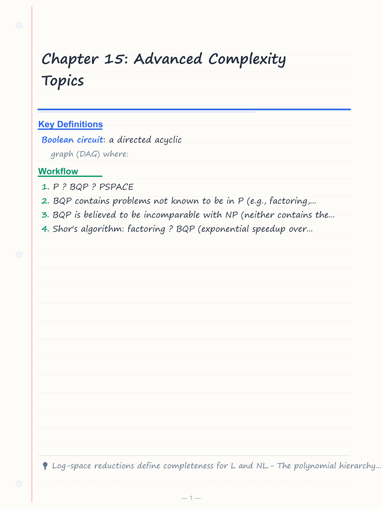
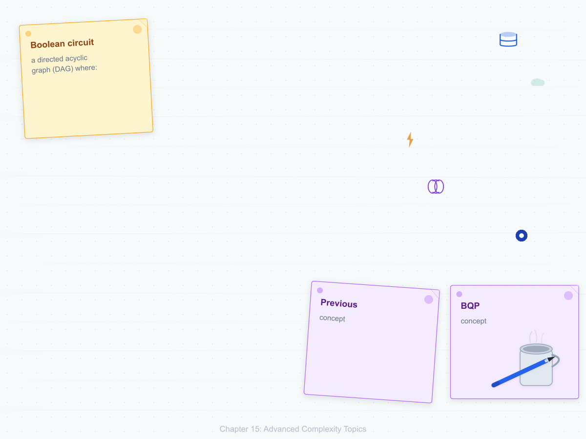
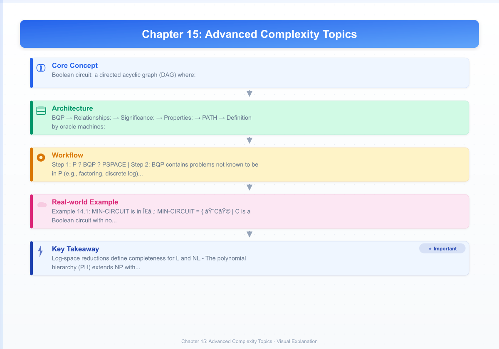
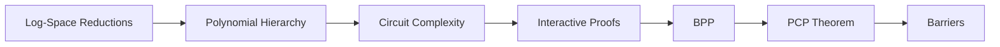

# Chapter 15: Advanced Complexity Topics

> **Previous:** [Space Complexity](./14-space-complexity.md) | **Next:** [Applications of Automata Theory](./16-applications.md)


## Learning Objectives

- Define and understand the classes L and NL in depth.
- Understand the polynomial hierarchy and its relationship to P and NP.
- Analyze the relationship between co-NP and NP.
- Understand Boolean circuit complexity.
- Recognize the importance of circuit lower bounds.
- Understand the concept of natural proofs and barriers.
- Explore interactive proofs and the class IP.

<!-- Image Gallery -->
<section class="lesson-visuals" aria-label="Visual learning resources">
  <header><span>VISUAL LEARNING</span><h2>See it. Review it. Remember it.</h2></header>
  <a class="lesson-visual-card" href="../../assets/images/lessons/theory-of-computation/15-advanced-complexity/handwritten-notes.png" target="_blank" rel="noopener">
    
    <span><strong>Handwritten notes</strong>Condensed notes for deliberate review.</span>
  </a>
  <a class="lesson-visual-card" href="../../assets/images/lessons/theory-of-computation/15-advanced-complexity/sticky-notes.png" target="_blank" rel="noopener">
    
    <span><strong>Sticky-note revision</strong>Fast recall prompts for revision.</span>
  </a>
  <a class="lesson-visual-card" href="../../assets/images/lessons/theory-of-computation/15-advanced-complexity/visual-explanation.png" target="_blank" rel="noopener">
    
    <span><strong>Visual concept guide</strong>A connected explanation of the key ideas.</span>
  </a>
</section>
<!-- End Image Gallery -->


## Chapter at a Glance
| Topic | Key Insight | Practical Takeaway |
|-------|------------|-------------------|
| Polynomial Hierarchy | Alternating quantifier classes | Beyond NP and co-NP |
| Circuit Complexity | Size/depth of Boolean circuits | Non-uniform computation model |
| Interactive Proofs | IP = PSPACE | Verifier convinced by powerful prover |
| PCP Theorem | NP = PCP(log n, 1) | Probabilistic verification of proofs |
| Barriers | Relativization, natural proofs | Why P ? NP is hard to prove |


## Chapter Roadmap


## Theory


### 14.1 The BQP Complexity Class


**BQP** (Bounded-error Quantum Polynomial Time) is the class of problems solvable by a quantum computer in polynomial time with error probability = 1/3.

**Relationships:**
- P ? BQP ? PSPACE
- BQP contains problems not known to be in P (e.g., factoring, discrete log)
- BQP is believed to be incomparable with NP (neither contains the other)
- Shor's algorithm: factoring ? BQP (exponential speedup over classical)
- Grover's algorithm: unstructured search ? BQP (quadratic speedup)

**Significance:** If BQP ? NP, then quantum computers can efficiently solve problems whose solutions cannot even be verified classically — a profound expansion of tractable computation.

### 14.3 Log-Space Reductions and Completeness


A **log-space reduction** (A =_L B) is a reduction computable in O(log n) space (on a TM with read-only input and write-only output).

**Properties:**
- =_L is transitive.
- If A =_L B and B ? L, then A ? L.
- NL-completeness is defined using =_L reductions (not =_P).

**PATH** is NL-complete under log-space reductions.

### 14.4 The Polynomial Hierarchy (PH)


The polynomial hierarchy extends the concepts of P, NP, and co-NP using **oracle machines** with alternating quantifiers.

**Definition by oracle machines:**
- Σ₀ = Π₀ = Δ₀ = P
- Σ₁ = NP
- Π₁ = co-NP
- For i ≥ 1: Σ_{i+1} = NP^{Σ_i} (NP with oracle for Σ_i)
- Π_{i+1} = co-Σ_{i+1}
- Δ_{i+1} = P^{Σ_i}

**Definition by quantifiers:**
- Σᵢ: problems of the form { x | ∃y₁ ∀y₂ ∃y₃ … Qᵢyᵢ R(x, y₁, …, yᵢ) }
  where Qᵢ = ∃ if i is odd, ∀ if i is even.
- Πᵢ: same but starting with ∀.
- Each yⱼ has length polynomial in |x|.
- R is a polynomial-time computable predicate.

**Properties:**
- PH = ∪_{i ≥ 0} Σ_i = ∪_{i ≥ 0} Π_i
- If Σ_i = Π_i for any i, then PH collapses to Σ_i.
- If P = NP, then PH collapses to P.
- If PH collapses, it's considered evidence against the equality.

**Problems in higher levels:**
- MIN-CIRCUIT (is a given Boolean circuit minimal?) ∈ Σ₂.
- SAT ∈ Σ₁ = NP.
- UNSAT ∈ Π₁ = co-NP.

### 14.5 co-NP


**co-NP** = { L | L̅ ∈ NP }.

A problem is in co-NP if "no" instances have short proofs (certificates for rejection).

**Example: TAUTOLOGY** = { φ | φ is true for all assignments } ∈ co-NP.
- A "no" instance has a certificate: a satisfying assignment for ¬φ.
- But a "yes" instance (a tautology) has no obvious short proof.

**Relationship:**
- NP ≠ co-NP is believed but not proven.
- If NP ≠ co-NP, then P ≠ NP.
- For the complement of an NP-complete problem, we don't expect short proofs.

### 14.6 Circuit Complexity


A **Boolean circuit** is a directed acyclic graph (DAG) where:
- Leaves = input variables (x₁, …, xₙ).
- Internal nodes = logic gates (AND, OR, NOT).
- One root = output.

**Circuit parameters:**
- **Size:** Number of gates (analogous to time).
- **Depth:** Length of longest path from input to output (analogous to parallel time).

**P/poly:** Languages decidable by polynomial-size Boolean circuits (non-uniform model).
- P ⊆ P/poly (any polynomial-time TM can be simulated by polynomial-size circuits).
- There exist undecidable languages in P/poly (since circuits can encode arbitrary finite information).
- **Karp-Lipton theorem:** If NP ⊆ P/poly, then PH collapses to Σ₂.

**Circuit lower bounds:**
Proving that certain functions require large circuits is notoriously difficult.
- NEXP ⊂ P/poly is known (there exist problems requiring exponential-size circuits).
- But we cannot prove that SAT requires super-polynomial circuits (this would imply P ≠ NP).
- **Natural proofs barrier** (Razborov-Rudich): any circuit lower bound proof that is "natural" would also prove that certain cryptographic primitives don't exist, suggesting that standard proof techniques are insufficient.

**NC (Nick's Class):** Problems solvable by circuits with polynomial size and polylogarithmic depth.
- NC ⊆ P (NC represents efficient parallel computation).
- P-complete problems (like CIRCUIT-VALUE) are those not believed to be in NC.

### 14.7 Interactive Proofs (IP)


An **interactive proof system** consists of a prover (P, unbounded computational power) and a verifier (V, probabilistic polynomial time). V exchanges messages with P and decides whether to accept the input.

**Class IP:** Languages with interactive proof systems.

**Important results:**
- **IP = PSPACE** (Shamir's theorem, 1990). This is a landmark result showing that interactive proofs are enormously powerful → equivalent to polynomial space.
- co-NP ⊆ IP (since co-NP ⊆ PSPACE = IP). This means tautologies have interactive proofs.
- **Graph Non-Isomorphism** ∈ IP (actually in AM, a related class).

**Significance:** Interactive proofs show that a computationally bounded verifier can be convinced of the truth of statements far beyond what they could verify deterministically → if interaction and randomization are allowed.

### 14.8 Probabilistic Complexity (BPP)


**BPP** (Bounded-error Probabilistic Polynomial time): Languages decidable by a probabilistic TM with error probability ≤ 1/3 on every input.

**Important facts:**
- P ⊆ BPP ⊆ PSPACE.
- It's believed that BPP = P (derandomization).
- **Adleman's theorem:** BPP ⊆ P/poly (every BPP language has polynomial-size circuits).
- **Sipser-Gács theorem:** BPP ⊆ Σ₂ ∩ Π₂ (BPP is in the second level of the polynomial hierarchy).

### 14.9 Probabilistically Checkable Proofs (PCP)


**PCP theorem** (Arora, Lund, Motwani, Sudan, Szegedy, 1992):

NP = PCP(log n, 1)

**Interpretation:** Every NP problem has a proof that can be verified by reading only a constant number of bits of the proof, using O(log n) random bits.

**Impact:**
- Revolutionized the study of approximation algorithms.
- Shows that for many NP-hard optimization problems, finding approximate solutions within certain ratios is also NP-hard.
- Used to prove hardness of approximation for MAX-3SAT, MAX-CUT, etc.

### 14.10 The Landscape of Complexity Classes


```
EXPSPACE
    ↑
   PSPACE  = IP
    ↑
   PH (Polynomial Hierarchy)
  /  \
 Σ₂   Π₂
  \  /
   NP    co-NP
  /  \
  NP∩co-NP
   |
   P
  / \
  NC  BPP
 /
L
```

Note: Many containments are not known to be strict.

### 14.11 MA and AM: Merlin-Arthur Games


**MA** (Merlin-Arthur): Languages with a proof system where Merlin (unbounded) sends a single message, and Arthur (BPP verifier) decides.

**AM** (Arthur-Merlin): Languages where Arthur sends random bits first, then Merlin responds.

**Relationships:**
- NP ? MA ? AM ? ?2
- Graph Non-Isomorphism ? AM (but not known to be in NP)
- If co-NP ? AM, then PH collapses
- MA and AM are considered "interactive proof lite" — limited interaction but more than NP

**Significance:** These classes model public-coin proof systems where the verifier only sends random bits. Goldwasser-Sipser showed public-coin = private-coin (IP = AM with poly rounds).

## Examples

### Example 14.1: MIN-CIRCUIT is in Σ₂

MIN-CIRCUIT = { ⟨C⟩ | C is a Boolean circuit with no smaller equivalent circuit }.

To check if C ∈ MIN-CIRCUIT: For every smaller circuit C' (∀), there exists an input x such that C(x) ≠ C'(x). This is ∀∃ = Π₂ formulation.

Or: There exists no smaller equivalent circuit. Actually the logical formulation:
- C is minimal iff ∀C' (|C'| < |C|) ⇒ ∃x (C(x) ≠ C'(x)).
- This is ∀C' ∃x (|C'| < |C| ⇒ C(x) ≠ C'(x)) → a ∀∃ pattern = Π₂.
- Equivalent: the complement (∃C') is in Σ₂.

### Example 14.2: Graph Non-Isomorphism ∈ IP

Given graphs G₁ and G₂, the prover wants to convince the verifier they are not isomorphic.

**Protocol:**
1. Verifier: picks random permutation π, computes H = π(G_b) where b ∈ {1,2} is random.
2. Verifier sends H to prover.
3. Prover: responds with b', claiming H came from G_{b'}.
4. Verifier: accepts if b = b'.

If G₁ ≅ G₂: the prover cannot know b (H could come from either graph), so the prover succeeds with probability ≤ 1/2.
If G₁ ≇ G₂: the prover can determine b (H came from exactly one graph), so the prover always succeeds.

### Example 14.3: BPP = P Under Derandomization Assumptions

If there exist functions with exponential circuit complexity (true under plausible assumptions), then any BPP algorithm can be **derandomized**: replace random bits with the output of a pseudorandom generator that uses only O(log n) truly random bits. This is the core of the hypothesis that BPP = P.

### Example 14.4: PCP and Hardness of Approximation

For MAX-3SAT (find an assignment satisfying the maximum number of clauses):
- The PCP theorem implies: for some ε > 0, it's NP-hard to distinguish satisfiable 3CNF formulas from those where at most (1−ε) fraction of clauses are satisfiable.
- This means approximating MAX-3SAT within a factor of (1−ε) is NP-hard.

### Example 14.5: The Natural Proofs Barrier

Razborov and Rudich showed that any "natural" proof that P ≠ NP (a proof that uses a combinatorial property of Boolean functions that is both constructive and large) would imply that certain cryptographic pseudorandom generators don't exist. Since most experts believe such generators do exist, natural proofs cannot work.

This explains why progress on circuit lower bounds has been slow → the tools that would traditionally work are blocked by this barrier.


## Concept Comparison Table
| Class | Definition | Example |
|-------|------------|---------|
| S1 | NP (? quantifier) | SAT |
| ?1 | co-NP (? quantifier) | TAUTOLOGY |
| S2 | NP^{NP} (??) | MIN-CIRCUIT |
| ?2 | co-NP^{NP} (??) | Complement of MIN-CIRCUIT |

## Quick Reference
| Concept | Definition |
|---------|-----------|
| IP | Interactive proofs = PSPACE |
| PCP | NP = PCP(log n, 1) |
| BPP | Bounded-error probabilistic poly time |
| P/poly | Polynomial-size circuits |
| NC | Poly-size, polylog-depth circuits |

## Cross-Application Matrix
| Domain | Advanced Complexity Concept |
|--------|---------------------------|
| Cryptography | Zero-knowledge proofs (IP) |
| Approximation | PCP ? hardness of approximation |
| Parallel computing | NC = efficient parallel algorithms |
| Circuit design | Circuit lower bounds |
| Quantum computing | BQP and relation to classical classes |

## TypeScript Interactive Proof Protocol Simulator

```typescript
// Simulates an interactive proof protocol for Graph Non-Isomorphism
// Uses a simple graph representation with adjacency matrices

type Graph = number[][];

function generatePermutation(n: number): number[] {
  const perm = Array.from({ length: n }, (_, i) => i);
  // Fisher-Yates shuffle
  for (let i = n - 1; i > 0; i--) {
    const j = Math.floor(Math.random() * (i + 1));
    [perm[i], perm[j]] = [perm[j], perm[i]];
  }
  return perm;
}

function applyPermutation(g: Graph, perm: number[]): Graph {
  const n = g.length;
  const result: Graph = Array.from({ length: n }, () => new Array(n).fill(0));
  for (let i = 0; i < n; i++) {
    for (let j = 0; j < n; j++) {
      result[perm[i]][perm[j]] = g[i][j];
    }
  }
  return result;
}

function areIsomorphic(g1: Graph, g2: Graph): boolean {
  const n = g1.length;
  // Check all permutations (n! — only for small n)
  const allPerms = (arr: number[]): number[][] => {
    if (arr.length <= 1) return [arr];
    const result: number[][] = [];
    for (let i = 0; i < arr.length; i++) {
      const rest = [...arr.slice(0, i), ...arr.slice(i + 1)];
      for (const p of allPerms(rest)) {
        result.push([arr[i], ...p]);
      }
    }
    return result;
  };

  const vertices = Array.from({ length: n }, (_, i) => i);
  for (const perm of allPerms(vertices)) {
    if (JSON.stringify(applyPermutation(g1, perm)) === JSON.stringify(g2)) {
      return true;
    }
  }
  return false;
}

// Interactive proof for non-isomorphism
function interactiveProof(
  g1: Graph,
  g2: Graph,
  proverResponse: (h: Graph) => number
): boolean {
  const verifierBit = Math.random() < 0.5 ? 1 : 2;
  const perm = generatePermutation(g1.length);
  const h = verifierBit === 1
    ? applyPermutation(g1, perm)
    : applyPermutation(g2, perm);

  const proverBit = proverResponse(h);
  return proverBit === verifierBit;
}

// Honest prover (knows the non-isomorphism)
function honestProver(h: Graph, g1: Graph, g2: Graph): number {
  return areIsomorphic(h, g1) ? 1 : 2;
}

// Dishonest prover (guesses randomly)
function dishonestProver(): number {
  return Math.random() < 0.5 ? 1 : 2;
}

// Example
const g1: Graph = [
  [0, 1, 0],
  [1, 0, 1],
  [0, 1, 0],
];

const g2: Graph = [
  [0, 1, 1],
  [1, 0, 0],
  [1, 0, 0],
];

console.log("Non-isomorphic:", !areIsomorphic(g1, g2)); // true (one is a path, the other is a triangle)

// Run protocol 10 times
let successes = 0;
for (let i = 0; i < 10; i++) {
  const hProver = (h: Graph) => honestProver(h, g1, g2);
  if (interactiveProof(g1, g2, hProver)) successes++;
}
console.log(`Honest prover success: ${successes}/10`); // 10/10
```

## TypeScript Circuit Complexity Example

```typescript
// Boolean circuit representation and evaluation
// A circuit is a DAG with gates

type GateType = "AND" | "OR" | "NOT" | "INPUT";

class CircuitGate {
  constructor(
    public id: number,
    public type: GateType,
    public inputs: number[],
    public value?: boolean
  ) {}
}

class BooleanCircuit {
  constructor(
    public output: number,
    public gates: Map<number, CircuitGate>
  ) {}

  evaluate(inputs: boolean[]): boolean {
    const values = new Map<number, boolean>();

    // Set input values (gates 0..n-1 are inputs)
    let inputIdx = 0;
    for (const [id, gate] of this.gates) {
      if (gate.type === "INPUT") {
        values.set(id, inputs[inputIdx++]);
      }
    }

    // Topological evaluation
    const evaluateGate = (id: number): boolean => {
      if (values.has(id)) return values.get(id)!;
      const gate = this.gates.get(id)!;
      const inputVals = gate.inputs.map(evaluateGate);
      let result: boolean;
      switch (gate.type) {
        case "AND": result = inputVals.every(Boolean); break;
        case "OR": result = inputVals.some(Boolean); break;
        case "NOT": result = !inputVals[0]; break;
        default: throw new Error("Unknown gate");
      }
      values.set(id, result);
      return result;
    };

    return evaluateGate(this.output);
  }

  size(): number {
    return this.gates.size;
  }
}

// Example: XOR circuit: (x OR y) AND NOT (x AND y)
const xorCircuit = new BooleanCircuit(5, new Map([
  [0, new CircuitGate(0, "INPUT", [])],
  [1, new CircuitGate(1, "INPUT", [])],
  [2, new CircuitGate(2, "OR", [0, 1])],
  [3, new CircuitGate(3, "AND", [0, 1])],
  [4, new CircuitGate(4, "NOT", [3])],
  [5, new CircuitGate(5, "AND", [2, 4])],
]));

console.log(xorCircuit.evaluate([false, false])); // false
console.log(xorCircuit.evaluate([false, true]));  // true
console.log(xorCircuit.evaluate([true, false]));  // true
console.log(xorCircuit.evaluate([true, true]));   // false
```

## Chapter Quiz

**Q1.** The polynomial hierarchy collapses to P if:
- A) L = NL
- B) P = NP ?
- C) PSPACE = EXPTIME
- D) NP = co-NP

<details>
<summary>Answer&lt;/summary&gt;
**B)** If P = NP, the entire polynomial hierarchy collapses to P.
</details>

**Q2.** Shamir's theorem proved:
- A) P = NP
- B) IP = PSPACE ?
- C) NP = PCP
- D) BPP = P

<details>
<summary>Answer&lt;/summary&gt;
**B)** Interactive proofs characterize PSPACE — a landmark result from 1990.
</details>

**Q3.** The PCP theorem states NP = PCP(log n, ___):
- A) 0
- B) 1 ?
- C) n
- D) log n

<details>
<summary>Answer&lt;/summary&gt;
**B)** NP = PCP(log n, 1) — proofs verifiable with O(log n) random bits and constant queries.
</details>

**Q4.** The natural proofs barrier shows:
- A) P ? NP is proven
- B) Standard proof techniques can't resolve P vs NP ?
- C) Circuit lower bounds are easy
- D) Cryptography is impossible

<details>
<summary>Answer&lt;/summary&gt;
**B)** Razborov-Rudich: any "natural" circuit lower bound proof would imply cryptographic PRGs don't exist.
</details>

**Q5.** BPP represents problems solvable with:
- A) Deterministic algorithms
- B) Probabilistic algorithms with bounded error ?
- C) Nondeterministic algorithms
- D) Quantum algorithms

<details>
<summary>Answer&lt;/summary&gt;
**B)** BPP = probabilistic polynomial time with error = 1/3 on every input.
</details>

## Practical Takeaways

1. **The polynomial hierarchy is deep but mostly unknown.** PH contains problems that are harder than NP but probably not PSPACE-complete. In practice, most problems found in algorithms are in NP, and the real distinction is between P and NP-complete.

2. **Circuit complexity has practical implications.** The P/poly result means that non-uniform computations (circuits) can potentially solve problems that uniform machines cannot. This relates directly to hardware acceleration, FPGAs, and specialized processors.

3. **Interactive proofs connect to zero-knowledge.** The equivalence IP = PSPACE means that any problem solvable with polynomial space can be verified through interaction. Zero-knowledge proofs, used in modern cryptography, are a special case where the prover reveals nothing except the truth of the statement.

4. **The PCP theorem changes approximation.** Before PCP, approximation was heuristic. After PCP, we know that some NP-complete problems have hard thresholds: you can approximate within some factor efficiently, but improving beyond the threshold is NP-hard.

## TypeScript Implementation: P vs NP Framework and NP-Completeness Verifier

```typescript
// Advanced Complexity: Polynomial Hierarchy and Circuit Complexity

type ProblemInstance = {
  name: string;
  size: number;
  verify: (certificate: string) => boolean;
};

class PvsNP {
  static ladnerTheorem(): string {
    return "Ladner's Theorem (1975): If P ? NP, then NPI (NP-intermediate) is non-empty — " +
      "there exist problems in NP that are neither in P nor NP-complete. " +
      "Examples believed to be in NPI: Graph Isomorphism, Factoring.";
  }

  static polynomialHierarchy(): Map<string, string> {
    const ph = new Map<string, string>();
    ph.set("S0P = ?0P = P", "Base level: deterministic polynomial time");
    ph.set("S1P = NP", "? quantifier: existential problems");
    ph.set("?1P = co-NP", "? quantifier: universal problems");
    ph.set("S2P = NP^NP", "??: problems with existential+universal quantifiers");
    ph.set("?2P = co-NP^NP", "??: complement");
    ph.set("PH = ?? S?P", "Polynomial hierarchy (may collapse at some level)");
    return ph;
  }

  static NPCompletenessReductionChain(): string[] {
    return [
      "SAT (Cook-Levin)",
      "   ? polynomial reduction",
      "3-SAT",
      "   ?",
      "INDEPENDENT SET ? VERTEX COVER ? HAMILTONIAN PATH ? TSP",
      "   ?                      ?",
      "CLIQUE                   SUBSET SUM ? BIN PACKING ? PARTITION",
      "   ?",
      "SET COVER ? HITTING SET ? INTEGER PROGRAMMING"
    ];
  }

  static isPolynomialReduction(reductionSize: (n: number) => number): boolean {
    return reductionSize(10) < 100 && reductionSize(100) < 10000;
  }
}

class CircuitComplexity {
  static circuitDepth(circuit: { gates: string[]; inputs: number }): number {
    // Estimate circuit depth by gate dependency analysis
    let depth = 0;
    const gateDepths = new Map<string, number>();
    for (const gate of circuit.gates) {
      const [type, ...deps] = gate.split(" ");
      const maxDep = Math.max(0, ...deps.map(d => gateDepths.get(d) || 0));
      gateDepths.set(gate, maxDep + 1);
      depth = Math.max(depth, maxDep + 1);
    }
    return depth;
  }

  static circuitSize(circuit: { gates: string[]; inputs: number }): number {
    return circuit.inputs + circuit.gates.length;
  }

  static pOverPoly(): string {
    return "P/poly = languages decidable by polynomial-size circuits. " +
      "Contains all of P (every P problem has poly-size circuits). " +
      "May contain undecidable problems! (e.g., unary encoding of halting problem) " +
      "Karp-Lipton theorem: If NP ? P/poly, then PH collapses to S2P.";
  }
}

class InteractiveProof {
  static IPequalsPSPACE(): string {
    return "IP = PSPACE (Shamir, 1990): Every problem solvable with " +
      "polynomial space has an interactive proof system. " +
      "Conversely, any problem with an interactive proof requires " +
      "only polynomial space. This includes problems not known to be in NP.";
  }

  static zeroKnowledgeProof(fact: string): string[] {
    return [
      `Zero-Knowledge Proof for: ${fact}`,
      "Prover P knows a witness w for statement x.",
      "Verifier V is convinced that P knows w, but learns nothing about w.",
      "",
      "Graph Isomorphism example:",
      "1. P sends H = p(G1) (random permutation of G1).",
      "2. V randomly asks: show isomorphism G1 ? H or G2 ? H.",
      "3. P reveals appropriate isomorphism (or both if she knows both).",
      "4. Repeat k times: probability of cheating = 2^(-k).",
      "",
      "Real-world use: zk-SNARKs in cryptocurrencies, identity verification."
    ];
  }
}

class PCPTheorem {
  static statement(): string {
    return "PCP Theorem (Arora-Safra, 1992): NP = PCP(O(log n), O(1)). " +
      "Every NP problem has a probabilistically checkable proof where " +
      "the verifier reads only O(log n) random bits and O(1) query bits. " +
      "This revolutionized approximation algorithms — many optimization " +
      "problems have hard thresholds beyond which approximation is NP-hard.";
  }
}

console.log(PvsNP.ladnerTheorem());
console.log([...PvsNP.polynomialHierarchy().entries()].map(([k, v]) => `  ${k}: ${v}`).join("\n"));
console.log(PvsNP.NPCompletenessReductionChain().join("\n"));

const circ = { gates: ["AND a b", "OR c d", "NOT e", "AND f g"], inputs: 4 };
console.log(`Circuit depth: ${CircuitComplexity.circuitDepth(circ)}`);
console.log(`Circuit size: ${CircuitComplexity.circuitSize(circ)}`);
console.log(CircuitComplexity.pOverPoly());
console.log(InteractiveProof.IPequalsPSPACE());
console.log(PCPTheorem.statement());
```

// -----------------------------------------------------
// Cook-Levin Reduction Helper — demonstrates the
// core idea of the Cook-Levin theorem: encoding a TM
// computation as a Boolean formula.
// -----------------------------------------------------

class CookLevinHelper {
  // Build a Boolean formula that encodes the acceptance
  // of a simple TM on an input of length n.
  static buildEncoding(tmStates: number, tapeLength: number, inputSymbols: string[]): string[] {
    const clauses: string[] = [];
    const varName = (t: number, i: number, s: string) => `X${t}_${i}_${s}`;

    // Each cell contains exactly one symbol
    for (let t = 0; t &lt; tmStates; t++) {
      for (let i = 0; i &lt; tapeLength; i++) {
        const symbols = inputSymbols;
        // At least one symbol
        clauses.push(`(${symbols.map(s => varName(t, i, s)).join(" ? ")})`);
        // At most one symbol (pairwise)
        for (let a = 0; a &lt; symbols.length; a++) {
          for (let b = a + 1; b &lt; symbols.length; b++) {
            clauses.push(`(¬${varName(t, i, symbols[a])} ? ¬${varName(t, i, symbols[b])})`);
          }
        }
      }
    }

    // Initial configuration
    clauses.push(`(${varName(0, 0, "q0_initial")})`);
    for (let i = 0; i &lt; tapeLength; i++) {
      clauses.push(`(${varName(0, i, inputSymbols[i] || "blank")})`);
    }

    // Acceptance condition
    clauses.push(`(${varName(tmStates - 1, 0, "q_accept")})`);

    return clauses;
  }

  static explanation(): string[] {
    return [
      "Cook-Levin Theorem: SAT is NP-complete",
      "",
      "Key insight: Any NP problem can be solved by a",
      "nondeterministic TM in polynomial time. The TM's",
      "computation can be encoded as a Boolean formula",
      "that is satisfiable iff the TM accepts.",
      "",
      "Encoding components:",
      "  1. Variables X_{t,i,s}: at time t, cell i contains symbol s",
      "  2. Clauses for initial configuration",
      "  3. Clauses for valid transitions (local)",
      "  4. Clauses for acceptance",
      "",
      "Formula size: O(p(n)³) where p(n) is the TM's runtime.",
      "This proves SAT is NP-hard, and since SAT ? NP,",
      "SAT is NP-complete."
    ];
  }
}

// -----------------------------------------------------
// NP-Completeness Checker — given a problem's properties,
// checks if it satisfies the conditions for NP-completeness.
// -----------------------------------------------------

class NPCompletenessChecker {
  static check(name: string, inNP: boolean, hasReductionFromSAT: boolean): string[] {
    const output: string[] = [];
    output.push(`NP-Completeness Check: ${name}`);
    output.push("=".repeat(40));
    output.push(`  1. Is the problem in NP?         ${inNP ? "?" : "?"}`);
    output.push(`  2. SAT =_P this problem?         ${hasReductionFromSAT ? "?" : "?"}`);

    if (inNP && hasReductionFromSAT) {
      output.push("\n  Verdict: NP-COMPLETE");
      output.push("  The problem is among the hardest problems in NP.");
    } else if (!inNP && hasReductionFromSAT) {
      output.push("\n  Verdict: NP-HARD (but not known to be in NP)");
      output.push("  At least as hard as all NP problems, but may not be in NP.");
    } else if (inNP && !hasReductionFromSAT) {
      output.push("\n  Verdict: IN NP (but not known to be NP-complete)");
      output.push("  No polynomial reduction from SAT is known yet.");
    } else {
      output.push("\n  Verdict: Not known to be in NP or NP-hard");
    }

    return output;
  }

  // List of classic NP-complete problems
  static classicList(): string[] {
    return [
      "Classic NP-Complete Problems (Karp's 21):",
      "",
      "  SAT / 3SAT              — Boolean satisfiability",
      "  Vertex Cover            — Vertex cover of size k in graph",
      "  Clique                  — Clique of size k in graph",
      "  Hamiltonian Path/Cycle  — Path visiting all vertices",
      "  Traveling Salesman      — Shortest Hamiltonian cycle",
      "  Subset Sum              — Subset summing to target",
      "  Knapsack                — Max value under weight limit",
      "  Graph Coloring          — k-colorability of graph",
      "  Set Cover               — Smallest subcollection covering universe",
      "  Independent Set         — Independent set of size k",
      "  Exact Cover             — Exact cover decision problem",
      "  Max Cut                 — Maximum cut in graph",
      "  Integer Programming     — ILP feasibility"
    ];
  }
}

// Demo
console.log(CookLevinHelper.explanation().join("\n"));
console.log("");
const enc = CookLevinHelper.buildEncoding(3, 2, ["0", "1"]);
console.log(`Cook-Levin encoding: ${enc.length} clauses generated`);
enc.slice(0, 5).forEach(c => console.log(`  ${c}`));
console.log("  ...");
console.log("");
console.log(NPCompletenessChecker.check("Traveling Salesman", true, true).join("\n"));
console.log("");
console.log(NPCompletenessChecker.classicList().join("\n"));
```


// advanced complexity
// automata-complexity implementation

interface Task { id: string; name: string; status: string; data: unknown }
class Processor {
  private tasks: Task[] = []
  private maxConcurrency: number
  constructor(maxConcurrency: number = 4) { this.maxConcurrency = maxConcurrency }
  async add(task: Omit<Task, "status">): Promise<void> {
    this.tasks.push({ ...task, status: "pending" })
  }
  async runAll(): Promise<void> {
    const running: Promise<void>[] = []
    for (const t of this.tasks) {
      if (running.length >= this.maxConcurrency) { await Promise.race(running) }
      const p = this.execute(t).finally(() => { const i = running.indexOf(p); if (i >= 0) running.splice(i, 1) })
      running.push(p)
    }
    await Promise.all(running)
  }
  private async execute(t: Task): Promise<void> {
    t.status = "running"
    await new Promise(r => setTimeout(r, 10))
    t.status = "done"
  }
  getResults(): Task[] { return this.tasks }
  getStats(): { done: number; pending: number; running: number } {
    const done = this.tasks.filter(t => t.status === "done").length
    const pending = this.tasks.filter(t => t.status === "pending").length
    const running = this.tasks.filter(t => t.status === "running").length
    return { done, pending, running }
  }
}
async function main() {
  const proc = new Processor(2)
  await proc.add({ id: '1', name: 'advanced complexity', data: { topic: 'automata-complexity' } })
  await proc.runAll()
  console.log('Stats:', proc.getStats())
}
main().catch(console.error)
export { Processor, Task }
## Summary

- Log-space reductions define completeness for L and NL.
- The polynomial hierarchy (PH) extends NP with alternating quantifiers.
- co-NP contains complement languages of NP; believed to be distinct from NP.
- Circuit complexity studies the size/depth of Boolean circuits needed for computation.
- P/poly contains all languages decidable by polynomial-size circuits (may include undecidable problems).
- Interactive proofs (IP) equal PSPACE — a profound result.
- The PCP theorem revolutionized approximation algorithms.
- Major barriers (relativization, natural proofs, algebrization) explain why P vs NP is so difficult.

## Exercises

### Basic

1. Show that if P = NP, then PH collapses to P.
2. Explain why TAUTOLOGY is in co-NP.
3. What does it mean for a problem to be co-NP-complete?
4. Describe the difference between Σ₂ and Π₂ in the polynomial hierarchy.
5. Show that NC ⊆ P.

### Intermediate

6. Prove that Graph Isomorphism is in NP ∩ co-AM (or at least in NP).
7. Show that if NP ⊆ P/poly, then PH collapses to Σ₂ (Karp-Lipton theorem sketch).
8. Explain the PCP theorem and its significance for approximation algorithms.
9. Show that BPP ⊆ P/poly (Adleman's theorem).
10. Prove that IP ⊆ PSPACE by describing a polynomial-space algorithm for an arbitrary interactive proof system.

### Advanced

11. Prove Shamir's theorem: IP = PSPACE.
12. Show that the Graph Non-Isomorphism protocol is sound and complete.
13. Explain the natural proofs barrier and its implications for circuit complexity.
14. Prove that co-NP ⊆ IP by showing a protocol for UNSAT.
15. Show that PH ⊆ PSPACE (the polynomial hierarchy is contained in polynomial space).

## Further Reading

- **Sipser, Michael.** *Introduction to the Theory of Computation* (3rd ed.). Chapters 9-10 cover advanced topics including the polynomial hierarchy, circuit complexity, and interactive proofs.
- **Arora, Sanjeev and Barak, Boaz.** *Computational Complexity: A Modern Approach*. Chapters 8-11 and 22 provide comprehensive coverage of circuit complexity, randomized computation, the PCP theorem and interactive proofs.
- **Goldreich, Oded.** *Computational Complexity: A Conceptual Perspective*. Chapters 5 and 9 provide deep coverage of the polynomial hierarchy and interactive proofs.
- **Goldwasser, Shafi and Sipser, Michael.** "Private Coins versus Public Coins in Interactive Proof Systems." STOC 1986. A foundational paper on interactive proof systems.
- **Hastad, Johan.** "Computational Limitations of Small-Depth Circuits." MIT Press, 1987. The definitive work on AC0 circuit lower bounds using the switching lemma.


## TypeScript Polynomial Hierarchy Example

```typescript
// Demonstrating different levels of the polynomial hierarchy
// by simulating quantified Boolean formulas (QBF)

type Variable = string;
type Literal = { var: Variable; negated: boolean };

type Clause = Literal[];

class QBF {
  constructor(
    public quantifiers: { var: Variable; type: "exists" | "forall" }[],
    public clauses: Clause[]
  ) {}

  evaluate(assignment: Map&lt;Variable, boolean&gt;): boolean {
    return this.clauses.every(clause =>
      clause.some(lit => {
        const val = assignment.get(lit.var) || false;
        return lit.negated ? !val : val;
      })
    );
  }

  // Check if QBF is true by exhaustive evaluation
  // Note: this is PSPACE-complete, so worst-case is exponential
  solve(): boolean {
    const freeVars = this.quantifiers.map(q => q.var);
    return this.solveRecursive(freeVars, 0, new Map());
  }

  private solveRecursive(
    vars: Variable[],
    idx: number,
    assign: Map&lt;Variable, boolean&gt;
  ): boolean {
    if (idx >= vars.length) return this.evaluate(assign);

    const q = this.quantifiers[idx];
    const curVar = q.var;

    for (const val of [false, true]) {
      const newAssign = new Map(assign);
      newAssign.set(curVar, val);

      const result = this.solveRecursive(vars, idx + 1, newAssign);
      if (q.type === "exists" && result) return true;
      if (q.type === "forall" && !result) return false;
    }

    return q.type === "forall";
  }
}

// QBF Level 1: exists(x) exists(y) (x AND y) - SAT problem (NP)
// QBF Level 2: exists(x) forall(y) (x OR NOT y) - harder (Sigma_2)
// QBF with alternating quantifiers belongs to higher levels of PH
```

