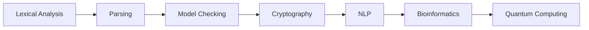

# Chapter 15: Applications of Automata Theory

> **Previous:** [Advanced Complexity Topics](./14-advanced-complexity.md) | **Next:** None


## Learning Objectives

- Understand how finite automata are used in lexical analysis and pattern matching.
- Describe how pushdown automata and CFGs form the foundation of parsing.
- Explain how automata theory applies to formal verification.
- Understand cryptographic applications of complexity theory.
- Recognize the role of automata in AI and natural language processing.
- Apply concepts from computability to real-world software engineering.


## Chapter at a Glance
| Topic | Key Insight | Practical Takeaway |
|-------|------------|-------------------|
| Lexical Analysis | DFA-based tokenization | Every compiler uses this |
| Parsing | PDA/CFG-based syntax analysis | Foundation of programming languages |
| Model Checking | Automata for system verification | Used by Intel, Microsoft, NASA |
| Cryptography | One-way functions and NP-hardness | Security from complexity |
| Bioinformatics | HMMs and CFGs for sequence analysis | Gene finding, RNA folding |


## Chapter Roadmap


## Theory


### 15.1 Lexical Analysis and Regular Expressions

The most widespread application of finite automata is **lexical analysis** (lexing) in compilers. A lexer converts a stream of characters into a stream of tokens (identifiers, keywords, operators, literals).

**How it works:**
1. Each token type (IDENTIFIER, NUMBER, WHITESPACE, etc.) is described by a regular expression.
2. Each regular expression is converted to an NFA and then to a DFA.
3. The DFAs are combined into a single DFA that recognizes all token types.
4. The lexer simulates this DFA on the input, tracking the longest match found so far.
5. When the DFA reaches a dead state, the longest matching token is emitted.

**Tools:** lex, flex (C/C++), ANTLR (Java, multi-language), Ragel (state machine compiler).

**Example:** A lexer for simple arithmetic:
```
DIGIT    → [0-9]
NUMBER   → DIGIT+ (\. DIGIT+)?
PLUS     → +
MINUS    → -
TIMES    → *
DIVIDE   → /
LPAREN   → (
RPAREN   → )
```
Each rule compiles to a DFA. The lexer simulates them in parallel, picking the longest matching token.

### 15.2 Parsing and Context-Free Grammars

**Parsing** is the process of determining the syntactic structure of a string according to a CFG. This produces a parse tree used by subsequent compiler phases.

**Two main parsing strategies:**

1. **Top-down (LL) parsing:**
   - Build the parse tree from the root downward.
   - Predict which production to use based on the next input symbol.
   - Requires the grammar to be LL(k) (no left recursion, k symbols of lookahead).
   - Used in: recursive-descent parsers (hand-written for many production compilers).

2. **Bottom-up (LR) parsing:**
   - Build the parse tree from the leaves upward.
   - Shift symbols onto a stack until a production's RHS is matched, then reduce.
   - More general than LL — can handle more grammars.
   - Used in: yacc, bison, and most parser generators.

**Parser generators:** yacc/bison (LALR(1)), ANTLR (LL(*)), CUP (LALR), Happy (Haskell).

**The Chomsky hierarchy in parsing:**
- Type 3 (regular): tokenization by DFA.
- Type 2 (context-free): syntax analysis by PDA.
- Type 1 (context-sensitive): some semantic analysis (limited).

### 15.3 Formal Verification and Model Checking

**Model checking** is an automated technique for verifying that a system satisfies a given specification. It uses automata theory to represent both the system and the specification.

**Temporal logics:**
- **LTL (Linear Temporal Logic):** Formulas over paths. "Always eventually p" (GFp).
- **CTL (Computation Tree Logic):** Formulas over branching structure. "For all paths, eventually p" (AF p).

**Automata-theoretic approach:**
1. Model the system as a finite automaton (a Kripke structure) M.
2. Convert the specification (in LTL or CTL) to an automaton A that accepts violating behaviors.
3. Compute the product automaton M × A.
4. Check if the product has any accepting path — if so, the specification is violated.

**Applications:**
- Hardware verification (Intel, AMD use model checking for CPU designs).
- Protocol verification (checking communication protocols).
- Software verification (SLAM project at Microsoft for device drivers).
- Safety-critical systems (avionics, medical devices).

**Tools:** SPIN (explicit-state model checker), NuSMV (symbolic model checking), CBMC (bounded model checking for C).

### 15.4 Cryptography and Computational Complexity

Complexity theory provides the foundation for modern cryptography. In particular, the existence of **one-way functions** (functions easy to compute but hard to invert) is the basis for most cryptographic primitives.

**Key complexity-theoretic concepts in cryptography:**
- **One-way functions:** f(x) is easy to compute, but given y = f(x), finding any x' with f(x') = y is hard (requires super-polynomial time).
- **Trapdoor functions:** One-way functions with a "back door" — with the secret key, inversion is easy (used in public-key cryptography).
- **Zero-knowledge proofs:** An interactive proof reveals nothing beyond the validity of the statement. ZK proofs exist for all NP languages under cryptographic assumptions.

**Computational hardness assumptions:**
- **Factoring:** Given product of two large primes, find the factors. (Used in RSA.)
- **Discrete log:** Given g, p, and gˣ mod p, find x. (Used in Diffie-Hellman, ElGamal.)
- **Lattice problems:** Learning With Errors (LWE), Shortest Vector Problem (SVP). (Used in post-quantum cryptography.)
- **SAT hardness:** Many cryptographic constructions rely on the hardness of NP-complete problems.

### 15.5 Automata in Natural Language Processing

**Finite-state methods** are extensively used in NLP:
- **Morphological analysis:** Finite-state transducers model word formation (e.g., "running" → run + ing).
- **Phonology:** Finite-state machines model sound changes in language.
- **Part-of-speech tagging:** Hidden Markov Models (probabilistic finite automata) assign POS tags to words.
- **Speech recognition:** Viterbi algorithm (DP on a weighted automaton) finds the most likely word sequence.

**Context-free grammars** are used in:
- **Syntactic parsing:** CFGs (and richer formalisms like TAG, CCG) model sentence structure.
- **Dependency parsing:** Non-projective dependency grammars go beyond CFGs.

**Modern NLP (transformer-based):** While modern LLMs don't explicitly use automata, concepts from automata theory appear in:
- **Attention mechanisms** can be seen as simulating weighted finite automata.
- **Regular languages** are the limit of what certain transformer architectures can recognize.

### 15.6 Programming Language Theory

**Type systems** and automata theory:
- **Regular types:** Types described by regular expressions (e.g., nullable types, option types).
- **Context-free grammars** describe syntax, and **attribute grammars** extend CFGs with semantic actions.
- **Recursive types** (e.g., lists, trees) correspond to concepts in µ-calculus and alternating automata.

**Domain-specific languages (DSLs):** Many DSLs are designed to be regular or context-free, enabling efficient parsing and analysis. Examples: SQL, HTML/CSS (regular for practical purposes), JSON.

**Bidirectional programming (lenses):** The theory of lenses for bidirectional transformations has deep connections to automata theory, particularly finite-state transducers.

### 15.7 Bioinformatics

**Finite automata in computational biology:**
- **Hidden Markov Models (HMMs):** Used for gene finding, protein family classification (Pfam), and sequence alignment.
- **Profile HMMs:** Represent conserved sequence patterns in multiple sequence alignments.
- **Deterministic finite automata** for motif finding: search for patterns in DNA/RNA/protein sequences.

**Context-free grammars:**
- **RNA secondary structure prediction:** Pseudoknot-free RNA structures can be modeled by CFGs. The Nussinov algorithm and Zuker algorithm use DP (like CYK) to find the optimal structure.
- **Stochastic CFGs:** Probabilistic CFGs model RNA families and grammar-driven sequence analysis.

### 15.8 Network Security and Intrusion Detection

**Pattern matching with automata:**
- **Aho-Corasick algorithm:** Builds a DFA-like automaton from a set of patterns (virus signatures, attack patterns). Runs in O(n + m + z) where n is text length, m is total pattern length, z is number of matches.
- **Snort/Suricata rules:** Network intrusion detection systems compile rules into efficient automata.
- **Deep packet inspection (DPI):** Regular expressions in hardware (TCAM, FPGA) for line-rate packet matching.

**Anomaly detection:**
- **n-gram models:** Probabilistic automata learning normal behavior.
- **Protocol analysis:** Finite-state models of protocol states detect deviations.

### 15.9 Computability and Software Engineering

Understanding undecidability helps engineers recognize what **cannot** be automated:

- **No automated termination checker:** The halting problem means we cannot have a tool that always correctly determines whether a program terminates.
- **No perfect bug finder:** Rice's theorem implies that any non-trivial property of program behavior (correctness, safety, liveness) is undecidable in general.
- **No fully automated program synthesis:** While specific synthesis problems are decidable, general program synthesis is not.

**Practical consequences:**
- Static analysis tools (like linters) use conservative approximations (sound but incomplete, or complete but unsound).
- Type systems balance expressiveness with decidability.
- Testing cannot prove correctness — it can only find bugs.

### 15.10 Quantum Computing and Complexity

**BQP** (Bounded-error Quantum Polynomial Time): The class of problems efficiently solvable by quantum computers.

**Relationship to classical classes:**
- P ⊆ BQP ⊆ PSPACE
- It's believed that NP ⊄ BQP (quantum computers won't solve NP-complete problems efficiently).
- Shor's algorithm: Factoring ∈ BQP (threatens RSA).
- Grover's algorithm: Unstructured search in O(√n) (quadratic speedup).

**Implications for the Church-Turing thesis:**
The **extended Church-Turing thesis** (every physically realizable computation can be simulated by a probabilistic TM with polynomial slowdown) is challenged by quantum computing. Whether quantum computers provide a super-polynomial advantage remains an active research question.

## Examples

### Example 15.1: Lexer Design for a Mini-Language

A lexer for a language with keywords (if, while, else) and identifiers:

REs: KEYWORD = if|while|else, ID = [a-z]+, NUM = [0-9]+, OP = +|-|*|/

The combined DFA is constructed by:
1. Building NFAs for each pattern.
2. Combining via ε-transitions from a new start state.
3. Converting to a DFA via subset construction.
4. At each step, record which patterns are matched.

When multiple patterns match at the same position (e.g., "if" matches both KEYWORD and ID), the lexer uses the **longest match** rule, with ties broken by priority (KEYWORD before ID).

### Example 15.2: Model Checking a Simple Protocol

Consider a mutual exclusion protocol with two processes. The specification (safety property): "never both processes in critical section simultaneously."

The model is a Kripke structure M with states (p_state, q_state) where each process state ∈ {idle, want, critical}. Transitions follow the protocol rules.

The property is expressed in LTL as: G ¬(in_cs₁ ∧ in_cs₂).

Model checking constructs the product of M and the automaton for the negation of the property. If any accepting cycle exists, the system model violates mutual exclusion and a counterexample path is produced.

### Example 15.3: Undecidability in Practice — Static Analysis

A static analyzer for null pointer dereferences:
- Cannot decide exactly which pointers are null (undecidable in general).
- Instead, uses **conservative approximation**: may report false positives but never misses a real bug.
- Example: assume any pointer assigned from a function return might be null unless proven otherwise.

This is the practical consequence of Rice's theorem — static analysis tools must trade off precision for decidability.

### Example 15.4: RNA Secondary Structure Prediction with CFGs

RNA bases {A, C, G, U} pair: A-U, C-G, G-U (wobble). Secondary structure prediction using Nussinov algorithm (DP, O(n³)):

**Grammar for RNA structure:**
S → ε | a S | a S u | c S g | g S u | c S c | u S a | g S c | S S

Each production corresponds to a structural element:
- ε: empty structure.
- a S: unpaired base.
- a S u: paired bases (a-u).
- S S: branch point.

The CYK-like DP algorithm finds the structure maximizing the number of paired bases.


## Concept Comparison Table
| Layer | Automaton Type | Compiler Phase |
|-------|---------------|----------------|
| Lexical | DFA/NFA | Tokenization |
| Syntax | PDA (LR/LALR) | Parsing |
| Semantic | Attribute grammar | Type checking |
| Optimization | TM transformations | Code improvement |

## Quick Reference
| Application | Automata Concept |
|-------------|-----------------|
| Lex (flex) | DFA from regex |
| Yacc (bison) | LALR(1) parsing table |
| SPIN model checker | B\"uchi automata |
| Aho-Corasick | DFA for multi-patterns |
| HMM (NLP) | Probabilistic finite automata |

## Cross-Application Matrix
| Domain | Application | Automata Used |
|--------|------------|---------------|
| Compilers | Lexing + parsing | DFA + PDA |
| Security | Intrusion detection | DFA (Aho-Corasick) |
| Bioinformatics | Gene finding | HMM (probabilistic FA) |
| AI/NLP | POS tagging | HMM, CFG |
| Hardware | Model checking | B\"uchi automata |
| Quantum | Shor's algorithm | BQP complexity |

## Chapter Quiz

**Q1.** Lexical analysis uses which automaton?
- A) PDA
- B) DFA ✓
- C) Turing machine
- D) LBA

<details>
<summary>Answer</summary>
**B)** Lexical analysis converts character streams to tokens using DFA-derived from regular expressions.
</details>

**Q2.** LL and LR parsers correspond to:
- A) DFA
- B) PDA ✓
- C) Turing machine
- D) NFA

<details>
<summary>Answer</summary>
**B)** Both LL (top-down) and LR (bottom-up) parsing use pushdown automata.
</details>

**Q3.** Model checking verifies systems against:
- A) Regular expressions
- B) Temporal logic specifications ✓
- C) PCP instances
- D) Busy beaver values

<details>
<summary>Answer</summary>
**B)** Model checking uses automata-theoretic techniques to verify LTL/CTL specifications.
</details>

**Q4.** The existence of one-way functions relies on:
- A) P = NP
- B) P ≠ NP ✓
- C) P = PSPACE
- D) NP = co-NP

<details>
<summary>Answer</summary>
**B)** One-way functions require computational hardness — if P = NP, they cannot exist.
</details>

**Q5.** The halting problem affects software engineering by showing:
- A) All bugs can be found automatically
- B) No perfect termination checker exists ✓
- C) Testing is unnecessary
- D) Programs always halt

<details>
<summary>Answer</summary>
**B)** Undecidability means we cannot have a tool that always correctly determines program termination.
</details>

## Summary

- Finite automata power lexical analysis, pattern matching, and network intrusion detection.
- Context-free grammars and PDAs are the foundation of parsing in compilers.
- Model checking uses automata theory for automated hardware and software verification.
- Complexity theory provides the mathematical foundation for cryptography and security.
- Automata theory is applied in NLP (morphology, POS tagging), bioinformatics (HMMs, RNA folding), and protocol verification.
- Undecidability results guide the design of practical static analysis tools.
- Quantum computing challenges the extended Church-Turing thesis.

## Exercises

### Basic

1. Explain how a lexer uses DFA to tokenize source code.
2. Describe the difference between LL and LR parsing strategies.
3. What is the role of the pumping lemma in proving that some languages cannot be parsed with regular expressions?
4. Give three examples of undecidable problems that affect software engineering.
5. What is a one-way function and why is it important for cryptography?

### Intermediate

6. Design a lexer DFA that recognizes: identifiers ([a-zA-Z_][a-zA-Z0-9_]*), numbers ([0-9]+), and operators (+, -, *, /), with longest match semantics.
7. Explain how model checking works for verifying hardware designs. What is the state explosion problem?
8. Show how the LTL formula G(p → F q) can be translated into a Büchi automaton.
9. Explain why static analysis tools cannot be both sound (no false negatives) and complete (no false positives) for non-trivial properties.
10. Describe how RNA secondary structure prediction uses the CYK algorithm or similar DP methods.

### Advanced

11. Build a complete lexer and parser (in pseudocode) for a simple expression language using a DFA for tokens and a recursive-descent parser for the CFG. The language should support variables, integers, +, *, parentheses, and assignment.
12. Prove that the problem of determining whether a C program ever dereferences a null pointer is undecidable (by reduction from the halting problem).
13. Explain the relationship between P, NP, and the existence of one-way functions. Show that if P = NP, then one-way functions do not exist.
14. Show how the Aho-Corasick algorithm constructs a finite automaton for multiple pattern matching. What is its complexity?
15. Write a research summary on the state of quantum computing relative to the Church-Turing thesis, covering BQP, Shor's algorithm, and the limits of quantum speedup.
