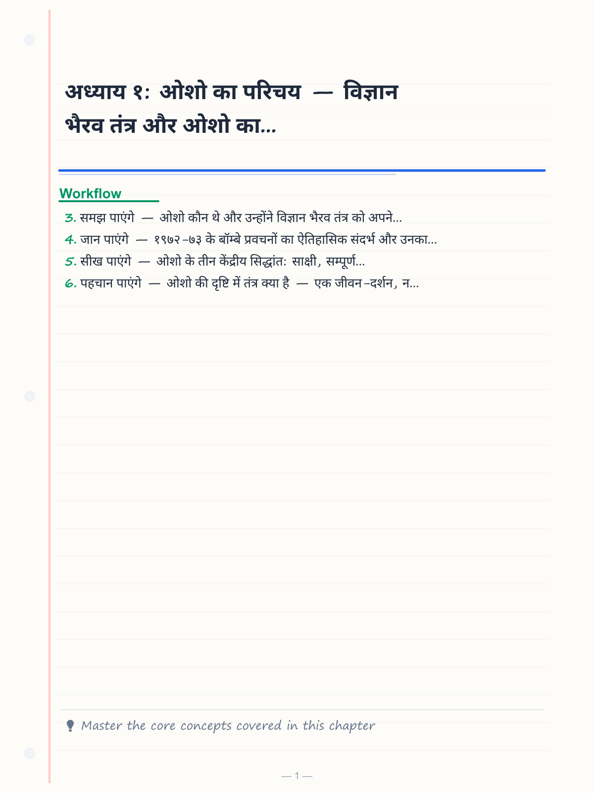
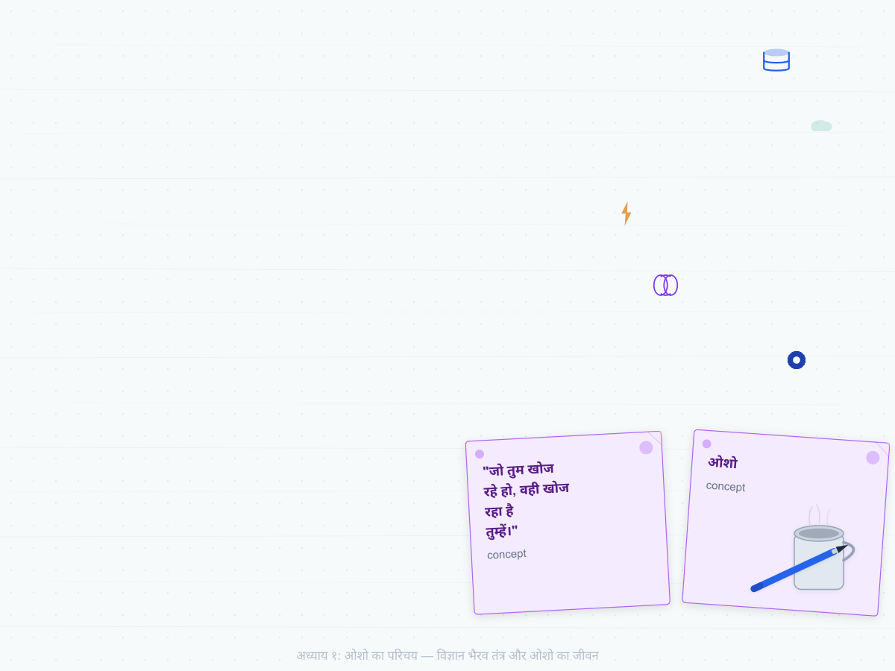
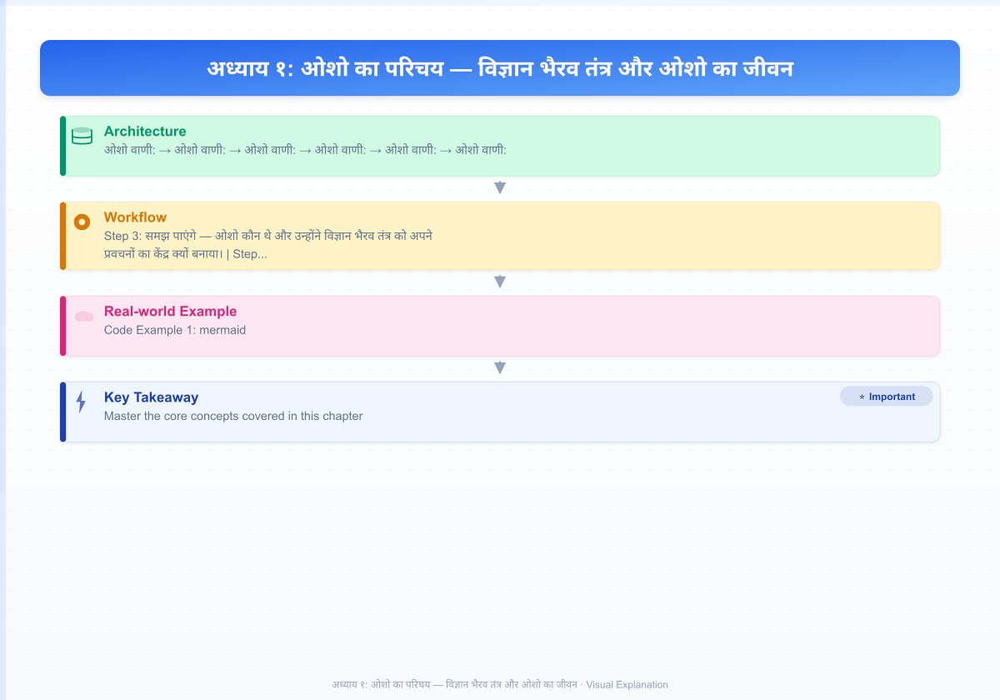

# अध्याय १: ओशो का परिचय — विज्ञान भैरव तंत्र और ओशो का जीवन

> **"जो तुम खोज रहे हो, वही खोज रहा है तुम्हें।"**
> — **ओशो**

---

**ओशो वाणी:**
> "मैं कोई गुरु नहीं हूँ। गुरु तो वे हैं जो तुम्हें बाँधते हैं — किसी सिद्धांत से, किसी पंथ से, किसी परंपरा से। मैं तो मुक्त करना चाहता हूँ। मैं तुम्हें स्वतंत्रता देना चाहता हूँ — मुझसे भी। मैं एक द्वार हूँ, एक खिड़की हूँ — द्वार पर खड़े होकर मत रुक जाना, पार चले जाना।"

---

<!-- Image Gallery -->
<section class="lesson-visuals" aria-label="Visual learning resources">
  <header><span>VISUAL LEARNING</span><h2>See it. Review it. Remember it.</h2></header>
  <a class="lesson-visual-card" href="../../assets/images/lessons/vigyan-bhairav-tantra/01-parichay/handwritten-notes.png" target="_blank" rel="noopener">
    
    <span><strong>Handwritten notes</strong>Condensed notes for deliberate review.</span>
  </a>
  <a class="lesson-visual-card" href="../../assets/images/lessons/vigyan-bhairav-tantra/01-parichay/sticky-notes.png" target="_blank" rel="noopener">
    
    <span><strong>Sticky-note revision</strong>Fast recall prompts for revision.</span>
  </a>
  <a class="lesson-visual-card" href="../../assets/images/lessons/vigyan-bhairav-tantra/01-parichay/visual-explanation.png" target="_blank" rel="noopener">
    
    <span><strong>Visual concept guide</strong>A connected explanation of the key ideas.</span>
  </a>
</section>
<!-- End Image Gallery -->

## सीखने के उद्देश्य (Learning Objectives)

इस अध्याय को पूरा करने के बाद आप:

1. **समझ पाएंगे** — ओशो कौन थे और उन्होंने विज्ञान भैरव तंत्र को अपने प्रवचनों का केंद्र क्यों बनाया।
2. **जान पाएंगे** — १९७२-७३ के बॉम्बे प्रवचनों का ऐतिहासिक संदर्भ और उनका महत्व।
3. **सीख पाएंगे** — ओशो के तीन केंद्रीय सिद्धांत: **साक्षी, सम्पूर्ण स्वीकार, और नो-माइंड**।
4. **पहचान पाएंगे** — ओशो की दृष्टि में तंत्र क्या है — एक जीवन-दर्शन, न कि कोई धार्मिक ग्रंथ।
5. **सक्षम होंगे** — टाइपस्क्रिप्ट में एक ओशो डिस्कोर्स ब्राउज़र बनाने में जो उनके जीवन और कार्य को प्रस्तुत करता है।

---

## ओशो कौन हैं?

### एक विवादास्पद संत, एक क्रांतिकारी दार्शनिक

ओशो (१९३१-१९९०) — जिन्हें पहले आचार्य रजनीश और फिर भगवान श्री रजनीश के नाम से जाना जाता था — बीसवीं सदी के सबसे विवादास्पद और प्रभावशाली आध्यात्मिक गुरुओं में से एक हैं। उन्होंने कभी कोई परंपरा नहीं बनाई — उन्होंने एक क्रांति बनाई। उनके प्रवचन किसी धर्म या पंथ के लिए नहीं थे — वे मनुष्य की चेतना के लिए थे।

**ओशो वाणी:**
> "मैं तुम्हें एक नया धर्म नहीं देना चाहता — दुनिया में पहले से ही बहुत धर्म हैं। मैं तो तुम्हें धर्ममुक्त करना चाहता हूँ। मैं चाहता हूँ कि तुम इतने जागरूक हो जाओ कि किसी धर्म की ज़रूरत ही न रहे।"

| पहलू | विवरण |
|------|--------|
| **जन्म** | ११ दिसंबर १९३१, कुचवाड़ा, मध्य प्रदेश, भारत |
| **शिक्षा** | दर्शनशास्त्र में एम.ए. (सागर विश्वविद्यालय) |
| **व्यवसाय** | प्रोफेसर (१९५७-१९६६), फिर पूर्णकालिक प्रवचनकार |
| **केंद्रीय शिक्षा** | ध्यान — मनुष्य की एकमात्र सच्ची क्रांति |
| **प्रभाव** | ज़ेन, सूफ़ी, तंत्र, गुरजिएफ, कृष्णमूर्ति, मनोविज्ञान |
| **महासमाधि** | १९ जनवरी १९९०, पूना, भारत |
| **ग्रंथ** | ६००+ पुस्तकें (प्रवचनों से संकलित) |

### ओशो का बचपन और उनकी मृत्यु के प्रति जागरूकता

ओशो का बचपन किसी और से अलग था। वे स्वयं कहते हैं कि उन्हें अपनी पिछले जन्मों की याद थी। सात वर्ष की आयु में उनके नाना की मृत्यु ने उनके जीवन को गहराई से प्रभावित किया। वे मृत्यु के रहस्य में डूब गए।

**ओशो वाणी:**
> "जब मैं सात साल का था, मेरे नाना मर गए। वह मेरे सबसे करीबी व्यक्ति थे। उनकी मृत्यु ने मुझे झकझोर दिया। मैंने देखा — वे थे, और फिर वे नहीं रहे। वह शरीर जो हिलता-डुलता था, अब केवल एक चीज़ था। इस घटना ने मेरी पूरी ज़िंदगी बदल दी। मैं मृत्यु का सामना करना चाहता था — उससे भागना नहीं। और यही मेरे सारे ध्यान का आधार बना।"

### इक्कीस मार्च १९५३ — समाधि का अनुभव

ओशो के जीवन की सबसे महत्वपूर्ण घटना २१ मार्च १९५३ को घटित हुई। उनकी आयु तब २१ वर्ष थी। वे सागर के एक पार्क में बैठे थे, और अचानक — सब कुछ बदल गया।

**ओशो वाणी:**
> "उस दिन — २१ मार्च १९५३ — मैं जीवन में पहली बार असफल हुआ। मैं जो कुछ भी करता था, वह कर चुका था। मैंने ध्यान किया था, मैंने सब कुछ किया था — और कुछ नहीं हुआ। निराशा गहरी थी। मैं एक पार्क में बैठा था, सब कुछ छोड़ चुका था। कोई आशा नहीं थी। और उसी पूर्ण निराशा में — मैं विस्फोटित हो गया। अचानक, चारों ओर प्रकाश था। मैं और ब्रह्मांड — एक हो गए। तब से वह अवस्था कभी नहीं गई।"

यह अनुभव — इस "विस्फोट" ने ओशो के पूरे जीवन और दर्शन को आकार दिया। वे कहते थे कि जब तकनीक ने काम करना बंद कर दिया, तब सत्य घटित हुआ। और यही उनके तंत्र-दर्शन का आधार है — अंततः सब कुछ छोड़ देना।

---

## ओशो का जीवन-वृक्ष: एक आरेख

```mermaid
flowchart TB
    subgraph Childhood["बाल्यकाल १९३१-१९५१"]
        A["११ दिसंबर १९३१<br/>जन्म — कुचवाड़ा"]
        B["७ वर्ष — नाना की मृत्यु<br/>→ मृत्यु का प्रश्न"]
        C["१५ वर्ष — मित्र की मृत्यु<br/>→ ध्यान की ओर"]
    end
    
    subgraph Education["शिक्षा १९५१-१९५७"]
        D["सागर विश्वविद्यालय<br/>दर्शनशास्त्र"]
        E["२१ मार्च १९५३<br/>समाधि — पार्क में"]
    end
    
    subgraph Professor["प्रोफेसर १९५७-१९६६"]
        F["रायपुर — संस्कृत कॉलेज"]
        G["जबलपुर — विश्वविद्यालय"]
        H["देशभर में प्रवचन<br/>बढ़ता प्रभाव"]
    end
    
    subgraph Bombay["बॉम्बे १९७०-१९७४"]
        I["११२ प्रवचन<br/>विज्ञान भैरव तंत्र"]
        J["प्रथम संन्यासी — नेपाली बुद्ध"]
        K["ध्यान यात्राएँ"]
    end
    
    subgraph Poona1["पूना १९७४-१९८१"]
        L["कोरेगाँव पार्क आश्रम"]
        M["विश्व के पहले<br/>ध्यान-मनोचिकित्सा केंद्र"]
        N["५००+ प्रवचन श्रृंखलाएँ"]
    end
    
    subgraph US["अमेरिका १९८१-१९८५"]
        O["ओरेगन — राजनीशपुरम"]
        P["३.५ वर्ष मौन"]
        Q["१९८४ — पुनः वाचन"]
    end
    
    subgraph Final["अंतिम वर्ष १९८५-१९९०"]
        R["विश्व भ्रमण से वंचित"]
        S["पूना — पुनः आश्रम"]
        T["१९ जनवरी १९९०<br/>महासमाधि"]
    end
    
    Childhood --> Education
    Education --> Professor
    Professor --> Bombay
    Bombay --> Poona1
    Poona1 --> US
    US --> Final
    
    style A fill:#e74c3c,color:#fff
    style E fill:#f39c12,color:#fff,stroke-width:3px
    style I fill:#2ecc71,color:#fff,stroke-width:3px
    style T fill:#9b59b6,color:#fff,stroke-width:3px
```



---

## १९७२-७३: बॉम्बे में ऐतिहासिक प्रवचन

### संदर्भ और वातावरण

१९७२ में ओशो बॉम्बे (मुंबई) में रहते थे — वुडलैंड्स अपार्टमेंट, पेडर रोड पर। वहाँ उनके कमरे में प्रतिदिन शाम को प्रवचन होते थे। श्रोता सीमित थे — कुछ सैकड़े। कोई बड़ा आयोजन नहीं था। कोई माइक नहीं, कोई स्टेज नहीं। बस ओशो बोलते थे, और लोग सुनते थे।

**ओशो वाणी:**
> "वे दिन अद्भुत थे। हम एक छोटे से कमरे में बैठते थे। मैं बोलता था, तुम सुनते थे। कोई औपचारिकता नहीं। कोई व्यवस्था नहीं। बस दोस्तों का जमावड़ा। और उस छोटे से कमरे में हमने ब्रह्मांड को समेट लिया था।"

हर दिन एक प्रवचन — एक तकनीक। ११२ दिन, ११२ तकनीकें। ओशो हर श्लोक को लेते, उसे पढ़ते, और फिर उसकी गहनतम व्याख्या करते — कभी मनोवैज्ञानिक दृष्टि से, कभी ज़ेन कहानियों से, कभी अपने अनुभव से।

### प्रवचनों की अनूठी शैली

| पहलू | ओशो की शैली |
|------|-------------|
| **भाषा** | मिश्रित हिंदी-अंग्रेज़ी (हिंग्लिश) — सरल, प्रवाहमयी |
| **लंबाई** | ~९० मिनट प्रति प्रवचन — बिना रुके, बिना नोट्स के |
| **शैली** | संवादात्मक — प्रश्न पूछते, उत्तर देते, चुनौती देते |
| **मज़ाक** | व्यंग, हास्य, तंज — खासकर पंडितों और पुजारियों पर |
| **गहराई** | सरल से शुरू करके गूढ़तम तक ले जाते |
| **दोहराव** | एक ही बात को अलग-अलग कोणों से — ताकि गहराई में उतरे |
| **रुकना** | बीच-बीच में मौन — श्रोताओं को पचने देते |

### "द बुक ऑफ़ सीक्रेट्स" का जन्म

ये ११२ प्रवचन बाद में पाँच खंडों में प्रकाशित हुए — **"द बुक ऑफ़ सीक्रेट्स"** के नाम से। यह ओशो की सबसे महत्वपूर्ण कृतियों में से एक मानी जाती है।

| खंड | तकनीकें | कवर |
|-----|---------|------|
| खंड १ | १-३० | श्वास, शारीरिक, और दृष्टि तकनीकें |
| खंड २ | ३१-५४ | श्रवण, स्पर्श, और इन्द्रिय तकनीकें |
| खंड ३ | ५५-७८ | मानसिक और भावना तकनीकें |
| खंड ४ | ७९-९६ | चैतन्य और प्रकाश तकनीकें |
| खंड ५ | ९७-११२ | उन्मनी, शून्य, और परम तकनीकें |

---

## ओशो के तीन केंद्रीय सिद्धांत

### १. साक्षी (Witnessing) — सबसे बड़ी क्रांति

**ओशो वाणी:**
> "मैं तुम्हें एक ही चीज़ सिखा सकता हूँ — और वह है साक्षी। बाकी सब कुछ तो उसकी तैयारी है। श्वास पर ध्यान करो — ताकि तुम साक्षी बन सको। शरीर को देखो — ताकि तुम साक्षी बन सको। विचारों को देखो — ताकि तुम साक्षी बन सको। साक्षी ही ध्यान है। साक्षी ही समाधि है। साक्षी ही मोक्ष है।"

ओशो के अनुसार, साक्षी का अर्थ है — बिना किसी निर्णय के, बिना किसी पहचान के, केवल देखना। जैसे तुम दीवार पर लगी घड़ी को देखते हो — वैसे ही अपने श्वास को, अपने शरीर को, अपने मन को देखो।

| साक्षी का स्तर | क्या देखना है? | क्या नहीं करना है? |
|---------------|---------------|-------------------|
| शारीरिक | श्वास, शरीर की हरकतें, संवेदनाएँ | उनमें हस्तक्षेप नहीं करना |
| मानसिक | विचार, कल्पनाएँ, यादें | उनसे पहचान नहीं बनाना |
| भावनात्मक | भावनाएँ, मूड, वृत्तियाँ | उनमें बहना या उन्हें दबाना नहीं |
| गहन | स्वप्न, निद्रा, शून्यता | कोई प्रयास नहीं — केवल जागरूकता |

```mermaid
flowchart LR
    subgraph Normal["सामान्य अवस्था"]
        A["मैं = शरीर"] --> B["मैं = मन"]
        B --> C["मैं = भावनाएँ"]
        C --> D["दुख, भय, अशांति"]
    end
    
    subgraph Witnessing["साक्षी अवस्था"]
        E["मैं देख रहा हूँ<br/>शरीर को"] --> F["मैं देख रहा हूँ<br/>मन को"]
        F --> G["मैं देख रहा हूँ<br/>भावनाओं को"]
        G --> H["शांति, आनंद,<br/>मुक्ति"]
    end
    
    Normal -->|"साक्षी का अभ्यास"| Witnessing
    
    style A fill:#e74c3c,color:#fff
    style B fill:#e67e22,color:#fff
    style C fill:#f1c40f,color:#333
    style D fill:#c0392b,color:#fff
    style E fill:#2ecc71,color:#fff
    style F fill:#27ae60,color:#fff
    style G fill:#16a085,color:#fff
    style H fill:#9b59b6,color:#fff
```



### २. सम्पूर्ण स्वीकार (Total Acceptance)

**ओशो वाणी:**
> "तंत्र का पहला सूत्र है — सम्पूर्ण स्वीकार। जो कुछ भी है, उसे स्वीकार करो। क्रोध है? स्वीकार करो। कामवासना है? स्वीकार करो। लोभ है? स्वीकार करो। जब तुम स्वीकार करते हो, तब उसे देखना शुरू होता है। और देखना ही परिवर्तन है।"

यह ओशो का सबसे क्रांतिकारी और विवादास्पद संदेश था। सदियों से धर्मों ने सिखाया था — दबाओ, नियंत्रित करो, त्याग करो। ओशो ने कहा — स्वीकार करो, समझो, देखो। दमन से कभी मुक्ति नहीं मिलती — केवल जागरूकता से मिलती है।

| पारंपरिक दृष्टि | ओशो की दृष्टि |
|-----------------|--------------|
| कामवासना पाप है | कामवासना एक ऊर्जा है — इसे समझो |
| क्रोध बुरा है | क्रोध को देखो — वह अपने आप बदल जाएगा |
| लोभ छोड़ो | लोभ को जानो — उसकी जड़ें देखो |
| अहंकार तोड़ो | अहंकार को देखो — वह विलीन हो जाएगा |
| संसार छोड़ो | संसार में जागो — वही परमात्मा है |

### ३. नो-माइंड (No-Mind)

**ओशो वाणी:**
> "मन से परे जाना ही ध्यान है। मन एक खूबसूरत यंत्र है — लेकिन यंत्र ही है। तुम यंत्र नहीं हो। तुम वह हो जो यंत्र का उपयोग करता है। जब तुम यह जान लेते हो — कि मैं मन नहीं हूँ, मैं देखने वाला हूँ — तब मन अपनी जगह आ जाता है। वह सेवक बन जाता है, स्वामी नहीं।"

ओशो के लिए "नो-माइंड" का अर्थ मन को नष्ट करना नहीं है — बल्कि मन से पहचान न जोड़ना है। मन जब सेवक है, तो बहुत उपयोगी है। मन जब स्वामी है, तो बहुत खतरनाक है।

---

## ओशो का दर्शन: अन्य आध्यात्मिक परंपराओं से तुलना

| आयाम | ओशो का तंत्र | पारंपरिक योग | अद्वैत वेदांत | बौद्ध धर्म |
|------|-------------|-------------|-------------|-----------|
| **केंद्र** | जागरूकता | नियंत्रण | ज्ञान | शून्यता |
| **विधि** | स्वीकार → देखना | दमन → ऊर्ध्वीकरण | वैराग्य → विवेक | स्मृति → समाधि |
| **शरीर** | मंदिर | जेल (त्याज्य) | माया | अनित्य |
| **इन्द्रियाँ** | द्वार | बाधा | भ्रम | बंधन |
| **संसार** | परमात्मा का रूप | दुख का कारण | मिथ्या | दुःख |
| **मोक्ष** | यहीं और अभी | जन्मांतर में | ब्रह्म-ज्ञान | निर्वाण |

---

## ओशो के प्रमुख कार्य और प्रवचन श्रृंखलाएँ

### ओशो के कार्य का वर्गीकरण

```mermaid
mindmap
  root((ओशो के ६००+ ग्रंथ))
    प्राचीन ग्रंथों पर व्याख्या
      विज्ञान भैरव तंत्र — द बुक ऑफ़ सीक्रेट्स
      पतंजलि योग सूत्र — योग द अल्फ़ा एंड ओमेगा
      अष्टावक्र गीता
      धम्मपद — गौतम बुद्ध
      उपनिषद
    ज़ेन पर प्रवचन
      नो वॉटर, नो मून
      दीया — द सॉन्ग ऑफ द सन
      दिस वेरी बॉडी द बुद्ध
    सूफ़ी पर प्रवचन
      सूफ़ी — द पीपल ऑफ द पाथ
      अब बीइंग हियर
    मनोविज्ञान और ध्यान
      द साइकोलॉजी ऑफ द एसोटेरिक
      मेडिटेशन — द फर्स्ट एंड लास्ट फ्रीडम
    ईसाई/यहूदी/अन्य
      आई एम द सिलेक्टेड
      द मस्टर्ड सीड
      जीसस — द मैन एंड हिज़ मैसेज
```



### महत्वपूर्ण प्रवचन श्रृंखलाएँ

| वर्ष | श्रृंखला | विषय | महत्व |
|------|----------|------|-------|
| १९७० | तंत्र सूत्र | सरहपा के तंत्र सूत्र | तंत्र का प्रथम व्यवस्थित प्रस्तुतीकरण |
| १९७२-७३ | विज्ञान भैरव तंत्र | ११२ ध्यान विधियाँ | **अब तक की सबसे पूर्ण श्रृंखला** |
| १९७३ | योग सूत्र | पतंजलि | योग और तंत्र की तुलना |
| १९७४ | ज़ेन कहानियाँ | ज़ेन बौद्ध धर्म | साक्षी का सबसे सरल रूप |
| १९७५ | मेडिटेशन | ध्यान विधियाँ | व्यावहारिक मार्गदर्शिका |
| १९७७ | टैरो | टैरो पर प्रवचन | आध्यात्मिक प्रतीकवाद |
| १९८० | मैं कहता हूँ | विविध | अंतिम प्रवचन शैली |

---

## ओशो डिस्कोर्स ब्राउज़र: टाइपस्क्रिप्ट इम्प्लीमेंटेशन

यह एक ओशो प्रवचन ब्राउज़र है जो उनके जीवन, कार्य, और प्रवचनों को व्यवस्थित करता है।

```typescript
/**
 * ============================================================
 * ओशो डिस्कोर्स ब्राउज़र
 * ============================================================
 * यह एक टाइपस्क्रिप्ट एप्लिकेशन है जो ओशो के जीवन, कार्य,
 * और विज्ञान भैरव तंत्र के प्रवचनों को ब्राउज़ करने की 
 * सुविधा देता है।
 * 
 * ओशो कहते हैं: "मेरे प्रवचन कोई सिद्धांत नहीं हैं — वे 
 * एक निमंत्रण हैं। मैं तुम्हें अपने होने में आमंत्रित करता हूँ।"
 */

// ─── मूल प्रकार ─────────────────────────────────────────────

/** ओशो के जीवन की महत्वपूर्ण घटनाएँ */
interface OshoLifeEvent {
  date: string;
  event: string;
  description: string;
  significance: 'महत्वपूर्ण' | 'बहुत_महत्वपूर्ण' | 'क्रांतिकारी';
  location: string;
  relatedTechniqueId?: number;
}

/** एक प्रवचन श्रृंखला */
interface DiscourseSeries {
  id: string;
  title: string;
  originalLanguage: 'हिंदी' | 'अंग्रेज़ी' | 'दोनों';
  year: number;
  totalDiscourses: number;
  topic: string;
  description: string;
  keyTeachings: string[];
  booksPublished: string[];
}

/** ओशो का एक प्रवचन */
interface OshoDiscourse {
  seriesId: string;
  discourseNumber: number;
  title: string;
  date: Date;
  duration: number; // मिनटों में
  keyQuote: string;
  techniqueId?: number;
  tags: string[];
}

/** ओशो के जीवन का एक कालखंड */
interface OshoPeriod {
  name: string;
  years: string;
  keyEvents: OshoLifeEvent[];
  significance: string;
  majorWorks: string[];
}

// ─── ओशो जीवन संग्रह ──────────────────────────────────────

class OshoLifeTimeline {
  private periods: OshoPeriod[] = [];
  private events: OshoLifeEvent[] = [];

  constructor() {
    this.initializeLife();
  }

  private initializeLife(): void {
    // बाल्यकाल
    this.periods.push({
      name: 'बाल्यकाल और शिक्षा',
      years: '१९३१-१९५७',
      significance: 'आध्यात्मिक जागृति का समय',
      majorWorks: [],
      keyEvents: [
        {
          date: '११ दिसंबर १९३१',
          event: 'जन्म',
          description: 'कुचवाड़ा, मध्य प्रदेश — एक जैन परिवार में जन्म। नाम: चंद्र मोहन जैन।',
          significance: 'महत्वपूर्ण',
          location: 'कुचवाड़ा, मप्र',
        },
        {
          date: '१९३८',
          event: 'नाना की मृत्यु',
          description: 'सात वर्ष की आयु में नाना की मृत्यु — मृत्यु के प्रति गहरी जिज्ञासा जागी।',
          significance: 'बहुत_महत्वपूर्ण',
          location: 'कुचवाड़ा',
        },
        {
          date: '२१ मार्च १९५३',
          event: 'समाधि का अनुभव',
          description: 'सागर के एक पार्क में — पूर्ण निराशा के बाद — आत्म-साक्षात्कार हुआ। चेतना का विस्फोट।',
          significance: 'क्रांतिकारी',
          location: 'सागर, मप्र',
          relatedTechniqueId: 112,
        },
      ],
    });

    // प्रोफेसर काल
    this.periods.push({
      name: 'प्रोफेसर और प्रवचन',
      years: '१९५७-१९७०',
      significance: 'सार्वजनिक प्रवचनों की शुरुआत',
      majorWorks: ['तंत्र सूत्र (१९७०)'],
      keyEvents: [
        {
          date: '१९५७',
          event: 'प्रोफ़ेसर नियुक्ति',
          description: 'रायपुर के संस्कृत कॉलेज में दर्शनशास्त्र के प्रोफ़ेसर।',
          significance: 'महत्वपूर्ण',
          location: 'रायपुर',
        },
        {
          date: '१९६२',
          event: 'प्रथम सार्वजनिक प्रवचन',
          description: 'जबलपुर में पहला बड़ा प्रवचन — "युगसाहित्य" शीर्षक से।',
          significance: 'बहुत_महत्वपूर्ण',
          location: 'जबलपुर',
        },
      ],
    });

    // बॉम्बे काल
    this.periods.push({
      name: 'बॉम्बे प्रवचन',
      years: '१९७०-१९७४',
      significance: 'विज्ञान भैरव तंत्र पर प्रवचन — सबसे महत्वपूर्ण श्रृंखला',
      majorWorks: ['द बुक ऑफ़ सीक्रेट्स (५ खंड)'],
      keyEvents: [
        {
          date: '१९७२-१९७३',
          event: 'विज्ञान भैरव तंत्र — ११२ प्रवचन',
          description: 'बॉम्बे के वुडलैंड्स अपार्टमेंट में प्रतिदिन शाम को ११२ दिनों तक प्रवचन।',
          significance: 'क्रांतिकारी',
          location: 'बॉम्बे (मुंबई)',
          relatedTechniqueId: 1,
        },
        {
          date: '१९७०',
          event: 'प्रथम संन्यासी — नेपाली बुद्ध',
          description: 'पहले शिष्य को संन्यास दीक्षा।',
          significance: 'महत्वपूर्ण',
          location: 'बॉम्बे',
        },
      ],
    });

    // पूना काल
    this.periods.push({
      name: 'पूना आश्रम',
      years: '१९७४-१९८१',
      significance: 'वैश्विक आध्यात्मिक केंद्र का विकास',
      majorWorks: ['योग — द अल्फा एंड ओमेगा', 'द साइकोलॉजी ऑफ द एसोटेरिक'],
      keyEvents: [
        {
          date: 'मार्च १९७४',
          event: 'कोरेगाँव पार्क आश्रम की स्थापना',
          description: 'पूना में आश्रम की स्थापना — विश्व भर से साधक आने लगे।',
          significance: 'बहुत_महत्वपूर्ण',
          location: 'पूना',
        },
        {
          date: '१९७५',
          event: 'ध्यान-मनोचिकित्सा प्रयोग',
          description: 'पश्चिमी मनोचिकित्सा और पूर्वी ध्यान का पहला प्रयोगात्मक संगम।',
          significance: 'क्रांतिकारी',
          location: 'पूना',
        },
      ],
    });

    // अमेरिका काल
    this.periods.push({
      name: 'अमेरिका प्रवास',
      years: '१९८१-१९८५',
      significance: 'अंतर्राष्ट्रीय विस्तार और विवाद',
      majorWorks: [],
      keyEvents: [
        {
          date: '१९८१',
          event: 'अमेरिका प्रवेश',
          description: 'स्वास्थ्य कारणों से अमेरिका गए। ओरेगन में राजनीशपुरम बसाया।',
          significance: 'बहुत_महत्वपूर्ण',
          location: 'ओरेगन, अमरीका',
        },
        {
          date: '१९८१-१९८४',
          event: 'मौन ग्रहण',
          description: '३.५ वर्ष तक मौन — केवल लिखकर संवाद। "मैं बोल रहा हूँ — बस शब्दों से नहीं।"',
          significance: 'क्रांतिकारी',
          location: 'राजनीशपुरम',
        },
      ],
    });

    // अंतिम काल
    this.periods.push({
      name: 'अंतिम वर्ष',
      years: '१९८५-१९९०',
      significance: 'शारीरिक समाप्ति, आध्यात्मिक विरासत',
      majorWorks: [],
      keyEvents: [
        {
          date: '१९ जनवरी १९९०',
          event: 'महासमाधि',
          description: 'पूना में शरीर त्यागा। अंतिम शब्द: "मैं तुममें जीवित हूँ — बस देखना।"',
          significance: 'क्रांतिकारी',
          location: 'पूना',
          relatedTechniqueId: 112,
        },
      ],
    });
  }

  /** कालखंड के अनुसार घटनाएँ */
  getEventsByPeriod(periodName: string): OshoPeriod | undefined {
    return this.periods.find(p => p.name.includes(periodName));
  }

  /** सभी घटनाएँ */
  getAllEvents(): OshoLifeEvent[] {
    return this.periods.flatMap(p => p.keyEvents);
  }

  /** महत्व के अनुसार घटनाएँ */
  getEventsBySignificance(level: 'महत्वपूर्ण' | 'बहुत_महत्वपूर्ण' | 'क्रांतिकारी'): OshoLifeEvent[] {
    return this.getAllEvents().filter(e => e.significance === level);
  }

  /** समयरेखा प्रिंट करें */
  printTimeline(): string {
    let output = '\n╔══════════════════════════════════════╗\n';
    output += '║       ओशो जीवन समयरेखा              ║\n';
    output += '╚══════════════════════════════════════╝\n';
    
    for (const period of this.periods) {
      output += `\n📅 ${period.name} (${period.years})\n`;
      output += `   ${period.significance}\n`;
      for (const event of period.keyEvents) {
        const icon = event.significance === 'क्रांतिकारी' ? '🔥' :
                     event.significance === 'बहुत_महत्वपूर्ण' ? '⭐' : '•';
        output += `   ${icon} ${event.date}: ${event.event}\n`;
        output += `     ${event.description}\n`;
      }
    }
    return output;
  }
}

// ─── ओशो प्रवचन संग्रह ─────────────────────────────────────

class OshoDiscourseLibrary {
  private series: DiscourseSeries[] = [];
  private discourses: OshoDiscourse[] = [];

  constructor() {
    this.initializeSeries();
    this.initializeDiscourses();
  }

  private initializeSeries(): void {
    this.series.push({
      id: 'VBT',
      title: 'विज्ञान भैरव तंत्र',
      originalLanguage: 'हिंदी',
      year: 1972,
      totalDiscourses: 112,
      topic: '११२ ध्यान विधियाँ — तंत्र दर्शन',
      description: 'ओशो की सबसे महत्वपूर्ण प्रवचन श्रृंखला। विज्ञान भैरव तंत्र के ११२ श्लोकों पर ११२ प्रवचन।',
      keyTeachings: [
        'साक्षी ही एकमात्र ध्यान है',
        'सम्पूर्ण स्वीकार — कोई दमन नहीं',
        'हर व्यक्ति के लिए कोई न कोई विधि',
        'मन से परे जाना ही मुक्ति है',
        'अनुभव ही ज्ञान है — विश्वास नहीं',
      ],
      booksPublished: [
        'द बुक ऑफ़ सीक्रेट्स — खंड १ (तकनीक १-३०)',
        'द बुक ऑफ़ सीक्रेट्स — खंड २ (तकनीक ३१-५४)',
        'द बुक ऑफ़ सीक्रेट्स — खंड ३ (तकनीक ५५-७८)',
        'द बुक ऑफ़ सीक्रेट्स — खंड ४ (तकनीक ७९-९६)',
        'द बुक ऑफ़ सीक्रेट्स — खंड ५ (तकनीक ९७-११२)',
      ],
    });

    this.series.push({
      id: 'YOGA',
      title: 'योग — द अल्फा एंड ओमेगा',
      originalLanguage: 'हिंदी',
      year: 1973,
      totalDiscourses: 10,
      topic: 'पतंजलि के योग सूत्र',
      description: 'पतंजलि के योग सूत्रों पर गहन प्रवचन — योग और तंत्र की तुलना।',
      keyTeachings: [
        'योग संघर्ष है, तंत्र समर्पण है',
        'चित्त की वृत्तियों का निरोध ही योग है',
        'समाधि — सबसे बड़ी क्रांति',
      ],
      booksPublished: ['योग — द अल्फा एंड ओमेगा'],
    });

    this.series.push({
      id: 'TANTRA_SUTRA',
      title: 'तंत्र सूत्र',
      originalLanguage: 'हिंदी',
      year: 1970,
      totalDiscourses: 11,
      topic: 'सरहपा के तंत्र सूत्र',
      description: 'बौद्ध तंत्र पर प्रवचन — सरहपा की ११ सूत्रों पर।',
      keyTeachings: [
        'शून्यता ही सब कुछ है',
        'ध्यान और जीवन में कोई अंतर नहीं',
        'मन ही बुद्ध है',
      ],
      booksPublished: ['तंत्र सूत्र'],
    });
  }

  private initializeDiscourses(): void {
    // VBT प्रवचनों की शुरुआत
    for (let i = 1; i <= 112; i++) {
      this.discourses.push({
        seriesId: 'VBT',
        discourseNumber: i,
        title: `विधि ${i}: ${this.getDiscourseTitle(i)}`,
        date: this.calculateDiscourseDate(i),
        duration: 90,
        keyQuote: this.getKeyQuote(i),
        techniqueId: i,
        tags: this.getTagsForTechnique(i),
      });
    }
  }

  private calculateDiscourseDate(techniqueNum: number): Date {
    // पहला प्रवचन — १ अक्टूबर १९७२ (अनुमानित)
    const startDate = new Date(1972, 9, 1);
    return new Date(startDate.getTime() + (techniqueNum - 1) * 86400000);
  }

  private getDiscourseTitle(i: number): string {
    const titles: Record<number, string> = {
      1: 'श्वास — आने और जाने के बीच',
      2: 'प्राण और अपान का मिलन',
      3: 'श्वास का साक्षी — सबसे सरल ध्यान',
      4: 'श्वास रुकी — तो द्वार खुला',
      5: 'प्राण का विस्तार — सीमाओं से परे',
      6: 'शरीर में ही परमात्मा',
      7: 'अँधेरे में हाथ — स्पर्श का ध्यान',
      8: 'भोजन में स्वाद — स्वाद का ध्यान',
      9: 'आँखें बंद — और भीतर देखो',
      10: 'दृष्टि स्थिर — बिंदु पर ध्यान',
      11: 'बीच में झाँकना — दो श्वासों के बीच',
      42: 'नाद ब्रह्म — ध्वनि ही ईश्वर है',
      51: 'शिव और शक्ति — दो का मिलन',
      64: 'भ्रमरी — भौंरों की गूँज',
      79: 'प्रकाश में प्रकाश',
      91: 'शून्य में डुबकी',
      112: 'अंतिम विधि — सब कुछ छोड़ देना',
    };
    return titles[i] || `${i}वीं ध्यान विधि`;
  }

  private getKeyQuote(i: number): string {
    const quotes: Record<number, string> = {
      1: '"श्वास आ रही है — देखो। श्वास जा रही है — देखो। बस देखो। यही ध्यान है।"',
      4: '"जब श्वास रुकती है — उस ठहराव में — वहाँ परमात्मा है।"',
      11: '"दो विचारों के बीच — एक छोटा सा अंतराल। उसे पकड़ो। वहीं द्वार है।"',
      42: '"सारी दुनिया ध्वनि है — परमात्मा मौन है। ध्वनि से मौन तक जाओ।"',
      112: '"अब कुछ करने की ज़रूरत नहीं। बस होना। पूरा होना। यही अंतिम है।"',
    };
    return quotes[i] || '"जागरूकता ही एकमात्र साधना है।"';
  }

  private getTagsForTechnique(i: number): string[] {
    if (i <= 15) return ['श्वास', 'आरंभिक', 'प्राण'];
    if (i <= 32) return ['शारीरिक', 'मध्यम', 'संवेदना'];
    if (i <= 64) return ['इन्द्रिय', 'दृष्टि', 'श्रवण'];
    if (i <= 89) return ['मानसिक', 'भावना', 'गहन'];
    return ['परम', 'शून्य', 'उन्मनी', 'अति_गहन'];
  }

  /** श्रृंखला के अनुसार प्रवचन */
  getBySeries(seriesId: string): OshoDiscourse[] {
    return this.discourses.filter(d => d.seriesId === seriesId);
  }

  /** टैग के अनुसार प्रवचन */
  getByTag(tag: string): OshoDiscourse[] {
    return this.discourses.filter(d => d.tags.includes(tag));
  }

  /** ओशो का एक यादृच्छिक उद्धरण */
  getRandomQuote(): { quote: string; technique: number } {
    const keys = Object.keys(this.getKeyQuote(1)).map(Number);
    const randomKey = Math.floor(Math.random() * 112) + 1;
    return {
      quote: this.getKeyQuote(randomKey),
      technique: randomKey,
    };
  }

  /** श्रृंखला विवरण */
  getSeriesInfo(seriesId: string): DiscourseSeries | undefined {
    return this.series.find(s => s.id === seriesId);
  }

  /** सभी श्रृंखलाएँ */
  getAllSeries(): DiscourseSeries[] {
    return [...this.series];
  }
}

// ─── प्रदर्शन ────────────────────────────────────────────────

function runOshoDiscourseBrowser(): void {
  console.log('╔══════════════════════════════════════╗');
  console.log('║   ओशो डिस्कोर्स ब्राउज़र            ║');
  console.log('╚══════════════════════════════════════╝\n');

  // जीवन समयरेखा
  const timeline = new OshoLifeTimeline();
  console.log(timeline.printTimeline());

  // प्रवचन संग्रह
  console.log('\n📚 उपलब्ध प्रवचन श्रृंखलाएँ:');
  const lib = new OshoDiscourseLibrary();
  lib.getAllSeries().forEach(s => {
    console.log(`   📖 ${s.id}: ${s.title} (${s.year}) — ${s.totalDiscourses} प्रवचन`);
    s.booksPublished.forEach(b => console.log(`      📕 ${b}`));
    console.log(`   💡 मुख्य शिक्षाएँ:`);
    s.keyTeachings.forEach(t => console.log(`      • ${t}`));
    console.log('');
  });

  // VBT प्रवचनों की संख्या
  const vbtDiscourses = lib.getBySeries('VBT');
  console.log(`🎙️ विज्ञान भैरव तंत्र प्रवचन: ${vbtDiscourses.length}`);
  
  // श्रेणी के अनुसार
  const breathTechs = lib.getByTag('श्वास');
  const bodyTechs = lib.getByTag('शारीरिक');
  console.log(`   श्वास तकनीकें: ${breathTechs.length}`);
  console.log(`   शारीरिक तकनीकें: ${bodyTechs.length}`);

  // यादृच्छिक उद्धरण
  console.log('\n🎯 ओशो का यादृच्छिक उद्धरण:');
  const { quote, technique } = lib.getRandomQuote();
  console.log(`   ${quote}`);
  console.log(`   — विधि #${technique}`);
}

runOshoDiscourseBrowser();
```

---

## सारांश

**ओशो वाणी:**
> "मैं कोई अध्यापक नहीं हूँ। मैं कोई गुरु नहीं हूँ। मैं तो बस एक दोस्त हूँ — जो तुम्हें वह दिखाना चाहता है जो तुम हो। तुम भूल गए हो — बस इतनी सी बात है। मैं तुम्हें याद दिलाने आया हूँ। और याद दिलाने के लिए किसी गुरु की ज़रूरत नहीं — बस एक आईने की ज़रूरत है। मैं वह आईना हूँ।"

| मुख्य बिंदु | सार |
|------------|------|
| **ओशो का जीवन** | १९३१-१९९० — एक क्रांतिकारी आध्यात्मिक गुरु, दार्शनिक, प्रवचनकार |
| **केंद्रीय अनुभव** | २१ मार्च १९५३ — समाधि का अनुभव जिसने उनका जीवन बदल दिया |
| **महत्वपूर्ण श्रृंखला** | १९७२-७३ — ११२ दिनों में ११२ प्रवचन VBT पर |
| **प्रथम सिद्धांत** | **साक्षी** — सभी ११२ तकनीकों का मूल आधार |
| **द्वितीय सिद्धांत** | **सम्पूर्ण स्वीकार** — कोई दमन नहीं, केवल जागरूकता |
| **तृतीय सिद्धांत** | **नो-माइंड** मन से पहचान न जोड़ना — मन को यंत्र की तरह देखना |

---

## प्रश्नोत्तरी (Quiz)

### प्रश्न १

ओशो का जन्म कब और कहाँ हुआ?

a) १५ अगस्त १९४७, दिल्ली
b) ११ दिसंबर १९३१, कुचवाड़ा
c) १ जनवरी १९००, वाराणसी
d) २ अक्टूबर १९३०, पूना

<details>
<summary>उत्तर</summary>
b) ११ दिसंबर १९३१, कुचवाड़ा, मध्य प्रदेश।
</details>

### प्रश्न २

ओशो के जीवन की सबसे महत्वपूर्ण घटना कौन सी थी?

a) उनकी शादी
b) २१ मार्च १९५३ — समाधि का अनुभव
c) अमेरिका जाना
d) प्रोफ़ेसर बनना

<details>
<summary>उत्तर</summary>
b) २१ मार्च १९५३ को सागर के पार्क में समाधि का अनुभव।
</details>

### प्रश्न ३

ओशो ने विज्ञान भैरव तंत्र पर प्रवचन कहाँ दिए?

a) पूना आश्रम
b) बॉम्बे (वुडलैंड्स अपार्टमेंट)
c) ओरेगन (अमरीका)
d) कुचवाड़ा

<details>
<summary>उत्तर</summary>
b) बॉम्बे के वुडलैंड्स अपार्टमेंट, पेडर रोड पर।
</details>

### प्रश्न ४

ओशो के अनुसार, सभी ध्यान तकनीकों का मूल क्या है?

a) मंत्र
b) साक्षी
c) आसन
d) प्राणायाम

<details>
<summary>उत्तर</summary>
b) साक्षी (Witnessing) — बाकी सब उसकी तैयारी है।
</details>

### प्रश्न ५

"द बुक ऑफ़ सीक्रेट्स" में कितने खंड हैं?

a) २
b) ५
c) १०
d) ३

<details>
<summary>उत्तर</summary>
b) ५ खंड — ११२ तकनीकों के अनुसार।
</details>

### प्रश्न ६

ओशो के अनुसार "सम्पूर्ण स्वीकार" का क्या अर्थ है?

a) सब कुछ छोड़ देना
b) जो कुछ भी है, उसे बिना दमन के देखना
c) केवल अच्छी चीज़ों को स्वीकार करना
d) संसार का त्याग करना

<details>
<summary>उत्तर</summary>
b) जो कुछ भी है — क्रोध, काम, लोभ — उसे बिना दमन के देखना और स्वीकार करना।
</details>

### प्रश्न ७

ओशो ने कितने वर्ष की आयु में समाधि का अनुभव किया?

a) ७ वर्ष
b) २१ वर्ष
c) ३५ वर्ष
d) ४० वर्ष

<details>
<summary>उत्तर</summary>
b) २१ वर्ष — १९५३ में।
</details>

### प्रश्न ८

ओशो के अनुसार "नो-माइंड" का क्या अर्थ है?

a) मन को शून्य करना
b) मन से पहचान न होना — मन को बाहर से देखना
c) मन को नष्ट करना
d) न पढ़ना, न सोचना

<details>
<summary>उत्तर</summary>
b) मन से पहचान न होना — मन को एक यंत्र की तरह देखना।
</details>

---

## अभ्यास (Exercises)

### अभ्यास १: ओशो जीवन समयरेखा

**निर्देश:** `OshoLifeTimeline` क्लास का उपयोग करके निम्नलिखित करें:

1. ओशो के जीवन की सभी "क्रांतिकारी" घटनाएँ प्राप्त करें।
2. बॉम्बे काल की घटनाएँ देखें।
3. अपनी खुद की समयरेखा फंक्शन लिखें जो दो तिथियों के बीच की घटनाएँ बताए।

```typescript
const timeline = new OshoLifeTimeline();
const revolutionary = timeline.getEventsBySignificance('क्रांतिकारी');
console.log('क्रांतिकारी घटनाएँ:');
revolutionary.forEach(e => {
  console.log(`🔥 ${e.date}: ${e.event}`);
  console.log(`   ${e.description}`);
});
```

### अभ्यास २: प्रवचन अन्वेषक

**निर्देश:** `OshoDiscourseLibrary` का उपयोग करके:

1. सभी श्वास-संबंधी प्रवचन ढूँढें।
2. सबसे लंबी और छोटी प्रवचन श्रृंखला बताएँ।
3. किसी विशेष तारीख का प्रवचन खोजें।

```typescript
const lib = new OshoDiscourseLibrary();
const breathDiscourses = lib.getByTag('श्वास');
console.log('श्वास पर कुल प्रवचन:', breathDiscourses.length);

// अपना फंक्शन बनाएँ
function findDiscoursesByDateRange(
  lib: OshoDiscourseLibrary, 
  start: Date, 
  end: Date
): OshoDiscourse[] {
  return lib.getBySeries('VBT').filter(d => 
    d.date >= start && d.date <= end
  );
}

const octDiscourses = findDiscoursesByDateRange(
  lib, 
  new Date(1972, 9, 1), 
  new Date(1972, 9, 31)
);
console.log('अक्टूबर १९७२ के प्रवचन:', octDiscourses.length);
```

### अभ्यास ३: ओशो उद्धरण संग्रह

**निर्देश:** एक फंक्शन बनाएँ जो:

1. ११२ तकनीकों में से कोई भी तकनीक चुनकर उसका ओशो-उद्धरण दिखाए।
2. उद्धरण को कैटेगरी के अनुसार फ़िल्टर करे।
3. दिन का एक उद्धरण (daily quote) दिखाए।

```typescript
class DailyOshoQuote {
  private lib: OshoDiscourseLibrary;
  
  constructor() {
    this.lib = new OshoDiscourseLibrary();
  }
  
  getDailyQuote(): string {
    const dayOfYear = new Date().getDate();
    const techNum = (dayOfYear % 112) + 1;
    const { quote } = this.lib.getRandomQuote();
    return `आज का ओशो वचन (विधि #${techNum}):\n${quote}`;
  }
  
  getQuoteByCategory(category: string): string[] {
    return this.lib.getByTag(category).map(d => d.keyQuote);
  }
}

const daily = new DailyOshoQuote();
console.log(daily.getDailyQuote());
```

### अभ्यास ४: ओशो के शब्द — लिखें और चिंतन करें

**निर्देश:** ओशो के इस उद्धरण को पढ़ें और नीचे दिए गए प्रश्नों पर अपने विचार लिखें:

> **"ध्यान कोई क्रिया नहीं है — यह एक अवस्था है। जब तुम कुछ कर रहे हो, तब तुम ध्यान में नहीं हो। जब तुम केवल हो — बिना कुछ किए — तब ध्यान है। यह एक निष्क्रिय जागरूकता है।"**

प्रश्न:
1. ओशो यहाँ "क्रिया" और "अवस्था" में क्या अंतर बता रहे हैं?
2. "निष्क्रिय जागरूकता" का क्या अर्थ हो सकता है?
3. क्या तुमने कभी ऐसा अनुभव किया है जब तुम कुछ किए बिना पूरी तरह जागरूक थे?

---

*"ओशो के शब्दों में — ध्यान कोई काम नहीं, यह तुम्हारा स्वभाव है। बस याद करो।"*
