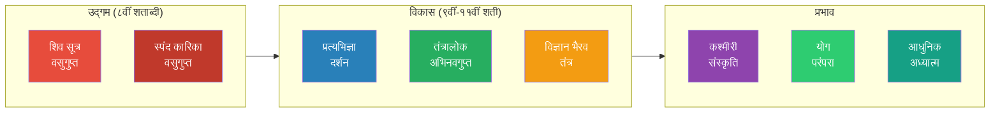
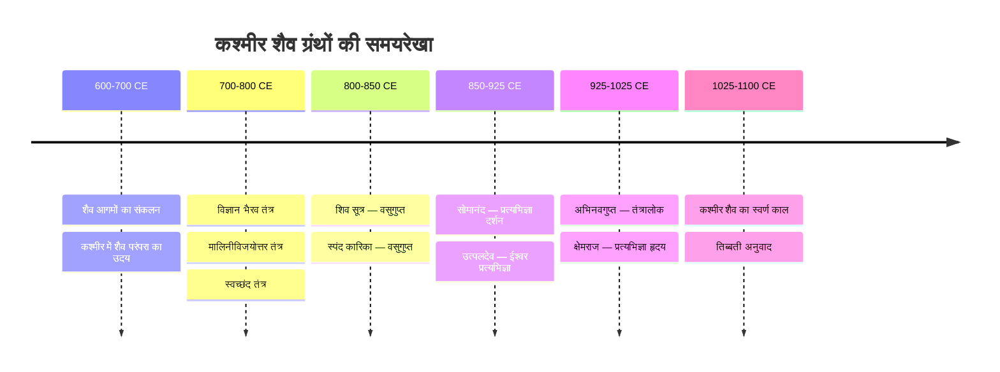
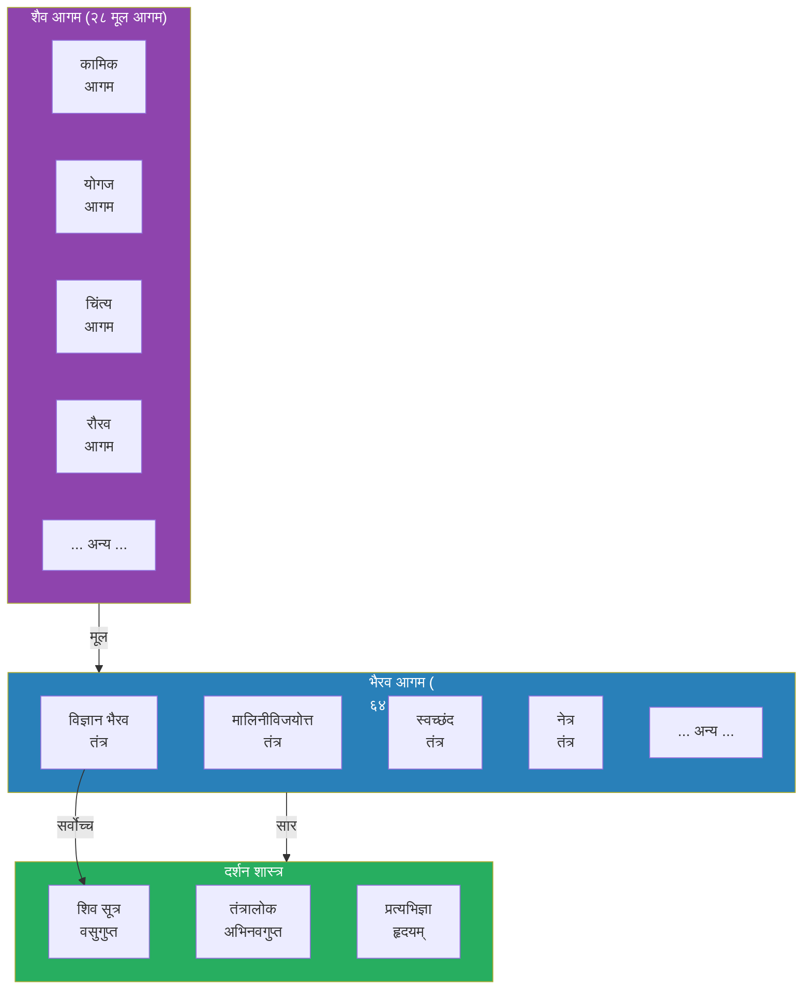
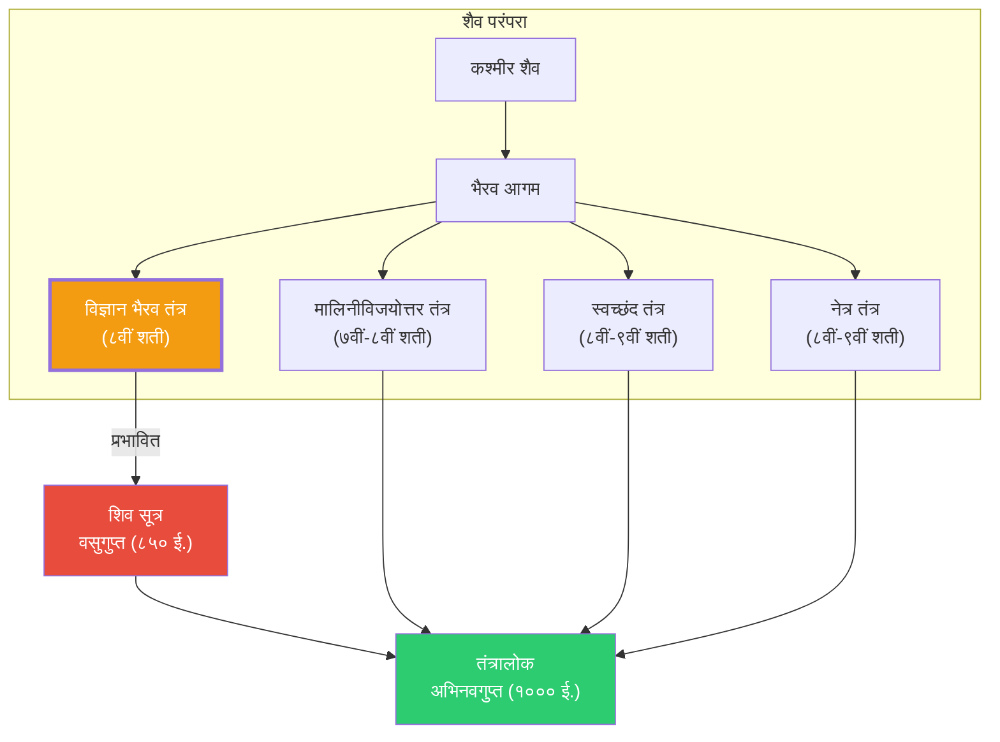
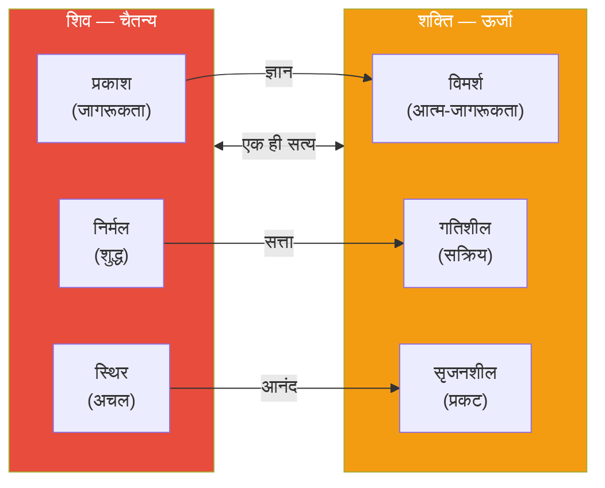
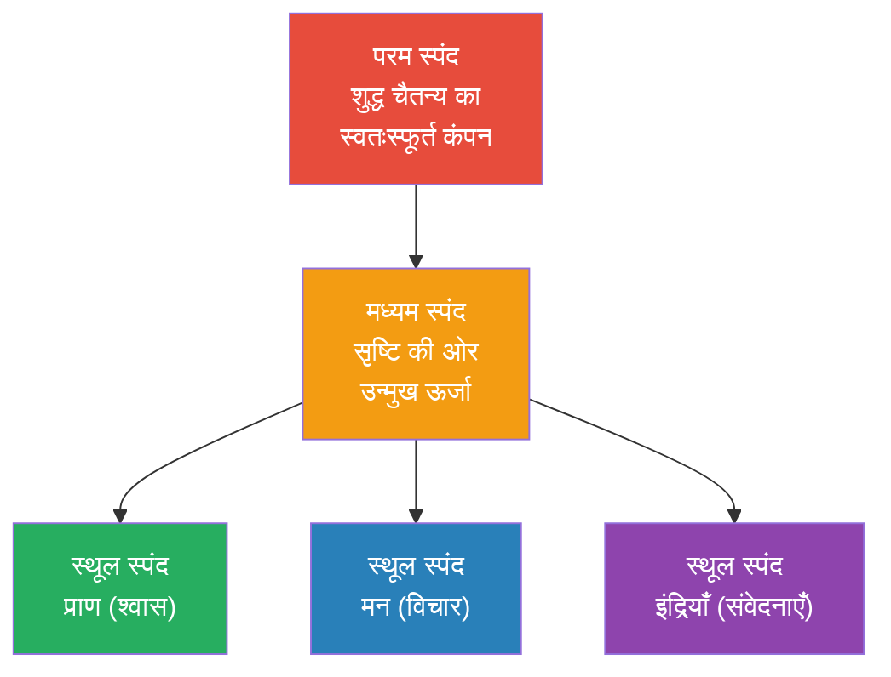

# अध्याय १: परिचय — इतिहास और दर्शन

> **"शिवेन सह भैरवी संवादं विज्ञान भैरवं महत्।"**
> — शिव और भैरवी का महान संवाद, विज्ञान भैरव तंत्र।

---

## सीखने के उद्देश्य (Learning Objectives)

इस अध्याय को पूरा करने के बाद आप:

1. **समझ पाएंगे** कि विज्ञान भैरव तंत्र क्या है और इसका ऐतिहासिक महत्व क्या है।
2. **जान पाएंगे** कश्मीर शैव दर्शन की परंपरा और इस ग्रंथ का उसमें स्थान।
3. **पहचान पाएंगे** ग्रंथ के रचना काल (८वीं शताब्दी ई.) और लेखक परंपरा।
4. **समझ पाएंगे** शिव-शक्ति, स्पंद, और प्रत्यभिज्ञा जैसे मूल दार्शनिक सिद्धांत।
5. **जान पाएंगे** अन्य तंत्र ग्रंथों (मालिनीविजयोत्तर, स्वच्छंद, नेत्र) से इसका संबंध।
6. **सक्षम होंगे** टाइपस्क्रिप्ट में एक ऐतिहासिक समयरेखा विज़ुअलाइज़र बनाने में।

---

## कश्मीर शैव दर्शन — एक परिचय

### कश्मीर शैव क्या है?

कश्मीर शैव (Kashmir Shaivism) भारतीय दर्शन की एक अद्वितीय परंपरा है जो ८वीं से ११वीं शताब्दी के बीच कश्मीर में विकसित हुई। यह अद्वैत (non-dual) दर्शन है जो शिव को परम चैतन्य (Supreme Consciousness) मानता है। इस दर्शन के अनुसार, संपूर्ण ब्रह्मांड शिव की चेतना का विस्तार है।



### कश्मीर शैव दर्शन के मूल सिद्धांत

कश्मीर शैव दर्शन निम्नलिखित मूल सिद्धांतों पर आधारित है:

| सिद्धांत | संस्कृत नाम | अर्थ |
|---------|-------------|------|
| चैतन्य | Caitanya | परम सत्य शुद्ध चेतना है, जड़ पदार्थ नहीं |
| स्वतंत्रता | Svātantrya | शिव की इच्छा स्वतंत्र और स्वतःस्फूर्त है |
| स्पंद | Spanda | ब्रह्मांड शिव की दिव्य स्पंदनशील ऊर्जा से उत्पन्न है |
| अभेद | Abheda | शिव और शक्ति, चेतना और ऊर्जा — ये एक हैं, अलग नहीं |
| प्रत्यभिज्ञा | Pratyabhijñā | मोक्ष का अर्थ है अपने वास्तविक शिव-स्वरूप को पहचानना |
| आभास | Ābhāsa | ब्रह्मांड शिव का आभास है (प्रकटीकरण), कोई पृथक सृष्टि नहीं |

### कश्मीर शैव और अन्य दर्शनों में अंतर

| विषय | कश्मीर शैव | अद्वैत वेदांत | अन्य तंत्र |
|------|------------|-------------|-----------|
| परम सत्य | शिव (चैतन्य) | ब्रह्म (निर्गुण) | शक्ति या देवी |
| जड़ जगत | शिव का आभास | माया-कल्पित | शक्ति का विस्तार |
| मोक्ष | प्रत्यभिज्ञा (पहचान) | जीवन्मुक्ति (माया का नाश) | सिद्धियाँ / कैवल्य |
| साधना | उपाय (आणव/शाक्त/शांभव) | ज्ञान-मार्ग | क्रिया / पूजा |
| ईश्वर | शिव = चैतन्य | सगुण ब्रह्म | देवी-देवता |

## विज्ञान भैरव तंत्र का ऐतिहासिक संदर्भ

### रचना काल (Dating)

विद्वानों के अनुसार विज्ञान भैरव तंत्र की रचना लगभग **८वीं शताब्दी ईस्वी** में हुई। कुछ विद्वान इसे ७वीं शताब्दी के आसपास भी मानते हैं। यह ग्रंथ कश्मीर शैव दर्शन के प्रारंभिक काल में लिखा गया था।



### लेखक और परंपरा (Authorship)

विज्ञान भैरव तंत्र किसी एक लेखक द्वारा लिखित ग्रंथ नहीं है। यह **भैरव और भैरवी के बीच संवाद** के रूप में है, जैसा कि अधिकांश तंत्र ग्रंथों में होता है। तंत्र परंपरा के अनुसार:

> **"देवी उवाच — किं तत्त्वं भैरवेदानीं किं कल्पं किं परायणम्।"**
> (देवी भैरवी ने पूछा — हे भैरव, अब मुझे बताइए कि परम तत्त्व क्या है?)

यह ग्रंथ **भैरव आगम** के अंतर्गत आता है। भैरव आगम, शैव आगमों की ६४ श्रेणियों में से एक है। विज्ञान भैरव तंत्र को इन्हीं आगमों का सार (quintessence) माना जाता है।

### आगम परंपरा



## विज्ञान भैरव तंत्र और अन्य तंत्र ग्रंथ

### मालिनीविजयोत्तर तंत्र (Mālinīvijayottara Tantra)

यह कश्मीर शैव का सबसे महत्वपूर्ण तंत्र ग्रंथ है। अभिनवगुप्त ने इस पर अपनी प्रसिद्ध टीका "तंत्रालोक" लिखी। विज्ञान भैरव तंत्र का इससे गहरा संबंध है।

**समानताएँ:**
- दोनों में भैरव और भैरवी का संवाद है
- दोनों में ध्यान तकनीकों पर बल है
- दोनों कश्मीर शैव के अंतर्गत आते हैं

**अंतर:**
- मालिनीविजयोत्तर में क्रियाकांड और यंत्रों पर अधिक बल
- विज्ञान भैरव में शुद्ध ध्यान और आंतरिक अनुभव पर बल
- विज्ञान भैरव अधिक संक्षिप्त और केंद्रित है

### स्वच्छंद तंत्र (Svacchanda Tantra)

स्वच्छंद तंत्र भी भैरव आगम का एक महत्वपूर्ण ग्रंथ है। इस पर क्षेमराज की टीका उपलब्ध है।

**समानताएँ:**
- दोनों में मंत्र-यंत्र-तंत्र का वर्णन
- दोनों शिव को परम चैतन्य मानते हैं

**अंतर:**
- स्वच्छंद में बाह्य अनुष्ठानों पर अधिक बल
- विज्ञान भैरव में आंतरिक ध्यान और सहज उपायों पर बल
- विज्ञान भैरव अधिक लोकप्रिय और व्यावहारिक

### नेत्र तंत्र (Netra Tantra)

नेत्र तंत्र ("नेत्र" = आँख, नेता) भी भैरव आगम का भाग है।

**समानताएँ:**
- दोनों में तंत्र-मंत्र का उपयोग
- दोनों कश्मीर शैव परंपरा

**अंतर:**
- नेत्र तंत्र में मृत्यु और भय से मुक्ति पर बल
- नेत्र तंत्र अधिक क्रियाकांडी
- विज्ञान भैरव शुद्ध ध्यान और ज्ञान पर केंद्रित

### संबंध चित्र



## दार्शनिक आधार: मुख्य सिद्धांत

### १. शिव-शक्ति सिद्धांत (Śiva-Śakti Tattva)

कश्मीर शैव के अनुसार, परम सत्य दो पहलुओं में प्रकट होता है:

**शिव (Śiva):** चैतन्य का स्थिर, निर्मल, प्रकाशमान पहलू। यह "प्रकाश" (Prakāśa) है — शुद्ध जागरूकता।

**शक्ति (Śakti):** चैतन्य का गतिशील, सक्रिय, क्रियाशील पहलू। यह "विमर्श" (Vimarśa) है — आत्म-जागरूकता की क्रिया।

ये दोनों अलग नहीं हैं, बल्कि एक ही सत्य के दो पहलू हैं। जैसे अग्नि और उसकी उष्णता अलग नहीं हो सकते, वैसे ही शिव और शक्ति अलग नहीं हो सकते।



### २. स्पंद सिद्धांत (Spanda Doctrine)

स्पंद का अर्थ है "दिव्य स्पंदन"। यह कश्मीर शैव का सबसे महत्वपूर्ण सिद्धांत है।

**स्पंद की परिभाषा:**
> "स्फुरति स्पन्दते चेति स्पन्दः" — जो स्फुरित (चमकता) और स्पंदित (कंपित) होता है, वह स्पंद है।

स्पंद का अर्थ है:
- ब्रह्मांड की मूल ऊर्जा का सूक्ष्म स्पंदन
- शिव और शक्ति के एकीकरण से उत्पन्न दिव्य कंपन
- प्रत्येक वस्तु में विद्यमान जीवन-शक्ति का स्पंदन
- श्वास, विचार, भावना — सब स्पंद के रूप हैं

**स्पंद के स्तर:**

| स्तर | नाम | विवरण |
|:----:|-----|--------|
| १ | परम स्पंद | शुद्ध चैतन्य का स्वतःस्फूर्त स्पंदन |
| २ | मध्यम स्पंद | सृष्टि की ओर उन्मुख ऊर्जा का स्पंदन |
| ३ | स्थूल स्पंद | प्राण, मन और इंद्रियों का स्पंदन |



### ३. प्रत्यभिज्ञा दर्शन (Pratyabhijñā Philosophy)

प्रत्यभिज्ञा का शाब्दिक अर्थ है "पुनः पहचानना" (Re-cognition)।

**प्रत्यभिज्ञा का सार:**
> "प्रत्यभिज्ञा — अपने वास्तविक स्वरूप को पहचानना कि तुम शिव हो, जो तुम हमेशा से थे। यह कोई नई प्राप्ति नहीं, बल्कि भूल को दूर करना है।"

प्रत्यभिज्ञा दर्शन के अनुसार, मोक्ष का अर्थ कुछ नया प्राप्त करना नहीं है, बल्कि अपने वास्तविक स्वरूप (शिव-चैतन्य) को पहचानना है। हम भूल गए हैं कि हम शिव हैं — यही अज्ञान है। प्रत्यभिज्ञा इस भूल को दूर करती है।

**प्रत्यभिज्ञा के सिद्धांत:**

| क्रम | सिद्धांत | अर्थ |
|:---:|---------|------|
| १ | आत्म-प्रकाश | मैं शुद्ध चैतन्य हूँ, जो स्वयं प्रकाशित है |
| २ | आत्म-स्वातंत्र्य | मैं स्वतंत्र हूँ, मेरी इच्छा में कोई बंधन नहीं |
| ३ | आत्म-आनंद | मेरा स्वभाव आनंद है, बाहरी सुख नहीं |
| ४ | सर्वात्मभाव | सब कुछ मुझमें है और मैं सबमें हूँ |
| ५ | कृतार्थता | मैं पहले से ही पूर्ण हूँ, मुझे कुछ पाने की आवश्यकता नहीं |

## विज्ञान भैरव तंत्र का महत्व

### आध्यात्मिक दृष्टि से

विज्ञान भैरव तंत्र अद्वितीय है क्योंकि:

1. **११२ विभिन्न तकनीकें** — यह सबसे बड़ा ध्यान संग्रह है
2. **सभी स्तरों के लिए** — शुरुआती से लेकर उन्नत तक
3. **बिना अनुष्ठान के** — किसी बाहरी पूजा, मंत्र या यंत्र की आवश्यकता नहीं
4. **सहज मार्ग** — जीवन की सामान्य स्थितियों में अभ्यास संभव
5. **सार्वभौमिक** — किसी विशेष धर्म या संप्रदाय से बंधा नहीं

### ऐतिहासिक दृष्टि से

- प्रारंभिक कश्मीर शैव का महत्वपूर्ण ग्रंथ
- अभिनवगुप्त ने अपने "तंत्रालोक" में इसका उल्लेख किया
- क्षेमराज ने इस पर टीका लिखी
- तिब्बती बौद्ध परंपरा में अनूदित और संरक्षित
- आधुनिक काल में ओशो, जयदेव सिंह और पॉल रेप्स द्वारा प्रसारित

### आधुनिक काल में प्रासंगिकता

आज के तनावपूर्ण जीवन में विज्ञान भैरव तंत्र अत्यंत प्रासंगिक है:

- तनाव प्रबंधन के लिए श्वास तकनीकें
- एकाग्रता बढ़ाने के लिए दृष्टि तकनीकें
- भावनात्मक संतुलन के लिए भावना तकनीकें
- नींद सुधारने के लिए श्रवण तकनीकें
- आत्म-जागरूकता के लिए चैतन्य तकनीकें

## टाइपस्क्रिप्ट: कश्मीर शैव समयरेखा विज़ुअलाइज़र

```typescript
/**
 * कश्मीर शैव साहित्य — ऐतिहासिक समयरेखा विज़ुअलाइज़र
 * Kashmir Shaiva Literature — Historical Timeline Visualizer
 */

// ===== डेटा संरचनाएँ =====

/** साहित्यिक कृति का प्रतिरूप */
interface LiteraryWork {
  id: string;
  titleSanskrit: string;
  titleHindi: string;
  titleEnglish: string;
  century: number;              // शताब्दी (जैसे ८ = ८वीं शती)
  yearStart: number;            // अनुमानित आरंभ वर्ष
  yearEnd: number;              // अनुमानित अंत वर्ष
  author: string;
  authorSanskrit: string;
  type: 'agama' | 'sutra' | 'karika' | 'commentary' | 'philosophy' | 'tantra';
  description: string;
  significance: string[];
  relatedWorks: string[];
}

/** ऐतिहासिक कालखंड */
interface HistoricalPeriod {
  id: string;
  name: string;
  startYear: number;
  endYear: number;
  description: string;
  keyEvents: string[];
}

/** विद्वान का प्रतिरूप */
interface Scholar {
  id: string;
  nameSanskrit: string;
  nameHindi: string;
  nameEnglish: string;
  century: number;
  birthYear: number;
  deathYear: number;
  keyWorks: string[];
  contributions: string[];
  lineage: string;
  guru: string;
  shishya: string[];
}

// ===== डेटा संग्रह =====

class KashmirShaivismTimeline {
  private works: LiteraryWork[] = [];
  private periods: HistoricalPeriod[] = [];
  private scholars: Scholar[] = [];

  constructor() {
    this.initializeData();
  }

  /** डेटा प्रारंभ */
  private initializeData(): void {
    // === ऐतिहासिक कालखंड ===
    this.periods.push({
      id: 'pre-tantra',
      name: 'पूर्व-तांत्रिक काल',
      startYear: 500,
      endYear: 700,
      description: 'शैव परंपरा का प्रारंभिक रूप, आगम साहित्य का निर्माण',
      keyEvents: ['शैव आगमों का संकलन', 'कश्मीर में शैव मंदिरों का निर्माण'],
    });

    this.periods.push({
      id: 'early-tantra',
      name: 'प्रारंभिक तांत्रिक काल',
      startYear: 700,
      endYear: 850,
      description: 'भैरव आगमों का विकास, विज्ञान भैरव तंत्र की रचना',
      keyEvents: ['विज्ञान भैरव तंत्र की रचना', 'मालिनीविजयोत्तर तंत्र', 'स्वच्छंद तंत्र'],
    });

    this.periods.push({
      id: 'classical',
      name: 'शास्त्रीय काल',
      startYear: 850,
      endYear: 1000,
      description: 'कश्मीर शैव दर्शन का स्वर्ण काल, प्रत्यभिज्ञा दर्शन का विकास',
      keyEvents: ['शिव सूत्र', 'प्रत्यभिज्ञा दर्शन', 'सोमानंद', 'उत्पलदेव'],
    });

    this.periods.push({
      id: 'golden',
      name: 'स्वर्ण काल',
      startYear: 1000,
      endYear: 1100,
      description: 'अभिनवगुप्त और क्षेमराज का काल, सर्वाधिक ग्रंथ रचना',
      keyEvents: ['तंत्रालोक', 'प्रत्यभिज्ञा हृदय', 'विवेक विवेचन'],
    });

    this.periods.push({
      id: 'decline',
      name: 'पतन और संरक्षण',
      startYear: 1100,
      endYear: 1400,
      description: 'कश्मीर में शैव परंपरा का पतन, तिब्बत में संरक्षण',
      keyEvents: ['तिब्बती अनुवाद', 'कश्मीर में इस्लाम का आगमन'],
    });

    // === साहित्यिक कृतियाँ ===
    this.works.push({
      id: 'vbt',
      titleSanskrit: 'विज्ञान भैरव तंत्र',
      titleHindi: 'विज्ञान भैरव तंत्र',
      titleEnglish: 'Vijñāna Bhairava Tantra',
      century: 8,
      yearStart: 750,
      yearEnd: 800,
      author: 'भैरव-भैरवी संवाद',
      authorSanskrit: 'भैरव-भैरवी संवाद',
      type: 'tantra',
      description: '११२ ध्यान तकनीकों का अद्वितीय संग्रह, भैरव और भैरवी का संवाद',
      significance: [
        'सबसे बड़ा ध्यान तकनीक संग्रह',
        'तीनों उपायों का वर्णन',
        'कश्मीर शैव का सर्वाधिक लोकप्रिय ग्रंथ',
      ],
      relatedWorks: ['malini', 'svacchanda', 'netra'],
    });

    this.works.push({
      id: 'malini',
      titleSanskrit: 'मालिनीविजयोत्तर तंत्र',
      titleHindi: 'मालिनीविजयोत्तर तंत्र',
      titleEnglish: 'Mālinīvijayottara Tantra',
      century: 8,
      yearStart: 700,
      yearEnd: 800,
      author: 'भैरव-भैरवी संवाद',
      authorSanskrit: 'भैरव-भैरवी संवाद',
      type: 'tantra',
      description: 'कश्मीर शैव का सबसे महत्वपूर्ण तंत्र ग्रंथ, अभिनवगुप्त का प्रमुख आधार',
      significance: [
        'तंत्रालोक का प्रमुख स्रोत',
        'मालिनी मंत्र पर आधारित',
        'क्रिया और ज्ञान दोनों का समन्वय',
      ],
      relatedWorks: ['vbt', 'ta'],
    });

    this.works.push({
      id: 'shiva-sutra',
      titleSanskrit: 'शिव सूत्र',
      titleHindi: 'शिव सूत्र',
      titleEnglish: 'Śiva Sūtra',
      century: 9,
      yearStart: 850,
      yearEnd: 860,
      author: 'वसुगुप्त',
      authorSanskrit: 'वसुगुप्त',
      type: 'sutra',
      description: 'कश्मीर शैव का मूल सूत्र ग्रंथ, ७७ सूत्रों में संपूर्ण दर्शन',
      significance: [
        'कश्मीर शैव का आधारस्तंभ',
        'त्रिक दर्शन का प्रथम ग्रंथ',
        'वसुगुप्त को शिव का प्रत्यक्ष साक्षात्कार',
      ],
      relatedWorks: ['spanda', 'vbt'],
    });

    this.works.push({
      id: 'spanda',
      titleSanskrit: 'स्पंद कारिका',
      titleHindi: 'स्पंद कारिका',
      titleEnglish: 'Spanda Kārikā',
      century: 9,
      yearStart: 860,
      yearEnd: 870,
      author: 'वसुगुप्त',
      authorSanskrit: 'वसुगुप्त',
      type: 'karika',
      description: 'स्पंद सिद्धांत का कारिका-रूप में वर्णन, कश्मीर शैव का दूसरा मूल ग्रंथ',
      significance: [
        'स्पंद सिद्धांत का प्रतिपादन',
        '५२ कारिकाएँ',
        'कल्लट द्वारा प्रसिद्ध टीका',
      ],
      relatedWorks: ['shiva-sutra', 'vbt'],
    });

    this.works.push({
      id: 'ta',
      titleSanskrit: 'तंत्रालोक',
      titleHindi: 'तंत्रालोक',
      titleEnglish: 'Tantrāloka',
      century: 11,
      yearStart: 1000,
      yearEnd: 1015,
      author: 'अभिनवगुप्त',
      authorSanskrit: 'अभिनवगुप्त',
      type: 'commentary',
      description: 'अभिनवगुप्त का महाकाव्य ग्रंथ, ३७ आह्निकों (अध्यायों) में कश्मीर शैव का विश्वकोश',
      significance: [
        'कश्मीर शैव का सबसे बड़ा ग्रंथ',
        'मालिनीविजयोत्तर पर टीका',
        'समस्त तांत्रिक ज्ञान का संग्रह',
      ],
      relatedWorks: ['malini', 'vbt', 'svacchanda'],
    });

    this.works.push({
      id: 'pratyabhijna',
      titleSanskrit: 'ईश्वर प्रत्यभिज्ञा',
      titleHindi: 'ईश्वर प्रत्यभिज्ञा',
      titleEnglish: 'Īśvara Pratyabhijñā',
      century: 10,
      yearStart: 900,
      yearEnd: 925,
      author: 'उत्पलदेव',
      authorSanskrit: 'उत्पलदेव',
      type: 'philosophy',
      description: 'प्रत्यभिज्ञा दर्शन का मूल ग्रंथ, १८ अध्यायों में शिव-चैतन्य का प्रतिपादन',
      significance: [
        'प्रत्यभिज्ञा दर्शन की स्थापना',
        'तार्किक प्रमाण सहित आध्यात्मिक सिद्धांत',
        'अभिनवगुप्त द्वारा विवृति',
      ],
      relatedWorks: ['ta', 'shiva-sutra'],
    });

    // === विद्वान ===
    this.scholars.push({
      id: 'vasugupta',
      nameSanskrit: 'वसुगुप्त',
      nameHindi: 'वसुगुप्त',
      nameEnglish: 'Vasugupta',
      century: 9,
      birthYear: 800,
      deathYear: 880,
      keyWorks: ['शिव सूत्र', 'स्पंद कारिका'],
      contributions: [
        'कश्मीर शैव के त्रिक दर्शन की स्थापना',
        'शिव सूत्रों का प्रकाशन (हरदत्त से प्राप्त)',
        'स्पंद सिद्धांत का प्रतिपादन',
      ],
      lineage: 'त्रिक (Trika)',
      guru: '— (स्वयं शिव से साक्षात्कार)',
      shishya: ['कल्लट', 'भास्कर'],
    });

    this.scholars.push({
      id: 'somananda',
      nameSanskrit: 'सोमानंद',
      nameHindi: 'सोमानंद',
      nameEnglish: 'Somananda',
      century: 9,
      birthYear: 875,
      deathYear: 925,
      keyWorks: ['शिव दृष्टि'],
      contributions: [
        'प्रत्यभिज्ञा दर्शन के संस्थापक',
        'शिव दृष्टि में अद्वैत सिद्धांत का प्रतिपादन',
      ],
      lineage: 'प्रत्यभिज्ञा (Pratyabhijñā)',
      guru: 'वसुगुप्त परंपरा',
      shishya: ['उत्पलदेव'],
    });

    this.scholars.push({
      id: 'utpaladeva',
      nameSanskrit: 'उत्पलदेव',
      nameHindi: 'उत्पलदेव',
      nameEnglish: 'Utpaladeva',
      century: 10,
      birthYear: 900,
      deathYear: 950,
      keyWorks: ['ईश्वर प्रत्यभिज्ञा', 'ईश्वर प्रत्यभिज्ञा कारिका'],
      contributions: [
        'प्रत्यभिज्ञा दर्शन को पूर्णता प्रदान',
        'शिव को स्वतंत्र चैतन्य के रूप में स्थापित',
      ],
      lineage: 'प्रत्यभिज्ञा (Pratyabhijñā)',
      guru: 'सोमानंद',
      shishya: ['अभिनवगुप्त', 'लक्ष्मण गुप्त'],
    });

    this.scholars.push({
      id: 'abhinavagupta',
      nameSanskrit: 'अभिनवगुप्त',
      nameHindi: 'अभिनवगुप्त',
      nameEnglish: 'Abhinavagupta',
      century: 11,
      birthYear: 950,
      deathYear: 1025,
      keyWorks: ['तंत्रालोक', 'तंत्रसार', 'ईश्वर प्रत्यभिज्ञा विवृति', 'अभिनव भारती', 'लोचन'],
      contributions: [
        'कश्मीर शैव का सर्वश्रेष्ठ विद्वान',
        'तंत्रालोक में सभी तंत्रों का समन्वय',
        'नाट्य शास्त्र पर अभिनव भारती',
        'ध्वन्यालोक पर लोचन टीका',
      ],
      lineage: 'त्रिक-प्रत्यभिज्ञा समन्वय',
      guru: 'लक्ष्मण गुप्त, भट्ट इंदुराज, भट्ट तोथुल',
      shishya: ['क्षेमराज', 'मधुराज', 'योगराज'],
    });

    this.scholars.push({
      id: 'kshemaraja',
      nameSanskrit: 'क्षेमराज',
      nameHindi: 'क्षेमराज',
      nameEnglish: 'Kṣemarāja',
      century: 11,
      birthYear: 975,
      deathYear: 1050,
      keyWorks: ['प्रत्यभिज्ञा हृदयम्', 'शिव सूत्र विमर्शिनी', 'स्पंद संदोह'],
      contributions: [
        'प्रत्यभिज्ञा हृदय में दर्शन का सार',
        'शिव सूत्र विमर्शिनी — सर्वोत्तम टीका',
        'अभिनवगुप्त के प्रमुख शिष्य',
      ],
      lineage: 'त्रिक-प्रत्यभिज्ञा',
      guru: 'अभिनवगुप्त',
      shishya: [],
    });
  }

  /** समयरेखा प्रदर्शन */
  displayTimeline(): string {
    let output = '\n=== कश्मीर शैव साहित्य समयरेखा ===\n\n';
    
    for (const period of this.periods.sort((a, b) => a.startYear - b.startYear)) {
      const periodWorks = this.works.filter(
        w => w.yearStart >= period.startYear && w.yearStart < period.endYear
      );
      const periodScholars = this.scholars.filter(
        s => s.birthYear >= period.startYear && s.birthYear < period.endYear
      );
      
      output += `\n${'─'.repeat(60)}\n`;
      output += `📜 ${period.name} (${period.startYear}-${period.endYear})\n`;
      output += `${period.description}\n\n`;
      
      output += `  महत्वपूर्ण घटनाएँ:\n`;
      for (const event of period.keyEvents) {
        output += `    • ${event}\n`;
      }
      
      if (periodWorks.length > 0) {
        output += `\n  रचनाएँ:\n`;
        for (const work of periodWorks) {
          output += `    📖 ${work.titleSanskrit} (${work.titleEnglish})\n`;
          output += `       — ${work.description}\n`;
        }
      }
      
      if (periodScholars.length > 0) {
        output += `\n  विद्वान:\n`;
        for (const scholar of periodScholars) {
          output += `    🧑‍🏫 ${scholar.nameSanskrit} (${scholar.birthYear}-${scholar.deathYear})\n`;
          output += `       — ${scholar.contributions.join(', ')}\n`;
        }
      }
    }
    
    output += `\n${'═'.repeat(60)}\n`;
    return output;
  }

  /** ग्रंथ संबंध मैप */
  generateRelationMap(): string {
    let output = '\n=== ग्रंथ संबंध मैप ===\n\n';
    
    output += '  प्रमुख ग्रंथ और उनके संबंध:\n\n';
    
    for (const work of this.works) {
      const related = work.relatedWorks
        .map(id => this.works.find(w => w.id === id)?.titleSanskrit || id)
        .join(', ');
      
      output += `  📖 ${work.titleSanskrit} (${work.titleEnglish})\n`;
      output += `     प्रकार: ${work.type}\n`;
      output += `     शताब्दी: ${work.century}वीं\n`;
      output += `     संबंधित: ${related}\n\n`;
    }
    
    return output;
  }

  /** विद्वान वंशावली */
  displayLineage(): string {
    let output = '\n=== कश्मीर शैव गुरु-शिष्य परंपरा ===\n\n';
    
    for (const scholar of this.scholars) {
      output += `  🧑‍🏫 ${scholar.nameSanskrit}\n`;
      output += `     गुरु: ${scholar.guru}\n`;
      output += `     शिष्य: ${scholar.shishya.join(', ') || '—'}\n`;
      output += `     प्रमुख कृतियाँ: ${scholar.keyWorks.join(', ')}\n\n`;
    }
    
    return output;
  }

  /** ग्रंथ सांख्यिकी */
  getStatistics(): Record<string, number> {
    return {
      totalWorks: this.works.length,
      totalPeriods: this.periods.length,
      totalScholars: this.scholars.length,
      tantras: this.works.filter(w => w.type === 'tantra').length,
      sutras: this.works.filter(w => w.type === 'sutra').length,
      commentaries: this.works.filter(w => w.type === 'commentary').length,
      philosophies: this.works.filter(w => w.type === 'philosophy').length,
      centuriesRange: this.works.reduce(
        (max, w) => Math.max(max, w.century),
        this.works.reduce((min, w) => Math.min(min, w.century), 100)
      ) - this.works.reduce((min, w) => Math.min(min, w.century), 100),
    };
  }

  /** पूर्ण रिपोर्ट */
  generateReport(): void {
    console.log('╔══════════════════════════════════════════╗');
    console.log('║   कश्मीर शैव — ऐतिहासिक सर्वेक्षण      ║');
    console.log('╠══════════════════════════════════════════╣');
    
    const stats = this.getStatistics();
    console.log(`║ कुल ग्रंथ: ${stats.totalWorks}                          ║`);
    console.log(`║ तंत्र: ${stats.tantras}  सूत्र: ${stats.sutras}           ║`);
    console.log(`║ टीका: ${stats.commentaries}  दर्शन: ${stats.philosophies}         ║`);
    console.log(`║ काल-सीमा: ${stats.centuriesRange} शताब्दियाँ              ║`);
    console.log('╚══════════════════════════════════════════╝');
    
    console.log(this.displayTimeline());
  }
}

// ===== उपयोग उदाहरण =====
const timeline = new KashmirShaivismTimeline();
timeline.generateReport();
console.log(timeline.generateRelationMap());
console.log(timeline.displayLineage());

export { KashmirShaivismTimeline, LiteraryWork, HistoricalPeriod, Scholar };
```

## सारांश (Summary)

इस अध्याय में हमने सीखा:

1. **विज्ञान भैरव तंत्र** एक अद्वितीय तंत्र ग्रंथ है जिसमें ११२ ध्यान तकनीकों का संग्रह है।
2. यह **कश्मीर शैव दर्शन** के अंतर्गत आता है, जो शिव को परम चैतन्य मानता है।
3. ग्रंथ की रचना **८वीं शताब्दी ईस्वी** में हुई।
4. यह **भैरव-भैरवी के संवाद** के रूप में है।
5. तीन मूल सिद्धांत: **शिव-शक्ति** (चैतन्य और ऊर्जा), **स्पंद** (दिव्य स्पंदन), **प्रत्यभिज्ञा** (पुनः पहचान)।
6. इसका अन्य तंत्रों — **मालिनीविजयोत्तर, स्वच्छंद, नेत्र** — से गहरा संबंध है।
7. यह ग्रंथ **सार्वभौमिक** है और किसी विशेष धर्म या संप्रदाय से बंधा नहीं।

---

## अध्याय प्रश्नोत्तरी (Chapter Quiz)

**प्रश्न १:** विज्ञान भैरव तंत्र की रचना किस शताब्दी में हुई?
- (अ) ५वीं शताब्दी
- (ब) ८वीं शताब्दी ✓
- (स) १२वीं शताब्दी
- (द) १५वीं शताब्दी

**प्रश्न २:** विज्ञान भैरव तंत्र किस दर्शन परंपरा से संबंधित है?
- (अ) अद्वैत वेदांत
- (ब) बौद्ध दर्शन
- (स) कश्मीर शैव दर्शन ✓
- (द) जैन दर्शन

**प्रश्न ३:** कश्मीर शैव के अनुसार परम सत्य क्या है?
- (अ) ब्रह्म (निर्गुण)
- (ब) शिव (चैतन्य) ✓
- (स) शून्य
- (द) पुरुष

**प्रश्न ४:** "स्पंद" का अर्थ क्या है?
- (अ) शांति
- (ब) स्पंदन / दिव्य कंपन ✓
- (स) एकाग्रता
- (द) मोक्ष

**प्रश्न ५:** "प्रत्यभिज्ञा" का शाब्दिक अर्थ क्या है?
- (अ) नया ज्ञान प्राप्त करना
- (ब) पुनः पहचानना ✓
- (स) त्याग करना
- (द) सिद्धि प्राप्त करना

**प्रश्न ६:** विज्ञान भैरव तंत्र में कितनी ध्यान तकनीकें हैं?
- (अ) ५०
- (ब) ७५
- (स) ११२ ✓
- (द) २००

**प्रश्न ७:** निम्नलिखित में से कौन सा ग्रंथ कश्मीर शैव से संबंधित नहीं है?
- (अ) शिव सूत्र
- (ब) स्पंद कारिका
- (स) योग सूत्र ✓
- (द) ईश्वर प्रत्यभिज्ञा

**प्रश्न ८:** कश्मीर शैव में शिव और शक्ति के संबंध को कैसे समझाया गया है?
- (अ) वे अलग-अलग हैं
- (ब) वे एक ही सत्य के दो पहलू हैं ✓
- (स) शक्ति शिव से श्रेष्ठ है
- (द) शिव शक्ति से श्रेष्ठ है

**प्रश्न ९:** "तंत्रालोक" के लेखक कौन हैं?
- (अ) वसुगुप्त
- (ब) क्षेमराज
- (स) अभिनवगुप्त ✓
- (द) उत्पलदेव

**प्रश्न १०:** विज्ञान भैरव तंत्र को आधुनिक काल में किसने प्रसिद्ध किया?
- (अ) स्वामी विवेकानंद
- (ब) ओशो (रजनीश) ✓
- (स) महर्षि महेश योगी
- (द) श्री अरविंद

---

## अभ्यास (Exercises)

### अभ्यास १: स्वाध्याय (पाठ पढ़ना)
विज्ञान भैरव तंत्र का मूल संस्कृत पाठ पढ़ें। कोई भी ऑनलाइन संस्करण खोजें और प्रथम ५ श्लोक पढ़ें। अपने विचार लिखें।

### अभ्यास २: दार्शनिक तुलना
कश्मीर शैव और अद्वैत वेदांत के बीच समानताएँ और अंतर लिखें। कम से कम ५ बिंदु लिखें।

### अभ्यास ३: समयरेखा बनाएं
कश्मीर शैव के प्रमुख ग्रंथों और विद्वानों की एक समयरेखा बनाएं (हाथ से या डिजिटल रूप में)।

### अभ्यास ४: टाइपस्क्रिप्ट प्रोजेक्ट
दिए गए टाइमलाइन विज़ुअलाइज़र को चलाएं और उसमें निम्नलिखित जोड़ें:
- कम से कम ३ नए ग्रंथ
- २ नए विद्वान
- एक नई श्रेणी "modern" (आधुनिक व्याख्याकार)

### अभ्यास ५: ध्यान अभ्यास
किसी भी एक सरल श्वास तकनीक का ५ मिनट अभ्यास करें:
१. कुर्सी या आसन पर आराम से बैठें
२. आँखें बंद करें
३. श्वास को स्वाभाविक रूप से आते-जाते देखें
४. ५ मिनट तक इसी तरह बैठे रहें
५. अनुभव को डायरी में लिखें

### अभ्यास ६: शोध प्रश्न
निम्नलिखित प्रश्नों में से किसी एक पर ५०० शब्दों का निबंध लिखें:
- विज्ञान भैरव तंत्र का आधुनिक मनोविज्ञान से संबंध
- कश्मीर शैव और कश्मीरी संस्कृति का संबंध
- प्रत्यभिज्ञा दर्शन की आधुनिक प्रासंगिकता

---

## आगे की पढ़ाई (Further Reading)

इस अध्याय में सीखी गई बातों को गहरा करने के लिए:

- **Jaideva Singh** — "Vijñāna Bhairava: The Yoga of Delight, Wonder, and Astonishment"
- **Mark Dyczkowski** — "The Doctrine of Vibration: An Analysis of the Doctrines and Practices of Kashmir Shaivism"
- **क्षेमराज** — "शिव सूत्र विमर्शिनी" (हिंदी अनुवाद)
- **Osho** — "Vigyan Bhairav Tantra" Vol. 1-5

---

*"शिवः शक्त्या युक्तः शिवः शक्तः शिवः शक्तिः शिवः शिवः।"*
*— शिव शक्ति से युक्त होकर सक्षम होता है, अन्यथा वह शिव ही है (चैतन्य मात्र)।*
