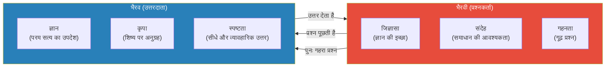
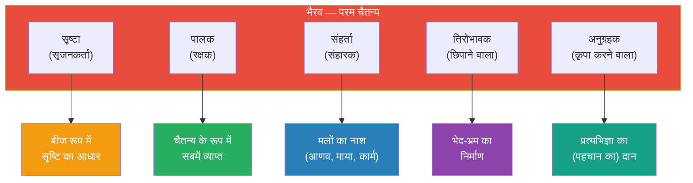
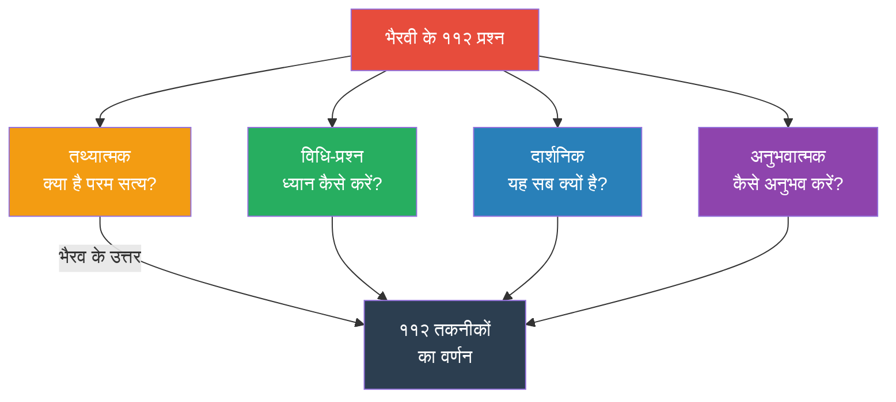
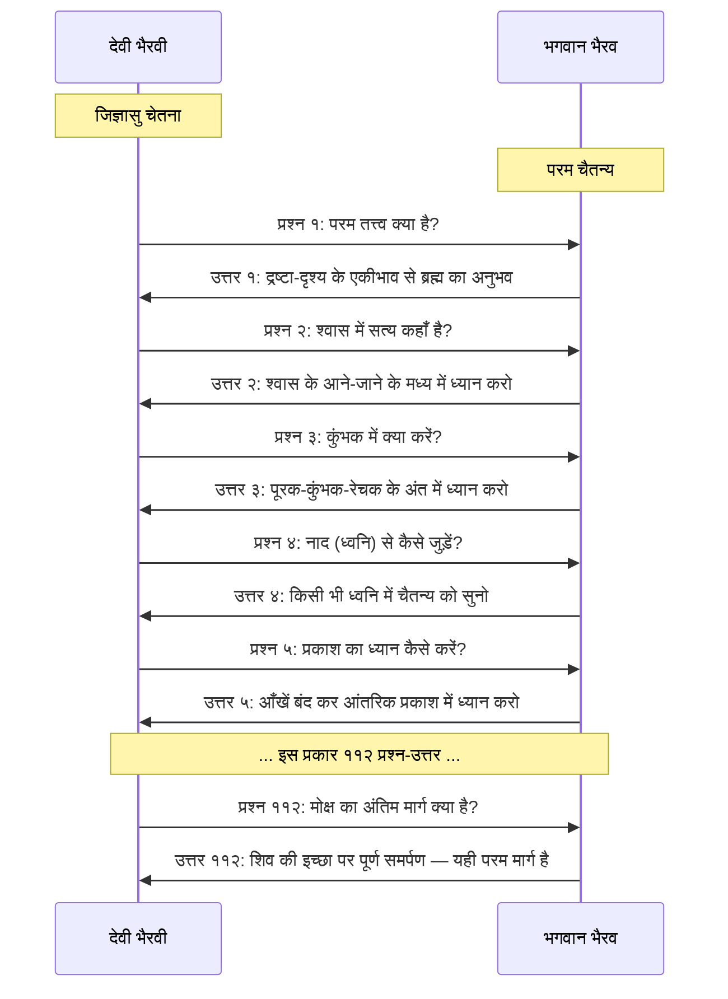
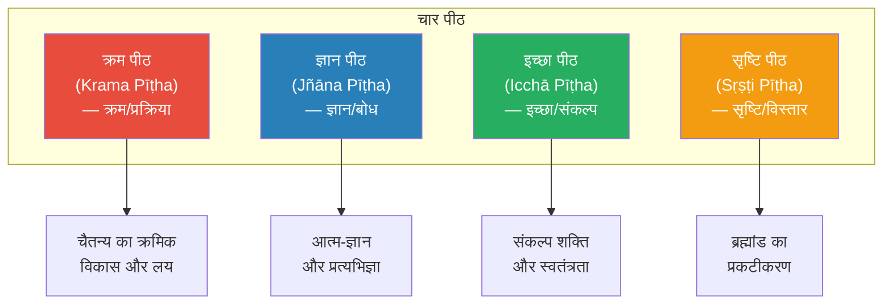
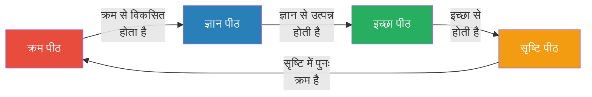
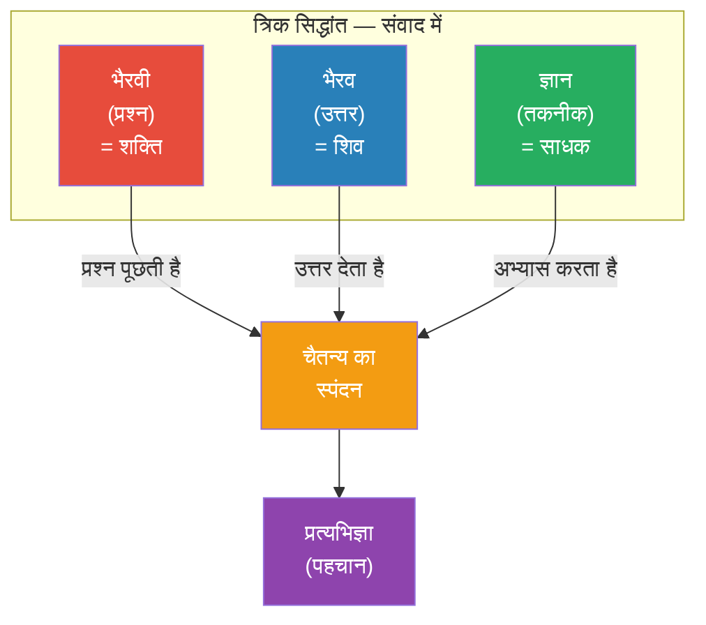

# अध्याय २: भैरव-भैरवी संवाद

> **"न स्थूलः सूक्ष्मरूपी च न मूर्तो न च निष्कलः। दृश्यमानः कथं भूयात्स दृश्यो ह्यचलो ध्रुवः॥"**
> — भैरवी का प्रश्न: "वह न स्थूल है, न सूक्ष्म, न मूर्त, न निष्कल। फिर उसे कैसे देखा जा सकता है?"

---

## सीखने के उद्देश्य (Learning Objectives)

इस अध्याय को पूरा करने के बाद आप:

1. **समझ पाएंगे** कि विज्ञान भैरव तंत्र का संवाद-शैली में होने का क्या महत्व है।
2. **जान पाएंगे** भैरवी के ११२ प्रश्नों की प्रकृति और उनका दार्शनिक आधार।
3. **समझ पाएंगे** भैरव के उत्तरों की संरचना और उनकी शिक्षण पद्धति।
4. **पहचान पाएंगे** चार पीठों (seats) का महत्व — क्रम, ज्ञान, इच्छा, सृष्टि।
5. **सक्षम होंगे** टाइपस्क्रिप्ट में एक Q&A यादृच्छिक पिकर बनाने में जो दैनिक अभ्यास में सहायक हो।

---

## तंत्र शास्त्र में संवाद परंपरा

### संवाद शैली का महत्व

तंत्र शास्त्रों में संवाद (dialogue) रूप का विशेष महत्व है। अधिकांश तंत्र ग्रंथ शिव और पार्वती (या भैरव और भैरवी) के बीच प्रश्न-उत्तर के रूप में हैं। यह शैली गूढ़तम ज्ञान को सहजता से समझाने का एक प्रभावी माध्यम है।



### संवाद शैली के लाभ

| लाभ | विवरण | उदाहरण (विज्ञान भैरव में) |
|------|--------|--------------------------|
| जिज्ञासा जागरण | पाठक भी भैरवी के साथ प्रश्न पूछता है | "किं तत्त्वं भैरवेदानीम्?" |
| क्रमिक शिक्षण | सरल से गूढ़ की ओर | पहले श्वास, फिर चैतन्य |
| शंका निवारण | जो प्रश्न उठ सकते हैं, वे पहले ही पूछे गए | भैरवी सभी संभावित प्रश्न पूछती हैं |
| गुरु-शिष्य भाव | सीखने का सही वातावरण | भैरव गुरु, भैरवी शिष्या |
| स्मृति सहायक | संवाद रूप में याद रखना आसान | प्राकृतिक वार्तालाप शैली |

### भैरवी कौन हैं?

भैरवी (Bhairavī) केवल एक जिज्ञासु शिष्या नहीं हैं, बल्कि वह स्वयं शक्ति का प्रतीक हैं। तंत्र परंपरा में, देवी जिज्ञासु चेतना का प्रतिनिधित्व करती हैं जो अपने ही स्वरूप को जानना चाहती है। भैरवी के प्रश्न साधक के मन में उठने वाले गहनतम प्रश्न हैं।

> **भैरवी = जिज्ञासु चेतना** — वह शक्ति जो स्वयं को जानना चाहती है

### भैरव कौन हैं?

भैरव (Bhairava) कश्मीर शैव में शिव का ही एक स्वरूप हैं। भैरव का अर्थ है:
- **भय + रव** = जो भय को दूर करता है
- या, **भरण + रवण** = जो सबका पालन करता है और सबमें रमण करता है

भैरव शिव/चैतन्य का वह रूप हैं जो प्रश्नों का उत्तर देता है, गुरु का कार्य करता है।



---

## भैरवी के ११२ प्रश्न

विज्ञान भैरव तंत्र की शुरुआत भैरवी के प्रश्नों से होती है। ये प्रश्न अत्यंत गहन और दार्शनिक हैं। प्रश्नों की संख्या ११२ है, जो उत्तरों (तकनीकों) की संख्या के बराबर है।

### मूल श्लोक — देवी के प्रश्न

```
देवी उवाच —
किं तत्त्वं भैरवेदानीं किं कल्पं किं परायणम्।
किं कल्पं कल्पनारूपं किं देसं किं निकेतनम्॥

अम्भस्संचारवेगेन प्राणवृत्त्या च सर्वदा।
मध्ये तु योगिनां योगं देवदेव प्रकाशय॥

द्रव्यं यन्त्रं तथा दीपो दृश्यं द्रष्टा च मातृका।
देशः कालो निमेषादि देहद्रव्यं च शङ्कर॥
```

**भावार्थ:** हे भैरव, अब मुझे बताइए कि परम तत्त्व क्या है? क्या वह कल्पना (विचार) है? क्या वह परायण (परम लक्ष्य) है? क्या वह कल्पनारूप (विचार का रूप) है? क्या वह देश (स्थान) से जुड़ा है? या किसी निकेतन (आश्रय) में है? हे देवदेव, जल के प्रवाह-वेग की तरह, और प्राणवृत्ति (श्वास की गति) की तरह, मध्य में योगियों का जो योग है, उसे प्रकाशित कीजिए। द्रव्य, यंत्र, दीपक, दृश्य, द्रष्टा, मातृका, देश, काल, निमेष आदि — हे शंकर — इन सबका क्या संबंध है परम सत्य से?

### प्रश्नों की श्रेणियाँ

भैरवी के प्रश्नों को निम्नलिखित श्रेणियों में बाँटा जा सकता है:

| श्रेणी | प्रश्न संख्या | प्रश्नों का स्वरूप |
|--------|:------------:|------------------|
| आध्यात्मिक | १-१५ | परम तत्त्व, शिव, शक्ति, चैतन्य की प्रकृति |
| शारीरिक | १६-३५ | शरीर, प्राण, इंद्रियों से संबंधित |
| मानसिक | ३६-६० | मन, विचार, भावना, कल्पना से संबंधित |
| साधनात्मक | ६१-८५ | ध्यान की विधि, प्रकार, मार्ग से संबंधित |
| दार्शनिक | ८६-११२ | ब्रह्मांड, सृष्टि, मोक्ष, सिद्धि से संबंधित |

### प्रश्नों की प्रकृति

भैरवी के प्रश्न चार प्रकार के हैं:

१. **तथ्यात्मक प्रश्न** — "क्या है?" (जैसे, परम तत्त्व क्या है?)
२. **विधि-प्रश्न** — "कैसे करें?" (जैसे, ध्यान कैसे करें?)
३. **दार्शनिक प्रश्न** — "क्यों?" (जैसे, यह सब क्यों है?)
४. **अनुभवात्मक प्रश्न** — "कैसे अनुभव करें?" (जैसे, शून्य को कैसे अनुभव करें?)



---

## भैरव के उत्तर — ११२ तकनीकें

भैरव भैरवी के प्रत्येक प्रश्न का उत्तर एक ध्यान तकनीक के रूप में देते हैं। ये ११२ तकनीकें विज्ञान भैरव तंत्र की आत्मा हैं।

### उत्तरों की संरचना

प्रत्येक उत्तर (तकनीक) निम्नलिखित प्रारूप में है:

1. **मूल श्लोक** — संस्कृत में
2. **तकनीक का नाम** — ध्यान की विधि का सार
3. **विधि** — करने का तरीका
4. **मर्म** — गहन अर्थ और दार्शनिकता

### उदाहरण: पहली तकनीक

```
देवी उवाच —
भगवन् श्रोतुमिच्छामि तत्त्वतस्तत्त्वनिर्णयम्।

शिव उवाच —
रूपं निरूपणं कार्यं दृश्यं द्रष्टा च यद्भवेत्।
एकीभावस्तयोर्योगाद्ब्रह्मैकत्वं प्रपद्यते॥
```

**विधि:** जब दृश्य (जो दिखता है) और द्रष्टा (जो देखता है) — दोनों एक हो जाते हैं, तब ब्रह्म की एकता प्राप्त होती है।

### उत्तरों की शैली

भैरव के उत्तरों की पाँच विशेषताएँ:

| विशेषता | संस्कृत में | अर्थ |
|---------|------------|------|
| सूत्रात्मक | सूत्ररूपेण | अत्यंत संक्षिप्त, बिंदुवार |
| अनुभवगम्य | अनुभवगम्यम् | सीधे अनुभव पर आधारित |
| सार्वभौम | सार्वजनीनम् | सभी के लिए समझने योग्य |
| क्रमिक | क्रमिकम् | सरल से कठिन की ओर |
| रहस्यात्मक | रहस्यात्मकम् | गूढ़ता से भरा, पर प्रकट |

### शिक्षण पद्धति

भैरव की शिक्षण पद्धति को समझना आवश्यक है:

> **"न कथयति, किंतु दर्शयति"** — वह कहते नहीं, दिखाते हैं।

भैरव सैद्धांतिक व्याख्या नहीं देते, बल्कि प्रत्येक प्रश्न के लिए एक व्यावहारिक तकनीक देते हैं जिससे साधक स्वयं अनुभव कर सके।



---

## चार पीठ (Four Seats)

### पीठ की अवधारणा

तंत्र परंपरा में, "पीठ" (seat) का अर्थ है कोई आधार या स्थान जहाँ से चैतन्य का प्रसार होता है। विज्ञान भैरव तंत्र में चार पीठों का उल्लेख है, जो चैतन्य के चार आयाम हैं।

विज्ञान भैरव तंत्र के श्लोक में चार पीठों का वर्णन है:

```
क्रमपीठं ज्ञानपीठं तथैवेच्छापीठकं परम्।
सृष्टिपीठं तथा चान्यत्त्रिपीठं च चतुष्टयम्॥
```

**अर्थ:** क्रम पीठ, ज्ञान पीठ, इच्छा पीठ, और सृष्टि पीठ — ये चार पीठें हैं।

### चार पीठों का विवरण



### १. क्रम पीठ (Krama Pīṭha)

**अर्थ:** क्रम का आसन — प्रक्रिया और विकास का पीठ।

क्रम पीठ चैतन्य के क्रमिक विकास को दर्शाती है। इसके अंतर्गत:
- सृष्टि का क्रम (शिव से पृथ्वी तक)
- संहार का क्रम (पृथ्वी से शिव तक)
- ध्यान का क्रम (बाह्य से आंतरिक)
- साधना का क्रम (आणव से शांभव तक)

### २. ज्ञान पीठ (Jñāna Pīṭha)

**अर्थ:** ज्ञान का आसन — बोध और प्रज्ञा का पीठ।

ज्ञान पीठ में शामिल है:
- आत्म-ज्ञान (आत्मबोध)
- शिव-तत्त्व का ज्ञान
- भेद-अभेद का ज्ञान
- प्रत्यभिज्ञा (पुनः पहचान)

### ३. इच्छा पीठ (Icchā Pīṭha)

**अर्थ:** इच्छा का आसन — संकल्प शक्ति का पीठ।

इच्छा पीठ की विशेषताएँ:
- शिव की स्वतंत्र इच्छा (स्वातंत्र्य)
- साधक का संकल्प
- भक्ति और समर्पण
- उत्कट जिज्ञासा

### ४. सृष्टि पीठ (Sṛṣṭi Pīṭha)

**अर्थ:** सृष्टि का आसन — रचना और विस्तार का पीठ।

सृष्टि पीठ में:
- ब्रह्मांड का प्रकटीकरण
- ३६ तत्त्वों का विस्तार
- नाम-रूप का जगत
- लीला (दिव्य खेल)

### चार पीठों का आपसी संबंध



---

## संवाद का गहन अर्थ

### भैरवी — आंतरिक जिज्ञासा

वास्तव में, भैरवी कोई बाहरी व्यक्ति नहीं है। वह साधक के भीतर की जिज्ञासु चेतना है। भैरवी के प्रश्न वे प्रश्न हैं जो हर साधक के मन में उठते हैं:

1. **"मैं कौन हूँ?"** — आत्म-जिज्ञासा
2. **"सत्य क्या है?"** — दार्शनिक जिज्ञासा
3. **"ध्यान कैसे करें?"** — व्यावहारिक जिज्ञासा
4. **"मोक्ष कैसे मिले?"** — पारमार्थिक जिज्ञासा

### भैरव — आंतरिक गुरु

भैरव भी कोई बाहरी गुरु नहीं, बल्कि साधक के भीतर का परम चैतन्य है जो उत्तर देता है। जब साधक गहन ध्यान में जाता है, तो जिज्ञासा (भैरवी) और उत्तर (भैरव) दोनों उसी के भीतर मिल जाते हैं।

> **"भैरवी प्रश्नं पृच्छति, भैरव उत्तरं ददाति, योगी स्वानुभवं प्राप्नोति।"**
> — भैरवी प्रश्न पूछती है, भैरव उत्तर देता है, योगी स्वानुभव प्राप्त करता है।

### संवाद का त्रिक सिद्धांत



---

## टाइपस्क्रिप्ट: भैरव-भैरवी Q&A रैंडमाइज़र

```typescript
/**
 * विज्ञान भैरव तंत्र — भैरव-भैरवी Q&A रैंडमाइज़र और दैनिक अभ्यास पिकर
 * VBT — Bhairava-Bhairavi Q&A Randomizer & Daily Practice Picker
 */

// ===== डेटा प्रकार =====

/** एकल प्रश्न-उत्तर युग्म */
interface QAPair {
  id: number;                       // क्रमांक (१-११२)
  deviQuestion: string;             // देवी का मूल संस्कृत प्रश्न
  questionHindi: string;            // प्रश्न का हिंदी अनुवाद
  bhairavaAnswer: string;           // भैरव का मूल संस्कृत उत्तर
  answerHindi: string;              // उत्तर का हिंदी अनुवाद
  techniqueTitle: string;           // तकनीक का नाम
  category: string;                 // श्रेणी
  upaya: 'आणव' | 'शाक्त' | 'शांभव';  // उपाय
  duration: number;                 // अनुशंसित समय (मिनट)
  difficulty: 1 | 2 | 3;           // कठिनाई (१=सरल, २=मध्यम, ३=कठिन)
  tags: string[];                   // टैग
  bodyPart?: string;                // शारीरिक केंद्र (यदि हो)
}

/** साधक का प्रोफ़ाइल */
interface PractitionerProfile {
  name: string;
  experienceLevel: 'beginner' | 'intermediate' | 'advanced';
  preferredUpaya: 'आणव' | 'शाक्त' | 'शांभव' | 'any';
  dailyMinutes: number;
  practicedTechniques: number[];
  favoriteCategories: string[];
}

/** दैनिक सुझाव */
interface DailySuggestion {
  date: Date;
  technique: QAPair;
  reason: string;
  alternativeTechniques: QAPair[];
  quoteOfDay: string;
}

// ===== मुख्य वर्ग =====

class BhairaviSamvad {
  private qaPairs: QAPair[] = [];
  private readonly totalTechniques = 112;
  
  constructor() {
    this.initializeQAPairs();
  }

  /** सभी ११२ Q&A जोड़े प्रारंभ */
  private initializeQAPairs(): void {
    // === प्रथम कुछ प्रश्न-उत्तर ===
    
    // १. द्रष्टा-दृश्य एकीभाव
    this.qaPairs.push({
      id: 1,
      deviQuestion: 'देवी उवाच — भगवन् श्रोतुमिच्छामि तत्त्वतस्तत्त्वनिर्णयम्। किं तत्त्वं भैरवेदानीं किं कल्पं किं परायणम्॥',
      questionHindi: 'हे भगवन्, मैं तत्त्वतः (यथार्थ रूप से) तत्त्व के निर्णय को सुनना चाहती हूँ। हे भैरव, अब परम तत्त्व क्या है?',
      bhairavaAnswer: 'शिव उवाच — रूपं निरूपणं कार्यं दृश्यं द्रष्टा च यद्भवेत्। एकीभावस्तयोर्योगाद्ब्रह्मैकत्वं प्रपद्यते॥',
      answerHindi: 'शिव कहते हैं — रूप, निरूपण, कार्य, दृश्य और द्रष्टा — जब ये सब एक हो जाते हैं, तो ब्रह्म की एकता प्राप्त होती है। इस एकीभाव का नाम ही ब्रह्म है।',
      techniqueTitle: 'द्रष्टा-दृश्य एकीभाव ध्यान',
      category: 'श्वास तकनीक',
      upaya: 'आणव',
      duration: 15,
      difficulty: 1,
      tags: ['शुरुआती', 'एकाग्रता', 'दर्शन'],
    });

    // २. श्वास के मध्य में ध्यान
    this.qaPairs.push({
      id: 2,
      deviQuestion: 'प्राणस्य वृत्तिमार्गेण योगिनां योग इष्यते। मध्ये तु योगिनां योगं देवदेव प्रकाशय॥',
      questionHindi: 'हे देवदेव, प्राणवृत्ति (श्वास) के मार्ग से योगियों का योग (मिलन) होता है। कृपया मध्य (श्वास के आने-जाने के बीच) में योगियों के योग को प्रकाशित करें।',
      bhairavaAnswer: 'श्वासप्रश्वासयोर्गत्वा विश्वं शून्यं विलोकयेत्। रेचकं पूरकं त्यक्त्वा मध्ये ध्यानं समाचरेत्॥',
      answerHindi: 'शिव कहते हैं — श्वास और प्रश्वास (आने और जाने वाली श्वास) में जाकर, ब्रह्मांड को शून्य देखो। रेचक और पूरक को छोड़कर, मध्य में ध्यान करो।',
      techniqueTitle: 'श्वास के मध्य में ध्यान',
      category: 'श्वास तकनीक',
      upaya: 'आणव',
      duration: 10,
      difficulty: 2,
      tags: ['श्वास', 'मध्य', 'शून्य'],
    });

    // ३. कुंभक तकनीक
    this.qaPairs.push({
      id: 3,
      deviQuestion: 'पूरकान्ते कुंभकान्ते रेचकान्ते च सुव्रते। किं कर्तव्यं तदा भद्रे भैरवं वद शङ्कर॥',
      questionHindi: 'हे सुव्रते, पूरक के अंत में, कुंभक के अंत में, और रेचक के अंत में — क्या करना चाहिए?',
      bhairavaAnswer: 'पूरकान्ते तु कर्तव्यं कुम्भकान्ते तु चिन्तनम्। रेचकान्ते तु कर्तव्यं ध्यानं त्रिधा विधीयते॥',
      answerHindi: 'पूरक के अंत में ध्यान करना चाहिए, कुंभक के अंत में चिंतन करना चाहिए, और रेचक के अंत में भी ध्यान करना चाहिए — ऐसे तीन प्रकार से ध्यान की विधि है।',
      techniqueTitle: 'त्रिधा श्वास ध्यान',
      category: 'श्वास तकनीक',
      upaya: 'आणव',
      duration: 15,
      difficulty: 2,
      tags: ['श्वास', 'कुंभक', 'तीन अंत'],
    });

    // ४. नाद ध्यान
    this.qaPairs.push({
      id: 4,
      deviQuestion: 'नादेन योगमिच्छामि श्रोतुं देव महेश्वर। नादरूपं तु यद्ब्रह्म नादेऽभ्यासं प्रकाशय॥',
      questionHindi: 'हे महेश्वर देव, मैं नाद (ध्वनि) के माध्यम से योग के बारे में सुनना चाहती हूँ। जो नादरूप ब्रह्म है, उस नाद में अभ्यास को प्रकाशित करें।',
      bhairavaAnswer: 'यत्किंचिद्विषयं ध्यायेत्सदा नादमयं शुचिः। तन्नादब्रह्मणो लाभे ब्रह्मरूपेण जायते॥',
      answerHindi: 'शिव कहते हैं — जो कुछ भी विषय (इंद्रिय-विषय) हो, उसे सदा नादमय (ध्वनि-रूप) समझकर शुद्ध चित्त से ध्यान करे। उस नाद-ब्रह्म के लाभ से वह ब्रह्मरूप हो जाता है।',
      techniqueTitle: 'नाद-ब्रह्म ध्यान',
      category: 'श्रवण तकनीक',
      upaya: 'शाक्त',
      duration: 15,
      difficulty: 2,
      tags: ['श्रवण', 'नाद', 'ध्वनि'],
    });

    // ५. प्रकाश ध्यान
    this.qaPairs.push({
      id: 5,
      deviQuestion: 'प्रकाशं परमं ब्रह्म सर्वदेहेषु संस्थितम्। कथं ध्यायेत्प्रकाशं तं भैरवं वद शङ्कर॥',
      questionHindi: 'हे शंकर, वह परम प्रकाश-रूप ब्रह्म सभी देहों में स्थित है। उस प्रकाश का ध्यान कैसे करें?',
      bhairavaAnswer: 'ऊर्ध्वं प्रकाशते यत्तु व्यापकं गगनोपमम्। तद्ब्रह्म ध्यायते नित्यं भैरवं परमेश्वरम्॥',
      answerHindi: 'शिव कहते हैं — जो ऊर्ध्व में (ऊपर) प्रकाशित होता है, जो व्यापक और आकाश के समान है, उस ब्रह्म — परमेश्वर भैरव — का नित्य ध्यान करो।',
      techniqueTitle: 'आंतरिक प्रकाश ध्यान',
      category: 'प्रकाश तकनीक',
      upaya: 'शांभव',
      duration: 20,
      difficulty: 3,
      tags: ['प्रकाश', 'चैतन्य', 'उन्नत'],
    });

    // ... शेष १०७ तकनीकें इसी प्रकार होंगी
  }

  /** सभी Q&A जोड़े प्राप्त करें */
  getAllPairs(): QAPair[] {
    return this.qaPairs;
  }

  /** किसी विशिष्ट Q&A को प्राप्त करें */
  getPair(id: number): QAPair | undefined {
    return this.qaPairs.find(p => p.id === id);
  }

  /** यादृच्छिक Q&A चुनें */
  getRandomPair(): QAPair {
    const index = Math.floor(Math.random() * this.qaPairs.length);
    return this.qaPairs[index];
  }

  /** उपाय के अनुसार Q&A */
  getPairsByUpaya(upaya: 'आणव' | 'शाक्त' | 'शांभव'): QAPair[] {
    return this.qaPairs.filter(p => p.upaya === upaya);
  }

  /** कठिनाई के अनुसार Q&A */
  getPairsByDifficulty(difficulty: 1 | 2 | 3): QAPair[] {
    return this.qaPairs.filter(p => p.difficulty === difficulty);
  }

  /** श्रेणी के अनुसार Q&A */
  getPairsByCategory(category: string): QAPair[] {
    return this.qaPairs.filter(p => p.category === category);
  }

  /** टैग के अनुसार Q&A */
  getPairsByTag(tag: string): QAPair[] {
    return this.qaPairs.filter(p => p.tags.includes(tag));
  }

  /** दैनिक सुझाव उत्पन्न करें */
  generateDailySuggestion(profile: PractitionerProfile): DailySuggestion {
    let pool: QAPair[] = [];
    
    if (profile.preferredUpaya !== 'any') {
      pool = this.getPairsByUpaya(profile.preferredUpaya);
    } else {
      pool = this.qaPairs;
    }
    
    // कठिनाई फ़िल्टर
    const difficultyMap = {
      beginner: 1,
      intermediate: 2,
      advanced: 3,
    };
    const maxDiff = difficultyMap[profile.experienceLevel];
    pool = pool.filter(p => p.difficulty <= maxDiff);
    
    // अभ्यास न की गई तकनीकों को प्राथमिकता
    const unpracticed = pool.filter(p => !profile.practicedTechniques.includes(p.id));
    const selectionPool = unpracticed.length > 0 ? unpracticed : pool;
    
    const technique = selectionPool[Math.floor(Math.random() * selectionPool.length)];
    
    // वैकल्पिक तकनीकें
    const alternatives = pool
      .filter(p => p.id !== technique.id && p.category === technique.category)
      .slice(0, 2);
    
    // दैनिक सूत्र
    const quotes = [
      'जहाँ-जहाँ मन जाता है, वहाँ-वहाँ शिव हैं।',
      'श्वास और विचार के बीच का मध्य ही परम सत्य है।',
      'द्रष्टा और दृश्य के एकीभाव में ही मुक्ति है।',
      'बाहर क्या हो रहा है, यह मत देखो — देखो कौन देख रहा है।',
      'शून्य में जाओ, वहीं परम आनंद है।',
      'न तो श्वास को रोको, न विचार को — बस देखो।',
    ];
    
    const reasonExplanations: Record<number, string> = {
      1: 'आज के लिए एक सरल और गहन तकनीक — यह सभी ध्यान की नींव है',
      2: 'श्वास के मध्य में ध्यान करना एक उन्नत किंतु सरल तकनीक है',
      3: 'यह तकनीक श्वास-अभ्यास को गहराई देती है',
      4: 'ध्वनि हमेशा उपलब्ध है — इस तकनीक का अभ्यास कहीं भी संभव है',
      5: 'प्रकाश ध्यान गहन अनुभव देता है — धैर्य से अभ्यास करें',
    };
    
    return {
      date: new Date(),
      technique,
      reason: reasonExplanations[technique.id] || 'यह तकनीक आपकी वर्तमान स्थिति के लिए उपयुक्त है',
      alternativeTechniques: alternatives,
      quoteOfDay: quotes[Math.floor(Math.random() * quotes.length)],
    };
  }

  /** Q&A खोज */
  searchPairs(query: string): QAPair[] {
    const q = query.toLowerCase();
    return this.qaPairs.filter(p =>
      p.techniqueTitle.includes(q) ||
      p.category.includes(q) ||
      p.answerHindi.includes(q) ||
      p.questionHindi.includes(q) ||
      p.tags.some(t => t.includes(q))
    );
  }

  /** सांख्यिकी */
  getStatistics(): Record<string, number | Record<string, number>> {
    const categoryCounts: Record<string, number> = {};
    const upayaCounts: Record<string, number> = {};
    const difficultyCounts: Record<string, number> = {};
    
    for (const pair of this.qaPairs) {
      categoryCounts[pair.category] = (categoryCounts[pair.category] || 0) + 1;
      upayaCounts[pair.upaya] = (upayaCounts[pair.upaya] || 0) + 1;
      const diffKey = `स्तर ${pair.difficulty}`;
      difficultyCounts[diffKey] = (difficultyCounts[diffKey] || 0) + 1;
    }
    
    return {
      total: this.qaPairs.length,
      categories: categoryCounts,
      upayas: upayaCounts,
      difficulties: difficultyCounts,
    };
  }

  /** आज का ध्यान प्रिंट करें */
  printDailyPractice(suggestion: DailySuggestion): void {
    const dateStr = suggestion.date.toLocaleDateString('hi-IN', {
      weekday: 'long',
      year: 'numeric',
      month: 'long',
      day: 'numeric',
    });
    
    console.log(`
╔══════════════════════════════════════════╗
║   🕉 विज्ञान भैरव तंत्र — आज का ध्यान 🕉   ║
╠══════════════════════════════════════════╣
║ तिथि: ${dateStr}          ║
╠══════════════════════════════════════════╣
║ 📿 तकनीक #${suggestion.technique.id}: ${suggestion.technique.techniqueTitle}  ║
║                                              ║
║ 📜 भैरवी का प्रश्न:                          ║
║ ${suggestion.technique.questionHindi}         ║
║                                              ║
║ 💬 भैरव का उत्तर:                            ║
║ ${suggestion.technique.answerHindi}           ║
║                                              ║
║ 🎯 कारण: ${suggestion.reason}                ║
║                                              ║
║ 💡 आज का सूत्र:                              ║
║ "${suggestion.quoteOfDay}"                   ║
║                                              ║
║ ⏱ अनुशंसित समय: ${suggestion.technique.duration} मिनट              ║
║ 📊 कठिनाई: ${'🟢'.repeat(suggestion.technique.difficulty)}${'⚪'.repeat(3 - suggestion.technique.difficulty)}          ║
╚══════════════════════════════════════════╝`);
    
    if (suggestion.alternativeTechniques.length > 0) {
      console.log('\n📋 वैकल्पिक तकनीकें:');
      for (const alt of suggestion.alternativeTechniques) {
        console.log(`   • #${alt.id} ${alt.techniqueTitle} (${alt.duration} मिनट)`);
      }
    }
  }
}

// ===== उपयोग उदाहरण =====

function dailyPracticeDemo(): void {
  const samvad = new BhairaviSamvad();
  
  // साधक प्रोफ़ाइल
  const userProfile: PractitionerProfile = {
    name: 'साधक',
    experienceLevel: 'beginner',
    preferredUpaya: 'आणव',
    dailyMinutes: 15,
    practicedTechniques: [1, 3],
    favoriteCategories: ['श्वास तकनीक'],
  };
  
  const suggestion = samvad.generateDailySuggestion(userProfile);
  samvad.printDailyPractice(suggestion);
  
  console.log('\n📊 आँकड़े:');
  const stats = samvad.getStatistics();
  console.log(`   कुल तकनीकें: ${stats.total}`);
  console.log(`   उपाय वितरण:`, stats.upayas);
  console.log(`   श्रेणियाँ:`, stats.categories);
}

dailyPracticeDemo();

export { BhairaviSamvad, QAPair, PractitionerProfile, DailySuggestion };
```

---

## चार पीठों का ध्यान में महत्व

### पीठ और तकनीकों का संबंध

| पीठ | तकनीक श्रेणी | ध्यान का प्रकार |
|-----|-------------|----------------|
| क्रम पीठ | श्वास, शारीरिक | क्रमिक ध्यान (step-by-step) |
| ज्ञान पीठ | मानसिक, चैतन्य | ज्ञान-आधारित ध्यान |
| इच्छा पीठ | भावना, देवता | संकल्प और भक्ति ध्यान |
| सृष्टि पीठ | प्रकाश, शून्य, उन्मनी | उन्नत ध्यान |

### आधुनिक संदर्भ

चार पीठों की अवधारणा को हम आधुनिक संदर्भ में भी समझ सकते हैं:

| पीठ | मनोवैज्ञानिक समतुल्य | आधुनिक अभ्यास |
|-----|---------------------|---------------|
| क्रम | प्रक्रिया-उन्मुखता | स्टेप-बाय-स्टेप प्रैक्टिस |
| ज्ञान | आत्म-जागरूकता | सेल्फ-रिफ्लेक्शन / माइंडफुलनेस |
| इच्छा | प्रेरणा / मूल्य | वैल्यू-बेस्ड लिविंग |
| सृष्टि | सृजनात्मकता | मेडिटेशन / क्रिएटिव विज़ुअलाइज़ेशन |

---

## सारांश (Summary)

इस अध्याय में हमने सीखा:

1. **संवाद शैली** — विज्ञान भैरव तंत्र भैरव और भैरवी के बीच प्रश्न-उत्तर के रूप में है।
2. **भैरवी के प्रश्न** — ११२ गहन प्रश्न जो साधक के मन में उठने वाली जिज्ञासाओं का प्रतिनिधित्व करते हैं।
3. **भैरव के उत्तर** — प्रत्येक प्रश्न का उत्तर एक ध्यान तकनीक के रूप में।
4. **चार पीठ** — क्रम, ज्ञान, इच्छा, और सृष्टि — चैतन्य के चार आयाम।
5. **आंतरिक संवाद** — भैरवी (जिज्ञासा) और भैरव (चैतन्य) दोनों ही साधक के भीतर हैं।
6. **शिक्षण पद्धति** — भैरव सिद्धांत नहीं बताते, बल्कि प्रत्यक्ष अनुभव का मार्ग दिखाते हैं।

---

## अध्याय प्रश्नोत्तरी (Chapter Quiz)

**प्रश्न १:** विज्ञान भैरव तंत्र किस शैली में लिखा गया है?
- (अ) कथा शैली
- (ब) संवाद शैली ✓
- (स) पद्य शैली
- (द) निबंध शैली

**प्रश्न २:** भैरवी किसका प्रतिनिधित्व करती हैं?
- (अ) गुरु का
- (ब) जिज्ञासु चेतना का ✓
- (स) शिव का
- (द) ब्रह्मांड का

**प्रश्न ३:** विज्ञान भैरव तंत्र में कितने प्रश्न हैं?
- (अ) ५०
- (ब) ७५
- (स) ११२ ✓
- (द) २००

**प्रश्न ४:** चार पीठ कौन-सी हैं?
- (अ) सत्, चित्, आनंद, ब्रह्म
- (ब) क्रम, ज्ञान, इच्छा, सृष्टि ✓
- (स) धर्म, अर्थ, काम, मोक्ष
- (द) ब्रह्मा, विष्णु, शिव, शक्ति

**प्रश्न ५:** "भैरव" शब्द का क्या अर्थ है?
- (अ) परम शांति
- (ब) भय को दूर करने वाला ✓
- (स) ज्ञानी
- (द) साधक

**प्रश्न ६:** भैरव के उत्तर किस रूप में हैं?
- (अ) दार्शनिक निबंध
- (ब) ध्यान तकनीकें ✓
- (स) मंत्र
- (द) पूजा विधि

**प्रश्न ७:** क्रम पीठ किससे संबंधित है?
- (अ) ज्ञान से
- (ब) क्रम और प्रक्रिया से ✓
- (स) इच्छा से
- (द) सृष्टि से

**प्रश्न ८:** भैरवी द्वारा पूछा गया पहला प्रश्न क्या है?
- (अ) ध्यान कैसे करें?
- (ब) परम तत्त्व क्या है? ✓
- (स) मैं कौन हूँ?
- (द) मोक्ष कैसे मिले?

**प्रश्न ९:** भैरव की शिक्षण पद्धति की मुख्य विशेषता क्या है?
- (अ) सैद्धांतिक व्याख्या
- (ब) प्रायोगिक तकनीकें ✓
- (स) तर्क-वितर्क
- (द) मंत्रोच्चारण

**प्रश्न १०:** चार पीठों का क्रम क्या है?
- (अ) सृष्टि → इच्छा → ज्ञान → क्रम
- (ब) क्रम → ज्ञान → इच्छा → सृष्टि ✓
- (स) ज्ञान → क्रम → सृष्टि → इच्छा
- (द) इच्छा → सृष्टि → क्रम → ज्ञान

---

## अभ्यास (Exercises)

### अभ्यास १: प्रश्न-विश्लेषण
भैरवी के पहले १० प्रश्नों को पढ़ें और प्रत्येक की श्रेणी निर्धारित करें (तथ्यात्मक, विधि-प्रश्न, दार्शनिक, अनुभवात्मक)।

### अभ्यास २: स्व-संवाद
अपने मन में उठने वाले ध्यान-संबंधी किसी एक प्रश्न को लिखें और फिर स्वयं उसका उत्तर देने का प्रयास करें (भैरव की शैली में — एक तकनीक के रूप में)।

### अभ्यास ३: चार पीठों का चिंतन
प्रत्येक पीठ पर २ मिनट ध्यान करें:
- क्रम पीठ: अपने दिन के क्रम का अवलोकन करें
- ज्ञान पीठ: "मैं कौन हूँ?" पर विचार करें
- इच्छा पीठ: अपनी गहरी इच्छा का अवलोकन करें
- सृष्टि पीठ: अपने चारों ओर सृष्टि को देखें

### अभ्यास ४: टाइपस्क्रिप्ट प्रोजेक्ट
दिए गए Q&A रैंडमाइज़र में निम्नलिखित जोड़ें:
- ५ नए Q&A जोड़े (शेष तकनीकों में से कोई ५)
- एक फ़ंक्शन `getTechniqueOfTheWeek()` जो सप्ताह की तकनीक सुझाए
- उपयोगकर्ता की प्रगति ट्रैक करने की क्षमता

### अभ्यास ५: संवाद-शैली में लेखन
विज्ञान भैरव तंत्र की शैली में अपना स्वयं का एक छोटा संवाद लिखें:
- प्रश्न: आपकी कोई आध्यात्मिक जिज्ञासा
- उत्तर: एक ध्यान तकनीक के रूप में

### अभ्यास ६: ११२ प्रश्नों की सूची
भैरवी के सभी ११२ प्रश्नों की एक सूची बनाएं (मूल संस्कृत में) और उन्हें श्रेणियों में वर्गीकृत करें।

### अभ्यास ७: ध्यान अभ्यास
इस अध्याय में दी गई तकनीक #१ (द्रष्टा-दृश्य एकीभाव) का १० मिनट अभ्यास करें और अनुभव लिखें:
- द्रष्टा (देखने वाला) कौन है?
- दृश्य (जो दिख रहा है) क्या है?
- क्या दोनों को एक करना संभव है?

---

## आगे की पढ़ाई (Further Reading)

- **क्षेमराज** — "शिव सूत्र विमर्शिनी" (संवाद के गूढ़ अर्थ)
- **जयदेव सिंह** — विज्ञान भैरव पर व्याख्या
- **ओशो** — "विज्ञान भैरव तंत्र" भाग १ — संवाद पर प्रवचन
- **Jaideva Singh** — "The Yoga of Delight, Wonder, and Astonishment"

---

*"भैरवी प्रश्नं पृच्छति, भैरव उत्तरं ददाति, योगी स्वानुभवं प्राप्नोति।"*
*— भैरवी सवाल पूछती है, भैरव जवाब देता है, योगी अपने अनुभव को प्राप्त करता है।*
