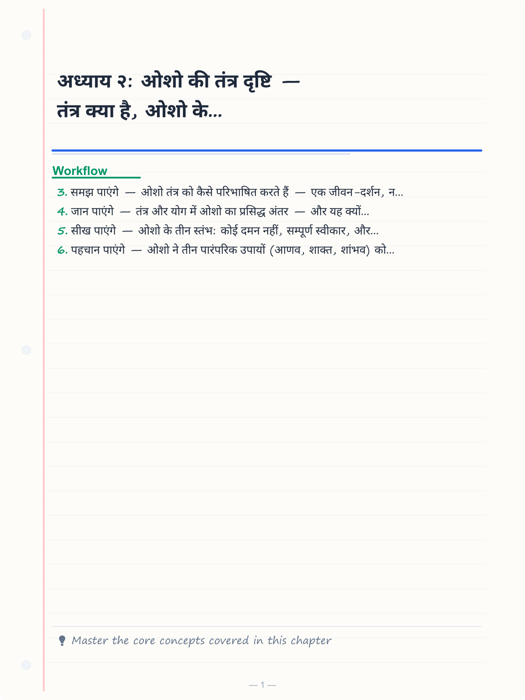
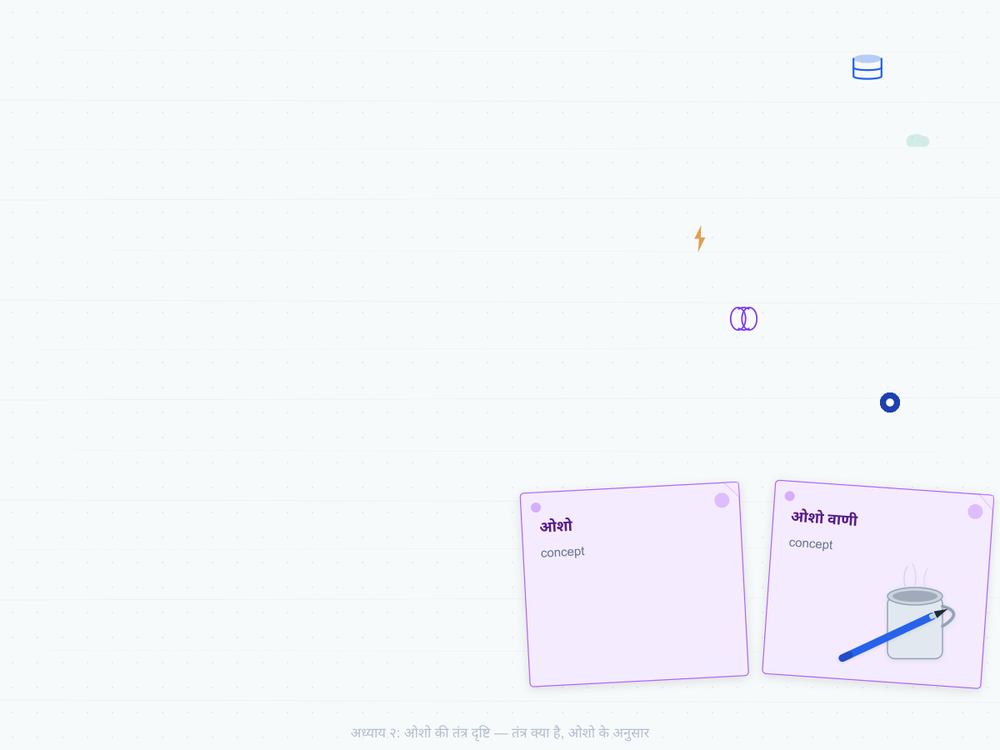
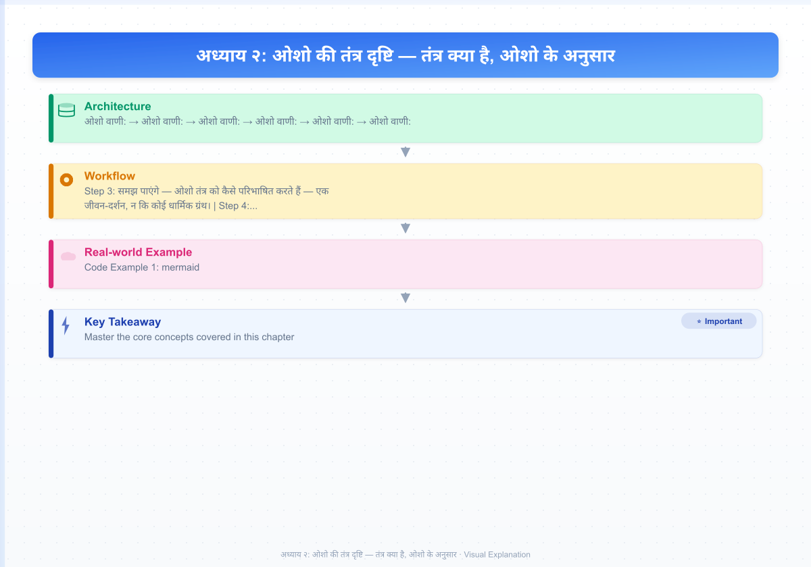

# अध्याय २: ओशो की तंत्र दृष्टि — तंत्र क्या है, ओशो के अनुसार

> **"तंत्र कोई धर्म नहीं है — यह एक विज्ञान है। यह सिद्धांतों का संग्रह नहीं — यह प्रयोगों की प्रयोगशाला है।"**
> — **ओशो**

---

**ओशो वाणी:**
> "तंत्र शब्द सुनते ही लोग डर जाते हैं। उनके मन में अजीब-अजीब तस्वीरें आती हैं — काले जादू, यौन अनुष्ठान, कुछ गुप्त और खतरनाक चीज़ें। लेकिन तंत्र का अर्थ है — विस्तार। तंत्र का अर्थ है — बुनाई। तंत्र का अर्थ है — धागों को जोड़ना। यह जीवन को समग्र रूप से देखने का विज्ञान है।"

---

<!-- Image Gallery -->
<section class="lesson-visuals" aria-label="Visual learning resources">
  <header><span>VISUAL LEARNING</span><h2>See it. Review it. Remember it.</h2></header>
  <a class="lesson-visual-card" href="../../assets/images/lessons/vigyan-bhairav-tantra/02-osho-tantra-drishti/handwritten-notes.png" target="_blank" rel="noopener">
    
    <span><strong>Handwritten notes</strong>Condensed notes for deliberate review.</span>
  </a>
  <a class="lesson-visual-card" href="../../assets/images/lessons/vigyan-bhairav-tantra/02-osho-tantra-drishti/sticky-notes.png" target="_blank" rel="noopener">
    
    <span><strong>Sticky-note revision</strong>Fast recall prompts for revision.</span>
  </a>
  <a class="lesson-visual-card" href="../../assets/images/lessons/vigyan-bhairav-tantra/02-osho-tantra-drishti/visual-explanation.png" target="_blank" rel="noopener">
    
    <span><strong>Visual concept guide</strong>A connected explanation of the key ideas.</span>
  </a>
</section>
<!-- End Image Gallery -->

## सीखने के उद्देश्य (Learning Objectives)

इस अध्याय को पूरा करने के बाद आप:

1. **समझ पाएंगे** — ओशो तंत्र को कैसे परिभाषित करते हैं — एक जीवन-दर्शन, न कि कोई धार्मिक ग्रंथ।
2. **जान पाएंगे** — तंत्र और योग में ओशो का प्रसिद्ध अंतर — और यह क्यों क्रांतिकारी है।
3. **सीख पाएंगे** — ओशो के तीन स्तंभ: कोई दमन नहीं, सम्पूर्ण स्वीकार, और जागरूकता के माध्यम से परिवर्तन।
4. **पहचान पाएंगे** — ओशो ने तीन पारंपरिक उपायों (आणव, शाक्त, शांभव) को कैसे पुनर्व्याख्यायित किया।
5. **सक्षम होंगे** — टाइपस्क्रिप्ट में तंत्र-योग तुलनात्मक विश्लेषण उपकरण बनाने में।

---

## ओशो की तंत्र परिभाषा: पारंपरिक से अलग

### तंत्र शब्द का अर्थ

तंत्र शब्द संस्कृत धातु **"तन"** से बना है — जिसका अर्थ है फैलाना, विस्तार करना, बुनना। तंत्र का अर्थ है — वह विज्ञान जो सीमित को असीम में बदल दे।

**ओशो वाणी:**
> "तंत्र का अर्थ है — बुनाई। जैसे करघे पर कपड़ा बुना जाता है — ताना और बाना — ऊपर-नीचे, दाएँ-बाएँ — ऐसे ही जीवन भी एक बुनाई है। शरीर और मन, पुरुष और प्रकृति, शिव और शक्ति — सब एक दूसरे में गुंथे हैं। तंत्र इसी बुनाई को समझने का विज्ञान है।"

| पारंपरिक अर्थ | ओशो का अर्थ |
|--------------|------------|
| तंत्र = शास्त्र, ग्रंथ | तंत्र = जीने की कला, चेतना का विज्ञान |
| तंत्र = अनुष्ठान और मंत्र | तंत्र = हर पल में जागरूकता |
| तंत्र = गुप्त साधना | तंत्र = खुला प्रयोग — सबके लिए |
| तंत्र = शक्ति की उपासना | तंत्र = अपनी ही ऊर्जा को जानना |
| तंत्र = यौन क्रियाएँ | तंत्र = सम्पूर्ण जीवन को स्वीकार |

### ओशो तंत्र को कैसे देखते हैं?

ओशो के लिए तंत्र केवल ११२ तकनीकों का संग्रह नहीं है — यह जीवन को देखने का एक नया ढंग है। यह एक मनोवैज्ञानिक और आध्यात्मिक क्रांति है।

**ओशो वाणी:**
> "तंत्र कहता है — जो कुछ भी है, उसका उपयोग करो। किसी चीज़ को छोड़ो मत। किसी चीज़ का दमन मत करो। क्रोध को दबाओ मत — क्रोध को देखो। काम को दबाओ मत — काम को समझो। लोभ को दबाओ मत — लोभ का विश्लेषण करो। हर चीज़ को सीढ़ी बनाया जा सकता है — बशर्ते तुम जागरूक हो।"

यह ओशो का सबसे क्रांतिकारी संदेश है। सदियों से धर्मों ने सिखाया — छोड़ो, त्यागो, दबाओ। ओशो कहते हैं — उपयोग करो, समझो, बदलो।

---

## तंत्र vs योग: ओशो का प्रसिद्ध अंतर

ओशो ने अपने प्रवचनों में बार-बार योग और तंत्र के बीच का अंतर समझाया। उनके अनुसार, यह दोनों दृष्टियाँ बिल्कुल विपरीत हैं।

**ओशो वाणी:**
> "योग संघर्ष है — तंत्र समर्पण है। योग कहता है — तुम गिर गए हो, तुम्हें ऊपर उठना होगा। तंत्र कहता है — तुम वहीं हो जहाँ होना चाहिए — बस जागो। योग शरीर को दुश्मन मानता है — तंत्र शरीर को मंदिर मानता है। योग इन्द्रियों को बंद करना चाहता है — तंत्र इन्द्रियों को खोलना चाहता है। योग ऊर्जा को रोकना चाहता है — तंत्र ऊर्जा को नाचने देना चाहता है।"

```mermaid
flowchart TB
    subgraph Yoga["योग — ओशो की दृष्टि में"]
        direction TB
        Y1["मूल विचार: अहंकार को तोड़ो"]
        Y2["विधि: संघर्ष, नियंत्रण, दमन"]
        Y3["शरीर: शत्रु — जिसे वश में करना है"]
        Y4["इन्द्रियाँ: द्वार बंद करो"]
        Y5["काम: ऊर्ध्वीकरण — उसे ऊपर खींचो"]
        Y6["संसार: माया — त्यागो"]
        Y7["लक्ष्य: समाधि — अलग होना"]
        Y8["परिणाम: संघर्ष, तनाव, गर्व"]
        
        Y1 --> Y2 --> Y3 --> Y4 --> Y5 --> Y6 --> Y7 --> Y8
    end
    
    subgraph Tantra["तंत्र — ओशो की दृष्टि में"]
        direction TB
        T1["मूल विचार: अहंकार को देखो"]
        T2["विधि: जागरूकता, स्वीकार, समझ"]
        T3["शरीर: मंदिर — जिसमें प्रभु रहता है"]
        T4["इन्द्रियाँ: द्वार खोलो — प्रकाश आने दो"]
        T5["काम: ऊर्जा — उसे नाचने दो"]
        T6["संसार: परमात्मा — इसे ही जियो"]
        T7["लक्ष्य: मुक्ति — सब में एक होना"]
        T8["परिणाम: स्वीकार, शांति, प्रेम"]
        
        T1 --> T2 --> T3 --> T4 --> T5 --> T6 --> T7 --> T8
    end
    
    Yoga -.->|"🔴 पूरी तरह विपरीत"| Tantra
    
    style Yoga fill:#e74c3c,color:#fff,stroke-width:2px
    style Tantra fill:#27ae60,color:#fff,stroke-width:2px
    style Y8 fill:#c0392b,color:#fff
    style T8 fill:#1e8449,color:#fff
```



### योग की मानसिकता — ओशो के शब्दों में

**ओशो वाणी:**
> "योग कहता है — तुम नीचे हो, ऊपर जाओ। योग कहता है — तुम पतित हो, उठो। योग कहता है — यह शरीर गंदा है, इसे त्यागो। योग एक संघर्ष है — तुम्हारे वर्तमान और तुम्हारे आदर्श के बीच। और संघर्ष में तनाव है। योगी तनावग्रस्त है — क्योंकि वह लड़ रहा है।"

### तंत्र की मानसिकता — ओशो के शब्दों में

**ओशो वाणी:**
> "तंत्र कहता है — तुम वही हो जो तुम्हें होना चाहिए। कहीं जाना नहीं है — बस जागना है। तुम पहले से ही वहाँ हो जहाँ परमात्मा है — बस तुम सो रहे हो। तंत्र कोई आदर्श नहीं देता — कोई लक्ष्य नहीं देता। तंत्र देता है — एक विधि, एक तकनीक, एक प्रयोग — ताकि तुम अपनी आँखें खोल सको।"

### तुलनात्मक तालिका: योग और तंत्र — ओशो की नज़र से

| आयाम | योग (पतंजलि परंपरा) | तंत्र (ओशो की व्याख्या) |
|------|--------------------|------------------------|
| **मूल संदेश** | चित्त वृत्ति निरोध — मन को रोको | चित्त वृत्ति साक्षी — मन को देखो |
| **दृष्टिकोण** | द्वैत — आत्मा अलग, प्रकृति अलग | अद्वैत — सब एक, सब परमात्मा |
| **शरीर** | त्याज्य — एक रोग | आश्रय — एक मंदिर |
| **इन्द्रियाँ** | बंद करने योग्य | खोलने योग्य |
| **काम (सेक्स)** | पाप — ऊर्ध्वीकरण आवश्यक | प्राकृतिक ऊर्जा — समझने योग्य |
| **विधि** | अभ्यास और वैराग्य | प्रयोग और जागरूकता |
| **गुरु** | आवश्यक — शिष्य को नियंत्रित करे | सहायक — शिष्य को मुक्त करे |
| **परिणाम** | कैवल्य — अलगाव | मोक्ष — सबसे एकता |
| **भाव** | गंभीर, तपस्वी, कठोर | उल्लासपूर्ण, स्वीकारात्मक, कोमल |

---

## ओशो के तीन स्तंभ: तंत्र का आधार

### पहला स्तंभ: कोई दमन नहीं (No Repression)

**ओशो वाणी:**
> "दमन बीमारी है। दमन पागलपन है। दमन विक्षिप्तता है। जो कुछ भी तुम दबाते हो, वह और गहरा होता है — अंदर, अचेतन में। वह वहाँ से तुम्हें नियंत्रित करता है, और तुम जानते भी नहीं। तंत्र कहता है — दबाओ मत। व्यक्त करो? नहीं, व्यक्त करने की भी ज़रूरत नहीं। बस देखो। देखना ही काफ़ी है। देखने से ऊर्जा बदल जाती है।"

| जो चीज़ हम दबाते हैं | दमन का परिणाम | तंत्र का उपाय |
|----------------------|--------------|--------------|
| क्रोध | अंदर ही अंदर जलना, अवसाद | क्रोध को देखो — वह शक्ति बन जाएगा |
| कामवासना | यौन विकृतियाँ, अपराध-भावना | काम को समझो — वह प्रेम बन जाएगा |
| भय | चिंता, पैनिक अटैक | भय को देखो — वह साहस बन जाएगा |
| लोभ | लालच, असंतोष | लोभ को देखो — वह महत्वाकांक्षा बन जाएगा |
| ईर्ष्या | जलन, द्वेष | ईर्ष्या को देखो — वह स्वतंत्रता बन जाएगी |

### दूसरा स्तंभ: सम्पूर्ण स्वीकार (Total Acceptance)

**ओशो वाणी:**
> "तंत्र का पहला और आखिरी शब्द है — स्वीकार। जो कुछ भी है, उसे स्वीकार करो। तुम जैसे हो, वैसे ही स्वीकार करो। अपने शरीर को स्वीकार करो — उसे बदलने की कोशिश मत करो। अपने मन को स्वीकार करो — उसे साफ करने की जल्दी मत करो। अपनी भावनाओं को स्वीकार करो — उन्हें दबाने की कोशिश मत करो। स्वीकार एक चमत्कार है। जब तुम पूरी तरह स्वीकार करते हो — तब परिवर्तन स्वतः घटित होता है।"

ओशो का यह संदेश पारंपरिक धर्मों से बिल्कुल अलग है। परंपरा कहती है — बुराई को छोड़ो, अच्छाई को पकड़ो। ओशो कहते हैं — दोनों को देखो, दोनों को स्वीकार करो, और तब उस स्वीकार में जो बचता है — वही सत्य है।

```mermaid
flowchart LR
    subgraph Reject["पारंपरिक दृष्टि: अस्वीकार"]
        A1["बुराई छोड़ो"] --> A2["अच्छाई पकड़ो"]
        A2 --> A3["संघर्ष, दोष, पाखंड"]
    end
    
    subgraph Accept["तंत्र दृष्टि: स्वीकार"]
        B1["सब कुछ देखो"] --> B2["कुछ मत छोड़ो"]
        B2 --> B3["समग्रता में जागरूकता"]
        B3 --> B4["स्वतः परिवर्तन"]
    end
    
    Reject -->|"🔴 यह काम नहीं करता"| Accept
    
    style Reject fill:#e74c3c,color:#fff
    style Accept fill:#2ecc71,color:#fff
    style A3 fill:#c0392b,color:#fff
    style B4 fill:#27ae60,color:#fff
```



### तीसरा स्तंभ: जागरूकता के माध्यम से परिवर्तन (Transformation Through Awareness)

**ओशो वाणी:**
> "जागरूकता एक कीमिया है। जैसे लोहे को सोना बनाने का विज्ञान होता है — ठीक वैसे ही जागरूकता साधारण ऊर्जा को असाधारण में बदल देती है। क्रोध को जागरूकता की आँख से देखो — वह करुणा बन जाता है। काम को जागरूकता से देखो — वह प्रेम बन जाता है। भय को जागरूकता से देखो — वह साहस बन जाता है। जागरूकता ही परिवर्तन है।"

यह तंत्र का केंद्रीय सिद्धांत है — ऊर्जा को दबाने की ज़रूरत नहीं, उसे बदलने की ज़रूरत नहीं — बस उसे देखने की ज़रूरत है। देखना ही परिवर्तन है।

| मूल ऊर्जा | दमन से | जागरूकता से |
|-----------|--------|------------|
| क्रोध | अवसाद, क्रोध का विस्फोट | करुणा, समझ |
| काम | व्यसन, विकृति | प्रेम, कोमलता |
| भय | चिंता, पैनिक | साहस, सतर्कता |
| लोभ | लालच, जमाखोरी | महत्वाकांक्षा, सृजनात्मकता |
| ईर्ष्या | द्वेष, प्रतिशोध | स्वतंत्रता, उदारता |

---

## तीन उपाय: ओशो की पुनर्व्याख्या

पारंपरिक कश्मीर शैव में तीन उपाय (साधन के तरीके) हैं — आणव उपाय, शाक्त उपाय, और शांभव उपाय। ओशो ने इन तीनों को अपनी अनूठी दृष्टि से पुनर्व्याख्यायित किया।

### आणव उपाय — Osho's Interpretation

**पारंपरिक अर्थ:** क्रिया-प्रधान साधना — मंत्र, जप, अनुष्ठान, श्वास नियंत्रण।

**ओशो की व्याख्या:**
> "आणव उपाय वह विधि है जिसमें तुम कुछ करते हो — श्वास पर ध्यान, मंत्र का उच्चारण, शरीर की क्रिया। यह शुरुआत है। अधिकांश लोगों को इसी की ज़रूरत है — क्योंकि वे क्रिया में ही जागरूक रह सकते हैं। लेकिन याद रखो — यह मंज़िल नहीं है। क्रिया तो केवल सीढ़ी है।"

**ओशो के अनुसार उदाहरण:** विधि १ — श्वास पर ध्यान। तुम कुछ कर रहे हो — श्वास को देख रहे हो। यह आणव उपाय है।

### शाक्त उपाय — Osho's Interpretation

**पारंपरिक अर्थ:** ऊर्जा-केंद्रित साधना — कुंडलिनी, चक्र, प्राण।

**ओशो की व्याख्या:**
> "शाक्त उपाय वह जगह है जहाँ क्रिया गिर जाती है और केवल ऊर्जा बचती है। तुम कुछ नहीं कर रहे — ऊर्जा अपने आप बह रही है। तुम केवल देख रहे हो। यह थोड़ा गहरा है। यह वह अवस्था है जब श्वास अपने आप गहरी हो जाती है — तुमने कुछ नहीं किया।"

**ओशो के अनुसार उदाहरण:** विधि ४ — श्वास रुकने पर उस ठहराव को देखना। यहाँ क्रिया नहीं है — केवल जागरूकता है।

### शांभव उपाय — Osho's Interpretation

**पारंपरिक अर्थ:** चैतन्य-केंद्रित साधना — शिव-स्वरूप में स्थिति, उन्मनी।

**ओशो की व्याख्या:**
> "शांभव उपाय वह है जहाँ साधक और साधना दोनों गिर जाते हैं। केवल चैतन्य रह जाता है। कोई क्रिया नहीं, कोई ऊर्जा नहीं — केवल शुद्ध जागरूकता। यह सबसे कठिन है और सबसे सरल भी। कठिन इसलिए क्योंकि इसमें कुछ करना नहीं है — और हमें करने की आदत है। सरल इसलिए क्योंकि कोई प्रयास नहीं — बस होना है।"

**ओशो के अनुसार उदाहरण:** विधि ११२ — अंतिम विधि जहाँ केवल "होना" भर है।

```mermaid
flowchart TB
    subgraph Upayas["तीन उपाय — ओशो की दृष्टि"]
        direction LR
        
        subgraph Anav["आणव उपाय<br/>क्रिया-प्रधान"]
            A1["🔹 करना — कुछ क्रिया"]
            A2["🔹 श्वास, मंत्र, दृष्टि"]
            A3["🔹 सरल, सबके लिए"]
            A4["🔹 उदा: श्वास पर ध्यान"]
        end
        
        subgraph Shakt["शाक्त उपाय<br/>ऊर्जा-प्रधान"]
            B1["🔸 ऊर्जा — स्वतः प्रवाह"]
            B2["🔸 प्राण, कुंडलिनी"]
            B3["🔸 मध्यम स्तर"]
            B4["🔹 उदा: प्राण-अपान"]
        end
        
        subgraph Shambhav["शांभव उपाय<br/>चैतन्य-प्रधान"]
            C1["🌟 चैतन्य — शुद्ध अस्तित्व"]
            C2["🔸 कोई क्रिया नहीं"]
            C3["🔸 अति गहन"]
            C4["🔸 उदा: अंतिम विधि — केवल होना"]
        end
        
        Anav -->|"गहराई बढ़ती है →"| Shakt
        Shakt -->|"→ क्रिया गिरती है →"| Shambhav
    end
    
    style Anav fill:#f39c12,color:#333
    style Shakt fill:#e67e22,color:#fff
    style Shambhav fill:#9b59b6,color:#fff
    style C1 fill:#8e44ad,color:#fff
```



---

## ओशो के अनुसार तंत्र की मुख्य विशेषताएँ

### 1. तंत्र प्रयोगशाला है, चर्च नहीं

**ओशो वाणी:**
> "तंत्र में कोई आस्था नहीं है — केवल प्रयोग है। कोई पवित्र पुस्तक नहीं — केवल तकनीकें हैं। कोई पुजारी नहीं — केवल वैज्ञानिक हैं। मैं तुमसे कह रहा हूँ — आस्था मत लाओ। संदेह लाओ। प्रश्न लाओ। जिज्ञासा लाओ। और तब प्रयोग करके देखो। देखो क्या होता है।"

### 2. तंत्र इस जीवन को स्वीकार करता है

**ओशो वाणी:**
> "तंत्र कहता है — इस जीवन में ही परमात्मा है। इस शरीर में ही परमात्मा है। इस साँस में ही परमात्मा है। कहीं और मत जाओ — यहीं खोजो। जहाँ खड़े हो, वहीं खोजो। जो कर रहे हो, उसमें ही खोजो। परमात्मा को पाने के लिए संसार छोड़ने की ज़रूरत नहीं — बस संसार में जागने की ज़रूरत है।"

### 3. तंत्र कोई नैतिकता नहीं सिखाता

**ओशो वाणी:**
> "तंत्र को इससे कोई मतलब नहीं कि क्या अच्छा है और क्या बुरा। तंत्र को केवल एक चीज़ से मतलब है — क्या तुम जागरूक हो? अगर जागरूक हो, तो अच्छा-बुरा अपने आप गिर जाता है। जागरूकता ही एकमात्र नैतिकता है। बाकी सब पाखंड है।"

### 4. तंत्र समग्रता सिखाता है

**ओशो वाणी:**
> "तंत्र कहता है — अलग मत करो। शरीर को मन से अलग मत करो। मन को आत्मा से अलग मत करो। संसार को परमात्मा से अलग मत करो। सब एक है। सब एक ही ऊर्जा का नृत्य है। जब तुम इस एकता को देखते हो — तब तंत्र सफल हुआ।"

---

## ओशो की तंत्र दृष्टि का सारांश

```mermaid
mindmap
  root((ओशो का तंत्र))
    मूल सिद्धांत
      कोई दमन नहीं
      सम्पूर्ण स्वीकार
      जागरूकता ही परिवर्तन
    तंत्र vs योग
      योग: संघर्ष, नियंत्रण
      तंत्र: समर्पण, जागरूकता
      योग: शरीर शत्रु
      तंत्र: शरीर मंदिर
    तीन उपाय (ओशो की व्याख्या)
      आणव — क्रिया और तकनीक
      शाक्त — ऊर्जा और प्रवाह
      शांभव — शुद्ध चैतन्य
    व्यावहारिक दृष्टि
      तंत्र प्रयोगशाला है
      इस जीवन में ही मोक्ष
      कोई नैतिकता नहीं — केवल जागरूकता
      समग्रता — सब एक है
    ओशो का संदेश
      "जैसे हो, वैसे ही स्वीकार करो"
      "जागरूकता ही पर्याप्त है"
      "कहीं जाना नहीं — बस जागना है"
```



---

## तंत्र-योग तुलनात्मक विश्लेषण: टाइपस्क्रिप्ट इम्प्लीमेंटेशन

```typescript
/**
 * ============================================================
 * तंत्र-योग तुलनात्मक विश्लेषण — ओशो की दृष्टि पर आधारित
 * ============================================================
 * यह ओशो के प्रसिद्ध तंत्र-योग अंतर को टाइपस्क्रिप्ट में 
 * प्रस्तुत करता है — तुलनात्मक विश्लेषण, अंतर स्पष्टीकरण, 
 * और व्यावहारिक मार्गदर्शन।
 * 
 * ओशो कहते हैं: "योग और तंत्र — दोनों ही सत्य तक ले जाते हैं, 
 * लेकिन उनके रास्ते बिल्कुल विपरीत हैं। योग चढ़ाई है — तंत्र 
 * उतराई है। योग संघर्ष है — तंत्र समर्पण है।"
 */

// ─── मूल प्रकार ─────────────────────────────────────────────

/** ओशो के अनुसार कोई दृष्टिकोण */
type OshoPerspective = 'योग' | 'तंत्र';

/** तुलना के आयाम */
interface ComparisonDimension {
  /** आयाम का नाम */
  name: string;
  /** योग की स्थिति */
  yogaView: string;
  /** तंत्र की स्थिति */
  tantraView: string;
  /** ओशो का निष्कर्ष */
  oshoConclusion: string;
  /** यह अंतर कितना गहरा है (१-१०) */
  polarityLevel: number; // 1-10
}

/** एक आध्यात्मिक मार्ग का विवरण */
interface SpiritualPath {
  name: OshoPerspective;
  oshoDefinition: string;
  coreMethod: string;
  goal: string;
  difficulty: string;
  suitableFor: string[];
  famousQuote: string;
}

// ─── तंत्र-योग विश्लेषक ─────────────────────────────────────

class TantraYogaComparator {
  private dimensions: ComparisonDimension[] = [];

  constructor() {
    this.initializeDimensions();
  }

  private initializeDimensions(): void {
    this.dimensions = [
      {
        name: 'मूल दृष्टिकोण',
        yogaView: 'मनुष्य पतित है — उसे ऊपर उठना होगा',
        tantraView: 'मनुष्य वहीं है जहाँ उसे होना चाहिए — बस जागना है',
        oshoConclusion: '"योग तुम्हें बदलना चाहता है — तंत्र तुम्हें जगाना चाहता है। और बदलाव से डरो — जागृति से डरो मत।"',
        polarityLevel: 10,
      },
      {
        name: 'शरीर के प्रति दृष्टि',
        yogaView: 'शरीर एक जेल है — उसे वश में करो',
        tantraView: 'शरीर एक मंदिर है — उसे पूजो',
        oshoConclusion: '"जब तुम शरीर को शत्रु मानोगे, तब तुम कभी शांत नहीं हो सकते। शरीर तुम्हारा मित्र है — उससे लड़ो मत।"',
        polarityLevel: 9,
      },
      {
        name: 'इन्द्रियाँ',
        yogaView: 'इन्द्रियाँ बाहर ले जाती हैं — उन्हें बंद करो',
        tantraView: 'इन्द्रियाँ द्वार हैं — उन्हें खोलो, लेकिन जागरूक रहो',
        oshoConclusion: '"इन्द्रियाँ पाप नहीं हैं — वे परमात्मा तक पहुँचने के मार्ग हैं। मार्ग को मत काटो — मार्ग पर चलो।"',
        polarityLevel: 8,
      },
      {
        name: 'काम-वासना',
        yogaView: 'काम ऊर्जा को नीचे गिराता है — उसे ऊपर उठाओ',
        tantraView: 'काम एक प्राकृतिक ऊर्जा है — उसे समझो, उसका उपयोग करो',
        oshoConclusion: '"काम को दबाने से विकृति पैदा होती है — काम को समझने से प्रेम पैदा होता है। तंत्र काम को प्रेम में बदलना सिखाता है।"',
        polarityLevel: 10,
      },
      {
        name: 'संसार',
        yogaView: 'संसार दुख है — उससे छूटो',
        tantraView: 'संसार शिव का नृत्य है — उसमें डूबो',
        oshoConclusion: '"जो संसार से भागता है, वह परमात्मा से भागता है — क्योंकि परमात्मा इसी संसार में छिपा है।"',
        polarityLevel: 9,
      },
      {
        name: 'मोक्ष का मार्ग',
        yogaView: 'अभ्यास और वैराग्य — क्रमशः, कठिन',
        tantraView: 'प्रयोग और जागरूकता — अचानक, सहज',
        oshoConclusion: '"योग सीढ़ी है — एक-एक कदम चढ़ना होता है। तंत्र लिफ्ट है — बस अंदर खड़े हो जाओ।"',
        polarityLevel: 7,
      },
      {
        name: 'गुरु की भूमिका',
        yogaView: 'गुरु आज्ञा देता है, शिष्य पालन करता है',
        tantraView: 'गुरु मार्ग दिखाता है, शिष्य स्वयं चुनता है',
        oshoConclusion: '"सच्चा गुरु वह है जो तुम्हें गुरुमुक्त कर दे — जो तुम्हें स्वतंत्रता दे, बंधन नहीं।"',
        polarityLevel: 6,
      },
      {
        name: 'भाव',
        yogaView: 'गंभीरता, तप, त्याग',
        tantraView: 'उल्लास, खेल, स्वीकार',
        oshoConclusion: '"धर्म को उदास होने की ज़रूरत नहीं। सच्चा धर्म तो नृत्य है — उत्सव है।"',
        polarityLevel: 8,
      },
      {
        name: 'लक्ष्य',
        yogaView: 'कैवल्य — अलग होना, मुक्त होना',
        tantraView: 'मोक्ष — सबसे एक होना, सब में विलीन',
        oshoConclusion: '"अलग होना दुख है — एक होना आनंद है। तंत्र एकता चाहता है।"',
        polarityLevel: 8,
      },
    ];
  }

  /** सभी तुलनात्मक आयाम */
  getAllDimensions(): ComparisonDimension[] {
    return [...this.dimensions];
  }

  /** उच्च ध्रुवता वाले आयाम (जहाँ योग-तंत्र सबसे अलग) */
  getHighPolarityDimensions(threshold: number = 8): ComparisonDimension[] {
    return this.dimensions.filter(d => d.polarityLevel >= threshold);
  }

  /** योग का सारांश */
  getYogaSummary(): SpiritualPath {
    return {
      name: 'योग',
      oshoDefinition: '"योग वह मार्ग है जो संघर्ष से होकर जाता है — आदर्श और वास्तविकता के बीच का युद्ध।"',
      coreMethod: 'नियंत्रण — शरीर, मन, इन्द्रियों का नियंत्रण',
      goal: 'कैवल्य — पूर्ण अलगाव, आत्मा की स्वतंत्रता',
      difficulty: 'कठिन — निरंतर अभ्यास और संघर्ष चाहिए',
      suitableFor: ['अनुशासनप्रिय', 'संघर्षशील', 'आदर्शवादी'],
      famousQuote: '"योगश्चित्तवृत्तिनिरोधः — योग मन की वृत्तियों का निरोध है" — पतंजलि',
    };
  }

  /** तंत्र का सारांश */
  getTantraSummary(): SpiritualPath {
    return {
      name: 'तंत्र',
      oshoDefinition: '"तंत्र वह मार्ग है जो समर्पण से होकर जाता है — जीवन को वैसे ही स्वीकार करना जैसा वह है।"',
      coreMethod: 'जागरूकता — शरीर, मन, ऊर्जा का साक्षी',
      goal: 'मोक्ष — सबके साथ एकता, पूर्ण विलय',
      difficulty: 'सरल — लेकिन आदत छोड़नी पड़ती है',
      suitableFor: ['स्वतंत्रताप्रिय', 'प्रयोगशील', 'जिज्ञासु'],
      famousQuote: '"यत्र यत्र मनो याति तत्र तत्र शिवः — जहाँ-जहाँ मन जाता है, वहाँ-वहाँ शिव है" — विज्ञान भैरव तंत्र',
    };
  }

  /** किसी विषय पर योग और तंत्र की स्थिति */
  getComparisonOnTopic(topic: string): ComparisonDimension | undefined {
    return this.dimensions.find(d => d.name.includes(topic));
  }

  /** पोलारिटी स्कोर — कुल कितना अंतर */
  getTotalPolarityScore(): number {
    return this.dimensions.reduce((sum, d) => sum + d.polarityLevel, 0);
  }

  /** ओशो के निष्कर्ष — दोनों मार्गों पर */
  getOshoFinalConclusion(): string {
    return '"योग और तंत्र दोनों ही सत्य तक ले जाते हैं। लेकिन योग लंबा रास्ता है — हज़ारों जन्मों का। तंत्र छोटा रास्ता है — इसी जन्म में, इसी पल में। और तुम्हारे पास समय कम है — इस जीवन का उपयोग करो। तंत्र का उपयोग करो।"';
  }
}

// ─── ओशो तंत्र दर्शन — व्यावहारिक उपकरण ─────────────────

class OshoTantraPhilosophy {
  private comparator: TantraYogaComparator;

  constructor() {
    this.comparator = new TantraYogaComparator();
  }

  /** ओशो की तंत्र परिभाषा */
  getDefinition(): string {
    return `"तंत्र का अर्थ है — विस्तार। तुम सीमित हो — तंत्र तुम्हें असीम बनाना चाहता है। तुम एक बूँद हो — तंत्र तुम्हें सागर बनाना चाहता है। और इसके लिए कुछ जोड़ने की ज़रूरत नहीं — बस जो है, उसे पहचानने की ज़रूरत है।"`;
  }

  /** तंत्र के मूल सिद्धांत */
  getCorePrinciples(): string[] {
    return [
      'कोई दमन नहीं — जो कुछ भी है, उसे देखो',
      'सम्पूर्ण स्वीकार — जैसे हो, वैसे ही सही',
      'जागरूकता ही परिवर्तन है — देखना ही काफी है',
      'जीवन को अस्वीकार मत करो — उसे रूपांतरित करो',
      'शरीर मंदिर है — उसका सम्मान करो',
      'इन्द्रियाँ द्वार हैं — उन्हें खोलो, बंद मत करो',
      'यहीं और अभी — परमात्मा इसी पल में है',
      'सब एक है — अलगाव भ्रम है, एकता सत्य है',
    ];
  }

  /** योग और तंत्र — कौन सा मार्ग तुम्हारे लिए? */
  suggestPath(preferences: {
    discipline: number; // 1-10
    rebellion: number; // 1-10
    patience: number; // 1-10
    trust: number; // 1-10
  }): {
    suggestion: OshoPerspective;
    confidence: number;
    reason: string;
  } {
    // योग: उच्च अनुशासन, उच्च धैर्य
    // तंत्र: उच्च विद्रोह, उच्च विश्वास
    const yogaScore = preferences.discipline + preferences.patience;
    const tantraScore = preferences.rebellion + preferences.trust;
    
    if (yogaScore > tantraScore) {
      return {
        suggestion: 'योग',
        confidence: Math.min(10, Math.round((yogaScore - tantraScore) / 2 + 5)),
        reason: '"तुममें अनुशासन और धैर्य है — योग तुम्हारे लिए है। लेकिन याद रखो, योग लंबा रास्ता है।" — ओशो',
      };
    }
    return {
      suggestion: 'तंत्र',
      confidence: Math.min(10, Math.round((tantraScore - yogaScore) / 2 + 5)),
      reason: '"तुममें विद्रोह और विश्वास है — तंत्र तुम्हारे लिए है। तैयार रहो — यह तुम्हें पूरी तरह बदल डालेगा।" — ओशो',
    };
  }

  /** ओशो के अनुसार तंत्र की तीन सीढ़ियाँ */
  getTantraStages(): { stage: string; description: string; duration: string }[] {
    return [
      {
        stage: 'बाहरी तकनीकें (आणव)',
        description: 'श्वास, शरीर, मंत्र — कुछ करना होता है। यह शुरुआत है — यहाँ से सब शुरू होता है।',
        duration: 'कुछ महीने से कुछ वर्ष',
      },
      {
        stage: 'आंतरिक ऊर्जा (शाक्त)',
        description: 'क्रिया गिर जाती है — ऊर्जा बहने लगती है। तुम केवल देखते हो — और ऊर्जा अपना काम करती है।',
        duration: 'निरंतर अभ्यास से स्वतः',
      },
      {
        stage: 'शुद्ध चैतन्य (शांभव)',
        description: 'कुछ नहीं करना — केवल होना। साधक और साधना दोनों गिर जाते हैं। केवल चैतन्य रह जाता है।',
        duration: 'अनंत — और इसी पल में',
      },
    ];
  }
}

// ─── प्रदर्शन ────────────────────────────────────────────────

function runTantraYogaComparison(): void {
  console.log('╔══════════════════════════════════════════╗');
  console.log('║   तंत्र vs योग — ओशो की दृष्टि         ║');
  console.log('╚══════════════════════════════════════════╝\n');

  const comparator = new TantraYogaComparator();
  const philosophy = new OshoTantraPhilosophy();
  
  // ओशो की परिभाषा
  console.log('📿 ओशो की तंत्र परिभाषा:');
  console.log(philosophy.getDefinition());
  console.log('');
  
  // मूल सिद्धांत
  console.log('📜 तंत्र के मूल सिद्धांत (ओशो के अनुसार):');
  philosophy.getCorePrinciples().forEach((p, i) => {
    console.log(`   ${i + 1}. ${p}`);
  });
  console.log('');

  // उच्च ध्रुवता वाले आयाम
  console.log('🔥 सबसे बड़े अंतर (पोलारिटी ≥ ८):');
  comparator.getHighPolarityDimensions(8).forEach(d => {
    console.log(`\n   📌 ${d.name} (पोलारिटी: ${d.polarityLevel}/१०)`);
    console.log(`      योग: ${d.yogaView}`);
    console.log(`      तंत्र: ${d.tantraView}`);
    console.log(`      💬 ओशो: ${d.oshoConclusion}`);
  });
  console.log('');

  // मार्ग सुझाव
  const suggestion = philosophy.suggestPath({
    discipline: 6,
    rebellion: 8,
    patience: 4,
    trust: 7,
  });
  console.log(`🎯 तुम्हारे लिए सुझाव: ${suggestion.suggestion}`);
  console.log(`   आत्मविश्वास: ${suggestion.confidence}/१०`);
  console.log(`   ${suggestion.reason}`);
  console.log('');

  // तीन सीढ़ियाँ
  console.log('🧗 तंत्र की तीन सीढ़ियाँ (ओशो के अनुसार):');
  philosophy.getTantraStages().forEach(s => {
    console.log(`   📍 ${s.stage}`);
    console.log(`      ${s.description}`);
    console.log(`      अवधि: ${s.duration}\n`);
  });

  // ओशो का अंतिम निष्कर्ष
  console.log('🎙️ ओशो का अंतिम निष्कर्ष:');
  console.log(comparator.getOshoFinalConclusion());
}

runTantraYogaComparison();
```

---

## ओशो के शब्दों में तंत्र का सार

**ओशो वाणी:**
> "तंत्र कोई दर्शन नहीं है — यह एक कला है। जीने की कला। मरने की कला। प्रेम करने की कला। ध्यान करने की कला। यह सब कुछ को कला में बदल देता है — क्योंकि जब तुम जागरूक होते हो, तब हर क्रिया कला बन जाती है। चलना कला बन जाता है। बोलना कला बन जाता है। साँस लेना कला बन जाता है। और अंततः — जीना ही एक महाकाव्य बन जाता है।"

---

## सारांश

| मुख्य बिंदु | सार |
|------------|------|
| **तंत्र की परिभाषा** | विस्तार — सीमित से असीम तक की यात्रा |
| **योग vs तंत्र** | योग = संघर्ष, तंत्र = समर्पण — बिल्कुल विपरीत |
| **पहला स्तंभ** | कोई दमन नहीं — जो कुछ है, उसे देखो |
| **दूसरा स्तंभ** | सम्पूर्ण स्वीकार — जैसे हो, वैसे ही सही |
| **तीसरा स्तंभ** | जागरूकता ही परिवर्तन है |
| **तीन उपाय** | आणव (क्रिया) → शाक्त (ऊर्जा) → शांभव (चैतन्य) |
| **ओशो का संदेश** | "तंत्र जीवन को अस्वीकार नहीं करता — वह जीवन को रूपांतरित करता है" |

---

## प्रश्नोत्तरी (Quiz)

### प्रश्न १

ओशो के अनुसार योग और तंत्र में मुख्य अंतर क्या है?

a) योग में श्वास पर ध्यान, तंत्र में मंत्र
b) योग संघर्ष है, तंत्र समर्पण है
c) योग प्राचीन है, तंत्र आधुनिक है
d) कोई अंतर नहीं

<details>
<summary>उत्तर</summary>
b) ओशो कहते हैं — "योग संघर्ष है, तंत्र समर्पण है" — यह सबसे मौलिक अंतर है।
</details>

### प्रश्न २

तंत्र शब्द का मूल अर्थ क्या है?

a) अंधकार
b) विस्तार / बुनाई
c) शक्ति
d) यज्ञ

<details>
<summary>उत्तर</summary>
b) तंत्र का अर्थ है विस्तार करना या बुनना (तन धातु से)।
</details>

### प्रश्न ३

ओशो के अनुसार तंत्र का पहला स्तंभ क्या है?

a) कठोर तपस्या
b) कोई दमन नहीं
c) मंत्र जाप
d) गुरु की आज्ञा

<details>
<summary>उत्तर</summary>
b) कोई दमन नहीं — जो कुछ भी है, उसे देखो, दबाओ मत।
</details>

### प्रश्न ४

पारंपरिक तीन उपायों में सबसे ऊँचा कौन सा है?

a) आणव उपाय
b) शाक्त उपाय
c) शांभव उपाय
d) सब बराबर हैं

<details>
<summary>उत्तर</summary>
c) शांभव उपाय — जहाँ केवल चैतन्य रह जाता है, कोई क्रिया नहीं।
</details>

### प्रश्न ५

ओशो शरीर को क्या मानते हैं?

a) एक जेल
b) एक मंदिर
c) एक बाधा
d) एक रोग

<details>
<summary>उत्तर</summary>
b) एक मंदिर — तंत्र शरीर को परमात्मा का आश्रय मानता है।
</details>

### प्रश्न ६

ओशो के अनुसार काम-वासना को कैसे देखना चाहिए?

a) पाप — उसे दबाओ
b) व्याधि — उसका इलाज करो
c) प्राकृतिक ऊर्जा — उसे समझो और उपयोग करो
d) कल्पना — उसे अनदेखा करो

<details>
<summary>उत्तर</summary>
c) प्राकृतिक ऊर्जा — उसे समझो और जागरूकता से प्रेम में बदलो।
</details>

### प्रश्न ७

तंत्र के अनुसार जागरूकता क्या करती है?

a) ऊर्जा को नष्ट करती है
b) ऊर्जा को दबाती है
c) ऊर्जा को रूपांतरित करती है
d) ऊर्जा को बढ़ाती है

<details>
<summary>उत्तर</summary>
c) ऊर्जा को रूपांतरित करती है — जागरूकता एक कीमिया है।
</details>

### प्रश्न ८

"योग चढ़ाई है — तंत्र उतराई है" — यह किसका कथन है?

a) पतंजलि
b) अभिनवगुप्त
c) ओशो
d) स्वामी विवेकानंद

<details>
<summary>उत्तर</summary>
c) ओशो — वे योग को चढ़ाई और तंत्र को उतराई कहते हैं।
</details>

---

## अभ्यास (Exercises)

### अभ्यास १: तुलनात्मक विश्लेषण

**निर्देश:** `TantraYogaComparator` क्लास का उपयोग करके:

1. सभी ९ आयामों की सूची बनाएँ।
2. ८+ पोलारिटी वाले आयाम अलग से देखें।
3. किसी एक आयाम पर अपने विचार लिखें — आप योग या तंत्र से कहाँ अधिक सहमत हैं?

```typescript
const cmp = new TantraYogaComparator();
const allDimensions = cmp.getAllDimensions();
const highPolarity = cmp.getHighPolarityDimensions(8);

console.log('सभी आयाम:', allDimensions.length);
console.log('उच्च ध्रुवता:', highPolarity.length);

// अपना विश्लेषण जोड़ें
highPolarity.forEach(d => {
  console.log(`\n${d.name}:`);
  console.log(`  मैं तंत्र से सहमत हूँ क्योंकि ${d.tantraView}`);
  console.log(`  लेकिन योग की बात भी समझ में आती है: ${d.yogaView}`);
});
```

### अभ्यास २: मार्ग सुझाव

**निर्देश:** `OshoTantraPhilosophy` का उपयोग करके अपने लिए मार्ग सुझाव लें:

1. अपने गुणों के अनुसार `suggestPath` को कॉल करें।
2. क्या तुम ओशो के सुझाव से सहमत हो?
3. अपना खुद का स्कोरिंग फंक्शन बनाएँ।

```typescript
const philosophy = new OshoTantraPhilosophy();

// अपने गुण दर्ज करें (1-10)
const mySuggestion = philosophy.suggestPath({
  discipline: 7,  // अनुशासन कितना?
  rebellion: 5,   // विद्रोह कितना?
  patience: 6,    // धैर्य कितना?
  trust: 8,       // विश्वास कितना?
});

console.log(`ओशो का सुझाव: ${mySuggestion.suggestion}`);
console.log(`कारण: ${mySuggestion.reason}`);
```

### अभ्यास ३: तीन उपाय — अपनी यात्रा

**निर्देश:** ओशो के तीन उपायों (आणव, शाक्त, शांभव) पर चिंतन करें:

1. तुम अभी किस उपाय में हो? क्यों?
2. अगले उपाय पर जाने के लिए क्या छोड़ना होगा?
3. ओशो कहते हैं — आणव में "करना" है, शाक्त में "होने देना" है, शांभव में "होना" है। तुम्हारे लिए सबसे कठिन क्या है?

```typescript
function reflectOnUpayas(currentUpaya: 'आणव' | 'शाक्त' | 'शांभव'): void {
  const stages: Record<string, string> = {
    'आणव': 'तुम क्रिया में हो — श्वास, मंत्र, प्रयास। यह ठीक है — यहीं से शुरुआत होती है।',
    'शाक्त': 'तुम प्रवाह में हो — ऊर्जा अपने आप बह रही है। बस देखो।',
    'शांभव': 'तुम हो — बस हो। कोई क्रिया नहीं, कोई प्रयास नहीं। यह परम है।',
  };
  
  console.log(`📍 तुम ${currentUpaya} में हो`);
  console.log(`💬 ${stages[currentUpaya]}`);
  console.log('🧘 अगला कदम: जागरूकता को और गहरा करो — क्रिया को गिरने दो।');
}

reflectOnUpayas('आणव');
```

### अभ्यास ४: अपनी तंत्र डायरी

**निर्देश:** एक सप्ताह तक ओशो के तंत्र दर्शन को अपने जीवन में प्रयोग करें:

| दिन | कौन सा सिद्धांत प्रयोग किया? | कहाँ? (स्थिति) | क्या हुआ? | सीख |
|-----|----------------------------|--------------|----------|-----|
| १ | कोई दमन नहीं — क्रोध को देखा | | | |
| २ | सम्पूर्ण स्वीकार | | | |
| ३ | जागरूकता = परिवर्तन | | | |
| ४ | शरीर को मंदिर माना | | | |
| ५ | इन्द्रियों को खोला | | | |
| ६ | यहीं और अभी | | | |
| ७ | सब एक है | | | |

---

**ओशो वाणी:**
> "याद रखो — तंत्र कोई सिद्धांत नहीं है, कोई दर्शन नहीं है। यह एक प्रयोग है। तुम प्रयोगशाला हो। अपने ऊपर प्रयोग करो। और जो भी घटित हो — उसे देखो, उसे स्वीकार करो, उसे जियो। यही तंत्र है।"
