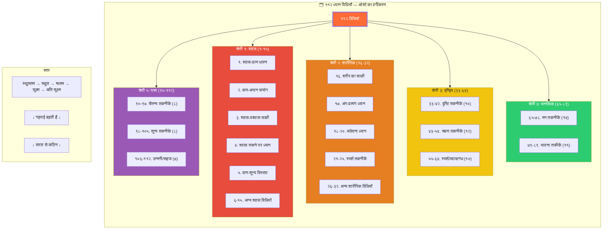
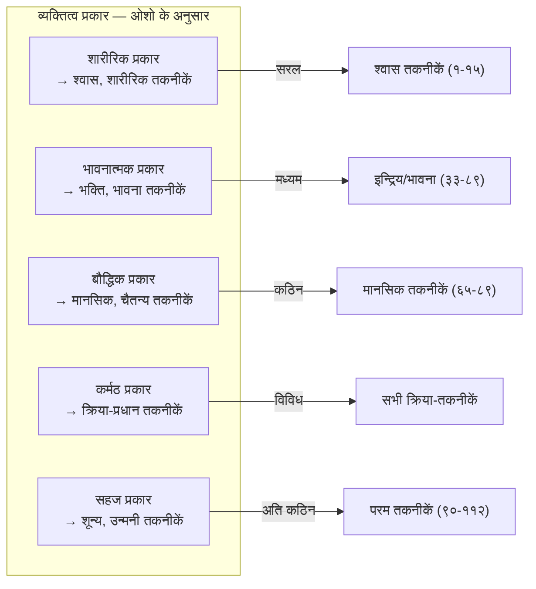

# अध्याय ३: ११२ विधियाँ — ओशो का वर्गीकरण और दृष्टि

> **"११२ विधियाँ — ११२ द्वार। एक भी द्वार ऐसा नहीं जो कहीं न कहीं न ले जाता हो। और सबसे बड़ी बात — तुम्हारे लिए कोई न कोई द्वार खुला है। बस उसे ढूँढ़ना है।"**
> — **ओशो**

---

**ओशो वाणी:**
> "जब मैंने पहली बार विज्ञान भैरव तंत्र पढ़ा, तो मैं चकित रह गया। ११२ तकनीकें — हर एक अलग, हर एक पूर्ण, हर एक किसी न किसी प्रकार के व्यक्ति के लिए। यह कोई आकस्मिक संग्रह नहीं है — यह एक वैज्ञानिक वर्गीकरण है। यह मनुष्य की चेतना के पूरे स्पेक्ट्रम को कवर करता है — सबसे स्थूल से लेकर सबसे सूक्ष्म तक।"

---

## सीखने के उद्देश्य (Learning Objectives)

इस अध्याय को पूरा करने के बाद आप:

1. **समझ पाएंगे** — ओशो ने ११२ तकनीकों को कैसे वर्गीकृत किया — उनकी अनूठी ५-भागीय प्रणाली।
2. **जान पाएंगे** — स्थूल से सूक्ष्म तक की यात्रा क्या है और ओशो के अनुसार यह क्यों महत्वपूर्ण है।
3. **सीख पाएंगे** — प्रत्येक श्रेणी की मुख्य तकनीकों का सार — ओशो के शब्दों में।
4. **पहचान पाएंगे** — ओशो के अनुसार तकनीकों की कठिनाई का स्तर और कौन सी तकनीक किसके लिए उपयुक्त है।
5. **सक्षम होंगे** — टाइपस्क्रिप्ट में एक ११२ तकनीकों का इंटरैक्टिव ब्राउज़र बनाने में।

---

## ओशो का वर्गीकरण: पारंपरिक से अलग

### पारंपरिक वर्गीकरण

पारंपरिक कश्मीर शैव में ११२ तकनीकों को तीन उपायों में बाँटा गया है:
- **आणव उपाय** — क्रिया-प्रधान तकनीकें (मंत्र, श्वास, शरीर)
- **शाक्त उपाय** — ऊर्जा-प्रधान तकनीकें (प्राण, भावना, चक्र)
- **शांभव उपाय** — चैतन्य-प्रधान तकनीकें (ज्ञान, समाधि, उन्मनी)

### ओशो का वर्गीकरण: ५ श्रेणियाँ

ओशो ने इस पारंपरिक वर्गीकरण को अपने ढंग से पुनर्व्याख्यायित किया। उन्होंने तकनीकों को उनकी प्रकृति और साधक पर उनके प्रभाव के अनुसार ५ श्रेणियों में बाँटा:

| श्रेणी | तकनीकें | ओशो की भाषा में | स्तर |
|-------|---------|----------------|------|
| श्वास (Breath) | १-१५ (१५) | "श्वास ही पुल है — इसी पर चलो" | स्थूलतम |
| शारीरिक (Body) | १६-३२ (१७) | "शरीर में ही परमात्मा छिपा है" | स्थूल |
| इन्द्रिय (Senses) | ३३-६४ (३२) | "इन्द्रियाँ द्वार हैं — खोलो" | मध्यम |
| मानसिक (Mental) | ६५-८९ (२५) | "मन को ही औषधि बनाओ" | सूक्ष्म |
| परम (Ultimate) | ९०-११२ (२३) | "जब कुछ नहीं, तब सब कुछ है" | अति सूक्ष्म |

**ओशो वाणी:**
> "यह वर्गीकरण बहुत महत्वपूर्ण है। यह दिखाता है कि मनुष्य की चेतना को कैसे समझा जा सकता है। सबसे स्थूल से — श्वास, शरीर — धीरे-धीरे इन्द्रियों, मन, और अंततः शुद्ध चेतना तक। यह एक यात्रा है — बाहर से अंदर तक, परिधि से केंद्र तक।"

---

## ओशो का वर्गीकरण वृक्ष



---

## श्रेणी १: श्वास तकनीकें (विधि १-१५)

### ओशो का परिचय

**ओशो वाणी:**
> "श्वास — यह सबसे सरल और सबसे गहन तकनीक है। श्वास हमेशा चल रही है — चाहे तुम जागो या सोओ। यह एक सतत प्रक्रिया है। और यही इसकी खूबसूरती है — तुम्हें कुछ अलग करने की ज़रूरत नहीं, बस जो पहले से हो रहा है, उसे देखो।"

### मुख्य तकनीकें (ओशो के अनुसार)

| क्रमांक | नाम (ओशो द्वारा) | सार | कठिनाई |
|--------|------------------|------|--------|
| १ | श्वास-प्राण धारण | श्वास को आते-जाते देखो — बस देखो | बहुत सरल |
| २ | प्राण-अपान संयोग | प्राण (श्वास) और अपान (प्रश्वास) को मिलने दो | सरल |
| ३ | श्वास-प्रश्वास साक्षी | श्वास का साक्षी बनो — नियंत्रण नहीं | बहुत सरल |
| ४ | श्वास रुकने पर ध्यान | जब श्वास रुके, उस ठहराव में प्रवेश करो | मध्यम |
| ५ | प्राण-शून्य विस्तार | श्वास को फैलने दो — पूरे ब्रह्मांड में | मध्यम |
| ६-१० | श्वास के विभिन्न आयाम | गति, ताप, स्थान, समय, दिशा | सरल-मध्यम |
| ११-१५ | उन्नत श्वास तकनीकें | कुंभक, नाद, सुषुम्ना, पंच-प्राण, लय | मध्यम-कठिन |

**ओशो वाणी:**
> "श्वास पर ध्यान करना बहुत सरल है — इतना सरल कि लोग इस पर विश्वास नहीं करते। वे सोचते हैं कि ध्यान कुछ बहुत कठिन होना चाहिए। लेकिन सबसे सरल चीज़ ही सबसे गहरी होती है। श्वास — यही द्वार है।"

---

## श्रेणी २: शारीरिक तकनीकें (विधि १६-३२)

### ओशो का परिचय

**ओशो वाणी:**
> "शरीर कोई बाधा नहीं है — शरीर एक सीढ़ी है। तुम शरीर का उपयोग करके शरीर से परे जा सकते हो। यह विरोधाभास नहीं है — यह तंत्र का विज्ञान है। शरीर के प्रति जागरूक होकर, तुम शरीर से मुक्त हो जाते हो।"

### मुख्य तकनीकें (ओशो के अनुसार)

| क्रमांक | नाम (ओशो द्वारा) | सार | कठिनाई |
|--------|------------------|------|--------|
| १६ | शरीर का साक्षी | पूरे शरीर को एक साथ देखो | सरल |
| १७ | अंग-प्रत्यंग ध्यान | एक-एक अंग पर ध्यान — पैर से सिर तक | सरल |
| १८ | त्वचा का ध्यान | त्वचा की संवेदना — सबसे बड़ा अंग | सरल |
| १९ | ठंड-गर्म का ध्यान | तापमान की संवेदना — द्वंद्व के पार | मध्यम |
| २० | दर्द का ध्यान | दर्द को देखो — उससे भागो मत | कठिन |
| २१ | आलिंगन का ध्यान | किसी को गले लगाओ — और उस ऊर्जा को देखो | मध्यम |
| २२ | चलने का ध्यान | चलते हुए चलने को देखो | सरल |
| २३-३२ | अन्य शारीरिक विधियाँ | नृत्य, मुद्रा, आसन, भोजन, आदि | विविध |

**ओशो वाणी:**
> "अपने हाथ को देखो — बस देखो। उसे हिलाओ मत, उसके बारे में मत सोचो, बस देखो। और देखते-देखते — एक चमत्कार घटित होगा। हाथ तुम्हें अपना नहीं लगेगा। वह कुछ और हो जाएगा — कोई वस्तु, कोई ऊर्जा, कोई घटना। और उस देखने में — तुम उससे अलग हो जाओगे।"

---

## श्रेणी ३: इन्द्रिय तकनीकें (विधि ३३-६४)

### ओशो का परिचय

**ओशो वाणी:**
> "हमारी इन्द्रियाँ ही हमारी जेल हैं — और हमारी इन्द्रियाँ ही हमारी मुक्ति का द्वार भी हो सकती हैं। यह इस पर निर्भर करता है कि हम उनका उपयोग कैसे करते हैं। अगर हम इन्द्रियों में खो जाते हैं, तो वे जेल हैं। अगर हम इन्द्रियों के प्रति जागरूक हैं, तो वे द्वार हैं।"

### दृष्टि तकनीकें (विधि ३३-४२)

| क्रमांक | नाम (ओशो द्वारा) | सार | कठिनाई |
|--------|------------------|------|--------|
| ३३ | बिंदु ध्यान | एक बिंदु पर दृष्टि स्थिर — आँखें खोलकर | सरल |
| ३४ | प्रकाश ध्यान | प्रकाश को देखो — फिर आँखें बंद करो | सरल |
| ३५ | अँधेरा ध्यान | अँधेरे को देखो — आँखें खोलकर या बंद करके | सरल |
| ३६ | अन्तराल दृष्टि | दो वस्तुओं के बीच के खाली स्थान को देखो | मध्यम |
| ३७ | भौंहों के बीच | तीसरी आँख पर ध्यान | मध्यम |
| ३८-४२ | अन्य दृष्टि विधियाँ | नासाग्र, छाया, जल, प्रतिबिंब | विविध |

### श्रवण तकनीकें (विधि ४३-५४)

| क्रमांक | नाम (ओशो द्वारा) | सार | कठिनाई |
|--------|------------------|------|--------|
| ४३ | सभी ध्वनियों का ध्यान | जो कुछ सुनो, उसे बस सुनो — बिना नाम दिए | सरल |
| ४४ | नाद ब्रह्म | किसी एक ध्वनि पर ध्यान — घंटी, झरना | सरल |
| ४५ | अपनी ही ध्वनि | अपने बोलने की आवाज़ सुनो | मध्यम |
| ४६ | मौन को सुनो | ध्वनियों के बीच के मौन को सुनो | मध्यम |
| ४७ | अनाहत नाद | बिना बजाई आवाज़ — अंतरिक्ष की ध्वनि | कठिन |
| ४८-५४ | अन्य श्रवण विधियाँ | संगीत, मंत्र, फुसफुसाहट | विविध |

### स्पर्श/स्वाद/गंध तकनीकें (विधि ५५-६४)

**ओशो वाणी:**
> "खाना खाते समय — केवल स्वाद को देखो। मन को मत जाने दो — 'अच्छा है', 'बुरा है' — ये सब मत सोचो। बस स्वाद को देखो। और जब तुम पूरी तरह स्वाद में डूब जाते हो — तब स्वाद गायब हो जाता है, और कुछ और रह जाता है — एक शुद्ध संवेदना। वही ध्यान है।"

---

## श्रेणी ४: मानसिक तकनीकें (विधि ६५-८९)

### ओशो का परिचय

**ओशो वाणी:**
> "मन सबसे बड़ी बाधा है — और सबसे बड़ी सीढ़ी भी। यह इस पर निर्भर करता है कि तुम मन को कैसे उपयोग करते हो। अगर मन तुम्हारा मालिक है — तो बाधा है। अगर तुम मन के मालिक हो — तो सीढ़ी है।"

### मन तकनीकें (विधि ६५-७८)

| क्रमांक | नाम (ओशो द्वारा) | सार | कठिनाई |
|--------|------------------|------|--------|
| ६५ | विचारों का साक्षी | विचारों को आते-जाते देखो — बादलों की तरह | सरल |
| ६६ | विचारों के बीच का अंतराल | दो विचारों के बीच के खालीपन को पकड़ो | मध्यम |
| ६७ | एक विचार पर स्थिर | एक ही विचार को बार-बार सोचो — वह गायब हो जाएगा | मध्यम |
| ६८ | मन का मूल | "यह विचार कहाँ से आया?" — स्रोत की खोज | कठिन |
| ६९ | कल्पना को देखो | कल्पनाओं को चलने दो — बस देखो | सरल |
| ७० | स्वप्न का ध्यान | जागते हुए स्वप्न को देखो | मध्यम |
| ७१-७८ | अन्य मानसिक विधियाँ | स्मृति, समय, दिशा, गणित | विविध |

### भावना तकनीकें (विधि ७९-८९)

**ओशो वाणी:**
> "भावनाएँ ऊर्जा हैं। क्रोध भी ऊर्जा है, प्रेम भी ऊर्जा है, दुख भी ऊर्जा है। इन्हें दबाओ मत — इन्हें देखो। और देखते-देखते — ये बदल जाती हैं। क्रोध करुणा बन जाता है। दुख गहराई बन जाता है। भय साहस बन जाता है।"

| क्रमांक | नाम (ओशो द्वारा) | सार | कठिनाई |
|--------|------------------|------|--------|
| ७९ | भावना का साक्षी | जो भी भावना आए — उसे देखो | मध्यम |
| ८० | क्रोध को देखो | क्रोध आए — उसे दबाओ मत, व्यक्त मत करो — बस देखो | कठिन |
| ८१ | प्रेम को देखो | प्रेम में भी जागरूक रहो — खोओ मत | कठिन |
| ८२ | भक्ति का ध्यान | किसी देवता या गुरु में पूरी तरह डूब जाओ | मध्यम |
| ८३ | शून्यता में समर्पण | सब कुछ छोड़ दो — शून्य में गिर जाओ | अति कठिन |
| ८४-८९ | अन्य भावना विधियाँ | करुणा, मैत्री, उदासी, आनंद | विविध |

---

## श्रेणी ५: परम तकनीकें (विधि ९०-११२)

### ओशो का परिचय

**ओशो वाणी:**
> "ये अंतिम २३ तकनीकें सबसे गहरी हैं। ये उनके लिए हैं जिन्होंने पहली चार श्रेणियों में से कोई तकनीक पकड़ ली है — और अब उसे छोड़ने का साहस है। याद रखो — तकनीक भी एक बंधन बन सकती है। अंततः तकनीक को भी छोड़ना पड़ता है। और ये विधियाँ तकनीक छोड़ने की तकनीकें हैं।"

### चैतन्य तकनीकें (विधि ९०-९७)

| क्रमांक | नाम (ओशो द्वारा) | सार | कठिनाई |
|--------|------------------|------|--------|
| ९० | प्रकाश में प्रकाश | अपने भीतर के प्रकाश को देखो | कठिन |
| ९१ | चैतन्य ही चैतन्य | "मैं शुद्ध चैतन्य हूँ" — इस भाव में रहो | कठिन |
| ९२ | सब चैतन्य है | हर चीज़ को चैतन्य के रूप में देखो | कठिन |
| ९३ | साक्षी का साक्षी | देखने वाले को भी देखो | अति कठिन |
| ९४-९७ | अन्य चैतन्य विधियाँ | आकाश, व्यापक, एकत्व, निर्विकल्प | अति कठिन |

### शून्य तकनीकें (विधि ९८-१०५)

**ओशो वाणी:**
> "शून्य से मत डरो — शून्य ही सब कुछ है। यह खालीपन नहीं है, यह परिपूर्णता है। जब सब कुछ गिर जाता है — शरीर, मन, भावनाएँ, अहंकार — तब जो बचता है, वह शून्य है। और वही परमात्मा है।"

### उन्मनी/सहज तकनीकें (विधि १०६-११२)

**ओशो वाणी:**
> "उन्मनी का अर्थ है — मन के पार। यह सबसे अंतिम अवस्था है। यहाँ कोई तकनीक नहीं, कोई प्रयास नहीं, कोई कर्ता नहीं। केवल होना है। और यही अंतिम विधि है — विधि ११२ — जहाँ मैं तुमसे कहता हूँ — अब कुछ मत करो। बस हो। पूरे हो।"

---

## ओशो के अनुसार तकनीक की कठिनाई और उपयुक्तता

### ओशो का मनोवैज्ञानिक वर्गीकरण



### ओशो की सलाह: कैसे चुनें तकनीक

**ओशो वाणी:**
> "कैसे चुनें? बहुत सरल है। किसी भी तकनीक को पढ़ो। अगर वह तुम्हें खींचती है — अगर उसे पढ़ते ही तुम्हारे भीतर कुछ कहता है — 'हाँ, यह मेरे लिए है' — तो वह तुम्हारी तकनीक है। अगर कोई तकनीक तुम्हें उबाऊ लगती है, अगर वह तुम्हें कठिन लगती है — तो छोड़ दो। कोई दूसरी लो। ११२ में से कोई न कोई तुम्हारे लिए ज़रूर है।"

| तुम्हारा स्वभाव | ओशो की सिफारिश | क्यों? |
|-----------------|----------------|--------|
| बेचैन, शारीरिक | श्वास तकनीकें (१-१५) | श्वास को देखने से बेचैनी कम होती है |
| भावुक, संवेदनशील | भावना तकनीकें (७९-८९) | भावनाओं को देखने से शांति मिलती है |
| बौद्धिक, विश्लेषणशील | मानसिक तकनीकें (६५-७८) | मन को देखने से मन शांत होता है |
| कल्पनाशील | दृष्टि/श्रवण तकनीकें (३३-६४) | इन्द्रियाँ ही द्वार बन जाती हैं |
| आलसी, सरल | विधि १ — बस श्वास देखो | सबसे सरल — सबसे गहरी |
| साहसी, प्रयोगशील | शून्य तकनीकें (९८-११२) | गहराई में जाने का साहस चाहिए |
| भक्त, समर्पित | भक्ति तकनीकें (७९-८२) | प्रेम ही परम ध्यान है |

---

## ११२ तकनीकें इंटरैक्टिव ब्राउज़र: टाइपस्क्रिप्ट इम्प्लीमेंटेशन

```typescript
/**
 * ============================================================
 * ११२ तकनीकें — ओशो इंटरैक्टिव ब्राउज़र
 * ============================================================
 * यह एक पूर्ण टाइपस्क्रिप्ट एप्लिकेशन है जो ओशो के अनुसार 
 * सभी ११२ तकनीकों को ब्राउज़ करने, उन्हें वर्गीकृत करने, 
 * और उनका अभ्यास ट्रैक करने की सुविधा देता है।
 * 
 * ओशो कहते हैं: "११२ में से कोई एक तुम्हारे लिए है — 
 * बस उसे ढूँढ़ना है।"
 */

// ─── मूल प्रकार ─────────────────────────────────────────────

/** ओशो की ५ श्रेणियाँ */
type OshoCategory_112 = 
  | 'श्वास_तकनीक' 
  | 'शारीरिक_तकनीक' 
  | 'इन्द्रिय_तकनीक' 
  | 'मानसिक_तकनीक' 
  | 'परम_तकनीक';

/** ओशो के अनुसार कठिनाई स्तर */
type OshoDifficulty = 1 | 2 | 3 | 4 | 5;

/** व्यक्तित्व प्रकार — ओशो के अनुसार */
type PersonalityType = 'शारीरिक' | 'भावनात्मक' | 'बौद्धिक' | 'कर्मठ' | 'सहज';

/** एक तकनीक का पूरा विवरण — ओशो की दृष्टि में */
interface TechniqueDetail {
  /** क्रमांक १-११२ */
  id: number;
  /** ओशो द्वारा दिया गया नाम */
  name: string;
  /** मूल संस्कृत श्लोक (पहली पंक्ति) */
  originalShloka: string;
  /** ओशो की श्रेणी */
  category: OshoCategory_112;
  /** कठिनाई (१=सबसे सरल, ५=सबसे कठिन) */
  difficulty: OshoDifficulty;
  /** ओशो का एक पंक्ति का सार */
  oshoEssence: string;
  /** ओशो का पूरा निर्देश */
  oshoInstruction: string;
  /** उपयुक्त व्यक्तित्व प्रकार */
  suitableFor: PersonalityType[];
  /** ओशो का एक प्रमुख उद्धरण */
  oshoQuote: string;
  /** अभ्यास की अनुशंसित अवधि (मिनट) */
  recommendedDuration: number;
  /** क्या ओशो ने इसे विशेष रूप से सिफारिश किया? */
  recommendedByOsho: boolean;
}

/** अभ्यास सत्र */
interface PracticeLogEntry {
  techniqueId: number;
  date: Date;
  duration: number;
  experience: string;
  difficultyFelt: number; // 1-10
}

/** तकनीक खोज फ़िल्टर */
interface TechniqueFilter {
  category?: OshoCategory_112;
  maxDifficulty?: OshoDifficulty;
  personality?: PersonalityType;
  recommendedOnly?: boolean;
  searchText?: string;
}

// ─── ११२ तकनीकों का संग्रह ────────────────────────────────

class TechniqueLibrary_112 {
  private techniques: TechniqueDetail[] = [];

  constructor() {
    this.buildLibrary();
  }

  private buildLibrary(): void {
    // --- श्रेणी १: श्वास तकनीकें (१-१५) ---
    this.addTechnique({
      id: 1,
      name: 'श्वास-प्राण धारण',
      originalShloka: 'प्राणे संस्थिते नाड्यां नाडीचक्रे प्रबोधिते।',
      category: 'श्वास_तकनीक',
      difficulty: 1,
      oshoEssence: 'श्वास को आते-जाते देखो — बस देखो। यह सबसे सरल और सबसे गहरी तकनीक है।',
      oshoInstruction: 'आराम से बैठो। आँखें बंद करो। श्वास को आते हुए देखो — नासिका में प्रवेश करती हुई। श्वास को जाते हुए देखो — नासिका से बाहर निकलती हुई। बस देखो। कुछ मत करो। श्वास को बदलो मत। बस एक साक्षी बनो।',
      suitableFor: ['शारीरिक', 'कर्मठ', 'सहज'],
      oshoQuote: '"श्वास — यही सबसे छोटा पुल है। इस पुल पर चलो — और पार उतर जाओगे।"',
      recommendedDuration: 20,
      recommendedByOsho: true,
    });

    this.addTechnique({
      id: 2,
      name: 'प्राण-अपान संयोग',
      originalShloka: 'प्राणापानौ समौ कृत्वा नासाभ्यन्तरचारिणौ।',
      category: 'श्वास_तकनीक',
      difficulty: 2,
      oshoEssence: 'प्राण (श्वास) और अपान (प्रश्वास) को एक दूसरे में मिलने दो।',
      oshoInstruction: 'श्वास को अंदर लो — प्राण को महसूस करो। श्वास को बाहर छोड़ो — अपान को महसूस करो। धीरे-धीरे, उन्हें एक दूसरे से मिलने दो। जैसे दो नदियाँ मिलती हैं — वैसे ही प्राण और अपान का संगम हो। जहाँ वे मिलते हैं, वहीं द्वार है।',
      suitableFor: ['बौद्धिक', 'कर्मठ'],
      oshoQuote: '"प्राण और अपान का मिलन — यही योग है। तंत्र में यही द्वार है।"',
      recommendedDuration: 25,
      recommendedByOsho: true,
    });

    this.addTechnique({
      id: 3,
      name: 'श्वास-प्रश्वास साक्षी',
      originalShloka: 'श्वासप्रश्वासयोरैक्यं तयोर्योगं च साधयेत्।',
      category: 'श्वास_तकनीक',
      difficulty: 1,
      oshoEssence: 'श्वास और प्रश्वास — दोनों का एक साथ साक्षी बनो। आने और जाने दोनों को देखो।',
      oshoInstruction: 'श्वास को देखो — वह आ रही है। प्रश्वास को देखो — वह जा रही है। दोनों को देखो। फिर, आने और जाने के बीच के ठहराव को देखो। वह ठहराव — वही शून्य है। वही तुम हो।',
      suitableFor: ['शारीरिक', 'सहज'],
      oshoQuote: '"श्वास आ रही है — देखो। श्वास जा रही है — देखो। आने और जाने के बीच — वहाँ क्या है? वहाँ तुम हो।"',
      recommendedDuration: 15,
      recommendedByOsho: true,
    });

    // विधि ४-१५ (संक्षिप्त)
    for (let i = 4; i <= 15; i++) {
      this.addTechnique(this.createShwasTechnique(i));
    }

    // --- श्रेणी २: शारीरिक तकनीकें (१६-३२) ---
    for (let i = 16; i <= 32; i++) {
      this.addTechnique(this.createSharirikTechnique(i));
    }

    // --- श्रेणी ३: इन्द्रिय तकनीकें (३३-६४) ---
    for (let i = 33; i <= 64; i++) {
      this.addTechnique(this.createIndriyaTechnique(i));
    }

    // --- श्रेणी ४: मानसिक तकनीकें (६५-८९) ---
    for (let i = 65; i <= 89; i++) {
      this.addTechnique(this.createManasikTechnique(i));
    }

    // --- श्रेणी ५: परम तकनीकें (९०-११२) ---
    for (let i = 90; i <= 112; i++) {
      this.addTechnique(this.createParamTechnique(i));
    }
  }

  private addTechnique(t: TechniqueDetail): void {
    this.techniques.push(t);
  }

  private createShwasTechnique(i: number): TechniqueDetail {
    return {
      id: i,
      name: `श्वास विधि ${i}`,
      originalShloka: `[श्लोक ${i} — मूल संस्कृत]`,
      category: 'श्वास_तकनीक',
      difficulty: (i <= 8 ? 1 : i <= 12 ? 2 : 3) as OshoDifficulty,
      oshoEssence: `श्वास के इस आयाम को देखो — यह तुम्हें गहराई में ले जाएगा।`,
      oshoInstruction: 'श्वास को देखो — जैसे वह है। उसे बदलो मत। बस उपस्थित रहो।',
      suitableFor: ['शारीरिक', 'कर्मठ'],
      oshoQuote: '"श्वास ही प्राण है — प्राण ही चेतना है। श्वास को जानो — सब जानो।"',
      recommendedDuration: 20,
      recommendedByOsho: false,
    };
  }

  private createSharirikTechnique(i: number): TechniqueDetail {
    return {
      id: i,
      name: `शारीरिक विधि ${i}`,
      originalShloka: `[श्लोक ${i} — मूल संस्कृत]`,
      category: 'शारीरिक_तकनीक',
      difficulty: (i <= 22 ? 1 : i <= 28 ? 2 : 3) as OshoDifficulty,
      oshoEssence: 'शरीर की संवेदना में ही परमात्मा छिपा है — बस उसे देखो।',
      oshoInstruction: 'शरीर के किसी भी हिस्से पर ध्यान दो। हाथ, पैर, पेट, सिर। उसे देखो — बस देखो। संवेदनाओं को आने दो — जाने दो। उनमें मत उलझो।',
      suitableFor: ['शारीरिक', 'भावनात्मक'],
      oshoQuote: '"यह शरीर मंदिर है — इसमें प्रभु रहता है। मंदिर की दीवारों को मत तोड़ो — द्वार खोलो।"',
      recommendedDuration: 25,
      recommendedByOsho: i === 16 || i === 18,
    };
  }

  private createIndriyaTechnique(i: number): TechniqueDetail {
    const isVisual = i <= 42;
    const isAudio = i > 42 && i <= 54;
    return {
      id: i,
      name: isVisual ? `दृष्टि विधि ${i}` : isAudio ? `श्रवण विधि ${i}` : `स्पर्श विधि ${i}`,
      originalShloka: `[श्लोक ${i} — मूल संस्कृत]`,
      category: 'इन्द्रिय_तकनीक',
      difficulty: (i <= 45 ? 2 : i <= 55 ? 3 : 4) as OshoDifficulty,
      oshoEssence: isVisual ? 'आँखें ही खिड़की हैं — बाहर भी और अंदर भी।' : isAudio ? 'ध्वनि ही ब्रह्म है — सुनना ही ध्यान है।' : 'स्पर्श में ही संवेदना है — संवेदना में ही चेतना।',
      oshoInstruction: isVisual ? 'किसी एक बिंदु पर दृष्टि स्थिर करो। बिना पलक झपकाए। देखो — बस देखो।' : 'अपनी आँखें बंद करो। चारों ओर की ध्वनियों को सुनो। बस सुनो — नाम मत दो।',
      suitableFor: ['बौद्धिक', 'सहज'],
      oshoQuote: isVisual ? '"जब आँखें स्थिर होती हैं, तब मन भी स्थिर होता है।"': '"नाद ब्रह्म — ध्वनि ही ईश्वर है। इसे सुनो — और विलीन हो जाओ।"',
      recommendedDuration: 20,
      recommendedByOsho: i === 33 || i === 42 || i === 51,
    };
  }

  private createManasikTechnique(i: number): TechniqueDetail {
    return {
      id: i,
      name: `मानसिक विधि ${i}`,
      originalShloka: `[श्लोक ${i} — मूल संस्कृत]`,
      category: 'मानसिक_तकनीक',
      difficulty: (i <= 75 ? 3 : i <= 82 ? 4 : 5) as OshoDifficulty,
      oshoEssence: 'मन को ही औषधि बनाओ — मन से मन के पार जाओ।',
      oshoInstruction: 'विचारों को देखो। वे आते हैं — जाते हैं। तुम उनमें मत उलझो। बस देखो। धीरे-धीरे, विचार पतले होते जाएंगे — और अंततः गायब हो जाएंगे।',
      suitableFor: ['बौद्धिक', 'भावनात्मक'],
      oshoQuote: '"मन — सबसे अच्छा सेवक और सबसे बुरा मालिक। उसे मालिक मत बनाओ — उसे सेवक बनाओ।"',
      recommendedDuration: 30,
      recommendedByOsho: i === 65 || i === 72 || i === 79,
    };
  }

  private createParamTechnique(i: number): TechniqueDetail {
    return {
      id: i,
      name: `परम विधि ${i}`,
      originalShloka: `[श्लोक ${i} — मूल संस्कृत]`,
      category: 'परम_तकनीक',
      difficulty: (i <= 100 ? 4 : 5) as OshoDifficulty,
      oshoEssence: 'जब कुछ नहीं करना — तब सब कुछ हो जाता है। यह परम विधि है।',
      oshoInstruction: 'अब कुछ मत करो। सभी तकनीकें छोड़ दो। बस हो। शुद्ध हो। मौन हो। यही अंतिम विधि है।',
      suitableFor: ['सहज'],
      oshoQuote: '"अंतिम विधि कोई विधि नहीं है। यह सब विधियों का अंत है। जब तुम कुछ नहीं करते — तब सब कुछ होता है।"',
      recommendedDuration: 0, // कोई समय निर्धारित नहीं
      recommendedByOsho: i === 91 || i === 112,
    };
  }

  // ─── खोज और फ़िल्टर ─────────────────────────────────────

  getAllTechniques(): TechniqueDetail[] {
    return [...this.techniques];
  }

  getTechniqueById(id: number): TechniqueDetail | undefined {
    return this.techniques.find(t => t.id === id);
  }

  getByCategory(category: OshoCategory_112): TechniqueDetail[] {
    return this.techniques.filter(t => t.category === category);
  }

  getByDifficulty(difficulty: OshoDifficulty): TechniqueDetail[] {
    return this.techniques.filter(t => t.difficulty === difficulty);
  }

  getByPersonality(type: PersonalityType): TechniqueDetail[] {
    return this.techniques.filter(t => t.suitableFor.includes(type));
  }

  getRecommendedByOsho(): TechniqueDetail[] {
    return this.techniques.filter(t => t.recommendedByOsho);
  }

  search(filter: TechniqueFilter): TechniqueDetail[] {
    let results = [...this.techniques];
    if (filter.category) results = results.filter(t => t.category === filter.category);
    if (filter.maxDifficulty) results = results.filter(t => t.difficulty <= filter.maxDifficulty!);
    if (filter.personality) results = results.filter(t => t.suitableFor.includes(filter.personality!));
    if (filter.recommendedOnly) results = results.filter(t => t.recommendedByOsho);
    if (filter.searchText) {
      const q = filter.searchText.toLowerCase();
      results = results.filter(t =>
        t.name.toLowerCase().includes(q) ||
        t.oshoEssence.toLowerCase().includes(q) ||
        t.oshoQuote.toLowerCase().includes(q)
      );
    }
    return results;
  }

  /** दिन की तकनीक (यादृच्छिक) */
  getTechniqueOfTheDay(): TechniqueDetail {
    const dayOfYear = new Date().getDate();
    const idx = (dayOfYear * 7) % this.techniques.length;
    return this.techniques[idx];
  }

  /** सरल से कठिन की ओर — क्रमबद्ध सूची */
  getSortedByDifficulty(): TechniqueDetail[] {
    return [...this.techniques].sort((a, b) => a.difficulty - b.difficulty);
  }

  /** प्रत्येक श्रेणी की गिनती */
  getCategoryCounts(): Record<OshoCategory_112, number> {
    const counts: Record<string, number> = {};
    for (const t of this.techniques) {
      counts[t.category] = (counts[t.category] || 0) + 1;
    }
    return counts as Record<OshoCategory_112, number>;
  }
}

// ─── अभ्यास ट्रैकर ──────────────────────────────────────────

class PracticeTracker {
  private log: PracticeLogEntry[] = [];
  private library: TechniqueLibrary_112;

  constructor() {
    this.library = new TechniqueLibrary_112();
  }

  logPractice(techniqueId: number, duration: number, experience: string, difficultyFelt: number): void {
    this.log.push({
      techniqueId,
      date: new Date(),
      duration,
      experience,
      difficultyFelt,
    });
  }

  getStats(): {
    totalSessions: number;
    totalMinutes: number;
    uniqueTechniques: number;
    streak: number;
    mostPracticed: TechniqueDetail | undefined;
    avgDuration: number;
  } {
    const totalSessions = this.log.length;
    const totalMinutes = this.log.reduce((sum, e) => sum + e.duration, 0);
    const uniqueTechniqueIds = new Set(this.log.map(e => e.techniqueId));
    const uniqueTechniques = uniqueTechniqueIds.size;
    
    // सबसे ज्यादा अभ्यास की गई तकनीक
    const freqMap = new Map<number, number>();
    this.log.forEach(e => freqMap.set(e.techniqueId, (freqMap.get(e.techniqueId) || 0) + 1));
    let maxFreq = 0;
    let mostPracticedId = 0;
    freqMap.forEach((freq, id) => {
      if (freq > maxFreq) { maxFreq = freq; mostPracticedId = id; }
    });
    
    // लगातार दिन
    let streak = this.calculateStreak();
    
    return {
      totalSessions,
      totalMinutes,
      uniqueTechniques,
      streak,
      mostPracticed: this.library.getTechniqueById(mostPracticedId),
      avgDuration: totalSessions > 0 ? Math.round(totalMinutes / totalSessions) : 0,
    };
  }

  private calculateStreak(): number {
    if (this.log.length === 0) return 0;
    const sorted = [...this.log].sort((a, b) => b.date.getTime() - a.date.getTime());
    let streak = 1;
    for (let i = 1; i < sorted.length; i++) {
      const diff = sorted[i - 1].date.getTime() - sorted[i].date.getTime();
      if (diff < 86400000 * 1.5) streak++;
      else break;
    }
    return streak;
  }

  /** ओशो का प्रोत्साहन — अभ्यास के आधार पर */
  getOshoEncouragement(): string {
    const stats = this.getStats();
    if (stats.streak >= 40) return '"चालीस दिन — अब तकनीक तुम्हारी हो गई। लेकिन याद रखो — तकनीक को भी छोड़ना होगा।" — ओशो';
    if (stats.streak >= 21) return '"इक्कीस दिन — एक आदत बनने लगी है। अब और मत छोड़ो।" — ओशो';
    if (stats.streak >= 7) return '"सात दिन — अच्छी शुरुआत है। लेकिन असली यात्रा तो अभी शुरू हुई है।" — ओशो';
    if (stats.totalSessions > 0) return '"पहला कदम उठा लिया — यही सबसे कठिन था। अब चलते रहो।" — ओशो';
    return '"अभी शुरुआत नहीं हुई? तो क्या इंतज़ार है? समय बीत रहा है।" — ओशो';
  }
}

// ─── प्रदर्शन ────────────────────────────────────────────────

function run112TechniqueBrowser(): void {
  console.log('╔══════════════════════════════════════════╗');
  console.log('║   ११२ ध्यान विधियाँ — ओशो का ब्राउज़र  ║');
  console.log('╚══════════════════════════════════════════╝\n');

  const library = new TechniqueLibrary_112();

  // श्रेणी के अनुसार गिनती
  console.log('📊 श्रेणी के अनुसार तकनीकें:');
  const counts = library.getCategoryCounts();
  for (const [cat, count] of Object.entries(counts)) {
    console.log(`   ${cat}: ${count}`);
  }

  // ओशो की सिफारिशें
  console.log('\n⭐ ओशो द्वारा विशेष रूप से सिफारिशित तकनीकें:');
  library.getRecommendedByOsho().forEach(t => {
    console.log(`   #${t.id}: ${t.name} — ${t.oshoEssence}`);
  });

  // सरल तकनीकें
  console.log('\n🌱 बहुत सरल तकनीकें (शुरुआत के लिए):');
  library.getByDifficulty(1).forEach(t => {
    console.log(`   #${t.id}: ${t.name}`);
  });

  // दिन की तकनीक
  const today = library.getTechniqueOfTheDay();
  console.log(`\n🎯 आज की तकनीक: #${today.id} — ${today.name}`);
  console.log(`   ${today.oshoEssence}`);
  console.log(`   💬 ओशो: ${today.oshoQuote}`);
  console.log(`   ⏱ अनुशंसित समय: ${today.recommendedDuration} मिनट`);

  // खोज उदाहरण
  console.log('\n🔍 खोज: शारीरिक प्रकार के लिए मध्यम तकनीकें:');
  const results = library.search({
    personality: 'शारीरिक',
    maxDifficulty: 2,
  });
  results.slice(0, 5).forEach(t => {
    console.log(`   #${t.id}: ${t.name} (कठिनाई: ${t.difficulty})`);
  });

  // अभ्यास ट्रैकर
  console.log('\n📝 अभ्यास ट्रैकर डेमो:');
  const tracker = new PracticeTracker();
  tracker.logPractice(1, 20, 'शांति महसूस हुई, मन थोड़ा स्थिर हुआ', 3);
  tracker.logPractice(1, 25, 'गहरी शांति, कुछ पलों में श्वास गायब हो गई थी', 2);
  tracker.logPractice(3, 15, 'मन भटकता रहा, लेकिन वापस लाता रहा', 4);
  tracker.logPractice(1, 30, 'आज बहुत अच्छा अनुभव — श्वास अपने आप गहरी हो गई', 2);

  const stats = tracker.getStats();
  console.log(`   कुल सत्र: ${stats.totalSessions}`);
  console.log(`   कुल मिनट: ${stats.totalMinutes}`);
  console.log(`   अनोखी तकनीकें: ${stats.uniqueTechniques}`);
  console.log(`   लगातार दिन: ${stats.streak}`);
  console.log(`   सबसे ज्यादा: #${stats.mostPracticed?.id} — ${stats.mostPracticed?.name}`);
  console.log(`   🎙️ ${tracker.getOshoEncouragement()}`);
}

run112TechniqueBrowser();
```

---

## ओशो के शब्दों में — कुछ खास तकनीकों का सार

### विधि १: सबसे सरल — श्वास का साक्षी

**ओशो वाणी:**
> "यह सबसे सरल तकनीक है — इतनी सरल कि तुम इस पर विश्वास नहीं करोगे। लेकिन यह सबसे गहरी भी है। बस श्वास को देखो। जब वह अंदर जाती है — देखो। जब बाहर आती है — देखो। कुछ मत करो। यह बहुत सरल लगता है — लेकिन इसे करना बहुत कठिन है। मन हर बार तुम्हें खींच ले जाएगा। तुम भूल जाओगे। फिर याद करो। फिर देखो। यही अभ्यास है।"

### विधि ४२: नाद ब्रह्म — ओशो की पसंदीदा

**ओशो वाणी:**
> "नाद ब्रह्म — ध्वनि ही ईश्वर है। यह मेरी पसंदीदा तकनीकों में से एक है। किसी भी ध्वनि को सुनो — पक्षियों की चहचहाहट, हवा की सरसराहट, कार का शोर — और उसमें इतना डूब जाओ कि तुम और ध्वनि एक हो जाओ। जब सुनने वाला और सुनाई देने वाली ध्वनि एक हो जाते हैं — वही ध्यान है।"

### विधि ११२: अंतिम विधि — सब कुछ छोड़ देना

**ओशो वाणी:**
> "यह अंतिम विधि है — और यह कोई विधि नहीं है। यह सब विधियों का अंत है। यह वह जगह है जहाँ तकनीक भी गिर जाती है — केवल तुम रह जाते हो, शुद्ध, निर्द्वंद्व, मुक्त। जब मैं कहता हूँ — कुछ मत करो — तो मैं सच कह रहा हूँ। कुछ भी मत करो। बस हो। यही परम है।"

---

## सारांश

| मुख्य बिंदु | सार |
|------------|------|
| **ओशो का ५-भागीय वर्गीकरण** | श्वास (१-१५), शारीरिक (१६-३२), इन्द्रिय (३३-६४), मानसिक (६५-८९), परम (९०-११२) |
| **यात्रा की दिशा** | स्थूल → सूक्ष्म → अति सूक्ष्म — बाहर से अंदर तक |
| **कठिनाई क्रम** | १ (बहुत सरल) से ५ (अति कठिन) तक |
| **मुख्य सिद्धांत** | हर व्यक्ति के लिए कोई न कोई तकनीक है — प्रयोग करके देखो |
| **ओशो की सिफारिश** | सबसे सरल तकनीक से शुरू करो — विधि १ — श्वास का साक्षी |
| **अंतिम संदेश** | तकनीक भी छोड़नी पड़ती है — अंततः केवल साक्षी रह जाता है |

---

## प्रश्नोत्तरी (Quiz)

### प्रश्न १
ओशो ने ११२ तकनीकों को कितनी श्रेणियों में बाँटा?

a) ३ (पारंपरिक उपाय)
b) ५ (ओशो का अपना वर्गीकरण)
c) ७
d) १०

<details>
<summary>उत्तर</summary>
b) ५ — श्वास, शारीरिक, इन्द्रिय, मानसिक, परम।
</details>

### प्रश्न २
ओशो के अनुसार कौन सी तकनीक सबसे सरल है?

a) विधि ४२ — नाद ब्रह्म
b) विधि १ — श्वास-प्राण धारण
c) विधि ११२ — अंतिम विधि
d) विधि ३३ — बिंदु ध्यान

<details>
<summary>उत्तर</summary>
b) विधि १ — सिर्फ श्वास को देखना। ओशो कहते हैं — "इतनी सरल कि लोग विश्वास नहीं करते।"
</details>

### प्रश्न ३
श्रेणी ३ (इन्द्रिय तकनीकें) में कितनी तकनीकें हैं?

a) १५
b) १७
c) ३२
d) २५

<details>
<summary>उत्तर</summary>
c) ३२ — विधि ३३ से ६४ तक — दृष्टि (१०), श्रवण (१२), स्पर्श/स्वाद/गंध (१०)।
</details>

### प्रश्न ४
ओशो के अनुसार, सबसे कठिन तकनीक कौन सी है?

a) विधि १
b) विधि ४२
c) विधि ११२ — क्योंकि इसमें कुछ करना नहीं है
d) विधि ६५

<details>
<summary>उत्तर</summary>
c) विधि ११२ — अंतिम विधि। "सबसे कठिन इसलिए कि कुछ करना नहीं है — और हमें करने की आदत है।"
</details>

### प्रश्न ५
ओशो तकनीक चुनने की क्या सलाह देते हैं?

a) सबसे कठिन तकनीक चुनो
b) जो तकनीक तुम्हें खींचे — वही तुम्हारी है
c) गुरु से पूछो
d) सबसे आसान तकनीक चुनो

<details>
<summary>उत्तर</summary>
b) "कोई भी तकनीक पढ़ो — अगर वह तुम्हें खींचती है, तो वह तुम्हारी है।"
</details>

### प्रश्न ६
श्रेणी ५ (परम तकनीकें) किनके लिए हैं?

a) शुरुआती लोगों के लिए
b) उनके लिए जिन्होंने पिछली श्रेणियों में महारत हासिल कर ली है
c) केवल संन्यासियों के लिए
d) केवल महिलाओं के लिए

<details>
<summary>उत्तर</summary>
b) उनके लिए जो पिछली श्रेणियों से गुज़र चुके हैं और अब तकनीक को छोड़ने का साहस रखते हैं।
</details>

### प्रश्न ७
"नाद ब्रह्म" किस श्रेणी की तकनीक है?

a) श्वास
b) इन्द्रिय (श्रवण)
c) मानसिक
d) परम

<details>
<summary>उत्तर</summary>
b) इन्द्रिय श्रेणी — श्रवण तकनीक (विधि ४२)।
</details>

### प्रश्न ८
ओशो के अनुसार, तकनीकों की यात्रा किस दिशा में है?

a) ऊपर से नीचे
b) स्थूल से सूक्ष्म — बाहर से अंदर
c) दाएँ से बाएँ
d) कोई दिशा नहीं

<details>
<summary>उत्तर</summary>
b) स्थूल से सूक्ष्म — श्वास (स्थूलतम) → शारीरिक → इन्द्रिय → मानसिक → परम (अति सूक्ष्म)।
</details>

---

## अभ्यास (Exercises)

### अभ्यास १: अपनी तकनीक खोजें

**निर्देश:** `TechniqueLibrary_112` का उपयोग करके अपने लिए उपयुक्त तकनीकें खोजें:

1. अपने व्यक्तित्व प्रकार के अनुसार तकनीकें देखें।
2. सबसे सरल तकनीकों की सूची बनाएँ।
3. ओशो द्वारा सिफारिशित तकनीकें देखें।
4. एक तकनीक चुनें और उसका नाम, सार, और निर्देश लिखें।

```typescript
const lib = new TechniqueLibrary_112();
const forMe = lib.search({
  personality: 'शारीरिक',
  maxDifficulty: 2,
  recommendedOnly: true,
});
console.log('तुम्हारे लिए उपयुक्त तकनीकें:');
forMe.forEach(t => {
  console.log(`#${t.id}: ${t.name} (कठिनाई: ${t.difficulty})`);
  console.log(`   ${t.oshoEssence}`);
});
```

### अभ्यास २: सप्ताह का अभ्यास शेड्यूल

**निर्देश:** एक सप्ताह के लिए हर दिन अलग-अलग श्रेणियों से तकनीकें चुनें:

```typescript
const schedule = [
  { day: 'सोमवार', category: 'श्वास_तकनीक' as const, id: 1 },
  { day: 'मंगलवार', category: 'श्वास_तकनीक' as const, id: 3 },
  { day: 'बुधवार', category: 'शारीरिक_तकनीक' as const, id: 16 },
  { day: 'गुरुवार', category: 'इन्द्रिय_तकनीक' as const, id: 33 },
  { day: 'शुक्रवार', category: 'इन्द्रिय_तकनीक' as const, id: 42 },
  { day: 'शनिवार', category: 'मानसिक_तकनीक' as const, id: 65 },
  { day: 'रविवार', category: 'परम_तकनीक' as const, id: 91 },
];

const tracker = new PracticeTracker();
schedule.forEach(({ day, id }) => {
  const tech = lib.getTechniqueById(id);
  console.log(`${day}: #${tech?.id} — ${tech?.name}`);
  console.log(`   ${tech?.oshoEssence}`);
  // 15 मिनट अभ्यास रिकॉर्ड करें
  tracker.logPractice(id, 15, 'शेड्यूल के अनुसार अभ्यास', 3);
});

console.log(`\n📊 सप्ताह का सारांश:`);
console.log(tracker.getOshoEncouragement());
```

### अभ्यास ३: तकनीक डायरी — ७ दिनों का अभ्यास

**निर्देश:** ७ दिन तक हर दिन एक तकनीक का अभ्यास करें और डायरी भरें:

| दिन | तकनीक | समय | अनुभव (१-५) | क्या हुआ? | ओशो का वचन |
|-----|-------|------|-------------|-----------|-------------|
| १ | | | | | |
| २ | | | | | |
| ३ | | | | | |
| ४ | | | | | |
| ५ | | | | | |
| ६ | | | | | |
| ७ | | | | | |

### अभ्यास ४: अपना खुद का वर्गीकरण

**निर्देश:** ओशो के ५-भागीय वर्गीकरण को समझने के बाद, अपना खुद का वर्गीकरण बनाएँ:

1. तुम किन ५ श्रेणियों में तकनीकों को बाँटोगे?
2. तुम्हारी श्रेणियाँ ओशो से कैसे अलग हैं?
3. क्या तुम्हें लगता है कि कोई तकनीक ओशो की गलत श्रेणी में रखी गई है? क्यों?

```typescript
interface MyClassification {
  name: string;
  description: string;
  techniques: number[];
  whyDifferent: string;
}

const myCategories: MyClassification[] = [
  {
    name: 'मेरी श्रेणी १',
    description: 'जो तकनीकें मुझे सबसे आसान लगीं',
    techniques: [1, 3, 16, 33, 43],
    whyDifferent: 'मैंने कठिनाई के बजाय अपने अनुभव के आधार पर वर्गीकृत किया',
  },
];

console.log('मेरा वर्गीकरण:');
myCategories.forEach(c => {
  console.log(`${c.name}: ${c.description}`);
  console.log(`   तकनीकें: ${c.techniques.join(', ')}`);
  console.log(`   क्यों अलग? ${c.whyDifferent}`);
});
```

---

**ओशो वाणी:**
> "११२ तकनीकें कोई बोझ नहीं हैं — वे एक खजाना हैं। तुम्हें सबको करने की ज़रूरत नहीं। बस एक चुनो — और उसे पूरे मन से करो। जब वह तकनीक अपना काम कर ले — तब उसे छोड़ दो। और जब सब तकनीकें छूट जाएँ — तब जो बचता है — वही तुम हो। वही परमात्मा है। वही सत्य है।"
