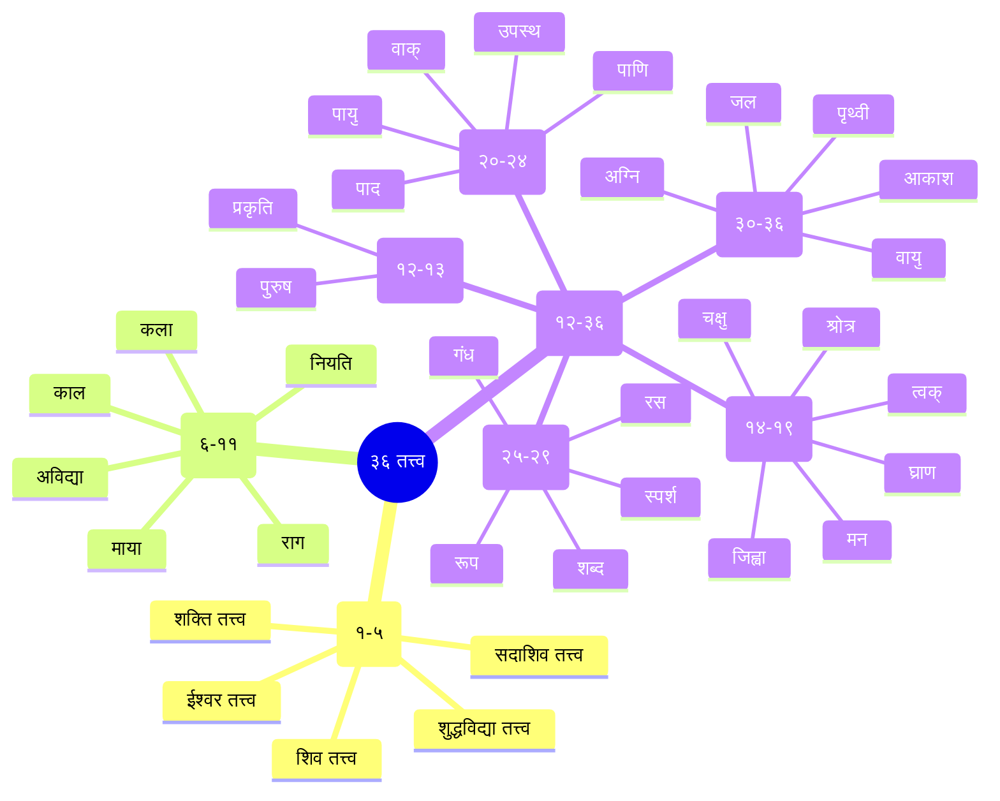
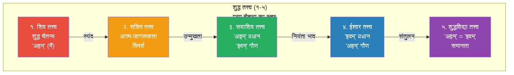
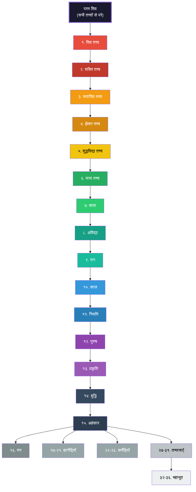
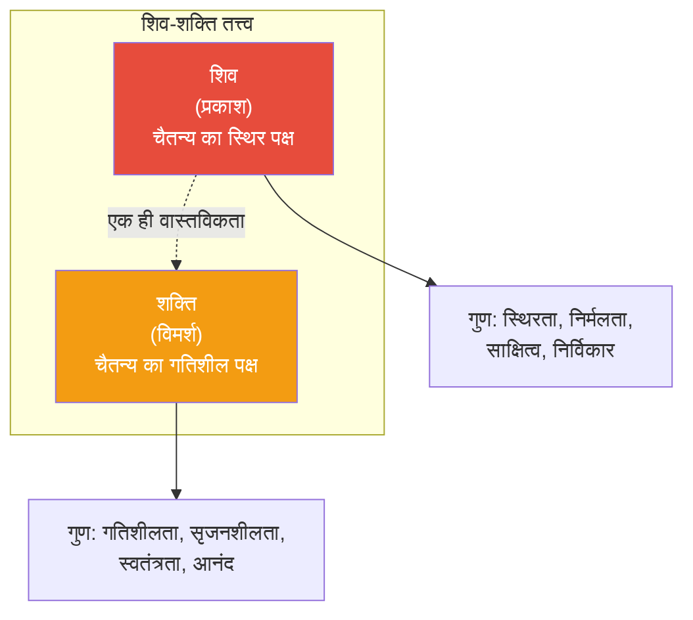
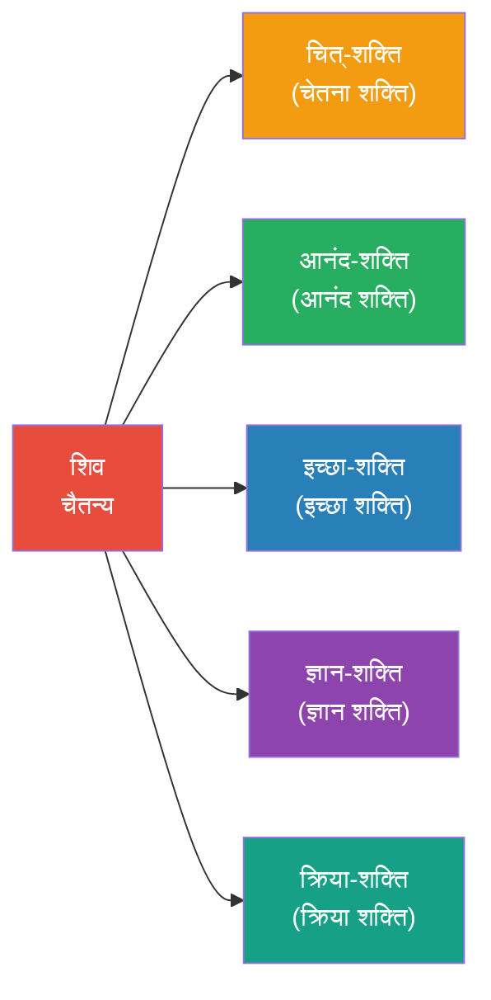
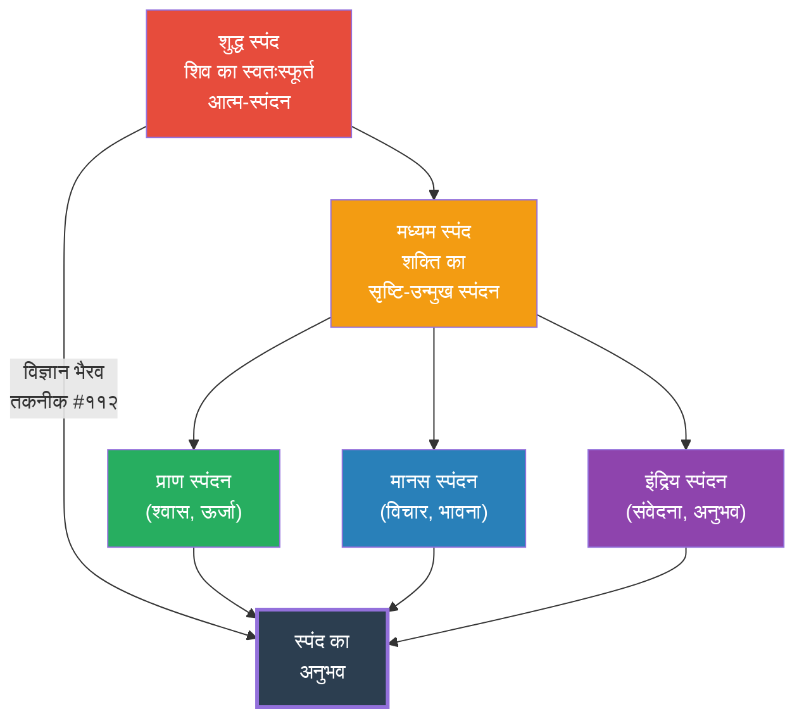
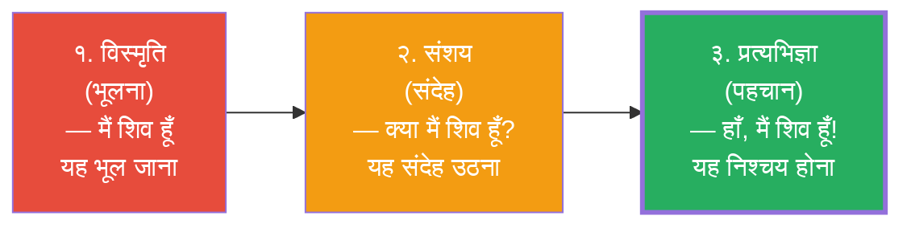

# अध्याय ३: तंत्र दर्शन के मूल सिद्धांत

> **"शिवः शक्तिः शिवः शक्तिः शिवः शक्तिर्न भिद्यते। शिवः शक्त्या युक्तः शिवः शक्तः शिवः शक्तिः शिवः शिवः॥"**
> — शिव और शक्ति अलग नहीं हैं। शिव शक्ति से युक्त होकर सक्षम होता है, शक्ति शिव के बिना अस्तित्वहीन है।

---

## सीखने के उद्देश्य (Learning Objectives)

इस अध्याय को पूरा करने के बाद आप:

1. **समझ पाएंगे** कश्मीर शैव के **३६ तत्त्वों** (tattvas) का पूरा सिद्धांत और उनका क्रम।
2. **जान पाएंगे** **शिव-शक्ति** के एकत्व का दार्शनिक आधार और उसका महत्व।
3. **समझ पाएंगे** **स्पंद सिद्धांत** (दिव्य स्पंदन) और ब्रह्मांड में इसकी भूमिका।
4. **गहराई से जान पाएंगे** **प्रत्यभिज्ञा दर्शन** को — कैसे यह मोक्ष का मार्ग है।
5. **सक्षम होंगे** टाइपस्क्रिप्ट में एक Tattva Explorer (३६ तत्त्वों का इंटरैक्टिव चार्ट) बनाने में।

---

## ३६ तत्त्व — कश्मीर शैव का ब्रह्मांडीय मॉडल

### तत्त्व क्या हैं?

तत्त्व (Tattva) का अर्थ है "वह जो सत्य है" या "वह जो वास्तविक है"। कश्मीर शैव के अनुसार, ब्रह्मांड ३६ तत्त्वों से मिलकर बना है — शुद्ध चैतन्य (शिव) से लेकर स्थूल पृथ्वी तक। यह एक क्रमिक उतरती हुई श्रृंखला है जिसमें शिव की चेतना धीरे-धीरे सीमित और स्थूल होती जाती है।

### सांख्य और कश्मीर शैव में अंतर

सांख्य दर्शन में २५ तत्त्व हैं, जबकि कश्मीर शैव में ३६। अंतर है:

| विषय | सांख्य (२५ तत्त्व) | कश्मीर शैव (३६ तत्त्व) |
|------|-----------------|---------------------|
| परम सत्य | पुरुष (चेतना) + प्रकृति (जड़) | शिव (परम चैतन्य) — एक ही सत्य |
| अतिरिक्त तत्त्व | — | ११ अतिरिक्त (शिव से माया तक) |
| जड़ जगत | प्रकृति से उत्पन्न | शिव के आभास (प्रकटीकरण) से |
| मोक्ष | पुरुष का प्रकृति से पृथक होना | शिव-स्वरूप की पहचान (प्रत्यभिज्ञा) |
| ईश्वर | नहीं (अनीश्वरवादी) | शिव = परम चैतन्य |

### ३६ तत्त्वों का वर्गीकरण



### १. शुद्ध तत्त्व (Śuddha Tattva) — क्रम १-५

ये पाँच तत्त्व शिव की शुद्ध चेतना के स्तर पर हैं। इनमें किसी भी प्रकार की सीमा या मल (impurity) नहीं है।

#### १. शिव तत्त्व (Śiva Tattva)

**संस्कृत:** शिवतत्त्वं परं ब्रह्म निष्कलं निर्मलं शिवम्।

**अर्थ:** शिव तत्त्व परम ब्रह्म है — निष्कल (कलाओं से रहित), निर्मल (शुद्ध), और शिव (कल्याणस्वरूप)।

- यह चैतन्य का सबसे शुद्ध, सबसे मूल रूप है।
- इसे "प्रकाश" (Prakāśa) कहते हैं — शुद्ध जागरूकता।
- इसमें न कोई वस्तु है, न कोई क्रिया — केवल शुद्ध सत्ता।
- यह तत्त्व "अहम्" (I-ness) के रूप में अनुभव होता है — "मैं हूँ" का शुद्ध भाव।

#### २. शक्ति तत्त्व (Śakti Tattva)

**संस्कृत:** शक्तिस्तत्त्वं महामाया स्वातन्त्र्यं परमेश्वरी।

**अर्थ:** शक्ति तत्त्व महामाया है — परमेश्वरी जो स्वतंत्र इच्छा (स्वातंत्र्य) से युक्त है।

- यह शिव की आत्म-जागरूकता की क्रिया है — "विमर्श" (Vimarśa)।
- शक्ति ही शिव को "मैं हूँ" से "मैं यह हूँ" की ओर ले जाती है।
- शिव और शक्ति एक ही सत्य के दो पहलू हैं — जैसे अग्नि और उष्णता।

#### ३. सदाशिव तत्त्व (Sadāśiva Tattva)

**संस्कृत:** सदाशिवतत्त्वं चेति अहंमिदं प्रकाशितम्।

**अर्थ:** सदाशिव तत्त्व में "अहं" (मैं) और "इदम्" (यह) का उदय होता है, किंतु "अहं" प्रधान है।

- इस स्तर पर "मैं हूँ" (अहम्) का भाव प्रबल है।
- "यह" (इदम्) गौण है — अर्थात, सृष्टि का सूक्ष्म बीज है।
- इसे "सद्योजात" कहा जाता है — जहाँ सृष्टि का प्रथम स्पंदन होता है।
- यह "अहं ब्रह्मास्मि" के अनुभव का स्तर है।

#### ४. ईश्वर तत्त्व (Īśvara Tattva)

**संस्कृत:** ईश्वरतत्त्वं विज्ञेयमिदमहं विमर्शनम्।

**अर्थ:** ईश्वर तत्त्व में "इदम्" (यह) प्रधान है और "अहम्" (मैं) गौण — जगत का नियंता।

- इस स्तर पर "यह" (इदम् = संपूर्ण ब्रह्मांड) प्रधान है।
- "मैं" (अहम्) इस ब्रह्मांड के नियंता (ईश्वर) के रूप में अनुभव होता है।
- यह "सर्वं खल्विदं ब्रह्म" के अनुभव का स्तर है।
- यहाँ से "मैं" और "यह" में हल्का भेद प्रकट होने लगता है।

#### ५. शुद्धविद्या तत्त्व (Śuddhavidyā Tattva)

**संस्कृत:** शुद्धविद्यातत्त्वं चेति सदाशिवादिमिश्रितम्।

**अर्थ:** शुद्धविद्या तत्त्व में "अहम्" और "इदम्" दोनों समान रूप से प्रकट होते हैं।

- इस स्तर पर "मैं" और "यह" दोनों समान हैं, किंतु उनमें कोई विरोध नहीं।
- यह शुद्ध ज्ञान का स्तर है — जहाँ भेद और अभेद का संतुलन है।
- यहाँ से सृष्टि के प्रकटीकरण की प्रक्रिया आगे बढ़ती है।



### २. शुद्धाशुद्ध तत्त्व (Śuddhāśuddha Tattva) — क्रम ६-११

ये छह तत्त्व "शुद्ध-अशुद्ध" (मिश्रित) स्तर के हैं। यहाँ माया और उसके कार्य प्रकट होते हैं।

#### ६. माया तत्त्व (Māyā Tattva)

**अर्थ:** माया वह शक्ति है जो शिव की एकता को छिपाकर भेद (द्वैत) का आभास कराती है। किंतु कश्मीर शैव में माया भ्रम नहीं, बल्कि शिव की ही एक शक्ति है जो सीमित चेतना का निर्माण करती है।

- माया प्रकट करती है — छिपाती नहीं
- माया भेद (difference) का कारण है
- माया से जीव की सीमित चेतना (अणु) उत्पन्न होती है

#### ७-११. पाँच कांचुक (Pañca Kañcuka)

माया के पाँच आवरण (कांचुक) हैं जो शिव की अनंत चेतना को सीमित करते हैं:

| कांचुक | अर्थ | सीमा | शिव में | जीव में |
|--------|------|------|---------|---------|
| कला (Kalā) | सीमित क्रियाशक्ति | करने की सीमितता | सर्वशक्तिमान | सीमित क्षमता |
| अविद्या (Avidyā) | सीमित ज्ञान | जानने की सीमितता | सर्वज्ञ | अल्पज्ञ |
| राग (Rāga) | आसक्ति | इच्छा की सीमितता | पूर्ण संतुष्ट | अपूर्णता की भावना |
| काल (Kāla) | समय | समय की सीमा | शाश्वत | कालबद्ध |
| नियति (Niyati) | नियति | कारण-कार्य की सीमा | स्वतंत्र | बद्ध |

### ३. अशुद्ध तत्त्व (Aśuddha Tattva) — क्रम १२-३६

ये २५ तत्त्व जड़-चेतन जगत के हैं। ये सांख्य के २५ तत्त्वों के समान हैं, किंतु भिन्न व्याख्या के साथ।

#### बुद्धि, अहंकार और मन (१३-१५)

| तत्त्व | नाम | कार्य |
|:-----:|-----|------|
| १३ | बुद्धि (Buddhi) | निश्चयात्मक ज्ञान, निर्णय |
| १४ | अहंकार (Ahaṃkāra) | अहं-भाव, मैं-पन |
| १५ | मन (Manas) | संकल्प-विकल्प, विचार |

#### ज्ञानेंद्रियाँ (१६-१९)

| तत्त्व | इंद्रिय | विषय | अंग |
|:-----:|---------|------|:---:|
| १६ | श्रोत्र (Śrotra) | शब्द (ध्वनि) | कान |
| १७ | त्वक् (Tvak) | स्पर्श | त्वचा |
| १८ | चक्षु (Cakṣu) | रूप (दृश्य) | आँखें |
| १९ | जिह्वा (Jihvā) | रस (स्वाद) | जीभ |

> **नोट:** घ्राण (गंध) — नाक को भी ज्ञानेंद्रिय माना जाता है, पर कश्मीर शैव के कुछ वर्गीकरणों में यह अलग है।

#### कर्मेंद्रियाँ (२०-२४)

| तत्त्व | इंद्रिय | क्रिया | अंग |
|:-----:|---------|-------|:---:|
| २० | वाक् (Vāk) | वाणी, बोलना | मुख |
| २१ | पाणि (Pāṇi) | ग्रहण करना | हाथ |
| २२ | पाद (Pāda) | गमन करना | पैर |
| २३ | पायु (Pāyu) | विसर्जन | गुदा |
| २४ | उपस्थ (Upastha) | आनंद | जननेंद्रिय |

#### तन्मात्राएँ (२५-२९)

| तत्त्व | तन्मात्रा | उत्पत्ति |
|:-----:|-----------|---------|
| २५ | शब्द तन्मात्रा (Śabda) | आकाश से — ध्वनि का सूक्ष्म तत्त्व |
| २६ | स्पर्श तन्मात्रा (Sparśa) | वायु से — स्पर्श का सूक्ष्म तत्त्व |
| २७ | रूप तन्मात्रा (Rūpa) | अग्नि से — रूप का सूक्ष्म तत्त्व |
| २८ | रस तन्मात्रा (Rasa) | जल से — स्वाद का सूक्ष्म तत्त्व |
| २९ | गंध तन्मात्रा (Gandha) | पृथ्वी से — गंध का सूक्ष्म तत्त्व |

#### महाभूत (३०-३४)

| तत्त्व | भूत | गुण | तन्मात्रा से |
|:-----:|-----|:---:|:-----------:|
| ३० | आकाश (Ākāśa) | शब्द | शब्द से |
| ३१ | वायु (Vāyu) | शब्द + स्पर्श | स्पर्श से |
| ३२ | अग्नि (Agni) | शब्द + स्पर्श + रूप | रूप से |
| ३३ | जल (Jala) | शब्द + स्पर्श + रूप + रस | रस से |
| ३४ | पृथ्वी (Pṛthvī) | शब्द + स्पर्श + रूप + रस + गंध | गंध से |

### ३६ तत्त्वों का पूर्ण चित्र



---

## शिव-शक्ति का सिद्धांत

### शिव और शक्ति का संबंध

कश्मीर शैव का सबसे मूल सिद्धांत शिव-शक्ति का एकत्व है। यह समझने के लिए तीन दृष्टिकोण हैं:

**१. अभेद (Non-difference):** शिव और शक्ति पूरी तरह से एक हैं। जैसे अग्नि और उसकी उष्णता अलग नहीं हो सकते।

**२. भेद-अभेद (Difference and Non-difference):** तर्क की दृष्टि से भिन्न, अनुभव की दृष्टि से एक।

**३. शक्ति-प्रधान:** शक्ति शिव की गतिशील ऊर्जा है, शिव स्थिर चैतन्य है।



### पाँच शक्तियाँ (Pañca-Śakti)

शिव की पाँच मुख्य शक्तियाँ हैं:



| शक्ति | कार्य | विवरण |
|------|------|--------|
| चित् (Cit) | चेतना | शिव की मूल चैतन्य शक्ति |
| आनंद (Ānanda) | आनंद | परम आनंद का अनुभव |
| इच्छा (Icchā) | इच्छा | सृष्टि की इच्छा |
| ज्ञान (Jñāna) | ज्ञान | सृष्टि का ज्ञान |
| क्रिया (Kriyā) | क्रिया | सृष्टि का निर्माण |

---

## स्पंद सिद्धांत (Spanda Doctrine)

### स्पंद क्या है?

स्पंद (Spanda) कश्मीर शैव का सर्वाधिक महत्वपूर्ण सिद्धांत है। इसका शाब्दिक अर्थ है "स्पंदन" या "कंपन"। किंतु यह कोई भौतिक कंपन नहीं, बल्कि चैतन्य का आंतरिक स्पंदन है।

> **"स्पंदः स्वातन्त्र्यम्"** — स्पंद (= स्वतंत्र इच्छा) शिव की स्वतंत्र चेतना का स्वतःस्फूर्त स्पंदन है।

### स्पंद के लक्षण

| लक्षण | विवरण | अनुभव में |
|-------|--------|----------|
| स्वतःस्फूर्तता | बिना किसी बाह्य कारण के | श्वास का आना-जाना |
| सूक्ष्मता | अत्यंत सूक्ष्म, अदृश्य | विचारों का उठना |
| व्यापकता | सर्वव्यापी | सबमें वही चैतन्य |
| स्वातंत्र्य | पूर्ण स्वतंत्र | इच्छा का उदय |
| स्फुरण | चमकना, प्रकट होना | अंतर्ज्ञान का झटका |

### स्पंद के स्तर



### स्पंद और व्यवहार

कैसे हम स्पंद को अपने दैनिक जीवन में अनुभव कर सकते हैं:

| स्थिति | स्पंद का अनुभव | कैसे करें |
|--------|----------------|----------|
| श्वास | श्वास के आने-जाने का स्पंदन | केवल देखें |
| विचार | विचारों का उठना-मिटना | उनमें न उलझें |
| भावनाएँ | भावनाओं का उतार-चढ़ाव | साक्षी बनें |
| संवेदनाएँ | शरीर की संवेदनाएँ | जागरूक रहें |
| ध्वनि | बाहरी और आंतरिक ध्वनियाँ | सुनें, प्रतिक्रिया न दें |

---

## प्रत्यभिज्ञा दर्शन (Recognition Philosophy)

### प्रत्यभिज्ञा का अर्थ

प्रत्यभिज्ञा (Pratyabhijñā) का शाब्दिक अर्थ है "पुनः-पहचान" (Re-cognition)। यह कश्मीर शैव का सबसे उन्नत दार्शनिक सिद्धांत है।

> **"प्रति + अभि + ज्ञा"** — प्रति (पुनः) + अभि (समीप, निश्चित) + ज्ञा (जानना) = निश्चित रूप से पुनः जानना।

प्रत्यभिज्ञा का अर्थ है अपने वास्तविक स्वरूप को पहचानना — कि हम शिव (परम चैतन्य) हैं, जो हम हमेशा से थे।

### प्रत्यभिज्ञा के तीन चरण



### प्रत्यभिज्ञा की प्रक्रिया

| चरण | नाम | विवरण | उदाहरण |
|:---:|-----|--------|---------|
| १ | आवरण (Āvaraṇa) | आत्म-स्वरूप का आवरण | अपने चेहरे को भूल जाना |
| २ | विक्षेप (Vikṣepa) | बाहर की ओर दौड़ना | दूसरे के चेहरे में खो जाना |
| ३ | आविर्भाव (Āvirbhāva) | स्मृति का उदय | "यह तो मैं ही हूँ!" |
| ४ | अधिष्ठान (Adhiṣṭhāna) | निश्चय | स्थायी पहचान |

### प्रत्यभिज्ञा और विज्ञान भैरव तंत्र

विज्ञान भैरव तंत्र की अधिकांश तकनीकें किसी न किसी रूप में प्रत्यभिज्ञा की ओर ले जाती हैं:

| तकनीक प्रकार | प्रत्यभिज्ञा से संबंध | उदाहरण तकनीक |
|-------------|---------------------|-------------|
| श्वास तकनीक | श्वास के मध्य में शिव का अनुभव | #२ — श्वास के मध्य में ध्यान |
| शारीरिक तकनीक | शरीर में चैतन्य की पहचान | #१६ — शरीर के किसी भाग में चैतन्य |
| दृष्टि तकनीक | देखने वाले (द्रष्टा) की पहचान | #३३ — द्रष्टा-दृश्य एकीभाव |
| भावना तकनीक | भावना के पार चैतन्य | #७४ — भावना में विलीन |
| प्रकाश तकनीक | आंतरिक प्रकाश = शिव | #९६ — आंतरिक प्रकाश ध्यान |
| उन्मनी तकनीक | मन से परे चैतन्य | #१०४ — उन्मनी अवस्था |

### प्रत्यभिज्ञा और मोक्ष

प्रत्यभिज्ञा दर्शन के अनुसार, मोक्ष का अर्थ कुछ नया प्राप्त करना नहीं है। बल्कि, हम जो पहले से हैं — शिव — उसे पहचानना है। यह विस्मृति (भूल) को दूर करना है।

> **"न हि किंचित्प्राप्तव्यम्, किंतु स्वरूपं प्रत्यभिज्ञातव्यम्।"**
> — कुछ भी प्राप्त करने योग्य नहीं है, केवल अपने स्वरूप को पहचानना है।

---

## टाइपस्क्रिप्ट: Tattva Explorer (३६ तत्त्वों का इंटरैक्टिव चार्ट)

```typescript
/**
 * कश्मीर शैव — ३६ तत्त्व एक्सप्लोरर
 * Kashmir Shaivism — 36 Tattva Explorer
 */

// ===== प्रकार =====

/** तत्त्व की श्रेणी */
type TattvaCategory = 
  | 'शुद्ध'       // Pure tattvas (1-5)
  | 'शुद्धाशुद्ध' // Pure-impure tattvas (6-11)
  | 'अशुद्ध';     // Impure tattvas (12-36)

/** तत्त्व का प्रकार */
type TattvaSubCategory =
  | 'शिव' | 'शक्ति' | 'सदाशिव' | 'ईश्वर' | 'विद्या'
  | 'माया' | 'कांचुक'
  | 'पुरुष' | 'प्रकृति' | 'अंत:करण' 
  | 'ज्ञानेंद्रिय' | 'कर्मेंद्रिय' | 'तन्मात्रा' | 'महाभूत';

/** तत्त्व डेटा */
interface Tattva {
  id: number;
  sanskritName: string;
  hindiName: string;
  englishName: string;
  description: string;
  category: TattvaCategory;
  subCategory: TattvaSubCategory;
  level: number;               // चैतन्य से दूरी (1=निकटतम)
  color: string;               // प्रदर्शन रंग
  relatedTechniques: number[]; // संबंधित ध्यान तकनीकें
  keyword: string;             // मुख्य शब्द
}

/** तत्त्व संबंध */
interface TattvaRelation {
  from: number;
  to: number;
  type: 'उत्पत्ति' | 'विकास' | 'आच्छादन' | 'प्रकाशन';
  description: string;
}

/** खोज परिणाम */
interface SearchResult {
  tattva: Tattva;
  matchField: 'name' | 'description' | 'keyword';
  matchText: string;
}

// ===== मुख्य वर्ग =====

class TattvaExplorer {
  private tattvas: Tattva[] = [];
  private relations: TattvaRelation[] = [];

  constructor() {
    this.initializeAllTattvas();
    this.initializeRelations();
  }

  /** सभी ३६ तत्त्व प्रारंभ */
  private initializeAllTattvas(): void {
    // === शुद्ध तत्त्व (1-5) ===
    this.tattvas.push(...[
      {
        id: 1,
        sanskritName: 'शिव तत्त्व',
        hindiName: 'शिव तत्त्व',
        englishName: 'Śiva Tattva',
        description: 'परम चैतन्य का शुद्धतम रूप। निष्कल, निर्मल, शिव। केवल "अहम्" (मैं) का शुद्ध भाव। सभी तत्त्वों का मूल स्रोत।',
        category: 'शुद्ध',
        subCategory: 'शिव',
        level: 1,
        color: '#e74c3c',
        relatedTechniques: [1, 96, 112],
        keyword: 'चैतन्य',
      },
      {
        id: 2,
        sanskritName: 'शक्ति तत्त्व',
        hindiName: 'शक्ति तत्त्व',
        englishName: 'Śakti Tattva',
        description: 'शिव की आत्म-जागरूकता की क्रिया। विमर्श शक्ति। शिव को "मैं हूँ" से "मैं यह हूँ" की ओर ले जाती है। स्वतंत्र इच्छा (स्वातंत्र्य) का स्रोत।',
        category: 'शुद्ध',
        subCategory: 'शक्ति',
        level: 2,
        color: '#c0392b',
        relatedTechniques: [2, 74, 97],
        keyword: 'ऊर्जा',
      },
      {
        id: 3,
        sanskritName: 'सदाशिव तत्त्व',
        hindiName: 'सदाशिव तत्त्व',
        englishName: 'Sadāśiva Tattva',
        description: '"अहम्" (मैं) प्रधान और "इदम्" (यह) गौण। सृष्टि का प्रथम स्पंदन। यहाँ से सृष्टि की ओर प्रथम उन्मुखता। "अहं ब्रह्मास्मि" का अनुभव।',
        category: 'शुद्ध',
        subCategory: 'सदाशिव',
        level: 3,
        color: '#f39c12',
        relatedTechniques: [3, 4, 98],
        keyword: 'प्रथम स्पंदन',
      },
      {
        id: 4,
        sanskritName: 'ईश्वर तत्त्व',
        hindiName: 'ईश्वर तत्त्व',
        englishName: 'Īśvara Tattva',
        description: '"इदम्" (यह = ब्रह्मांड) प्रधान, "अहम्" (मैं) गौण। ब्रह्मांड के नियंता का भाव। "सर्वं खल्विदं ब्रह्म" का अनुभव।',
        category: 'शुद्ध',
        subCategory: 'ईश्वर',
        level: 4,
        color: '#d68910',
        relatedTechniques: [5, 75, 99],
        keyword: 'नियंता',
      },
      {
        id: 5,
        sanskritName: 'शुद्धविद्या तत्त्व',
        hindiName: 'शुद्धविद्या तत्त्व',
        englishName: 'Śuddhavidyā Tattva',
        description: '"अहम्" और "इदम्" का संतुलन। शुद्ध ज्ञान का स्तर। भेद और अभेद का समन्वय। यहाँ से माया में प्रवेश।',
        category: 'शुद्ध',
        subCategory: 'विद्या',
        level: 5,
        color: '#f1c40f',
        relatedTechniques: [6, 76, 100],
        keyword: 'संतुलन',
      },
    ]);

    // === शुद्धाशुद्ध तत्त्व (6-11) ===
    this.tattvas.push(...[
      {
        id: 6,
        sanskritName: 'माया तत्त्व',
        hindiName: 'माया तत्त्व',
        englishName: 'Māyā Tattva',
        description: 'एकता को छिपाकर भेद (द्वैत) का आभास कराने वाली शक्ति। कश्मीर शैव में माया भ्रम नहीं, शिव की ही शक्ति जो सीमित चेतना निर्मित करती है।',
        category: 'शुद्धाशुद्ध',
        subCategory: 'माया',
        level: 6,
        color: '#27ae60',
        relatedTechniques: [7, 77],
        keyword: 'भेद',
      },
      {
        id: 7,
        sanskritName: 'कला तत्त्व',
        hindiName: 'कला तत्त्व',
        englishName: 'Kalā Tattva',
        description: 'सीमित क्रियाशक्ति का कांचुक। शिव की अनंत क्रियाशक्ति को सीमित करता है। जीव को सीमित क्षमता वाला बनाता है।',
        category: 'शुद्धाशुद्ध',
        subCategory: 'कांचुक',
        level: 7,
        color: '#2ecc71',
        relatedTechniques: [8, 78],
        keyword: 'सीमित क्रिया',
      },
      {
        id: 8,
        sanskritName: 'अविद्या तत्त्व',
        hindiName: 'अविद्या तत्त्व',
        englishName: 'Avidyā Tattva',
        description: 'सीमित ज्ञान का कांचुक। शिव की सर्वज्ञता को आवृत करता है। जीव को अल्पज्ञ बनाता है।',
        category: 'शुद्धाशुद्ध',
        subCategory: 'कांचुक',
        level: 8,
        color: '#16a085',
        relatedTechniques: [9, 79],
        keyword: 'सीमित ज्ञान',
      },
      {
        id: 9,
        sanskritName: 'राग तत्त्व',
        hindiName: 'राग तत्त्व',
        englishName: 'Rāga Tattva',
        description: 'आसक्ति का कांचुक। शिव की पूर्ण संतुष्टि को छिपाता है। जीव में अपूर्णता और इच्छा उत्पन्न करता है।',
        category: 'शुद्धाशुद्ध',
        subCategory: 'कांचुक',
        level: 9,
        color: '#1abc9c',
        relatedTechniques: [10, 80],
        keyword: 'आसक्ति',
      },
      {
        id: 10,
        sanskritName: 'काल तत्त्व',
        hindiName: 'काल तत्त्व',
        englishName: 'Kāla Tattva',
        description: 'समय का कांचुक। शिव की शाश्वतता को आवृत करता है। जीव को कालबद्ध (अतीत-वर्तमान-भविष्य) बनाता है।',
        category: 'शुद्धाशुद्ध',
        subCategory: 'कांचुक',
        level: 10,
        color: '#3498db',
        relatedTechniques: [11, 81],
        keyword: 'समय',
      },
      {
        id: 11,
        sanskritName: 'नियति तत्त्व',
        hindiName: 'नियति तत्त्व',
        englishName: 'Niyati Tattva',
        description: 'नियति का कांचुक। शिव की पूर्ण स्वतंत्रता को सीमित करता है। जीव को कारण-कार्य के बंधन में डालता है।',
        category: 'शुद्धाशुद्ध',
        subCategory: 'कांचुक',
        level: 11,
        color: '#2980b9',
        relatedTechniques: [12, 82],
        keyword: 'नियति',
      },
    ]);

    // === अशुद्ध तत्त्व (12-36) — सारांश रूप में ===
    this.tattvas.push(...[
      {
        id: 12,
        sanskritName: 'पुरुष तत्त्व',
        hindiName: 'पुरुष तत्त्व',
        englishName: 'Puruṣa Tattva',
        description: 'जीवात्मा। सीमित चेतना जो शिव का प्रतिबिंब है। भोक्ता (अनुभव करने वाला)।',
        category: 'अशुद्ध',
        subCategory: 'पुरुष',
        level: 12,
        color: '#8e44ad',
        relatedTechniques: [13, 83],
        keyword: 'जीवात्मा',
      },
      {
        id: 13,
        sanskritName: 'प्रकृति तत्त्व',
        hindiName: 'प्रकृति तत्त्व',
        englishName: 'Prakṛti Tattva',
        description: 'मूल प्रकृति। सत्त्व-रजस-तमस त्रिगुणात्मिका। जड़ जगत का मूल कारण।',
        category: 'अशुद्ध',
        subCategory: 'प्रकृति',
        level: 13,
        color: '#9b59b6',
        relatedTechniques: [14, 84],
        keyword: 'मूल प्रकृति',
      },
      {
        id: 14,
        sanskritName: 'बुद्धि तत्त्व',
        hindiName: 'बुद्धि तत्त्व',
        englishName: 'Buddhi Tattva',
        description: 'निश्चयात्मक ज्ञान। विवेक शक्ति। सत्य-असत्य का निर्णय। महत् (महान) भी कहा जाता है।',
        category: 'अशुद्ध',
        subCategory: 'अंत:करण',
        level: 14,
        color: '#34495e',
        relatedTechniques: [15, 63],
        keyword: 'बुद्धि',
      },
      {
        id: 15,
        sanskritName: 'अहंकार तत्त्व',
        hindiName: 'अहंकार तत्त्व',
        englishName: 'Ahaṃkāra Tattva',
        description: 'अहं-भाव। मैं-पन का सूक्ष्म भाव। तीन प्रकार — सात्त्विक, राजसिक, तामसिक।',
        category: 'अशुद्ध',
        subCategory: 'अंत:करण',
        level: 15,
        color: '#2c3e50',
        relatedTechniques: [16, 64, 85],
        keyword: 'अहं',
      },
      {
        id: 16,
        sanskritName: 'मन तत्त्व',
        hindiName: 'मन तत्त्व',
        englishName: 'Manas Tattva',
        description: 'संकल्प-विकल्प का कार्य। विचारों का उठना-बैठना। इंद्रियों का नियंत्रक।',
        category: 'अशुद्ध',
        subCategory: 'अंत:करण',
        level: 16,
        color: '#7f8c8d',
        relatedTechniques: [17, 65, 86],
        keyword: 'मन',
      },
    ]);

    // शेष तत्त्व (ज्ञानेंद्रिय, कर्मेंद्रिय, तन्मात्रा, महाभूत)
    const indriyaData = [
      [17, 'श्रोत्र', 'Śrotra', 'शब्द', 'कान', '#95a5a6', 'सुनना'],
      [18, 'त्वक्', 'Tvak', 'स्पर्श', 'त्वचा', '#95a5a6', 'स्पर्श'],
      [19, 'चक्षु', 'Cakṣu', 'रूप', 'आँख', '#95a5a6', 'देखना'],
      [20, 'जिह्वा', 'Jihvā', 'रस', 'जीभ', '#95a5a6', 'स्वाद'],
      [21, 'घ्राण', 'Ghrāṇa', 'गंध', 'नाक', '#95a5a6', 'सूंघना'],
    ] as const;

    for (const [id, hindi, english, subject, organ, color, keyword] of indriyaData) {
      this.tattvas.push({
        id: id as number,
        sanskritName: `${hindi} तत्त्व`,
        hindiName: `${hindi} (श्रोत्रेंद्रिय)`,
        englishName: `${english} Tattva`,
        description: `${subject} की ज्ञानेंद्रिय। अंग: ${organ}। ${subject} को ग्रहण करने की क्षमता।`,
        category: 'अशुद्ध',
        subCategory: 'ज्ञानेंद्रिय',
        level: id as number,
        color: color,
        relatedTechniques: [33, 43, 55],
        keyword: keyword,
      });
    }

    // शेष तत्त्वों को संक्षेप में
    for (let i = 22; i <= 36; i++) {
      this.tattvas.push(this.createShortTattva(i));
    }
  }

  /** शेष तत्त्वों के लिए सहायक */
  private createShortTattva(id: number): Tattva {
    const karmendriya = ['वाक् (वाणी)', 'पाणि (हाथ)', 'पाद (पैर)', 'पायु (गुदा)', 'उपस्थ (जननेंद्रिय)'];
    const tanmatra = ['शब्द', 'स्पर्श', 'रूप', 'रस', 'गंध'];
    const mahabhuta = ['आकाश', 'वायु', 'अग्नि', 'जल', 'पृथ्वी'];

    let name: string, cat: TattvaSubCategory, desc: string, kw: string;
    
    if (id >= 22 && id <= 26) {
      const i = id - 22;
      name = karmendriya[i];
      cat = 'कर्मेंद्रिय';
      desc = `${name} — कर्मेंद्रिय। क्रिया का साधन।`;
      kw = 'कर्मेंद्रिय';
    } else if (id >= 27 && id <= 31) {
      const i = id - 27;
      name = tanmatra[i];
      cat = 'तन्मात्रा';
      desc = `${name} तन्मात्रा — सूक्ष्म तत्त्व। ${name} का सूक्ष्म आधार।`;
      kw = 'तन्मात्रा';
    } else {
      const i = id - 32;
      name = mahabhuta[i];
      cat = 'महाभूत';
      desc = `${name} महाभूत — स्थूल तत्त्व। पाँच महाभूतों में से एक।`;
      kw = 'महाभूत';
    }

    return {
      id,
      sanskritName: `${name} तत्त्व`,
      hindiName: name,
      englishName: `${name} Tattva`,
      description: desc,
      category: 'अशुद्ध',
      subCategory: cat,
      level: id,
      color: '#bdc3c7',
      relatedTechniques: [],
      keyword: kw,
    };
  }

  /** तत्त्व संबंध प्रारंभ */
  private initializeRelations(): void {
    for (let i = 1; i < 36; i++) {
      this.relations.push({
        from: i,
        to: i + 1,
        type: i < 5 ? 'विकास' : i < 11 ? 'आच्छादन' : 'उत्पत्ति',
        description: `${this.tattvas[i-1]?.hindiName} से ${this.tattvas[i]?.hindiName} का ${i < 5 ? 'विकास' : i < 11 ? 'आच्छादन' : 'उत्पत्ति'}`,
      });
    }
  }

  /** विशिष्ट तत्त्व प्राप्त करें */
  getTattva(id: number): Tattva | undefined {
    return this.tattvas.find(t => t.id === id);
  }

  /** श्रेणी के अनुसार तत्त्व */
  getTattvasByCategory(category: TattvaCategory): Tattva[] {
    return this.tattvas.filter(t => t.category === category);
  }

  /** खोज */
  search(query: string): SearchResult[] {
    const q = query.toLowerCase();
    const results: SearchResult[] = [];
    
    for (const t of this.tattvas) {
      if (t.hindiName.includes(q)) {
        results.push({ tattva: t, matchField: 'name', matchText: t.hindiName });
      } else if (t.description.includes(q)) {
        results.push({ tattva: t, matchField: 'description', matchText: t.description });
      } else if (t.keyword.includes(q)) {
        results.push({ tattva: t, matchField: 'keyword', matchText: t.keyword });
      }
    }
    
    return results;
  }

  /** रिपोर्ट */
  printReport(): void {
    console.log('╔══════════════════════════════════════════╗');
    console.log('║    कश्मीर शैव — ३६ तत्त्व सारांश       ║');
    console.log('╠══════════════════════════════════════════╣');
    
    const categories = ['शुद्ध', 'शुद्धाशुद्ध', 'अशुद्ध'] as const;
    for (const cat of categories) {
      const tattvas = this.getTattvasByCategory(cat);
      console.log(`║ ${cat} तत्त्व (${tattvas.length}): ${tattvas.map(t => t.sanskskritName || t.hindiName).join(', ')}  ║`);
    }
    
    console.log('╚══════════════════════════════════════════╝');
  }
}

// ===== उपयोग उदाहरण =====
const explorer = new TattvaExplorer();
explorer.printReport();

// विशिष्ट तत्त्व प्राप्त करें
const shiva = explorer.getTattva(1);
console.log(`\nप्रथम तत्त्व: ${shiva?.sanskskritName || shiva?.hindiName}`);
console.log(`विवरण: ${shiva?.description}`);

// खोज
const results = explorer.search('शक्ति');
console.log(`\n"शक्ति" के लिए ${results.length} परिणाम मिले`);

export { TattvaExplorer, Tattva, TattvaCategory, TattvaSubCategory, TattvaRelation, SearchResult };
```

---

## सारांश (Summary)

इस अध्याय में हमने सीखा:

1. **३६ तत्त्व** — शिव (शुद्ध चैतन्य) से लेकर पृथ्वी (स्थूल तत्त्व) तक का पूरा ब्रह्मांडीय मॉडल।
2. **तीन श्रेणियाँ** — शुद्ध (१-५), शुद्धाशुद्ध (६-११), अशुद्ध (१२-३६) तत्त्व।
3. **शिव-शक्ति** — दोनों एक ही सत्य के पहलू हैं। शिव = चैतन्य (प्रकाश), शक्ति = आत्म-जागरूकता (विमर्श)।
4. **स्पंद सिद्धांत** — चैतन्य का दिव्य स्पंदन जो ब्रह्मांड को प्रकट करता है।
5. **प्रत्यभिज्ञा दर्शन** — अपने वास्तविक स्वरूप (शिव) की पहचान ही मोक्ष है।
6. **पाँच कांचुक** — माया के पाँच आवरण (कला, अविद्या, राग, काल, नियति) जो शिव की अनंतता को सीमित करते हैं।
7. **पाँच शक्तियाँ** — चित्, आनंद, इच्छा, ज्ञान, क्रिया — शिव की पाँच मूल शक्तियाँ।

---

## अध्याय प्रश्नोत्तरी (Chapter Quiz)

**प्रश्न १:** कश्मीर शैव में कितने तत्त्व हैं?
- (अ) २५
- (ब) ३६ ✓
- (स) ११२
- (द) ५

**प्रश्न २:** शुद्ध तत्त्व कौन-से हैं?
- (अ) १२-३६
- (ब) ६-११
- (स) १-५ ✓
- (द) २५-३६

**प्रश्न ३:** शिव और शक्ति का संबंध क्या है?
- (अ) शिव श्रेष्ठ, शक्ति गौण
- (ब) शक्ति श्रेष्ठ, शिव गौण
- (स) दोनों अलग हैं
- (द) दोनों एक ही सत्य के दो पहलू हैं ✓

**प्रश्न ४:** स्पंद का अर्थ क्या है?
- (अ) शांति
- (ब) दिव्य स्पंदन / कंपन ✓
- (स) नियम
- (द) मोक्ष

**प्रश्न ५:** प्रत्यभिज्ञा का शाब्दिक अर्थ क्या है?
- (अ) नया ज्ञान
- (ब) पुनः पहचानना ✓
- (स) विस्मृति
- (द) समाधि

**प्रश्न ६:** पाँच कांचुक क्या हैं?
- (अ) शिव की पाँच शक्तियाँ
- (ब) माया के पाँच आवरण ✓
- (स) पाँच ज्ञानेंद्रियाँ
- (द) पाँच महाभूत

**प्रश्न ७:** माया तत्त्व किस श्रेणी में आता है?
- (अ) शुद्ध
- (ब) शुद्धाशुद्ध ✓
- (स) अशुद्ध
- (द) इनमें से कोई नहीं

**प्रश्न ८:** शिव तत्त्व (१) का मुख्य स्वरूप क्या है?
- (अ) ऊर्जा
- (ब) शुद्ध चैतन्य ✓
- (स) आनंद
- (द) ज्ञान

**प्रश्न ९:** स्पंद सिद्धांत का मुख्य ग्रंथ कौन-सा है?
- (अ) शिव सूत्र
- (ब) स्पंद कारिका ✓
- (स) विज्ञान भैरव तंत्र
- (द) तंत्रालोक

**प्रश्न १०:** प्रत्यभिज्ञा दर्शन के प्रवर्तक कौन हैं?
- (अ) वसुगुप्त
- (ब) सोमानंद ✓
- (स) अभिनवगुप्त
- (द) क्षेमराज

**प्रश्न ११:** कला, अविद्या, राग, काल, नियति — ये क्या हैं?
- (अ) पाँच तन्मात्राएँ
- (ब) पाँच कांचुक ✓
- (स) पाँच महाभूत
- (द) पाँच ज्ञानेंद्रियाँ

**प्रश्न १२:** सांख्य में २५ तत्त्व हैं, कश्मीर शैव में कितने अतिरिक्त हैं?
- (अ) ५
- (ब) ११ ✓
- (स) १२
- (द) १०

---

## अभ्यास (Exercises)

### अभ्यास १: तत्त्व मैप
३६ तत्त्वों का एक माइंड मैप बनाएं (हाथ से या किसी डिजिटल टूल से)। तीन श्रेणियों को अलग-अलग रंगों में दिखाएं।

### अभ्यास २: शिव-शक्ति चिंतन
एक शांत जगह पर बैठें और शिव-शक्ति के एकत्व का चिंतन करें:
- शिव = मैं हूँ (अस्तित्व)
- शक्ति = मैं जागरूक हूँ (चेतना)
- क्या ये दोनों अलग हैं या एक?

### अभ्यास ३: स्पंद अनुभव
अपनी श्वास पर ध्यान दें। श्वास के आने-जाने में जो सूक्ष्म स्पंदन है, उसे महसूस करें। यह स्पंद का अनुभव है।

### अभ्यास ४: प्रत्यभिज्ञा अभ्यास
आज पूरे दिन में कम से कम ३ बार रुकें और अपने आप से पूछें:
- "देखने वाला कौन है?"
- "सुनने वाला कौन है?"
- "सोचने वाला कौन है?"

हर बार, देखने/सुनने/सोचने के पीछे के चैतन्य को पहचानने का प्रयास करें।

### अभ्यास ५: टाइपस्क्रिप्ट प्रोजेक्ट
TattvaExplorer में निम्नलिखित जोड़ें:
- एक फ़ंक्शन `getTattvaPath(from: number, to: number)` जो दो तत्त्वों के बीच का मार्ग दिखाए
- तत्त्वों की उत्पत्ति-क्रम को विज़ुअलाइज़ करने का फ़ंक्शन
- प्रत्येक तत्त्व से संबंधित ध्यान तकनीक (VBT) दिखाने वाला फ़ंक्शन

### अभ्यास ६: दार्शनिक निबंध
निम्नलिखित विषयों में से किसी एक पर ५०० शब्दों का निबंध लिखें:
- "कश्मीर शैव के ३६ तत्त्व और आधुनिक भौतिकी"
- "स्पंद: प्राचीन सिद्धांत या आधुनिक क्वांटम भौतिकी?"
- "प्रत्यभिज्ञा दर्शन और आधुनिक मनोविज्ञान"

---

## आगे की पढ़ाई (Further Reading)

- **क्षेमराज** — "प्रत्यभिज्ञा हृदयम्" (सर्वोत्तम परिचय)
- **वसुगुप्त** — "स्पंद कारिका" (स्पंद का मूल ग्रंथ)
- **जयदेव सिंह** — "The Doctrine of Vibration" (स्पंद पर गहन अध्ययन)
- **जयदेव सिंह** — "प्रत्यभिज्ञा हृदयम्" (हिंदी अनुवाद)
- **अभिनवगुप्त** — "तंत्रालोक" (प्रथम आह्निक — तत्त्व सिद्धांत)

---

*"स्पन्दन्ते सर्वभूतानां प्राणाः स्पन्दन्ति चेतसि। स्पन्दन्ते सर्ववेदाश्च तस्मात्स्पन्दः परं शिवः॥"*
*— सभी प्राणियों के प्राण स्पंदित होते हैं, मन में स्पंदन होता है, सभी वेद स्पंदित होते हैं — इसलिए स्पंद ही परम शिव है।*
