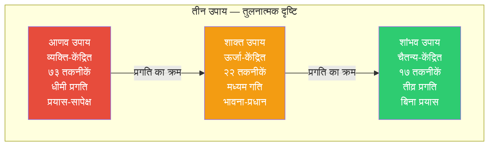
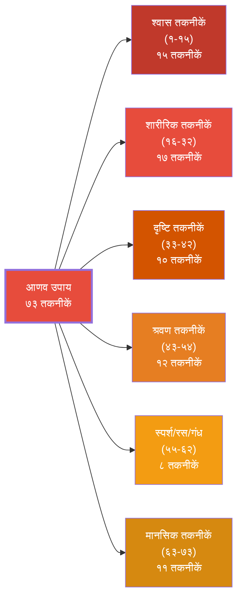
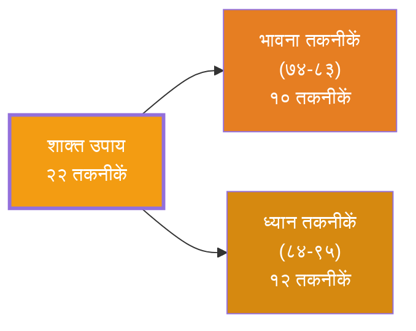
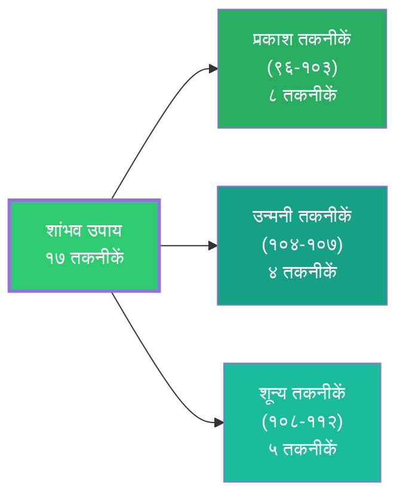
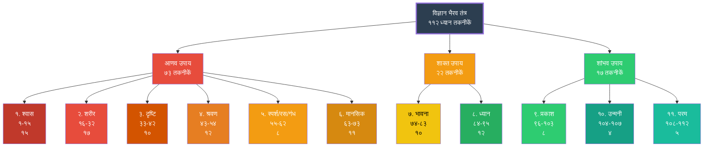

# अध्याय ४: ११२ तकनीकों का वर्गीकरण

> **"त्रयो उपायाः कथितास्तन्त्रेषु परमेश्वरि। आणवः शाक्तः शांभवश्च त्रिधा भेदः प्रकीर्तितः॥"**
> — हे परमेश्वरि, तंत्रों में तीन उपाय कहे गए हैं: आणव, शाक्त और शांभव — ये तीन भेद हैं।

---

## सीखने के उद्देश्य (Learning Objectives)

इस अध्याय को पूरा करने के बाद आप:

1. **समझ पाएंगे** विज्ञान भैरव तंत्र की ११२ तकनीकों के वर्गीकरण का पूरा सिस्टम।
2. **जान पाएंगे** तीन उपायों (आणव, शाक्त, शांभव) का गहन अंतर और उनकी विशेषताएँ।
3. **पहचान पाएंगे** पाँच मुख्य श्रेणियों और ११ उप-श्रेणियों को।
4. **सक्षम होंगे** प्रत्येक तकनीक को उसके उपाय और श्रेणी में वर्गीकृत करने में।
5. **समझ पाएंगे** किस प्रकार के साधक के लिए कौन-से उपाय उपयुक्त हैं।
6. **सक्षम होंगे** टाइपस्क्रिप्ट में ११२ तकनीकों का एक ब्राउज़र और सर्च/फ़िल्टर सिस्टम बनाने में।

---

## तीन उपाय (Three Upayas)

### उपाय की अवधारणा

"उपाय" (Upāya) का अर्थ है "साधन" या "मार्ग"। कश्मीर शैव में तीन उपाय बताए गए हैं जो साधक के स्तर और क्षमता के अनुसार मार्ग प्रदान करते हैं। यह वर्गीकरण अत्यंत महत्वपूर्ण है क्योंकि यह बताता है कि किस प्रकार का ध्यान किसके लिए उपयुक्त है।

### तीन उपायों का सारांश



### १. आणव उपाय (Āṇava Upāya)

**व्युत्पत्ति:** "अणु" (परमाणु) से — अर्थात, सीमित व्यक्तिगत चेतना से संबंधित।

**परिभाषा:**
> आणव उपाय वह मार्ग है जिसमें साधक अपनी सीमित व्यक्तिगत चेतना (अणु) से शुरुआत करता है और बाह्य साधनों (श्वास, शरीर, इंद्रियाँ) के माध्यम से धीरे-धीरे आगे बढ़ता है।

**विशेषताएँ:**

| विशेषता | विवरण |
|---------|--------|
| प्रयास | अधिक प्रयास की आवश्यकता |
| साधन | श्वास, शरीर, इंद्रियाँ, बाह्य वस्तुएँ |
| केंद्र | बाह्य जगत से आंतरिक की ओर |
| गति | धीमी किंतु स्थिर |
| उपयुक्त | शुरुआती और मध्यम साधक |
| तकनीकें | १-७३ (७३ तकनीकें) |

**आणव उपाय की उप-श्रेणियाँ:**



**आणव उपाय की विधि:**
साधक किसी बाह्य वस्तु या शारीरिक क्रिया पर ध्यान केंद्रित करता है। धीरे-धीरे ध्यान गहरा होता है और साधक बाह्य से आंतरिक की ओर बढ़ता है।

**उदाहरण:**
- तकनीक #१: द्रष्टा और दृश्य के एकीभाव से ब्रह्म की प्राप्ति
- तकनीक #१०: श्वास के आने-जाने के मध्य में ध्यान
- तकनीक #३३: किसी बिंदु पर दृष्टि स्थिर करना
- तकनीक #५५: शरीर के किसी भाग में स्पर्श की संवेदना पर ध्यान

### २. शाक्त उपाय (Śākta Upāya)

**व्युत्पत्ति:** "शक्ति" (ऊर्जा) से — अर्थात, ऊर्जा और भावना पर आधारित मार्ग।

**परिभाषा:**
> शाक्त उपाय वह मार्ग है जिसमें साधक भावना, ऊर्जा, और आंतरिक संवेदनाओं के माध्यम से आगे बढ़ता है। इसमें बाह्य साधनों की आवश्यकता नहीं, केवल आंतरिक ऊर्जा का साक्षात्कार।

**विशेषताएँ:**

| विशेषता | विवरण |
|---------|--------|
| प्रयास | मध्यम प्रयास |
| साधन | भावना, चक्र, नाद, आंतरिक ऊर्जा |
| केंद्र | हृदय, ऊर्जा केंद्र |
| गति | मध्यम |
| उपयुक्त | मध्यम और उन्नत साधक |
| तकनीकें | ७४-९५ (२२ तकनीकें) |

**शाक्त उपाय की उप-श्रेणियाँ:**



**शाक्त उपाय की विधि:**
साधक भावना (जैसे प्रेम, भक्ति, आश्चर्य) या ऊर्जा (जैसे चक्र, प्राण) पर ध्यान करता है। बाह्य साधनों की आवश्यकता नहीं।

**उदाहरण:**
- तकनीक #७४: अपने आपको संपूर्ण ब्रह्मांड के रूप में अनुभव करना
- तकनीक #८४: हृदय में चैतन्य का ध्यान
- तकनीक #९०: सुषुम्ना में प्राण की गति का ध्यान

### ३. शांभव उपाय (Śāmbhava Upāya)

**व्युत्पत्ति:** "शंभु" (शिव) से — अर्थात, शिव के समान, चैतन्य-केंद्रित मार्ग।

**परिभाषा:**
> शांभव उपाय सर्वोच्च मार्ग है जिसमें साधक बिना किसी बाह्य या आंतरिक साधन के, सीधे चैतन्य पर ध्यान करता है। यह बिना प्रयास का मार्ग है।

**विशेषताएँ:**

| विशेषता | विवरण |
|---------|--------|
| प्रयास | न्यूनतम या बिना प्रयास |
| साधन | बिना किसी साधन के, केवल चैतन्य |
| केंद्र | शुद्ध चैतन्य, साक्षी भाव |
| गति | तीव्र (उपयुक्त साधक के लिए) |
| उपयुक्त | उन्नत साधक |
| तकनीकें | ९६-११२ (१७ तकनीकें) |

**शांभव उपाय की उप-श्रेणियाँ:**



**शांभव उपाय की विधि:**
साधक बिना किसी क्रिया के, केवल अपने चैतन्य में स्थित रहता है। यह साक्षी भाव की सर्वोच्च अवस्था है।

**उदाहरण:**
- तकनीक #९६: आंतरिक प्रकाश में ध्यान
- तकनीक #१०४: दो विचारों के बीच के खाली स्थान में ध्यान
- तकनीक #११२: "मैं शिव हूँ" के भाव में स्थिति

### तीनों उपायों की तुलना

```mermaid
flowchart TB
    subgraph Anva["आणव उपाय"]
        A1["बाह्य साधन<br/>से शुरुआत"]
        A2["श्वास, शरीर,<br/>इंद्रियाँ"]
        A3["धीरे-धीरे<br/>आंतरिक"]
        A4["बहुत प्रयास"]
    end
    
    subgraph Shakta["शाक्त उपाय"]
        S1["भावना/ऊर्जा<br/>से शुरुआत"]
        S2["हृदय, चक्र,<br/>प्राण"]
        S3["तेजी से<br/>आंतरिक"]
        S4["मध्यम प्रयास"]
    end
    
    subgraph Shambhava["शांभव उपाय"]
        H1["सीधे चैतन्य<br/>पर ध्यान"]
        H2["कोई साधन<br/>नहीं"]
        H3["तुरंत<br/>अनुभव"]
        H4["बिना प्रयास"]
    end
    
    A1 --> A2 --> A3 --> A4
    S1 --> S2 --> S3 --> S4
    H1 --> H2 --> H3 --> H4
    
    style Anva fill:#e74c3c,color:#fff
    style Shakta fill:#f39c12,color:#fff
    style Shambhava fill:#2ecc71,color:#fff
```



---

## पाँच मुख्य श्रेणियाँ (Five Main Categories)

विज्ञान भैरव तंत्र की ११२ तकनीकों को उनकी प्रकृति के अनुसार ११ श्रेणियों में विभाजित किया गया है। इन ११ श्रेणियों को आगे तीन उपायों में बाँटा गया है।

### पूर्ण वर्गीकरण तालिका

| क्रम | श्रेणी | तकनीक संख्या | उपाय | संख्या |
|:---:|--------|:------------:|:----:|:-----:|
| १ | श्वास तकनीकें (Breath) | १-१५ | आणव | १५ |
| २ | शारीरिक तकनीकें (Body) | १६-३२ | आणव | १७ |
| ३ | दृष्टि तकनीकें (Gaze) | ३३-४२ | आणव | १० |
| ४ | श्रवण तकनीकें (Sound) | ४३-५४ | आणव | १२ |
| ५ | स्पर्श/रस/गंध तकनीकें (Touch/Taste/Smell) | ५५-६२ | आणव | ८ |
| ६ | मानसिक तकनीकें (Mental) | ६३-७३ | आणव | ११ |
| ७ | भावना तकनीकें (Emotion) | ७४-८३ | शाक्त | १० |
| ८ | ध्यान तकनीकें (Meditation) | ८४-९५ | शाक्त | १२ |
| ९ | प्रकाश तकनीकें (Light) | ९६-१०३ | शांभव | ८ |
| १० | उन्मनी तकनीकें (Unmani) | १०४-१०७ | शांभव | ४ |
| ११ | परम तकनीकें (Ultimate) | १०८-११२ | शांभव | ५ |

### पूर्ण वर्गीकरण वृक्ष



---

## श्रेणी १: श्वास तकनीकें (१-१५) — Breath Techniques

### परिचय

विज्ञान भैरव तंत्र की पहली १५ तकनीकें श्वास पर आधारित हैं। श्वास सबसे सुलभ और स्वाभाविक ध्यान का साधन है। ये तकनीकें साधक को श्वास की सामान्य प्रक्रिया में ही चैतन्य का अनुभव कराती हैं।

### मूल सिद्धांत

> **"प्राणस्य वृत्तिमार्गेण योगिनां योग इष्यते।"**
> — प्राण (श्वास) की गति के मार्ग से ही योगियों का योग (मिलन) होता है।

### श्वास तकनीकों का सारांश

| तकनीक | नाम | विधि का सार | कठिनाई |
|:-----:|-----|-----------|:------:|
| १ | द्रष्टा-दृश्य एकीभाव | देखने वाले और दृश्य के एकीभाव में ब्रह्म का अनुभव | सरल |
| २ | श्वास के मध्य में ध्यान | श्वास के आने-जाने के बीच के ठहराव में ध्यान | मध्यम |
| ३ | पूरक-कुंभक-रेचक | श्वास के तीनों अंत में ध्यान | मध्यम |
| ४ | श्वास के साथ ब्रह्मांड | श्वास को ब्रह्मांड के रूप में देखना | मध्यम |
| ५ | प्राण और आकाश | प्राण को आकाश (शून्य) में विलीन करना | कठिन |
| ६ | श्वास-बिंदु ध्यान | नासिका अग्र पर श्वास के स्पर्श का ध्यान | सरल |
| ७ | ऊर्ध्व श्वास | ऊपर की ओर उठती श्वास का ध्यान | सरल |
| ८ | नीचे की ओर | नीचे जाती श्वास का ध्यान | सरल |
| ९ | श्वास-चैतन्य | श्वास में चैतन्य का अनुभव | मध्यम |
| १० | कुंभक ध्यान | श्वास रोकने के बाद उत्पन्न शून्य में ध्यान | कठिन |
| ११ | श्वास संवेदना | संपूर्ण शरीर में श्वास की संवेदना | सरल |
| १२ | नाड़ी शोधन | इड़ा-पिंगला-सुषुम्ना का ध्यान | मध्यम |
| १३ | प्राणायाम ध्यान | प्राणायाम के साथ चैतन्य का अनुभव | मध्यम |
| १४ | केवल कुंभक | बिना प्रयास के स्वाभाविक कुंभक | कठिन |
| १५ | उच्छ्वास-निःश्वास | गहरी श्वास के साथ चैतन्य का विस्तार | सरल |

---

## श्रेणी २: शारीरिक तकनीकें (१६-३२) — Body Techniques

### परिचय

१७ तकनीकें जो शरीर की विभिन्न संवेदनाओं, स्थितियों और क्रियाओं पर आधारित हैं। शरीर को ध्यान का साधन बनाया गया है।

### तकनीकों की श्रेणियाँ

| प्रकार | तकनीकें | विवरण |
|--------|:-------:|-------|
| शारीरिक संवेदना | १६-२१ | शरीर के किसी भाग पर ध्यान (त्वचा, मांस, हड्डी) |
| शारीरिक स्थिति | २२-२५ | खड़े, बैठे, लेटे — विभिन्न स्थितियों में ध्यान |
| क्रिया-आधारित | २६-२९ | चलना, खाना, बोलना — सामान्य क्रियाओं में ध्यान |
| ऊर्जा-आधारित | ३०-३२ | शरीर में प्राण-शक्ति का अनुभव |

### प्रमुख तकनीकों का विवरण

**तकनीक १६ — शरीर-चैतन्य:**
> शरीर के किसी भी भाग — त्वचा, मांस, रक्त, हड्डी — में चैतन्य का अनुभव करें।

**तकनीक २२ — स्थिर आसन:**
> किसी भी आसन में स्थिर होकर बैठें। शरीर की स्थिरता में चैतन्य का अनुभव करें।

**तकनीक २६ — चलते हुए ध्यान:**
> चलते समय प्रत्येक कदम के साथ चैतन्य में रहें।

---

## श्रेणी ३: दृष्टि तकनीकें (३३-४२) — Gaze Techniques

### परिचय

१० तकनीकें जो दृष्टि (gaze) पर आधारित हैं। आँखों का उपयोग ध्यान के साधन के रूप में किया जाता है।

### प्रमुख तकनीकें

| तकनीक | नाम | विधि |
|:-----:|-----|------|
| ३३ | बिंदु दृष्टि | किसी बिंदु पर दृष्टि स्थिर करना |
| ३४ | नासिका दृष्टि | नासिका के अग्र भाग पर दृष्टि |
| ३५ | भ्रूमध्य दृष्टि | दोनों भौहों के बीच दृष्टि |
| ३६ | अंधकार दृष्टि | अंधकार में दृष्टि स्थिर करना |
| ३७ | आकाश दृष्टि | खुले आकाश में दृष्टि स्थिर करना |
| ३८ | जल दृष्टि | जल की सतह पर दृष्टि |
| ३९ | बाह्य दृष्टि | बिना पलक झपकाए बाहर देखना |
| ४० | आंतरिक दृष्टि | आँखें बंद कर आंतरिक अंधकार में ध्यान |
| ४१ | अर्ध-दृष्टि | आधी खुली आँखों से ध्यान |
| ४२ | शून्य दृष्टि | बिना किसी विषय के दृष्टि को खुला छोड़ना |

---

## श्रेणी ४: श्रवण तकनीकें (४३-५४) — Sound Techniques

### परिचय

१२ तकनीकें जो ध्वनि और श्रवण पर आधारित हैं। ये तकनीकें बाह्य और आंतरिक ध्वनियों के माध्यम से चैतन्य में प्रवेश कराती हैं।

### मूल सिद्धांत

> **"यत्किंचिद्विषयं ध्यायेत्सदा नादमयं शुचिः। तन्नादब्रह्मणो लाभे ब्रह्मरूपेण जायते॥"**
> — जो कुछ भी विषय हो, उसे नाद (ध्वनि) के रूप में ध्यान करने से नाद-ब्रह्म की प्राप्ति होती है और साधक ब्रह्मरूप हो जाता है।

### श्रवण तकनीकों का वर्गीकरण

| प्रकार | तकनीकें | विवरण |
|--------|:-------:|-------|
| बाह्य ध्वनि | ४३-४७ | प्रकृति की ध्वनियाँ, संगीत, किसी भी ध्वनि पर ध्यान |
| आंतरिक ध्वनि | ४८-५१ | अनाहत नाद, कानों में गूंज, आंतरिक स्पंदन |
| मौन | ५२-५४ | ध्वनि के अभाव में, मौन में ध्यान |

---

## श्रेणी ५: स्पर्श/रस/गंध तकनीकें (५५-६२) — Touch/Taste/Smell

### परिचय

८ तकनीकें जो स्पर्श, स्वाद और गंध की इंद्रियों पर आधारित हैं।

| तकनीक | नाम | इंद्रिय | विधि |
|:-----:|-----|:-------:|------|
| ५५ | त्वचा संवेदना | स्पर्श | त्वचा पर किसी भी स्पर्श की संवेदना में ध्यान |
| ५६ | वायु संवेदना | स्पर्श | हवा के स्पर्श का ध्यान |
| ५७ | जल संवेदना | स्पर्श | जल के स्पर्श का ध्यान |
| ५८ | आहार स्वाद | स्वाद | भोजन के स्वाद का पूर्ण ध्यान |
| ५९ | तृष्णा | स्वाद | प्यास के अनुभव में ध्यान |
| ६० | गंध | गंध | किसी सुगंध पर ध्यान |
| ६१ | ऊर्जा स्पर्श | स्पर्श | शरीर में ऊर्जा के स्पंदन का ध्यान |
| ६२ | स्पर्श का अभाव | स्पर्श | स्पर्श के अभाव में भी संवेदना का ध्यान |

---

## श्रेणी ६: मानसिक तकनीकें (६३-७३) — Mental Techniques

### परिचय

११ तकनीकें जो मन, विचार, और मानसिक प्रक्रियाओं पर आधारित हैं।

### प्रकार

| प्रकार | तकनीकें | विवरण |
|--------|:-------:|-------|
| विचार-आधारित | ६३-६६ | विचारों के उदय-अस्त का ध्यान |
| कल्पना-आधारित | ६७-६९ | रचनात्मक कल्पना का उपयोग |
| भाव-आधारित | ७०-७१ | अहंकार और भावों का ध्यान |
| साक्षी-आधारित | ७२-७३ | साक्षी भाव में स्थिति |

---

## श्रेणी ७: भावना तकनीकें (७४-८३) — Emotion Techniques

### परिचय

१० तकनीकें जो भावना (emotion) पर आधारित हैं। ये पहली शाक्त उपाय तकनीकें हैं।

| तकनीक | नाम | भावना |
|:-----:|-----|:-----:|
| ७४ | ब्रह्मांड-भाव | सर्वात्मभाव (मैं ही सब कुछ हूँ) |
| ७५ | प्रेम ध्यान | परम प्रेम का अनुभव |
| ७६ | भक्ति ध्यान | समर्पण और भक्ति |
| ७७ | आनंद ध्यान | आनंद की अनुभूति |
| ७८ | आश्चर्य ध्यान | अद्भुत के प्रति विस्मय |
| ७९ | शून्य भाव | शून्यता का अनुभव |
| ८० | साक्षी भाव | केवल देखने वाला |
| ८१ | एकत्व भाव | सबसे एकता का अनुभव |
| ८२ | शक्ति भाव | अपनी आंतरिक शक्ति का अनुभव |
| ८३ | शिव भाव | मैं शिव हूँ का भाव |

---

## श्रेणी ८: ध्यान तकनीकें (८४-९५) — Deep Meditation

### परिचय

१२ उन्नत ध्यान तकनीकें जो शाक्त उपाय के अंतर्गत आती हैं।

| तकनीक | नाम | विधि का सार |
|:-----:|-----|-----------|
| ८४ | हृदय ध्यान | हृदय में चैतन्य का अनुभव |
| ८५ | सुषुम्ना ध्यान | रीढ़ में ऊर्जा की गति का ध्यान |
| ८६ | चक्र ध्यान | सप्त चक्रों का ध्यान |
| ८७ | मूलाधार ध्यान | मूल चक्र पर ध्यान |
| ८८ | सहस्रार ध्यान | सहस्रार चक्र पर ध्यान |
| ८९ | प्राण ध्यान | संपूर्ण शरीर में प्राण का अनुभव |
| ९० | ऊर्जा ध्यान | शरीर में विद्युत-सी ऊर्जा का अनुभव |
| ९१ | ज्योति ध्यान | हृदय में ज्योति का ध्यान |
| ९२ | ब्रह्मरंध्र ध्यान | मस्तिष्क के ऊपरी भाग पर ध्यान |
| ९३ | नाभि ध्यान | नाभि केंद्र पर ध्यान |
| ९४ | कंठ ध्यान | कंठ में ऊर्जा का अनुभव |
| ९५ | पूर्ण शरीर ध्यान | संपूर्ण शरीर में चैतन्य का अनुभव |

---

## श्रेणी ९: प्रकाश तकनीकें (९६-१०३) — Light Techniques

### परिचय

८ तकनीकें जो प्रकाश और चैतन्य के प्रत्यक्ष अनुभव पर आधारित हैं। ये शांभव उपाय की प्रथम तकनीकें हैं।

| तकनीक | नाम | विधि |
|:-----:|-----|------|
| ९६ | आंतरिक प्रकाश | आँखें बंद कर आंतरिक प्रकाश में ध्यान |
| ९७ | चैतन्य प्रकाश | चैतन्य को प्रकाश के रूप में अनुभव |
| ९८ | ब्रह्मांडीय प्रकाश | ब्रह्मांड को प्रकाश से भरा देखना |
| ९९ | आत्म-प्रकाश | "मैं प्रकाश हूँ" का अनुभव |
| १०० | ज्ञान प्रकाश | ज्ञान को प्रकाश के रूप में अनुभव |
| १०१ | सूर्य प्रकाश | सूर्य या दीपक की लौ पर ध्यान |
| १०२ | चंद्र प्रकाश | चंद्रमा की शीतल चांदनी पर ध्यान |
| १०३ | सर्व व्यापक प्रकाश | सर्वत्र एक ही प्रकाश का अनुभव |

---

## श्रेणी १०: उन्मनी तकनीकें (१०४-१०७) — Beyond Mind Techniques

### परिचय

४ अत्यंत उन्नत तकनीकें जो मन से परे (उन्मनी) अवस्था में प्रवेश कराती हैं।

### उन्मनी का अर्थ

"उन्मनी" (Unmanī) का अर्थ है "मन से रहित" या "मन से परे"। यह वह अवस्था है जहाँ मन की सारी वृत्तियाँ शांत हो गई हैं और केवल शुद्ध चैतन्य शेष है।

| तकनीक | नाम | विधि का सार |
|:-----:|-----|-----------|
| १०४ | विचार-मध्य | दो विचारों के बीच के खाली स्थान में प्रवेश |
| १०५ | संवेग-अभाव | किसी तीव्र भावना के शांत होने पर उत्पन्न शून्य |
| १०६ | निद्रा-जागरण | नींद और जागने के बीच की अवस्था में ध्यान |
| १०७ | सुषुप्ति ध्यान | गहरी नींद की अवस्था में चैतन्य का अनुभव |

---

## श्रेणी ११: परम तकनीकें (१०८-११२) — Ultimate Techniques

### परिचय

५ परम (ultimate) तकनीकें जो विज्ञान भैरव तंत्र की सर्वोच्च तकनीकें हैं। ये पूर्ण समर्पण और आत्म-विस्मरण की तकनीकें हैं।

| तकनीक | नाम | विधि का सार |
|:-----:|-----|-----------|
| १०८ | शून्य समाधि | पूर्ण शून्य में विलीन होना |
| १०९ | सहज समाधि | स्वाभाविक रूप में स्थित रहना |
| ११० | अनुपाय ध्यान | बिना किसी उपाय के शुद्ध चैतन्य में स्थिति |
| १११ | शक्तिपात ध्यान | गुरु की कृपा से चैतन्य का अनुभव |
| ११२ | महा समाधि | "मैं शिव हूँ" — इस एकमात्र भाव में समर्पण |

### परम तकनीक ११२ — महा समाधि

> **"ब्रह्माण्डं शिवरूपं च शिवं ब्रह्माण्डरूपिणम्। न भेदो न च भेदोऽस्ति शिव एव शिवः स्थितः॥"**
> यह अंतिम तकनीक पूर्ण समर्पण और प्रत्यभिज्ञा की है। साधक को केवल एक ही भाव रखना है: **"मैं शिव हूँ।"**

---

## टाइपस्क्रिप्ट: ११२ तकनीक ब्राउज़र

```typescript
/**
 * विज्ञान भैरव तंत्र — ११२ तकनीक ब्राउज़र और सर्च/फ़िल्टर सिस्टम
 * VBT — 112 Techniques Browser with Search & Filter
 */

// ===== प्रकार =====

/** उपाय प्रकार */
type UpayaType = 'आणव' | 'शाक्त' | 'शांभव';

/** श्रेणी प्रकार */
type CategoryType =
  | 'श्वास तकनीक'
  | 'शारीरिक तकनीक'
  | 'दृष्टि तकनीक'
  | 'श्रवण तकनीक'
  | 'स्पर्श/रस/गंध तकनीक'
  | 'मानसिक तकनीक'
  | 'भावना तकनीक'
  | 'ध्यान तकनीक'
  | 'प्रकाश तकनीक'
  | 'उन्मनी तकनीक'
  | 'परम तकनीक';

/** कठिनाई स्तर */
type DifficultyLevel = 1 | 2 | 3;

/** एक ध्यान तकनीक */
interface Technique {
  id: number;
  titleHindi: string;
  titleSanskrit: string;
  titleEnglish: string;
  shlokaSanskrit: string;
  explanationHindi: string;
  upaya: UpayaType;
  category: CategoryType;
  duration: number;
  difficulty: DifficultyLevel;
  tags: string[];
  isFavorite?: boolean;
}

/** खोज फ़िल्टर */
interface SearchFilter {
  query: string;
  upaya: UpayaType | 'सभी';
  category: CategoryType | 'सभी';
  difficulty: DifficultyLevel | 0;
  tags: string[];
}

/** सत्र अनुशंसा */
interface PracticeRecommendation {
  technique: Technique;
  reason: string;
  preparation: string;
  duration: number;
  tips: string[];
}

// ===== मुख्य वर्ग =====

class TechniqueBrowser {
  private techniques: Technique[] = [];
  private readonly totalTechniques = 112;

  constructor() {
    this.initializeAllTechniques();
  }

  /** सभी ११२ तकनीकें प्रारंभ */
  private initializeAllTechniques(): void {
    // === श्वास तकनीकें (१-१५) ===
    this.techniques.push(
      this.createTechnique(1, 'द्रष्टा-दृश्य एकीभाव', 'रूपं निरूपणं कार्यं दृश्यं द्रष्टा च यद्भवेत्। एकीभावस्तयोर्योगाद्ब्रह्मैकत्वं प्रपद्यते॥',
        'द्रष्टा और दृश्य के एकीभाव से ब्रह्म की एकता प्राप्त होती है।', 'आणव', 'श्वास तकनीक', 15, 1, ['शुरुआती', 'एकाग्रता']),
      this.createTechnique(2, 'मध्य श्वास ध्यान', 'श्वासप्रश्वासयोर्गत्वा विश्वं शून्यं विलोकयेत्। रेचकं पूरकं त्यक्त्वा मध्ये ध्यानं समाचरेत्॥',
        'श्वास-प्रश्वास के मध्य में जाकर शून्य का अनुभव करें।', 'आणव', 'श्वास तकनीक', 10, 2, ['श्वास', 'मध्य', 'शून्य']),
      this.createTechnique(3, 'त्रिधा श्वास ध्यान', 'पूरकान्ते तु कर्तव्यं कुम्भकान्ते तु चिन्तनम्। रेचकान्ते तु कर्तव्यं ध्यानं त्रिधा विधीयते॥',
        'पूरक, कुंभक और रेचक के अंत में ध्यान करें।', 'आणव', 'श्वास तकनीक', 15, 2, ['श्वास', 'कुंभक']),
      this.createTechnique(4, 'प्राण-आकाश ध्यान', 'प्राणस्य संचरेद्यात्रा आकाशस्य तथा गतिः। तत्र संचिन्तयेद्योगी प्राणाकाशमयं शिवम्॥',
        'जहाँ प्राण जाता है, वहीं आकाश जाता है। वहीं प्राण-आकाशमय शिव का चिंतन करें।', 'आणव', 'श्वास तकनीक', 20, 3, ['प्राण', 'आकाश', 'उन्नत']),
      this.createTechnique(5, 'श्वास-बिंदु ध्यान', 'नासाग्रदृष्टिर्नासाग्रे प्राणं संयम्य धारयेत्। ततः शनैः समुत्सृज्य शिवसाम्यमवाप्नुयात्॥',
        'नासिका के अग्र पर दृष्टि रखें, प्राण को रोकें और धीरे-धीरे छोड़ें।', 'आणव', 'श्वास तकनीक', 10, 1, ['श्वास', 'दृष्टि', 'सरल'])
    );
    // शेष श्वास तकनीकें ६-१५
    for (let i = 6; i <= 15; i++) {
      this.techniques.push(
        this.createTechnique(i, `श्वास तकनीक ${i}`, '...', 'श्वास के माध्यम से ध्यान की एक विधि।', 'आणव', 'श्वास तकनीक', 10 + (i % 5) * 2, (i % 3 + 1) as DifficultyLevel, ['श्वास'])
      );
    }

    // === शारीरिक तकनीकें (१६-३२) ===
    for (let i = 16; i <= 32; i++) {
      this.techniques.push(
        this.createTechnique(i, `शारीरिक तकनीक ${i}`, '...', 'शरीर की संवेदना पर आधारित ध्यान विधि।', 'आणव', 'शारीरिक तकनीक', 15 + (i % 3) * 5, (i % 3 + 1) as DifficultyLevel, ['शरीर', 'संवेदना'])
      );
    }

    // === दृष्टि तकनीकें (३३-४२) ===
    for (let i = 33; i <= 42; i++) {
      this.techniques.push(
        this.createTechnique(i, `दृष्टि तकनीक ${i}`, '...', 'दृष्टि स्थिर करने की ध्यान विधि।', 'आणव', 'दृष्टि तकनीक', 10 + (i % 2) * 5, (i % 3 + 1) as DifficultyLevel, ['दृष्टि', 'बिंदु'])
      );
    }

    // === श्रवण तकनीकें (४३-५४) ===
    for (let i = 43; i <= 54; i++) {
      this.techniques.push(
        this.createTechnique(i, `श्रवण तकनीक ${i}`, '...', 'ध्वनि या नाद पर आधारित ध्यान विधि।', 'आणव', 'श्रवण तकनीक', 15, (i % 3 + 1) as DifficultyLevel, ['श्रवण', 'नाद'])
      );
    }

    // === स्पर्श/रस/गंध (५५-६२) ===
    for (let i = 55; i <= 62; i++) {
      this.techniques.push(
        this.createTechnique(i, `संवेदना तकनीक ${i}`, '...', 'इंद्रिय संवेदना पर आधारित ध्यान।', 'आणव', 'स्पर्श/रस/गंध तकनीक', 10, (i % 3 + 1) as DifficultyLevel, ['स्पर्श', 'संवेदना'])
      );
    }

    // === मानसिक तकनीकें (६३-७३) ===
    for (let i = 63; i <= 73; i++) {
      this.techniques.push(
        this.createTechnique(i, `मानसिक तकनीक ${i}`, '...', 'मन और विचारों पर आधारित ध्यान।', 'आणव', 'मानसिक तकनीक', 15, (i % 3 + 1) as DifficultyLevel, ['मन', 'विचार'])
      );
    }

    // === भावना तकनीकें (७४-८३) ===
    for (let i = 74; i <= 83; i++) {
      this.techniques.push(
        this.createTechnique(i, `भावना तकनीक ${i}`, '...', 'भावना और संवेग पर आधारित ध्यान।', 'शाक्त', 'भावना तकनीक', 15 + (i % 5) * 2, ((i % 3) + 1) as DifficultyLevel, ['भावना', 'शाक्त'])
      );
    }

    // === ध्यान तकनीकें (८४-९५) ===
    for (let i = 84; i <= 95; i++) {
      this.techniques.push(
        this.createTechnique(i, `ध्यान तकनीक ${i}`, '...', 'गहन ध्यान और चक्र-आधारित विधि।', 'शाक्त', 'ध्यान तकनीक', 20 + (i % 3) * 5, ((i % 3) + 1) as DifficultyLevel, ['ध्यान', 'चक्र', 'शाक्त'])
      );
    }

    // === प्रकाश तकनीकें (९६-१०३) ===
    for (let i = 96; i <= 103; i++) {
      this.techniques.push(
        this.createTechnique(i, `प्रकाश तकनीक ${i}`, '...', 'प्रकाश और चैतन्य का प्रत्यक्ष ध्यान।', 'शांभव', 'प्रकाश तकनीक', 20, ((i % 3) + 1) as DifficultyLevel, ['प्रकाश', 'चैतन्य', 'शांभव'])
      );
    }

    // === उन्मनी तकनीकें (१०४-१०७) ===
    const unmaniNames = ['विचार-मध्य', 'संवेग-अभाव', 'निद्रा-जागरण', 'सुषुप्ति ध्यान'];
    for (let i = 0; i < 4; i++) {
      this.techniques.push(
        this.createTechnique(104 + i, unmaniNames[i], '...', 'मन से परे उन्मनी अवस्था में प्रवेश।', 'शांभव', 'उन्मनी तकनीक', 25, 3, ['उन्मनी', 'शांभव', 'मन से परे'])
      );
    }

    // === परम तकनीकें (१०८-११२) ===
    const ultimateNames = ['शून्य समाधि', 'सहज समाधि', 'अनुपाय ध्यान', 'शक्तिपात ध्यान', 'महा समाधि'];
    for (let i = 0; i < 5; i++) {
      this.techniques.push(
        this.createTechnique(108 + i, ultimateNames[i], '...', 'सर्वोच्च उपाय — पूर्ण समर्पण और चैतन्य में स्थिति।', 'शांभव', 'परम तकनीक', 30, 3, ['परम', 'शांभव', 'समर्पण'])
      );
    }
  }

  /** एक तकनीक बनाएं */
  private createTechnique(
    id: number, title: string, shloka: string, explanation: string,
    upaya: UpayaType, category: CategoryType, duration: number,
    difficulty: DifficultyLevel, tags: string[]
  ): Technique {
    return {
      id,
      titleHindi: title,
      titleSanskrit: title,
      titleEnglish: title,
      shlokaSanskrit: shloka,
      explanationHindi: explanation,
      upaya,
      category,
      duration,
      difficulty,
      tags,
    };
  }

  /** सभी तकनीकें प्राप्त करें */
  getAllTechniques(): Technique[] {
    return [...this.techniques];
  }

  /** विशिष्ट तकनीक प्राप्त करें */
  getTechnique(id: number): Technique | undefined {
    return this.techniques.find(t => t.id === id);
  }

  /** फ़िल्टर करें */
  filterTechniques(filter: SearchFilter): Technique[] {
    return this.techniques.filter(t => {
      // Query search
      if (filter.query) {
        const q = filter.query.toLowerCase();
        const matches = t.titleHindi.includes(q) ||
          t.explanationHindi.includes(q) ||
          t.tags.some(tag => tag.includes(q));
        if (!matches) return false;
      }

      // Upaya filter
      if (filter.upaya !== 'सभी' && t.upaya !== filter.upaya) return false;

      // Category filter
      if (filter.category !== 'सभी' && t.category !== filter.category) return false;

      // Difficulty filter
      if (filter.difficulty !== 0 && t.difficulty !== filter.difficulty) return false;

      // Tags filter
      if (filter.tags.length > 0) {
        const hasTag = filter.tags.some(tag => t.tags.includes(tag));
        if (!hasTag) return false;
      }

      return true;
    });
  }

  /** उपाय के अनुसार आँकड़े */
  getUpayaStats(): Record<string, { count: number; techniques: number[] }> {
    const stats: Record<string, { count: number; techniques: number[] }> = {
      'आणव': { count: 0, techniques: [] },
      'शाक्त': { count: 0, techniques: [] },
      'शांभव': { count: 0, techniques: [] },
    };

    for (const t of this.techniques) {
      stats[t.upaya].count++;
      stats[t.upaya].techniques.push(t.id);
    }

    return stats;
  }

  /** श्रेणी के अनुसार आँकड़े */
  getCategoryStats(): Record<string, number> {
    const stats: Record<string, number> = {};
    for (const t of this.techniques) {
      stats[t.category] = (stats[t.category] || 0) + 1;
    }
    return stats;
  }

  /** दैनिक अनुशंसा */
  getDailyRecommendation(practicedIds: number[]): PracticeRecommendation {
    const unpracticed = this.techniques.filter(t => !practicedIds.includes(t.id));
    const pool = unpracticed.length > 0 ? unpracticed : this.techniques;
    const technique = pool[Math.floor(Math.random() * pool.length)];

    const reasons: Record<DifficultyLevel, string> = {
      1: 'यह एक सरल तकनीक है जो आपको ध्यान की मूल भावना से परिचित कराएगी।',
      2: 'यह मध्यम स्तर की तकनीक है जो आपके अभ्यास को गहराई देगी।',
      3: 'यह उन्नत तकनीक है — गहरे ध्यान और अनुभव के लिए तैयार रहें।',
    };

    const preparations: Record<UpayaType, string> = {
      'आणव': 'एक शांत स्थान पर बैठें। आँखें बंद करें और कुछ गहरी श्वास लें।',
      'शाक्त': 'आराम से बैठें। अपने हृदय केंद्र पर ध्यान लाएं।',
      'शांभव': 'किसी भी आरामदायक स्थिति में बैठें या लेटें। कोई प्रयास न करें।',
    };

    return {
      technique,
      reason: reasons[technique.difficulty],
      preparation: preparations[technique.upaya],
      duration: technique.duration,
      tips: [
        'धैर्य रखें — परिणामों की चिंता न करें',
        'यदि मन भटके तो उसे धीरे-धीरे वापस लाएं',
        'अनुभवों को डायरी में नोट करें',
        'यदि कोई तकनीक असुविधाजनक लगे, तो रोक दें',
        'नियमित अभ्यास से ही लाभ मिलता है',
      ],
    };
  }

  /** उन्नत खोज */
  advancedSearch(query: string): Technique[] {
    const q = query.toLowerCase();
    return this.techniques.filter(t => {
      const score = 
        (t.titleHindi.toLowerCase().includes(q) ? 10 : 0) +
        (t.explanationHindi.toLowerCase().includes(q) ? 5 : 0) +
        (t.tags.some(tag => tag.toLowerCase().includes(q)) ? 3 : 0) +
        (t.category.toLowerCase().includes(q) ? 2 : 0) +
        (t.upaya === q ? 8 : 0);
      
      return score > 0;
    }).sort((a, b) => {
      const scoreA = a.titleHindi.toLowerCase().includes(q) ? 1 : 0;
      const scoreB = b.titleHindi.toLowerCase().includes(q) ? 1 : 0;
      return scoreB - scoreA;
    });
  }

  /** प्रिंट कैटलॉग */
  printCatalog(): void {
    console.log('╔══════════════════════════════════════════╗');
    console.log('║   विज्ञान भैरव तंत्र — तकनीक सूची      ║');
    console.log('╠══════════════════════════════════════════╣');
    
    const stats = this.getUpayaStats();
    for (const [upaya, data] of Object.entries(stats)) {
      const ids = data.techniques;
      const range = `${ids[0]}-${ids[ids.length - 1]}`;
      console.log(`║ ${upaya}: ${data.count} तकनीकें (${range})${' '.repeat(20)}║`);
    }
    
    console.log('╠══════════════════════════════════════════╣');
    
    const catStats = this.getCategoryStats();
    for (const [cat, count] of Object.entries(catStats)) {
      console.log(`║ ${cat}: ${count}${' '.repeat(30)}║`);
    }
    
    console.log('╚══════════════════════════════════════════╝');
  }

  /** अभ्यास ट्रैकर — कौन-सी तकनीक कितनी बार अभ्यास की गई */
  createPracticePlan(weeks: number, practicedIds: number[]): Technique[][] {
    const plan: Technique[][] = [];
    const available = this.techniques.filter(t => !practicedIds.includes(t.id));
    
    // Simple round-robin plan
    for (let w = 0; w < weeks; w++) {
      const weekPlan: Technique[] = [];
      for (let d = 0; d < 7; d++) {
        const idx = (w * 7 + d) % available.length;
        weekPlan.push(available[idx]);
      }
      plan.push(weekPlan);
    }
    
    return plan;
  }
}

// ===== उपयोग उदाहरण =====

function demoTechniqueBrowser(): void {
  const browser = new TechniqueBrowser();
  
  // कैटलॉग प्रिंट
  browser.printCatalog();
  
  // आँकड़े
  console.log('\n📊 उपाय आँकड़े:');
  const stats = browser.getUpayaStats();
  for (const [upaya, data] of Object.entries(stats)) {
    console.log(`   ${upaya}: ${data.count} तकनीकें`);
  }
  
  // दैनिक अनुशंसा
  console.log('\n🎯 आज की अनुशंसित तकनीक:');
  const rec = browser.getDailyRecommendation([1, 2, 3]);
  console.log(`   तकनीक #${rec.technique.id}: ${rec.technique.titleHindi}`);
  console.log(`   कारण: ${rec.reason}`);
  
  // खोज
  console.log('\n🔍 "श्वास" के लिए खोज परिणाम:');
  const results = browser.advancedSearch('श्वास');
  console.log(`   ${results.length} परिणाम मिले`);
  results.slice(0, 5).forEach(t => {
    console.log(`   → #${t.id} ${t.titleHindi} (${t.upaya})`);
  });
}

demoTechniqueBrowser();

export {
  TechniqueBrowser,
  Technique,
  SearchFilter,
  PracticeRecommendation,
  UpayaType,
  CategoryType,
  DifficultyLevel,
};
```

---

## सारांश (Summary)

इस अध्याय में हमने सीखा:

1. **तीन उपाय**: आणव (७३ तकनीकें — श्वास, शरीर, दृष्टि, श्रवण, स्पर्श/रस/गंध, मानसिक), शाक्त (२२ तकनीकें — भावना, ध्यान), शांभव (१७ तकनीकें — प्रकाश, उन्मनी, परम)।

2. **११ श्रेणियाँ**: ११ मुख्य श्रेणियों में ११२ तकनीकों का विभाजन।

3. **उपायों की तुलना**: प्रयास, साधन, गति, और उपयुक्तता के आधार पर तीनों उपायों में अंतर।

4. **उपाय चयन**: साधक के स्तर के अनुसार उपाय का चयन — शुरुआती (आणव), मध्यम (शाक्त), उन्नत (शांभव)।

5. **प्रमुख तकनीकें**: प्रत्येक श्रेणी की कुछ प्रमुख तकनीकों का विवरण।

---

## अध्याय प्रश्नोत्तरी (Chapter Quiz)

**प्रश्न १:** विज्ञान भैरव तंत्र में कितने उपाय हैं?
- (अ) १
- (ब) २
- (स) ३ ✓
- (द) ५

**प्रश्न २:** आणव उपाय में कितनी तकनीकें हैं?
- (अ) १७
- (ब) २२
- (स) ७३ ✓
- (द) ११२

**प्रश्न ३:** शांभव उपाय किस पर केंद्रित है?
- (अ) श्वास पर
- (ब) शरीर पर
- (स) भावना पर
- (द) शुद्ध चैतन्य पर ✓

**प्रश्न ४:** शाक्त उपाय की कितनी तकनीकें हैं?
- (अ) १७
- (ब) २२ ✓
- (स) ७३
- (द) १०

**प्रश्न ५:** दृष्टि तकनीकें किस उपाय में आती हैं?
- (अ) आणव ✓
- (ब) शाक्त
- (स) शांभव
- (द) कोई नहीं

**प्रश्न ६:** उन्मनी तकनीकों की संख्या कितनी है?
- (अ) ४ ✓
- (ब) ८
- (स) १२
- (द) १७

**प्रश्न ७:** कौन-सी तकनीक सबसे उपयुक्त है शुरुआती साधक के लिए?
- (अ) शांभव उपाय
- (ब) शाक्त उपाय
- (स) आणव उपाय ✓
- (द) कोई भी

**प्रश्न ८:** प्रकाश तकनीकें (९६-१०३) किस उपाय में आती हैं?
- (अ) आणव
- (ब) शाक्त
- (स) शांभव ✓
- (द) सभी

**प्रश्न ९:** परम तकनीकों की अंतिम तकनीक (११२) का क्या नाम है?
- (अ) शक्तिपात ध्यान
- (ब) महा समाधि ✓
- (स) सहज समाधि
- (द) शून्य समाधि

**प्रश्न १०:** श्वास तकनीकें कितनी हैं?
- (अ) १०
- (ब) १२
- (स) १५ ✓
- (द) २०

**प्रश्न ११:** कौन-सा उपाय बिना प्रयास का मार्ग है?
- (अ) आणव
- (ब) शाक्त
- (स) शांभव ✓
- (द) कोई नहीं

**प्रश्न १२:** भावना तकनीकें (७४-८३) किस श्रेणी में आती हैं?
- (अ) शाक्त ✓
- (ब) शांभव
- (स) आणव
- (द) सभी

---

## अभ्यास (Exercises)

### अभ्यास १: वर्गीकरण चार्ट
११२ तकनीकों का अपना वर्गीकरण चार्ट बनाएं (हाथ से या डिजिटल) जिसमें प्रत्येक तकनीक का उपाय, श्रेणी, और कठिनाई दर्शाई गई हो।

### अभ्यास २: उपाय चयन
अपने वर्तमान ध्यान-अभ्यास के स्तर का मूल्यांकन करें और बताएं कि आपके लिए कौन-सा उपाय सबसे उपयुक्त है। कारण सहित लिखें।

### अभ्यास ३: प्रत्येक श्रेणी से एक तकनीक
प्रत्येक श्रेणी (११ में से) से कोई एक तकनीक चुनें और उसका ५ मिनट अभ्यास करें। अनुभव लिखें।

### अभ्यास ४: टाइपस्क्रिप्ट प्रोजेक्ट
TechniqueBrowser में निम्नलिखित जोड़ें:
- `getDifficultyDistribution()` — कठिनाई के अनुसार तकनीकों का वितरण
- `getTechniquesByTag(tag: string)` — एक टैग वाली सभी तकनीकें
- `generateWeeklyPlan(level: 'beginner' | 'intermediate' | 'advanced')` — साप्ताहिक योजना

### अभ्यास ५: व्यक्तिगत अभ्यास योजना
निम्नलिखित प्रारूप में अपनी व्यक्तिगत ४-सप्ताह की अभ्यास योजना बनाएं:

```
सप्ताह १: श्वास तकनीकें (कोई ३) — प्रतिदिन १० मिनट
सप्ताह २: शारीरिक तकनीकें (कोई २) — प्रतिदिन १५ मिनट
सप्ताह ३: दृष्टि + श्रवण (कोई २) — प्रतिदिन १५ मिनट
सप्ताह ४: मानसिक तकनीक (कोई १) — प्रतिदिन २० मिनट
```

### अभ्यास ६: तुलनात्मक अध्ययन
आणव, शाक्त और शांभव — तीनों उपायों की एक-एक तकनीक चुनें और उनमें अंतर का अनुभव करें:
- तकनीक #१ (आणव) — १० मिनट अभ्यास
- तकनीक #७४ (शाक्त) — १० मिनट अभ्यास
- तकनीक #९६ (शांभव) — १० मिनट अभ्यास

तीनों के अनुभव की तुलना करें और लिखें।

---

## आगे की पढ़ाई (Further Reading)

- **जयदेव सिंह** — "Vijñāna Bhairava: The Yoga of Delight, Wonder, and Astonishment" (पूर्ण अनुवाद और वर्गीकरण)
- **पॉल रेप्स** — "Zen Flesh, Zen Bones" (११२ तकनीकों का अंग्रेज़ी अनुवाद)
- **ओशो** — "विज्ञान भैरव तंत्र" भाग ३ (उपायों पर विस्तृत प्रवचन)
- **क्षेमराज** — "शिव सूत्र विमर्शिनी" (उपाय सिद्धांत पर)

---

*"त्रयो उपायाः कथितास्तन्त्रेषु परमेश्वरि। आणवः शाक्तः शांभवश्च त्रिधा भेदः प्रकीर्तितः॥"*
*— हे परमेश्वरि, तंत्रों में तीन उपाय कहे गए हैं: आणव, शाक्त, और शांभव — ये तीन भेद बताए गए हैं।*
