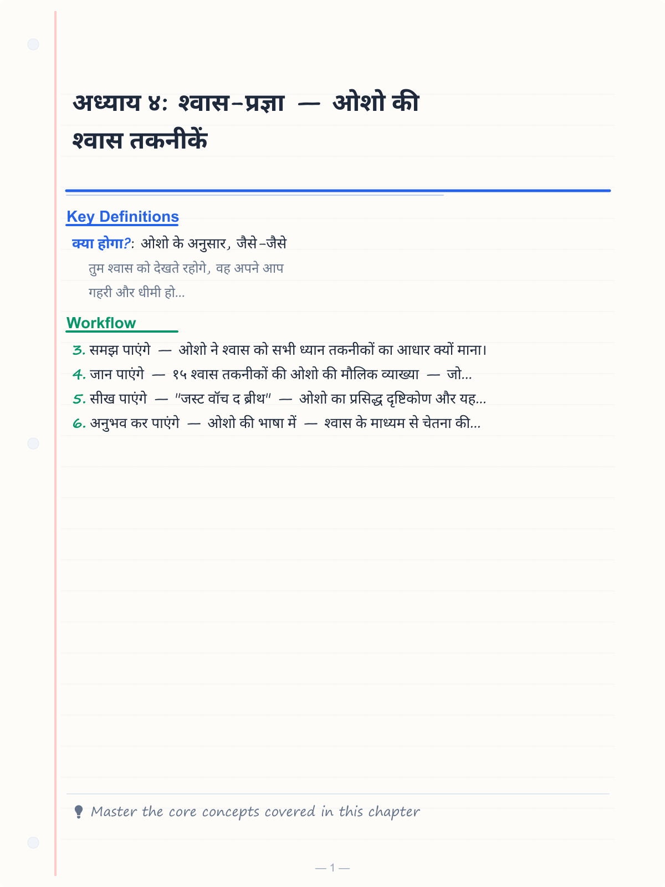
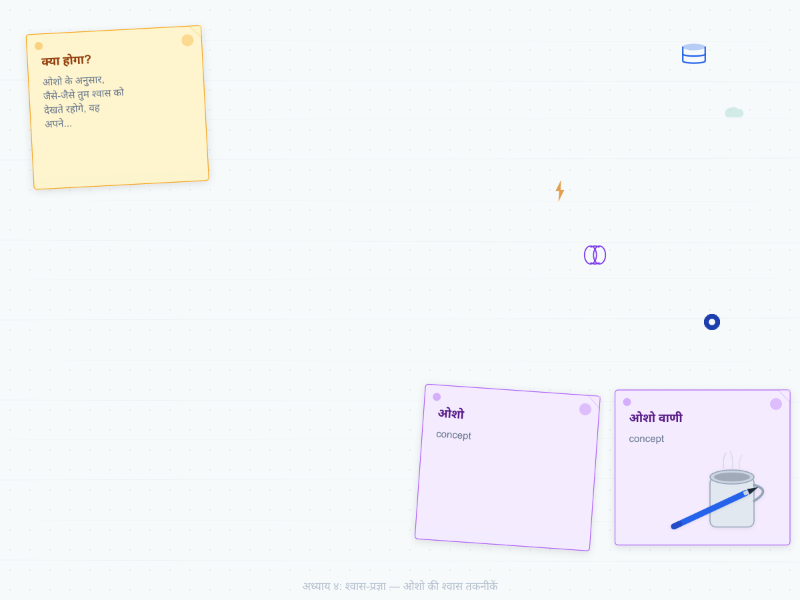
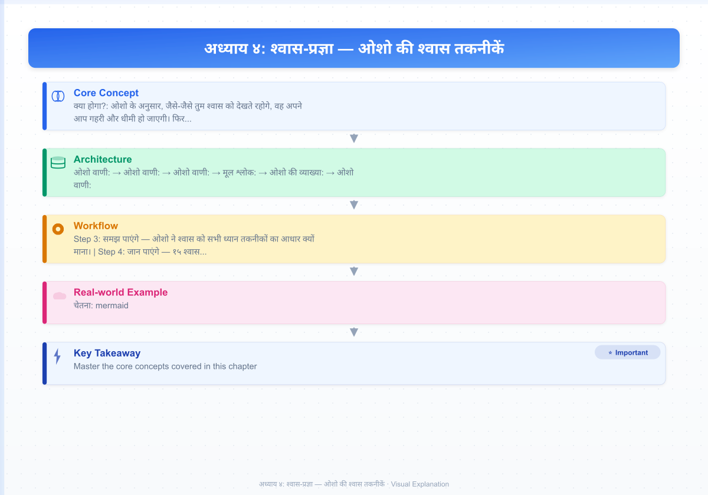
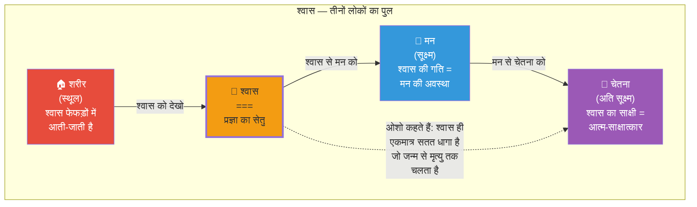
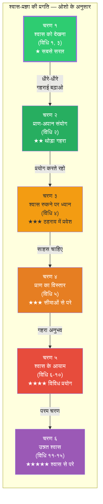
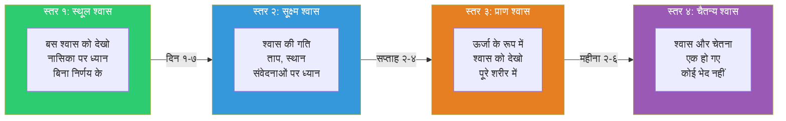

# अध्याय ४: श्वास-प्रज्ञा — ओशो की श्वास तकनीकें

> **"श्वास सबसे छोटा पुल है — इस पार से उस पार तक। और यह पुल हमेशा उपलब्ध है — चौबीसों घंटे।"**
> — **ओशो**

---

**ओशो वाणी:**
> "श्वास पर ध्यान देना — यह सबसे सरल और सबसे क्रांतिकारी तकनीक है। यह कोई प्राणायाम नहीं है — मैं तुमसे श्वास को नियंत्रित करने के लिए नहीं कह रहा। मैं कह रहा हूँ — श्वास को देखो। बस देखो। इस देखने में ही संपूर्ण क्रांति छिपी है। श्वास को देखना सीख लो — तो सब कुछ सीख लिया।"

---

<!-- Image Gallery -->
<section class="lesson-visuals" aria-label="Visual learning resources">
  <header><span>VISUAL LEARNING</span><h2>See it. Review it. Remember it.</h2></header>
  <a class="lesson-visual-card" href="../../assets/images/lessons/vigyan-bhairav-tantra/04-shwas-pragya/handwritten-notes.png" target="_blank" rel="noopener">
    
    <span><strong>Handwritten notes</strong>Condensed notes for deliberate review.</span>
  </a>
  <a class="lesson-visual-card" href="../../assets/images/lessons/vigyan-bhairav-tantra/04-shwas-pragya/sticky-notes.png" target="_blank" rel="noopener">
    
    <span><strong>Sticky-note revision</strong>Fast recall prompts for revision.</span>
  </a>
  <a class="lesson-visual-card" href="../../assets/images/lessons/vigyan-bhairav-tantra/04-shwas-pragya/visual-explanation.png" target="_blank" rel="noopener">
    
    <span><strong>Visual concept guide</strong>A connected explanation of the key ideas.</span>
  </a>
</section>
<!-- End Image Gallery -->

## सीखने के उद्देश्य (Learning Objectives)

इस अध्याय को पूरा करने के बाद आप:

1. **समझ पाएंगे** — ओशो ने श्वास को सभी ध्यान तकनीकों का आधार क्यों माना।
2. **जान पाएंगे** — १५ श्वास तकनीकों की ओशो की मौलिक व्याख्या — जो पारंपरिक प्राणायाम से बिल्कुल अलग है।
3. **सीख पाएंगे** — "जस्ट वॉच द ब्रीथ" — ओशो का प्रसिद्ध दृष्टिकोण और यह क्यों इतना प्रभावी है।
4. **अनुभव कर पाएंगे** — ओशो की भाषा में — श्वास के माध्यम से चेतना की गहराइयों तक जाने का मार्ग।
5. **सक्षम होंगे** — टाइपस्क्रिप्ट में ओशो-शैली श्वास ध्यान टाइमर बनाने में जिसमें उनके मार्गदर्शन के शब्द हों।

---

## श्वास: ओशो का आधार सिद्धांत

### श्वास ही क्यों?

**ओशो वाणी:**
> "मैं श्वास को इसलिए चुनता हूँ क्योंकि वह हमेशा चल रही है — तुम्हें उसके लिए अलग समय निकालने की ज़रूरत नहीं। चाहे तुम जागो या सोओ — श्वास चलती रहती है। और वह सबसे सूक्ष्म और सबसे स्थूल के बीच का पुल है — शरीर और चेतना के बीच का सेतु।"

ओशो के अनुसार, श्वास तीन दुनियाओं को जोड़ती है:
1. **शरीर** (स्थूल) — श्वास एक शारीरिक प्रक्रिया है
2. **मन** (सूक्ष्म) — श्वास की गति मन की अवस्था को दर्शाती है
3. **चेतना** (अति सूक्ष्म) — श्वास का साक्षी बनना चेतना तक ले जाता है



### ओशो का प्राणायाम से अंतर

पारंपरिक प्राणायाम श्वास को नियंत्रित करना सिखाता है — कब लेना, कब छोड़ना, कितनी देर रोकना। ओशो का दृष्टिकोण बिल्कुल विपरीत है:

| पारंपरिक प्राणायाम | ओशो की श्वास-प्रज्ञा |
|--------------------|---------------------|
| श्वास को नियंत्रित करो | श्वास को देखो — नियंत्रण मत करो |
| श्वास को बदलो | श्वास को वैसे ही रहने दो |
| प्राण को ऊपर खींचो | प्राण को स्वाभाविक रूप से बहने दो |
| कुंभक (रोकना) पर जोर | साक्षी (देखना) पर जोर |
| लक्ष्य: ऊर्जा नियंत्रण | लक्ष्य: चेतना जागरण |
| परिणाम: शारीरिक और प्राणिक लाभ | परिणाम: आध्यात्मिक जागृति |

**ओशो वाणी:**
> "प्राणायाम श्वास को नियंत्रित करता है — यह एक विज्ञान है। लेकिन मैं जो सिखा रहा हूँ, वह उससे भी ऊपर है। मैं श्वास को देखना सिखा रहा हूँ — और देखने का मतलब है, उसे वैसे ही रहने देना जैसी वह है। नियंत्रण से मन मजबूत होता है — देखने से मन गायब हो जाता है।"

---

## श्वास तकनीकों की प्रगति: ओशो के अनुसार



---

## विस्तार से १५ श्वास तकनीकें — ओशो की व्याख्या

### विधि १: श्वास-प्राण धारण (Breath Awareness)

**मूल श्लोक:**
> *प्राणे संस्थिते नाड्यां नाडीचक्रे प्रबोधिते।*

**ओशो की व्याख्या:**

**ओशो वाणी:**
> "आराम से बैठो। अपनी आँखें बंद करो। अब श्वास को देखो — जैसे वह अंदर जाती है। उसे महसूस करो — नासिका के छिद्रों में, गले में, छाती में, पेट में। फिर देखो — जैसे वह बाहर आती है। बस देखो। उसे बदलो मत। अगर वह छोटी है — तो छोटी रहने दो। अगर बड़ी है — तो बड़ी रहने दो। तुम केवल साक्षी हो।"

**अभ्यास विधि:**
1. किसी शांत स्थान पर बैठें — रीढ़ सीधी, शरीर शिथिल
2. आँखें बंद करें
3. श्वास को नासिका में प्रवेश करते हुए देखें
4. श्वास को नासिका से बाहर निकलते हुए देखें
5. यदि मन भटके — तो धीरे से वापस श्वास पर लाएँ
6. १५-२० मिनट तक जारी रखें

**क्या होगा?** — ओशो के अनुसार, जैसे-जैसे तुम श्वास को देखते रहोगे, वह अपने आप गहरी और धीमी हो जाएगी। फिर एक दिन — श्वास इतनी धीमी हो जाएगी कि वह लगभग रुक सी जाएगी। उस ठहराव में — तुम्हें अपना असली स्वरूप दिखेगा।

---

### विधि २: प्राण-अपान संयोग (Union of Prana and Apana)

**मूल श्लोक:**
> *प्राणापानौ समौ कृत्वा नासाभ्यन्तरचारिणौ।*

**ओशो की व्याख्या:**

**ओशो वाणी:**
> "प्राण है अंदर की ऊर्जा — श्वास। अपान है बाहर की ऊर्जा — प्रश्वास। दोनों अलग-अलग दिशाओं में बहते हैं। तंत्र कहता है — इन दोनों को मिलने दो। जब प्राण और अपान मिलते हैं — तो एक तीसरी ऊर्जा पैदा होती है — वही चेतना है।"

**अभ्यास विधि:**
1. श्वास को अंदर लें — महसूस करें कि प्राण नीचे उतर रहा है
2. श्वास को बाहर छोड़ें — महसूस करें कि अपान ऊपर उठ रहा है
3. धीरे-धीरे — प्राण को नीचे से ऊपर और अपान को ऊपर से नीचे आने दें
4. जहाँ वे मिलते हैं (हृदय के पास) — वहाँ ध्यान रखें
5. २०-२५ मिनट अभ्यास करें

**ओशो वाणी:**
> "दो नदियों की तरह — प्राण और अपान। एक गंगा, दूसरी यमुना। जहाँ वे मिलती हैं — वहाँ प्रयाग है। वहाँ स्नान करो — और सब पाप धुल जाते हैं। लेकिन यह स्नान पानी से नहीं — चेतना से होता है।"

---

### विधि ३: श्वास-प्रश्वास साक्षी (Witnessing Inhale and Exhale)

**मूल श्लोक:**
> *श्वासप्रश्वासयोरैक्यं तयोर्योगं च साधयेत्।*

**ओशो की व्याख्या:**

**ओशो वाणी:**
> "यह लगभग विधि १ जैसी ही है — लेकिन एक फर्क है। यहाँ तुम श्वास को नहीं देखते — तुम श्वास के 'आने' और 'जाने' को देखते हो। दोनों क्रियाओं को एक साथ देखो — आना भी, जाना भी। और फिर — आने और जाने के बीच के ठहराव को भी देखो। वह ठहराव — वही शून्य है।"

यह तकनीक ओशो की सबसे प्रिय तकनीकों में से एक है। वे कहते हैं कि यह इतनी सरल है कि कोई भी कर सकता है — और इतनी गहरी है कि सिद्ध भी इसी में लीन हो जाते हैं।

---

### विधि ४: श्वास रुकने पर ध्यान (Attention at Breath Stoppage)

**मूल श्लोक:**
> *यदा प्राणः स्थितो देहे तदा शून्यं प्रपद्यते।*

**ओशो की व्याख्या:**

**ओशो वाणी:**
> "दो श्वासों के बीच — एक छोटा सा ठहराव है। जब श्वास अंदर जाती है — तो एक पल के लिए रुकती है, फिर बाहर आती है। और जब बाहर आती है — तो एक पल के लिए रुकती है, फिर अंदर जाती है। वह ठहराव — वह शून्य है। वहाँ कोई श्वास नहीं — कोई विचार नहीं — केवल शुद्ध अस्तित्व है।"

**अभ्यास विधि:**
1. श्वास को देखते हुए बैठें
2. जब श्वास अंदर जाए — देखें
3. जब श्वास अंदर जाकर रुके — उस ठहराव को देखें
4. फिर श्वास बाहर आए — देखें
5. जब श्वास बाहर जाकर रुके — उस ठहराव को देखें
6. धीरे-धीरे — ठहराव लंबा होता जाएगा

---

### विधि ५: प्राण-शून्य विस्तार (Expansion of Prana into Void)

**मूल श्लोक:**
> *प्राणं शून्ये विस्तार्य ततः शान्तिमवाप्नुयात्।*

**ओशो की व्याख्या:**

**ओशो वाणी:**
> "श्वास को फैलने दो — अपनी सीमाओं से परे। साधारणतः श्वास शरीर में सीमित है — अंदर और बाहर। लेकिन श्वास को पूरे ब्रह्मांड में फैलने दो। जब तुम श्वास लेते हो — तो पूरा ब्रह्मांड तुममें प्रवेश कर रहा है। जब तुम छोड़ते हो — तो तुम पूरे ब्रह्मांड में फैल रहे हो। यह सीमाओं का विसर्जन है।"

यह एक उन्नत तकनीक है — ओशो इसे तभी करने की सलाह देते हैं जब तुम विधि १-३ में स्थिर हो जाओ।

---

### विधि ६-१०: श्वास के पाँच आयाम (Five Dimensions of Breath)

**ओशो की समग्र व्याख्या:**

**ओशो वाणी:**
> "श्वास के पाँच आयाम हैं — गति, ताप, स्थान, समय, और दिशा। हर आयाम पर ध्यान करने से चेतना का एक नया द्वार खुलता है।"

| विधि | आयाम | अभ्यास | ओशो का संकेत |
|------|------|--------|-------------|
| ६ | **गति** (Speed) | श्वास की गति को देखो — तेज़ या धीमी | "गति को मत बदलो — बस देखो। गति के पीछे की ऊर्जा को देखो।" |
| ७ | **ताप** (Temperature) | श्वास के तापमान को महसूस करो — ठंडी/गर्म | "अंदर की श्वास ठंडी, बाहर की गर्म। इस द्वंद्व को देखो।" |
| ८ | **स्थान** (Location) | श्वास शरीर में कहाँ महसूस होती है — नासिका, गला, छाती, पेट | "श्वास जहाँ भी जाए — वहाँ ध्यान रखो।" |
| ९ | **समय** (Duration) | श्वास कितनी देर की है — छोटी या लंबी | "समय को देखो — वह क्षणभंगुर है। श्वास के साथ-साथ समय भी बह रहा है।" |
| १० | **दिशा** (Direction) | श्वास किस दिशा में जाती है — ऊपर, नीचे, फैलती हुई | "श्वास की दिशा देखो — और फिर देखो कि कोई दिशा नहीं है।" |

---

### विधि ११-१५: उन्नत श्वास तकनीकें (Advanced Breath Techniques)

**ओशो का परिचय:**

**ओशो वाणी:**
> "ये अंतिम पाँच श्वास तकनीकें उनके लिए हैं जिन्होंने पहली दस में महारत हासिल कर ली है। यहाँ श्वास से खेलना नहीं है — श्वास के पार जाना है। ये तकनीकें खतरनाक हो सकती हैं — अगर तैयारी के बिना की जाएँ। इसलिए पहले नींव मजबूत करो।"

| विधि | नाम | सार | चेतावनी |
|------|-----|------|---------|
| ११ | **प्राण-बिंदु धारणा** | प्राण को एक बिंदु पर केंद्रित करो | सिर में दबाव महसूस हो तो रोक दो |
| १२ | **श्वास-नाद** | श्वास की आवाज़ सुनो — सबसे सूक्ष्म मंत्र | कानों में ध्यान रखो |
| १३ | **सुषुम्ना श्वास** | रीढ़ में श्वास के प्रवाह को महसूस करो | रीढ़ सीधी रखो |
| १४ | **पंच-प्राण एकीकरण** | पाँच प्राणों (प्राण, अपान, समान, उदान, व्यान) का एकीकरण | बहुत धीरे-धीरे करो |
| १५ | **श्वास-चैतन्य लय** | श्वास और चैतन्य का एक हो जाना | कोई प्रयास नहीं — स्वतः होगा |

---

## "जस्ट वॉच द ब्रीथ" — ओशो का क्रांतिकारी दृष्टिकोण

### यह इतना क्रांतिकारी क्यों है?

**ओशो वाणी:**
> "जब मैं कहता हूँ — बस श्वास को देखो — तो यह बहुत सरल लगता है। लेकिन यह सबसे क्रांतिकारी बात है जो मैं कह सकता हूँ। सदियों से लोगों को सिखाया गया — श्वास को नियंत्रित करो, श्वास को रोको, श्वास को बदलो। मैं कहता हूँ — श्वास को वैसे ही रहने दो जैसी वह है — बस उसे देखो। यह छोटा सा फर्क — नियंत्रण और देखने के बीच — यही पूरी क्रांति है।"

### नियंत्रण vs देखना — ओशो का मूल भेद

| नियंत्रण (Control) | देखना (Witnessing) |
|-------------------|-------------------|
| कर्ता है — "मैं कर रहा हूँ" | साक्षी है — "मैं देख रहा हूँ" |
| श्वास को बदलता है | श्वास को वैसे ही रहने देता है |
| तनाव पैदा करता है | विश्राम देता है |
| अहंकार को मजबूत करता है | अहंकार को विसर्जित करता है |
| सीमित परिणाम | असीम संभावनाएँ |

**ओशो वाणी:**
> "नियंत्रण का अर्थ है — मैं अलग हूँ, मैं कर रहा हूँ। देखने का अर्थ है — मैं केवल उपस्थित हूँ। जब तुम श्वास को देखते हो — तो तुम श्वास से अलग हो जाते हो। और यह अलग होना ही मुक्ति है।"

### श्वास देखने का अभ्यास — ओशो की चरणबद्ध विधि



### सामान्य गलतियाँ — ओशो के अनुसार

**ओशो वाणी:**
> "लोग श्वास देखने की कोशिश करते हैं — लेकिन वे उसे बदलने लगते हैं। यह सबसे बड़ी गलती है। वे सोचते हैं कि अगर श्वास गहरी होगी, तो ध्यान अच्छा होगा। नहीं! श्वास को वैसे ही रहने दो जैसी वह है। यदि वह उथली है — तो उथली रहने दो। अगर तेज़ है — तो तेज़ रहने दो। तुम केवल देखो। देखने में ही चमत्कार है।"

| गलती | सुधार |
|------|-------|
| श्वास को गहरा करने की कोशिश | श्वास को वैसे ही रहने दो |
| श्वास की गति बदलना | बस देखो — बदलो मत |
| "सही" तरीके की चिंता | कोई "सही" तरीका नहीं है — बस देखो |
| मन भटके तो निराश होना | यह सामान्य है — धीरे से वापस लाओ |
| जल्दी परिणाम चाहना | धैर्य रखो — श्वास अपना काम करेगी |

---

## ओशो-शैली श्वास ध्यान टाइमर: टाइपस्क्रिप्ट इम्प्लीमेंटेशन

```typescript
/**
 * ============================================================
 * ओशो-शैली श्वास ध्यान टाइमर
 * ============================================================
 * यह एक पूर्ण टाइपस्क्रिप्ट एप्लिकेशन है जो ओशो की 
 * "जस्ट वॉच द ब्रीथ" तकनीक पर आधारित श्वास ध्यान टाइमर है।
 * इसमें ओशो के मार्गदर्शन के शब्द, चरणबद्ध निर्देश,
 * और अभ्यास ट्रैकिंग शामिल है।
 * 
 * ओशो कहते हैं: "श्वास को देखना — यही एकमात्र ध्यान है। 
 * बाकी सब इसी की तैयारी है।"
 */

// ─── मूल प्रकार ─────────────────────────────────────────────

/** श्वास अभ्यास के चरण — ओशो के अनुसार */
type BreathStage = 
  | 'प्रारंभ'           // आराम से बैठो
  | 'स्थूल_दर्शन'       // श्वास को देखो — नासिका पर
  | 'सूक्ष्म_दर्शन'     // श्वास की संवेदना — गति, ताप
  | 'प्राण_दर्शन'       // श्वास को ऊर्जा के रूप में देखो
  | 'अंतराल_दर्शन'     // दो श्वासों के बीच का ठहराव
  | 'चैतन्य_दर्शन'     // श्वास और चेतना का एकीकरण
  | 'मौन_विश्रांति';    // सब कुछ छोड़ दो — केवल हो

/** ओशो का मार्गदर्शन — प्रत्येक चरण के लिए */
interface OshoGuidance {
  stage: BreathStage;
  instruction: string;
  duration: number; // मिनट
  oshoQuote: string;
  tip: string;
}

/** श्वास ध्यान सत्र */
interface BreathSession {
  date: Date;
  totalDuration: number;
  stages: BreathStage[];
  experience: string;
  distractionLevel: number; // 1-10 (1=बहुत शांत, 10=बहुत विचलित)
  depthLevel: number; // 1-10 (1=सतही, 10=गहन)
}

/** श्वास पैटर्न डेटा */
interface BreathPattern {
  timestamp: Date;
  inhaleDuration: number; // सेकंड
  exhaleDuration: number; // सेकंड
  pauseDuration: number; // सेकंड
  depth: 'उथली' | 'सामान्य' | 'गहरी';
}

// ─── ओशो श्वास टाइमर ──────────────────────────────────────

class OshoBreathTimer {
  private guidance: OshoGuidance[] = [];
  private sessions: BreathSession[] = [];
  private currentPattern: BreathPattern[] = [];
  private isRunning: boolean = false;
  private startTime: Date | null = null;
  private currentStageIndex: number = 0;
  private stageTimer: NodeJS.Timer | null = null;

  constructor() {
    this.initializeGuidance();
  }

  /** ओशो के मार्गदर्शन को प्रारंभ करें */
  private initializeGuidance(): void {
    this.guidance = [
      {
        stage: 'प्रारंभ',
        instruction: 'एक शांत जगह खोजो। किसी भी आरामदायक मुद्रा में बैठ जाओ। रीढ़ सीधी रखो — लेकिन अकड़ी हुई नहीं। आँखें बंद करो। दो-तीन गहरी श्वास लो — और फिर स्वाभाविक हो जाओ।',
        duration: 2,
        oshoQuote: '"बैठना ही काफी है — कुछ और मत करो। बस बैठो और होने दो।"',
        tip: 'पद्मासन या सुखासन — जो भी आरामदायक हो। चेयर पर भी बैठ सकते हो — बस रीढ़ सीधी रखो।',
      },
      {
        stage: 'स्थूल_दर्शन',
        instruction: 'अब अपना ध्यान नासिका के छिद्रों पर लाओ। श्वास को अंदर आते हुए देखो — नासिका में प्रवेश करती हुई। फिर श्वास को बाहर जाते हुए देखो — नासिका से निकलती हुई। बस देखो। उसे बदलो मत। केवल साक्षी बनो।',
        duration: 5,
        oshoQuote: '"श्वास आ रही है — देखो। श्वास जा रही है — देखो। आने और जाने के बीच — वहाँ क्या है?"',
        tip: 'अगर मन भटके — तो परेशान मत हो। धीरे से वापस श्वास पर लाओ। यही अभ्यास है।',
      },
      {
        stage: 'सूक्ष्म_दर्शन',
        instruction: 'अब श्वास को और गहराई से देखो। उसकी गति को देखो — कितनी तेज़ या धीमी है। उसके ताप को देखो — अंदर की श्वास ठंडी, बाहर की गर्म। उसके स्थान को देखो — नासिका, गला, छाती, पेट। हर संवेदना को देखो।',
        duration: 5,
        oshoQuote: '"श्वास का हर आयाम — एक नया द्वार है। देखो — और द्वार खुल जाएगा।"',
        tip: 'अगर कोई संवेदना न लगे — तो कोई बात नहीं। बस देखते रहो। संवेदना अपने आप आएगी।',
      },
      {
        stage: 'प्राण_दर्शन',
        instruction: 'अब श्वास को सिर्फ हवा के रूप में मत देखो — उसे ऊर्जा के रूप में देखो। प्राण — जीवन-ऊर्जा — तुम्हारे शरीर में प्रवेश कर रही है, और बाहर जा रही है। इस ऊर्जा को महसूस करो — पूरे शरीर में फैलती हुई। हर कोशिका में प्राण का स्पंदन।',
        duration: 5,
        oshoQuote: '"प्राण ही जीवन है। जब तुम प्राण को देखते हो — तो तुम जीवन को ही देख रहे हो।"',
        tip: 'अगर ऊर्जा महसूस न हो — तो हाथों को रगड़कर हथेलियों को आपस में मिलाओ — वहाँ ऊर्जा महसूस होगी।',
      },
      {
        stage: 'अंतराल_दर्शन',
        instruction: 'अब श्वास के आने और जाने के बीच के ठहराव को देखो। जब श्वास अंदर जाकर रुकती है — उस ठहराव को देखो। जब श्वास बाहर जाकर रुकती है — उस ठहराव को देखो। वह ठहराव — वह शून्य है। वहाँ समय नहीं है। वहाँ विचार नहीं हैं। वहाँ केवल तुम हो।',
        duration: 5,
        oshoQuote: '"दो श्वासों के बीच — एक छोटा सा अंतराल। वहाँ पूरा ब्रह्मांड समाया है।"',
        tip: 'अगर ठहराव न लगे — तो श्वास को देखते रहो। धीरे-धीरे ठहराव अपने आप बढ़ेगा।',
      },
      {
        stage: 'चैतन्य_दर्शन',
        instruction: 'अब श्वास और चेतना में कोई अंतर नहीं रहा। श्वास ही चेतना है — चेतना ही श्वास है। तुम श्वास को नहीं देख रहे — तुम ही श्वास हो। यह एकता है — यही समाधि है। बस इसी में रहो।',
        duration: 5,
        oshoQuote: '"जब देखने वाला और श्वास एक हो जाते हैं — तब जो होता है, वह अवर्णनीय है।"',
        tip: 'यह अपने आप होगा — इसे जबरदस्ती मत करो। केवल उपस्थित रहो।',
      },
      {
        stage: 'मौन_विश्रांति',
        instruction: 'अब सब कुछ छोड़ दो। श्वास को भी मत देखो। केवल हो — मौन, शांत, खाली। जैसे कोई झील — बिल्कुल स्थिर। कोई लहर नहीं। कोई विचार नहीं। कोई प्रयास नहीं। केवल होना है।',
        duration: 3,
        oshoQuote: '"जब सब कुछ छूट जाता है — तब जो बचता है — वही तुम हो। वही परमात्मा है।"',
        tip: 'अगर नींद आए — तो आने दो। यह तंद्रा नहीं है — यह गहन विश्रांति है।',
      },
    ];
  }

  /** टाइमर शुरू करें */
  startSession(): void {
    if (this.isRunning) return;
    this.isRunning = true;
    this.startTime = new Date();
    this.currentStageIndex = 0;
    this.currentPattern = [];
    console.log('🧘 ओशो श्वास ध्यान प्रारंभ');
    console.log(`⏱ कुल अवधि: ${this.getTotalDuration()} मिनट\n`);
    this.runStage(0);
  }

  /** एक चरण चलाएँ */
  private runStage(index: number): void {
    if (index >= this.guidance.length) {
      this.completeSession();
      return;
    }

    const stage = this.guidance[index];
    this.currentStageIndex = index;

    console.log(`\n📍 चरण ${index + 1}: ${this.getStageName(stage.stage)}`);
    console.log(`💬 ${stage.instruction}`);
    console.log(`🎙️ ओशो: ${stage.oshoQuote}`);
    console.log(`💡 ${stage.tip}`);
    console.log(`⏱ ${stage.duration} मिनट\n`);

    // चरण की अवधि के बाद अगले चरण पर जाएँ
    this.stageTimer = setTimeout(() => {
      this.runStage(index + 1);
    }, stage.duration * 60 * 1000);

    // श्वास पैटर्न ट्रैकिंग — हर ३० सेकंड
    setInterval(() => {
      this.recordBreathPattern();
    }, 30000);
  }

  /** श्वास पैटर्न रिकॉर्ड करें */
  private recordBreathPattern(): void {
    // सिम्युलेटेड ब्रीथ पैटर्न
    const pattern: BreathPattern = {
      timestamp: new Date(),
      inhaleDuration: Math.round((4 + Math.random() * 4) * 10) / 10,
      exhaleDuration: Math.round((4 + Math.random() * 4) * 10) / 10,
      pauseDuration: Math.round(Math.random() * 2 * 10) / 10,
      depth: Math.random() > 0.7 ? 'गहरी' : Math.random() > 0.4 ? 'सामान्य' : 'उथली',
    };
    this.currentPattern.push(pattern);
  }

  /** सत्र समाप्त करें */
  completeSession(): void {
    if (!this.isRunning) return;
    this.isRunning = false;
    if (this.stageTimer) clearTimeout(this.stageTimer);

    const endTime = new Date();
    const totalDuration = this.startTime 
      ? Math.round((endTime.getTime() - this.startTime.getTime()) / 60000)
      : 0;

    const session: BreathSession = {
      date: new Date(),
      totalDuration,
      stages: this.guidance.map(g => g.stage),
      experience: '',
      distractionLevel: Math.round(Math.random() * 5 + 2),
      depthLevel: Math.round(Math.random() * 4 + 4),
    };

    this.sessions.push(session);

    console.log('\n🎉 ध्यान सत्र पूर्ण!');
    console.log(`⏱ कुल समय: ${totalDuration} मिनट`);
    console.log(`🧠 विचलन स्तर: ${session.distractionLevel}/१०`);
    console.log(`💎 गहराई स्तर: ${session.depthLevel}/१०`);
    console.log(`\n🎙️ ओशो का आशीर्वाद:`);
    console.log('"जो भी हुआ — वह ठीक हुआ। कोई गलती नहीं है। ध्यान में कोई गलती नहीं होती — केवल अनुभव होते हैं। कल फिर करना।"');
  }

  /** टाइमर को रोकें */
  pauseSession(): void {
    if (!this.isRunning) return;
    if (this.stageTimer) clearTimeout(this.stageTimer);
    console.log('⏸️ ध्यान को विराम दिया गया। जारी रखने के लिए resumeSession() कॉल करें।');
  }

  /** टाइमर को फिर से शुरू करें */
  resumeSession(): void {
    if (this.isRunning) return;
    this.isRunning = true;
    console.log('▶️ ध्यान जारी...');
    this.runStage(this.currentStageIndex);
  }

  /** कुल अवधि */
  getTotalDuration(): number {
    return this.guidance.reduce((sum, g) => sum + g.duration, 0);
  }

  /** सभी मार्गदर्शन */
  getAllGuidance(): OshoGuidance[] {
    return [...this.guidance];
  }

  /** पिछले सत्रों के आँकड़े */
  getSessionStats(): {
    totalSessions: number;
    totalMinutes: number;
    avgDistraction: number;
    avgDepth: number;
  } {
    const totalSessions = this.sessions.length;
    const totalMinutes = this.sessions.reduce((sum, s) => sum + s.totalDuration, 0);
    const avgDistraction = totalSessions > 0
      ? Math.round(this.sessions.reduce((sum, s) => sum + s.distractionLevel, 0) / totalSessions * 10) / 10
      : 0;
    const avgDepth = totalSessions > 0
      ? Math.round(this.sessions.reduce((sum, s) => sum + s.depthLevel, 0) / totalSessions * 10) / 10
      : 0;

    return { totalSessions, totalMinutes, avgDistraction, avgDepth };
  }

  /** ओशो का प्रोत्साहन — अभ्यास के आधार पर */
  getOshoMotivation(): string {
    const stats = this.getSessionStats();
    if (stats.totalSessions === 0) {
      return '"अभी तक एक भी दिन नहीं? तो किसका इंतज़ार है? श्वास चल रही है — बस देखो।" — ओशो';
    }
    if (stats.totalSessions >= 40) {
      return '"चालीस दिन — अब श्वास तुम्हारी मित्र हो गई है। लेकिन याद रखो — मित्र को भी अंत में छोड़ना होगा।" — ओशो';
    }
    if (stats.totalMinutes >= 500) {
      return '"पाँच सौ मिनट — अच्छी शुरुआत है। लेकिन ध्यान का कोई अंत नहीं — यह तो अनंत यात्रा है।" — ओशो';
    }
    return '"एक-एक श्वास — एक-एक कदम। धीरे-धीरे — लेकिन पक्के कदमों से।" — ओशो';
  }

  /** स्टेज का नाम */
  private getStageName(stage: BreathStage): string {
    const names: Record<BreathStage, string> = {
      'प्रारंभ': 'प्रारंभ — आराम से बैठो',
      'स्थूल_दर्शन': 'स्थूल दर्शन — श्वास को देखो',
      'सूक्ष्म_दर्शन': 'सूक्ष्म दर्शन — संवेदनाओं को देखो',
      'प्राण_दर्शन': 'प्राण दर्शन — ऊर्जा को देखो',
      'अंतराल_दर्शन': 'अंतराल दर्शन — ठहराव को देखो',
      'चैतन्य_दर्शन': 'चैतन्य दर्शन — श्वास और चेतना का एकीकरण',
      'मौन_विश्रांति': 'मौन विश्रांति — सब कुछ छोड़ दो',
    };
    return names[stage];
  }
}

// ─── श्वास अभ्यास सुझाव ──────────────────────────────────

class BreathPracticeAdvisor {
  /** ओशो की सलाह — कब कौन सी श्वास तकनीक करें */
  getRecommendation(timeOfDay: 'सुबह' | 'दोपहर' | 'शाम' | 'रात'): {
    techniqueIds: number[];
    advice: string;
    oshoWords: string;
  } {
    switch (timeOfDay) {
      case 'सुबह':
        return {
          techniqueIds: [1, 3],
          advice: 'सुबह की पहली श्वास — वही पहला ध्यान है। उठते ही पहले श्वास को देखो — बिस्तर पर ही, आँखें खोलने से पहले।',
          oshoWords: '"सुबह — दिन का सबसे अच्छा समय। रात के मौन के बाद — श्वास अभी भी शांत है। इस शांति में झाँको।"',
        };
      case 'दोपहर':
        return {
          techniqueIds: [5, 6],
          advice: 'दोपहर में ऊर्जा तेज़ होती है — तेज़ श्वास तकनीक उपयुक्त है। लेकिन याद रखो — देखना है, नियंत्रित नहीं करना।',
          oshoWords: '"दोपहर की धूप में भी श्वास चलती है — काम के बीच में भी ध्यान संभव है।"',
        };
      case 'शाम':
        return {
          techniqueIds: [2, 4],
          advice: 'शाम को प्राण और अपान मिलने लगते हैं — विधि २ और ४ के लिए अच्छा समय। दिन भर की थकान को श्वास के साथ बहने दो।',
          oshoWords: '"सूरज डूबता है — श्वास भी धीमी होती है। इस लय में बहो।"',
        };
      case 'रात':
        return {
          techniqueIds: [4, 11, 15],
          advice: 'रात की शांति — गहरी तकनीकों के लिए। अंतराल दर्शन (विधि ४) रात में बहुत गहरा हो जाता है।',
          oshoWords: '"रात — चेतना का समुद्र। श्वास इस समुद्र की लहर है। लहर पर सवार होकर समुद्र में उतरो।"',
        };
    }
  }

  /** शुरुआती लोगों के लिए ७ दिन का कार्यक्रम */
  getBeginnerWeekPlan(): { day: string; techniqueId: number; duration: number; focus: string }[] {
    return [
      { day: 'दिन १', techniqueId: 1, duration: 10, focus: 'बस श्वास को देखो — नासिका पर' },
      { day: 'दिन २', techniqueId: 1, duration: 12, focus: 'श्वास को देखो — नासिका से पेट तक' },
      { day: 'दिन ३', techniqueId: 3, duration: 10, focus: 'आने और जाने — दोनों को देखो' },
      { day: 'दिन ४', techniqueId: 1, duration: 15, focus: 'श्वास के साक्षी बनो — बिना निर्णय के' },
      { day: 'दिन ५', techniqueId: 2, duration: 10, focus: 'प्राण और अपान को महसूस करो' },
      { day: 'दिन ६', techniqueId: 3, duration: 15, focus: 'अंतराल को देखने की कोशिश करो' },
      { day: 'दिन ७', techniqueId: 1, duration: 20, focus: 'पूरे २० मिनट — केवल श्वास का साक्षी' },
    ];
  }
}

// ─── प्रदर्शन ────────────────────────────────────────────────

function runOshoBreathMeditation(): void {
  console.log('╔═══════════════════════════════════════════╗');
  console.log('║   ओशो श्वास ध्यान टाइमर                ║');
  console.log('║   "जस्ट वॉच द ब्रीथ"                   ║');
  console.log('╚═══════════════════════════════════════════╝\n');

  // टाइमर
  const timer = new OshoBreathTimer();
  console.log('📋 ध्यान के चरण:');
  timer.getAllGuidance().forEach((g, i) => {
    console.log(`   ${i + 1}. ${timer['getStageName'](g.stage)} (${g.duration} मिनट)`);
  });
  console.log(`\n⏱ कुल अवधि: ${timer.getTotalDuration()} मिनट`);
  console.log(`\n${'═'.repeat(50)}`);
  console.log('🎙️ ओशो का प्रारंभिक संदेश:');
  console.log('"श्वास — यही तुम्हारा गुरु है। यह हमेशा तुम्हारे साथ है। यह कभी नहीं कहता — मैं छुट्टी पर जा रहा हूँ। यह चौबीसों घंटे उपलब्ध है। बस इसे देखो — और यह तुम्हें परमात्मा तक ले जाएगी।"');
  
  console.log(`\n${'═'.repeat(50)}`);

  // समय के अनुसार सुझाव
  const advisor = new BreathPracticeAdvisor();
  const now = new Date();
  const hour = now.getHours();
  const timeOfDay = hour < 12 ? 'सुबह' : hour < 17 ? 'दोपहर' : hour < 21 ? 'शाम' : 'रात';
  
  console.log(`\n⏰ समय: ${timeOfDay}`);
  const rec = advisor.getRecommendation(timeOfDay);
  console.log(`💡 सुझाव: ${rec.advice}`);
  console.log(`🎙️ ${rec.oshoWords}`);

  // शुरुआती कार्यक्रम
  console.log(`\n${'═'.repeat(50)}`);
  console.log('📅 ७ दिन का शुरुआती कार्यक्रम:');
  advisor.getBeginnerWeekPlan().forEach(d => {
    console.log(`   ${d.day}: विधि ${d.techniqueId} — ${d.duration} मिनट — ${d.focus}`);
  });

  // मोटिवेशन
  console.log(`\n${'═'.repeat(50)}`);
  console.log(`🎯 ${timer.getOshoMotivation()}`);
}

runOshoBreathMeditation();
```

---

## श्वास-प्रज्ञा का दैनिक जीवन में उपयोग — ओशो के सुझाव

### दिन में कभी भी — कहीं भी

**ओशो वाणी:**
> "ध्यान के लिए अलग समय निकालने की ज़रूरत नहीं। श्वास हमेशा चल रही है — तुम कभी भी, कहीं भी श्वास को देख सकते हो। बस स्टॉप पर खड़े हो — श्वास को देखो। ऑफिस में बैठे हो — श्वास को देखो। बात कर रहे हो — बात के बीच में, श्वास को देखो। जितनी बार याद आए — देखो। यही अभ्यास है।"

### जीवन में श्वास-प्रज्ञा को शामिल करना

| स्थिति | ओशो का सुझाव | क्या करें |
|--------|-------------|----------|
| सुबह उठते ही | "पहली श्वास — पहला ध्यान" | आँखें खोलने से पहले — ५ श्वास देखें |
| चाय/कॉफ़ी पीते हुए | "कप में भी श्वास है" | चाय की गर्माहट के साथ श्वास को देखें |
| काम के बीच में | "बीच-बीच में ठहरो" | हर घंटे — ३ गहरी श्वास और साक्षी |
| गुस्सा आए तो | "गुस्से से पहले श्वास को देखो" | ३ श्वास गिनें — फिर देखो क्या होता है |
| सोने से पहले | "श्वास के साथ सो जाओ" | श्वास को देखते हुए — धीरे-धीरे नींद में |

---

## सारांश

**ओशो वाणी:**
> "याद रखो — श्वास कोई साधारण चीज़ नहीं है। यह तुम्हारे भीतर चलने वाली सबसे गहरी प्रक्रिया है। यह जीवन और मृत्यु के बीच का सेतु है। यह चेतना का स्पंदन है। श्वास को देखना सीख लो — तो सब कुछ सीख लिया। फिर किसी और तकनीक की ज़रूरत नहीं। श्वास ही सब कुछ है।"

| मुख्य बिंदु | सार |
|------------|------|
| **श्वास क्यों?** | सदा उपलब्ध, शरीर-मन-चेतना का सेतु, सबसे सरल |
| **नियंत्रण नहीं — दर्शन** | श्वास को बदलो मत — उसे देखो। यही ओशो की क्रांति |
| **१५ तकनीकें** | स्थूल से सूक्ष्म तक — सभी का आधार साक्षी |
| **सबसे महत्वपूर्ण** | विधि १ और ३ — बस श्वास को देखो |
| **दैनिक जीवन में** | कभी भी, कहीं भी — जितनी बार याद आए, देखो |
| **अंतिम लक्ष्य** | श्वास और चेतना का एक हो जाना |

---

## प्रश्नोत्तरी (Quiz)

### प्रश्न १

ओशो के अनुसार श्वास ध्यान का मूल सिद्धांत क्या है?

a) श्वास को नियंत्रित करो
b) श्वास को देखो — उसे बदलो मत
c) श्वास को गहरा करो
d) श्वास को रोको

<details>
<summary>उत्तर</summary>
b) "श्वास को देखो — बस देखो। उसे बदलो मत। यही पूरी क्रांति है।" — ओशो
</details>

### प्रश्न २

विधि ४ (श्वास रुकने पर ध्यान) में क्या करना है?

a) श्वास को जबरदस्ती रोकना
b) दो श्वासों के बीच के ठहराव को देखना
c) श्वास को तेज़ करना
d) मंत्र का जाप करना

<details>
<summary>उत्तर</summary>
b) श्वास के आने और जाने के बीच के स्वाभाविक ठहराव को देखना।
</details>

### प्रश्न ३

पारंपरिक प्राणायाम और ओशो की श्वास-प्रज्ञा में मुख्य अंतर क्या है?

a) प्राणायाम श्वास को नियंत्रित करता है — ओशो श्वास को देखना सिखाते हैं
b) कोई अंतर नहीं
c) प्राणायाम में मंत्र होते हैं
d) ओशो की विधि अधिक कठिन है

<details>
<summary>उत्तर</summary>
a) प्राणायाम = नियंत्रण, ओशो = दर्शन (बिना नियंत्रण के देखना)।
</details>

### प्रश्न ४

ओशो के अनुसार श्वास किन तीन चीज़ों के बीच का पुल है?

a) सुख-दुख, अच्छा-बुरा
b) शरीर, मन, चेतना
c) जन्म, जीवन, मृत्यु
d) भूत, वर्तमान, भविष्य

<details>
<summary>उत्तर</summary>
b) शरीर (स्थूल), मन (सूक्ष्म), चेतना (अति सूक्ष्म) — तीनों के बीच का सेतु।
</details>

### प्रश्न ५

ओशो के अनुसार श्वास ध्यान में सबसे बड़ी गलती क्या है?

a) श्वास को बहुत देर तक देखना
b) श्वास को बदलने की कोशिश करना
c) आँखें बंद करना
d) शांत जगह बैठना

<details>
<summary>उत्तर</summary>
b) श्वास को बदलने की कोशिश — "श्वास को वैसे ही रहने दो जैसी वह है।"
</details>

### प्रश्न ६

विधि २ (प्राण-अपान संयोग) में क्या होता है?

a) श्वास को रोका जाता है
b) प्राण (श्वास) और अपान (प्रश्वास) को मिलने दिया जाता है
c) केवल श्वास ली जाती है
d) केवल श्वास छोड़ी जाती है

<details>
<summary>उत्तर</summary>
b) प्राण और अपान — दो विपरीत ऊर्जाओं को एक दूसरे में विलीन होने देना।
</details>

### प्रश्न ७

ओशो का "जस्ट वॉच द ब्रीथ" क्रांतिकारी क्यों है?

a) क्योंकि यह बहुत कठिन है
b) क्योंकि यह नियंत्रण के बजाय साक्षी पर जोर देता है
c) क्योंकि यह नई तकनीक है
d) क्योंकि इसमें गुरु की ज़रूरत नहीं

<details>
<summary>उत्तर</summary>
b) सदियों से श्वास नियंत्रण सिखाया गया — ओशो ने साक्षी को पहली बार केंद्र में रखा।
</details>

### प्रश्न ८

ओशो के अनुसार श्वास ध्यान कब भी किया जा सकता है?

a) केवल सुबह
b) केवल ध्यान कक्ष में
c) कभी भी, कहीं भी — श्वास हमेशा चल रही है
d) केवल रात में

<details>
<summary>उत्तर</summary>
c) चौबीसों घंटे — श्वास हमेशा चल रही है, इसलिए कभी भी कहीं भी।
</details>

---

## अभ्यास (Exercises)

### अभ्यास १: अपना पहला श्वास ध्यान

**निर्देश:** `OshoBreathTimer` का उपयोग करके आज ही पहला श्वास ध्यान करें:

```typescript
const timer = new OshoBreathTimer();

// ओशो के मार्गदर्शन को देखें
console.log('📋 ओशो के मार्गदर्शन:');
timer.getAllGuidance().forEach((g, i) => {
  console.log(`\nचरण ${i + 1} — ${g.stage}:`);
  console.log(`   ${g.instruction.substring(0, 100)}...`);
  console.log(`   🎙️ ${g.oshoQuote}`);
});

// अभ्यास शुरू करें (यह सिम्युलेशन है — वास्तव में टाइमर चलाने के लिए)
console.log('\n🧘 अभ्यास शुरू करने के लिए timer.startSession() कॉल करें');
console.log('वैकल्पिक: खुद बैठकर १० मिनट श्वास को देखें — बस देखें।');
```

### अभ्यास २: श्वास पैटर्न विश्लेषण

**निर्देश:** `OshoBreathTimer` के श्वास पैटर्न रिकॉर्ड करने के फंक्शन को समझें और अपना खुद का श्वास पैटर्न विश्लेषक बनाएँ:

```typescript
function analyzeBreathPattern(patterns: BreathPattern[]): string {
  if (patterns.length === 0) return 'कोई डेटा नहीं';

  const avgInhale = patterns.reduce((s, p) => s + p.inhaleDuration, 0) / patterns.length;
  const avgExhale = patterns.reduce((s, p) => s + p.exhaleDuration, 0) / patterns.length;
  const avgPause = patterns.reduce((s, p) => s + p.pauseDuration, 0) / patterns.length;
  const deepBreaths = patterns.filter(p => p.depth === 'गहरी').length;
  const shallowBreaths = patterns.filter(p => p.depth === 'उथली').length;

  return `
📊 तुम्हारा श्वास पैटर्न:
   औसत श्वास: ${avgInhale.toFixed(1)} सेकंड
   औसत प्रश्वास: ${avgExhale.toFixed(1)} सेकंड
   औसत ठहराव: ${avgPause.toFixed(2)} सेकंड
   गहरी श्वासें: ${deepBreaths}
   उथली श्वासें: ${shallowBreaths}

💬 ओशो कहते हैं:
   "श्वास का कोई सही पैटर्न नहीं है — जो भी हो, उसे देखो।
    गहरी हो तो गहरी — उथली हो तो उथली — तुम तो केवल देखने वाले हो।"
  `;
}

// डेमो डेटा
const demoPatterns: BreathPattern[] = [
  { timestamp: new Date(), inhaleDuration: 4.2, exhaleDuration: 4.5, pauseDuration: 0.3, depth: 'सामान्य' },
  { timestamp: new Date(), inhaleDuration: 5.1, exhaleDuration: 5.3, pauseDuration: 0.8, depth: 'गहरी' },
  { timestamp: new Date(), inhaleDuration: 3.8, exhaleDuration: 4.0, pauseDuration: 0.1, depth: 'उथली' },
];

console.log(analyzeBreathPattern(demoPatterns));
```

### अभ्यास ३: ७ दिन का श्वास अभ्यास — ओशो के साथ

**निर्देश:** `BreathPracticeAdvisor` के ७ दिन के कार्यक्रम को वास्तविक रूप से करें:

| दिन | तकनीक | समय | अनुभव (१-१०) | क्या देखा? | श्वास कैसी थी? |
|-----|-------|------|-------------|-----------|--------------|
| १ | विधि १ | १० मिनट | | | |
| २ | विधि १ | १२ मिनट | | | |
| ३ | विधि ३ | १० मिनट | | | |
| ४ | विधि १ | १५ मिनट | | | |
| ५ | विधि २ | १० मिनट | | | |
| ६ | विधि ३ | १५ मिनट | | | |
| ७ | विधि १ | २० मिनट | | | |

```typescript
const advisor = new BreathPracticeAdvisor();
const weekPlan = advisor.getBeginnerWeekPlan();

console.log('🎯 मेरा ७ दिन का श्वास अभ्यास:');
weekPlan.forEach(({ day, techniqueId, duration, focus }) => {
  console.log(`${day}: विधि ${techniqueId}, ${duration} मिनट — ${focus}`);
});

console.log('\nअभ्यास के बाद, अपने अनुभव लिखें:');
console.log('कौन सी तकनीक सबसे अच्छी लगी?');
console.log('किस दिन सबसे गहरा अनुभव हुआ?');
console.log('क्या कोई कठिनाई आई?');
```

### अभ्यास ४: ओशो के शब्द — श्वास पर चिंतन

**निर्देश:** ओशो के इस उद्धरण पर चिंतन करें और अपने विचार लिखें:

> **"श्वास को देखने का मतलब यह नहीं है कि तुम श्वास को देख रहे हो — इसका मतलब है कि तुम श्वास के प्रति जागरूक हो। यह जागरूकता ही ध्यान है। और यह जागरूकता धीरे-धीरे इतनी गहरी हो जाती है कि श्वास गायब हो जाती है — केवल जागरूकता रह जाती है। और वही परमात्मा है।"**
> — ओशो

**चिंतन के लिए प्रश्न:**
1. "श्वास को देखना" और "श्वास के प्रति जागरूक होना" — इनमें क्या अंतर है?
2. ओशो कहते हैं कि अंततः श्वास भी गायब हो जाती है — तब क्या बचता है?
3. क्या तुमने कभी ऐसा अनुभव किया है जब श्वास इतनी धीमी हो गई हो कि लगा ही नहीं कि चल रही है?

---

**ओशो वाणी:**
> "श्वास — यह सबसे सरल चीज़ है। और सबसे सरल चीज़ ही सबसे गहरी होती है। श्वास को देखो — बस देखो। कुछ और मत करो। यही काफ़ी है। यही सब कुछ है।"
