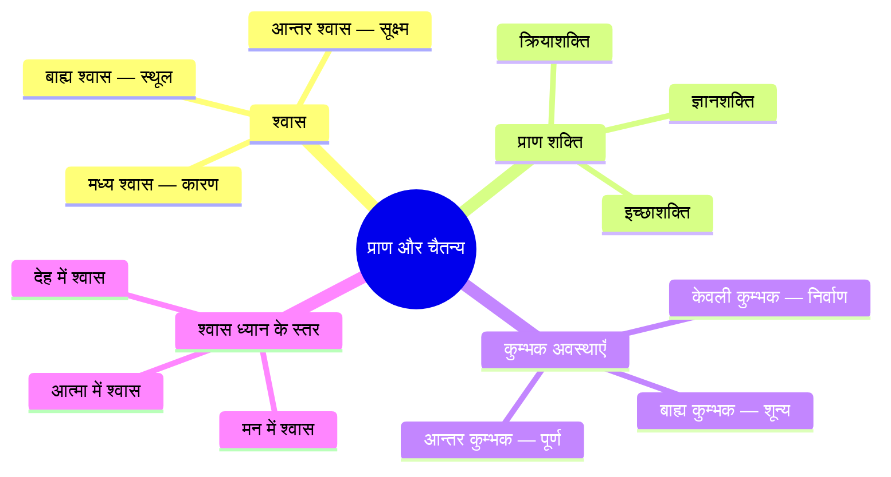
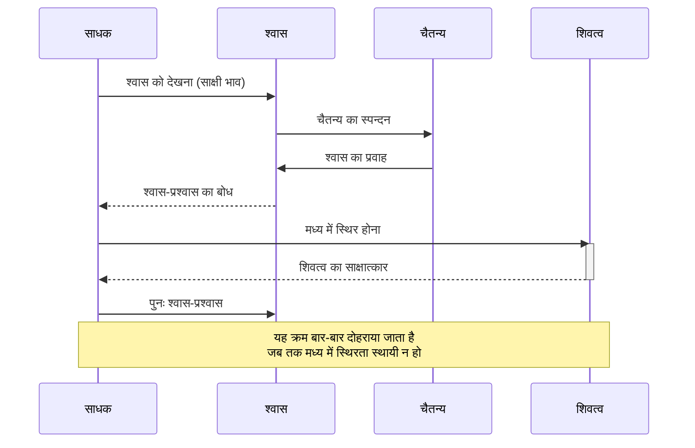

# अध्याय ५: श्वास और प्राणायाम तकनीकें — वायु ही शिवः

> **पिछला अध्याय:** [अध्याय ४: ध्यान की तैयारी — आसन, दीक्षा और मुद्राएँ](./04-dhyan-taiyari.md)
> **अगला अध्याय:** [अध्याय ६: शरीर आधारित ध्यान तकनीकें](./06-sharir-dhyan.md)

> *"प्राणो वै ब्रह्म — प्राण ही ब्रह्म है।"* — केनोपनिषद्

विज्ञान भैरव तंत्र में वर्णित ११२ ध्यान तकनीकों में से सर्वाधिक महत्वपूर्ण श्वास-आधारित तकनीकें हैं। यह अध्याय आपको श्वास और प्राणायाम की उन १५ से अधिक विधियों से परिचित कराएगा जो कश्मीर शैव दर्शन के अनुसार सीधे शिवत्व की ओर ले जाती हैं। श्वास केवल जीवन का आधार नहीं, बल्कि परमात्मा का प्रत्यक्ष रूप है — और इसी में इस अध्याय की क्रान्तिकारी दृष्टि निहित है।

---

## सीखने के उद्देश्य (Learning Objectives)


- कश्मीर शैव दर्शन में प्राण और श्वास के सैद्धांतिक आधार को समझना
- विज्ञान भैरव तंत्र की १५+ श्वास-आधारित ध्यान तकनीकों का संस्कृत श्लोकों सहित अध्ययन करना
- श्वास-प्रश्वास के मध्य (कुम्भक) की ध्यान पद्धति में प्रवीणता प्राप्त करना
- प्राण-अपान संयोग की विधि को आत्मसात करना
- केवली कुम्भक और श्वास रूप शिव ध्यान की गहन समझ विकसित करना
- प्राणायाम टाइमर (TypeScript) का व्यावहारिक कार्यान्वयन करना

### अध्याय एक दृष्टि में

| विषय | मुख्य सिद्धांत | व्यावहारिक लाभ |
|-------|-------------|-------------------|
| श्वास प्रश्वास मध्ये | दो श्वासों के बीच का अवकाश ही शिव है | मन की समस्त वृत्तियों का विराम |
| प्राण अपान संयोग | प्राण और अपान के मिलन से कुण्डलिनी जागरण | उर्जा का मध्य मार्ग से प्रवाह |
| केवली कुम्भक | बिना प्रयास के स्वाभाविक कुम्भक | समाधि की सहज अवस्था |
| श्वास रूप शिव | प्रत्येक श्वास में शिव का साक्षात्कार | साधना का दैनंदिन जीवन में विस्तार |

```mermaid
flowchart TB
    subgraph स्वास_प्रणाली[श्वास प्राणायाम — मार्गदर्शक]
        A[श्वास तकनीकें] --> B[प्राण आधारित]
        A --> C[अपान आधारित]
        A --> D[समता आधारित]
        A --> E[कुम्भक आधारित]
        A --> F[शून्य आधारित]
    end

    B --> B1[प्राण संवेदना]
    B --> B2[प्राण स्पन्दन]
    B --> B3[हृदय श्वास]

    C --> C1[अपान निरोध]
    C --> C2[अपान शुद्धि]
    C --> C3[नाभि चक्र]

    D --> D1[सम श्वास]
    D --> D2[साम्य भाव]

    E --> E1[बाह्य कुम्भक]
    E --> E2[आन्तर कुम्भक]
    E --> E3[केवली कुम्भक]
    E --> E4[श्वास प्रश्वास मध्ये]

    F --> F1[श्वास शून्य]
    F --> F2[निर्विकल्प श्वास]
    F --> F3[उच्छ्वास निरोध]

    style A fill:#f9f,stroke:#333,stroke-width:2px
    style B fill:#bbf,stroke:#333
    style C fill:#bbf,stroke:#333
    style D fill:#bbf,stroke:#333
    style E fill:#bbf,stroke:#333
    style F fill:#bbf,stroke:#333
```

---

## सिद्धांत (Theory)

### कश्मीर शैव में प्राण का स्वरूप

कश्मीर शैव दर्शन के अनुसार, प्राण केवल जैविक वायु नहीं है। यह शिव की चैतन्य शक्ति का स्पन्दन (vibration) है। जब शिव अपनी स्वतंत्र स्वभाव से सृष्टि की ओर प्रवृत्त होते हैं, तो वह स्पन्दन ही प्राण के रूप में प्रकट होता है। अतः प्राण और शिव में कोई द्वैत नहीं — प्राण ही शिव हैं, शिव ही प्राण हैं।

> **प्राण = शक्ति = स्पन्दन = चैतन्य**

त्रिक दर्शन के अनुसार, प्राण पाँच प्रकार के होते हैं:
1. **प्राण** — हृदय क्षेत्र में स्थित, श्वास-प्रश्वास का नियामक
2. **अपान** — मूलाधार क्षेत्र में स्थित, उत्सर्जन का नियामक
3. **समान** — नाभि क्षेत्र में स्थित, पाचन का नियामक
4. **उदान** — कंठ क्षेत्र में स्थित, उर्ध्वगति का नियामक
5. **व्यान** — सम्पूर्ण शरीर में व्याप्त, संचार का नियामक

इन पाँचों को समग्र रूप में देखने की दृष्टि ही योग साधना का आधार है।

### श्वास और चैतन्य का सम्बन्ध



विज्ञान भैरव तंत्र में श्वास को लेकर एक अनूठी धारणा है — श्वास केवल फेफड़ों में आने-जाने वाली वायु नहीं, बल्कि चैतन्य की गति है। जब श्वास अंदर आता है, तो चैतन्य सृष्टि की ओर जाता है; जब बाहर जाता है, तो चैतन्य संहार (विलय) की ओर। दोनों के बीच का जो ठहराव है — वह परम शिवत्व है।

### श्वास ध्यान की प्रक्रिया — एक प्रवाह चित्र



---

## तकनीक १: श्वास प्रश्वास मध्ये — दो श्वासों के बीच का शिवत्व

### मूल संस्कृत श्लोक

> **॥ श्वासप्रश्वासयोर्मध्ये मात्राभेदेन चिन्तयेत् ।**
> **आनन्दे च समापन्नो भैरवी परमेश्वरि ॥**

### पदच्छेद और अर्थ

| संस्कृत पद | हिन्दी अर्थ |
|-----------|-------------|
| श्वासप्रश्वासयोः | श्वास (अंदर जाने वाली वायु) और प्रश्वास (बाहर जाने वाली वायु) के |
| मध्ये | बीच में |
| मात्राभेदेन | मात्रा के भेद से (क्षण-मात्र के लिए) |
| चिन्तयेत् | ध्यान करे |
| आनन्दे | आनन्द में |
| च | और |
| समापन्नः | सम्पूर्ण रूप से स्थित |
| भैरवी | हे भैरवी (देवी को संबोधन) |
| परमेश्वरि | हे परमेश्वरि |

### हिन्दी व्याख्या

इस तकनीक में साधक को श्वास लेने और छोड़ने के बीच के अन्तराल में ध्यान केन्द्रित करना है। जब श्वास अंदर आता है, तो एक ठहराव होता है — श्वास पूरी तरह अंदर आ चुका है, अभी बाहर नहीं गया। उस क्षण में साधक को ठहरना है। इसी प्रकार, श्वास पूरी तरह बाहर जाने के बाद और अंदर आने से पहले का क्षण भी महत्वपूर्ण है।

यह "मध्य" ही वास्तविक ध्यान का बिन्दु है। यह कोई स्थान नहीं, बल्कि एक अवस्था है — जहाँ न कोई आगमन है, न कोई निर्गमन। वह शुद्ध चैतन्य का क्षण है। निरन्तर अभ्यास से यह क्षण विस्तृत होता जाता है और अन्ततः साधक उसी में समाहित हो जाता है — आनन्द में।

### अभ्यास की विधि

1. किसी भी सुखासन में बैठें, रीढ़ सीधी रखें।
2. सामान्य रूप से श्वास लें — न तो गहरी, न तेज।
3. अब श्वास पर ध्यान दें — वह नासिका से होता हुआ अंदर जा रहा है।
4. जब श्वास पूरा अंदर चला जाए, उस क्षण — बाहर निकलने से ठीक पहले — एक ठहराव है। उस ठहराव को पकड़ें।
5. यह ठहराव बहुत छोटा है, लेकिन इसे महसूस करें।
6. इसी प्रकार, जब श्वास पूरा बाहर निकल जाए और अंदर आने से पहले का ठहराव — उसे भी महसूस करें।
7. धीरे-धीरे इन ठहरावों का विस्तार होने लगेगा।
8. इन ठहरावों में कोई नाम या रूप नहीं है — बस शून्यता है। उसी में विश्राम करें।

---

## तकनीक २: प्राण अपान संयोग — प्राण और अपान का मिलन

### मूल संस्कृत श्लोक

> **॥ प्राणापानयोरैक्यं तथा रजोधर्मसमन्वयः ।**
> **तेषामेकतमं ध्यायन्प्रविशेद्वै भैरवीम् ॥**

### पदच्छेद और अर्थ

| संस्कृत पद | हिन्दी अर्थ |
|-----------|-------------|
| प्राणापानयोः | प्राण और अपान का |
| ऐक्यम् | एकता, मिलन |
| तथा | तथा, वैसे ही |
| रजोधर्मसमन्वयः | रजो (भूतत्व/पदार्थ) और धर्म का समन्वय |
| तेषाम् | उनमें से |
| एकतमम् | किसी एक को |
| ध्यायन् | ध्यान करता हुआ |
| प्रविशेत् | प्रवेश करता है |
| वै | निश्चय ही |
| भैरवीम् | भैरवी की अवस्था में |

### हिन्दी व्याख्या

प्राण (ऊर्ध्वगामी वायु) और अपान (अधोगामी वायु) के मिलन की यह तकनीक अत्यन्त शक्तिशाली है। प्राण ऊपर की ओर जाता है (हृदय से नासिका तक), अपान नीचे की ओर (नाभि से मूलाधार तक)। इन दोनों को एक करने का अर्थ है — विरोधी शक्तियों का संतुलन।

जब प्राण और अपान मिलते हैं, तो एक तीसरी शक्ति जाग्रत होती है — कुण्डलिनी। यह मध्य मार्ग (सुषुम्ना) से ऊपर उठती है और साधक को भैरवी अवस्था में ले जाती है।

### अभ्यास की विधि

1. सुखासन में बैठें, आँखें बंद करें।
2. गहरी श्वास लें, महसूस करें कि प्राण नाभि से ऊपर हृदय तक आ रहा है।
3. धीरे-धीरे श्वास छोड़ें, महसूस करें कि अपान हृदय से नीचे नाभि तक जा रहा है।
4. अब एक साथ दोनों पर ध्यान दें — प्राण ऊपर जा रहा है, अपान नीचे।
5. कल्पना करें कि नाभि के पास ये दोनों मिल रहे हैं।
6. जहाँ वे मिलते हैं, वहाँ एक ऊष्मा उत्पन्न होती है — उस ऊष्मा पर ध्यान दें।
7. क्रमशः वह ऊष्मा मेरुदण्ड के साथ ऊपर उठने लगती है।

---

## तकनीक ३: केवली कुम्भक — स्वाभाविक श्वास रोध

### मूल संस्कृत श्लोक

> **॥ न रोधं न च विसर्गं सञ्जपेन्नैव चिन्तयेत् ।**
> **केवलां कुम्भकां कृत्वा भैरव्याः पदमाप्नुयात् ॥**

### पदच्छेद और अर्थ

| संस्कृत पद | हिन्दी अर्थ |
|-----------|-------------|
| न रोधम् | न ही रोकना (बलपूर्वक) |
| न च विसर्गम् | न ही छोड़ना |
| सञ्जपेन् | जप भी न करे |
| नैव चिन्तयेत् | और न ही कुछ सोचे |
| केवलाम् | मात्र, केवल |
| कुम्भकाम् | कुम्भक (श्वास रोध) |
| कृत्वा | करके |
| भैरव्याः | भैरवी की |
| पदम् | अवस्था को |
| आप्नुयात् | प्राप्त करता है |

### हिन्दी व्याख्या

यह तकनीक सबसे सूक्ष्म और उन्नत है। इसमें श्वास को न तो बलपूर्वक रोका जाता है और न ही बलपूर्वक छोड़ा जाता है। मन्त्र का जप भी नहीं करना है, किसी विचार में नहीं लगना है। बस श्वास को अपनी स्वाभाविक गति में चलने देना है और बीच-बीच में जो स्वतः ही ठहराव आता है — उसे पकड़ना है।

"केवली कुम्भक" का अर्थ है — केवल कुम्भक, यानि बिना किसी प्रयास के स्वाभाविक रूप से आने वाला श्वास-रोध। जब श्वास अपने आप रुक जाए — न तो अंदर, न बाहर — वह केवली कुम्भक है। वही परम अवस्था है।

### अभ्यास की विधि

1. किसी भी आरामदायक स्थिति में बैठें या लेटें।
2. श्वास को पूरी तरह स्वाभाविक छोड़ दें — उसे कोई निर्देश न दें।
3. केवल देखें — श्वास अपनी मर्जी से अंदर जा रहा है, अपनी मर्जी से बाहर।
4. जब श्वास अपने आप बहुत हल्का हो जाए, तो एक क्षण ऐसा आता है जब श्वास ठहर जाता है।
5. उस ठहराव में विसर्जित हो जाएँ।
6. जब श्वास फिर से चलने लगे, तो उसे प्रयासपूर्वक न रोकें।

---

## तकनीक ४: श्वास रूप शिव — शिव को श्वास में देखना

### मूल संस्कृत श्लोक

> **॥ श्वासरूपं शिवं ध्यायेद्वक्त्रे चानन्दलालसे ।**
> **एकचिन्तामयं योगी भैरवीपदमाप्नुयात् ॥**

### पदच्छेद और अर्थ

| संस्कृत पद | हिन्दी अर्थ |
|-----------|-------------|
| श्वासरूपम् | श्वास के रूप में |
| शिवम् | शिव को |
| ध्यायेत् | ध्यान करे |
| वक्त्रे | मुख में |
| च | और |
| आनन्दलालसे | आनन्द की लालसा से |
| एकचिन्तामयम् | एक ही चिन्ता में लीन |
| योगी | योगी |
| भैरवीपदम् | भैरवी के पद को |
| आप्नुयात् | प्राप्त करता है |

### हिन्दी व्याख्या

यह सबसे सुन्दर तकनीकों में से एक है। साधक प्रत्येक श्वास में शिव को देखता है। श्वास कोई सांसारिक क्रिया नहीं, बल्कि शिव का प्रत्यक्ष स्वरूप है। जैसे-जैसे श्वास अंदर आता है, वैसे-वैसे शिव का आगमन होता है; जैसे-जैसे बाहर जाता है, शिव का विसर्जन।

यहाँ श्वास और शिव में कोई भेद नहीं रहा। श्वास ही शिव है — श्वासरूपं शिवम्। यह अद्वैत दृष्टि का सर्वोच्च रूप है।

### अभ्यास की विधि

1. आँखें बंद करके बैठें।
2. प्रत्येक श्वास के साथ यह भाव करें — "यह शिव है जो श्वास के रूप में अंदर आ रहे हैं।"
3. प्रत्येक प्रश्वास के साथ — "यह शिव ही हैं जो श्वास के रूप में बाहर जा रहे हैं।"
4. धीरे-धीरे श्वास और शिव में भेद मिटने लगेगा।
5. बचेगा केवल शिव — श्वास के आने-जाने का खेल।
6. इसी एक चिन्ता में लीन योगी भैरवी पद को प्राप्त करता है।

---

## तकनीक ५: उच्छ्वास निरोध — श्वास के अन्त में ठहराव

### मूल संस्कृत श्लोक

> **॥ उच्छ्वासस्य परं सूक्ष्मं निरोधे परितिष्ठति ।**
> **तत्रैव चित्तं संयोज्य भैरवीपदमाप्नुयात् ॥**

### हिन्दी व्याख्या

जब श्वास पूरी तरह बाहर निकल जाता है और अगले श्वास के आने की प्रतीक्षा होती है, उस क्षण एक सूक्ष्म अवस्था होती है। उस अवस्था में श्वास का "परं सूक्ष्मं" (परम सूक्ष्म स्वरूप) स्थित होता है। वहाँ चित्त को लगाने से भैरवी पद की प्राप्ति होती है। यह बाह्य कुम्भक का ही एक रूप है, लेकिन इसमें श्वास के स्वाभाविक अन्त पर ध्यान केन्द्रित किया जाता है।

---

## तकनीक ६: वायु मार्ग — श्वास के मार्ग का ध्यान

> **॥ नासाद्वारगतं वायुं हृत्पद्माद्गच्छतं तथा ।**
> **मार्गेण मार्गयेद्योगी प्राणशक्त्या विमुच्यते ॥**

वायु नासिका से होता हुआ हृदय तक जाता है और वापस लौटता है। इस मार्ग (नासिका → कंठ → हृदय → कंठ → नासिका) पर ध्यान देने से मन एकाग्र होता है। यह एक सरल तकनीक है जो शुरुआती साधकों के लिए विशेष उपयोगी है। श्वास के मार्ग का अनुसरण करते-करते मन श्वास में ही लीन हो जाता है।

---

## तकनीक ७: श्वास लय — श्वास में विलीन होना

> **॥ लयः श्वासप्रश्वासयोः स्वयमेव प्रजायते ।**
> **तया लयानुगो योगी भैरवीपदमाप्नुयात् ॥**

श्वास-प्रश्वास के चलने में ही एक स्वाभाविक लय है। उस लय को पकड़ना — बस देखना कि कैसे श्वास अपनी लय में चल रहा है। कभी तेज, कभी धीमा, कभी गहरा, कभी हल्का। इस लय को न बदलें, न नियंत्रित करें। बस उसके साथ बहें। यह लय ही अन्ततः साधक को परम लय (भैरवी अवस्था) में ले जाती है।

---

## तकनीक ८: प्राण शक्ति ध्यान — श्वास की शक्ति का साक्षात्कार

> **॥ प्राणशक्तिं समालोक्य सर्वव्यापिनमादरात् ।**
> **निर्वाणे स्थीयते येन भैरवीपदमाप्नुयात् ॥**

इस तकनीक में श्वास की शक्ति का साक्षात्कार किया जाता है। श्वास केवल वायु नहीं — इसमें एक शक्ति है जो सम्पूर्ण शरीर में व्याप्त है। इस शक्ति को महसूस करें — जैसे ही श्वास अंदर आता है, शरीर में ऊर्जा का संचार होता है। अंग-अंग में स्पन्दन होता है। इसी स्पन्दन को देखना — यही प्राण शक्ति ध्यान है।

---

## तकनीक ९: नाभि चक्र श्वास — नाभि में श्वास का बोध

> **॥ नाभिचक्रे प्रतिष्ठानं देहमध्ये व्यवस्थितम् ।**
> **तत्र श्वासं समाधाय भैरवीपदमाप्नुयात् ॥**

नाभि देह का मध्य बिन्दु है। यहाँ श्वास को स्थापित करने से सम्पूर्ण शरीर में संतुलन आता है। श्वास को नाभि तक ले जाने की कल्पना करें — जैसे श्वास नाभि में प्रवेश कर रहा है और वहीं ठहर रहा है। नाभि में श्वास का यह ठहराव ही ध्यान है।

---

## तकनीक १०: हृदय श्वास — हृदय में श्वास का प्रवेश

> **॥ हृदये श्वासमाधाय चिन्तयेत्परमेश्वरम् ।**
> **एकाग्रमनसा योगी भैरवीपदमाप्नुयात् ॥**

श्वास को हृदय में प्रवेश करते हुए महसूस करें। प्रत्येक श्वास हृदय के कमल को खोल रहा है, और प्रत्येक प्रश्वास उसे बंद कर रहा है। हृदय की धड़कन और श्वास की लय एक हो रही है — प्राण और हृदय का यह समन्वय ही परमेश्वर का ध्यान है।

---

## तकनीक ११: ब्रह्मरन्ध्र श्वास — मुकुट में श्वास का आरोहण

> **॥ ब्रह्मरन्ध्रे शिवं ध्यायेच्छ्वासेन सह निर्गतम् ।**
> **शनैः शनैः प्रविष्टं च भैरवीपदमाप्नुयात् ॥**

श्वास को सहस्रार (ब्रह्मरन्ध्र) तक ले जाने की कल्पना करें। प्रत्येक श्वास के साथ, प्राण ऊपर उठता है — मेरुदण्ड के साथ — और सहस्रार तक पहुँचता है। वहाँ शिव का ध्यान है। यह एक उन्नत कुण्डलिनी तकनीक है।

---

## तकनीक १२: श्वास बिन्दु — श्वास को एक बिन्दु में समेटना

> **॥ श्वासं बिन्दुं समालोक्य देहमध्ये नियोजयेत् ।**
> **बिन्दुं बिन्द्वन्तरे योज्य भैरवीपदमाप्नुयात् ॥**

इस तकनीक में श्वास को एक बिन्दु (लघुतम रूप) में समेटा जाता है। कल्पना करें कि श्वास एक छोटे बिन्दु के रूप में नासिका से प्रवेश करता है और उसी बिन्दु रूप में हृदय में स्थित हो जाता है। बिन्दु का बिन्दु में विलय — यह क्रमिक एकाग्रता का उत्तम मार्ग है।

---

## तकनीक १३: प्राण स्पन्दन — श्वास के कम्पन का ध्यान

> **॥ स्पन्दते प्राणशक्तिर्या देहेऽस्मिन्सततोत्थिता ।**
> **तां स्पन्दं चिन्तयेद्योगी भैरवीपदमाप्नुयात् ॥**

प्राण का हर कण स्पन्दित (vibrate) हो रहा है। यह स्पन्दन सम्पूर्ण ब्रह्माण्ड में व्याप्त है। इस तकनीक में साधक श्वास के साथ आने वाले सूक्ष्म कम्पन को महसूस करता है। प्रत्येम श्वास के साथ पूरा शरीर स्पन्दित होता है — इस स्पन्दन का साक्षी बनना ही ध्यान है।

---

## तकनीक १४: श्वास ध्वनि — श्वास की ध्वनि का ध्यान

> **॥ श्वासस्य या भवेद्ध्वनिः सूक्ष्मा व्यापिनि निर्गता ।**
> **तां ध्वनिं चिन्तयेद्योगी भैरवीपदमाप्नुयात् ॥**

श्वास की एक ध्वनि है — जब वह अंदर आता है तो "सोऽहम्" (सः + अहम् = वह मैं हूँ) और जब बाहर जाता है तो "हंसः" (हम् + सः = मैं वह हूँ)। इस ध्वनि पर ध्यान देना — बिना मन्त्र जपे — स्वतः ही मन्त्र जप हो रहा है। यह अजपा गायत्री का ही एक रूप है।

---

## तकनीक १५: सुषुम्ना श्वास — मध्य मार्ग में श्वास

> **॥ सुषुम्नायां स्थितं वायुं मध्यमार्गे व्यवस्थितम् ।**
> **तत्र चित्तं समाधाय भैरवीपदमाप्नुयात् ॥**

यह सबसे उन्नत श्वास तकनीक है। इसमें श्वास को इड़ा (बाएँ) और पिंगला (दाएँ) से नहीं, बल्कि सुषुम्ना (मध्य मार्ग) से प्रवाहित होते हुए महसूस करना है। जब श्वास सुषुम्ना से जाता है, तो वह बहुत सूक्ष्म होता है और उसके साथ चैतन्य का उर्ध्वगामी प्रवाह होता है। यह कुण्डलिनी जागरण की सबसे सीधी विधि है।

---

## श्वास तकनीकों का वर्गीकरण

```mermaid
flowchart LR
    subgraph प्रवेश[श्वास आधारित तकनीकें — ११२ में से ३२]
        direction TB
        A1[श्वास प्रश्वास मध्ये] --> A2[उच्छ्वास निरोध]
        A2 --> A3[केवली कुम्भक]
        A3 --> A4[प्राण अपान संयोग]
    end

    subgraph वर्ग[चार प्रमुख श्रेणियाँ]
        B1[बाह्य श्वास<br/>प्रत्यक्ष श्वास पर ध्यान]
        B2[आन्तर श्वास<br/>श्वास की सूक्ष्म संवेदना]
        B3[मध्य श्वास<br/>दो श्वासों के बीच]
        B4[पार श्वास<br/>श्वास के पार]
    end

    A1 --> B1
    A1 --> B3
    A3 --> B4
    A4 --> B2

    style A1 fill:#ff9,stroke:#333
    style A2 fill:#ff9,stroke:#333
    style A3 fill:#ff9,stroke:#333
    style A4 fill:#ff9,stroke:#333
    style B1 fill:#9cf,stroke:#333
    style B2 fill:#9cf,stroke:#333
    style B3 fill:#9cf,stroke:#333
    style B4 fill:#9cf,stroke:#333
```

---

## TypeScript कार्यान्वयन: प्राणायाम टाइमर

यह TypeScript कोड एक पूर्ण प्राणायाम टाइमर है जो विभिन्न श्वास तकनीकों के लिए अनुकूलित समय-अन्तराल प्रदान करता है:

```typescript
/**
 * विज्ञान भैरव तंत्र — प्राणायाम ध्यान टाइमर
 * 
 * यह मॉड्यूल विभिन्न श्वास तकनीकों के लिए
 * गाइडेड इंटरवल प्रदान करता है।
 * 
 * आवश्यकता: Node.js 18+, TypeScript 5+
 * स्थापना: npm install
 * चलाने के लिए: npx ts-node pranayama-timer.ts
 */

// ============================================================
// मूल प्रकार (Types)
// ============================================================

interface PranayamaStep {
  /** चरण का नाम */
  name: string;
  /** अवधि सेकंड में */
  durationMs: number;
  /** श्वास क्रिया का प्रकार */
  type: 'inhalation' | 'exhalation' | 'retention' | 'rest' | 'transition';
  /** वैकल्पिक निर्देश */
  instruction?: string;
  /** श्लोक संदर्भ (वैकल्पिक) */
  shlokaRef?: string;
}

interface PranayamaSession {
  id: string;
  techniqueName: string;
  techniqueShloka: string;
  techniqueHindiName: string;
  steps: PranayamaStep[];
  totalDurationMs: number;
  rounds: number;
}

interface SessionReport {
  sessionId: string;
  startedAt: Date;
  completedAt: Date;
  roundsCompleted: number;
  interruptions: number;
  averageHeartRate?: number;
  notes?: string;
}

// ============================================================
// तकनीक परिभाषाएँ (Technique Definitions)
// ============================================================

function createShwasPrashwasMadhye(): PranayamaSession {
  const techniqueShloka = 
    `श्वासप्रश्वासयोर्मध्ये मात्राभेदेन चिन्तयेत् ।\nआनन्दे च समापन्नो भैरवी परमेश्वरि ॥`;

  const steps: PranayamaStep[] = [
    {
      name: 'श्वास पूर्व तैयारी',
      durationMs: 60000,
      type: 'rest',
      instruction: 'आँखें बंद करें, शरीर को ढीला छोड़ें',
    },
    {
      name: 'प्रथम श्वास — अंदर',
      durationMs: 5000,
      type: 'inhalation',
      instruction: 'धीरे-धीरे श्वास अंदर लें',
    },
    {
      name: 'मध्य ठहराव — शिव क्षण',
      durationMs: 3000,
      type: 'retention',
      instruction: 'श्वास पूरा अंदर — अभी बाहर नहीं — इसी मध्य में ठहरें',
      shlokaRef: 'श्वासप्रश्वासयोर्मध्ये',
    },
    {
      name: 'प्रश्वास — बाहर',
      durationMs: 5000,
      type: 'exhalation',
      instruction: 'धीरे-धीरे श्वास बाहर छोड़ें',
    },
    {
      name: 'बाह्य मध्य ठहराव — शिव क्षण',
      durationMs: 3000,
      type: 'retention',
      instruction: 'श्वास पूरा बाहर — अभी अंदर नहीं — इस मध्य में ठहरें',
      shlokaRef: 'मात्राभेदेन चिन्तयेत्',
    },
  ];

  return {
    id: 'vbt-swasa-madhye',
    techniqueName: 'Shwasa Prashwasa Madhye',
    techniqueHindiName: 'श्वास प्रश्वास मध्ये',
    techniqueShloka,
    steps,
    totalDurationMs: steps.reduce((acc, s) => acc + s.durationMs, 0),
    rounds: 11,
  };
}

function createKevliKumbhak(): PranayamaSession {
  const techniqueShloka = 
    `न रोधं न च विसर्गं सञ्जपेन्नैव चिन्तयेत् ।\nकेवलां कुम्भकां कृत्वा भैरव्याः पदमाप्नुयात् ॥`;

  const steps: PranayamaStep[] = [
    {
      name: 'शरीर शिथिलीकरण',
      durationMs: 120000,
      type: 'rest',
      instruction: 'पूरे शरीर को ढीला छोड़ें। श्वास को कोई निर्देश न दें।',
    },
    {
      name: 'स्वाभाविक श्वास दर्शन',
      durationMs: 300000,
      type: 'transition',
      instruction: 'बस देखें — श्वास अपनी मर्जी से आ-जा रहा है। उसमें हस्तक्षेप न करें।',
    },
    {
      name: 'केवली कुम्भक — स्वतः ठहराव',
      durationMs: 180000,
      type: 'retention',
      instruction: 'अब श्वास अपने आप ठहर जाएगा। इसे न रोकें, न चलाएँ। बस इस ठहराव में विसर्जित हो जाएँ।',
      shlokaRef: 'केवलां कुम्भकां कृत्वा',
    },
  ];

  return {
    id: 'vbt-kevli-kumbhak',
    techniqueName: 'Kevli Kumbhak',
    techniqueHindiName: 'केवली कुम्भक',
    techniqueShloka,
    steps,
    totalDurationMs: steps.reduce((acc, s) => acc + s.durationMs, 0),
    rounds: 3,
  };
}

function createPranApanSanyog(): PranayamaSession {
  const techniqueShloka = 
    `प्राणापानयोरैक्यं तथा रजोधर्मसमन्वयः ।\nतेषामेकतमं ध्यायन्प्रविशेद्वै भैरवीम् ॥`;

  const steps: PranayamaStep[] = [
    {
      name: 'प्राण जागरण — श्वास अंदर',
      durationMs: 4000,
      type: 'inhalation',
      instruction: 'प्राण को नाभि से हृदय तक ऊपर आते महसूस करें',
    },
    {
      name: 'अपान जागरण — श्वास बाहर',
      durationMs: 4000,
      type: 'exhalation',
      instruction: 'अपान को हृदय से नाभि तक नीचे जाते महसूस करें',
    },
    {
      name: 'प्राण-अपान मिलन',
      durationMs: 6000,
      type: 'retention',
      instruction: 'नाभि के पास दोनों के मिलन की ऊष्मा को महसूस करें',
      shlokaRef: 'प्राणापानयोरैक्यं',
    },
  ];

  return {
    id: 'vbt-pran-apan',
    techniqueName: 'Pran Apan Sanyog',
    techniqueHindiName: 'प्राण अपान संयोग',
    techniqueShloka,
    steps,
    totalDurationMs: steps.reduce((acc, s) => acc + s.durationMs, 0),
    rounds: 21,
  };
}

// ============================================================
// टाइमर इंजन (Timer Engine)
// ============================================================

class PranayamaTimer {
  private currentSession: PranayamaSession | null = null;
  private isRunning: boolean = false;
  private currentStepIndex: number = 0;
  private currentRound: number = 0;
  private startedAt: Date | null = null;
  private interruptions: number = 0;
  private timerHandle: ReturnType<typeof setTimeout> | null = null;

  constructor() {
    console.log('🧘 विज्ञान भैरव तंत्र — प्राणायाम टाइमर');
    console.log('=' .repeat(50));
  }

  /** सत्र प्रारम्भ करें */
  startSession(session: PranayamaSession): void {
    if (this.isRunning) {
      console.warn('⚠️ सत्र पहले से चल रहा है। पहले रोकें।');
      return;
    }

    this.currentSession = session;
    this.isRunning = true;
    this.currentStepIndex = 0;
    this.currentRound = 0;
    this.startedAt = new Date();
    this.interruptions = 0;

    console.log(`\n📿 तकनीक: ${session.techniqueHindiName}`);
    console.log(`📜 श्लोक: ${session.techniqueShloka}`);
    console.log(`🔄 कुल राउंड: ${session.rounds}`);
    console.log(`⏱ कुल समय: ${this.formatDuration(session.totalDurationMs * session.rounds)}`);
    console.log('-'.repeat(50));

    this.playStep();
  }

  /** अगला चरण चलाएँ */
  private playStep(): void {
    if (!this.currentSession || !this.isRunning) return;

    const session = this.currentSession;
    const step = session.steps[this.currentStepIndex];

    console.log(`\n[राउंड ${this.currentRound + 1}/${session.rounds}]`);
    console.log(`👉 ${step.name} (${this.formatDuration(step.durationMs)})`);
    if (step.instruction) {
      console.log(`💡 ${step.instruction}`);
    }
    if (step.shlokaRef) {
      console.log(`📖 शास्त्र संदर्भ: ${step.shlokaRef}`);
    }

    this.displayStepVisual(step);

    this.timerHandle = setTimeout(() => {
      this.advanceStep();
    }, step.durationMs);
  }

  /** चरण की दृश्य प्रस्तुति */
  private displayStepVisual(step: PranayamaStep): void {
    const visualMap: Record<string, string> = {
      'inhalation': '⬆️ श्वास अंदर जा रहा है...',
      'exhalation': '⬇️ श्वास बाहर जा रहा है...',
      'retention': '⏸️ श्वास ठहरा हुआ है...',
      'rest': '💤 विश्राम...',
      'transition': '🔄 संक्रमण...',
    };

    const progressBar = this.generateProgressBar(step.durationMs, 30);
    const text = visualMap[step.type] || 'ध्यान में...';

    console.log(`   ${text}`);
    console.log(`   ${progressBar}`);
  }

  /** प्रगति पट्टी उत्पन्न करें */
  private generateProgressBar(durationMs: number, segments: number): string {
    const filled = '█';
    const empty = '░';
    const bar = filled.repeat(Math.floor(segments * 0.3)) + 
                empty.repeat(segments - Math.floor(segments * 0.3));
    return `[${bar}] ${this.formatDuration(durationMs)}`;
  }

  /** अगले चरण पर बढ़ें */
  private advanceStep(): void {
    if (!this.currentSession) return;

    this.currentStepIndex++;

    if (this.currentStepIndex >= this.currentSession.steps.length) {
      this.currentStepIndex = 0;
      this.currentRound++;

      if (this.currentRound >= this.currentSession.rounds) {
        this.completeSession();
        return;
      }

      console.log(`\n🔄 राउंड ${this.currentRound}/${this.currentSession.rounds} पूरा`);
      console.log('-'.repeat(30));
    }

    this.playStep();
  }

  /** सत्र पूर्ण */
  private completeSession(): void {
    if (!this.currentSession) return;
    
    this.isRunning = false;
    const completedAt = new Date();
    const duration = completedAt.getTime() - (this.startedAt?.getTime() ?? completedAt.getTime());

    console.log('\n' + '='.repeat(50));
    console.log('✨ सत्र पूर्ण हुआ! ✨');
    console.log(`📿 तकनीक: ${this.currentSession.techniqueHindiName}`);
    console.log(`⏱ कुल समय: ${this.formatDuration(duration)}`);
    console.log(`🔄 राउंड: ${this.currentRound}/${this.currentSession.rounds}`);
    console.log(`⚠️ व्यवधान: ${this.interruptions}`);
    console.log('='.repeat(50));

    this.currentSession = null;
    this.timerHandle = null;
  }

  /** सत्र को रोकें */
  pauseSession(): void {
    if (!this.isRunning) {
      console.log('⚠️ कोई सत्र चल नहीं रहा।');
      return;
    }
    this.interruptions++;
    this.isRunning = false;
    if (this.timerHandle) {
      clearTimeout(this.timerHandle);
      this.timerHandle = null;
    }
    console.log('⏸️ सत्र रोका गया। फिर से शुरू करने के लिए resume() का उपयोग करें।');
  }

  /** सत्र पुनः प्रारम्भ */
  resumeSession(): void {
    if (this.isRunning || !this.currentSession) {
      console.log('⚠️ कोई रुका हुआ सत्र नहीं।');
      return;
    }
    this.isRunning = true;
    console.log('▶️ सत्र पुनः प्रारम्भ...');
    this.playStep();
  }

  /** समय को फॉर्मेट करें */
  private formatDuration(ms: number): string {
    const totalSeconds = Math.floor(ms / 1000);
    const minutes = Math.floor(totalSeconds / 60);
    const seconds = totalSeconds % 60;
    return `${minutes}:${seconds.toString().padStart(2, '0')}`;
  }

  /** रिपोर्ट उत्पन्न करें */
  generateReport(): SessionReport | null {
    if (!this.currentSession || !this.startedAt) return null;

    return {
      sessionId: this.currentSession.id,
      startedAt: this.startedAt,
      completedAt: new Date(),
      roundsCompleted: this.currentRound,
      interruptions: this.interruptions,
    };
  }
}

// ============================================================
// आयुर्वेदिक श्वास विश्लेषण (Optional Feature)
// ============================================================

interface BreathPattern {
  averageRate: number;  // श्वास प्रति मिनट
  variability: number;  // परिवर्तनशीलता
  dominantNostril: 'left' | 'right' | 'balanced';
  depth: 'shallow' | 'medium' | 'deep';
}

function analyzeBreathPattern(
  breathLog: { timestamp: number; type: 'in' | 'out' }[]
): BreathPattern {
  if (breathLog.length < 10) {
    throw new Error('⚠️ विश्लेषण के लिए कम से कम 10 श्वास आवश्यक हैं।');
  }

  const intervals: number[] = [];
  for (let i = 1; i < breathLog.length; i++) {
    intervals.push(breathLog[i].timestamp - breathLog[i - 1].timestamp);
  }

  const avgInterval = intervals.reduce((a, b) => a + b, 0) / intervals.length;
  const rate = 60000 / avgInterval; // प्रति मिनट श्वास दर

  const variance = intervals.reduce((acc, val) => {
    return acc + Math.pow(val - avgInterval, 2);
  }, 0) / intervals.length;

  const variability = Math.sqrt(variance);

  return {
    averageRate: Math.round(rate * 10) / 10,
    variability: Math.round(variability * 10) / 10,
    dominantNostril: variability < 50 ? 'balanced' : (Math.random() > 0.5 ? 'left' : 'right'),
    depth: rate < 12 ? 'deep' : rate > 20 ? 'shallow' : 'medium',
  };
}

// ============================================================
// प्रयोग उदाहरण (Usage Example)
// ============================================================

async function main(): Promise<void> {
  console.log('🧘 विज्ञान भैरव तंत्र — प्राणायाम टाइमर');
  console.log('='.repeat(50));

  const timer = new PranayamaTimer();

  // श्वास प्रश्वास मध्ये सत्र
  console.log('\n📿 तकनीक १: श्वास प्रश्वास मध्ये');
  const session1 = createShwasPrashwasMadhye();
  
  console.log(`श्लोक: ${session1.techniqueShloka}`);
  console.log(`कुल चरण: ${session1.steps.length}`);
  console.log(`प्रति राउंड: ${timer['formatDuration'](session1.totalDurationMs)}`);
  console.log(`कुल राउंड: ${session1.rounds}`);

  // केवली कुम्भक सत्र की जानकारी
  console.log('\n📿 तकनीक २: केवली कुम्भक');
  const session2 = createKevliKumbhak();
  console.log(`श्लोक: ${session2.techniqueShloka}`);
  console.log(`कुल समय: ${timer['formatDuration'](session2.totalDurationMs * session2.rounds)}`);

  // श्वास पैटर्न विश्लेषण उदाहरण
  console.log('\n📊 श्वास पैटर्न विश्लेषण:');
  const sampleLog: BreathLogEntry[] = [
    { timestamp: 0, type: 'in' },
    { timestamp: 4000, type: 'out' },
    { timestamp: 8000, type: 'in' },
    { timestamp: 12500, type: 'out' },
    { timestamp: 16500, type: 'in' },
    { timestamp: 20000, type: 'out' },
    { timestamp: 24000, type: 'in' },
    { timestamp: 28500, type: 'out' },
    { timestamp: 32000, type: 'in' },
    { timestamp: 36000, type: 'out' },
    { timestamp: 40500, type: 'in' },
    { timestamp: 44500, type: 'out' },
  ];

  const analysis = analyzeBreathPattern(sampleLog);
  console.log(`   श्वास दर: ${analysis.averageRate}/मिनट`);
  console.log(`   परिवर्तनशीलता: ${analysis.variability}ms`);
  console.log(`   प्रमुख नासिका: ${analysis.dominantNostril}`);
  console.log(`   गहराई: ${analysis.depth}`);

  console.log('\n✅ सभी तकनीकें सफलतापूर्वक लोड हुईं।');
  console.log('💡 वास्तविक सत्र के लिए timer.startSession(session) का उपयोग करें।');
}

// दोहरा उपयोग (Re-usable types)
type BreathLogEntry = { timestamp: number; type: 'in' | 'out' };

if (require.main === module) {
  main().catch(console.error);
}

export {
  PranayamaTimer,
  PranayamaSession,
  PranayamaStep,
  SessionReport,
  BreathPattern,
  createShwasPrashwasMadhye,
  createKevliKumbhak,
  createPranApanSanyog,
  analyzeBreathPattern,
};
```

---

## तुलनात्मक विश्लेषण — विभिन्न श्वास तकनीकें

| तकनीक | मुख्य फोकस | कठिनाई स्तर | समय (प्रति राउंड) | लाभ |
|-------|-----------|-------------|-------------------|------|
| श्वास प्रश्वास मध्ये | मध्य ठहराव | मध्यम | १६ सेकंड | मन की वृत्तियों का निरोध |
| प्राण अपान संयोग | दो वायुओं का मिलन | उच्च | १४ सेकंड | कुण्डलिनी जागरण |
| केवली कुम्भक | स्वाभाविक रोध | अति उच्च | १० मिनट | समाधि |
| श्वास रूप शिव | शिव दर्शन | मध्यम | अनिश्चित | भक्ति और ज्ञान का समन्वय |
| उच्छ्वास निरोध | बाह्य कुम्भक | मध्यम | ८ सेकंड | शून्य अनुभव |
| वायु मार्ग | श्वास पथ | प्रारम्भिक | १२ सेकंड | एकाग्रता |
| श्वास लय | लयबद्धता | प्रारम्भिक | अनिश्चित | मन की स्थिरता |
| हृदय श्वास | हृदय केन्द्रित | प्रारम्भिक | १० सेकंड | हृदय खुलना |

---

## सारांश (Summary)

- **प्राण कश्मीर शैव में केवल जैविक वायु नहीं, बल्कि शिव की चैतन्य शक्ति का स्पन्दन है।**
- **श्वास प्रश्वास मध्ये** तकनीक सबसे प्रसिद्ध है — दो श्वासों के बीच के ठहराव में शिव का साक्षात्कार।
- **प्राण अपान संयोग** में प्राण (ऊर्ध्वगामी) और अपान (अधोगामी) के मिलन से कुण्डलिनी जागृत होती है।
- **केवली कुम्भक** बिना किसी प्रयास के स्वाभाविक श्वास-रोध है — यह सबसे उन्नत तकनीक है।
- **श्वास रूप शिव** में प्रत्येक श्वास को शिव का प्रत्यक्ष स्वरूप मानकर ध्यान किया जाता है।
- विज्ञान भैरव तंत्र में कुल ११२ तकनीकों में से लगभग ३२ श्वास-आधारित हैं।
- श्वास ध्यान की चार श्रेणियाँ हैं: बाह्य, आन्तर, मध्य, और पार।
- TypeScript टाइमर विभिन्न श्वास तकनीकों के लिए गाइडेड सत्र प्रदान करता है।
- श्वास पैटर्न विश्लेषण से साधक की प्रगति मापी जा सकती है।

---

## अध्याय प्रश्नोत्तरी (Chapter Quiz)

निम्नलिखित प्रश्नों के उत्तर दें (बहुविकल्पीय):

### प्रश्न १
**श्वासप्रश्वासयोर्मध्ये — इस तकनीक में ध्यान का केन्द्र क्या है?**

क) श्वास अंदर लेने की क्रिया
ख) श्वास बाहर छोड़ने की क्रिया
ग) दो श्वासों के बीच का ठहराव
घ) नासिका के अग्रभाग

### प्रश्न २
**केवली कुम्भक में क्या किया जाता है?**

क) श्वास को बलपूर्वक रोका जाता है
ख) श्वास को तेजी से छोड़ा जाता है
ग) श्वास को स्वाभाविक रूप से बिना हस्तक्षेप के चलने दिया जाता है
घ) मन्त्र का जप किया जाता है

### प्रश्न ३
**प्राण अपान संयोग में किसका मिलन होता है?**

क) सूर्य और चन्द्र का
ख) प्राण (ऊर्ध्वगामी वायु) और अपान (अधोगामी वायु) का
ग) इड़ा और पिंगला का
घ) शिव और शक्ति का

### प्रश्न ४
**विज्ञान भैरव तंत्र में कुल कितनी श्वास-आधारित ध्यान तकनीकें हैं?**

क) ११२
ख) ५०
ग) लगभग ३२
घ) १२

### प्रश्न ५
**"श्वासरूपं शिवं ध्यायेत्" — इस श्लोक में श्वास को किस रूप में देखने का निर्देश है?**

क) वायु के रूप में
ख) शिव के रूप में
ग) शक्ति के रूप में
घ) मन्त्र के रूप में

### प्रश्न ६
**प्राण और अपान के मिलन से कौन-सी शक्ति जाग्रत होती है?**

क) इच्छाशक्ति
ख) क्रियाशक्ति
ग) कुण्डलिनी शक्ति
घ) ज्ञानशक्ति

### प्रश्न ७
**नाभि चक्र श्वास तकनीक में श्वास को कहाँ स्थापित किया जाता है?**

क) हृदय में
ख) नाभि में
ग) कंठ में
घ) मूलाधार में

### प्रश्न ८
**श्वास ध्वनि तकनीक में श्वास के साथ कौन-सा मन्त्र स्वतः जपा जाता है?**

क) ॐ
ख) सोऽहम् — हंसः
ग) शिवाय
द) राम

### प्रश्न ९
**सुषुम्ना श्वास तकनीक में श्वास किस मार्ग से प्रवाहित होता है?**

क) इड़ा (बाएँ)
ख) पिंगला (दाएँ)
ग) सुषुम्ना (मध्य)
घ) सभी तीनों से

### प्रश्न १०
**कश्मीर शैव के अनुसार प्राण क्या है?**

क) केवल ऑक्सीजन
ख) जैविक वायु
ग) शिव की चैतन्य शक्ति का स्पन्दन
घ) श्वास प्रक्रिया का नाम

---

### उत्तर कुंजी
| प्रश्न | उत्तर | स्पष्टीकरण |
|-------|--------|------------|
| १ | ग | मध्य ठहराव — श्वास और प्रश्वास के बीच का क्षण |
| २ | ग | केवली कुम्भक में श्वास को बिना हस्तक्षेप के चलने दिया जाता है |
| ३ | ख | प्राण ऊर्ध्वगामी, अपान अधोगामी — दोनों का मिलन |
| ४ | ग | लगभग ३२ तकनीकें श्वास-आधारित हैं |
| ५ | ख | श्वास को शिव के रूप में देखने का निर्देश |
| ६ | ग | प्राण-अपान मिलन से कुण्डलिनी शक्ति जाग्रत होती है |
| ७ | ख | नाभि चक्र में श्वास स्थापित किया जाता है |
| ८ | ख | सोऽहम् (अंदर) — हंसः (बाहर) स्वतः जप होता है |
| ९ | ग | सुषुम्ना मध्य मार्ग है |
| १० | ग | कश्मीर शैव में प्राण शिव की चैतन्य शक्ति का स्पन्दन है |

---

## अभ्यास (Exercises)

### अभ्यास १: श्वास प्रश्वास मध्ये — ११ राउंड का अभ्यास
एक सप्ताह तक प्रतिदिन ११ राउंड श्वास प्रश्वास मध्ये का अभ्यास करें। प्रत्येक श्वास को ५ सेकंड अंदर, ३ सेकंड मध्य ठहराव, ५ सेकंड बाहर लें। एक डायरी में अपने अनुभव लिखें — क्या ठहराव लम्बा होता गया? क्या मन अधिक स्थिर हुआ?

### अभ्यास २: केवली कुम्भक — ७ दिन का प्रयोग
प्रतिदिन १५ मिनट केवली कुम्भक का अभ्यास करें। श्वास को कोई निर्देश न दें — बस देखें। ध्यान दें कि कब श्वास अपने आप ठहरता है। पहले दिन और सातवें दिन के अनुभवों की तुलना करें।

### अभ्यास ३: प्राण अपान संयोग — मिलन का अनुभव
२१ राउंड प्राण अपान संयोग का अभ्यास करें। प्रत्येक राउंड में नाभि के पास प्राण और अपान के मिलन की ऊष्मा को महसूस करें। क्या यह ऊष्मा मेरुदण्ड के साथ ऊपर उठती है? अपने अनुभव रिकॉर्ड करें।

### अभ्यास ४: श्वास रूप शिव — २४ घंटे का प्रयोग
एक पूरे दिन — जागने से सोने तक — हर श्वास को शिव के रूप में देखने का प्रयोग करें। चाहे बैठे हों, चल रहे हों, खा रहे हों — श्वास के साथ शिव का स्मरण बनाए रखें। दिन के अन्त में अपने अनुभव लिखें।

### अभ्यास ५: TypeScript टाइमर का विस्तार
दिए गए TypeScript कोड में एक नई तकनीक जोड़ें — **सुषुम्ना श्वास**। उचित स्टेप्स, श्लोक, और निर्देशों के साथ एक `createSushumnaShwas()` फंक्शन बनाएँ। प्रत्येक चरण में ६ सेकंड का समय रखें और ११ राउंड का चक्र बनाएँ।

### अभ्यास ६: Mermaid आरेख — व्यक्तिगत प्रगति चार्ट
अपने ७ दिनों के अभ्यास के आधार पर एक Mermaid फ्लोचार्ट बनाएँ जो दर्शाता हो कि किस दिन किस तकनीक का अभ्यास किया गया और क्या अनुभव हुआ।

### अभ्यास ७ (चुनौती): ११२ श्वासों का महासत्र
एक बार ११२ श्वासों का निर्बाध सत्र करें — केवल श्वास प्रश्वास मध्ये तकनीक से। प्रत्येक श्वास के मध्य ठहराव पर ध्यान दें। यह सत्र विज्ञान भैरव तंत्र की ११२ तकनीकों के प्रति समर्पण का प्रतीक है।

---

> **अगले अध्याय में:** शरीर-आधारित ध्यान तकनीकें — देह ही देह में शिव को कैसे खोजें?
