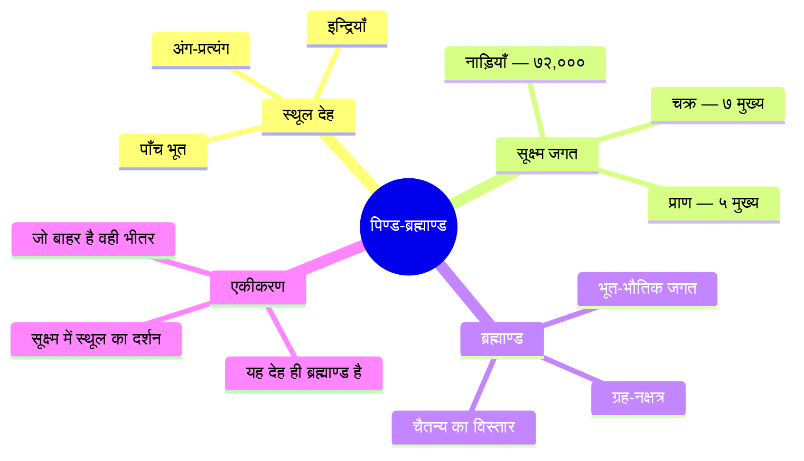
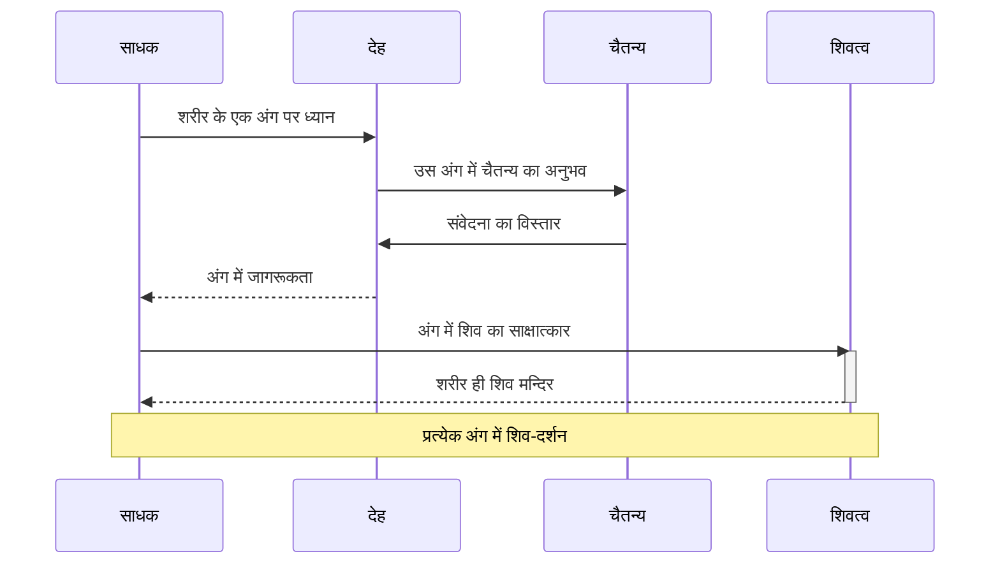

# अध्याय ६: शरीर आधारित ध्यान तकनीकें — देह ही देवालयः

> **पिछला अध्याय:** [अध्याय ५: श्वास और प्राणायाम तकनीकें](./05-shwas-pranayama.md)
> **अगला अध्याय:** [अध्याय ७: दृश्य और प्रकाश ध्यान तकनीकें](./07-drishya-dhyan.md)

> *"शरीरमाद्यं खलु धर्मसाधनम् — शरीर ही धर्म का प्रथम साधन है।"* — महाभारत
> *"देहो देवालयः प्रोक्तः — देह ही देवता का मन्दिर है।"* — कश्मीर शैव परम्परा

विज्ञान भैरव तंत्र में शरीर को केवल एक भौतिक संरचना नहीं, बल्कि ब्रह्माण्ड का सूक्ष्म रूप (पिण्ड-ब्रह्माण्ड) माना गया है। यह अध्याय उन १५ से अधिक ध्यान तकनीकों का वर्णन करता है जो शरीर के विभिन्न अंगों, संवेदनाओं और सूक्ष्म केन्द्रों के माध्यम से परम चैतन्य तक पहुँचने का मार्ग बताती हैं।

---

## सीखने के उद्देश्य (Learning Objectives)

- कश्मीर शैव में शरीर की आध्यात्मिक अवधारणा को समझना (पिण्ड-ब्रह्माण्ड सिद्धान्त)
- विज्ञान भैरव तंत्र की १५+ शरीर-आधारित ध्यान तकनीकों का संस्कृत श्लोकों सहित अध्ययन करना
- अंग-अंग ध्यान (limb-by-limb awareness) की विधि को आत्मसात करना
- तालु-ध्यान, रोमांच अनुभव, त्वचा संवेदना जैसी सूक्ष्म तकनीकों में प्रवीणता प्राप्त करना
- शरीर स्कैन मेडिटेशन टाइमर (TypeScript) का व्यावहारिक कार्यान्वयन करना

### अध्याय एक दृष्टि में

| विषय | मुख्य सिद्धांत | व्यावहारिक लाभ |
|-------|-------------|-------------------|
| अंग-अंग ध्यान | शरीर के प्रत्येक अंग में चैतन्य का साक्षात्कार | गहन शारीरिक जागरूकता |
| पिण्ड ब्रह्माण्ड | देह में सम्पूर्ण ब्रह्माण्ड का दर्शन | सूक्ष्म-स्थूल का एकीकरण |
| तालु ध्यान | तालु के स्पर्श से चैतन्य का बोध | मन की स्वाभाविक शान्ति |
| रोमांच अनुभव | शरीर की सूक्ष्म संवेदनाओं में ध्यान | संवेदनाओं से परे जाने का मार्ग |

```mermaid
flowchart TB
    subgraph शरीर_मानचित्र[शरीर ध्यान — तकनीक मानचित्र]
        A[शरीर ध्यान] --> B[बाह्य अंग]
        A --> C[आन्तर अंग]
        A --> D[सूक्ष्म संवेदना]
        A --> E[चक्र केन्द्र]
        A --> F[सम्पूर्ण देह]
    end
    B --> B1[अंग-अंग ध्यान]
    B --> B2[नासिका अग्र]
    B --> B3[अधर ध्यान]
    B --> B4[जिह्वा ध्यान]
    C --> C1[हृदय ध्यान]
    C --> C2[नाभि ध्यान]
    C --> C3[कंठ ध्यान]
    C --> C4[तालु ध्यान]
    D --> D1[रोमांच अनुभव]
    D --> D2[त्वचा संवेदना]
    D --> D3[स्पर्श बोध]
    D --> D4[ऊष्मा/शीत]
    E --> E1[मूलाधार]
    E --> E2[मेरुदण्ड]
    E --> E3[सहस्रार]
    F --> F1[पिण्ड ब्रह्माण्ड]
    F --> F2[सम्पूर्ण देह ध्यान]
    style A fill:#f9f,stroke:#333,stroke-width:2px
    style B fill:#bbf,stroke:#333
    style C fill:#bbf,stroke:#333
    style D fill:#ff9,stroke:#333
    style E fill:#9cf,stroke:#333
    style F fill:#9f9,stroke:#333
```

---

## सिद्धांत (Theory)

### कश्मीर शैव में शरीर की अवधारणा

कश्मीर शैव दर्शन में शरीर के प्रति दृष्टिकोण अद्वितीय है। जहाँ अनेक आध्यात्मिक परम्पराएँ शरीर को बाधा या पाप का घर मानती हैं, वहीं कश्मीर शैव शरीर को शिव का मन्दिर और साधना का सर्वोत्तम साधन मानता है।

तीन शरीरों की अवधारणा:
1. **स्थूल शरीर (भौतिक देह)** — पाँच महाभूतों (पृथ्वी, जल, अग्नि, वायु, आकाश) से निर्मित
2. **सूक्ष्म शरीर (प्राण-मन)** — १७ तत्त्वों (५ प्राण, ५ कर्मेन्द्रिय, ५ ज्ञानेन्द्रिय, मन, बुद्धि) से निर्मित
3. **कारण शरीर (आत्मा)** — शुद्ध चैतन्य, शिव का प्रत्यक्ष स्वरूप

### देह और ब्रह्माण्ड का सम्बन्ध



कश्मीर शैव का मानना है कि मानव शरीर ब्रह्माण्ड का लघु रूप (microcosm) है:
- **पृथ्वी** = हड्डियाँ और मांस
- **जल** = रक्त और अन्य तरल पदार्थ
- **अग्नि** = पाचन अग्नि और शारीरिक ऊष्मा
- **वायु** = श्वास और प्राण
- **आकाश** = शरीर के भीतर का खाली स्थान (अन्तरिक्ष)

### शरीर ध्यान की प्रक्रिया



---

## तकनीक १: अंग-अंग ध्यान — प्रत्येक अंग में शिव का साक्षात्कार

### मूल संस्कृत श्लोक

> **॥ अङ्गेऽङ्गे च कलां ध्यायेत्प्रत्येकं परिचिन्तयेत् ।**
> **तया कलानुगो योगी भैरवीपदमाप्नुयात् ॥**

### पदच्छेद और अर्थ

| संस्कृत पद | हिन्दी अर्थ |
|-----------|-------------|
| अङ्गेऽङ्गे | प्रत्येक अंग में |
| च | और |
| कलाम् | कला (चैतन्य की अंश) को |
| ध्यायेत् | ध्यान करे |
| प्रत्येकम् | एक-एक करके |
| परिचिन्तयेत् | भलीभांति चिन्तन करे |
| तया | उस कला के साथ |
| कलानुगः | कला का अनुसरण करता हुआ |
| योगी | योगी |
| भैरवीपदम् | भैरवी के पद को |
| आप्नुयात् | प्राप्त करता है |

### हिन्दी व्याख्या

यह एक अत्यन्त व्यवस्थित ध्यान तकनीक है जिसमें साधक शरीर के प्रत्येक अंग में चैतन्य का साक्षात्कार करता है। पैर के अंगूठे से लेकर सिर के ऊपरी भाग तक — एक-एक अंग में ध्यान केन्द्रित करना है। यह आधुनिक शरीर स्कैन मेडिटेशन (body scan meditation) से काफी मिलती-जुलती है, लेकिन इसमें आध्यात्मिक आयाम है — प्रत्येक अंग में शिव-चैतन्य का साक्षात्कार।

### अभ्यास की विधि
1. शवासन या सुखासन में लेटें/बैठें।
2. दाहिने पैर के अंगूठे से शुरू करें — उस अंग में चैतन्य को महसूस करें।
3. धीरे-धीरे ऊपर बढ़ें — पैर, घुटना, जाँघ, पेट, छाती, हाथ, कंधे, गर्दन, सिर।
4. प्रत्येक अंग पर कम से कम १०-१५ सेकंड रुकें।
5. महसूस करें कि प्रत्येक अंग में एक ही चैतन्य व्याप्त है — वही शिव है।
6. अन्त में सम्पूर्ण शरीर में उस चैतन्य का अनुभव करें।

---

## तकनीक २: पिण्ड ब्रह्माण्ड — देह में सम्पूर्ण ब्रह्माण्ड का दर्शन

### मूल संस्कृत श्लोक

> **॥ पिण्डे ब्रह्माण्डमालोक्य देहमध्ये व्यवस्थितम् ।**
> **तत्र चित्तं समाधाय भैरवीपदमाप्नुयात् ॥**

### पदच्छेद और अर्थ

| संस्कृत पद | हिन्दी अर्थ |
|-----------|-------------|
| पिण्डे | इस शरीर में (पिण्ड में) |
| ब्रह्माण्डम् | ब्रह्माण्ड को |
| आलोक्य | देखकर, अवलोकन कर |
| देहमध्ये | शरीर के मध्य में |
| व्यवस्थितम् | स्थित |
| तत्र | वहाँ |
| चित्तम् | चित्त को |
| समाधाय | एकाग्र करके |
| भैरवीपदम् | भैरवी के पद को |
| आप्नुयात् | प्राप्त करता है |

### हिन्दी व्याख्या

यह एक क्रान्तिकारी तकनीक है। साधक अपने शरीर को ही सम्पूर्ण ब्रह्माण्ड के रूप में देखता है। यह शरीर कोई छोटी-सी भौतिक संरचना नहीं — इसमें सम्पूर्ण सृष्टि समाई हुई है।

### अभ्यास की विधि
1. शवासन में लेटें, आँखें बंद करें।
2. अपने शरीर को एक ब्रह्माण्ड के रूप में कल्पना करें।
3. त्वचा को ब्रह्माण्ड की सीमा समझें — उसके पार कुछ नहीं।
4. शरीर के भीतर के खाली स्थान को आकाश के रूप में देखें।
5. हृदय की धड़कन को ब्रह्माण्ड की लय समझें।
6. श्वास को ब्रह्माण्ड के विस्तार और संकोचन के रूप में देखें।
7. इस भाव में स्थिर हो जाएँ — यह देह ही ब्रह्माण्ड है।

---

## तकनीक ३: तालु ध्यान — तालु में चैतन्य का बोध

### मूल संस्कृत श्लोक

> **॥ तालुमूले स्थितं ध्यायेद्व्यापिनं परमेश्वरम् ।**
> **प्रस्वेदजलसंयुक्तं भैरवीपदमाप्नुयात् ॥**

### हिन्दी व्याख्या

यह एक अत्यन्त सूक्ष्म तकनीक है। तालु (मुँह की छत) पर जीभ को लगाकर, उस स्थान पर ध्यान केन्द्रित किया जाता है। तालु पर असंख्य सूक्ष्म तन्त्रिका अन्त होते हैं। वहाँ ध्यान लगाने से मन स्वतः शान्त होने लगता है।

### अभ्यास की विधि
1. सुखासन में बैठें, मुँह बंद रखें।
2. जीभ को ऊपर उठाकर तालु पर लगाएँ।
3. उस स्पर्श बिन्दु पर ध्यान केन्द्रित करें।
4. लार के स्पर्श से होने वाली संवेदना को महसूस करें।
5. उस संवेदना में स्थिर हो जाएँ — कोई विचार नहीं, बस वह स्पर्श।
6. धीरे-धीरे यह स्पर्श चेतना में विलीन हो जाता है।

---

## तकनीक ४: रोमांच अनुभव — शरीर की सूक्ष्म संवेदना का ध्यान

### मूल संस्कृत श्लोक

> **॥ रोमाञ्चं च समालोक्य देहे व्याप्तं च चिन्तयेत् ।**
> **रोमरोम्णि स्थितं ध्यायेद्भैरवीपदमाप्नुयात् ॥**

### हिन्दी व्याख्या

जब शरीर में रोमांच (goosebumps) होता है — चाहे भय से, आनन्द से, या किसी गहरे भाव से — उस क्षण एक विशिष्ट ऊर्जा का प्रवाह होता है। इस तकनीक में साधक उसी रोमांच की संवेदना को पकड़ता है और उसमें स्थिर हो जाता है।

### अभ्यास की विधि
1. किसी ऐसे स्थान पर बैठें जहाँ शरीर स्वतः रोमांचित हो।
2. जब रोमांच हो, तो उस संवेदना को पकड़ें।
3. महसूस करें कि यह संवेदना पूरे शरीर में कैसे व्याप्त है।
4. प्रत्येक रोम-कूप से ऊर्जा का स्पन्दन महसूस करें।
5. इसी संवेदना में विसर्जित हो जाएँ।

---

## तकनीक ५: त्वचा संवेदना — त्वचा के माध्यम से ध्यान

> **॥ त्वचि चैतन्यमालोक्य सर्वव्यापिनमादरात् ।**
> **स्पर्शमात्रेण योगीन्द्रो भैरवीपदमाप्नुयात् ॥**

त्वचा शरीर का सबसे बड़ा अंग है। यह निरन्तर वायु, वस्त्र, तापमान — असंख्य स्पर्शों को महसूस कर रही है। इस तकनीक में साधक त्वचा पर होने वाले स्पर्शों को देखता है — बिना उनमें राग-द्वेष के। वायु का स्पर्श, वस्त्र का स्पर्श, ज़मीन का स्पर्श — सबको केवल देखना है।

---

## तकनीक ६: नासिका अग्र ध्यान — नाक की नोक पर ध्यान

> **॥ नासाग्रे वायुमालोक्य सूक्ष्मं स्पर्शं च चिन्तयेत् ।**
> **तत्र चित्तं समाधाय भैरवीपदमाप्नुयात् ॥**

नासिका के अग्रभाग पर श्वास के आने-जाने का स्पर्श सर्वदा विद्यमान है। इस स्पर्श को पकड़ना — जैसे श्वास नासिका से होकर गुज़रता है, उस सूक्ष्म स्पर्श को महसूस करना। यह तकनीक आधुनिक माइण्डफुलनेस मेडिटेशन का आधार है।

---

## तकनीक ७: अधर ध्यान — होठों की संवेदना

> **॥ अधरौ च समालोक्य संस्पर्शं परिचिन्तयेत् ।**
> **स्पर्शमात्रे लयीभूतः प्रविशेद्वै भैरवीम् ॥**

होठों पर ध्यान केन्द्रित करें। ऊपर और नीचे के होंठों के आपसी स्पर्श को महसूस करें। यह स्पर्श अत्यन्त सूक्ष्म है — लगभग अगोचर। इसी सूक्ष्म स्पर्श में ध्यान को स्थिर करें।

---

## तकनीक ८: जिह्वा ध्यान — जीभ की चेतना

> **॥ जिह्वायां परमं ध्यायेद्व्यापिनं चैतन्यमादरात् ।**
> **जिह्वयैव च संयोज्य भैरवीपदमाप्नुयात् ॥**

जीभ पर ध्यान केन्द्रित करें — बिना किसी स्वाद के, केवल जीभ के अस्तित्व को महसूस करें। जीभ कहीं भी स्पर्श न कर रही हो — बस मुँह में स्वतन्त्र रूप से स्थित हो। यह अत्यन्त सूक्ष्म ध्यान है जो मन को शीघ्र एकाग्र करता है।

---

## तकनीक ९: कंठ ध्यान — गले की अनुभूति

> **॥ कण्ठकूपे स्थितं ध्यायेच्चैतन्यं व्यापकं शिवम् ।**
> **प्रस्वेदजलसंयुक्तं भैरवीपदमाप्नुयात् ॥**

गले के क्षेत्र (कण्ठ कूप) में ध्यान केन्द्रित करें। निगलने की क्रिया के बिना, गले की स्वाभाविक संवेदना को महसूस करें। यह वह स्थान है जहाँ से ध्वनि उत्पन्न होती है और जहाँ अन्न जाता है।

---

## तकनीक १०: हृदय ध्यान — हृदय के स्पन्दन में शिव

### मूल संस्कृत श्लोक

> **॥ हृदये पुण्डरीकान्ते ध्यायेद्व्यापिनमीश्वरम् ।**
> **हृत्पद्मं च समालोक्य भैरवीपदमाप्नुयात् ॥**

### हिन्दी व्याख्या

हृदय केवल एक भौतिक अंग नहीं — यह चैतन्य का केन्द्र है। हृदय में एक कमल (पुण्डरीक) का ध्यान करें जिसमें प्रकाश व्याप्त है। हृदय की धड़कन को महसूस करें — प्रत्येक धड़कन में शिव का स्पन्दन।

### अभ्यास की विधि
1. हाथ को हृदय पर रखें, धड़कन को महसूस करें।
2. कल्पना करें कि हृदय में एक ज्योर्तिमय कमल खिल रहा है।
3. प्रत्येक धड़कन के साथ यह कमल खिलता और मुरझाता है।
4. इस कमल के मध्य में शिव का साक्षात्कार करें।
5. हृदय की धड़कन और शिव-चैतन्य में भेद न रहे — यही ध्यान की सिद्धि है।

---

## तकनीक ११: नाभि ध्यान — नाभि में ब्रह्माण्ड का केन्द्र

> **॥ नाभिचक्रे समालोक्य विश्वं व्याप्तं च चिन्तयेत् ।**
> **नाभेरूर्ध्वं च दृष्ट्वैव भैरवीपदमाप्नुयात् ॥**

नाभि शरीर का भौतिक केन्द्र है। जन्म से पहले, हम नाभि-रज्जु द्वारा माँ से जुड़े थे — यह हमारा प्रथम सम्बन्ध है। इस तकनीक में, नाभि पर ध्यान केन्द्रित करके सम्पूर्ण ब्रह्माण्ड से अपने जुड़ाव को महसूस किया जाता है।

---

## तकनीक १२: मूलाधार ध्यान — जड़ केन्द्र में स्थिरता

> **॥ मूलाधारे स्थितं ध्यायेद्व्यापिनं परमेश्वरम् ।**
> **तत्र चित्तं समाधाय भैरवीपदमाप्नुयात् ॥**

मूलाधार चक्र (रीढ़ के आधार पर) में ध्यान केन्द्रित करें। यह स्थूलतम ऊर्जा का केन्द्र है। यहाँ स्थित शिव का ध्यान — यानि जड़ता में भी चैतन्य का दर्शन।

---

## तकनीक १३: मेरुदण्ड ध्यान — रीढ़ में चैतन्य का प्रवाह

> **॥ मेरुदण्डे समालोक्य प्राणशक्तिं प्रवाहिनीम् ।**
> **तया सहैव योगीन्द्रो भैरवीपदमाप्नुयात् ॥**

रीढ़ की हड्डी (मेरुदण्ड) शरीर का सबसे महत्वपूर्ण भाग है। इसमें से प्राणशक्ति का प्रवाह होता है। इस तकनीक में, मेरुदण्ड के नीचे से ऊपर तक प्राण के प्रवाह को महसूस करना है — जैसे कोई ज्योति रीढ़ के साथ ऊपर उठ रही हो।

---

## तकनीक १४: हाथ-पैर ध्यान — अन्तिम अंगों में चैतन्य

> **॥ हस्तयोः पादयोश्चैव चैतन्यं चिन्तयेद्बुधः ।**
> **तेषामेकतमं ध्यायन्भैरवीपदमाप्नुयात् ॥**

हाथों और पैरों में चैतन्य की उपस्थिति को महसूस करें। हाथों की हथेलियों में, उँगलियों में — एक स्पन्दन है। पैरों के तलवों में, पंजों में — ऊर्जा का प्रवाह है।

---

## तकनीक १५: सम्पूर्ण देह ध्यान — एक साथ पूरे शरीर का बोध

> **॥ सर्वाङ्गे सर्वदा ध्यायेद्व्यापकं परमेश्वरम् ।**
> **एकीभूतं समालोक्य भैरवीपदमाप्नुयात् ॥**

अब एक साथ पूरे शरीर पर ध्यान केन्द्रित करें — न किसी एक अंग पर, बल्कि सम्पूर्ण देह पर। एक साथ पैरों में, हाथों में, पेट में, छाती में, सिर में — सर्वत्र चैतन्य को महसूस करें।

---

## शरीर ध्यान के स्तर

```mermaid
flowchart LR
    subgraph स्तर[शरीर ध्यान के चार स्तर]
        L1[स्तर १ - बाह्य अंग - त्वचा, मांस, हड्डी]
        L2[स्तर २ - आन्तरिक अंग - हृदय, फेफड़े, पेट]
        L3[स्तर ३ - सूक्ष्म ऊर्जा - चक्र, नाड़ियाँ]
        L4[स्तर ४ - शुद्ध चैतन्य - सम्पूर्ण देह में व्याप्त]
    end
    L1 --> L2
    L2 --> L3
    L3 --> L4
    L4 -.->|प्रवेश| शिव[शिवत्व]
    style L1 fill:#f96,stroke:#333
    style L2 fill:#9cf,stroke:#333
    style L3 fill:#9f9,stroke:#333
    style L4 fill:#f9f,stroke:#333
    style शिव fill:#ff9,stroke:#333
```

---

## TypeScript कार्यान्वयन: शरीर स्कैन ध्यान टाइमर

```typescript
/**
 * विज्ञान भैरव तंत्र — शरीर स्कैन ध्यान टाइमर
 * यह मॉड्यूल शरीर के विभिन्न अंगों में गाइडेड बॉडी स्कैन मेडिटेशन प्रदान करता है।
 * आवश्यकता: Node.js 18+, TypeScript 5+
 */

interface BodyRegion {
  hindiName: string;
  englishName: string;
  sanskritName: string;
  focusDurationMs: number;
  instructions: string[];
  category: 'external' | 'internal' | 'subtle' | 'energy' | 'complete';
  shlokaRef?: string;
}

interface BodyScanSession {
  id: string;
  title: string;
  techniqueShloka: string;
  description: string;
  regions: BodyRegion[];
  totalDurationMs: number;
  direction: 'top-down' | 'bottom-up' | 'center-out';
}

interface ScanProgress {
  currentRegionIndex: number;
  elapsedMs: number;
  remainingMs: number;
  completedRegions: string[];
  currentInstruction: string;
}

function createFullBodyScan(): BodyRegion[] {
  return [
    {
      hindiName: 'दाहिने पैर का अंगूठा', englishName: 'Right Big Toe',
      sanskritName: 'दक्षिण पादाङ्गुष्ठ', focusDurationMs: 15000,
      instructions: ['पैर के अंगूठे में चैतन्य को महसूस करें'],
      category: 'external',
    },
    {
      hindiName: 'दाहिने पैर का तलवा', englishName: 'Right Sole',
      sanskritName: 'दक्षिण पादतल', focusDurationMs: 15000,
      instructions: ['तलवे में संवेदना को महसूस करें'],
      category: 'external',
    },
    {
      hindiName: 'दाहिनी टखनी और पिंडली', englishName: 'Right Ankle & Calf',
      sanskritName: 'दक्षिण गुल्फ-जङ्घा', focusDurationMs: 15000,
      instructions: ['टखनी में संवेदना', 'पिंडली की मांसपेशियों को ढीला छोड़ें'],
      category: 'external',
    },
    {
      hindiName: 'दाहिना घुटना और जाँघ', englishName: 'Right Knee & Thigh',
      sanskritName: 'दक्षिण जानु-ऊरु', focusDurationMs: 15000,
      instructions: ['घुटने के जोड़ पर ध्यान', 'जाँघ में शक्ति को महसूस करें'],
      category: 'external',
    },
    {
      hindiName: 'बायाँ पैर', englishName: 'Left Leg',
      sanskritName: 'वाम पाद', focusDurationMs: 45000,
      instructions: ['बाएँ पैर — अंगूठे से जाँघ तक'],
      category: 'external',
    },
    {
      hindiName: 'पेडू और पीठ का निचला भाग', englishName: 'Pelvis & Lower Back',
      sanskritName: 'श्रोणि-कटिप्रदेश', focusDurationMs: 30000,
      instructions: ['पेडू में स्थिरता', 'पीठ के निचले भाग में तनाव मुक्त करें'],
      category: 'internal',
    },
    {
      hindiName: 'पेट और नाभि', englishName: 'Abdomen & Navel',
      sanskritName: 'उदर-नाभि', focusDurationMs: 45000,
      instructions: ['पेट के उठने-गिरने को देखें', 'नाभि में स्पन्दन को महसूस करें'],
      category: 'internal',
      shlokaRef: 'नाभिचक्रे समालोक्य विश्वं व्याप्तं च चिन्तयेत्',
    },
    {
      hindiName: 'छाती और हृदय', englishName: 'Chest & Heart',
      sanskritName: 'वक्ष-हृदय', focusDurationMs: 60000,
      instructions: ['हृदय की धड़कन महसूस करें', 'हृदय में कमल का ध्यान करें'],
      category: 'internal',
      shlokaRef: 'हृदये पुण्डरीकान्ते ध्यायेद्व्यापिनमीश्वरम्',
    },
    {
      hindiName: 'कंठ और गला', englishName: 'Throat',
      sanskritName: 'कण्ठप्रदेश', focusDurationMs: 30000,
      instructions: ['गले में संवेदना', 'निगलने की क्रिया के बिना, केवल अस्तित्व'],
      category: 'internal',
    },
    {
      hindiName: 'चेहरा और तालु', englishName: 'Face & Palate',
      sanskritName: 'मुख-तालु', focusDurationMs: 45000,
      instructions: ['चेहरे की मांसपेशियों को ढीला छोड़ें', 'जीभ को तालु से लगाएँ'],
      category: 'external',
      shlokaRef: 'तालुमूले स्थितं ध्यायेद्व्यापिनं परमेश्वरम्',
    },
    {
      hindiName: 'सिर और सहस्रार', englishName: 'Head & Crown',
      sanskritName: 'शिरः-सहस्रार', focusDurationMs: 45000,
      instructions: ['सम्पूर्ण सिर में चैतन्य', 'सिर के ऊपरी भाग में ऊर्जा का अनुभव'],
      category: 'complete',
    },
    {
      hindiName: 'सम्पूर्ण देह', englishName: 'Entire Body',
      sanskritName: 'कृत्स्नदेह', focusDurationMs: 120000,
      instructions: ['एक साथ पूरे शरीर को महसूस करें', 'सिर से पैर तक एक ही चैतन्य'],
      category: 'complete',
      shlokaRef: 'सर्वाङ्गे सर्वदा ध्यायेद्व्यापकं परमेश्वरम्',
    },
  ];
}

class BodyScanMeditation {
  private session: BodyScanSession | null = null;
  private isRunning: boolean = false;
  private currentRegionIndex: number = 0;
  private startedAt: Date | null = null;
  private timerHandle: ReturnType<typeof setTimeout> | null = null;
  private progress: ScanProgress | null = null;

  constructor() {
    console.log('🧘 विज्ञान भैरव तंत्र — शरीर स्कैन ध्यान');
    console.log('=' .repeat(50));
  }

  createBottomUpSession(): BodyScanSession {
    const regions = createFullBodyScan();
    return {
      id: 'body-scan-bottom-up',
      title: 'नीचे से ऊपर शरीर स्कैन',
      techniqueShloka: 'अङ्गेऽङ्गे च कलां ध्यायेत्प्रत्येकं परिचिन्तयेत्',
      description: 'पैर से सिर तक — प्रत्येक अंग में चैतन्य का साक्षात्कार',
      regions,
      totalDurationMs: regions.reduce((acc, r) => acc + r.focusDurationMs, 0),
      direction: 'bottom-up',
    };
  }

  startSession(session: BodyScanSession): void {
    if (this.isRunning) {
      console.warn('⚠️ सत्र पहले से चल रहा है।');
      return;
    }
    this.session = session;
    this.isRunning = true;
    this.currentRegionIndex = 0;
    this.startedAt = new Date();

    console.log(`\n📿 सत्र: ${session.title}`);
    console.log(`📜 श्लोक: ${session.techniqueShloka}`);
    console.log(`⏱ कुल समय: ${this.formatDuration(session.totalDurationMs)}`);
    console.log('-'.repeat(50));

    this.focusRegion();
  }

  private focusRegion(): void {
    if (!this.session || !this.isRunning) return;
    const region = this.session.regions[this.currentRegionIndex];
    const total = this.session.regions.length;
    const remaining = this.session.regions.slice(this.currentRegionIndex + 1)
      .reduce((acc, r) => acc + r.focusDurationMs, 0);

    console.log(`\n📍 क्षेत्र ${this.currentRegionIndex + 1}/${total}: ${region.hindiName}`);
    region.instructions.forEach((inst, i) => console.log(`   ${i + 1}. ${inst}`));
    console.log(`   ⏳ शेष: ${this.formatDuration(remaining)}`);

    this.progress = {
      currentRegionIndex: this.currentRegionIndex,
      elapsedMs: Date.now() - (this.startedAt?.getTime() ?? 0),
      remainingMs: remaining,
      completedRegions: this.session.regions.slice(0, this.currentRegionIndex).map(r => r.hindiName),
      currentInstruction: region.instructions[0],
    };

    this.timerHandle = setTimeout(() => this.advanceToNextRegion(), region.focusDurationMs);
  }

  private advanceToNextRegion(): void {
    if (!this.session) return;
    this.currentRegionIndex++;
    if (this.currentRegionIndex >= this.session.regions.length) {
      this.completeSession();
      return;
    }
    this.focusRegion();
  }

  private completeSession(): void {
    if (!this.session || !this.startedAt) return;
    this.isRunning = false;
    console.log('\n' + '='.repeat(50));
    console.log('✨ शरीर स्कैन पूर्ण! ✨');
    console.log(`📍 क्षेत्र: ${this.session.regions.length}`);
    console.log('='.repeat(50));
    this.session = null;
    this.timerHandle = null;
  }

  pauseSession(): void {
    if (!this.isRunning) return;
    this.isRunning = false;
    if (this.timerHandle) { clearTimeout(this.timerHandle); this.timerHandle = null; }
    console.log('⏸️ सत्र रोका गया।');
  }

  resumeSession(): void {
    if (this.isRunning || !this.session) return;
    this.isRunning = true;
    console.log('▶️ सत्र पुनः प्रारम्भ...');
    this.focusRegion();
  }

  getProgress(): ScanProgress | null { return this.progress; }

  private formatDuration(ms: number): string {
    const totalSeconds = Math.floor(ms / 1000);
    const minutes = Math.floor(totalSeconds / 60);
    const seconds = totalSeconds % 60;
    return `${minutes}:${seconds.toString().padStart(2, '0')}`;
  }
}

function main(): void {
  console.log('🧘 विज्ञान भैरव तंत्र — शरीर स्कैन ध्यान प्रणाली');
  const bodyScan = new BodyScanMeditation();
  const session = bodyScan.createBottomUpSession();
  console.log(`\n📋 सत्र: ${session.title}`);
  console.log(`📍 शरीर क्षेत्र: ${session.regions.length}`);
  console.log(`⏱ कुल समय: ${bodyScan['formatDuration'](session.totalDurationMs)}`);
  session.regions.forEach((r, i) => console.log(`   ${i+1}. ${r.hindiName}`));
  console.log('\n✅ सिस्टम तैयार।');
}

if (require.main === module) main();

export { BodyScanMeditation, BodyScanSession, BodyRegion, ScanProgress, createFullBodyScan };
```

---

## तुलनात्मक तालिका — शरीर तकनीकें

| तकनीक | श्रेणी | कठिनाई | समय | संवेदना स्तर |
|-------|--------|--------|------|------------|
| अंग-अंग ध्यान | बाह्य | प्रारम्भिक | १५-२० मिनट | स्थूल से सूक्ष्म |
| पिण्ड ब्रह्माण्ड | सम्पूर्ण | उच्च | ११-३१ मिनट | चैतन्य स्तर |
| तालु ध्यान | सूक्ष्म | मध्यम | ५-११ मिनट | अत्यन्त सूक्ष्म |
| रोमांच अनुभव | सूक्ष्म | मध्यम | १०-२० मिनट | ऊर्जा स्तर |
| त्वचा संवेदना | बाह्य | प्रारम्भिक | १०-१५ मिनट | स्पर्श स्तर |
| नासिका अग्र | बाह्य | प्रारम्भिक | ५-१० मिनट | श्वास स्पर्श |
| हृदय ध्यान | आन्तर | मध्यम | २१ मिनट | भाव स्तर |
| मेरुदण्ड ध्यान | ऊर्जा | उच्च | १५-२१ मिनट | प्राण स्तर |

---

## सारांश (Summary)

- **कश्मीर शैव शरीर को शिव का मन्दिर मानता है** — देह ही ध्यान का सर्वोत्तम उपकरण है।
- **अंग-अंग ध्यान** में शरीर के प्रत्येक अंग में चैतन्य का साक्षात्कार किया जाता है।
- **पिण्ड-ब्रह्माण्ड सिद्धान्त** के अनुसार, यह देह ही सम्पूर्ण ब्रह्माण्ड का लघु रूप है।
- **तालु ध्यान** अत्यन्त सूक्ष्म है — जीभ को तालु से लगाकर स्पर्श संवेदना में स्थिर होना।
- **रोमांच अनुभव** शरीर की स्वाभाविक संवेदनाओं के माध्यम से ध्यान सिखाता है।
- **हृदय ध्यान** में हृदय के कमल में शिव का साक्षात्कार होता है।
- शरीर ध्यान के चार स्तर हैं — बाह्य अंग, आन्तरिक अंग, सूक्ष्म ऊर्जा, शुद्ध चैतन्य।
- TypeScript शरीर स्कैन टाइमर पैर से सिर तक गाइडेड मेडिटेशन प्रदान करता है।

---

## अध्याय प्रश्नोत्तरी (Chapter Quiz)

### प्रश्न १
**"अङ्गेऽङ्गे च कलां ध्यायेत्" — इस श्लोक में ध्यान का विषय क्या है?**
क) सम्पूर्ण ब्रह्माण्ड
ख) शरीर का प्रत्येक अंग
ग) केवल हृदय
घ) केवल नाभि

### प्रश्न २
**पिण्ड-ब्रह्माण्ड सिद्धान्त का क्या अर्थ है?**
क) पिण्ड और ब्रह्माण्ड अलग-अलग हैं
ख) यह शरीर ही ब्रह्माण्ड का लघु रूप है
ग) ब्रह्माण्ड पिण्ड से बड़ा है
घ) पिण्ड की कोई वास्तविकता नहीं

### प्रश्न ३
**तालु ध्यान में ध्यान का मुख्य बिन्दु क्या है?**
क) तालु का रंग
ख) तालु का आकार
ग) जीभ और तालु के स्पर्श की संवेदना
घ) तालु का तापमान

### प्रश्न ४
**कश्मीर शैव में कितने शरीरों की अवधारणा है?**
क) एक — केवल स्थूल शरीर
ख) दो — स्थूल और सूक्ष्म
ग) तीन — स्थूल, सूक्ष्म, कारण
घ) चार — स्थूल, सूक्ष्म, कारण, महाकारण

### प्रश्न ५
**रोमांच ध्यान में किस संवेदना पर ध्यान केन्द्रित किया जाता है?**
क) श्वास पर
ख) रोमांच (goosebumps) की संवेदना पर
ग) हृदय की धड़कन पर
घ) मन्त्र की ध्वनि पर

### प्रश्न ६
**मेरुदण्ड ध्यान में किसका प्रवाह महसूस किया जाता है?**
क) रक्त का प्रवाह
ख) प्राण शक्ति का प्रवाह
ग) विचारों का प्रवाह
घ) अन्न का प्रवाह

### प्रश्न ७
**हृदय ध्यान में हृदय में किसका ध्यान करने को कहा गया है?**
क) सूर्य का
ख) कमल (पुण्डरीक) का
ग) दीपक का
घ) बिन्दु का

### प्रश्न ८
**त्वचा संवेदना तकनीक में साधक को क्या करना है?**
क) त्वचा को रगड़ना
ख) त्वचा पर होने वाले स्पर्शों को बिना राग-द्वेष के देखना
ग) त्वचा का रंग बदलना
घ) त्वचा को खींचना

### प्रश्न ९
**नासिका अग्र ध्यान किस आधुनिक ध्यान पद्धति का आधार है?**
क) प्रेम ध्यान
ख) माइण्डफुलनेस मेडिटेशन
ग) योग निद्रा
घ) त्राटक

### प्रश्न १०
**सम्पूर्ण देह ध्यान में साधक को क्या करना है?**
क) केवल एक अंग पर ध्यान देना
ख) एक साथ पूरे शरीर में चैतन्य को महसूस करना
ग) शरीर को भूल जाना
घ) शरीर को छोड़ देना

### उत्तर कुंजी
| प्रश्न | उत्तर | स्पष्टीकरण |
|-------|--------|------------|
| १ | ख | शरीर के प्रत्येक अंग में कला (चैतन्य) का ध्यान |
| २ | ख | यह शरीर ही ब्रह्माण्ड का लघु रूप है |
| ३ | ग | जीभ-तालु के स्पर्श की संवेदना मुख्य ध्येय है |
| ४ | ग | स्थूल, सूक्ष्म, कारण — तीन शरीर |
| ५ | ख | रोमांच (goosebumps) की संवेदना पर ध्यान |
| ६ | ख | मेरुदण्ड में प्राण शक्ति का प्रवाह महसूस किया जाता है |
| ७ | ख | हृदय में पुण्डरीक (कमल) का ध्यान |
| ८ | ख | त्वचा पर स्पर्शों को साक्षी भाव से देखना |
| ९ | ख | माइण्डफुलनेस मेडिटेशन का आधार |
| १० | ख | एक साथ पूरे शरीर को महसूस करना |

---

## अभ्यास (Exercises)

### अभ्यास १: ३१-बिन्दु शरीर स्कैन
एक सप्ताह तक प्रतिदिन ३१ बिन्दुओं वाला शरीर स्कैन करें। दाहिने पैर के अंगूठे से शुरू करके सिर तक जाएँ। प्रत्येक बिन्दु पर १५ सेकंड रुकें। डायरी में लिखें — किस अंग में सबसे अधिक संवेदना थी?

### अभ्यास २: पिण्ड-ब्रह्माण्ड ध्यान — ११ मिनट
प्रतिदिन ११ मिनट पिण्ड-ब्रह्माण्ड ध्यान करें। शरीर को ब्रह्माण्ड समझकर उसमें विसर्जित हो जाएँ। ७ दिनों के अनुभव रिकॉर्ड करें।

### अभ्यास ३: तालु ध्यान — दिन में ५ बार
दिन में ५ बार, प्रत्येक बार २ मिनट के लिए तालु ध्यान करें। ध्यान दें कि हर बार मन कितनी जल्दी शान्त होता है।

### अभ्यास ४: हृदय ध्यान — २१ मिनट
प्रतिदिन २१ मिनट हृदय ध्यान करें। हृदय में कमल का ध्यान करें और उसके मध्य में शिव का साक्षात्कार करें।

### अभ्यास ५: TypeScript शरीर स्कैन विस्तार
दिए गए TypeScript कोड में ७ चक्रों (मूलाधार, स्वाधिष्ठान, मणिपुर, अनाहत, विशुद्धि, आज्ञा, सहस्रार) के लिए नए ध्यान क्षेत्र जोड़ें। प्रत्येक के लिए संस्कृत नाम, निर्देश और श्लोक संदर्भ दें।

### अभ्यास ६: मर्म स्थान ध्यान
आयुर्वेद के १०७ मर्म स्थानों में से ११ प्रमुख मर्मों का चयन करें और उन पर ध्यान करें। प्रत्येक मर्म पर ३० सेकंड रुकें।

### अभ्यास ७ (चुनौती): १०८ मिनट का महासत्र
एक बार १०८ मिनट का निर्बाध शरीर स्कैन सत्र करें। इसे १०८ भागों में विभाजित करें — प्रत्येक भाग १ मिनट का। प्रत्येक मिनट में शरीर के एक अलग भाग पर ध्यान केन्द्रित करें।

---

> **अगले अध्याय में:** दृश्य और प्रकाश ध्यान तकनीकें — त्राटक, आकाश ध्यान, अग्नि उपासना, और अन्धकार ध्यान।
