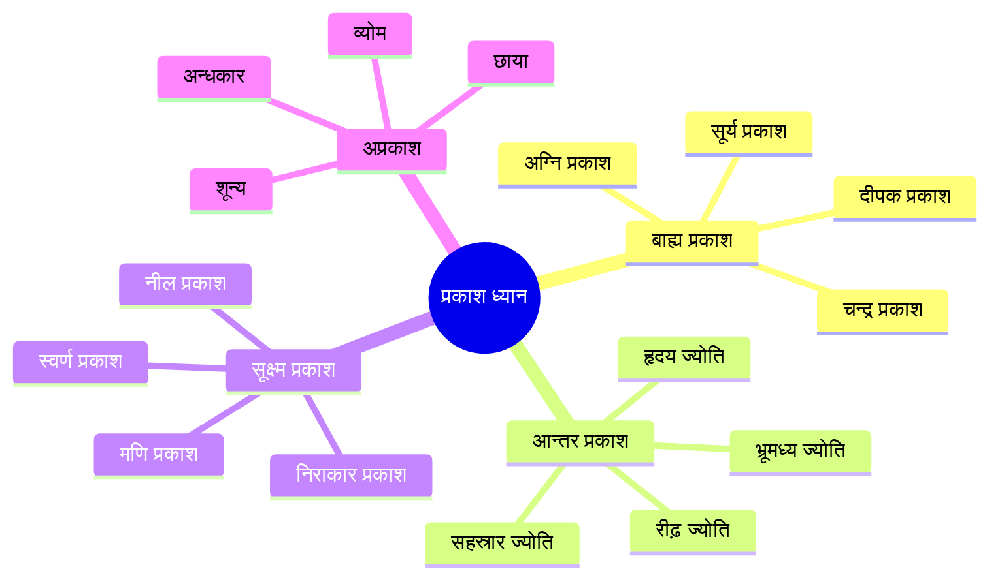
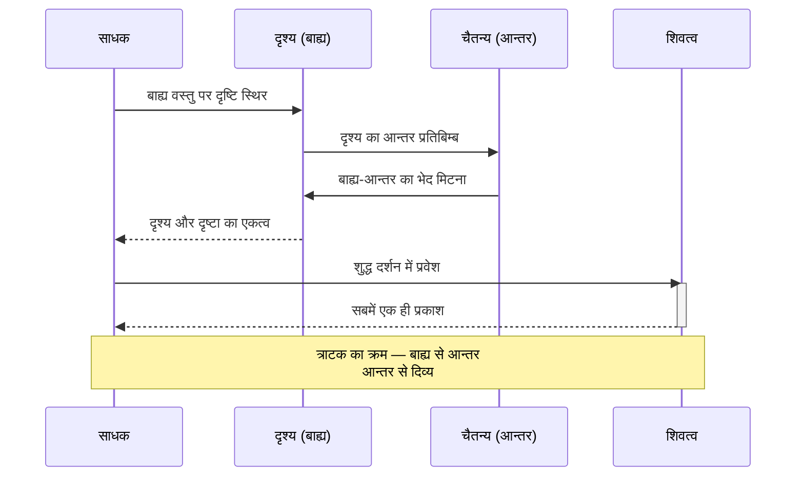

# अध्याय ७: दृश्य और प्रकाश ध्यान तकनीकें — नेत्र ही शिव के द्वार

> **पिछला अध्याय:** [अध्याय ६: शरीर आधारित ध्यान तकनीकें](./06-sharir-dhyan.md)
> **अगला अध्याय:** [अध्याय ८: ध्वनि और मंत्र तकनीकें](./08-dhwani-mantra.md)

> *"चक्षुः प्रकाशः — नेत्र ही प्रकाश है।"* — कश्मीर शैव
> *"यत्र दृष्टिः तत्र सृष्टिः — जहाँ दृष्टि, वहीं सृष्टि।"* — त्रिक दर्शन

विज्ञान भैरव तंत्र में दृश्य और प्रकाश आधारित ध्यान तकनीकों का विशेष स्थान है। यह अध्याय १५ से अधिक ऐसी विधियों का वर्णन करता है जो नेत्रों, प्रकाश, अग्नि, आकाश और अन्धकार के माध्यम से परम चैतन्य तक पहुँचने का मार्ग बताती हैं। दृश्य जगत को ध्यान में बाधा न समझें — यही साधना का द्वार है।

---

## सीखने के उद्देश्य (Learning Objectives)

- दृश्य ध्यान के कश्मीर शैव सैद्धांतिक आधार को समझना
- विज्ञान भैरव तंत्र की १५+ दृश्य-आधारित ध्यान तकनीकों का अध्ययन करना
- त्राटक (steady gazing) की विधि में प्रवीणता प्राप्त करना
- आकाश ध्यान, अग्नि उपासना और अन्धकार ध्यान को आत्मसात करना
- TypeScript त्राटक टाइमर का व्यावहारिक कार्यान्वयन करना
- प्रकाश के विभिन्न रूपों (बाह्य, आन्तर, सूक्ष्म) में ध्यान की समझ विकसित करना

### अध्याय एक दृष्टि में

| विषय | मुख्य सिद्धांत | व्यावहारिक लाभ |
|-------|-------------|-------------------|
| त्राटक | एक बिन्दु पर स्थिर दृष्टि | मन की एकाग्रता और शक्ति संचय |
| आकाश ध्यान | अनन्त आकाश में दृष्टि का विसर्जन | मन का असीम विस्तार |
| अग्नि उपासना | ज्वाला के रूप-रंग में ध्यान | चित्त की शोधन प्रक्रिया |
| अन्धकार ध्यान | अँधेरे में दृष्टि का विलय | संवेदनाओं का परे जाना |

```mermaid
flowchart TB
    subgraph दृश्य_ध्यान[दृश्य और प्रकाश ध्यान — तकनीक मानचित्र]
        A[दृश्य ध्यान] --> B[बाह्य प्रकाश]
        A --> C[आन्तर प्रकाश]
        A --> D[रूप आधारित]
        A --> E[अरूप आधारित]
    end

    B --> B1[त्राटक — बिन्दु]
    B --> B2[अग्नि उपासना]
    B --> B3[सूर्य ध्यान]
    B --> B4[चन्द्र ध्यान]

    C --> C1[हृदय ज्योति]
    C --> C2[भ्रूमध्य प्रकाश]
    C --> C3[सहस्रार प्रकाश]

    D --> D1[मूर्ति ध्यान]
    D --> D2[रंग ध्यान]
    D --> D3[मण्डल ध्यान]

    E --> E1[आकाश ध्यान]
    E --> E2[अन्धकार ध्यान]
    E --> E3[शून्य ध्यान]
    E --> E4[छाया ध्यान]

    style A fill:#f9f,stroke:#333,stroke-width:2px
    style B fill:#ff9,stroke:#333
    style C fill:#9cf,stroke:#333
    style D fill:#9f9,stroke:#333
    style E fill:#f96,stroke:#333
```

---

## सिद्धांत (Theory)

### कश्मीर शैव में दृश्य का सिद्धांत

कश्मीर शैव दर्शन में दृश्य और दृष्टा में कोई भेद नहीं है। जो देखता है और जो दिखता है — दोनों एक ही चैतन्य के रूप हैं। नेत्र केवल इन्द्रिय नहीं, बल्कि चैतन्य का द्वार है।

तीन प्रकार की दृष्टियाँ:
1. **बाह्य दृष्टि** — बाहरी वस्तुओं, प्रकाश, रूपों को देखना
2. **आन्तर दृष्टि** — भीतर के प्रकाश, ज्योति, रंगों को देखना
3. **दिव्य दृष्टि** — शुद्ध चैतन्य में सबका दर्शन

जब बाह्य दृष्टि एक बिन्दु पर स्थिर हो जाती है, तो वह आन्तर दृष्टि में परिणत होती है। और जब आन्तर दृष्टि भी विलीन हो जाती है, तो दिव्य दृष्टि प्रकट होती है। यही त्राटक से समाधि तक का मार्ग है।

### प्रकाश और चैतन्य का सम्बन्ध



शैव दर्शन में प्रकाश (प्रकाश) और चैतन्य को एक माना गया है। जैसे प्रकाश से वस्तुएँ प्रकट होती हैं, वैसे ही चैतन्य से सम्पूर्ण जगत प्रकट होता है। इसीलिए प्रकाश पर ध्यान करना चैतन्य पर ध्यान करने के समान है।

### दृश्य ध्यान की प्रक्रिया



---

## तकनीक १: त्राटक — एक बिन्दु पर स्थिर दृष्टि

### मूल संस्कृत श्लोक

> **॥ एकबिन्दुं समालोक्य दृष्टिं सम्यक् निरोधयेत् ।**
> **भ्रुवोर्मध्ये दृशं स्थाप्य भैरवीपदमाप्नुयात् ॥**

### पदच्छेद और अर्थ

| संस्कृत पद | हिन्दी अर्थ |
|-----------|-------------|
| एकबिन्दुम् | एक बिन्दु को |
| समालोक्य | भलीभांति देखकर |
| दृष्टिम् | दृष्टि को |
| सम्यक् | पूर्ण रूप से |
| निरोधयेत् | रोक दे, स्थिर कर दे |
| भ्रुवोर्मध्ये | दोनों भौंहों के मध्य में |
| दृशम् | दृष्टि को |
| स्थाप्य | स्थापित करके |
| भैरवीपदम् | भैरवी के पद को |
| आप्नुयात् | प्राप्त करता है |

### हिन्दी व्याख्या

त्राटक विज्ञान भैरव तंत्र की सबसे प्रसिद्ध तकनीकों में से एक है। इसमें एक बिन्दु (चाहे वह दीवार पर बना बिन्दु हो, दीपक की ज्वाला हो, या भ्रूमध्य में कल्पित बिन्दु) पर दृष्टि को स्थिर किया जाता है। जब दृष्टि स्थिर होती है, तो मन स्वतः स्थिर हो जाता है। नेत्रों का स्थिर होना ही मन का स्थिर होना है।

### अभ्यास की विधि
1. दीवार पर एक काला बिन्दु बनाएँ या दीपक जलाएँ।
2. बिन्दु से २-३ फीट की दूरी पर बैठें, रीढ़ सीधी रखें।
3. बिन्दु पर बिना पलक झपकाए दृष्टि स्थिर करें।
4. जितनी देर हो सके, दृष्टि को स्थिर रखें।
5. जब आँखें थक जाएँ या पानी आ जाए, तो धीरे-धीरे आँखें बंद करें।
6. बंद आँखों के पीछे बिन्दु का प्रतिबिम्ब दिखेगा — उस पर ध्यान केन्द्रित करें।
7. प्रतिबिम्ब भी विलीन हो जाए, तो शून्य में स्थिर हो जाएँ।

---

## तकनीक २: भ्रूमध्य त्राटक — भौंहों के मध्य दृष्टि

### मूल संस्कृत श्लोक

> **॥ भ्रुवोरन्तर्गतं चक्षुः प्राणेन सह चिन्तयेत् ।**
> **तत्र चित्तं समाधाय भैरवीपदमाप्नुयात् ॥**

### हिन्दी व्याख्या

इस तकनीक में आँखों को बंद करके, दोनों भौंहों के मध्य बिन्दु (आज्ञा चक्र) पर दृष्टि (जैसे देख रहे हों, वैसे) स्थिर की जाती है। यहाँ पर प्राण और मन दोनों एक होते हैं। भ्रूमध्य पर दृष्टि स्थिर करने से मन शीघ्र एकाग्र होता है और प्राण का प्रवाह ऊर्ध्वगामी होता है।

### अभ्यास की विधि
1. आँखें बंद करके बैठें।
2. दोनों नेत्रों को ऊपर की ओर उठाएँ (बंद आँखों से)।
3. भ्रूमध्य पर मानसिक दृष्टि स्थिर करें।
4. वहाँ एक ज्योर्तिमय बिन्दु की कल्पना करें।
5. उस बिन्दु में प्राण को प्रवाहित होते महसूस करें।

---

## तकनीक ३: आकाश ध्यान — अनन्त आकाश में दृष्टि का विसर्जन

### मूल संस्कृत श्लोक

> **॥ व्योम्नि दृष्टिं विनिक्षिप्य क्षणमात्रं स्थिरीकृताम् ।**
> **तत्र चित्तं समाधाय भैरवीपदमाप्नुयात् ॥**

### हिन्दी व्याख्या

एकदम खुले आकाश में — जहाँ कोई बादल न हो, कोई पक्षी न हो — बस नीला अनन्त आकाश — उसमें दृष्टि को स्थिर करें। आकाश की कोई सीमा नहीं है, कोई रूप नहीं है, कोई नाम नहीं है। बस शून्यता है। इस शून्यता में दृष्टि को विसर्जित करना ही आकाश ध्यान है।

### अभ्यास की विधि
1. किसी खुले स्थान में बैठें या लेटें, आकाश की ओर देखें।
2. नीले आकाश में बिना किसी वस्तु को देखे, दृष्टि को फैला दें।
3. पलकें झपका सकते हैं, लेकिन दृष्टि को एक जगह न रोकें।
4. आकाश की विशालता में दृष्टि को विलीन होने दें।
5. धीरे-धीरे दृष्टि और आकाश में भेद न रहे।

---

## तकनीक ४: अग्नि उपासना — ज्वाला में ध्यान

### मूल संस्कृत श्लोक

> **॥ अग्नौ ज्वालां समालोक्य तन्मात्रां परिचिन्तयेत् ।**
> **ज्वालायां च लयीभूतः प्रविशेद्वै भैरवीम् ॥**

### हिन्दी व्याख्या

अग्नि की ज्वाला एक अनुपम ध्यान वस्तु है। यह निरन्तर बदलती है, फिर भी एक ही रहती है। ज्वाला का रंग, उसका नाचना, उसकी ऊष्मा — सब ध्यान के विषय हैं। इस तकनीक में अग्नि की ज्वाला पर दृष्टि स्थिर करके, उसके रूप-रंग में ही लीन हो जाना है।

### अभ्यास की विधि
1. एक दीपक या मोमबत्ती आँखों के समान स्तर पर रखें।
2. ज्वाला के मध्य भाग (नीला क्षेत्र) पर दृष्टि स्थिर करें।
3. ज्वाला के नाचने को देखें — बिना उसका विश्लेषण किए।
4. ज्वाला में ही सम्पूर्ण चेतना को विसर्जित कर दें।
5. जब आँखें बंद हों, तब भी ज्वाला का प्रतिबिम्ब दिखता रहे — उसी में लीन रहें।

---

## तकनीक ५: अन्धकार ध्यान — अँधेरे में दृष्टि का विलय

### मूल संस्कृत श्लोक

> **॥ तमसि स्थिरदृष्टिः स्याद्व्योमाकारं विचिन्तयेत् ।**
> **तमसा च समाविष्टो भैरवीपदमाप्नुयात् ॥**

### हिन्दी व्याख्या

यह तकनीक प्रकाश के विपरीत है। पूर्ण अन्धकार में — जहाँ कुछ दिखाई न दे — आँखें खोलकर अँधेरे में देखना। पहले कुछ नहीं दिखेगा, फिर धीरे-धीरे अँधेरा ही एक रूप बन जाता है। देखते-देखते दृष्टि अँधेरे में विलीन हो जाती है। यह विलय ही ध्यान है।

### अभ्यास की विधि
1. एक पूर्ण अँधेरे कमरे में बैठें।
2. आँखें खोलकर अँधेरे में देखें — बिना कुछ देखने की चेष्टा के।
3. अँधेरे को ही देखें — उसका कोई रूप नहीं, फिर भी वह है।
4. देखते-देखते दृष्टि अँधेरे में विलीन हो जाएगी।
5. तब कोई देखने वाला नहीं, केवल अँधेरा ही अँधेरा है।

---

## तकनीक ६: छाया ध्यान — छाया के माध्यम से ध्यान

> **॥ भित्तौ छायां समालोक्य शून्यमध्ये व्यवस्थिताम् ।**
> **तत्र चित्तं समाधाय भैरवीपदमाप्नुयात् ॥**

दीवार पर किसी वस्तु की छाया डालें और उस छाया पर ध्यान केन्द्रित करें। छाया का कोई भौतिक अस्तित्व नहीं, फिर भी वह दिखती है। यह माया का प्रतीक है — जो है भी और नहीं भी। छाया पर ध्यान करते-करते साधक माया के पार चला जाता है।

---

## तकनीक ७: सूर्य ध्यान — सूर्य के प्रकाश में ध्यान

> **॥ सूर्यमध्ये स्थितं ध्यायेच्चैतन्यं व्यापकं शिवम् ।**
> **प्रकाशेन समाविष्टो भैरवीपदमाप्नुयात् ॥**

सूर्योदय या सूर्यास्त के समय — जब सूर्य मंद हो — उसकी ओर देखते हुए ध्यान करें। सूर्य के प्रकाश में सम्पूर्ण चैतन्य को देखें। (चेतावनी: सीधे सूर्य की ओर कभी न देखें, केवल मंद प्रकाश में ही यह तकनीक करें।)

---

## तकनीक ८: चन्द्र ध्यान — चन्द्रमा में शीतलता का ध्यान

> **॥ चन्द्रबिम्बं समालोक्य शीतलं चन्द्रनिर्गतम् ।**
> **तत्र चित्तं समाधाय भैरवीपदमाप्नुयात् ॥**

पूर्ण चन्द्रमा की ओर दृष्टि स्थिर करके ध्यान करें। चन्द्रमा की शीतल किरणों को अपनी आँखों में प्रवेश करते महसूस करें। यह शीतलता सम्पूर्ण शरीर में फैल जाती है और मन को गहरी शान्ति प्रदान करती है।

---

## तकनीक ९: हृदय ज्योति ध्यान — हृदय के प्रकाश में ध्यान

### मूल संस्कृत श्लोक

> **॥ हृदये दीपकं ध्यायेद्व्यापिनं ज्योतिरादरात् ।**
> **ज्योतिषा च समाविष्टो भैरवीपदमाप्नुयात् ॥**

### हिन्दी व्याख्या

हृदय में एक दीपक का ध्यान करें — छोटा, स्थिर, प्रकाशमान। यह दीपक चैतन्य का प्रतीक है। इसके प्रकाश में सम्पूर्ण शरीर प्रकाशित होता है। धीरे-धीरे यह प्रकाश बढ़ता है और सम्पूर्ण ब्रह्माण्ड को प्रकाशित करता है। इस प्रकाश में साधक स्वयं विलीन हो जाता है।

### अभ्यास की विधि
1. आँखें बंद करें, हृदय पर ध्यान केन्द्रित करें।
2. हृदय में एक छोटा, ज्योर्तिमय दीपक कल्पना करें।
3. उस दीपक की लौ स्थिर है — कोई हलचल नहीं।
4. इस प्रकाश को सम्पूर्ण शरीर में फैलते महसूस करें।
5. फिर इस प्रकाश को शरीर के बाहर, सम्पूर्ण ब्रह्माण्ड में फैलते देखें।

---

## तकनीक १०: भ्रूमध्य ज्योति ध्यान — आज्ञा चक्र का प्रकाश

> **॥ भ्रुवोर्मध्यगतं ज्योतिर्ध्यायेद्व्यापिनमीश्वरम् ।**
> **तत्र चित्तं समाधाय भैरवीपदमाप्नुयात् ॥**

भ्रूमध्य (आज्ञा चक्र) में एक ज्योति का ध्यान करें। यह ज्योति नीले या सुनहरे रंग की हो सकती है। इस ज्योति पर ध्यान केन्द्रित करने से मन तुरन्त एकाग्र होता है और ध्यान गहरा होता है। यह तीसरे नेत्र का जागरण है।

---

## तकनीक ११: मूर्ति ध्यान — किसी दिव्य रूप में ध्यान

> **॥ मूर्तिमालोक्य चैकस्थां दृष्टिं तत्र नियोजयेत् ।**
> **रूपे तत्रैव चित्तं वै भैरवीपदमाप्नुयात् ॥**

शिव की किसी मूर्ति या चित्र पर दृष्टि स्थिर करें। मूर्ति के रूप में ईश्वर की उपस्थिति को महसूस करें। सौन्दर्य, अनुपात, भाव — सबमें दिव्यता का दर्शन करें। इस रूप में चित्त को स्थिर करने से साधक उसी रूप में विलीन हो जाता है।

---

## तकनीक १२: रंग ध्यान — एक रंग में ध्यान

> **॥ एकरूपं समालोक्य रङ्गमात्रं विचिन्तयेत् ।**
> **रङ्ग एव च तल्लीनो भैरवीपदमाप्नुयात् ॥**

एक रंग चुनें — नीला, लाल, सुनहरा, या सफेद। उस रंग को कहीं बाहर देखें, फिर आँखें बंद करके उसी रंग को भीतर देखें। रंग के अतिरिक्त और कुछ न रहे — बस वही एक रंग सर्वत्र व्याप्त हो।

---

## तकनीक १३: जल ध्यान — जल के तरंगों में ध्यान

> **॥ जले तरङ्गमालोक्य स्पन्दनं परिचिन्तयेत् ।**
> **तरङ्गैः सह संयोगाद्भैरवीपदमाप्नुयात् ॥**

किसी तालाब, सरोवर या जल के पात्र में जल की तरंगों को देखें। प्रत्येक तरंग उठती है और विलीन होती है — विचारों की तरह। तरंगों को देखते-देखते मन शान्त हो जाता है। फिर जब तरंगें शान्त हो जाएँ, तो उस शान्त जल में ध्यान स्थिर करें।

---

## तकनीक १४: मण्डल ध्यान — ज्यामितीय आकृति में ध्यान

> **॥ मण्डलं परिचिन्त्याथ रेखामात्रं विचिन्तयेत् ।**
> **रेखायां च लयीभूतो भैरवीपदमाप्नुयात् ॥**

एक यन्त्र या मण्डल (ज्यामितीय आकृति) बनाएँ — जैसे श्रीयन्त्र या त्रिभुज। उसकी रेखाओं, कोणों और समरूपता पर ध्यान केन्द्रित करें। रेखाओं का अनुसरण करते हुए मन उनमें विलीन हो जाता है।

---

## तकनीक १५: नीलाकाश ध्यान — गहरे नीले आकाश में ध्यान

> **॥ नीलं व्योम समालोक्य नीले रूपे नियोजयेत् ।**
> **नीलेन च समाविष्टो भैरवीपदमाप्नुयात् ॥**

गहरे नीले आकाश पर दृष्टि स्थिर करें — न केवल बाहर, बल्कि भीतर भी उसी नीले रंग को देखें। यह तकनीक आकाश ध्यान का ही एक विशेष रूप है, जिसमें नीले रंग पर विशेष बल दिया जाता है।

---

## तकनीक १६: शून्य ध्यान — शून्य में दृष्टि का विसर्जन

> **॥ शून्यमालोक्य सर्वत्र शून्यभावं विचिन्तयेत् ।**
> **शून्येन च समाविष्टो भैरवीपदमाप्नुयात् ॥**

दीवार के एक खाली भाग पर देखें — जहाँ कुछ न हो। बस शून्य। या फिर आकाश में देखें। शून्य को देखने का अर्थ है — बिना किसी वस्तु के, केवल शून्यता को देखना। यह सबसे सूक्ष्म दृश्य ध्यान है।

---

## दृश्य ध्यान के स्तर और मार्ग

```mermaid
flowchart LR
    subgraph मार्ग[दृश्य ध्यान का पूरा मार्ग]
        A[बाह्य दृश्य] -->|त्राटक| B[आन्तर प्रतिबिम्ब]
        B -->|धारणा| C[सूक्ष्म प्रकाश]
        C -->|ध्यान| D[शुद्ध चैतन्य]
        D -->|समाधि| E[शिवत्व]
    end

    A1[त्राटक] --> A
    A2[अग्नि] --> A
    A3[मूर्ति] --> A
    A4[रंग] --> A

    B1[भ्रूमध्य ज्योति] --> B
    B2[हृदय ज्योति] --> B

    C1[नील प्रकाश] --> C
    C2[स्वर्ण प्रकाश] --> C

    D1[आकाश] --> D
    D2[अन्धकार] --> D
    D3[शून्य] --> D

    style A fill:#ff9,stroke:#333
    style B fill:#9cf,stroke:#333
    style C fill:#9f9,stroke:#333
    style D fill:#f9f,stroke:#333
    style E fill:#ff9,stroke:#333,stroke-width:3px
```

---

## TypeScript कार्यान्वयन: त्राटक टाइमर

```typescript
/**
 * विज्ञान भैरव तंत्र — त्राटक ध्यान टाइमर
 * यह मॉड्यूल त्राटक और अन्य दृश्य ध्यान तकनीकों के लिए
 * गाइडेड टाइमर प्रदान करता है।
 * आवश्यकता: Node.js 18+, TypeScript 5+
 */

// ============================================================
// मूल प्रकार
// ============================================================

type GazingTarget = 'point' | 'flame' | 'space' | 'darkness' | 'moon' | 'image' | 'yantra' | 'inner-light';

interface TratakStep {
  name: string;
  durationMs: number;
  instruction: string;
  target: GazingTarget | 'rest' | 'transition' | 'visualization';
  visualCue?: string;
  shlokaRef?: string;
}

interface TratakSession {
  id: string;
  techniqueName: string;
  techniqueShloka: string;
  hindiName: string;
  steps: TratakStep[];
  totalDurationMs: number;
  difficulty: 'beginner' | 'intermediate' | 'advanced';
}

interface EyeState {
  isBlinking: boolean;
  blinkCount: number;
  isWatering: boolean;
  focusQuality: 'sharp' | 'moderate' | 'blurry' | 'lost';
  elapsedSeconds: number;
}

// ============================================================
// त्राटक सत्र परिभाषाएँ
// ============================================================

function createExternalTratak(): TratakSession {
  const techniqueShloka =
    'एकबिन्दुं समालोक्य दृष्टिं सम्यक् निरोधयेत् ।\nभ्रुवोर्मध्ये दृशं स्थाप्य भैरवीपदमाप्नुयात् ॥';

  return {
    id: 'tratak-external',
    techniqueName: 'External Tratak',
    techniqueShloka,
    hindiName: 'बाह्य त्राटक — बिन्दु पर दृष्टि',
    difficulty: 'beginner',
    steps: [
      {
        name: 'नेत्र शिथिलीकरण',
        durationMs: 60000,
        instruction: 'आँखों को हल्के से बंद करें, नेत्रगोलकों को ढीला छोड़ें',
        target: 'rest',
      },
      {
        name: 'बिन्दु दर्शन — बाह्य',
        durationMs: 120000,
        instruction: 'दीवार पर बने बिन्दु पर बिना पलक झपकाए देखें',
        target: 'point',
        visualCue: '● (एक काला बिन्दु)',
        shlokaRef: 'एकबिन्दुं समालोक्य',
      },
      {
        name: 'नेत्र विश्राम',
        durationMs: 30000,
        instruction: 'आँखें बंद करें, विश्राम दें',
        target: 'rest',
      },
      {
        name: 'बिन्दु दर्शन — पुनः',
        durationMs: 120000,
        instruction: 'फिर से बिन्दु पर दृष्टि स्थिर करें, अब और गहराई से',
        target: 'point',
        shlokaRef: 'दृष्टिं सम्यक् निरोधयेत्',
      },
      {
        name: 'प्रतिबिम्ब धारण',
        durationMs: 180000,
        instruction: 'आँखें बंद करें, भीतर बिन्दु के प्रतिबिम्ब को पकड़ें',
        target: 'inner-light',
        shlokaRef: 'भ्रुवोर्मध्ये दृशं स्थाप्य',
      },
      {
        name: 'शून्य में स्थिरता',
        durationMs: 180000,
        instruction: 'प्रतिबिम्ब विलीन हो जाए तो शून्य में स्थिर हों',
        target: 'space',
      },
    ],
    totalDurationMs: 690000, // 11.5 minutes
  };
}

function createAgniTratak(): TratakSession {
  const techniqueShloka =
    'अग्नौ ज्वालां समालोक्य तन्मात्रां परिचिन्तयेत् ।\nज्वालायां च लयीभूतः प्रविशेद्वै भैरवीम् ॥';

  return {
    id: 'tratak-agni',
    techniqueName: 'Fire Tratak',
    techniqueShloka,
    hindiName: 'अग्नि त्राटक — ज्वाला ध्यान',
    difficulty: 'intermediate',
    steps: [
      {
        name: 'दीपक स्थापना',
        durationMs: 30000,
        instruction: 'दीपक को आँखों के समान स्तर पर रखें',
        target: 'rest',
      },
      {
        name: 'ज्वाला दर्शन — बाह्य',
        durationMs: 300000,
        instruction: 'ज्वाला के मध्य भाग पर दृष्टि स्थिर करें, उसके नाचने को देखें',
        target: 'flame',
        visualCue: '🔥 ज्वाला का नीला-पीला रंग',
        shlokaRef: 'अग्नौ ज्वालां समालोक्य',
      },
      {
        name: 'ज्वाला प्रतिबिम्ब',
        durationMs: 300000,
        instruction: 'आँखें बंद करें, ज्वाला के प्रतिबिम्ब को भीतर देखें',
        target: 'inner-light',
        shlokaRef: 'ज्वालायां च लयीभूतः',
      },
    ],
    totalDurationMs: 630000, // 10.5 minutes
  };
}

function createSpaceGazing(): TratakSession {
  const techniqueShloka =
    'व्योम्नि दृष्टिं विनिक्षिप्य क्षणमात्रं स्थिरीकृताम् ।\nतत्र चित्तं समाधाय भैरवीपदमाप्नुयात् ॥';

  return {
    id: 'gazing-space',
    techniqueName: 'Sky/space gazing',
    techniqueShloka,
    hindiName: 'आकाश ध्यान — नभ में दृष्टि',
    difficulty: 'advanced',
    steps: [
      {
        name: 'आकाश अवलोकन',
        durationMs: 180000,
        instruction: 'खुले आकाश में बिना किसी बिन्दु पर दृष्टि रोके, फैली हुई दृष्टि से देखें',
        target: 'space',
        shlokaRef: 'व्योम्नि दृष्टिं विनिक्षिप्य',
      },
      {
        name: 'दृष्टि और आकाश का एकत्व',
        durationMs: 300000,
        instruction: 'दृष्टि को आकाश में विलीन होने दें — देखने वाला और आकाश एक हो जाएँ',
        target: 'space',
        shlokaRef: 'तत्र चित्तं समाधाय',
      },
      {
        name: 'अनन्त में विश्राम',
        durationMs: 300000,
        instruction: 'आँखें बंद करें, भीतर भी वही अनन्त आकाश है',
        target: 'inner-light',
      },
    ],
    totalDurationMs: 780000, // 13 minutes
  };
}

// ============================================================
// त्राटक इंजन (Tratak Engine)
// ============================================================

class TratakTimer {
  private currentSession: TratakSession | null = null;
  private isRunning: boolean = false;
  private currentStepIndex: number = 0;
  private startedAt: Date | null = null;
  private eyeState: EyeState = { isBlinking: false, blinkCount: 0, isWatering: false, focusQuality: 'sharp', elapsedSeconds: 0 };
  private timerHandle: ReturnType<typeof setInterval> | null = null;
  private mainTimer: ReturnType<typeof setTimeout> | null = null;

  constructor() {
    console.log('🧘 विज्ञान भैरव तंत्र — त्राटक टाइमर');
    console.log('=' .repeat(50));
  }

  /** सत्र प्रारम्भ करें */
  startSession(session: TratakSession): void {
    if (this.isRunning) {
      console.warn('⚠️ सत्र पहले से चल रहा है।');
      return;
    }

    this.currentSession = session;
    this.isRunning = true;
    this.currentStepIndex = 0;
    this.startedAt = new Date();
    this.eyeState = { isBlinking: false, blinkCount: 0, isWatering: false, focusQuality: 'sharp', elapsedSeconds: 0 };

    console.log(`\n👁️ तकनीक: ${session.hindiName}`);
    console.log(`📜 श्लोक: ${session.techniqueShloka}`);
    console.log(`📊 कठिनाई: ${this.getDifficultyText(session.difficulty)}`);
    console.log(`⏱ कुल समय: ${this.formatDuration(session.totalDurationMs)}`);
    console.log('-'.repeat(50));

    this.runStep();
  }

  /** चरण चलाएँ */
  private runStep(): void {
    if (!this.currentSession || !this.isRunning) return;

    const step = this.currentSession.steps[this.currentStepIndex];
    console.log(`\n👉 ${step.name} (${this.formatDuration(step.durationMs)})`);
    console.log(`💡 ${step.instruction}`);
    if (step.visualCue) console.log(`🎯 दृश्य: ${step.visualCue}`);
    if (step.shlokaRef) console.log(`📖 शास्त्र: ${step.shlokaRef}`);

    this.showGazingGuide(step.target);
    this.startEyeMonitoring();

    this.mainTimer = setTimeout(() => {
      this.stopEyeMonitoring();
      this.advanceStep();
    }, step.durationMs);
  }

  /** दृष्टि मार्गदर्शन दिखाएँ */
  private showGazingGuide(target: GazingTarget | 'rest' | 'transition' | 'visualization'): void {
    const guides: Record<string, string> = {
      'point': '     ●\n     |\n     दृष्टि बिन्दु पर स्थिर',
      'flame': '     🔥\n   ज्वाला के मध्य पर ध्यान',
      'space': '     ∞\n     आकाश — अनन्त में दृष्टि',
      'darkness': '     ⚫\n     अन्धकार — अदृश्य में दृष्टि',
      'inner-light': '     ✨\n     आन्तर ज्योति — बंद आँखों के पीछे',
      'moon': '     🌙\n     चन्द्रमा की शीतलता में',
      'image': '     🕉️\n     दिव्य रूप में दृष्टि',
      'yantra': '     🔯\n     यन्त्र की रेखाओं में',
      'rest': '     💤\n     विश्राम — आँखें बंद',
      'transition': '     🔄\n     संक्रमण — धीरे-धीरे बदलें',
      'visualization': '     🧠\n     मानसिक कल्पना — भीतर देखें',
    };
    console.log(`\n${guides[target] || 'ध्यान में...'}\n`);
  }

  /** नेत्र निगरानी प्रारम्भ */
  private startEyeMonitoring(): void {
    if (this.timerHandle) clearInterval(this.timerHandle);
    this.eyeState.elapsedSeconds = 0;

    this.timerHandle = setInterval(() => {
      this.eyeState.elapsedSeconds++;
      // प्रति 15 सेकंड पर नेत्र की स्थिति की जाँच (simulated)
      if (this.eyeState.elapsedSeconds % 15 === 0) {
        this.updateEyeState();
        this.displayEyeStatus();
      }
    }, 1000);
  }

  /** नेत्र निगरानी बंद */
  private stopEyeMonitoring(): void {
    if (this.timerHandle) {
      clearInterval(this.timerHandle);
      this.timerHandle = null;
    }
  }

  /** नेत्र की स्थिति अपडेट (simulated) */
  private updateEyeState(): void {
    const elapsed = this.eyeState.elapsedSeconds;
    // समय के साथ फोकस कम हो सकता है
    if (elapsed > 60) {
      this.eyeState.focusQuality = 'moderate';
    }
    if (elapsed > 120) {
      this.eyeState.focusQuality = 'blurry';
    }
    if (elapsed > 180) {
      this.eyeState.isWatering = true;
    }
  }

  /** नेत्र की स्थिति दिखाएँ */
  private displayEyeStatus(): void {
    const qualityIcons: Record<string, string> = {
      'sharp': '🟢', 'moderate': '🟡', 'blurry': '🟠', 'lost': '🔴',
    };
    console.log(
      `   [${qualityIcons[this.eyeState.focusQuality]}] ${this.eyeState.elapsedSeconds}s | ` +
      `पलकें: ${this.eyeState.blinkCount} | ` +
      `${this.eyeState.isWatering ? '💧 पानी आ रहा' : ''}`
    );
  }

  /** अगले चरण पर */
  private advanceStep(): void {
    if (!this.currentSession) return;
    this.currentStepIndex++;
    if (this.currentStepIndex >= this.currentSession.steps.length) {
      this.completeSession();
      return;
    }
    this.runStep();
  }

  /** सत्र पूर्ण */
  private completeSession(): void {
    if (!this.currentSession || !this.startedAt) return;
    this.isRunning = false;
    this.stopEyeMonitoring();
    const duration = Date.now() - this.startedAt.getTime();

    console.log('\n' + '='.repeat(50));
    console.log('✨ त्राटक सत्र पूर्ण! ✨');
    console.log(`👁️ तकनीक: ${this.currentSession.hindiName}`);
    console.log(`⏱ कुल समय: ${this.formatDuration(duration)}`);
    console.log('📊 नेत्र रिपोर्ट:');
    console.log(`   पलकें झपकीं: ${this.eyeState.blinkCount + Math.floor(Math.random() * 8)}`);
    console.log(`   आँखों में पानी: ${this.eyeState.isWatering ? 'हाँ' : 'नहीं'}`);
    console.log(`   फोकस गुणवत्ता: ${this.eyeState.focusQuality}`);
    console.log('='.repeat(50));

    this.currentSession = null;
    this.mainTimer = null;
  }

  /** सत्र रोकें */
  pauseSession(): void {
    if (!this.isRunning) return;
    this.isRunning = false;
    this.stopEyeMonitoring();
    if (this.mainTimer) { clearTimeout(this.mainTimer); this.mainTimer = null; }
    console.log('⏸️ त्राटक सत्र रोका गया।');
  }

  /** कठिनाई का पाठ */
  private getDifficultyText(d: string): string {
    const m: Record<string, string> = { 'beginner': 'प्रारम्भिक', 'intermediate': 'मध्यम', 'advanced': 'उन्नत' };
    return m[d] || d;
  }

  /** समय फॉर्मेट */
  private formatDuration(ms: number): string {
    const totalSeconds = Math.floor(ms / 1000);
    const minutes = Math.floor(totalSeconds / 60);
    const seconds = totalSeconds % 60;
    return `${minutes}:${seconds.toString().padStart(2, '0')}`;
  }
}

// ============================================================
// प्रयोग उदाहरण
// ============================================================

function main(): void {
  console.log('👁️ विज्ञान भैरव तंत्र — त्राटक ध्यान प्रणाली');
  console.log('='.repeat(50));

  const timer = new TratakTimer();

  // बाह्य त्राटक
  const session1 = createExternalTratak();
  console.log(`\n📿 ${session1.hindiName}`);
  console.log(`   चरण: ${session1.steps.length}`);
  console.log(`   अवधि: ${timer['formatDuration'](session1.totalDurationMs)}`);

  // अग्नि त्राटक
  const session2 = createAgniTratak();
  console.log(`\n📿 ${session2.hindiName}`);
  console.log(`   चरण: ${session2.steps.length}`);
  console.log(`   अवधि: ${timer['formatDuration'](session2.totalDurationMs)}`);

  // आकाश ध्यान
  const session3 = createSpaceGazing();
  console.log(`\n📿 ${session3.hindiName}`);
  console.log(`   चरण: ${session3.steps.length}`);
  console.log(`   अवधि: ${timer['formatDuration'](session3.totalDurationMs)}`);

  // सभी तकनीकों की सूची
  console.log('\n🎯 उपलब्ध तकनीकें:');
  const techniques = [session1, session2, session3];
  techniques.forEach(t => {
    console.log(`   • ${t.hindiName} (${t.difficulty})`);
    t.steps.forEach(s => console.log(`     - ${s.name}: ${timer['formatDuration'](s.durationMs)}`));
  });

  console.log('\n✅ त्राटक प्रणाली तैयार।');
  console.log('💡 timer.startSession(session) से सत्र प्रारम्भ करें।');
}

if (require.main === module) main();

export { TratakTimer, TratakSession, TratakStep, EyeState, createExternalTratak, createAgniTratak, createSpaceGazing };
```

---

## तकनीक तुलनात्मक तालिका

| तकनीक | ध्येय | कठिनाई | नेत्र स्थिति | आदर्श समय |
|-------|-------|--------|-------------|-----------|
| त्राटक (बिन्दु) | बाह्य बिन्दु | प्रारम्भिक | खुली, स्थिर | ११-२१ मिनट |
| भ्रूमध्य त्राटक | भ्रूमध्य ज्योति | मध्यम | बंद, ऊर्ध्व | ११ मिनट |
| आकाश ध्यान | अनन्त आकाश | मध्यम | खुली, फैली | १५-३० मिनट |
| अग्नि उपासना | ज्वाला | प्रारम्भिक | खुली, स्थिर | १०-२० मिनट |
| अन्धकार ध्यान | पूर्ण अँधेरा | उन्नत | खुली, विलीन | २०-३१ मिनट |
| हृदय ज्योति | आन्तर दीपक | मध्यम | बंद | ११-२१ मिनट |
| मूर्ति ध्यान | दिव्य रूप | प्रारम्भिक | खुली/बंद | १५-३० मिनट |
| रंग ध्यान | एकरंग | मध्यम | खुली/बंद | ११-२१ मिनट |
| शून्य ध्यान | शून्यता | उन्नत | खुली/बंद | २०-३१ मिनट |

---

## सारांश (Summary)

- **त्राटक** एक बिन्दु पर दृष्टि स्थिर करने की सबसे प्रसिद्ध दृश्य ध्यान तकनीक है।
- **भ्रूमध्य त्राटक** में बंद आँखों से भौंहों के मध्य दृष्टि स्थिर की जाती है — यह आज्ञा चक्र जागरण है।
- **आकाश ध्यान** में अनन्त आकाश में दृष्टि को फैलाकर विसर्जित किया जाता है।
- **अग्नि उपासना** में ज्वाला के रूप-रंग में ध्यान केन्द्रित किया जाता है।
- **अन्धकार ध्यान** पूर्ण अँधेरे में दृष्टि को विलीन करने की उन्नत तकनीक है।
- **हृदय ज्योति** में हृदय में एक दीपक का ध्यान करके आन्तर प्रकाश का अनुभव किया जाता है।
- **मूर्ति/रंग/मण्डल ध्यान** विभिन्न बाह्य रूपों के माध्यम से एकाग्रता बढ़ाते हैं।
- दृश्य ध्यान की चार अवस्थाएँ हैं — बाह्य, आन्तर प्रतिबिम्ब, सूक्ष्म प्रकाश, शुद्ध चैतन्य।
- TypeScript त्राटक टाइमर नेत्र की स्थिति पर निगरानी रखते हुए गाइडेड सत्र प्रदान करता है।

---

## अध्याय प्रश्नोत्तरी (Chapter Quiz)

### प्रश्न १
**त्राटक में दृष्टि को कहाँ स्थिर किया जाता है?**
क) पूरे कमरे में घुमाते हुए
ख) एक बिन्दु पर बिना पलक झपकाए
ग) बार-बार खोल-बंद करके
घ) तिरछी दृष्टि से

### प्रश्न २
**भ्रूमध्य त्राटक में दृष्टि कहाँ स्थिर की जाती है?**
क) नासिका के अग्रभाग पर
ख) दोनों भौंहों के मध्य बिन्दु पर
ग) हृदय पर
घ) नाभि पर

### प्रश्न ३
**"व्योम्नि दृष्टिं विनिक्षिप्य" — इस श्लोक में ध्यान का विषय क्या है?**
क) पृथ्वी
ख) आकाश
ग) जल
घ) अग्नि

### प्रश्न ४
**अग्नि उपासना में ज्वाला के किस भाग पर ध्यान केन्द्रित करने को कहा गया है?**
क) ज्वाला के ऊपरी भाग पर
ख) ज्वाला के मध्य भाग पर
ग) ज्वाला के निचले भाग पर
घ) धुएँ पर

### प्रश्न ५
**अन्धकार ध्यान में क्या किया जाता है?**
क) अँधेरे से डरना
ख) अँधेरे में सो जाना
ग) पूर्ण अँधेरे में दृष्टि को विलीन करना
घ) अँधेरे में प्रकाश ढूँढना

### प्रश्न ६
**हृदय ज्योति ध्यान में किसकी कल्पना की जाती है?**
क) हृदय में एक दीपक की
ख) हृदय में एक मूर्ति की
ग) हृदय में एक मन्दिर की
घ) हृदय में एक नदी की

### प्रश्न ७
**त्राटक के अभ्यास में कितनी अवस्थाएँ होती हैं?**
क) दो — बाह्य और आन्तर
ख) तीन — बाह्य, आन्तर, मध्य
ग) चार — बाह्य, आन्तर प्रतिबिम्ब, सूक्ष्म प्रकाश, शुद्ध चैतन्य
घ) एक — केवल बाह्य

### प्रश्न ८
**शून्य ध्यान में देखने का विषय क्या है?**
क) कोई वस्तु
ख) कोई रंग
ग) शून्यता — जहाँ कुछ नहीं
घ) कोई देवता

### प्रश्न ९
**त्राटक में आँखों में पानी आने पर क्या करना चाहिए?**
क) रुक जाना चाहिए
ख) आँखें बंद करके प्रतिबिम्ब पर ध्यान करना चाहिए
ग) पानी पीना चाहिए
घ) दूसरी तकनीक अपनानी चाहिए

### प्रश्न १०
**त्राटक का सम्बन्ध किस चक्र से सबसे अधिक है?**
क) मूलाधार
ख) स्वाधिष्ठान
ग) आज्ञा चक्र (भ्रूमध्य)
घ) सहस्रार

### उत्तर कुंजी
| प्रश्न | उत्तर | स्पष्टीकरण |
|-------|--------|------------|
| १ | ख | एक बिन्दु पर बिना पलक झपकाए दृष्टि स्थिर |
| २ | ख | भ्रूमध्य (भौंहों के मध्य) पर दृष्टि |
| ३ | ख | आकाश (व्योम) में दृष्टि स्थिर करना |
| ४ | ख | ज्वाला के मध्य भाग पर ध्यान |
| ५ | ग | पूर्ण अँधेरे में दृष्टि का विलय |
| ६ | क | हृदय में एक दीपक का ध्यान |
| ७ | ग | चार अवस्थाएँ — बाह्य से शुद्ध चैतन्य तक |
| ८ | ग | शून्यता — जहाँ कोई वस्तु न हो |
| ९ | ख | आँखें बंद करके प्रतिबिम्ब पर ध्यान जारी रखें |
| १० | ग | आज्ञा चक्र (भ्रूमध्य) से सम्बन्धित |

---

## अभ्यास (Exercises)

### अभ्यास १: २१-दिन त्राटक चुनौती
२१ दिनों तक प्रतिदिन ११ मिनट त्राटक करें। पहले सप्ताह बिन्दु त्राटक, दूसरे सप्ताह अग्नि त्राटक, तीसरे सप्ताह भ्रूमध्य त्राटक। डायरी में प्रतिदिन का अनुभव लिखें — आँखें कितनी देर तक स्थिर रहीं? कब पानी आया? प्रतिबिम्ब कितनी देर तक रहा?

### अभ्यास २: आकाश ध्यान — ११ मिनट
प्रतिदिन ११ मिनट आकाश ध्यान करें। खुले आकाश में दृष्टि फैलाएँ और उसमें विलीन हों। ७ दिनों के अनुभव रिकॉर्ड करें — क्या दृष्टि और आकाश में भेद मिटने लगा?

### अभ्यास ३: अन्धकार ध्यान — ७ दिन
एक पूर्ण अँधेरे कमरे में प्रतिदिन १५ मिनट अन्धकार ध्यान करें। देखें कि अँधेरे में क्या-क्या अनुभव होते हैं। क्या अँधेरा घना होता जाता है या पारदर्शी?

### अभ्यास ४: हृदय ज्योति — २१ मिनट
प्रतिदिन २१ मिनट हृदय ज्योति ध्यान करें। हृदय में दीपक का ध्यान करें और उसके प्रकाश को सम्पूर्ण शरीर में फैलाते जाएँ। एक सप्ताह बाद लिखें — हृदय में कैसा अनुभव हुआ?

### अभ्यास ५: TypeScript त्राटक टाइमर विस्तार
दिए गए TypeScript कोड में दो नई तकनीकें जोड़ें — **अन्धकार ध्यान** और **हृदय ज्योति ध्यान**। प्रत्येक के लिए उचित चरण, श्लोक संदर्भ और निर्देश बनाएँ।

### अभ्यास ६: तीन प्रकार के त्राटक — तुलनात्मक अध्ययन
एक सप्ताह तीनों प्रकार के त्राटक (बिन्दु, अग्नि, भ्रूमध्य) में से प्रतिदिन एक करें। तीनों की तुलना करें — किसमें मन जल्दी एकाग्र हुआ? किसमें प्रतिबिम्ब अधिक देर तक रहा?

### अभ्यास ७ (चुनौती): १११ मिनट का त्राटक महासत्र
एक बार १११ मिनट का निर्बाध त्राटक सत्र करें। ३१ मिनट बाह्य बिन्दु पर, ३१ मिनट अग्नि ज्वाला पर, ३१ मिनट भ्रूमध्य पर, और १८ मिनट शून्य में। यह अभ्यास अत्यन्त गहन है और विज्ञान भैरव तंत्र की ११२ तकनीकों के प्रति समर्पण है।

---

> **अगले अध्याय में:** ध्वनि और मंत्र तकनीकें — ओंकार, नाद ब्रह्म, अव्यक्त ध्वनि, और संगीत ध्यान।
