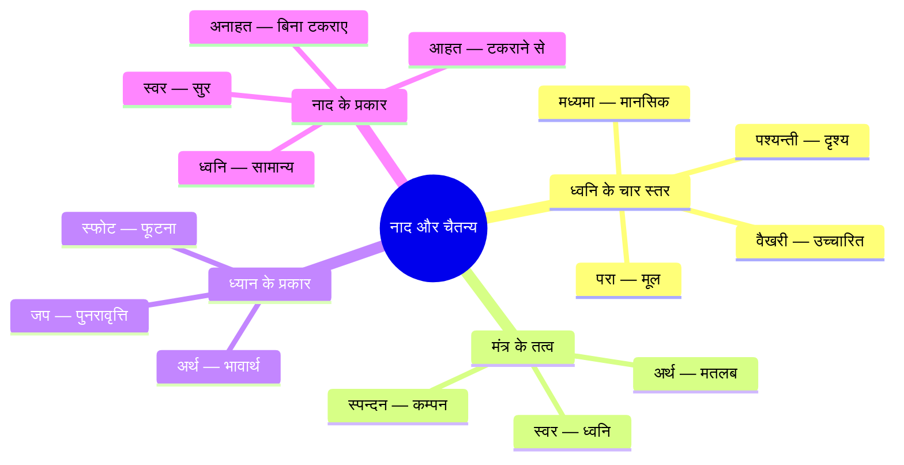
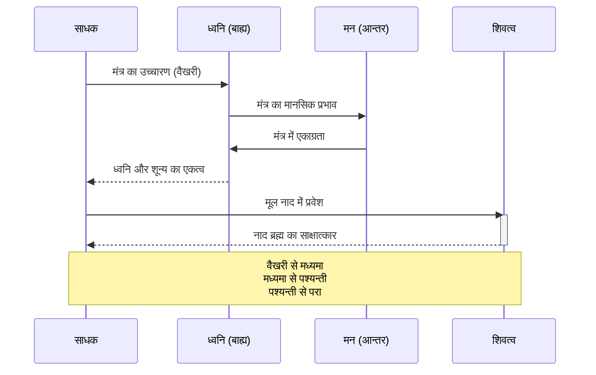

# अध्याय ८: ध्वनि और मंत्र तकनीकें — नाद ही ब्रह्म

> **पिछला अध्याय:** [अध्याय ७: दृश्य और प्रकाश ध्यान तकनीकें](./07-drishya-dhyan.md)
> **अगला अध्याय:** [अध्याय ९: स्पर्श और रस ध्यान तकनीकें](./09-sparsh-ras-dhyan.md)

> *"नाद ब्रह्म — ध्वनि ही ब्रह्म है।"* — कश्मीर शैव
> *"येन श्रुतं श्रुतं भवति — जिसे सुनकर सब सुन लिया जाता है।"* — मुण्डकोपनिषद्

ध्वनि और मंत्र विज्ञान भैरव तंत्र की सबसे गूढ़ तकनीकों में से हैं। यह अध्याय १५ से अधिक ध्वनि-आधारित ध्यान विधियों का वर्णन करता है — प्रत्यक्ष मंत्र जप से लेकर अव्यक्त ध्वनि के ध्यान तक। यहाँ ध्वनि केवल कानों का विषय नहीं, बल्कि चैतन्य का ही एक रूप है। सुनना ही ध्यान है, ध्यान ही मुक्ति है।

---

## सीखने के उद्देश्य (Learning Objectives)

- कश्मीर शैव में नाद (ध्वनि) के सैद्धांतिक आधार को समझना
- विज्ञान भैरव तंत्र की १५+ ध्वनि-आधारित ध्यान तकनीकों का अध्ययन करना
- ओंकार ध्यान, नाद ब्रह्म और अव्यक्त ध्वनि की विधियों को आत्मसात करना
- मंत्र जप और मौन ध्यान के बीच के सम्बन्ध को समझना
- TypeScript मंत्र टाइमर और अक्षर काउंटर का व्यावहारिक कार्यान्वयन करना
- ध्वनि के चार स्तरों (वैखरी, मध्यमा, पश्यन्ती, परा) की समझ विकसित करना

### अध्याय एक दृष्टि में

| विषय | मुख्य सिद्धांत | व्यावहारिक लाभ |
|-------|-------------|-------------------|
| ओंकार ध्यान | प्रणव (ॐ) की ध्वनि में समाधि | सम्पूर्ण चेतना का एकीकरण |
| नाद ब्रह्म | ध्वनि ही परम ब्रह्म है | श्रवण के माध्यम से समाधि |
| अव्यक्त ध्वनि | बिना उच्चारण की ध्वनि | मन की मूल अवस्था में प्रवेश |
| संगीत ध्यान | वीणा/संगीत के स्वरों में ध्यान | भावना के माध्यम से एकाग्रता |

```mermaid
flowchart TB
    subgraph ध्वनि_ध्यान[ध्वनि और मंत्र ध्यान — तकनीक मानचित्र]
        A[ध्वनि ध्यान] --> B[बाह्य ध्वनि]
        A --> C[आन्तर ध्वनि]
        A --> D[मंत्र आधारित]
        A --> E[मौन आधारित]
    end

    B --> B1[संगीत ध्यान — वीणा/बाँसुरी]
    B --> B2[प्रकृति ध्वनि]
    B --> B3[घण्टा/झाँझ ध्यान]
    B --> B4[सामूहिक कीर्तन]

    C --> C1[स्वर ध्यान]
    C --> C2[प्राण ध्वनि — सोऽहम्]
    C --> C3[नाद ब्रह्म]
    C --> C4[अनाहत नाद]

    D --> D1[ओंकार ध्यान]
    D --> D2[मंत्र जप — सगुण]
    D --> D3[मंत्रार्थ ध्यान]
    D --> D4[स्फोट ध्यान]

    E --> E1[अव्यक्त ध्वनि]
    E --> E2[मौन ध्यान]
    E --> E3[आकाश वाणी]
    E --> E4[सर्व ध्वनि समत्व]

    style A fill:#f9f,stroke:#333,stroke-width:2px
    style B fill:#ff9,stroke:#333
    style C fill:#9cf,stroke:#333
    style D fill:#9f9,stroke:#333
    style E fill:#f96,stroke:#333
```

---

## सिद्धांत (Theory)

### कश्मीर शैव में नाद का स्वरूप

कश्मीर शैव दर्शन में ध्वनि (नाद) को परम शिव की अभिव्यक्ति माना गया है। जब शिव अपनी स्वतन्त्र शक्ति से सृष्टि की ओर प्रवृत्त होते हैं, तो सबसे पहले जो स्पन्दन होता है — वही नाद है। यह नाद ही आगे चलकर मंत्रों, शब्दों और सम्पूर्ण जगत में प्रकट होता है।

ध्वनि के चार स्तर:
1. **वैखरी (स्थूल)** — बाहरी, उच्चारित ध्वनि, जो कानों से सुनी जा सके
2. **मध्यमा (सूक्ष्म)** — मानसिक उच्चारण, मन में कहा गया मंत्र
3. **पश्यन्ती (कारण)** — दृश्य-ध्वनि, जहाँ ध्वनि और अर्थ एक हो जाते हैं
4. **परा (मूल)** — शुद्ध चैतन्य स्पन्दन, जो सभी ध्वनियों का स्रोत है

इन चारों में ध्यान करने से साधक ध्वनि के मूल स्रोत तक पहुँचता है।

### मंत्र और चैतन्य का सम्बन्ध



कश्मीर शैव के अनुसार, मंत्र केवल शब्द नहीं है — वह चैतन्य का ही एक रूप है। मंत्र का उच्चारण करते समय जो स्पन्दन होता है, वह शरीर, मन और चैतन्य को प्रभावित करता है। इसीलिए मंत्र ध्यान केवल शब्दों की पुनरावृत्ति नहीं, बल्कि एक गहन आध्यात्मिक प्रक्रिया है।

### ध्वनि ध्यान की प्रक्रिया



---

## तकनीक १: ओंकार ध्यान — प्रणव की ध्वनि में समाधि

### मूल संस्कृत श्लोक

> **॥ प्रणवं चिन्तयेदादौ स्वरेण ब्रह्मरूपिणम् ।**
> **स्वरं स्वरे लयं कृत्वा भैरवीपदमाप्नुयात् ॥**

### पदच्छेद और अर्थ

| संस्कृत पद | हिन्दी अर्थ |
|-----------|-------------|
| प्रणवम् | प्रणव (ॐ) को |
| चिन्तयेत् | ध्यान करे |
| आदौ | पहले |
| स्वरेण | स्वर के साथ |
| ब्रह्मरूपिणम् | ब्रह्म के रूप में |
| स्वरम् | स्वर को |
| स्वरे | स्वर में ही |
| लयम् | विलीन |
| कृत्वा | करके |
| भैरवीपदम् | भैरवी के पद को |
| आप्नुयात् | प्राप्त करता है |

### हिन्दी व्याख्या

ओंकार (ॐ) को सम्पूर्ण ब्रह्माण्ड की मूल ध्वनि माना गया है। इस तकनीक में साधक ॐ का उच्चारण करता है — सबसे पहले बाहर से, फिर धीरे-धीरे मन में। ॐ के तीन अक्षर — अ, उ, म — तीनों का उच्चारण करते हुए ध्यान करना है। अन्त में, स्वर को स्वर में विलीन करना है — यानि उच्चारण को इतना सूक्ष्म कर देना कि केवल ध्वनि का भाव रह जाए, ध्वनि न रहे।

### अभ्यास की विधि
1. सुखासन में बैठें, रीढ़ सीधी रखें।
2. गहरी श्वास लें और ॐ का उच्चारण करें — 'अ' से शुरू, 'उ' में जाएँ, 'म' में समाप्त।
3. ॐ को कम से कम २१ बार उच्चारित करें।
4. फिर ॐ का मानसिक उच्चारण करें — केवल मन में।
5. क्रमशः मानसिक उच्चारण भी सूक्ष्म होता जाए — केवल ध्वनि का भाव रह जाए।
6. जब ध्वनि भी विलीन हो जाए, तो उस मौन में स्थिर हो जाएँ।

---

## तकनीक २: अव्यक्त ध्वनि — बिना उच्चारण की ध्वनि

### मूल संस्कृत श्लोक

> **॥ अव्यक्ता या भवेद्वाणी व्यक्ता या प्राणधारिणी ।**
> **तयोरेकतमं ध्यायन्भैरवीपदमाप्नुयात् ॥**

### पदच्छेद और अर्थ

| संस्कृत पद | हिन्दी अर्थ |
|-----------|-------------|
| अव्यक्ता | अव्यक्त (अप्रकट) |
| या | जो |
| भवेत् | होती है |
| वाणी | वाणी |
| व्यक्ता | व्यक्त (प्रकट) |
| या | जो |
| प्राणधारिणी | प्राण को धारण करने वाली |
| तयोः | उन दोनों में से |
| एकतमम् | किसी एक को |
| ध्यायन् | ध्यान करता हुआ |
| भैरवीपदम् | भैरवी के पद को |
| आप्नुयात् | प्राप्त करता है |

### हिन्दी व्याख्या

यह तकनीक अत्यन्त सूक्ष्म है। दो प्रकार की वाणी हैं — एक व्यक्त (जो बोली जाती है) और दूसरी अव्यक्त (जो बिना बोले मन में होती है)। इस तकनीक में साधक को इन दोनों के बीच के अन्तराल में ध्यान करना है।

जब कोई विचार मन में उठता है, तो वह पहले अव्यक्त होता है, फिर व्यक्त होता है। इन दोनों के बीच जो ठहराव है — वही ध्यान का बिन्दु है।

### अभ्यास की विधि
1. आँखें बंद करके बैठें।
2. मन में आने वाले विचारों को देखें — वे कैसे अव्यक्त से व्यक्त होते हैं।
3. जब कोई विचार आए, तो उसे बोलने से पहले पकड़ें।
4. विचार के व्यक्त होने से पहले का जो क्षण है — उसी में ठहरें।
5. धीरे-धीरे अव्यक्त और व्यक्त के बीच का अन्तर समाप्त हो जाता है।

---

## तकनीक ३: नाद ब्रह्म — ध्वनि को ब्रह्म के रूप में ध्यान

### मूल संस्कृत श्लोक

> **॥ नादं ब्रह्मेति संकल्प्य नादे चित्तं नियोजयेत् ।**
> **नादेन सह योगीन्द्रो भैरवीपदमाप्नुयात् ॥**

### हिन्दी व्याख्या

यह तकनीक अत्यन्त सरल और गहन है। किसी भी ध्वनि को सुनें — चाहे वह घड़ी की टिक-टिक हो, पक्षियों का कलरव हो, या किसी वाद्य की ध्वनि हो — और उस ध्वनि को ब्रह्म (परम चैतन्य) के रूप में देखें। ध्वनि और ब्रह्म में कोई भेद नहीं है। ध्वनि ही ब्रह्म है — नाद ब्रह्म।

### अभ्यास की विधि
1. किसी शान्त स्थान में बैठें।
2. अपने चारों ओर की ध्वनियों को सुनें — दूर की, पास की, सूक्ष्म।
3. किसी एक ध्वनि को चुनें — जैसे पंखे की ध्वनि या पक्षियों की आवाज़।
4. उस ध्वनि को ब्रह्म के रूप में सुनें — उसमें दिव्यता का अनुभव करें।
5. ध्वनि में ही विलीन हो जाएँ — सुनने वाला और ध्वनि एक हो जाएँ।

---

## तकनीक ४: वीणा/संगीत ध्यान — वाद्य की ध्वनि में समाधि

### मूल संस्कृत श्लोक

> **॥ वीणायां तन्त्रिणां नादं सूक्ष्मं श्रुत्वा विचिन्तयेत् ।**
> **नादेन सह तल्लीनो भैरवीपदमाप्नुयात् ॥**

### हिन्दी व्याख्या

वीणा या किसी भी वाद्य के तारों से निकलने वाली ध्वनि पर ध्यान केन्द्रित करें। तार की ध्वनि क्षणिक है — वह उठती है, बढ़ती है, और विलीन हो जाती है। इस उत्पत्ति-स्थिति-विलय को देखना ही ध्यान है। जैसे ही ध्वनि विलीन होती है, उस शून्य को पकड़ें।

### अभ्यास की विधि
1. कोई मधुर वाद्य चुनें — वीणा, सितार, बाँसुरी, या हारमोनियम।
2. एक स्वर पर ध्यान केन्द्रित करें।
3. स्वर की उत्पत्ति, उसके बढ़ने और विलीन होने को सुनें।
4. जब स्वर समाप्त हो, तो उसके बाद के मौन को पकड़ें।
5. अगले स्वर की प्रतीक्षा किए बिना, मौन में ही स्थिर रहें।

---

## तकनीक ५: मंत्र जप — सगुण मंत्र ध्यान

### मूल संस्कृत श्लोक

> **॥ मन्त्रं जपेन्मनः शुद्ध्यै मन्त्रार्थं परिचिन्तयेत् ।**
> **मन्त्रेण सह योगीन्द्रो भैरवीपदमाप्नुयात् ॥**

### हिन्दी व्याख्या

मंत्र शुद्ध उच्चारण ही नहीं, बल्कि उसके अर्थ का चिन्तन भी आवश्यक है। इस तकनीक में मंत्र के प्रत्येक अक्षर का उच्चारण पूरी जागरूकता के साथ किया जाता है। "सो ऽहम्" या "शिवाय" जैसे किसी भी मंत्र का जप किया जा सकता है।

### अभ्यास की विधि
1. कोई मंत्र चुनें — "ॐ नमः शिवाय" या "सो ऽहम्"।
2. मंत्र का धीरे-धीरे उच्चारण करें — प्रत्येक अक्षर पर ध्यान दें।
3. मंत्र के अर्थ पर ध्यान दें — "सो ऽहम्" का अर्थ — "वह मैं हूँ"।
4. अर्थ और ध्वनि का एकीकरण करें।
5. क्रमशः उच्चारण को मानसिक करें, फिर केवल भाव रह जाए।

---

## तकनीक ६: मौन ध्यान — मौन में सुनना

> **॥ मौनेन चिन्तयेद्व्याप्तं सर्वं शिवमयं जगत् ।**
> **मौनमेव समालोक्य भैरवीपदमाप्नुयात् ॥**

मौन केवल बोलने से विरति नहीं है — मौन एक सकारात्मक अवस्था है। इस तकनीक में, साधक पूर्ण मौन में बैठता है और भीतर की ध्वनियों को सुनता है — हृदय की धड़कन, श्वास की ध्वनि, रक्त का प्रवाह। इन सबको सुनते-सुनते, साधक उस मूल मौन में पहुँच जाता है जो सभी ध्वनियों का स्रोत है।

---

## तकनीक ७: प्राण ध्वनि — सोऽहम् ध्यान

### मूल संस्कृत श्लोक

> **॥ प्राणे स्वरं समालोक्य सोऽहमित्यनुचिन्तयेत् ।**
> **प्राणेन सह योगीन्द्रो भैरवीपदमाप्नुयात् ॥**

### हिन्दी व्याख्या

यह तकनीक श्वास और मंत्र का समन्वय है। जब श्वास अंदर जाता है, तो उसके साथ "सो" का भाव रखें; जब बाहर जाता है, तो "हम्" का। इस प्रकार श्वास के साथ स्वतः मंत्र जप होता रहता है — बिना किसी प्रयास के। यह अजपा गायत्री है — बिना जपे हुआ जप।

### अभ्यास की विधि
1. श्वास को स्वाभाविक रूप से चलने दें।
2. श्वास के अंदर जाने के साथ मानसिक रूप से "सो" का भाव करें।
3. श्वास के बाहर जाने के साथ "हम्" का भाव करें।
4. धीरे-धीरे श्वास और मंत्र एक हो जाएँ।
5. फिर केवल श्वास रह जाए — मंत्र भी विलीन हो जाए।

---

## तकनीक ८: अनाहत नाद — बिना टकराहट की ध्वनि

### मूल संस्कृत श्लोक

> **॥ अनाहतं नादमथो शृणुयात्प्रयतो यदि ।**
> **नादेन सह तल्लीनो भैरवीपदमाप्नुयात् ॥**

### हिन्दी व्याख्या

यह सबसे सूक्ष्म ध्वनि तकनीकों में से एक है। अनाहत नाद वह ध्वनि है जो बिना किसी टकराहट के उत्पन्न होती है — यह हृदय के सूक्ष्म केन्द्र से आती है। इसे सुनने के लिए कानों को बंद करके भीतर की ध्वनियों पर ध्यान देना होता है। धीरे-धीरे एक सूक्ष्म गुंजन (humming) सुनाई देती है — यही अनाहत नाद है।

### अभ्यास की विधि
1. किसी शान्त स्थान में बैठें, दोनों कान बंद करें।
2. भीतर की ध्वनियों को सुनें — एक सूक्ष्म गुंजन, सीटी, या घंटी जैसी ध्वनि।
3. उस ध्वनि पर ध्यान केन्द्रित करें — वह कभी तेज, कभी धीमी होती है।
4. उस ध्वनि में ही विलीन हो जाएँ।
5. जब ध्वनि भी विलीन हो जाए, तो उस शून्य में स्थिर हों।

---

## तकनीक ९: स्वर ध्यान — स्वर के उतार-चढ़ाव में ध्यान

> **॥ स्वरमार्गं समालोक्य सप्तस्वरविभूषितम् ।**
> **स्वरैः सह लयीभूतो भैरवीपदमाप्नुयात् ॥**

सप्त स्वरों (सा, रे, ग, म, प, ध, नि) में से किसी एक स्वर पर ध्यान केन्द्रित करें। उस स्वर के उतार-चढ़ाव, उसके कम्पन को महसूस करें। स्वर ही सम्पूर्ण ब्रह्माण्ड में व्याप्त है — यह अनुभव करें।

---

## तकनीक १०: ओंकार लय — ॐ का क्रमिक विलय

> **॥ अकारे च लयं कृत्वा उकारे च विचिन्तयेत् ।**
> **मकारं च लयं नीत्वा भैरवीपदमाप्नुयात् ॥**

ॐ के तीन अक्षरों को अलग-अलग करके ध्यान करें। पहले 'अ' पर ध्यान करें — यह सृष्टि का प्रतीक है। फिर 'अ' को 'उ' में विलीन करें — यह स्थिति का प्रतीक है। फिर 'उ' को 'म' में विलीन करें — यह संहार का प्रतीक है। और अन्त में 'म' को भी विलीन कर दें — बचा केवल मौन, केवल शिव।

---

## तकनीक ११: मंत्रार्थ ध्यान — मंत्र के अर्थ में ध्यान

> **॥ मन्त्रार्थं च समालोक्य सूक्ष्मं भावं विचिन्तयेत् ।**
> **भावेन सह योगीन्द्रो भैरवीपदमाप्नुयात् ॥**

मंत्र के शाब्दिक अर्थ पर ध्यान केन्द्रित करें। "शिवाय" का अर्थ है — कल्याण के लिए। "नमः" का अर्थ है — समर्पण। इन अर्थों को हृदय में बसाएँ। शब्द नहीं, भाव ही ध्यान है।

---

## तकनीक १२: स्फोट ध्यान — ध्वनि के फूटने का ध्यान

> **॥ स्फोटरूपं समालोक्य ध्वनेरुत्पत्तिकारणम् ।**
> **तत्र चित्तं समाधाय भैरवीपदमाप्नुयात् ॥**

जब हम कोई शब्द बोलते हैं, तो ध्वनि कहीं से फूटती है — कंठ से, मुख से। उस फूटने के क्षण को पकड़ें। ध्वनि कहाँ से आ रही है? कैसे उत्पन्न हो रही है? उस स्रोत पर ध्यान केन्द्रित करें।

---

## तकनीक १३: आकाश वाणी — आकाश से आने वाली ध्वनि

> **॥ आकाशादागतं नादं शृणुयादतिनिर्मलम् ।**
> **नादेन सह तल्लीनो भैरवीपदमाप्नुयात् ॥**

आकाश से आने वाली ध्वनि की कल्पना करें — जैसे कोई दिव्य ध्वनि सर्वत्र से आ रही हो। वह न कोई शब्द है, न कोई भाषा — बस एक शुद्ध, निर्मल ध्वनि है, जो आकाश से आ रही है। इस ध्वनि में सुनना ही ध्यान है।

---

## तकनीक १४: सर्व ध्वनि समत्व — सभी ध्वनियों में समता

> **॥ सर्वशब्देषु चैकत्वं चिन्तयेत्परमेश्वरि ।**
> **शब्दजालं समालोक्य भैरवीपदमाप्नुयात् ॥**

सभी ध्वनियों को एक ही रूप में सुनें — चाहे वह सुखद हो या अप्रिय। पक्षियों का कलरव, गाड़ी का शोर, हवा की सरसराहट — सबमें एक ही नाद सुनाई देता है — नाद ब्रह्म। सभी ध्वनियों में समता का भाव ही इस तकनीक का सार है।

---

## तकनीक १५: शब्द ब्रह्म — शब्द को ब्रह्म के रूप में

> **॥ शब्दब्रह्म समालोक्य निःशब्दं परिचिन्तयेत् ।**
> **शब्देन सह योगीन्द्रो भैरवीपदमाप्नुयात् ॥**

हर शब्द ब्रह्म का ही एक रूप है। जब हम कोई शब्द बोलते या सुनते हैं, तो उसमें ब्रह्म की उपस्थिति को देखें। अन्ततः शब्द भी मौन में विलीन हो जाता है — वही निःशब्द ब्रह्म है।

---

## ध्वनि ध्यान का स्पेक्ट्रम

```mermaid
flowchart LR
    subgraph स्पेक्ट्रम[ध्वनि ध्यान का पूर्ण स्पेक्ट्रम]
        A[वैखरी<br/>बाहर उच्चारण] -->|सूक्ष्म| B[मध्यमा<br/>मानसिक जप]
        B -->|सूक्ष्म| C[पश्यन्ती<br/>दृश्य-ध्वनि]
        C -->|सूक्ष्म| D[परा<br/>मूल चैतन्य]
    end

    A1[मंत्र जप] --> A
    A2[सामूहिक कीर्तन] --> A

    B1[ओंकार मानसिक] --> B
    B2[सोऽहम् श्वास] --> B

    C1[अनाहत नाद] --> C
    C2[नाद ब्रह्म] --> C

    D1[अव्यक्त ध्वनि] --> D
    D2[मौन ध्यान] --> D
    D3[स्फोट ध्यान] --> D

    style A fill:#ff9,stroke:#333
    style B fill:#9cf,stroke:#333
    style C fill:#9f9,stroke:#333
    style D fill:#f9f,stroke:#333
```

---

## TypeScript कार्यान्वयन: मंत्र ध्यान टाइमर

```typescript
/**
 * विज्ञान भैरव तंत्र — मंत्र ध्यान टाइमर
 * यह मॉड्यूल मंत्र जप, ओंकार और नाद ध्यान के लिए
 * गाइडेड टाइमर और अक्षर काउंटर प्रदान करता है।
 * आवश्यकता: Node.js 18+, TypeScript 5+
 */

// ============================================================
// मूल प्रकार
// ============================================================

type MantraType = 'om' | 'so-ham' | 'shiva' | 'nama-shivaya' | 'custom';

interface MantraSyllable {
  text: string;
  durationMs: number;
  tone?: 'high' | 'medium' | 'low';
  pauseAfter?: number;
}

interface Mantra {
  id: string;
  name: string;
  sanskrit: string;
  meaning: string;
  syllables: MantraSyllable[];
  totalDurationMs: number;
  shlokaRef?: string;
}

interface ChantingSession {
  id: string;
  mantra: Mantra;
  techniqueName: string;
  techniqueShloka: string;
  totalRounds: number;
  currentRound: number;
  level: 'vaikhari' | 'madhyama' | 'pashyanti' | 'para';
}

interface ChantingStats {
  sessionsCompleted: number;
  totalRounds: number;
  totalChants: number;
  currentStreak: number;
  averageFocus: number;
  levelProgress: Record<string, number>;
}

// ============================================================
// मंत्र परिभाषाएँ
// ============================================================

const OM_MANTRA: Mantra = {
  id: 'om-pranava',
  name: 'ॐ प्रणव',
  sanskrit: 'ॐ',
  meaning: 'ब्रह्माण्ड की मूल ध्वनि — परम चैतन्य',
  shlokaRef: 'प्रणवं चिन्तयेदादौ स्वरेण ब्रह्मरूपिणम्',
  syllables: [
    { text: 'अ', durationMs: 3000, tone: 'low', pauseAfter: 500 },
    { text: 'उ', durationMs: 3000, tone: 'medium', pauseAfter: 500 },
    { text: 'म्', durationMs: 5000, tone: 'high', pauseAfter: 2000 },
  ],
  totalDurationMs: 14000,
};

const SOHAM_MANTRA: Mantra = {
  id: 'so-ham-ajapa',
  name: 'सो ऽहम् (अजपा)',
  sanskrit: 'सो ऽहम्',
  meaning: 'वह मैं हूँ — शिव और मैं एक हैं',
  shlokaRef: 'प्राणे स्वरं समालोक्य सोहमित्यनुचिन्तयेत्',
  syllables: [
    { text: 'सो', durationMs: 4000, tone: 'medium', pauseAfter: 1000 },
    { text: 'हम्', durationMs: 4000, tone: 'high', pauseAfter: 1000 },
  ],
  totalDurationMs: 10000,
};

const SHIVAYA_MANTRA: Mantra = {
  id: 'shivaya-panchakshari',
  name: 'ॐ नमः शिवाय',
  sanskrit: 'ॐ नमः शिवाय',
  meaning: 'शिव को प्रणाम — समर्पण का मंत्र',
  syllables: [
    { text: 'ॐ', durationMs: 3000, tone: 'high', pauseAfter: 1000 },
    { text: 'न', durationMs: 1500, tone: 'medium' },
    { text: 'मः', durationMs: 1500, tone: 'medium', pauseAfter: 500 },
    { text: 'शि', durationMs: 1500, tone: 'medium' },
    { text: 'वा', durationMs: 2500, tone: 'high', pauseAfter: 1000 },
    { text: 'य', durationMs: 2000, tone: 'medium', pauseAfter: 2000 },
  ],
  totalDurationMs: 14000,
};

// ============================================================
// मंत्र ध्यान इंजन
// ============================================================

class MantraMeditationTimer {
  private currentSession: ChantingSession | null = null;
  private isRunning: boolean = false;
  private currentSyllableIndex: number = 0;
  private startedAt: Date | null = null;
  private timerHandle: ReturnType<typeof setTimeout> | null = null;
  private completedChants: number = 0;
  private stats: ChantingStats;

  constructor() {
    this.stats = {
      sessionsCompleted: 0,
      totalRounds: 0,
      totalChants: 0,
      currentStreak: 0,
      averageFocus: 0,
      levelProgress: { vaikhari: 0, madhyama: 0, pashyanti: 0, para: 0 },
    };
    console.log('🧘 विज्ञान भैरव तंत्र — मंत्र ध्यान टाइमर');
    console.log('=' .repeat(50));
  }

  /** मंत्र सत्र प्रारम्भ करें */
  startMantraSession(
    mantra: Mantra,
    totalRounds: number,
    level: ChantingSession['level'] = 'vaikhari'
  ): void {
    if (this.isRunning) {
      console.warn('⚠️ सत्र पहले से चल रहा है।');
      return;
    }

    const shlokaRef = mantra.shlokaRef || '';

    this.currentSession = {
      id: `mantra-${mantra.id}-${Date.now()}`,
      mantra,
      techniqueName: mantra.name,
      techniqueShloka: shlokaRef,
      totalRounds,
      currentRound: 0,
      level,
    };

    this.isRunning = true;
    this.currentSyllableIndex = 0;
    this.completedChants = 0;
    this.startedAt = new Date();

    console.log(`\n📿 मंत्र: ${mantra.sanskrit} — ${mantra.name}`);
    console.log(`📖 अर्थ: ${mantra.meaning}`);
    if (shlokaRef) console.log(`📜 श्लोक: ${shlokaRef}`);
    console.log(`🎯 स्तर: ${this.getLevelText(level)}`);
    console.log(`🔄 कुल राउंड: ${totalRounds}`);
    console.log(`⏱ प्रति मंत्र: ${this.formatDuration(mantra.totalDurationMs)}`);
    console.log(`⏱ कुल समय: ${this.formatDuration(mantra.totalDurationMs * totalRounds)}`);
    console.log('-'.repeat(50));

    this.chantNext();
  }

  /** अगला अक्षर बोलें */
  private chantNext(): void {
    if (!this.currentSession || !this.isRunning) return;

    const session = this.currentSession;
    const syllable = session.mantra.syllables[this.currentSyllableIndex];

    // Tone indicator
    const toneEmoji: Record<string, string> = { 'high': '🔺', 'medium': '➡️', 'low': '🔻' };

    // Level-based output
    switch (session.level) {
      case 'vaikhari':
        console.log(`   ${toneEmoji[syllable.tone || 'medium']} ${syllable.text} (${this.formatDuration(syllable.durationMs)})`);
        break;
      case 'madhyama':
        console.log(`   🧠 ${syllable.text} (मानसिक)`);
        break;
      case 'pashyanti':
        console.log(`   👁️ ${syllable.text} (दृश्य-ध्वनि)`);
        break;
      case 'para':
        if (this.currentSyllableIndex === 0) console.log(`   💫 केवल भाव — शुद्ध चैतन्य में`);
        break;
    }

    // Syllable chanting duration
    this.timerHandle = setTimeout(() => {
      this.advanceSyllable();
    }, syllable.durationMs + (syllable.pauseAfter || 0));
  }

  /** अगले अक्षर पर बढ़ें */
  private advanceSyllable(): void {
    if (!this.currentSession) return;

    this.currentSyllableIndex++;

    if (this.currentSyllableIndex >= this.currentSession.mantra.syllables.length) {
      this.completeRound();
      return;
    }

    this.chantNext();
  }

  /** एक राउंड पूरा */
  private completeRound(): void {
    if (!this.currentSession) return;

    this.completedChants++;
    this.currentSession.currentRound++;

    if (this.currentSession.currentRound % 11 === 0) {
      console.log(`\n   🔄 ${this.currentSession.currentRound} राउंड पूरे — ${this.completedChants} मंत्र`);
    }

    if (this.currentSession.currentRound >= this.currentSession.totalRounds) {
      this.completeSession();
      return;
    }

    // Next round
    this.currentSyllableIndex = 0;
    this.chantNext();
  }

  /** सत्र पूर्ण */
  private completeSession(): void {
    if (!this.currentSession || !this.startedAt) return;

    this.isRunning = false;
    const duration = Date.now() - this.startedAt.getTime();

    // Update stats
    this.stats.sessionsCompleted++;
    this.stats.totalRounds += this.currentSession.totalRounds;
    this.stats.totalChants += this.completedChants;
    this.stats.levelProgress[this.currentSession.level]++;

    console.log('\n' + '='.repeat(50));
    console.log('✨ मंत्र सत्र पूर्ण! ✨');
    console.log(`📿 मंत्र: ${this.currentSession.mantra.sanskrit}`);
    console.log(`🔄 कुल मंत्र: ${this.completedChants}`);
    console.log(`🎯 स्तर: ${this.getLevelText(this.currentSession.level)}`);
    console.log(`⏱ समय: ${this.formatDuration(duration)}`);
    console.log('='.repeat(50));

    this.currentSession = null;
    this.timerHandle = null;
  }

  /** सत्र रोकें */
  pauseSession(): void {
    if (!this.isRunning) return;
    this.isRunning = false;
    if (this.timerHandle) { clearTimeout(this.timerHandle); this.timerHandle = null; }
    console.log('⏸️ मंत्र सत्र रोका गया।');
  }

  /** स्तर का पाठ */
  private getLevelText(level: string): string {
    const m: Record<string, string> = {
      'vaikhari': 'वैखरी — बाह्य उच्चारण',
      'madhyama': 'मध्यमा — मानसिक जप',
      'pashyanti': 'पश्यन्ती — दृश्य-ध्वनि',
      'para': 'परा — मूल चैतन्य',
    };
    return m[level] || level;
  }

  /** समय फॉर्मेट */
  private formatDuration(ms: number): string {
    const totalSeconds = Math.floor(ms / 1000);
    const minutes = Math.floor(totalSeconds / 60);
    const seconds = totalSeconds % 60;
    return `${minutes}:${seconds.toString().padStart(2, '0')}`;
  }

  /** सांख्यिकी दिखाएँ */
  showStats(): void {
    console.log('\n📊 मंत्र साधना सांख्यिकी:');
    console.log(`   📿 कुल सत्र: ${this.stats.sessionsCompleted}`);
    console.log(`   🔄 कुल राउंड: ${this.stats.totalRounds}`);
    console.log(`   🕉️ कुल मंत्र: ${this.stats.totalChants}`);
    console.log(`   📈 स्तर प्रगति:`);
    Object.entries(this.stats.levelProgress).forEach(([level, count]) => {
      if (count > 0) console.log(`      ${this.getLevelText(level)}: ${count} सत्र`);
    });
  }
}

// ============================================================
// मंत्र अनुशंसा प्रणाली
// ============================================================

class MantraRecommender {
  private mantras: Mantra[];

  constructor() {
    this.mantras = [OM_MANTRA, SOHAM_MANTRA, SHIVAYA_MANTRA];
  }

  /** स्तर के अनुसार मंत्र सुझाएँ */
  recommendForLevel(level: string): Mantra {
    switch (level) {
      case 'vaikhari': return SOHAM_MANTRA;
      case 'madhyama': return OM_MANTRA;
      case 'pashyanti': return SHIVAYA_MANTRA;
      case 'para': return OM_MANTRA;
      default: return OM_MANTRA;
    }
  }

  /** समय के अनुसार मंत्र सुझाएँ */
  recommendForDuration(availableMinutes: number): { mantra: Mantra; rounds: number } {
    for (const mantra of this.mantras) {
      const rounds = Math.floor((availableMinutes * 60000) / mantra.totalDurationMs);
      if (rounds >= 11) return { mantra, rounds };
    }
    return { mantra: SOHAM_MANTRA, rounds: 11 };
  }
}

// ============================================================
// प्रयोग उदाहरण
// ============================================================

function main(): void {
  console.log('🧘 विज्ञान भैरव तंत्र — मंत्र ध्यान प्रणाली');
  console.log('='.repeat(50));

  const timer = new MantraMeditationTimer();

  // मंत्र विवरण
  console.log('\n📿 उपलब्ध मंत्र:');
  [OM_MANTRA, SOHAM_MANTRA, SHIVAYA_MANTRA].forEach(m => {
    console.log(`   🕉️ ${m.sanskrit} — ${m.name}`);
    console.log(`      अर्थ: ${m.meaning}`);
    console.log(`      अक्षर: ${m.syllables.length}, अवधि: ${timer['formatDuration'](m.totalDurationMs)}`);
  });

  // ॐ मंत्र की जानकारी
  console.log(`\n📿 ॐ मंत्र — अक्षर विवरण:`);
  OM_MANTRA.syllables.forEach(s => {
    console.log(`   • '${s.text}' — ${(s.durationMs / 1000).toFixed(1)} सेकंड${s.pauseAfter ? `, विश्राम: ${s.pauseAfter}ms` : ''}`);
  });

  // स्तरों की व्याख्या
  console.log('\n🎯 ध्वनि के चार स्तर:');
  console.log('   वैखरी → मध्यमा → पश्यन्ती → परा');
  console.log('   (बाह्य → मानसिक → दृश्य → मूल चैतन्य)');

  // अनुशंसा
  const recommender = new MantraRecommender();
  const rec = recommender.recommendForDuration(21);
  console.log(`\n💡 २१ मिनट के लिए सुझाव:`);
  console.log(`   मंत्र: ${rec.mantra.sanskrit} (${rec.mantra.name})`);
  console.log(`   राउंड: ${rec.rounds} (प्रति मंत्र ${timer['formatDuration'](rec.mantra.totalDurationMs)})`);

  console.log('\n✅ मंत्र प्रणाली तैयार।');
  console.log('💡 timer.startMantraSession(mantra, rounds, level) से सत्र प्रारम्भ करें।');
}

if (require.main === module) main();

export {
  MantraMeditationTimer,
  MantraRecommender,
  Mantra,
  MantraSyllable,
  ChantingSession,
  ChantingStats,
  OM_MANTRA,
  SOHAM_MANTRA,
  SHIVAYA_MANTRA,
};
```

---

## तकनीक तुलनात्मक तालिका

| तकनीक | ध्वनि प्रकार | कठिनाई | स्तर | आदर्श समय |
|-------|-------------|--------|------|-----------|
| ओंकार ध्यान | प्रणव (ॐ) | प्रारम्भिक | वैखरी→परा | ११-३१ मिनट |
| अव्यक्त ध्वनि | विचार पूर्व | उन्नत | पश्यन्ती | १५-२१ मिनट |
| नाद ब्रह्म | सभी ध्वनियाँ | प्रारम्भिक | वैखरी | १०-२० मिनट |
| संगीत ध्यान | वाद्य स्वर | मध्यम | मध्यमा | ११-३१ मिनट |
| मंत्र जप | मंत्राक्षर | प्रारम्भिक | वैखरी | २१-१०८ मिनट |
| मौन ध्यान | ध्वनि रहित | उन्नत | परा | २०-३१ मिनट |
| प्राण ध्वनि | सोऽहम् | मध्यम | मध्यमा | ११-२१ मिनट |
| अनाहत नाद | हृदय गुंजन | उन्नत | पश्यन्ती | २०-३१ मिनट |

---

## सारांश (Summary)

- **नाद ब्रह्म** — ध्वनि ही परम ब्रह्म है। कश्मीर शैव ध्वनि को चैतन्य का प्रत्यक्ष रूप मानता है।
- **ओंकार ध्यान** में ॐ के तीन अक्षरों (अ, उ, म) का उच्चारण और क्रमिक विलय किया जाता है।
- **अव्यक्त ध्वनि** तकनीक में बिना उच्चारण की वाणी (विचार पूर्व अवस्था) पर ध्यान किया जाता है।
- **नाद ब्रह्म** में किसी भी ध्वनि को ब्रह्म के रूप में सुनना सिखाया जाता है।
- **प्राण ध्वनि (सोऽहम्)** में श्वास के साथ मंत्र का स्वतः जप होता है — यह अजपा गायत्री है।
- **अनाहत नाद** बिना टकराहट की ध्वनि है, जो हृदय के सूक्ष्म केन्द्र से आती है।
- **मंत्र जप** के चार स्तर हैं — वैखरी (बाह्य), मध्यमा (मानसिक), पश्यन्ती (दृश्य), परा (मूल)।
- **मौन ध्यान** उच्चतम स्तर है — जहाँ सभी ध्वनियाँ विलीन हो जाती हैं और केवल शुद्ध चैतन्य रहता है।
- TypeScript मंत्र टाइमर विभिन्न मंत्रों और स्तरों के लिए गाइडेड सत्र प्रदान करता है।

---

## अध्याय प्रश्नोत्तरी (Chapter Quiz)

### प्रश्न १
**ॐ के तीन अक्षर कौन-से हैं?**
क) अ, आ, म
ख) अ, उ, म
ग) अ, इ, उ
घ) क, ख, ग

### प्रश्न २
**ध्वनि के चार स्तर कौन-से हैं (सही क्रम में)?**
क) परा, पश्यन्ती, मध्यमा, वैखरी
ख) वैखरी, मध्यमा, पश्यन्ती, परा
ग) मध्यमा, वैखरी, परा, पश्यन्ती
घ) पश्यन्ती, परा, वैखरी, मध्यमा

### प्रश्न ३
**"सो ऽहम्" मंत्र का क्या अर्थ है?**
क) मैं शिव हूँ
ख) वह मैं हूँ — शिव और मैं एक हैं
ग) मैं ब्रह्म हूँ
घ) वह शिव है

### प्रश्न ४
**अनाहत नाद क्या है?**
क) बाँसुरी की ध्वनि
ख) बिना टकराहट के उत्पन्न होने वाली सूक्ष्म ध्वनि
ग) मंत्रों का जप
घ) तालियों की ध्वनि

### प्रश्न ५
**अव्यक्त ध्वनि तकनीक में ध्यान का विषय क्या है?**
क) बोली गई वाणी
ख) बिना बोले मन में आने वाली वाणी — विचार पूर्व अवस्था
ग) संगीत की ध्वनि
घ) प्रकृति की ध्वनि

### प्रश्न ६
**नाद ब्रह्म तकनीक में क्या किया जाता है?**
क) केवल ॐ का जप
ख) किसी भी ध्वनि को ब्रह्म के रूप में सुनना
ग) मौन धारण करना
घ) संगीत सुनना

### प्रश्न ७
**स्फोट ध्यान में किस क्षण को पकड़ने का प्रयास किया जाता है?**
क) ध्वनि के समाप्त होने का क्षण
ख) ध्वनि के फूटने (उत्पन्न होने) का क्षण
ग) ध्वनि के बीच का क्षण
घ) मौन का क्षण

### प्रश्न ८
**वैखरी स्तर पर मंत्र जप कैसे किया जाता है?**
क) केवल मन में
ख) बाहरी उच्चारण द्वारा
ग) केवल होंठ हिलाकर
घ) बिना किसी क्रिया के

### प्रश्न ९
**प्राण ध्वनि में श्वास के साथ किस मंत्र का जप होता है?**
क) ॐ नमः शिवाय
ख) शिवाय नमः
ग) सो ऽहम् — हंसः
घ) ॐ

### प्रश्न १०
**सर्व ध्वनि समत्व तकनीक का मुख्य सिद्धांत क्या है?**
क) केवल मधुर ध्वनियाँ सुनना
ख) सभी ध्वनियों को एक ही नाद ब्रह्म के रूप में सुनना
ग) ध्वनियों से बचना
घ) केवल मौन में रहना

### उत्तर कुंजी
| प्रश्न | उत्तर | स्पष्टीकरण |
|-------|--------|------------|
| १ | ख | ॐ = अ + उ + म |
| २ | ख | वैखरी → मध्यमा → पश्यन्ती → परा (बाह्य से मूल तक) |
| ३ | ख | सः = वह (शिव), अहम् = मैं — वह मैं हूँ |
| ४ | ख | बिना टकराहट के उत्पन्न सूक्ष्म ध्वनि |
| ५ | ख | विचार पूर्व अव्यक्त अवस्था पर ध्यान |
| ६ | ख | किसी भी ध्वनि को ब्रह्म के रूप में सुनना |
| ७ | ख | ध्वनि के उत्पन्न होने (फूटने) के क्षण को पकड़ना |
| ८ | ख | वैखरी में बाहरी उच्चारण द्वारा मंत्र जप |
| ९ | ग | श्वास अंदर — सो, बाहर — हम् (सो ऽहम् — हंसः) |
| १० | ख | सभी ध्वनियों को एक नाद ब्रह्म के रूप में सुनना |

---

## अभ्यास (Exercises)

### अभ्यास १: १०८ बार ॐ का जप
एक सप्ताह तक प्रतिदिन १०८ बार ॐ का उच्चारण करें। प्रथम ३६ बार वैखरी (बाह्य), अगले ३६ बार मध्यमा (मानसिक), अन्तिम ३६ बार केवल भाव से। डायरी में प्रतिदिन का अनुभव लिखें।

### अभ्यास २: सोऽहम् — २१ मिनट श्वास मंत्र
प्रतिदिन २१ मिनट सोऽहम् मंत्र का श्वास के साथ अभ्यास करें। श्वास अंदर — सो, श्वास बाहर — हम्। ७ दिनों के बाद लिखें — क्या श्वास और मंत्र एक हो गए?

### अभ्यास ३: अनाहत नाद — ११ मिनट
प्रतिदिन ११ मिनट अनाहत नाद सुनने का प्रयास करें। कान बंद करके भीतर की ध्वनि पर ध्यान दें। क्या आपको कोई सूक्ष्म गुंजन सुनाई देता है? उसकी पिच क्या है?

### अभ्यास ४: नाद ब्रह्म — पूरे दिन का प्रयोग
एक पूरे दिन — जागने से सोने तक — हर ध्वनि को नाद ब्रह्म के रूप में सुनने का अभ्यास करें। चाहे वह गाड़ी का शोर हो, पक्षियों का कलरव हो, या किसी का बोलना — सबमें एक ही ध्वनि सुनें।

### अभ्यास ५: TypeScript मंत्र टाइमर विस्तार
दिए गए TypeScript कोड में एक नया मंत्र जोड़ें — **गायत्री मंत्र**। इसके २४ अक्षरों के लिए उचित syllable definitions, उच्चारण काल और tone बनाएँ। प्रति अक्षर २ सेकंड का समय रखें।

### अभ्यास ६: चारों स्तरों पर एक मंत्र
एक ही मंत्र (ॐ) को चारों स्तरों पर ११-११ बार करें — वैखरी, मध्यमा, पश्यन्ती, परा। प्रत्येक स्तर के अनुभव को लिखें। किस स्तर पर मन सबसे अधिक शान्त हुआ?

### अभ्यास ७ (चुनौती): महामंत्र सत्र — ११०८ बार
एक बार ११०८ बार किसी एक मंत्र (ॐ या सो ऽहम्) का जप करें। पहले ३७० बार वैखरी, ३७० बार मध्यमा, ३७० बार पश्यन्ती और ३७ बार परा स्तर पर। यह सत्र लगभग ३-४ घंटे का होगा और अत्यन्त गहन है।

---

> **अगले अध्याय में:** स्पर्श और रस ध्यान तकनीकें — मैथुन, आनन्द, और शरीर की समस्त इन्द्रियों के माध्यम से ध्यान।
