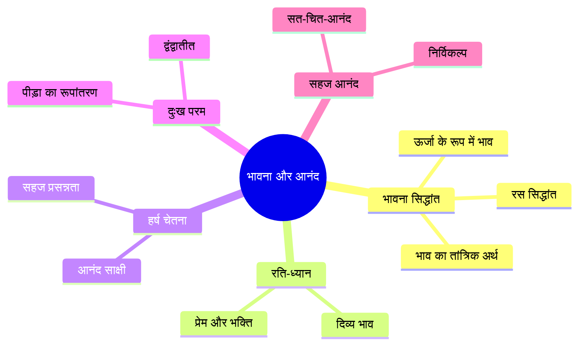
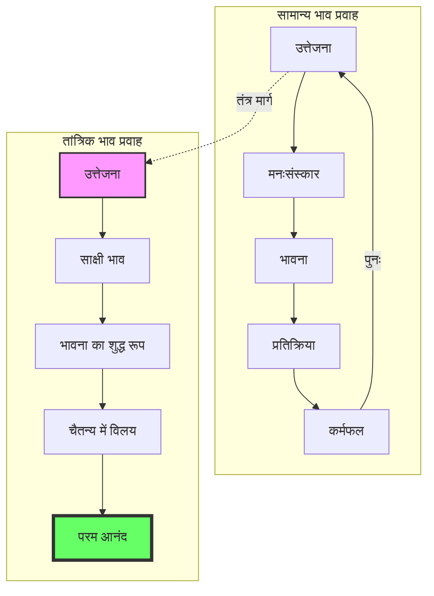
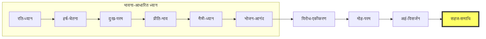
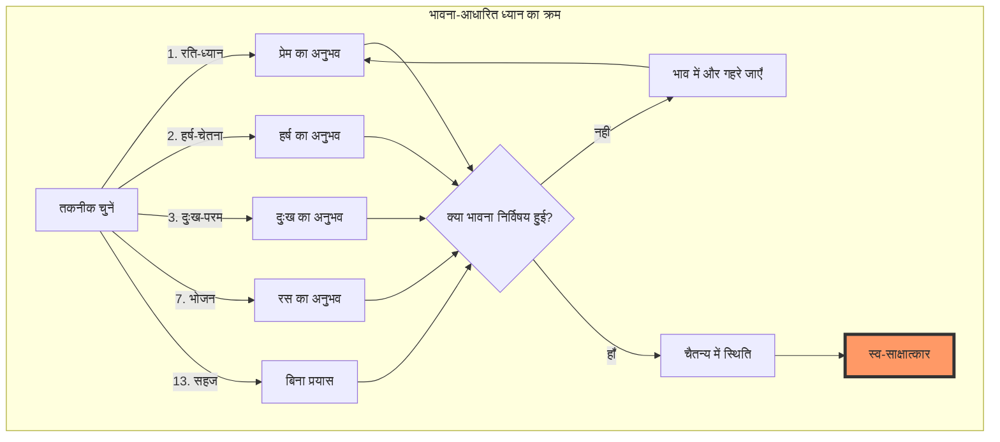

# अध्याय ९: भावना और आनंद तकनीकें

> **पूर्वापेक्षा:** अध्याय ८ — श्वास और प्राण तकनीकें
> **अगला:** अध्याय १० — चेतना की अवस्थाएँ

इस अध्याय में हम विज्ञान भैरव तंत्र की उन ध्यान तकनीकों का अध्ययन करेंगे जो भावना (emotion) और आनंद (bliss) के माध्यम से चेतना के उच्चतम स्तरों तक ले जाती हैं। भावनाएँ केवल मनोवैज्ञानिक अवस्थाएँ नहीं हैं — ये ऊर्जा के प्रवाह हैं जो चैतन्य के द्वार खोल सकते हैं। यह अध्याय आपको १५ से अधिक भावना-आधारित ध्यान तकनीकों से परिचित कराएगा जो प्रेम, हर्ष, करुणा, और सहज आनंद को चेतना के साधन में बदल देती हैं।

---

## सीखने के उद्देश्य



इस अध्याय को पूरा करने के बाद आप:

- भावना और आनंद के तांत्रिक दृष्टिकोण को समझेंगे
- १५ से अधिक भावना-आधारित ध्यान तकनीकों को जानेंगे
- रति, हर्ष, दुःख, और सहज आनंद की ध्यान विधियों में प्रवीण होंगे
- भावनाओं को चेतना के द्वार में कैसे बदलें, यह समझेंगे
- सभी भावनाओं के मूल में परम चैतन्य को पहचानेंगे
- भावना जर्नलिंग ऐप (TypeScript) के माध्यम से व्यावहारिक अभ्यास करेंगे

---

## सिद्धांत: भाव और रस का तांत्रिक विज्ञान

### भाव क्या है?

तंत्र में 'भाव' का अर्थ केवल भावना (emotion) नहीं है। भाव का शाब्दिक अर्थ है — 'होना' (to become) या 'अवस्था' (state of being)। जब हम कहते हैं कि "मैं प्रेम में हूँ", तो 'हूँ' ही भाव है। भाव अस्तित्व की वह गहन अवस्था है जहाँ आप अपने शुद्ध स्वरूप में स्थित होते हैं।



### रस सिद्धांत

नाट्यशास्त्र का रस सिद्धांत तंत्र में भावना समझने की कुंजी है। रस का अर्थ है — आस्वादन (relishing)।

| रस (भाव) | तांत्रिक उपयोग | संबंधित चक्र |
|-----------|----------------|--------------|
| शृंगार (प्रेम) | रति-ध्यान | अनाहत |
| वीर (शौर्य) | संकल्प-शक्ति | मणिपूर |
| करुण (शोक) | दुःख-परम | अनाहत |
| अद्भुत (आश्चर्य) | चैतन्य-विस्मय | सहस्रार |
| हास्य (हर्ष) | हर्ष-चेतना | मणिपूर |
| शांत (शांति) | निर्विकल्प | सहस्रार |

तंत्र का दृष्टिकोण अद्वितीय है: **भावनाओं से भागो मत, उनमें डूब जाओ — और उनके पार चले जाओ।**

### भावना-आधारित ध्यान का मनोवैज्ञानिक आधार

आधुनिक मनोविज्ञान (affective neuroscience) पुष्टि करता है कि भावनाएँ केवल मस्तिष्क की उपज नहीं हैं — ये सम्पूर्ण शरीर-मन सिस्टम की अवस्थाएँ हैं। लिसा फेल्डमैन बैरेट का 'कंस्ट्रक्टेड इमोशन' सिद्धांत कहता है कि भावनाएँ हमारी व्याख्या (interoception) और अवधारणाओं (concepts) से निर्मित होती हैं। तंत्र यही सिखाता है — भावनाओं की व्याख्या बदलो, चेतना बदल जाएगी।

---

## भावना और आनंद तकनीकें

विज्ञान भैरव तंत्र में भावना-आधारित तकनीकों का एक विस्तृत संग्रह है। नीचे १५ से अधिक तकनीकों का विस्तृत वर्णन है।



---

### तकनीक १: रति-ध्यान (प्रेम और भक्ति का ध्यान)

**मूल श्लोक:**

> रतिर्हि भावना यत्र प्रीतिः संप्रीयते परा।
> तया संपूर्णया देवि संपूर्णत्वं प्रजायते॥

**अर्थ:** हे देवी! जिसमें रति (प्रेम) ही भावना बन जाती है और परम प्रीति में विलीन हो जाती है — उस संपूर्ण प्रेम-भावना से संपूर्णता का अनुभव जागृत होता है।

**विधि:**

१. एक शांत स्थान पर बैठें। आँखें बंद करें।
२. किसी ऐसे व्यक्ति या सत्ता को याद करें जिससे आपको गहरा प्रेम है — माँ, पिता, गुरु, ईश्वर, या प्रियतम।
३. उस प्रेम की अनुभूति को अपने हृदय में महसूस करें — इसकी गर्माहट, इसकी कोमलता, इसकी विस्तृतता।
४. अब धीरे-धीरे उस प्रेम को किसी विशेष व्यक्ति से मुक्त करें। प्रेम को शुद्ध भाव के रूप में अनुभव करें — बिना किसी वस्तु के।
५. जब प्रेम निर्विषय हो जाता है, तब वही परम चैतन्य का अनुभव है।

**शास्त्रीय संदर्भ:** यह तकनीक भक्ति मार्ग का आधार है। कश्मीर शैव दर्शन में 'भक्ति' का अर्थ है — चैतन्य का स्व-आस्वादन (self-relishing of consciousness)। रामकृष्ण परमहंस इसी मार्ग से काली की भक्ति में समाधि को प्राप्त हुए।

---

### तकनीक २: हर्ष-चेतना (अनंत आनंद की चेतना)

**मूल श्लोक:**

> हर्षेण हृष्टः संपूर्णः सर्वावस्थासु यः स्थितः।
> स एव परमं ब्रह्म न तत्र भ्रमणं क्वचित्॥

**अर्थ:** जो हर्ष से परिपूर्ण है, जो सभी अवस्थाओं में स्थित रहता है — वही परम ब्रह्म है। उसमें कोई भ्रम नहीं है।

**विधि:**

१. किसी ऐसी घटना को याद करें जिससे आपको अपार हर्ष हुआ हो — कोई सफलता, कोई मिलन, कोई उपलब्धि।
२. उस हर्ष की अनुभूति को पूरे शरीर में फैलने दें। चेहरे पर मुस्कान आए, शरीर में कंपन हो — पूर्णता से अनुभव करें।
३. अब उस घटना को भूल जाएँ। केवल हर्ष की ऊर्जा को रहने दें।
४. देखें — यह हर्ष कहाँ से उठता है। इसका स्रोत क्या है?
५. हर्ष के स्रोत तक पहुँचने पर — जो शुद्ध चैतन्य है — वहाँ ठहर जाएँ।

**विस्तार:** हर्ष का अर्थ केवल खुशी नहीं है। हर्ष वह परम उल्लास है जो जीवन के मूल में है। जब आप कहते हैं "मैं हूँ" — उस अस्तित्व के अनुभव में ही एक मूल हर्ष है। उसे पहचानें।

---

### तकनीक ३: दुःख-परम (दुःख को पार करना)

**मूल श्लोक:**

> दुःखे निमग्नः संपूर्णस्तद्दुःखसुखमध्यगः।
> यदा न दुःखी न सुखी तदा ब्रह्ममयो भवेत्॥

**अर्थ:** दुःख में पूर्ण रूप से डूबा हुआ, दुःख-सुख के बीच में स्थित — जब न दुःखी है न सुखी — तब वह ब्रह्ममय हो जाता है।

**विधि:**

१. जब कोई गहन दुःख या पीड़ा हो, तो उससे भागें नहीं।
२. उस दुःख को पूरी चेतना से अनुभव करें। उसे शरीर में कहाँ महसूस करते हैं? छाती में? गले में? पेट में?
३. दुःख की अनुभूति को बिना किसी प्रतिरोध के पूरी तरह से स्वीकार करें।
४. अब गहराई से देखें — यह दुःख किसमें हो रहा है? दुःख को कौन जान रहा है?
५. जो दुःख को जान रहा है, वह चैतन्य — दुःख से परे है। उस साक्षी में स्थित हों।

**गहन अर्थ:** यह तकनीक द्वंद्व (duality) को पार करने की सबसे शक्तिशाली विधियों में से एक है। सुख-दुःख दोनों एक ही चेतना के खेल हैं। जब आप दोनों में समान रूप से स्थित हो जाते हैं, तब द्वंद्व समाप्त हो जाता है और अद्वैत का अनुभव जागता है।

---

### तकनीक ४-६: प्रीति, मैत्री, और कारुण्य ध्यान

**मूल श्लोक:**

> मैत्री करुणा मुदितोपेक्षाणां सुखदुःखपुण्यापुण्यविषयाणां भावनातश्चित्तप्रसादनम्॥

**अर्थ:** मित्रता, करुणा, मुदिता (हर्ष), और उपेक्षा — इन भावनाओं के ध्यान से सुख, दुःख, पुण्य, अपुण्य में चित्त प्रसन्न होता है।

**प्रीति ध्यान:**
- सभी प्राणियों के प्रति मैत्री (मित्रता) का भाव रखें।
- "सभी सुखी हों, सभी शांत हों" — इस भावना को हृदय में बसाएँ।
- इस भावना का विस्तार करें — पूरे ब्रह्मांड को इससे आप्लावित करें।

**मैत्री ध्यान:**
- जिनसे द्वेष या शत्रुता है, उनके प्रति मैत्री भाव का ध्यान करें।
- पहले स्वयं से मित्रता करें — स्वयं को क्षमा करें, स्वयं को स्वीकार करें।
- फिर घर-परिवार, मित्र, समाज, सभी प्राणियों तक विस्तार करें।

**कारुण्य ध्यान:**
- दुःखी प्राणियों की पीड़ा को अनुभव करें।
- लेकिन उसमें डूबें नहीं — करुणा शक्ति है, कमजोरी नहीं।
- करुणा के माध्यम से हृदय के अनंत विस्तार को अनुभव करें।

**तांत्रिक दृष्टि:** ये तकनीकें पालि परंपरा के ब्रह्मविहार (चार अपरिमेय भावनाओं) से मिलती-जुलती हैं, किंतु तंत्र में इनका लक्ष्य भिन्न है — लोक कल्याण नहीं, वरन स्व-चैतन्य का साक्षात्कार।

---

### तकनीक ७-९: भोजन, शयन, और क्रीड़ा आनंद

#### ७. भोजन आनंद

**मूल श्लोक:**

> भोजने रसिकः स्थित्वा रसनां रसमयीं कुरु।
> रस एव परं ब्रह्म रसो ह्यात्मा रसो जगत्॥

**अर्थ:** भोजन में रसिक (रस लेने वाला) स्थित होकर, रसना (जिह्वा) को रसमयी बना लो। रस ही परम ब्रह्म है। रस ही आत्मा है, रस ही जगत है।

**विधि:**

१. भोजन करते समय पूरी तरह से उपस्थित रहें।
२. पहले भोजन को देखें — उसके रंग, आकार, बनावट।
३. फिर उसे सूँघें — गंध को पूरी चेतना से अनुभव करें।
४. भोजन को मुँह में रखते ही — उसके स्वाद (रस) में पूरी तरह डूब जाएँ।
५. इस रस के अनुभव में ही स्थित रहें। देखें कि रस आपको कहाँ ले जाता है।
६. धीरे-धीरे प्रकट होगा कि रस की अनुभूति और चैतन्य — एक ही हैं।

#### ८. शयन आनंद

**मूल श्लोक:**

> शयने सुखसंवित्त्या स्थित्वा निद्रां विवर्जयेत्।
> तदा परमसौख्यं यत्स एवाहं महेश्वरः॥

**अर्थ:** शयन में सुख की अनुभूति में स्थित होकर, निद्रा को त्याग दो। तब जो परम सुख है — वही मैं महेश्वर हूँ।

**विधि:**

१. रात्रि में सोने से पहले, बिस्तर पर लेट जाएँ।
२. शरीर को पूरी तरह से ढीला छोड़ दें।
३. जो सुख-स्वास्थ्य आप महसूस कर रहे हैं — नर्म गद्दी, ठंडी हवा, शांति — उस सुख में पूरी तरह डूब जाएँ।
४. निद्रा को आने दें, लेकिन चेतना को खोएँ नहीं।
५. जैसे-जैसे शरीर सुप्त होता है, चैतन्य अधिक जाग्रत होता है।
६. निद्रा और चेतना के बीच की संधि (hypnagogic state) में — शुद्ध चैतन्य प्रकट होता है।

#### ९. क्रीड़ा आनंद

**मूल श्लोक:**

> क्रीडायां यः सुखोत्कर्षः स्थित्वा तत्रैव लीयते।
> क्रीडा ब्रह्म सुखं ब्रह्म नान्यदस्ति न संशयः॥

**अर्थ:** क्रीड़ा में जो सुख का उत्कर्ष है — उसमें स्थित होकर, उसी में लीन हो जाओ। क्रीड़ा ब्रह्म है, सुख ब्रह्म है — इसमें कोई संशय नहीं है।

---

### तकनीक १०-१२: विरोधों का एकीकरण

#### १०. विरोध-एकीकरण

**मूल श्लोक:**

> द्वन्द्वैरनुप्रविष्टस्तु रागद्वेषविवर्जितः।
> अद्वन्द्वः सुखदुःखाभ्यां परं ब्रह्माधिगच्छति॥

**अर्थ:** द्वन्द्वों में प्रविष्ट होकर, राग-द्वेष से रहित होकर, सुख-दुःख से अद्वन्द्व — परम ब्रह्म को प्राप्त करता है।

**विधि:**

१. दो विरोधी भावनाओं को एक साथ अनुभव करें — प्रेम और घृणा, सुख और दुःख, आशा और निराशा।
२. इन्हें एक साथ धारण करें, बिना किसी एक को चुने।
३. देखें कि दोनों एक ही चेतना में उठते और गिरते हैं।
४. जो चेतना दोनों को धारण कर रही है — वह द्वंद्वातीत है।

**उदाहरण:** किसी ऐसे व्यक्ति की कल्पना करें जिससे आप प्रेम और क्रोध दोनों महसूस करते हैं। दोनों भावनाओं को एक साथ पकड़ें। जो दोनों को पकड़ रहा है — वही मुक्त है।

#### ११. मोह-परम

**मूल श्लोक:**

> मोहेन मोहितो यस्तु स मोहं परिवर्जयेत्।
> मोह एव परं ब्रह्म मोहो ह्यात्मा मोहो जगत्॥

**अर्थ:** जो मोह से मोहित है, वह मोह को त्याग दे। मोह ही परम ब्रह्म है — मोह ही आत्मा है, मोह ही जगत है।

#### १२. अहं-विसर्जन

**अहंकार को चैतन्य में विलीन करने की विधि:**

१. "मैं" की भावना को पकड़ें — यह अहंकार है।
२. इस "मैं" को गहराई से देखें — इसका स्रोत क्या है?
३. "मैं" की भावना को हृदय के केंद्र में ले जाएँ।
४. "मैं" को चैतन्य में विलीन होने दें।
५. जब "मैं" विलीन होता है, केवल चैतन्य रहता है।

---

### तकनीक १३-१५: सहज आनंद की अवस्थाएँ

#### १३. सहज आनंद (Natural Bliss)

**मूल श्लोक:**

> यत्र यत्र मनो याति तत्र तत्र समाधयः।
> सहजानन्द एवायं न भेदः क्वचन क्वचित्॥

**अर्थ:** जहाँ-जहाँ मन जाता है, वहाँ-वहाँ समाधि है। यह सहज आनंद ही है — कहीं कोई भेद नहीं।

**विधि:**

१. एक आरामदायक स्थिति में बैठें।
२. किसी भी प्रयास या तकनीक का उपयोग न करें।
३. केवल बैठे रहें — बिना कुछ किए।
४. जो सहज आनंद स्वतः मौजूद है, उसे प्रकट होने दें।
५. यह आनंद बिना किसी कारण के है — यह आपका स्वभाव है।

**गहन अर्थ:** यह सबसे सूक्ष्म तकनीकों में से एक है। हम आनंद को बाहर ढूँढ़ते हैं — सफलता, संबंध, चीज़ों में। किंतु आनंद हमारा अपना स्वभाव है। जब सारे प्रयास छोड़ दिए, तब यह स्वतः प्रकट होता है।

#### १४. सौन्दर्य आनंद

**मूल श्लोक:**

> रूपं रूपान्तरं कृत्वा रूपातीतो हि यो भवेत्।
> रूपसौन्दर्यसंपन्नः स ब्रह्मानन्दमश्नुते॥

**अर्थ:** रूप से रूपांतर को करके, रूपातीत जो होता है — वह रूप-सौन्दर्य से संपन्न होकर ब्रह्मानंद को प्राप्त करता है।

**विधि:**

१. किसी सुंदर वस्तु को देखें — फूल, चाँद, चित्र, या किसी का मुख।
२. उस सौन्दर्य में पूरी तरह डूब जाएँ।
३. देखने वाले और देखी जाने वाली वस्तु के बीच का भेद मिटने दें।
४. शेष रहता है केवल सौन्दर्य का शुद्ध अनुभव — वही ब्रह्म है।

#### १५. संगीत आनंद

**मूल श्लोक:**

> नादेन नादमाश्रित्य नादातीतो हि यो भवेत्।
> नादब्रह्ममयो नित्यं स एव परमेश्वरः॥

**अर्थ:** नाद (ध्वनि) के द्वारा नाद का आश्रय लेकर, नादातीत जो होता है — वह नित्य नादब्रह्ममय होकर परमेश्वर है।

**विधि:**

१. कोई सुंदर संगीत बजाएँ या मंत्र का उच्चारण करें।
२. ध्वनि की तरंगों में पूरी तरह डूब जाएँ।
३. धीरे-धीरे ध्वनि के स्रोत की ओर जाएँ — मौन की ओर।
४. ध्वनि के बीच का मौन — वही परम नाद है।



---

## TypeScript: भावना जर्नलिंग ऐप

नीचे एक TypeScript आधारित भावना जर्नलिंग एप्लिकेशन है जो विज्ञान भैरव तंत्र की भावना-आधारित तकनीकों को ट्रैक करने और विश्लेषण करने में सहायक है।

```typescript
/**
 * भावना जर्नलिंग ऐप (Emotion Journaling App)
 * 
 * यह एप्लिकेशन विज्ञान भैरव तंत्र की भावना-आधारित ध्यान तकनीकों को
 * ट्रैक करने और भावना पैटर्न का विश्लेषण करने में मदद करता है।
 * 
 * सिद्धांत: प्रत्येक भावना चैतन्य का एक द्वार है।
 * जर्नलिंग से हम भावनाओं को साक्षी भाव से देख सकते हैं।
 */

// ===== टाइप परिभाषाएँ (Type Definitions) =====

/** भावनाओं के प्रकार — तंत्र में वर्णित नौ रसों पर आधारित */
export enum BhavaType {
    RATI = 'रति',           // प्रेम
    HARSHA = 'हर्ष',         // आनंद
    SHOKA = 'शोक',           // शोक
    KRODHA = 'क्रोध',        // क्रोध
    VEERA = 'वीर',           // शौर्य
    BHAYA = 'भय',            // भय
    JUGUPSA = 'जुगुप्सा',    // घृणा
    ADBHUTA = 'अद्भुत',      // आश्चर्य
    SHANTA = 'शांत',         // शांति
    KARUNA = 'करुणा',        // करुणा
    MAITRI = 'मैत्री',       // मित्रता
    MUDITA = 'मुदिता',       // हर्ष (दूसरों की सफलता पर)
}

/** संबंधित तांत्रिक तकनीक के प्रकार */
export enum TantricTechnique {
    RATI_DHYANA = 'रति-ध्यान',
    HARSHA_CHETANA = 'हर्ष-चेतना',
    DUKHA_PARAM = 'दुःख-परम',
    PREETI_BHAVA = 'प्रीति-भाव',
    MAITRI_DHYANA = 'मैत्री-ध्यान',
    KARUNYA_DHYANA = 'कारुण्य-ध्यान',
    BHOJANA_ANANDA = 'भोजन-आनंद',
    SHAYANA_ANANDA = 'शयन-आनंद',
    KREEDA_ANANDA = 'क्रीड़ा-आनंद',
    VIRODHA_EKIKARAN = 'विरोध-एकीकरण',
    MOHA_PARAM = 'मोह-परम',
    AHA_VISARJAN = 'अहं-विसर्जन',
    SAHAJA_ANANDA = 'सहज-आनंद',
    SAUNDARYA_ANANDA = 'सौन्दर्य-आनंद',
    SANGEETA_ANANDA = 'संगीत-आनंद',
}

/** भावना प्रविष्टि — एक ध्यान सत्र की रिकॉर्डिंग */
export interface BhavaEntry {
    id: string;
    timestamp: Date;
    technique: TantricTechnique;
    primaryBhava: BhavaType;
    secondaryBhava?: BhavaType;
    intensity: number;        // 1-10
    durationMinutes: number;
    resistanceLevel: number;  // 1-10 (कितना प्रतिरोध था?)
    insightsGained: string[];
    beforeMood: number;       // 1-10
    afterMood: number;        // 1-10
    notes: string;
}

/** भावना पैटर्न विश्लेषण */
export interface BhavaPattern {
    dominantBhava: BhavaType;
    averageIntensity: number;
    averageDuration: number;
    moodDelta: number;         // afterMood - beforeMood
    techniqueEffectiveness: Map<TantricTechnique, number>;
    resistanceAverage: number;
    sessionCount: number;
}

/** भावना स्थिति का स्नैपशॉट */
export interface BhavaStateSnapshot {
    currentBhava: BhavaType;
    intensity: number;
    bodyLocation: string;     // शरीर में कहाँ अनुभव हो रहा है
    thoughts: string[];
    isWitness: boolean;       // साक्षी भाव में हैं या नहीं
    timestamp: Date;
}

// ===== मुख्य जर्नलिंग क्लास =====

export class BhavaJournal {
    private entries: BhavaEntry[] = [];
    private snapshots: BhavaStateSnapshot[] = [];
    private readonly VBT_TECHNIQUES_COUNT = 15;

    /** नई भावना प्रविष्टि जोड़ें */
    addEntry(entry: Omit<BhavaEntry, 'id'>): BhavaEntry {
        const newEntry: BhavaEntry = {
            ...entry,
            id: this.generateId(),
        };
        this.entries.push(newEntry);
        return newEntry;
    }

    /** भावना स्थिति का स्नैपशॉट लें */
    takeSnapshot(
        currentBhava: BhavaType,
        intensity: number,
        bodyLocation: string,
        thoughts: string[],
        isWitness: boolean
    ): BhavaStateSnapshot {
        const snapshot: BhavaStateSnapshot = {
            currentBhava,
            intensity,
            bodyLocation,
            thoughts,
            isWitness,
            timestamp: new Date(),
        };
        this.snapshots.push(snapshot);

        if (isWitness) {
            console.log(`✨ साक्षी भाव जागृत — ${currentBhava} को चैतन्य में देख रहे हैं`);
        }

        return snapshot;
    }

    /** किसी तकनीक की प्रभावशीलता का विश्लेषण */
    analyzeTechniqueEffectiveness(technique: TantricTechnique): {
        averageMoodDelta: number;
        sessionCount: number;
        averageDuration: number;
        effectiveness: 'उच्च' | 'मध्यम' | 'निम्न';
    } {
        const techniqueEntries = this.entries.filter(
            e => e.technique === technique
        );

        if (techniqueEntries.length === 0) {
            return {
                averageMoodDelta: 0,
                sessionCount: 0,
                averageDuration: 0,
                effectiveness: 'निम्न',
            };
        }

        const totalDelta = techniqueEntries.reduce(
            (sum, e) => sum + (e.afterMood - e.beforeMood),
            0
        );
        const avgDelta = totalDelta / techniqueEntries.length;
        const avgDuration = techniqueEntries.reduce(
            (sum, e) => sum + e.durationMinutes, 0
        ) / techniqueEntries.length;

        let effectiveness: 'उच्च' | 'मध्यम' | 'निम्न';
        if (avgDelta >= 3) effectiveness = 'उच्च';
        else if (avgDelta >= 1) effectiveness = 'मध्यम';
        else effectiveness = 'निम्न';

        return {
            averageMoodDelta: Math.round(avgDelta * 100) / 100,
            sessionCount: techniqueEntries.length,
            averageDuration: Math.round(avgDuration * 100) / 100,
            effectiveness,
        };
    }

    /** भावना पैटर्न का पूर्ण विश्लेषण */
    analyzePatterns(): BhavaPattern {
        const bhavaCount = new Map<BhavaType, number>();
        let totalIntensity = 0;
        let totalDuration = 0;
        let totalMoodDelta = 0;
        let totalResistance = 0;
        const techniqueEffectiveness = new Map<TantricTechnique, number>();

        for (const entry of this.entries) {
            bhavaCount.set(
                entry.primaryBhava,
                (bhavaCount.get(entry.primaryBhava) || 0) + 1
            );
            totalIntensity += entry.intensity;
            totalDuration += entry.durationMinutes;
            totalMoodDelta += entry.afterMood - entry.beforeMood;
            totalResistance += entry.resistanceLevel;

            const currentEffectiveness = techniqueEffectiveness.get(entry.technique) || 0;
            techniqueEffectiveness.set(
                entry.technique,
                currentEffectiveness + (entry.afterMood - entry.beforeMood)
            );
        }

        const count = this.entries.length || 1;

        let dominantBhava = BhavaType.SHANTA;
        let maxCount = 0;
        bhavaCount.forEach((c, b) => {
            if (c > maxCount) {
                maxCount = c;
                dominantBhava = b;
            }
        });

        return {
            dominantBhava,
            averageIntensity: Math.round((totalIntensity / count) * 100) / 100,
            averageDuration: Math.round((totalDuration / count) * 100) / 100,
            moodDelta: Math.round((totalMoodDelta / count) * 100) / 100,
            techniqueEffectiveness,
            resistanceAverage: Math.round((totalResistance / count) * 100) / 100,
            sessionCount: this.entries.length,
        };
    }

    /** साक्षी भाव विकास ट्रैकर */
    trackWitnessDevelopment(): Array<{
        date: Date;
        witnessRatio: number;
        dominantBhava: BhavaType;
    }> {
        const dailySnapshots = new Map<string, BhavaStateSnapshot[]>();

        for (const s of this.snapshots) {
            const dateKey = s.timestamp.toISOString().split('T')[0];
            const existing = dailySnapshots.get(dateKey) || [];
            existing.push(s);
            dailySnapshots.set(dateKey, existing);
        }

        const result: Array<{
            date: Date;
            witnessRatio: number;
            dominantBhava: BhavaType;
        }> = [];

        dailySnapshots.forEach((snaps, dateKey) => {
            const witnessCount = snaps.filter(s => s.isWitness).length;
            const ratio = witnessCount / snaps.length;

            const bhavaCount = new Map<BhavaType, number>();
            snaps.forEach(s => {
                bhavaCount.set(
                    s.currentBhava,
                    (bhavaCount.get(s.currentBhava) || 0) + 1
                );
            });

            let dominantBhava = BhavaType.SHANTA;
            let maxCount = 0;
            bhavaCount.forEach((c, b) => {
                if (c > maxCount) {
                    maxCount = c;
                    dominantBhava = b;
                }
            });

            result.push({
                date: new Date(dateKey),
                witnessRatio: ratio,
                dominantBhava,
            });
        });

        return result.sort((a, b) => a.date.getTime() - b.date.getTime());
    }

    /** प्रतिरोध पर काबू पाने की रणनीति */
    getResistanceStrategy(technique: TantricTechnique): string {
        const strategies: Record<TantricTechnique, string> = {
            [TantricTechnique.RATI_DHYANA]:
                'प्रेम को किसी विशेष व्यक्ति से मुक्त करें। प्रेम को शुद्ध ऊर्जा के रूप में देखें।',
            [TantricTechnique.HARSHA_CHETANA]:
                'हर्ष को स्रोत से जोड़ें — सफलता से नहीं, अस्तित्व से। "मैं हूँ" का आनंद लें।',
            [TantricTechnique.DUKHA_PARAM]:
                'दुःख से भागें नहीं। उसे पूरी तरह अनुभव करें — वह अपने आप विलीन हो जाएगा।',
            [TantricTechnique.PREETI_BHAVA]:
                'प्रीति को सभी प्राणियों तक विस्तारित करें। अपने हृदय के द्वार खोलें।',
            [TantricTechnique.MAITRI_DHYANA]:
                'जिनसे द्वेष है, उनसे शुरू करें। मैत्री सबसे बड़ी तपस्या है।',
            [TantricTechnique.KARUNYA_DHYANA]:
                'करुणा में डूबें नहीं — करुणा शक्ति है। वीर की तरह करुणा करें।',
            [TantricTechnique.BHOJANA_ANANDA]:
                'हर निवाले को ध्यान बनाएँ। स्वाद में पूरी चेतना डालें।',
            [TantricTechnique.SHAYANA_ANANDA]:
                'नींद को ध्यान में बदलें। निद्रा को आने दें, चेतना को खोएँ नहीं।',
            [TantricTechnique.KREEDA_ANANDA]:
                'खेल में पूर्णता से डूबें। परिणाम की चिंता छोड़ें।',
            [TantricTechnique.VIRODHA_EKIKARAN]:
                'विरोधी भावनाओं को एक साथ पकड़ें। जो दोनों को पकड़ रहा है — वही मुक्त है।',
            [TantricTechnique.MOHA_PARAM]:
                'मोह को त्यागें नहीं — उसे पार करें। मोह के पार चैतन्य है।',
            [TantricTechnique.AHA_VISARJAN]:
                '"मैं" को पकड़ें, फिर छोड़ दें। अहंकार विलीन होने दें।',
            [TantricTechnique.SAHAJA_ANANDA]:
                'कुछ भी मत करें। बस बैठे रहें। आनंद स्वतः प्रकट होगा।',
            [TantricTechnique.SAUNDARYA_ANANDA]:
                'देखने वाले और दृश्य के बीच का भेद मिटाएँ। जो बचता है — वही सौन्दर्य है।',
            [TantricTechnique.SANGEETA_ANANDA]:
                'ध्वनि में डूबें, फिर ध्वनि के स्रोत — मौन — की ओर जाएँ।',
        };

        return strategies[technique] || 'गहराई से अनुभव करें और साक्षी बने रहें।';
    }

    /** सांख्यिकी रिपोर्ट */
    generateReport(): string {
        const patterns = this.analyzePatterns();
        const report: string[] = [];

        report.push('═══════════════════════════════════════════');
        report.push('📊 भावना जर्नल रिपोर्ट');
        report.push('═══════════════════════════════════════════');
        report.push('');
        report.push(`📅 कुल सत्र: ${patterns.sessionCount}`);
        report.push(`🎯 प्रमुख भाव: ${patterns.dominantBhava}`);
        report.push(`📈 औसत तीव्रता: ${patterns.averageIntensity}/10`);
        report.push(`⏱ औसत अवधि: ${patterns.averageDuration} मिनट`);
        report.push(`🔄 मूड परिवर्तन: ${patterns.moodDelta > 0 ? '+' : ''}${patterns.moodDelta}`);
        report.push(`🛡 प्रतिरोध स्तर: ${patterns.resistanceAverage}/10`);
        report.push('');

        if (patterns.moodDelta > 2) {
            report.push('✅ निष्कर्ष: भावना-आधारित ध्यान प्रभावी है। मूड में उल्लेखनीय सुधार हुआ है।');
        } else if (patterns.moodDelta > 0) {
            report.push('📌 निष्कर्ष: भावना-आधारित ध्यान सकारात्मक प्रभाव दिखा रहा है। नियमित अभ्यास जारी रखें।');
        } else {
            report.push('🧘 निष्कर्ष: अभ्यास जारी रखें। प्रतिरोध में कमी और गहराई में वृद्धि पर ध्यान दें।');
        }

        return report.join('\n');
    }

    // ===== सहायक विधियाँ =====

    private generateId(): string {
        return `bhava-${Date.now()}-${Math.random().toString(36).substr(2, 9)}`;
    }

    /** सभी प्रविष्टियाँ प्राप्त करें */
    getEntries(): ReadonlyArray<BhavaEntry> {
        return this.entries;
    }

    /** विशिष्ट तिथि की प्रविष्टियाँ */
    getEntriesByDate(date: Date): BhavaEntry[] {
        const dateKey = date.toISOString().split('T')[0];
        return this.entries.filter(
            e => e.timestamp.toISOString().split('T')[0] === dateKey
        );
    }

    /** तकनीक के अनुसार प्रविष्टियाँ */
    getEntriesByTechnique(technique: TantricTechnique): BhavaEntry[] {
        return this.entries.filter(e => e.technique === technique);
    }
}

// ===== उपयोग उदाहरण (Example Usage) =====

function demonstrateBhavaJournal(): void {
    const journal = new BhavaJournal();

    // सत्र १ — रति ध्यान
    journal.addEntry({
        timestamp: new Date('2026-07-01T06:00:00'),
        technique: TantricTechnique.RATI_DHYANA,
        primaryBhava: BhavaType.RATI,
        intensity: 8,
        durationMinutes: 20,
        resistanceLevel: 3,
        insightsGained: ['प्रेम निर्विषय हो सकता है', 'हृदय में अनंत स्थान है'],
        beforeMood: 5,
        afterMood: 8,
        notes: 'प्रेम को गुरु के प्रति महसूस किया, फिर उसे सभी प्राणियों तक विस्तारित किया।',
    });

    // स्नैपशॉट लेना
    journal.takeSnapshot(
        BhavaType.RATI,
        7,
        'हृदय का केंद्र',
        ['प्रेम फैल रहा है', 'कोई सीमा नहीं है'],
        true
    );

    // प्रभावशीलता विश्लेषण
    const effectiveness = journal.analyzeTechniqueEffectiveness(
        TantricTechnique.RATI_DHYANA
    );
    console.log(`प्रभावशीलता: ${effectiveness.effectiveness}`);
    console.log(`मूड परिवर्तन: ${effectiveness.averageMoodDelta}`);

    // रिपोर्ट
    console.log(journal.generateReport());
}

demonstrateBhavaJournal();

/**
 * निष्कर्ष:
 * 
 * भावना जर्नलिंग (Bhava Journaling) विज्ञान भैरव तंत्र की एक व्यावहारिक विधि है
 * जो आधुनिक मनोविज्ञान और प्राचीन तंत्र को जोड़ती है। प्रत्येक भावना — चाहे वह
 * प्रेम हो, क्रोध हो, या शोक — चैतन्य का एक द्वार है। जर्नलिंग इन द्वारों को
 * पहचानने और उन्हें पार करने का एक संरचित तरीका प्रदान करती है।
 * 
 * तंत्र का मूल सिद्धांत: भावनाओं को दबाओ मत, उनमें डूबो मत — बस उन्हें देखो।
 * और जब तुम देखने वाले (द्रष्टा) में स्थित हो जाते हो, तब सभी भावनाएँ चैतन्य
 * की लीलामात्र रह जाती हैं।
 */
```

---

## सारांश

इस अध्याय में हमने विज्ञान भैरव तंत्र की भावना और आनंद-आधारित तकनीकों का विस्तार से अध्ययन किया:

| तकनीक | भावना | लक्ष्य |
|--------|--------|--------|
| रति-ध्यान | प्रेम | निर्विषय प्रेम के माध्यम से चैतन्य साक्षात्कार |
| हर्ष-चेतना | आनंद | अकारण हर्ष में स्थिति |
| दुःख-परम | शोक | दुःख को पार कर द्वंद्वातीत होना |
| प्रीति-मैत्री-कारुण्य | प्रेम/करुणा | हृदय का अनंत विस्तार |
| भोजन-शयन-क्रीड़ा | रस/सुख | दैनिक क्रियाओं में ध्यान |
| विरोध-एकीकरण | द्वंद्व | विरोधों में संतुलन |
| सहज-आनंद | निर्विकल्प | बिना प्रयास के सहज स्थिति |
| सौन्दर्य-संगीत | रस/सौन्दर्य | कला के माध्यम से परम का अनुभव |

**मुख्य सीख:** भावनाएँ शत्रु नहीं हैं — ये चैतन्य के मार्ग हैं। जब कोई भावना उठे, उसे दबाएँ नहीं, उसमें बहें नहीं, बस उसे साक्षी भाव से देखें। वही देखने वाला चैतन्य — परम शिव है।

---

## अध्याय प्रश्नोत्तरी (Chapter Quiz)

**प्रश्न १:** विज्ञान भैरव तंत्र में 'भाव' का तांत्रिक अर्थ क्या है?

- क) मनोवैज्ञानिक अवस्था
- ख) अस्तित्व की गहन अवस्था (state of being)
- ग) नाट्य कला
- घ) सामाजिक संबंध

<details>
<summary>उत्तर</summary>
**उत्तर:** ख — भाव का शाब्दिक अर्थ है 'होना'। यह केवल मनोवैज्ञानिक अवस्था नहीं, बल्कि अस्तित्व की गहन अवस्था है।
</details>

**प्रश्न २:** किस तकनीक में प्रेम को किसी विशेष व्यक्ति से मुक्त कर निर्विषय किया जाता है?

- क) दुःख-परम
- ख) हर्ष-चेतना
- ग) रति-ध्यान
- घ) सहज-आनंद

<details>
<summary>उत्तर</summary>
**उत्तर:** ग — रति-ध्यान में प्रेम को किसी विशेष व्यक्ति से मुक्त कर शुद्ध भाव के रूप में अनुभव किया जाता है।
</details>

**प्रश्न ३:** दुःख-परम तकनीक का मुख्य उद्देश्य क्या है?

- क) दुःख से बचना
- ख) दुःख को दबाना
- ग) दुःख को पूर्ण रूप से अनुभव कर द्वंद्वातीत होना
- घ) दुःख को सुख में बदलना

<details>
<summary>उत्तर</summary>
**उत्तर:** ग — दुःख को पूरी चेतना से अनुभव कर, उसके साक्षी में स्थित होकर द्वंद्वातीत होना।
</details>

**प्रश्न ४:** भोजन आनंद तकनीक में किस इंद्रिय पर ध्यान केंद्रित किया जाता है?

- क) दृष्टि
- ख) स्पर्श
- ग) रसना (स्वाद)
- घ) श्रवण

<details>
<summary>उत्तर</summary>
**उत्तर:** ग — भोजन आनंद में रसना (जिह्वा / स्वाद इंद्रिय) पर ध्यान केंद्रित किया जाता है।
</details>

**प्रश्न ५:** नाट्यशास्त्र का कौन-सा सिद्धांत तंत्र में भावना समझने की कुंजी है?

- क) अलंकार सिद्धांत
- ख) रस सिद्धांत
- ग) ध्वनि सिद्धांत
- घ) औचित्य सिद्धांत

<details>
<summary>उत्तर</summary>
**उत्तर:** ख — रस सिद्धांत, जो नाट्यशास्त्र में भावनाओं के आस्वादन का सिद्धांत है।
</details>

**प्रश्न ६:** सहज आनंद तकनीक में मुख्य रूप से क्या करना होता है?

- क) गहरी श्वास लेना
- ख) मंत्र का जप करना
- ग) कुछ नहीं करना — बस बैठे रहना
- घ) शरीर को हिलाना

<details>
<summary>उत्तर</summary>
**उत्तर:** ग — सहज आनंद में किसी प्रयास की आवश्यकता नहीं है। बस बैठे रहना और सहज आनंद को प्रकट होने देना है।
</details>

**प्रश्न ७:** विरोध-एकीकरण तकनीक में क्या किया जाता है?

- क) केवल सकारात्मक भावनाओं को रखना
- ख) विरोधी भावनाओं को एक साथ धारण करना
- ग) भावनाओं को नष्ट करना
- घ) एक ही भावना पर ध्यान केंद्रित करना

<details>
<summary>उत्तर</summary>
**उत्तर:** ख — दो विरोधी भावनाओं (जैसे प्रेम-घृणा, सुख-दुःख) को एक साथ धारण करना।
</details>

**प्रश्न ८:** शयन आनंद तकनीक में चेतना की किस अवस्था का उपयोग किया जाता है?

- क) जाग्रत अवस्था
- ख) स्वप्न अवस्था
- ग) निद्रा और चेतना के बीच की संधि (hypnagogic)
- घ) गहन निद्रा

<details>
<summary>उत्तर</summary>
**उत्तर:** ग — शयन आनंद में निद्रा और चेतना के बीच की संधि अवस्था (hypnagogic state) का उपयोग किया जाता है।
</details>

**प्रश्न ९:** कितने रसों (भावनाओं) को नाट्यशास्त्र में मूल रस माना गया है?

- क) ५
- ख) ७
- ग) ९
- घ) १२

<details>
<summary>उत्तर</summary>
**उत्तर:** ग — नाट्यशास्त्र में नौ रस माने गए हैं: शृंगार, वीर, करुण, अद्भुत, हास्य, भयानक, बीभत्स, रौद्र, शांत।
</details>

**प्रश्न १०:** तंत्र में भावनाओं के संबंध में सही दृष्टिकोण क्या है?

- क) भावनाओं को दबा देना चाहिए
- ख) केवल सकारात्मक भावनाएँ ही रखनी चाहिए
- ग) सभी भावनाएँ चैतन्य के द्वार हैं — उन्हें साक्षी भाव से देखना चाहिए
- घ) भावनाओं में पूरी तरह बह जाना चाहिए

<details>
<summary>उत्तर</summary>
**उत्तर:** ग — तंत्र सिखाता है कि सभी भावनाएँ चैतन्य की अभिव्यक्तियाँ हैं। इन्हें न दबाएँ, न इनमें बहें — बस साक्षी भाव से देखें।
</details>

---

## अभ्यास (Exercises)

### अभ्यास १: भावना डायरी (सात दिन)
एक सप्ताह तक प्रतिदिन अपनी प्रमुख भावनाओं को लिखें। TypeScript भावना जर्नलिंग ऐप का उपयोग करें। प्रत्येक प्रविष्टि में भावना का प्रकार, तीव्रता (१-१०), शरीर में स्थान, और साक्षी भाव में होने की स्थिति को नोट करें। सप्ताह के अंत में पैटर्न का विश्लेषण करें।

### अभ्यास २: पाँच तकनीकों का अभ्यास
नीचे दी गई पाँच तकनीकों में से प्रत्येक का ७ दिनों तक नियमित अभ्यास करें:
१. रति-ध्यान (प्रति दिन १५ मिनट)
२. हर्ष-चेतना (प्रति दिन १० मिनट)
३. भोजन आनंद (प्रति भोजन)
४. दुःख-परम (जब भी दुःख उठे)
५. सहज-आनंद (सप्ताह में एक बार ३० मिनट)

प्रत्येक अभ्यास के बाद अनुभव लिखें।

### अभ्यास ३: विरोध-एकीकरण
एक ऐसे व्यक्ति के बारे में सोचें जिससे आप प्रेम और क्रोध दोनों महसूस करते हैं। दोनों भावनाओं को एक साथ पकड़ें। १० मिनट तक इस अवस्था में रहें। अनुभव को रिकॉर्ड करें।

### अभ्यास ४: TypeScript विस्तार
दिए गए TypeScript कोड में निम्नलिखित विशेषताएँ जोड़ें:
- भावना तीव्रता का साप्ताहिक ग्राफ़ जनरेट करने की क्षमता
- विभिन्न तकनीकों की तुलनात्मक प्रभावशीलता दिखाने वाला फंक्शन
- साक्षी भाव विकास का समय-श्रृंखला विश्लेषण

### अभ्यास ५: समूह चर्चा
निम्नलिखित प्रश्नों पर समूह में चर्चा करें:
१. क्या सभी भावनाएँ समान रूप से ध्यान में सहायक हो सकती हैं?
२. भय और क्रोध जैसी कठिन भावनाओं को ध्यान में कैसे उपयोग किया जा सकता है?
३. क्या बिना किसी बाह्य कारण के शुद्ध आनंद संभव है?
४. भावना-आधारित ध्यान और पारंपरिक माइंडफुलनेस में क्या अंतर है?
