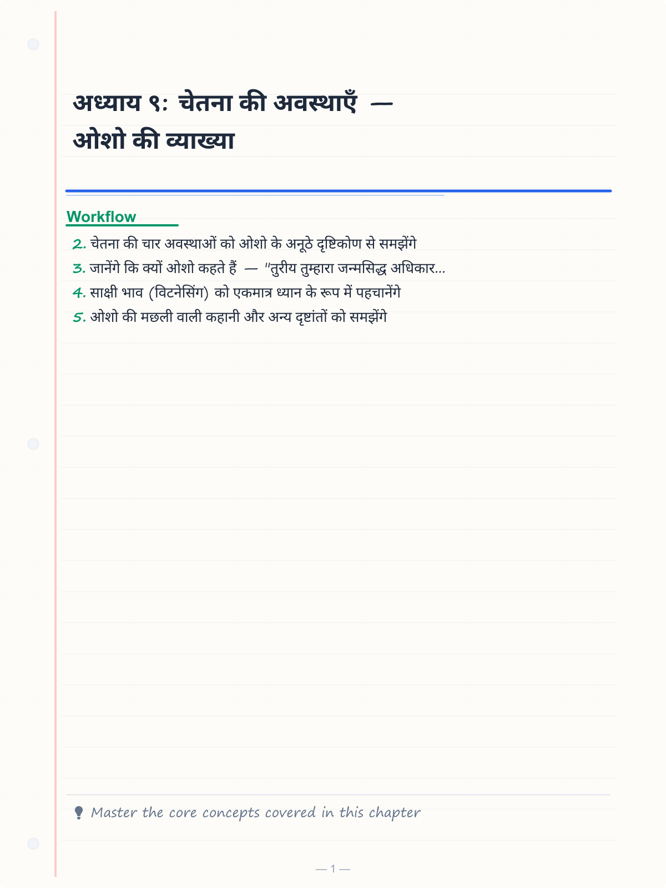
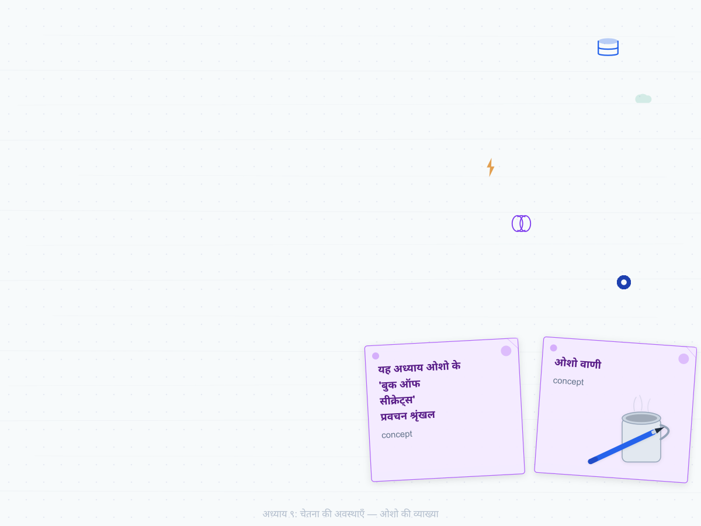
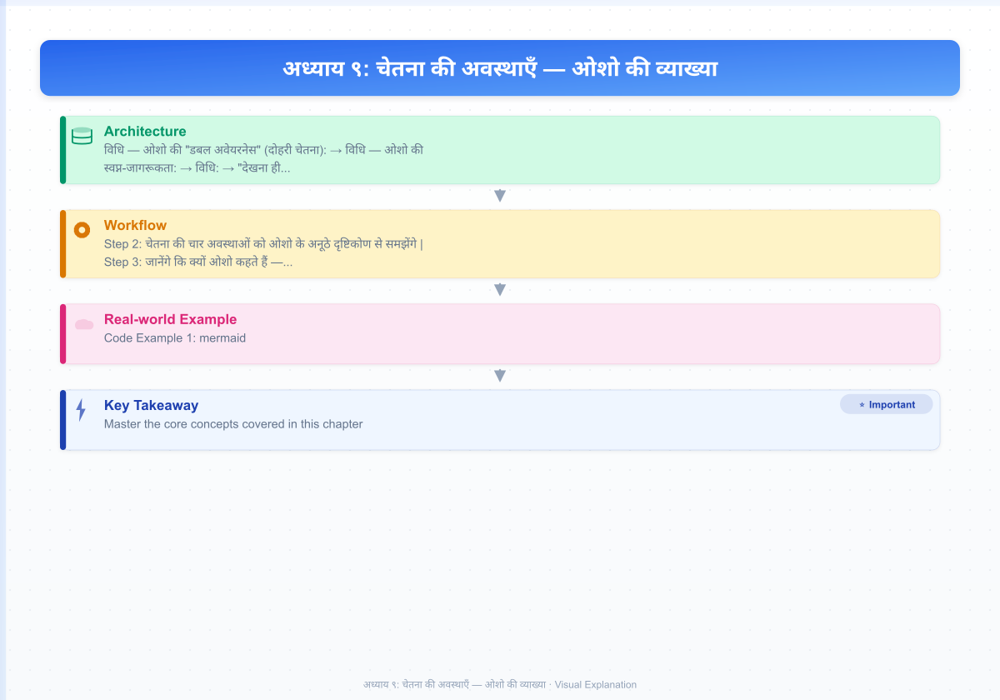

# अध्याय ९: चेतना की अवस्थाएँ — ओशो की व्याख्या

> **यह अध्याय ओशो के 'बुक ऑफ सीक्रेट्स' प्रवचन श्रृंखला पर आधारित है**
> *बोले: ओशो, पूना, १९७२-७३*

---

<!-- Image Gallery -->
<section class="lesson-visuals" aria-label="Visual learning resources">
  <header><span>VISUAL LEARNING</span><h2>See it. Review it. Remember it.</h2></header>
  <a class="lesson-visual-card" href="../../assets/images/lessons/vigyan-bhairav-tantra/09-chetna-ki-avasthayen/handwritten-notes.png" target="_blank" rel="noopener">
    
    <span><strong>Handwritten notes</strong>Condensed notes for deliberate review.</span>
  </a>
  <a class="lesson-visual-card" href="../../assets/images/lessons/vigyan-bhairav-tantra/09-chetna-ki-avasthayen/sticky-notes.png" target="_blank" rel="noopener">
    
    <span><strong>Sticky-note revision</strong>Fast recall prompts for revision.</span>
  </a>
  <a class="lesson-visual-card" href="../../assets/images/lessons/vigyan-bhairav-tantra/09-chetna-ki-avasthayen/visual-explanation.png" target="_blank" rel="noopener">
    
    <span><strong>Visual concept guide</strong>A connected explanation of the key ideas.</span>
  </a>
</section>
<!-- End Image Gallery -->

## सीखने के उद्देश्य

```mermaid
mindmap
  root((चेतना की अवस्थाएँ<br>ओशो की नज़र))
    चार अवस्थाएँ
      जाग्रत — सपना देख रहे हो
      स्वप्न — सपने के भीतर सपना
      सुषुप्ति — सपना भूल गए
      तुरीय — सपने देखने वाले को जानो
    ओशो की क्रांतिकारी व्याख्या
      तुरीय कोई अवस्था नहीं — द्रष्टा है
      "तुम पहले से ही वहाँ हो"
      साक्षी ही एकमात्र ध्यान
      मछली की कहानी — सागर में ही हो
    साधना
      अवस्थाओं को पार करो
      अवस्थाओं के स्वामी बनो
      संधियों पर ध्यान
    आधुनिक संदर्भ
      मनोविज्ञान — फ्रायड, जंग
      न्यूरोसाइंस — मस्तिष्क तरंगें
      ओशो का एकीकृत दृष्टिकोण
```



इस अध्याय को पूरा करने के बाद आप:

- चेतना की चार अवस्थाओं को ओशो के अनूठे दृष्टिकोण से समझेंगे
- जानेंगे कि क्यों ओशो कहते हैं — "तुरीय तुम्हारा जन्मसिद्ध अधिकार है, कमाई नहीं"
- साक्षी भाव (विटनेसिंग) को एकमात्र ध्यान के रूप में पहचानेंगे
- ओशो की मछली वाली कहानी और अन्य दृष्टांतों को समझेंगे
- TypeScript में चेतना अवस्था ट्रैकर बनाकर अभ्यास करेंगे
- अवस्थाओं के संधि-बिंदुओं पर ध्यान करना सीखेंगे

---

## ओशो का परिचय: "तुम चार अवस्थाओं में नहीं, उनके पार हो"

> **ओशो वाणी:**
> *"चेतना की चार अवस्थाओं की बात करना ऐसे है जैसे कोई पूछे कि पानी में रहने वाली मछली को पानी का कैसे पता चलेगा? वह पानी में है ही, उसे पानी की तलाश करने की जरूरत नहीं है। ठीक वैसे ही तुम तुरीय में हो — लेकिन तुम्हें पता नहीं। तुम जाग्रत, स्वप्न और सुषुप्ति — इन तीन अवस्थाओं में भटक रहे हो, और तुरीय तुम्हारा अपना स्वभाव है।"*

देखो, मेरे प्यारे साधकों, चेतना की अवस्थाओं को समझना बहुत आसान है — लेकिन बहुत कठिन भी। आसान इसलिए कि ये तुम्हारे अपने अनुभव हैं। कठिन इसलिए कि तुम जिससे देख रहे हो, उसे देखने की कोशिश कर रहे हो।

मांडूक्य उपनिषद् ने चार अवस्थाएँ बताई हैं — जाग्रत, स्वप्न, सुषुप्ति, तुरीय। और ऋषियों ने ॐ के चार मात्राओं से इन्हें जोड़ा — अ, उ, म, और अर्धमात्रा। बहुत सुंदर है, बहुत वैज्ञानिक है।

लेकिन मैं तुमसे कुछ और कहना चाहता हूँ। मैं कहता हूँ — ये चार अवस्थाएँ नहीं हैं। तीन अवस्थाएँ हैं और एक अवस्था-रहित चैतन्य है। तुरीय कोई अवस्था नहीं है — वह अवस्थाओं का साक्षी है।

```mermaid
flowchart TB
    subgraph "ओशो के अनुसार चेतना का मॉडल"
        A[जाग्रत<br>बाह्य सपना] -->|इंद्रियां अंतर्मुखी| B[स्वप्न<br>आंतरिक सपना]
        B -->|मन का विलय| C[सुषुप्ति<br>सपना रहित गहरी नींद]
        C -->|चेतना का जागरण| D((तुरीय<br>साक्षी))
        A -.->|साक्षी भाव| D
        B -.->|स्वप्न में जागरूकता| D
        C -.->|चेतन निद्रा| D
    end
    
    D --> E[तुरीयातीत<br>सभी अवस्थाओं में एकरस]
    
    style D fill:#f96,stroke:#333,stroke-width:4px
    style E fill:#ff6,stroke:#333,stroke-width:4px
```



### ओशो की मछली वाली कहानी

एक बार की बात है। एक छोटी मछली ने अपनी माँ से पूछा — "माँ, मैं समुद्र के बारे में बहुत सुनती हूँ। वह कहाँ है? मैं उसे देखना चाहती हूँ।"

माँ मछली मुस्कुराई। उसने कहा — "बेटी, तू समुद्र में ही है। जहाँ भी जाती है, समुद्र ही है। तू समुद्र में तैर रही है, समुद्र में साँस ले रही है, समुद्र में खेल रही है — और तू पूछ रही है कि समुद्र कहाँ है?"

> **ओशो वाणी:**
> *"तुम वही मछली हो। तुम तुरीय में हो — जाग्रत में, स्वप्न में, सुषुप्ति में — हर अवस्था में तुरीय ही आधार है। लेकिन तुम पूछते हो — तुरीय कहाँ है? मैं उसे कैसे पाऊँ? तुम उसे खोज नहीं सकते, क्योंकि तुम उसी में हो। तुम केवल पहचान सकते हो — और वह पहचान ही समाधि है।"*

यह ओशो की सबसे क्रांतिकारी बात है। साधारणतया लोग सोचते हैं — मैं जाग्रत से स्वप्न में जाता हूँ, स्वप्न से सुषुप्ति में, और फिर तुरीय को प्राप्त करता हूँ। ऐसा नहीं है। तुम एक अवस्था से दूसरी अवस्था में नहीं जा सकते, क्योंकि तुम वही हो जो सभी अवस्थाओं में स्थिर है।

---

## १. जाग्रत अवस्था — ओशो की नज़र

### "जाग्रत भी एक सपना है"

> **ओशो वाणी:**
> *"जब मैं कहता हूँ कि जाग्रत भी एक सपना है, तो तुम चौंक जाते हो। लेकिन सोचो — जाग्रत में तुम जो देखते हो, वह तुम्हारी इंद्रियों का अनुवाद है। रंग वास्तविक नहीं हैं — वे तरंगें हैं जिन्हें तुम्हारा मस्तिष्क रंग में बदल देता है। ध्वनि वास्तविक नहीं है — वह हवा में कंपन है। तुम एक अनुवादित संसार में जी रहे हो। और अनुवाद कभी भी मूल नहीं होता। तुम्हारा तथाकथित जाग्रत सिर्फ एक सुसंगत सपना है।"*

ओशो जाग्रत अवस्था को बहुत गहराई से समझाते हैं। वे कहते हैं कि जाग्रत वह अवस्था है जहाँ हम बाह्य जगत से तादात्म्य कर लेते हैं। हम भूल जाते हैं कि हम देखने वाले हैं — हम देखी जाने वाली चीज़ों में खो जाते हैं।

| जाग्रत के लक्षण | ओशो की व्याख्या |
|----------------|-----------------|
| बाह्य ज्ञान | बाहर का सपना — इंद्रियों द्वारा निर्मित |
| स्थूल शरीर की चेतना | शरीर से तादात्म्य — "मैं शरीर हूँ" का भ्रम |
| द्वैत का अनुभव | मैं और तुम — अलगाव का खेल |
| काल-देश का बोध | समय और स्थान की जेल |
| कर्म-फल का बंधन | जाग्रत में किया, स्वप्न में भोगा |

### जाग्रत के लिए ओशो की तकनीक

ओशो कहते हैं — जाग्रत में ही ध्यान शुरू होता है। तुम्हें जाग्रत को ही समाधि बनाना है।

**विधि — ओशो की "डबल अवेयरनेस" (दोहरी चेतना):**

१. आँखें खुली रखो। सामान्य रूप से काम करो।
२. लेकिन एक काम और करो — अपने भीतर एक कोने में, एक साक्षी बना रहने दो।
३. जो देख रहा है कि — "हाथ काम कर रहा है, पैर चल रहे हैं, मन सोच रहा है।"
४. यह दोहरी चेतना ही जाग्रत-समाधि की कुंजी है।

> **ओशो वाणी:**
> *"जाग्रत में समाधि का अर्थ यह नहीं कि तुम आँखें बंद करके बैठ जाओ। नहीं। इसका अर्थ है — बाजार में चलते हुए, काम करते हुए, बातें करते हुए — भीतर एक कोने में कोई जागा हुआ है, जो सब देख रहा है। यही सच्ची समाधि है। यही जीवन्मुक्ति है।"*

### एक ज़ेन कहानी

एक ज़ेन गुरु से किसी ने पूछा — "गुरुजी, आप कैसे ध्यान करते हैं?"

गुरु ने कहा — "जब मैं खाता हूँ, तो सिर्फ खाता हूँ। जब मैं सोता हूँ, तो सिर्फ सोता हूँ।"

पूछने वाले ने कहा — "लेकिन यह तो हर कोई करता है!"

गुरु हँसे — "नहीं। जब तुम खाते हो, तो तुम हजार चीज़ों के बारे में सोच रहे हो। जब तुम सोते हो, तो तुम सपने देख रहे हो। तुम कभी कुछ पूरा नहीं करते। मैं पूरी तरह से करता हूँ — और उस पूर्णता में ही ध्यान है।"

```mermaid
sequenceDiagram
    participant S as साधारण व्यक्ति
    participant Y as योगी (ओशो की नज़र)
    
    Note over S: जाग्रत में सोया हुआ
    S->>S: बाह्य जगत से तादात्म्य
    S->>S: "मैं शरीर हूँ, मैं मन हूँ"
    S->>S: द्वैत में खोया
    
    Note over Y: जाग्रत में जागा हुआ
    Y->>Y: शरीर काम कर रहा है — मैं देख रहा हूँ
    Y->>Y: मन सोच रहा है — मैं देख रहा हूँ
    Y->>Y: साक्षी स्थिर है — यही समाधि है
```



---

## २. स्वप्न अवस्था — ओशो की नज़र

### "स्वप्न से भागो मत, स्वप्न में जागो"

> **ओशो वाणी:**
> *"स्वप्न तुम्हारे अचेतन मन का दर्पण है। जाग्रत में तुम जो दबाते हो, वह स्वप्न में प्रकट होता है। स्वप्न कोई बीमारी नहीं है — यह चेतना का एक और आयाम है। और यदि तुम स्वप्न में जाग सको, तो तुम मृत्यु को भी जीत सकते हो।"*

ओशो स्वप्न को बहुत महत्व देते हैं। फ्रायड ने स्वप्न को दबी हुई इच्छाओं का प्रतीक माना — ओशो उससे भी आगे जाते हैं। वे कहते हैं, स्वप्न चेतना का एक द्वार है। यदि तुम स्वप्न में जागरूक हो सको, तो तुम उस द्वार को पार कर सकते हो।

### स्वप्न-योग — ओशो की विधि

**विधि — ओशो की स्वप्न-जागरूकता:**

१. दिन में बार-बार अपने आप से पूछो — "क्या मैं जाग्रत हूँ या स्वप्न में हूँ?"
२. यह आदत रात में भी जारी रहेगी।
३. जब स्वप्न आए, तो पहचानो — "यह स्वप्न है!"
४. यह पहचान ही ल्यूसिड ड्रीमिंग है — स्वप्न में जाग्रत होना।
५. अब स्वप्न में साक्षी बनो। स्वप्न की सामग्री को बदलने मत दो — बस देखो।
६. देखते-देखते स्वप्न विलीन हो जाएगा, और शुद्ध चैतन्य प्रकट होगा।

### ओशो और फ्रायड — एक तुलना

| विषय | फ्रायड | ओशो |
|------|--------|------|
| स्वप्न का स्रोत | दबी हुई काम-इच्छाएँ | अचेतन का स्वाभाविक विस्तार |
| स्वप्न का उद्देश्य | मनोवैज्ञानिक रिहाई | चेतना के द्वार खोलना |
| स्वप्न का उपयोग | विश्लेषण करो | स्वप्न में जागो |
| ल्यूसिड ड्रीमिंग | संभव नहीं मानते | ध्यान की उच्च अवस्था |
| अंतिम लक्ष्य | स्वप्नों की व्याख्या | स्वप्नों से परे जाना |

> **ओशो वाणी:**
> *"फ्रायड ने स्वप्न को देखा — लेकिन वह स्वप्न के पार नहीं देख सका। वह स्वप्न की व्याख्या करता रह गया, और स्वप्न देखने वाले को भूल गया। मैं कहता हूँ — स्वप्न को मत समझो, स्वप्न में जागो। जो स्वप्न में जागता है, वही सच में जाग्रत है।"*

---

## ३. सुषुप्ति अवस्था — ओशो की नज़र

### "सुषुप्ति तुरीय का द्वार है"

> **ओशो वाणी:**
> *"सुषुप्ति — गहन निद्रा — तुरीय के सबसे निकट है। इतना निकट कि यदि तुम सुषुप्ति में जागरूक हो सको, तो तुरीय तुम्हारे हाथ में है। लेकिन यहीं सबसे बड़ी कठिनाई है — तुम जागरूकता को खो देते हो। तुम चेतना के गर्भ में समा जाते हो, और भूल जाते हो कि तुम कौन हो।"*

ओशो के अनुसार, सुषुप्ति और तुरीय में बस एक ही अंतर है — सुषुप्ति में तुम चेतना के सागर में डूबे होते हो, लेकिन तुम्हें इसका पता नहीं होता। तुरीय में तुम उसी सागर में होते हो, और तुम्हें पता होता है।

| सुषुप्ति के लक्षण | ओशो की व्याख्या |
|-------------------|-----------------|
| चेतना का एकीभाव | सारे विचार विलीन — शुद्ध चेतना शेष |
| आनंदमयी अवस्था | कोई इच्छा नहीं, कोई दुःख नहीं — केवल आनंद |
| काल का लय | समय का बोध समाप्त |
| द्वैत का अभाव | न जानने वाला, न जानने योग्य — केवल चेतना |
| तुरीय से अंतर | सुषुप्ति में चेतना है, लेकिन उसका बोध नहीं |

### सुषुप्ति के लिए ओशो की तकनीक — "चेतन निद्रा"

**विधि:**

१. रात को बिस्तर पर लेटो। शरीर को ढीला छोड़ दो।
२. आँखें बंद करो। श्वास को स्वाभाविक होने दो।
३. अब देखो — निद्रा आ रही है। उसका स्वागत करो। उससे लड़ो मत।
४. जब निद्रा आएगी, तो तुम्हारा शरीर सो जाएगा। तुम्हारा मन सो जाएगा।
५. लेकिन — तुम्हारी चेतना की एक छोटी सी लौ जलती रहनी चाहिए।
६. बस इतना — देखते रहो। निद्रा को आते हुए देखो।
७. वह क्षण जब शरीर सो गया, लेकिन तुम अभी भी जाग रहे हो — यही चेतन निद्रा है।

```mermaid
flowchart LR
    subgraph "निद्रा की गहराई — ओशो का नक्शा"
        A[जाग्रत] -->|"पहली परत"| B[स्वप्न]
        B -->|"दूसरी परत"| C[सुषुप्ति]
        C -->|"यहीं चेतना खो जाती है"| D{दो रास्ते}
        D -->|बेहोशी| E[गहन निद्रा<br>चेतना विलीन]
        D -->|जागरूकता| F[तुरीय<br>चेतना जाग्रत]
    end
    
    style F fill:#f96,stroke:#333,stroke-width:4px
    style E fill:#ddd,stroke:#333
```



> **ओशो वाणी:**
> *"सुषुप्ति तुरीय की तरफ जाने वाला राजमार्ग है। लेकिन एक अड़चन है — रास्ते में तुम सो जाते हो। यदि तुम जागते हुए सो सको — तो तुरीय तुम्हारा है। यही मेरी चेतन निद्रा (कॉन्शस स्लीप) की तकनीक है।"*

### एक सूफी कहानी

एक सूफी फकीर से किसी ने पूछा — "आप सोते कैसे हैं?"

फकीर ने कहा — "मैं सोता नहीं। मैं केवल आँखें बंद करता हूँ और अपने शरीर को आराम करने देता हूँ। लेकिन मैं जाग रहता हूँ।"

पूछने वाले ने कहा — "लेकिन फिर आपको आराम कैसे मिलता है?"

फकीर ने आँखें बंद कीं, और एक गहरी शांति में चला गया। उसका शरीर पूरी तरह शिथिल था। फिर उसने आँखें खोलीं और कहा — "आराम शरीर को चाहिए, चेतना को नहीं। शरीर सो सकता है — चेतना को सोने की जरूरत नहीं है। चेतना का स्वभाव ही जागरूकता है।"

---

## ४. तुरीय — ओशो का क्रांतिकारी दृष्टिकोण

### "तुरीय कोई अवस्था नहीं है — यह तुम्हारी पहचान है"

यह ओशो का सबसे महत्वपूर्ण संदेश है। वे कहते हैं —

> **ओशो वाणी:**
> *"तुरीय कोई चौथी अवस्था नहीं है — यह तीनों अवस्थाओं का आधार है। जिस प्रकार स्क्रीन पर फिल्म चलती है — तीन अवस्थाएँ फिल्म की तस्वीरों की तरह हैं — जाग्रत, स्वप्न, सुषुप्ति। लेकिन स्क्रीन चौथी चीज़ नहीं है — वह आधार है, वह सहारा है। वह फिल्म से अलग नहीं है, लेकिन फिल्म उसके बिना नहीं चल सकती। तुरीय वह स्क्रीन है। तुम वह स्क्रीन हो।"*

यह समझने के लिए एक और उदाहरण लेते हैं। जब तुम जाग्रत से स्वप्न में जाते हो, तो एक चीज़ स्थिर रहती है — वह जो जानता है कि जाग्रत था और अब स्वप्न है। वह जानने वाला नहीं बदलता। वही तुरीय है।

```mermaid
stateDiagram-v2
    [*] --> जाग्रत
    जाग्रत --> स्वप्न : इंद्रियां अंतर्मुखी
    स्वप्न --> सुषुप्ति : मन का विलय
    सुषुप्ति --> जाग्रत : जागरण
    
    state तुरीय {
        [*] --> साक्षी
        साक्षी --> [*]
    }
    
    note right of जाग्रत
        तुरीय = इन सबको देखने वाला
        जो अवस्थाओं में नहीं बदलता
    end note
    
    तुरीय --> जाग्रत : साक्षी
    तुरीय --> स्वप्न : साक्षी
    तुरीय --> सुषुप्ति : साक्षी
```



### ओशो की "तुरीय तुम्हारा जन्मसिद्ध अधिकार है" — पूरा प्रवचन

यह ओशो का सबसे प्रसिद्ध कथन है। वे कहते हैं —

> **ओशो वाणी:**
> *"तुम पूछते हो — 'तुरीय को कैसे प्राप्त करें?' मैं कहता हूँ — तुम उसे प्राप्त नहीं कर सकते, क्योंकि तुम उसे खोया नहीं है। तुम पहले से ही उसमें हो। तुम उसे कमा नहीं सकते, क्योंकि वह तुम्हारा जन्मसिद्ध अधिकार है। तुम उसे पाने के लिए कुछ नहीं कर सकते — क्योंकि करना (डूइंग) तो जाग्रत अवस्था का हिस्सा है। और तुरीय जाग्रत से परे है। तो क्या करोगे?*
>
> *— कुछ मत करो। बस देखो। यही एकमात्र ध्यान है। देखो कि तुम पहले से ही वहाँ हो।"*

### ओशो का निष्कर्ष — ११२ तकनीकें किसलिए?

यदि तुरीय पहले से ही है, तो ११२ तकनीकों की जरूरत क्यों?

> **ओशो वाणी:**
> *"११२ तकनीकें — वे सब तुम्हें कुछ देने के लिए नहीं हैं। वे तुमसे वह हटाने के लिए हैं जो तुम्हें लगता है कि तुम नहीं हो। तुमने ग़लत पहचान बना ली है — 'मैं शरीर हूँ, मैं मन हूँ, मैं यह हूँ, मैं वह हूँ।' ये सब पहचानें झूठी हैं। तकनीकें इन झूठी पहचानों को हटाने का काम करती हैं। जब सब हट जाता है — जो बचता है, वही तुरीय है। जो हमेशा से था।"*

---

## तुरीयातीत — ओशो की व्याख्या

### "अवस्था से परे की अवस्था"

> **ओशो वाणी:**
> *"तुरीयातीत — चौथी से परे। पर क्या चौथी से परे कुछ है? हाँ, है। लेकिन वह कोई पाँचवी अवस्था नहीं है। तुरीयातीत का अर्थ है — सभी अवस्थाओं में एक साथ जीना। जाग्रत में रहते हुए स्वप्न को जानना, स्वप्न में रहते हुए सुषुप्ति को जानना, और तीनों में तुरीय को जानना। यह पूर्ण चेतना है — समग्र जागरूकता।"*

ओशो के अनुसार, तुरीयातीत वह अवस्था है जहाँ साधक सभी अवस्थाओं में एक साथ जी सकता है। यह सहज समाधि है — जहाँ समाधि और व्यवहार में कोई अंतर नहीं रहता।

```mermaid
flowchart TB
    subgraph "अवस्था मैपिंग — ओशो का एकीकृत मॉडल"
        center((शुद्ध चैतन्य<br>तुरीयातीत))
        
        center -->|"अहंकार लगाता है सीमा"| J[जाग्रत<br>मैं शरीर हूँ]
        center -->|"अहंकार बनाता है सपना"| S[स्वप्न<br>मैं मन हूँ]
        center -->|"अहंकार खोता है पहचान"| D[सुषुप्ति<br>मैं कुछ नहीं हूँ]
        center -->|"अहंकार मिटता है"| T[तुरीय<br>मैं ही वह हूँ]
    end
    
    J -.->|साक्षी| center
    S -.->|स्वप्न-जागरूकता| center
    D -.->|चेतन निद्रा| center
    T -.->|सहज| center
    
    style center fill:#f96,stroke:#333,stroke-width:4px
    style T fill:#ff6,stroke:#333
```



---

## ओशो का साक्षी ध्यान — पूरी विधि

चूँकि ओशो कहते हैं कि साक्षी ही एकमात्र ध्यान है, यहाँ उनकी पूरी विधि दी गई है:

**"देखना ही ध्यान है" — ओशो**

### चरण १: शरीर को देखो

एक कुर्सी पर आराम से बैठो। आँखें बंद करो। अब अपने शरीर को देखो — जैसे कोई और देख रहा हो।

- पैरों में क्या हो रहा है? कोई तनाव है? कोई दर्द है? बस देखो।
- हाथों में क्या है? उँगलियाँ कैसी हैं? बस देखो।
- रीढ़ की हड्डी — कहीं कोई खिंचाव है? बस देखो।
- चेहरा — कहीं कोई तनाव है? जबड़ा ढीला है? बस देखो।

तुम शरीर को देख रहे हो — तुम शरीर नहीं हो।

### चरण २: विचारों को देखो

अब विचारों को देखो। विचार आते हैं, जाते हैं — तुम केवल देख रहे हो।

- विचार बादलों की तरह हैं — तुम आकाश हो।
- कोई विचार अच्छा है, कोई बुरा — फर्क मत करो। बस देखो।
- विचार को पकड़ो मत, भगाओ मत — बस देखो।

तुम विचारों को देख रहे हो — तुम विचार नहीं हो।

### चरण ३: भावनाओं को देखो

अब भावनाओं को देखो। क्रोध आता है, प्रेम आता है, उदासी आती है — बस देखो।

- भावनाएँ शरीर में कहाँ महसूस होती हैं? छाती में? पेट में? गले में?
- उन्हें बदलने की कोशिश मत करो — बस देखो।
- भावना को जाने दो — आए भी, जाए भी।

तुम भावनाओं को देख रहे हो — तुम भावना नहीं हो।

### चरण ४: देखने वाले को देखो

अब — इस सबको देखने वाला कौन है?

- जो शरीर को देख रहा है — उसे कौन देख रहा है?
- जो विचारों को देख रहा है — उसे कौन देख रहा है?
- जो भावनाओं को देख रहा है — उसे कौन देख रहा है?

> **ओशो वाणी:**
> *"यहीं रुक जाओ। इसी क्षण — बिना किसी प्रयास के — देखो कि कौन देख रहा है। और अचानक — कोई देखने वाला नहीं बचेगा। केवल देखना रह जाएगा। वही तुरीय है। वही तुम हो।"*

---

## TypeScript: चेतना अवस्था साक्षी ट्रैकर (Witness State Tracker)

नीचे एक TypeScript आधारित ट्रैकर है जो ओशो के साक्षी भाव और चेतना की अवस्थाओं को रिकॉर्ड करने में मदद करता है।

```typescript
/**
 * चेतना अवस्था साक्षी ट्रैकर (Witness State Tracker)
 * 
 * ओशो के अनुसार — साक्षी ही एकमात्र ध्यान है। यह ट्रैकर चेतना की
 * चार अवस्थाओं (जाग्रत, स्वप्न, सुषुप्ति, तुरीय) को ओशो के दृष्टिकोण
 * से रिकॉर्ड और विश्लेषित करता है।
 * 
 * कोर टीचिंग: "तुम पहले से ही तुरीय में हो — बस पहचानो।"
 * — ओशो
 */

// ===== मूल प्रकार (Core Types) =====

/** ओशो के अनुसार चेतना की अवस्थाएँ */
export enum OshoChetnaAvastha {
    JAAGRAT = 'जाग्रत',         // बाह्य सपना
    SWAPNA = 'स्वप्न',           // आंतरिक सपना
    SUSHIPTI = 'सुषुप्ति',       // सपना रहित निद्रा
    TURIYA = 'तुरीय',            // साक्षी — सभी अवस्थाओं का आधार
    TURIYATITA = 'तुरीयातीत',    // सहज — सभी अवस्थाओं में एकरस
}

/** ओशो की पहचान के स्तर — अहंकार की परतें */
export enum IdentityLevel {
    BODY_IDENTITY = 'शरीर-पहचान — मैं शरीर हूँ',
    MIND_IDENTITY = 'मन-पहचान — मैं मन हूँ',
    EGO_IDENTITY = 'अहं-पहचान — मैं कर्ता हूँ',
    WITNESS_IDENTITY = 'साक्षी-पहचान — मैं देखने वाला हूँ',
    PURE_CONSCIOUSNESS = 'शुद्ध चैतन्य — न कोई पहचान',
}

/** ओशो के अनुसार साक्षी भाव की गहराई */
export enum WitnessDepth {
    FORGETTING = 'विस्मृति — साक्षी खो गया',
    OCCASIONAL = 'कभी-कभी — साक्षी झलकता है',
    EFFORTFUL = 'प्रयासपूर्वक — साक्षी बने रहना',
    EFFORTLESS = 'सहज — बिना प्रयास के साक्षी',
    CONSTANT = 'निरंतर — २४ घंटे साक्षी',
}

/** साक्षी भाव का स्नैपशॉट */
export interface WitnessSnapshot {
    id: string;
    timestamp: Date;
    currentAvastha: OshoChetnaAvastha;
    witnessDepth: WitnessDepth;
    identityLevel: IdentityLevel;
    /** अहंकार की तीव्रता 0-10 (0 = कोई अहंकार नहीं) */
    egoIntensity: number;
    /** शरीर-चेतना 0-10 */
    bodyAwareness: number;
    /** विचार गतिविधि 0-10 */
    thoughtActivity: number;
    /** आनंद स्तर 0-10 */
    blissLevel: number;
    /** ओशो की डबल अवेयरनेस सक्रिय है? */
    dualAwareness: boolean;
    /** अवस्था संधि पर है? */
    isTransition: boolean;
    notes: string;
}

/** दैनिक साक्षी सारांश */
export interface DailyWitnessSummary {
    date: Date;
    dominantAvastha: OshoChetnaAvastha;
    averageWitnessDepth: WitnessDepth;
    witnessRatio: number;
    peakBliss: number;
    averageEgoIntensity: number;
    transitionCount: number;
    totalSessions: number;
}

// ===== मुख्य ट्रैकर क्लास =====

export class OshoWitnessTracker {
    private snapshots: WitnessSnapshot[] = [];
    private currentSession: WitnessSnapshot | null = null;

    /** ओशो के अनुसार अवस्था का नाम बताएँ */
    getOshoDescription(avastha: OshoChetnaAvastha): {
        name: string;
        oshoQuote: string;
        teaching: string;
        technique: string;
    } {
        const descriptions: Record<OshoChetnaAvastha, {
            name: string;
            oshoQuote: string;
            teaching: string;
            technique: string;
        }> = {
            [OshoChetnaAvastha.JAAGRAT]: {
                name: 'जाग्रत — बाह्य सपना',
                oshoQuote: '"जाग्रत भी एक सपना है — बस अधिक सुसंगत है।"',
                teaching: 'जाग्रत में साक्षी बनो। काम करते हुए भीतर जागे रहो।',
                technique: 'डबल अवेयरनेस — बाहर काम करो, भीतर देखो।',
            },
            [OshoChetnaAvastha.SWAPNA]: {
                name: 'स्वप्न — आंतरिक सपना',
                oshoQuote: '"स्वप्न को समझो मत — स्वप्न में जागो।"',
                teaching: 'स्वप्न अचेतन का द्वार है। स्वप्न में जागरूकता ही कुंजी है।',
                technique: 'स्वप्न-योग — दिन में बार-बार पूछो: क्या यह स्वप्न है?',
            },
            [OshoChetnaAvastha.SUSHIPTI]: {
                name: 'सुषुप्ति — सपना रहित निद्रा',
                oshoQuote: '"सुषुप्ति तुरीय का राजमार्ग है — लेकिन रास्ते में तुम सो जाते हो।"',
                teaching: 'निद्रा को आने दो, लेकिन चेतना को मत खोओ।',
                technique: 'चेतन निद्रा — शरीर को सोने दो, चेतना को जगाए रखो।',
            },
            [OshoChetnaAvastha.TURIYA]: {
                name: 'तुरीय — साक्षी',
                oshoQuote: '"तुरीय कोई अवस्था नहीं — तुम्हारी पहचान है। तुम पहले से ही वहाँ हो।"',
                teaching: 'कुछ मत करो। बस देखो। देखना ही ध्यान है।',
                technique: 'साक्षी भाव — शरीर, मन, भावनाओं को देखो। फिर देखने वाले को देखो।',
            },
            [OshoChetnaAvastha.TURIYATITA]: {
                name: 'तुरीयातीत — सहज',
                oshoQuote: '"जब देखने वाला और देखना एक हो जाते हैं — वह तुरीयातीत है।"',
                teaching: 'सभी अवस्थाओं में एकरस रहना — यह पूर्ण चेतना है।',
                technique: 'कोई तकनीक नहीं — बस सहज जागरूकता।',
            },
        };

        return descriptions[avastha];
    }

    /** नया साक्षी स्नैपशॉट लें */
    takeSnapshot(params: {
        avastha: OshoChetnaAvastha;
        witnessDepth: WitnessDepth;
        identityLevel: IdentityLevel;
        egoIntensity: number;
        bodyAwareness: number;
        thoughtActivity: number;
        blissLevel: number;
        dualAwareness: boolean;
        isTransition?: boolean;
        notes?: string;
    }): WitnessSnapshot {
        const snapshot: WitnessSnapshot = {
            id: this.generateId(),
            timestamp: new Date(),
            currentAvastha: params.avastha,
            witnessDepth: params.witnessDepth,
            identityLevel: params.identityLevel,
            egoIntensity: Math.min(10, Math.max(0, params.egoIntensity)),
            bodyAwareness: Math.min(10, Math.max(0, params.bodyAwareness)),
            thoughtActivity: Math.min(10, Math.max(0, params.thoughtActivity)),
            blissLevel: Math.min(10, Math.max(0, params.blissLevel)),
            dualAwareness: params.dualAwareness,
            isTransition: params.isTransition || false,
            notes: params.notes || '',
        };

        this.snapshots.push(snapshot);
        this.currentSession = snapshot;

        // ओशो का संदेश — साक्षी की पहचान पर
        if (params.identityLevel === IdentityLevel.PURE_CONSCIOUSNESS) {
            console.log('🔔 ओशो कहते हैं: "तुरीय — यह तुम हो। तुम पहले से ही वहाँ थे। अब तुम्हें पता चल गया।"');
        }

        return snapshot;
    }

    /** साक्षी भाव विकास का विश्लेषण */
    analyzeWitnessDevelopment(): {
        currentDepth: WitnessDepth;
        progressPercentage: number;
        dominantIdentity: IdentityLevel;
        oshoAdvice: string;
        recommendedTechnique: string;
    } {
        if (this.snapshots.length === 0) {
            return {
                currentDepth: WitnessDepth.FORGETTING,
                progressPercentage: 0,
                dominantIdentity: IdentityLevel.BODY_IDENTITY,
                oshoAdvice: 'अभी शुरुआत करें। ओशो कहते हैं — "देखना ही ध्यान है। बस देखो।"',
                recommendedTechnique: 'शरीर को देखो — श्वास को देखो — साक्षी बनो।',
            };
        }

        // अहंकार की तीव्रता में परिवर्तन
        const firstHalf = this.snapshots.slice(0, Math.floor(this.snapshots.length / 2));
        const secondHalf = this.snapshots.slice(Math.floor(this.snapshots.length / 2));

        const firstEgoAvg = firstHalf.reduce((s, snap) => s + snap.egoIntensity, 0) / firstHalf.length;
        const secondEgoAvg = secondHalf.reduce((s, snap) => s + snap.egoIntensity, 0) / secondHalf.length;

        const egoReduction = ((firstEgoAvg - secondEgoAvg) / firstEgoAvg) * 100;

        // सबसे हाल की गहराई
        const currentDepth = this.snapshots[this.snapshots.length - 1].witnessDepth;

        // प्रगति प्रतिशत
        const depthValues: Record<WitnessDepth, number> = {
            [WitnessDepth.FORGETTING]: 0,
            [WitnessDepth.OCCASIONAL]: 25,
            [WitnessDepth.EFFORTFUL]: 50,
            [WitnessDepth.EFFORTLESS]: 75,
            [WitnessDepth.CONSTANT]: 100,
        };
        const progressPercentage = depthValues[currentDepth] + Math.min(10, Math.max(0, egoReduction / 10));

        // प्रमुख पहचान
        const identityCount = new Map<IdentityLevel, number>();
        this.snapshots.forEach(s => {
            identityCount.set(s.identityLevel, (identityCount.get(s.identityLevel) || 0) + 1);
        });

        let dominantIdentity = IdentityLevel.BODY_IDENTITY;
        let maxCount = 0;
        identityCount.forEach((count, identity) => {
            if (count > maxCount) {
                maxCount = count;
                dominantIdentity = identity;
            }
        });

        // ओशो की सलाह
        const oshoAdvice = this.getOshoAdvice(currentDepth, dominantIdentity);

        // अनुशंसित तकनीक
        const recommendedTechnique = this.getRecommendedTechnique(currentDepth);

        return {
            currentDepth,
            progressPercentage: Math.round(progressPercentage * 100) / 100,
            dominantIdentity,
            oshoAdvice,
            recommendedTechnique,
        };
    }

    /** ओशो की सलाह — अवस्था और पहचान के अनुसार */
    private getOshoAdvice(depth: WitnessDepth, identity: IdentityLevel): string {
        const adviceMap: Record<string, string> = {
            [`${WitnessDepth.FORGETTING}_${IdentityLevel.BODY_IDENTITY}`]:
                'ओशो कहते हैं: "तुम शरीर नहीं हो — तुम शरीर में चेतना हो। शरीर को देखो, पहचानो कि तुम देखने वाले हो।"',
            [`${WitnessDepth.FORGETTING}_${IdentityLevel.MIND_IDENTITY}`]:
                'ओशो कहते हैं: "तुम मन नहीं हो — तुम मन के साक्षी हो। विचारों को देखो — वे आते-जाते हैं, तुम स्थिर हो।"',
            [`${WitnessDepth.OCCASIONAL}_${IdentityLevel.EGO_IDENTITY}`]:
                'ओशो कहते हैं: "अच्छा — तुम कभी-कभी साक्षी को पहचान लेते हो। अब इसे और स्थिर करो। प्रयास मत करो — बस याद रखो।"',
            [`${WitnessDepth.EFFORTFUL}_${IdentityLevel.WITNESS_IDENTITY}`]:
                'ओशो कहते हैं: "प्रयास छोड़ो। साक्षी प्रयास से नहीं आता — वह तो तुम्हारा स्वभाव है। बस विश्राम करो।"',
            [`${WitnessDepth.EFFORTLESS}_${IdentityLevel.WITNESS_IDENTITY}`]:
                'ओशो कहते हैं: "बहुत अच्छे! अब साक्षी सहज हो गया है। अब एक कदम और — साक्षी को भी छोड़ो। केवल चेतना रहे।"',
            [`${WitnessDepth.CONSTANT}_${IdentityLevel.PURE_CONSCIOUSNESS}`]:
                'ओशो कहते हैं: "अब तुम घर आ गए। अब कोई मार्ग नहीं, कोई साधना नहीं — केवल तुम हो। और तुम ही परमात्मा हो।"',
        };

        const key = `${depth}_${identity}`;
        return adviceMap[key] || 'ओशो कहते हैं: "बस देखो — बिना किसी निर्णय के। देखना ही ध्यान है।"';
    }

    /** अनुशंसित तकनीक — साक्षी गहराई के अनुसार */
    private getRecommendedTechnique(depth: WitnessDepth): string {
        const techniques: Record<WitnessDepth, string> = {
            [WitnessDepth.FORGETTING]:
                'श्वास-ध्यान: श्वास को आते-जाते देखो। बस देखो — नियंत्रित मत करो।',
            [WitnessDepth.OCCASIONAL]:
                'डबल अवेयरनेस: काम करते हुए भीतर एक साक्षी बनाए रखो। जैसे कोई और तुम्हें देख रहा हो।',
            [WitnessDepth.EFFORTFUL]:
                'साक्षी-भाव: शरीर, मन, भावनाओं को देखो — बिना किसी प्रतिक्रिया के।',
            [WitnessDepth.EFFORTLESS]:
                'तुरीय-बोध: अब देखो — तीनों अवस्थाओं (जाग्रत, स्वप्न, सुषुप्ति) में कौन एक है?',
            [WitnessDepth.CONSTANT]:
                'कोई तकनीक नहीं: बस जागरूक रहो। तकनीक छोड़ दो। अब तुम स्वयं ही ध्यान हो।',
        };

        return techniques[depth];
    }

    /** अवस्था वितरण */
    getAvasthaDistribution(): Map<OshoChetnaAvastha, number> {
        const distribution = new Map<OshoChetnaAvastha, number>();
        const total = this.snapshots.length || 1;

        for (const avastha of Object.values(OshoChetnaAvastha)) {
            const count = this.snapshots.filter(s => s.currentAvastha === avastha).length;
            distribution.set(avastha, Math.round((count / total) * 1000) / 10);
        }

        return distribution;
    }

    /** दैनिक सारांश */
    generateDailySummary(): DailyWitnessSummary {
        const today = new Date();
        const todayKey = today.toISOString().split('T')[0];
        const todaySnapshots = this.snapshots.filter(
            s => s.timestamp.toISOString().split('T')[0] === todayKey
        );

        if (todaySnapshots.length === 0) {
            return {
                date: today,
                dominantAvastha: OshoChetnaAvastha.JAAGRAT,
                averageWitnessDepth: WitnessDepth.FORGETTING,
                witnessRatio: 0,
                peakBliss: 0,
                averageEgoIntensity: 0,
                transitionCount: 0,
                totalSessions: 0,
            };
        }

        const avasthaCount = new Map<OshoChetnaAvastha, number>();
        let totalDepth = 0;
        let totalEgo = 0;
        let peakBliss = 0;
        let transitions = 0;

        const depthValues: Record<WitnessDepth, number> = {
            [WitnessDepth.FORGETTING]: 0,
            [WitnessDepth.OCCASIONAL]: 1,
            [WitnessDepth.EFFORTFUL]: 2,
            [WitnessDepth.EFFORTLESS]: 3,
            [WitnessDepth.CONSTANT]: 4,
        };

        for (const snap of todaySnapshots) {
            avasthaCount.set(snap.currentAvastha, (avasthaCount.get(snap.currentAvastha) || 0) + 1);
            totalDepth += depthValues[snap.witnessDepth];
            totalEgo += snap.egoIntensity;
            if (snap.blissLevel > peakBliss) peakBliss = snap.blissLevel;
            if (snap.isTransition) transitions++;
        }

        let dominantAvastha = OshoChetnaAvastha.JAAGRAT;
        let maxCount = 0;
        avasthaCount.forEach((count, avastha) => {
            if (count > maxCount) {
                maxCount = count;
                dominantAvastha = avastha;
            }
        });

        const avgDepthValue = totalDepth / todaySnapshots.length;
        const avgDepthKey = Object.entries(depthValues)
            .sort(([, a], [, b]) => Math.abs(a - avgDepthValue) - Math.abs(b - avgDepthValue))[0][0] as WitnessDepth;

        const witnessCount = todaySnapshots.filter(s =>
            s.witnessDepth !== WitnessDepth.FORGETTING
        ).length;

        return {
            date: today,
            dominantAvastha,
            averageWitnessDepth: avgDepthKey,
            witnessRatio: witnessCount / todaySnapshots.length,
            peakBliss,
            averageEgoIntensity: Math.round((totalEgo / todaySnapshots.length) * 100) / 100,
            transitionCount: transitions,
            totalSessions: todaySnapshots.length,
        };
    }

    /** ओशो शैली में रिपोर्ट */
    generateOshoReport(): string {
        const development = this.analyzeWitnessDevelopment();
        const summary = this.generateDailySummary();
        const distribution = this.getAvasthaDistribution();

        const report: string[] = [];

        report.push('═══════════════════════════════════════════');
        report.push('🌺 ओशो — चेतना अवस्था साक्षी रिपोर्ट');
        report.push('═══════════════════════════════════════════');
        report.push('');
        report.push('"तुरीय कोई अवस्था नहीं — यह तुम्हारी पहचान है।"');
        report.push('');
        report.push('📅 आज का सारांश:');
        report.push(`  प्रमुख अवस्था: ${summary.dominantAvastha}`);
        report.push(`  साक्षी अनुपात: ${Math.round(summary.witnessRatio * 100)}%`);
        report.push(`  साक्षी गहराई: ${summary.averageWitnessDepth}`);
        report.push(`  अहंकार तीव्रता: ${summary.averageEgoIntensity}/10`);
        report.push(`  अधिकतम आनंद: ${summary.peakBliss}/10`);
        report.push(`  अवस्था संधियाँ: ${summary.transitionCount}`);
        report.push('');
        report.push('📊 अवस्था वितरण (%):');
        distribution.forEach((percentage, avastha) => {
            if (percentage > 0) {
                report.push(`  ${avastha}: ${'â–ˆ'.repeat(Math.round(percentage / 5))} ${percentage}%`);
            }
        });
        report.push('');
        report.push('🎯 विकास विश्लेषण:');
        report.push(`  प्रगति: ${development.progressPercentage}%`);
        report.push(`  प्रमुख पहचान: ${development.dominantIdentity}`);
        report.push('');
        report.push('💬 ओशो की सलाह:');
        report.push(`  ${development.oshoAdvice}`);
        report.push('');
        report.push('🧘 अनुशंसित तकनीक:');
        report.push(`  ${development.recommendedTechnique}`);
        report.push('');
        report.push('═══════════════════════════════════════════');
        report.push('"देखना ही ध्यान है। बस देखो — और सब अपने आप होगा।"');
        report.push('— ओशो');

        return report.join('\n');
    }

    /** ॐ और चार अवस्थाओं का ओशो-दृष्टि से संबंध */
    getOshoOmMapping(avastha: OshoChetnaAvastha): {
        matra: string;
        oshoInterpretation: string;
    } {
        const mappings: Record<OshoChetnaAvastha, { matra: string; oshoInterpretation: string }> = {
            [OshoChetnaAvastha.JAAGRAT]: {
                matra: 'अ (अकार)',
                oshoInterpretation: 'अकार — जाग्रत। ओशो कहते हैं: "यह बाहर का सपना है। इंद्रियों का खेल। इससे मत चिपको — इसे देखो।"',
            },
            [OshoChetnaAvastha.SWAPNA]: {
                matra: 'उ (उकार)',
                oshoInterpretation: 'उकार — स्वप्न। ओशो कहते हैं: "यह भीतर का सपना है। अचेतन का खुलना। इससे डरो मत — इसमें जागो।"',
            },
            [OshoChetnaAvastha.SUSHIPTI]: {
                matra: 'म (मकार)',
                oshoInterpretation: 'मकार — सुषुप्ति। ओशो कहते हैं: "यह सपनों का अंत है — लेकिन चेतना का अंत नहीं। यहाँ चेतना बीज रूप में है।"',
            },
            [OshoChetnaAvastha.TURIYA]: {
                matra: 'अर्धमात्रा — मात्रा से परे',
                oshoInterpretation: 'अर्धमात्रा — तुरीय। ओशो कहते हैं: "यह कोई मात्रा नहीं — यह मौन है। ॐ की अर्धमात्रा का अर्थ है — ध्वनि का विराम। वही तुरीय है।"',
            },
            [OshoChetnaAvastha.TURIYATITA]: {
                matra: 'अर्धमात्रा के पार',
                oshoInterpretation: 'अर्धमात्रा के पार — तुरीयातीत। ओशो कहते हैं: "यहाँ न कोई मात्रा है, न कोई विराम — केवल चेतना है। शुद्ध, निर्विकल्प, सहज।"',
            },
        };

        return mappings[avastha];
    }

    // ===== सहायक विधियाँ =====

    private generateId(): string {
        return `witness-${Date.now()}-${Math.random().toString(36).substr(2, 9)}`;
    }

    getAllSnapshots(): ReadonlyArray<WitnessSnapshot> {
        return this.snapshots;
    }
}

// ===== उपयोग उदाहरण (Example Usage) =====

function demonstrateOshoWitnessTracker(): void {
    const tracker = new OshoWitnessTracker();
    
    console.log('🌺 ओशो के चेतना अवस्था साक्षी ट्रैकर में आपका स्वागत है\n');

    // प्रातः — जाग्रत में साक्षी
    tracker.takeSnapshot({
        avastha: OshoChetnaAvastha.JAAGRAT,
        witnessDepth: WitnessDepth.EFFORTFUL,
        identityLevel: IdentityLevel.WITNESS_IDENTITY,
        egoIntensity: 4,
        bodyAwareness: 7,
        thoughtActivity: 5,
        blissLevel: 6,
        dualAwareness: true,
        notes: 'प्रातः ध्यान — डबल अवेयरनेस का अभ्यास। शरीर जाग्रत, भीतर साक्षी।',
    });

    // दोपहर — कार्य में अहंकार प्रबल
    tracker.takeSnapshot({
        avastha: OshoChetnaAvastha.JAAGRAT,
        witnessDepth: WitnessDepth.FORGETTING,
        identityLevel: IdentityLevel.EGO_IDENTITY,
        egoIntensity: 8,
        bodyAwareness: 2,
        thoughtActivity: 9,
        blissLevel: 3,
        dualAwareness: false,
        notes: 'कार्य में व्यस्त — साक्षी खो गया। अहंकार प्रबल।',
    });

    // ल्यूसिड स्वप्न
    tracker.takeSnapshot({
        avastha: OshoChetnaAvastha.SWAPNA,
        witnessDepth: WitnessDepth.OCCASIONAL,
        identityLevel: IdentityLevel.WITNESS_IDENTITY,
        egoIntensity: 3,
        bodyAwareness: 1,
        thoughtActivity: 7,
        blissLevel: 8,
        dualAwareness: true,
        isTransition: true,
        notes: 'स्वप्न में जाग गया। पहचाना — यह स्वप्न है। ओशो सही कहते हैं!',
    });

    // चेतन निद्रा का प्रयास
    tracker.takeSnapshot({
        avastha: OshoChetnaAvastha.SUSHIPTI,
        witnessDepth: WitnessDepth.OCCASIONAL,
        identityLevel: IdentityLevel.WITNESS_IDENTITY,
        egoIntensity: 1,
        bodyAwareness: 1,
        thoughtActivity: 1,
        blissLevel: 9,
        dualAwareness: true,
        notes: 'चेतन निद्रा — शरीर सो रहा है, चेतना जाग रही है। क्षणिक अनुभव।',
    });

    // तुरीय का क्षण
    tracker.takeSnapshot({
        avastha: OshoChetnaAvastha.TURIYA,
        witnessDepth: WitnessDepth.EFFORTLESS,
        identityLevel: IdentityLevel.PURE_CONSCIOUSNESS,
        egoIntensity: 0,
        bodyAwareness: 4,
        thoughtActivity: 0,
        blissLevel: 10,
        dualAwareness: true,
        notes: 'तुरीय — ओशो सही थे। मैं पहले से ही वहाँ था। बस पहचाना।',
    });

    // रिपोर्ट
    console.log(tracker.generateOshoReport());

    // ओशो का ॐ से संबंध
    console.log('\n🔮 ओशो की ॐ व्याख्या:');
    for (const avastha of Object.values(OshoChetnaAvastha)) {
        const mapping = tracker.getOshoOmMapping(avastha);
        console.log(`\n  ${mapping.matra}:`);
        console.log(`    ${mapping.oshoInterpretation}`);
    }
}

demonstrateOshoWitnessTracker();

/**
 * ओशो का निष्कर्ष:
 * 
 * चेतना की चार अवस्थाएँ — जाग्रत, स्वप्न, सुषुप्ति, तुरीय — ये चार अलग-अलग
 * अवस्थाएँ नहीं हैं। तीन अवस्थाएँ हैं (जाग्रत, स्वप्न, सुषुप्ति) और एक
 * अवस्था-रहित चैतन्य (तुरीय) जो तीनों का आधार है।
 * 
 * ओशो का मुख्य संदेश:
 * 1. तुरीय को प्राप्त नहीं करना है — वह पहले से है।
 * 2. साक्षी (विटनेसिंग) ही एकमात्र ध्यान है।
 * 3. सभी 112 तकनीकें इसी एक सत्य की ओर इशारा करती हैं।
 * 4. "देखना ही ध्यान है — बस देखो।"
 */
```

---

## सारांश — ओशो के शब्दों में

| अवस्था | ओशो की परिभाषा | मुख्य शिक्षा |
|--------|----------------|-------------|
| जाग्रत | बाह्य सपना — इंद्रियों का अनुवाद | इसी में साक्षी बनो — यही जीवन्मुक्ति |
| स्वप्न | आंतरिक सपना — अचेतन का खेल | स्वप्न में जागो — यही स्वप्न-योग |
| सुषुप्ति | सपना रहित गहराई — चेतना का गर्भ | चेतन निद्रा — शरीर सोए, चेतना जागे |
| तुरीय | कोई अवस्था नहीं — तुम्हारी पहचान | "तुम पहले से ही वहाँ हो — बस पहचानो" |
| तुरीयातीत | सहज — सभी में एकरस | तकनीक छोड़ो — केवल जागरूकता |

> **ओशो वाणी — अंतिम संदेश:**
> *"याद रखो — तुम जो खोज रहे हो, वह खोजने वाला ही है। तुम जो देखना चाहते हो, वह देखने वाला ही है। तुरीय कोई वस्तु नहीं है जो तुमसे दूर है — वह तुम्हारा केंद्र है, तुम्हारा सार है। बस एक बार — आँखें बंद करो — और देखो कि कौन देख रहा है। वही तुरीय है। वही तुम हो।"*

---

## अध्याय प्रश्नोत्तरी (Chapter Quiz)

**प्रश्न १:** ओशो के अनुसार तुरीय क्या है?

- क) चौथी अवस्था जो सुषुप्ति के बाद आती है
- ख) कोई अवस्था नहीं — तीनों अवस्थाओं का आधार और साक्षी
- ग) एक प्रकार की गहन निद्रा
- घ) स्वप्न से भी गहरी अवस्था

<details>
<summary>उत्तर</summary>
**उत्तर:** ख — ओशो कहते हैं कि तुरीय कोई अवस्था नहीं है। यह तीनों अवस्थाओं (जाग्रत, स्वप्न, सुषुप्ति) का आधार है — जैसे फिल्म की स्क्रीन। तुम पहले से ही तुरीय में हो।
</details>

**प्रश्न २:** ओशो की मछली वाली कहानी का संदेश क्या है?

- क) मछली को पानी से बाहर निकलना चाहिए
- ख) हम पहले से ही तुरीय में हैं — बस पहचानने की जरूरत है
- ग) तुरीय को बहुत प्रयास से प्राप्त करना चाहिए
- घ) मछली समुद्र को कभी नहीं जान सकती

<details>
<summary>उत्तर</summary>
**उत्तर:** ख — मछली समुद्र में है लेकिन उसे पता नहीं। ठीक वैसे ही हम तुरीय में हैं लेकिन पहचान नहीं पाते। ओशो कहते हैं — तुम उसे पा नहीं सकते, क्योंकि तुम उसे खोया नहीं है।
</details>

**प्रश्न ३:** ओशो की "डबल अवेयरनेस" तकनीक में क्या करना होता है?

- क) दोनों आँखों से अलग-अलग देखना
- ख) बाहर काम करना और भीतर साक्षी बने रहना
- ग) दो मंत्र एक साथ जपना
- घ) दो अलग-अलग आसन करना

<details>
<summary>उत्तर</summary>
**उत्तर:** ख — डबल अवेयरनेस का अर्थ है — काम करते हुए, बात करते हुए, चलते हुए — भीतर एक कोने में साक्षी बने रहना। यही ओशो की जाग्रत-समाधि है।
</details>

**प्रश्न ४:** ओशो के अनुसार सुषुप्ति और तुरीय में क्या अंतर है?

- क) सुषुप्ति में चेतना नहीं है, तुरीय में है
- ख) सुषुप्ति में चेतना है लेकिन उसका बोध नहीं — तुरीय में चेतना स्वयं को जानती है
- ग) दोनों एक ही हैं
- घ) तुरीय सुषुप्ति से गहरी है

<details>
<summary>उत्तर</summary>
**उत्तर:** ख — ओशो कहते हैं कि सुषुप्ति और तुरीय में चेतना का स्तर एक ही है। अंतर केवल बोध (अवेयरनेस) का है। सुषुप्ति में तुम चेतना के सागर में हो लेकिन सोए हो। तुरीय में तुम उसी सागर में जागे हो।
</details>

**प्रश्न ५:** ओशो के अनुसार ११२ ध्यान तकनीकों का उद्देश्य क्या है?

- क) तुम्हें कुछ नया देना जो तुम्हारे पास नहीं है
- ख) तुम्हारी झूठी पहचानों को हटाना — क्योंकि तुरीय पहले से है
- ग) तुम्हें और अधिक शक्तिशाली बनाना
- घ) तुम्हें समाज से अलग करना

<details>
<summary>उत्तर</summary>
**उत्तर:** ख — ओशो कहते हैं कि ११२ तकनीकें तुम्हें कुछ देने के लिए नहीं हैं। वे तुमसे वह हटाने के लिए हैं जो तुम नहीं हो — झूठी पहचानें, अहंकार, भ्रम। जब सब हट जाता है, जो बचता है वही तुरीय है — जो हमेशा से था।
</details>

---

## अभ्यास (Exercises)

### अभ्यास १: ओशो का साक्षी ध्यान — ७ दिन का अभ्यास

एक सप्ताह तक प्रतिदिन ओशो की साक्षी ध्यान विधि का अभ्यास करें:

- **दिन १-२:** केवल शरीर को देखें (१५ मिनट)
- **दिन ३-४:** शरीर और विचारों को देखें (२० मिनट)
- **दिन ५-६:** शरीर, विचार और भावनाओं को देखें (२५ मिनट)
- **दिन ७:** देखने वाले को देखें — कोई प्रयास नहीं (३० मिनट)

प्रतिदिन अनुभव TypeScript ट्रैकर में रिकॉर्ड करें।

### अभ्यास २: डबल अवेयरनेस — पूरे दिन का अभ्यास

एक पूरे दिन — सुबह उठने से लेकर रात सोने तक — डबल अवेयरनेस का अभ्यास करें। हर घंटे एक पल रुकें और पूछें — "क्या मैं साक्षी हूँ या क्रिया में खो गया हूँ?"

### अभ्यास ३: ओशो की कहानी पर ध्यान

ओशो की मछली वाली कहानी को पढ़ें और उस पर ध्यान करें। १० मिनट तक बैठकर इस भावना में रहें — "मैं पहले से ही वहाँ हूँ। मैं वही हूँ जिसे मैं खोज रहा हूँ।" कोई प्रयास न करें — केवल इस भावना में रहें।

### अभ्यास ४: चेतन निद्रा

रात को सोने से पहले चेतन निद्रा का अभ्यास करें। बिस्तर पर लेटें, शरीर को ढीला छोड़ें। निद्रा को आने दें — लेकिन चेतना की एक लौ जलाए रखें। देखें कि निद्रा कैसे आती है। यदि सो जाएँ, तो कोई बात नहीं — प्रयास जारी रखें।

### अभ्यास ५: स्वप्न-योग

एक सप्ताह तक ओशो की स्वप्न-योग विधि का अभ्यास करें:
- दिन में बार-बार पूछें — "क्या यह स्वप्न है?"
- सोने से पहले संकल्प करें — "मैं स्वप्न में जागूँगा"
- प्रातः स्वप्न को याद करें और लिखें
- जब ल्यूसिड स्वप्न आए, तो उसमें साक्षी बनें

### अभ्यास ६: समूह चर्चा

निम्नलिखित प्रश्नों पर समूह में ओशो के दृष्टिकोण से चर्चा करें:

१. "तुरीय पहले से है" — यदि ऐसा है, तो हम इसे क्यों नहीं पहचान पाते?
२. क्या साक्षी भाव बिना किसी तकनीक के आ सकता है?
३. ओशो कहते हैं कि जाग्रत भी एक सपना है — क्या आप इससे सहमत हैं?
४. चेतन निद्रा और सामान्य निद्रा में क्या अंतर है?
५. यदि तुरीय हमारा स्वभाव है, तो साधना की आवश्यकता क्यों है?
