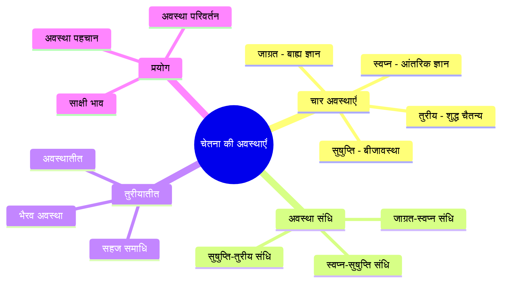
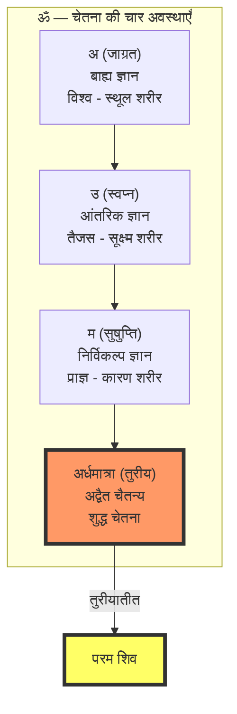
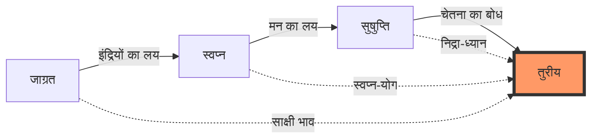
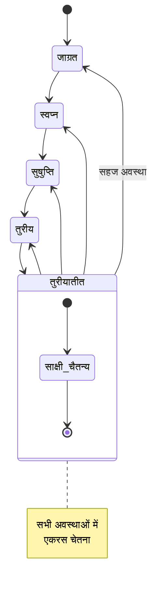
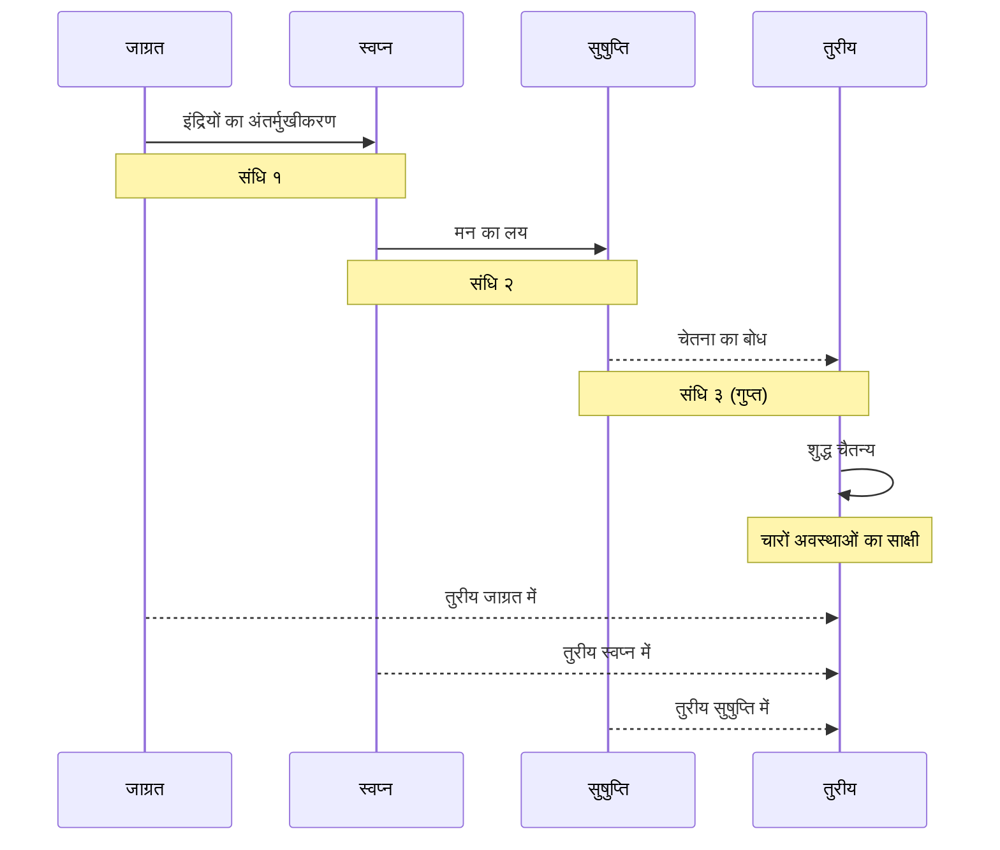

# अध्याय १०: चेतना की अवस्थाएँ

> **पूर्वापेक्षा:** अध्याय ९ — भावना और आनंद तकनीकें
> **अगला:** अध्याय ११ — उपाय तंत्र: आणव, शाक्त, शांभव

इस अध्याय में हम विज्ञान भैरव तंत्र और कश्मीर शैव दर्शन में वर्णित चेतना की चार मूल अवस्थाओं — जाग्रत, स्वप्न, सुषुप्ति और तुरीय — का गहन अध्ययन करेंगे। यह अध्याय बताएगा कि कैसे प्रत्येक अवस्था एक दूसरे में रूपांतरित होती है और कैसे इन अवस्थाओं के संधि-बिंदुओं पर शुद्ध चैतन्य का साक्षात्कार होता है। तुरीयातीत (चौथी से परे) की अवस्था को भी विस्तार से समझाएगा।

---

## सीखने के उद्देश्य



इस अध्याय को पूरा करने के बाद आप:

- चेतना की चार अवस्थाओं (जाग्रत, स्वप्न, सुषुप्ति, तुरीय) को गहराई से समझेंगे
- प्रत्येक अवस्था से संबंधित ध्यान तकनीकों को जानेंगे
- अवस्थाओं के संधि-बिंदुओं (transition points) पर ध्यान करना सीखेंगे
- तुरीयातीत — चौथी से परे की अवस्था — को समझेंगे
- मांडूक्य उपनिषद् के चार पादों का तांत्रिक दृष्टिकोण से अध्ययन करेंगे
- TypeScript में चेतना अवस्था ट्रैकर बनाएँगे

---

## सिद्धांत: चेतना की चार अवस्थाएँ

### मांडूक्य उपनिषद् का आधार

चेतना की चार अवस्थाओं का वर्णन सबसे पहले मांडूक्य उपनिषद् में मिलता है। यह उपनिषद् ओंकार (ॐ) के चार मात्राओं — अ, उ, म, और अर्धमात्रा — को चेतना की चार अवस्थाओं से जोड़ता है।



### १. जाग्रत अवस्था (Waking State — जाग्रत्)

**मांडूक्य मंत्र (प्रथम पाद):**

> जाग्रितः स्थूलभुक् विश्वः सप्तभिः सप्तदशभिः वा।
> सूक्ष्मभुक् विभुः प्राज्ञः इति चतुर्थः॥

**अर्थ:** जाग्रत अवस्था में चेतना बाह्य विषयों का भोग करती है। इस अवस्था में स्थूल शरीर (विश्व) सक्रिय है। इसके १९ मुख (७ ज्ञानेंद्रियाँ + ७ कर्मेंद्रियाँ + ५ प्राण) होते हैं।

**लक्षण:**
- बाह्य जगत का ज्ञान (बहिःप्रज्ञ)
- स्थूल शरीर की चेतना
- इंद्रियों के माध्यम से अनुभव
- काल, देश, कारण का बोध
- द्वैत का अनुभव

**तांत्रिक दृष्टिकोण:** जाग्रत अवस्था में भी चैतन्य का साक्षात्कार संभव है। जब आप जाग्रत अवस्था में होते हुए भी अपने भीतर के साक्षी को पहचान लेते हैं — तब जाग्रत ही समाधि बन जाती है।

**जाग्रत के लिए ध्यान तकनीक:**

> जाग्रदवस्थायां यः स्थित्वा भावयेत्पराम्।
> स जीवन्मुक्त इत्युक्तो न तस्य पुनरावृतिः॥

**विधि:** 
१. आँखें खुली रखें, सामान्य रूप से दैनिक कार्य करते रहें।
२. लेकिन भीतर एक साक्षी बना रहे — जो देख रहा है कि शरीर काम कर रहा है, मन सोच रहा है।
३. इस दोहरी चेतना (dual awareness) को विकसित करें।
४. धीरे-धीरे यह साक्षी स्वतः स्थिर हो जाता है।

### २. स्वप्न अवस्था (Dream State — स्वप्नः)

**मांडूक्य मंत्र (द्वितीय पाद):**

> स्वप्नः सूक्ष्मभुक् तैजसः सप्तभिः सप्तदशभिः वा।
> सूक्ष्मभुक् विभुः प्राज्ञः इति चतुर्थः॥

**अर्थ:** स्वप्न अवस्था में चेतना सूक्ष्म विषयों का भोग करती है। तैजस (सूक्ष्म शरीर) सक्रिय है। इस अवस्था में बाह्य जगत का ज्ञान नहीं रहता, केवल आंतरिक संस्कारों का प्रक्षेपण होता है।

**लक्षण:**
- आंतरिक जगत का ज्ञान (अन्तःप्रज्ञ)
- सूक्ष्म शरीर की चेतना
- मन के संस्कारों का प्रकटीकरण
- काल-देश का बोध किंचित् रहता है
- अर्ध-द्वैत का अनुभव

**तांत्रिक दृष्टिकोण:** तंत्र स्वप्न को चेतना की एक महत्वपूर्ण अवस्था मानता है। स्वप्न में जो घटित होता है, वह मन के गहरे संस्कारों (वासनाओं) का प्रकटीकरण है। तंत्र में 'स्वप्न-ध्यान' (dream yoga) का विशेष महत्व है।

**स्वप्न के लिए ध्यान तकनीक:**

> स्वप्ने जाग्रदवस्थायां द्वयोः संधिं परामृशेत्।
> तदा तुरीयं विज्ञाय ब्रह्मभूयाय कल्पते॥

**विधि:**
१. सोने से पहले संकल्प करें: "मैं स्वप्न में भी जाग्रत रहूँगा"।
२. जब स्वप्न आए, तो पहचानें — "यह स्वप्न है"।
३. स्वप्न के भीतर साक्षी बने रहें।
४. यह तकनीक स्वप्न-योग (lucid dreaming) का आधार है।

### ३. सुषुप्ति अवस्था (Deep Sleep — सुषुप्तिः)

**मांडूक्य मंत्र (तृतीय पाद):**

> सुषुप्तिः एकीभूतः प्रज्ञानघन एवानन्दमयः।
> प्राज्ञः इति चतुर्थः॥

**अर्थ:** सुषुप्ति (गहन निद्रा) में चेतना एकीभूत हो जाती है। यह प्रज्ञान-घन (चेतना का ठोस रूप) है और आनंदमय है। इस अवस्था में किसी भी प्रकार की इच्छा या द्वंद्व नहीं होता।

**लक्षण:**
- न बाह्य ज्ञान, न आंतरिक ज्ञान
- प्रज्ञान-घन (चेतना का संघनन)
- आनंदमयी अवस्था
- काल-देश का पूर्ण लय
- निर्विकल्प अवस्था

**तांत्रिक दृष्टिकोण:** सुषुप्ति तुरीय से बहुत निकट है। अंतर केवल इतना है कि सुषुप्ति में चेतना का केंद्रीकरण (involution) है किंतु उसका बोध नहीं है, जबकि तुरीय में चेतना स्वयं को जानती है।

**सुषुप्ति के लिए ध्यान तकनीक:**



### ४. तुरीय अवस्था (The Fourth State — तुरीयः)

**मांडूक्य मंत्र (चतुर्थ पाद):**

> न प्रज्ञं नाप्रज्ञं नोभयतःप्रज्ञं न प्रज्ञानघनम्।
> अदृष्टमव्यवहार्यमग्राह्यमलक्षणम्॥

**अर्थ:** तुरीय वह अवस्था है जो न प्रज्ञ है, न अप्रज्ञ, न दोनों, न प्रज्ञान-घन। यह अदृष्ट (न देखा जा सकने वाला), अव्यवहार्य (व्यवहार में न आने वाला), अग्राह्य (पकड़ में न आने वाला), और अलक्षण (लक्षणरहित) है।

**लक्षण:**
- शुद्ध चैतन्य — जो अवस्थाओं का साक्षी है
- अद्वैत — द्वैत का पूर्ण अभाव
- अनिर्वचनीय — शब्दों के परे
- शांत — सभी विक्षेपों से रहित
- एकरस — अपरिवर्तनीय

**तुरीय के लिए ध्यान तकनीक:**

> तुरीयं पदमासाद्य तिष्ठेदेकाग्रमानसः।
> यत्र यत्र मनो याति तत्र तत्र समाधयः॥

**विधि:**
१. किसी भी अवस्था में रहते हुए — जाग्रत, स्वप्न, या सुषुप्ति — चैतन्य के साक्षी को पहचानें।
२. यह साक्षी तीनों अवस्थाओं में समान रूप से विद्यमान है।
३. जो तीनों अवस्थाओं को जानता है, वह स्वयं कोई अवस्था नहीं है।
४. वही तुरीय है — चौथी अवस्था।

### तुरीयातीत (Beyond the Fourth — तुरीयातीत)

तुरीय से भी परे एक अवस्था है — तुरीयातीत। कश्मीर शैव दर्शन में इसे 'अनुत्तर' (सर्वोच्च) या 'भैरव अवस्था' कहते हैं।

> न तुरीयं न तुर्यातीतं यत्र सर्वं समं जगत्।
> तद्ब्रह्म परमं शान्तं न तत्र ध्यानं न ध्येयकम्॥

**अर्थ:** जहाँ न तुरीय है, न तुरीयातीत — जहाँ सारा जगत समान है। वह परम शांत ब्रह्म है — जहाँ न ध्यान है, न ध्येय।

**अभिव्यक्ति:** तुरीयातीत में सभी अवस्थाएँ एक साथ विद्यमान होती हैं। यह 'सहज समाधि' है — जहाँ समाधि और व्यवहार में कोई भेद नहीं रहता।



---

## चेतना अवस्था तकनीकें (विस्तृत)

### तकनीक १: जाग्रत-समाधि (Waking Meditation)

**मूल श्लोक:**

> जाग्रत्येव समाधिस्थो जाग्रत्स्वप्नविवर्जितः।
> यः स जीवन्मुक्तः प्रोक्तो जीवन्मुक्तः स शाश्वतः॥

**अर्थ:** जो जाग्रत अवस्था में ही समाधि में स्थित है, जो जाग्रत-स्वप्न से रहित है — वह जीवन्मुक्त कहा गया है। वही शाश्वत है।

**विस्तृत विधि:**

१. **चरण १ — शरीर जागरण:** शरीर को सीधा रखें, आँखें खुली रखें। शरीर जाग्रत है।
२. **चरण २ — मन का साक्षी:** मन को जैसा है वैसा रहने दें। उसे नियंत्रित करने की कोशिश न करें।
३. **चरण ३ — दोहरी चेतना:** एक ओर शरीर जाग्रत है, दूसरी ओर भीतर एक साक्षी है जो सब देख रहा है।
४. **चरण ४ — अभेद:** देखें कि साक्षी और जाग्रत में कोई भेद नहीं है। साक्षी ही जाग्रत है, जाग्रत ही साक्षी है।

### तकनीक २: स्वप्न-योग (Dream Yoga)

**मूल श्लोक:**

> स्वप्ने जाग्रदवस्थां तु यः करोति स योगवित्।
> स्वप्नजागरयोर्मध्ये परं ब्रह्माधिगच्छति॥

**अर्थ:** जो स्वप्न में जाग्रत अवस्था को करता है, वह योगी है। स्वप्न और जाग्रत के बीच वह परम ब्रह्म को प्राप्त करता है।

**विस्तृत विधि:**

१. **चरण १ — संकल्प:** रात्रि में सोने से पहले दृढ़ संकल्प करें: "मैं स्वप्न में जागरूक रहूँगा।"
२. **चरण २ — स्वप्न-चिह्न:** दिन में बार-बार पूछें — "क्या यह स्वप्न है?" यह आदत रात्रि में भी स्वचालित हो जाएगी।
३. **चरण ३ — स्वप्न पहचान:** जब स्वप्न आए, तो पहचानें — "यह स्वप्न है। मैं जाग्रत हूँ।" यह ल्यूसिड ड्रीमिंग का क्षण है।
४. **चरण ४ — स्वप्न रूपांतरण:** स्वप्न में साक्षी बने रहें। स्वप्न की सामग्री बदल सकती है — आप स्थिर रहें।
५. **चरण ५ — स्वप्न-पार:** स्वप्न को पार कर शुद्ध चैतन्य में स्थित हों।

### तकनीक ३: सुषुप्ति-बोध (Conscious Deep Sleep)

**मूल श्लोक:**

> या निद्रा सुषुप्तिर्या च तस्यां चेतनतां गतः।
> स चेतनः सदा ध्यायेत्स एव परमेश्वरः॥

**अर्थ:** जो निद्रा और सुषुप्ति में चेतनता को प्राप्त होता है — वह चेतन सदा ध्यान करता है, वही परमेश्वर है।

**विस्तृत विधि:**

१. **चरण १ — शयन:** बिस्तर पर लेटें, शरीर को पूरी तरह ढीला छोड़ दें।
२. **चरण २ — इंद्रिय लय:** आँखें बंद करें, श्वास को स्वाभाविक होने दें। इंद्रियों को भीतर लीन होने दें।
३. **चरण ३ — निद्रा आगमन:** जैसे-जैसे निद्रा आती है, उसका स्वागत करें। उससे लड़ें नहीं।
४. **चरण ४ — संधि-बोध:** जहाँ जाग्रत समाप्त होता है और निद्रा शुरू होती है — उस संधि को पकड़ें।
५. **चरण ५ — चेतन निद्रा:** निद्रा को आने दें, लेकिन चेतना की एक नन्हीं लौ जलाए रखें।

### तकनीक ४: तुरीय-साक्षात्कार (Realizing the Fourth)

**मूल श्लोक:**

> जाग्रत्स्वप्नसुषुप्त्यादि दैशिकं कालिकं तथा।
> विभागं यः परित्यज्य तिष्ठेदेको निरन्तरः॥
> तुरीयं तत्परं ब्रह्म निर्गुणं निष्क्रियं शिवम्॥

**अर्थ:** जो जाग्रत, स्वप्न, सुषुप्ति आदि का दैशिक और कालिक विभाग छोड़कर एकरस निरंतर स्थित होता है — वह तुरीय परम ब्रह्म, निर्गुण, निष्क्रिय शिव है।

**विस्तृत विधि:**

१. **चरण १ — अवस्था पहचान:** पहले तीनों अवस्थाओं को अलग-अलग पहचानें।
२. **चरण २ — साक्षी पहचान:** प्रत्येक अवस्था में जो एक जानने वाला है — उसे पहचानें।
३. **चरण ३ — अवस्था स्विचिंग:** जाग्रत से स्वप्न, स्वप्न से सुषुप्ति — इन संधियों पर ध्यान करें।
४. **चरण ४ — साक्षी स्थिरीकरण:** देखें कि साक्षी कभी नहीं बदलता। अवस्थाएँ बदलती हैं — साक्षी स्थिर है।
५. **चरण ५ — तुरीय स्थापना:** तीनों अवस्थाओं में एक साथ साक्षी बने रहना — यह तुरीय है।

### तकनीक ५-८: अवस्था संधि तकनीकें

#### ५. जाग्रत-स्वप्न संधि

**विधि:**
- संध्या के समय, जब दिन ढलता है और रात आने लगती है।
- आँखें बंद करें, जाग्रत की अंतिम स्मृतियों को देखें।
- देखें कि कैसे जाग्रत का बाह्य ज्ञान स्वप्न के आंतरिक ज्ञान में बदलता है।
- इस संधि पर — न जाग्रत, न स्वप्न — वहाँ ठहरें।

#### ६. स्वप्न-सुषुप्ति संधि

**विधि:**
- गहरी निद्रा में जाने से पहले का क्षण।
- जब स्वप्न समाप्त होने लगते हैं और गहन निद्रा आने लगती है।
- इस संधि पर चेतना का एक विशेष विस्तार होता है।

#### ७. सुषुप्ति-जाग्रत संधि

**विधि:**
- प्रातः जागने का क्षण — सबसे महत्वपूर्ण संधि।
- जब निद्रा छूट रही हो और जाग्रत आ रहा हो।
- इस क्षण में चेतना सबसे शुद्ध होती है — बिना किसी संस्कार के।
- इस निर्विकल्प क्षण को पकड़ें और विस्तारित करें।

#### ८. तुरीय-अवस्था संधि (Turīya State Integration)

**मूल श्लोक:**

> जाग्रत्स्वप्नसुषुप्त्यादि सर्वावस्थासु यः स्थितः।
> एक एव परो देवः सर्वत्र समदर्शनः॥

**अर्थ:** जो जाग्रत, स्वप्न, सुषुप्ति आदि सभी अवस्थाओं में एक समान स्थित है — वह एक परम देव सर्वत्र समदर्शी है।



---

## TypeScript: चेतना अवस्था ट्रैकर (Consciousness State Tracker)

नीचे एक TypeScript आधारित चेतना अवस्था ट्रैकर है जो विज्ञान भैरव तंत्र की चार अवस्थाओं को रिकॉर्ड और विश्लेषित करता है।

```typescript
/**
 * चेतना अवस्था ट्रैकर (Consciousness State Tracker)
 * 
 * यह एप्लिकेशन विज्ञान भैरव तंत्र और मांडूक्य उपनिषद् में वर्णित
 * चेतना की चार अवस्थाओं को ट्रैक करने और विश्लेषण करने में मदद करता है।
 */

// ===== टाइप परिभाषाएँ (Type Definitions) =====

/** चेतना की चार मूल अवस्थाएँ */
export enum ChetnaAvastha {
    JAAGRAT = 'जाग्रत',         // Waking
    SWAPNA = 'स्वप्न',           // Dreaming
    SUSH UPTI = 'सुषुप्ति',     // Deep Sleep
    TURIYA = 'तुरीय',           // The Fourth
    TURIYATITA = 'तुरीयातीत',   // Beyond the Fourth
}

/** अवस्था के उप-प्रकार */
export enum AvasthaSubType {
    // जाग्रत उप-प्रकार
    BAHYA_JAAGRAT = 'बाह्य-जाग्रत',       // External waking
    SAKSHI_JAAGRAT = 'साक्षी-जाग्रत',     // Witness waking
    
    // स्वप्न उप-प्रकार
    SANSKARA_SWAPNA = 'संस्कार-स्वप्न',     // Karmic dream
    LUCID_SWAPNA = 'ल्यूसिड-स्वप्न',       // Lucid dream
    
    // सुषुप्ति उप-प्रकार
    GADHA_SUSH UPTI = 'गाढ़-सुषुप्ति',     // Deep dreamless
    CHETANA_SUSH UPTI = 'चेतन-सुषुप्ति',   // Conscious deep sleep
    
    // तुरीय उप-प्रकार
    NIRVIKALPA_TURIYA = 'निर्विकल्प-तुरीय',
    SAHAJA_TURIYA = 'सहज-तुरीय',
}

/** इंद्रियों की स्थिति */
export enum IndriyaState {
    ACTIVE = 'सक्रिय',        // बाह्य विषयों में
    TURNED_IN = 'अंतर्मुख',   // भीतर की ओर
    ABSORBED = 'लीन',         // पूर्ण विलीन
    TRANSCENDED = 'अतीत',     // अतिक्रांत
}

/** मन की स्थिति */
export enum MindState {
    WANDERING = 'भ्रमणशील',
    ONE_POINTED = 'एकाग्र',
    RESTLESS = 'अशांत',
    CALM = 'शांत',
    STILL = 'स्थिर',
    TRANSCENDED = 'अतीत',
}

/** चेतना अवस्था का स्नैपशॉट */
export interface AvasthaSnapshot {
    id: string;
    timestamp: Date;
    avastha: ChetnaAvastha;
    subType?: AvasthaSubType;
    indriyaState: IndriyaState;
    mindState: MindState;
    bodyAwareness: number;      // शरीर का बोध 0-10
    thoughtActivity: number;    // विचार गतिविधि 0-10
    blissLevel: number;         // आनंद स्तर 0-10
    witnessPresent: boolean;    // साक्षी भाव है या नहीं
    transitionPoint: boolean;   // अवस्था संधि पर है या नहीं
    duration: number;           // इस अवस्था में समय (सेकंड)
    notes: string;
}

/** दैनिक अवस्था सारांश */
export interface DailyAvasthaSummary {
    date: Date;
    avasthaDistribution: Map<ChetnaAvastha, number>;
    totalSessions: number;
    totalDuration: number;
    witnessRatio: number;
    averageBliss: number;
    transitionCount: number;
    dominantAvastha: ChetnaAvastha;
    turiyaFrequency: number;
}

/** अवस्था संधि अभिलेख */
export interface AvasthaTransition {
    id: string;
    timestamp: Date;
    fromAvastha: ChetnaAvastha;
    toAvastha: ChetnaAvastha;
    transitionDuration: number;  // मिलीसेकंड में
    insights: string[];
    consciousnessLevel: number;  // 0-10
}

// ===== मुख्य ट्रैकर क्लास =====

export class ChetnaAvasthaTracker {
    private snapshots: AvasthaSnapshot[] = [];
    private transitions: AvasthaTransition[] = [];
    private currentSession: AvasthaSnapshot | null = null;

    /** नया अवस्था स्नैपशॉट लें */
    takeSnapshot(params: {
        avastha: ChetnaAvastha;
        subType?: AvasthaSubType;
        mindState: MindState;
        bodyAwareness: number;
        thoughtActivity: number;
        blissLevel: number;
        witnessPresent: boolean;
        transitionPoint?: boolean;
        notes?: string;
    }): AvasthaSnapshot {
        const snapshot: AvasthaSnapshot = {
            id: this.generateId(),
            timestamp: new Date(),
            avastha: params.avastha,
            subType: params.subType,
            indriyaState: this.determineIndriyaState(params.avastha),
            mindState: params.mindState,
            bodyAwareness: Math.min(10, Math.max(0, params.bodyAwareness)),
            thoughtActivity: Math.min(10, Math.max(0, params.thoughtActivity)),
            blissLevel: Math.min(10, Math.max(0, params.blissLevel)),
            witnessPresent: params.witnessPresent,
            transitionPoint: params.transitionPoint || false,
            duration: 0,
            notes: params.notes || '',
        };

        this.snapshots.push(snapshot);
        this.currentSession = snapshot;

        // यदि अवस्था संधि है, तो ट्रांज़िशन रिकॉर्ड करें
        if (params.transitionPoint && this.transitions.length > 0) {
            this.recordTransition(snapshot);
        }

        return snapshot;
    }

    /** नया सत्र शुरू करें */
    startSession(avastha: ChetnaAvastha): void {
        this.takeSnapshot({
            avastha,
            mindState: MindState.ONE_POINTED,
            bodyAwareness: 5,
            thoughtActivity: 5,
            blissLevel: 1,
            witnessPresent: false,
        });
    }

    /** सत्र समाप्त करें और अवधि अपडेट करें */
    endSession(): AvasthaSnapshot | null {
        if (!this.currentSession) return null;
        
        const endTime = new Date();
        const sessionStart = this.currentSession.timestamp;
        const durationMs = endTime.getTime() - sessionStart.getTime();
        
        // अंतिम स्नैपशॉट की अवधि अपडेट करें
        const lastSnap = this.snapshots[this.snapshots.length - 1];
        if (lastSnap) {
            lastSnap.duration = Math.round(durationMs / 1000);
        }
        
        const session = this.currentSession;
        this.currentSession = null;
        return session;
    }

    /** अवस्था संधि रिकॉर्ड करें */
    recordTransition(toSnapshot: AvasthaSnapshot): void {
        const previousSnap = this.snapshots.length >= 2 
            ? this.snapshots[this.snapshots.length - 2] 
            : null;

        if (!previousSnap) return;

        const transition: AvasthaTransition = {
            id: this.generateId(),
            timestamp: toSnapshot.timestamp,
            fromAvastha: previousSnap.avastha,
            toAvastha: toSnapshot.avastha,
            transitionDuration: toSnapshot.timestamp.getTime() - previousSnap.timestamp.getTime(),
            insights: [],
            consciousnessLevel: toSnapshot.witnessPresent ? 8 : 3,
        };

        this.transitions.push(transition);
    }

    /** मांडूक्य श्लोक के अनुसार अवस्था का विश्लेषण */
    getMandukyaAnalysis(avastha: ChetnaAvastha): {
        shloka: string;
        meaning: string;
        characteristics: string[];
        meditation: string;
    } {
        const analyses: Record<ChetnaAvastha, {
            shloka: string;
            meaning: string;
            characteristics: string[];
            meditation: string;
        }> = {
            [ChetnaAvastha.JAAGRAT]: {
                shloka: 'जाग्रतितः स्थूलभुक् विश्वः सप्तभिः सप्तदशभिः वा।',
                meaning: 'जाग्रत अवस्था में स्थूल का भोग करने वाला विश्व (स्थूल शरीर) सक्रिय है।',
                characteristics: [
                    'बाह्य ज्ञान (बहिःप्रज्ञ)',
                    'स्थूल शरीर चेतना',
                    '१९ मुख (इंद्रियाँ + प्राण)',
                    'द्वैत का अनुभव',
                    'काल-देश का पूर्ण बोध',
                ],
                meditation: 'कार्य करते हुए भीतर साक्षी बने रहें। जाग्रत में ही तुरीय को देखें।',
            },
            [ChetnaAvastha.SWAPNA]: {
                shloka: 'स्वप्नः सूक्ष्मभुक् तैजसः सप्तभिः सप्तदशभिः वा।',
                meaning: 'स्वप्न अवस्था में सूक्ष्म का भोग करने वाला तैजस (सूक्ष्म शरीर) सक्रिय है।',
                characteristics: [
                    'आंतरिक ज्ञान (अन्तःप्रज्ञ)',
                    'सूक्ष्म शरीर चेतना',
                    'संस्कारों का प्रक्षेपण',
                    'स्वप्न-योग का मार्ग',
                    'अर्ध-द्वैत',
                ],
                meditation: 'स्वप्न में जागरूक रहें। स्वप्न को चेतना का खेल देखें।',
            },
            [ChetnaAvastha.SUSH UPTI]: {
                shloka: 'सुषुप्तिः एकीभूतः प्रज्ञानघन एवानन्दमयः।',
                meaning: 'सुषुप्ति में चेतना एकीभूत, प्रज्ञान-घन और आनंदमय है।',
                characteristics: [
                    'नीरव ज्ञान (प्रज्ञानघन)',
                    'कारण शरीर चेतना',
                    'द्वैत का पूर्ण अभाव',
                    'आनंदमयी अवस्था',
                    'तुरीय का निकटतम द्वार',
                ],
                meditation: 'गहन निद्रा में भी चेतना की एक लौ जलाए रखें।',
            },
            [ChetnaAvastha.TURIYA]: {
                shloka: 'न प्रज्ञं नाप्रज्ञं नोभयतःप्रज्ञं न प्रज्ञानघनम्।',
                meaning: 'न प्रज्ञ, न अप्रज्ञ, न दोनों, न प्रज्ञान-घन — यह तुरीय है।',
                characteristics: [
                    'शुद्ध चैतन्य',
                    'सभी अवस्थाओं का साक्षी',
                    'अनिर्वचनीय',
                    'अद्वैत',
                    'नित्य, शुद्ध, बुद्ध, मुक्त',
                ],
                meditation: 'तीनों अवस्थाओं में एकरस रहने वाले साक्षी को पहचानें।',
            },
            [ChetnaAvastha.TURIYATITA]: {
                shloka: 'न तुरीयं न तुर्यातीतं यत्र सर्वं समं जगत्।',
                meaning: 'जहाँ न तुरीय है, न तुरीयातीत — जहाँ सारा जगत समान है।',
                characteristics: [
                    'अवस्थातीत',
                    'सहज समाधि',
                    'भैरव अवस्था',
                    'समता (equanimity)',
                    'सर्वत्र समदर्शन',
                ],
                meditation: 'अवस्थाओं से परे जाएँ। भैरव अवस्था में स्थित हों।',
            },
        };

        return analyses[avastha] || analyses[ChetnaAvastha.TURIYA];
    }

    /** ॐ के चार मात्राओं के साथ अवस्था का संबंध */
    getOmMapping(avastha: ChetnaAvastha): {
        matra: string;
        description: string;
        associated: string;
    } {
        const mappings: Record<ChetnaAvastha, {
            matra: string;
            description: string;
            associated: string;
        }> = {
            [ChetnaAvastha.JAAGRAT]: {
                matra: 'अ (अकार)',
                description: 'जाग्रत अवस्था — बाह्य जगत का ज्ञान',
                associated: 'विश्व (स्थूल शरीर)',
            },
            [ChetnaAvastha.SWAPNA]: {
                matra: 'उ (उकार)',
                description: 'स्वप्न अवस्था — आंतरिक जगत का ज्ञान',
                associated: 'तैजस (सूक्ष्म शरीर)',
            },
            [ChetnaAvastha.SUSH UPTI]: {
                matra: 'म (मकार)',
                description: 'सुषुप्ति अवस्था — निर्विकल्प ज्ञान',
                associated: 'प्राज्ञ (कारण शरीर)',
            },
            [ChetnaAvastha.TURIYA]: {
                matra: 'अर्धमात्रा',
                description: 'तुरीय — शुद्ध चैतन्य, अद्वैत',
                associated: 'आत्मा (शुद्ध चेतना)',
            },
            [ChetnaAvastha.TURIYATITA]: {
                matra: 'अर्धमात्रा के पार',
                description: 'तुरीयातीत — परम शिव, अनुत्तर',
                associated: 'परम ब्रह्म',
            },
        };

        return mappings[avastha] || mappings[ChetnaAvastha.TURIYA];
    }

    /** अवस्था वितरण प्रतिशत */
    getAvasthaDistribution(): Map<ChetnaAvastha, number> {
        const distribution = new Map<ChetnaAvastha, number>();
        const total = this.snapshots.length || 1;

        for (const avastha of Object.values(ChetnaAvastha)) {
            const count = this.snapshots.filter(s => s.avastha === avastha).length;
            distribution.set(avastha, (count / total) * 100);
        }

        return distribution;
    }

    /** दैनिक सारांश उत्पन्न करें */
    generateDailySummary(date: Date): DailyAvasthaSummary | null {
        const dateKey = date.toISOString().split('T')[0];
        const daySnapshots = this.snapshots.filter(
            s => s.timestamp.toISOString().split('T')[0] === dateKey
        );

        if (daySnapshots.length === 0) return null;

        const distribution = new Map<ChetnaAvastha, number>();
        let totalBliss = 0;
        let witnessCount = 0;
        let transitionCount = 0;
        let turiyaCount = 0;

        for (const snap of daySnapshots) {
            distribution.set(
                snap.avastha,
                (distribution.get(snap.avastha) || 0) + 1
            );
            totalBliss += snap.blissLevel;
            if (snap.witnessPresent) witnessCount++;
            if (snap.transitionPoint) transitionCount++;
            if (snap.avastha === ChetnaAvastha.TURIYA || 
                snap.avastha === ChetnaAvastha.TURIYATITA) {
                turiyaCount++;
            }
        }

        let dominantAvastha = ChetnaAvastha.JAAGRAT;
        let maxCount = 0;
        distribution.forEach((count, avastha) => {
            if (count > maxCount) {
                maxCount = count;
                dominantAvastha = avastha;
            }
        });

        return {
            date,
            avasthaDistribution: distribution,
            totalSessions: daySnapshots.length,
            totalDuration: daySnapshots.reduce((sum, s) => sum + s.duration, 0),
            witnessRatio: witnessCount / daySnapshots.length,
            averageBliss: totalBliss / daySnapshots.length,
            transitionCount,
            dominantAvastha,
            turiyaFrequency: turiyaCount / daySnapshots.length,
        };
    }

    /** अवस्था संधियों का विश्लेषण */
    analyzeTransitions(): {
        total: number;
        averageConsciousness: number;
        commonPath: string;
        insights: string[];
    } {
        if (this.transitions.length === 0) {
            return {
                total: 0,
                averageConsciousness: 0,
                commonPath: 'कोई संधि रिकॉर्ड नहीं',
                insights: ['अवस्था संधियों पर ध्यान देना शुरू करें'],
            };
        }

        const totalConsciousness = this.transitions.reduce(
            (sum, t) => sum + t.consciousnessLevel, 0
        );

        // सबसे सामान्य संधि पथ
        const pathCount = new Map<string, number>();
        this.transitions.forEach(t => {
            const path = `${t.fromAvastha} → ${t.toAvastha}`;
            pathCount.set(path, (pathCount.get(path) || 0) + 1);
        });

        let commonPath = '';
        let maxPathCount = 0;
        pathCount.forEach((count, path) => {
            if (count > maxPathCount) {
                maxPathCount = count;
                commonPath = path;
            }
        });

        return {
            total: this.transitions.length,
            averageConsciousness: totalConsciousness / this.transitions.length,
            commonPath,
            insights: [
                'अवस्था संधियाँ चेतना के सबसे गहरे द्वार हैं',
                'जाग्रत-स्वप्न संधि पर विशेष ध्यान दें',
                'प्रातः जागरण का क्षण सबसे महत्वपूर्ण है',
            ],
        };
    }

    /** चेतना विकास रिपोर्ट */
    generateDevelopmentReport(): string {
        const distribution = this.getAvasthaDistribution();
        const dailySummary = this.generateDailySummary(new Date());
        const transitionAnalysis = this.analyzeTransitions();
        
        const report: string[] = [];
        report.push('═══════════════════════════════════════════');
        report.push('🧘 चेतना अवस्था विकास रिपोर्ट');
        report.push('═══════════════════════════════════════════');
        report.push('');

        report.push('📊 अवस्था वितरण:');
        distribution.forEach((percentage, avastha) => {
            const bar = '█'.repeat(Math.round(percentage / 10));
            report.push(`  ${avastha}: ${bar} ${percentage.toFixed(1)}%`);
        });

        report.push('');
        if (dailySummary) {
            report.push(`📅 आज का सारांश:`);
            report.push(`  सत्र: ${dailySummary.totalSessions}`);
            report.push(`  साक्षी अनुपात: ${(dailySummary.witnessRatio * 100).toFixed(1)}%`);
            report.push(`  औसत आनंद: ${dailySummary.averageBliss.toFixed(1)}/10`);
            report.push(`  तुरीय आवृत्ति: ${(dailySummary.turiyaFrequency * 100).toFixed(1)}%`);
        }

        report.push('');
        report.push(`🔄 संधि विश्लेषण:`);
        report.push(`  कुल संधियाँ: ${transitionAnalysis.total}`);
        report.push(`  औसत चेतना स्तर: ${transitionAnalysis.averageConsciousness.toFixed(1)}/10`);
        report.push(`  सामान्य पथ: ${transitionAnalysis.commonPath}`);

        report.push('');
        const witnessRatio = this.snapshots.filter(s => s.witnessPresent).length / this.snapshots.length || 0;
        report.push(`🎯 साक्षी भाव विकास: ${(witnessRatio * 100).toFixed(1)}%`);

        if (witnessRatio > 0.5) {
            report.push('✅ साक्षी भाव स्थिर हो रहा है। तुरीय की ओर अग्रसर हैं।');
        } else {
            report.push('📌 साक्षी भाव का अभ्यास जारी रखें। संधियों पर अधिक ध्यान दें।');
        }

        return report.join('\n');
    }

    // ===== सहायक विधियाँ =====

    private generateId(): string {
        return `avastha-${Date.now()}-${Math.random().toString(36).substr(2, 9)}`;
    }

    private determineIndriyaState(avastha: ChetnaAvastha): IndriyaState {
        switch (avastha) {
            case ChetnaAvastha.JAAGRAT:
                return IndriyaState.ACTIVE;
            case ChetnaAvastha.SWAPNA:
                return IndriyaState.TURNED_IN;
            case ChetnaAvastha.SUSH UPTI:
                return IndriyaState.ABSORBED;
            case ChetnaAvastha.TURIYA:
            case ChetnaAvastha.TURIYATITA:
                return IndriyaState.TRANSCENDED;
        }
    }

    getSnapshots(): ReadonlyArray<AvasthaSnapshot> {
        return this.snapshots;
    }

    getTransitions(): ReadonlyArray<AvasthaTransition> {
        return this.transitions;
    }
}

// ===== उपयोग उदाहरण (Example Usage) =====

function demonstrateChetnaTracker(): void {
    const tracker = new ChetnaAvasthaTracker();

    // सुबह — जाग्रत अवस्था
    tracker.takeSnapshot({
        avastha: ChetnaAvastha.JAAGRAT,
        subType: AvasthaSubType.SAKSHI_JAAGRAT,
        mindState: MindState.CALM,
        bodyAwareness: 7,
        thoughtActivity: 4,
        blissLevel: 5,
        witnessPresent: true,
        notes: 'प्रातःकाल का ध्यान — साक्षी भाव जाग्रत है',
    });

    // दोपहर — कार्य में जाग्रत
    tracker.takeSnapshot({
        avastha: ChetnaAvastha.JAAGRAT,
        subType: AvasthaSubType.BAHYA_JAAGRAT,
        mindState: MindState.WANDERING,
        bodyAwareness: 3,
        thoughtActivity: 8,
        blissLevel: 3,
        witnessPresent: false,
        notes: 'कार्य में व्यस्त — साक्षी भाव खो गया',
    });

    // स्वप्न सत्र
    tracker.takeSnapshot({
        avastha: ChetnaAvastha.SWAPNA,
        subType: AvasthaSubType.LUCID_SWAPNA,
        mindState: MindState.ONE_POINTED,
        bodyAwareness: 1,
        thoughtActivity: 6,
        blissLevel: 7,
        witnessPresent: true,
        transitionPoint: true,
        notes: 'ल्यूसिड स्वप्न — स्वप्न में जाग्रत',
    });

    // गहन निद्रा
    tracker.takeSnapshot({
        avastha: ChetnaAvastha.SUSH UPTI,
        mindState: MindState.TRANSCENDED,
        bodyAwareness: 0,
        thoughtActivity: 0,
        blissLevel: 9,
        witnessPresent: false,
        notes: 'गहन निद्रा — चेतना एकीभूत',
    });

    // तुरीय का क्षण
    tracker.takeSnapshot({
        avastha: ChetnaAvastha.TURIYA,
        mindState: MindState.STILL,
        bodyAwareness: 4,
        thoughtActivity: 1,
        blissLevel: 10,
        witnessPresent: true,
        notes: 'तुरीय — शुद्ध चैतन्य का साक्षात्कार',
    });

    // मांडूक्य विश्लेषण
    const analysis = tracker.getMandukyaAnalysis(ChetnaAvastha.TURIYA);
    console.log(`श्लोक: ${analysis.shloka}`);
    console.log(`अर्थ: ${analysis.meaning}`);
    console.log(`लक्षण: ${analysis.characteristics.join(', ')}`);

    // ॐ मैपिंग
    const omMap = tracker.getOmMapping(ChetnaAvastha.SWAPNA);
    console.log(`मात्रा: ${omMap.matra} — ${omMap.description}`);

    // रिपोर्ट
    console.log(tracker.generateDevelopmentReport());
}

demonstrateChetnaTracker();

/**
 * निष्कर्ष:
 * 
 * चेतना की चार अवस्थाएँ (जाग्रत, स्वप्न, सुषुप्ति, तुरीय) हमारे अस्तित्व के
 * चार आयाम हैं। मांडूक्य उपनिषद् के अनुसार, ये चारों ॐ के चार मात्राओं से
 * संबंधित हैं। विज्ञान भैरव तंत्र इन अवस्थाओं को ध्यान का मार्ग बनाता है —
 * हर अवस्था चैतन्य का एक द्वार है।
 * 
 * सबसे महत्वपूर्ण है — अवस्थाओं का साक्षी होना। जाग्रत, स्वप्न, सुषुप्ति —
 * तीनों बदलते हैं, लेकिन जो इन्हें जानता है, वह नहीं बदलता। वह साक्षी ही
 * तुरीय है।
 */
```

---

## सारांश

इस अध्याय में हमने चेतना की अवस्थाओं का गहन अध्ययन किया:

| अवस्था | ॐ मात्रा | शरीर | मुख्य लक्षण | ध्यान विधि |
|---------|----------|------|-------------|-----------|
| जाग्रत | अ | स्थूल (विश्व) | बाह्य ज्ञान | जाग्रत-समाधि |
| स्वप्न | उ | सूक्ष्म (तैजस) | आंतरिक ज्ञान | स्वप्न-योग |
| सुषुप्ति | म | कारण (प्राज्ञ) | निर्विकल्प | चेतन निद्रा |
| तुरीय | अर्धमात्रा | — | शुद्ध चैतन्य | साक्षी-भाव |
| तुरीयातीत | — | — | सहज समाधि | अवस्थातीत |

**मुख्य सीख:** चेतना की अवस्थाएँ बदलती हैं — लेकिन चैतन्य (consciousness) नहीं बदलता। अवस्थाओं का साक्षी बनना ही तुरीय का साक्षात्कार है। सभी अवस्थाओं का आधार एक ही चैतन्य है।

---

## अध्याय प्रश्नोत्तरी (Chapter Quiz)

**प्रश्न १:** मांडूक्य उपनिषद् के अनुसार चेतना की कितनी अवस्थाएँ हैं?

- क) दो
- ख) तीन
- ग) चार
- घ) पाँच

<details>
<summary>उत्तर</summary>
**उत्तर:** ग — मांडूक्य उपनिषद् चार अवस्थाओं का वर्णन करता है: जाग्रत, स्वप्न, सुषुप्ति, तुरीय।
</details>

**प्रश्न २:** ॐ के 'अ' मात्रा का संबंध किस अवस्था से है?

- क) सुषुप्ति
- ख) जाग्रत
- ग) स्वप्न
- घ) तुरीय

<details>
<summary>उत्तर</summary>
**उत्तर:** ख — ॐ के 'अ' (अकार) मात्रा का संबंध जाग्रत अवस्था और विश्व (स्थूल शरीर) से है।
</details>

**प्रश्न ३:** सुषुप्ति अवस्था में चेतना की क्या स्थिति होती है?

- क) बाह्य विषयों में व्यस्त
- ख) संस्कारों का प्रक्षेपण
- ग) एकीभूत, प्रज्ञान-घन
- घ) शुद्ध चैतन्य का बोध

<details>
<summary>उत्तर</summary>
**उत्तर:** ग — सुषुप्ति में चेतना एकीभूत हो जाती है और प्रज्ञान-घन (चेतना का ठोस रूप) बन जाती है।
</details>

**प्रश्न ४:** तुरीय अवस्था का मुख्य लक्षण क्या है?

- क) गहन निद्रा
- ख) स्वप्न दर्शन
- ग) सभी अवस्थाओं का साक्षी होना
- घ) बाह्य जगत में व्यस्तता

<details>
<summary>उत्तर</summary>
**उत्तर:** ग — तुरीय सभी तीनों अवस्थाओं (जाग्रत, स्वप्न, सुषुप्ति) का साक्षी है।
</details>

**प्रश्न ५:** तुरीयातीत अवस्था क्या है?

- क) चौथी अवस्था
- ख) चारों से परे — सभी अवस्थाओं में एकरस स्थिति
- ग) गहन निद्रा
- घ) कोई अवस्था नहीं

<details>
<summary>उत्तर</summary>
**उत्तर:** ख — तुरीयातीत चारों से परे है, जहाँ सभी अवस्थाओं में समानता (equanimity) है।
</details>

**प्रश्न ६:** जाग्रत अवस्था में कितने मुख (द्वार) होते हैं?

- क) ११
- ख) १९
- ग) ७
- घ) १७

<details>
<summary>उत्तर</summary>
**उत्तर:** ख — मांडूक्य के अनुसार जाग्रत में १९ मुख होते हैं: ७ ज्ञानेंद्रियाँ + ७ कर्मेंद्रियाँ + ५ प्राण।
</details>

**प्रश्न ७:** स्वप्न-योग में मुख्य रूप से क्या किया जाता है?

- क) स्वप्न न देखना
- ख) स्वप्न में जागरूक रहना
- ग) स्वप्न को याद रखना
- घ) स्वप्न की व्याख्या करना

<details>
<summary>उत्तर</summary>
**उत्तर:** ख — स्वप्न-योग (ल्यूसिड ड्रीमिंग) में स्वप्न के भीतर जागरूक रहना सीखा जाता है।
</details>

**प्रश्न ८:** किस संधि को सबसे महत्वपूर्ण माना गया है?

- क) जाग्रत-स्वप्न संधि
- ख) स्वप्न-सुषुप्ति संधि
- ग) सुषुप्ति-जाग्रत संधि (प्रातःकाल)
- घ) तुरीय-अवस्था संधि

<details>
<summary>उत्तर</summary>
**उत्तर:** ग — प्रातः जागरण का क्षण (सुषुप्ति-जाग्रत संधि) सबसे महत्वपूर्ण है क्योंकि तब चेतना बिना किसी संस्कार के सबसे शुद्ध होती है।
</details>

**प्रश्न ९:** तंत्र के अनुसार जीवन्मुक्त कौन है?

- क) जो वन में तपस्या करता है
- ख) जो जाग्रत अवस्था में ही समाधि में स्थित है
- ग) जो कभी नहीं सोता
- घ) जो सभी कर्मों को त्याग देता है

<details>
<summary>उत्तर</summary>
**उत्तर:** ख — जो जाग्रत अवस्था में होते हुए भी समाधि में स्थित है — वह जीवन्मुक्त है।
</details>

**प्रश्न १०:** ॐ के चार मात्राओं में तुरीय का संबंध किससे है?

- क) अकार
- ख) उकार
- ग) मकार
- घ) अर्धमात्रा

<details>
<summary>उत्तर</summary>
**उत्तर:** घ — तुरीय का संबंध ॐ की अर्धमात्रा से है, जो मात्राओं से परे है।
</details>

---

## अभ्यास (Exercises)

### अभ्यास १: अवस्था डायरी (१४ दिन)
दो सप्ताह तक चेतना अवस्था डायरी रखें। हर घंटे एक पल लेकर पूछें — "मैं किस अवस्था में हूँ?" जाग्रत, स्वप्न, सुषुप्ति, या तुरीय? साक्षी भाव है या नहीं? TypeScript ट्रैकर का उपयोग करें।

### अभ्यास २: प्रातः संधि ध्यान
प्रतिदिन प्रातः जागने के ठीक बाद — जब निद्रा छूट रही हो और जाग्रत आ रहा हो — उस क्षण को पकड़ें। ५ मिनट तक बिना किसी विचार के उस संधि में रहें। अनुभव लिखें।

### अभ्यास ३: स्वप्न-योग अभ्यास
एक सप्ताह तक प्रतिदिन सोने से पहले संकल्प करें: "मैं स्वप्न में जागरूक रहूँगा।" प्रातः स्वप्न को याद करें और लिखें। यदि ल्यूसिड स्वप्न आए, तो उसमें साक्षी बने रहने का प्रयास करें।

### अभ्यास ४: TypeScript विस्तार
दिए गए TypeScript कोड में निम्नलिखित विशेषताएँ जोड़ें:
- अवस्था परिवर्तन का समय-श्रृंखला विश्लेषण
- साप्ताहिक तुरीय आवृत्ति का ग्राफ़
- विभिन्न अवस्थाओं में आनंद स्तर की तुलना
- मांडूक्य श्लोकों का डेटाबेस

### अभ्यास ५: मांडूक्य उपनिषद् अध्ययन
मांडूक्य उपनिषद् के सभी १२ मंत्रों का अध्ययन करें। प्रत्येक मंत्र को चेतना की अवस्थाओं से जोड़ते हुए समझें। एक चार्ट बनाएँ जो दिखाए — कौन-सा मंत्र किस अवस्था से संबंधित है।

### अभ्यास ६: समूह चर्चा
निम्नलिखित प्रश्नों पर समूह में चर्चा करें:
१. क्या तुरीय अवस्था को जाग्रत अवस्था में भी अनुभव किया जा सकता है?
२. स्वप्न-योग और ल्यूसिड ड्रीमिंग में क्या अंतर है?
३. सुषुप्ति में चेतना को बनाए रखना क्यों कठिन है?
४. तुरीयातीत का अर्थ 'अवस्था से परे' क्या है?
