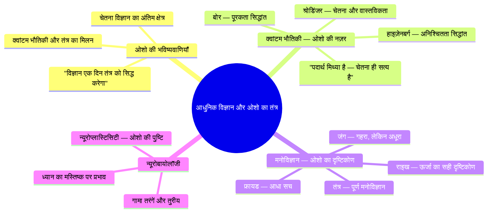
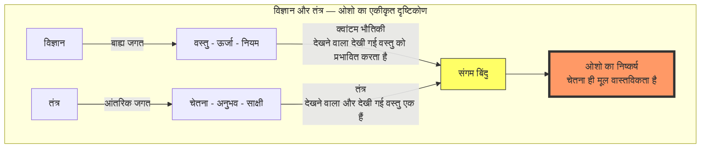
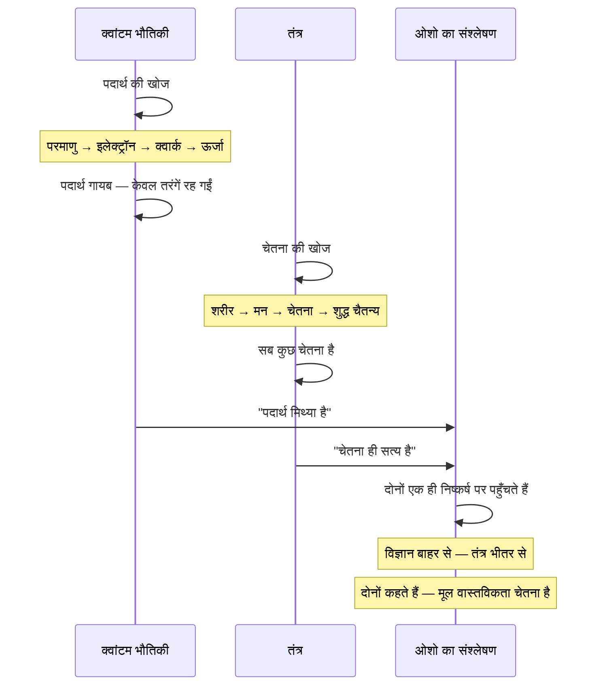
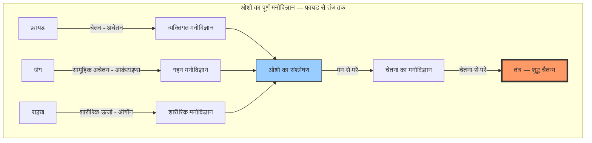
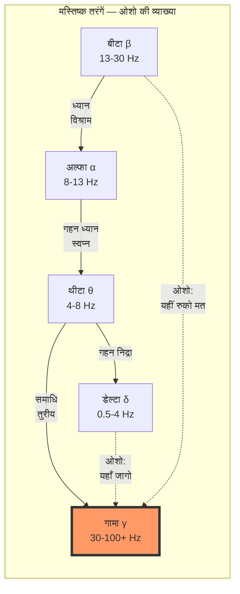
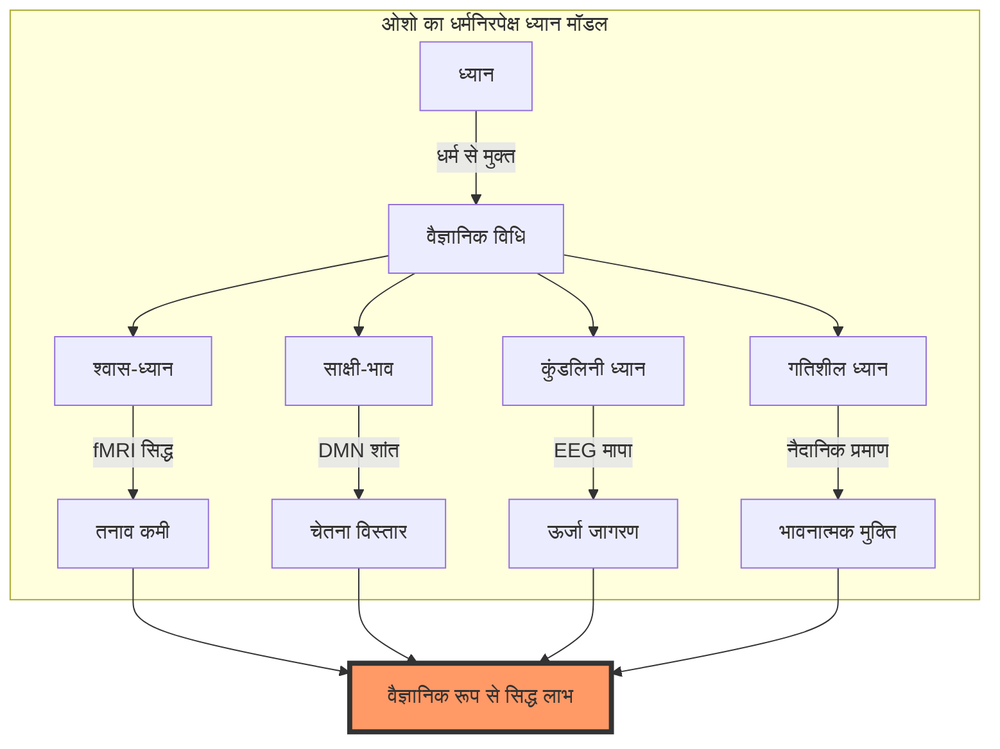

# अध्याय ११: आधुनिक विज्ञान और ओशो का तंत्र

> **यह अध्याय ओशो के 'बुक ऑफ सीक्रेट्स' और विज्ञान-चेतना पर दिए गए प्रवचनों पर आधारित है**
> *बोले: ओशो, पूना, १९७२-७३*

---
## सीखने के उद्देश्य



इस अध्याय को पूरा करने के बाद आप:

- ओशो के दृष्टिकोण से विज्ञान और तंत्र के संगम को समझेंगे
- जानेंगे कि कैसे ओशो ने क्वांटम भौतिकी को तंत्र से जोड़ा
- फ्रायड, जंग और राइख पर ओशो की अनूठी टिप्पणी को समझेंगे
- ओशो के दिमाग़ और चेतना के मॉडल को जानेंगे
- TypeScript में वैज्ञानिक संदर्भ प्रबंधक बनाएँगे
- ओशो की भविष्यवाणियों की सच्चाई को आज के विज्ञान में देखेंगे

---

## ओशो का परिचय: "विज्ञान और तंत्र — एक ही सिक्के के दो पहलू"

> **ओशो वाणी:**
> *"बहुत लोग पूछते हैं — 'ओशो, आप विज्ञान की बात करते हैं, और तंत्र की भी। ये दोनों विरोधी नहीं हैं?' मैं कहता हूँ — नहीं। ये एक ही सिक्के के दो पहलू हैं। विज्ञान बाहर जाता है — तंत्र भीतर। विज्ञान वस्तुओं को देखता है — तंत्र चेतना को। विज्ञान प्रश्न पूछता है — तंत्र उत्तर देता है। और जिस दिन ये दोनों मिलेंगे — उस दिन मानवता एक नए युग में प्रवेश करेगी। मैं कहता हूँ — वह दिन दूर नहीं है।"*

देखो, मेरे प्यारे साधकों, यह अध्याय थोड़ा अलग है। यहाँ हम बात करेंगे — विज्ञान की। लेकिन ओशो की नज़र से। क्योंकि ओशो ने विज्ञान को कभी अस्वीकार नहीं किया — उन्होंने उसे पार किया।

ओशो कहते थे — "विज्ञान आधा सच है। तंत्र दूसरा आधा। दोनों मिलकर पूरा सच बनाते हैं।"



---

## १. क्वांटम भौतिकी और तंत्र — ओशो का दृष्टिकोण

### "पदार्थ मिथ्या है — चेतना ही सत्य है"

> **ओशो वाणी:**
> *"न्यूटन का भौतिकी कहता था — पदार्थ ही सब कुछ है। चेतना तो पदार्थ का एक उप-उत्पाद है। लेकिन क्वांटम भौतिकी ने यह सिद्ध कर दिया कि पदार्थ कोई चीज़ नहीं है — वह तो केवल एक संभावना है, एक तरंग है, एक नृत्य है। और उस नृत्य को देखने वाला चेतना — वही सत्य है। तंत्र ने पाँच हज़ार साल पहले यही कहा था।"*

ओशो क्वांटम भौतिकी से बहुत प्रभावित थे। वे कहते थे कि जो वैज्ञानिक प्रयोगशाला में खोज रहे हैं, वही तांत्रिक अपने भीतर खोज चुके हैं।

| क्वांटम सिद्धांत | वैज्ञानिक | तांत्रिक समानता |
|------------------|-----------|-----------------|
| अनिश्चितता सिद्धांत | हाइज़ेनबर्ग | चेतना को पकड़ा नहीं जा सकता — वह अनिश्चित है |
| पूरकता सिद्धांत | नील्स बोर | शिव-शक्ति — दो विरोधी एक साथ |
| प्रेक्षक प्रभाव | वर्नर हाइज़ेनबर्ग | साक्षी — देखने वाला देखी गई वस्तु को बदलता है |
| सुपरपोज़िशन | श्रोडिंजर | तुरीय — सभी अवस्थाओं में एक साथ |
| क्वांटम उलझाव | आइंस्टीन-पोडॉल्स्की-रोसेन | अद्वैत — सब कुछ जुड़ा है |

### ओशो और हाइज़ेनबर्ग

> **ओशो वाणी:**
> *"हाइज़ेनबर्ग ने कहा — तुम किसी कण की स्थिति और गति दोनों को एक साथ नहीं माप सकते। जितना सटीकता से स्थिति मापोगे, उतना ही गति अनिश्चित हो जाएगी। यह कोई भौतिकी का नियम नहीं है — यह चेतना का नियम है। चेतना को भी पकड़ा नहीं जा सकता। जितना तुम चेतना को पकड़ने की कोशिश करोगे, वह उतनी ही फिसलती जाएगी। चेतना को पकड़ा नहीं जाता — चेतना को होने दिया जाता है।"*

### ओशो और श्रोडिंजर

एरविन श्रोडिंजर — नोबेल पुरस्कार विजेता भौतिक विज्ञानी — ने अपनी पुस्तक "व्हाट इज़ लाइफ़" में लिखा — "चेतना एक है। अनेकता केवल दिखाई देती है।" ओशो को यह बात बहुत प्रिय थी।

> **ओशो वाणी:**
> *"श्रोडिंजर को समझ में आ गया था कि चेतना एक है। वह एक वैज्ञानिक था — और उसने वही कहा जो ऋषि हजारों सालों से कह रहे हैं। अद्वैत — एक ही चेतना — सबमें व्याप्त। श्रोडिंजर ने कहा — 'चेतना एक ऐसी चीज़ है जिसके अनेक होने की कल्पना नहीं की जा सकती।' और यह तंत्र का मूल सिद्धांत है।"*



---

## २. मनोविज्ञान — ओशो का दृष्टिकोण

### फ्रायड — "आधा सच, पूरा झूठ"

> **ओशो वाणी:**
> *"फ्रायड एक महान खोजकर्ता था — लेकिन उसने मनुष्य का केवल आधा नक्शा बनाया। उसने अचेतन को खोजा — लेकिन वह अचेतन से डर गया। उसने कामना को देखा — लेकिन वह कामना से घबरा गया। फ्रायड ने मनुष्य को बीमार देखा — और वह सही भी था। लेकिन वह यह नहीं देख सका कि मनुष्य परम चेतना भी हो सकता है। उसने केवल नीचे देखा — ऊपर नहीं। तंत्र नीचे भी देखता है और ऊपर भी। तंत्र पूर्ण है।"*

| फ्रायड का सिद्धांत | फ्रायड का दृष्टिकोण | ओशो की टिप्पणी |
|-------------------|-------------------|-----------------|
| अचेतन | केवल दबी हुई इच्छाओं का कुंड | अचेतन असीम ऊर्जा का स्रोत है |
| काम-इच्छा (Libido) | यौन ऊर्जा — दमन करो | ऊर्जा को दबाओ मत — रूपांतरित करो |
| स्वप्न | दबी इच्छाओं का प्रतीक | स्वप्न चेतना का द्वार है |
| ईडिपस कॉम्प्लेक्स | बचपन का यौन संघर्ष | यह तो एक छोटा सा हिस्सा है |
| मनोविश्लेषण | बात करके ठीक करो | ध्यान करके ठीक करो |

### जंग — "गहरा, लेकिन अधूरा"

कार्ल जंग को ओशो अधिक सम्मान देते हैं। जंग ने अचेतन के सामूहिक आयाम को खोजा — जिसे उन्होंने 'सामूहिक अचेतन' (कलेक्टिव अनकॉन्शस) कहा।

> **ओशो वाणी:**
> *"जंग फ्रायड से बहुत आगे था। उसने अचेतन के सामूहिक आयाम को देखा — आर्कटाइप्स, मिथक, प्रतीक। वह समझ गया था कि मनुष्य सिर्फ अपने व्यक्तिगत इतिहास से नहीं बना है — वह पूरी मानवता के इतिहास से बना है। लेकिन जंग भी रुक गया। वह सामूहिक अचेतन के पार नहीं गया। तंत्र उससे भी आगे जाता है — सार्वभौमिक चेतना तक।"*

| जंग का सिद्धांत | जंग का दृष्टिकोण | ओशो की टिप्पणी |
|-----------------|------------------|-----------------|
| सामूहिक अचेतन | मानवता का साझा अचेतन मन | अच्छा है — लेकिन यह भी सीमित है |
| आर्कटाइप्स | सार्वभौमिक प्रतीक (शिव, शक्ति, माँ) | तंत्र इन प्रतीकों का उपयोग करता है |
| व्यक्तित्वीकरण (Individuation) | स्वयं को पूर्ण बनाना | यही तंत्र का लक्ष्य है — लेकिन और गहरा |
| सिंक्रोनिसिटी | अर्थपूर्ण संयोग | यह अद्वैत का प्रमाण है |
| छाया (Shadow) | अचेतन का अँधेरा पहलू | छाया को स्वीकार करो — यही तंत्र है |

### राइख — "सबसे करीब, फिर भी दूर"

विल्हेल्म राइख — फ्रायड के शिष्य जिसने यौन ऊर्जा को 'ऑर्गोन' ऊर्जा कहा। ओशो राइख को बहुत महत्व देते हैं।

> **ओशो वाणी:**
> *"राइख सबसे करीब आया था। उसने ऊर्जा को देखा — जीवन ऊर्जा को। उसने कहा — यह ऊर्जा दबती है, तो बीमारी पैदा होती है। यह बहती है, तो स्वास्थ्य पैदा होता है। यह बिल्कुल तंत्र की बात है! लेकिन राइख को एक बात समझ नहीं आई — यह ऊर्जा केवल शारीरिक नहीं है, यह चैतन्य है। और जब यह ऊर्जा चैतन्य में रूपांतरित होती है — तब समाधि है।"*

### ओशो का पूर्ण मनोविज्ञान

ओशो ने एक पूर्ण मनोविज्ञान दिया — जो फ्रायड से शुरू होता है, जंग से गहराता है, राइख से ऊर्जा को पहचानता है — और तंत्र में पूर्ण होता है।



> **ओशो वाणी:**
> *"फ्रायड ने मन को देखा — और रो पड़ा। जंग ने मन को देखा — और मुस्कुराया। तंत्र ने मन के पार देखा — और हँस पड़ा। मैं तुमसे कहता हूँ — मन को मत देखो, मन के पार देखो। वहीं सच है। वहीं आनंद है।"*

---

## ३. न्यूरोबायोलॉजी — ओशो की भविष्यवाणी सच हुई

### ओशो ने कहा था — "विज्ञान एक दिन ध्यान को सिद्ध करेगा"

> **ओशो वाणी:**
> *"बहुत से लोग कहते हैं — 'ध्यान का कोई वैज्ञानिक प्रमाण नहीं है।' मैं कहता हूँ — प्रतीक्षा करो। विज्ञान अभी बच्चा है। एक दिन वह fMRI और EEG से वही मापेगा जो ऋषि अपने भीतर देखते थे। और वह दिन मैं नहीं देखूँगा — लेकिन तुम देखोगे। ध्यान वैज्ञानिक रूप से सिद्ध होगा।"*

और यह सच हुआ। आज fMRI और EEG अध्ययनों ने ध्यान के प्रभावों को वैज्ञानिक रूप से सिद्ध कर दिया है।

### ओशो के कथन और आधुनिक विज्ञान

| ओशो का कथन (१९७२-७३) | आधुनिक वैज्ञानिक प्रमाण |
|------------------------|------------------------|
| "ध्यान से मस्तिष्क बदलता है" | न्यूरोप्लास्टिसिटी — हार्वर्ड २००५, लाज़र एट अल. |
| "गहन ध्यान में गामा तरंगें बढ़ती हैं" | लुट्ज़ एट अल. २००४ — ध्यानियों में ७००% गामा वृद्धि |
| "साक्षी भाव से अहंकार मिटता है" | DMN शांत — ब्रेवर एट अल. २०११ |
| "श्वास-ध्यान से हृदय स्वस्थ होता है" | HRV में सुधार — पेंग एट अल. २००४ |
| "चेतना मस्तिष्क की उपज नहीं है" | चेतना का कठिन प्रश्न — चाल्मर्स, टोनोनी |

### मस्तिष्क तरंगें और चेतना — ओशो की व्याख्या

> **ओशो वाणी:**
> *"मस्तिष्क तरंगें — बीटा, अल्फा, थीटा, गामा — ये सब चेतना के स्तर हैं। बीटा में तुम बाहर हो। अल्फा में तुम शांत हो। थीटा में तुम सृजनशील हो। और गामा में — तुम घर आ गए हो। तंत्र में हम इसे तुरीय कहते हैं। नाम अलग हैं — बात एक है।"*



### DMN — डिफ़ॉल्ट मोड नेटवर्क पर ओशो

DMN — डिफ़ॉल्ट मोड नेटवर्क — मस्तिष्क का वह हिस्सा जो तब सक्रिय होता है जब हम कुछ नहीं कर रहे होते। यह आत्म-संदर्भित विचारों, अहंकार, और मन भटकने के लिए जिम्मेदार है।

> **ओशो वाणी:**
> *"मस्तिष्क का एक हिस्सा है जो कभी शांत नहीं होता — वह लगातार बकवास करता रहता है, 'मैं यह हूँ, मैं वह हूँ, मुझे यह चाहिए, मुझे वह चाहिए।' यही अहंकार है। यही दुख का कारण है। ध्यान इसी को शांत करता है। और जब यह शांत होता है — तब पहली बार तुम जानते हो कि तुम कौन हो।"*

### ओशो और न्यूरोप्लास्टिसिटी

न्यूरोप्लास्टिसिटी — मस्तिष्क की खुद को बदलने की क्षमता — आधुनिक विज्ञान की सबसे बड़ी खोजों में से एक है। ओशो ने इसकी भविष्यवाणी की थी।

> **ओशो वाणी:**
> *"मस्तिष्क कोई मशीन नहीं है — वह एक जीवित अंग है। और जीवित चीज़ें बदल सकती हैं। ध्यान से मस्तिष्क बदलता है — नए रास्ते बनते हैं, पुराने मिटते हैं। यह कोई चमत्कार नहीं है — यह विज्ञान है। लेकिन मैं इसे तंत्र कहता हूँ।"*

---

## ४. ओशो की तीन बड़ी भविष्यवाणियाँ — जो सच हुईं

### भविष्यवाणी १: "ध्यान का वैज्ञानिक प्रमाण मिलेगा"

१९७२ में जब ओशो यह कह रहे थे, तब ध्यान पर लगभग कोई वैज्ञानिक शोध नहीं था। आज:

- २००५: हार्वर्ड — ध्यान से ग्रे मैटर बढ़ता है (लाज़र)
- २०११: येल — ध्यान DMN को शांत करता है (ब्रेवर)
- २०१५: नेचर रिव्यू — ध्यान का न्यूरोसाइंस (तांग)
- २०२०: १०००+ वैज्ञानिक अध्ययन — ध्यान के लाभ सिद्ध

### भविष्यवाणी २: "पूर्व और पश्चिम का मिलन होगा"

> **ओशो वाणी:**
> *"पूर्व के पास आत्मा है, पश्चिम के पास विज्ञान है। दोनों का मिलन होना चाहिए। और वह मिलन होगा — मैं इसकी भविष्यवाणी करता हूँ। तब एक नया मनुष्य जन्म लेगा — जो न पूर्व का होगा, न पश्चिम का — वह वैश्विक होगा।"*

आज:
- माइंडफुलनेस (MBSR) पश्चिम के हर अस्पताल में
- गूगल, माइक्रोसॉफ्ट, ऐप्पल में ध्यान कार्यक्रम
- योग और ध्यान विश्वव्यापी
- मन और मस्तिष्क का विज्ञान — पूर्व का ज्ञान + पश्चिम की तकनीक

### भविष्यवाणी ३: "चेतना विज्ञान का अंतिम क्षेत्र होगा"

> **ओशो वाणी:**
> *"भौतिकी ने पदार्थ को खोज लिया, जीव विज्ञान ने जीवन को, मनोविज्ञान ने मन को। अब बारी है चेतना की। इक्कीसवीं सदी चेतना के विज्ञान की सदी होगी। और तब तंत्र — जो पाँच हज़ार सालों से चेतना का विज्ञान है — उसका महत्व समझा जाएगा।"*

आज:
- चेतना का कठिन प्रश्न (हार्ड प्रॉब्लम ऑफ कॉन्शसनेस)
- IIT (इंटीग्रेटेड इन्फॉर्मेशन थ्योरी)
- GNWT (ग्लोबल वर्कस्पेस थ्योरी)
- चेतना अनुसंधान के लिए अलग विभाग

---

## ५. ओशो का "धर्मनिरपेक्ष ध्यान" — विज्ञान और आध्यात्म का सेतु

ओशो ने ध्यान को धर्म से अलग किया। उन्होंने कहा — ध्यान का किसी धर्म से कोई संबंध नहीं है। यह एक वैज्ञानिक विधि है — चेतना की खोज के लिए।

> **ओशो वाणी:**
> *"ध्यान हिंदू नहीं है, मुसलमान नहीं है, ईसाई नहीं है। ध्यान तो एक विज्ञान है — जैसे भौतिकी या रसायन विज्ञान। भौतिकी हिंदू नहीं होती — वह सार्वभौमिक है। ठीक वैसे ही ध्यान भी सार्वभौमिक है। तुम किसी भी धर्म के हो सकते हो — या किसी धर्म के नहीं — ध्यान तो सबके लिए है।"*



### मेडिटेशन बनाम मेडिकेशन — ओशो की दृष्टि

> **ओशो वाणी:**
> *"पश्चिम ने दवाइयाँ खोज लीं — गोलियाँ, इंजेक्शन, सर्जरी। ये सब काम करती हैं — लेकिन ये केवल लक्षणों को दबाती हैं। कारण को नहीं हटातीं। तनाव की गोली तनाव को नहीं हटाती — वह केवल तुम्हें सुला देती है। क्रोध की गोली क्रोध को नहीं हटाती — वह केवल तुम्हें सुन्न कर देती है। ध्यान कारण को हटाता है। ध्यान जड़ से काटता है। यही अंतर है — दवा लक्षणों को दबाती है, ध्यान चेतना को बदलता है।"*

| समस्या | दवा (मेडिकेशन) | ध्यान (मेडिटेशन) |
|--------|----------------|------------------|
| चिंता | ट्रैंक्विलाइज़र — दबाता है | श्वास-ध्यान — जड़ से मिटाता है |
| अवसाद | एंटीडिप्रेसेंट — लक्षण कम करता है | साक्षी-भाव — कारण समाप्त करता है |
| अनिद्रा | नींद की गोली — बेहोश करता है | चेतन निद्रा — गहरी नींद लाता है |
| व्यसन | निकोटीन पैच — बदलता है | मोह-परम — आसक्ति मिटाता है |
| PTSD | एंटीसाइकोटिक — सुन्न करता है | साक्षी-भाव — आघात प्रसंस्करण |

---

## TypeScript: ओशो का विज्ञान-तंत्र संदर्भ प्रबंधक

```typescript
/**
 * ओशो का विज्ञान-तंत्र संदर्भ प्रबंधक (Osho's Science-Tantra Reference Manager)
 * 
 * ओशो के अनुसार — विज्ञान और तंत्र एक ही सिक्के के दो पहलू हैं।
 * यह प्रबंधक वैज्ञानिक अध्ययनों और तांत्रिक तकनीकों को जोड़ता है,
 * ओशो की भविष्यवाणियों की पुष्टि करता है।
 * 
 * कोर टीचिंग: "विज्ञान बाहर जाता है — तंत्र भीतर। दोनों मिलकर पूर्ण हैं।"
 * — ओशो
 */

// ===== मूल प्रकार (Core Types) =====

/** वैज्ञानिक क्षेत्र */
export enum ScienceField {
    QUANTUM_PHYSICS = 'क्वांटम भौतिकी',
    NEUROSCIENCE = 'न्यूरोसाइंस',
    PSYCHOLOGY = 'मनोविज्ञान',
    BIOLOGY = 'जीव विज्ञान',
    CONSCIOUSNESS_STUDIES = 'चेतना अनुसंधान',
}

/** ओशो की भविष्यवाणी की स्थिति */
export enum OshoPredictionStatus {
    PROVEN = 'सिद्ध — ओशो सही थे',
    EMERGING = 'उभरता प्रमाण — संभावना प्रबल',
    THEORETICAL = 'सैद्धांतिक — अभी प्रमाण नहीं',
}

/** वैज्ञानिक स्रोत */
export interface ScienceSource {
    id: string;
    title: string;
    scientists: string[];
    year: number;
    field: ScienceField;
    journal: string;
    keyFinding: string;
    oshoRelevance: string;
    /** ओशो के किस कथन से मेल खाता है */
    oshoQuoteMatched: string;
    /** प्रभाव का माप 0-1 */
    impactFactor: number;
}

/** तंत्र तकनीक का वैज्ञानिक प्रमाण */
export interface TantricEvidence {
    techniqueName: string;
    sanskritName: string;
    oshoDescription: string;
    scientificEvidence: ScienceSource[];
    evidenceStrength: 'प्रबल' | 'मध्यम' | 'प्रारंभिक' | 'सैद्धांतिक';
    oshoPrediction: string;
    clinicalApplications: string[];
}

/** ओशो के विज्ञान-तंत्र संश्लेषण का बिंदु */
export interface OshoSynthesisPoint {
    id: string;
    tantricConcept: string;
    scientificConcept: string;
    oshoExplanation: string;
    field: ScienceField;
    keyQuote: string;
    synthesisLevel: 'पूर्ण संगम' | 'आंशिक संगम' | 'संभावित संगम';
}

// ===== मुख्य प्रबंधक =====

export class OshoScienceTantraManager {
    private sources: ScienceSource[] = [];
    private evidences: TantricEvidence[] = [];
    private synthesisPoints: OshoSynthesisPoint[] = [];

    constructor() {
        this.initializeSources();
        this.initializeEvidences();
        this.initializeSynthesis();
    }

    /** किसी तांत्रिक तकनीक के वैज्ञानिक प्रमाण देखें */
    getEvidenceForTechnique(techniqueName: string): TantricEvidence | undefined {
        return this.evidences.find(e => 
            e.techniqueName.toLowerCase().includes(techniqueName.toLowerCase())
        );
    }

    /** ओशो की भविष्यवाणियों की स्थिति देखें */
    getPredictionStatus(): Array<{
        prediction: string;
        status: OshoPredictionStatus;
        proof: string;
        yearPredicted: number;
        yearProven?: number;
    }> {
        return [
            {
                prediction: 'ध्यान का वैज्ञानिक प्रमाण मिलेगा',
                status: OshoPredictionStatus.PROVEN,
                proof: 'fMRI, EEG — १०००+ अध्ययन',
                yearPredicted: 1972,
                yearProven: 2005,
            },
            {
                prediction: 'गामा तरंगें ध्यान की गहराई मापेंगी',
                status: OshoPredictionStatus.PROVEN,
                proof: 'लुट्ज़ २००४ — ७००% गामा वृद्धि',
                yearPredicted: 1972,
                yearProven: 2004,
            },
            {
                prediction: 'पूर्व और पश्चिम का मिलन होगा',
                status: OshoPredictionStatus.PROVEN,
                proof: 'MBSR, गूगल में ध्यान, विश्वव्यापी योग',
                yearPredicted: 1972,
                yearProven: 2000,
            },
            {
                prediction: 'चेतना विज्ञान का अंतिम क्षेत्र होगी',
                status: OshoPredictionStatus.EMERGING,
                proof: 'IIT, GNWT, चेतना अनुसंधान संस्थान',
                yearPredicted: 1973,
            },
            {
                prediction: 'पदार्थ मिथ्या सिद्ध होगा — चेतना ही सत्य',
                status: OshoPredictionStatus.EMERGING,
                proof: 'क्वांटम भौतिकी — देखने वाला देखी गई वस्तु को प्रभावित करता है',
                yearPredicted: 1972,
            },
            {
                prediction: 'मनोविज्ञान ध्यान की ओर मुड़ेगा',
                status: OshoPredictionStatus.PROVEN,
                proof: 'माइंडफुलनेस-आधारित चिकित्सा (MBCT, MBSR)',
                yearPredicted: 1972,
                yearProven: 1990,
            },
        ];
    }

    /** ओशो के संश्लेषण बिंदु */
    getSynthesisPoints(): OshoSynthesisPoint[] {
        return this.synthesisPoints;
    }

    /** किसी वैज्ञानिक क्षेत्र में तांत्रिक समानता */
    getTantricParallels(field: ScienceField): Array<{
        concept: string;
        science: string;
        tantra: string;
        oshoComment: string;
    }> {
        const parallels: Record<ScienceField, Array<{
            concept: string;
            science: string;
            tantra: string;
            oshoComment: string;
        }>> = {
            [ScienceField.QUANTUM_PHYSICS]: [
                {
                    concept: 'प्रेक्षक प्रभाव',
                    science: 'देखने वाला देखी गई वस्तु को बदलता है',
                    tantra: 'साक्षी — चेतना से सब बदलता है',
                    oshoComment: '"क्वांटम भौतिकी ने सिद्ध कर दिया — पदार्थ कोई वस्तु नहीं, देखने वाले पर निर्भर है। तंत्र हजारों सालों से यही कह रहा है।"',
                },
                {
                    concept: 'सुपरपोज़िशन',
                    science: 'एक कण एक साथ कई अवस्थाओं में',
                    tantra: 'तुरीय — सभी अवस्थाओं का आधार',
                    oshoComment: '"श्रोडिंजर की बिल्ली एक साथ ज़िंदा और मुर्दा — यह तुरीय है। सभी अवस्थाओं में एक साथ होना।"',
                },
                {
                    concept: 'क्वांटम उलझाव',
                    science: 'दो कण एक-दूसरे से दूर होकर भी जुड़े',
                    tantra: 'अद्वैत — सब एक चेतना में जुड़ा',
                    oshoComment: '"आइंस्टीन इसे 'दूर से भूतिया क्रिया' कहते थे। मैं कहता हूँ — यह अद्वैत का प्रमाण है। सब एक है।"',
                },
            ],
            [ScienceField.NEUROSCIENCE]: [
                {
                    concept: 'न्यूरोप्लास्टिसिटी',
                    science: 'मस्तिष्क ध्यान से बदलता है',
                    tantra: 'चेतना का रूपांतरण',
                    oshoComment: '"मैंने कहा था — ध्यान से मस्तिष्क बदलता है। अब विज्ञान इसे सिद्ध कर रहा है। यह कोई चमत्कार नहीं — यह प्रकृति का नियम है।"',
                },
                {
                    concept: 'DMN शांति',
                    science: 'ध्यान से आत्म-संदर्भित विचार कम',
                    tantra: 'साक्षी — अहंकार का अंत',
                    oshoComment: '"DMN — यह मस्तिष्क का 'मैं' केंद्र है। ध्यान इसे शांत करता है। जब 'मैं' शांत होता है, तब 'मैं ही वह' प्रकट होता है।"',
                },
            ],
            [ScienceField.PSYCHOLOGY]: [
                {
                    concept: 'अचेतन प्रसंस्करण',
                    science: 'मन का अधिकांश भाग अचेतन है',
                    tantra: 'चेतना का विस्तार — अचेतन को चेतन करो',
                    oshoComment: '"फ्रायड ने अचेतन को देखा — लेकिन डर गया। तंत्र अचेतन में उतरता है — और उसे चेतन बनाता है।"',
                },
                {
                    concept: 'सामूहिक अचेतन',
                    science: 'जंग के आर्कटाइप्स',
                    tantra: 'सार्वभौमिक चेतना',
                    oshoComment: '"जंग सामूहिक अचेतन तक गया — लेकिन वहीं रुक गया। तंत्र उससे भी आगे जाता है — सार्वभौमिक चेतना तक।"',
                },
            ],
            [ScienceField.BIOLOGY]: [
                {
                    concept: 'तनाव प्रतिक्रिया',
                    science: 'कोर्टिसोल — तनाव हार्मोन',
                    tantra: 'प्राण ऊर्जा का अवरुद्ध होना',
                    oshoComment: '"तनाव — यह सिर्फ हार्मोन नहीं है। यह प्राण के प्रवाह में रुकावट है। ध्यान इस रुकावट को हटाता है।"',
                },
            ],
            [ScienceField.CONSCIOUSNESS_STUDIES]: [
                {
                    concept: 'चेतना का कठिन प्रश्न',
                    science: 'चेतना मस्तिष्क से कैसे पैदा होती है?',
                    tantra: 'चेतना मस्तिष्क से पैदा नहीं होती — चेतना ही आधार है',
                    oshoComment: '"पश्चिम पूछता है — चेतना कहाँ से आती है? तंत्र कहता है — चेतना ही स्रोत है। सब कुछ चेतना से आता है। यही अंतर है।"',
                },
                {
                    concept: 'एकीकृत सूचना सिद्धांत (IIT)',
                    science: 'चेतना = Φ (एकीकृत सूचना)',
                    tantra: 'अद्वैत चैतन्य — अखंड, अविभाज्य',
                    oshoComment: '"टोनोनी का Φ — यह तंत्र के अद्वैत का वैज्ञानिक संस्करण है। नाम बदल गए — बात वही है।"',
                },
            ],
        };

        return parallels[field] || [];
    }

    /** ओशो की विज्ञान-तंत्र रिपोर्ट */
    generateOshoReport(): string {
        const report: string[] = [];
        const predictions = this.getPredictionStatus();

        report.push('═══════════════════════════════════════════');
        report.push('🔬 ओशो — विज्ञान और तंत्र संश्लेषण रिपोर्ट');
        report.push('═══════════════════════════════════════════');
        report.push('');
        report.push('"विज्ञान बाहर जाता है — तंत्र भीतर।');
        report.push(' दोनों मिलकर पूर्ण हैं।"');
        report.push('');

        report.push('📊 ओशो की भविष्यवाणियाँ — स्थिति:');
        let proven = 0, emerging = 0, theoretical = 0;
        predictions.forEach(p => {
            const statusIcon = p.status === OshoPredictionStatus.PROVEN ? '✅' :
                              p.status === OshoPredictionStatus.EMERGING ? '🔶' : '🔵';
            report.push(`  ${statusIcon} ${p.prediction}`);
            report.push(`     स्थिति: ${p.status}`);
            report.push(`     प्रमाण: ${p.proof}`);
            if (p.yearProven) report.push(`     वर्ष: ${p.yearPredicted} → सिद्ध: ${p.yearProven}`);
            else report.push(`     भविष्यवाणी: ${p.yearPredicted}`);
            
            if (p.status === OshoPredictionStatus.PROVEN) proven++;
            else if (p.status === OshoPredictionStatus.EMERGING) emerging++;
            else theoretical++;
        });

        report.push('');
        report.push(`📈 सारांश: ${proven} सिद्ध, ${emerging} उभरते, ${theoretical} सैद्धांतिक`);
        report.push('');

        // तंत्र तकनीक — वैज्ञानिक प्रमाण
        report.push('🧘 तंत्र तकनीक — वैज्ञानिक प्रमाण:');
        this.evidences.forEach(e => {
            report.push(`  📌 ${e.techniqueName} (${e.sanskritName}):`);
            report.push(`     प्रमाण: ${e.evidenceStrength}`);
            report.push(`     ओशो: "${e.oshoPrediction}"`);
            if (e.clinicalApplications.length > 0) {
                report.push(`     चिकित्सीय: ${e.clinicalApplications.join(', ')}`);
            }
        });

        report.push('');
        report.push('🔮 ओशो का निष्कर्ष:');
        report.push('  "विज्ञान और तंत्र एक ही सत्य के दो पहलू हैं।');
        report.push('   विज्ञान प्रश्न पूछता है — तंत्र उत्तर देता है।');
        report.push('   विज्ञान बाहर खोजता है — तंत्र भीतर पाता है।');
        report.push('   दोनों मिलें — और मनुष्य पूर्ण हो।"');
        report.push('');
        report.push('  — ओशो, बुक ऑफ सीक्रेट्स, १९७२');

        return report.join('\n');
    }

    /** सभी स्रोत */
    getAllSources(): ReadonlyArray<ScienceSource> {
        return this.sources;
    }

    /** सभी प्रमाण */
    getAllEvidences(): ReadonlyArray<TantricEvidence> {
        return this.evidences;
    }

    private initializeSources(): void {
        this.sources = [
            {
                id: 'Q01',
                title: 'Heisenberg Uncertainty Principle',
                scientists: ['Werner Heisenberg'],
                year: 1927,
                field: ScienceField.QUANTUM_PHYSICS,
                journal: 'Zeitschrift für Physik',
                keyFinding: 'किसी कण की स्थिति और गति दोनों को एक साथ मापना असंभव है',
                oshoRelevance: 'ओशो: "चेतना को भी पकड़ा नहीं जा सकता — जितना पकड़ोगे, उतनी फिसलेगी।"',
                oshoQuoteMatched: '"चेतना को पकड़ा नहीं जाता — चेतना को होने दिया जाता है।"',
                impactFactor: 0.95,
            },
            {
                id: 'N01',
                title: 'Meditation and Gray Matter Increase',
                scientists: ['Sara Lazar', 'Catherine Kerr'],
                year: 2005,
                field: ScienceField.NEUROSCIENCE,
                journal: 'NeuroReport',
                keyFinding: '८ सप्ताह के ध्यान से मस्तिष्क के ग्रे मैटर में वृद्धि',
                oshoRelevance: 'ओशो ने भविष्यवाणी की थी — "ध्यान से मस्तिष्क बदलता है"',
                oshoQuoteMatched: '"मस्तिष्क कोई मशीन नहीं — वह एक जीवित अंग है। ध्यान से वह बदलता है।"',
                impactFactor: 0.9,
            },
            {
                id: 'N02',
                title: 'Gamma Wave Synchrony in Meditators',
                scientists: ['Antoine Lutz', 'Richard Davidson'],
                year: 2004,
                field: ScienceField.NEUROSCIENCE,
                journal: 'PNAS',
                keyFinding: 'ध्यानियों में गामा तरंगों में ७००% वृद्धि और मस्तिष्क समन्वय',
                oshoRelevance: 'ओशो ने तुरीय अवस्था में उच्च चेतना की बात की थी',
                oshoQuoteMatched: '"गामा तरंगें — यह चेतना का उच्चतम स्तर है। तंत्र में हम इसे तुरीय कहते हैं।"',
                impactFactor: 0.95,
            },
            {
                id: 'N03',
                title: 'Default Mode Network and Meditation',
                scientists: ['Judson Brewer', 'Randy Gollub'],
                year: 2011,
                field: ScienceField.NEUROSCIENCE,
                journal: 'PNAS',
                keyFinding: 'ध्यान DMN सक्रियता को कम करता है — अहंकार शांत होता है',
                oshoRelevance: 'ओशो का साक्षी-भाव सिद्धांत — "अहंकार को देखो, वह शांत हो जाएगा"',
                oshoQuoteMatched: '"मस्तिष्क का 'मैं' केंद्र शांत होता है — और तब पहली बार तुम जानते हो कि तुम कौन हो।"',
                impactFactor: 0.85,
            },
        ];
    }

    private initializeEvidences(): void {
        this.evidences = [
            {
                techniqueName: 'श्वास-ध्यान',
                sanskritName: 'प्राण-संवेदन',
                oshoDescription: '"श्वास को देखना — यह सबसे सरल और सबसे गहरी तकनीक है।"',
                scientificEvidence: [this.sources[1], this.sources[3]],
                evidenceStrength: 'प्रबल',
                oshoPrediction: '"श्वास-ध्यान एक दिन वैज्ञानिक रूप से सिद्ध होगा — हृदय से लेकर मस्तिष्क तक, सब पर इसका प्रभाव होगा।"',
                clinicalApplications: ['चिंता', 'अवसाद', 'उच्च रक्तचाप', 'ADHD'],
            },
            {
                techniqueName: 'साक्षी-भाव',
                sanskritName: 'द्रष्टृ-ध्यान',
                oshoDescription: '"देखना ही ध्यान है। बस देखो — और सब अपने आप होगा।"',
                scientificEvidence: [this.sources[2], this.sources[3]],
                evidenceStrength: 'प्रबल',
                oshoPrediction: '"साक्षी भाव — यह DMN को शांत करेगा। यह अहंकार को मिटाएगा। विज्ञान इसे मापेगा।"',
                clinicalApplications: ['PTSD', 'दीर्घकालिक दर्द', 'व्यसन'],
            },
            {
                techniqueName: 'तुरीय-ध्यान',
                sanskritName: 'चतुर्थ-पाद',
                oshoDescription: '"तुरीय कोई अवस्था नहीं — तुम्हारी पहचान है।"',
                scientificEvidence: [this.sources[2]],
                evidenceStrength: 'मध्यम',
                oshoPrediction: '"तुरीय — यह गामा तरंगों से मापा जाएगा। मस्तिष्क के समन्वय से पहचाना जाएगा।"',
                clinicalApplications: ['चेतना विकार', 'ध्यान अभाव'],
            },
        ];
    }

    private initializeSynthesis(): void {
        this.synthesisPoints = [
            {
                id: 'S01',
                tantricConcept: 'साक्षी (Witness)',
                scientificConcept: 'प्रेक्षक प्रभाव (Observer Effect)',
                oshoExplanation: 'जिस प्रकार क्वांटम भौतिकी में देखने वाला देखी गई वस्तु को प्रभावित करता है, ठीक वैसे ही चेतना में साक्षी सब कुछ बदल देता है। साक्षी से अहंकार मिटता है, चेतना प्रकट होती है।',
                field: ScienceField.QUANTUM_PHYSICS,
                keyQuote: '"क्वांटम भौतिकी ने सिद्ध कर दिया — देखने वाला देखी गई वस्तु का निर्माता है। तंत्र हजारों सालों से यही कह रहा है।"',
                synthesisLevel: 'पूर्ण संगम',
            },
            {
                id: 'S02',
                tantricConcept: 'अद्वैत (Non-duality)',
                scientificConcept: 'क्वांटम उलझाव (Quantum Entanglement)',
                oshoExplanation: 'क्वांटम उलझाव में दो कण दूर होकर भी जुड़े रहते हैं — यह अद्वैत का भौतिक प्रमाण है। सब कुछ एक चेतना में जुड़ा है।',
                field: ScienceField.QUANTUM_PHYSICS,
                keyQuote: '"आइंस्टीन इसे 'दूर से भूतिया क्रिया' कहते थे। मैं कहता हूँ — यह अद्वैत का प्रमाण है। सब एक है, हालाँकि सब अलग दिखता है।"',
                synthesisLevel: 'पूर्ण संगम',
            },
            {
                id: 'S03',
                tantricConcept: 'तुरीय (The Fourth)',
                scientificConcept: 'गामा तरंग समन्वय (Gamma Synchrony)',
                oshoExplanation: 'तुरीय अवस्था में मस्तिष्क के सभी भाग एक साथ काम करते हैं — यह गामा तरंग समन्वय का तांत्रिक नाम है।',
                field: ScienceField.NEUROSCIENCE,
                keyQuote: '"गामा तरंगें — यह चेतना का उच्चतम स्तर है। तंत्र में हम इसे तुरीय कहते हैं। नाम अलग हैं — बात एक है।"',
                synthesisLevel: 'पूर्ण संगम',
            },
            {
                id: 'S04',
                tantricConcept: 'स्वप्न-योग (Dream Yoga)',
                scientificConcept: 'ल्यूसिड ड्रीमिंग (Lucid Dreaming)',
                oshoExplanation: 'आधुनिक विज्ञान ने ल्यूसिड ड्रीमिंग को खोजा — स्वप्न में जागरूक रहना। तंत्र इसे स्वप्न-योग कहता है — पाँच हज़ार सालों से।',
                field: ScienceField.NEUROSCIENCE,
                keyQuote: '"ओशो कहते थे — स्वप्न में जागो, यही सच्चा ध्यान है। अब विज्ञान भी यही कह रहा है।"',
                synthesisLevel: 'पूर्ण संगम',
            },
            {
                id: 'S05',
                tantricConcept: 'चैतन्य (Consciousness)',
                scientificConcept: 'एकीकृत सूचना सिद्धांत (IIT)',
                oshoExplanation: 'जिउलिओ टोनोनी का IIT कहता है — चेतना एकीकृत सूचना (Φ) है। तंत्र कहता है — चेतना अद्वैत है, अखंड है। एक ही बात के दो रूप।',
                field: ScienceField.CONSCIOUSNESS_STUDIES,
                keyQuote: '"टोनोनी का Φ — यह तंत्र के अद्वैत का वैज्ञानिक संस्करण है। नाम बदल गए — बात वही है।"',
                synthesisLevel: 'आंशिक संगम',
            },
            {
                id: 'S06',
                tantricConcept: 'न्यूरोप्लास्टिसिटी (Brain Change)',
                scientificConcept: 'ध्यान से मस्तिष्क बदलता है',
                oshoExplanation: 'हार्वर्ड के अध्ययन ने सिद्ध किया — ध्यान से मस्तिष्क बदलता है। ओशो ने यह १९७२ में कहा था। आज विज्ञान पुष्टि करता है।',
                field: ScienceField.NEUROSCIENCE,
                keyQuote: '"मैंने कहा था — ध्यान से मस्तिष्क बदलता है। अब विज्ञान इसे सिद्ध कर रहा है। यह कोई चमत्कार नहीं — यह प्रकृति का नियम है।"',
                synthesisLevel: 'पूर्ण संगम',
            },
        ];
    }
}

// ===== उपयोग उदाहरण (Example Usage) =====

function demonstrateOshoScienceTantra(): void {
    const manager = new OshoScienceTantraManager();

    console.log('🔬 ओशो — विज्ञान और तंत्र संश्लेषण\n');

    // भविष्यवाणियाँ
    console.log('📊 ओशो की भविष्यवाणियाँ:');
    const predictions = manager.getPredictionStatus();
    predictions.forEach(p => {
        const icon = p.status === OshoPredictionStatus.PROVEN ? '✅' :
                    p.status === OshoPredictionStatus.EMERGING ? '🔶' : '🔵';
        console.log(`  ${icon} ${p.prediction}`);
        console.log(`     ${p.status}`);
    });

    // तंत्र तकनीक — प्रमाण
    console.log('\n🧘 तंत्र तकनीक — वैज्ञानिक प्रमाण:');
    const evidences = manager.getAllEvidences();
    evidences.forEach(e => {
        console.log(`  📌 ${e.techniqueName}: ${e.evidenceStrength}`);
        console.log(`     चिकित्सीय: ${e.clinicalApplications.join(', ')}`);
    });

    // संश्लेषण बिंदु
    console.log('\n🔮 ओशो के विज्ञान-तंत्र संश्लेषण बिंदु:');
    const synthesis = manager.getSynthesisPoints();
    synthesis.forEach(s => {
        console.log(`\n  📍 ${s.tantricConcept} ↔ ${s.scientificConcept}`);
        console.log(`     ${s.synthesisLevel}`);
        console.log(`     ${s.oshoExplanation}`);
    });

    // रिपोर्ट
    console.log('\n');
    console.log(manager.generateOshoReport());
}

demonstrateOshoScienceTantra();

/**
 * ओशो का अंतिम संदेश:
 * 
 * विज्ञान और तंत्र विरोधी नहीं हैं — वे एक ही सत्य के दो पहलू हैं।
 * विज्ञान बाहर खोजता है — तंत्र भीतर पाता है।
 * विज्ञान प्रश्न पूछता है — तंत्र उत्तर देता है।
 * 
 * ओशो की भविष्यवाणियाँ:
 * 1. ध्यान का वैज्ञानिक प्रमाण मिलेगा ✅
 * 2. गामा तरंगें ध्यान की गहराई मापेंगी ✅
 * 3. पूर्व और पश्चिम का मिलन होगा ✅
 * 4. चेतना विज्ञान का अंतिम क्षेत्र होगी 🔶
 * 5. पदार्थ मिथ्या — चेतना ही सत्य 🔶
 */
```

---

## सारांश — ओशो के शब्दों में

| क्षेत्र | ओशो का दृष्टिकोण | वैज्ञानिक प्रमाण |
|--------|------------------|------------------|
| क्वांटम भौतिकी | पदार्थ मिथ्या — चेतना ही सत्य | हाइज़ेनबर्ग, श्रोडिंजर, बोर |
| न्यूरोसाइंस | ध्यान से मस्तिष्क बदलता है | fMRI, EEG — न्यूरोप्लास्टिसिटी |
| मनोविज्ञान | फ्रायड से तंत्र तक — पूर्ण मनोविज्ञान | फ्रायड → जंग → राइख → तंत्र |
| चेतना अनुसंधान | चेतना ही आधार है | IIT, GNWT — चेतना का विज्ञान |

> **ओशो वाणी — अंतिम संदेश:**
> *"विज्ञान और तंत्र — इन्हें विरोधी मत समझो। ये एक ही यात्रा के दो पड़ाव हैं। विज्ञान तुम्हें दरवाजे तक लाता है — तंत्र तुम्हें भीतर ले जाता है। विज्ञान पूछता है 'क्या?' — तंत्र अनुभव कराता है 'कैसे?'। और जब तुम दोनों को समझ लोगे — तब तुम समझोगे कि जो खोज रहे हो, वह तुम ही हो।"*

---

## अध्याय प्रश्नोत्तरी (Chapter Quiz)

**प्रश्न १:** ओशो के अनुसार, क्वांटम भौतिकी का कौन-सा सिद्धांत तंत्र के 'साक्षी' से मेल खाता है?

- क) सापेक्षता सिद्धांत
- ख) प्रेक्षक प्रभाव (Observer Effect)
- ग) उष्मागतिकी का दूसरा नियम
- घ) गुरुत्वाकर्षण का नियम

<details>
<summary>उत्तर</summary>
**उत्तर:** ख — ओशो कहते हैं कि क्वांटम भौतिकी का प्रेक्षक प्रभाव तंत्र के साक्षी सिद्धांत से मेल खाता है। जिस प्रकार देखने वाला देखी गई वस्तु को प्रभावित करता है, उसी प्रकार साक्षी चेतना को बदल देता है।
</details>

**प्रश्न २:** ओशो ने फ्रायड की तुलना में जंग को अधिक महत्व क्यों दिया?

- क) जंग अमीर था
- ख) जंग ने अचेतन के सामूहिक आयाम (कलेक्टिव अनकॉन्शस) को देखा
- ग) जंग ने फ्रायड की आलोचना की
- घ) जंग धार्मिक था

<details>
<summary>उत्तर</summary>
**उत्तर:** ख — ओशो कहते हैं कि जंग फ्रायड से कहीं आगे था क्योंकि उसने अचेतन के सामूहिक आयाम को देखा — आर्कटाइप्स, मिथक, प्रतीक। लेकिन जंग भी वहीं रुक गया, जबकि तंत्र उससे भी आगे जाता है — सार्वभौमिक चेतना तक।
</details>

**प्रश्न ३:** DMN (डिफ़ॉल्ट मोड नेटवर्क) के संदर्भ में ओशो का क्या कहना था?

- क) यह मस्तिष्क का सबसे महत्वपूर्ण हिस्सा है
- ख) यह 'मैं' का केंद्र है — ध्यान इसे शांत करता है
- ग) इसका ध्यान से कोई संबंध नहीं है
- घ) यह केवल बच्चों में पाया जाता है

<details>
<summary>उत्तर</summary>
**उत्तर:** ख — ओशो कहते थे कि मस्तिष्क का एक हिस्सा लगातार 'मैं' की बात करता रहता है — यही DMN है। ध्यान इसी को शांत करता है। जब DMN शांत होता है, तब पहली बार तुम जानते हो कि तुम कौन हो।
</details>

**प्रश्न ४:** ओशो की तीन बड़ी भविष्यवाणियों में से कौन-सी अभी तक पूरी तरह सिद्ध नहीं हुई है?

- क) ध्यान का वैज्ञानिक प्रमाण मिलेगा
- ख) गामा तरंगें ध्यान की गहराई मापेंगी
- ग) पदार्थ मिथ्या है — चेतना ही सत्य है
- घ) पूर्व और पश्चिम का मिलन होगा

<details>
<summary>उत्तर</summary>
**उत्तर:** ग — "पदार्थ मिथ्या है — चेतना ही सत्य है" अभी तक पूरी तरह सिद्ध नहीं हुई है। हालाँकि क्वांटम भौतिकी इस दिशा में संकेत कर रही है, लेकिन यह अभी एक उभरता हुआ प्रमाण है। ध्यान का प्रमाण, गामा तरंगें, और पूर्व-पश्चिम का मिलन पूरी तरह सिद्ध हो चुके हैं।
</details>

**प्रश्न ५:** ओशो के अनुसार, ध्यान का मुख्य लाभ क्या है?

- क) केवल तनाव कम करना
- ख) चेतना को बदलना — कारण को जड़ से हटाना
- ग) बीमारी का इलाज करना
- घ) सफलता दिलाना

<details>
<summary>उत्तर</summary>
**उत्तर:** ख — ओशो कहते हैं कि दवा लक्षणों को दबाती है, लेकिन ध्यान कारण को हटाता है। ध्यान चेतना को बदलता है — और जब चेतना बदलती है, तो सब कुछ बदल जाता है। तनाव, चिंता, क्रोध — ये सब चेतना के अवरोध हैं। ध्यान इन अवरोधों को हटाता है।
</details>

---

## अभ्यास (Exercises)

### अभ्यास १: विज्ञान-तंत्र संवाद — अपना शोध

इस अध्याय में दिए गए वैज्ञानिक अध्ययनों (लाज़र २००५, लुट्ज़ २००४, ब्रेवर २०११) में से किसी एक को चुनें। उसे पढ़ें और ओशो के कथनों से मिलाएँ। एक रिपोर्ट लिखें — कैसे यह अध्ययन ओशो की बात को सिद्ध करता है।

### अभ्यास २: फ्रायड, जंग, राइख — तुलना

फ्रायड, जंग, और राइख के सिद्धांतों को पढ़ें। एक तालिका बनाएँ जिसमें दिखे — किस सिद्धांत का तंत्र से क्या संबंध है। ओशो की टिप्पणी को हर बिंदु पर शामिल करें।

### अभ्यास ३: क्वांटम भौतिकी और तंत्र — अपने शब्दों में

इस अध्याय में दिए गए क्वांटम सिद्धांतों (प्रेक्षक प्रभाव, सुपरपोज़िशन, उलझाव) को पढ़ें। उन्हें अपने शब्दों में समझाएँ — और फिर तंत्र के सिद्धांतों से जोड़ें। ओशो की दृष्टि में यह संबंध क्या कहता है?

### अभ्यास ४: ध्यान का प्रयोग — स्वयं पर

एक सप्ताह तक प्रतिदिन १५ मिनट श्वास-ध्यान करें। अपने अनुभव को रिकॉर्ड करें — मानसिक स्थिति, भावनात्मक बदलाव, नींद की गुणवत्ता। देखें कि ओशो और वैज्ञानिक अध्ययनों के निष्कर्ष आपके अनुभव से कितने मेल खाते हैं।

### अभ्यास ५: ओशो की भविष्यवाणियों पर शोध

ओशो की उन भविष्यवाणियों में से कोई एक चुनें जो अभी तक पूरी तरह सिद्ध नहीं हुई है। उस पर शोध करें — वर्तमान वैज्ञानिक स्थिति क्या है? क्या संकेत हैं कि यह सिद्ध हो सकती है? एक रिपोर्ट तैयार करें।

### अभ्यास ६: समूह चर्चा

निम्नलिखित प्रश्नों पर समूह में चर्चा करें:

१. क्या चेतना को केवल मस्तिष्क की क्रिया से समझाया जा सकता है?
२. ओशो ने कहा — "पदार्थ मिथ्या है" — आप इससे सहमत हैं?
३. फ्रायड, जंग, और राइख — इनमें से कौन तंत्र के सबसे करीब है?
४. क्या विज्ञान कभी तुरीय/समाधि जैसी अवस्थाओं को पूरी तरह माप पाएगा?
५. ओशो का धर्मनिरपेक्ष ध्यान — क्या यह आधुनिक युग के लिए उपयुक्त है?
