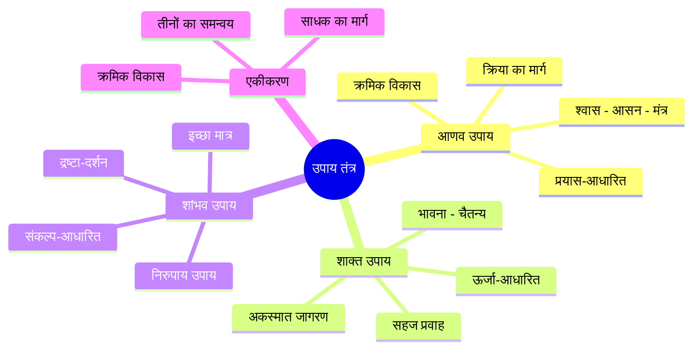
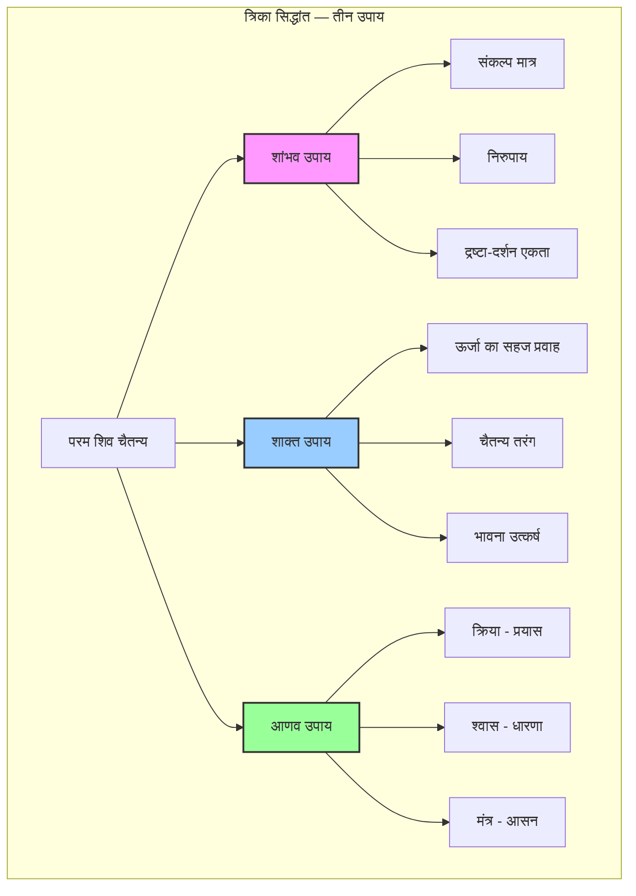
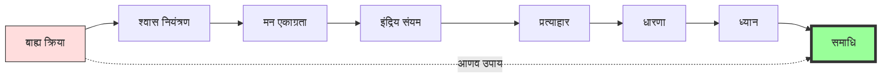
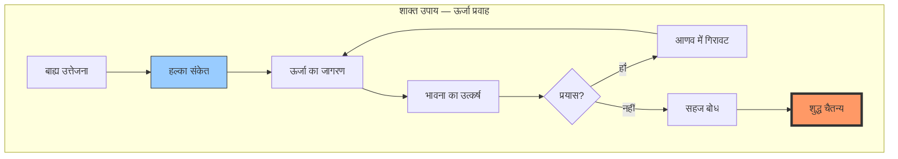
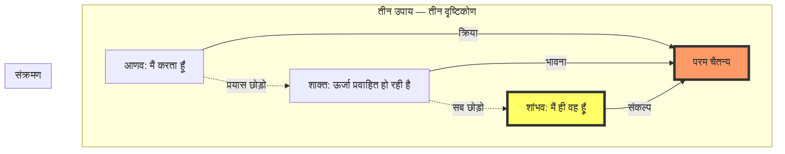
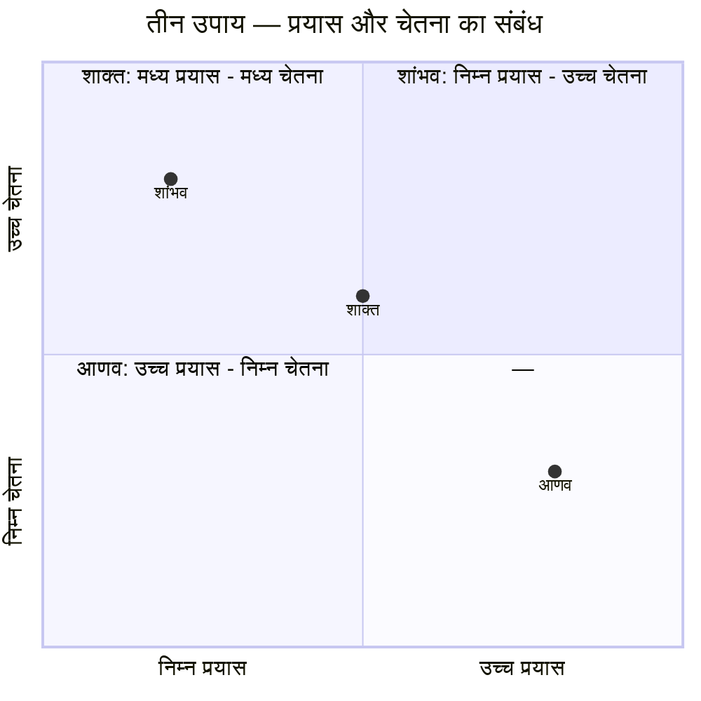
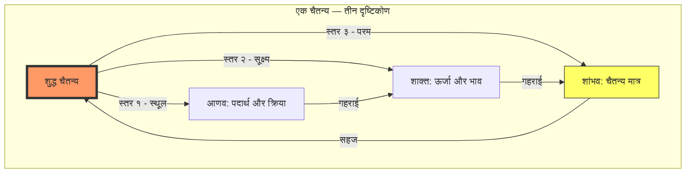
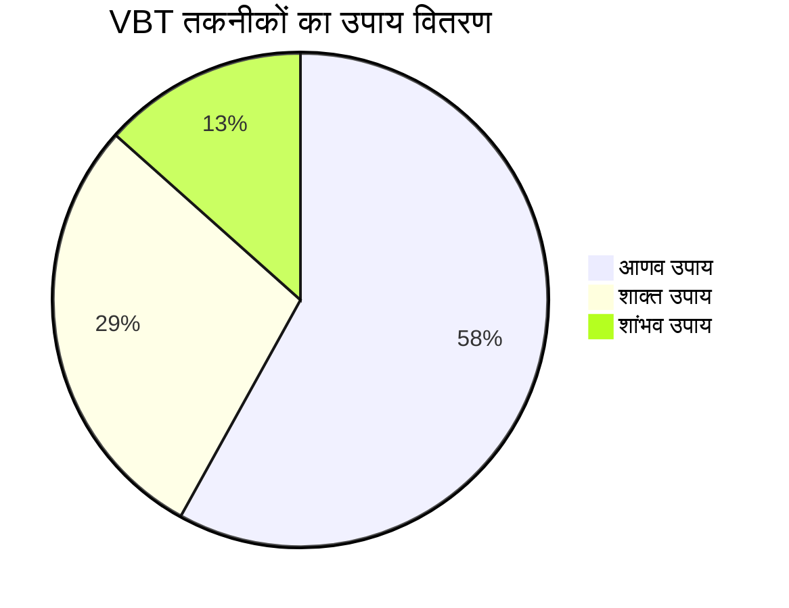

# अध्याय ११: उपाय तंत्र — आणव, शाक्त, शांभव

> **पूर्वापेक्षा:** अध्याय १० — चेतना की अवस्थाएँ
> **अगला:** अध्याय १२ — आधुनिक विज्ञान और तंत्र

इस अध्याय में हम विज्ञान भैरव तंत्र और कश्मीर शैव दर्शन के सबसे महत्वपूर्ण सिद्धांतों में से एक — उपाय तंत्र (The Means) — का गहन अध्ययन करेंगे। तीन उपाय — आणव, शाक्त, शांभव — चेतना के तीन स्तरों पर काम करने के तीन मार्ग हैं। आणव में प्रयास है, शाक्त में ऊर्जा का सहज प्रवाह है, और शांभव में केवल संकल्प मात्र से सिद्धि है। यह अध्याय बताएगा कि इनमें क्या अंतर है, कैसे एक से दूसरे में प्रवेश किया जाए, और ११२ तकनीकों में से कौन-सी किस उपाय में आती है।

---

## सीखने के उद्देश्य



इस अध्याय को पूरा करने के बाद आप:

- तीन उपायों (आणव, शाक्त, शांभव) की विस्तृत समझ प्राप्त करेंगे
- प्रत्येक उपाय की विशेषताओं, सीमाओं और लाभों को जानेंगे
- ११२ तकनीकों को तीन उपायों में वर्गीकृत कर सकेंगे
- अपने स्वभाव के अनुकूल उपाय को पहचान सकेंगे
- एक उपाय से दूसरे में संक्रमण की प्रक्रिया समझेंगे
- TypeScript में उपाय वर्गीकरण प्रणाली बनाएँगे

---

## सिद्धांत: त्रिका हृदय — तीन उपायों का विज्ञान

### उपाय का अर्थ

'उपाय' का शाब्दिक अर्थ है — वह मार्ग या साधन जिससे लक्ष्य तक पहुँचा जाए। किंतु तंत्र में उपाय का गहन अर्थ है — वह विधि जिससे चेतना अपने शुद्ध स्वरूप में प्रतिष्ठित हो जाए।

> उपायः उपगमनं येन उपगच्छति परमेश्वरम्।
> स उपाय इति प्रोक्तः सर्वतन्त्रेषु निश्चितः॥

**अर्थ:** जिसके द्वारा परमेश्वर (शुद्ध चैतन्य) का उपगमन (निकट गमन) होता है — वह उपाय है। यह सभी तंत्रों में निश्चित है।

### त्रिका का सिद्धांत

कश्मीर शैव दर्शन का मूल नाम 'त्रिका' (Trika / त्रिक) है — जिसका अर्थ है 'तीन का समूह'। यह तीन हर स्तर पर प्रकट होते हैं:

| स्तर | तीन तत्त्व | स्पष्टीकरण |
|------|------------|-------------|
| चैतन्य | शिव - शक्ति - नर | परम, ऊर्जा, व्यष्टि |
| शरीर | स्थूल - सूक्ष्म - कारण | तीन शरीर |
| मल | आणव - मायीय - कार्म | तीन मल |
| उपाय | आणव - शाक्त - शांभव | तीन मार्ग |



### तीन मल (मैल) और तीन उपाय

कश्मीर शैव के अनुसार, आत्मा तीन मलों (impurities) से आच्छादित है। प्रत्येक उपाय एक मल को दूर करता है:

| मल | स्वरूप | दूर करने वाला उपाय |
|-----|--------|-------------------|
| **आणव मल** | अपूर्णता का भाव (I am limited) | आणव उपाय — क्रिया और प्रयास से पूर्णता की ओर |
| **मायीय मल** | भेद-बुद्धि (I am separate) | शाक्त उपाय — ऊर्जा में एकता का बोध |
| **कार्म मल** | कर्म-बंधन (I am bound by actions) | शांभव उपाय — संकल्प मात्र से मुक्ति |

---

## उपाय १: आणव उपाय (Āṇava Upāya) — व्यक्ति का मार्ग

### परिचय

'आणव' शब्द 'अणु' (atom / individual) से बना है। आणव उपाय वह मार्ग है जो व्यक्तिगत प्रयास, क्रिया, और साधना पर आधारित है। इसे 'क्रिया उपाय' भी कहते हैं।

**मूल सिद्धांत:**

> आणवोपायः क्रियाशक्त्या देहचित्तप्राणधारणात्।
> क्रमेण परमं याति योगी देहविभूषणः॥

**अर्थ:** आणव उपाय क्रियाशक्ति (action energy) का उपयोग करता है। योगी शरीर, चित्त, और प्राण के धारण (एकाग्रता) के माध्यम से क्रमशः परम तक पहुँचता है।

### आणव उपाय की विशेषताएँ

| विशेषता | विवरण |
|---------|--------|
| **मुख्य शक्ति** | क्रियाशक्ति (action energy) |
| **साधन** | श्वास, आसन, मंत्र, मुद्रा, ध्यान |
| **प्रयास स्तर** | उच्च — साधक को सक्रिय प्रयास करना होता है |
| **गति** | क्रमिक (gradual) — धीरे-धीरे प्रगति |
| **साधक का स्तर** | प्रारंभिक से मध्यवर्ती |
| **द्वंद्व** | द्वैत बना रहता है (साधक-साध्य) |
| **संबंधित अंग** | स्थूल और सूक्ष्म शरीर |
| **उदाहरण तकनीक** | श्वास-ध्यान, मंत्र-जप, आसन |

### आणव उपाय की तकनीकें (VBT से)

विज्ञान भैरव तंत्र की ११२ तकनीकों में से अधिकांश (लगभग ६०-७०) आणव उपाय के अंतर्गत आती हैं। कुछ प्रमुख:

| क्रम | तकनीक | संक्षिप्त विधि |
|------|--------|---------------|
| १ | श्वास-ध्यान | श्वास के आने-जाने पर ध्यान |
| २ | प्राण-धारण | कुंभक (श्वास रोकना) |
| ३ | मंत्र-जप | किसी मंत्र का उच्चारण |
| ४ | आसन-स्थिरता | शरीर को स्थिर रखना |
| ५ | दृष्टि-स्थिर | किसी बिंदु पर दृष्टि स्थिर |
| ६ | नाद-ध्यान | किसी ध्वनि पर ध्यान |
| ७ | रूप-ध्यान | किसी रूप (जैसे शिवलिंग) पर ध्यान |

### आणव उपाय का क्रमिक पथ



### आणव उपाय के लिए उपयुक्त साधक

- जो क्रिया और प्रयास में विश्वास रखते हैं
- जो क्रमिक प्रगति पसंद करते हैं
- जिनका मन चंचल है और उसे एकाग्र करने की आवश्यकता है
- जो अनुशासन और नियमित अभ्यास में सक्षम हैं
- प्रारंभिक साधकों के लिए यह सबसे उपयुक्त मार्ग है

---

## उपाय २: शाक्त उपाय (Śākta Upāya) — ऊर्जा का मार्ग

### परिचय

'शाक्त' शब्द 'शक्ति' (energy / power) से बना है। शाक्त उपाय वह मार्ग है जहाँ साधक प्रयास नहीं करता, बल्कि अपनी चेतना की ऊर्जा को सहज रूप से प्रवाहित होने देता है। इसे 'ज्ञान उपाय' भी कहते हैं।

**मूल सिद्धांत:**

> शाक्तोपायस्तु शक्त्यैव स्वरूपेणावभासनम्।
> न क्रिया न च संकल्पः केवलं भावनाबलात्॥

**अर्थ:** शाक्त उपाय में केवल शक्ति के द्वारा स्वरूप का आभास होता है। न क्रिया है, न संकल्प — केवल भावना के बल से।

### शाक्त उपाय की विशेषताएँ

| विशेषता | विवरण |
|---------|--------|
| **मुख्य शक्ति** | ज्ञानशक्ति (knowledge energy) |
| **साधन** | भावना, चैतन्य का सहज बोध, ऊर्जा का अनुभव |
| **प्रयास स्तर** | निम्न — साधक को थोड़ा सा संकेत मात्र चाहिए |
| **गति** | अपेक्षाकृत तीव्र — एक दृष्टि में बोध |
| **साधक का स्तर** | मध्यवर्ती से उन्नत |
| **द्वंद्व** | अर्ध-द्वैत (साधक-साध्य में झिल्ली मात्र) |
| **संबंधित अंग** | सूक्ष्म और कारण शरीर |
| **उदाहरण तकनीक** | भावना-आधारित, प्रीति, हर्ष |

### शाक्त उपाय की तकनीकें (VBT से)

विज्ञान भैरव तंत्र में लगभग ३०-३५ तकनीकें शाक्त उपाय से संबंधित हैं:

| क्रम | तकनीक | संक्षिप्त विधि |
|------|--------|---------------|
| १ | रति-ध्यान | प्रेम का निर्विषय अनुभव |
| २ | हर्ष-चेतना | अकारण हर्ष में स्थिति |
| ३ | दुःख-परम | दुःख के साक्षी में स्थिति |
| ४ | भोजन-आनंद | रस का सहज अनुभव |
| ५ | शयन-आनंद | निद्रा-चेतना संधि |
| ६ | क्रीड़ा-आनंद | खेल में पूर्ण समर्पण |
| ७ | विस्मय-चेतना | आश्चर्य में स्थिति |
| ८ | सौन्दर्य-आनंद | सौन्दर्य में लीनता |

### शाक्त उपाय का सहज प्रवाह



### शाक्त उपाय के लिए उपयुक्त साधक

- जो भावनाओं में गहरे उतर सकते हैं
- जो कला, संगीत, सौन्दर्य से सहज जुड़ जाते हैं
- जो प्रयास को छोड़ने में सक्षम हैं
- जिनकी ऊर्जा सहज रूप से प्रवाहित होती है
- जो क्रमिक अभ्यास से ऊब जाते हैं

---

## उपाय ३: शांभव उपाय (Śāmbhava Upāya) — शिव का मार्ग

### परिचय

'शांभव' शब्द 'शम्भु' (शिव) से बना है। शांभव उपाय सबसे उच्च उपाय है — यह बिना किसी साधन के केवल संकल्प (will) मात्र से चैतन्य में प्रतिष्ठित होने का मार्ग है। इसे 'इच्छा उपाय' भी कहते हैं।

**मूल सिद्धांत:**

> शांभवोपाय इच्छैव शिवस्य परमात्मनः।
> यः संकल्पमयो ध्यानात्स्वरूपे व्यवतिष्ठते॥

**अर्थ:** शांभव उपाय केवल इच्छा (इच्छाशक्ति) है — परमात्मा शिव की। जो संकल्पमय है, वह बिना ध्यान के स्वरूप में स्थित हो जाता है।

### शांभव उपाय की विशेषताएँ

| विशेषता | विवरण |
|---------|--------|
| **मुख्य शक्ति** | इच्छाशक्ति (will energy) |
| **साधन** | कोई साधन नहीं — केवल संकल्प |
| **प्रयास स्तर** | शून्य — सहज, स्वाभाविक |
| **गति** | तत्क्षण — इसी क्षण में |
| **साधक का स्तर** | उन्नत — जो पूर्णतः परिपक्व है |
| **द्वंद्व** | अद्वैत — कोई द्वैत नहीं |
| **संबंधित अंग** | कारण से परे |
| **उदाहरण तकनीक** | साक्षी-भाव, तुरीय, भैरव अवस्था |

### शांभव उपाय की तकनीकें (VBT से)

विज्ञान भैरव तंत्र में लगभग १०-१५ तकनीकें शांभव उपाय से संबंधित हैं — ये सबसे सूक्ष्म और उच्च तकनीकें हैं:

| क्रम | तकनीक | संक्षिप्त विधि |
|------|--------|---------------|
| १ | साक्षी-भाव | मात्र साक्षी बने रहना |
| २ | तुरीय-बोध | तीनों अवस्थाओं के साक्षी में स्थिति |
| ३ | अहं-विसर्जन | 'मैं' का चैतन्य में विलय |
| ४ | सहज-समाधि | बिना किसी प्रयास के समाधि |
| ५ | भैरव-मुद्रा | बाह्य-आंतरिक में अभेद |
| ६ | यात्रा-ध्यान | बिना गंतव्य के यात्रा (चेतना का) |
| ७ | अवस्थातीत | सभी अवस्थाओं से परे |
| ८ | निरुपाय | उपाय से परे — बिना किसी मार्ग के |

### शांभव उपाय — निरुपाय (मार्गहीन मार्ग)

शांभव उपाय को 'निरुपाय' (means-less) भी कहते हैं क्योंकि यह कोई उपाय नहीं है। जब कोई उपाय नहीं, तभी शांभव है।



### शांभव उपाय के लिए उपयुक्त साधक

- जो पहले से ही चैतन्य के निकट है
- जो सहज रूप से 'मैं' के स्रोत को पहचान सकता है
- जो प्रयास और अनुशासन से ऊपर उठ चुका है
- जिसकी इच्छाशक्ति परम चैतन्य में स्थिर है
- गुरु की कृपा से जागृत साधक

---

## तीनों उपायों की तुलना



### विस्तृत तुलना तालिका

| आयाम | आणव उपाय | शाक्त उपाय | शांभव उपाय |
|-------|-----------|------------|------------|
| **शक्ति** | क्रियाशक्ति | ज्ञानशक्ति | इच्छाशक्ति |
| **प्रयास** | उच्च | मध्यम | शून्य |
| **गति** | क्रमिक | तीव्र | तत्क्षण |
| **साधन** | बहुत (श्वास, मंत्र, आसन) | कुछ (भावना) | कोई नहीं |
| **द्वंद्व** | द्वैत | अर्ध-द्वैत | अद्वैत |
| **साधक** | प्रारंभिक | मध्यवर्ती | उन्नत |
| **उपमा** | सीढ़ी | उड़ान | तुरंत पहुँचना |
| **जोखिम** | यांत्रिक हो सकता है | अस्थिर हो सकता है | अहंकार का |
| **लाभ** | निश्चित प्रगति | सहज बोध | तत्काल मुक्ति |

### एक ही चैतन्य के तीन स्तर

तीनों उपाय एक ही चैतन्य के तीन स्तरों पर काम करते हैं:



---

## ११२ तकनीकों का उपाय वर्गीकरण

विज्ञान भैरव तंत्र की ११२ ध्यान तकनीकों को तीन उपायों में निम्नानुसार वर्गीकृत किया जा सकता है:



### आणव उपाय तकनीकें (६५)

| संख्या | तकनीक | प्रकार |
|--------|--------|--------|
| १-१० | श्वास तकनीकें | प्राण-क्रिया |
| ११-२५ | धारणा तकनीकें | एकाग्रता |
| २६-४० | मंत्र और नाद तकनीकें | ध्वनि |
| ४१-५० | आसन और मुद्रा | शारीरिक |
| ५१-६५ | दृष्टि और बिंदु | दृश्य |

**विधि प्रकार:** क्रिया-प्रधान, प्रयास-आवश्यक, बाह्य-साधन-सहित।

### शाक्त उपाय तकनीकें (३२)

| संख्या | तकनीक | प्रकार |
|--------|--------|--------|
| १-१० | रति, प्रीति, भक्ति | भावना |
| ११-२० | हर्ष, आनंद | आनंद |
| २१-२८ | संगीत, सौन्दर्य, रस | कला |
| २९-३२ | द्वंद्व-एकीकरण | विरोध |

**विधि प्रकार:** भाव-प्रधान, सहज, अर्ध-प्रयास, आंतरिक-जागरण।

### शांभव उपाय तकनीकें (१५)

| संख्या | तकनीक | प्रकार |
|--------|--------|--------|
| १-५ | साक्षी-भाव | द्रष्टा |
| ६-१० | तुरीय-बोध | अवस्था |
| ११-१५ | भैरव-अवस्था | परम |

**विधि प्रकार:** निरुपाय, केवल संकल्प, तत्क्षण-बोध, बिना किसी साधन के।

---

## TypeScript: उपाय वर्गीकरण प्रणाली (Upaya Classifier)

नीचे एक TypeScript आधारित उपाय वर्गीकरण प्रणाली है जो किसी दी गई ध्यान तकनीक का विश्लेषण करके बताती है कि वह किस उपाय में आती है।

```typescript
/**
 * उपाय वर्गीकरण प्रणाली (Upaya Classifier System)
 * 
 * यह प्रणाली विज्ञान भैरव तंत्र की ध्यान तकनीकों का विश्लेषण करके
 * उन्हें तीन उपायों (आणव, शाक्त, शांभव) में वर्गीकृत करती है।
 */

// ===== मूल प्रकार (Core Types) =====

/** तीन उपाय */
export enum Upaya {
    ANAVA = 'आणव उपाय',
    SHAKTA = 'शाक्त उपाय',
    SHAMBHAVA = 'शांभव उपाय',
    NIRUPAYA = 'निरुपाय (उपायातीत)',
}

/** उपाय के मापदंड */
export interface UpayaParameters {
    effortLevel: number;           // प्रयास स्तर 0-10
    techniqueComplexity: number;   // तकनीक की जटिलता 0-10
    externalAids: number;          // बाह्य साधन 0-10
    emotionalDepth: number;        // भावनात्मक गहराई 0-10
    spontaneousFactor: number;     // सहजता 0-10
    conceptualAbstraction: number; // वैचारिक अमूर्तता 0-10
    dualAwareness: number;         // द्वैत-बोध 0-10
    timeToResult: 'तत्क्षण' | 'शीघ्र' | 'क्रमिक';
}

/** ध्यान तकनीक का पूर्ण विवरण */
export interface DhyanaTechnique {
    id: number;
    name: string;
    sanskritName: string;
    sutra?: string;
    description: string;
    method: string;
    parameters: UpayaParameters;
    upaya: Upaya;
    requiredPratishtha?: Upaya;  // पूर्व अपेक्षित उपाय
    difficulty: 'प्रारंभिक' | 'मध्यवर्ती' | 'उन्नत' | 'परम';
    relatedChakra?: string;
}

/** उपाय विश्लेषण परिणाम */
export interface UpayaAnalysis {
    technique: DhyanaTechnique;
    primaryUpaya: Upaya;
    secondaryUpaya?: Upaya;
    confidence: number;           // 0-1
    reasoning: string[];
    suggestion: string;
    compatibleTypes: string[];    // किस प्रकार के साधक के लिए उपयुक्त
}

/** साधक प्रोफ़ाइल */
export interface SadhakaProfile {
    experienceLevel: 'प्रारंभिक' | 'मध्यवर्ती' | 'उन्नत';
    preferredApproach: 'क्रिया' | 'भावना' | 'संकल्प';
    dailyPracticeMinutes: number;
    mindNature: 'चंचल' | 'स्थिर' | 'सूक्ष्म';
    emotionalSensitivity: number;  // 0-10
    analyticalTendency: number;    // 0-10
    guruKripa: boolean;           // गुरु कृपा है या नहीं
}

// ===== मुख्य वर्गीकरण प्रणाली =====

export class UpayaClassifier {
    private techniqueDatabase: DhyanaTechnique[] = [];

    constructor() {
        this.initializeDatabase();
    }

    /** तकनीक का उपाय वर्गीकरण करें */
    classify(technique: DhyanaTechnique): UpayaAnalysis {
        const params = technique.parameters;
        let primaryUpaya: Upaya;
        let secondaryUpaya: Upaya | undefined;
        let confidence: number;
        let reasoning: string[] = [];

        // स्कोर-आधारित वर्गीकरण
        const anavaScore = 
            params.effortLevel * 3 +
            params.techniqueComplexity * 2 +
            params.externalAids * 2 +
            params.dualAwareness * 2 -
            params.spontaneousFactor * 3 -
            params.conceptualAbstraction * 2;

        const shaktaScore = 
            params.emotionalDepth * 3 +
            params.spontaneousFactor * 2 +
            params.conceptualAbstraction -
            params.externalAids * 3 -
            params.effortLevel * 2;

        const shambhavaScore = 
            params.spontaneousFactor * 3 +
            params.conceptualAbstraction * 3 -
            params.effortLevel * 4 -
            params.externalAids * 4 -
            params.techniqueComplexity * 2;

        // सर्वोच्च स्कोर वाला उपाय चुनें
        const scores = [
            { upaya: Upaya.ANAVA, score: anavaScore },
            { upaya: Upaya.SHAKTA, score: shaktaScore },
            { upaya: Upaya.SHAMBHAVA, score: shambhavaScore },
        ];

        scores.sort((a, b) => b.score - a.score);
        primaryUpaya = scores[0].upaya;
        
        // विश्वास स्तर की गणना
        const topScore = scores[0].score;
        const secondScore = scores[1].score;
        const scoreDifference = Math.abs(topScore - secondScore);
        confidence = Math.min(1, Math.max(0, scoreDifference / 20));

        if (confidence < 0.4 && scores[1].score > -10) {
            secondaryUpaya = scores[1].upaya;
        }

        // तर्क उत्पन्न करें
        reasoning = this.generateReasoning(technique, primaryUpaya);

        // सुझाव
        const suggestion = this.getSuggestion(primaryUpaya, technique);

        // अनुकूल साधक प्रकार
        const compatibleTypes = this.getCompatibleSadhakaTypes(primaryUpaya);

        return {
            technique,
            primaryUpaya,
            secondaryUpaya,
            confidence,
            reasoning,
            suggestion,
            compatibleTypes,
        };
    }

    /** साधक प्रोफ़ाइल के आधार पर उपाय सुझाएँ */
    suggestUpayaForSadhaka(profile: SadhakaProfile): {
        recommendedUpaya: Upaya;
        alternativeUpaya?: Upaya;
        recommendedTechniques: DhyanaTechnique[];
        reasoning: string;
    } {
        let recommendedUpaya: Upaya;
        let alternativeUpaya: Upaya | undefined;
        let reasoning: string;

        const techniques = this.techniqueDatabase.filter(t => {
            const diffMap: Record<string, number> = {
                'प्रारंभिक': 1,
                'मध्यवर्ती': 2,
                'उन्नत': 3,
                'परम': 4,
            };
            const sadhakaLevel: Record<string, number> = {
                'प्रारंभिक': 1,
                'मध्यवर्ती': 2,
                'उन्नत': 3,
            };
            return diffMap[t.difficulty] <= (sadhakaLevel[profile.experienceLevel] || 1) + 1;
        });

        if (profile.experienceLevel === 'प्रारंभिक') {
            recommendedUpaya = Upaya.ANAVA;
            alternativeUpaya = Upaya.SHAKTA;
            reasoning = 'आप प्रारंभिक स्तर पर हैं। आणव उपाय आपके लिए सर्वोत्तम है — इसमें क्रिया-प्रधान तकनीकें हैं जो मन को एकाग्र करती हैं। नियमित अभ्यास से धीरे-धीरे शाक्त उपाय में प्रवेश करेंगे।';
        } else if (profile.experienceLevel === 'मध्यवर्ती') {
            if (profile.preferredApproach === 'भावना') {
                recommendedUpaya = Upaya.SHAKTA;
                alternativeUpaya = Upaya.ANAVA;
                reasoning = 'आप भावना-प्रधान हैं। शाक्त उपाय आपके स्वभाव के अनुकूल है। भावनाओं को ध्यान में बदलने की क्षमता आपमें है।';
            } else {
                recommendedUpaya = Upaya.ANAVA;
                alternativeUpaya = Upaya.SHAKTA;
                reasoning = 'आप क्रिया और विश्लेषण में रुचि रखते हैं। आणव उपाय जारी रखें, लेकिन शाक्त की ओर खुलने का प्रयास करें।';
            }
        } else {
            if (profile.guruKripa) {
                recommendedUpaya = Upaya.SHAMBHAVA;
                alternativeUpaya = Upaya.SHAKTA;
                reasoning = 'गुरु कृपा से आप शांभव उपाय के लिए तैयार हैं। केवल संकल्प मात्र से चैतन्य में स्थित हों। कोई प्रयास नहीं, कोई तकनीक नहीं।';
            } else {
                recommendedUpaya = Upaya.SHAKTA;
                alternativeUpaya = Upaya.SHAMBHAVA;
                reasoning = 'आप उन्नत हैं, किंतु शांभव के लिए गुरु कृपा आवश्यक है। अभी शाक्त उपाय में गहराइयों में जाएँ — प्रयास छोड़ें, सहजता में स्थित हों।';
            }
        }

        const recommendedTechniques = techniques
            .filter(t => t.upaya === recommendedUpaya)
            .slice(0, 5);

        return {
            recommendedUpaya,
            alternativeUpaya,
            recommendedTechniques,
            reasoning,
        };
    }

    /** सभी तकनीकों का अवलोकन */
    getUpayaOverview(): Map<Upaya, {
        count: number;
        techniques: DhyanaTechnique[];
        averageDifficulty: string;
    }> {
        const overview = new Map<Upaya, {
            count: number;
            techniques: DhyanaTechnique[];
            averageDifficulty: string;
        }>();

        for (const upaya of Object.values(Upaya)) {
            const techniques = this.techniqueDatabase.filter(t => t.upaya === upaya);
            if (techniques.length === 0) continue;

            const difficultyLevels = techniques.map(t => t.difficulty);
            const avgDiff = this.averageDifficulty(difficultyLevels);

            overview.set(upaya, {
                count: techniques.length,
                techniques,
                averageDifficulty: avgDiff,
            });
        }

        return overview;
    }

    /** तकनीक खोजें — नाम या विवरण से */
    searchTechniques(query: string): DhyanaTechnique[] {
        const lowerQuery = query.toLowerCase();
        return this.techniqueDatabase.filter(t =>
            t.name.toLowerCase().includes(lowerQuery) ||
            t.sanskritName.includes(query) ||
            t.description.toLowerCase().includes(lowerQuery) ||
            t.method.toLowerCase().includes(lowerQuery)
        );
    }

    // ===== सहायक विधियाँ =====

    private initializeDatabase(): void {
        // प्रतिनिधि तकनीकों का डेटाबेस
        this.techniqueDatabase = [
            // आणव उपाय तकनीकें
            {
                id: 1,
                name: 'श्वास-ध्यान',
                sanskritName: 'प्राण-संवेदन',
                sutra: 'प्राणे संवेदने स्थित्वा',
                description: 'श्वास के आने-जाने पर ध्यान केंद्रित करना',
                method: 'श्वास की प्राकृतिक गति को बिना नियंत्रित किए देखना। श्वास नासिका से होते हुए भीतर जाता है और बाहर आता है — केवल इस क्रिया को देखें।',
                parameters: {
                    effortLevel: 7,
                    techniqueComplexity: 3,
                    externalAids: 2,
                    emotionalDepth: 2,
                    spontaneousFactor: 2,
                    conceptualAbstraction: 1,
                    dualAwareness: 6,
                    timeToResult: 'क्रमिक',
                },
                upaya: Upaya.ANAVA,
                difficulty: 'प्रारंभिक',
                relatedChakra: 'अनाहत',
            },
            {
                id: 2,
                name: 'मंत्र-जप',
                sanskritName: 'मंत्र-ध्यान',
                sutra: 'मन्त्रं जपेत् तदर्थं च',
                description: 'किसी मंत्र का उच्चारण कर उसके अर्थ में स्थित होना',
                method: 'किसी मंत्र (जैसे ॐ, सोहं) का उच्चारण करें। धीरे-धीरे उच्चारण को मानसिक करें। अंत में केवल मंत्र के भाव में स्थित रहें।',
                parameters: {
                    effortLevel: 6,
                    techniqueComplexity: 4,
                    externalAids: 5,
                    emotionalDepth: 4,
                    spontaneousFactor: 1,
                    conceptualAbstraction: 3,
                    dualAwareness: 5,
                    timeToResult: 'क्रमिक',
                },
                upaya: Upaya.ANAVA,
                difficulty: 'प्रारंभिक',
                relatedChakra: 'विशुद्धि',
            },
            {
                id: 3,
                name: 'दृष्टि-स्थिरीकरण',
                sanskritName: 'त्राटक',
                sutra: 'दृष्टिं स्थिरां कृत्वा',
                description: 'एक बिंदु पर दृष्टि स्थिर करके मन को एकाग्र करना',
                method: 'एक बिंदु (दीपशिखा, चंद्र, या कोई चिह्न) पर दृष्टि स्थिर करें। पलक न झपकाएँ। जब आँखें थक जाएँ, तो बंद करें और भीतर उसी बिंदु का ध्यान करें।',
                parameters: {
                    effortLevel: 8,
                    techniqueComplexity: 5,
                    externalAids: 7,
                    emotionalDepth: 1,
                    spontaneousFactor: 1,
                    conceptualAbstraction: 1,
                    dualAwareness: 7,
                    timeToResult: 'क्रमिक',
                },
                upaya: Upaya.ANAVA,
                difficulty: 'प्रारंभिक',
            },
            // शाक्त उपाय तकनीकें
            {
                id: 4,
                name: 'रति-ध्यान',
                sanskritName: 'प्रेम-भावना',
                sutra: 'रतिर्हि भावना यत्र',
                description: 'प्रेम को निर्विषय कर शुद्ध चैतन्य में स्थित होना',
                method: 'गहन प्रेम की अनुभूति को किसी विशेष व्यक्ति से मुक्त करें। प्रेम को शुद्ध ऊर्जा के रूप में अनुभव करें। वही शुद्ध प्रेम चैतन्य है।',
                parameters: {
                    effortLevel: 3,
                    techniqueComplexity: 3,
                    externalAids: 1,
                    emotionalDepth: 9,
                    spontaneousFactor: 7,
                    conceptualAbstraction: 6,
                    dualAwareness: 3,
                    timeToResult: 'शीघ्र',
                },
                upaya: Upaya.SHAKTA,
                difficulty: 'मध्यवर्ती',
                relatedChakra: 'अनाहत',
            },
            {
                id: 5,
                name: 'हर्ष-चेतना',
                sanskritName: 'आनंद-साक्षी',
                sutra: 'हर्षेण हृष्टः संपूर्णः',
                description: 'अकारण हर्ष में स्थित होकर चैतन्य का साक्षात्कार',
                method: 'बिना किसी कारण के हर्ष का अनुभव करें। यह हर्ष आपका स्वभाव है। इसमें स्थित हों और देखें कि यह हर्ष कहाँ से उठता है।',
                parameters: {
                    effortLevel: 2,
                    techniqueComplexity: 2,
                    externalAids: 0,
                    emotionalDepth: 8,
                    spontaneousFactor: 8,
                    conceptualAbstraction: 7,
                    dualAwareness: 2,
                    timeToResult: 'शीघ्र',
                },
                upaya: Upaya.SHAKTA,
                difficulty: 'मध्यवर्ती',
            },
            {
                id: 6,
                name: 'दुःख-परम',
                sanskritName: 'द्वंद्वातीत',
                sutra: 'दुःखे निमग्नः संपूर्णः',
                description: 'दुःख को पूर्णता से अनुभव कर द्वंद्वातीत होना',
                method: 'दुःख से भागें नहीं। उसे पूरी चेतना से अनुभव करें। देखें कि दुःख किसमें हो रहा है। जो दुःख को जान रहा है — वह दुःख से परे है।',
                parameters: {
                    effortLevel: 4,
                    techniqueComplexity: 4,
                    externalAids: 0,
                    emotionalDepth: 10,
                    spontaneousFactor: 5,
                    conceptualAbstraction: 7,
                    dualAwareness: 4,
                    timeToResult: 'शीघ्र',
                },
                upaya: Upaya.SHAKTA,
                difficulty: 'उन्नत',
            },
            // शांभव उपाय तकनीकें
            {
                id: 7,
                name: 'साक्षी-भाव',
                sanskritName: 'द्रष्टृ-ध्यान',
                sutra: 'साक्षिणं भावयेत्',
                description: 'मात्र साक्षी बने रहना — कोई क्रिया नहीं',
                method: 'बिना किसी प्रयास के मात्र देखते रहें। देखें कि शरीर अपने आप श्वास ले रहा है, मन अपने आप सोच रहा है। आप केवल देखने वाले हैं।',
                parameters: {
                    effortLevel: 0,
                    techniqueComplexity: 1,
                    externalAids: 0,
                    emotionalDepth: 3,
                    spontaneousFactor: 10,
                    conceptualAbstraction: 10,
                    dualAwareness: 1,
                    timeToResult: 'तत्क्षण',
                },
                upaya: Upaya.SHAMBHAVA,
                difficulty: 'परम',
            },
            {
                id: 8,
                name: 'तुरीय-बोध',
                sanskritName: 'चतुर्थ-पाद',
                sutra: 'जाग्रत्स्वप्नसुषुप्त्यादि',
                description: 'तीनों अवस्थाओं के साक्षी में स्थिति',
                method: 'जाग्रत, स्वप्न, सुषुप्ति — तीनों अवस्थाओं को जानने वाला एक है। उस एक को पहचानें। वही तुरीय है।',
                parameters: {
                    effortLevel: 1,
                    techniqueComplexity: 2,
                    externalAids: 0,
                    emotionalDepth: 2,
                    spontaneousFactor: 9,
                    conceptualAbstraction: 10,
                    dualAwareness: 1,
                    timeToResult: 'तत्क्षण',
                },
                upaya: Upaya.SHAMBHAVA,
                difficulty: 'परम',
            },
            {
                id: 9,
                name: 'भैरव-मुद्रा',
                sanskritName: 'भैरवी-मुद्रा',
                sutra: 'भैरवी मुद्रया स्थित्वा',
                description: 'बाह्य और आंतरिक में भेद मिटाकर स्थित होना',
                method: 'आँखें खुली रखें। बाह्य जगत को देखें, किंतु भीतर साक्षी बने रहें। बाहर और भीतर में कोई भेद नहीं है — यह भैरव मुद्रा है।',
                parameters: {
                    effortLevel: 1,
                    techniqueComplexity: 3,
                    externalAids: 0,
                    emotionalDepth: 4,
                    spontaneousFactor: 9,
                    conceptualAbstraction: 9,
                    dualAwareness: 1,
                    timeToResult: 'तत्क्षण',
                },
                upaya: Upaya.SHAMBHAVA,
                difficulty: 'परम',
            },
        ];
    }

    private generateReasoning(technique: DhyanaTechnique, upaya: Upaya): string[] {
        const reasoning: string[] = [];

        if (upaya === Upaya.ANAVA) {
            reasoning.push('इस तकनीक में सक्रिय प्रयास की आवश्यकता है — यह आणव का मुख्य लक्षण है।');
            reasoning.push(`प्रयास स्तर ${technique.parameters.effortLevel}/10 है, जो क्रिया-प्रधानता को दर्शाता है।`);
            if (technique.parameters.externalAids > 0) {
                reasoning.push('बाह्य साधन (श्वास, मंत्र, दृष्टि) का उपयोग है — यह आणव उपाय की पहचान है।');
            }
            reasoning.push('क्रमिक प्रगति — नियमित अभ्यास से धीरे-धीरे गहराई बढ़ेगी।');
        } else if (upaya === Upaya.SHAKTA) {
            reasoning.push('भावना की गहनता इस तकनीक का केंद्र है — यह शाक्त उपाय का मार्ग है।');
            reasoning.push(`भावनात्मक गहराई ${technique.parameters.emotionalDepth}/10 है।`);
            reasoning.push('प्रयास न्यूनतम है — यह सहजता की ओर संकेत है।');
            reasoning.push('भावना को ही ध्यान का द्वार बनाया गया है — भावना ही मार्ग है।');
        } else if (upaya === Upaya.SHAMBHAVA) {
            reasoning.push('यह तकनीक निरुपाय है — कोई प्रयास, कोई क्रिया, कोई साधन नहीं।');
            reasoning.push('सहजता का स्तर अत्यधिक उच्च है — केवल संकल्प मात्र से सिद्धि।');
            reasoning.push('यह परम उपाय है — केवल उन्नत साधकों के लिए जो गुरु कृपा से जागृत हैं।');
            reasoning.push('बाह्य और आंतरिक का भेद मिट चुका है — यह अद्वैत की स्थिति है।');
        }

        return reasoning;
    }

    private getSuggestion(upaya: Upaya, technique: DhyanaTechnique): string {
        const suggestions: Record<Upaya, string> = {
            [Upaya.ANAVA]: `"${technique.name}" का नियमित अभ्यास करें। प्रतिदिन कम से कम १५-२० मिनट दें। जब तकनीक सहज लगने लगे, तब शाक्त उपाय की ओर बढ़ें।`,
            [Upaya.SHAKTA]: `"${technique.name}" में प्रयास छोड़ें। भावना को स्वतः प्रवाहित होने दें। जब भावना और चैतन्य में कोई भेद न रहे, तब शांभव का द्वार खुलेगा।`,
            [Upaya.SHAMBHAVA]: `"${technique.name}" में कोई विधि नहीं है। मात्र संकल्प मात्र है। इस अवस्था में स्थित रहें — यही परम है।`,
            [Upaya.NIRUPAYA]: 'उपाय से परे जाने पर भी स्थिर रहें। यह अनुत्तर (सर्वोच्च) है।',
        };
        return suggestions[upaya];
    }

    private getCompatibleSadhakaTypes(upaya: Upaya): string[] {
        const map: Record<Upaya, string[]> = {
            [Upaya.ANAVA]: ['प्रारंभिक', 'अनुशासन-प्रिय', 'क्रियाशील', 'विश्लेषणात्मक'],
            [Upaya.SHAKTA]: ['भावुक', 'कलाप्रेमी', 'सहज', 'ध्यान-परिपक्व'],
            [Upaya.SHAMBHAVA]: ['गुरु-कृपा-प्राप्त', 'उन्नत', 'वीर-साधक'],
            [Upaya.NIRUPAYA]: ['सिद्ध', 'मुक्त'],
        };
        return map[upaya] || [];
    }

    private averageDifficulty(levels: string[]): string {
        const values = levels.map(l => {
            const m: Record<string, number> = {
                'प्रारंभिक': 1,
                'मध्यवर्ती': 2,
                'उन्नत': 3,
                'परम': 4,
            };
            return m[l] || 0;
        });
        const avg = values.reduce((s, v) => s + v, 0) / values.length;
        if (avg <= 1.5) return 'प्रारंभिक';
        if (avg <= 2.5) return 'मध्यवर्ती';
        if (avg <= 3.5) return 'उन्नत';
        return 'परम';
    }

    /** सभी तकनीकें प्राप्त करें */
    getAllTechniques(): ReadonlyArray<DhyanaTechnique> {
        return this.techniqueDatabase;
    }
}

// ===== उपयोग उदाहरण (Example Usage) =====

function demonstrateUpayaClassifier(): void {
    const classifier = new UpayaClassifier();

    // रति-ध्यान का वर्गीकरण
    const ratiTechnique = classifier.searchTechniques('रति-ध्यान')[0];
    if (ratiTechnique) {
        const analysis = classifier.classify(ratiTechnique);
        console.log('═══════════════════════════════════════════');
        console.log(`🧘 तकनीक: ${analysis.technique.name} (${analysis.technique.sanskritName})`);
        console.log(`📌 प्राथमिक उपाय: ${analysis.primaryUpaya}`);
        if (analysis.secondaryUpaya) {
            console.log(`📌 द्वितीयक उपाय: ${analysis.secondaryUpaya}`);
        }
        console.log(`📊 विश्वास स्तर: ${(analysis.confidence * 100).toFixed(0)}%`);
        console.log('');
        console.log('तर्क:');
        analysis.reasoning.forEach(r => console.log(`  • ${r}`));
        console.log('');
        console.log(`💡 सुझाव: ${analysis.suggestion}`);
        console.log(`👥 अनुकूल: ${analysis.compatibleTypes.join(', ')}`);
    }

    // साधक प्रोफ़ाइल के लिए सुझाव
    const sadhaka: SadhakaProfile = {
        experienceLevel: 'प्रारंभिक',
        preferredApproach: 'क्रिया',
        dailyPracticeMinutes: 20,
        mindNature: 'चंचल',
        emotionalSensitivity: 5,
        analyticalTendency: 8,
        guruKripa: false,
    };

    const suggestion = classifier.suggestUpayaForSadhaka(sadhaka);
    console.log('');
    console.log('═══════════════════════════════════════════');
    console.log('👤 साधक प्रोफ़ाइल के लिए सुझाव:');
    console.log(`🎯 अनुशंसित उपाय: ${suggestion.recommendedUpaya}`);
    if (suggestion.alternativeUpaya) {
        console.log(`🔄 वैकल्पिक उपाय: ${suggestion.alternativeUpaya}`);
    }
    console.log(`📝 कारण: ${suggestion.reasoning}`);
    console.log('अनुशंसित तकनीकें:');
    suggestion.recommendedTechniques.forEach(t => {
        console.log(`  • ${t.name} (${t.difficulty})`);
    });

    // उपाय अवलोकन
    console.log('');
    console.log('═══════════════════════════════════════════');
    console.log('📊 उपाय अवलोकन:');
    const overview = classifier.getUpayaOverview();
    overview.forEach((data, upaya) => {
        console.log(`  ${upaya}: ${data.count} तकनीकें, औसत कठिनाई: ${data.averageDifficulty}`);
    });
}

demonstrateUpayaClassifier();

/**
 * निष्कर्ष:
 * 
 * तीन उपाय एक ही लक्ष्य (शुद्ध चैतन्य) तक पहुँचने के तीन मार्ग हैं:
 * 
 * आणव उपाय (६५% तकनीकें):
 *   - प्रयास और क्रिया पर आधारित
 *   - क्रमिक प्रगति
 *   - प्रारंभिक साधकों के लिए
 * 
 * शाक्त उपाय (२९% तकनीकें):
 *   - भावना और ऊर्जा पर आधारित
 *   - सहज और तीव्र
 *   - मध्यवर्ती साधकों के लिए
 * 
 * शांभव उपाय (१३% तकनीकें):
 *   - केवल संकल्प पर आधारित
 *   - तत्क्षण बोध
 *   - उन्नत साधकों के लिए
 * 
 * सबसे महत्वपूर्ण बात: ये उपाय एक-दूसरे से अलग नहीं हैं। ये एक ही चेतना के
 * तीन स्तर हैं। जैसे-जैसे साधक गहराता है, वह आणव से शाक्त और शाक्त से शांभव
 * की ओर स्वतः बढ़ता है।
 */
```

---

## सारांश

इस अध्याय में हमने तीन उपायों का गहन अध्ययन किया:

| उपाय | शक्ति | प्रयास | गति | साधन | साधक स्तर |
|------|-------|--------|-----|------|-----------|
| **आणव** | क्रियाशक्ति | उच्च | क्रमिक | श्वास, मंत्र, आसन | प्रारंभिक |
| **शाक्त** | ज्ञानशक्ति | मध्यम | तीव्र | भावना, चैतन्य | मध्यवर्ती |
| **शांभव** | इच्छाशक्ति | शून्य | तत्क्षण | कोई नहीं | उन्नत |

**मुख्य सीख:** तीनों उपाय एक ही चैतन्य के तीन स्तर हैं। कोई उपाय दूसरे से श्रेष्ठ नहीं है — प्रत्येक साधक के स्तर और स्वभाव के अनुसार उपयुक्त है। आणव से शाक्त और शाक्त से शांभव की ओर जाना ही साधना का क्रम है। अंततः, उपाय से परे जाना ही — निरुपाय — परम लक्ष्य है।

---

## अध्याय प्रश्नोत्तरी (Chapter Quiz)

**प्रश्न १:** कश्मीर शैव दर्शन में कितने उपाय (means) वर्णित हैं?

- क) दो
- ख) तीन
- ग) चार
- घ) पाँच

<details>
<summary>उत्तर</summary>
**उत्तर:** ख — तीन उपाय: आणव, शाक्त, शांभव।
</details>

**प्रश्न २:** आणव उपाय में मुख्य रूप से किस शक्ति का उपयोग होता है?

- क) इच्छाशक्ति
- ख) ज्ञानशक्ति
- ग) क्रियाशक्ति
- घ) आनंदशक्ति

<details>
<summary>उत्तर</summary>
**उत्तर:** ग — आणव उपाय क्रियाशक्ति (action energy) पर आधारित है।
</details>

**प्रश्न ३:** किस उपाय में कोई बाह्य साधन नहीं होता — केवल संकल्प मात्र से सिद्धि?

- क) आणव उपाय
- ख) शाक्त उपाय
- ग) शांभव उपाय
- घ) कोई नहीं

<details>
<summary>उत्तर</summary>
**उत्तर:** ग — शांभव उपाय में कोई साधन नहीं है, केवल इच्छा (संकल्प) मात्र से चैतन्य में प्रतिष्ठित होते हैं।
</details>

**प्रश्न ४:** शाक्त उपाय की मुख्य विशेषता क्या है?

- क) कठोर तपस्या
- ख) भावना और ऊर्जा का सहज प्रवाह
- ग) जटिल मंत्र उच्चारण
- घ) कठिन आसन

<details>
<summary>उत्तर</summary>
**उत्तर:** ख — शाक्त उपाय भावना और ऊर्जा के सहज प्रवाह पर आधारित है।
</details>

**प्रश्न ५:** विज्ञान भैरव तंत्र की कितनी प्रतिशत तकनीकें आणव उपाय में आती हैं?

- क) लगभग ४०%
- ख) लगभग ५८%
- ग) लगभग ७५%
- घ) लगभग ९०%

<details>
<summary>उत्तर</summary>
**उत्तर:** ख — लगभग ५८% तकनीकें (६५ में से) आणव उपाय में आती हैं।
</details>

**प्रश्न ६:** किस उपाय को 'निरुपाय' (मार्गहीन मार्ग) भी कहते हैं?

- क) आणव
- ख) शाक्त
- ग) शांभव
- घ) सभी

<details>
<summary>उत्तर</summary>
**उत्तर:** ग — शांभव उपाय को निरुपाय कहते हैं क्योंकि इसमें कोई साधन या मार्ग नहीं है।
</details>

**प्रश्न ७:** तीन मलों (आणव, मायीय, कार्म) में से कार्म मल को कौन-सा उपाय दूर करता है?

- क) आणव उपाय
- ख) शाक्त उपाय
- ग) शांभव उपाय
- घ) कोई नहीं

<details>
<summary>उत्तर</summary>
**उत्तर:** ग — शांभव उपाय कार्म मल (कर्म-बंधन) को दूर करता है।
</details>

**प्रश्न ८:** निम्नलिखित में से कौन-सी तकनीक शांभव उपाय से संबंधित है?

- क) श्वास-ध्यान
- ख) मंत्र-जप
- ग) साक्षी-भाव
- घ) दृष्टि-स्थिरीकरण

<details>
<summary>उत्तर</summary>
**उत्तर:** ग — साक्षी-भाव शांभव उपाय की तकनीक है, जिसमें बिना किसी प्रयास के मात्र देखने वाला (द्रष्टा) बने रहना है।
</details>

**प्रश्न ९:** किस उपाय में साधक-साध्य का द्वैत बना रहता है?

- क) आणव उपाय
- ख) शाक्त उपाय
- ग) शांभव उपाय
- घ) तीनों में

<details>
<summary>उत्तर</summary>
**उत्तर:** क — आणव उपाय में द्वैत (द्वंद्व) बना रहता है क्योंकि साधक साधन और साध्य में भेद करता है।
</details>

**प्रश्न १०:** एक साधक आणव से शाक्त और शाक्त से शांभव में कैसे प्रवेश करता है?

- क) एक नई तकनीक अपनाकर
- ख) प्रयास को छोड़कर और सहजता में स्थित होकर
- ग) गुरु बदलकर
- घ) शास्त्र बदलकर

<details>
<summary>उत्तर</summary>
**उत्तर:** ख — जैसे-जैसे साधक परिपक्व होता है, वह प्रयास छोड़ता है और सहजता में स्थित होता है। यह स्वाभाविक प्रक्रिया है।
</details>

---

## अभ्यास (Exercises)

### अभ्यास १: आत्म-मूल्यांकन — आपका उपाय
स्वयं का मूल्यांकन करें: आप किस उपाय के लिए उपयुक्त हैं? नीचे दिए गए प्रश्नों के उत्तर दें:

१. क्या आप नियमित अभ्यास और अनुशासन पसंद करते हैं? (आणव)
२. क्या भावनाएँ आपमें सहजता से उठती और प्रवाहित होती हैं? (शाक्त)
३. क्या 'मैं कौन हूँ' का प्रश्न आपको सहजता से आता है? (शांभव)

अपने उत्तरों के आधार पर अपना प्राथमिक उपाय निर्धारित करें।

### अभ्यास २: तीन उपाय — तीन सप्ताह
तीन सप्ताह का अभ्यास:
- **सप्ताह १:** प्रतिदिन कोई आणव तकनीक (श्वास-ध्यान, मंत्र-जप) — २० मिनट
- **सप्ताह २:** प्रतिदिन कोई शाक्त तकनीक (रति-ध्यान, हर्ष-चेतना) — २० मिनट
- **सप्ताह ३:** प्रतिदिन शांभव का प्रयास (साक्षी-भाव) — १५ मिनट

प्रत्येक सप्ताह के अनुभव को लिखें। तुलना करें — किस उपाय में आपको अधिक सहजता महसूस हुई?

### अभ्यास ३: ११२ तकनीकों का वर्गीकरण
विज्ञान भैरव तंत्र की ११२ तकनीकों में से ३० तकनीकों को चुनें और उन्हें तीन उपायों में वर्गीकृत करें। TypeScript वर्गीकरण प्रणाली का उपयोग करें और परिणामों को एक तालिका में प्रस्तुत करें।

### अभ्यास ४: TypeScript विस्तार
दिए गए TypeScript कोड में निम्नलिखित विशेषताएँ जोड़ें:
- २० और तकनीकों को डेटाबेस में जोड़ना
- उपाय-वार प्रगति ट्रैकर
- साधक की प्रगति के अनुसार उपाय बदलने का सुझाव
- उपायों के बीच संक्रमण का समय-श्रृंखला विश्लेषण

### अभ्यास ५: समूह चर्चा
निम्नलिखित प्रश्नों पर समूह में चर्चा करें:

१. क्या कोई उपाय दूसरे से श्रेष्ठ है? या यह साधक के स्वभाव पर निर्भर करता है?
२. क्या एक ही साधक एक से अधिक उपायों का एक साथ अभ्यास कर सकता है?
३. आणव से शांभव तक पहुँचने में कितना समय लगता है?
४. क्या गुरु कृपा के बिना शांभव उपाय संभव है?
५. आधुनिक युग में कौन-सा उपाय अधिक प्रासंगिक है?

### अभ्यास ६: उपाय मानचित्र
तीनों उपायों का एक विस्तृत मानचित्र (mind map) बनाएँ जिसमें:
- प्रत्येक उपाय की विशेषताएँ
- उपाय से संबंधित तकनीकें
- साधक की आवश्यकताएँ
- एक उपाय से दूसरे में संक्रमण के चिह्न (signs)
