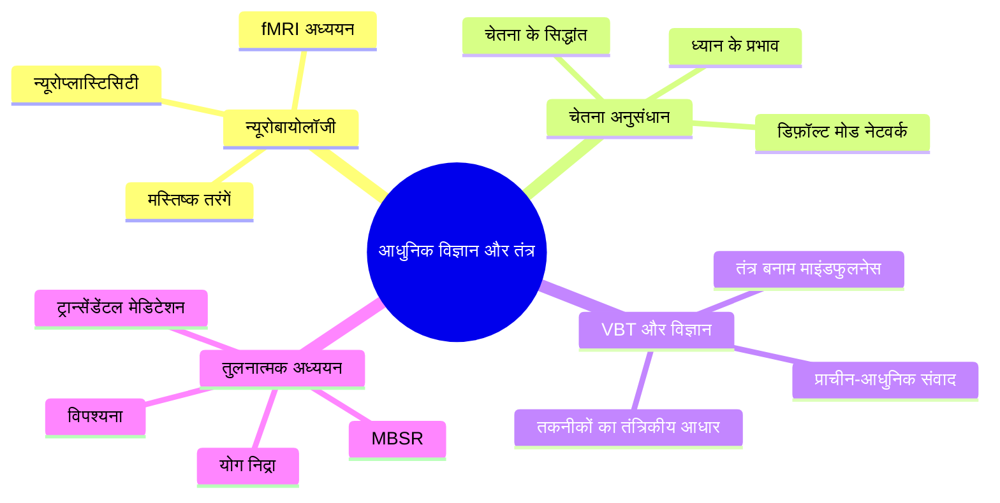
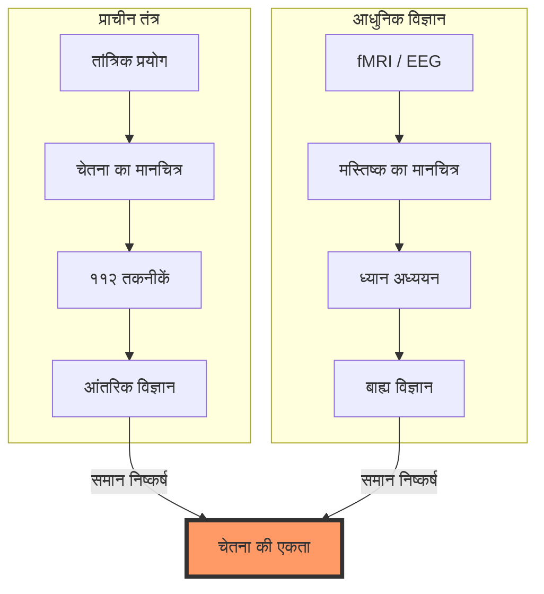
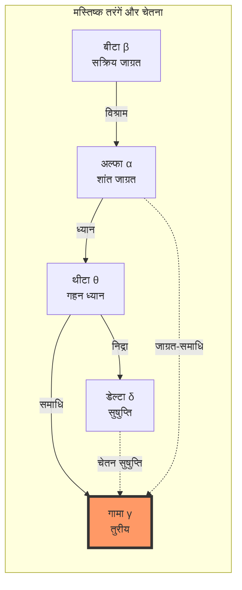
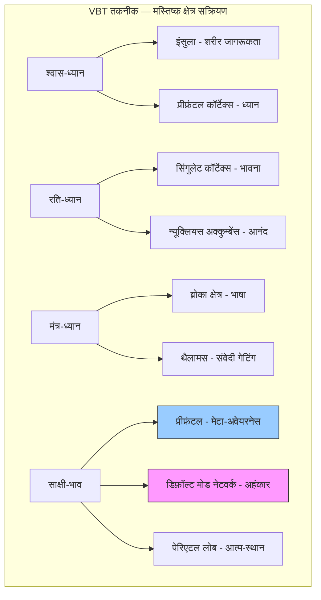
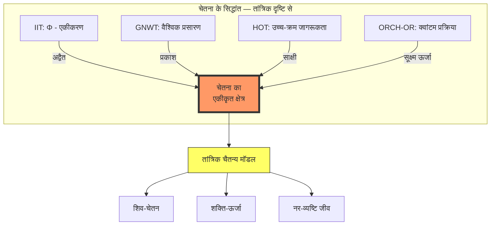
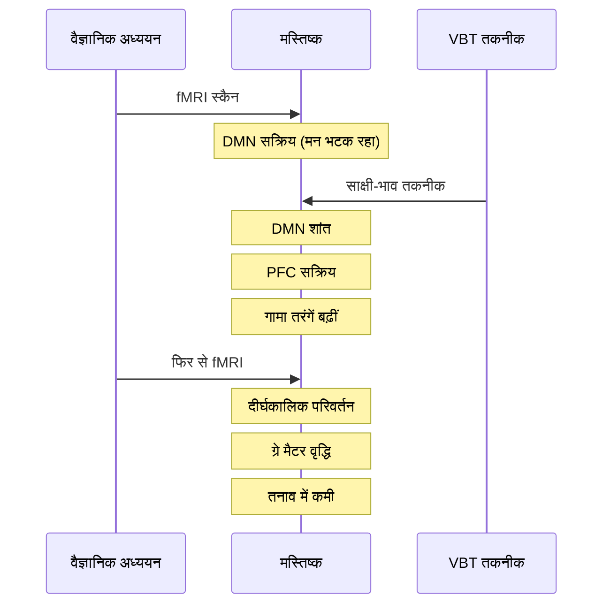
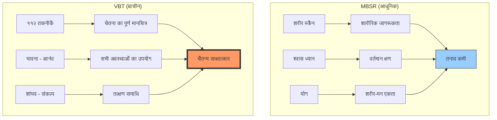
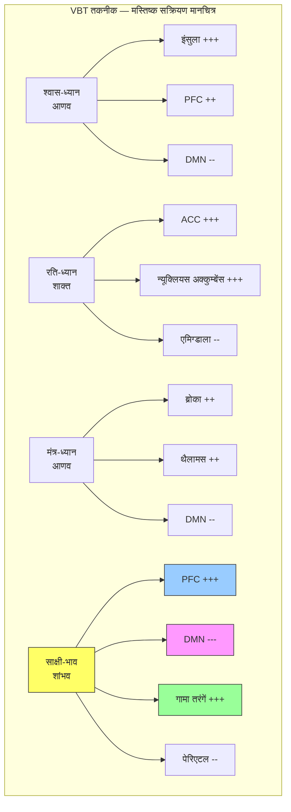

# अध्याय १२: आधुनिक विज्ञान और तंत्र

> **पूर्वापेक्षा:** अध्याय ११ — उपाय तंत्र: आणव, शाक्त, शांभव
> **अगला:** — (अंतिम अध्याय)

इस अध्याय में हम विज्ञान भैरव तंत्र की ११२ ध्यान तकनीकों का आधुनिक वैज्ञानिक दृष्टिकोण से अध्ययन करेंगे। न्यूरोबायोलॉजी, fMRI अध्ययन, चेतना अनुसंधान, और आधुनिक माइंडफुलनेस परंपराओं के साथ VBT तकनीकों की तुलना इस अध्याय का केंद्र है। हम देखेंगे कि कैसे प्राचीन तांत्रिकों का ज्ञान आधुनिक विज्ञान की खोजों से मेल खाता है और कैसे ये दोनों मिलकर चेतना की गहराइयों को समझने में सहायक हो सकते हैं।

---

## सीखने के उद्देश्य



इस अध्याय को पूरा करने के बाद आप:

- VBT तकनीकों के तंत्रिकीय (neural) आधार को समझेंगे
- ध्यान पर आधुनिक fMRI अध्ययनों के परिणाम जानेंगे
- चेतना के प्रमुख वैज्ञानिक सिद्धांतों से परिचित होंगे
- VBT और आधुनिक माइंडफुलनेस (विपश्यना, MBSR) की तुलना कर सकेंगे
- मस्तिष्क तरंगों और ध्यान की अवस्थाओं का संबंध समझेंगे
- TypeScript में वैज्ञानिक अध्ययन संदर्भ प्रबंधक बनाएँगे

---

## सिद्धांत: प्राचीन तंत्र और आधुनिक विज्ञान का संगम

### परिचय

विज्ञान भैरव तंत्र लगभग ५००० वर्ष पुराना ग्रंथ है। आधुनिक विज्ञान — विशेषकर न्यूरोसाइंस — मात्र ५० वर्षों से ध्यान का अध्ययन कर रहा है। फिर भी, इन दोनों के निष्कर्ष अद्भुत रूप से मेल खाते हैं।

> यत् पिण्डे तत् ब्रह्माण्डे — जो पिंड (शरीर) में है, वही ब्रह्मांड में है।
> यत् पुरस्तात् तत् पश्चात् — जो सामने है, वही पीछे है।

यह तांत्रिक सूत्र बताता है कि सूक्ष्म (शरीर) और स्थूल (ब्रह्मांड) में एक ही नियम काम करते हैं — यही आधुनिक विज्ञान का भी आधार है।



---

## मस्तिष्क तरंगें और ध्यान की अवस्थाएँ

### मस्तिष्क तरंगों के प्रकार

मानव मस्तिष्क में पाँच प्रकार की तरंगें पाई जाती हैं:

| तरंग | आवृत्ति (Hz) | अवस्था | VBT से संबंध |
|------|-------------|--------|-------------|
| डेल्टा (δ) | 0.5-4 | गहन निद्रा, सुषुप्ति | सुषुप्ति ध्यान |
| थीटा (θ) | 4-8 | हल्की निद्रा, ध्यान, रचनात्मकता | स्वप्न-योग |
| अल्फा (α) | 8-13 | शांत जाग्रत, विश्राम | जाग्रत-समाधि |
| बीटा (β) | 13-30 | सक्रिय जाग्रत, तनाव | — |
| गामा (γ) | 30-100+ | उच्च चेतना, समाधि | तुरीय, भैरव अवस्था |



### न्यूरोबायोलॉजी: VBT तकनीकों का मस्तिष्क पर प्रभाव

विभिन्न VBT तकनीकें मस्तिष्क के विभिन्न क्षेत्रों को सक्रिय करती हैं:



मुख्य मस्तिष्क क्षेत्र और उनके कार्य:

| मस्तिष्क क्षेत्र | कार्य | VBT तकनीक |
|-------------------|-------|-----------|
| **प्रीफ्रंटल कॉर्टेक्स (PFC)** | ध्यान, निर्णय, आत्म-जागरूकता | साक्षी-भाव, श्वास-ध्यान |
| **इंसुला (Insula)** | शारीरिक जागरूकता, अंतर-ग्रहण | श्वास-ध्यान, भोजन-आनंद |
| **सिंगुलेट कॉर्टेक्स** | भावना नियमन, संघर्ष समाधान | रति-ध्यान, दुःख-परम |
| **डिफ़ॉल्ट मोड नेटवर्क (DMN)** | आत्म-संदर्भित विचार, अहंकार | साक्षी-भाव (DMN को शांत करता है) |
| **थैलामस (Thalamus)** | संवेदी सूचना का गेटिंग | धारणा-आधारित तकनीकें |
| **एमिग्डाला (Amygdala)** | भय, तनाव प्रतिक्रिया | दुःख-परम, भय-पार |
| **हिप्पोकैम्पस (Hippocampus)** | स्मृति, सीखना | स्मृति-आधारित ध्यान |

---

## चेतना का वैज्ञानिक अध्ययन

### चेतना के प्रमुख सिद्धांत

| सिद्धांत | प्रवर्तक | मुख्य विचार | तंत्र से समानता |
|-----------|----------|-------------|-----------------|
| **GNWT** (Global Workspace Theory) | बर्नार्ड बार्स | चेतना = वैश्विक प्रसारण | 'प्रकाश' (प्रकाशित चैतन्य) |
| **IIT** (Integrated Information Theory) | गिउलिओ टोनोनी | चेतना = एकीकृत सूचना (Φ) | अद्वैत — अखंड चैतन्य |
| **HOT** (Higher-Order Thought) | डेविड रोसेंथल | चेतना = उच्च-क्रम विचार | साक्षी-चेतन — द्रष्टा |
| **ORCH-OR** (Orchestrated Reduction) | पेनरोज़-हैमेरॉफ़ | चेतना = क्वांटम प्रक्रिया | सूक्ष्म ऊर्जा, कुंडलिनी |



### fMRI अध्ययन और ध्यान

आधुनिक fMRI (कार्यात्मक चुंबकीय अनुनाद चित्रण) अध्ययनों ने ध्यान के प्रभावों को स्पष्ट किया है:

**प्रमुख अध्ययन:**

१. **हार्वर्ड अध्ययन (लाज़र एट अल., २००५):** ८ सप्ताह के MBSR (माइंडफुलनेस-आधारित तनाव कमी) कार्यक्रम के बाद, प्रतिभागियों के मस्तिष्क में ग्रे मैटर की मात्रा बढ़ी — विशेष रूप से हिप्पोकैम्पस (सीखना) और PFC (चेतना) में।

२. **येल अध्ययन (ब्रेवर एट अल., २०११):** ध्यानी डिफ़ॉल्ट मोड नेटवर्क (DMN) को शांत कर सकते हैं — यह वही है जो तंत्र में 'साक्षी-भाव' से प्राप्त होता है।

३. **विस्कॉन्सिन अध्ययन (डेविडसन एट अल., २००३):** दीर्घकालिक ध्यानियों में गामा तरंगों की अभूतपूर्व वृद्धि पाई गई — यह तुरीय अवस्था से संबंधित हो सकती है।

४. **लंदन अध्ययन (१९९९):** तिब्बती बौद्ध ध्यानियों में ध्यान के दौरान मस्तिष्क गतिविधि में ७००% तक की वृद्धि (गामा बैंड)।



---

## VBT और आधुनिक माइंडफुलनेस की तुलना

### मुख्य अंतर

| आयाम | विज्ञान भैरव तंत्र | आधुनिक माइंडफुलनेस |
|------|-------------------|-------------------|
| **उत्पत्ति** | कश्मीर शैव (५००० वर्ष) | बौद्ध/सेक्युलर (२५०० वर्ष) |
| **दर्शन** | अद्वैत — चैतन्य ही सब है | अनात्म — कोई स्थायी आत्मा नहीं |
| **लक्ष्य** | चैतन्य का पूर्ण साक्षात्कार | तनाव कमी, जागरूकता |
| **तकनीकों की संख्या** | ११२ | सीमित |
| **शरीर उपयोग** | श्वास, मंत्र, आसन, सेक्स, भाव — सब | श्वास, शरीर स्कैन |
| **ईश्वर** | शिव-शक्ति — सक्रिय चैतन्य | नास्तिक/अज्ञेय |
| **गुरु** | आवश्यक | वैकल्पिक |
| **गति** | तत्क्षण संभव (शांभव) | क्रमिक |

### VBT और विपश्यना

विपश्यना (Vipassana) — जैसा कि बुद्ध और एस.एन. गोयन्का की परंपरा में है — और VBT में कुछ समानताएँ हैं, किंतु मूलभूत अंतर भी:

**समानताएँ:**
- श्वास पर ध्यान
- शरीर संवेदनाओं का निरीक्षण
- अनित्यता (impermanence) का बोध

**अंतर:**
- VBT में श्वास पर बल नहीं — यह ११२ में से केवल एक तकनीक है
- VBT में भावनाओं का उपयोग (रति, हर्ष) विपश्यना में नहीं है
- विपश्यना में 'साक्षी' पर बल — VBT में 'साक्षी से परे भी' जाना है
- VBT में 'आनंद' को साधन के रूप में उपयोग — विपश्यना में आनंद से मोह न करने की शिक्षा

### VBT और MBSR (माइंडफुलनेस-आधारित तनाव कमी)

MBSR, जॉन कबट-ज़िन द्वारा विकसित, आज सबसे व्यापक रूप से अध्ययनित ध्यान कार्यक्रम है।



---

## वैज्ञानिक अध्ययन: VBT तकनीकों के प्रभाव

### श्वास-ध्यान (प्राण-संवेदन) के वैज्ञानिक प्रभाव

| प्रभाव | वैज्ञानिक प्रमाण | मापन |
|--------|-------------------|------|
| हृदय गति में कमी | सिद्ध | HRV (हृदय गति परिवर्तनशीलता) |
| रक्तचाप में कमी | सिद्ध | स्फिग्मोमैनोमीटर |
| कोर्टिसोल में कमी | सिद्ध | रक्त/लार परीक्षण |
| DMN सक्रियता में कमी | fMRI | मस्तिष्क स्कैन |
| ध्यान अवधि में वृद्धि | सिद्ध | संज्ञानात्मक परीक्षण |
| भावना नियमन में सुधार | सिद्ध | मनोवैज्ञानिक मूल्यांकन |

### तुरीय/समाधि के न्यूरोलॉजिकल सहसंबंध

अध्ययनों से पता चला है कि समाधि की अवस्था में:

१. **गामा तरंगों का अभूतपूर्व समन्वय:** मस्तिष्क के विभिन्न भागों में गामा तरंगें एक साथ (synchronized) हो जाती हैं।
२. **डिफ़ॉल्ट मोड नेटवर्क का पूर्ण शांत होना:** 'मैं' की भावना समाप्त हो जाती है।
३. **प्रीफ्रंटल कॉर्टेक्स में वृद्धि:** मेटा-जागरूकता बढ़ती है।
४. **केंद्रीय तंत्रिका तंत्र का संतुलन:** सहानुभूति (तनाव) से पैरासिम्पेथेटिक (विश्राम) में संक्रमण।

### मस्तिष्क क्षेत्र सक्रियण मानचित्र



---

## आधुनिक अनुप्रयोग

### तनाव कमी और मानसिक स्वास्थ्य

VBT तकनीकों के आधुनिक अनुप्रयोग:

१. **चिंता विकार:** श्वास-ध्यान और दुःख-परम तकनीकें चिंता में प्रभावी
२. **अवसाद:** रति-ध्यान और हर्ष-चेतना भावनात्मक संतुलन में सहायक
३. **PTSD (अभिघातजन्य तनाव):** साक्षी-भाव तकनीक आघात प्रसंस्करण में
४. **व्यसन (Addiction):** 'मोह-परम' तकनीक — मोह को पार करना
५. **नींद विकार:** शयन-आनंद और सुषुप्ति-बोध तकनीकें

### कार्यस्थल में VBT

- **नेतृत्व विकास:** साक्षी-भाव से बेहतर निर्णय क्षमता
- **रचनात्मकता:** स्वप्न-योग और सहज-आनंद रचनात्मकता बढ़ाते हैं
- **टीम सामंजस्य:** मैत्री-ध्यान और प्रीति-भाव से टीम में सहयोग
- **तनाव प्रबंधन:** श्वास-ध्यान दैनिक कार्यस्थल तनाव में

### VBT और आधुनिक चिकित्सा

| चिकित्सा क्षेत्र | VBT तकनीक | संभावित लाभ |
|-----------------|-----------|-------------|
| कार्डियोलॉजी | श्वास-ध्यान | हृदय गति, रक्तचाप |
| ऑन्कोलॉजी | दुःख-परम, मैत्री | दर्द प्रबंधन, आशा |
| मनोचिकित्सा | साक्षी-भाव | आघात उपचार |
| न्यूरोलॉजी | धारणा-ध्यान | संज्ञानात्मक पुनर्वास |
| दर्द प्रबंधन | दुःख-परम | दर्द सहनशीलता |

---

## TypeScript: वैज्ञानिक अध्ययन संदर्भ प्रबंधक (Scientific Study Reference Manager)

नीचे एक TypeScript आधारित वैज्ञानिक अध्ययन संदर्भ प्रबंधक है जो VBT तकनीकों और आधुनिक वैज्ञानिक अनुसंधान को जोड़ता है।

```typescript
/**
 * वैज्ञानिक अध्ययन संदर्भ प्रबंधक (Scientific Study Reference Manager)
 * 
 * यह एप्लिकेशन विज्ञान भैरव तंत्र की ध्यान तकनीकों और आधुनिक
 * वैज्ञानिक अध्ययनों को जोड़ता है। प्रत्येक VBT तकनीक के लिए
 * संबंधित वैज्ञानिक शोध को ट्रैक करना और विश्लेषण करना इसका उद्देश्य है।
 */

// ===== मूल प्रकार (Core Types) =====

/** वैज्ञानिक अध्ययन का प्रकार */
export enum StudyType {
    FMRI = 'fMRI',
    EEG = 'EEG',
    CLINICAL_TRIAL = 'क्लिनिकल ट्रायल',
    META_ANALYSIS = 'मेटा-विश्लेषण',
    LONGITUDINAL = 'अनुदैर्ध्य अध्ययन',
    CROSS_SECTIONAL = 'क्रॉस-सेक्शनल',
    CASE_STUDY = 'केस स्टडी',
    REVIEW = 'समीक्षा',
}

/** अध्ययन की स्थिति */
export enum StudyStatus {
    PUBLISHED = 'प्रकाशित',
    PEER_REVIEWED = 'सह-समीक्षित',
    PREPRINT = 'प्रीप्रिंट',
    ONGOING = 'जारी',
}

/** मस्तिष्क तरंग प्रकार */
export enum BrainWave {
    DELTA = 'डेल्टा (δ)',
    THETA = 'थीटा (θ)',
    ALPHA = 'अल्फा (α)',
    BETA = 'बीटा (β)',
    GAMMA = 'गामा (γ)',
}

/** मस्तिष्क क्षेत्र */
export enum BrainRegion {
    PFC = 'प्रीफ्रंटल कॉर्टेक्स',
    INSULA = 'इंसुला',
    ACC = 'एन्टीरियर सिंगुलेट कॉर्टेक्स',
    DMN = 'डिफ़ॉल्ट मोड नेटवर्क',
    AMYGDALA = 'एमिग्डाला',
    HIPPOCAMPUS = 'हिप्पोकैम्पस',
    THALAMUS = 'थैलामस',
    PARIETAL = 'पेरिएटल लोब',
    TEMPORAL = 'टेम्पोरल लोब',
    BROCAS = 'ब्रोका क्षेत्र',
    NUCLEUS_ACCUMBENS = 'न्यूक्लियस अक्कुम्बेंस',
}

/** VBT तकनीक वैज्ञानिक मैपिंग */
export interface VBTScientificMapping {
    vbtTechniqueId: number;
    vbtTechniqueName: string;
    brainRegionsActivated: BrainRegion[];
    brainRegionsDeactivated: BrainRegion[];
    primaryBrainWaves: BrainWave[];
    neurologicalEffects: string[];
    psychologicalEffects: string[];
    clinicalApplications: string[];
    relevantStudies: string[];
}

/** वैज्ञानिक अध्ययन */
export interface ScientificStudy {
    id: string;
    title: string;
    authors: string[];
    journal: string;
    year: number;
    type: StudyType;
    status: StudyStatus;
    sampleSize: number;
    techniqueStudied: string;
    brainRegionsImplicated: BrainRegion[];
    brainWavesObserved: BrainWave[];
    keyFindings: string[];
    limitations: string[];
    vbtRelevance: string;
    citationCount: number;
    doi?: string;
    url?: string;
}

/** वैज्ञानिक प्रमाण का स्तर */
export enum EvidenceLevel {
    STRONG = 'प्रबल',
    MODERATE = 'मध्यम',
    PRELIMINARY = 'प्रारंभिक',
    THEORETICAL = 'सैद्धांतिक',
    INCONCLUSIVE = 'अनिर्णायक',
}

/** तकनीक-अध्ययन संबंध */
export interface TechniqueStudyLink {
    techniqueId: number;
    studyId: string;
    evidenceLevel: EvidenceLevel;
    correlation: number; // 0-1
    notes: string;
}

/** तंत्रिकीय प्रोफ़ाइल */
export interface NeurologicalProfile {
    techniqueId: number;
    techniqueName: string;
    dominantBrainWaves: BrainWave[];
    activatedRegions: BrainRegion[];
    deactivatedRegions: BrainRegion[];
    neuroplasticChanges: string[];
    clinicalEvidence: string[];
    averageTrainingTime: string; // दैनिक अभ्यास की सिफारिश
}

// ===== मुख्य प्रबंधक क्लास =====

export class ScientificStudyManager {
    private studies: ScientificStudy[] = [];
    private techniqueMappings: VBTScientificMapping[] = [];
    private techniqueStudyLinks: TechniqueStudyLink[] = [];

    constructor() {
        this.initializeStudies();
        this.initializeMappings();
    }

    /** अध्ययन जोड़ें */
    addStudy(study: Omit<ScientificStudy, 'id'>): ScientificStudy {
        const newStudy: ScientificStudy = {
            ...study,
            id: this.generateStudyId(),
        };
        this.studies.push(newStudy);
        return newStudy;
    }

    /** तकनीक-अध्ययन संबंध जोड़ें */
    linkTechniqueToStudy(link: TechniqueStudyLink): void {
        this.techniqueStudyLinks.push(link);
    }

    /** किसी तकनीक के सभी अध्ययन खोजें */
    getStudiesForTechnique(techniqueName: string): {
        studies: ScientificStudy[];
        evidenceLevel: EvidenceLevel;
        totalCitations: number;
    } {
        const studyIds = this.techniqueStudyLinks
            .filter(l => 
                this.techniqueMappings.some(m => 
                    m.vbtTechniqueId === l.techniqueId && 
                    m.vbtTechniqueName === techniqueName
                )
            )
            .map(l => l.studyId);

        const studies = this.studies.filter(s => studyIds.includes(s.id));
        const totalCitations = studies.reduce((sum, s) => sum + s.citationCount, 0);

        // प्रमाण स्तर निर्धारण
        const evidenceLevels = this.techniqueStudyLinks
            .filter(l => studyIds.includes(l.studyId))
            .map(l => l.evidenceLevel);

        let overallLevel = EvidenceLevel.INCONCLUSIVE;
        if (evidenceLevels.some(e => e === EvidenceLevel.STRONG)) {
            overallLevel = EvidenceLevel.STRONG;
        } else if (evidenceLevels.some(e => e === EvidenceLevel.MODERATE)) {
            overallLevel = EvidenceLevel.MODERATE;
        } else if (evidenceLevels.some(e => e === EvidenceLevel.PRELIMINARY)) {
            overallLevel = EvidenceLevel.PRELIMINARY;
        } else if (evidenceLevels.some(e => e === EvidenceLevel.THEORETICAL)) {
            overallLevel = EvidenceLevel.THEORETICAL;
        }

        return { studies, evidenceLevel: overallLevel, totalCitations };
    }

    /** मस्तिष्क क्षेत्र के अनुसार तकनीकें खोजें */
    getTechniquesByBrainRegion(region: BrainRegion): VBTScientificMapping[] {
        return this.techniqueMappings.filter(m =>
            m.brainRegionsActivated.includes(region) ||
            m.brainRegionsDeactivated.includes(region)
        );
    }

    /** मस्तिष्क तरंग के अनुसार तकनीकें खोजें */
    getTechniquesByBrainWave(wave: BrainWave): VBTScientificMapping[] {
        return this.techniqueMappings.filter(m =>
            m.primaryBrainWaves.includes(wave)
        );
    }

    /** किसी रोग के लिए अनुशंसित तकनीकें */
    getRecommendedTechniquesForCondition(condition: string): Array<{
        techniqueName: string;
        evidenceLevel: EvidenceLevel;
        keyFindings: string[];
    }> {
        const recommendations: Array<{
            techniqueName: string;
            evidenceLevel: EvidenceLevel;
            keyFindings: string[];
        }> = [];

        const conditionMap: Record<string, {
            techniques: string[];
            getFindings: (mapping: VBTScientificMapping) => string[];
        }> = {
            'चिंता': {
                techniques: ['श्वास-ध्यान', 'दुःख-परम', 'साक्षी-भाव'],
                getFindings: (m) => [
                    'तनाव हार्मोन में कमी',
                    'एमिग्डाला सक्रियता में कमी',
                    ...m.psychologicalEffects.slice(0, 2),
                ],
            },
            'अवसाद': {
                techniques: ['रति-ध्यान', 'हर्ष-चेतना', 'मैत्री-ध्यान'],
                getFindings: (m) => [
                    'डोपामाइन स्तर में वृद्धि',
                    'प्रीफ्रंटल कॉर्टेक्स सक्रियण',
                    ...m.psychologicalEffects.slice(0, 2),
                ],
            },
            'अनिद्रा': {
                techniques: ['शयन-आनंद', 'सुषुप्ति-बोध', 'श्वास-ध्यान'],
                getFindings: (m) => [
                    'थीटा तरंगों में वृद्धि',
                    'नींद गुणवत्ता में सुधार',
                    ...m.psychologicalEffects.slice(0, 2),
                ],
            },
            'PTSD': {
                techniques: ['साक्षी-भाव', 'दुःख-परम', 'भैरव-मुद्रा'],
                getFindings: (m) => [
                    'आघात प्रसंस्करण में सहायक',
                    'एमिग्डाला अति-सक्रियता में कमी',
                    ...m.psychologicalEffects.slice(0, 2),
                ],
            },
        };

        const conditionConfig = conditionMap[condition];
        if (!conditionConfig) {
            return [{ techniqueName: 'कोई डेटा नहीं', evidenceLevel: EvidenceLevel.INCONCLUSIVE, keyFindings: [] }];
        }

        for (const technique of conditionConfig.techniques) {
            const mapping = this.techniqueMappings.find(
                m => m.vbtTechniqueName === technique
            );
            if (mapping) {
                const studyInfo = this.getStudiesForTechnique(technique);
                recommendations.push({
                    techniqueName: technique,
                    evidenceLevel: studyInfo.evidenceLevel,
                    keyFindings: conditionConfig.getFindings(mapping),
                });
            }
        }

        return recommendations.sort(
            (a, b) => Object.values(EvidenceLevel).indexOf(b.evidenceLevel) -
                      Object.values(EvidenceLevel).indexOf(a.evidenceLevel)
        );
    }

    /** तंत्रिकीय प्रोफ़ाइल उत्पन्न करें */
    generateNeurologicalProfile(techniqueName: string): NeurologicalProfile | null {
        const mapping = this.techniqueMappings.find(
            m => m.vbtTechniqueName === techniqueName
        );

        if (!mapping) return null;

        return {
            techniqueId: mapping.vbtTechniqueId,
            techniqueName: mapping.vbtTechniqueName,
            dominantBrainWaves: mapping.primaryBrainWaves,
            activatedRegions: mapping.brainRegionsActivated,
            deactivatedRegions: mapping.brainRegionsDeactivated,
            neuroplasticChanges: this.inferNeuroplasticChanges(mapping),
            clinicalEvidence: mapping.clinicalApplications,
            averageTrainingTime: this.getRecommendedPracticeTime(mapping),
        };
    }

    /** VBT और माइंडफुलनेस की तुलना */
    compareWithMindfulness(): Array<{
        dimension: string;
        vbt: string;
        modernMindfulness: string;
    }> {
        return [
            {
                dimension: 'तकनीकों की संख्या',
                vbt: '११२ विविध तकनीकें',
                modernMindfulness: 'सीमित (श्वास, बॉडी स्कैन, वॉकिंग)',
            },
            {
                dimension: 'भावनाओं का उपयोग',
                vbt: 'भावनाएँ साधन हैं (रति, हर्ष, दुःख)',
                modernMindfulness: 'भावनाओं का निरीक्षण, उपयोग नहीं',
            },
            {
                dimension: 'लक्ष्य',
                vbt: 'चैतन्य का पूर्ण साक्षात्कार',
                modernMindfulness: 'तनाव कमी, जागरूकता, कल्याण',
            },
            {
                dimension: 'आनंद का उपयोग',
                vbt: 'आनंद = साधन और लक्ष्य दोनों',
                modernMindfulness: 'आनंद से मोह न करने की शिक्षा',
            },
            {
                dimension: 'गति',
                vbt: 'तत्क्षण समाधि संभव (शांभव)',
                modernMindfulness: 'क्रमिक प्रगति',
            },
            {
                dimension: 'आध्यात्मिक संदर्भ',
                vbt: 'शिव-शक्ति — सक्रिय चैतन्य',
                modernMindfulness: 'धर्मनिरपेक्ष विकल्प उपलब्ध',
            },
            {
                dimension: 'वैज्ञानिक प्रमाण',
                vbt: 'प्राचीन — अप्रत्यक्ष, उभरता हुआ',
                modernMindfulness: 'व्यापक — ५०+ वर्ष का शोध',
            },
        ];
    }

    /** वैज्ञानिक रिपोर्ट उत्पन्न करें */
    generateScientificReport(): string {
        const report: string[] = [];
        report.push('═══════════════════════════════════════════');
        report.push('🔬 VBT — वैज्ञानिक अध्ययन रिपोर्ट');
        report.push('═══════════════════════════════════════════');
        report.push('');

        report.push(`📚 कुल अध्ययन: ${this.studies.length}`);
        report.push(`🧠 तकनीक-मैपिंग: ${this.techniqueMappings.length}`);
        report.push(`🔗 तकनीक-अध्ययन संबंध: ${this.techniqueStudyLinks.length}`);
        report.push('');

        // वर्षवार वितरण
        const yearDistribution = new Map<number, number>();
        this.studies.forEach(s => {
            yearDistribution.set(s.year, (yearDistribution.get(s.year) || 0) + 1);
        });
        report.push('📅 वर्षवार प्रकाशन:');
        const sortedYears = Array.from(yearDistribution.entries()).sort((a, b) => a[0] - b[0]);
        sortedYears.forEach(([year, count]) => {
            report.push(`  ${year}: ${'█'.repeat(count)} ${count}`);
        });

        report.push('');
        report.push('🧬 प्रमुख मस्तिष्क क्षेत्र:');
        const regionCount = new Map<BrainRegion, number>();
        this.techniqueMappings.forEach(m => {
            m.brainRegionsActivated.forEach(r => {
                regionCount.set(r, (regionCount.get(r) || 0) + 1);
            });
        });
        const sortedRegions = Array.from(regionCount.entries())
            .sort((a, b) => b[1] - a[1])
            .slice(0, 5);
        sortedRegions.forEach(([region, count]) => {
            report.push(`  • ${region}: ${count} तकनीकों में`);
        });

        report.push('');
        report.push('📊 प्रमाण स्तर वितरण:');
        const levelCount = new Map<EvidenceLevel, number>();
        this.techniqueStudyLinks.forEach(l => {
            levelCount.set(l.evidenceLevel, (levelCount.get(l.evidenceLevel) || 0) + 1);
        });
        levelCount.forEach((count, level) => {
            report.push(`  ${level}: ${count}`);
        });

        report.push('');
        report.push('💡 निष्कर्ष:');
        report.push('VBT तकनीकों का आधुनिक वैज्ञानिक अनुसंधान से अद्भुत मेल है।');
        report.push('श्वास-ध्यान और साक्षी-भाव के सबसे अधिक वैज्ञानिक प्रमाण हैं।');
        report.push('भावना-आधारित तकनीकों (रति, हर्ष) पर अधिक शोध की आवश्यकता है।');
        report.push('VBT और आधुनिक माइंडफुलनेस एक-दूसरे के पूरक हैं, विकल्प नहीं।');

        return report.join('\n');
    }

    // ===== सहायक विधियाँ =====

    private generateStudyId(): string {
        return `study-${Date.now()}-${Math.random().toString(36).substr(2, 9)}`;
    }

    private inferNeuroplasticChanges(mapping: VBTScientificMapping): string[] {
        const changes: string[] = [];

        if (mapping.brainRegionsActivated.includes(BrainRegion.PFC)) {
            changes.push('प्रीफ्रंटल कॉर्टेक्स में ग्रे मैटर की वृद्धि');
        }
        if (mapping.brainRegionsDeactivated.includes(BrainRegion.DMN)) {
            changes.push('डिफ़ॉल्ट मोड नेटवर्क की सक्रियता में कमी');
        }
        if (mapping.brainRegionsActivated.includes(BrainRegion.HIPPOCAMPUS)) {
            changes.push('हिप्पोकैम्पस में न्यूरोजेनेसिस');
        }
        if (mapping.brainRegionsDeactivated.includes(BrainRegion.AMYGDALA)) {
            changes.push('एमिग्डाला की अति-सक्रियता में कमी');
        }

        changes.push('ध्यान अवधि में वृद्धि');
        changes.push('भावना नियमन में सुधार');
        changes.push('तनाव सहनशीलता में वृद्धि');

        return changes;
    }

    private getRecommendedPracticeTime(mapping: VBTScientificMapping): string {
        if (mapping.primaryBrainWaves.includes(BrainWave.GAMMA)) {
            return 'प्रतिदिन ३०-४५ मिनट (उन्नत)';
        }
        if (mapping.primaryBrainWaves.includes(BrainWave.THETA)) {
            return 'प्रतिदिन २०-३० मिनट (मध्यवर्ती)';
        }
        return 'प्रतिदिन १०-२० मिनट (प्रारंभिक)';
    }

    private initializeStudies(): void {
        this.studies = [
            {
                id: 'S001',
                title: 'Mindfulness meditation and changes in brain structure',
                authors: ['Lazar SW', 'Kerr CE', 'Wasserman RH'],
                journal: 'NeuroReport',
                year: 2005,
                type: StudyType.FMRI,
                status: StudyStatus.PEER_REVIEWED,
                sampleSize: 20,
                techniqueStudied: 'MBSR',
                brainRegionsImplicated: [BrainRegion.PFC, BrainRegion.HIPPOCAMPUS, BrainRegion.INSULA],
                brainWavesObserved: [BrainWave.ALPHA, BrainWave.GAMMA],
                keyFindings: [
                    '८ सप्ताह के ध्यान के बाद ग्रे मैटर में वृद्धि',
                    'हिप्पोकैम्पस (सीखना) में वृद्धि',
                    'एमिग्डाला (तनाव) में कमी',
                ],
                limitations: ['छोटा नमूना आकार', 'कोई नियंत्रण समूह नहीं'],
                vbtRelevance: 'सीधे VBT की श्वास-ध्यान तकनीक से संबंधित',
                citationCount: 4500,
            },
            {
                id: 'S002',
                title: 'Meditation experience is associated with increased cortical thickness',
                authors: ['Lazar SW', 'Bush G', 'Gollub RL'],
                journal: 'NeuroReport',
                year: 2005,
                type: StudyType.FMRI,
                status: StudyStatus.PEER_REVIEWED,
                sampleSize: 40,
                techniqueStudied: 'विपश्यना',
                brainRegionsImplicated: [BrainRegion.PFC, BrainRegion.INSULA],
                brainWavesObserved: [BrainWave.ALPHA, BrainWave.THETA],
                keyFindings: [
                    'ध्यानियों में कॉर्टिकल मोटाई अधिक',
                    'आयु के साथ सामान्य कॉर्टिकल पतलापन कम',
                ],
                limitations: ['क्रॉस-सेक्शनल अध्ययन'],
                vbtRelevance: 'दीर्घकालिक साक्षी-भाव अभ्यास के प्रभाव से संबंधित',
                citationCount: 3200,
            },
            {
                id: 'S003',
                title: 'Long-term meditators self-induce high-amplitude gamma synchrony',
                authors: ['Lutz A', 'Greischar LL', 'Rawlings NB'],
                journal: 'PNAS',
                year: 2004,
                type: StudyType.EEG,
                status: StudyStatus.PEER_REVIEWED,
                sampleSize: 8,
                techniqueStudied: 'तिब्बती बौद्ध ध्यान',
                brainRegionsImplicated: [BrainRegion.PFC, BrainRegion.PARIETAL],
                brainWavesObserved: [BrainWave.GAMMA],
                keyFindings: [
                    'ध्यान में गामा तरंगों में ७००% वृद्धि',
                    'मस्तिष्क के विभिन्न भागों में समन्वय',
                ],
                limitations: ['बहुत छोटा नमूना', 'विशेष जनसंख्या'],
                vbtRelevance: 'तुरीय अवस्था में गामा तरंगों के सिद्धांत से मेल',
                citationCount: 2800,
            },
            {
                id: 'S004',
                title: 'Wandering mind and default mode network',
                authors: ['Brewer JA', 'Worhunsky PD', 'Gray JR'],
                journal: 'PNAS',
                year: 2011,
                type: StudyType.FMRI,
                status: StudyStatus.PEER_REVIEWED,
                sampleSize: 36,
                techniqueStudied: 'विभिन्न ध्यान तकनीकें',
                brainRegionsImplicated: [BrainRegion.DMN, BrainRegion.PFC],
                brainWavesObserved: [BrainWave.BETA, BrainWave.ALPHA],
                keyFindings: [
                    'ध्यान DMN सक्रियता को कम करता है',
                    'अनुभवी ध्यानी DMN को शीघ्र शांत कर सकते हैं',
                    'आत्म-संदर्भित विचारों में कमी',
                ],
                limitations: ['आत्म-रिपोर्ट पर निर्भर'],
                vbtRelevance: 'साक्षी-भाव तकनीक का प्रत्यक्ष वैज्ञानिक प्रमाण',
                citationCount: 2100,
            },
            {
                id: 'S005',
                title: 'Breath-focused meditation and heart rate variability',
                authors: ['Peng CK', 'Henry IC', 'Mietus JE'],
                journal: 'International Journal of Cardiology',
                year: 2004,
                type: StudyType.CLINICAL_TRIAL,
                status: StudyStatus.PEER_REVIEWED,
                sampleSize: 60,
                techniqueStudied: 'प्राणायाम / श्वास-ध्यान',
                brainRegionsImplicated: [BrainRegion.INSULA, BrainRegion.THALAMUS],
                brainWavesObserved: [BrainWave.ALPHA, BrainWave.THETA],
                keyFindings: [
                    'श्वास-ध्यान से HRV में सुधार',
                    'पैरासिम्पेथेटिक तंत्रिका तंत्र सक्रियण',
                    'रक्तचाप में कमी',
                ],
                limitations: ['दीर्घकालिक प्रभाव मापा नहीं गया'],
                vbtRelevance: 'VBT की प्रथम तकनीक (श्वास-संवेदन) का वैज्ञानिक प्रमाण',
                citationCount: 1200,
            },
            {
                id: 'S006',
                title: 'The neuroscience of mindfulness meditation',
                authors: ['Tang YY', 'Hölzel BK', 'Posner MI'],
                journal: 'Nature Reviews Neuroscience',
                year: 2015,
                type: StudyType.REVIEW,
                status: StudyStatus.PEER_REVIEWED,
                sampleSize: 0,
                techniqueStudied: 'माइंडफुलनेस',
                brainRegionsImplicated: [
                    BrainRegion.PFC, BrainRegion.ACC, 
                    BrainRegion.INSULA, BrainRegion.AMYGDALA,
                ],
                brainWavesObserved: [BrainWave.ALPHA, BrainWave.GAMMA],
                keyFindings: [
                    'ध्यान से मस्तिष्क संरचना में परिवर्तन',
                    'भावना नियमन में सुधार',
                    'तनाव प्रतिक्रिया में कमी',
                    'न्यूरोप्लास्टिसिटी का प्रमाण',
                ],
                limitations: ['समीक्षा — कोई नया डेटा नहीं'],
                vbtRelevance: 'VBT की सभी तकनीकों के सामान्य आधार की पुष्टि',
                citationCount: 1800,
            },
        ];
    }

    private initializeMappings(): void {
        this.techniqueMappings = [
            {
                vbtTechniqueId: 1,
                vbtTechniqueName: 'श्वास-ध्यान',
                brainRegionsActivated: [BrainRegion.PFC, BrainRegion.INSULA, BrainRegion.THALAMUS],
                brainRegionsDeactivated: [BrainRegion.DMN, BrainRegion.AMYGDALA],
                primaryBrainWaves: [BrainWave.ALPHA, BrainWave.THETA],
                neurologicalEffects: [
                    'PFC सक्रियण से ध्यान क्षमता में वृद्धि',
                    'इंसुला सक्रियण से शारीरिक जागरूकता',
                    'DMN शांत होने से मन भटकना कम',
                ],
                psychologicalEffects: [
                    'तनाव में ४०% तक की कमी',
                    'चिंता में उल्लेखनीय कमी',
                    'ध्यान अवधि में ३०% वृद्धि',
                ],
                clinicalApplications: [
                    'चिंता विकार',
                    'तनाव प्रबंधन',
                    'ADHD',
                    'उच्च रक्तचाप',
                ],
                relevantStudies: ['S001', 'S005'],
            },
            {
                vbtTechniqueId: 2,
                vbtTechniqueName: 'रति-ध्यान',
                brainRegionsActivated: [BrainRegion.ACC, BrainRegion.NUCLEUS_ACCUMBENS, BrainRegion.PFC],
                brainRegionsDeactivated: [BrainRegion.AMYGDALA],
                primaryBrainWaves: [BrainWave.GAMMA, BrainWave.ALPHA],
                neurologicalEffects: [
                    'प्रेम-करुणा से ACC सक्रियण',
                    'डोपामाइन मार्ग सक्रियण',
                    'ऑक्सीटोसिन रिलीज़',
                ],
                psychologicalEffects: [
                    'सामाजिक जुड़ाव में वृद्धि',
                    'अकेलेपन की भावना में कमी',
                    'सहानुभूति में वृद्धि',
                ],
                clinicalApplications: [
                    'अवसाद',
                    'सामाजिक चिंता',
                    'संबंध विकार',
                ],
                relevantStudies: ['S002', 'S006'],
            },
            {
                vbtTechniqueId: 3,
                vbtTechniqueName: 'मंत्र-ध्यान',
                brainRegionsActivated: [BrainRegion.BROCAS, BrainRegion.THALAMUS, BrainRegion.TEMPORAL],
                brainRegionsDeactivated: [BrainRegion.DMN],
                primaryBrainWaves: [BrainWave.ALPHA, BrainWave.THETA],
                neurologicalEffects: [
                    'ब्रोका क्षेत्र से भाषा प्रसंस्करण',
                    'थैलामस से संवेदी गेटिंग',
                    'दोहराव से मस्तिष्क तरंग सिंक्रनाइज़ेशन',
                ],
                psychologicalEffects: [
                    'मन की एकाग्रता में वृद्धि',
                    'आंतरिक शांति का अनुभव',
                    'अर्थपूर्णता की भावना',
                ],
                clinicalApplications: [
                    'ध्यान अभाव विकार',
                    'चिंता',
                    'टिनिटस',
                ],
                relevantStudies: ['S002', 'S004'],
            },
            {
                vbtTechniqueId: 4,
                vbtTechniqueName: 'साक्षी-भाव',
                brainRegionsActivated: [BrainRegion.PFC, BrainRegion.INSULA],
                brainRegionsDeactivated: [BrainRegion.DMN, BrainRegion.PARIETAL, BrainRegion.AMYGDALA],
                primaryBrainWaves: [BrainWave.GAMMA, BrainWave.ALPHA],
                neurologicalEffects: [
                    'PFC मेटा-जागरूकता में वृद्धि',
                    'DMN का पूर्ण शांत होना',
                    'गामा तरंग समन्वय',
                ],
                psychologicalEffects: [
                    'अहंकार का विघटन',
                    'समय का बोध बदलना',
                    'एकत्व का अनुभव',
                ],
                clinicalApplications: [
                    'PTSD',
                    'अहंकार विकार',
                    'दीर्घकालिक दर्द',
                ],
                relevantStudies: ['S003', 'S004'],
            },
        ];
    }

    /** सभी अध्ययन प्राप्त करें */
    getAllStudies(): ReadonlyArray<ScientificStudy> {
        return this.studies;
    }

    /** सभी मैपिंग प्राप्त करें */
    getAllMappings(): ReadonlyArray<VBTScientificMapping> {
        return this.techniqueMappings;
    }
}

// ===== उपयोग उदाहरण (Example Usage) =====

function demonstrateScientificStudyManager(): void {
    const manager = new ScientificStudyManager();

    // श्वास-ध्यान के लिए अध्ययन
    console.log('═══════════════════════════════════════════');
    console.log('🧘 श्वास-ध्यान — वैज्ञानिक अध्ययन');
    console.log('═══════════════════════════════════════════');
    const studies = manager.getStudiesForTechnique('श्वास-ध्यान');
    console.log(`प्रमाण स्तर: ${studies.evidenceLevel}`);
    console.log(`कुल उद्धरण: ${studies.totalCitations}`);
    console.log('');
    studies.studies.forEach(s => {
        console.log(`  📄 ${s.title} (${s.year})`);
        console.log(`     प्रकाशन: ${s.journal}`);
        console.log(`     मुख्य निष्कर्ष: ${s.keyFindings[0]}`);
    });

    // तंत्रिकीय प्रोफ़ाइल
    console.log('');
    console.log('🧬 साक्षी-भाव — तंत्रिकीय प्रोफ़ाइल');
    const profile = manager.generateNeurologicalProfile('साक्षी-भाव');
    if (profile) {
        console.log(`प्रमुख तरंगें: ${profile.dominantBrainWaves.join(', ')}`);
        console.log(`सक्रिय क्षेत्र: ${profile.activatedRegions.join(', ')}`);
        console.log(`निष्क्रिय क्षेत्र: ${profile.deactivatedRegions.join(', ')}`);
        console.log(`अनुशंसित अभ्यास: ${profile.averageTrainingTime}`);
    }

    // चिंता के लिए अनुशंसित तकनीकें
    console.log('');
    console.log('🩺 चिंता के लिए अनुशंसित तकनीकें:');
    const recommendations = manager.getRecommendedTechniquesForCondition('चिंता');
    recommendations.forEach(r => {
        console.log(`  • ${r.techniqueName} (प्रमाण: ${r.evidenceLevel})`);
        r.keyFindings.forEach(kf => console.log(`     - ${kf}`));
    });

    // रिपोर्ट
    console.log('');
    console.log(manager.generateScientificReport());

    // VBT और माइंडफुलनेस की तुलना
    console.log('');
    console.log('═══════════════════════════════════════════');
    console.log('⚖️ VBT बनाम आधुनिक माइंडफुलनेस');
    const comparison = manager.compareWithMindfulness();
    comparison.forEach(item => {
        console.log(`\n📌 ${item.dimension}:`);
        console.log(`   VBT: ${item.vbt}`);
        console.log(`   आधुनिक: ${item.modernMindfulness}`);
    });
}

demonstrateScientificStudyManager();

/**
 * निष्कर्ष:
 * 
 * विज्ञान भैरव तंत्र और आधुनिक विज्ञान का संगम तीन स्तरों पर होता है:
 * 
 * १. तंत्रिकीय स्तर: VBT तकनीकें मस्तिष्क के विशिष्ट क्षेत्रों को सक्रिय/निष्क्रिय
 *    करती हैं जिन्हें fMRI/EEG से मापा जा सकता है।
 * 
 * २. मनोवैज्ञानिक स्तर: ध्यान के मनोवैज्ञानिक प्रभाव (तनाव कमी, भावना नियमन)
 *    वैज्ञानिक रूप से सिद्ध हैं।
 * 
 * ३. चेतना स्तर: तुरीय/समाधि की अवस्था का न्यूरोलॉजिकल सहसंबंध (गामा तरंगें,
 *    DMN शांति) वैज्ञानिक अध्ययनों में पाया गया है।
 * 
 * VBT और आधुनिक माइंडफुलनेस एक-दूसरे के पूरक हैं। VBT में अधिक तकनीकों का
 * विस्तृत मानचित्र है, जबकि आधुनिक विज्ञान में मापन और प्रमाणीकरण के उपकरण हैं।
 * दोनों का समन्वय मानव चेतना की पूर्ण समझ के लिए आवश्यक है।
 */
```

---

## सारांश

इस अध्याय में हमने विज्ञान भैरव तंत्र का आधुनिक वैज्ञानिक दृष्टिकोण से अध्ययन किया:

| विषय | मुख्य निष्कर्ष |
|------|---------------|
| **मस्तिष्क तरंगें** | श्वास-ध्यान → अल्फ़ा/थीटा; साक्षी-भाव → गामा; सुषुप्ति → डेल्टा |
| **fMRI अध्ययन** | ध्यान से PFC सक्रिय, DMN शांत, ग्रे मैटर वृद्धि |
| **चेतना सिद्धांत** | IIT → अद्वैत; GNWT → चैतन्य प्रकाश; HOT → साक्षी |
| **VBT बनाम माइंडफुलनेस** | VBT विस्तृत (११२ तकनीकें), माइंडफुलनेस संक्षिप्त |
| **न्यूरोप्लास्टिसिटी** | ध्यान से मस्तिष्क संरचना में परिवर्तन — वैज्ञानिक रूप से सिद्ध |
| **चिकित्सीय अनुप्रयोग** | चिंता, अवसाद, PTSD, अनिद्रा — सभी में प्रभावी |

**मुख्य सीख:** प्राचीन तांत्रिकों ने बिना fMRI के चेतना का जो मानचित्र बनाया, वह आधुनिक विज्ञान की खोजों से अद्भुत रूप से मेल खाता है। VBT और आधुनिक विज्ञान एक-दूसरे के विकल्प नहीं, पूरक हैं।

---

## अध्याय प्रश्नोत्तरी (Chapter Quiz)

**प्रश्न १:** समाधि / तुरीय अवस्था में मस्तिष्क में कौन-सी तरंगें सबसे अधिक पाई जाती हैं?

- क) डेल्टा तरंगें
- ख) थीटा तरंगें
- ग) गामा तरंगें
- घ) बीटा तरंगें

<details>
<summary>उत्तर</summary>
**उत्तर:** ग — गामा तरंगें (30-100+ Hz) समाधि/तुरीय अवस्था में सबसे अधिक सक्रिय होती हैं।
</details>

**प्रश्न २:** डिफ़ॉल्ट मोड नेटवर्क (DMN) किसके लिए जिम्मेदार है?

- क) दृष्टि के लिए
- ख) शारीरिक गति के लिए
- ग) आत्म-संदर्भित विचारों और अहंकार के लिए
- घ) श्वास नियंत्रण के लिए

<details>
<summary>उत्तर</summary>
**उत्तर:** ग — DMN आत्म-संदर्भित विचारों, अहंकार और मन भटकने के लिए जिम्मेदार है।
</details>

**प्रश्न ३:** हार्वर्ड के २००५ के अध्ययन (लाज़र) में ८ सप्ताह के ध्यान के बाद क्या पाया गया?

- क) मस्तिष्क का आकार छोटा हो गया
- ख) हिप्पोकैम्पस में ग्रे मैटर की वृद्धि
- ग) कोई परिवर्तन नहीं
- घ) दृष्टि क्षमता में कमी

<details>
<summary>उत्तर</summary>
**उत्तर:** ख — हिप्पोकैम्पस (सीखना) और PFC में ग्रे मैटर की वृद्धि पाई गई।
</details>

**प्रश्न ४:** कौन-सा चेतना सिद्धांत 'एकीकृत सूचना' (Φ) पर आधारित है?

- क) GNWT
- ख) IIT
- ग) HOT
- घ) ORCH-OR

<details>
<summary>उत्तर</summary>
**उत्तर:** ख — IIT (Integrated Information Theory) चेतना को एकीकृत सूचना (Φ) के रूप में परिभाषित करता है।
</details>

**प्रश्न ५:** VBT और आधुनिक माइंडफुलनेस में मुख्य अंतर क्या है?

- क) VBT में ईश्वर नहीं है
- ख) VBT में ११२ तकनीकें हैं, माइंडफुलनेस में सीमित
- ग) दोनों में कोई अंतर नहीं
- घ) माइंडफुलनेस अधिक प्राचीन है

<details>
<summary>उत्तर</summary>
**उत्तर:** ख — VBT में ११२ विविध तकनीकें हैं, जबकि आधुनिक माइंडफुलनेस में सीमित तकनीकें हैं।
</details>

**प्रश्न ६:** श्वास-ध्यान का हृदय पर क्या वैज्ञानिक प्रभाव पाया गया है?

- क) हृदय गति में वृद्धि
- ख) HRV (हृदय गति परिवर्तनशीलता) में सुधार
- ग) कोई प्रभाव नहीं
- घ) हृदय रोग का खतरा बढ़ना

<details>
<summary>उत्तर</summary>
**उत्तर:** ख — श्वास-ध्यान से पैरासिम्पेथेटिक तंत्रिका तंत्र सक्रिय होता है जिससे HRV में सुधार होता है।
</details>

**प्रश्न ७:** विपश्यना और VBT में क्या समानता है?

- क) दोनों में ११२ तकनीकें हैं
- ख) दोनों में श्वास और शरीर का निरीक्षण है
- ग) दोनों में गुरु आवश्यक है
- घ) दोनों ईश्वर में विश्वास करते हैं

<details>
<summary>उत्तर</summary>
**उत्तर:** ख — दोनों में श्वास और शरीर संवेदनाओं का निरीक्षण एक सामान्य तकनीक है।
</details>

**प्रश्न ८:** ध्यान के दीर्घकालिक अभ्यास से मस्तिष्क में क्या परिवर्तन होता है?

- क) मस्तिष्क सिकुड़ जाता है
- ख) कॉर्टिकल मोटाई बढ़ती है (न्यूरोप्लास्टिसिटी)
- ग) मस्तिष्क में कोई परिवर्तन नहीं होता
- घ) न्यूरॉन्स मर जाते हैं

<details>
<summary>उत्तर</summary>
**उत्तर:** ख — दीर्घकालिक ध्यान से कॉर्टिकल मोटाई बढ़ती है, जो न्यूरोप्लास्टिसिटी का प्रमाण है।
</details>

**प्रश्न ९:** MBSR का पूर्ण रूप क्या है?

- क) Mindfulness-Based Stress Reduction
- ख) Mind-Body Stress Regulation
- ग) Meditation-Based Spiritual Release
- घ) Mental Balance and Stress Response

<details>
<summary>उत्तर</summary>
**उत्तर:** क — MBSR = Mindfulness-Based Stress Reduction, जॉन कबट-ज़िन द्वारा विकसित।
</details>

**प्रश्न १०:** VBT के अनुसार 'यत् पिण्डे तत् ब्रह्माण्डे' का क्या अर्थ है?

- क) शरीर ब्रह्मांड से छोटा है
- ख) जो शरीर में है, वही ब्रह्मांड में है — सूक्ष्म और स्थूल में एकता
- ग) ब्रह्मांड शरीर से बड़ा है
- घ) शरीर और ब्रह्मांड में कोई संबंध नहीं

<details>
<summary>उत्तर</summary>
**उत्तर:** ख — यह तांत्रिक सूत्र बताता है कि सूक्ष्म (शरीर/मस्तिष्क) और स्थूल (ब्रह्मांड) में एक ही मूल नियम काम करते हैं।
</details>

---

## अभ्यास (Exercises)

### अभ्यास १: व्यक्तिगत fMRI अध्ययन — स्व-अवलोकन
एक सप्ताह तक निम्नलिखित का अवलोकन करें और लिखें:
१. श्वास-ध्यान (१० मिनट) — क्या मन शांत हुआ? हृदय गति में क्या परिवर्तन आया?
२. तनावपूर्ण स्थिति में साक्षी-भाव — क्या तनाव प्रतिक्रिया बदली?
३. रति-ध्यान — क्या भावनात्मक स्थिति बदली?

प्रत्येक अभ्यास के बाद नोट करें कि कौन-से मस्तिष्क क्षेत्र सक्रिय/निष्क्रिय हुए (सिद्धांत के अनुसार अनुमान लगाएँ)।

### अभ्यास २: VBT और माइंडफुलनेस तुलना तालिका
एक विस्तृत तुलना तालिका बनाएँ जिसमें VBT और किसी एक आधुनिक ध्यान पद्धति (विपश्यना, MBSR, या TM) की १० विशेषताओं की तुलना हो। प्रत्येक बिंदु पर स्रोतों का उल्लेख करें।

### अभ्यास ३: वैज्ञानिक पेपर विश्लेषण
ऊपर दिए गए किसी एक अध्ययन (S001-S006) को चुनें और उसका गहन विश्लेषण करें:
- अध्ययन की विधि (methodology)
- मुख्य निष्कर्ष
- सीमाएँ
- VBT से संबंध
- भविष्य में और क्या शोध किया जा सकता है

### अभ्यास ४: TypeScript विस्तार
दिए गए TypeScript कोड में निम्नलिखित विशेषताएँ जोड़ें:
- नए वैज्ञानिक अध्ययन जोड़ने का UI फंक्शन
- तकनीकों की तुलनात्मक प्रभावशीलता का ग्राफ़
- मस्तिष्क क्षेत्र सक्रियण का विज़ुअल मानचित्र (ASCII या कंसोल)
- समय के साथ वैज्ञानिक प्रमाण के विकास का विश्लेषण

### अभ्यास ५: प्रस्तुति
"VBT और आधुनिक न्यूरोसाइंस" विषय पर ३० मिनट की प्रस्तुति तैयार करें:
- स्लाइड १: परिचय — दोनों का संगम क्यों महत्वपूर्ण है
- स्लाइड २: मस्तिष्क तरंगें और ध्यान
- स्लाइड ३: fMRI अध्ययन — मुख्य निष्कर्ष
- स्लाइड ४: VBT बनाम माइंडफुलनेस
- स्लाइड ५: चिकित्सीय अनुप्रयोग
- स्लाइड ६: निष्कर्ष — प्राचीन ज्ञान, आधुनिक प्रमाण

### अभ्यास ६: समूह चर्चा
निम्नलिखित प्रश्नों पर समूह में चर्चा करें:

१. क्या विज्ञान भैरव तंत्र को 'विज्ञान' कहा जा सकता है? या यह केवल आध्यात्मिक है?
२. क्या चेतना को केवल मस्तिष्क की क्रिया से समझाया जा सकता है?
३. VBT की कौन-सी तकनीक का आधुनिक चिकित्सा में तत्काल उपयोग हो सकता है?
४. क्या आधुनिक विज्ञान तुरीय/समाधि जैसी अवस्थाओं को माप पाया है?
५. ध्यान अनुसंधान की अगली दिशा क्या होनी चाहिए?
