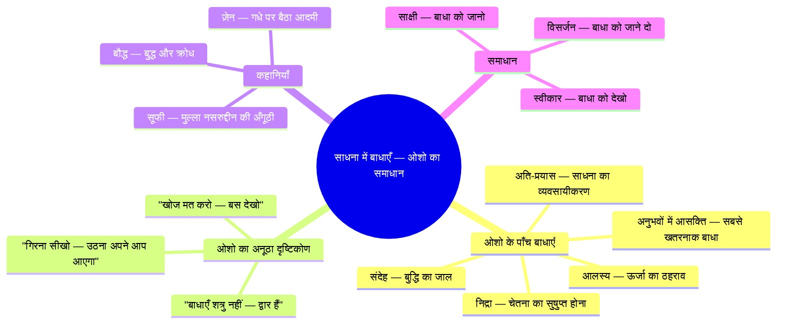
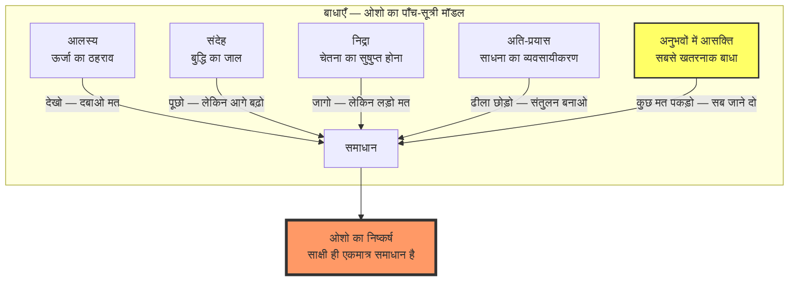
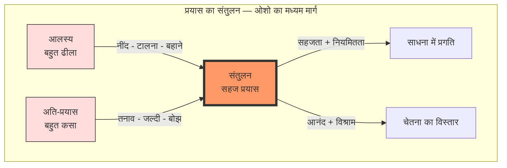
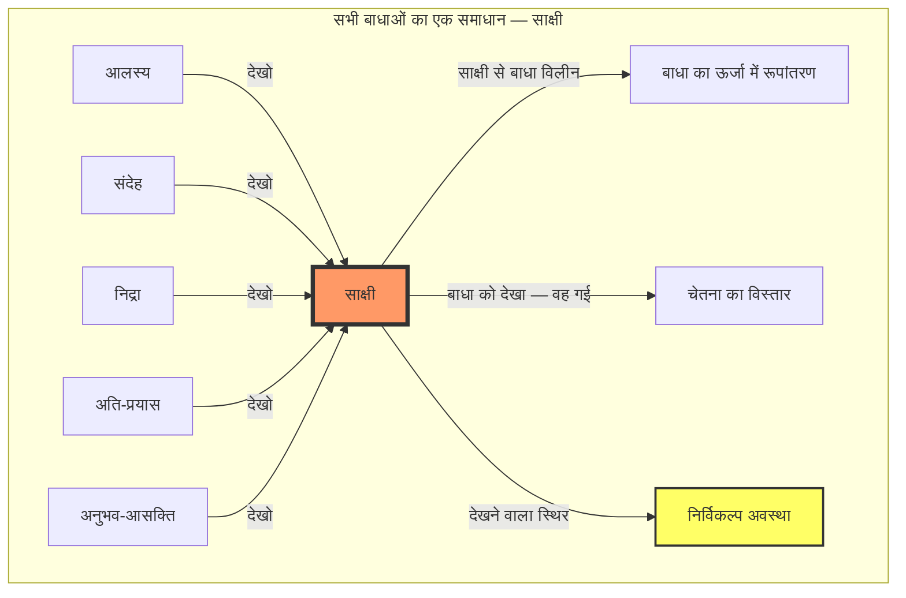

# अध्याय १२: साधना में बाधाएँ — ओशो का समाधान

> **यह अध्याय ओशो के 'बुक ऑफ सीक्रेट्स' प्रवचन श्रृंखला पर आधारित है**
> *बोले: ओशो, पूना, १९७२-७३*

---

## सीखने के उद्देश्य



इस अध्याय को पूरा करने के बाद आप:

- ओशो की पाँच विशिष्ट बाधाओं को उनके अनूठे दृष्टिकोण से समझेंगे
- जानेंगे कि क्यों ओशो कहते हैं — "अनुभवों में आसक्ति सबसे बड़ी बाधा है"
- ओशो की प्रसिद्ध कहानियों — गधे वाली, अँगूठी वाली — के माध्यम से बाधाओं का समाधान पाएँगे
- "खोज मत करो — बस देखो" के सिद्धांत को आत्मसात करेंगे
- TypeScript में बाधा निदान उपकरण बनाएँगे
- बाधाओं को शत्रु नहीं, बल्कि द्वार के रूप में देखना सीखेंगे

---

## ओशो का परिचय: "बाधाएँ शत्रु नहीं हैं — वे द्वार हैं"

> **ओशो वाणी:**
> *"बहुत से साधक पूछते हैं — 'बाधाओं से कैसे लड़ें?' मैं कहता हूँ — बाधाओं से लड़ो मत। उन्हें देखो। क्योंकि बाधाएँ शत्रु नहीं हैं — वे द्वार हैं। हर बाधा एक अवसर है — गहरे जाने का, समझने का, बदलने का। जब तुम बाधा से लड़ते हो, तो तुम उसे मजबूत करते हो। जब तुम बाधा को देखते हो, तो वह विलीन हो जाती है।"*

देखो, मेरे प्यारे साधकों, यह अध्याय बहुत महत्वपूर्ण है। क्योंकि साधना में बाधाएँ आएँगी ही। यह स्वाभाविक है। जैसे नदी में लहरें होती हैं, वैसे ही साधना में बाधाएँ होती हैं।

पतंजलि ने नौ बाधाएँ बताईं — व्याधि, स्त्यान, संशय, प्रमाद, आलस्य, अविरति, भ्रांतिदर्शन, अलब्धभूमिकत्व, अनवस्थितत्व। बहुत अच्छी सूची है।

लेकिन मैं तुमसे ओशो की सूची के बारे में बात करूँगा। ओशो ने पाँच मुख्य बाधाएँ बताईं — जो साधना में सबसे अधिक आम हैं। और उनका दृष्टिकोण — वह बिल्कुल अलग है।



---

## बाधा १: आलस्य (Laziness) — ऊर्जा का ठहराव

### "आलस्य को दबाओ मत — उसे समझो"

<a href="../../../assets/images/diagrams/vigyan-bhairav-tantra/12-sadhna-mein-badha/-handwritten.svg" target="_blank" rel="noopener">
  
</a>
<a href="../../../assets/images/diagrams/vigyan-bhairav-tantra/12-sadhna-mein-badha/-diagram.svg" target="_blank" rel="noopener">
  
</a>
<a href="../../../assets/images/diagrams/vigyan-bhairav-tantra/12-sadhna-mein-badha/-sticky.svg" target="_blank" rel="noopener">
  
</a>


> **ओशो वाणी:**
> *"आलस्य — यह सबसे आम बाधा है। हर साधक इससे गुज़रता है। तुम जानते हो कि ध्यान करना चाहिए — लेकिन शरीर कहता है 'नहीं', मन कहता है 'बाद में'। और तुम कल पर टाल देते हो। और कल कभी नहीं आता।*
>
> *लेकिन मैं कहता हूँ — आलस्य को दबाओ मत। उसे समझो। आलस्य कोई पाप नहीं है — यह ऊर्जा का ठहराव है। और ठहराव को समझा जा सकता है, उसे मजबूरन नहीं हटाया जा सकता।"*

| आलस्य के लक्षण | ओशो की व्याख्या | ओशो का समाधान |
|----------------|-----------------|----------------|
| ध्यान टालना | ऊर्जा प्रवाहित नहीं हो रही | छोटा शुरू करो — ५ मिनट भी काफी |
| बहाने बनाना | मन प्रतिरोध कर रहा है | प्रतिरोध को देखो — उससे लड़ो मत |
| आलस महसूस करना | शरीर संतुलन चाहता है | शरीर को आराम दो — फिर धीरे-धीरे शुरू करो |
| "कल से करूँगा" | अभी का भय | अभी करो — एक क्षण भी काफी है |

### ओशो की आलस्य-समाधान विधि

<a href="../../../assets/images/diagrams/vigyan-bhairav-tantra/12-sadhna-mein-badha/-handwritten.svg" target="_blank" rel="noopener">
  
</a>
<a href="../../../assets/images/diagrams/vigyan-bhairav-tantra/12-sadhna-mein-badha/-diagram.svg" target="_blank" rel="noopener">
  
</a>
<a href="../../../assets/images/diagrams/vigyan-bhairav-tantra/12-sadhna-mein-badha/-sticky.svg" target="_blank" rel="noopener">
  
</a>


**विधि — "पाँच मिनट का नियम":**

१. जब आलस्य आए, तो उससे लड़ो मत।
२. बस पाँच मिनट के लिए बैठ जाओ — सिर्फ पाँच मिनट।
३. कोई बड़ा लक्ष्य मत रखो — बस पाँच मिनट।
४. पाँच मिनट के बाद, यदि उठना चाहो तो उठ सकते हो।
५. लेकिन अक्सर, पाँच मिनट बाद तुम रुक जाओगे — क्योंकि ऊर्जा प्रवाहित होने लगी है।

> **ओशो वाणी:**
> *"सबसे बड़ा धोखा जो मन तुम्हें देता है — वह है 'बड़ा' का विचार। 'मुझे एक घंटा ध्यान करना है' — और मन कहता है 'यह बहुत है, कल करूँगा।' मैं कहता हूँ — पाँच मिनट। बस पाँच मिनट। छोटा लक्ष्य — और आलस्य गायब। आलस्य बड़े लक्ष्यों से डरता है — छोटे लक्ष्य उसे हरा देते हैं।"*

### एक कहानी — मुल्ला नसरुद्दीन और आलस्य

<a href="../../../assets/images/diagrams/vigyan-bhairav-tantra/12-sadhna-mein-badha/-handwritten.svg" target="_blank" rel="noopener">
  
</a>
<a href="../../../assets/images/diagrams/vigyan-bhairav-tantra/12-sadhna-mein-badha/-diagram.svg" target="_blank" rel="noopener">
  
</a>
<a href="../../../assets/images/diagrams/vigyan-bhairav-tantra/12-sadhna-mein-badha/-sticky.svg" target="_blank" rel="noopener">
  
</a>


मुल्ला नसरुद्दीन एक दिन अपने दोस्त से मिला। दोस्त ने कहा — "मुल्ला, तुम बहुत आलसी लगते हो।"

मुल्ला ने कहा — "हाँ, भाई। मैं बहुत आलसी हूँ।"

दोस्त ने कहा — "तो कुछ करो! उठो, काम करो!"

मुल्ला ने कहा — "सुनो, मैं आलस्य से लड़ने की कोशिश करता था। बहुत लड़ा। लेकिन एक दिन मुझे समझ आया — आलस्य मेरा दुश्मन नहीं है। वह मेरा दोस्त है। वह मुझे बताता है कि मैं थक गया हूँ। वह मुझे आराम की याद दिलाता है। अब मैं उससे लड़ता नहीं — मैं उसे सुनता हूँ। और जब मैं सुनता हूँ, तो आलस्य अपने आप चला जाता है।"

---

## बाधा २: संदेह (Doubt) — बुद्धि का जाल

### "संदेह स्वाभाविक है — लेकिन उसमें मत रुको"

<a href="../../../assets/images/diagrams/vigyan-bhairav-tantra/12-sadhna-mein-badha/-handwritten.svg" target="_blank" rel="noopener">
  
</a>
<a href="../../../assets/images/diagrams/vigyan-bhairav-tantra/12-sadhna-mein-badha/-diagram.svg" target="_blank" rel="noopener">
  
</a>
<a href="../../../assets/images/diagrams/vigyan-bhairav-tantra/12-sadhna-mein-badha/-sticky.svg" target="_blank" rel="noopener">
  
</a>


> **ओशो वाणी:**
> *"संदेह — यह बुद्धि का स्वभाव है। बुद्धि संदेह करती है — यह उसका काम है। 'क्या यह सही है? क्या मैं सही मार्ग पर हूँ? क्या यह हो रहा है या मैं कल्पना कर रहा हूँ?' — ये सब बुद्धि के सवाल हैं। और ये स्वाभाविक हैं।
>
> *लेकिन समस्या तब होती है जब तुम संदेह में रुक जाते हो। तुम सोचते रहते हो, विश्लेषण करते रहते हो — और ध्यान भूल जाते हो। संदेह तुम्हें एक जगह रोक देता है — और तुम चलते नहीं।"*

| संदेह के प्रकार | ओशो की व्याख्या | समाधान |
|----------------|-----------------|--------|
| स्वयं पर संदेह — "क्या मैं कर सकता हूँ?" | तुम कर सकते हो — क्योंकि तुम पहले से ही वहाँ हो | छोटी सफलताएँ इकट्ठा करो |
| मार्ग पर संदेह — "क्या यह सही है?" | कोई मार्ग सही या गलत नहीं — बस चलो | एक मार्ग चुनो और चलो |
| अनुभव पर संदेह — "क्या यह सच है?" | अनुभव पर भरोसा करो — विश्लेषण मत करो | अनुभव को होने दो — बाद में सोचो |
| गुरु पर संदेह — "क्या यह व्यक्ति सही है?" | गुरु को परखो — लेकिन एक बार परख लेने के बाद भरोसा करो | परखो, फिर समर्पण करो |

### ओशो की संदेह-समाधान विधि

<a href="../../../assets/images/diagrams/vigyan-bhairav-tantra/12-sadhna-mein-badha/-handwritten.svg" target="_blank" rel="noopener">
  
</a>
<a href="../../../assets/images/diagrams/vigyan-bhairav-tantra/12-sadhna-mein-badha/-diagram.svg" target="_blank" rel="noopener">
  
</a>
<a href="../../../assets/images/diagrams/vigyan-bhairav-tantra/12-sadhna-mein-badha/-sticky.svg" target="_blank" rel="noopener">
  
</a>


**विधि — "संदेह को देखो, उत्तर मत दो":**

१. जब संदेह आए, तो उसका उत्तर देने की कोशिश मत करो।
२. संदेह को एक बादल की तरह देखो — वह आता है, जाता है।
३. संदेह के पीछे मत भागो — उसे देखो।
४. देखो कि संदेह कहाँ से आता है — बुद्धि से, अनुभव से, या डर से?
५. जब तुम देखते हो, तो संदेह अपनी शक्ति खो देता है।

> **ओशो वाणी:**
> *"संदेह को जवाब मत दो — संदेह को देखो। जवाब देने से संदेह मजबूत होता है — क्योंकि तुम उसे स्वीकार कर रहे हो। देखने से संदेह कमजोर होता है — क्योंकि तुम उसे पार कर रहे हो। याद रखो — संदेह का कोई जवाब नहीं है। केवल अनुभव है। और अनुभव ही एकमात्र सत्य है।"*

### एक सूफी कहानी

<a href="../../../assets/images/diagrams/vigyan-bhairav-tantra/12-sadhna-mein-badha/-handwritten.svg" target="_blank" rel="noopener">
  
</a>
<a href="../../../assets/images/diagrams/vigyan-bhairav-tantra/12-sadhna-mein-badha/-diagram.svg" target="_blank" rel="noopener">
  
</a>
<a href="../../../assets/images/diagrams/vigyan-bhairav-tantra/12-sadhna-mein-badha/-sticky.svg" target="_blank" rel="noopener">
  
</a>


एक सूफी फकीर से किसी ने पूछा — "गुरुजी, मुझे बहुत संदेह होता है। क्या करूँ?"

फकीर ने कहा — "अपने संदेह पर संदेह करो।"

पूछने वाले ने कहा — "मतलब?"

फकीर ने कहा — "जब संदेह आए, तो पूछो — यह संदेह किसमें आ रहा है? कौन है जो संदेह कर रहा है? यदि तुम संदेह को देख सकते हो, तो तुम संदेह नहीं हो — तुम देखने वाले हो। और देखने वाला संदेह से परे है।"

---

## बाधा ३: निद्रा (Sleep) — चेतना का सुषुप्त होना

### "निद्रा को दुश्मन मत बनाओ — उसे दोस्त बनाओ"

<a href="../../../assets/images/diagrams/vigyan-bhairav-tantra/12-sadhna-mein-badha/-handwritten.svg" target="_blank" rel="noopener">
  
</a>
<a href="../../../assets/images/diagrams/vigyan-bhairav-tantra/12-sadhna-mein-badha/-diagram.svg" target="_blank" rel="noopener">
  
</a>
<a href="../../../assets/images/diagrams/vigyan-bhairav-tantra/12-sadhna-mein-badha/-sticky.svg" target="_blank" rel="noopener">
  
</a>


> **ओशो वाणी:**
> *"यह बहुत अजीब है — साधना में निद्रा दुश्मन बन जाती है। तुम ध्यान करने बैठते हो — और आँखें बंद होते ही नींद आ जाती है। तुम लड़ते हो — नींद से लड़ते हो — और ध्यान भूल जाते हो।*
>
> *मैं कहता हूँ — नींद से लड़ो मत। नींद को दुश्मन मत बनाओ। नींद तुम्हारी दोस्त है — वह तुम्हें सिर्फ वही दे रही है जिसकी तुम्हें जरूरत है: आराम। और यदि तुम नींद से लड़ोगे, तो दोनों खो दोगे — न तो नींद आएगी, न ध्यान होगा।"*

| निद्रा के पहलू | ओशो की व्याख्या | समाधान |
|---------------|-----------------|--------|
| ध्यान में नींद | शरीर थका है — आराम चाहता है | पहले पर्याप्त नींद लो, फिर ध्यान करो |
| सुबह उठने में कठिनाई | निद्रा का आकर्षण | चेतन निद्रा का अभ्यास करो |
| दिन में ऊँघना | प्राण ऊर्जा कम है | प्राणायाम करो — ऊर्जा बढ़ाओ |
| सुषुप्ति में चेतना खोना | सीखना है — निद्रा में भी जागना | चेतन निद्रा तकनीक |

### ओशो की निद्रा-समाधान विधि — "चेतन निद्रा"

<a href="../../../assets/images/diagrams/vigyan-bhairav-tantra/12-sadhna-mein-badha/-handwritten.svg" target="_blank" rel="noopener">
  
</a>
<a href="../../../assets/images/diagrams/vigyan-bhairav-tantra/12-sadhna-mein-badha/-diagram.svg" target="_blank" rel="noopener">
  
</a>
<a href="../../../assets/images/diagrams/vigyan-bhairav-tantra/12-sadhna-mein-badha/-sticky.svg" target="_blank" rel="noopener">
  
</a>


**विधि:**

१. ध्यान करने बैठो। यदि नींद आए, तो उसका स्वागत करो।
२. नींद को आने दो — लेकिन चेतना को मत खोओ।
३. देखो कि नींद कैसे आती है — पहले आँखें भारी होती हैं, फिर शरीर ढीला होता है, फिर विचार धुंधले होते हैं।
४. इस पूरी प्रक्रिया को देखो — बस देखो।
५. नींद आए — तो आने दो। लेकिन देखना मत छोड़ो।
६. यही चेतन निद्रा है — शरीर सोता है, चेतना जागती है।

> **ओशो वाणी:**
> *"नींद को मत भगाओ — उसे बुलाओ। और जब वह आए, तो उसे देखो। यही तंत्र का रहस्य है — हर चीज़ को देखो। नींद को भी। और जब तुम नींद को देखोगे, तो दो चीज़ें हो सकती हैं — या तो नींद चली जाएगी (क्योंकि चेतना और नींद एक साथ नहीं रह सकते), या तुम चेतन निद्रा में प्रवेश करोगे (जो तुरीय का द्वार है)। दोनों ही अच्छा है।"*

### एक ज़ेन कहानी

<a href="../../../assets/images/diagrams/vigyan-bhairav-tantra/12-sadhna-mein-badha/-handwritten.svg" target="_blank" rel="noopener">
  
</a>
<a href="../../../assets/images/diagrams/vigyan-bhairav-tantra/12-sadhna-mein-badha/-diagram.svg" target="_blank" rel="noopener">
  
</a>
<a href="../../../assets/images/diagrams/vigyan-bhairav-tantra/12-sadhna-mein-badha/-sticky.svg" target="_blank" rel="noopener">
  
</a>


एक ज़ेन भिक्षु को बहुत नींद आती थी। वह ध्यान में सो जाता। उसने अपनी पलकें काट लीं ताकि न सोए।

उसके गुरु ने यह देखा और कहा — "मूर्ख! तुमने पलकें काटकर क्या हासिल किया? अब तुम बिना पलकों के भी सोते हो — और दर्द भी झेलते हो। नींद कोई बीमारी नहीं है — वह शरीर की जरूरत है। उससे लड़ो मत — उसे समझो। और एक दिन, तुम नींद में भी जाग सकते हो।"

---

## बाधा ४: अति-प्रयास (Over-effort) — साधना का व्यवसायीकरण

### "साधना को व्यवसाय मत बनाओ"

<a href="../../../assets/images/diagrams/vigyan-bhairav-tantra/12-sadhna-mein-badha/-handwritten.svg" target="_blank" rel="noopener">
  
</a>
<a href="../../../assets/images/diagrams/vigyan-bhairav-tantra/12-sadhna-mein-badha/-diagram.svg" target="_blank" rel="noopener">
  
</a>
<a href="../../../assets/images/diagrams/vigyan-bhairav-tantra/12-sadhna-mein-badha/-sticky.svg" target="_blank" rel="noopener">
  
</a>


> **ओशो वाणी:**
> *"यह सबसे विडंबनापूर्ण बाधा है — साधना को ही साधना में बाधा बना लेना। तुम इतनी मेहनत करते हो, इतना प्रयास करते हो, इतने अनुशासित हो जाते हो — कि सहजता खो देते हो। साधना एक बोझ बन जाती है — आनंद नहीं रहता।*
>
> *याद रखो — साधना कोई काम नहीं है, कोई व्यवसाय नहीं है। यह तो उत्सव है, खेल है, आनंद है। जब साधना बोझ बन जाए — तो समझ लो कि तुम अति-प्रयास कर रहे हो।"*

| अति-प्रयास के लक्षण | ओशो की व्याख्या | समाधान |
|---------------------|-----------------|--------|
| घंटों ध्यान करना — लेकिन बिना आनंद के | गुणवत्ता > मात्रा | कम करो — लेकिन पूर्णता से करो |
| सख्त अनुशासन | अनुशासन गुलामी बन गया | एक दिन छुट्टी लो — साधना से भी |
| परिणामों की चिंता | फल की चिंता — साधना में बाधा | फल मत सोचो — प्रक्रिया में जियो |
| 'सिद्धि' पाने की जल्दी | धैर्यहीनता | कोई लक्ष्य मत रखो — बस करो |
| दूसरों से तुलना | अपना मार्ग भूलना | अपनी गति से चलो |

### ओशो की अति-प्रयास समाधान विधि — "साधना से छुट्टी"

<a href="../../../assets/images/diagrams/vigyan-bhairav-tantra/12-sadhna-mein-badha/-handwritten.svg" target="_blank" rel="noopener">
  
</a>
<a href="../../../assets/images/diagrams/vigyan-bhairav-tantra/12-sadhna-mein-badha/-diagram.svg" target="_blank" rel="noopener">
  
</a>
<a href="../../../assets/images/diagrams/vigyan-bhairav-tantra/12-sadhna-mein-badha/-sticky.svg" target="_blank" rel="noopener">
  
</a>


**विधि:**

१. सप्ताह में एक दिन — 'साधना से छुट्टी' का दिन रखो।
२. उस दिन कोई ध्यान मत करो, कोई मंत्र मत जपो, कोई प्रार्थना मत करो।
३. बस जियो — जैसे कोई साधक नहीं है, एक सामान्य आदमी है।
४. यह आराम तुम्हारी साधना को ताज़गी देगा।
५. और अगले दिन — तुम नए सिरे से शुरू करोगे।

> **ओशो वाणी:**
> *"मैं तुमसे कहता हूँ — साधना को बहुत गंभीर मत लो। हाँ, यह गहरी है — लेकिन गंभीर नहीं। गहराई में आनंद होता है — गंभीरता में बोझ। साधना को एक खेल बनाओ, एक नृत्य बनाओ, एक गीत बनाओ। और याद रखो — जब तुम बहुत ज्यादा प्रयास करते हो, तो तुम चूक जाते हो। साधना में प्रयास से ज्यादा सहजता काम आती है।"*

### एक कहानी — महात्मा बुद्ध और तानपूरा

<a href="../../../assets/images/diagrams/vigyan-bhairav-tantra/12-sadhna-mein-badha/-handwritten.svg" target="_blank" rel="noopener">
  
</a>
<a href="../../../assets/images/diagrams/vigyan-bhairav-tantra/12-sadhna-mein-badha/-diagram.svg" target="_blank" rel="noopener">
  
</a>
<a href="../../../assets/images/diagrams/vigyan-bhairav-tantra/12-sadhna-mein-badha/-sticky.svg" target="_blank" rel="noopener">
  
</a>


बुद्ध के एक शिष्य ने बहुत मेहनत की। रात-दिन ध्यान किया, खाना कम किया, नींद कम की। लेकिन कुछ नहीं हो रहा था।

वह बुद्ध के पास गया और बोला — "भगवान, मैं बहुत प्रयास कर रहा हूँ — लेकिन कुछ नहीं हो रहा।"

बुद्ध ने पूछा — "तुम तानपूरा बजाना जानते हो?"

शिष्य ने कहा — "हाँ।"

बुद्ध ने कहा — "यदि तार बहुत कस दिए जाएँ — तो संगीत बजेगा?"

शिष्य ने कहा — "नहीं — तार टूट जाएगा।"

बुद्ध ने कहा — "और यदि बहुत ढीले छोड़ दिए जाएँ?"

शिष्य ने कहा — "तो कोई संगीत नहीं बजेगा — तार बेकार हैं।"

बुद्ध ने कहा — "ठीक वैसे ही साधना है — न बहुत कसो, न बहुत ढीला छोड़ो। बीच का रास्ता। संतुलन। मध्यम मार्ग।"

> **ओशो वाणी:**
> *"बुद्ध सही कहते थे — मध्यम मार्ग। न अति-प्रयास, न आलस्य। बीच का रास्ता। यही संतुलन है। यही साधना की कला है।"*



---

## बाधा ५: अनुभवों में आसक्ति (Attachment to Experiences) — सबसे खतरनाक बाधा

### "अनुभवों को मत पकड़ो — उन्हें जाने दो"

<a href="../../../assets/images/diagrams/vigyan-bhairav-tantra/12-sadhna-mein-badha/-handwritten.svg" target="_blank" rel="noopener">
  
</a>
<a href="../../../assets/images/diagrams/vigyan-bhairav-tantra/12-sadhna-mein-badha/-diagram.svg" target="_blank" rel="noopener">
  
</a>
<a href="../../../assets/images/diagrams/vigyan-bhairav-tantra/12-sadhna-mein-badha/-sticky.svg" target="_blank" rel="noopener">
  
</a>


> **ओशो वाणी:**
> *"यह सबसे खतरनाक बाधा है — और सबसे सूक्ष्म भी। तुम ध्यान करते हो, और एक दिन तुम्हें एक सुंदर अनुभव होता है — रोशनी, आनंद, शांति। और तुम उसे पकड़ लेते हो। तुम सोचते हो — 'यही तो है! मैंने पा लिया!'*
>
> *लेकिन — जो पकड़ा जा सकता है, वह सत्य नहीं है। सत्य तो वह है जो हमेशा है — जिसे पकड़ने की जरूरत नहीं। अनुभव आते हैं और जाते हैं — उन्हें आने दो, जाने दो। उनमें मत उलझो। याद रखो — जो देख रहा है वही सत्य है, देखा हुआ अनुभव नहीं।"*

| अनुभव | ओशो की व्याख्या | खतरा | समाधान |
|--------|-----------------|------|--------|
| रोशनी (प्रकाश) | चेतना का एक रूप | इसकी आसक्ति — रोशनी में ही रुक जाना | रोशनी को देखो — उसके पार जाओ |
| आनंद (ब्लिस) | चेतना का स्वभाव | आनंद को पकड़ना — दुख का कारण | आनंद को आने-जाने दो |
| शांति | मन का शांत होना | शांति में सुस्ती | शांति में भी जागे रहो |
| शक्ति (सिद्धि) | ऊर्जा का जागरण | अहंकार — 'मैंने पा लिया' | शक्ति को सेवा में लगाओ |
| शून्य (वॉइड) | अहंकार का विघटन | शून्य से डरना | शून्य में स्थिर रहो |

### ओशो की अनुभव-समाधान विधि — "अनुभव को देखो, अनुभव मत करो"

<a href="../../../assets/images/diagrams/vigyan-bhairav-tantra/12-sadhna-mein-badha/-handwritten.svg" target="_blank" rel="noopener">
  
</a>
<a href="../../../assets/images/diagrams/vigyan-bhairav-tantra/12-sadhna-mein-badha/-diagram.svg" target="_blank" rel="noopener">
  
</a>
<a href="../../../assets/images/diagrams/vigyan-bhairav-tantra/12-sadhna-mein-badha/-sticky.svg" target="_blank" rel="noopener">
  
</a>


**विधि:**

१. जब कोई सुंदर अनुभव हो — रोशनी, आनंद, शांति — तो उसमें मत खो जाओ।
२. उसे देखो — जैसे कोई और देख रहा हो।
३. पूछो — "यह अनुभव किसमें हो रहा है?" "इसे कौन देख रहा है?"
४. अनुभव को जाने दो — वह आया है, वह जाएगा।
५. जो देख रहा है — वही तुम हो। वही सत्य है।

> **ओशो वाणी:**
> *"यह बहुत अजीब है — तुम साधना करते हो, और जब सच में कुछ होता है, तो तुम उसी में खो जाते हो। रोशनी आती है — तुम रोशनी बन जाते हो। आनंद आता है — तुम आनंद बन जाते हो। और तुम भूल जाते हो कि तुम वह हो जो रोशनी और आनंद को देख रहा है।*
>
> *याद रखो — अनुभव तुम नहीं हो। अनुभव तुम्हारे ऊपर से गुज़रने वाले बादल हैं। तुम आकाश हो। बादलों में मत उलझो — चाहे वे सुनहरे ही क्यों न हों। आकाश में स्थिर रहो।"*

### एक ज़ेन कहानी — दसवाँ बैल

<a href="../../../assets/images/diagrams/vigyan-bhairav-tantra/12-sadhna-mein-badha/-handwritten.svg" target="_blank" rel="noopener">
  
</a>
<a href="../../../assets/images/diagrams/vigyan-bhairav-tantra/12-sadhna-mein-badha/-diagram.svg" target="_blank" rel="noopener">
  
</a>
<a href="../../../assets/images/diagrams/vigyan-bhairav-tantra/12-sadhna-mein-badha/-sticky.svg" target="_blank" rel="noopener">
  
</a>


ज़ेन परंपरा में एक प्रसिद्ध चित्र-श्रृंखला है — "दस बैल" (Ten Ox Herding Pictures)। यह साधना के दस चरणों को दिखाती है।

९वें चरण में — साधक बैल (चेतना) को पकड़ लेता है।
१०वें चरण में — वह बैल को छोड़ देता है और बाजार में चला जाता है।

> **ओशो वाणी:**
> *"यही सबसे बड़ी सीख है — चेतना को पाने के बाद भी, उसे छोड़ देना। अनुभव में मत उलझो। सिद्धि में मत उलझो। यहाँ तक कि मोक्ष में भी मत उलझो। जब सब कुछ छूट जाता है — तब जो बचता है, वही सत्य है।"*

---

## ओशो का समग्र समाधान — "खोज मत करो, बस देखो"

### पाँचों बाधाओं का एक ही समाधान

<a href="../../../assets/images/diagrams/vigyan-bhairav-tantra/12-sadhna-mein-badha/-handwritten.svg" target="_blank" rel="noopener">
  
</a>
<a href="../../../assets/images/diagrams/vigyan-bhairav-tantra/12-sadhna-mein-badha/-diagram.svg" target="_blank" rel="noopener">
  
</a>
<a href="../../../assets/images/diagrams/vigyan-bhairav-tantra/12-sadhna-mein-badha/-sticky.svg" target="_blank" rel="noopener">
  
</a>


> **ओशो वाणी:**
> *"बाधाएँ अलग-अलग लगती हैं — आलस्य, संदेह, निद्रा, अति-प्रयास, अनुभवों की आसक्ति। लेकिन सभी बाधाओं का एक ही समाधान है — साक्षी। देखो। बस देखो।*
>
> *आलस्य को देखो — वह चला जाएगा।
> *संदेह को देखो — वह चला जाएगा।
> *निद्रा को देखो — वह चेतन निद्रा बन जाएगी।
> *अति-प्रयास को देखो — वह संतुलित हो जाएगा।
> *अनुभवों को देखो — वे तुम्हें बाँध नहीं पाएँगे।*
>
> *देखना ही ध्यान है। देखना ही समाधान है। देखना ही सब कुछ है।"*



### ओशो की "देखो" कहानी — एक आदमी और उसका गधा

<a href="../../../assets/images/diagrams/vigyan-bhairav-tantra/12-sadhna-mein-badha/-handwritten.svg" target="_blank" rel="noopener">
  
</a>
<a href="../../../assets/images/diagrams/vigyan-bhairav-tantra/12-sadhna-mein-badha/-diagram.svg" target="_blank" rel="noopener">
  
</a>
<a href="../../../assets/images/diagrams/vigyan-bhairav-tantra/12-sadhna-mein-badha/-sticky.svg" target="_blank" rel="noopener">
  
</a>


एक आदमी अपने गधे पर बैठा था। वह बहुत परेशान था — इधर-उधर देख रहा था, कुछ ढूँढ़ रहा था।

एक राहगीर ने पूछा — "भाई, क्या ढूँढ़ रहे हो?"

आदमी ने कहा — "मेरा गधा खो गया है। मैं उसे ढूँढ़ रहा हूँ।"

राहगीर ने कहा — "लेकिन तुम तो गधे पर बैठे हो!"

आदमी ने नीचे देखा — और चौंक गया। वह सच में अपने गधे पर बैठा था!

> **ओशो वाणी:**
> *"यही बाधाओं की स्थिति है — तुम जिसे ढूँढ़ रहे हो, वह तुम्हारे पास है। तुम चेतना में हो — बस देखने की जरूरत है। बाधाएँ केवल इसलिए हैं क्योंकि तुमने देखना बंद कर दिया है। फिर से देखना शुरू करो — और सब अपनी जगह आ जाएगा।"*

---

## TypeScript: ओशो का साधना बाधा निदान उपकरण

```typescript
/**
 * ओशो का साधना बाधा निदान उपकरण (Sadhana Obstacle Diagnostic Tool)
 * 
 * ओशो के अनुसार पाँच मुख्य बाधाएँ — आलस्य, संदेह, निद्रा,
 * अति-प्रयास, अनुभव-आसक्ति। सभी का एक ही समाधान — साक्षी।
 * 
 * कोर टीचिंग: "बाधाओं से लड़ो मत — उन्हें देखो।"
 * — ओशो
 */

// ===== मूल प्रकार (Core Types) =====

/** ओशो के अनुसार पाँच बाधाएँ */
export enum OshoObstacle {
    LAZINESS = 'आलस्य',
    DOUBT = 'संदेह',
    SLEEP = 'निद्रा',
    OVER_EFFORT = 'अति-प्रयास',
    ATTACHMENT_TO_EXPERIENCES = 'अनुभवों में आसक्ति',
}

/** बाधा की गंभीरता */
export enum ObstacleSeverity {
    MILD = 'हल्का — कभी-कभी आता है',
    MODERATE = 'मध्यम — अक्सर आता है',
    SEVERE = 'गंभीर — लगातार बना रहता है',
    CRITICAL = 'अत्यंत — साधना को रोक रहा है',
}

/** बाधा का निदान */
export interface ObstacleDiagnosis {
    obstacle: OshoObstacle;
    severity: ObstacleSeverity;
    /** ओशो के अनुसार कारण */
    oshoRootCause: string;
    /** ओशो के अनुसार लक्षण */
    symptoms: string[];
    /** ओशो की विधि */
    oshoMethod: string;
    /** ओशो की कहानी */
    oshoStory: string;
    /** ओशो का कोट */
    oshoQuote: string;
}

/** साधक का बाधा प्रोफ़ाइल */
export interface SadhanaBlockageProfile {
    date: Date;
    blockages: Map<OshoObstacle, {
        severity: ObstacleSeverity;
        frequency: number;  // दिन में कितनी बार
        intensity: number;  // 1-10
        triggers: string[];
        witnessApplied: boolean;
        resolved: boolean;
    }>;
    overallSeverity: ObstacleSeverity;
    dominantObstacle: OshoObstacle;
    oshoAdvice: string;
}

/** ओशो का समाधान प्रस्ताव */
export interface OshoRemedy {
    obstacle: OshoObstacle;
    practiceName: string;
    duration_minutes: number;
    steps: string[];
    oshoWarning: string;
    expectedResult: string;
}

// ===== मुख्य निदान प्रणाली =====

export class SadhanaObstacleTool {
    /** बाधा का निदान करें */
    diagnose(obstacle: OshoObstacle, severity: ObstacleSeverity): ObstacleDiagnosis {
        const diagnoses: Record<OshoObstacle, ObstacleDiagnosis> = {
            [OshoObstacle.LAZINESS]: {
                obstacle: OshoObstacle.LAZINESS,
                severity,
                oshoRootCause: 'ऊर्जा का ठहराव — शरीर और मन में प्राण का प्रवाह अवरुद्ध है',
                symptoms: [
                    'ध्यान टालना — "बाद में करूँगा"',
                    'बहाने बनाना — "समय नहीं है", "थका हूँ"',
                    'शुरू करने में कठिनाई',
                    'नियमितता नहीं बन पाती',
                ],
                oshoMethod: 'पाँच मिनट का नियम — छोटे लक्ष्य रखो। पाँच मिनट बैठो — फिर देखो। आलस्य छोटे लक्ष्यों से डरता है।',
                oshoStory: 'मुल्ला नसरुद्दीन ने आलस्य से लड़ना छोड़ दिया — तब वह उसका दोस्त बन गया।',
                oshoQuote: '"आलस्य को दबाओ मत — उसे समझो। वह तुम्हें कुछ बता रहा है।"',
            },
            [OshoObstacle.DOUBT]: {
                obstacle: OshoObstacle.DOUBT,
                severity,
                oshoRootCause: 'बुद्धि का स्वभाव — वह विश्लेषण करती है, संदेह करती है। संदेह में रुक जाना ही समस्या है।',
                symptoms: [
                    '"क्या यह सही है?" — बार-बार यह सवाल',
                    'अनुभव पर भरोसा न करना',
                    'गुरु या मार्ग पर संदेह',
                    'एक तकनीक से दूसरी पर कूदना',
                ],
                oshoMethod: 'संदेह को देखो — उत्तर मत दो। संदेह को बादल की तरह आने-जाने दो। देखो कि संदेह किसमें आ रहा है।',
                oshoStory: 'सूफी फकीर ने कहा — "अपने संदेह पर संदेह करो।"',
                oshoQuote: '"संदेह का कोई जवाब नहीं है। केवल अनुभव है।"',
            },
            [OshoObstacle.SLEEP]: {
                obstacle: OshoObstacle.SLEEP,
                severity,
                oshoRootCause: 'शरीर थका है या प्राण ऊर्जा कम है। नींद से लड़ना ही मुख्य समस्या है।',
                symptoms: [
                    'ध्यान में बैठते ही नींद आना',
                    'सुबह उठने में कठिनाई',
                    'दिन में ऊँघना',
                    'सुषुप्ति में चेतना खोना',
                ],
                oshoMethod: 'चेतन निद्रा — नींद का स्वागत करो, लेकिन चेतना मत खोओ। नींद को आते हुए देखो।',
                oshoStory: 'ज़ेन भिक्षु ने पलकें काट लीं — गुरु ने कहा, "मूर्ख! नींद से लड़ो मत, उसे समझो।"',
                oshoQuote: '"नींद को मत भगाओ — उसे बुलाओ। और जब वह आए, तो उसे देखो।"',
            },
            [OshoObstacle.OVER_EFFORT]: {
                obstacle: OshoObstacle.OVER_EFFORT,
                severity,
                oshoRootCause: 'साधना को व्यवसाय बना लेना — आनंद खो देना। तानपूरा के तार बहुत कस देना।',
                symptoms: [
                    'लंबे समय तक ध्यान — लेकिन बिना आनंद के',
                    'परिणामों की चिंता',
                    'दूसरों से तुलना',
                    'साधना बोझ बन गई है',
                ],
                oshoMethod: 'मध्यम मार्ग — सप्ताह में एक दिन साधना से छुट्टी। गुणवत्ता पर ध्यान दो, मात्रा पर नहीं।',
                oshoStory: 'बुद्ध और तानपूरा — न बहुत कसो, न बहुत ढीला। मध्यम मार्ग।',
                oshoQuote: '"साधना को बहुत गंभीर मत लो। गहरी हो — लेकिन गंभीर नहीं।"',
            },
            [OshoObstacle.ATTACHMENT_TO_EXPERIENCES]: {
                obstacle: OshoObstacle.ATTACHMENT_TO_EXPERIENCES,
                severity,
                oshoRootCause: 'सूक्ष्म अहंकार — अनुभव को पकड़ना, उसे दोहराना चाहना। सबसे खतरनाक बाधा।',
                symptoms: [
                    'रोशनी, आनंद, शांति के अनुभवों को पकड़ना',
                    'पुराने अनुभवों की याद करना',
                    '"वह अनुभव फिर से कैसे पाऊँ?" — यह सवाल',
                    'अनुभव के बिना ध्यान अधूरा लगना',
                ],
                oshoMethod: 'अनुभव को देखो — उसमें मत खोओ। देखो कि यह अनुभव किसमें हो रहा है। जो देख रहा है — वही सत्य है।',
                oshoStory: 'ज़ेन — दसवाँ बैल। बैल को पकड़ने के बाद भी, उसे छोड़ देना।',
                oshoQuote: '"अनुभव तुम नहीं हो — वे बादल हैं। तुम आकाश हो। बादलों में मत उलझो।"',
            },
        };

        return diagnoses[obstacle];
    }

    /** साधक का पूर्ण निदान */
    analyzeSadhaka(profile: SadhanaBlockageProfile): {
        primaryBlockage: { obstacle: OshoObstacle; diagnosis: ObstacleDiagnosis };
        secondaryBlockages: Array<{ obstacle: OshoObstacle; diagnosis: ObstacleDiagnosis }>;
        oshoRemedy: OshoRemedy;
        weeklyPlan: string[];
    } {
        const blockages: Array<{ obstacle: OshoObstacle; severity: ObstacleSeverity; intensity: number }> = [];

        profile.blockages.forEach((data, obstacle) => {
            blockages.push({ obstacle, severity: data.severity, intensity: data.intensity });
        });

        blockages.sort((a, b) => b.intensity - a.intensity);

        const primary = blockages[0];
        const secondary = blockages.slice(1, 3);

        const primaryDiagnosis = this.diagnose(primary.obstacle, primary.severity);
        const secondaryDiagnoses = secondary.map(s => ({
            obstacle: s.obstacle,
            diagnosis: this.diagnose(s.obstacle, s.severity),
        }));

        const remedy = this.getRemedy(primary.obstacle);
        const weeklyPlan = this.generateWeeklyPlan(primary.obstacle, secondary.map(s => s.obstacle));

        return {
            primaryBlockage: { obstacle: primary.obstacle, diagnosis: primaryDiagnosis },
            secondaryBlockages: secondaryDiagnoses,
            oshoRemedy: remedy,
            weeklyPlan,
        };
    }

    /** ओशो का उपाय */
    private getRemedy(obstacle: OshoObstacle): OshoRemedy {
        const remedies: Record<OshoObstacle, OshoRemedy> = {
            [OshoObstacle.LAZINESS]: {
                obstacle,
                practiceName: 'पाँच मिनट का नियम',
                duration_minutes: 5,
                steps: [
                    'बिना किसी बहाने के तुरंत बैठ जाएँ — सिर्फ ५ मिनट के लिए',
                    'श्वास को देखें — ५ मिनट तक',
                    'यदि उठना चाहें तो ५ मिनट बाद उठ सकते हैं',
                    'लेकिन ध्यान दें — ५ मिनट बाद अक्सर रुकने का मन करता है',
                ],
                oshoWarning: 'छोटे लक्ष्य से शुरू करें — बड़े लक्ष्य आलस्य को बुलावा देते हैं',
                expectedResult: 'आलस्य कम होगा, नियमितता बनेगी',
            },
            [OshoObstacle.DOUBT]: {
                obstacle,
                practiceName: 'संदेह-साक्षी',
                duration_minutes: 10,
                steps: [
                    'जब संदेह आए, तो उसे देखें — बिना जवाब दिए',
                    'संदेह को एक बादल की तरह आने-जाने दें',
                    'पूछें — "यह संदेह किसमें आ रहा है?"',
                    'देखें कि संदेह के पीछे क्या है — डर? अनजाना?',
                ],
                oshoWarning: 'संदेह को जवाब देने की कोशिश न करें — वह और मजबूत होगा',
                expectedResult: 'संदेह की शक्ति कम होगी, अनुभव पर भरोसा बढ़ेगा',
            },
            [OshoObstacle.SLEEP]: {
                obstacle,
                practiceName: 'चेतन निद्रा',
                duration_minutes: 15,
                steps: [
                    'आराम से बैठें या लेटें',
                    'शरीर को पूरी तरह ढीला छोड़ दें',
                    'नींद का स्वागत करें — उससे लड़ें नहीं',
                    'नींद को आते हुए देखें — पूरी प्रक्रिया को देखें',
                    'एक बात याद रखें — चेतना की एक लौ जलाए रखें',
                ],
                oshoWarning: 'नींद से न लड़ें — उसे आने दें। लेकिन देखना न छोड़ें।',
                expectedResult: 'चेतन निद्रा — शरीर सोता है, चेतना जागती है',
            },
            [OshoObstacle.OVER_EFFORT]: {
                obstacle,
                practiceName: 'साधना-विश्राम दिवस',
                duration_minutes: 1440, // पूरा दिन
                steps: [
                    'सप्ताह में एक दिन चुनें — साधना से छुट्टी का दिन',
                    'उस दिन कोई ध्यान, मंत्र, प्रार्थना न करें',
                    'बस जियें — जैसे कोई साधक नहीं है',
                    'प्रकृति में समय बिताएँ, संगीत सुनें, अच्छा खाना खाएँ',
                    'अगले दिन नए सिरे से शुरू करें',
                ],
                oshoWarning: 'यह आलस्य नहीं है — यह संतुलन है। अंतर समझें।',
                expectedResult: 'साधना में ताज़गी, आनंद की वापसी',
            },
            [OshoObstacle.ATTACHMENT_TO_EXPERIENCES]: {
                obstacle,
                practiceName: 'अनुभव-साक्षी',
                duration_minutes: 10,
                steps: [
                    'जब कोई सुंदर अनुभव हो (रोशनी, आनंद, शांति), तो उसमें न खोएँ',
                    'उसे देखें — जैसे कोई और देख रहा हो',
                    'पूछें — "यह अनुभव किसमें हो रहा है?"',
                    'अनुभव को आने-जाने दें — उसे पकड़ें नहीं',
                    'जो देख रहा है — वही आप हैं। उसमें स्थिर रहें।',
                ],
                oshoWarning: 'अनुभवों को पकड़ना सबसे सूक्ष्म बंधन है। सावधान रहें।',
                expectedResult: 'अनुभवों से मुक्ति — शुद्ध चेतना में स्थिति',
            },
        };

        return remedies[obstacle];
    }

    /** साप्ताहिक योजना */
    private generateWeeklyPlan(primary: OshoObstacle, secondary: OshoObstacle[]): string[] {
        const plan: string[] = [];

        plan.push('📅 ओशो का साप्ताहिक साधना कार्यक्रम');
        plan.push('');

        // प्राथमिक बाधा के लिए
        const remedy = this.getRemedy(primary);
        plan.push(`🎯 मुख्य लक्ष्य: ${primary} का समाधान`);
        plan.push(`📌 विधि: ${remedy.practiceName} (${remedy.duration_minutes} मिनट)`);
        plan.push('');

        plan.push('🗓️ साप्ताहिक कार्यक्रम:');
        const days = ['सोमवार', 'मंगलवार', 'बुधवार', 'गुरुवार', 'शुक्रवार', 'शनिवार', 'रविवार'];

        for (let i = 0; i < 7; i++) {
            const day = days[i];
            const isRestDay = i === 6; // रविवार को आराम
            const isSecondaryDay = i < secondary.length;

            if (isRestDay && primary === OshoObstacle.OVER_EFFORT) {
                plan.push(`  ${day}: साधना-विश्राम दिवस — कोई ध्यान नहीं, बस जियो`);
            } else if (isRestDay) {
                plan.push(`  ${day}: मुख्य विधि — ${remedy.practiceName}`);
            } else if (isSecondaryDay) {
                const secRemedy = this.getRemedy(secondary[i]);
                plan.push(`  ${day}: ${secRemedy.practiceName} — ${secRemedy.duration_minutes} मिनट`);
            } else {
                plan.push(`  ${day}: ${remedy.practiceName} — ${remedy.duration_minutes} मिनट`);
            }
        }

        plan.push('');
        plan.push('💡 ओशो की सलाह:');
        plan.push('  "नियमितता से ज्यादा महत्वपूर्ण है — सहजता।');
        plan.push('   यदि एक दिन छूट जाए, तो चिंता मत करो।');
        plan.push('   कल नए सिरे से शुरू करो।"');

        return plan;
    }

    /** ओशो की पाँच बाधाओं का सारांश */
    getOshoSummary(): Array<{
        obstacle: OshoObstacle;
        oneLine: string;
        remedy: string;
        storyTitle: string;
    }> {
        return [
            {
                obstacle: OshoObstacle.LAZINESS,
                oneLine: '"आलस्य को दबाओ मत — उसे समझो।"',
                remedy: 'पाँच मिनट का नियम — छोटे लक्ष्य रखो',
                storyTitle: 'मुल्ला नसरुद्दीन की आलस्य-मित्रता',
            },
            {
                obstacle: OshoObstacle.DOUBT,
                oneLine: '"संदेह को जवाब मत दो — संदेह को देखो।"',
                remedy: 'संदेह-साक्षी — बादल की तरह देखो',
                storyTitle: 'सूफी फकीर का "संदेह पर संदेह"',
            },
            {
                obstacle: OshoObstacle.SLEEP,
                oneLine: '"नींद को मत भगाओ — उसे बुलाओ।"',
                remedy: 'चेतन निद्रा — नींद में भी जागो',
                storyTitle: 'ज़ेन भिक्षु की पलकें',
            },
            {
                obstacle: OshoObstacle.OVER_EFFORT,
                oneLine: '"साधना को बहुत गंभीर मत लो — गहरी हो, गंभीर नहीं।"',
                remedy: 'मध्यम मार्ग — सप्ताह में एक दिन छुट्टी',
                storyTitle: 'बुद्ध और तानपूरा',
            },
            {
                obstacle: OshoObstacle.ATTACHMENT_TO_EXPERIENCES,
                oneLine: '"अनुभव तुम नहीं हो — वे बादल हैं। तुम आकाश हो।"',
                remedy: 'अनुभव-साक्षी — देखो, पकड़ो मत',
                storyTitle: 'ज़ेन — दसवाँ बैल',
            },
        ];
    }

    /** पूर्ण रिपोर्ट */
    generateReport(diagnosis: SadhanaBlockageProfile): string {
        const analysis = this.analyzeSadhaka(diagnosis);
        const report: string[] = [];

        report.push('═══════════════════════════════════════════');
        report.push('🌺 ओशो — साधना बाधा निदान रिपोर्ट');
        report.push('═══════════════════════════════════════════');
        report.push('');
        report.push('"बाधाओं से लड़ो मत — उन्हें देखो।" — ओशो');
        report.push('');

        report.push('🔍 मुख्य बाधा:');
        report.push(`  ${analysis.primaryBlockage.obstacle}`);
        report.push(`  गंभीरता: ${analysis.primaryBlockage.diagnosis.severity}`);
        report.push(`  कारण: ${analysis.primaryBlockage.diagnosis.oshoRootCause}`);
        report.push('');
        report.push('  लक्षण:');
        analysis.primaryBlockage.diagnosis.symptoms.forEach(s => {
            report.push(`  • ${s}`);
        });

        report.push('');
        report.push('📖 ओशो की कहानी:');
        report.push(`  ${analysis.primaryBlockage.diagnosis.oshoStory}`);
        report.push('');
        report.push(`💬 ओशो: "${analysis.primaryBlockage.diagnosis.oshoQuote}"`);

        if (analysis.secondaryBlockages.length > 0) {
            report.push('');
            report.push('🔍 अन्य बाधाएँ:');
            analysis.secondaryBlockages.forEach(s => {
                report.push(`  • ${s.obstacle} — ${s.diagnosis.severity}`);
            });
        }

        report.push('');
        report.push('🧘 ओशो का उपाय:');
        report.push(`  विधि: ${analysis.oshoRemedy.practiceName}`);
        report.push(`  समय: ${analysis.oshoRemedy.duration_minutes} मिनट`);
        report.push('  कदम:');
        analysis.oshoRemedy.steps.forEach((step, i) => {
            report.push(`  ${i + 1}. ${step}`);
        });
        report.push(`  ⚠️ ${analysis.oshoRemedy.oshoWarning}`);

        report.push('');
        report.push('📅 साप्ताहिक योजना:');
        analysis.weeklyPlan.forEach(line => {
            report.push(`  ${line}`);
        });

        report.push('');
        report.push('═══════════════════════════════════════════');
        report.push('"याद रखो — सबसे बड़ी बाधा वह है जिसे तुम');
        report.push(' बाधा समझते हो। जब कोई बाधा नहीं है,');
        report.push(' तब साधना अपने आप होती है।');
        report.push(' और वही असली साधना है।"');
        report.push('— ओशो');

        return report.join('\n');
    }

    /** सभी निदान */
    getAllDiagnoses(): ObstacleDiagnosis[] {
        const severities = [ObstacleSeverity.MODERATE];
        return Object.values(OshoObstacle).map(o => this.diagnose(o, ObstacleSeverity.MODERATE));
    }
}

// ===== उपयोग उदाहरण (Example Usage) =====

function demonstrateSadhanaObstacleTool(): void {
    const tool = new SadhanaObstacleTool();

    console.log('🌺 ओशो का साधना बाधा निदान उपकरण\n');

    // सभी बाधाओं का निदान
    console.log('📋 पाँच बाधाएँ — ओशो का दृष्टिकोण:');
    const allDiagnoses = tool.getAllDiagnoses();
    allDiagnoses.forEach(d => {
        console.log(`\n  📌 ${d.obstacle} (${d.severity}):`);
        console.log(`     मूल कारण: ${d.oshoRootCause}`);
        console.log(`     विधि: ${d.oshoMethod}`);
        console.log(`     कहानी: ${d.oshoStory}`);
        console.log(`     ओशो: "${d.oshoQuote}"`);
    });

    // साधक का पूर्ण निदान
    console.log('\n\n👤 साधक निदान उदाहरण:');
    const profile: SadhanaBlockageProfile = {
        date: new Date(),
        blockages: new Map([
            [OshoObstacle.LAZINESS, {
                severity: ObstacleSeverity.MODERATE,
                frequency: 3,
                intensity: 6,
                triggers: ['सुबह उठना', 'लंबा ध्यान'],
                witnessApplied: false,
                resolved: false,
            }],
            [OshoObstacle.DOUBT, {
                severity: ObstacleSeverity.MILD,
                frequency: 1,
                intensity: 3,
                triggers: ['नई तकनीक'],
                witnessApplied: true,
                resolved: false,
            }],
            [OshoObstacle.SLEEP, {
                severity: ObstacleSeverity.SEVERE,
                frequency: 5,
                intensity: 8,
                triggers: ['ध्यान में बैठना', 'सुबह का समय'],
                witnessApplied: false,
                resolved: false,
            }],
        ]),
        overallSeverity: ObstacleSeverity.MODERATE,
        dominantObstacle: OshoObstacle.SLEEP,
        oshoAdvice: 'चेतन निद्रा का अभ्यास करें — नींद का स्वागत करें, चेतना न खोएँ',
    };

    console.log(tool.generateReport(profile));

    // ओशो का सारांश
    console.log('\n\n📚 ओशो का सारांश:');
    const summary = tool.getOshoSummary();
    summary.forEach(s => {
        console.log(`\n  📌 ${s.obstacle}:`);
        console.log(`     "${s.oneLine}"`);
        console.log(`     उपाय: ${s.remedy}`);
        console.log(`     कहानी: ${s.storyTitle}`);
    });
}

demonstrateSadhanaObstacleTool();

/**
 * ओशो का अंतिम संदेश:
 * 
 * बाधाएँ शत्रु नहीं हैं — वे शिक्षक हैं।
 * पाँच बाधाएँ — पाँच अवसर:
 * 1. आलस्य — ऊर्जा को समझने का अवसर
 * 2. संदेह — बुद्धि को पार करने का अवसर
 * 3. निद्रा — चेतना को जगाने का अवसर
 * 4. अति-प्रयास — संतुलन सीखने का अवसर
 * 5. अनुभव-आसक्ति — साक्षी में स्थिर होने का अवसर
 * 
 * और सभी बाधाओं का एक ही समाधान:
 * "खोज मत करो — बस देखो।
 *  देखना ही ध्यान है।
 *  देखना ही समाधान है।
 *  देखना ही सब कुछ है।"
 * — ओशो
 */
```

---

## सारांश — ओशो के शब्दों में

| बाधा | ओशो का कारण | ओशो का समाधान | कहानी |
|------|-------------|----------------|--------|
| आलस्य | ऊर्जा का ठहराव | पाँच मिनट का नियम | मुल्ला नसरुद्दीन |
| संदेह | बुद्धि का स्वभाव | संदेह को देखो — उत्तर मत दो | सूफी फकीर |
| निद्रा | चेतना का सुषुप्त होना | चेतन निद्रा — नींद को देखो | ज़ेन भिक्षु |
| अति-प्रयास | संतुलन का अभाव | मध्यम मार्ग — छुट्टी लो | बुद्ध का तानपूरा |
| अनुभव-आसक्ति | सूक्ष्म अहंकार | अनुभव को देखो — पकड़ो मत | ज़ेन दसवाँ बैल |

> **ओशो वाणी — अंतिम संदेश:**
> *"बाधाओं से डरो मत। वे साधना का हिस्सा हैं। जैसे नदी में लहरें हैं — लहरों से डरकर नदी में कौन उतरता है? बाधाएँ लहरों की तरह हैं — वे आएँगी, वे जाएँगी। तुम स्थिर रहो — देखते रहो।*
>
> *और याद रखो — सबसे बड़ी बाधा वह है जिसे तुम बाधा समझते हो। जब कोई बाधा नहीं है, तब साधना अपने आप होती है। और वही असली साधना है।*
>
> *खोज मत करो — बस देखो।"*

---

## अध्याय प्रश्नोत्तरी (Chapter Quiz)

**प्रश्न १:** ओशो के अनुसार पाँच बाधाओं में सबसे खतरनाक कौन-सी है?

- क) आलस्य
- ख) संदेह
- ग) निद्रा
- घ) अनुभवों में आसक्ति

<details>
<summary>उत्तर</summary>
**उत्तर:** घ — ओशो कहते हैं कि अनुभवों में आसक्ति सबसे खतरनाक बाधा है क्योंकि यह सबसे सूक्ष्म है। तुम्हें लगता है कि तुम प्रगति कर रहे हो — लेकिन तुम अनुभवों में उलझ गए हो। रोशनी, आनंद, शांति — इन सबको पकड़ना ही बंधन है।
</details>

**प्रश्न २:** ओशो के अनुसार आलस्य का समाधान क्या है?

- क) आलस्य से लड़ो
- ख) पाँच मिनट का नियम — छोटे लक्ष्य रखो
- ग) आलस्य को अनदेखा करो
- घ) अधिक नींद लो

<details>
<summary>उत्तर</summary>
**उत्तर:** ख — ओशो कहते हैं कि बड़े लक्ष्य आलस्य को बुलावा देते हैं। छोटे लक्ष्य — जैसे पाँच मिनट — आलस्य को हरा देते हैं। बस पाँच मिनट बैठो — और आलस्य गायब।
</details>

**प्रश्न ३:** "अपने संदेह पर संदेह करो" — ओशो के इस कथन का क्या अर्थ है?

- क) हर चीज़ पर संदेह करो
- ख) संदेह को देखो — पूछो कि यह संदेह किसमें आ रहा है
- ग) कभी किसी पर भरोसा मत करो
- घ) संदेह को अनदेखा करो

<details>
<summary>उत्तर</summary>
**उत्तर:** ख — ओशो कहते हैं — जब संदेह आए, तो पूछो "यह संदेह किसमें आ रहा है?" यह प्रश्न तुम्हें साक्षी में ले जाता है। संदेह को देखने वाला संदेह से परे है।
</details>

**प्रश्न ४:** ओशो की चेतन निद्रा (Conscious Sleep) तकनीक में क्या करना होता है?

- क) नींद से लड़ना
- ख) नींद का स्वागत करना — लेकिन चेतना न खोना
- ग) बिल्कुल न सोना
- घ) केवल दिन में सोना

<details>
<summary>उत्तर</summary>
**उत्तर:** ख — ओशो कहते हैं — नींद को मत भगाओ, उसे बुलाओ। नींद को आने दो, लेकिन चेतना की एक लौ जलाए रखो। शरीर सो सकता है — चेतना को सोने की जरूरत नहीं है।
</details>

**प्रश्न ५:** बुद्ध और तानपूरा वाली कहानी में बुद्ध ने क्या सिखाया?

- क) तानपूरा बजाना सीखो
- ख) मध्यम मार्ग — न बहुत प्रयास, न बहुत आलस्य
- ग) तार को बहुत कसो
- घ) संगीत छोड़ दो

<details>
<summary>उत्तर</summary>
**उत्तर:** ख — बुद्ध ने कहा — तानपूरा के तार न बहुत कसो (अति-प्रयास), न बहुत ढीला (आलस्य)। बीच का रास्ता — मध्यम मार्ग — यही संतुलन है। यही साधना की कला है।
</details>

---

## अभ्यास (Exercises)

### अभ्यास १: अपनी मुख्य बाधा पहचानें

<a href="../../../assets/images/diagrams/vigyan-bhairav-tantra/12-sadhna-mein-badha/-handwritten.svg" target="_blank" rel="noopener">
  
</a>
<a href="../../../assets/images/diagrams/vigyan-bhairav-tantra/12-sadhna-mein-badha/-diagram.svg" target="_blank" rel="noopener">
  
</a>
<a href="../../../assets/images/diagrams/vigyan-bhairav-tantra/12-sadhna-mein-badha/-sticky.svg" target="_blank" rel="noopener">
  
</a>


एक सप्ताह तक अपनी साधना में आने वाली बाधाओं को रिकॉर्ड करें। TypeScript डायग्नॉस्टिक टूल का उपयोग करें। पहचानें कि आपकी मुख्य बाधा क्या है — आलस्य, संदेह, निद्रा, अति-प्रयास, या अनुभवों में आसक्ति?

### अभ्यास २: पाँच मिनट का नियम — ७ दिन

<a href="../../../assets/images/diagrams/vigyan-bhairav-tantra/12-sadhna-mein-badha/-handwritten.svg" target="_blank" rel="noopener">
  
</a>
<a href="../../../assets/images/diagrams/vigyan-bhairav-tantra/12-sadhna-mein-badha/-diagram.svg" target="_blank" rel="noopener">
  
</a>
<a href="../../../assets/images/diagrams/vigyan-bhairav-tantra/12-sadhna-mein-badha/-sticky.svg" target="_blank" rel="noopener">
  
</a>


यदि आलस्य आपकी बाधा है, तो एक सप्ताह तक प्रतिदिन सिर्फ पाँच मिनट ध्यान करें — पाँच मिनट, एक सेकंड अधिक नहीं। देखें कि क्या होता है। सातवें दिन, यदि मन चाहे तो दस मिनट करें।

### अभ्यास ३: चेतन निद्रा — ७ दिन

<a href="../../../assets/images/diagrams/vigyan-bhairav-tantra/12-sadhna-mein-badha/-handwritten.svg" target="_blank" rel="noopener">
  
</a>
<a href="../../../assets/images/diagrams/vigyan-bhairav-tantra/12-sadhna-mein-badha/-diagram.svg" target="_blank" rel="noopener">
  
</a>
<a href="../../../assets/images/diagrams/vigyan-bhairav-tantra/12-sadhna-mein-badha/-sticky.svg" target="_blank" rel="noopener">
  
</a>


यदि निद्रा आपकी बाधा है, तो एक सप्ताह तक चेतन निद्रा का अभ्यास करें। हर रात सोने से पहले १० मिनट — नींद को आते हुए देखें। नींद से न लड़ें — उसका स्वागत करें। लेकिन चेतना न खोएँ।

### अभ्यास ४: साधना से छुट्टी

<a href="../../../assets/images/diagrams/vigyan-bhairav-tantra/12-sadhna-mein-badha/-handwritten.svg" target="_blank" rel="noopener">
  
</a>
<a href="../../../assets/images/diagrams/vigyan-bhairav-tantra/12-sadhna-mein-badha/-diagram.svg" target="_blank" rel="noopener">
  
</a>
<a href="../../../assets/images/diagrams/vigyan-bhairav-tantra/12-sadhna-mein-badha/-sticky.svg" target="_blank" rel="noopener">
  
</a>


यदि अति-प्रयास आपकी बाधा है, तो इस सप्ताह एक दिन चुनें — और पूरे दिन कोई ध्यान न करें। कोई मंत्र नहीं, कोई प्रार्थना नहीं, कोई तकनीक नहीं। बस जिएँ। देखें कि इस दिन के बाद अगले दिन आपकी साधना में क्या बदलाव आता है।

### अभ्यास ५: अनुभव-साक्षी

<a href="../../../assets/images/diagrams/vigyan-bhairav-tantra/12-sadhna-mein-badha/-handwritten.svg" target="_blank" rel="noopener">
  
</a>
<a href="../../../assets/images/diagrams/vigyan-bhairav-tantra/12-sadhna-mein-badha/-diagram.svg" target="_blank" rel="noopener">
  
</a>
<a href="../../../assets/images/diagrams/vigyan-bhairav-tantra/12-sadhna-mein-badha/-sticky.svg" target="_blank" rel="noopener">
  
</a>


जब भी कोई सुंदर अनुभव हो — ध्यान में रोशनी, आनंद, या शांति — तो उसमें खोने के बजाय, उसे देखें। पूछें — "यह अनुभव किसमें हो रहा है?" अनुभव को आने-जाने दें। देखने वाले में स्थिर रहें।

### अभ्यास ६: समूह चर्चा

<a href="../../../assets/images/diagrams/vigyan-bhairav-tantra/12-sadhna-mein-badha/-handwritten.svg" target="_blank" rel="noopener">
  
</a>
<a href="../../../assets/images/diagrams/vigyan-bhairav-tantra/12-sadhna-mein-badha/-diagram.svg" target="_blank" rel="noopener">
  
</a>
<a href="../../../assets/images/diagrams/vigyan-bhairav-tantra/12-sadhna-mein-badha/-sticky.svg" target="_blank" rel="noopener">
  
</a>


निम्नलिखित प्रश्नों पर समूह में ओशो के दृष्टिकोण से चर्चा करें:

१. क्या बाधाएँ सच में शत्रु हैं या शिक्षक?
२. आलस्य और विश्राम में क्या अंतर है?
३. संदेह और विवेक में क्या अंतर है?
४. अति-प्रयास साधना में बाधा कैसे बन सकता है?
५. ओशो कहते हैं — "सबसे बड़ी बाधा वह है जिसे तुम बाधा समझते हो" — इसका क्या अर्थ है?
