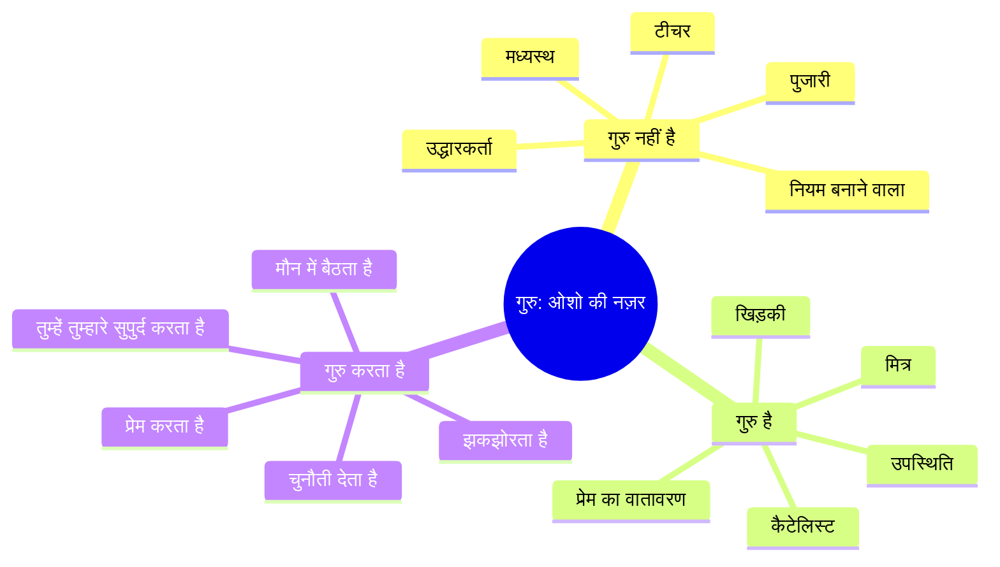
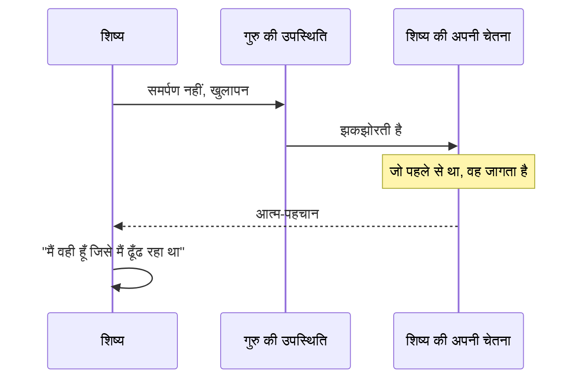
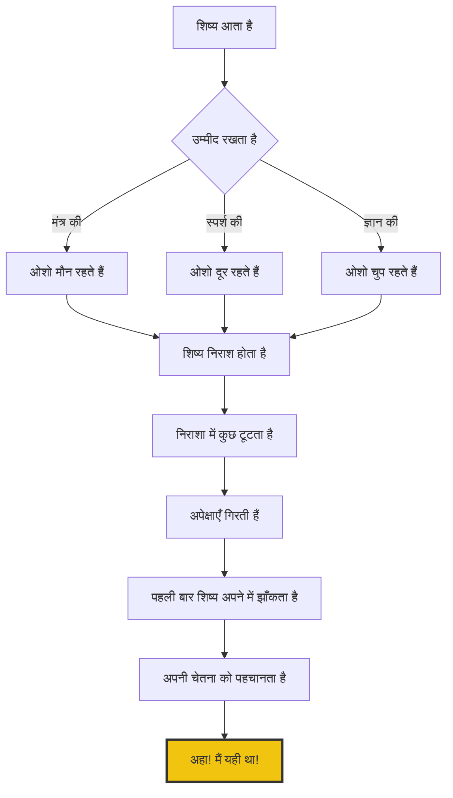

# अध्याय १३: गुरु-शिष्य: ओशो का दृष्टिकोण


<!-- Image Gallery -->
<div style="display:flex;flex-wrap:wrap;gap:4px;margin:16px 0;padding:12px;background:#f8fafc;border-radius:8px;border:1px solid #e2e8f0;">
<a href="../../../assets/images/lessons/vigyan-bhairav-tantra/13-guru-shishya-osho/hero.svg" target="_blank" rel="noopener">
  
</a>
<a href="../../../assets/images/lessons/vigyan-bhairav-tantra/13-guru-shishya-osho/handwritten-notes.svg" target="_blank" rel="noopener">
  
</a>
<a href="../../../assets/images/lessons/vigyan-bhairav-tantra/13-guru-shishya-osho/sticky-notes.svg" target="_blank" rel="noopener">
  
</a>
<a href="../../../assets/images/lessons/vigyan-bhairav-tantra/13-guru-shishya-osho/visual-explanation.svg" target="_blank" rel="noopener">
  
</a>
<a href="../../../assets/images/lessons/vigyan-bhairav-tantra/13-guru-shishya-osho/architecture.svg" target="_blank" rel="noopener">
  
</a>
<a href="../../../assets/images/lessons/vigyan-bhairav-tantra/13-guru-shishya-osho/workflow.svg" target="_blank" rel="noopener">
  
</a>
<a href="../../../assets/images/lessons/vigyan-bhairav-tantra/13-guru-shishya-osho/mindmap.svg" target="_blank" rel="noopener">
  
</a>
<a href="../../../assets/images/lessons/vigyan-bhairav-tantra/13-guru-shishya-osho/comparison.svg" target="_blank" rel="noopener">
  
</a>
<a href="../../../assets/images/lessons/vigyan-bhairav-tantra/13-guru-shishya-osho/cheatsheet.svg" target="_blank" rel="noopener">
  
</a>
<a href="../../../assets/images/lessons/vigyan-bhairav-tantra/13-guru-shishya-osho/interview-quiz.svg" target="_blank" rel="noopener">
  
</a>
<a href="../../../assets/images/lessons/vigyan-bhairav-tantra/13-guru-shishya-osho/social-card.svg" target="_blank" rel="noopener">
  
</a>
</div>
<!-- End Image Gallery -->

## सीखने के उद्देश्य (Learning Objectives)

इस अध्याय को पूरा करने के बाद, तुम निम्नलिखित में सक्षम होगे:

1. ओशो के "गुरु" की अवधारणा को समझना — गुरु एक उपस्थिति है, शिक्षक नहीं
2. पारंपरिक गुरु-शिष्य संबंधों पर ओशो की अनोखी आलोचना को आत्मसात करना
3. दीक्षा (initiation) को ओशो के नज़रिए से देखना — बिना स्पर्श के संचरण
4. गुरु को एक उत्प्रेरक (catalytic agent) के रूप में समझना
5. सत्संग की ओशो की व्याख्या — transmission without touch
6. TypeScript Osho Discourse Reference Explorer विकसित करना

---

## 🔱 प्रस्तावना: ओशो की आँखों से गुरु

> *"गुरु कोई टीचर नहीं है। गुरु एक उपस्थिति है — एक कैटेलिस्ट। वह तुम्हें कुछ नहीं सिखाता, वह तो बस तुम्हारे सामने होता है और उसकी मौजूदगी में तुम्हारे अंदर कुछ घटित होने लगता है।"*
> **— ओशो**

**ओशो वाणी:**
*"मैं तुमसे कहता हूँ, सच्चा गुरु वह नहीं जो तुम्हें ज्ञान देता है — ज्ञान तो किताबों में भी मिल जाता है। सच्चा गुरु वह है जो तुम्हारे सामने होने पर तुम्हें अपने होने का अनुभव करा देता है। वह तुम्हें कुछ देता नहीं, वह तो बस तुम्हारा वह मुखौटा हटा देता है जो तुमने खुद पहन रखा है। और जब मुखौटा हटता है, तो तुम अपने असली चेहरे को देखते हो — जो कभी खोया नहीं था, बस भूल गया था।"*

एक दिन एक शिष्य ओशो के पास आया और बोला, "ओशो, मैं दस साल से ध्यान कर रहा हूँ, मुझे कुछ नहीं मिला।"

ओशो ने उसकी ओर देखा और मुस्कुराए।

"तुम्हें कुछ नहीं मिला? यह अच्छी खबर है! क्योंकि जो मिलता है वह खोया भी जा सकता है। जो तुम पहले से हो, वह कभी नहीं मिलता — वह तो बस प्रकट होता है। और उसके प्रकट होने के लिए किसी गुरु की ज़रूरत नहीं है — बस थोड़ी सी जागरूकता की ज़रूरत है।"

शिष्य ने कहा, "फिर गुरु की क्या ज़रूरत है?"

ओशो ने कहा, "गुरु की ज़रूरत इसलिए है क्योंकि तुम अपनी आँखें बंद किए हुए हो और तुम्हें लगता है कि तुम देख रहे हो। गुरु एक ऐसा शीशा है जिसमें तुम अपना असली चेहरा देख सकते हो — बशर्ते तुम शीशे से चिपके नहीं, बल्कि उसमें देखें।"

यह कहानी ओशो के गुरु-दर्शन का सार है। गुरु कोई मध्यस्थ नहीं है, कोई पुजारी नहीं है, कोई वह व्यक्ति नहीं जो तुम्हें और परमात्मा के बीच खड़ा हो जाए। गुरु तो बस एक खिड़की है — खिड़की को देखो मत, खिड़की से देखो।

---

## १. ओशो का गुरु-दर्शन: "गुरु एक शिक्षक नहीं, एक उपस्थिति है"

### १.१ पारंपरिक गुरु अवधारणा पर ओशो का करारा प्रहार

<a href="../../../assets/images/diagrams/vigyan-bhairav-tantra/13-guru-shishya-osho/-handwritten.svg" target="_blank" rel="noopener">
  
</a>
<a href="../../../assets/images/diagrams/vigyan-bhairav-tantra/13-guru-shishya-osho/-diagram.svg" target="_blank" rel="noopener">
  
</a>
<a href="../../../assets/images/diagrams/vigyan-bhairav-tantra/13-guru-shishya-osho/-sticky.svg" target="_blank" rel="noopener">
  
</a>


ओशो ने पारंपरिक गुरु-शिष्य संबंध को कभी स्वीकार नहीं किया। वे कहते थे:

> *"गुरु शब्द ही बहुत खतरनाक है। गुरु का मतलब होता है वह जो अंधकार को हटाए। लेकिन असली बात यह है कि अंधकार है ही नहीं — तुमने बस आँखें बंद कर रखी हैं। क्या कोई तुम्हारी आँखें खोल सकता है? हाँ, कोई तुम्हें झकझोर सकता है, कोई तुम्हारे सामने खड़ा हो सकता है, कोई तुम्हें प्यार कर सकता है — लेकिन आँखें तो तुम्हें खुद ही खोलनी होंगी।"*

**ओशो वाणी:**
*"मैं तुम्हारा गुरु नहीं हूँ — अगर मैं तुम्हारा गुरु होता तो तुम मुझ पर निर्भर हो जाते। मैं तो तुम्हारा मित्र हूँ। मैं तुम्हारा साथी हूँ इस यात्रा में। मैंने रास्ता पहचान लिया है, बस इतनी सी बात है। मैं तुम्हें बता सकता हूँ, 'देखो, वहाँ मत जाओ, मैं वहाँ जा चुका हूँ और वहाँ कुछ नहीं है।' लेकिन तुम्हें चलना खुद ही होगा। मैं तुम्हारे पैर उधार नहीं दे सकता।"*

### १.२ गुरु एक कैटेलिस्ट है

<a href="../../../assets/images/diagrams/vigyan-bhairav-tantra/13-guru-shishya-osho/-handwritten.svg" target="_blank" rel="noopener">
  
</a>
<a href="../../../assets/images/diagrams/vigyan-bhairav-tantra/13-guru-shishya-osho/-diagram.svg" target="_blank" rel="noopener">
  
</a>
<a href="../../../assets/images/diagrams/vigyan-bhairav-tantra/13-guru-shishya-osho/-sticky.svg" target="_blank" rel="noopener">
  
</a>


ओशो के लिए गुरु एक उत्प्रेरक (catalyst) है — जैसे कोई रासायनिक पदार्थ जो खुद तो बदलता नहीं, लेकिन दूसरों में बदलाव ला देता है।

```mermaid
flowchart LR
    subgraph पारंपरिक[पारंपरिक गुरु मॉडल]
        A[गुरु] -->|ज्ञान देता है| B[शिष्य]
        B -->|निर्भर होता है| A
    end
    
    subgraph ओशो[ओशो का गुरु मॉडल]
        C[गुरु] -.->|उपस्थिति मात्र| D[शिष्य]
        D -->|स्वयं जागता है| E[स्व-साक्षात्कार]
        C -.->|कैटेलिस्ट| E
    end
    
    style A fill:#e74c3c,color:#fff
    style C fill:#f39c12,color:#fff
    style E fill:#2ecc71,color:#fff
```

ओशो कहते हैं:

> *"गुरु एक कैटेलिस्ट है — जैसे बीज को मिट्टी की ज़रूरत होती है। मिट्टी बीज को कुछ देती नहीं, बीज में सब कुछ पहले से है। मिट्टी तो बस वह वातावरण देती है जिसमें बीज फूट सके। गुरु भी वही करता है — वह तुम्हारे चारों ओर एक ऐसा प्रेममय वातावरण बनाता है जिसमें तुम फूट सको, खिल सको, विकसित हो सको।"*

### १.३ "गुरु तुम्हें आज़ाद करता है, बाँधता नहीं"

<a href="../../../assets/images/diagrams/vigyan-bhairav-tantra/13-guru-shishya-osho/-handwritten.svg" target="_blank" rel="noopener">
  
</a>
<a href="../../../assets/images/diagrams/vigyan-bhairav-tantra/13-guru-shishya-osho/-diagram.svg" target="_blank" rel="noopener">
  
</a>
<a href="../../../assets/images/diagrams/vigyan-bhairav-tantra/13-guru-shishya-osho/-sticky.svg" target="_blank" rel="noopener">
  
</a>


यह ओशो का सबसे क्रांतिकारी बिंदु है। पारंपरिक गुरु शिष्य को बाँधता है — नियमों में, अनुष्ठानों में, परंपरा में। ओशो का गुरु तुम्हें इन सबसे आज़ाद करता है।



**ओशो वाणी:**
*"एक सच्चा गुरु तुम्हें कभी अपना शिष्य नहीं बनाता — वह तुम्हें अपना खुद का गुरु बनने में मदद करता है। मेरा काम तुम्हें मुझसे आज़ाद करना है, तुम्हें मुझ पर निर्भर बनाना नहीं। जिस दिन तुम मेरे बिना भी पूरे हो, उस दिन मैं सफल हुआ। अगर तुम हमेशा मेरे पीछे-पीछे चलते रहे, तो मैं असफल हूँ।"*

---

## २. ओशो की दीक्षा: बिना स्पर्श के संचरण

### २.१ परंपरा में दीक्षा

<a href="../../../assets/images/diagrams/vigyan-bhairav-tantra/13-guru-shishya-osho/-handwritten.svg" target="_blank" rel="noopener">
  
</a>
<a href="../../../assets/images/diagrams/vigyan-bhairav-tantra/13-guru-shishya-osho/-diagram.svg" target="_blank" rel="noopener">
  
</a>
<a href="../../../assets/images/diagrams/vigyan-bhairav-tantra/13-guru-shishya-osho/-sticky.svg" target="_blank" rel="noopener">
  
</a>


परंपरा में दीक्षा का मतलब होता था — गुरु शिष्य को मंत्र देता है, कोई क्रिया सिखाता है, किसी रस्म से गुज़ारता है। ओशो इस पूरी अवधारणा को उलट देते हैं।

> *"दीक्षा कोई रस्म नहीं है। दीक्षा कोई क्रिया नहीं है जो गुरु करता है। दीक्षा तो एक घटना है — एक क्षण जब गुरु की उपस्थिति में शिष्य के अंदर कुछ टूटता है, कुछ खुलता है, कुछ मुक्त होता है।"*

### २.२ शक्तिपात — ओशो की व्याख्या

<a href="../../../assets/images/diagrams/vigyan-bhairav-tantra/13-guru-shishya-osho/-handwritten.svg" target="_blank" rel="noopener">
  
</a>
<a href="../../../assets/images/diagrams/vigyan-bhairav-tantra/13-guru-shishya-osho/-diagram.svg" target="_blank" rel="noopener">
  
</a>
<a href="../../../assets/images/diagrams/vigyan-bhairav-tantra/13-guru-shishya-osho/-sticky.svg" target="_blank" rel="noopener">
  
</a>


परंपरा में शक्तिपात का मतलब है — गुरु अपनी शक्ति शिष्य में संचारित करता है। ओशो इसकी व्याख्या बिल्कुल अलग ढंग से करते हैं:

**ओशो वाणी:**
*"शक्तिपात का मतलब यह नहीं कि गुरु के पास कोई शक्ति है और वह उसे शिष्य को दे देता है। शक्तिपात का मतलब है — शिष्य की अपनी शक्ति, जो दबी हुई है, सोई हुई है, वह गुरु की उपस्थिति में जाग जाती है। गुरु तो बस एक ट्रिगर है। तुम्हारे अंदर जो है, वही जागता है। गुरु तो बस वह क्षण है, वह अवसर है।"*



### २.३ ओशो की अनूठी दीक्षा प्रक्रिया

<a href="../../../assets/images/diagrams/vigyan-bhairav-tantra/13-guru-shishya-osho/-handwritten.svg" target="_blank" rel="noopener">
  
</a>
<a href="../../../assets/images/diagrams/vigyan-bhairav-tantra/13-guru-shishya-osho/-diagram.svg" target="_blank" rel="noopener">
  
</a>
<a href="../../../assets/images/diagrams/vigyan-bhairav-tantra/13-guru-shishya-osho/-sticky.svg" target="_blank" rel="noopener">
  
</a>


ओशो ने दीक्षा को पूरी तरह बदल दिया। उनकी दीक्षा में:
- कोई मंत्र नहीं दिया जाता था
- कोई रस्म नहीं होती थी
- कोई स्पर्श नहीं होता था
- बस एक मौन उपस्थिति होती थी

> *"मैं तुम्हें दीक्षा देता हूँ — बिना कुछ दिए। क्योंकि जो दिया जा सकता है, वह कीमती नहीं है। जो दिया नहीं जा सकता, वही सच्चा है। मैं तुम्हें तुम्हारा ही परिचय कराता हूँ — उससे जो तुम पहले से हो। यही एकमात्र दीक्षा है।"*



**ओशो वाणी:**
*"जब कोई मेरे पास आता है और कहता है, 'ओशो, मुझे दीक्षा दें,' तो मैं उसकी आँखों में देखता हूँ और मुस्कुराता हूँ। वह कुछ पाने की उम्मीद में आया है। और मैं उसे कुछ नहीं दे सकता — क्योंकि उसे किसी चीज़ की ज़रूरत ही नहीं है। वह पहले से ही वह है। वह बस भूल गया है। मैं उसे उसकी भूल याद दिला सकता हूँ — बस इतना ही मेरा काम है।"*

---

## ३. पारंपरिक गुरु-शिष्य संबंध की ओशो की आलोचना

### ३.१ गुरु एक बीमारी है — ओशो का विवादास्पद कथन

<a href="../../../assets/images/diagrams/vigyan-bhairav-tantra/13-guru-shishya-osho/-handwritten.svg" target="_blank" rel="noopener">
  
</a>
<a href="../../../assets/images/diagrams/vigyan-bhairav-tantra/13-guru-shishya-osho/-diagram.svg" target="_blank" rel="noopener">
  
</a>
<a href="../../../assets/images/diagrams/vigyan-bhairav-tantra/13-guru-shishya-osho/-sticky.svg" target="_blank" rel="noopener">
  
</a>


ओशो ने एक बार कहा था:

> *"गुरु एक बीमारी है। और चेला भी एक बीमारी है। दोनों एक-दूसरे को पैदा करते हैं। जहाँ अंधा गुरु होता है, वहाँ अंधा शिष्य ही आएगा। और जहाँ अंधा शिष्य होता है, वहाँ अंधा गुरु ही फलेगा-फूलेगा।"*

यह सुनकर लोग चौंक जाते थे। ओशो समझाते थे:

> *"मैं गुरु के विरोध में नहीं हूँ — मैं झूठे गुरु के विरोध में हूँ। और ९९ प्रतिशत गुरु झूठे हैं। वे खुद नहीं जागे हैं और दूसरों को जगाने का दावा करते हैं। सच्चा गुरु दुर्लभ है — जैसे सदियों में एक बार होता है। सच्चा गुरु तुम्हें अपने पैरों पर खड़ा करता है, अपने सहारे नहीं।"*

### ३.२ श्रद्धा बनाम अंधविश्वास

<a href="../../../assets/images/diagrams/vigyan-bhairav-tantra/13-guru-shishya-osho/-handwritten.svg" target="_blank" rel="noopener">
  
</a>
<a href="../../../assets/images/diagrams/vigyan-bhairav-tantra/13-guru-shishya-osho/-diagram.svg" target="_blank" rel="noopener">
  
</a>
<a href="../../../assets/images/diagrams/vigyan-bhairav-tantra/13-guru-shishya-osho/-sticky.svg" target="_blank" rel="noopener">
  
</a>


ओशो ने श्रद्धा और अंधविश्वास के बीच स्पष्ट अंतर किया:

| पहलू | अंधविश्वास (Blind Faith) | श्रद्धा (Trust) |
|------|--------------------------|-----------------|
| आधार | डर | प्रेम |
| परिणाम | निर्भरता | स्वतंत्रता |
| गुरु का रूप | अधिकारी | मित्र |
| शिष्य का रूप | दास | साथी |
| अंत | बंधन | मुक्ति |

**ओशो वाणी:**
*"मैं तुमसे श्रद्धा की माँग नहीं करता। मैं तो चाहता हूँ कि तुम संदेह करो — खूब संदेह करो। संदेह को जलने दो, उसे पूरी तरह जलने दो। संदेह की आग में ही सच्चाई पकती है। मैं तुम्हें अंधा नहीं बनाना चाहता — मैं तो चाहता हूँ कि तुम्हारी आँखें खुल जाएँ। और आँखें खुलती हैं संदेह से, अंधविश्वास से नहीं।"*

### ३.३ गुरु-शिष्य संबंध का ओशो का मॉडल

<a href="../../../assets/images/diagrams/vigyan-bhairav-tantra/13-guru-shishya-osho/-handwritten.svg" target="_blank" rel="noopener">
  
</a>
<a href="../../../assets/images/diagrams/vigyan-bhairav-tantra/13-guru-shishya-osho/-diagram.svg" target="_blank" rel="noopener">
  
</a>
<a href="../../../assets/images/diagrams/vigyan-bhairav-tantra/13-guru-shishya-osho/-sticky.svg" target="_blank" rel="noopener">
  
</a>


```mermaid
flowchart TD
    subgraph पुराना[पुराना मॉडल]
        A[गुरु] -- नियंत्रण --> B[शिष्य]
        B -- निर्भरता --> A
        A -- ज्ञान देता है --> B
    end
    
    subgraph नया[ओशो का मॉडल]
        C[गुरु] -. प्रेमास्पद उपस्थिति .-> D[शिष्य]
        D -- जागरूकता --> E[स्व-साक्षात्कार]
        C -. चुनौती .-> D
        D -- प्रश्न --> C
        C -- साथ चलता है --> D
    end
    
    पुराना -->|विघटन| नया
    
    style A fill:#c0392b,color:#fff
    style B fill:#e67e22,color:#fff
    style C fill:#2980b9,color:#fff
    style D fill:#27ae60,color:#fff
    style E fill:#f1c40f,color:#fff
```

---

## ४. सत्संग: ओशो की व्याख्या

### ४.1 सत्संग का अर्थ

<a href="../../../assets/images/diagrams/vigyan-bhairav-tantra/13-guru-shishya-osho/1-handwritten.svg" target="_blank" rel="noopener">
  
</a>
<a href="../../../assets/images/diagrams/vigyan-bhairav-tantra/13-guru-shishya-osho/1-diagram.svg" target="_blank" rel="noopener">
  
</a>
<a href="../../../assets/images/diagrams/vigyan-bhairav-tantra/13-guru-shishya-osho/1-sticky.svg" target="_blank" rel="noopener">
  
</a>


परंपरा में सत्संग का मतलब है — सच्चे लोगों की संगति। ओशो इसे नया अर्थ देते हैं:

> *"सत्संग का मतलब है — सत् में संग। सत् का मतलब है सच्चाई, सत्य। सत्संग का मतलब है — सत्य के साथ जुड़ना। और सत्य कोई वस्तु नहीं है जो बाहर है — सत्य तो तुम्हारा अपना स्वभाव है। सत्संग का मतलब है — अपने स्वभाव में लौट आना।"*

### ४.2 ओशो का मौन सत्संग

<a href="../../../assets/images/diagrams/vigyan-bhairav-tantra/13-guru-shishya-osho/2-handwritten.svg" target="_blank" rel="noopener">
  
</a>
<a href="../../../assets/images/diagrams/vigyan-bhairav-tantra/13-guru-shishya-osho/2-diagram.svg" target="_blank" rel="noopener">
  
</a>
<a href="../../../assets/images/diagrams/vigyan-bhairav-tantra/13-guru-shishya-osho/2-sticky.svg" target="_blank" rel="noopener">
  
</a>


ओशो ने सत्संग का एक अनूठा रूप विकसित किया — मौन सत्संग। उनके पास हजारों लोग बैठते थे और वे बिना बोले बैठे रहते थे।

> *"जब मैं मौन हूँ, तो मैं वास्तव में बोल रहा हूँ। मेरा मौन तुम्हारे मौन से मिलता है — और उस मिलन में कुछ घटित होता है। यही सच्चा सत्संग है। शब्द तो सिर्फ सतह पर हैं — गहराई में तो मौन ही संवाद है।"*

```mermaid
flowchart LR
    subgraph मौन[ओशो का मौन सत्संग]
        A[ओशो] -->|मौन| B[श्रोता]
        B -->|मौन| A
        A -.->|उपस्थिति का संचरण| C[हृदय में जागृति]
        B -.->|खुलापन| C
    end
    
    C --> D[संचरण - Transmission]
    D --> E[शिष्य में परिवर्तन]
    
    style D fill:#9b59b6,color:#fff,stroke-width:3px
```

### ४.3 तीन प्रकार के सत्संग

<a href="../../../assets/images/diagrams/vigyan-bhairav-tantra/13-guru-shishya-osho/3-handwritten.svg" target="_blank" rel="noopener">
  
</a>
<a href="../../../assets/images/diagrams/vigyan-bhairav-tantra/13-guru-shishya-osho/3-diagram.svg" target="_blank" rel="noopener">
  
</a>
<a href="../../../assets/images/diagrams/vigyan-bhairav-tantra/13-guru-shishya-osho/3-sticky.svg" target="_blank" rel="noopener">
  
</a>


| प्रकार | ओशो का वर्णन | विधि |
|--------|---------------|------|
| वाचिक | शब्दों के माध्यम से | प्रवचन, प्रश्नोत्तर |
| मौन | बिना शब्दों के | एक साथ मौन में बैठना |
| दूरस्थ | बिना उपस्थिति के | ध्यान, प्रार्थना, स्मरण |

**ओशो वाणी:**
*"मैं तुमसे कहता हूँ — मेरा सत्संग कभी खत्म नहीं होता। तुम मेरे पास हो या न हो, मैं तुम्हारे साथ हूँ। सिर्फ याद करने की बात है। जब भी तुम मुझे याद करते हो, मैं वहाँ हूँ। यह समय और स्थान से परे का संबंध है।"*

---

## ५. ओशो के प्रमुख प्रवचन: विज्ञान भैरव तंत्र पर

### ५.१ "द बुक ऑफ़ सीक्रेट्स" — ओशो की अमर कृति

<a href="../../../assets/images/diagrams/vigyan-bhairav-tantra/13-guru-shishya-osho/-handwritten.svg" target="_blank" rel="noopener">
  
</a>
<a href="../../../assets/images/diagrams/vigyan-bhairav-tantra/13-guru-shishya-osho/-diagram.svg" target="_blank" rel="noopener">
  
</a>
<a href="../../../assets/images/diagrams/vigyan-bhairav-tantra/13-guru-shishya-osho/-sticky.svg" target="_blank" rel="noopener">
  
</a>


ओशो ने विज्ञान भैरव तंत्र पर १९७२-७३ में ११२ प्रवचन दिए, जो "द बुक ऑफ़ सीक्रेट्स" नाम से प्रकाशित हुए। यह उनकी सबसे महत्वपूर्ण कृतियों में से एक है।

> *"यह पुस्तक अद्वितीय है। पूरे मानव इतिहास में ध्यान का इतना विस्तृत, इतना वैज्ञानिक विवेचन कहीं नहीं मिलता। विज्ञान भैरव तंत्र ध्यान का विज्ञान है — और मैंने इसे आधुनिक मनुष्य की भाषा में समझाने की कोशिश की है।"*

### ५.२ प्रमुख ओशो प्रवचन संदर्भ

<a href="../../../assets/images/diagrams/vigyan-bhairav-tantra/13-guru-shishya-osho/-handwritten.svg" target="_blank" rel="noopener">
  
</a>
<a href="../../../assets/images/diagrams/vigyan-bhairav-tantra/13-guru-shishya-osho/-diagram.svg" target="_blank" rel="noopener">
  
</a>
<a href="../../../assets/images/diagrams/vigyan-bhairav-tantra/13-guru-shishya-osho/-sticky.svg" target="_blank" rel="noopener">
  
</a>


| क्रम | प्रवचन का मुख्य विषय | VBT श्लोक | ओशो का मुख्य संदेश |
|------|---------------------|-----------|---------------------|
| १-२ | श्वास — द्वार | १-२० | श्वास ही पुल है शरीर और आत्मा के बीच |
| ३-४ | दृष्टि — आँखों का ध्यान | २१-४० | देखना ही ध्यान हो जाए |
| ५-६ | भाव — भावनाओं का कीमिया | ४१-६० | भावनाओं को दबाओ नहीं, बदलो |
| ७-८ | शून्य — सब कुछ छोड़ दो | ६१-८० | कुछ मत करो, बस ठहरो |
| ९-१० | संवेदना — शरीर का ध्यान | ८१-१०० | शरीर ही मंदिर है |
| ११-१२ | समग्र — अंतिम द्वार | १०१-११२ | सब शिवमय है, बस यह देखो |

---

## ६. TypeScript कार्यान्वयन: ओशो प्रवचन संदर्भ अन्वेषक

```typescript
/**
 * ओशो प्रवचन संदर्भ अन्वेषक (Osho Discourse Reference Explorer)
 * 
 * यह उपकरण ओशो के "द बुक ऑफ़ सीक्रेट्स" प्रवचनों को व्यवस्थित करता है
 * और साधक को उनके मुख्य संदेशों तक पहुँचने में सहायता करता है।
 * 
 * "गुरु कोई टीचर नहीं है — गुरु एक उपस्थिति है। यह टूल तुम्हें
 * उस उपस्थिति की याद दिलाने का एक साधन मात्र है।" — ओशो
 * 
 * @package OshoVBT
 * @version 1.0.0
 */

// === मुख्य प्रकार ===

interface OshoDiscourse {
    id: string;
    title: string;
    titleHindi: string;
    date: Date;
    volume: number;
    discourseNumber: number;
    coveringTechniques: number[];
    keyTheme: string;
    keyThemeHindi: string;
    oshoQuote: string;
    oshoQuoteHindi: string;
    duration: number; // minutes
    keyStory?: OshoStory;
    mainTeaching: string;
    vbtShlokaReferenced: string;
    shlokaMeaning: string;
}

interface OshoStory {
    title: string;
    tradition: 'zen' | 'sufi' | 'hassid' | 'tantra' | 'upanishad' | 'buddha' | 'christian' | 'jain' | 'osho_own';
    summary: string;
    punchline: string;
    teachingPoint: string;
}

interface MasterConcept {
    id: string;
    concept: string;
    conceptHindi: string;
    explanation: string;
    oshoQuote: string;
    relatedDiscourses: string[];
    relatedTechniques: number[];
    paradox?: string; // Osho's characteristic paradox
}

interface InitiationRecord {
    seekerId: string;
    name: string;
    date: Date;
    type: 'sannyas' | 'meditation_initiation' | 'discourse_attendance';
    oshoMessage: string;
    transformationNote: string;
}

// === ओशो प्रवचन डेटाबेस ===

const OSHO_DISCOURSES: OshoDiscourse[] = [
    {
        id: 'bos_01',
        title: 'The Book of Secrets: The Breath Door',
        titleHindi: 'रहस्यों की पुस्तक: श्वास का द्वार',
        date: new Date(1972, 9, 1),
        volume: 1,
        discourseNumber: 1,
        coveringTechniques: [1, 2, 3, 4, 5],
        keyTheme: 'Breath as Bridge',
        keyThemeHindi: 'श्वास ही पुल है — शरीर और आत्मा के बीच',
        oshoQuote: 'Breath is the bridge between the body and the soul. Watch it, and you cross the bridge.',
        oshoQuoteHindi: 'श्वास शरीर और आत्मा के बीच का पुल है। इसे देखो, और तुम पार हो जाओगे।',
        duration: 90,
        keyStory: {
            title: 'The Zen Master and the Thief',
            tradition: 'zen',
            summary: 'एक ज़ेन मास्टर के पास एक चोर आया। मास्टर ने उसे चाय पिलाई और कहा, "जो कुछ तुम चाहते हो, ले लो।" चोर ने सब कुछ ले लिया। अगले दिन वह वापस आया — मास्टर का शिष्य बनने।',
            punchline: 'जब कोई तुम्हें बिना शर्त स्वीकार करता है, तो तुम बदल जाते हो। यही गुरु की उपस्थिति का चमत्कार है।',
            teachingPoint: 'गुरु की उपस्थिति में बिना किसी प्रयास के परिवर्तन घटित होता है।'
        },
        mainTeaching: 'श्वास पर ध्यान देना सबसे सरल ध्यान तकनीक है। लेकिन सरल का मतलब आसान नहीं है — यह सबसे गहरी तकनीक भी है।',
        vbtShlokaReferenced: 'प्राणे संपूर्णतां गते प्रशान्तचित्तः स्वयं भवेत्।',
        shlokaMeaning: 'जब प्राण अपनी संपूर्णता में स्थित हो जाता है, तब चित्त अपने आप शांत हो जाता है।'
    },
    {
        id: 'bos_23',
        title: 'The Book of Secrets: The Look',
        titleHindi: 'रहस्यों की पुस्तक: दृष्टि का ध्यान',
        date: new Date(1972, 11, 15),
        volume: 2,
        discourseNumber: 23,
        coveringTechniques: [21, 22, 23, 24, 25],
        keyTheme: 'Watching the Watcher',
        keyThemeHindi: 'देखने वाले को देखना',
        oshoQuote: 'The moment you become aware of your awareness, you have arrived home.',
        oshoQuoteHindi: 'जिस क्षण तुम अपनी जागरूकता से जागरूक होते हो, तुम घर पहुँच जाते हो।',
        duration: 90,
        keyStory: {
            title: 'The Sufi and the River',
            tradition: 'sufi',
            summary: 'एक सूफ़ी नदी पार करना चाहता था। नाव में बैठकर उसने नाविक से पूछा, "क्या तुम्हें कुरान आता है?" नाविक ने कहा, "नहीं।" सूफ़ी ने कहा, "तुम्हारी आधी ज़िंदगी बेकार गई।" फिर एक तूफ़ान आया। नाविक ने पूछा, "क्या तुम्हें तैरना आता है?" सूफ़ी ने कहा, "नहीं।" नाविक ने कहा, "तो तुम्हारी पूरी ज़िंदगी बेकार गई।"',
            punchline: 'ज्ञान और अनुभव में बहुत फ़र्क है। गुरु वह है जिसने अनुभव किया है, जिसने पढ़ा नहीं।',
            teachingPoint: 'सच्चा गुरु ज्ञानी नहीं, अनुभवी होता है।'
        },
        mainTeaching: 'देखना ही ध्यान का सार है। बाहर देखो या भीतर — देखना ही महत्वपूर्ण है।',
        vbtShlokaReferenced: 'द्वादशान्ते मनः क्षिप्त्वा प्राणे शान्ते शिवो भवेत्।',
        shlokaMeaning: 'मन को बारह अंगुल ऊपर फेंककर, प्राण के शांत होने पर शिव हो जाता है।'
    },
    {
        id: 'bos_45',
        title: 'The Book of Secrets: The Alchemy of Emotions',
        titleHindi: 'रहस्यों की पुस्तक: भावनाओं की कीमिया',
        date: new Date(1973, 1, 10),
        volume: 3,
        discourseNumber: 45,
        coveringTechniques: [41, 42, 43, 44, 45],
        keyTheme: 'Transformation of Emotions',
        keyThemeHindi: 'भावनाओं का रूपांतरण',
        oshoQuote: 'Don\t suppress, don\t express — just be a witness. That is the alchemy.',
        oshoQuoteHindi: 'न दबाओ, न व्यक्त करो — बस गवाह बनो। यही कीमिया है।',
        duration: 90,
        mainTeaching: 'हर भावना को ध्यान में बदला जा सकता है। क्रोध को देखो — वह शिव बन जाएगा।',
        vbtShlokaReferenced: 'रागद्वेषादिके भावे मध्ये यस्तिष्ठति निर्भरः।',
        shlokaMeaning: 'राग-द्वेष आदि भावों के बीच जो निर्भर होकर स्थित रहता है, वह...'
    },
    {
        id: 'bos_67',
        title: 'The Book of Secrets: The Void',
        titleHindi: 'रहस्यों की पुस्तक: शून्यता',
        date: new Date(1973, 4, 5),
        volume: 4,
        discourseNumber: 67,
        coveringTechniques: [61, 62, 63, 64, 65],
        keyTheme: 'Embrace the Void',
        keyThemeHindi: 'शून्यता को अपनाओ',
        oshoQuote: 'The void is not empty — it is full of the divine. Only the mind is absent.',
        oshoQuoteHindi: 'शून्य खाली नहीं है — वह परम से भरा है। बस मन गायब है।',
        duration: 90,
        keyStory: {
            title: 'The Hassid and the Miracle',
            tradition: 'hassid',
            summary: 'एक हसीद संत से किसी ने पूछा, "आपने चमत्कार कैसे किए?" संत ने कहा, "मैंने कोई चमत्कार नहीं किया। मैंने बस परमात्मा को अपने में से काम करने दिया। मैं तो बस एक खाली बाँसुरी हूँ — गीत तो परमात्मा का है।"',
            punchline: 'जब तुम खाली होते हो, तब परम तुम्हें भर देता है। शून्य ही परम का द्वार है।',
            teachingPoint: 'गुरु वह है जो खाली हो गया है — और उस खालीपन में परम प्रवाहित होता है।'
        },
        mainTeaching: 'शून्य हो जाओ — और परम तुम्हें भर देगा। यही विरोधाभास है।',
        vbtShlokaReferenced: 'शून्यं स्वभावं निश्चित्य शून्य एव भवेन्नरः।',
        shlokaMeaning: 'अपने स्वभाव को शून्य मानकर, मनुष्य स्वयं शून्य हो जाता है।'
    },
    {
        id: 'bos_89',
        title: 'The Book of Secrets: The Body Temple',
        titleHindi: 'रहस्यों की पुस्तक: शरीर मंदिर',
        date: new Date(1973, 6, 20),
        volume: 5,
        discourseNumber: 89,
        coveringTechniques: [81, 82, 83, 84, 85],
        keyTheme: 'Body as Temple',
        keyThemeHindi: 'शरीर ही मंदिर है',
        oshoQuote: 'Your body is the temple of the divine. Feel it, love it, be grateful for it.',
        oshoQuoteHindi: 'तेरा शरीर परमात्मा का मंदिर है। इसे महसूस कर, इससे प्यार कर, इसके लिए कृतज्ञ हो।',
        duration: 90,
        mainTeaching: 'शरीर और आत्मा में कोई विरोध नहीं है। शरीर को रौंदने से आत्मा नहीं मिलती।',
        vbtShlokaReferenced: 'वेदनायां स्थितो योगी वेदनात्मकतां व्रजेत्।',
        shlokaMeaning: 'वेदना में स्थित योगी वेदनात्मक हो जाता है।'
    },
    {
        id: 'bos_112',
        title: 'The Book of Secrets: The Final Door',
        titleHindi: 'रहस्यों की पुस्तक: अंतिम द्वार',
        date: new Date(1973, 9, 30),
        volume: 5,
        discourseNumber: 112,
        coveringTechniques: [108, 109, 110, 111, 112],
        keyTheme: 'You Are Already That',
        keyThemeHindi: 'तुम पहले से ही वह हो',
        oshoQuote: 'The last technique is no technique at all. Just be — that is enough.',
        oshoQuoteHindi: 'अंतिम तकनीक कोई तकनीक नहीं है। बस हो जाओ — इतना ही काफ़ी है।',
        duration: 120,
        keyStory: {
            title: 'The Zen Master Who Knew Nothing',
            tradition: 'zen',
            summary: 'एक ज़ेन मास्टर से जब पूछा गया, "आप ध्यान कैसे करते हैं?" तो उन्होंने कहा, "जब भूख लगती हूँ, खाता हूँ। जब नींद आती है, सोता हूँ।" पूछने वाले ने कहा, "यह तो हर कोई करता है!" मास्टर ने कहा, "नहीं — हर कोई खाते हुए सोचता है और सोते हुए सपने देखता है। मैं सिर्फ करता हूँ, बिना विचार के।"',
            punchline: 'ध्यान कोई अलग क्रिया नहीं है — यह जीने का एक तरीका है। जब तुम पूरी तरह जागरूक होकर जीते हो, तो हर क्रिया ध्यान है।',
            teachingPoint: 'अंत में, सब तकनीकें छोड़नी पड़ती हैं। बस जागरूक रहना है — यही सब कुछ है।'
        },
        mainTeaching: 'जब सब तकनीकें छूट जाती हैं, तब सच्चा ध्यान शुरू होता है। तकनीक सिर्फ तैयारी है — द्वार पर आने तक।',
        vbtShlokaReferenced: 'अहं भैरव एवास्मि न मे भेदः परेण च।',
        shlokaMeaning: 'मैं ही भैरव हूँ। मुझमें और परम में कोई भेद नहीं।'
    }
];

// === ओशो के मुख्य अवधारणाएँ ===

const OSHO_MASTER_CONCEPTS: MasterConcept[] = [
    {
        id: 'witnessing',
        concept: 'Witnessing is the Only Meditation',
        conceptHindi: 'साक्षी भाव ही एकमात्र ध्यान है',
        explanation: 'ओशो के अनुसार, सभी ११२ तकनीकें साक्षी भाव की अलग-अलग विधियाँ हैं। ध्यान का कोई और रूप नहीं है — सिर्फ गवाह होना सीखो।',
        oshoQuote: 'The whole art of meditation is nothing but this: how to become a witness. Everything else is just a preparation.',
        relatedDiscourses: ['bos_01', 'bos_23', 'bos_45', 'bos_67', 'bos_89', 'bos_112'],
        relatedTechniques: [1, 21, 41, 61, 81, 101],
        paradox: 'करो कुछ नहीं — बस देखो। और यही सबसे कठिन काम है।'
    },
    {
        id: 'master_catalyst',
        concept: 'Master as Catalyst',
        conceptHindi: 'गुरु एक उत्प्रेरक है',
        explanation: 'गुरु कुछ करता नहीं — बस उसकी उपस्थिति में तुम्हारे अंदर कुछ घटित होने लगता है। वह कोई मध्यस्थ नहीं, बल्कि एक उत्प्रेरक है।',
        oshoQuote: 'The master is not a teacher, not a preacher — he is simply a presence. In his presence, something dormant in you starts awakening.',
        relatedDiscourses: ['bos_01', 'bos_112'],
        relatedTechniques: [112],
        paradox: 'सबसे बड़ा गुरु वह है जो तुम्हें अपने ही ऊपर छोड़ देता है।'
    },
    {
        id: 'no_method',
        concept: 'Meditation Cannot Be Done',
        conceptHindi: 'ध्यान किया नहीं जा सकता',
        explanation: 'ध्यान कोई क्रिया नहीं है — यह एक अवस्था है। तुम ध्यान नहीं कर सकते, तुम केवल ध्यान में हो सकते हो। सारी तकनीकें सिर्फ इस अवस्था के लिए तैयारी हैं।',
        oshoQuote: 'Meditation is not an act. It is a state. You cannot do it, you can only be in it. All techniques are just preparations for this non-doing.',
        relatedDiscourses: ['bos_67', 'bos_112'],
        relatedTechniques: [61, 62, 63, 112],
        paradox: 'जो सबसे ज्यादा कोशिश करता है, वह सबसे दूर रह जाता है।'
    },
    {
        id: 'already_enlightened',
        concept: 'You Are Already Enlightened',
        conceptHindi: 'तुम पहले से ही प्रबुद्ध हो',
        explanation: 'मोक्ष कोई उपलब्धि नहीं है — यह तुम्हारा स्वभाव है। तुम्हें कुछ बनना नहीं है, तुम्हें सिर्फ वह पहचानना है जो तुम पहले से हो।',
        oshoQuote: 'Enlightenment is not an achievement. It is a recognition. You are already that which you are seeking.',
        relatedDiscourses: ['bos_112'],
        relatedTechniques: [112],
        paradox: 'जब तुम खोज छोड़ देते हो, तभी पाते हो।'
    }
];

// === गुरु-शिष्य संबंध विश्लेषक ===

class OshoGuruShishyaExplorer {
    private discourses: Map<string, OshoDiscourse>;
    private concepts: Map<string, MasterConcept>;

    constructor() {
        this.discourses = new Map(OSHO_DISCOURSES.map(d => [d.id, d]));
        this.concepts = new Map(OSHO_MASTER_CONCEPTS.map(c => [c.id, c]));
    }

    /**
     * किसी तकनीक के लिए ओशो का प्रवचन खोजें
     */
    findDiscourseForTechnique(techniqueNumber: number): OshoDiscourse[] {
        return OSHO_DISCOURSES.filter(d => d.coveringTechniques.includes(techniqueNumber));
    }

    /**
     * ओशो की कहानी खोजें — परंपरा के अनुसार
     */
    findStoriesByTradition(tradition: string): OshoStory[] {
        const stories: OshoStory[] = [];
        for (const discourse of OSHO_DISCOURSES) {
            if (discourse.keyStory && discourse.keyStory.tradition === tradition) {
                stories.push(discourse.keyStory);
            }
        }
        return stories;
    }

    /**
     * ओशो का विरोधाभास (paradox) खोजें
     */
    getRandomParadox(): { concept: string; paradox: string } {
        const concepts = OSHO_MASTER_CONCEPTS.filter(c => c.paradox);
        const random = concepts[Math.floor(Math.random() * concepts.length)];
        return {
            concept: random.conceptHindi,
            paradox: random.paradox!
        };
    }

    /**
     * प्रवचन की मुख्य शिक्षा का सारांश
     */
    getTeachingSummary(techniqueNumber: number): string[] {
        const discourses = this.findDiscourseForTechnique(techniqueNumber);
        return discourses.map(d => `【${d.titleHindi}】— ${d.mainTeaching}`);
    }

    /**
     * किसी तकनीक के लिए पूरा संदर्भ
     */
    getDiscourseReference(techniqueNumber: number): DiscourseReference {
        const discourses = this.findDiscourseForTechnique(techniqueNumber);
        
        if (discourses.length === 0) {
            return {
                techniqueNumber,
                hasDirectDiscourse: false,
                nearestDiscourse: OSHO_DISCOURSES.find(d => 
                    Math.abs(d.coveringTechniques[0] - techniqueNumber) < 10
                ),
                oshoMessage: 'हर तकनीक पर ओशो ने अलग से बात नहीं की है। लेकिन उनका संदेश हर तकनीक के लिए एक ही है — गवाह बनो।'
            };
        }

        const primary = discourses[0];
        return {
            techniqueNumber,
            hasDirectDiscourse: true,
            nearestDiscourse: primary,
            oshoQuote: primary.oshoQuoteHindi,
            oshoMessage: `ओशो ने इस तकनीक पर प्रवचन #${primary.discourseNumber} में बात की। उनका मुख्य संदेश: "${primary.mainTeaching}"`,
            keyStory: primary.keyStory
        };
    }

    /**
     * ओशो के सभी प्रवचनों का सारांश
     */
    getAllDiscoursesSummary(): DiscourseSummary {
        return {
            totalDiscourses: OSHO_DISCOURSES.length,
            totalVolumes: new Set(OSHO_DISCOURSES.map(d => d.volume)).size,
            techniquesCovered: new Set(OSHO_DISCOURSES.flatMap(d => d.coveringTechniques)).size,
            totalStories: OSHO_DISCOURSES.filter(d => d.keyStory).length,
            mainMessage: 'सब तकनीकें सिर्फ सीढ़ियाँ हैं। जब तुम ऊपर पहुँच जाते हो, तो सीढ़ियाँ छोड़ दो। सच्चा ध्यान तो सीढ़ियों के बाद शुरू होता है।',
            paradox: 'ध्यान वह नहीं है जो तुम करते हो — ध्यान वह है जो तुम हो।'
        };
    }
}

// === सहायक प्रकार ===

interface DiscourseReference {
    techniqueNumber: number;
    hasDirectDiscourse: boolean;
    nearestDiscourse?: OshoDiscourse;
    oshoQuote?: string;
    oshoMessage?: string;
    keyStory?: OshoStory;
}

interface DiscourseSummary {
    totalDiscourses: number;
    totalVolumes: number;
    techniquesCovered: number;
    totalStories: number;
    mainMessage: string;
    paradox: string;
}

// === उपयोग उदाहरण ===

function demonstrateOshoExplorer(): void {
    console.log('=== 🕉️  ओशो प्रवचन संदर्भ अन्वेषक ===');
    console.log('=== Osho Discourse Reference Explorer ===\n');

    const explorer = new OshoGuruShishyaExplorer();

    // तकनीक १ के लिए ओशो का संदर्भ
    console.log('तकनीक #१ — श्वास पर ध्यान:');
    const ref = explorer.getDiscourseReference(1);
    console.log(`  प्रवचन: ${ref.nearestDiscourse?.titleHindi}`);
    console.log(`  ओशो का संदेश: ${ref.oshoMessage}`);
    console.log(`  उद्धरण: "${ref.oshoQuote}"`);
    if (ref.keyStory) {
        console.log(`  कहानी: ${ref.keyStory.title} (${ref.keyStory.tradition})`);
        console.log(`  सार: ${ref.keyStory.summary}`);
    }
    console.log();

    // ओशो का विरोधाभास
    console.log('ओशो का विरोधाभास (Osho Paradox):');
    const paradox = explorer.getRandomParadox();
    console.log(`  "${paradox.concept}"`);
    console.log(`  → ${paradox.paradox}\n`);

    // सभी प्रवचनों का सारांश
    const summary = explorer.getAllDiscoursesSummary();
    console.log('समग्र सारांश:');
    console.log(`  कुल प्रवचन: ${summary.totalDiscourses}`);
    console.log(`  कुल खंड: ${summary.totalVolumes}`);
    console.log(`  कवर की गई तकनीकें: ${summary.techniquesCovered}`);
    console.log(`  कहानियाँ: ${summary.totalStories}`);
    console.log(`  मुख्य संदेश: "${summary.mainMessage}"`);
    console.log(`  विरोधाभास: "${summary.paradox}"\n`);

    // कहानियाँ
    console.log('📖 ओशो की कहानियाँ (Osho Stories):');
    const allTraditions = ['zen', 'sufi', 'hassid', 'tantra'];
    for (const tradition of allTraditions) {
        const stories = explorer.findStoriesByTradition(tradition);
        if (stories.length > 0) {
            console.log(`  ${tradition.toUpperCase()}: ${stories.length} कहानियाँ`);
            stories.forEach(s => console.log(`    • ${s.title}: ${s.punchline}`));
        }
    }
    console.log();

    // ओशो की अवधारणाएँ
    console.log('🧠 ओशो की मुख्य अवधारणाएँ (Master Concepts):');
    for (const [id, concept] of OSHO_MASTER_CONCEPTS.entries()) {
        console.log(`  ${concept.conceptHindi}`);
        console.log(`    "${concept.oshoQuote}"`);
        if (concept.paradox) {
            console.log(`    ⚡ विरोधाभास: ${concept.paradox}`);
        }
        console.log();
    }
}

demonstrateOshoExplorer();

export {
    OshoGuruShishyaExplorer,
    OSHO_DISCOURSES,
    OSHO_MASTER_CONCEPTS,
    type OshoDiscourse,
    type OshoStory,
    type MasterConcept,
    type DiscourseReference,
    type DiscourseSummary,
    type InitiationRecord
};
```

---

## ७. ओशो की गुरु-दीक्षा के सात सूत्र

### सूत्र १: गुरु कोई टीचर नहीं है

<a href="../../../assets/images/diagrams/vigyan-bhairav-tantra/13-guru-shishya-osho/-handwritten.svg" target="_blank" rel="noopener">
  
</a>
<a href="../../../assets/images/diagrams/vigyan-bhairav-tantra/13-guru-shishya-osho/-diagram.svg" target="_blank" rel="noopener">
  
</a>
<a href="../../../assets/images/diagrams/vigyan-bhairav-tantra/13-guru-shishya-osho/-sticky.svg" target="_blank" rel="noopener">
  
</a>

गुरु तुम्हें कुछ नहीं सिखाता — वह तो बस एक माहौल बनाता है जिसमें तुम सीख सको।

### सूत्र २: गुरु एक मित्र है

<a href="../../../assets/images/diagrams/vigyan-bhairav-tantra/13-guru-shishya-osho/-handwritten.svg" target="_blank" rel="noopener">
  
</a>
<a href="../../../assets/images/diagrams/vigyan-bhairav-tantra/13-guru-shishya-osho/-diagram.svg" target="_blank" rel="noopener">
  
</a>
<a href="../../../assets/images/diagrams/vigyan-bhairav-tantra/13-guru-shishya-osho/-sticky.svg" target="_blank" rel="noopener">
  
</a>

वह कोई अधिकारी नहीं, कोई बॉस नहीं — वह एक प्रेममय मित्र है जो तुम्हारे साथ चलता है।

### सूत्र ३: गुरु तुम्हें आज़ाद करता है

<a href="../../../assets/images/diagrams/vigyan-bhairav-tantra/13-guru-shishya-osho/-handwritten.svg" target="_blank" rel="noopener">
  
</a>
<a href="../../../assets/images/diagrams/vigyan-bhairav-tantra/13-guru-shishya-osho/-diagram.svg" target="_blank" rel="noopener">
  
</a>
<a href="../../../assets/images/diagrams/vigyan-bhairav-tantra/13-guru-shishya-osho/-sticky.svg" target="_blank" rel="noopener">
  
</a>

अगर कोई तुम्हें बाँधता है, वह गुरु नहीं है। सच्चा गुरु तुम्हें हर बंधन से मुक्त करता है — अपने बंधन से भी।

### सूत्र ४: गुरु की उपस्थिति ही दीक्षा है

<a href="../../../assets/images/diagrams/vigyan-bhairav-tantra/13-guru-shishya-osho/-handwritten.svg" target="_blank" rel="noopener">
  
</a>
<a href="../../../assets/images/diagrams/vigyan-bhairav-tantra/13-guru-shishya-osho/-diagram.svg" target="_blank" rel="noopener">
  
</a>
<a href="../../../assets/images/diagrams/vigyan-bhairav-tantra/13-guru-shishya-osho/-sticky.svg" target="_blank" rel="noopener">
  
</a>

दीक्षा कोई रस्म नहीं — यह गुरु के साथ रहने का प्रभाव है। जैसे अग्नि के पास रहने से गर्मी लगती है।

### सूत्र ५: गुरु को पहचानो, मत चुनो

<a href="../../../assets/images/diagrams/vigyan-bhairav-tantra/13-guru-shishya-osho/-handwritten.svg" target="_blank" rel="noopener">
  
</a>
<a href="../../../assets/images/diagrams/vigyan-bhairav-tantra/13-guru-shishya-osho/-diagram.svg" target="_blank" rel="noopener">
  
</a>
<a href="../../../assets/images/diagrams/vigyan-bhairav-tantra/13-guru-shishya-osho/-sticky.svg" target="_blank" rel="noopener">
  
</a>

गुरु को चुना नहीं जाता — उसे पहचाना जाता है। जब शिष्य तैयार होता है, गुरु प्रकट होता है।

### सूत्र ६: गुरु से सीखो, गुरु मत बनो

<a href="../../../assets/images/diagrams/vigyan-bhairav-tantra/13-guru-shishya-osho/-handwritten.svg" target="_blank" rel="noopener">
  
</a>
<a href="../../../assets/images/diagrams/vigyan-bhairav-tantra/13-guru-shishya-osho/-diagram.svg" target="_blank" rel="noopener">
  
</a>
<a href="../../../assets/images/diagrams/vigyan-bhairav-tantra/13-guru-shishya-osho/-sticky.svg" target="_blank" rel="noopener">
  
</a>

गुरु का अनुकरण मत करो — उसकी उपस्थिति से सीखो। नकल करने से तुम कभी गुरु नहीं बन सकते।

### सूत्र ७: अंत में, गुरु को भी छोड़ दो

<a href="../../../assets/images/diagrams/vigyan-bhairav-tantra/13-guru-shishya-osho/-handwritten.svg" target="_blank" rel="noopener">
  
</a>
<a href="../../../assets/images/diagrams/vigyan-bhairav-tantra/13-guru-shishya-osho/-diagram.svg" target="_blank" rel="noopener">
  
</a>
<a href="../../../assets/images/diagrams/vigyan-bhairav-tantra/13-guru-shishya-osho/-sticky.svg" target="_blank" rel="noopener">
  
</a>

> *"जब तुम नदी पार कर लो, तो नाव को किनारे पर छोड़ दो। नाव को सिर पर उठाकर मत चलो।"* — ओशो

---

## ८. व्यावहारिक अभ्यास (Practical Exercises)

### अभ्यास १: गुरु-स्मरण

<a href="../../../assets/images/diagrams/vigyan-bhairav-tantra/13-guru-shishya-osho/-handwritten.svg" target="_blank" rel="noopener">
  
</a>
<a href="../../../assets/images/diagrams/vigyan-bhairav-tantra/13-guru-shishya-osho/-diagram.svg" target="_blank" rel="noopener">
  
</a>
<a href="../../../assets/images/diagrams/vigyan-bhairav-tantra/13-guru-shishya-osho/-sticky.svg" target="_blank" rel="noopener">
  
</a>

प्रतिदिन ५ मिनट किसी ऐसे व्यक्ति को याद करो जिसने तुम्हारे जीवन में गहरा प्रभाव डाला हो — वह तुम्हारा गुरु है, चाहे उसने कभी यह खिताब न लिया हो।

### अभ्यास २: आंतरिक गुरु से संवाद

<a href="../../../assets/images/diagrams/vigyan-bhairav-tantra/13-guru-shishya-osho/-handwritten.svg" target="_blank" rel="noopener">
  
</a>
<a href="../../../assets/images/diagrams/vigyan-bhairav-tantra/13-guru-shishya-osho/-diagram.svg" target="_blank" rel="noopener">
  
</a>
<a href="../../../assets/images/diagrams/vigyan-bhairav-tantra/13-guru-shishya-osho/-sticky.svg" target="_blank" rel="noopener">
  
</a>

आँखें बंद करो और अपने भीतर के गुरु से बात करो। वह तुम्हारी सबसे गहरी बुद्धि है — उसकी सलाह लो।

### अभ्यास ३: गुरु-प्रश्न

<a href="../../../assets/images/diagrams/vigyan-bhairav-tantra/13-guru-shishya-osho/-handwritten.svg" target="_blank" rel="noopener">
  
</a>
<a href="../../../assets/images/diagrams/vigyan-bhairav-tantra/13-guru-shishya-osho/-diagram.svg" target="_blank" rel="noopener">
  
</a>
<a href="../../../assets/images/diagrams/vigyan-bhairav-tantra/13-guru-shishya-osho/-sticky.svg" target="_blank" rel="noopener">
  
</a>

अपने आप से पूछो: "अगर मैं ओशो के सामने बैठा होता, तो वह मुझसे क्या कहते?" इस प्रश्न को अपने भीतर गूँजने दो।

---

## सारांश (Summary)

इस अध्याय में हमने ओशो के गुरु-दर्शन को समझा:

1. **गुरु एक उपस्थिति है** — शिक्षक नहीं, बल्कि एक कैटेलिस्ट जो तुम्हारे सामने होने पर तुममें जागृति लाता है।
2. **गुरु तुम्हें आज़ाद करता है** — बाँधता नहीं। तुम्हें अपने पैरों पर खड़ा करता है।
3. **दीक्षा बिना स्पर्श के** — ओशो की दीक्षा में कोई रस्म नहीं, कोई मंत्र नहीं — बस उपस्थिति का संचरण।
4. **सत्संग मौन में** — सच्चा सत्संग शब्दों में नहीं, मौन में होता है।
5. **गुरु का अंतिम उपहार** — तुम्हें तुम पर छोड़ देना।

**ओशो वाणी:**
*"मैं तुम्हें एक आखिरी बात बताऊँ — सबसे बड़ा गुरु तुम्हारा अपना अनुभव है। बाहर के गुरु तो बस रास्ता दिखाते हैं। चलना तो तुम्हें खुद ही है। और जब तुम चलने लगते हो, तो तुम पाते हो कि जिसे तुम ढूँढ रहे थे, वह तुम्हारे भीतर ही था।"*

---

## अध्याय प्रश्नोत्तरी (Chapter Quiz)

**प्रश्न १**: ओशो के अनुसार, गुरु क्या है?
- क) एक शिक्षक जो ज्ञान देता है
- ख) एक उपस्थिति जो तुममें जागृति लाती है
- ग) एक पुजारी जो रस्में कराता है
- घ) एक मध्यस्थ जो तुम्हें परमात्मा से मिलाता है

> **उत्तर**: ख) एक उपस्थिति — "गुरु कोई टीचर नहीं है। गुरु एक उपस्थिति है — एक कैटेलिस्ट।"

**प्रश्न २**: ओशो की दीक्षा में सबसे महत्वपूर्ण क्या था?
- क) मंत्र दान
- ख) स्पर्श
- ग) रस्म और अनुष्ठान
- घ) मौन उपस्थिति

> **उत्तर**: घ) मौन उपस्थिति — ओशो की दीक्षा में कोई रस्म या मंत्र नहीं था।

**प्रश्न ३**: "गुरु एक बीमारी है" — ओशो ने यह किस संदर्भ में कहा?
- क) सभी गुरुओं के विरोध में
- ख) झूठे गुरुओं के विरोध में जो खुद नहीं जागे
- ग) गुरु-शिष्य संबंध के विरोध में
- घ) धर्म के विरोध में

> **उत्तर**: ख) झूठे गुरुओं के विरोध में — ९९% गुरु झूठे हैं जो खुद नहीं जागे।

---

## अभ्यास (Exercises)

1. **ध्यान**: किसी ऐसे व्यक्ति को याद करो जिसने तुम्हारे जीवन को बदला हो — उसकी उपस्थिति को १० मिनट तक अपने में महसूस करो।

2. **लिखो**: अपने आंतरिक गुरु को एक पत्र लिखो। पूछो — "मुझे क्या करना चाहिए?" फिर चुप रहो और उत्तर सुनो।

3. **चिंतन**: क्या तुम कभी किसी पर इतना निर्भर हुए हो कि अपनी स्वतंत्रता खो दी हो? ओशो की दृष्टि से उस रिश्ते को देखो।

4. **कोड**: TypeScript OshoGuruShishyaExplorer में एक नई मेथड जोड़ो जो किसी भी तकनीक संख्या के लिए ओशो का प्रासंगिक उद्धरण लौटाए।

---

*"गुरु का अर्थ है — वह जो अंधकार को हटाए। लेकिन याद रखो, अंधकार है ही नहीं — तुमने बस आँखें बंद कर रखी हैं। मैं तुम्हारी आँखें नहीं खोल सकता — तुम्हें खुद खोलनी होंगी। मैं बस तुम्हें याद दिला सकता हूँ कि तुम्हारी आँखें बंद हैं। इतना ही मेरा काम है।"*
> **— ओशो**
