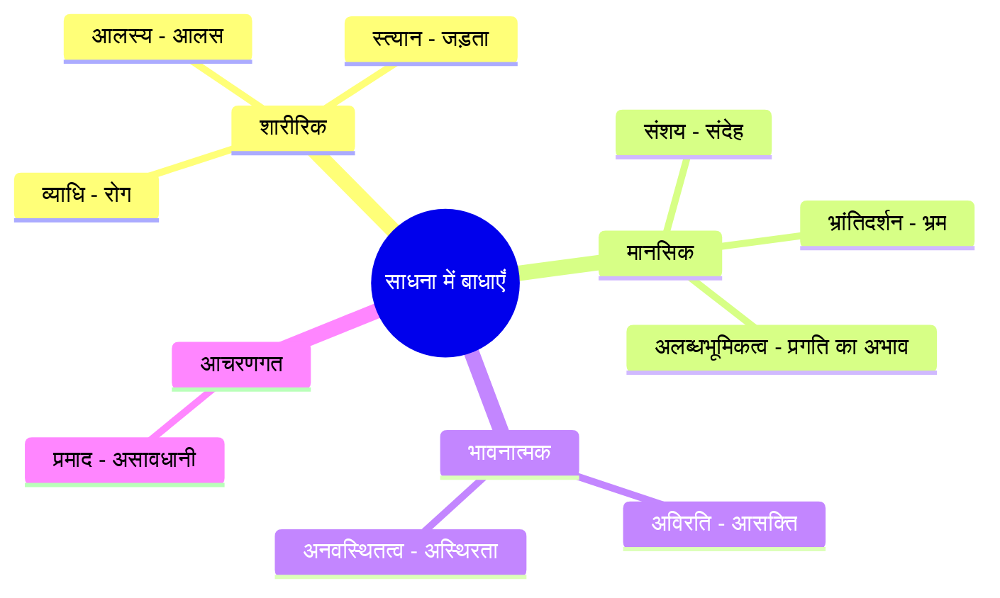
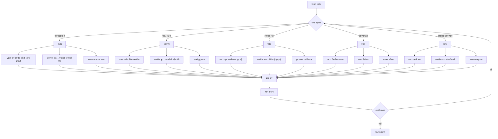
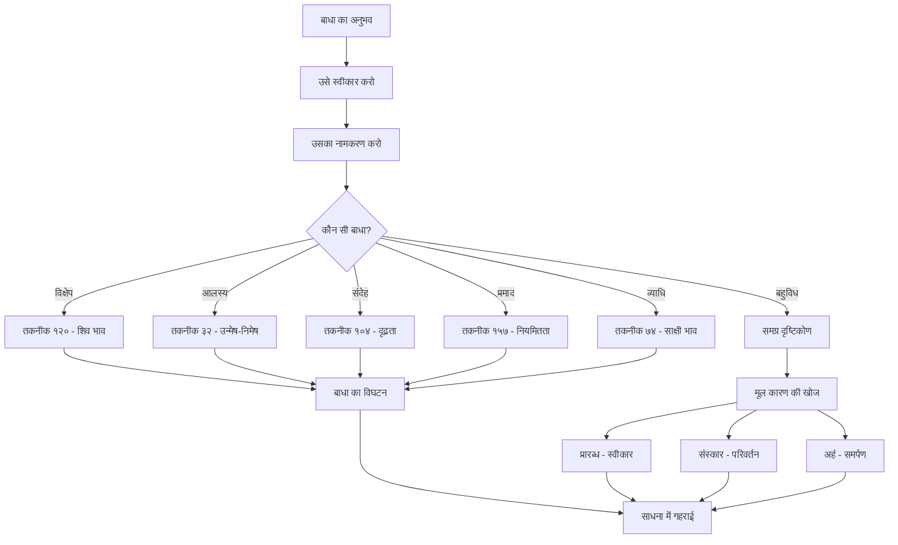

# अध्याय १३: साधना में बाधाएँ और समाधान

## सीखने के उद्देश्य (Learning Objectives)

इस अध्याय को पूरा करने के बाद, आप निम्नलिखित में सक्षम होंगे:

1. योग और तंत्र साधना में आने वाली प्रमुख बाधाओं (विक्षेप, आलस्य, संदेह, प्रमाद) को पहचानना और समझना
2. विज्ञान भैरव तंत्र में वर्णित विशिष्ट तकनीकों के माध्यम से इन बाधाओं के समाधान को आत्मसात करना
3. पतंजलि योग सूत्र में वर्णित बाधाओं और विज्ञान भैरव तंत्र के दृष्टिकोण के बीच समन्वय स्थापित करना
4. साधना में बाधाओं के निदान हेतु एक व्यवस्थित उपकरण (Diagnostic Tool) विकसित करना
5. दैनिक अभ्यास में बाधाओं को दूर करने के लिए व्यावहारिक रणनीतियाँ अपनाना
6. आधुनिक मनोविज्ञान और तंत्र परंपरा के बीच बाधा-समाधान के सामान्य सिद्धांतों को पहचानना

---

## प्रस्तावना

> *"साधना के पथ पर बाधाएँ अनिवार्य हैं। वे शत्रु नहीं, अपितु साधक की परीक्षा हैं। जो बाधाओं को पहचानता है, वही उन्हें पार करता है।"*
> — आचार्य अभिनवगुप्त (तंत्रालोक पर टीका)

साधना का मार्ग सरल नहीं है। विज्ञान भैरव तंत्र में ११२ ध्यान तकनीकों का वर्णन है, किन्तु इन तकनीकों का अभ्यास करते समय साधक को अनेक बाधाओं का सामना करना पड़ता है। ये बाधाएँ केवल बाह्य नहीं हैं, अपितु मुख्यतः आंतरिक हैं — मन की वृत्तियाँ, शारीरिक असमर्थताएँ, और भावनात्मक उतार-चढ़ाव।

पतंजलि योग सूत्र में नौ प्रमुख बाधाओं (अन्तराय) का उल्लेख है:

> *"व्याधि-स्त्यान-संशय-प्रमादालस्य-अविरति-भ्रान्तिदर्शन-अलब्धभूमिकत्व-अनवस्थितत्वानि चित्तविक्षेपास्तेऽन्तरायाः।"*
> — पतंजलि योग सूत्र १.३०

**अर्थ**: व्याधि (बीमारी), स्त्यान (मानसिक जड़ता), संशय (संदेह), प्रमाद (असावधानी), आलस्य (आलस), अविरति (इंद्रियासक्ति), भ्रांतिदर्शन (गलत धारणा), अलब्धभूमिकत्व (लक्ष्य तक न पहुँच पाना), और अनवस्थितत्व (स्थिरता का अभाव) — ये नौ चित्त के विक्षेप हैं और साधना में बाधाएँ हैं।

विज्ञान भैरव तंत्र इन बाधाओं को दूर करने के लिए विशिष्ट तकनीकें प्रदान करता है। यह अध्याय इन बाधाओं के स्वरूप, उनके कारण, और उनके समाधान का विस्तृत विवेचन प्रस्तुत करता है।

---

## १. साधना की प्रमुख बाधाएँ (Major Obstacles in Practice)

### १.१ विक्षेप (Distraction / Mental Agitation)

विक्षेप का अर्थ है — मन का इधर-उधर भटकना। यह साधना में सबसे सामान्य बाधा है।

**लक्षण**:
- ध्यान के दौरान मन लगातार विचारों में भटकता रहता है
- एक तकनीक पर स्थिर रहने में असमर्थता
- बाहरी उत्तेजनाओं से सहज विचलन
- मानसिक अशांति और बेचैनी

**विज्ञान भैरव तंत्र का समाधान**:

> *"यत्र यत्र मनो याति बाह्ये वाभ्यन्तरेऽथवा। तत्र तत्र शिवो भावस्तत्र तत्र समाविशेत्।।"*
> — विज्ञान भैरव तंत्र, श्लोक १२०

**भावार्थ**: जहाँ-जहाँ मन जाता है — चाहे बाहर या भीतर — वहाँ-वहाँ शिव (चेतना) का भाव रखते हुए, उसी में समा जाओ। मन को रोको मत, अपितु उसकी गति को ही चेतना में बदल दो।

### १.२ आलस्य (Laziness / Torpor)

आलस्य शारीरिक और मानसिक दोनों स्तरों पर होता है। यह साधना के प्रति उदासीनता और निष्क्रियता का रूप लेता है।

**लक्षण**:
- साधना के समय नींद आना
- नियमित अभ्यास में असमर्थता
- "बाद में करूँगा" का रवैया
- शारीरिक जड़ता और भारीपन

**विज्ञान भैरव तंत्र का समाधान**:

> *"उन्मेषनिमेषक्रमेण बलोद्धत्या भैरवीम्। प्रविश्य तरसा तेन बोधं बोधस्वरूपिणीम्।।"*
> — विज्ञान भैरव तंत्र, श्लोक ३२

**भावार्थ**: पलकों के खुलने और बंद होने की क्रिया के साथ तीव्रता से भैरवी शक्ति में प्रवेश करो। इस प्रकार तत्क्षण बोध (जागरूकता) के स्वरूप में स्थित हो जाओ।

यह तकनीक आलस्य को दूर करने के लिए उत्तम है — पलकों के झपकने की तीव्र गति से शरीर और मन में स्फूर्ति आती है।

### १.३ संदेह (Doubt / Uncertainty)

संदेह साधना के मार्ग में सबसे गहरी बाधा है। यह बुद्धि को अस्थिर करता है और साधक को निरंतर दुविधा में रखता है।

**लक्षण**:
- तकनीक की प्रभावशीलता पर संदेह
- "क्या मैं सही कर रहा हूँ?" की निरंतर चिंता
- गुरु और शास्त्रों पर अविश्वास
- एक तकनीक से दूसरी तकनीक पर बार-बार कूदना

**विज्ञान भैरव तंत्र का समाधान**:

> *"संदेहात्मा विनश्यति न संदिग्धः प्रवर्तते। संदेहस्य च शत्रुत्वान्निर्णयो हृदयं मतम्।।"*
> — विज्ञान भैरव तंत्र, श्लोक १५६

**भावार्थ**: संदेह से मनुष्य नष्ट होता है। संदिग्ध व्यक्ति आगे नहीं बढ़ पाता। संदेह शत्रु के समान है — इसलिए निर्णय को ही हृदय का सार मानो।

> तकनीक १०४: किसी भी एक तकनीक पर दृढ़ रहो — यदि एक तकनीक स्थिर रहती है तो वही पर्याप्त है।

### १.४ प्रमाद (Negligence / Carelessness)

प्रमाद का अर्थ है — असावधानी, लापरवाही, और अभ्यास में निरंतरता का अभाव।

**लक्षण**:
- नियमित अभ्यास में अनियमितता
- तकनीकों को पूरी शिद्दत से न करना
- साधना को हल्के में लेना
- समय की पाबंदी का अभाव

**विज्ञान भैरव तंत्र का समाधान**:

> *"यथासुखं यथा शक्ति यथौचित्येन साधकः। ध्यायेद्वा चिन्तयेद्वापि न प्रमादं समाचरेत्।।"*
> — विज्ञान भैरव तंत्र, श्लोक १५७

**भावार्थ**: साधक जितने भी आराम से, जितनी भी शक्ति के अनुसार, और जितनी भी योग्यता के अनुसार ध्यान करे — किन्तु प्रमाद (असावधानी) न करे।

### १.५ अन्य बाधाएँ

**व्याधि (Illness)**:
> *"रोगे व्याधौ भये क्लेशे निर्वेदे देहमध्यगः। उदासीनोऽखिलाधारं तदा तद्ब्रह्मणा समः।।"*
> — विज्ञान भैरव तंत्र, श्लोक ७४

**भावार्थ**: रोग, भय, क्लेश और निर्वेद (उदासी) में शरीर के मध्य में स्थित उदासीन (साक्षी) भाव में रहो — तब वह ब्रह्म के समान हो जाता है।

**अविरति (Sense Craving)**:
> *"भावे चित्तीकृतिं कृत्वा विषयेषु निवेशयेत्। विषयात्मकतां यातो भैरवो जायते ध्रुवम्।।"*
> — विज्ञान भैरव तंत्र, श्लोक ७५

---

## २. बाधाओं का वर्गीकरण (Classification of Obstacles)

### २.१ पतंजलि का नव-अन्तराय सिद्धांत



### २.२ बाधा-समाधान मानचित्रण (Obstacle-Solution Mapping)



### २.३ बाधाओं की त्रि-स्तरीय संरचना

```mermaid
flowchart LR
    subgraph बाह्य[बाह्य बाधाएँ]
        A1[स्थान - शांत न होना]
        A2[समय - अभाव]
        A3[संगति - प्रतिकूल वातावरण]
    end
    
    subgraph आंतरिक[आंतरिक बाधाएँ]
        B1[मन - विक्षेप]
        B2[भावना - क्लेश]
        B3[बुद्धि - संदेह]
    end
    
    subgraph गहन[गहन बाधाएँ]
        C1[प्रारब्ध - पूर्व संस्कार]
        C2[कुंडलिनी - असंतुलन]
        C3[अहं - विघटन का भय]
    end
    
    बाह्य --> आंतरिक
    आंतरिक --> गहन
```

---

## ३. प्रमुख तकनीकें: बाधा-निवारण हेतु विशिष्ट प्रयोग

### ३.१ विक्षेप के लिए तकनीक (तकनीक १२०)

> *"यत्र यत्र मनो याति बाह्ये वाभ्यन्तरेऽथवा। तत्र तत्र शिवो भावस्तत्र तत्र समाविशेत्।।"*

**अभ्यास विधि**:

1. किसी शांत स्थान पर बैठें।
2. आँखें बंद करें और सामान्य रूप से साँस लें।
3. मन को पूरी स्वतंत्रता दें — वह जहाँ भी जाए, उसे जाने दें।
4. किन्तु जहाँ भी मन जाए, वहाँ शिव की उपस्थिति का अनुभव करें।
5. मन किसी विचार पर जाए — उस विचार को शिव की अभिव्यक्ति मानें।
6. मन किसी ध्वनि पर जाए — उसे शिव की ध्वनि मानें।
7. धीरे-धीरे मन शांत होगा और स्वयं ही शिव में विलीन हो जाएगा।

**सिद्धि चिह्न**: जब मन जहाँ भी जाता है, वहाँ शिव ही शिव दिखते हैं — यह विक्षेप के अंत का चिह्न है।

### ३.२ आलस्य के लिए तकनीक (तकनीक ३२)

> *"उन्मेषनिमेषक्रमेण बलोद्धत्या भैरवीम्। प्रविश्य तरसा तेन बोधं बोधस्वरूपिणीम्।।"*

**अभ्यास विधि**:

1. पद्मासन या सुखासन में बैठें। रीढ़ सीधी रखें।
2. आँखें सामान्य रूप से खुली रखें।
3. अब बहुत तीव्रता से पलकों को झपकाना शुरू करें — जितनी तेज़ी से हो सके।
4. लगभग १५-२० सेकंड तक ऐसा करें।
5. फिर अचानक रुक जाएँ और आँखें बंद कर लें।
6. भीतर जो उर्जा (स्पंदन) महसूस हो, उसमें समा जाएँ।
7. इस स्पंदन को भैरवी शक्ति का प्रकटीकरण मानें।

**चेतावनी**: यह तकनीक बहुत शक्तिशाली है। आलस्य दूर होने पर इसे रोक दें और सामान्य ध्यान में लौट जाएँ।

### ३.३ संदेह के लिए तकनीक (तकनीक १०४)

> *"निर्विचारः स्थिरीभूतः स्वयं विश्रान्त आत्मनि। निरालम्बस्तदा सौख्याद्भैरवो जायते प्रभुः।।"*

**अभ्यास विधि**:

1. एक सरल ध्यान तकनीक चुनें — जैसे श्वास पर ध्यान।
2. उसी पर दृढ़ रहें। कोई अन्य तकनीक न आज़माएँ।
3. संदेह आए तो उसका अवलोकन करें — उसमें शामिल न हों।
4. संदेह को एक विचार मात्र मानें — वास्तविकता नहीं।
5. कम से कम २१ दिन तक एक ही तकनीक का अभ्यास करें।
6. २१ दिन बाद परिणाम का मूल्यांकन करें।

### ३.४ प्रमाद के लिए तकनीक (तकनीक १५७)

> *"यथासुखं यथा शक्ति यथौचित्येन साधकः। ध्यायेद्वा चिन्तयेद्वापि न प्रमादं समाचरेत्।।"*

**अभ्यास विधि**:

1. प्रतिदिन एक निश्चित समय और स्थान पर साधना करें।
2. साधना की अवधि निश्चित करें — कम से कम १५ मिनट।
3. एक साधना पत्रिका (Practice Journal) रखें।
4. प्रतिदिन अभ्यास के बाद २-३ वाक्य लिखें।
5. यदि एक दिन भी छूटे, तो उसका कारण लिखें और अगले दिन पुनः आरंभ करें।

### ३.५ समग्र बाधा-निवारण तकनीक



---

## ४. योग सूत्र और विज्ञान भैरव तंत्र: तुलनात्मक विश्लेषण

| बाधा | पतंजलि समाधान | VBT समाधान | आधुनिक समतुल्य |
|------|---------------|-------------|-----------------|
| विक्षेप | एकाग्रता अभ्यास | मन की गति को ही शिव मानो | Mindfulness |
| आलस्य | प्राणायाम, तपस्या | उन्मेष-निमेष तीव्र तकनीक | Activation Techniques |
| संदेह | ईश्वर प्रणिधान | निर्णय ही हृदय है | Commitment Therapy |
| प्रमाद | स्वाध्याय | नियमित पत्रिका | Habit Tracking |
| व्याधि | आसन, प्राणायाम | साक्षी भाव | Body Scan |
| अविरति | वैराग्य अभ्यास | विषय में शिव दर्शन | Mindful Indulgence |
| भ्रांतिदर्शन | विवेक ख्याति | प्रत्यभिज्ञा दर्शन | Cognitive Restructuring |

---

## ५. TypeScript कार्यान्वयन: साधना बाधा निदान उपकरण

```typescript
/**
 * साधना बाधा निदान उपकरण (Sadhana Obstacle Diagnostic Tool)
 * 
 * यह उपकरण साधक को उनकी साधना में आने वाली बाधाओं की पहचान करने
 * और उनके समाधान के लिए VBT तकनीकों का सुझाव देने में सहायता करता है।
 * 
 * @package VigyanBhairavTantra
 * @author Course Development Team
 * @version 1.0.0
 */

// === मुख्य प्रकार (Types) ===

interface ObstacleProfile {
    obstacles: IdentifiedObstacle[];
    dominantObstacle: ObstacleType;
    severityScore: number;
    duration: number; // days of practice
}

interface IdentifiedObstacle {
    type: ObstacleType;
    name: string;
    nameSanskrit: string;
    severity: 1 | 2 | 3 | 4 | 5;
    frequency: 'rare' | 'sometimes' | 'often' | 'always';
    symptoms: string[];
    suggestedTechnique: SuggestedTechnique;
}

interface SuggestedTechnique {
    id: number;
    sanskritShloka: string;
    hindiInstruction: string;
    duration: number; // minutes
    contraindications: string[];
}

type ObstacleType = 
    | 'vikshepa'      // विक्षेप
    | 'alasya'        // आलस्य
    | 'sandeha'       // संदेह
    | 'pramada'       // प्रमाद
    | 'vyadhi'        // व्याधि
    | 'avirati'       // अविरति
    | 'bhranti'       // भ्रांतिदर्शन
    | 'alabdhabhumikatva' // अलब्धभूमिकत्व
    | 'anavasthitatva';   // अनवस्थितत्व

// === बाधा डेटाबेस ===

const OBSTACLE_DATABASE: Record<ObstacleType, Omit<IdentifiedObstacle, 'severity' | 'frequency'>> = {
    vikshepa: {
        type: 'vikshepa',
        name: 'विक्षेप',
        nameSanskrit: 'विक्षेपः',
        symptoms: ['ध्यान में मन भटकता है', 'एकाग्रता नहीं रहती', 'बार-बार विचार आते हैं', 'बेचैनी महसूस होती है'],
        suggestedTechnique: {
            id: 120,
            sanskritShloka: 'यत्र यत्र मनो याति बाह्ये वाभ्यन्तरेऽथवा। तत्र तत्र शिवो भावस्तत्र तत्र समाविशेत्।।',
            hindiInstruction: 'मन जहाँ जाए, वहाँ शिव का भाव रखें और उसी में समा जाएँ। मन को रोकने का प्रयास न करें।',
            duration: 20,
            contraindications: ['गंभीर चिंता विकार में सावधानी']
        }
    },
    alasya: {
        type: 'alasya',
        name: 'आलस्य',
        nameSanskrit: 'आलस्यम्',
        symptoms: ['नींद आती है', 'साधना में मन नहीं लगता', 'शरीर भारी लगता है', 'बहाने बनाते हैं'],
        suggestedTechnique: {
            id: 32,
            sanskritShloka: 'उन्मेषनिमेषक्रमेण बलोद्धत्या भैरवीम्। प्रविश्य तरसा तेन बोधं बोधस्वरूपिणीम्।।',
            hindiInstruction: 'पलकों को तीव्रता से झपकाएँ १५-२० सेकंड, फिर अचानक रुकें और भीतर के स्पंदन में समा जाएँ।',
            duration: 5,
            contraindications: ['नेत्र रोग में न करें', 'मिर्गी में सावधानी']
        }
    },
    sandeha: {
        type: 'sandeha',
        name: 'संदेह',
        nameSanskrit: 'संशयः',
        symptoms: ['तकनीक पर विश्वास नहीं', 'क्या सही कर रहा हूँ?', 'बार-बार तकनीक बदलना', 'गुरु पर अविश्वास'],
        suggestedTechnique: {
            id: 104,
            sanskritShloka: 'निर्विचारः स्थिरीभूतः स्वयं विश्रान्त आत्मनि। निरालम्बस्तदा सौख्याद्भैरवो जायते प्रभुः।।',
            hindiInstruction: 'एक तकनीक चुनें और २१ दिन उसी पर दृढ़ रहें। संदेह का अवलोकन करें, उसमें शामिल न हों।',
            duration: 15,
            contraindications: []
        }
    },
    pramada: {
        type: 'pramada',
        name: 'प्रमाद',
        nameSanskrit: 'प्रमादः',
        symptoms: ['नियमित नहीं', 'समय पर नहीं बैठते', 'जल्दी उठ जाते हैं', 'पूरी शिद्दत से नहीं करते'],
        suggestedTechnique: {
            id: 157,
            sanskritShloka: 'यथासुखं यथा शक्ति यथौचित्येन साधकः। ध्यायेद्वा चिन्तयेद्वापि न प्रमादं समाचरेत्।।',
            hindiInstruction: 'नियत समय पर बैठें। साधना पत्रिका रखें। प्रतिदिन कम से कम १५ मिनट का अभ्यास अनिवार्य करें।',
            duration: 15,
            contraindications: []
        }
    },
    vyadhi: {
        type: 'vyadhi',
        name: 'व्याधि',
        nameSanskrit: 'व्याधिः',
        symptoms: ['शारीरिक अस्वस्थता', 'पुराना रोग', 'दर्द', 'थकान'],
        suggestedTechnique: {
            id: 74,
            sanskritShloka: 'रोगे व्याधौ भये क्लेशे निर्वेदे देहमध्यगः। उदासीनोऽखिलाधारं तदा तद्ब्रह्मणा समः।।',
            hindiInstruction: 'रोग या दर्द में शरीर के मध्य में साक्षी भाव में रहें। दर्द को देखें, उससे पहचान न बनाएँ।',
            duration: 10,
            contraindications: ['गंभीर रोग में चिकित्सक से परामर्श आवश्यक']
        }
    },
    avirati: {
        type: 'avirati',
        name: 'अविरति',
        nameSanskrit: 'अविरतिः',
        symptoms: ['इंद्रिय सुखों में आसक्ति', 'विषय-भोग की लालसा', 'ध्यान में कामुक विचार', 'त्याग में कठिनाई'],
        suggestedTechnique: {
            id: 75,
            sanskritShloka: 'भावे चित्तीकृतिं कृत्वा विषयेषु निवेशयेत्। विषयात्मकतां यातो भैरवो जायते ध्रुवम्।।',
            hindiInstruction: 'इंद्रिय विषयों का त्याग न करें, अपितु उनमें चेतना का भाव देखें। विषय में ही शिव का दर्शन करें।',
            duration: 15,
            contraindications: []
        }
    },
    bhranti: {
        type: 'bhranti',
        name: 'भ्रांतिदर्शन',
        nameSanskrit: 'भ्रान्तिदर्शनम्',
        symptoms: ['ध्यान में अद्भुत अनुभव', 'मैं विशेष हूँ का भाव', 'सिद्धियों का मोह', 'गलत धारणाएँ'],
        suggestedTechnique: {
            id: 91,
            sanskritShloka: 'यत्र क्वचिद्वा स्थातव्यं भावयेत्स्वात्मनि स्थितः। निष्कलं निर्मलं शुद्धं तद्ब्रह्मास्तीति पश्यति।।',
            hindiInstruction: 'सभी अनुभवों को कल्पना मात्र मानें। केवल निष्कल, निर्मल चेतना को ही सत्य मानें।',
            duration: 10,
            contraindications: ['मानसिक रोगी न करें']
        }
    },
    alabdhabhumikatva: {
        type: 'alabdhabhumikatva',
        name: 'अलब्धभूमिकत्व',
        nameSanskrit: 'अलब्धभूमिकत्वम्',
        symptoms: ['प्रगति नहीं दिखती', 'ठहराव महसूस होता है', 'कोई अनुभव नहीं होता', 'निराशा'],
        suggestedTechnique: {
            id: 48,
            sanskritShloka: 'न निषेधो न चोत्पत्तिर्न बन्धो न च साधनम्। ऐतरेयश्रुतिर्यस्य निर्वाणं तस्य सर्वदा।।',
            hindiInstruction: 'प्रगति का माप छोड़ दें। साधना स्वयं ही लक्ष्य है। बिना किसी अपेक्षा के अभ्यास करें।',
            duration: 20,
            contraindications: []
        }
    },
    anavasthitatva: {
        type: 'anavasthitatva',
        name: 'अनवस्थितत्व',
        nameSanskrit: 'अनवस्थितत्वम्',
        symptoms: ['स्थिर नहीं बैठ पाते', 'बार-बार आसन बदलते हैं', 'अधीरता', 'जल्दी उठ जाते हैं'],
        suggestedTechnique: {
            id: 43,
            sanskritShloka: 'किं बीजं किं फलं वेति न चिन्त्यं भैरवे मनः। अचिन्त्ये निश्चलो भूत्वा चिन्तयेद्भैरवं हृदि।।',
            hindiInstruction: 'शरीर को पूरी तरह स्थिर करें। चाहे जैसा भी लगे, हिलें नहीं। इसी स्थिरता में भैरव को हृदय में अनुभव करें।',
            duration: 10,
            contraindications: ['गंभीर पीठ दर्द में सावधानी']
        }
    }
};

// === बाधा निदान प्रणाली ===

class SadhanaObstacleDiagnostic {
    private userProfile: ObstacleProfile;
    private readonly symptomsChecklist: Map<ObstacleType, string[]>;

    constructor(userProfile?: Partial<ObstacleProfile>) {
        this.userProfile = {
            obstacles: [],
            dominantObstacle: 'vikshepa',
            severityScore: 0,
            duration: 0,
            ...userProfile
        };

        this.symptomsChecklist = new Map();
        for (const [type, data] of Object.entries(OBSTACLE_DATABASE)) {
            this.symptomsChecklist.set(type as ObstacleType, data.symptoms);
        }
    }

    /**
     * लक्षणों के आधार पर बाधा का निदान करें
     */
    diagnoseFromSymptoms(userSymptoms: string[]): IdentifiedObstacle[] {
        const matchedObstacles: IdentifiedObstacle[] = [];

        for (const [type, data] of Object.entries(OBSTACLE_DATABASE)) {
            const commonSymptoms = data.symptoms.filter(s => 
                userSymptoms.some(us => us.toLowerCase().includes(s.toLowerCase()))
            );

            if (commonSymptoms.length > 0) {
                const severity = Math.min(commonSymptoms.length + 1, 5) as 1 | 2 | 3 | 4 | 5;
                matchedObstacles.push({
                    ...data,
                    severity,
                    frequency: this.calculateFrequency(severity)
                });
            }
        }

        this.userProfile.obstacles = matchedObstacles;
        this.userProfile.severityScore = matchedObstacles.reduce((sum, o) => sum + o.severity, 0);

        if (matchedObstacles.length > 0) {
            this.userProfile.dominantObstacle = matchedObstacles
                .sort((a, b) => b.severity - a.severity)[0].type;
        }

        return matchedObstacles;
    }

    /**
     * प्रश्नावली के आधार पर निदान
     */
    diagnoseFromQuestionnaire(answers: QuestionnaireAnswer[]): DiagnosticResult {
        const obstacleScores: Record<ObstacleType, number> = {
            vikshepa: 0,
            alasya: 0,
            sandeha: 0,
            pramada: 0,
            vyadhi: 0,
            avirati: 0,
            bhranti: 0,
            alabdhabhumikatva: 0,
            anavasthitatva: 0
        };

        for (const answer of answers) {
            const mapping = this.getQuestionMapping(answer.questionId);
            if (mapping) {
                obstacleScores[mapping.obstacleType] += answer.score * mapping.weight;
            }
        }

        const dominantType = Object.entries(obstacleScores)
            .sort(([, a], [, b]) => b - a)[0][0] as ObstacleType;

        const identifiedObstacles: IdentifiedObstacle[] = [];
        for (const [type, score] of Object.entries(obstacleScores)) {
            if (score > 5) {
                const data = OBSTACLE_DATABASE[type as ObstacleType];
                identifiedObstacles.push({
                    ...data,
                    severity: Math.min(Math.ceil(score / 3), 5) as 1 | 2 | 3 | 4 | 5,
                    frequency: score > 12 ? 'always' : score > 8 ? 'often' : 'sometimes'
                });
            }
        }

        const result: DiagnosticResult = {
            dominantObstacle: OBSTACLE_DATABASE[dominantType],
            allObstacles: identifiedObstacles.sort((a, b) => b.severity - a.severity),
            severityScore: identifiedObstacles.reduce((s, o) => s + o.severity, 0),
            recommendedSequence: this.buildSequence(dominantType, identifiedObstacles)
        };

        this.userProfile.obstacles = result.allObstacles;
        this.userProfile.dominantObstacle = dominantType;
        this.userProfile.severityScore = result.severityScore;

        return result;
    }

    /**
     * उपचार क्रम बनाएँ
     */
    private buildSequence(
        dominantType: ObstacleType, 
        allObstacles: IdentifiedObstacle[]
    ): PracticeSequence[] {
        const sequence: PracticeSequence[] = [];
        
        // पहला कदम: प्रमुख बाधा का समाधान
        const dominant = OBSTACLE_DATABASE[dominantType];
        sequence.push({
            step: 1,
            obstacleType: dominantType,
            technique: dominant.suggestedTechnique,
            durationMinutes: dominant.suggestedTechnique.duration,
            objective: `${dominant.name} का समाधान`
        });

        // दूसरा कदम: अन्य बाधाओं का समाधान
        let step = 2;
        for (const obstacle of allObstacles) {
            if (obstacle.type !== dominantType) {
                sequence.push({
                    step: step++,
                    obstacleType: obstacle.type,
                    technique: obstacle.suggestedTechnique,
                    durationMinutes: obstacle.suggestedTechnique.duration,
                    objective: `${obstacle.name} का समाधान`
                });
            }
        }

        // अंतिम कदम: समग्र ध्यान
        sequence.push({
            step: step,
            obstacleType: 'vikshepa',
            technique: {
                id: 0,
                sanskritShloka: 'सर्वे बाधा विनिर्मुक्तः शुद्धचेतनस्वरूपिणे। नमो भैरव देवाय परमानन्दरूपिणे।।',
                hindiInstruction: 'सभी बाधाओं से मुक्त होकर अपने शुद्ध चेतना स्वरूप में स्थित हों।',
                duration: 10,
                contraindications: []
            },
            durationMinutes: 10,
            objective: 'समग्र शांति और एकीकरण'
        });

        return sequence;
    }

    /**
     * दैनिक अभ्यास योजना उत्पन्न करें
     */
    generateDailyPracticePlan(): DailyPlan {
        const dominant = OBSTACLE_DATABASE[this.userProfile.dominantObstacle];
        const morningPractice: PracticeSlot = {
            time: 'सुबह ६:००-६:३०',
            technique: dominant.suggestedTechnique,
            duration: dominant.suggestedTechnique.duration,
            preparation: ['आसन ग्रहण करें', 'रीढ़ सीधी रखें', '३ गहरी साँस लें']
        };

        const noonPractice: PracticeSlot = {
            time: 'दोपहर १२:००-१२:१५',
            technique: {
                id: 24,
                sanskritShloka: 'मध्ये नाड्योः प्राणशक्त्या द्वादशान्ते मनः क्षिपेत्। प्राणे शान्ते तदा शान्तिर्भैरवी परमोदया।।',
                hindiInstruction: 'दोनों नासिकाओं के मध्य में प्राण शक्ति को द्वादशांत (सिर के ऊपर) में फेंकें। प्राण शांत होने पर परम शांति प्राप्त होती है।',
                duration: 15,
                contraindications: []
            },
            duration: 15,
            preparation: ['नेत्र बंद करें', 'श्वास पर ध्यान दें']
        };

        return {
            date: new Date(),
            dominantObstacle: this.userProfile.dominantObstacle,
            practices: [morningPractice, noonPractice],
            totalDuration: morningPractice.duration + noonPractice.duration,
            notes: ''
        };
    }

    /**
     * उपचार प्रगति को ट्रैक करें
     */
    trackProgress(
        weekData: { day: number; practiceCompleted: boolean; symptomReduction: number }[]
    ): ProgressReport {
        const completionRate = weekData.filter(d => d.practiceCompleted).length / weekData.length * 100;
        const avgSymptomReduction = weekData.reduce((s, d) => s + d.symptomReduction, 0) / weekData.length;

        return {
            weekEnding: new Date(),
            completionRate,
            avgSymptomReduction,
            dominantObstacle: this.userProfile.dominantObstacle,
            recommendation: completionRate > 80 
                ? 'उत्कृष्ट! बाधा कम हो रही है। अगले स्तर की तकनीक पर जाएँ।'
                : completionRate > 60
                ? 'अच्छा प्रयास है। नियमितता बढ़ाएँ।'
                : 'कृपया अभ्यास बढ़ाएँ। छोटी अवधि से शुरू करें।'
        };
    }

    private calculateFrequency(severity: number): 'rare' | 'sometimes' | 'often' | 'always' {
        if (severity <= 2) return 'rare';
        if (severity <= 3) return 'sometimes';
        if (severity <= 4) return 'often';
        return 'always';
    }

    private getQuestionMapping(questionId: string): { obstacleType: ObstacleType; weight: number } | null {
        const mappings: Record<string, { obstacleType: ObstacleType; weight: number }> = {
            'q_mind_wandering': { obstacleType: 'vikshepa', weight: 2 },
            'q_fatigue': { obstacleType: 'alasya', weight: 2 },
            'q_doubt': { obstacleType: 'sandeha', weight: 3 },
            'q_irregularity': { obstacleType: 'pramada', weight: 2 },
            'q_health': { obstacleType: 'vyadhi', weight: 1 },
            'q_attachment': { obstacleType: 'avirati', weight: 2 },
            'q_delusion': { obstacleType: 'bhranti', weight: 3 },
            'q_stagnation': { obstacleType: 'alabdhabhumikatva', weight: 2 },
            'q_restlessness': { obstacleType: 'anavasthitatva', weight: 2 }
        };
        return mappings[questionId] || null;
    }
}

// === सहायक प्रकार ===

interface QuestionnaireAnswer {
    questionId: string;
    score: 0 | 1 | 2 | 3 | 4 | 5;
    timestamp: Date;
}

interface DiagnosticResult {
    dominantObstacle: Omit<IdentifiedObstacle, 'severity' | 'frequency'>;
    allObstacles: IdentifiedObstacle[];
    severityScore: number;
    recommendedSequence: PracticeSequence[];
}

interface PracticeSequence {
    step: number;
    obstacleType: ObstacleType;
    technique: SuggestedTechnique;
    durationMinutes: number;
    objective: string;
}

interface DailyPlan {
    date: Date;
    dominantObstacle: ObstacleType;
    practices: PracticeSlot[];
    totalDuration: number;
    notes: string;
}

interface PracticeSlot {
    time: string;
    technique: SuggestedTechnique;
    duration: number;
    preparation: string[];
}

interface ProgressReport {
    weekEnding: Date;
    completionRate: number;
    avgSymptomReduction: number;
    dominantObstacle: ObstacleType;
    recommendation: string;
}

// === उपयोग उदाहरण ===

function demonstrateObstacleDiagnostic(): void {
    console.log('=== साधना बाधा निदान उपकरण ===');
    console.log('=== Sadhana Obstacle Diagnostic Tool ===\n');

    // निदानकर्ता बनाएँ
    const diagnostic = new SadhanaObstacleDiagnostic({
        duration: 30
    });

    // उपयोगकर्ता लक्षण
    const userSymptoms = [
        'ध्यान में मन बहुत भटकता है',
        'एकाग्रता नहीं रहती',
        'नींद आती है',
        'बार-बार तकनीक बदलता हूँ'
    ];

    console.log('उपयोगकर्ता लक्षण (User Symptoms):');
    userSymptoms.forEach(s => console.log(`  • ${s}`));
    console.log();

    // निदान
    const result = diagnostic.diagnoseFromSymptoms(userSymptoms);
    
    console.log('पहचानी गई बाधाएँ (Identified Obstacles):');
    result.forEach((obstacle, index) => {
        console.log(`  ${index + 1}. ${obstacle.name} (${obstacle.nameSanskrit})`);
        console.log(`     गंभीरता: ${obstacle.severity}/5, आवृत्ति: ${obstacle.frequency}`);
        console.log(`     सुझाई गई तकनीक #${obstacle.suggestedTechnique.id}`);
        console.log(`     श्लोक: ${obstacle.suggestedTechnique.sanskritShloka}`);
        console.log(`     निर्देश: ${obstacle.suggestedTechnique.hindiInstruction}`);
        console.log();
    });

    // दैनिक योजना
    const plan = diagnostic.generateDailyPracticePlan();
    console.log('दैनिक अभ्यास योजना (Daily Practice Plan):');
    plan.practices.forEach(p => {
        console.log(`  ${p.time}: तकनीक #${p.technique.id} - ${p.duration} मिनट`);
    });
    console.log(`  कुल समय: ${plan.totalDuration} मिनट\n`);

    // प्रगति रिपोर्ट
    const weekData = Array.from({ length: 7 }, (_, i) => ({
        day: i + 1,
        practiceCompleted: Math.random() > 0.2,
        symptomReduction: Math.floor(Math.random() * 40) + 10
    }));

    const progress = diagnostic.trackProgress(weekData);
    console.log('प्रगति रिपोर्ट (Progress Report):');
    console.log(`  सप्ताह समाप्ति: ${progress.weekEnding.toLocaleDateString('hi-IN')}`);
    console.log(`  पूर्णता दर: ${progress.completionRate.toFixed(1)}%`);
    console.log(`  औसत लक्षण कमी: ${progress.avgSymptomReduction.toFixed(1)}%`);
    console.log(`  सुझाव: ${progress.recommendation}`);
}

demonstrateObstacleDiagnostic();

export { 
    SadhanaObstacleDiagnostic, 
    OBSTACLE_DATABASE,
    type ObstacleProfile, 
    type IdentifiedObstacle, 
    type ObstacleType,
    type DiagnosticResult,
    type DailyPlan,
    type ProgressReport
};
```

---

## ६. बाधाओं पर विजय के आठ सूत्र (Eight Principles for Overcoming Obstacles)

### सूत्र १: स्वीकार (Acceptance)
बाधा को पहले स्वीकार करें। उससे लड़ें नहीं। जब आप बाधा को स्वीकार करते हैं, तो उसकी शक्ति कम हो जाती है।

### सूत्र २: साक्षी भाव (Witnessing)
बाधा को देखें, उससे तादात्म्य न बनाएँ। "मैं आलस्य में हूँ" न कहें, अपितु "आलस्य की वृत्ति उठ रही है" देखें।

### सूत्र ३: परिवर्तन (Transformation)
बाधा की ऊर्जा को ही साधना में बदलें। क्रोध को चेतना में, वासना को ध्यान में, भय को समर्पण में परिवर्तित करें।

### सूत्र ४: नियमितता (Regularity)
नियमित अभ्यास से बाधाएँ स्वतः कम होती हैं। जैसे नदी नियमित बहने से अपना मार्ग स्वयं बनाती है।

### सूत्र ५: गुरु-मार्गदर्शन (Guru Guidance)
बाधाएँ आने पर गुरु या अनुभवी साधक से मार्गदर्शन लें। स्वयं निर्णय लेने में भ्रम हो सकता है।

### सूत्र ६: शास्त्र-अध्ययन (Scripture Study)
विज्ञान भैरव तंत्र और अन्य शास्त्रों का नियमित अध्ययन करें। शास्त्र में बाधाओं के समाधान पहले से वर्णित हैं।

### सूत्र ७: प्राणायाम (Pranayama)
बाधा आने पर प्राणायाम करें। प्राण की शुद्धि से मन की अशुद्धियाँ स्वतः दूर होती हैं।

### सूत्र ८: समर्पण (Surrender)
अंततः सब परम शिव को समर्पित कर दें। "मैं नहीं, तू ही कर रहा है" — इस भाव से साधना करें।

---

## ७. आधुनिक मनोविज्ञान और VBT बाधा-समाधान

| आधुनिक अवधारणा | VBT समतुल्य | अनुप्रयोग |
|----------------|-------------|-----------|
| Cognitive Defusion | साक्षी भाव | विचारों को देखना, उनमें न उलझना |
| Exposure Therapy | भय में समाना | भय का सामना, उसमें विलीन होना |
| Habit Stacking | नियमितता सूत्र | मौजूदा आदतों के साथ साधना को जोड़ना |
| Acceptance & Commitment | स्वीकार सूत्र | बाधा को स्वीकार, उसके बावजूद साधना |
| Somatic Therapy | शरीर-ध्यान | शारीरिक संवेदनाओं के माध्यम से उपचार |
| Mindfulness MBSR | VBT तकनीक १२० | मन की गति पर ध्यान का प्रशिक्षण |

---

## सारांश (Summary)

इस अध्याय में हमने विज्ञान भैरव तंत्र और पतंजलि योग सूत्र के आलोक में साधना में आने वाली बाधाओं का विस्तृत अध्ययन किया। नौ प्रमुख बाधाओं — विक्षेप, आलस्य, संदेह, प्रमाद, व्याधि, अविरति, भ्रांतिदर्शन, अलब्धभूमिकत्व, और अनवस्थितत्व — का VBT के दृष्टिकोण से समाधान प्रस्तुत किया गया।

प्रमुख निष्कर्ष:
1. बाधाएँ शत्रु नहीं, अपितु मार्गदर्शक हैं — वह दिखाती हैं कि हमें कहाँ ध्यान देने की आवश्यकता है।
2. VBT बाधाओं को दबाने या त्यागने का नहीं, अपितु उन्हें चेतना में परिवर्तित करने का मार्ग सिखाता है।
3. प्रत्येक बाधा के लिए VBT में विशिष्ट तकनीक उपलब्ध है।
4. नियमित अभ्यास और साक्षी भाव — दो सबसे महत्वपूर्ण उपकरण हैं।
5. TypeScript Sadhana Obstacle Diagnostic Tool साधक को उनकी बाधाओं की पहचान और समाधान में सहायक है।

> *"बाधा ही मार्ग है। जहाँ बाधा है, वहीं द्वार है।"*

---

## अध्याय प्रश्नोत्तरी (Chapter Quiz)

### खंड १: बहुविकल्पीय प्रश्न (Multiple Choice Questions)

**प्रश्न १**: पतंजलि योग सूत्र के अनुसार चित्त के विक्षेप (अन्तराय) कितने हैं?
- क) ७
- ख) ९
- ग) ११
- घ) १२

> **उत्तर**: ख) ९ — पतंजलि योग सूत्र १.३० में नौ अन्तरायों का वर्णन है।

**प्रश्न २**: विक्षेप (Distraction) के समाधान के लिए VBT की कौन सी तकनीक सर्वोत्तम है?
- क) तकनीक ३२
- ख) तकनीक १२०
- ग) तकनीक ७४
- घ) तकनीक १५७

> **उत्तर**: ख) तकनीक १२० — 'यत्र यत्र मनो याति' — मन जहाँ जाए वहाँ शिव का भाव रखना।

**प्रश्न ३**: आलस्य दूर करने के लिए किस तकनीक में पलकों की तीव्र गति का उपयोग किया जाता है?
- क) तकनीक ४३
- ख) तकनीक ७५
- ग) तकनीक ३२
- घ) तकनीक ९१

> **उत्तर**: ग) तकनीक ३२ — उन्मेषनिमेषक्रमेण तकनीक।

**प्रश्न ४**: 'प्रमाद' का अर्थ क्या है?
- क) संदेह
- ख) आलस्य
- ग) असावधानी
- घ) भ्रम

> **उत्तर**: ग) असावधानी या लापरवाही।

**प्रश्न ५**: संदेह के समाधान में VBT कितने दिनों तक एक तकनीक पर दृढ़ रहने का सुझाव देता है?
- क) ७ दिन
- ख) ११ दिन
- ग) २१ दिन
- घ) ४० दिन

> **उत्तर**: ग) २१ दिन — कम से कम २१ दिन तक एक तकनीक पर दृढ़ रहना।

**प्रश्न ६**: 'व्याधि' बाधा के लिए VBT की कौन सी तकनीक सुझाई गई है?
- क) तकनीक ३२
- ख) तकनीक ७४
- ग) तकनीक १०४
- घ) तकनीक १२०

> **उत्तर**: ख) तकनीक ७४ — रोग में देहमध्य में साक्षी भाव।

**प्रश्न ७**: 'अविरति' बाधा का अर्थ क्या है?
- क) इंद्रियासक्ति
- ख) अनियमितता
- ग) अस्थिरता
- घ) निराशा

> **उत्तर**: क) इंद्रियासक्ति — विषय-भोग में आसक्ति।

**प्रश्न ८**: VBT में बाधाओं को किस रूप में देखा गया है?
- क) शत्रु
- ख) परीक्षा और मार्गदर्शक
- ग) दैवी दंड
- घ) उपेक्षणीय

> **उत्तर**: ख) परीक्षा और मार्गदर्शक — बाधाएँ साधक की परीक्षा हैं और मार्ग दिखाती हैं।

**प्रश्न ९**: निम्नलिखित में से कौन सी बाधा पतंजलि के नौ अन्तरायों में शामिल नहीं है?
- क) व्याधि
- ख) संशय
- ग) अहंकार
- घ) प्रमाद

> **उत्तर**: ग) अहंकार — अहंकार नौ अन्तरायों में शामिल नहीं है।

**प्रश्न १०**: VBT के 'बाधा-समाधान के आठ सूत्रों' में पहला सूत्र क्या है?
- क) संघर्ष
- ख) स्वीकार
- ग) त्याग
- घ) प्रार्थना

> **उत्तर**: ख) स्वीकार (Acceptance) — बाधा को पहले स्वीकार करें।

---

## अभ्यास (Exercises)

### अभ्यास १: बाधा पहचान अभ्यास (Obstacle Identification)
अपनी पिछले एक सप्ताह की साधना का मूल्यांकन करें और निम्नलिखित तालिका भरें:

| दिनांक | साधना अवधि | प्रमुख बाधा | बाधा की तीव्रता (१-५) | क्या समाधान प्रयास किया? | परिणाम |
|---------|------------|-------------|----------------------|--------------------------|--------|
| दिन १ | | | | | |
| दिन २ | | | | | |
| ... | | | | | |

### अभ्यास २: एक तकनीक पर दृढ़ता (Single Technique Commitment)
१. कोई एक VBT तकनीक चुनें (जैसे तकनीक १२०)।
२. अगले २१ दिनों तक प्रतिदिन उसी का अभ्यास करें।
३. कोई अन्य तकनीक न आज़माएँ।
४. प्रतिदिन ५० शब्दों का अनुभव लिखें।
५. २१ दिन बाद मूल्यांकन करें कि बाधा में कितना परिवर्तन आया।

### अभ्यास ३: आलस्य-विरोधी अभ्यास (Anti-Laziness Practice)
१. सप्ताह में तीन बार तकनीक ३२ (उन्मेष-निमेष) का अभ्यास करें।
२. प्रातः काल उठने के तुरंत बाद करें।
३. १५ सेकंड तीव्र झपकाना, फिर १ मिनट भीतर के स्पंदन में समाना।
४. ७ दिन बाद अनुभव लिखें।

### अभ्यास ४: साक्षी भाव विकास (Developing Witnessing Awareness)
१. जब भी कोई बाधा (जैसे क्रोध, आलस्य, संदेह) उठे, उसे नाम दें — "यह क्रोध है", "यह संदेह है"।
२. उस भावना से तादात्म्य न बनाएँ, केवल देखें।
३. देखते हुए प्रश्न करें: "यह किसमें उठ रहा है? कौन इसे देख रहा है?"
४. साक्षी की ओर ध्यान मोड़ें।
५. एक सप्ताह तक प्रतिदिन का अनुभव लिखें।

### अभ्यास ५: TypeScript उपकरण का उपयोग (Using the TypeScript Tool)
१. दिए गए TypeScript Sadhana Obstacle Diagnostic Tool को चलाएँ।
२. अपने स्वयं के लक्षणों को इनपुट करें।
३. प्राप्त निदान और सुझाई गई तकनीक का अभ्यास करें।
४. १ सप्ताह बाद पुनः निदान करें और परिणामों की तुलना करें।

### अभ्यास ६: बाधा परिवर्तन ध्यान (Obstacle Transformation Meditation)
१. एक ऐसी बाधा चुनें जो वर्तमान में आपको सबसे अधिक परेशान करती है।
२. आँखें बंद करें और उस बाधा को एक रूप, रंग या आकार दें।
३. उसे अपने शरीर में कहीं महसूस करें।
४. धीरे-धीरे उस ऊर्जा को अपनी रीढ़ में ऊपर खींचें।
५. वह ऊर्जा सिर के ऊपर से निकलकर प्रकाश में बदल जाए — इसकी कल्पना करें।
६. इस प्रकाश को अपने पूरे शरीर में फैलने दें।

> *"बाधा वह द्वार है जिससे होकर चेतना अपने गहनतम स्तर तक जाती है।"*
> — विज्ञान भैरव तंत्र पर आधारित

---

## आगे का पथ (Next Steps)

इस अध्याय में हमने बाधाओं को पहचानना और उनका समाधान करना सीखा। अगले अध्याय में हम गुरु-शिष्य परंपरा और दीक्षा के रहस्यों को जानेंगे — जो साधना में सबसे महत्वपूर्ण सहायक हैं।

> **अगला अध्याय**: गुरु-शिष्य परंपरा और दीक्षा
