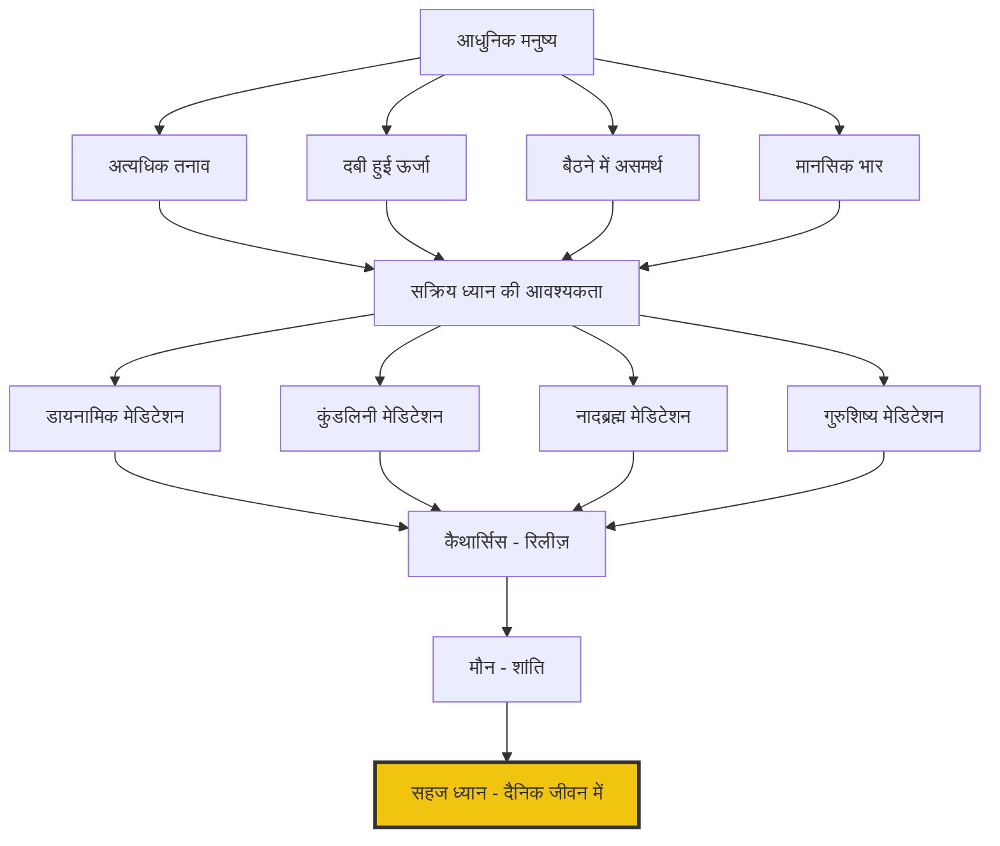
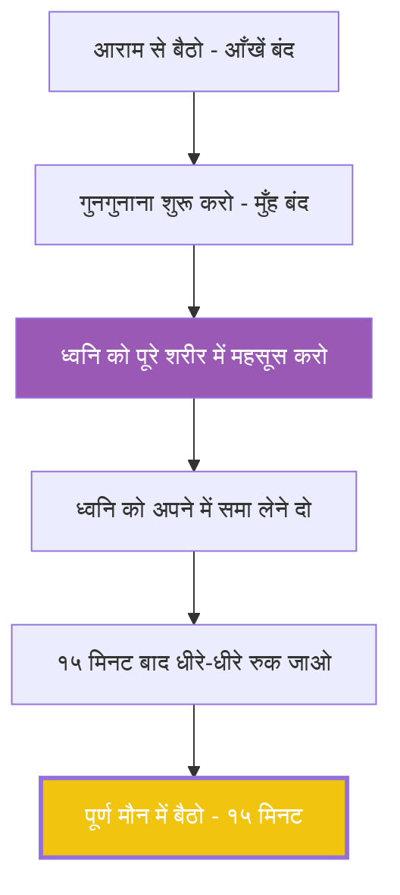

# अध्याय १४: दैनिक जीवन में ध्यान: ओशो की विधियाँ


<!-- Image Gallery -->
<div style="display:flex;flex-wrap:wrap;gap:4px;margin:16px 0;padding:12px;background:#f8fafc;border-radius:8px;border:1px solid #e2e8f0;">
<a href="../../../assets/images/lessons/vigyan-bhairav-tantra/14-dainik-jeevan-osho/hero.svg" target="_blank" rel="noopener">
  
</a>
<a href="../../../assets/images/lessons/vigyan-bhairav-tantra/14-dainik-jeevan-osho/handwritten-notes.svg" target="_blank" rel="noopener">
  
</a>
<a href="../../../assets/images/lessons/vigyan-bhairav-tantra/14-dainik-jeevan-osho/sticky-notes.svg" target="_blank" rel="noopener">
  
</a>
<a href="../../../assets/images/lessons/vigyan-bhairav-tantra/14-dainik-jeevan-osho/visual-explanation.svg" target="_blank" rel="noopener">
  
</a>
<a href="../../../assets/images/lessons/vigyan-bhairav-tantra/14-dainik-jeevan-osho/architecture.svg" target="_blank" rel="noopener">
  
</a>
<a href="../../../assets/images/lessons/vigyan-bhairav-tantra/14-dainik-jeevan-osho/workflow.svg" target="_blank" rel="noopener">
  
</a>
<a href="../../../assets/images/lessons/vigyan-bhairav-tantra/14-dainik-jeevan-osho/mindmap.svg" target="_blank" rel="noopener">
  
</a>
<a href="../../../assets/images/lessons/vigyan-bhairav-tantra/14-dainik-jeevan-osho/comparison.svg" target="_blank" rel="noopener">
  
</a>
<a href="../../../assets/images/lessons/vigyan-bhairav-tantra/14-dainik-jeevan-osho/cheatsheet.svg" target="_blank" rel="noopener">
  
</a>
<a href="../../../assets/images/lessons/vigyan-bhairav-tantra/14-dainik-jeevan-osho/interview-quiz.svg" target="_blank" rel="noopener">
  
</a>
<a href="../../../assets/images/lessons/vigyan-bhairav-tantra/14-dainik-jeevan-osho/social-card.svg" target="_blank" rel="noopener">
  
</a>
</div>
<!-- End Image Gallery -->

## सीखने के उद्देश्य (Learning Objectives)

इस अध्याय को पूरा करने के बाद, तुम निम्नलिखित में सक्षम होगे:

1. ओशो की क्रांतिकारी शिक्षा को समझना — "ध्यान कोई अलग क्रिया नहीं, जीने का तरीका है"
2. चलने, खाने, सोने — हर क्रिया को ध्यान में बदलने की विधि सीखना
3. ओशो की सक्रिय ध्यान विधियों (डायनामिक, कुंडलिनी, नादब्रह्म) का अभ्यास करना
4. "क्यों बैठकर ध्यान करना आधुनिक मनुष्य के लिए कठिन है" — ओशो का निदान
5. दैनिक दिनचर्या में ओशो की विधियों को एकीकृत करना
6. TypeScript Daily Practice Planner with Osho's Guided Instructions विकसित करना

---

## 🔱 प्रस्तावना: ओशो का सबसे क्रांतिकारी संदेश

> *"ध्यान कोई क्रिया नहीं है कि तुम सुबह बैठकर करो और फिर भूल जाओ। ध्यान जीने का एक तरीका है — तुम चलते हुए ध्यान में हो, खाते हुए ध्यान में हो, सोते हुए ध्यान में हो। जब तक तुम सोचते हो कि ध्यान करने का कोई अलग समय है, तब तक तुम चूक रहे हो।"*
> **— ओशो**

**ओशो वाणी:**
*"एक आदमी मेरे पास आया और बोला, 'ओशो, मैं रोज़ एक घंटा ध्यान करता हूँ।' मैंने उससे कहा, 'तेरा ध्यान तब तक बेकार है जब तक वह तेरे २३ घंटों में नहीं फैलता। एक घंटे का ध्यान और तेईस घंटे की अध्यान — यह कोई ध्यान नहीं है। ध्यान एक ऐसा स्वाद होना चाहिए जो तेरे हर क्षण में रच-बस जाए।'*

*वह आदमी समझा नहीं। उसने कहा, 'लेकिन ओशो, ध्यान के लिए तो शांति चाहिए, मौन चाहिए, एकांत चाहिए।'*

*मैंने कहा, 'यह सब बकवास है। ध्यान के लिए कुछ नहीं चाहिए — सिर्फ जागरूकता चाहिए। और जागरूकता तो कहीं भी, कभी भी हो सकती है। भीड़ में भी, बाज़ार में भी, कार्यालय में भी। असली ध्यान तो वही है जो बाज़ार में भी टिका रहे।'*

*उस आदमी ने पूछा, 'लेकिन बाज़ार में ध्यान कैसे हो सकता है?'*

*मैंने कहा, 'बाज़ार में ध्यान का मतलब यह नहीं कि तुम दुकानदार से बात करते हुए आँखें बंद कर लो। बाज़ार में ध्यान का मतलब है — पूरी जागरूकता से खरीदो, पूरी जागरूकता से बोलो, पूरी जागरूकता से चलो। हर क्रिया को पूरी उपस्थिति के साथ करो। यही ध्यान है।'"*

यह कहानी ओशो के दैनिक जीवन में ध्यान के पूरे दर्शन को खोलती है। उनके लिए ध्यान कोई अलग कमरे में जाकर बैठने का नाम नहीं है — यह तो जीवन के हर पल को पूरी जागरूकता से जीने का नाम है।

---

## १. ओशो का निदान: "क्यों बैठकर ध्यान करना काम नहीं करता"

### १.१ आधुनिक मनुष्य की समस्या

<a href="../../../assets/images/diagrams/vigyan-bhairav-tantra/14-dainik-jeevan-osho/-handwritten.svg" target="_blank" rel="noopener">
  
</a>
<a href="../../../assets/images/diagrams/vigyan-bhairav-tantra/14-dainik-jeevan-osho/-diagram.svg" target="_blank" rel="noopener">
  
</a>
<a href="../../../assets/images/diagrams/vigyan-bhairav-tantra/14-dainik-jeevan-osho/-sticky.svg" target="_blank" rel="noopener">
  
</a>


ओशो ने पारंपरिक ध्यान विधियों से आधुनिक मनुष्य की असमर्थता को गहराई से समझा:

> *"पुराने ज़माने में लोग बैठकर ध्यान कर सकते थे — क्योंकि उनका जीवन पहले से ही धीमा था। वे खेतों में काम करते थे, पक्षियों का गाना सुनते थे, नदी के किनारे बैठते थे। उनका पूरा जीवन एक लय में था। आज? आज तुम दौड़ रहे हो, तनाव में हो, चिंता में हो। अगर मैं तुमसे कहूँ 'चुप बैठो,' तो तुम और ज्यादा बेचैन हो जाओगे। तुम्हारी बेचैनी को पहले नाचने दो, फिर वह अपने आप शांत हो जाएगी।"*

### १.२ सक्रिय ध्यान की आवश्यकता

<a href="../../../assets/images/diagrams/vigyan-bhairav-tantra/14-dainik-jeevan-osho/-handwritten.svg" target="_blank" rel="noopener">
  
</a>
<a href="../../../assets/images/diagrams/vigyan-bhairav-tantra/14-dainik-jeevan-osho/-diagram.svg" target="_blank" rel="noopener">
  
</a>
<a href="../../../assets/images/diagrams/vigyan-bhairav-tantra/14-dainik-jeevan-osho/-sticky.svg" target="_blank" rel="noopener">
  
</a>




**ओशो वाणी:**
*"मैंने सक्रिय ध्यान विधियाँ इसलिए बनाईं क्योंकि आधुनिक मनुष्य एकदम से मौन नहीं बैठ सकता। उसके भीतर इतना उबाल है, इतना तनाव है, इतनी दबी हुई ऊर्जा है कि अगर वह चुप बैठ गया, तो वह और पागल हो जाएगा। पहले उसे उबलने दो, पहले उसे नाचने दो, पहले उसे चिल्लाने दो — तब वह शांत हो सकेगा।"*

---

## २. ओशो की चार प्रमुख सक्रिय ध्यान विधियाँ

### २.१ डायनामिक मेडिटेशन (Dynamic Meditation)

<a href="../../../assets/images/diagrams/vigyan-bhairav-tantra/14-dainik-jeevan-osho/dynamic-meditation-handwritten.svg" target="_blank" rel="noopener">
  
</a>
<a href="../../../assets/images/diagrams/vigyan-bhairav-tantra/14-dainik-jeevan-osho/dynamic-meditation-diagram.svg" target="_blank" rel="noopener">
  
</a>
<a href="../../../assets/images/diagrams/vigyan-bhairav-tantra/14-dainik-jeevan-osho/dynamic-meditation-sticky.svg" target="_blank" rel="noopener">
  
</a>


यह ओशो की सबसे प्रसिद्ध विधि है। इसे वे "डायनामिक" इसलिए कहते हैं क्योंकि यह पूरी ऊर्जा को गतिमान करती है।

```mermaid
flowchart LR
    subgraph चरण१[पहला चरण - १० मिनट]
        A[तेज़ श्वास - नाक से]
        A1[अनियमित, गहरी, तेज़]
        A2[शरीर को हिलने दो]
        A3[पूरा ध्यान श्वास पर]
    end
    
    subgraph चरण२[दूसरा चरण - १० मिनट]
        B[कैथार्सिस - विस्फोट]
        B1[चिल्लाओ, नाचो, रोओ]
        B2[जो भी आए, करो]
        B3[दबाओ मत, छोड़ दो]
    end
    
    subgraph चरण३[तीसरा चरण - १० मिनट]
        C[उछलो - हाथ ऊपर]
        C1[हू! हू! हू!]
        C2[हर बार ज़ोर से]
        C3[पूरी ऊर्जा लगाओ]
    end
    
    subgraph चरण४[चौथा चरण - १५ मिनट]
        D[पूर्ण मौन - स्थिर]
        D1[जैसे हो, वैसे रुक जाओ]
        D2[कोई हरकत नहीं]
        D3[साक्षी भाव]
    end
    
    subgraph चरण५[पाँचवाँ चरण - १५ मिनट]
        E[उत्सव - नाच]
        E1[आनंद में नाचो]
        E2[कृतज्ञता]
        E3[उत्सव]
    end
    
    चरण१ --> चरण२ --> चरण३ --> चरण४ --> चरण५
```

**ओशो वाणी:**
*"डायनामिक मेडिटेशन एक विरोधाभास है — यह सिर्फ एक तैयारी है। असली ध्यान तो चौथे चरण में शुरू होता है, जब तुम पूरी तरह स्थिर हो जाते हो। लेकिन उस स्थिरता तक पहुँचने के लिए तुम्हें पहले पूरी तरह गतिमान होना पड़ता है। तुम पूरे वृत्त की यात्रा करते हो — गतिहीनता तक पहुँचने के लिए।"*

### २.२ कुंडलिनी मेडिटेशन (Kundalini Meditation)

<a href="../../../assets/images/diagrams/vigyan-bhairav-tantra/14-dainik-jeevan-osho/kundalini-meditation-handwritten.svg" target="_blank" rel="noopener">
  
</a>
<a href="../../../assets/images/diagrams/vigyan-bhairav-tantra/14-dainik-jeevan-osho/kundalini-meditation-diagram.svg" target="_blank" rel="noopener">
  
</a>
<a href="../../../assets/images/diagrams/vigyan-bhairav-tantra/14-dainik-jeevan-osho/kundalini-meditation-sticky.svg" target="_blank" rel="noopener">
  
</a>


यह ओशो की दूसरी सबसे प्रसिद्ध विधि है — चार चरणों वाली, डेढ़ घंटे की।

| चरण | समय | क्रिया | भाव |
|------|------|--------|------|
| पहला | १५ मिनट | कोमल कंपन — पूरे शरीर को हिलने दो | ढीला, स्वतंत्र |
| दूसरा | १५ मिनट | नाच — जैसे शरीर खुद नाच रहा हो | समर्पण, प्रवाह |
| तीसरा | १५ मिनट | मौन — बैठो या लेट जाओ | साक्षी |
| चौथा | १५ मिनट | स्थिर मौन | शून्यता |

> *"कुंडलिनी मेडिटेशन में तुम कुछ नहीं करते — तुम बस अपने शरीर को हिलने देते हो। शरीर की अपनी बुद्धि है, उस पर भरोसा करो। जैसे हवा में पत्ता हिलता है, वैसे ही तुम्हारा शरीर हिलने लगेगा। यह हिलना कोई व्यायाम नहीं है — यह ऊर्जा का नाच है।"*

### २.३ नादब्रह्म मेडिटेशन (Nadabrahma Meditation)

<a href="../../../assets/images/diagrams/vigyan-bhairav-tantra/14-dainik-jeevan-osho/nadabrahma-meditation-handwritten.svg" target="_blank" rel="noopener">
  
</a>
<a href="../../../assets/images/diagrams/vigyan-bhairav-tantra/14-dainik-jeevan-osho/nadabrahma-meditation-diagram.svg" target="_blank" rel="noopener">
  
</a>
<a href="../../../assets/images/diagrams/vigyan-bhairav-tantra/14-dainik-jeevan-osho/nadabrahma-meditation-sticky.svg" target="_blank" rel="noopener">
  
</a>


यह ध्वनि-आधारित ध्यान है — जिसमें गुनगुनाहट (humming) के माध्यम से ध्यान में प्रवेश किया जाता है।



**ओशो वाणी:**
*"नादब्रह्म में तुम गुनगुनाते हो — कोई मंत्र नहीं, कोई शब्द नहीं, बस एक ध्वनि। यह ध्वनि तुम्हारे भीतर एक कंपन पैदा करती है। यह कंपन तुम्हारे पूरे शरीर को भर देता है — हर कोशिका, हर परमाणु। फिर धीरे-धीरे तुम रुक जाते हो। मौन — जो पहले शब्दों से भरा था, अब शून्य है। इस शून्य में ही परम का प्रवेश होता है।"*

### २.४ गुरुशिष्य मेडिटेशन (Gourishankar Meditation)

<a href="../../../assets/images/diagrams/vigyan-bhairav-tantra/14-dainik-jeevan-osho/gourishankar-meditation-handwritten.svg" target="_blank" rel="noopener">
  
</a>
<a href="../../../assets/images/diagrams/vigyan-bhairav-tantra/14-dainik-jeevan-osho/gourishankar-meditation-diagram.svg" target="_blank" rel="noopener">
  
</a>
<a href="../../../assets/images/diagrams/vigyan-bhairav-tantra/14-dainik-jeevan-osho/gourishankar-meditation-sticky.svg" target="_blank" rel="noopener">
  
</a>


यह ओशो की चौथी प्रमुख विधि है — जो साँस और भावना को जोड़ती है।

> *"गुरुशिष्य में तुम ४५ मिनट तक बैठते हो — स्थिर, शांत, आँखें बंद। फिर १५ मिनट तक धीरे-धीरे बाएँ-दाएँ घूमते हो — जैसे हवा में झूल रहे हो। इस घूमने में तुम अपने को भूल जाते हो। फिर लेट जाते हो — पूरी तरह खाली। यह विधि तुम्हें अपने केंद्र में लाती है।"*

---

## ३. दैनिक क्रियाओं में ध्यान — ओशो की सबसे बड़ी खोज

### ३.१ चलने का ध्यान (Walking Meditation)

<a href="../../../assets/images/diagrams/vigyan-bhairav-tantra/14-dainik-jeevan-osho/walking-meditation-handwritten.svg" target="_blank" rel="noopener">
  
</a>
<a href="../../../assets/images/diagrams/vigyan-bhairav-tantra/14-dainik-jeevan-osho/walking-meditation-diagram.svg" target="_blank" rel="noopener">
  
</a>
<a href="../../../assets/images/diagrams/vigyan-bhairav-tantra/14-dainik-jeevan-osho/walking-meditation-sticky.svg" target="_blank" rel="noopener">
  
</a>


> *"चलना एक सुंदर ध्यान हो सकता है। तुम बस चलते हो — कोई जल्दी नहीं, कोई लक्ष्य नहीं। हर कदम को महसूस करो — पैर ज़मीन को कैसे छू रहा है, हवा तुम्हारे चेहरे को कैसे छू रही है। चलना ही ध्यान बन जाता है।"*

**ओशो की विधि**:
1. धीमे चलो — अपनी सामान्य गति से आधी गति
2. हर कदम को महसूस करो — उठाना, आगे बढ़ाना, रखना
3. साँस को कदमों के साथ जोड़ो — चार कदम अंदर, चार कदम बाहर
4. आसपास के दृश्यों को देखो, लेकिन उनमें खोओ मत — बस देखो
5. पूरे शरीर में चलने के अनुभव को महसूस करो

### ३.२ खाने का ध्यान (Eating Meditation)

<a href="../../../assets/images/diagrams/vigyan-bhairav-tantra/14-dainik-jeevan-osho/eating-meditation-handwritten.svg" target="_blank" rel="noopener">
  
</a>
<a href="../../../assets/images/diagrams/vigyan-bhairav-tantra/14-dainik-jeevan-osho/eating-meditation-diagram.svg" target="_blank" rel="noopener">
  
</a>
<a href="../../../assets/images/diagrams/vigyan-bhairav-tantra/14-dainik-jeevan-osho/eating-meditation-sticky.svg" target="_blank" rel="noopener">
  
</a>


**ओशो वाणी:**
*"खाना एक बड़ा ध्यान हो सकता है — अगर तुम जागरूक होकर खाओ। तुम क्या खा रहे हो? कैसे खा रहे हो? क्या तुम सच में स्वाद ले रहे हो, या सिर्फ निगल रहे हो? अगर तुम जागरूक होकर खाओगे, तो तुम्हारा खाने का पूरा रिश्ता बदल जाएगा। तुम कम खाओगे, लेकिन ज़्यादा संतुष्ट होगे।"*

```mermaid
flowchart LR
    subgraph पहले[खाने से पहले]
        A[भोजन को देखो - ३० सेकंड]
        B[उसकी सुंदरता को निहारो]
        C[कृतज्ञता महसूस करो]
    end
    
    subgraph दौरान[खाने के दौरान]
        D[पहला ग्रास - धीरे-धीरे]
        E[स्वाद को महसूस करो]
        F[चबाने को महसूस करो]
        G[निगलने को महसूस करो]
    end
    
    subgraph बाद[खाने के बाद]
        H[२ मिनट मौन बैठो]
        I[भोजन को शरीर में समाने दो]
        J[कृतज्ञता]
    end
    
    पहले --> दौरान --> बाद
```

### ३.३ सोने का ध्यान (Sleeping Meditation)

<a href="../../../assets/images/diagrams/vigyan-bhairav-tantra/14-dainik-jeevan-osho/sleeping-meditation-handwritten.svg" target="_blank" rel="noopener">
  
</a>
<a href="../../../assets/images/diagrams/vigyan-bhairav-tantra/14-dainik-jeevan-osho/sleeping-meditation-diagram.svg" target="_blank" rel="noopener">
  
</a>
<a href="../../../assets/images/diagrams/vigyan-bhairav-tantra/14-dainik-jeevan-osho/sleeping-meditation-sticky.svg" target="_blank" rel="noopener">
  
</a>


> *"सोने से पहले का आधा घंटा बहुत कीमती है। उस समय तुम्हारा चेतन मन धीरे-धीरे अवचेतन में विलीन हो रहा होता है। अगर तुम इस संक्रमण को जागरूकता से देख सको, तो तुम ध्यान के सबसे गहरे द्वार पर दस्तक दे रहे हो।"*

**ओशो की सोने की विधि**:
1. पीठ के बल लेटो — हाथ-पैर ढीले
2. आँखें बंद करो — तीन गहरी साँसें लो
3. शरीर को स्कैन करो — सिर से पैर तक, हर अंग को ढीला छोड़ो
4. श्वास को देखो — जैसे-जैसे नींद आती है, बस देखते रहो
5. जागरूकता को मत छोड़ो — जितनी देर तक रह सको, देखते रहो

### ३.४ साँस लेने का ध्यान (Breathing Meditation)

<a href="../../../assets/images/diagrams/vigyan-bhairav-tantra/14-dainik-jeevan-osho/breathing-meditation-handwritten.svg" target="_blank" rel="noopener">
  
</a>
<a href="../../../assets/images/diagrams/vigyan-bhairav-tantra/14-dainik-jeevan-osho/breathing-meditation-diagram.svg" target="_blank" rel="noopener">
  
</a>
<a href="../../../assets/images/diagrams/vigyan-bhairav-tantra/14-dainik-jeevan-osho/breathing-meditation-sticky.svg" target="_blank" rel="noopener">
  
</a>


> *"साँस सबसे सरल और सबसे गहरी ध्यान विधि है। वह हर समय चल रही है — तुम्हें बस उसके प्रति जागरूक होना है। साँस को रोको मत, बदलो मत — बस देखो। और देखते-देखते तुम पाओगे कि साँस और तुम्हारे बीच की दूरी खत्म हो गई है — तुम साँस ही हो।"*

---

## ४. ओशो का दैनिक ध्यान कार्यक्रम

### ४.१ पूरे दिन का खाका

<a href="../../../assets/images/diagrams/vigyan-bhairav-tantra/14-dainik-jeevan-osho/-handwritten.svg" target="_blank" rel="noopener">
  
</a>
<a href="../../../assets/images/diagrams/vigyan-bhairav-tantra/14-dainik-jeevan-osho/-diagram.svg" target="_blank" rel="noopener">
  
</a>
<a href="../../../assets/images/diagrams/vigyan-bhairav-tantra/14-dainik-jeevan-osho/-sticky.svg" target="_blank" rel="noopener">
  
</a>


```mermaid
flowchart TD
    subgraph प्रातः[सुबह ५:००-७:००]
        A1[५:०० - जागरण: बिस्तर में ही ५ मिनट साक्षी]
        A2[५:१५ - डायनामिक या कुंडलिनी मेडिटेशन]
        A3[६:३० - स्नान: पानी को महसूस करो]
        A4[६:४५ - नाश्ता: चुपचाप, जागरूकता से]
    end

    subgraph मध्य[दिन ९:००-५:००]
        B1[हर घंटे - १ मिनट श्वास ध्यान]
        B2[दोपहर १२:०० - भोजन ध्यान]
        B3[बीच-बीच में - खड़े होकर तीन गहरी साँसें]
    end

    subgraph सायं[शाम ५:००-१०:००]
        C1[६:०० - नादब्रह्म या गुरुशिष्य मेडिटेशन]
        C2[७:३० - रात का भोजन: मौन में]
        C3[९:०० - दिन का पुनरावलोकन: साक्षी भाव से]
        C4[९:३० - सोने का ध्यान: योग निद्रा]
    end

    प्रातः --> मध्य
    मध्य --> सायं
```

### ४.२ ओशो के तीन सुनहरे नियम

<a href="../../../assets/images/diagrams/vigyan-bhairav-tantra/14-dainik-jeevan-osho/-handwritten.svg" target="_blank" rel="noopener">
  
</a>
<a href="../../../assets/images/diagrams/vigyan-bhairav-tantra/14-dainik-jeevan-osho/-diagram.svg" target="_blank" rel="noopener">
  
</a>
<a href="../../../assets/images/diagrams/vigyan-bhairav-tantra/14-dainik-jeevan-osho/-sticky.svg" target="_blank" rel="noopener">
  
</a>


| नियम | ओशो का कथन | अभ्यास |
|------|-------------|---------|
| नियम १ | "हर क्रिया को पूरी जागरूकता से करो" | चाहे दाँत साफ करना हो या चाय बनाना — पूरी उपस्थिति |
| नियम २ | "भागो मत, ठहरो" | काम के बीच भी एक क्षण रुको — गहरी साँस लो |
| नियम ३ | "हँसो, खेलो, उत्सव मनाओ" | ध्यान को बोझ मत बनाओ — उसे आनंद बनाओ |

**ओशो वाणी:**
*"मैं तुमसे यह नहीं कहता कि तुम संन्यासी बन जाओ और जंगल में चले जाओ। मैं तो कहता हूँ कि तुम बाज़ार में रहो, परिवार में रहो, दुनिया में रहो — लेकिन एक नए ढंग से रहो। जागरूकता के साथ रहो। यही सच्चा संन्यास है — बाहर कुछ छोड़ना नहीं, भीतर कुछ पकड़ना है।"*

---

## ५. पाँच मिनट के छोटे ध्यान (Osho's Micro-Meditation Techniques)

### ५.१ "सडन स्टॉप" — अचानक रुक जाओ

<a href="../../../assets/images/diagrams/vigyan-bhairav-tantra/14-dainik-jeevan-osho/-handwritten.svg" target="_blank" rel="noopener">
  
</a>
<a href="../../../assets/images/diagrams/vigyan-bhairav-tantra/14-dainik-jeevan-osho/-diagram.svg" target="_blank" rel="noopener">
  
</a>
<a href="../../../assets/images/diagrams/vigyan-bhairav-tantra/14-dainik-jeevan-osho/-sticky.svg" target="_blank" rel="noopener">
  
</a>


जब भी याद आए — चाहे तुम चल रहे हो, बात कर रहे हो, या काम कर रहे हो — अचानक रुक जाओ। पूरी तरह स्थिर हो जाओ। ३० सेकंड के लिए — कोई हरकत नहीं, कोई विचार नहीं। बस देखो।

### ५.२ "वन ब्रेथ" — एक साँस का ध्यान

<a href="../../../assets/images/diagrams/vigyan-bhairav-tantra/14-dainik-jeevan-osho/-handwritten.svg" target="_blank" rel="noopener">
  
</a>
<a href="../../../assets/images/diagrams/vigyan-bhairav-tantra/14-dainik-jeevan-osho/-diagram.svg" target="_blank" rel="noopener">
  
</a>
<a href="../../../assets/images/diagrams/vigyan-bhairav-tantra/14-dainik-jeevan-osho/-sticky.svg" target="_blank" rel="noopener">
  
</a>


दिन में जितनी बार याद आए — एक गहरी साँस लो और पूरी सजगता से उसे छोड़ो। बस एक साँस — लेकिन पूरी, संपूर्ण, पूरी जागरूकता के साथ।

### ५.३ "लूकिंग" — बिना नाम दिए देखना

<a href="../../../assets/images/diagrams/vigyan-bhairav-tantra/14-dainik-jeevan-osho/-handwritten.svg" target="_blank" rel="noopener">
  
</a>
<a href="../../../assets/images/diagrams/vigyan-bhairav-tantra/14-dainik-jeevan-osho/-diagram.svg" target="_blank" rel="noopener">
  
</a>
<a href="../../../assets/images/diagrams/vigyan-bhairav-tantra/14-dainik-jeevan-osho/-sticky.svg" target="_blank" rel="noopener">
  
</a>


किसी भी चीज़ को देखो — फूल, पेड़, बादल — लेकिन उसे नाम मत दो। बस देखो। "यह गुलाब है" मत कहो — बस उसके रंग, उसकी खुशबू, उसके अस्तित्व को महसूस करो। बिना शब्दों के देखना ही ध्यान है।

---

## ६. TypeScript कार्यान्वयन: दैनिक ध्यान योजनाकार (Osho's Style)

```typescript
/**
 * ओशो की दैनिक ध्यान योजना और मार्गदर्शन
 * (Osho's Daily Practice Planner with Guided Instructions)
 * 
 * "ध्यान कोई क्रिया नहीं है — यह जीने का तरीका है।
 * यह टूल तुम्हें बस याद दिलाने के लिए है कि तुम
 * हर पल ध्यान में हो सकते हो।" — ओशो
 * 
 * @package OshoVBT
 * @version 1.0.0
 */

// === मुख्य प्रकार ===

type OshoMeditationType = 'dynamic' | 'kundalini' | 'nadabrahma' | 'gourishankar' | 'walking' | 'eating' | 'sleeping' | 'breathing' | 'sudden_stop' | 'one_breath' | 'looking' | 'witnessing';
type OshoTimeOfDay = 'dawn' | 'morning' | 'afternoon' | 'evening' | 'night' | 'anytime';
type OshoEnergyLevel = 'high' | 'medium' | 'low' | 'restless' | 'calm';

interface OshoMeditation {
    id: OshoMeditationType;
    name: string;
    nameHindi: string;
    duration: number; // minutes
    phases: MeditationPhase[];
    oshoInstruction: string;
    oshoQuote: string;
    contraindication: string;
    bestTime: OshoTimeOfDay;
    energyType: OshoEnergyLevel;
}

interface MeditationPhase {
    id: number;
    name: string;
    duration: number;
    instruction: string;
    keyFeeling: string;
}

interface DailyOshoPlan {
    date: Date;
    morningPractice: ScheduledPractice;
    dayPractices: ScheduledPractice[];
    eveningPractice: ScheduledPractice;
    microPractices: ScheduledPractice[];
    oshoMessage: string;
    totalMinutes: number;
}

interface ScheduledPractice {
    meditation: OshoMeditation;
    scheduledTime: string;
    completed: boolean;
    actualDuration?: number;
    experience?: string;
}

interface OshoWisdomTip {
    quote: string;
    context: string;
    paradox: string;
}

// === ओशो की ध्यान विधियों का डेटाबेस ===

const OSHO_MEDITATIONS: OshoMeditation[] = [
    {
        id: 'dynamic',
        name: 'Dynamic Meditation',
        nameHindi: 'डायनामिक मेडिटेशन',
        duration: 60,
        phases: [
            {
                id: 1,
                name: 'तेज़ श्वास',
                duration: 10,
                instruction: 'नाक से तेज़, गहरी, अनियमित श्वास लो। शरीर को हिलने दो। पूरा ध्यान श्वास पर।',
                keyFeeling: 'तीव्रता, ऊर्जा'
            },
            {
                id: 2,
                name: 'कैथार्सिस',
                duration: 10,
                instruction: 'विस्फोट! जो भी आए — चिल्लाओ, रोओ, नाचो, हँसो। कुछ मत दबाओ।',
                keyFeeling: 'मुक्ति, रिहाई'
            },
            {
                id: 3,
                name: 'हू! हू! हू!',
                duration: 10,
                instruction: 'हाथ ऊपर उठाओ और 'हू! हू! हू!' चिल्लाओ। हर बार पूरी ऊर्जा से। ज़मीन पर गिरो।',
                keyFeeling: 'ग्राउंडिंग, केंद्रित'
            },
            {
                id: 4,
                name: 'पूर्ण मौन',
                duration: 15,
                instruction: 'रुक जाओ! जैसे हो, वैसे ही स्थिर हो जाओ। कोई हरकत नहीं, कोई खाँसी नहीं। बस साक्षी।',
                keyFeeling: 'शून्यता, गहरी शांति'
            },
            {
                id: 5,
                name: 'उत्सव',
                duration: 15,
                instruction: 'नाचो! आनंद में, कृतज्ञता में, उत्सव में।',
                keyFeeling: 'आनंद, उत्सव'
            }
        ],
        oshoInstruction: 'इसे सुबह खाली पेट करो। ढीले कपड़े पहनो। अकेले या समूह में कर सकते हो। आँखें बंद रखो — पूरे अभ्यास के दौरान।',
        oshoQuote: 'डायनामिक मेडिटेशन एक विरोधाभास है — यह सिर्फ एक तैयारी है। असली ध्यान तो चौथे चरण में शुरू होता है।',
        contraindication: 'गंभीर हृदय रोग, उच्च रक्तचाप, मिर्गी में सावधानी। गर्भावस्था में न करें।',
        bestTime: 'dawn',
        energyType: 'high'
    },
    {
        id: 'kundalini',
        name: 'Kundalini Meditation',
        nameHindi: 'कुंडलिनी मेडिटेशन',
        duration: 60,
        phases: [
            {
                id: 1,
                name: 'कोमल कंपन',
                duration: 15,
                instruction: 'खड़े हो जाओ। शरीर को ढीला छोड़ दो। हल्के-हल्के कंपन करने दो — जैसे पत्ता हवा में हिलता है।',
                keyFeeling: 'मुलायम, प्रवाहमान'
            },
            {
                id: 2,
                name: 'नाच',
                duration: 15,
                instruction: 'अब शरीर को नाचने दो — जैसे कोई और तुम्हें नचा रहा हो। तुम नहीं नाच रहे, तुम नचाए जा रहे हो।',
                keyFeeling: 'समर्पण, उन्मुक्त'
            },
            {
                id: 3,
                name: 'मौन बैठना',
                duration: 15,
                instruction: 'बैठ जाओ। पूरी तरह शांत। शरीर में अभी भी कंपन हो सकता है — उसे महसूस करो।',
                keyFeeling: 'आंतरिक शांति'
            },
            {
                id: 4,
                name: 'लेटना',
                duration: 15,
                instruction: 'लेट जाओ। पूरी तरह स्थिर। बस देखो — जो है, उसे वैसे ही रहने दो।',
                keyFeeling: 'पूर्ण विश्राम'
            }
        ],
        oshoInstruction: 'शाम के समय अच्छा रहता है। हल्का खाना खाने के बाद। आँखें बंद रखो।',
        oshoQuote: 'कुंडलिनी में तुम कुछ नहीं करते — तुम बस अपने शरीर को हिलने देते हो। शरीर की अपनी बुद्धि है।',
        contraindication: 'कोई विशेष नहीं — सभी के लिए सुरक्षित।',
        bestTime: 'evening',
        energyType: 'medium'
    },
    {
        id: 'nadabrahma',
        name: 'Nadabrahma Meditation',
        nameHindi: 'नादब्रह्म मेडिटेशन',
        duration: 30,
        phases: [
            {
                id: 1,
                name: 'गुनगुनाना',
                duration: 15,
                instruction: 'आराम से बैठो। मुँह बंद करो। गुनगुनाना शुरू करो — कोई शब्द नहीं, बस ध्वनि। ध्वनि को पूरे शरीर में फैलने दो।',
                keyFeeling: 'कंपन, स्पंदन'
            },
            {
                id: 2,
                name: 'मौन',
                duration: 15,
                instruction: 'धीरे-धीरे रुक जाओ। पूरे मौन में बैठो। अब कोई ध्वनि नहीं — बस शून्यता। इसी शून्य में परम है।',
                keyFeeling: 'गहन शांति, विस्तार'
            }
        ],
        oshoInstruction: 'यह रात में सोने से पहले बहुत अच्छा रहता है। कहीं भी कर सकते हो।',
        oshoQuote: 'नादब्रह्म में ध्वनि एक पुल है — वह तुम्हें मौन तक ले जाती है। मौन ही परम है।',
        contraindication: 'कोई नहीं।',
        bestTime: 'night',
        energyType: 'calm'
    },
    {
        id: 'gourishankar',
        name: 'Gourishankar Meditation',
        nameHindi: 'गुरुशिष्य मेडिटेशन',
        duration: 60,
        phases: [
            {
                id: 1,
                name: 'बैठना',
                duration: 45,
                instruction: 'बिल्कुल स्थिर बैठो। आँखें बंद। रीढ़ सीधी। कोई हरकत नहीं। साक्षी भाव।',
                keyFeeling: 'गहन स्थिरता'
            },
            {
                id: 2,
                name: 'घूमना',
                duration: 15,
                instruction: 'धीरे-धीरे बाएँ-दाएँ घूमो — जैसे झूल रहे हो। शरीर को पूरी तरह ढीला छोड़ दो। भारहीन हो जाओ।',
                keyFeeling: 'समर्पण, पिघलना'
            },
            {
                id: 3,
                name: 'लेटना',
                duration: 15,
                instruction: 'पेट के बल लेट जाओ। पूरी तरह खाली। कोई विचार नहीं, कोई इच्छा नहीं — बस शून्य।',
                keyFeeling: 'महाशून्य'
            }
        ],
        oshoInstruction: 'सप्ताह में कम से कम एक बार करो। इसके लिए समय निकालो — यह बहुत गहरा है।',
        oshoQuote: 'गुरुशिष्य में सबसे लंबा चरण बैठने का है — ४५ मिनट। यह तुम्हें तोड़ता है। और फिर घूमना तुम्हें पिघलाता है।',
        contraindication: 'पीठ दर्द में सावधानी।',
        bestTime: 'evening',
        energyType: 'calm'
    },
    {
        id: 'walking',
        name: 'Walking Meditation',
        nameHindi: 'चलने का ध्यान',
        duration: 20,
        phases: [
            {
                id: 1,
                name: 'धीमा चलना',
                duration: 10,
                instruction: 'अपनी सामान्य गति से आधी गति से चलो। हर कदम को पूरी जागरूकता से उठाओ और रखो।',
                keyFeeling: 'धीमापन, संवेदनशीलता'
            },
            {
                id: 2,
                name: 'प्राकृतिक चलना',
                duration: 10,
                instruction: 'अब सामान्य गति से चलो — लेकिन जागरूकता को मत छोड़ो। देखो कैसे शरीर अपने आप चल रहा है।',
                keyFeeling: 'सहजता, प्रवाह'
            }
        ],
        oshoInstruction: 'पार्क में, बगीचे में, या कमरे में भी कर सकते हो। चप्पल मत पहनो — पैरों को ज़मीन से जुड़ने दो।',
        oshoQuote: 'चलना एक सुंदर ध्यान हो सकता है — बस लक्ष्य मत रखो, कोई जल्दी मत रखो। चलना ही लक्ष्य है।',
        contraindication: 'कोई नहीं।',
        bestTime: 'morning',
        energyType: 'medium'
    },
    {
        id: 'one_breath',
        name: 'One Breath Meditation',
        nameHindi: 'एक साँस का ध्यान',
        duration: 0.5,
        phases: [
            {
                id: 1,
                name: 'एक साँस',
                duration: 0.5,
                instruction: 'गहरी साँस लो — पूरी सजगता से। फिर धीरे-धीरे छोड़ो — पूरी सजगता से। बस एक साँस — लेकिन संपूर्ण।',
                keyFeeling: 'तत्काल शांति'
            }
        ],
        oshoInstruction: 'दिन में जितनी बार याद आए — करो। कोई बहाना मत ढूँढ़ो। बस एक साँस।',
        oshoQuote: 'एक पूरी साँस — और तुम वर्तमान में आ जाते हो। सारा अतीत, सारा भविष्य — एक साँस में विलीन।',
        contraindication: 'कोई नहीं।',
        bestTime: 'anytime',
        energyType: 'medium'
    }
];

// === ओशो की दैनिक बुद्धि ===

const OSHO_DAILY_WISDOM: OshoWisdomTip[] = [
    {
        quote: 'ध्यान कोई क्रिया नहीं है — यह जीने का तरीका है।',
        context: 'दैनिक जीवन में ध्यान को एकीकृत करने पर',
        paradox: 'जब तुम ध्यान करने की कोशिश करते हो, तो तुम चूक जाते हो। जब तुम बस जीते हो, जागरूकता से — तो ध्यान अपने आप होता है।'
    },
    {
        quote: 'दौड़ते हुए मत जियो — नाचते हुए जियो।',
        context: 'जीवन को एक उत्सव बनाने पर',
        paradox: 'जब तुम जीवन को गंभीरता से लेते हो, तो तुम चूक जाते हो। जब तुम खेलते हो, तब तुम पाते हो।'
    },
    {
        quote: 'अगर तुम उदास हो, तो उदासी को नाचने दो।',
        context: 'भावनाओं को दबाने के बजाय व्यक्त करने पर',
        paradox: 'जब तुम उदासी से भागते हो, वह पीछा करती है। जब तुम उसे नाचने देते हो, वह गायब हो जाती है।'
    },
    {
        quote: 'हर क्षण एक नया जन्म है।',
        context: 'क्षण-क्षण जागरूक रहने पर',
        paradox: 'अतीत को छोड़ने के लिए भविष्य की ज़रूरत नहीं है — बस इसी क्षण में पूरी तरह जागो।'
    }
];

// === ओशो का दैनिक योजनाकार ===

class OshoDailyPlanner {
    private completedPractices: Map<string, boolean>;
    private dailyWisdomIndex: number;

    constructor() {
        this.completedPractices = new Map();
        this.dailyWisdomIndex = Math.floor(Math.random() * OSHO_DAILY_WISDOM.length);
    }

    /**
     * आज का ध्यान योजना बनाओ
     */
    generateDailyPlan(date: Date = new Date()): DailyOshoPlan {
        const dayOfWeek = date.getDay();
        const isWeekend = dayOfWeek === 0 || dayOfWeek === 6;

        // सुबह की मुख्य विधि
        const morningPractice: ScheduledPractice = {
            meditation: OSHO_MEDITATIONS.find(m => 
                m.id === (isWeekend ? 'dynamic' : 'kundalini')
            )!,
            scheduledTime: '०५:३०',
            completed: false
        };

        // शाम की मुख्य विधि
        const eveningPractice: ScheduledPractice = {
            meditation: OSHO_MEDITATIONS.find(m => m.id === 'nadabrahma')!,
            scheduledTime: '२१:००',
            completed: false
        };

        // दिन के छोटे अभ्यास
        const dayPractices: ScheduledPractice[] = [];
        if (!isWeekend) {
            dayPractices.push({
                meditation: OSHO_MEDITATIONS.find(m => m.id === 'walking')!,
                scheduledTime: '१२:३०',
                completed: false
            });
        }

        // माइक्रो-प्रैक्टिसेस
        const microPractices: ScheduledPractice[] = [
            {
                meditation: OSHO_MEDITATIONS.find(m => m.id === 'one_breath')!,
                scheduledTime: 'हर घंटे',
                completed: false
            }
        ];

        // कुल समय
        const totalMinutes = morningPractice.meditation.duration + 
            eveningPractice.meditation.duration +
            dayPractices.reduce((s, p) => s + p.meditation.duration, 0);

        // दिन के लिए ओशो का संदेश
        const wisdom = OSHO_DAILY_WISDOM[this.dailyWisdomIndex % OSHO_DAILY_WISDOM.length];
        this.dailyWisdomIndex++;

        return {
            date,
            morningPractice,
            dayPractices,
            eveningPractice,
            microPractices,
            oshoMessage: `${wisdom.quote} — ${wisdom.context}\n⚡ ${wisdom.paradox}`,
            totalMinutes
        };
    }

    /**
     * अभ्यास पूर्ण हुआ
     */
    markComplete(practiceKey: string, actualDuration?: number, experience?: string): void {
        this.completedPractices.set(practiceKey, true);
        console.log(`✅ "${practiceKey}" पूर्ण! ${experience ? 'अनुभव: ' + experience : ''}`);
    }

    /**
     * ओशो का आज का मार्गदर्शन
     */
    getOshoGuidance(): OshoWisdomTip {
        const tip = OSHO_DAILY_WISDOM[Math.floor(Math.random() * OSHO_DAILY_WISDOM.length)];
        return tip;
    }

    /**
     * चलते-चलते ध्यान — हर जगह, हर समय
     */
    getMicroPracticeForMoment(): string {
        const practices = [
            'रुको! अभी, इसी क्षण — तीन गहरी साँसें लो। पूरी जागरूकता से।',
            'जहाँ हो, वहीं खड़े हो जाओ। अपने पैरों के नीचे की ज़मीन को महसूस करो।',
            'अपने चारों ओर देखो — बिना नाम दिए। बस देखो।',
            'एक गहरी साँस लो — कल्पना करो कि यह तुम्हारी पहली साँस है।',
            'अपने हाथों को देखो — जैसे पहली बार देख रहे हो।',
            'मुस्कुराओ — बिना किसी कारण के। सिर्फ इसलिए कि तुम जीवित हो।'
        ];
        return practices[Math.floor(Math.random() * practices.length)];
    }

    /**
     * पूरे दिन का ध्यान कार्यक्रम — टेक्स्ट फॉर्मेट में
     */
    getFullDaySchedule(): string {
        const plan = this.generateDailyPlan();
        let schedule = `🕉️  ओशो का आज का ध्यान कार्यक्रम\n`;
        schedule += `━━━━━━━━━━━━━━━━━━━━━━━━━━━━━━━━━━━━━━━━\n\n`;
        schedule += `🌅 सुबह ${plan.morningPractice.scheduledTime}\n`;
        schedule += `   ${plan.morningPractice.meditation.nameHindi} — ${plan.morningPractice.meditation.duration} मिनट\n`;
        schedule += `   "${plan.morningPractice.meditation.oshoQuote}"\n\n`;

        if (plan.dayPractices.length > 0) {
            schedule += `☀️ दोपहर ${plan.dayPractices[0].scheduledTime}\n`;
            schedule += `   ${plan.dayPractices[0].meditation.nameHindi} — ${plan.dayPractices[0].meditation.duration} मिनट\n\n`;
        }

        schedule += `🌙 शाम ${plan.eveningPractice.scheduledTime}\n`;
        schedule += `   ${plan.eveningPractice.meditation.nameHindi} — ${plan.eveningPractice.meditation.duration} मिनट\n\n`;

        schedule += `⚡ दिन भर — हर घंटे:\n`;
        schedule += `   "एक साँस का ध्यान" — बस ३० सेकंड\n\n`;

        schedule += `📜 ओशो का आज का संदेश:\n`;
        schedule += `   "${plan.oshoMessage}"\n\n`;

        schedule += `💡 याद रखो:\n`;
        schedule += `   "ध्यान कोई क्रिया नहीं है — यह जीने का तरीका है।\n`;
        schedule += `    तुम हर पल ध्यान में हो सकते हो।\n`;
        schedule += `    बस याद रखने की बात है।"\n\n`;
        schedule += `━━━━━━━━━━━━━━━━━━━━━━━━━━━━━━━━━━━━━━━━\n`;
        schedule += `   कुल ध्यान समय: ${plan.totalMinutes} मिनट आज`;

        return schedule;
    }
}

// === उपयोग उदाहरण ===

function demonstrateOshoDailyPlanner(): void {
    console.log('🕉️  ओशो के दैनिक ध्यान योजनाकार में आपका स्वागत है!\n');

    const planner = new OshoDailyPlanner();

    // आज का पूरा कार्यक्रम
    console.log(planner.getFullDaySchedule());
    console.log();

    // ओशो का तत्काल मार्गदर्शन
    console.log('🎯 इसी क्षण के लिए ओशो का मार्गदर्शन:');
    console.log(`   "${planner.getMicroPracticeForMoment()}"\n`);

    // साप्ताहिक योजना
    console.log('📅 सप्ताह की झलक:');
    const days = ['रविवार', 'सोमवार', 'मंगलवार', 'बुधवार', 'गुरुवार', 'शुक्रवार', 'शनिवार'];
    days.forEach((day, index) => {
        const date = new Date();
        date.setDate(date.getDate() + index);
        const plan = planner.generateDailyPlan(date);
        console.log(`   ${day}: ${plan.morningPractice.meditation.nameHindi} → ${plan.totalMinutes} मिनट`);
    });
    console.log();

    // कुछ अभ्यास पूर्ण करना
    planner.markComplete('dynamic_0500', 60, 'बहुत गहरा अनुभव — चौथे चरण में पूर्ण शून्यता');
    planner.markComplete('nadabrahma_2100', 30, 'गुनगुनाहट के बाद की शांति अद्भुत थी');
    console.log();

    // प्रगति रिपोर्ट
    console.log('📊 आज की प्रगति:');
    console.log('   "ध्यान कोई प्रतियोगिता नहीं है। कोई लक्ष्य नहीं है।');
    console.log('    कोई उपलब्धि नहीं है। बस जागरूक होते जाना है।');
    console.log('    और एक दिन तुम पाते हो — तुम पहले से ही जाग चुके हो।"');
    console.log('    — ओशो');
}

demonstrateOshoDailyPlanner();

export {
    OshoDailyPlanner,
    OSHO_MEDITATIONS,
    OSHO_DAILY_WISDOM,
    type OshoMeditation,
    type DailyOshoPlan,
    type ScheduledPractice,
    type OshoWisdomTip,
    type MeditationPhase,
    type OshoMeditationType
};
```

---

## ७. ओशो के पाँच सुनहरे नियम — दैनिक ध्यान के लिए

### नियम १: कोई नियम नहीं है

<a href="../../../assets/images/diagrams/vigyan-bhairav-tantra/14-dainik-jeevan-osho/-handwritten.svg" target="_blank" rel="noopener">
  
</a>
<a href="../../../assets/images/diagrams/vigyan-bhairav-tantra/14-dainik-jeevan-osho/-diagram.svg" target="_blank" rel="noopener">
  
</a>
<a href="../../../assets/images/diagrams/vigyan-bhairav-tantra/14-dainik-jeevan-osho/-sticky.svg" target="_blank" rel="noopener">
  
</a>

> *"ध्यान का कोई नियम नहीं है। अगर कोई तुमसे कहे कि ध्यान इस तरह करना चाहिए, तो भाग जाओ। ध्यान तो स्वतंत्रता है — नियमों का जाल नहीं।"*

### नियम २: जहाँ हो, वहीं शुरू करो

<a href="../../../assets/images/diagrams/vigyan-bhairav-tantra/14-dainik-jeevan-osho/-handwritten.svg" target="_blank" rel="noopener">
  
</a>
<a href="../../../assets/images/diagrams/vigyan-bhairav-tantra/14-dainik-jeevan-osho/-diagram.svg" target="_blank" rel="noopener">
  
</a>
<a href="../../../assets/images/diagrams/vigyan-bhairav-tantra/14-dainik-jeevan-osho/-sticky.svg" target="_blank" rel="noopener">
  
</a>

> *"इंतज़ार मत करो कि कल से शुरू करोगे। कल कभी नहीं आता। अभी, इसी क्षण, जहाँ हो — वहीं शुरू करो। चाहे बाज़ार हो या बस स्टॉप।"*

### नियम ३: हँसना मत भूलो

<a href="../../../assets/images/diagrams/vigyan-bhairav-tantra/14-dainik-jeevan-osho/-handwritten.svg" target="_blank" rel="noopener">
  
</a>
<a href="../../../assets/images/diagrams/vigyan-bhairav-tantra/14-dainik-jeevan-osho/-diagram.svg" target="_blank" rel="noopener">
  
</a>
<a href="../../../assets/images/diagrams/vigyan-bhairav-tantra/14-dainik-jeevan-osho/-sticky.svg" target="_blank" rel="noopener">
  
</a>

> *"ध्यान को बहुत गंभीर मत बनाओ। हँसो, खेलो, मज़े करो। परमात्मा गंभीर नहीं है — वह तो एक उत्सव है।"*

### नियम ४: अपने शरीर को मत भूलो

<a href="../../../assets/images/diagrams/vigyan-bhairav-tantra/14-dainik-jeevan-osho/-handwritten.svg" target="_blank" rel="noopener">
  
</a>
<a href="../../../assets/images/diagrams/vigyan-bhairav-tantra/14-dainik-jeevan-osho/-diagram.svg" target="_blank" rel="noopener">
  
</a>
<a href="../../../assets/images/diagrams/vigyan-bhairav-tantra/14-dainik-jeevan-osho/-sticky.svg" target="_blank" rel="noopener">
  
</a>

> *"शरीर तुम्हारा मंदिर है। उसे भूखा मत रखो, उसे प्रताड़ित मत करो। उससे प्यार करो, उसका ख्याल रखो। एक स्वस्थ शरीर में ही ध्यान खिल सकता है।"*

### नियम ५: अभ्यास करो, लेकिन आसक्त मत हो

<a href="../../../assets/images/diagrams/vigyan-bhairav-tantra/14-dainik-jeevan-osho/-handwritten.svg" target="_blank" rel="noopener">
  
</a>
<a href="../../../assets/images/diagrams/vigyan-bhairav-tantra/14-dainik-jeevan-osho/-diagram.svg" target="_blank" rel="noopener">
  
</a>
<a href="../../../assets/images/diagrams/vigyan-bhairav-tantra/14-dainik-jeevan-osho/-sticky.svg" target="_blank" rel="noopener">
  
</a>

> *"अभ्यास करो — नियमित रूप से। लेकिन उससे चिपको मत। जब सही लगे, करो। जब न लगे, मत करो। ध्यान कोई कर्तव्य नहीं है — वह तो एक प्रेम-प्रसंग है।"*

---

## ८. व्यावहारिक अभ्यास (Practical Exercises)

### अभ्यास १: एक दिन का ध्यान प्रयोग

<a href="../../../assets/images/diagrams/vigyan-bhairav-tantra/14-dainik-jeevan-osho/-handwritten.svg" target="_blank" rel="noopener">
  
</a>
<a href="../../../assets/images/diagrams/vigyan-bhairav-tantra/14-dainik-jeevan-osho/-diagram.svg" target="_blank" rel="noopener">
  
</a>
<a href="../../../assets/images/diagrams/vigyan-bhairav-tantra/14-dainik-jeevan-osho/-sticky.svg" target="_blank" rel="noopener">
  
</a>

कल पूरे दिन — हर काम को पूरी जागरूकता से करो। दाँत साफ करते हुए — सिर्फ दाँत साफ करो, कुछ और मत सोचो। खाते हुए — सिर्फ खाओ। चलते हुए — सिर्फ चलो। शाम को लिखो — क्या बदलाव महसूस हुआ?

### अभ्यास २: घंटे की घंटी

<a href="../../../assets/images/diagrams/vigyan-bhairav-tantra/14-dainik-jeevan-osho/-handwritten.svg" target="_blank" rel="noopener">
  
</a>
<a href="../../../assets/images/diagrams/vigyan-bhairav-tantra/14-dainik-jeevan-osho/-diagram.svg" target="_blank" rel="noopener">
  
</a>
<a href="../../../assets/images/diagrams/vigyan-bhairav-tantra/14-dainik-jeevan-osho/-sticky.svg" target="_blank" rel="noopener">
  
</a>

अपने फोन पर हर घंटे का अलार्म लगाओ। जब बजे — रुको। एक गहरी साँस लो। पूरे शरीर को महसूस करो। फिर अगले घंटे के लिए तैयार हो जाओ।

### अभ्यास ३: ओशो का कोई भी सक्रिय ध्यान

<a href="../../../assets/images/diagrams/vigyan-bhairav-tantra/14-dainik-jeevan-osho/-handwritten.svg" target="_blank" rel="noopener">
  
</a>
<a href="../../../assets/images/diagrams/vigyan-bhairav-tantra/14-dainik-jeevan-osho/-diagram.svg" target="_blank" rel="noopener">
  
</a>
<a href="../../../assets/images/diagrams/vigyan-bhairav-tantra/14-dainik-jeevan-osho/-sticky.svg" target="_blank" rel="noopener">
  
</a>

इस सप्ताह कम से कम एक बार कोई सक्रिय ध्यान (डायनामिक, कुंडलिनी, या नादब्रह्म) करो। पूरी ऊर्जा से करो — आधा-अधूरा नहीं।

### अभ्यास ४: कोडिंग

<a href="../../../assets/images/diagrams/vigyan-bhairav-tantra/14-dainik-jeevan-osho/-handwritten.svg" target="_blank" rel="noopener">
  
</a>
<a href="../../../assets/images/diagrams/vigyan-bhairav-tantra/14-dainik-jeevan-osho/-diagram.svg" target="_blank" rel="noopener">
  
</a>
<a href="../../../assets/images/diagrams/vigyan-bhairav-tantra/14-dainik-jeevan-osho/-sticky.svg" target="_blank" rel="noopener">
  
</a>

TypeScript `OshoDailyPlanner` में एक नई मेथड जोड़ो जो सप्ताह की पूरी योजना बना सके — जिसमें हर दिन के लिए एक अलग सक्रिय ध्यान विधि हो।

---

## सारांश (Summary)

इस अध्याय में हमने ओशो के दैनिक जीवन में ध्यान के दर्शन को समझा:

1. **ध्यान कोई अलग क्रिया नहीं** — यह जीने का एक तरीका है, हर पल में जागरूक रहना।
2. **सक्रिय ध्यान विधियाँ** — डायनामिक, कुंडलिनी, नादब्रह्म, गुरुशिष्य — आधुनिक मनुष्य की ज़रूरत के लिए।
3. **चलना, खाना, सोना** — हर क्रिया को ध्यान में बदला जा सकता है।
4. **माइक्रो-मेडिटेशन** — एक साँस, एक क्षण — कोई बहाना नहीं।
5. **नियमों से आज़ादी** — ध्यान का कोई नियम नहीं है, बस जागरूकता है।

**ओशो वाणी:**
*"मैं तुमसे यह नहीं कहता कि तुम एक संत बन जाओ। मैं तो कहता हूँ कि तुम एक साधारण इंसान बनो — लेकिन जागरूक। साधारण जीवन, असाधारण जागरूकता। यही सब कुछ है।"*

---

## अध्याय प्रश्नोत्तरी (Chapter Quiz)

**प्रश्न १**: ओशो के अनुसार, आधुनिक मनुष्य के लिए पारंपरिक बैठकर ध्यान करना कठिन क्यों है?
- क) उसके पास समय नहीं है
- ख) उसके भीतर बहुत दबी हुई ऊर्जा और तनाव है
- ग) उसे ध्यान सिखाने वाला कोई नहीं है
- घ) वह बैठना नहीं जानता

> **उत्तर**: ख) उसके भीतर बहुत दबी हुई ऊर्जा और तनाव है — "पहले उसे उबलने दो, तब वह शांत हो सकेगा।"

**प्रश्न २**: डायनामिक मेडिटेशन में कितने चरण हैं?
- क) तीन
- ख) चार
- ग) पाँच
- घ) छह

> **उत्तर**: ग) पाँच — तेज़ श्वास, कैथार्सिस, "हू!", मौन, उत्सव।

**प्रश्न ३**: ओशो के अनुसार, सबसे छोटा ध्यान कितने समय का हो सकता है?
- क) १ मिनट
- ख) ३० सेकंड (एक साँस)
- ग) ५ मिनट
- घ) १० मिनट

> **उत्तर**: ख) ३० सेकंड — "एक पूरी साँस — और तुम वर्तमान में आ जाते हो।"

**प्रश्न ४**: ओशो ध्यान को क्या नहीं मानते?
- क) जीने का तरीका
- ख) एक क्रिया जो सुबह की जाती है
- ग) जागरूकता
- घ) उत्सव

> **उत्तर**: ख) एक क्रिया जो सुबह की जाती है — "ध्यान कोई क्रिया नहीं है — यह जीने का तरीका है।"

---

## अभ्यास (Exercises)

1. **एक दिन का प्रयोग**: कल पूरा दिन हर काम जागरूकता से करो। शाम को अपने अनुभव लिखो।

2. **सप्ताह का चैलेंज**: इस सप्ताह हर दिन कोई एक सक्रिय ध्यान करो:
   - सोम: डायनामिक, मंगल: कुंडलिनी, बुध: नादब्रह्म, गुरु: गुरुशिष्य, शुक्र: चलने का ध्यान, शनि: डायनामिक, रवि: जो मन करे

3. **चिंतन**: अगर तुम्हें पता हो कि यह तुम्हारा आखिरी दिन है, तो क्या तुम वही करोगे जो आज कर रहे हो? इस प्रश्न को ध्यान बनाओ।

4. **कोड**: `OshoDailyPlanner` में एक नई विधि जोड़ो जो बताए कि आज कौन सा माइक्रो-मेडिटेशन सबसे उपयुक्त होगा — तुम्हारे मूड और ऊर्जा स्तर के आधार पर।

---

*"ध्यान तुम्हारा स्वभाव है — तुम्हें बस याद करने की ज़रूरत है। भूलना स्वाभाविक है, लेकिन याद करना भी उतना ही स्वाभाविक है। मैं तुम्हें बस याद दिलाता हूँ — बस इतना ही मेरा काम है। बाकी तुम्हारा है।"*
> **— ओशो**
