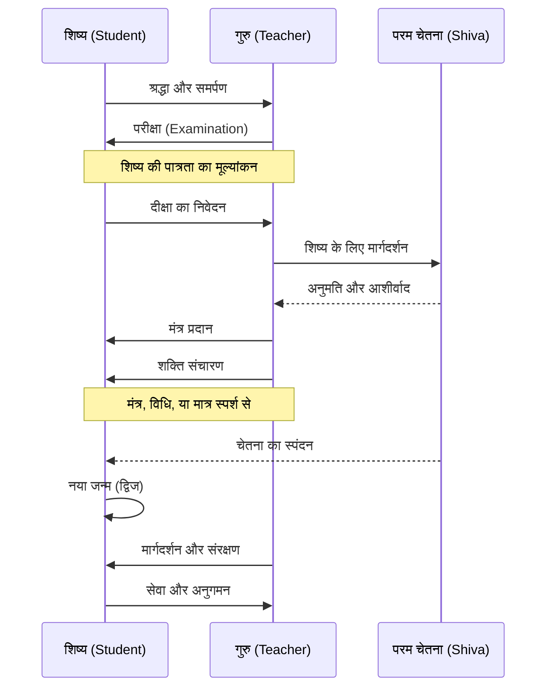
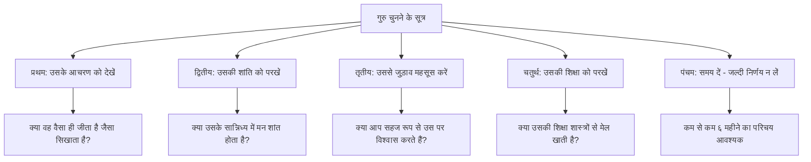

# अध्याय १४: गुरु-शिष्य परंपरा और दीक्षा

## सीखने के उद्देश्य (Learning Objectives)

इस अध्याय को पूरा करने के बाद, आप निम्नलिखित में सक्षम होंगे:

1. कश्मीर शैव दर्शन में गुरु परंपरा के महत्व और स्वरूप को समझना
2. दीक्षा (Initiation) के विभिन्न प्रकारों — शाम्भवी, शाक्ती, आणवी — का विस्तृत ज्ञान प्राप्त करना
3. विज्ञान भैरव तंत्र के प्रमुख संप्रदायों (आचार्य अभिनवगुप्त, सोमानंद, उत्पलदेव) की वंशावली को जानना
4. गुरु-शिष्य संबंध के सिद्धांतों को आधुनिक संदर्भ में अनुप्रयुक्त करना
5. दीक्षा के मनोवैज्ञानिक और आध्यात्मिक आयामों को समझना
6. एक TypeScript Lineage Reference Explorer विकसित करना

---

## प्रस्तावना

> *"गुरुर्ब्रह्मा गुरुर्विष्णुः गुरुर्देवो महेश्वरः। गुरुः साक्षात् परं ब्रह्म तस्मै श्री गुरवे नमः।।"*

**भावार्थ**: गुरु ब्रह्मा हैं, गुरु विष्णु हैं, गुरु ही महेश्वर हैं। गुरु साक्षात् परम ब्रह्म हैं — ऐसे गुरु को नमस्कार।

कश्मीर शैव दर्शन में गुरु को केवल एक शिक्षक नहीं, अपितु चेतना का ही मूर्त रूप माना गया है। विज्ञान भैरव तंत्र की ११२ तकनीकों का प्रसार इसी गुरु-शिष्य परंपरा के माध्यम से हुआ है। बिना गुरु के, ये तकनीकें केवल सैद्धांतिक ज्ञान बनकर रह जाती हैं।

यह अध्याय गुरु-शिष्य संबंध, दीक्षा के प्रकार, और कश्मीर शैव की प्रमुख वंशावली का विस्तृत विवेचन प्रस्तुत करता है।

---

## १. गुरु की अवधारणा (The Concept of Guru)

### १.१ गुरु शब्द का अर्थ

'गु' का अर्थ है अंधकार और 'रु' का अर्थ है उसे दूर करने वाला। जो अंधकार (अज्ञान) को दूर करता है, वह गुरु है।

> *"गुशब्दस्त्वन्धकारः स्यात् रुशब्दस्तन्निरोधकः। अन्धकारनिरोधित्वात् गुरुरित्यभिधीयते।।"*
> — गुरु गीता, श्लोक १६

### १.२ कश्मीर शैव में गुरु का स्वरूप

कश्मीर शैव दर्शन के अनुसार, गुरु तीन स्तरों पर कार्य करता है:

**१. बाह्य गुरु (External Guru)** — वह व्यक्तित्व जो मार्गदर्शन देता है।
**२. आंतरिक गुरु (Internal Guru)** — हृदय में स्थित चेतना जो मार्ग दिखाती है।
**३. परम गुरु (Supreme Guru)** — स्वयं शिव जो सबमें व्याप्त हैं।

> *"गुरुः शिवः शिवो गुरुः स एक एव न भेदः। यः करोति स गुरुर्न तु शिष्यो न शिवः परः।।"*
> — अभिनवगुप्त, तंत्रालोक

**भावार्थ**: गुरु और शिव में कोई भेद नहीं। जो मार्गदर्शन करता है वह गुरु है, और वही शिव है। शिष्य और शिव भी अलग नहीं हैं।

### १.३ गुरु के गुण (Qualities of a Guru)

```mermaid
flowchart TD
    A[गुरु के गुण] --> B[शास्त्रज्ञ - शास्त्रों का ज्ञाता]
    A --> C[स्वानुभूत - स्वयं अनुभव किया हुआ]
    A --> D[कृपालु - दयालु]
    A --> E[निर्मोह - आसक्ति रहित]
    A --> F[सिद्ध - साधना में सिद्ध]
    A --> G[दीक्षाकुशल - दीक्षा देने में निपुण]
    A --> H[शिष्यवत्सल - शिष्यों पर स्नेह]
    
    B --> B1[पाँच प्रकार से शास्त्रज्ञ]
    B1 --> B2[(1) श्रुति - वेद ज्ञान]
    B1 --> B3[(2) स्मृति - धर्मशास्त्र]
    B1 --> B4[(3) आगम - तंत्र शास्त्र]
    B1 --> B5[(4) प्रमाण - तर्क शास्त्र]
    B1 --> B6[(5) अनुभव - आत्मज्ञान]
```

---

## २. दीक्षा: प्रकार और स्वरूप (Types and Forms of Initiation)

दीक्षा संस्कृत धातु 'दा' से बनी है — जो दान करना, देना दर्शाता है। दीक्षा में गुरु शिष्य को आध्यात्मिक ज्ञान और शक्ति का दान करता है।

> *"दीयते ज्ञानमक्षय्यं क्षीयते पाशबन्धनम्। दीक्षेति कथ्यते सद्भिः संसारार्णवतारिणी।।"*

**भावार्थ**: जिसमें अक्षय ज्ञान दिया जाता है और पाश (बंधन) का क्षय होता है, वह दीक्षा है — जो संसार सागर से पार कराती है।

### २.१ दीक्षा के तीन प्रकार

कश्मीर शैव दर्शन में दीक्षा तीन प्रकार की मानी गई है:

```mermaid
flowchart LR
    subgraph आणवी[आणवी दीक्षा]
        A1[क्रिया प्रधान]
        A2[मंत्र जाप]
        A3[पूजा-विधान]
        A4[धीरे-धीरे प्रगति]
    end
    
    subgraph शाक्ती[शाक्ती दीक्षा]
        B1[शक्ति प्रधान]
        B2[प्राणायाम]
        B3[कुंडलिनी जागरण]
        B4[शीघ्र प्रगति]
    end
    
    subgraph शाम्भवी[शाम्भवी दीक्षा]
        C1[चेतना प्रधान]
        C2[समर्पण]
        C3[सहज समाधि]
        C4[तत्क्षण सिद्धि]
    end
    
    आणवी --> शाक्ती
    शाक्ती --> शाम्भवी
```

#### २.१.१ आणवी दीक्षा (Āṇavī Dīkṣā)

आणवी दीक्षा सबसे क्रमिक (gradual) मार्ग है। इसमें शिष्य को मंत्र, क्रिया और विधियों के माध्यम से धीरे-धीरे ऊपर उठाया जाता है।

**विशेषताएँ**:
- मंत्र दीक्षा — विशिष्ट मंत्रों का जाप
- क्रिया दीक्षा — पूजा, अनुष्ठान, और यज्ञ
- व्रत और नियमों का पालन
- नियमित साधना

**किसके लिए**: जिनकी चेतना प्रारंभिक अवस्था में है और जो क्रमिक मार्ग चाहते हैं।

#### २.१.२ शाक्ती दीक्षा (Śāktī Dīkṣā)

शाक्ती दीक्षा में गुरु अपनी शक्ति को शिष्य में संचारित करता है। यह अधिक तीव्र और प्रभावशाली होती है।

**विशेषताएँ**:
- शक्तिपात — गुरु अपनी ऊर्जा शिष्य को हस्तांतरित करता है
- प्राण प्रतिष्ठा — शिष्य के प्राणों में चेतना का संचार
- कुंडलिनी जागरण — सुप्त ऊर्जा का जाग्रत होना
- गहन ध्यान के अनुभव

**किसके लिए**: जो पहले से साधना में लगे हैं और तीव्र प्रगति चाहते हैं।

#### २.१.३ शाम्भवी दीक्षा (Śāmbhavī Dīkṣā)

शाम्भवी दीक्षा सर्वोच्च दीक्षा है। इसमें गुरु के मात्र संकल्प या स्पर्श से शिष्य को उच्चतम चेतना का अनुभव होता है।

> *"शाम्भवी दीक्षा प्राप्य सद्य एव शिवो भवेत्। न तत्र कर्म नो भावो न चिन्ता न च साधनम्।।"*

**भावार्थ**: शाम्भवी दीक्षा प्राप्त करके साधक तत्क्षण शिव हो जाता है। उसमें न कर्म, न भाव, न चिंता, न साधना शेष रहती है।

**विशेषताएँ**:
- तत्क्षण सिद्धि — बिना किसी साधना के
- गुरु की कृपा मात्र से
- शिष्य की कोई पात्रता आवश्यक नहीं
- अत्यंत दुर्लभ

**किसके लिए**: अत्यंत विरल शिष्य जो पूर्ण रूप से समर्पित हो।

### २.२ दीक्षा की प्रक्रिया



---

## ३. कश्मीर शैव की गुरु वंशावली (Guru Lineage of Kashmir Shaivism)

### ३.१ प्रमुख आचार्य

कश्मीर शैव दर्शन की वंशावली अत्यंत समृद्ध है। यहाँ प्रमुख आचार्यों का परिचय दिया जा रहा है:

```mermaid
flowchart TD
    subgraph मूल[मूल स्रोत]
        A[भगवान शिव<br>स्वयं] --> B[देवी देवी]
    end
    
    subgraph प्रथम[प्रथम पीढ़ी]
        B --> C[दुर्वासा ऋषि]
    end
    
    subgraph द्वितीय[द्वितीय पीढ़ी]
        C --> D[त्र्यम्बक]
        D --> E[अमर्दक]
    end
    
    subgraph मध्य[मध्यकालीन आचार्य]
        E --> F[वासुगुप्त]
        F --> G[शिवस्वामी]
        G --> H[उत्पलदेव]
        H --> I[लक्ष्मण गुप्त]
        I --> J[अभिनवगुप्त]
    end
    
    subgraph आधुनिक[आधुनिक आचार्य]
        J --> K[क्षेमराज]
        J --> L[जयरथ]
        K --> M[महेश्वरानंद]
        L --> N[स्वामी लक्ष्मण जू]
        N --> O[स्वामी मुक्तानंद]
        O --> P[स्वामी शांतानंद]
    end
    
    style A fill:#f9d71c,stroke:#333
    style F fill:#e1b12c,stroke:#333
    style J fill:#e1b12c,stroke:#333
    style N fill:#e1b12c,stroke:#333
```

### ३.२ आचार्य अभिनवगुप्त (Acarya Abhinavagupta)

अभिनवगुप्त (९५०-१०२० ई.) कश्मीर शैव दर्शन के सबसे महान आचार्य हैं। उन्होंने विज्ञान भैरव तंत्र पर सबसे प्रसिद्ध टीका लिखी।

> *"विज्ञान भैरवं नाम तन्त्रं भैरवशासनम्। तत्र यद्ध्यानसोपानं भैरवीयं प्रकाशितम्।।"*
> — अभिनवगुप्त, तंत्रालोक

**अभिनवगुप्त की प्रमुख रचनाएँ**:
- तंत्रालोक (Tantrāloka) — कश्मीर शैव का विश्वकोश
- तंत्रसार (Tantrasāra) — तंत्रालोक का सार
- विज्ञान भैरव टीका (Vijñāna Bhairava Ṭīkā)
- ईश्वर प्रत्यभिज्ञा विमर्शिनी
- परात्रिंशिका लघुवृत्ति
- ध्वन्यालोक लोचन (काव्य शास्त्र)

### ३.३ आचार्य सोमानंद (Ācārya Somānanda)

सोमानंद (९००-९५० ई.) कश्मीर शैव के प्रत्यभिज्ञा दर्शन के संस्थापक हैं। उन्होंने शिव दृष्टि नामक ग्रंथ लिखा।

> *"स्वतन्त्रोऽस्मि सदा शुद्धो बुद्धोऽस्मि प्रकृतिर्हि मे। न मे बन्धो न मे मोक्षः स्वभावो मे शिवात्मकः।।"*
> — सोमानंद, शिवदृष्टि

**भावार्थ**: मैं सदा स्वतंत्र हूँ, शुद्ध हूँ, बुद्ध हूँ — यही मेरी प्रकृति है। न मेरा बंधन है, न मोक्ष — मेरा स्वभाव शिवमय है।

### ३.४ आचार्य उत्पलदेव (Ācārya Utpaladeva)

उत्पलदेव (९२५-९७५ ई.) ने प्रत्यभिज्ञा दर्शन को व्यवस्थित रूप दिया। उनकी प्रमुख रचनाएँ:

- ईश्वर प्रत्यभिज्ञा कारिका
- ईश्वर प्रत्यभिज्ञा वृत्ति
- शिव स्तोत्रावली (भक्ति ग्रंथ)

> *"प्रत्यभिज्ञा परं ज्ञानं यया शिवमयं जगत्। दृश्यते सैव दीक्षेति कथ्यते शिवशासने।।"*

**भावार्थ**: प्रत्यभिज्ञा (पुनरभिज्ञान) परम ज्ञान है जिससे यह समस्त जगत शिवमय दिखता है। यही सच्ची दीक्षा है।

---

## ४. शिष्य की पात्रता (Qualifications of a Disciple)

### ४.१ चार प्रकार के शिष्य

```mermaid
flowchart TD
    subgraph शिष्य[शिष्य के प्रकार]
        A[मृदु - मंद अधिकारी]
        B[मध्यम - मध्यम अधिकारी]
        C[तीव्र - तीव्र अधिकारी]
        D[तीव्रतम - अति तीव्र अधिकारी]
    end
    
    A --> A1[बहुत समय लगता है]
    A --> A2[क्रिया प्रधान दीक्षा]
    A --> A3[बार-बार निर्देश आवश्यक]
    
    B --> B1[मध्यम समय]
    B --> B2[शक्ति प्रधान दीक्षा]
    B --> B3[कम निर्देश पर्याप्त]
    
    C --> C1[कम समय]
    C --> C2[शाम्भवी दीक्षा संभव]
    C --> C3[स्वयं मार्ग खोज लेते हैं]
    
    D --> D1[तत्क्षण सिद्धि]
    D --> D2[मात्र संकल्प से]
    D --> D3[गुरु समान ही]
```

### ४.२ शिष्य के गुण

> *"जिज्ञासुः श्रोतव्यो मननशीलः श्रद्दधानः समाहितचित्तः। स एव शिष्यो गुरुवाक्यतत्परः।।"*

**शिष्य के आवश्यक गुण**:

1. **श्रद्धा** (Faith) — गुरु और शास्त्र पर अटूट विश्वास
2. **जिज्ञासा** (Inquisitiveness) — सत्य जानने की तीव्र प्यास
3. **विनय** (Humility) — अहंकार का अभाव
4. **समर्पण** (Surrender) — गुरु के प्रति पूर्ण समर्पण
5. **सेवा** (Service) — गुरु की सेवा में तत्परता
6. **गोपनीयता** (Confidentiality) — दीक्षा रहस्यों को गुप्त रखना
7. **नियमितता** (Regularity) — नियमित अभ्यास

---

## ५. आधुनिक संदर्भ में गुरु-शिष्य परंपरा

### ५.१ दूरस्थ दीक्षा (Remote Initiation)

आधुनिक युग में भौगोलिक दूरियों के कारण दूरस्थ दीक्षा (Online Initiation) का प्रचलन बढ़ा है। कश्मीर शैव में दूरस्थ दीक्षा को स्वीकार किया गया है:

> *"देशतः कालतो वापि गुरुणा या प्रदीयते। दीक्षा तु सा स्मृता सद्भिरन्तरिक्षप्रभेदिनी।।"*

**भावार्थ**: जो दीक्षा गुरु द्वारा देश या काल की दूरी से दी जाती है, वह भी मान्य है — यह अंतरिक्ष को भेदने वाली होती है।

### ५.२ आंतरिक गुरु की खोज

आधुनिक साधक के लिए सबसे महत्वपूर्ण है — अपने आंतरिक गुरु (अंतरात्मा) से जुड़ना। बाह्य गुरु आंतरिक गुरु के द्वार खोलने में सहायक होता है।

> *"गुरोरपि गुरुः कोऽपि स्वयं चैव गुरुर्गुरोः। अन्तर्यामी सदा विद्वान् गुरुरेव न संशयः।।"*

**भावार्थ**: गुरु का भी कोई गुरु है — और वह स्वयं अंतर्यामी (अंतरात्मा) है। इसमें संदेह नहीं।

### ५.३ गुरु चुनने के सूत्र



---

## ६. TypeScript कार्यान्वयन: गुरु-शिष्य वंशावली अन्वेषक

```typescript
/**
 * गुरु-शिष्य परंपरा वंशावली अन्वेषक
 * (Guru-Shishya Parampara Lineage Reference Explorer)
 * 
 * यह उपकरण कश्मीर शैव दर्शन की प्रमुख गुरु वंशावली को
 * संगठित करता है और साधक को उनके सिद्धांतों और ग्रंथों
 * की खोज में सहायता करता है।
 * 
 * @package VigyanBhairavTantra
 * @version 1.0.0
 */

// === मुख्य प्रकार ===

interface Guru {
    id: string;
    name: string;
    nameSanskrit: string;
    title: string;
    birthYear: number;
    deathYear: number;
    century: string;
    region: string;
    gurus: string[];
    disciples: string[];
    keyWorks: Scripture[];
    philosophy: string;
    biography: string;
    teachings: Teaching[];
    lineageId: string;
}

interface Scripture {
    title: string;
    titleSanskrit: string;
    type: 'sutra' | 'karika' | 'vrtti' | 'tantra' | 'stotra' | 'commentary';
    description: string;
    versesCount?: number;
    keyQuotes: string[];
}

interface Teaching {
    id: string;
    title: string;
    titleSanskrit: string;
    summary: string;
    coreConcept: string;
    relevantTechniques: number[];
}

interface Lineage {
    id: string;
    name: string;
    nameSanskrit: string;
    founder: string;
    century: string;
    description: string;
    keyDoctrine: string;
    gurus: string[];
}

interface InitiationType {
    id: string;
    name: string;
    nameSanskrit: string;
    level: 'primary' | 'intermediate' | 'advanced' | 'supreme';
    method: 'kriya' | 'mantra' | 'shakti' | 'sambhavi';
    duration: string;
    prerequisites: string[];
    effects: string[];
    scripturalBasis: string[];
}

// === गुरु डेटाबेस ===

const GURU_DATABASE: Record<string, Guru> = {
    shiva: {
        id: 'shiva',
        name: 'भगवान शिव',
        nameSanskrit: 'शिवः',
        title: 'आदिगुरु (Primordial Guru)',
        birthYear: 0,
        deathYear: 0,
        century: 'अनादि (Timeless)',
        region: 'कैलास',
        gurus: [],
        disciples: ['devi', 'durvasa'],
        keyWorks: [
            {
                title: 'विज्ञान भैरव तंत्र',
                titleSanskrit: 'विज्ञानभैरवतन्त्रम्',
                type: 'tantra',
                description: '११२ ध्यान तकनीकों का संग्रह, भैरव और भैरवी के संवाद में',
                versesCount: 163,
                keyQuotes: ['यत्र यत्र मनो याति बाह्ये वाभ्यन्तरेऽथवा']
            }
        ],
        philosophy: 'स्वतंत्र चेतना का सिद्धांत — सब कुछ शिव है, शिव ही कर्ता है',
        biography: 'भगवान शिव को कश्मीर शैव परंपरा में आदिगुरु माना जाता है। उन्होंने देवी पार्वती को ११२ ध्यान तकनीकों का उपदेश दिया।',
        teachings: [
            {
                id: 't1',
                title: 'चेतना की सर्वव्यापकता',
                titleSanskrit: 'चेतनायाः सर्वव्यापकता',
                summary: 'सब कुछ चेतना का खेल है। जो दिखता है वह शिव है, जो दिखाता है वह शिव है।',
                coreConcept: 'चिति — सार्वभौम चेतना',
                relevantTechniques: [1, 2, 3, 120]
            }
        ],
        lineageId: 'adi-shaiya'
    },
    vasugupta: {
        id: 'vasugupta',
        name: 'वासुगुप्त',
        nameSanskrit: 'वासुगुप्तः',
        title: 'प्रथम ऐतिहासिक आचार्य',
        birthYear: 800,
        deathYear: 875,
        century: 'नवम शताब्दी',
        region: 'कश्मीर',
        gurus: ['shiva'],  // divine revelation
        disciples: ['shivaswami', 'kallata'],
        keyWorks: [
            {
                title: 'शिव सूत्र',
                titleSanskrit: 'शिवसूत्राणि',
                type: 'sutra',
                description: 'कश्मीर शैव का मूल ग्रंथ, ७७ सूत्रों में संपूर्ण दर्शन',
                versesCount: 77,
                keyQuotes: ['चैतन्यमात्मा', 'ज्ञानं बन्धः']
            }
        ],
        philosophy: 'प्रत्यभिज्ञा दर्शन का बीज — चैतन्य ही आत्मा है',
        biography: 'वासुगुप्त को कश्मीर शैव परंपरा का प्रथम ऐतिहासिक आचार्य माना जाता है। महर्षि दुर्वासा से प्राप्त शिव सूत्रों को उन्होंने प्रकट किया।',
        teachings: [
            {
                id: 't2',
                title: 'चैतन्य ही आत्मा',
                titleSanskrit: 'चैतन्यमात्मा',
                summary: 'आत्मा कोई जड़ पदार्थ नहीं, अपितु शुद्ध चैतन्य है। वही सबमें व्याप्त है।',
                coreConcept: 'चैतन्य — pure consciousness',
                relevantTechniques: [1, 2, 3]
            }
        ],
        lineageId: 'kashmir-shaiya'
    },
    somananda: {
        id: 'somananda',
        name: 'सोमानंद',
        nameSanskrit: 'सोमानन्दः',
        title: 'प्रत्यभिज्ञा दर्शन के संस्थापक',
        birthYear: 880,
        deathYear: 940,
        century: 'दशम शताब्दी',
        region: 'कश्मीर',
        gurus: ['vasugupta'],
        disciples: ['utpaladeva'],
        keyWorks: [
            {
                title: 'शिव दृष्टि',
                titleSanskrit: 'शिवदृष्टिः',
                type: 'karika',
                description: 'प्रत्यभिज्ञा दर्शन का मूल ग्रंथ — शिव को ही सब कुछ देखना',
                versesCount: 195,
                keyQuotes: ['स्वतन्त्रोऽस्मि सदा शुद्धो बुद्धोऽस्मि']
            }
        ],
        philosophy: 'शिव-दृष्टि — सब कुछ शिव की दृष्टि से देखना',
        biography: 'सोमानंद प्रत्यभिज्ञा दर्शन के संस्थापक हैं। उन्होंने स्थापित किया कि संपूर्ण ब्रह्मांड शिव की अभिव्यक्ति है।',
        teachings: [
            {
                id: 't3',
                title: 'स्वतंत्र आत्मा',
                titleSanskrit: 'स्वतन्त्रात्मा',
                summary: 'आत्मा सदा स्वतंत्र, शुद्ध और बुद्ध है। न बंधन है न मोक्ष — स्वभाव ही शिव है।',
                coreConcept: 'स्वतंत्रता — absolute freedom',
                relevantTechniques: [55, 56, 57]
            }
        ],
        lineageId: 'kashmir-shaiya'
    },
    utpaladeva: {
        id: 'utpaladeva',
        name: 'उत्पलदेव',
        nameSanskrit: 'उत्पलदेवः',
        title: 'प्रत्यभिज्ञा के व्यवस्थापक',
        birthYear: 900,
        deathYear: 970,
        century: 'दशम शताब्दी',
        region: 'कश्मीर',
        gurus: ['somananda', 'shivaswami'],
        disciples: ['lakshmana_gupta', 'bhatta_kallata'],
        keyWorks: [
            {
                title: 'ईश्वर प्रत्यभिज्ञा कारिका',
                titleSanskrit: 'ईश्वरप्रत्यभिज्ञाकारिका',
                type: 'karika',
                description: 'प्रत्यभिज्ञा दर्शन का मुख्य ग्रंथ — आत्मा की ईश्वरता का पुनरभिज्ञान',
                versesCount: 202,
                keyQuotes: ['अत्र प्रत्यभिज्ञा नाम परं ज्ञानम्']
            },
            {
                title: 'शिव स्तोत्रावली',
                titleSanskrit: 'शिवस्तोत्रावली',
                type: 'stotra',
                description: 'शिव की स्तुति का भक्तिपूर्ण संग्रह',
                versesCount: 45,
                keyQuotes: ['त्वं चाहं च शिवश्चान्यः']
            }
        ],
        philosophy: 'प्रत्यभिज्ञा — जीव का ईश्वर से पुनरभिज्ञान',
        biography: 'उत्पलदेव ने प्रत्यभिज्ञा दर्शन को एक व्यवस्थित दार्शनिक प्रणाली का रूप दिया। उन्होंने बताया कि जीव और शिव के बीच का भेद केवल अज्ञान के कारण है।',
        teachings: [
            {
                id: 't4',
                title: 'प्रत्यभिज्ञा सिद्धांत',
                titleSanskrit: 'प्रत्यभिज्ञायाः सिद्धान्तः',
                summary: 'हम ईश्वर को खोजते नहीं, अपितु पहचानते हैं — वह हमसे कभी अलग था ही नहीं।',
                coreConcept: 'प्रत्यभिज्ञा — recognition',
                relevantTechniques: [61, 62, 63, 64]
            }
        ],
        lineageId: 'kashmir-shaiya'
    },
    abhinavagupta: {
        id: 'abhinavagupta',
        name: 'अभिनवगुप्त',
        nameSanskrit: 'अभिनवगुप्तः',
        title: 'महामाहेश्वराचार्य',
        birthYear: 950,
        deathYear: 1020,
        century: 'दशम-एकादश शताब्दी',
        region: 'कश्मीर',
        gurus: ['lakshmana_gupta', 'bhatta_kallata', 'bhatta_srikantha'],
        disciples: ['kshemaraja', 'jayaratha', 'madhavi'],
        keyWorks: [
            {
                title: 'तंत्रालोक',
                titleSanskrit: 'तन्त्रालोकः',
                type: 'commentary',
                description: 'कश्मीर शैव का महाकोश — ३७ प्रकाशों में संपूर्ण दर्शन',
                versesCount: 5854,
                keyQuotes: ['चिदानन्दात्मको भैरवः', 'स्वातन्त्र्यं चैतन्यम्']
            },
            {
                title: 'तंत्रसार',
                titleSanskrit: 'तन्त्रसारः',
                type: 'commentary',
                description: 'तंत्रालोक का सार संग्रह',
                versesCount: 1200,
                keyQuotes: []
            },
            {
                title: 'विज्ञान भैरव टीका',
                titleSanskrit: 'विज्ञानभैरवटीका',
                type: 'commentary',
                description: 'विज्ञान भैरव तंत्र की सबसे प्रसिद्ध टीका',
                versesCount: 163,
                keyQuotes: ['भैरवः परमेश्वरः']
            },
            {
                title: 'परात्रिंशिका लघुवृत्ति',
                titleSanskrit: 'परात्रिंशिकालघुवृत्तिः',
                type: 'commentary',
                description: 'देवी परात्रिंशिका पर टीका',
                versesCount: 300,
                keyQuotes: []
            }
        ],
        philosophy: 'पूर्ण अद्वैत — अभिनवगुप्त का संश्लेषित दर्शन',
        biography: 'अभिनवगुप्त कश्मीर शैव के सर्वश्रेष्ठ आचार्य हैं। उन्होंने अपने समय के सभी दार्शनिक मतों का अध्ययन कर एक समग्र दर्शन प्रस्तुत किया। उन्होंने विज्ञान भैरव तंत्र पर गहन टीका लिखी।',
        teachings: [
            {
                id: 't5',
                title: 'चिति — सार्वभौम चेतना',
                titleSanskrit: 'चितिः सार्वभौमा चेतना',
                summary: 'संपूर्ण ब्रह्मांड चिति (चेतना) का विस्तार है। चिति ही सजग है, चिति ही शक्ति है, चिति ही शिव है।',
                coreConcept: 'चिति — universal consciousness',
                relevantTechniques: [1, 2, 3, 10, 20, 30, 40]
            }
        ],
        lineageId: 'kashmir-shaiya'
    },
    kshemaraja: {
        id: 'kshemaraja',
        name: 'क्षेमराज',
        nameSanskrit: 'क्षेमराजः',
        title: 'प्रसिद्ध टीकाकार',
        birthYear: 1000,
        deathYear: 1050,
        century: 'ग्यारहवीं शताब्दी',
        region: 'कश्मीर',
        gurus: ['abhinavagupta'],
        disciples: ['maheshvarananda', 'bhatta_ramakantha'],
        keyWorks: [
            {
                title: 'शिव सूत्र विमर्शिनी',
                titleSanskrit: 'शिवसूत्रविमर्शिनी',
                type: 'commentary',
                description: 'वासुगुप्त के शिव सूत्रों पर प्रसिद्ध टीका',
                versesCount: 500,
                keyQuotes: ['चैतन्यं शिवः']
            },
            {
                title: 'प्रत्यभिज्ञा हृदय',
                titleSanskrit: 'प्रत्यभिज्ञाहृदयम्',
                type: 'sutra',
                description: 'प्रत्यभिज्ञा दर्शन का सार — २० सूत्रों में',
                versesCount: 20,
                keyQuotes: ['चितिः स्वतन्त्रा विश्वसिद्धिहेतुः']
            }
        ],
        philosophy: 'चिति स्वतंत्रा — चेतना ही स्वतंत्र है और सृष्टि का कारण',
        biography: 'क्षेमराज अभिनवगुप्त के प्रमुख शिष्य थे। उन्होंने शिव सूत्रों और प्रत्यभिज्ञा पर महत्वपूर्ण टीकाएँ लिखीं।',
        teachings: [
            {
                id: 't6',
                title: 'चिति स्वतंत्रा',
                titleSanskrit: 'चितिः स्वतन्त्रा',
                summary: 'चेतना स्वतंत्र है और संपूर्ण ब्रह्मांड की सिद्धि का कारण है। वही अपनी इच्छा से जगत का निर्माण करती है।',
                coreConcept: 'चिति स्वातंत्र्य — freedom of consciousness',
                relevantTechniques: [55, 56, 57, 58]
            }
        ],
        lineageId: 'kashmir-shaiya'
    },
    jayaratha: {
        id: 'jayaratha',
        name: 'जयरथ',
        nameSanskrit: 'जयरथः',
        title: 'तंत्रालोक के व्याख्याकार',
        birthYear: 1150,
        deathYear: 1250,
        century: 'बारहवीं-तेरहवीं शताब्दी',
        region: 'कश्मीर',
        gurus: ['abhinavagupta'],  // parampara through text
        disciples: [],
        keyWorks: [
            {
                title: 'तंत्रालोक विवेक',
                titleSanskrit: 'तन्त्रालोकविवेकः',
                type: 'commentary',
                description: 'अभिनवगुप्त के तंत्रालोक पर विस्तृत टीका',
                versesCount: 10000,
                keyQuotes: []
            }
        ],
        philosophy: 'अभिनवगुप्त के दर्शन का संरक्षण',
        biography: 'जयरथ ने तंत्रालोक पर विवेक नामक टीका लिखी। उनके बिना तंत्रालोक के कई अंश समझ में नहीं आते।',
        teachings: [
            {
                id: 't7',
                title: 'गुरु परंपरा का महत्व',
                titleSanskrit: 'गुरुपरम्परायाः महत्त्वम्',
                summary: 'गुरु के बिना तंत्र शास्त्र का अर्थ समझना असंभव है।',
                coreConcept: 'parampara — tradition',
                relevantTechniques: []
            }
        ],
        lineageId: 'kashmir-shaiya'
    }
};

// === दीक्षा प्रकार डेटाबेस ===

const INITIATION_TYPES: InitiationType[] = [
    {
        id: 'anavi',
        name: 'आणवी दीक्षा',
        nameSanskrit: 'आणवी दीक्षा',
        level: 'primary',
        method: 'kriya',
        duration: '६ माह से ३ वर्ष',
        prerequisites: ['श्रद्धा', 'विनय', 'नियमितता'],
        effects: ['मन की शुद्धि', 'एकाग्रता वृद्धि', 'प्राणों का नियमन'],
        scripturalBasis: [
            'शिव सूत्र १.२ — ज्ञानं बन्धः',
            'नेत्र तंत्र — क्रिया प्रधान मार्ग'
        ]
    },
    {
        id: 'shakti',
        name: 'शाक्ती दीक्षा',
        nameSanskrit: 'शाक्ती दीक्षा',
        level: 'intermediate',
        method: 'shakti',
        duration: '३ माह से १ वर्ष',
        prerequisites: ['गुरु पर विश्वास', 'समर्पण', 'साधना में नियमितता'],
        effects: ['कुंडलिनी जागरण', 'प्राण का उच्च स्तर पर संचार', 'गहन ध्यान के द्वार खुलना'],
        scripturalBasis: [
            'विज्ञान भैरव — शक्ति संचारण तकनीक',
            'तंत्रालोक १३ — शक्तिपात'
        ]
    },
    {
        id: 'sambhavi',
        name: 'शाम्भवी दीक्षा',
        nameSanskrit: 'शाम्भवी दीक्षा',
        level: 'supreme',
        method: 'sambhavi',
        duration: 'एक क्षण में',
        prerequisites: ['पूर्ण समर्पण', 'गुरु की कृपा'],
        effects: ['तत्क्षण चेतना का उद्घाटन', 'द्वैत का अंत', 'शिव-भाव में स्थिति'],
        scripturalBasis: [
            'विज्ञान भैरव — शाम्भवी उपाय',
            'तंत्रालोक १ — शाम्भवी दीक्षा पर प्रकाश'
        ]
    }
];

// === गुरु-शिष्य संबंध प्रबंधन ===

class LineageExplorer {
    private gurus: Map<string, Guru>;
    private lineages: Map<string, Lineage>;

    constructor() {
        this.gurus = new Map(Object.entries(GURU_DATABASE));
        this.lineages = new Map();
        this.initializeLineages();
    }

    private initializeLineages(): void {
        const adiShaiya: Lineage = {
            id: 'adi-shaiya',
            name: 'आदि शैव परंपरा',
            nameSanskrit: 'आदिशैवपरम्परा',
            founder: 'शिव',
            century: 'अनादि',
            description: 'यह परंपरा स्वयं भगवान शिव से आरंभ होती है। विज्ञान भैरव तंत्र इसी परंपरा का सबसे महत्वपूर्ण ग्रंथ है।',
            keyDoctrine: 'सर्वं शिवमयम् — सब कुछ शिव से व्याप्त है',
            gurus: ['shiva', 'devi', 'durvasa']
        };

        const kashmirShaiya: Lineage = {
            id: 'kashmir-shaiya',
            name: 'कश्मीर शैव परंपरा',
            nameSanskrit: 'काश्मीरशैवपरम्परा',
            founder: 'वासुगुप्त',
            century: 'नवम शताब्दी',
            description: 'कश्मीर शैव परंपरा वासुगुप्त द्वारा प्रकट शिव सूत्रों से आरंभ हुई। इसे त्रिक दर्शन भी कहते हैं।',
            keyDoctrine: 'चैतन्यमात्मा — चैतन्य ही आत्मा है',
            gurus: ['vasugupta', 'somananda', 'utpaladeva', 'abhinavagupta', 'kshemaraja', 'jayaratha']
        };

        this.lineages.set('adi-shaiya', adiShaiya);
        this.lineages.set('kashmir-shaiya', kashmirShaiya);
    }

    /**
     * गुरु की पूरी जानकारी प्राप्त करें
     */
    getGuruInfo(nameOrId: string): Guru | undefined {
        if (this.gurus.has(nameOrId)) {
            return this.gurus.get(nameOrId);
        }
        // Search by name
        for (const [, guru] of this.gurus) {
            if (guru.name.includes(nameOrId) || guru.nameSanskrit.includes(nameOrId)) {
                return guru;
            }
        }
        return undefined;
    }

    /**
     * गुरु की वंशावली दिखाएँ
     */
    getLineage(guruId: string): GuruGenealogy {
        const guru = this.gurus.get(guruId);
        if (!guru) {
            return { guru: undefined, gurus: [], disciples: [], lineage: [] };
        }

        const gurus = guru.gurus.map(id => this.gurus.get(id)).filter(Boolean);
        const disciples = guru.disciples.map(id => this.gurus.get(id)).filter(Boolean);
        
        const lineage: Guru[] = [];
        // Traverse up the lineage
        let currentGuru: Guru | undefined = guru;
        while (currentGuru) {
            lineage.unshift(currentGuru);
            if (currentGuru.gurus.length > 0) {
                currentGuru = this.gurus.get(currentGuru.gurus[0]);
            } else {
                currentGuru = undefined;
            }
        }

        return {
            guru,
            gurus: gurus as Guru[],
            disciples: disciples as Guru[],
            lineage
        };
    }

    /**
     * दीक्षा प्रकार की जानकारी
     */
    getInitiationInfo(type: string): InitiationType | undefined {
        return INITIATION_TYPES.find(i => i.id === type || i.name.includes(type));
    }

    /**
     * ग्रंथ के आधार पर खोज
     */
    searchByScripture(searchTerm: string): SearchResult[] {
        const results: SearchResult[] = [];
        
        for (const [, guru] of this.gurus) {
            for (const scripture of guru.keyWorks) {
                if (
                    scripture.title.includes(searchTerm) ||
                    scripture.titleSanskrit.includes(searchTerm) ||
                    scripture.description.includes(searchTerm)
                ) {
                    results.push({
                        guru: guru.name,
                        scripture: scripture.title,
                        type: scripture.type
                    });
                }
            }
        }

        return results;
    }

    /**
     * गुरु परंपरा का टाइमलाइन
     */
    generateTimeline(): TimelineEntry[] {
        const timeline: TimelineEntry[] = [];
        
        for (const [, guru] of this.gurus) {
            if (guru.birthYear > 0) {
                timeline.push({
                    year: guru.birthYear,
                    event: `${guru.name} का जन्म`,
                    guru: guru.name,
                    importance: 'high'
                });
            }
            if (guru.deathYear > 0) {
                timeline.push({
                    year: guru.deathYear,
                    event: `${guru.name} का महासमाधि`,
                    guru: guru.name,
                    importance: 'medium'
                });
            }
        }

        return timeline.sort((a, b) => a.year - b.year);
    }

    /**
     * वंशावली को JSON में निर्यात करें
     */
    exportLineageData(): LineageExport {
        return {
            gurus: Array.from(this.gurus.values()),
            lineages: Array.from(this.lineages.values()),
            initiations: INITIATION_TYPES,
            generatedAt: new Date(),
            totalGurus: this.gurus.size,
            totalLineages: this.lineages.size
        };
    }
}

// === सहायक प्रकार ===

interface GuruGenealogy {
    guru: Guru | undefined;
    gurus: Guru[];
    disciples: Guru[];
    lineage: Guru[];
}

interface SearchResult {
    guru: string;
    scripture: string;
    type: string;
}

interface TimelineEntry {
    year: number;
    event: string;
    guru: string;
    importance: 'low' | 'medium' | 'high';
}

interface LineageExport {
    gurus: Guru[];
    lineages: Lineage[];
    initiations: InitiationType[];
    generatedAt: Date;
    totalGurus: number;
    totalLineages: number;
}

// === उपयोग उदाहरण ===

function demonstrateLineageExplorer(): void {
    console.log('=== गुरु-शिष्य वंशावली अन्वेषक ===');
    console.log('=== Guru-Shishya Lineage Explorer ===\n');

    const explorer = new LineageExplorer();

    // अभिनवगुप्त की जानकारी
    const abhinava = explorer.getGuruInfo('abhinavagupta');
    if (abhinava) {
        console.log(`गुरु: ${abhinava.name} (${abhinava.nameSanskrit})`);
        console.log(`उपाधि: ${abhinava.title}`);
        console.log(`काल: ${abhinava.birthYear}-${abhinava.deathYear} ई.`);
        console.log(`दर्शन: ${abhinava.philosophy}\n`);

        console.log('प्रमुख ग्रंथ:');
        abhinava.keyWorks.forEach(w => {
            console.log(`  • ${w.title} (${w.titleSanskrit}) — ${w.description}`);
        });
        console.log();
    }

    // वंशावली दिखाएँ
    const lineage = explorer.getLineage('abhinavagupta');
    console.log('वंशावली (Lineage):');
    lineage.lineage.forEach((g, i) => {
        const prefix = '  '.repeat(i);
        console.log(`${prefix}→ ${g.name} (${g.title})`);
    });
    console.log();

    // शिष्य दिखाएँ
    console.log('प्रमुख शिष्य (Disciples):');
    lineage.disciples.forEach(d => {
        console.log(`  • ${d.name} (${d.title})`);
    });
    console.log();

    // दीक्षा प्रकार
    console.log('दीक्षा के प्रकार (Types of Initiation):');
    INITIATION_TYPES.forEach(i => {
        console.log(`  ${i.name} (${i.nameSanskrit})`);
        console.log(`    स्तर: ${i.level}, विधि: ${i.method}`);
        console.log(`    प्रभाव: ${i.effects.join(', ')}`);
        console.log();
    });

    // टाइमलाइन
    console.log('गुरु परंपरा कालक्रम (Timeline):');
    const timeline = explorer.generateTimeline();
    timeline.forEach(t => {
        console.log(`  ${t.year} ई. — ${t.event}`);
    });
}

demonstrateLineageExplorer();

export {
    LineageExplorer,
    GURU_DATABASE,
    INITIATION_TYPES,
    type Guru,
    type Lineage,
    type InitiationType,
    type Scripture,
    type Teaching,
    type GuruGenealogy,
    type LineageExport
};
```

---

## ७. साधक के लिए व्यावहारिक मार्गदर्शन

### ७.१ गुरु की खोज (Finding a Guru)

गुरु की खोज में धैर्य रखें। यह व्यक्तिगत यात्रा है और इसमें जल्दबाजी न करें।

**सुझाव**:
1. अपने अंतर में गुरु की खोज शुरू करें — बाह्य गुरु आंतरिक गुरु का प्रतिबिंब है।
2. विभिन्न सत्संगों में जाएँ, संतों के प्रवचन सुनें।
3. तीन बातें परखें: आचरण, शांति, और जुड़ाव।
4. कम से कम ६ माह का समय लें।
5. एक बार गुरु मिल जाए, तो पूर्ण श्रद्धा और समर्पण रखें।

### ७.२ गुरु-शिष्य संबंध के नियम

> *"गुरोराज्ञा शिरोधार्या शिष्येण नात्र संशयः। आज्ञाभङ्गे महान् दोषो मरणादतिरिच्यते।।"*

**भावार्थ**: गुरु की आज्ञा का पालन शिष्य को अवश्य करना चाहिए। आज्ञा भंग में मृत्यु से भी बड़ा दोष है — यह आध्यात्मिक मृत्यु है।

### ७.३ आधुनिक युग में अनुकूलन

आधुनिक युग में जहाँ भौतिक रूप से गुरु के पास रहना संभव नहीं, वहाँ:

1. **वर्चुअल दीक्षा** — कई गुरु वीडियो कॉल के माध्यम से दीक्षा देते हैं।
2. **पुस्तक दीक्षा** — ग्रंथों के अध्ययन से भी दीक्षा का लाभ मिलता है।
3. **मानसिक दीक्षा** — गुरु के ध्यान से शक्ति संचारण होता है।
4. **स्व-दीक्षा** — आंतरिक गुरु से जुड़कर स्वयं को दीक्षित करना।

---

## सारांश (Summary)

इस अध्याय में हमने गुरु-शिष्य परंपरा और दीक्षा के विभिन्न आयामों का अध्ययन किया:

1. गुरु शब्द का अर्थ — 'गु' अंधकार, 'रु' निवारक — अज्ञान अंधकार को दूर करने वाला।
2. दीक्षा के तीन प्रकार — आणवी (क्रिया प्रधान), शाक्ती (शक्ति प्रधान), शाम्भवी (चेतना प्रधान)।
3. कश्मीर शैव की प्रमुख गुरु वंशावली — वासुगुप्त से अभिनवगुप्त तक।
4. शिष्य की पात्रता के गुण — श्रद्धा, जिज्ञासा, विनय, समर्पण।
5. आधुनिक संदर्भ में गुरु-शिष्य परंपरा का अनुकूलन।

> *"गुरु के बिना तंत्र शास्त्र का ज्ञान अधूरा है। वह केवल जानकारी दे सकता है, पर अनुभव नहीं। गुरु ही वह सेतु है जो शास्त्र और अनुभव के बीच जोड़ता है।"*

---

## अध्याय प्रश्नोत्तरी (Chapter Quiz)

### बहुविकल्पीय प्रश्न

**प्रश्न १**: 'गुरु' शब्द का अर्थ क्या है?
- क) बड़ा
- ख) अंधकार दूर करने वाला
- ग) ज्ञानी
- घ) शिक्षक

> **उत्तर**: ख) 'गु' अंधकार, 'रु' निवारक — जो अंधकार दूर करे वह गुरु।

**प्रश्न २**: कश्मीर शैव में दीक्षा कितने प्रकार की मानी गई है?
- क) २
- ख) ३
- ग) ४
- घ) ५

> **उत्तर**: ख) ३ — आणवी, शाक्ती, शाम्भवी।

**प्रश्न ३**: प्रत्यभिज्ञा दर्शन के संस्थापक कौन हैं?
- क) वासुगुप्त
- ख) सोमानंद
- ग) उत्पलदेव
- घ) अभिनवगुप्त

> **उत्तर**: ख) सोमानंद — उन्होंने शिवदृष्टि ग्रंथ लिखा।

**प्रश्न ४**: तंत्रालोक किसकी रचना है?
- क) क्षेमराज
- ख) जयरथ
- ग) अभिनवगुप्त
- घ) उत्पलदेव

> **उत्तर**: ग) अभिनवगुप्त — तंत्रालोक उनकी महानतम कृति है।

**प्रश्न ५**: शाम्भवी दीक्षा किस स्तर की दीक्षा है?
- क) प्रारंभिक
- ख) मध्यम
- ग) उच्चतम
- घ) सभी

> **उत्तर**: ग) उच्चतम — यह तत्क्षण सिद्धि देने वाली दीक्षा है।

**प्रश्न ६**: कश्मीर शैव परंपरा के प्रथम ऐतिहासिक आचार्य कौन हैं?
- क) अभिनवगुप्त
- ख) वासुगुप्त
- ग) उत्पलदेव
- घ) क्षेमराज

> **उत्तर**: ख) वासुगुप्त — उन्होंने शिव सूत्र प्रकट किए।

**प्रश्न ७**: 'ईश्वर प्रत्यभिज्ञा कारिका' किसकी रचना है?
- क) अभिनवगुप्त
- ख) सोमानंद
- ग) उत्पलदेव
- घ) क्षेमराज

> **उत्तर**: ग) उत्पलदेव — यह प्रत्यभिज्ञा दर्शन का मुख्य ग्रंथ है।

**प्रश्न ८**: किस दीक्षा में गुरु मात्र संकल्प से शिष्य को चेतना का अनुभव कराता है?
- क) आणवी
- ख) शाक्ती
- ग) शाम्भवी
- घ) मंत्र दीक्षा

> **उत्तर**: ग) शाम्भवी — इसमें न क्रिया की आवश्यकता, न मंत्र की।

**प्रश्न ९**: शिष्य के लिए सबसे आवश्यक गुण क्या है?
- क) बुद्धिमत्ता
- ख) धन
- ग) श्रद्धा
- घ) सामाजिक प्रतिष्ठा

> **उत्तर**: ग) श्रद्धा — बिना श्रद्धा के ज्ञान नहीं ठहरता।

**प्रश्न १०**: किस आचार्य ने विज्ञान भैरव तंत्र पर सबसे प्रसिद्ध टीका लिखी?
- क) क्षेमराज
- ख) अभिनवगुप्त
- ग) जयरथ
- घ) वासुगुप्त

> **उत्तर**: ख) अभिनवगुप्त — उनकी टीका VBT पर सबसे अधिक प्रामाणिक मानी जाती है।

---

## अभ्यास (Exercises)

### अभ्यास १: आत्म-मूल्यांकन (Self-Assessment)
निम्नलिखित तालिका भरकर अपनी शिष्य-पात्रता का मूल्यांकन करें:

| गुण | स्व-मूल्यांकन (१-१०) | सुधार के उपाय |
|-----|---------------------|--------------|
| श्रद्धा | | |
| जिज्ञासा | | |
| विनय | | |
| समर्पण | | |
| सेवा-भाव | | |
| नियमितता | | |
| गोपनीयता | | |

### अभ्यास २: गुरु ध्यान (Guru Meditation)
१. शांत होकर बैठें और आँखें बंद करें।
२. अपने गुरु (या आदर्श गुरु) को अपने सामने कल्पना करें।
३. उनके चरणों में अपना अहंकार और संदेह रखें।
४. उनसे चेतना का वरदान माँगें।
५. १० मिनट तक उनकी उपस्थिति को अनुभव करें।

### अभ्यास ३: वंशावली अनुसंधान (Lineage Research)
१. कश्मीर शैव के किसी एक आचार्य का चयन करें।
२. उनके जीवन, दर्शन और ग्रंथों का ५०० शब्दों में सारांश लिखें।
३. उनके किसी एक श्लोक को याद करें और उसका अर्थ समझें।

### अभ्यास ४: दीक्षा तुलना (Initiation Comparison)
आणवी, शाक्ती और शाम्भवी दीक्षाओं की तुलना निम्नलिखित बिंदुओं पर करें:
१. विधि
२. समय
३. पात्रता
४. प्रभाव
५. आपके लिए वर्तमान में सबसे उपयुक्त कौन सी है?

### अभ्यास ५: TypeScript अभ्यास (TypeScript Exercise)
१. दिए गए TypeScript LineageExplorer को चलाएँ।
२. किसी एक गुरु की पूरी जानकारी प्राप्त करें।
३. उनकी वंशावली और शिष्यों की सूची देखें।
४. लाइनएज को JSON में निर्यात करें।

### अभ्यास ६: दैनिक गुरु-स्मरण (Daily Guru Remembrance)
प्रतिदिन सुबह उठते ही इस श्लोक का उच्चारण करें:

> *"गुरुर्ब्रह्मा गुरुर्विष्णुः गुरुर्देवो महेश्वरः। गुरुः साक्षात् परं ब्रह्म तस्मै श्री गुरवे नमः।।"*

इसके बाद ५ मिनट गुरु के रूप का ध्यान करें।

---

## आगे का पथ (Next Steps)

गुरु-शिष्य परंपरा और दीक्षा को समझने के बाद, अब हम अगले अध्याय में सीखेंगे कि इन ११२ तकनीकों को दैनिक जीवन में कैसे शामिल किया जाए — तंत्र को केवल किताबी ज्ञान न रहने दें, अपितु जीवन का अभिन्न अंग बनाएँ।

> **अगला अध्याय**: दैनिक जीवन में तंत्र
