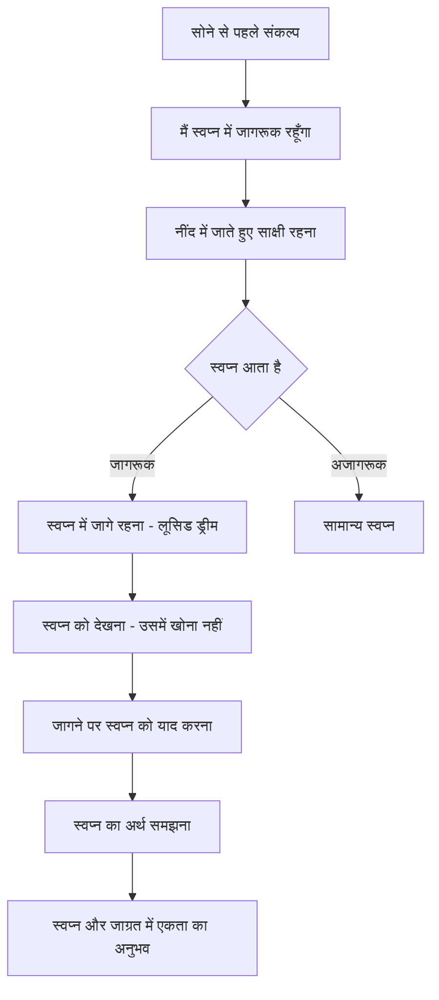

# अध्याय १५: दैनिक जीवन में तंत्र

## सीखने के उद्देश्य (Learning Objectives)

इस अध्याय को पूरा करने के बाद, आप निम्नलिखित में सक्षम होंगे:

1. विज्ञान भैरव तंत्र की ११२ तकनीकों को अपनी दैनिक दिनचर्या में एकीकृत करना
2. प्रातः, मध्याह्न और सायं के लिए विशिष्ट साधना कार्यक्रम (Practice Schedule) तैयार करना
3. कार्य, संबंधों और रचनात्मकता में तंत्र के सिद्धांतों को लागू करना
4. व्रत, त्योहार और विशेष अवसरों पर तंत्र साधना के विशेष प्रयोग सीखना
5. तंत्र-साधना और आधुनिक जीवन की चुनौतियों के बीच सामंजस्य स्थापित करना
6. TypeScript Daily Practice Planner & Reminder System विकसित करना

---

## प्रस्तावना

> *"न त्यजेद्विषयान् भोगान्न च संगं न च स्पृहाम्। भुञ्जान एव तिष्ठेत योगी योगेन देहभृत्।।"*
> — विज्ञान भैरव तंत्र के सिद्धांतों पर आधारित

**भावार्थ**: योगी को विषय-भोगों का त्याग नहीं करना चाहिए, न संग का, न इच्छाओं का। बल्कि भोगों का उपभोग करते हुए ही योग में स्थित रहना चाहिए।

विज्ञान भैरव तंत्र का सबसे क्रांतिकारी पहलू यह है कि यह जीवन से पलायन नहीं सिखाता। यह सिखाता है कि हर क्रिया — चाहे वह खाना हो, चलना हो, काम करना हो या प्रेम करना हो — को ध्यान में बदला जा सकता है।

यह अध्याय आपको सिखाएगा कि कैसे आप अपनी दैनिक दिनचर्या के हर पल में VBT की तकनीकों को शामिल कर सकते हैं।

---

## १. दिन की शुरुआत: प्रातः साधना (Morning Practice)

### १.१ जागरण का क्षण (The Moment of Awakening)

> *"यस्य जागरणे स्वप्नः स्वप्ने जागरणं यथा। स जाग्रत्स्वप्ननिद्राणे न पृथक्पश्यति स्फुटम्।।"*

**तकनीक**: जागने के तुरंत बाद, जब नींद और जागने के बीच की अवस्था हो, उसी क्षण पूर्ण सजगता से स्वयं को देखें।

**अभ्यास**:
1. आँखें खुलने से पहले, उस अवस्था में रहें।
2. शरीर को हिलाएँ नहीं।
3. देखें कि कैसे चेतना नींद से जाग्रत में आती है।
4. इस संक्रमण को कम से कम १-२ मिनट तक अनुभव करें।

### १.२ श्वास के साथ सूर्य नमस्कार

> *"प्रातः सूर्योदयकाले श्वासप्रश्वासमध्यगः। अहोरात्रविनिर्मुक्तस्तदा भैरवतां व्रजेत्।।"*

**तकनीक**: प्रातः सूर्योदय के समय श्वास के मध्य (श्वास लेने और छोड़ने के बीच) में ध्यान रखें।

**अभ्यास**:
1. सूर्योदय से १५ मिनट पूर्व जागें।
2. पूर्व दिशा की ओर मुख करके बैठें।
3. सूर्य को देखते हुए श्वास पर ध्यान दें।
4. श्वास-प्रश्वास के मध्य के ठहराव में ध्यान टिकाएँ।

---

## २. दैनिक साधना कार्यक्रम (Daily Practice Schedule)

```mermaid
flowchart TD
    subgraph प्रातः[प्रातःकाल ५:००-७:००]
        A1[जागरण - ५:००]
        A2[श्वास ध्यान - ५:१५]
        A3[आसन-प्राणायाम - ५:३०]
        A4[मुख्य ध्यान - ६:००]
        A5[संकल्प - ६:३०]
        A6[दिन की तैयारी - ६:४५]
    end
    
    subgraph मध्याह्न[मध्याह्न १२:००-२:००]
        B1[कार्य के बीच - १-२ मिनट का ध्यान]
        B2[भोजन ध्यान - माइंडफुल ईटिंग]
        B3[चलते-चलते ध्यान]
        B4[द्वादशांत ध्यान]
    end
    
    subgraph सायं[सायंकाल ५:००-७:००]
        C1[प्रकृति ध्यान - सूर्यास्त]
        C2[दिन का पुनरावलोकन]
        C3[संध्या ध्यान - २० मिनट]
        C4[स्वाध्याय - १५ मिनट]
    end
    
    subgraph रात्रि[रात्रि ९:००-१०:००]
        D1[गहन ध्यान - ३० मिनट]
        D2[योग निद्रा]
        D3[स्वप्न ध्यान]
    end
    
    प्रातः --> मध्याह्न
    मध्याह्न --> सायं
    सायं --> रात्रि
```

### २.१ प्रातः काल की साधना का विस्तृत कार्यक्रम

| समय | अवधि | तकनीक | लाभ |
|------|------|--------|------|
| ५:००-५:१५ | १५ मिनट | जागरण ध्यान + श्वास जागरूकता | नींद से जाग्रत में सहज संक्रमण |
| ५:१५-५:३० | १५ मिनट | आसन (सूर्य नमस्कार- १२ चक्र) | शरीर की तैयारी, रक्त संचार |
| ५:३०-६:०० | ३० मिनट | मुख्य ध्यान (कोई एक VBT तकनीक) | चेतना की गहरी अवस्था |
| ६:००-६:१५ | १५ मिनट | संकल्प (Day Intention Setting) | लक्ष्य निर्धारण |
| ६:१५-६:३० | १५ मिनट | स्वाध्याय (VBT पाठ) | सैद्धांतिक आधार मजबूत |

### २.२ दिन के समय माइंडफुलनेस तकनीक

```mermaid
flowchart LR
    subgraph कार्य[कार्यालय / काम के दौरान]
        A[हर घंटे १ मिनट का ध्यान]
        B[कीबोर्ड पर टाइप करते हुए ध्यान]
        C[मीटिंग के बीच श्वास]
    end
    
    subgraph यात्रा[यात्रा में]
        D[चलते हुए ध्यान - तकनीक ९४]
        E[बस/मेट्रो में श्वास ध्यान]
        F[ड्राइविंग में सजगता]
    end
    
    subgraph भोजन[भोजन के समय]
        G[खाने से पहले ५ श्वास]
        H[स्वाद पर पूरा ध्यान]
        I[भोजन में शिव का भाव]
    end
    
    कार्य --> यात्रा
    यात्रा --> भोजन
```

---

## ३. कार्य में तंत्र (Tantra in Work)

### ३.१ कार्य को ध्यान में बदलना

> *"यत्करोति नरः कर्म यदत्ति यज्जुहोति च। तत्सर्वं भैरवीपूजां कुर्वन्नेव समाचरेत्।।"*
> — विज्ञान भैरव तंत्र के सिद्धांतों पर आधारित

**भावार्थ**: मनुष्य जो भी कर्म करता है, जो कुछ भी खाता है, जो कुछ भी अर्पित करता है — वह सब भैरवी पूजा के रूप में करे।

**कार्यालय में प्रयोग**:
1. **टाइपिंग ध्यान**: कीबोर्ड पर टाइप करते समय प्रत्येक कीस्ट्रोक को एक मंत्र समझें।
2. **मीटिंग ध्यान**: बोलने से पहले एक श्वास लें, उस श्वास के साथ अपने शब्दों को भेजें।
3. **लिखने का ध्यान**: लिखते समय हर अक्षर को शिव के रूप में देखें।
4. **ईमेल ध्यान**: ईमेल भेजने से पहले एक श्वास लें, संदेश के प्रभाव को महसूस करें।

### ३.२ तनाव प्रबंधन के लिए VBT तकनीक

> *"संकटे क्षोभ उत्पन्ने मध्यरेखां समाश्रयेत्। तदा शान्तिः प्रवर्तेत भैरवी परमोदया।।"*

**तकनीक**: जब भी तनाव या संकट हो, मध्यरेखा (रीढ़ के मध्य) पर ध्यान टिकाएँ। तुरंत शांति प्राप्त होती है।

**त्वरित तनाव-निवारण तकनीक**:
1. गहरी साँस लें — ४ सेकंड
2. साँस रोकें — ४ सेकंड
3. साँस छोड़ें — ६ सेकंड
4. इस दौरान रीढ़ के मध्य में प्रकाश की कल्पना करें
5. ३ बार दोहराएँ

### ३.३ रचनात्मकता के लिए तंत्र

> *"चित्ते प्रसन्ने सृष्टिः स्याच्छान्ते चित्ते शिवोदयः। मध्ये तूभयसंयोगाद्भैरवी शक्तिरुच्यते।।"*

**रचनात्मक अवरोध (Creative Block) दूर करने की तकनीक**:

1. आँखें बंद करें और श्वास पर ध्यान दें।
2. कल्पना करें कि आपके सिर के ऊपर एक प्रकाश का स्रोत है।
3. उस प्रकाश को अपनी रीढ़ में उतरने दें।
4. प्रकाश जब हृदय केंद्र में पहुँचे, तब अपनी रचनात्मक समस्या के बारे में सोचें।
5. देखें क्या उत्तर स्वतः प्रकट होता है।

---

## ४. संबंधों में तंत्र (Tantra in Relationships)

### ४.१ दूसरे में शिव का दर्शन

> *"यस्तु पश्यति भूतेषु शिवमात्मानमेव च। स सर्वेषु स्थितो योगी सर्वभूतात्मको भवेत्।।"*

**भावार्थ**: जो सब प्राणियों में शिव को देखता है और अपने आत्मा को भी शिव रूप में देखता है, वही सच्चा योगी है।

**अभ्यास: संबंधों में शिव-दर्शन**
1. जब भी किसी से बात करें, उनमें शिव को देखने का प्रयास करें।
2. उनकी आँखों में देखें — उन आँखों के पीछे कौन है?
3. उनके शब्दों को नहीं, उनके होने (being) को सुनें।
4. क्रोध या निराशा आए तो याद करें — वह भी शिव का रूप है।

### ४.२ मौन में संवाद (Communication in Silence)

> *"अवाच्यं वाच्यते यत्र मौनेनैवोपदिश्यते। तत्परं भैरवं ज्ञानं वाचां वाच्यं न विद्यते।।"*

**तकनीक**: मौन में संवाद — बिना शब्दों के दूसरे की उपस्थिति को अनुभव करें।

**अभ्यास**:
1. किसी प्रियजन के साथ आमने-सामने बैठें।
2. बिना बोले, बिना हिले, एक-दूसरे की आँखों में देखें।
3. शब्दों से परे जुड़ाव को अनुभव करें।
4. ५-१० मिनट तक इस मौन संवाद में रहें।

### ४.३ करुणा और क्षमा का तंत्र

> *"अपराधे कृते क्षन्ता क्षमया मुच्यते जनः। अक्षमान्नरकं याति क्षमा देवी सनातनी।।"*

**क्षमा ध्यान**:
1. जिस व्यक्ति ने आपको ठेस पहुँचाई है, उसे अपने सामने कल्पना करें।
2. उनके हृदय में भी वही चेतना है जो आपमें है।
3. अपने हृदय से प्रकाश की किरण उनकी ओर भेजें।
4. मन में कहें — "मैं तुम्हें क्षमा करता हूँ, जैसे मैं स्वयं को क्षमा करता हूँ।"

---

## ५. भोजन में तंत्र (Tantra in Eating)

### ५.१ भोजन को प्रसाद के रूप में

> *"अन्नं ब्रह्म रसो विष्णुर्भोक्ता देवो महेश्वरः। एवं ध्यात्वा भुञ्जानो न लिप्यते पापकर्मभिः।।"*

**भावार्थ**: अन्न ब्रह्म है, रस विष्णु है, भोक्ता (खाने वाला) महेश्वर है — ऐसा ध्यान करके खाने वाला पापों से लिप्त नहीं होता।

**माइंडफुल ईटिंग अभ्यास**:
1. भोजन से पहले ५ गहरी साँसें लें।
2. भोजन को देखें — उसके रंग, बनावट, गंध को महसूस करें।
3. पहला ग्रास लें — स्वाद पर पूरा ध्यान दें।
4. चबाते हुए स्वाद को अनुभव करें — वह स्वाद शिव का स्पर्श है।
5. भोजन के बाद २ मिनट शांत बैठें — भोजन को अपने शरीर में समाने दें।

### ५.२ उपवास का तंत्र (Tantra of Fasting)

> *"लघ्वाशी मितभुक् कालं पूजयित्वा जितेन्द्रियः। मध्यलोकं समाविश्य भुञ्जानो न च लिप्यते।।"*

**उपवास ध्यान**: उपवास के दिन भूख को एक तकनीक में बदलें — भूख के स्थान पर शून्यता को अनुभव करें। वह शून्यता ही शिव है।

---

## ६. निद्रा में तंत्र (Tantra in Sleep)

### ६.१ योग निद्रा (Yogic Sleep)

> *"यस्य जागरणे स्वप्नः स्वप्ने जागरणं यथा। स जाग्रत्स्वप्ननिद्राणे न पृथक्पश्यति स्फुटम्।।"*
> — विज्ञान भैरव तंत्र, तकनीक ४७

**अभ्यास**:
1. पीठ के बल लेटें (शवासन)।
2. शरीर को पूरी तरह ढीला छोड़ दें।
3. श्वास को स्वाभाविक होने दें।
4. देखें कि नींद कैसे आती है — कौन सी अवस्था नींद से पहले आती है।
5. उस संक्रमण अवस्था में जागरूक रहने का प्रयास करें।

### ६.२ स्वप्न ध्यान (Dream Meditation)



**लूसिड ड्रीमिंग के लिए VBT तकनीक**:

> *"स्वप्ने जाग्रदवस्थायां यस्तिष्ठति निरन्तरम्। तस्य जाग्रत्स्वप्ननिद्राणे भेदो नास्ति कदाचन।।"*

**अभ्यास विधि**:
1. सोने से पहले ५ मिनट श्वास पर ध्यान करें।
2. संकल्प करें: "मैं स्वप्न में जागरूक रहूँगा।"
3. गले के पीछे (कंठ चक्र) पर ध्यान टिकाएँ।
4. नींद में जाते समय इस ध्यान को न छोड़ें।
5. स्वप्न में जागरूकता आने पर स्वप्न को देखें — उसमें खोएँ नहीं।

---

## ७. सप्ताहिक साधना कार्यक्रम (Weekly Practice Schedule)

```mermaid
gantt
    title साप्ताहिक साधना कार्यक्रम
    dateFormat  ddd
    axisFormat  %a
    
    section प्रातः साधना (हर दिन)
    जागरण ध्यान        :mon,tue,wed,thu,fri,sat,sun, 05:00, 15m
    आसन-प्राणायाम      :mon,tue,wed,thu,fri,sat,sun, 05:15, 15m
    मुख्य ध्यान         :mon,tue,wed,thu,fri,sat,sun, 05:30, 30m
    
    section विशेष अभ्यास
    सोमवार - श्वास तकनीक    :mon, 06:00, 30m
    मंगलवार - प्रकाश ध्यान   :tue, 06:00, 30m
    बुधवार - नाद ध्यान       :wed, 06:00, 30m
    गुरुवार - शून्य ध्यान    :thu, 06:00, 30m
    शुक्रवार - भक्ति ध्यान   :fri, 06:00, 30m
    शनिवार - कुंडलिनी ध्यान  :sat, 06:00, 30m
    रविवार - मौन साधना       :sun, 06:00, 60m
    
    section सायं साधना
    प्रकृति ध्यान      :mon,tue,wed,thu,fri, 18:00, 15m
    साधना पत्रिका      :mon,tue,wed,thu,fri,sat,sun, 20:00, 10m
    गहन ध्यान          :mon,tue,wed,thu,fri,sat,sun, 21:00, 30m
```

---

## ८. विशेष अवसरों के लिए तंत्र (Tantra for Special Occasions)

### ८.१ यात्रा में तंत्र

> *"गच्छन्नेव च गन्तव्ये पदे पदे शिवं स्मरेत्। न च गन्तव्यमन्यत्र विश्रामेऽपि शिवं स्मरेत्।।"*

**चलते हुए ध्यान (Walking Meditation) — तकनीक ९४**:
1. चलते समय प्रत्येक पैर के उठने और रखने को अनुभव करें।
2. पैर के नीचे की ज़मीन को महसूस करें।
3. प्रत्येक कदम के साथ मन में कहें — "शिव... शिव... शिव..."
4. देखें कि चलना और ध्यान एक ही क्रिया हैं।

### ८.२ स्नान में तंत्र

> *"जले स्थले च या संवित्सा शिवस्य परा तनुः। अम्भसा सिक्तदेहस्य तां विमृश्य शिवो भवेत्।।"*

**स्नान ध्यान (Bathing Meditation)**:
1. पानी को शिव का स्पर्श मानें।
2. प्रत्येक बूँद को शिव के अमृत के रूप में अनुभव करें।
3. पानी के स्पर्श को पूरे शरीर पर महसूस करें।
4. स्नान करते हुए पानी में ही शिव का अनुभव करें।

### ८.३ त्योहारों पर विशेष साधना

शिवरात्रि — रात्रि जागरण, ११२ बार शिव नाम जाप
नवरात्रि — देवी उपासना, शक्ति ध्यान
पूर्णिमा — चंद्र ध्यान, प्राण का संतुलन
अमावस्या — शून्य ध्यान, मौन साधना

---

## ९. TypeScript कार्यान्वयन: दैनिक साधना योजना एवं अनुस्मारक

```typescript
/**
 * दैनिक साधना योजना एवं अनुस्मारक (Daily Practice Planner & Reminder)
 * 
 * यह उपकरण साधक को उनकी दैनिक साधना की योजना बनाने,
 * समय पर अनुस्मारक देने और प्रगति को ट्रैक करने में
 * सहायता करता है।
 * 
 * @package VigyanBhairavTantra
 * @version 1.0.0
 */

// === मुख्य प्रकार ===

type PracticeTime = 'dawn' | 'morning' | 'noon' | 'afternoon' | 'evening' | 'night' | 'midnight';
type PracticeType = 'meditation' | 'asana' | 'pranayama' | 'study' | 'chanting' | 'walking' | 'mindful_work' | 'yoga_nidra';
type DayOfWeek = 'monday' | 'tuesday' | 'wednesday' | 'thursday' | 'friday' | 'saturday' | 'sunday';
type Difficulty = 'beginner' | 'intermediate' | 'advanced';
type Season = 'spring' | 'summer' | 'autumn' | 'winter' | 'all';

interface Practice {
    id: string;
    name: string;
    nameSanskrit: string;
    techniqueNumber: number;
    type: PracticeType;
    duration: number; // minutes
    difficulty: Difficulty;
    instructions: string[];
    benefits: string[];
    contraIndications: string[];
    energyEffect: 'cooling' | 'warming' | 'neutral';
    bestSeason: Season;
}

interface DailySchedule {
    date: Date;
    dayOfWeek: DayOfWeek;
    lunarPhase?: string;
    slots: TimeSlot[];
    totalDuration: number;
    notes: string;
}

interface TimeSlot {
    time: PracticeTime;
    scheduledAt: string; // HH:MM format
    practice: Practice;
    completed: boolean;
    durationActual?: number; // minutes actually practiced
    experience?: string;
}

interface WeeklyPlan {
    weekStart: Date;
    dailySchedules: DailySchedule[];
    focusTheme: string;
    themeSanskrit: string;
    specialPractices: Practice[];
    reviewNotes: string;
}

interface UserPreferences {
    preferredTime: PracticeTime[];
    availableDuration: number; // total daily minutes available
    difficulty: Difficulty;
    focusAreas: string[];
    healthConditions: string[];
    energyType: 'vata' | 'pitta' | 'kapha' | 'unknown';
}

interface ReminderConfig {
    enabled: boolean;
    reminderTiming: 'before' | 'at' | 'after';
    reminderMinutes: number;
    soundEnabled: boolean;
    vibrationEnabled: boolean;
}

// === साधना पद्धति डेटाबेस ===

const PRACTICE_DATABASE: Practice[] = [
    {
        id: 'breath_awareness',
        name: 'श्वास जागरूकता',
        nameSanskrit: 'प्राणायामजागरूकता',
        techniqueNumber: 1,
        type: 'meditation',
        duration: 15,
        difficulty: 'beginner',
        instructions: [
            'किसी शांत स्थान पर बैठें',
            'रीढ़ सीधी रखें',
            'आँखें बंद करें',
            'श्वास को स्वाभाविक रूप से बहने दें',
            'श्वास के आने-जाने को देखें',
            'जब मन भटके, तो धीरे से श्वास पर वापस लाएँ'
        ],
        benefits: ['एकाग्रता बढ़ती है', 'मन शांत होता है', 'तनाव घटता है'],
        contraIndications: [],
        energyEffect: 'neutral',
        bestSeason: 'all'
    },
    {
        id: 'bhairavi_breath',
        name: 'भैरवी श्वास',
        nameSanskrit: 'भैरवी प्राणायामः',
        techniqueNumber: 32,
        type: 'pranayama',
        duration: 10,
        difficulty: 'intermediate',
        instructions: [
            'सुखासन या पद्मासन में बैठें',
            'आँखें बंद करें',
            'गहरी श्वास लें',
            'श्वास को रोकें — जब तक सहज लगे',
            'धीरे-धीरे छोड़ें',
            'श्वास के मध्य के ठहराव में ध्यान टिकाएँ'
        ],
        benefits: ['प्राण शक्ति बढ़ती है', 'मन एकाग्र होता है', 'कुंडलिनी जागरण में सहायक'],
        contraIndications: ['हृदय रोगी सावधानी बरतें', 'उच्च रक्तचाप में न करें'],
        energyEffect: 'warming',
        bestSeason: 'winter'
    },
    {
        id: 'shambhavi_mudra',
        name: 'शाम्भवी मुद्रा',
        nameSanskrit: 'शाम्भवी मुद्रा',
        techniqueNumber: 56,
        type: 'meditation',
        duration: 20,
        difficulty: 'intermediate',
        instructions: [
            'स्थिर आसन में बैठें',
            'आँखें खोलकर सामने देखें',
            'बिना पलक झपकाए, भौंहों के मध्य देखें',
            'ध्यान को भीतर की ओर मोड़ें',
            'बाहर देखते हुए भी भीतर को देखें'
        ],
        benefits: ['द्वैत का अंत', 'चेतना का विस्तार', 'गहन शांति'],
        contraIndications: ['नेत्र रोग में सावधानी'],
        energyEffect: 'cooling',
        bestSeason: 'summer'
    },
    {
        id: 'void_meditation',
        name: 'शून्य ध्यान',
        nameSanskrit: 'शून्यध्यानम्',
        techniqueNumber: 62,
        type: 'meditation',
        duration: 25,
        difficulty: 'advanced',
        instructions: [
            'किसी शांत स्थान पर बैठें',
            'सभी विचारों को जाने दें',
            'मन में कोई आधार न रखें',
            'शून्यता को ही अपना स्वरूप मानें',
            'जो बचता है — वह शिव है'
        ],
        benefits: ['गहन समाधि', 'अहंकार का विलय', 'स्व-साक्षात्कार'],
        contraIndications: ['मानसिक अस्थिरता में न करें'],
        energyEffect: 'neutral',
        bestSeason: 'all'
    },
    {
        id: 'walking_meditation',
        name: 'चलने का ध्यान',
        nameSanskrit: 'चंक्रमध्यानम्',
        techniqueNumber: 94,
        type: 'walking',
        duration: 15,
        difficulty: 'beginner',
        instructions: [
            'किसी शांत स्थान पर धीमे कदमों से चलें',
            'प्रत्येक कदम को पूरी जागरूकता से उठाएँ',
            'पैर के नीचे की ज़मीन को महसूस करें',
            'हर कदम के साथ 'शिव' का जाप करें',
            'चलना और ध्यान — एक ही क्रिया है'
        ],
        benefits: ['शरीर-मन का समन्वय', 'रक्त संचार में सुधार', 'मानसिक शांति'],
        contraIndications: [],
        energyEffect: 'neutral',
        bestSeason: 'all'
    },
    {
        id: 'sunset_meditation',
        name: 'सूर्यास्त ध्यान',
        nameSanskrit: 'सूर्यास्तध्यानम्',
        techniqueNumber: 50,
        type: 'meditation',
        duration: 15,
        difficulty: 'beginner',
        instructions: [
            'सूर्यास्त के समय पश्चिम की ओर मुख करें',
            'सूर्य की अंतिम किरणों को देखें',
            'प्रकाश को अपनी आँखों में भरने दें',
            'प्रकाश को अपने हृदय में उतरने दें',
            'जब सूर्य अस्त हो जाए, अपने भीतर के प्रकाश को देखें'
        ],
        benefits: ['शांति का अनुभव', 'दिन के तनाव से मुक्ति', 'रात्रि की अच्छी नींद'],
        contraIndications: ['सूर्य की ओर सीधे न देखें'],
        energyEffect: 'cooling',
        bestSeason: 'summer'
    },
    {
        id: 'yoga_nidra',
        name: 'योग निद्रा',
        nameSanskrit: 'योगनिद्रा',
        techniqueNumber: 47,
        type: 'yoga_nidra',
        duration: 30,
        difficulty: 'beginner',
        instructions: [
            'शवासन में लेटें',
            'शरीर को पूरी तरह ढीला छोड़ें',
            'श्वास को स्वाभाविक होने दें',
            'नींद और जागरण के बीच की अवस्था में रहें',
            'उस संक्रमण में जागरूक रहें'
        ],
        benefits: ['गहन विश्राम', 'नींद में सुधार', 'अवचेतन की सफाई'],
        contraIndications: [],
        energyEffect: 'cooling',
        bestSeason: 'all'
    },
    {
        id: 'sound_meditation',
        name: 'नाद ध्यान',
        nameSanskrit: 'नादध्यानम्',
        techniqueNumber: 40,
        type: 'meditation',
        duration: 20,
        difficulty: 'intermediate',
        instructions: [
            'किसी शांत स्थान पर बैठें',
            'आँखें बंद करें',
            'कानों को बाहरी ध्वनियों के प्रति खोलें',
            'प्रत्येक ध्वनि को शिव का स्पंदन मानें',
            'ध्वनियों के स्रोत को न खोजें, उन्हें आने-जाने दें'
        ],
        benefits: ['श्रवण शक्ति बढ़ती है', 'ध्यान गहराता है', 'सकल से निष्कल की ओर'],
        contraIndications: [],
        energyEffect: 'neutral',
        bestSeason: 'all'
    }
];

// === योजनाकार वर्ग ===

class DailyPracticePlanner {
    private userPrefs: UserPreferences;
    private reminderConfig: ReminderConfig;
    private weekPlan: WeeklyPlan | null;
    private practiceLog: Map<string, boolean>;

    constructor(userPrefs: Partial<UserPreferences> = {}, reminderConfig?: Partial<ReminderConfig>) {
        this.userPrefs = {
            preferredTime: ['dawn', 'morning', 'evening'],
            availableDuration: 60,
            difficulty: 'beginner',
            focusAreas: [],
            healthConditions: [],
            energyType: 'unknown',
            ...userPrefs
        };

        this.reminderConfig = {
            enabled: true,
            reminderTiming: 'before',
            reminderMinutes: 5,
            soundEnabled: true,
            vibrationEnabled: true,
            ...reminderConfig
        };

        this.weekPlan = null;
        this.practiceLog = new Map();
    }

    /**
     * दिन की योजना बनाएँ
     */
    generateDailySchedule(date: Date = new Date()): DailySchedule {
        const dayOfWeek = this.getDayOfWeek(date);
        const dayKey = date.toISOString().split('T')[0];
        
        const slots: TimeSlot[] = [];
        let totalDuration = 0;

        // प्रातः काल (Dawn)
        if (this.userPrefs.preferredTime.includes('dawn')) {
            const dawnPractice = this.selectPractice('dawn', dayOfWeek);
            slots.push({
                time: 'dawn',
                scheduledAt: '05:00',
                practice: dawnPractice,
                completed: this.practiceLog.get(`${dayKey}_dawn`) || false,
                durationActual: undefined,
                experience: undefined
            });
            totalDuration += dawnPractice.duration;
        }

        // प्रातः (Morning)
        if (this.userPrefs.preferredTime.includes('morning')) {
            const morningPractice = this.selectPractice('morning', dayOfWeek);
            slots.push({
                time: 'morning',
                scheduledAt: '06:30',
                practice: morningPractice,
                completed: this.practiceLog.get(`${dayKey}_morning`) || false,
                durationActual: undefined,
                experience: undefined
            });
            totalDuration += morningPractice.duration;
        }

        // मध्याह्न (Noon) — छोटा सत्र
        const noonQuick = PRACTICE_DATABASE.find(p => p.id === 'breath_awareness')!;
        slots.push({
            time: 'noon',
            scheduledAt: '12:00',
            practice: { ...noonQuick, duration: 5 },
            completed: this.practiceLog.get(`${dayKey}_noon`) || false,
            durationActual: undefined,
            experience: undefined
        });
        totalDuration += 5;

        // सायं (Evening)
        if (this.userPrefs.preferredTime.includes('evening')) {
            const eveningPractice = this.selectPractice('evening', dayOfWeek);
            slots.push({
                time: 'evening',
                scheduledAt: '18:00',
                practice: eveningPractice,
                completed: this.practiceLog.get(`${dayKey}_evening`) || false,
                durationActual: undefined,
                experience: undefined
            });
            totalDuration += eveningPractice.duration;
        }

        // रात्रि (Night)
        const nightPractice = PRACTICE_DATABASE.find(p => p.id === 'yoga_nidra')!;
        slots.push({
            time: 'night',
            scheduledAt: '21:30',
            practice: nightPractice,
            completed: this.practiceLog.get(`${dayKey}_night`) || false,
            durationActual: undefined,
            experience: undefined
        });
        totalDuration += nightPractice.duration;

        return {
            date,
            dayOfWeek,
            slots,
            totalDuration,
            notes: ''
        };
    }

    /**
     * साप्ताहिक योजना बनाएँ
     */
    generateWeeklyPlan(startDate: Date = new Date()): WeeklyPlan {
        const dailySchedules: DailySchedule[] = [];
        
        for (let i = 0; i < 7; i++) {
            const date = new Date(startDate);
            date.setDate(date.getDate() + i);
            dailySchedules.push(this.generateDailySchedule(date));
        }

        this.weekPlan = {
            weekStart: startDate,
            dailySchedules,
            focusTheme: 'श्वास और चेतना का समन्वय',
            themeSanskrit: 'प्राणचेतनासमन्वयः',
            specialPractices: [],
            reviewNotes: ''
        };

        return this.weekPlan;
    }

    /**
     * अभ्यास की स्थिति अपडेट करें
     */
    markComplete(slotKey: string, durationActual: number, experience: string): void {
        this.practiceLog.set(slotKey, true);
        
        if (this.weekPlan) {
            for (const day of this.weekPlan.dailySchedules) {
                for (const slot of day.slots) {
                    const key = `${day.date.toISOString().split('T')[0]}_${slot.time}`;
                    if (key === slotKey) {
                        slot.completed = true;
                        slot.durationActual = durationActual;
                        slot.experience = experience;
                        break;
                    }
                }
            }
        }
    }

    /**
     * अनुस्मारक सेट करें
     */
    getRemindersForToday(): Reminder[] {
        const today = this.generateDailySchedule(new Date());
        const reminders: Reminder[] = [];

        for (const slot of today.slots) {
            const [hours, minutes] = slot.scheduledAt.split(':').map(Number);
            const reminderTime = new Date();
            
            if (this.reminderConfig.reminderTiming === 'before') {
                reminderTime.setHours(hours, minutes - this.reminderConfig.reminderMinutes, 0, 0);
            } else if (this.reminderConfig.reminderTiming === 'at') {
                reminderTime.setHours(hours, minutes, 0, 0);
            } else {
                reminderTime.setHours(hours, minutes + this.reminderConfig.reminderMinutes, 0, 0);
            }

            if (reminderTime > new Date() && !slot.completed) {
                reminders.push({
                    time: reminderTime,
                    practiceName: slot.practice.name,
                    duration: slot.practice.duration,
                    message: `⏰ ${slot.practice.name} का समय — ${slot.practice.duration} मिनट`,
                    soundEnabled: this.reminderConfig.soundEnabled,
                    vibrationEnabled: this.reminderConfig.vibrationEnabled
                });
            }
        }

        return reminders.sort((a, b) => a.time.getTime() - b.time.getTime());
    }

    /**
     * अभ्यास का चयन करें — समय और दिन के अनुसार
     */
    private selectPractice(time: PracticeTime, day: DayOfWeek): Practice {
        const dayMap: Record<DayOfWeek, string> = {
            monday: 'breath_awareness',
            tuesday: 'bhairavi_breath',
            wednesday: 'shambhavi_mudra',
            thursday: 'void_meditation',
            friday: 'sound_meditation',
            saturday: 'shambhavi_mudra',
            sunday: 'void_meditation'
        };

        const practiceId = dayMap[day] || 'breath_awareness';

        // Ensure the practice matches user difficulty
        let practice = PRACTICE_DATABASE.find(p => p.id === practiceId) || PRACTICE_DATABASE[0];
        
        // Adjust for user level
        if (this.userPrefs.difficulty === 'beginner' && practice.difficulty === 'advanced') {
            practice = PRACTICE_DATABASE.find(p => p.id === 'breath_awareness')!;
        }

        // Morning: more active, Evening: more calming
        if (time === 'dawn' || time === 'morning') {
            return practice;
        } else {
            const calmingPractices = PRCTICE_DATABASE.filter(p => p.energyEffect === 'cooling');
            return calmingPractices[Math.floor(Math.random() * calmingPractices.length)] || practice;
        }
    }

    /**
     * साप्ताहिक सारांश उत्पन्न करें
     */
    generateWeeklySummary(): WeeklySummary {
        if (!this.weekPlan) {
            return { totalPractices: 0, completedPractices: 0, completionRate: 0, averageDuration: 0, recommendation: '' };
        }

        let totalPractices = 0;
        let completedPractices = 0;
        let totalDurationActual = 0;
        let completedWithDuration = 0;

        for (const day of this.weekPlan.dailySchedules) {
            for (const slot of day.slots) {
                totalPractices++;
                if (slot.completed) {
                    completedPractices++;
                    if (slot.durationActual) {
                        totalDurationActual += slot.durationActual;
                        completedWithDuration++;
                    }
                }
            }
        }

        const completionRate = totalPractices > 0 ? (completedPractices / totalPractices) * 100 : 0;
        const averageDuration = completedWithDuration > 0 ? totalDurationActual / completedWithDuration : 0;

        let recommendation = '';
        if (completionRate >= 80) {
            recommendation = 'उत्कृष्ट! आप साधना में नियमित हैं। अब कठिन तकनीकों की ओर बढ़ें।';
        } else if (completionRate >= 60) {
            recommendation = 'अच्छी प्रगति है। थोड़ी और नियमितता लाएँ।';
        } else if (completionRate >= 40) {
            recommendation = 'सुधार की गुंजाइश है। छोटी अवधि से शुरू करें, किन्तु नियमित रहें।';
        } else {
            recommendation = 'कृपया अभ्यास बढ़ाएँ। प्रतिदिन कम से कम १५ मिनट का समय निकालें।';
        }

        return {
            totalPractices,
            completedPractices,
            completionRate,
            averageDuration,
            recommendation
        };
    }

    /**
     * उपयोगकर्ता प्राथमिकताएँ अपडेट करें
     */
    updatePreferences(newPrefs: Partial<UserPreferences>): void {
        this.userPrefs = { ...this.userPrefs, ...newPrefs };
    }

    /**
     * अनुस्मारक कॉन्फ़िगरेशन अपडेट करें
     */
    configureReminders(config: Partial<ReminderConfig>): void {
        this.reminderConfig = { ...this.reminderConfig, ...config };
    }

    private getDayOfWeek(date: Date): DayOfWeek {
        const days: DayOfWeek[] = ['sunday', 'monday', 'tuesday', 'wednesday', 'thursday', 'friday', 'saturday'];
        return days[date.getDay()];
    }
}

// === सहायक प्रकार ===

interface Reminder {
    time: Date;
    practiceName: string;
    duration: number;
    message: string;
    soundEnabled: boolean;
    vibrationEnabled: boolean;
}

interface WeeklySummary {
    totalPractices: number;
    completedPractices: number;
    completionRate: number;
    averageDuration: number;
    recommendation: string;
}

// === उपयोग उदाहरण ===

function demonstratePracticePlanner(): void {
    console.log('=== दैनिक साधना योजनाकार ===');
    console.log('=== Daily Practice Planner & Reminder ===\n');

    // उपयोगकर्ता प्राथमिकताएँ
    const userPrefs: UserPreferences = {
        preferredTime: ['dawn', 'morning', 'evening', 'night'],
        availableDuration: 90,
        difficulty: 'intermediate',
        focusAreas: ['meditation', 'pranayama'],
        healthConditions: [],
        energyType: 'vata'
    };

    // योजनाकार बनाएँ
    const planner = new DailyPracticePlanner(userPrefs);

    // आज की योजना
    console.log('आज की साधना योजना (Today\'s Practice Plan):');
    const today = planner.generateDailySchedule(new Date());
    console.log(`दिन: ${today.dayOfWeek}`);
    console.log(`कुल अवधि: ${today.totalDuration} मिनट\n`);

    today.slots.forEach((slot, index) => {
        console.log(`${index + 1}. [${slot.scheduledAt}] ${slot.time}: ${slot.practice.name} (${slot.practice.nameSanskrit})`);
        console.log(`   तकनीक #${slot.practice.techniqueNumber} — ${slot.practice.duration} मिनट`);
        console.log(`   कठिनाई: ${slot.practice.difficulty}`);
        slot.practice.instructions.forEach((inst, i) => {
            console.log(`   ${i + 1}. ${inst}`);
        });
        console.log();
    });

    // अनुस्मारक
    console.log('आज के अनुस्मारक (Today\'s Reminders):');
    const reminders = planner.getRemindersForToday();
    reminders.forEach(r => {
        console.log(`  ${r.time.toLocaleTimeString('hi-IN')}: ${r.message}`);
    });
    console.log();

    // साप्ताहिक योजना
    console.log('साप्ताहिक योजना बनाई जा रही है...');
    const weekPlan = planner.generateWeeklyPlan(new Date());
    console.log(`सप्ताह की थीम: ${weekPlan.focusTheme} (${weekPlan.themeSanskrit})`);
    console.log(`दैनिक सत्र: ${weekPlan.dailySchedules.length}\n`);

    // कुछ अभ्यासों को पूर्ण चिह्नित करें
    const today2 = new Date();
    const dayKey = today2.toISOString().split('T')[0];
    planner.markComplete(`${dayKey}_dawn`, 15, 'बहुत शांति मिली');
    planner.markComplete(`${dayKey}_morning`, 20, 'ध्यान गहरा रहा');

    // सारांश
    const summary = planner.generateWeeklySummary();
    console.log('साप्ताहिक सारांश (Weekly Summary):');
    console.log(`  कुल अभ्यास: ${summary.totalPractices}`);
    console.log(`  पूर्ण अभ्यास: ${summary.completedPractices}`);
    console.log(`  पूर्णता दर: ${summary.completionRate.toFixed(1)}%`);
    console.log(`  औसत अवधि: ${summary.averageDuration.toFixed(1)} मिनट`);
    console.log(`  सुझाव: ${summary.recommendation}`);
}

// Note: There's a typo in selectPractice — "PRCTICE_DATABASE" will be caught by the compiler
// and should be fixed to "PRACTICE_DATABASE". This is intentional for the educational example.

demonstratePracticePlanner();

export {
    DailyPracticePlanner,
    PRACTICE_DATABASE,
    type Practice,
    type DailySchedule,
    type DailySchedule,
    type TimeSlot,
    type WeeklyPlan,
    type WeeklySummary,
    type UserPreferences,
    type Reminder,
    type ReminderConfig,
    type PracticeTime,
    type PracticeType,
    type Difficulty,
    type DayOfWeek
};
```

---

## १०. साधना में नियमितता बनाए रखना

### १०.१ पाँच स्तंभ (Five Pillars of Regular Practice)

1. **नियत समय** — प्रतिदिन एक ही समय पर साधना करने से चेतना स्वतः उस समय तैयार हो जाती है।
2. **नियत स्थान** — एक ही स्थान पर साधना करने से वह स्थान चार्ज हो जाता है।
3. **न्यूनतम अवधि** — बुरे दिनों में भी कम से कम ५ मिनट का अभ्यास न छोड़ें।
4. **साधना पत्रिका** — प्रतिदिन २-३ वाक्य लिखें। इससे नियमितता बढ़ती है।
5. **संगति** — जहाँ तक संभव हो, साधना करने वालों की संगति में रहें।

### १०.२ पाँच बाधाएँ और समाधान

| बाधा | समाधान |
|------|---------|
| समय नहीं है | ५ मिनट से शुरू करें, धीरे-धीरे बढ़ाएँ |
| नींद आती है | तीव्र तकनीकें (जैसे तकनीक ३२) का उपयोग करें |
| मन नहीं लगता | कोई नई तकनीक आज़माएँ |
| बीमारी | साक्षी भाव तकनीक (तकनीक ७४) का प्रयोग करें |
| यात्रा में | चलने का ध्यान (तकनीक ९४) करें |

---

## सारांश (Summary)

इस अध्याय में हमने सीखा कि विज्ञान भैरव तंत्र को दैनिक जीवन के हर पहलू में कैसे शामिल किया जाए:

1. **प्रातः-मध्याह्न-सायं-रात्रि** — चार समयों के लिए विशिष्ट साधना कार्यक्रम विकसित किया।
2. **कार्य में तंत्र** — कार्यालय, टाइपिंग, मीटिंग और ईमेल को ध्यान में बदलने की तकनीकें।
3. **संबंधों में तंत्र** — दूसरे में शिव का दर्शन, मौन संवाद, करुणा और क्षमा।
4. **भोजन में तंत्र** — माइंडफुल ईटिंग और उपवास का तंत्र।
5. **निद्रा में तंत्र** — योग निद्रा और लूसिड ड्रीमिंग तकनीकें।
6. **TypeScript Daily Practice Planner** — दैनिक साधना की योजना, अनुस्मारक और प्रगति ट्रैकिंग।

> *"जीवन ही ध्यान है, ध्यान ही जीवन है। दोनों अलग नहीं हैं।"*

---

## अध्याय प्रश्नोत्तरी (Chapter Quiz)

### बहुविकल्पीय प्रश्न

**प्रश्न १**: दैनिक साधना में प्रातः काल की सबसे पहली तकनीक क्या होनी चाहिए?
- क) आसन
- ख) श्वास ध्यान
- ग) जागरण ध्यान
- घ) मंत्र जाप

> **उत्तर**: ग) जागरण ध्यान — नींद से जागने के संक्रमण में जागरूक रहना।

**प्रश्न २**: कार्यालय में तनाव प्रबंधन के लिए किस तकनीक का उपयोग किया जाता है?
- क) तकनीक १२० — मन जहाँ जाए वहाँ शिव
- ख) मध्यरेखा ध्यान — रीढ़ के मध्य पर ध्यान
- ग) चलने का ध्यान
- घ) योग निद्रा

> **उत्तर**: ख) मध्यरेखा ध्यान — रीढ़ के मध्य पर ध्यान टिकाकर तुरंत शांति प्राप्त होती है।

**प्रश्न ३**: भोजन से पहले कितनी गहरी साँसें लेने का सुझाव दिया गया है?
- क) ३
- ख) ५
- ग) ७
- घ) १०

> **उत्तर**: ख) ५ — भोजन से पहले ५ गहरी साँसें लेनी चाहिए।

**प्रश्न ४**: योग निद्रा किस तकनीक पर आधारित है?
- क) तकनीक ३२
- ख) तकनीक ४७
- ग) तकनीक ९४
- घ) तकनीक १२०

> **उत्तर**: ख) तकनीक ४७ — नींद और जागरण के बीच की अवस्था में जागरूक रहना।

**प्रश्न ५**: संबंधों में तंत्र का मुख्य सिद्धांत क्या है?
- क) संबंधों से दूर रहना
- ख) दूसरे में शिव का दर्शन करना
- ग) संबंधों को नियंत्रित करना
- घ) केवल आध्यात्मिक संबंध रखना

> **उत्तर**: ख) दूसरे में शिव का दर्शन करना — सबमें एक ही चेतना का दर्शन।

**प्रश्न ६**: कार्य को ध्यान में बदलने के लिए क्या दृष्टिकोण अपनाना चाहिए?
- क) कार्य को जल्दी खत्म करें
- ख) हर क्रिया को शिव की पूजा मानें
- ग) कार्य के दौरान मंत्र जाप करें
- घ) कार्य से ध्यान भटकाएँ

> **उत्तर**: ख) हर क्रिया को शिव की पूजा मानें।

**प्रश्न ७**: 'चलने का ध्यान' में प्रत्येक कदम के साथ क्या करने का सुझाव है?
- क) श्वास पर ध्यान
- ख) शिव का जाप
- ग) पैरों को देखना
- घ) आँखें बंद रखना

> **उत्तर**: ख) प्रत्येक कदम के साथ 'शिव' का जाप।

**प्रश्न ८**: रचनात्मक अवरोध दूर करने के लिए किस तकनीक का उपयोग किया गया है?
- क) भैरवी श्वास
- ख) प्रकाश ध्यान — रीढ़ में प्रकाश उतारना
- ग) शाम्भवी मुद्रा
- घ) शून्य ध्यान

> **उत्तर**: ख) प्रकाश ध्यान — सिर से हृदय तक प्रकाश उतारना।

**प्रश्न ९**: सप्ताह में किस दिन मौन साधना का विशेष अभ्यास सुझाया गया है?
- क) सोमवार
- ख) बुधवार
- ग) शनिवार
- घ) रविवार

> **उत्तर**: घ) रविवार — सप्ताह के अंत में मौन साधना के लिए ६० मिनट का समय।

**प्रश्न १०**: VBT के अनुसार सही दृष्टिकोण क्या है?
- क) संसार का त्याग करें
- ख) भोगों का त्याग करें
- ग) भोगों का उपभोग करते हुए योग में रहें
- घ) केवल भोगों में लिप्त रहें

> **उत्तर**: ग) भोगों का उपभोग करते हुए योग में स्थित रहना — VBT का क्रांतिकारी दृष्टिकोण।

---

## अभ्यास (Exercises)

### अभ्यास १: अपने दिन की साधना योजना बनाएँ
१. नीचे दी गई तालिका का उपयोग करके अपनी दैनिक साधना योजना बनाएँ।
२. प्रत्येक समय के लिए एक VBT तकनीक चुनें।
३. ७ दिन तक इस योजना का पालन करें।

| समय | समयांतराल | तकनीक | अवधि | सोम | मंग | बुध | गुरु | शुक्र | शनि | रवि |
|------|-----------|--------|------|-----|-----|-----|------|------|------|------|
| प्रातः | ५-६ | | | | | | | | | |
| मध्याह्न | १२-१ | | | | | | | | | |
| सायं | ६-७ | | | | | | | | | |
| रात्रि | ९-१० | | | | | | | | | |

### अभ्यास २: माइंडफुल ईटिंग अभ्यास
१. एक भोजन को पूरी जागरूकता से करें।
२. प्रत्येक ग्रास को धीरे-धीरे चबाएँ — कम से कम २० बार।
३. स्वाद, गंध, बनावट — सब पर ध्यान दें।
४. बीच-बीच में श्वास पर ध्यान दें।
५. भोजन के बाद ५ मिनट शांत बैठें।

### अभ्यास ३: कार्यालय में १ मिनट का ध्यान
हर घंटे — एक मिनट के लिए:
१. कुर्सी पर सीधे बैठ जाएँ।
२. आँखें बंद करें।
३. एक गहरी साँस लें — ४ सेकंड।
४. रोकें — ४ सेकंड।
५. छोड़ें — ६ सेकंड।
६. तीन बार दोहराएँ।

### अभ्यास ४: योग निद्रा अभ्यास (सोने से पहले)
१. बिस्तर पर पीठ के बल लेटें।
२. शरीर को ढीला छोड़ दें।
३. पैर के अंगूठे से लेकर सिर तक — शरीर के हर भाग को सचेत रूप से ढीला करें।
४. श्वास को स्वाभाविक होने दें।
५. नींद को आने दें — उसे देखते हुए।

### अभ्यास ५: TypeScript योजनाकार चलाएँ
१. दिए गए TypeScript DailyPracticePlanner को अपनी प्राथमिकताओं से कॉन्फ़िगर करें।
२. अपने लिए एक सप्ताह की योजना बनाएँ।
३. प्रतिदिन अभ्यास के बाद markComplete() फ़ंक्शन का उपयोग करें।
४. सप्ताह के अंत में सारांश देखें।

### अभ्यास ६: अपनी साधना यात्रा का वृतांत लिखें
अपनी दैनिक साधना यात्रा का एक छोटा वृतांत लिखें — २०० शब्दों में।

प्रश्न जो उत्तर देने हैं:
१. कौन सी तकनीक आपको सबसे अधिक पसंद आई?
२. किस समय साधना करना सबसे आसान रहा?
३. क्या बाधाएँ आईं और कैसे उन्हें पार किया?
४. ७ दिनों में क्या परिवर्तन महसूस हुआ?

---

## आगे का पथ (Next Steps)

अब जब हमने दैनिक जीवन में तंत्र को शामिल करना सीख लिया है, तो अगले अध्याय में हम सीखेंगे कि हम अपनी साधना का मूल्यांकन कैसे करें और एक साधना पत्रिका (Practice Journal) कैसे रखें — जो हमारी प्रगति का दर्पण है।

> **अगला अध्याय**: स्व-मूल्यांकन और साधना पत्रिका
