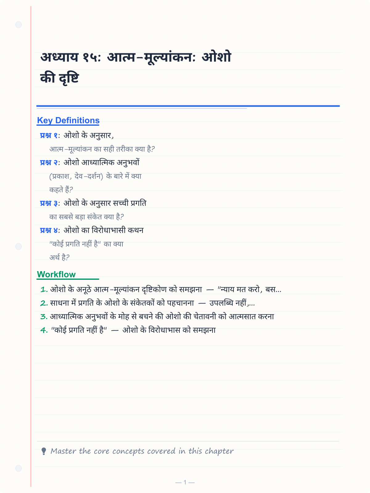
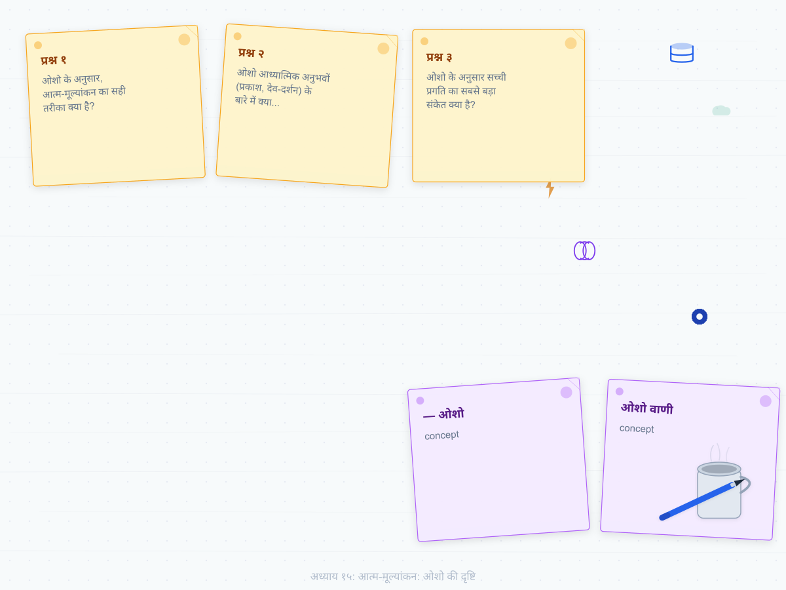
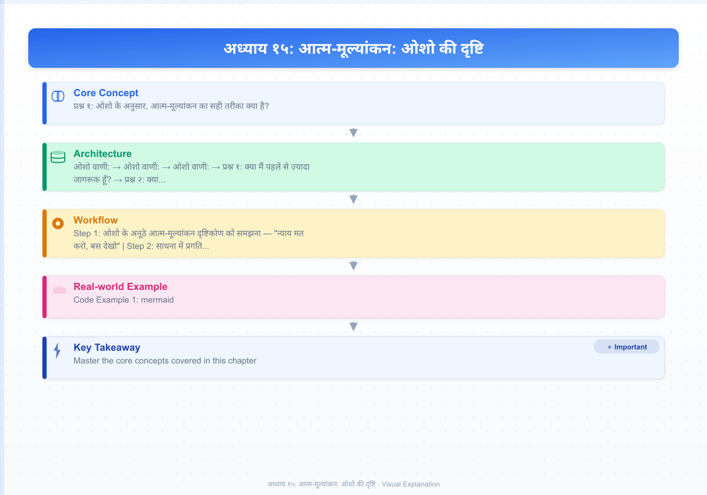

# अध्याय १५: आत्म-मूल्यांकन: ओशो की दृष्टि

<!-- Image Gallery -->
<section class="lesson-visuals" aria-label="Visual learning resources">
  <header><span>VISUAL LEARNING</span><h2>See it. Review it. Remember it.</h2></header>
  <a class="lesson-visual-card" href="../../assets/images/lessons/vigyan-bhairav-tantra/15-swa-mulyankan/handwritten-notes.png" target="_blank" rel="noopener">
    
    <span><strong>Handwritten notes</strong>Condensed notes for deliberate review.</span>
  </a>
  <a class="lesson-visual-card" href="../../assets/images/lessons/vigyan-bhairav-tantra/15-swa-mulyankan/sticky-notes.png" target="_blank" rel="noopener">
    
    <span><strong>Sticky-note revision</strong>Fast recall prompts for revision.</span>
  </a>
  <a class="lesson-visual-card" href="../../assets/images/lessons/vigyan-bhairav-tantra/15-swa-mulyankan/visual-explanation.png" target="_blank" rel="noopener">
    
    <span><strong>Visual concept guide</strong>A connected explanation of the key ideas.</span>
  </a>
</section>
<!-- End Image Gallery -->

## सीखने के उद्देश्य (Learning Objectives)

इस अध्याय को पूरा करने के बाद, तुम निम्नलिखित में सक्षम होगे:

1. ओशो के अनूठे आत्म-मूल्यांकन दृष्टिकोण को समझना — "न्याय मत करो, बस देखो"
2. साधना में प्रगति के ओशो के संकेतकों को पहचानना — उपलब्धि नहीं, जागरूकता
3. आध्यात्मिक अनुभवों के मोह से बचने की ओशो की चेतावनी को आत्मसात करना
4. "कोई प्रगति नहीं है" — ओशो के विरोधाभास को समझना
5. आत्म-मूल्यांकन को एक ध्यान के रूप में अपनाना
6. TypeScript Self-Assessment Journal with Osho's Questions विकसित करना

---

## 🔱 प्रस्तावना: "मत मापो, मत तोलो — बस देखो"

> *"साधना में प्रगति का कोई माप नहीं है। कोई मीटर नहीं है जो बताए कि तुम कितने करीब हो। और अगर कोई मीटर होता भी, तो वह तुम्हें बताता कि तुम कहाँ हो — लेकिन तुम तो वही हो। तुम कहीं जा नहीं रहे हो — तुम तो बस वह पहचान रहे हो जो तुम पहले से हो।"*
> **— ओशो**

**ओशो वाणी:**
*"एक आदमी मेरे पास आया और बोला, 'ओशो, मैं दस साल से ध्यान कर रहा हूँ। मुझे लगता है कि मैं बिल्कुल नहीं बढ़ा। मैं वहीं हूँ जहाँ दस साल पहले था।'*

*मैंने उसकी ओर देखा और मुस्कुराया। मैंने कहा, 'तेरे खयाल से तू वहीं है जहाँ दस साल पहले था? यह बहुत अच्छी बात है! तू बिल्कुल वहीं है — क्योंकि तू वही है। बस इतना हुआ है कि अब तू यह जानता है। पहले तू यह नहीं जानता था — तू सोचता था कि तू कहीं और है। अब तू जानता है कि तू कहाँ है — यही प्रगति है।'*

*वह आदमी समझा नहीं। उसने कहा, 'लेकिन मुझे तो कुछ महसूस नहीं होता!'*

*मैंने कहा, 'बिल्कुल सही। कुछ महसूस न होना ही सबसे बड़ी प्रगति है। जो लोग बहुत कुछ महसूस करते हैं, वे अक्सर भ्रम में होते हैं। प्रकाश कोई अनुभव नहीं है — वह तो वह है जो अनुभवों को देखता है। और जैसे-जैसे तुम प्रकाश के करीब होते हो, अनुभव कम होते जाते हैं — अंत में सिर्फ तुम रह जाते हो, बिना किसी अनुभव के।'"*

यह कहानी ओशो के आत्म-मूल्यांकन के पूरे दर्शन को खोलती है। उनके लिए, साधना में प्रगति का माप कोई उपलब्धि नहीं है — यह तो बस एक गहरी ईमानदारी है कि तुम कौन हो।

---

## १. "न्याय मत करो, बस देखो" — ओशो का आत्म-मूल्यांकन

### १.१ निर्णय बनाम अवलोकन

ओशो सबसे बड़ा अंतर बताते हैं — निर्णय (judgment) और अवलोकन (observation) में:

| पहलू | निर्णय (Judgment) | अवलोकन (Observation) |
|------|-------------------|---------------------|
| दृष्टिकोण | अच्छा/बुरा, सही/गलत | जो है, उसे वैसे देखना |
| परिणाम | अपराधबोध, अहंकार | समझ, स्वीकार |
| प्रक्रिया | तुलना करना | बिना तुलना के देखना |
| समय | अतीत या भविष्य से तुलना | वर्तमान में जो है |
| ओशो का शब्द | "न्याय मत करो" | "बस देखो" |

> *"न्याय करने का मतलब है — तुम अपने अनुभव को नहीं देख रहे, तुम उसे अपने विचारों से माप रहे हो। और विचार तो अतीत से आते हैं। इसलिए न्याय करना अतीत को वर्तमान पर थोपना है। बस देखो — बिना किसी तुलना के। देखना ही काफी है।"*

### १.२ प्रगति का ओशो का पैमाना

```mermaid
flowchart LR
    subgraph गलत[गलत पैमाना]
        A1[अनुभव — प्रकाश, आनंद, शून्यता]
        A2[सिद्धियाँ — दिव्य दृष्टि, क्लैरवॉयन्स]
        A3[दूसरों से तुलना]
        A4[गुरु की प्रशंसा]
    end
    
    subgraph सही[ओशो का पैमाना]
        B1[जागरूकता बढ़ी?]
        B2[अहंकार घटा?]
        B3[प्रेम बढ़ा?]
        B4[हँसी बढ़ी?]
        B5[चिंता घटी?]
        B6[स्वीकार बढ़ा?]
    end
    
    गलत -->|मत पूछो| C{सच्ची प्रगति}
    सही -->|यह पूछो| C
    
    C --> D[और सरल हो गए?]
    C --> E[और सहज हो गए?]
    C --> F[और प्रेममय हो गए?]
    
    style D fill:#27ae60,color:#fff
    style E fill:#2980b9,color:#fff
    style F fill:#e74c3c,color:#fff
```

**ओशो वाणी:**
*"तुम्हें कैसे पता चलेगा कि तुम सही दिशा में जा रहे हो? बहुत सरल है — देखो क्या तुम और सरल हो गए हो। क्या तुम और हँसने लगे हो। क्या तुम और प्रेम करने लगे हो। क्या तुम और सहज हो गए हो। यही सच्चे संकेत हैं। प्रकाश दिखना, आवाज़ें सुनना, ये सब बकवास है — असली प्रगति तो जीवन में दिखती है।"*

---

## २. ओशो की चेतावनी: "आध्यात्मिक अनुभवों से सावधान!"

### २.१ अनुभवों का मोह

यह शायद ओशो की सबसे महत्वपूर्ण चेतावनी है — आध्यात्मिक अनुभवों के मोह से बचो।

> *"जब तुम ध्यान करना शुरू करते हो, तो तुम्हें कई तरह के अनुभव होने लगते हैं — प्रकाश दिखता है, संगीत सुनाई देता है, सुगंध आती है, देवदूत दिखते हैं। ये सब खतरनाक हैं। खतरनाक इसलिए क्योंकि ये तुम्हें रोक सकते हैं। तुम इन्हीं में उलझ कर रह जाओगे और आगे नहीं बढ़ पाओगे। याद रखो — ये सब अनुभव तो बस रास्ते के किनारे के फूल हैं, मंज़िल नहीं। मंज़िल तो वह है जहाँ कोई अनुभव नहीं बचता — सिर्फ तुम हो।"*

```mermaid
mindmap
  root((आध्यात्मिक अनुभव — ओशो की चेतावनी))
    खतरनाक अनुभव
      प्रकाश दिखना
      देव-दर्शन
      आवाज़ें सुनना
      सुगंध आना
      कुंडलिनी जागरण
      पूर्व-जन्म स्मरण
    क्यों खतरनाक?
      अहंकार बढ़ता है
      भ्रम पैदा होता है
      आगे बढ़ने से रोकते हैं
      तुम सोचते हो मिल गया
    क्या करें?
      उन्हें देखो, उनमें मत उलझो
      याद रखो — ये भी गुज़र जाएँगे
      साक्षी बने रहो
      जो देख रहा है, वही सत्य है
```



**ओशो वाणी:**
*"एक बार एक आदमी मेरे पास आया। वह बहुत उत्साहित था। उसने कहा, 'ओशो, कल ध्यान में मुझे बहुत तेज़ रोशनी दिखी! इतनी तेज़ कि मैं अंधा हो गया — लेकिन वह अंधापन भी आनंददायक था!'*

*मैंने कहा, 'बहुत अच्छा। अब इस अनुभव को भी भूल जाओ। इसे मत पकड़ो।'*

*वह बोला, 'लेकिन ओशो, यह तो बहुत सुंदर था!'*

*मैंने कहा, 'जितना सुंदर होगा, उतना ही खतरनाक। क्योंकि तुम उससे चिपक जाओगे। और जो मिल गया, उसे खोने का डर सताएगा। अनुभव आते हैं और जाते हैं — तुम वही रहते हो। तुम पर ध्यान दो, अनुभवों पर नहीं।'"*

### २.२ ओशो के "रेड फ़्लैग्स" — चेतावनी के संकेत

| संकेत | ओशो का निदान | समाधान |
|-------|---------------|---------|
| "मुझे बहुत अनुभव हो रहे हैं" | तुम अनुभवों में उलझ रहे हो | साक्षी बनो, भोक्ता मत |
| "मैं बहुत उन्नत हो गया हूँ" | अहंकार बढ़ रहा है | और सरल हो जाओ |
| "दूसरे मुझसे पीछे हैं" | तुलना कर रहे हो — अहंकार | सब एक हैं — यह देखो |
| "मुझे सिद्धियाँ मिल रही हैं" | सबसे बड़ा खतरा | सिद्धियों को छोड़ो, साध्य को पकड़ो |
| "मैं गुरु का खास शिष्य हूँ" | विशेष होने का भ्रम | कोई खास नहीं है |

---

## ३. आत्म-मूल्यांकन के ओशो के प्रश्न

### ३.१ दस प्रश्न — सिर्फ अपने आप से

ये प्रश्न किसी को दिखाने के लिए नहीं हैं। ये सिर्फ तुम्हारे अपने अवलोकन के लिए हैं।

```mermaid
flowchart TD
    A[आत्म-मूल्यांकन के दस प्रश्न] --> Q1[क्या मैं पहले से ज़्यादा जागरूक हूँ?]
    A --> Q2[क्या मेरा अहंकार पहले से कम है?]
    A --> Q3[क्या मैं पहले से ज़्यादा प्रेम कर सकता हूँ?]
    A --> Q4[क्या मैं पहले से ज़्यादा हँसता हूँ?]
    A --> Q5[क्या मैं पहले से कम चिंता करता हूँ?]
    A --> Q6[क्या मैं पहले से ज़्यादा स्वीकार करता हूँ?]
    A --> Q7[क्या मैं पहले से ज़्यादा सहज हूँ?]
    A --> Q8[क्या मैं पहले से ज़्यादा मौन में रह सकता हूँ?]
    A --> Q9[क्या मैं दूसरों की तुलना कम करता हूँ?]
    A --> Q10[क्या मैं जीवन को ज़्यादा धन्यवाद देता हूँ?]
    
    Q1 & Q2 & Q3 & Q4 & Q5 & Q6 & Q7 & Q8 & Q9 & Q10 --> B[कोई स्कोर नहीं — बस देखो]
    B --> C[जहाँ हो, वहीं सही हो]
    
    style C fill:#f1c40f,stroke:#333,stroke-width:3px
```



### ३.२ ओशो के प्रश्नों की व्याख्या

**प्रश्न १: क्या मैं पहले से ज़्यादा जागरूक हूँ?**
यह सबसे महत्वपूर्ण प्रश्न है। जागरूकता का मतलब है — तुम अब अपने क्रोध को पहले पहचान लेते हो, अपने अहंकार को पहले देख लेते हो। जागरूकता का मतलब यह नहीं कि क्रोध नहीं आता — बल्कि यह कि अब तुम उसे देख सकते हो।

**प्रश्न २: क्या मेरा अहंकार पहले से कम है?**
अहंकार के कम होने का सबसे बड़ा संकेत है — तुम अब 'सही' साबित होने की ज़िद नहीं करते। तुम गलत होने को भी स्वीकार कर सकते हो।

**प्रश्न ३: क्या मैं पहले से ज़्यादा प्रेम कर सकता हूँ?**
प्रेम का मतलब किसी से चिपकना नहीं — प्रेम का मतलब है बिना शर्त स्वीकार करना। जैसे-जैसे ध्यान गहराता है, प्रेम स्वाभाविक रूप से बढ़ता है।

---

## ४. "कोई प्रगति नहीं है" — ओशो का विरोधाभास

### ४.१ सबसे गहरा सत्य

> *"तुम कहीं जा नहीं रहे हो। तुम पहले से ही वहाँ हो। प्रगति का भ्रम सिर्फ इसलिए है क्योंकि तुम भूल गए हो। यह ऐसा है जैसे कोई अपने घर में बैठा हो और पूछे 'मेरा घर कहाँ है?' — वह पहले से ही घर में है, बस पहचान नहीं रहा है।"*

**ओशो वाणी:**
*"मैं तुमसे एक बहुत ही खतरनाक बात कहने वाला हूँ — सुनो ध्यान से। साधना में कोई प्रगति नहीं है। कोई विकास नहीं है। कोई सीढ़ियाँ नहीं हैं जिन पर तुम चढ़ते हो। तुम तो वहाँ पहले से ही हो — जहाँ तुम्हें जाना है। लेकिन तुम भूल गए हो। और भूलने का मतलब है — तुमने अपनी आँखें बंद कर ली हैं। जब तुम आँखें खोलते हो, तो तुम देखते हो — मैं तो यहीं था। यही प्रगति है — आँखें खोलना। कोई यात्रा नहीं है, कोई गंतव्य नहीं है — बस एक जागृति है।"*

### ४.2 इस विरोधाभास को कैसे समझें?

```mermaid
flowchart LR
    subgraph भ्रम[भ्रम]
        A[तुम यहाँ हो] --> B[प्रगति कर रहे हो] --> C[वहाँ पहुँचोगे]
    end
    
    subgraph सत्य[सत्य]
        D[तुम पहले से ही वहाँ हो] --> E[बस भूल गए हो]
        E --> F[जागृति — याद करना]
    end
    
    भ्रम -->|प्रगति की ज़रूरत| सत्य
    सत्य -->|प्रगति का मतलब समझ में आता है| G[एक ही समय में दोनों]
    
    style D fill:#f1c40f,stroke:#333,stroke-width:3px
    style G fill:#9b59b6,color:#fff
```

> *"यह एक विरोधाभास है — और सत्य हमेशा विरोधाभासी होता है। एक तरफ, तुम्हें अभ्यास करना है, मेहनत करनी है, तकनीकों से गुज़रना है। दूसरी तरफ, तुम्हें यह याद रखना है कि तुम पहले से ही वह हो। दोनों को एक साथ पकड़ो — तब समझ आएगी।"*

### ४.3 अभ्यास और कोई अभ्यास नहीं — दोनों

| स्तर | दृष्टिकोण | ओशो का कथन |
|------|-----------|-------------|
| व्यावहारिक | अभ्यास ज़रूरी है | "हाँ, ध्यान करो, तकनीकें करो, नियमित रहो" |
| गहन | कोई अभ्यास नहीं | "लेकिन यह मत भूलो कि तुम पहले से ही वह हो" |
| समग्र | दोनों एक साथ | "पंखों को फैलाओ — अभ्यास करो। और ज़मीन पर रहो — याद रखो कि तुम पहले से ही वहाँ हो" |

---

## ५. साधना पत्रिका — ओशो का ढंग

### ५.1 पारंपरिक पत्रिका बनाम ओशो की पत्रिका

| पारंपरिक | ओशो का ढंग |
|-----------|-------------|
| "आज मुझे प्रकाश दिखा" | "आज मैंने देखा कि मैं प्रकाश के अनुभव से चिपक रहा हूँ" |
| "बहुत अच्छा ध्यान हुआ" | "आज ध्यान में कोई अनुभव नहीं हुआ — और मैंने उसे स्वीकार किया" |
| "मैंने तकनीक २४ में महारत हासिल कर ली" | "तकनीक २४ करते हुए मैंने देखा — अहंकार कह रहा है 'मैंने हासिल कर लिया'" |
| "मेरी प्रगति अच्छी है" | "प्रगति का विचार ही अहंकार है — बस देख रहा हूँ" |

**ओशो वाणी:**
*"अगर तुम साधना पत्रिका रखते हो, तो एक बात का ध्यान रखो — उसे किसी को मत दिखाना। वह सिर्फ तुम्हारे अपने अवलोकन के लिए है। और उसे लिखते समय ईमानदार रहो — पूरी तरह ईमानदार। जो हुआ, वह लिखो — न कम, न ज़्यादा। और एक दिन जब तुम पुरानी पत्रिका पढ़ोगे, तो तुम हँसोगे — उन अनुभवों पर, उन दावों पर। और वह हँसी ही प्रगति है।"*

### ५.2 ओशो की पत्रिका का प्रारूप

```yaml
# ओशो-शैली साधना पत्रिका
# कोई निर्णय नहीं — सिर्फ अवलोकन

दिनांक: 2026-07-15
समय: प्रातः ५:३०

## आज क्या हुआ?
बैठा। साँस देखी। मन भटका। वापस लाया। फिर भटका। फिर लाया।

## क्या देखा?
- मन बहुत भटक रहा है — लेकिन मैंने देखा कि मैं भटकने से चिढ़ रहा हूँ
- यह चिढ़ भी एक विचार है — इसे भी देखा
- एक पल ऐसा आया जब कोई विचार नहीं था — बस सन्नाटा

## क्या सीखा?
प्रगति का मतलब मन का शांत होना नहीं है — प्रगति का मतलब है मन की हरकत को देखना।

## कैसा लगा?
कभी अच्छा, कभी बुरा — लेकिन यह 'अच्छा-बुरा' भी सिर्फ एक निर्णय है। बिना निर्णय के — बस हुआ।

## कल के लिए?
कुछ नहीं। वही। बैठना। देखना। कोई अपेक्षा नहीं।
```

---

## ६. TypeScript कार्यान्वयन: आत्म-मूल्यांकन जर्नल (Osho's Questions)

```typescript
/**
 * आत्म-मूल्यांकन जर्नल — ओशो के प्रश्नों के साथ
 * (Self-Assessment Journal with Osho's Questions)
 * 
 * "न्याय मत करो, बस देखो। यह जर्नल तुम्हें देखने में मदद
 * करेगा — न्याय करने में नहीं।" — ओशो
 * 
 * @package OshoVBT
 * @version 1.0.0
 */

// === मुख्य प्रकार ===

type OshoQuestion = 
    | 'awareness'    // क्या मैं पहले से ज़्यादा जागरूक हूँ?
    | 'ego'          // क्या मेरा अहंकार कम हुआ?
    | 'love'         // क्या मैं ज़्यादा प्रेम कर सकता हूँ?
    | 'laughter'     // क्या मैं ज़्यादा हँसता हूँ?
    | 'worry'        // क्या मैं कम चिंता करता हूँ?
    | 'acceptance'   // क्या मैं ज़्यादा स्वीकार करता हूँ?
    | 'effortless'   // क्या मैं और सहज हूँ?
    | 'silence'      // क्या मैं मौन में रह सकता हूँ?
    | 'comparison'   // क्या मैं कम तुलना करता हूँ?
    | 'gratitude'    // क्या मैं ज़्यादा धन्यवाद देता हूँ?

type OshoMood = 'peaceful' | 'restless' | 'anxious' | 'joyful' | 'sad' | 'angry' | 'neutral' | 'grateful' | 'loving' | 'empty';

interface OshoJournalEntry {
    id: string;
    date: Date;
    duration: number;
    technique: string;
    observation: string;
    noJudgmentNote: string;
    whatWasSeen: string[];
    whatWasLearned: string[];
    mood: OshoMood;
    oshoQuestionResponses: Partial<Record<OshoQuestion, OshoReflection>>;
    intentionForTomorrow: string;
    rawExperience: string;
}

interface OshoReflection {
    score: 'increased' | 'decreased' | 'same' | 'not_clear';
    evidence: string;
    ohsoPerspective: string; // What Osho would say about this
}

interface AssessmentReport {
    totalEntries: number;
    dateRange: {
        start: Date;
        end: Date;
    };
    trends: TrendAnalysis[];
    oshoWisdom: string;
    paradox: string;
    biggestInsight: string;
}

interface TrendAnalysis {
    question: OshoQuestion;
    questionHindi: string;
    observations: string[];
    direction: 'improving' | 'declining' | 'stable' | 'unclear';
}

// === ओशो के दस प्रश्न ===

const OSHO_QUESTIONS: Record<OshoQuestion, {
    question: string;
    questionHindi: string;
    oshoHint: string;
    paradox: string;
}> = {
    awareness: {
        question: 'Am I more aware than before?',
        questionHindi: 'क्या मैं पहले से ज़्यादा जागरूक हूँ?',
        oshoHint: 'जागरूकता का मतलब है — तुम अपने क्रोध को पहले पहचान लेते हो। क्रोध आता है — लेकिन अब तुम उसे देख सकते हो।',
        paradox: 'जब तुम सोचते हो कि तुम जागरूक हो, तो सावधान — यह अहंकार हो सकता है। सच्ची जागरूकता को पता भी नहीं होता कि वह जागरूक है।'
    },
    ego: {
        question: 'Has my ego become smaller?',
        questionHindi: 'क्या मेरा अहंकार पहले से कम है?',
        oshoHint: 'अहंकार कम होने का सबसे बड़ा संकेत — तुम अब 'सही' साबित होने की ज़िद नहीं करते।',
        paradox: 'जो कहता है 'मेरा अहंकार मिट गया' — उसका अहंकार ही यह कह रहा है।'
    },
    love: {
        question: 'Can I love more?',
        questionHindi: 'क्या मैं पहले से ज़्यादा प्रेम कर सकता हूँ?',
        oshoHint: 'प्रेम का मतलब चिपकना नहीं — प्रेम का मतलब है बिना शर्त स्वीकार करना।',
        paradox: 'जितना ज़्यादा तुम प्रेम माँगोगे, उतना कम पाओगे। जितना तुम दोगे, उतना तुम्हें मिलेगा।'
    },
    laughter: {
        question: 'Do I laugh more?',
        questionHindi: 'क्या मैं पहले से ज़्यादा हँसता हूँ?',
        oshoHint: 'जब ध्यान गहराता है, तो हँसी स्वाभाविक रूप से बढ़ती है। क्योंकि तुम जीवन की कॉमेडी को देखने लगते हो।',
        paradox: 'गंभीर लोग कभी ध्यान तक नहीं पहुँचते। जो हँसते हैं, वे पहले से ही वहाँ हैं।'
    },
    worry: {
        question: 'Do I worry less?',
        questionHindi: 'क्या मैं पहले से कम चिंता करता हूँ?',
        oshoHint: 'चिंता भविष्य में रहती है। जैसे-जैसे तुम वर्तमान में आते हो, चिंता अपने आप घटती है।',
        paradox: 'चिंता कम करने की चिंता मत करो — बस वर्तमान में जियो। चिंता अपने आप गायब हो जाएगी।'
    },
    acceptance: {
        question: 'Do I accept more?',
        questionHindi: 'क्या मैं पहले से ज़्यादा स्वीकार करता हूँ?',
        oshoHint: 'स्वीकार का मतलब है — जो है, उसे वैसे ही रहने देना। विरोध मत करो, बदलने की कोशिश मत करो।',
        paradox: 'जब तुम पूरी तरह स्वीकार करते हो, तभी बदलाव संभव है। विरोध में कोई बदलाव नहीं होता।'
    },
    effortless: {
        question: 'Am I more effortless?',
        questionHindi: 'क्या मैं पहले से ज़्यादा सहज हूँ?',
        oshoHint: 'जैसे-जैसे ध्यान गहराता है, प्रयास कम होता जाता है। एक दिन आता है जब ध्यान बिना प्रयास के होता है।',
        paradox: 'जितनी ज़्यादा कोशिश करोगे, उतने दूर होते जाओगे। जितना छोड़ दोगे, उतने पास आओगे।'
    },
    silence: {
        question: 'Can I be in silence more?',
        questionHindi: 'क्या मैं पहले से ज़्यादा मौन में रह सकता हूँ?',
        oshoHint: 'मौन का मतलब शब्दों का न होना नहीं — मौन का मतलब है विचारों का न होना।',
        paradox: 'मौन को पाने की कोशिश मत करो — वह पहले से ही तुम्हारे भीतर है। बस शोर को हटाओ।'
    },
    comparison: {
        question: 'Do I compare less?',
        questionHindi: 'क्या मैं दूसरों से कम तुलना करता हूँ?',
        oshoHint: 'तुलना अहंकार को पोषित करती है। बिना तुलना के, तुम बस वही हो जो तुम हो।',
        paradox: 'जब तुम तुलना करना छोड़ देते हो, तब पहली बार तुम अपने को जान पाते हो।'
    },
    gratitude: {
        question: 'Am I more grateful?',
        questionHindi: 'क्या मैं जीवन को ज़्यादा धन्यवाद देता हूँ?',
        oshoHint: 'कृतज्ञता ध्यान की परिणति है। जब तुम देखते हो कि सब कुछ एक उपहार है, तो कृतज्ञता स्वाभाविक रूप से बहती है।',
        paradox: 'कृतज्ञता का कोई कारण नहीं होता — वह बिना कारण के होती है। अगर कारण है, तो वह सौदा है।'
    }
};

// === ओशो जर्नल क्लास ===

class OshoJournal {
    private entries: OshoJournalEntry[];

    constructor() {
        this.entries = [];
    }

    /**
     * नई प्रविष्टि जोड़ो
     */
    addEntry(entry: Omit<OshoJournalEntry, 'id' | 'date'>): OshoJournalEntry {
        const newEntry: OshoJournalEntry = {
            id: `entry_${Date.now()}_${Math.random().toString(36).substr(2, 5)}`,
            date: new Date(),
            ...entry
        };
        this.entries.push(newEntry);
        return newEntry;
    }

    /**
     * ओशो के किसी एक प्रश्न पर आज का अवलोकन
     */
    reflectOnQuestion(question: OshoQuestion): OshoReflection {
        const config = OSHO_QUESTIONS[question];
        const recentEntries = this.entries.slice(-7);
        
        // विश्लेषण — वास्तविक डेटा के बिना, यह सिर्फ एक संरचना है
        const evidence = recentEntries.length > 0 
            ? `पिछले ${recentEntries.length} दिनों में देखा गया...` 
            : 'अभी कोई डेटा नहीं है — बस देखना शुरू करो।';

        return {
            score: 'not_clear',
            evidence,
            ohsoPerspective: config.ohsoHint
        };
    }

    /**
     * मूल्यांकन रिपोर्ट तैयार करो
     */
    generateReport(days: number = 30): AssessmentReport {
        const endDate = new Date();
        const startDate = new Date();
        startDate.setDate(startDate.getDate() - days);

        const periodEntries = this.entries.filter(e => 
            e.date >= startDate && e.date <= endDate
        );

        // प्रवृत्तियाँ
        const trends: TrendAnalysis[] = (Object.keys(OSHO_QUESTIONS) as OshoQuestion[]).map(q => {
            const config = OSHO_QUESTIONS[q];
            return {
                question: q,
                questionHindi: config.questionHindi,
                observations: [`"${config.ohsoHint}"`],
                direction: 'unclear'
            };
        });

        // सबसे बड़ी अंतर्दृष्टि
        const insights = periodEntries.flatMap(e => e.whatWasLearned);
        const biggestInsight = insights.length > 0 
            ? insights[insights.length - 1] 
            : 'अभी तक कुछ नहीं — लेकिन यह भी एक अंतर्दृष्टि है।';

        return {
            totalEntries: periodEntries.length,
            dateRange: { start: startDate, end: endDate },
            trends,
            oshoWisdom: 'प्रगति का मतलब कहीं पहुँचना नहीं है — प्रगति का मतलब है और गहराई से देखना।',
            paradox: 'जब तुम सोचते हो कि तुमने कुछ पा लिया है, तो तुम चूक गए। जब तुम सोचते हो कि तुम कुछ नहीं पा रहे, तो तुम पा रहे हो।',
            biggestInsight
        };
    }

    /**
     * ओशो की दृष्टि से — क्या बदला?
     */
    getOshoPerspectiveOnChange(): string[] {
        const perspectives: string[] = [];

        if (this.entries.length === 0) {
            return ['अभी शुरुआत है। बस देखना शुरू करो। कोई निर्णय मत लो।'];
        }

        const latest = this.entries[this.entries.length - 1];
        const first = this.entries[0];

        perspectives.push(`पहली प्रविष्टि: ${first.date.toLocaleDateString('hi-IN')}`);
        perspectives.push(`सबसे हालिया: ${latest.date.toLocaleDateString('hi-IN')}`);
        perspectives.push(`कुल प्रविष्टियाँ: ${this.entries.length}`);
        perspectives.push('');
        perspectives.push('ओशो कहते हैं:');
        perspectives.push('"अगर तुम सोचते हो कि तुम बदल गए हो, तो तुम नहीं बदले — क्योंकि बदलाव का अनुभव अहंकार को मजबूत करता है।');
        perspectives.push('अगर तुम सोचते हो कि तुम नहीं बदले, तो भी तुम नहीं समझे — क्योंकि बदलाव स्वाभाविक है, जैसे पेड़ का बढ़ना।');
        perspectives.push('सच तो यह है — न तुम बदले हो, न तुम वही हो। तुम तो बस वही हो जो हमेशा से थे।');
        perspectives.push('और यही एकमात्र बदलाव है — इस सत्य को पहचानना।"');

        return perspectives;
    }

    /**
     * आज के लिए ओशो का प्रश्न
     */
    getQuestionForToday(): { question: OshoQuestion; config: typeof OSHO_QUESTIONS[OshoQuestion] } {
        const questions = Object.keys(OSHO_QUESTIONS) as OshoQuestion[];
        const today = new Date().getDay();
        const question = questions[today % questions.length];
        return { question, config: OSHO_QUESTIONS[question] };
    }

    /**
     * त्वरित चेक-इन — ३० सेकंड का आत्म-मूल्यांकन
     */
    quickCheckIn(): string {
        const checkIns = [
            'रुको। एक गहरी साँस लो। अभी कैसा लग रहा है? — बस देखो, मत बदलो।',
            'इस क्षण — क्या तुम जागरूक हो? या सोच में खोए हुए हो? — कोई निर्णय नहीं, बस देखो।',
            'अभी तुम्हारे शरीर में क्या चल रहा है? — कोई तनाव? कोई आराम? बस देखो।',
            'इस क्षण — क्या तुम किसी चीज़ से चिपके हुए हो? कोई विचार? कोई भावना? — बस देखो।',
            'याद रखो — जो देख रहा है, वही तुम हो। देखी जा रही चीज़ तुम नहीं हो।'
        ];
        return checkIns[Math.floor(Math.random() * checkIns.length)];
    }

    /**
     * ओशो के दस प्रश्नों पर आत्म-मूल्यांकन
     */
    completeFullAssessment(): FullAssessmentResult {
        const questions = Object.keys(OSHO_QUESTIONS) as OshoQuestion[];
        const responses: Record<OshoQuestion, string> = {} as Record<OshoQuestion, string>;

        for (const q of questions) {
            const config = OSHO_QUESTIONS[q];
            responses[q] = `${config.questionHindi}\n🔍 ${config.ohsoHint}\n⚡ ${config.paradox}`;
        }

        // कुल स्कोर — लेकिन याद रखो, ओशो स्कोर में विश्वास नहीं करते
        return {
            date: new Date(),
            responses,
            oshoFinalNote: 'कोई स्कोर नहीं। कोई ग्रेड नहीं। कोई उपलब्धि नहीं। बस देखो — और देखते रहो। यही काफी है।',
            paradoxForToday: 'जितना ज़्यादा तुम अपनी प्रगति को मापने की कोशिश करोगे, उतना ही तुम चूक जाओगे। प्रगति को मापा नहीं जा सकता — उसे सिर्फ जिया जा सकता है।'
        };
    }
}

// === सहायक प्रकार ===

interface FullAssessmentResult {
    date: Date;
    responses: Record<OshoQuestion, string>;
    oshoFinalNote: string;
    paradoxForToday: string;
}

// === उपयोग उदाहरण ===

function demonstrateOshoJournal(): void {
    console.log('🕉️  आत्म-मूल्यांकन: ओशो का ढंग');
    console.log('   "न्याय मत करो, बस देखो"\n');

    const journal = new OshoJournal();

    // नई प्रविष्टि
    console.log('📝 आज की प्रविष्टि:');
    const entry = journal.addEntry({
        duration: 30,
        technique: 'श्वास ध्यान',
        observation: 'मन बहुत भटका — लेकिन मैंने देखा कि मैं चिढ़ रहा हूँ। फिर मैंने चिढ़ को भी देखा।',
        noJudgmentNote: 'न तो अच्छा, न बुरा — बस हुआ।',
        whatWasSeen: ['मन का भटकना', 'चिढ़ का उठना', 'एक पल का सन्नाटा'],
        whatWasLearned: ['प्रगति का मतलब मन का शांत होना नहीं — बल्कि मन की हरकत को देखना है'],
        mood: 'peaceful',
        oshoQuestionResponses: {},
        intentionForTomorrow: 'वही। बैठना। देखना। कोई अपेक्षा नहीं।',
        rawExperience: 'बैठा। साँस देखी। भटका। लाया। भटका। लाया। एक पल — सन्नाटा। फिर भटका। इतना ही।'
    });
    console.log(`   "${entry.observation}"`);
    console.log(`   मूड: ${entry.mood}`);
    console.log(`   सीख: ${entry.whatWasLearned.join(', ')}`);
    console.log();

    // आज का प्रश्न
    console.log('❓ आज के लिए ओशो का प्रश्न:');
    const todayQ = journal.getQuestionForToday();
    console.log(`   ${todayQ.config.questionHindi}`);
    console.log(`   "${todayQ.config.ohsoHint}"`);
    console.log();

    // त्वरित चेक-इन
    console.log('⚡ त्वरित चेक-इन:');
    console.log(`   "${journal.quickCheckIn()}"`);
    console.log();

    // पूर्ण मूल्यांकन
    console.log('📊 पूर्ण मूल्यांकन:');
    const assessment = journal.completeFullAssessment();
    const firstThreeKeys = Object.keys(assessment.responses).slice(0, 3) as OshoQuestion[];
    for (const key of firstThreeKeys) {
        console.log(`   ${key}: ${assessment.responses[key].split('\n')[0]}`);
    }
    console.log();
    console.log(`📜 ओशो का अंतिम नोट:`);
    console.log(`   "${assessment.oshoFinalNote}"`);
    console.log(`   âš¡ "${assessment.paradoxForToday}"`);
    console.log();

    // परिप्रेक्ष्य
    console.log('🔄 ओशो की दृष्टि से — बदलाव पर:');
    const perspective = journal.getOshoPerspectiveOnChange();
    perspective.forEach(line => console.log(`   ${line}`));
    console.log();

    // अंतिम संदेश
    console.log('💫 ओशो का अंतिम शब्द:');
    console.log('   "तुम वही हो जो तुम खोज रहे हो।');
    console.log('    यह कोई उपलब्धि नहीं है — यह एक पहचान है।');
    console.log('    और पहचानने के लिए किसी माप की ज़रूरत नहीं है।');
    console.log('    बस एक गहरी, ईमानदार निगाह की ज़रूरत है।');
    console.log('    और वह निगाह — वही ध्यान है।');
    console.log('    वही सब कुछ है।"');
}

demonstrateOshoJournal();

export {
    OshoJournal,
    OSHO_QUESTIONS,
    type OshoJournalEntry,
    type OshoQuestion,
    type OshoReflection,
    type AssessmentReport,
    type TrendAnalysis,
    type OshoMood,
    type FullAssessmentResult
};
```

---

## ७. आत्म-मूल्यांकन के ओशो के पाँच सूत्र

### सूत्र १: कोई तुलना नहीं

> *"अपनी तुलना किसी से मत करो — न उनसे जो तुमसे आगे हैं, न उनसे जो पीछे हैं। तुलना अहंकार को जन्म देती है। तुम बस वही हो जो तुम हो — यही काफी है।"*

### सूत्र २: कोई अपेक्षा नहीं

> *"अपेक्षा रखना मतलब भविष्य में जीना है। और ध्यान वर्तमान में होता है। बिना किसी अपेक्षा के बैठो — देखो क्या होता है।"*

### सूत्र ३: कोई निर्णय नहीं

> *"अच्छा ध्यान, बुरा ध्यान — ये सब निर्णय हैं। ध्यान तो बस ध्यान है। जैसे सूरज — वह न अच्छा है, न बुरा। वह बस है।"*

### सूत्र ४: ईमानदारी — पूरी, बिल्कुल पूरी

> *"अपने से झूठ मत बोलो। तुम कहाँ हो, वहाँ हो। वहाँ से शुरू करो। जहाँ हो, वहीं से — वहीं सही जगह है।"*

### सूत्र ५: स्वीकार — जो है, उसे वैसे ही रहने दो

> *"जो है, उसे वैसे ही रहने दो। यही स्वीकार है। और स्वीकार ही सबसे बड़ा परिवर्तन है। जब तुम स्वीकार करते हो, तो बदलाव अपने आप आता है।"*

---

## ८. व्यावहारिक अभ्यास (Practical Exercises)

### अभ्यास १: ७ दिन का प्रयोग

हर रात सोने से पहले, ओशो के दस प्रश्नों में से किसी एक पर विचार करो। सिर्फ तीन मिनट। कोई निर्णय नहीं — बस देखो।

### अभ्यास २: आज का एक प्रश्न

आज पूरे दिन सिर्फ एक प्रश्न को अपने साथ रखो: "क्या मैं जागरूक हूँ?" — इस प्रश्न को बार-बार याद करो।

### अभ्यास ३: बिना निर्णय के दिन

कल पूरे दिन — किसी भी चीज़ का निर्णय मत करो। न अच्छा, न बुरा। बस देखो। शाम को लिखो — यह कैसा रहा?

### अभ्यास ४: कोडिंग

OshoJournal में एक नई मेथड जोड़ो जो सप्ताह के अंत में एक सारांश दे — लेकिन याद रखो, कोई स्कोर नहीं, सिर्फ अवलोकन।

---

## सारांश (Summary)

इस अध्याय में हमने ओशो के आत्म-मूल्यांकन के अनूठे दृष्टिकोण को समझा:

1. **न्याय मत करो, बस देखो** — मूल्यांकन का मतलब निर्णय नहीं, अवलोकन है।
2. **प्रगति के असली संकेत** — जागरूकता बढ़ी? अहंकार घटा? प्रेम बढ़ा? हँसी बढ़ी?
3. **आध्यात्मिक अनुभवों से सावधान** — ये रास्ते के फूल हैं, मंज़िल नहीं।
4. **कोई प्रगति नहीं है** — तुम पहले से ही वहाँ हो, बस याद करना है।
5. **दस प्रश्न** — सिर्फ अपने आप से, बिना किसी निर्णय के।

**ओशो वाणी:**
*"एक आखिरी बात — तुम जैसे हो, वैसे ही सही हो। तुम्हें कुछ बनने की ज़रूरत नहीं है। तुम पहले से ही वह हो जो तुम्हें बनना है। बस यह भूल गए हो। और यह भूलना — यही एकमात्र समस्या है। यह याद करना — यही एकमात्र समाधान है। और यह याद करना — यही ध्यान है।"*

---

## अध्याय प्रश्नोत्तरी (Chapter Quiz)

**प्रश्न १**: ओशो के अनुसार, आत्म-मूल्यांकन का सही तरीका क्या है?
- क) अपनी प्रगति को मापना
- ख) न्याय मत करो, बस देखो
- ग) गुरु से अपनी प्रगति पूछो
- घ) दूसरों से अपनी तुलना करो

> **उत्तर**: ख) "न्याय मत करो, बस देखो — यही एकमात्र मूल्यांकन है।"

**प्रश्न २**: ओशो आध्यात्मिक अनुभवों (प्रकाश, देव-दर्शन) के बारे में क्या कहते हैं?
- क) यही साधना का लक्ष्य है
- ख) ये खतरनाक हैं क्योंकि तुम इनमें उलझ सकते हो
- ग) इन्हें दूसरों को बताना चाहिए
- घ) ये गुरु की कृपा से ही मिलते हैं

> **उत्तर**: ख) "ये सब अनुभव तो रास्ते के किनारे के फूल हैं, मंज़िल नहीं।"

**प्रश्न ३**: ओशो के अनुसार सच्ची प्रगति का सबसे बड़ा संकेत क्या है?
- क) गहरे समाधि के अनुभव
- ख) अहंकार का कम होना
- ग) दूसरों से प्रशंसा मिलना
- घ) सिद्धियों का प्रकट होना

> **उत्तर**: ख) अहंकार का कम होना — "देखो क्या तुम और सरल हो गए हो।"

**प्रश्न ४**: ओशो का विरोधाभासी कथन "कोई प्रगति नहीं है" का क्या अर्थ है?
- क) साधना बेकार है
- ख) तुम पहले से ही वहाँ हो, बस याद करना है
- ग) प्रगति संभव नहीं है
- घ) केवल गुरु ही प्रगति कर सकता है

> **उत्तर**: ख) "तुम कहीं जा नहीं रहे हो — तुम पहले से ही वहाँ हो।"

**प्रश्न ५**: ओशो के दस प्रश्नों का उद्देश्य क्या है?
- क) स्कोर बनाना
- ख) दूसरों को दिखाना
- ग) बिना निर्णय के अपने को देखना
- घ) गुरु को रिपोर्ट देना

> **उत्तर**: ग) "ये प्रश्न सिर्फ तुम्हारे अपने अवलोकन के लिए हैं — कोई निर्णय नहीं।"

---

## अभ्यास (Exercises)

1. **७ दिन का प्रयोग**: हर दिन ओशो के दस प्रश्नों में से एक को लेकर जियो। शाम को तीन वाक्य लिखो।

2. **बिना निर्णय का दिन**: एक दिन पूरी तरह बिना किसी निर्णय के जियो। कुछ भी अच्छा या बुरा मत कहो — बस देखो।

3. **अनुभवों का अवलोकन**: जब भी कोई आध्यात्मिक अनुभव हो, उसे लिखो — लेकिन यह भी लिखो कि तुम उससे चिपक तो नहीं रहे हो।

4. **कोड**: `OshoJournal` में एक विधि जोड़ो जो बिना किसी स्कोर के, सिर्फ शब्दों में, तुम्हारी प्रवृत्तियों का वर्णन करे।

---

*"तुम जैसे हो, वैसे ही सही हो। यह कोई सांत्वना नहीं है — यह सत्य है। तुम्हें कहीं जाना नहीं है, कुछ बनना नहीं है। तुम पहले से ही वह हो जिसे तुम खोज रहे हो। बस एक बार — एक बार पूरी ईमानदारी से — अपने में झाँको। और तुम पाओगे। वहाँ कुछ और नहीं है — सिर्फ तुम हो। और तुम ही काफी हो।"*
> **— ओशो**
