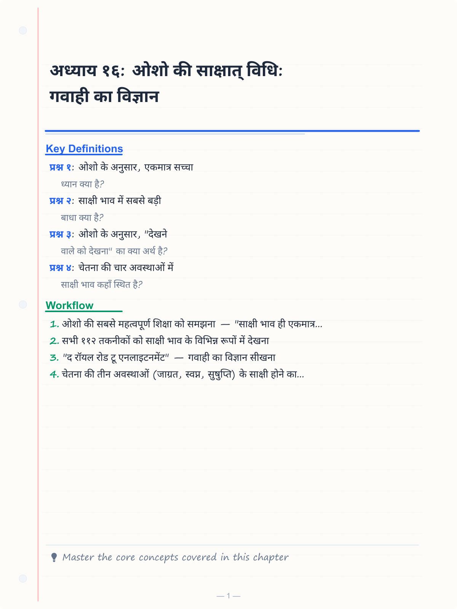
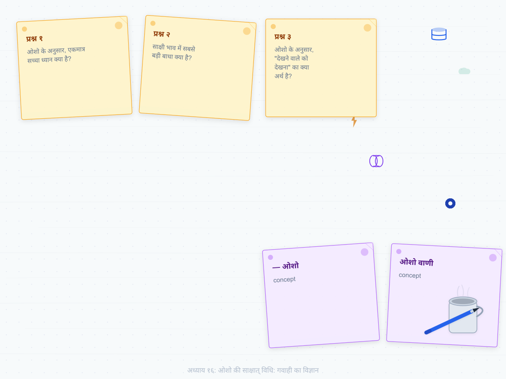
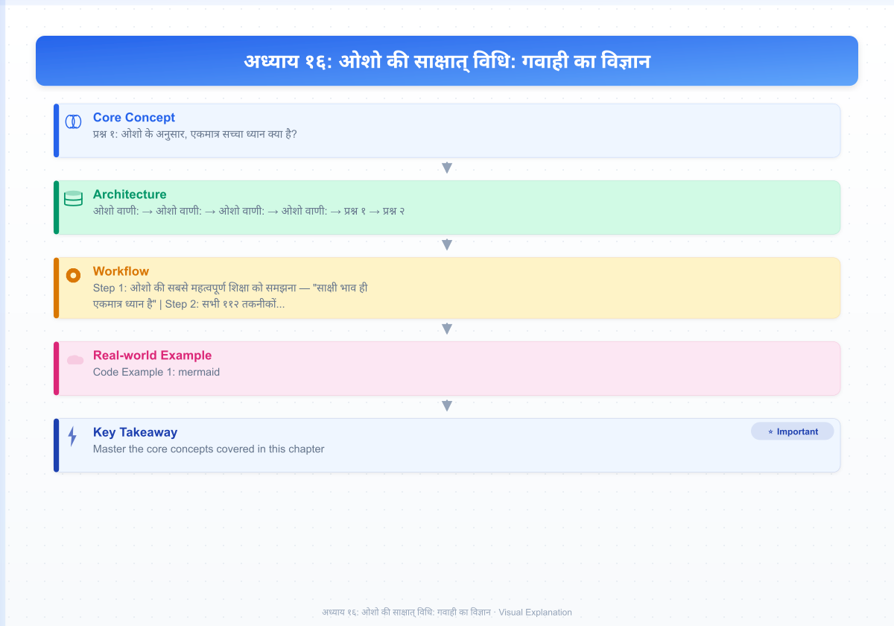

# अध्याय १६: ओशो की साक्षात् विधि: गवाही का विज्ञान

<!-- Image Gallery -->
<section class="lesson-visuals" aria-label="Visual learning resources">
  <header><span>VISUAL LEARNING</span><h2>See it. Review it. Remember it.</h2></header>
  <a class="lesson-visual-card" href="../../assets/images/lessons/vigyan-bhairav-tantra/16-osho-ki-sakshaat-vidhi/handwritten-notes.png" target="_blank" rel="noopener">
    
    <span><strong>Handwritten notes</strong>Condensed notes for deliberate review.</span>
  </a>
  <a class="lesson-visual-card" href="../../assets/images/lessons/vigyan-bhairav-tantra/16-osho-ki-sakshaat-vidhi/sticky-notes.png" target="_blank" rel="noopener">
    
    <span><strong>Sticky-note revision</strong>Fast recall prompts for revision.</span>
  </a>
  <a class="lesson-visual-card" href="../../assets/images/lessons/vigyan-bhairav-tantra/16-osho-ki-sakshaat-vidhi/visual-explanation.png" target="_blank" rel="noopener">
    
    <span><strong>Visual concept guide</strong>A connected explanation of the key ideas.</span>
  </a>
</section>
<!-- End Image Gallery -->

## सीखने के उद्देश्य (Learning Objectives)

इस अध्याय को पूरा करने के बाद, तुम निम्नलिखित में सक्षम होगे:

1. ओशो की सबसे महत्वपूर्ण शिक्षा को समझना — "साक्षी भाव ही एकमात्र ध्यान है"
2. सभी ११२ तकनीकों को साक्षी भाव के विभिन्न रूपों में देखना
3. "द रॉयल रोड टू एनलाइटनमेंट" — गवाही का विज्ञान सीखना
4. चेतना की तीन अवस्थाओं (जाग्रत, स्वप्न, सुषुप्ति) के साक्षी होने का अभ्यास
5. साक्षी भाव में आने वाली बाधाओं को पहचानना और उनका समाधान करना
6. TypeScript Witnessing Practice Tracker विकसित करना

---

## 🔱 प्रस्तावना: "साक्षी भाव ही एकमात्र ध्यान है"

> *"मैं तुमसे कहता हूँ — साक्षी भाव ही एकमात्र ध्यान है। बाकी सब तैयारी है। ११२ तकनीकें — सब साक्षी भाव की अलग-अलग विधियाँ हैं। कोई और ध्यान नहीं है। सिर्फ गवाह होना सीखो। यही सब कुछ है।"*
> **— ओशो**

**ओशो वाणी:**
*"एक दिन एक आदमी मेरे पास आया। उसने कहा, 'ओशो, मैंने सब कुछ कर लिया — श्वास ध्यान, मंत्र ध्यान, कुंडलिनी ध्यान, प्राणायाम, सब कुछ। मुझे अब और क्या करना चाहिए?'*

*मैंने उसकी ओर देखा और मुस्कुराया। मैंने कहा, 'अब कुछ मत करो। बस बैठो और देखो। देखो कि तुमने यह सब किया — इस विचार को भी देखो। देखो कि तुम कुछ और करना चाहते हो — इस इच्छा को भी देखो। बस देखो — यही काफी है।'*

*वह बोला, 'लेकिन यह तो बहुत सरल है!'*

*मैंने कहा, 'सरल इसलिए है क्योंकि यही तुम्हारा स्वभाव है। तुम जागरूक पैदा हुए थे — फिर तुमने जागरूक न रहना सीख लिया। अब तुम्हें बस अपने स्वभाव को याद करना है। देखना कोई क्रिया नहीं है — यह तो तुम्हारा होना है।'*

*वह आदमी घबराया। उसने कहा, 'लेकिन मैंने इतनी मेहनत की — इतने साल — और अब आप कहते हैं कि कुछ करने की ज़रूरत नहीं?'*

*मैंने कहा, 'मैं यह नहीं कह रहा कि तुम्हारी मेहनत बेकार थी। उस मेहनत ने तुम्हें इस बिंदु तक पहुँचाया है जहाँ तुम यह समझ सकते हो कि कुछ करने की ज़रूरत नहीं है। अब तुम आराम कर सकते हो। अब तुम बस हो सकते हो।'*

*वह समझ गया। वह बैठ गया। उसने आँखें बंद कीं — और पहली बार, उसने कुछ नहीं किया। वह बस देख रहा था। और उस देखने में — वह खो गया। न कोई करने वाला बचा, न कोई देखने वाला — सिर्फ देखना बचा।*

*जब उसने आँखें खोलीं, तो उसकी आँखों में एक अजीब सी शांति थी। उसने कहा, 'ओशो, यह तो वही है जो मैं हमेशा से था। मैं बस भूल गया था।'*

*मैंने कहा, 'अब तुम समझ गए। यही सब कुछ है।'"*

---

## १. गवाही का विज्ञान — ओशो की रॉयल रोड

### १.१ साक्षी भाव क्या है?

ओशो के लिए, साक्षी भाव कोई तकनीक नहीं है — यह तो तुम्हारा स्वभाव है। लेकिन क्योंकि हम भूल गए हैं, हमें इसे एक तकनीक के रूप में सीखना पड़ता है।

> *"साक्षी भाव का मतलब है — अपने विचारों, भावनाओं, शरीर, और संसार को ऐसे देखना जैसे तुम उनमें नहीं हो। जैसे तुम एक किनारे बैठे हो और नदी बह रही है — तुम नदी में नहीं हो, तुम किनारे पर हो। नदी है विचारों की, भावनाओं की, शरीर की — और तुम किनारे पर बैठे हो, देख रहे हो।"*

```mermaid
flowchart TD
    subgraph पहले[सामान्य अवस्था]
        A[विचार] -->|पहचान| B[मैं ही विचार हूँ]
        C[भावना] -->|पहचान| D[मैं ही भावना हूँ]
        E[शरीर] -->|पहचान| F[मैं ही शरीर हूँ]
    end
    
    subgraph बाद[साक्षी अवस्था]
        G[विचार] -->|देखना| H[मैं विचारों को देख रहा हूँ]
        I[भावना] -->|देखना| J[मैं भावनाओं को देख रहा हूँ]
        K[शरीर] -->|देखना| L[मैं शरीर को देख रहा हूँ]
    end
    
    पहले -->|साक्षी भाव का अभ्यास| बाद
    
    H --> M[साक्षी चेतना]
    J --> M
    L --> M
    
    style M fill:#f1c40f,stroke:#333,stroke-width:3px
```

### १.२ ओशो के तीन स्तरों का साक्ष्य

| स्तर | क्या देखना है? | ओशो का कथन |
|------|---------------|-------------|
| शरीर | शारीरिक संवेदनाएँ, दर्द, सुख | "शरीर को ऐसे देखो जैसे वह तुम्हारा नहीं है" |
| मन | विचार, भावनाएँ, कल्पनाएँ | "विचारों को ऐसे देखो जैसे बादल आकाश में गुज़र रहे हों" |
| चेतना | स्वयं साक्षी को देखना | "अब देखने वाले को देखो — यह अंतिम सीमा है" |

**ओशो वाणी:**
*"पहले तुम शरीर को देखो — पैर में दर्द है, उसे देखो। पैर में दर्द है, लेकिन तुम दर्द नहीं हो — तुम उसे देख रहे हो। यह पहला कदम है।*

*फिर तुम मन को देखो — क्रोध आ रहा है, उसे देखो। क्रोध आ रहा है, लेकिन तुम क्रोध नहीं हो — तुम उसे देख रहे हो। यह दूसरा कदम है।*

*फिर तुम देखने वाले को देखो — कौन देख रहा है? उसे देखो। यह तीसरा कदम है।*

*और तीसरे कदम के बाद — कोई कदम नहीं है। तुम घर पहुँच गए।"*

---

## २. ११२ तकनीकें — साक्षी भाव के ११२ दरवाज़े

### २.1 ओशो का वर्गीकरण

ओशो ने सभी ११२ तकनीकों को साक्षी भाव के विभिन्न दृष्टिकोणों में बाँटा:

```mermaid
mindmap
  root((११२ तकनीकें = साक्षी भाव के ११२ दरवाज़े))
    श्वास का साक्षी (१-२०)
      श्वास को देखना
      श्वास के मध्य को देखना
      प्राण के संचार को देखना
    शरीर का साक्षी (२१-४०)
      आँखों से देखना
      स्पर्श को देखना
      स्थिरता को देखना
    भावना का साक्षी (४१-६०)
      भावनाओं को देखना
      भावनाओं के बीच के ठहराव को देखना
      राग-द्वेष को देखना
    शून्य का साक्षी (६१-८०)
      शून्यता को देखना
      अभाव को देखना
      साक्षी का ही साक्षी
    संवेदना का साक्षी (८१-१००)
      हर संवेदना को देखना
      पंचभूतों को देखना
      जगत को देखना
    समग्र का साक्षी (१०१-११२)
      सब कुछ शिवमय — देखना ही शिव है
```



**ओशो वाणी:**
*"ये ११२ तकनीकें ११२ दरवाज़े हैं। लेकिन सब एक ही मंदिर में जाते हैं। कोई भी दरवाज़ा चुनो — वह तुम्हें उसी केंद्र में ले जाएगा। और उस केंद्र में — तुम पाओगे कि तुम हमेशा से वहाँ थे। बस दरवाज़े के बाहर खड़े होकर सोच रहे थे कि अंदर कैसे जाएँ। और दरवाज़ा — वह तो खुला ही था। तुम्हें बस देखना था कि वह खुला है।"*

### २.2 प्रमुख तकनीकें — साक्षी भाव की ओशो की व्याख्या

| VBT तकनीक | ओशो की व्याख्या | साक्षी भाव का पहलू |
|-----------|-----------------|---------------------|
| तकनीक १: श्वास | "सिर्फ साँस को देखो — बस इतना ही" | श्वास का साक्षी |
| तकनीक २४: द्वादशांत | "विचारों को सिर के ऊपर जाते देखो" | विचारों का साक्षी |
| तकनीक ३२: उन्मेष-निमेष | "पलकों के झपकने को देखो — ऊर्जा को देखो" | क्रिया का साक्षी |
| तकनीक ४७: योग निद्रा | "नींद को आते देखो — साक्षी मत छोड़ो" | अवस्थाओं का साक्षी |
| तकनीक ५५: हृदय ध्यान | "हृदय की धड़कन को देखो — वहाँ कौन है?" | शरीर का साक्षी |
| तकनीक ६२: शून्य ध्यान | "सब कुछ खाली है — इस खालीपन को देखो" | शून्य का साक्षी |
| तकनीक ७४: साक्षी भाव | "दुख में भी, सुख में भी — बस देखो" | साक्षी का साक्षी |
| तकनीक ११२: अहं भैरव | "देखने वाला और देखना एक हैं — इसे देखो" | अद्वैत का साक्षी |

---

## ३. तीन अवस्थाओं का साक्षी — ओशो की अनूठी शिक्षा

### ३.१ जाग्रत का साक्षी

> *"जाग्रत अवस्था में — तुम शरीर, मन और संसार को देख सकते हो। यह सबसे आसान है। दिन में किसी भी समय, रुको और देखो — 'मैं यह सब देख रहा हूँ।' यह जाग्रत का साक्षी है।"*

### ३.२ स्वप्न का साक्षी

> *"अगले स्तर पर — तुम स्वप्न में भी जागरूक रह सकते हो। यह ज़्यादा कठिन है। लेकिन जब तुम जाग्रत में साक्षी बनने में सफल हो जाते हो, तो स्वप्न में भी वही जागरूकता बनी रहती है। फिर तुम स्वप्न को भी देख सकते हो — बिना उसमें खोए।"*

### ३.३ सुषुप्ति का साक्षी

> *"सबसे कठिन है सुषुप्ति में साक्षी रहना — गहरी नींद में भी जागरूक रहना। लेकिन जब ऐसा होता है, तो तुम चौथी अवस्था में प्रवेश करते हो — तुरीया। और तुरीया में — तुम हमेशा के लिए जाग गए।"*

```mermaid
flowchart TD
    subgraph तीन[तीन अवस्थाएँ]
        A[जाग्रत - Waking] -->|साक्षी| A1[देखो — मैं शरीर को देख रहा हूँ]
        B[स्वप्न - Dreaming] -->|साक्षी| B1[देखो — मैं स्वप्न को देख रहा हूँ]
        C[सुषुप्ति - Deep Sleep] -->|साक्षी| C1[देखो — मैं नींद को भी देख रहा हूँ]
    end
    
    A1 --> D[तुरीया - The Fourth]
    B1 --> D
    C1 --> D
    
    D --> E[साक्षी ही सब कुछ है]
    E --> F[कोई अवस्था नहीं बची — सिर्फ चेतना]
    
    style D fill:#f1c40f,stroke:#333,stroke-width:3px
    style F fill:#9b59b6,color:#fff,stroke-width:3px
```

---

## ४. साक्षी भाव में बाधाएँ और ओशो का समाधान

### ४.१ पाँच प्रमुख बाधाएँ

| बाधा | लक्षण | ओशो का समाधान |
|------|-------|---------------|
| भूलना | "भूल जाते हैं कि देखना है" | "जितनी बार याद आए, देखो — धीरे-धीरे याद रहेगा" |
| उलझना | "विचारों में खो जाते हैं" | "जब याद आए कि भूल गए थे, तो उस क्षण — तुम जाग गए" |
| निराशा | "कुछ नहीं हो रहा" | "यह 'कुछ नहीं हो रहा' — इसे भी देखो। यह भी एक विचार है" |
| ऊब | "बोरियत होती है" | "बोरियत को देखो — वह कहाँ से आती है? कौन ऊब रहा है?" |
| अहंकार | "मैं साक्षी हूँ — यह भाव" | "इस 'मैं साक्षी हूँ' को भी देखो — यह भी एक विचार है" |

### ४.२ ओशो का सबसे महत्वपूर्ण सूत्र

> *"अगर तुम सोचते हो कि तुम साक्षी हो, तो तुम साक्षी नहीं हो — क्योंकि यह विचार ही अहंकार है। साक्षी को कोई पता नहीं होता कि वह साक्षी है। वह तो बस है। जैसे दर्पण — वह नहीं जानता कि वह दर्पण है। वह बस प्रतिबिंबित करता है।"*

---

## ५. साक्षी भाव का दैनिक अभ्यास — ओशो का कार्यक्रम

### ५.१ एक दिन का साक्षी

```mermaid
flowchart LR
    subgraph सुबह[सुबह ५:००-७:००]
        A1[जागते ही — शरीर को देखो]
        A2[स्नान में — पानी को देखो]
        A3[चाय में — स्वाद को देखो]
    end
    
    subgraph दिन[दिन ९:००-५:००]
        B1[काम में — क्रिया को देखो]
        B2[बात में — शब्दों को देखो]
        B3[चलते — कदमों को देखो]
    end
    
    subgraph शाम[शाम ५:००-१०:००]
        C1[खाने में — स्वाद को देखो]
        C2[मौन में — विचारों को देखो]
        C3[सोते — नींद को देखो]
    end
    
    सुबह --> दिन --> शाम
```

### ५.२ "रिमाइंडर तकनीक" — ओशो की सबसे सरल विधि

> *"दिन में जितनी बार याद आए — रुको। एक गहरी साँस लो। और देखो — 'मैं कहाँ हूँ? मैं क्या कर रहा हूँ? कौन देख रहा है?' यह तीन प्रश्न — और तुम साक्षी में आ गए।"*

---

## ६. TypeScript कार्यान्वयन: Witnessing Practice Tracker

```typescript
/**
 * साक्षी भाव अभ्यास ट्रैकर (Witnessing Practice Tracker)
 * 
 * "साक्षी भाव ही एकमात्र ध्यान है। यह टूल तुम्हें
 * याद दिलाने के लिए है — बस देखो, कुछ मत करो।" — ओशो
 * 
 * @package OshoVBT
 * @version 1.0.0
 */

// === मुख्य प्रकार ===

type WitnessLevel = 'body' | 'mind' | 'feelings' | 'witness' | 'nothingness';
type StateOfConsciousness = 'jagrat' | 'svapna' | 'sushupti' | 'turiya';
type WitnessObstacle = 'forgetting' | 'identification' | 'frustration' | 'boredom' | 'ego' | 'drowsiness' | 'restlessness';

interface WitnessSession {
    id: string;
    date: Date;
    duration: number; // minutes
    techniqueUsed: number; // VBT technique number
    level: WitnessLevel;
    state: StateOfConsciousness;
    whatWasObserved: string;
    obstacles: WitnessObstacle[];
    howOvercame: string;
    clarity: number; // 1-10
    tipForNextTime: string;
}

interface WitnessDailyLog {
    date: Date;
    sessions: WitnessSession[];
    totalWitnessMinutes: number;
    dominantLevel: WitnessLevel;
    dominantObstacle: WitnessObstacle;
    insight: string;
}

interface WitnessProgress {
    weekStart: Date;
    sessionsCount: number;
    averageClarity: number;
    levelProgression: WitnessLevel[];
    overcomingPatterns: string[];
    oshoAdvice: string;
}

interface WitnessReminder {
    time: Date;
    message: string;
    technique: string;
    duration: number;
}

// === ओशो के साक्षी भाव उद्धरण ===

const WITNESS_QUOTES: Record<string, string> = {
    essence: 'साक्षी भाव ही एकमात्र ध्यान है। बाकी सब तैयारी है।',
    howTo: 'बस देखो — जैसे कोई और देख रहा हो। तुम नहीं देख रहे, देखना हो रहा है।',
    obstacle: 'जब याद आए कि तुम भूल गए थे — उसी क्षण तुम जाग गए। भूलना कोई समस्या नहीं है।',
    deepening: 'पहले शरीर को देखो, फिर मन को, फिर देखने वाले को — और फिर कोई नहीं बचता।',
    final: 'जब कोई देखने वाला नहीं बचता, सिर्फ देखना बचता है — यही साक्षी भाव की पूर्णता है।'
};

// === ओशो के साक्षी भाव निर्देश ===

const WITNESS_INSTRUCTIONS: Record<WitnessLevel, {
    instruction: string;
    oshoQuote: string;
    typicalTime: string;
}> = {
    body: {
        instruction: 'शरीर को ऐसे देखो जैसे वह तुम्हारा नहीं है। हर संवेदना को देखो — दर्द, सुख, गर्मी, ठंड।',
        oshoQuote: 'शरीर तुम्हारा मंदिर है — लेकिन तुम मंदिर नहीं हो। तुम वह हो जो मंदिर में बैठा है।',
        typicalTime: 'प्रातः स्नान के समय'
    },
    mind: {
        instruction: 'विचारों को ऐसे देखो जैसे बादल आकाश में गुज़र रहे हों। तुम आकाश हो, बादल नहीं।',
        oshoQuote: 'विचार आते हैं और जाते हैं — तुम वही रहते हो। तुम वह मौन पृष्ठभूमि हो जिस पर विचार लिखे जाते हैं।',
        typicalTime: 'ध्यान के समय'
    },
    feelings: {
        instruction: 'भावनाओं को देखो — क्रोध, प्रेम, उदासी, आनंद। वे आती हैं और जाती हैं। तुम वही रहते हो।',
        oshoQuote: 'भावनाएँ लहरों की तरह हैं — वे उठती हैं और गिरती हैं। तुम समुद्र हो, लहर नहीं।',
        typicalTime: 'दिन भर — जब भी भावना उठे'
    },
    witness: {
        instruction: 'अब देखने वाले को देखो — कौन देख रहा है? उस देखने वाले को देखो।',
        oshoQuote: 'देखने वाले को देखना ही अंतिम ध्यान है। उसके बाद — कोई और नहीं बचता।',
        typicalTime: 'गहन ध्यान के अंतिम चरण में'
    },
    nothingness: {
        instruction: 'अब न कोई देखने वाला है, न कोई देखी जाने वाली चीज़। सिर्फ एकता है — शून्यता — परम।',
        oshoQuote: 'जब कोई देखने वाला नहीं बचता, देखना ही रह जाता है — यही सब कुछ है।',
        typicalTime: 'समाधि की अवस्था'
    }
};

// === साक्षी ट्रैकर क्लास ===

class WitnessingTracker {
    private sessions: WitnessSession[];
    private dailyLogs: Map<string, WitnessDailyLog>;

    constructor() {
        this.sessions = [];
        this.dailyLogs = new Map();
    }

    /**
     * नया साक्षी सत्र जोड़ो
     */
    addSession(session: Omit<WitnessSession, 'id' | 'date'>): WitnessSession {
        const newSession: WitnessSession = {
            id: `ws_${Date.now()}_${Math.random().toString(36).substr(2, 5)}`,
            date: new Date(),
            ...session
        };
        this.sessions.push(newSession);
        return newSession;
    }

    /**
     * आज के लिए साक्षी सारांश
     */
    getDailySummary(date: Date = new Date()): WitnessDailyLog {
        const daySessions = this.sessions.filter(s => 
            s.date.toDateString() === date.toDateString()
        );

        if (daySessions.length === 0) {
            return {
                date,
                sessions: [],
                totalWitnessMinutes: 0,
                dominantLevel: 'body',
                dominantObstacle: 'forgetting',
                insight: 'आज अभी तक कोई साक्षी सत्र नहीं हुआ। याद रखो — हर क्षण एक नया अवसर है।'
            };
        }

        const totalMinutes = daySessions.reduce((s, sess) => s + sess.duration, 0);
        
        // प्रमुख स्तर
        const levelCount = new Map<WitnessLevel, number>();
        daySessions.forEach(s => levelCount.set(s.level, (levelCount.get(s.level) || 0) + 1));
        const dominantLevel = Array.from(levelCount.entries()).sort((a, b) => b[1] - a[1])[0][0];
        
        // प्रमुख बाधा
        const obstacleCount = new Map<WitnessObstacle, number>();
        daySessions.forEach(s => s.obstacles.forEach(o => 
            obstacleCount.set(o, (obstacleCount.get(o) || 0) + 1)
        ));
        const dominantObstacle = obstacleCount.size > 0
            ? Array.from(obstacleCount.entries()).sort((a, b) => b[1] - a[1])[0][0]
            : 'forgetting';

        return {
            date,
            sessions: daySessions,
            totalWitnessMinutes: totalMinutes,
            dominantLevel,
            dominantObstacle,
            insight: this.generateInsight(dominantLevel, dominantObstacle)
        };
    }

    /**
     * साप्ताहिक प्रगति
     */
    getWeeklyProgress(): WitnessProgress {
        const weekStart = new Date();
        weekStart.setDate(weekStart.getDate() - weekStart.getDay());

        const weekSessions = this.sessions.filter(s => s.date >= weekStart);
        const avgClarity = weekSessions.length > 0
            ? weekSessions.reduce((s, sess) => s + sess.clarity, 0) / weekSessions.length
            : 0;

        // स्तर प्रगति
        const levelOrder: WitnessLevel[] = ['body', 'mind', 'feelings', 'witness', 'nothingness'];
        const levelsSeen = new Set(weekSessions.map(s => s.level));
        const progression = levelOrder.filter(l => levelsSeen.has(l));

        return {
            weekStart,
            sessionsCount: weekSessions.length,
            averageClarity: avgClarity,
            levelProgression: progression,
            overcomingPatterns: this.findOvercomingPatterns(weekSessions),
            oshoAdvice: this.getOshoAdvice(progression)
        };
    }

    /**
     * साक्षी भाव अनुस्मारक उत्पन्न करो
     */
    generateReminders(): WitnessReminder[] {
        const reminders: WitnessReminder[] = [];
        const now = new Date();

        // हर घंटे के लिए
        for (let hour = 0; hour < 24; hour++) {
            const time = new Date(now);
            time.setHours(hour, 0, 0, 0);
            
            if (time > now) {
                const hourType = hour < 12 ? 'morning' : hour < 17 ? 'afternoon' : 'evening';
                reminders.push({
                    time,
                    message: this.getReminderMessage(hourType),
                    technique: hour % 2 === 0 ? 'श्वास देखो' : 'शरीर देखो',
                    duration: 1
                });
            }
        }

        return reminders.slice(0, 10);
    }

    /**
     * साक्षी भाव को गहरा करने के लिए ओशो का निर्देश
     */
    getDeepeningInstruction(currentLevel: WitnessLevel): string {
        const levels: WitnessLevel[] = ['body', 'mind', 'feelings', 'witness', 'nothingness'];
        const currentIndex = levels.indexOf(currentLevel);
        
        if (currentIndex >= levels.length - 1) {
            return WITNESS_QUOTES.final;
        }

        const nextLevel = levels[currentIndex + 1];
        return `अब ${WITNESS_INSTRUCTIONS[currentLevel].instruction} से आगे बढ़ो। ${WITNESS_INSTRUCTIONS[nextLevel].instruction}`;
    }

    /**
     * तत्काल साक्षी — अभी, इसी क्षण
     */
    getMomentWitnessPractice(): string {
        const practices = [
            'रुको। एक गहरी साँस लो। अपने चारों ओर देखो — बिना नाम दिए। बस देखो।',
            'अपनी आँखें बंद करो। अपने विचारों को देखो — जैसे कोई और देख रहा हो।',
            'अपने शरीर को महसूस करो। कहीं कोई तनाव है? उसे देखो। बस देखो।',
            'अभी क्या भावना है? क्रोध? उदासी? आनंद? उसे देखो। तुम वह नहीं हो — तुम देख रहे हो।',
            'अपने चारों ओर की आवाज़ों को सुनो। बस सुनो — बिना नाम दिए, बिना निर्णय के।',
            'देखो कि तुम देख रहे हो। इस 'देखने' को देखो।'
        ];
        return practices[Math.floor(Math.random() * practices.length)];
    }

    // === निजी विधियाँ ===

    private generateInsight(level: WitnessLevel, obstacle: WitnessObstacle): string {
        const insights: Record<string, string> = {
            body: 'शरीर को देखना शुरुआत है। याद रखो — तुम शरीर नहीं हो।',
            mind: 'मन को देखना गहराई है। याद रखो — तुम विचार नहीं हो।',
            feelings: 'भावनाओं को देखना और गहरा है। याद रखो — तुम भावना नहीं हो।',
            witness: 'देखने वाले को देखना बहुत गहरा है। याद रखो — तुम वह भी नहीं हो।',
            nothingness: 'अब कोई और कुछ नहीं बचा। बस होना है।',
        };
        return insights[level] || 'बस देखो — यही काफी है।';
    }

    private findOvercomingPatterns(sessions: WitnessSession[]): string[] {
        const patterns: string[] = [];
        const successfulSessions = sessions.filter(s => s.howOvercame.length > 10);
        
        if (successfulSessions.length > 0) {
            patterns.push('जब तुम भूल जाते हो और फिर याद करते हो — यही सबसे बड़ी सफलता है।');
            patterns.push('तुम हर बार भूल रहे हो और हर बार याद कर रहे हो — यही अभ्यास है।');
        }

        return patterns;
    }

    private getOshoAdvice(progression: WitnessLevel[]): string {
        if (progression.length === 0) {
            return 'शुरुआत करो — शरीर को देखो। यह सबसे सरल है।';
        }
        if (progression.length <= 2) {
            return 'अच्छी शुरुआत है। अब मन को देखने की कोशिश करो — विचारों को बादलों की तरह।';
        }
        if (progression.length <= 4) {
            return 'गहराई में जा रहे हो। अब देखने वाले को देखो — वह कौन है जो यह सब देख रहा है?';
        }
        return 'तुम बहुत करीब हो। अब कोई प्रयास मत करो — बस होने दो। होना ही काफी है।';
    }

    private getReminderMessage(hourType: string): string {
        const messages: Record<string, string[]> = {
            morning: [
                'सुप्रभात! आज का पहला साक्षी — श्वास को देखो। तीन साँसें — पूरी जागरूकता से।',
                'दिन की शुरुआत करो साक्षी भाव से। अपने पैरों के नीचे की ज़मीन को महसूस करो।'
            ],
            afternoon: [
                'दिन के बीच में — रुको। एक साँस लो। देखो कि तुम कहाँ हो।',
                'काम में खो मत जाओ। बीच-बीच में — रुको और देखो कि कौन काम कर रहा है।'
            ],
            evening: [
                'शाम हो गई। दिन का पुनरावलोकन करो — कितनी बार याद आया? कितनी बार भूल गए?',
                'दिन ढल रहा है। अब विचारों को भी ढलने दो। बस देखो।'
            ]
        };

        const msgs = messages[hourType] || messages.afternoon;
        return msgs[Math.floor(Math.random() * msgs.length)];
    }

    /**
     * साक्षी भाव सिखाने की ओशो की विधि — एक कहानी
     */
    getOshoTeachingStory(): { title: string; story: string; teaching: string } {
        const stories = [
            {
                title: 'दो साधु और नदी',
                story: 'दो साधु एक नदी के किनारे बैठे थे। पहला साधु बोला, "मैंने दस साल ध्यान किया है — और मैं अब विचारों को पूरी तरह रोक सकता हूँ।" दूसरा साधु मुस्कुराया और चुप रहा। पहले ने पूछा, "तुमने कितने साल ध्यान किया है?" दूसरे ने कहा, "मुझे नहीं पता। मैंने कभी गिनती नहीं रखी।" पहले ने कहा, "लेकिन तुम्हें कैसे पता चलेगा कि तुमने प्रगति की?" दूसरे ने कहा, "मुझे नहीं पता। मैं सिर्फ देखता हूँ। और देखते-देखते — देखने वाला ही गायब हो गया। अब सिर्फ देखना है।"',
                teaching: 'प्रगति का मतलब कुछ हासिल करना नहीं है — प्रगति का मतलब है खुद को खो देना।'
            },
            {
                title: 'बुद्ध और जिज्ञासु',
                story: 'एक जिज्ञासु बुद्ध के पास आया और बोला, "मैं ध्यान करना चाहता हूँ। मुझे सिखाइए।" बुद्ध ने कहा, "बैठो।" वह बैठ गया। बुद्ध ने कहा, "देखो।" उसने पूछा, "क्या देखूँ?" बुद्ध ने कहा, "जो है, उसे देखो।" वह समझा नहीं। बुद्ध ने कहा, "तुम अपनी साँस देख रहे हो?" उसने कहा, "नहीं।" बुद्ध ने कहा, "तो उसे देखो।" उसने देखा। एक मिनट बाद बुद्ध ने पूछा, "अब तुम क्या देख रहे हो?" उसने कहा, "साँस।" बुद्ध ने कहा, "नहीं — तुम साँस को देख रहे हो। तुम वह नहीं हो जो देखा जा रहा है। तुम वह हो जो देख रहा है। यही ध्यान है।"',
                teaching: 'ध्यान का मतलब सिर्फ देखना है — बिना किसी कर्ता के, बिना किसी निर्णय के।'
            }
        ];
        return stories[Math.floor(Math.random() * stories.length)];
    }
}

// === उपयोग उदाहरण ===

function demonstrateWitnessingTracker(): void {
    console.log('🕉️  साक्षी भाव अभ्यास ट्रैकर');
    console.log('   "बस देखो — यही सब कुछ है"\n');

    const tracker = new WitnessingTracker();

    // कुछ साक्षी सत्र जोड़ें
    console.log('📝 आज के साक्षी सत्र:');
    
    const sessions = [
        { duration: 10, techniqueUsed: 1, level: 'body' as WitnessLevel, state: 'jagrat' as StateOfConsciousness,
          whatWasObserved: 'श्वास को आते-जाते देखा। मन भटका, वापस लाया।', obstacles: ['forgetting'] as WitnessObstacle[],
          howOvercame: 'जब याद आया, वापस श्वास पर आ गया।', clarity: 6, tipForNextTime: 'सुबह खाली पेट बेहतर रहेगा' },
        { duration: 5, techniqueUsed: 74, level: 'mind' as WitnessLevel, state: 'jagrat' as StateOfConsciousness,
          whatWasObserved: 'क्रोध उठा — उसे देखा। क्रोध गया — उसे देखा।', obstacles: ['identification'] as WitnessObstacle[],
          howOvercame: 'याद आया कि मैं क्रोध नहीं हूँ — क्रोध को देख रहा हूँ।', clarity: 7, tipForNextTime: 'जैसे ही क्रोध उठे, तुरंत देखो' },
        { duration: 15, techniqueUsed: 62, level: 'witness' as WitnessLevel, state: 'jagrat' as StateOfConsciousness,
          whatWasObserved: 'देखने वाले को देखा। फिर कोई देखने वाला नहीं बचा — सिर्फ देखना।', obstacles: ['ego'] as WitnessObstacle[],
          howOvercame: '"मैं देख रहा हूँ" — इस विचार को भी देखा और वह भी गायब हो गया।', clarity: 9, tipForNextTime: 'बस यही जारी रखो।' }
    ];

    for (const s of sessions) {
        const session = tracker.addSession(s);
        console.log(`   ${session.date.toLocaleTimeString('hi-IN')} — स्तर: ${session.level}, अवधि: ${session.duration} मिनट, स्पष्टता: ${session.clarity}/10`);
        console.log(`   देखा: ${session.whatWasObserved}`);
        console.log();
    }

    // दैनिक सारांश
    const daily = tracker.getDailySummary();
    console.log('📊 दैनिक साक्षी सारांश:');
    console.log(`   कुल: ${daily.totalWitnessMinutes} मिनट`);
    console.log(`   प्रमुख स्तर: ${daily.dominantLevel}`);
    console.log(`   प्रमुख बाधा: ${daily.dominantObstacle}`);
    console.log(`   अंतर्दृष्टि: "${daily.insight}"`);
    console.log();

    // इस क्षण का अभ्यास
    console.log('🎯 इसी क्षण — ओशो का निर्देश:');
    console.log(`   "${tracker.getMomentWitnessPractice()}"`);
    console.log();

    // साप्ताहिक प्रगति
    const weekly = tracker.getWeeklyProgress();
    console.log('📈 साप्ताहिक प्रगति:');
    console.log(`   सत्र: ${weekly.sessionsCount}`);
    console.log(`   औसत स्पष्टता: ${weekly.averageClarity.toFixed(1)}/10`);
    console.log(`   स्तर प्रगति: ${weekly.levelProgression.join(' → ')}`);
    console.log(`   ओशो की सलाह: "${weekly.oshoAdvice}"`);
    console.log();

    // कहानी
    const story = tracker.getOshoTeachingStory();
    console.log('📖 ओशो की कहानी:');
    console.log(`   ${story.title}`);
    console.log(`   "${story.story}"`);
    console.log(`   शिक्षा: ${story.teaching}`);
    console.log();

    // गहनता निर्देश
    console.log('🔜 अगला कदम:');
    const deepening = tracker.getDeepeningInstruction(daily.dominantLevel);
    console.log(`   "${deepening}"`);
    console.log();

    // ओशो का अंतिम शब्द
    console.log('💫 ओशो का साक्षी भाव पर अंतिम शब्द:');
    console.log('   "याद रखो — साक्षी भाव कोई उपलब्धि नहीं है।');
    console.log('    यह तुम्हारा स्वभाव है। तुम पैदा ही जागरूक हुए थे।');
    console.log('    फिर तुमने जागरूक न रहना सीख लिया।');
    console.log('    अब बस याद करना है — और याद करना ही सब कुछ है।');
    console.log('    बस देखो। इतना ही।"');
}

demonstrateWitnessingTracker();

export {
    WitnessingTracker,
    WITNESS_QUOTES,
    WITNESS_INSTRUCTIONS,
    type WitnessSession,
    type WitnessDailyLog,
    type WitnessProgress,
    type WitnessLevel,
    type StateOfConsciousness,
    type WitnessObstacle,
    type WitnessReminder
};
```

---

## ७. साक्षी भाव के ओशो के सात सूत्र

### सूत्र १: बस देखो — कुछ मत करो

> *"देखना कोई क्रिया नहीं है। तुम कुछ नहीं कर रहे हो — तुम बस हो रहे हो। और इस होने में, देखना अपने आप होता है।"*

### सूत्र २: न तो दबाओ, न व्यक्त करो — बस देखो

> *"क्रोध आए — न उसे दबाओ, न उसे व्यक्त करो। बस देखो। देखते-देखते वह गायब हो जाएगा — और तुम कुछ गहरा सीखोगे।"*

### सूत्र ३: भूलना स्वाभाविक है — घबराओ मत

> *"तुम हजारों बार भूलोगे। यह स्वाभाविक है। हर बार जब याद आए, बस देखो। भूलना कोई समस्या नहीं है। समस्या है तो यह सोचना कि भूलना समस्या है।"*

### सूत्र ४: देखने वाले को मत पकड़ो

> *"जब तुम साक्षी भाव में सफल होने लगते हो, तो अहंकार कहता है — 'मैं साक्षी हूँ।' इस विचार को भी देखो। यह भी एक विचार है।"*

### सूत्र ५: साक्षी भाव कोई गंभीर बात नहीं है

> *"इसे बहुत गंभीर मत लो। खेलो, हँसो, मज़े करो — और देखते रहो। गंभीरता अहंकार को पोषित करती है।"*

### सूत्र ६: हर चीज़ — एक अवसर है

> *"दर्द भी, सुख भी, क्रोध भी, प्रेम भी — हर चीज़ देखने का एक अवसर है। कुछ भी बेकार नहीं जाता।"*

### सूत्र ७: अंत में, साक्षी को भी छोड़ दो

> *"एक दिन — साक्षी भी गायब हो जाता है। सिर्फ साक्षित्व बचता है। कोई 'मैं' नहीं बचता — सिर्फ देखना है। यही अंतिम अवस्था है।"*

---

## ८. व्यावहारिक अभ्यास (Practical Exercises)

### अभ्यास १: एक दिन — पूरा साक्षी

कल पूरे दिन — हर घंटे, एक मिनट के लिए रुको। देखो कि तुम कहाँ हो, क्या कर रहे हो, कौन देख रहा है।

### अभ्यास २: भावना का साक्षी

जब भी कोई तीव्र भावना उठे — क्रोध, उदासी, आनंद — तुरंत रुको। उसे देखो। उससे पहचान मत बनाओ। बस देखो — वह आई, वह गई।

### अभ्यास ३: सोते समय साक्षी

सोने से पहले, पीठ के बल लेटो। शरीर को ढीला छोड़ दो। नींद को आते देखो — कैसे शरीर सो रहा है, लेकिन तुम जाग रहे हो। जितनी देर रह सको, देखते रहो।

### अभ्यास ४: कोडिंग

`WitnessingTracker` में एक नई मेथड जोड़ो जो साक्षी भाव की प्रगति को एक ग्राफ़ के रूप में दिखाए — कैसे शरीर के साक्षी से मन के साक्षी, फिर आगे बढ़ते हो।

---

## सारांश (Summary)

इस अध्याय में हमने ओशो की सबसे महत्वपूर्ण शिक्षा को समझा:

1. **साक्षी भाव ही एकमात्र ध्यान है** — बाकी सब तैयारी मात्र है।
2. **११२ तकनीकें = साक्षी भाव के ११२ दरवाज़े** — सब एक ही मंजिल तक ले जाते हैं।
3. **तीन अवस्थाओं का साक्षी** — जाग्रत, स्वप्न, सुषुप्ति — और फिर तुरीया।
4. **देखने वाले को देखना** — अंतिम सीमा, जहाँ कोई 'मैं' नहीं बचता।
5. **बस देखो — यही सब कुछ है**।

**ओशो वाणी:**
*"मैं तुमसे बहुत कुछ कह सकता हूँ — लेकिन सब कुछ एक ही बात में समा जाता है: बस देखो। यही सब कुछ है। यही ध्यान है। यही मोक्ष है। यही परम है। बस देखो।"*

---

## अध्याय प्रश्नोत्तरी (Chapter Quiz)

**प्रश्न १**: ओशो के अनुसार, एकमात्र सच्चा ध्यान क्या है?
- क) श्वास ध्यान
- ख) मंत्र ध्यान
- ग) साक्षी भाव
- घ) कुंडलिनी ध्यान

> **उत्तर**: ग) साक्षी भाव — "साक्षी भाव ही एकमात्र ध्यान है। बाकी सब तैयारी है।"

**प्रश्न २**: साक्षी भाव में सबसे बड़ी बाधा क्या है?
- क) समय की कमी
- ख) भूलना और विचारों में उलझ जाना
- ग) गुरु का न होना
- घ) शांत जगह न होना

> **उत्तर**: ख) भूलना — "लेकिन भूलना कोई समस्या नहीं है — जब याद आए, उसी क्षण तुम जाग गए।"

**प्रश्न ३**: ओशो के अनुसार, "देखने वाले को देखना" का क्या अर्थ है?
- क) आईने में अपना चेहरा देखना
- ख) अपने विचारों को देखना
- ग) उस चेतना को देखना जो सब कुछ देख रही है
- घ) शरीर को देखना

> **उत्तर**: ग) उस चेतना को देखना जो सब कुछ देख रही है — "यह अंतिम सीमा है।"

**प्रश्न ४**: चेतना की चार अवस्थाओं में साक्षी भाव कहाँ स्थित है?
- क) केवल जाग्रत में
- ख) केवल स्वप्न में
- ग) तीनों अवस्थाओं के पार — तुरीया
- घ) केवल सुषुप्ति में

> **उत्तर**: ग) तीनों अवस्थाओं के पार — तुरीया — "तीनों का साक्षी — यही तुरीया है।"

**प्रश्न ५**: ओशो के अनुसार, साक्षी भाव में 'अहंकार' की बाधा से कैसे निपटें?
- क) अहंकार से लड़ो
- ख) 'मैं साक्षी हूँ' — इस विचार को भी देखो
- ग) गुरु से प्रार्थना करो
- घ) यह बाधा दूर नहीं हो सकती

> **उत्तर**: ख) "'मैं साक्षी हूँ' — इस विचार को भी देखो। यह भी एक विचार है।"

---

## अभ्यास (Exercises)

1. **एक दिन का प्रयोग**: हर घंटे — एक मिनट रुको। देखो। तीन गहरी साँसें लो। देखो कि कौन देख रहा है।

2. **भावना साक्षी**: अगले सात दिन — जब भी कोई तीव्र भावना उठे — उसे ३० सेकंड तक बस देखो। न दबाओ, न व्यक्त करो।

3. **सोते समय**: सोने से पहले ५ मिनट — शरीर को देखो। नींद को देखो। कितनी देर तक जागरूक रह सकते हो?

4. **कोड**: `WitnessingTracker` में एक नई सुविधा जोड़ो — "Witnessing Streak" — कितने दिन लगातार साक्षी भाव का अभ्यास हुआ।

---

*"बस देखो। यही सब कुछ है। कोई और रहस्य नहीं है। कोई और तकनीक नहीं है। ११२ तकनीकें — सब सिर्फ इसी एक बात के लिए हैं: तुम्हें याद दिलाने के लिए कि तुम देख सकते हो। और जब तुम देखते हो — तुम पाते हो कि तुम वह नहीं हो जो देखा जा रहा है। तुम वह हो जो देख रहा है। और वह देखना — वही परम है। वही परमात्मा है। वही तुम हो।"*
> **— ओशो**
