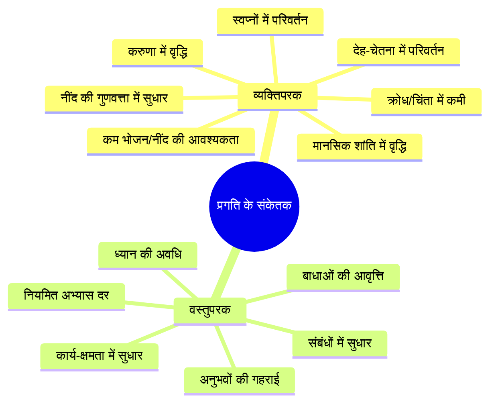

# अध्याय १६: स्व-मूल्यांकन और साधना पत्रिका

## सीखने के उद्देश्य (Learning Objectives)

इस अध्याय को पूरा करने के बाद, आप निम्नलिखित में सक्षम होंगे:

1. साधना में आत्म-मूल्यांकन की विधियों और उनके महत्व को समझना
2. शास्त्रीय अवस्थाओं (आरम्भ, घट, परिचय, निष्पत्ति) के अनुसार अपनी प्रगति को मापना
3. साधना पत्रिका (Practice Journal) को व्यवस्थित रूप से संचालित करना
4. चेतना के स्तरों (जाग्रत, स्वप्न, सुषुप्ति, तुरीया) को पहचानना
5. साधना के व्यक्तिपरक और वस्तुपरक संकेतकों को समझना
6. TypeScript Sadhana Progress Tracker विकसित करना

---

## प्रस्तावना

> *"आत्मानं विद्धि स्वाध्यायेन तपसा वा अथ ब्रह्मचर्येण। न हि सुखं दुःखाननुभूय निर्वाणमधिगच्छति।।"*

**भावार्थ**: स्वाध्याय (आत्म-अध्ययन), तप और ब्रह्मचर्य के द्वारा आत्मा को जानो। बिना दुःख का अनुभव किए निर्वाण प्राप्त नहीं होता।

साधना का मार्ग अनंत है। इस मार्ग में हम यह जानना चाहते हैं कि "क्या हम सही दिशा में जा रहे हैं?" यह स्वाभाविक प्रश्न है। किन्तु साधना में प्रगति का माप सांसारिक प्रगति जैसा नहीं है। यहाँ प्रगति का अर्थ है — चेतना का विस्तार, द्वैत का क्षय, और आंतरिक शांति का गहराना।

यह अध्याय आपको सिखाएगा कि अपनी साधना का ईमानदार और व्यवस्थित मूल्यांकन कैसे करें, और एक साधना पत्रिका कैसे रखें जो आपकी प्रगति का सच्चा दर्पण हो।

---

## १. साधना में प्रगति का स्वरूप (Nature of Progress in Sadhana)

### १.१ प्रगति के चार स्तर

कश्मीर शैव परंपरा में साधना में प्रगति को चार अवस्थाओं में बाँटा गया है:

```mermaid
flowchart TD
    subgraph आरम्भ[१. आरम्भ अवस्था<br>प्रारंभिक प्रयास]
        A1[नियमित अभ्यास स्थापित करना]
        A2[बुनियादी तकनीकों से परिचय]
        A3[बाधाओं से संघर्ष]
        A4[अनुभव अनियमित]
    end
    
    subgraph घट[२. घट अवस्था<br>आंतरिक परिवर्तन]
        B1[ध्यान गहराना]
        B2[प्राण का संचार महसूस होना]
        B3[मन की शांति बढ़ना]
        B4[सांसारिक आसक्ति कम होना]
    end
    
    subgraph परिचय[३. परिचय अवस्था<br>चेतना का विस्तार]
        C1[गहन समाधि के अनुभव]
        C2[सबमें शिव का दर्शन]
        C3[द्वैत का क्षय]
        C4[सहज ध्यान]
    end
    
    subgraph निष्पत्ति[४. निष्पत्ति अवस्था<br>पूर्णता]
        D1[ध्यान और क्रिया में कोई भेद नहीं]
        D2[निरंतर शिव-भाव]
        D3[स्व-साक्षात्कार]
        D4[जीवन्मुक्ति]
    end
    
    आरम्भ --> घट
    घट --> परिचय
    परिचय --> निष्पत्ति
```

### १.२ प्रत्येक अवस्था के लक्षण

**१. आरम्भ अवस्था (Beginning Stage)**:
- अनियमित अभ्यास से नियमित अभ्यास की ओर संक्रमण
- ध्यान में मन का बार-बार भटकना
- शारीरिक असुविधा (पैरों में दर्द, पीठ में दर्द)
- कभी-कभी अच्छे अनुभव, कभी कोई अनुभव नहीं
- तकनीकों को सीखने का उत्साह

**२. घट अवस्था (Maturation Stage)**:
- ध्यान में स्थिरता आना
- प्राण का संचार महसूस होना (शरीर में स्पंदन)
- मन की चंचलता कम होना
- नींद कम लगना, आहार कम होना
- करुणा और शांति में वृद्धि

**३. परिचय अवस्था (Acquaintance Stage)**:
- गहन समाधि के अनुभव
- प्रकाश, शून्यता, आनंद के अनुभव
- 'मैं' और 'अन्य' का भेद मिटना
- सहज रूप से ध्यान में आना
- गुरु का आंतरिक मार्गदर्शन

**४. निष्पत्ति अवस्था (Perfection Stage)**:
- ध्यान और क्रिया में कोई भेद नहीं
- निरंतर शिव-भाव
- कर्म और ध्यान एक साथ
- स्व-साक्षात्कार
- जीवन्मुक्ति (मुक्त जीवित रहते हुए)

---

## २. चेतना के चार स्तर (Four Levels of Consciousness)

विज्ञान भैरव तंत्र और कश्मीर शैव दर्शन चेतना के चार स्तर मानते हैं:

```mermaid
flowchart TB
    subgraph जाग्रत[Jाग्रत - Waking State]
        A1[बाह्य जगत का अनुभव]
        A2[इंद्रियों के द्वारा ज्ञान]
        A3[विषय और वस्तु का भेद]
        A4[साधारण चेतना]
    end
    
    subgraph स्वप्न[स्वप्न - Dream State]
        B1[आंतरिक जगत का अनुभव]
        B2[मन की रचनाएँ]
        B3[अवास्तविक अनुभव]
        B4[सूक्ष्म चेतना]
    end
    
    subgraph सुषुप्ति[सुषुप्ति - Deep Sleep State]
        C1[कोई अनुभव नहीं]
        C2[बीज रूप में संस्कार]
        C3[आनंद का आभास]
        C4[कारण चेतना]
    end
    
    subgraph तुरीया[तुरीया - Fourth State]
        D1[तीनों का साक्षी]
        D2[शुद्ध चेतना]
        D3[निर्विकल्प]
        D4[स्व-साक्षात्कार]
    end
    
    जाग्रत --> स्वप्न
    स्वप्न --> सुषुप्ति
    सुषुप्ति --> तुरीया
    
    तुरीया -.->|तुरीयातीत| E[महाशून्य - परम चेतना]
```

### २.१ जाग्रत अवस्था (Waking State)

जाग्रत अवस्था वह सामान्य स्थिति है जिसमें हम अपने दैनिक जीवन में रहते हैं। इंद्रियाँ अपने विषयों के संपर्क में होती हैं और बाह्य जगत का अनुभव होता है।

> *"जाग्रत्स्थानो बहिष्प्रज्ञः सप्ताङ्ग एकोनविंशतिमुखः स्थूलभुक्।"*
> — मांडूक्य उपनिषद् ३

**VBT में जाग्रत ध्यान**: तकनीक १-३० मुख्यतः जाग्रत अवस्था में की जाने वाली तकनीकें हैं।

### २.२ स्वप्न अवस्था (Dream State)

स्वप्न अवस्था में बाह्य जगत से संपर्क टूट जाता है और मन अपनी रचनाओं में लीन हो जाता है।

> *"स्वप्नस्थानोऽन्तःप्रज्ञः सप्ताङ्ग एकोनविंशतिमुखः प्रविविक्तभुक्।"*
> — मांडूक्य उपनिषद् ४

**VBT में स्वप्न ध्यान**: तकनीक ४५-४८ स्वप्न में जागरूकता विकसित करने की तकनीकें हैं।

### २.३ सुषुप्ति अवस्था (Deep Sleep State)

सुषुप्ति में कोई अनुभव नहीं होता — न बाह्य, न आंतरिक। केवल शून्यता और प्रारब्ध संस्कार शेष रहते हैं।

> *"सुषुप्तस्थान एकीभूतः प्रज्ञानघन एवानन्दमयो ह्यानन्दभुक्।"*
> — मांडूक्य उपनिषद् ५

**VBT में सुषुप्ति ध्यान**: तकनीक ४७ — योग निद्रा, नींद में जागरूकता।

### २.४ तुरीया (The Fourth State)

तुरीया तीनों अवस्थाओं का साक्षी है। यह शुद्ध चेतना है जो सदा विद्यमान है, किन्तु पहचानी नहीं जाती।

> *"न प्रज्ञं नाप्रज्ञं न प्रज्ञानं नाप्रज्ञानम्। अदृष्टमव्यवहार्यमग्राह्यमलक्षणम्।।"*
> — मांडूक्य उपनिषद् ७

**VBT में तुरीया**: तकनीक ११२ — सब भेदों का अंत, शुद्ध शिव-भाव।

---

## ३. साधना पत्रिका (Practice Journal)

### ३.१ साधना पत्रिका का महत्व

साधना पत्रिका केवल एक डायरी नहीं है — यह आपकी आंतरिक यात्रा का नक्शा है। यह आपको निम्नलिखित में सहायता करती है:

1. **स्व-अवलोकन** — आप अपने मन की प्रवृत्तियों को स्पष्ट देख सकते हैं।
2. **नियमितता** — लिखने का अभ्यास आपको नियमित साधना के लिए प्रेरित करता है।
3. **पैटर्न पहचान** — कौन सी तकनीक कब काम करती है, इसे समझ सकते हैं।
4. **प्रगति का माप** — महीनों बाद पुरानी प्रविष्टियाँ पढ़कर प्रगति देख सकते हैं।
5. **बाधाओं की पहचान** — बार-बार आने वाली बाधाओं को नोट कर सकते हैं।

### ३.२ साधना पत्रिका का प्रारूप

```yaml
# साधना पत्रिका — दैनिक प्रविष्टि

दिनांक: 2026-07-08
दिन: बुधवार
समय: प्रातः ५:३०-६:१५
तकनीक: श्वास ध्यान (तकनीक १)

## परिस्थिति
- शारीरिक: थोड़ी थकान, नींद पूरी नहीं
- मानसिक: काम का तनाव, थोड़ी चिंता
- वातावरण: शांत, हल्की ठंडक

## अभ्यास का अनुभव
पहले ५ मिनट मन बहुत भटका। काम के विचार आते रहे। 
धीरे-धीरे श्वास पर ध्यान टिकने लगा। 
१०वें मिनट में हृदय में हल्की गर्मी महसूस हुई।
अंत के ५ मिनट में मन शांत हो गया।

## विशेष अनुभव
हृदय केंद्र में एक प्रकाश का सा अनुभव हुआ। 
श्वास बहुत धीमी हो गई थी।

## बाधाएँ
- आलस्य — उठने में मन नहीं कर रहा था
- विक्षेप — काम के विचार बार-बार आए

## समाधान
जागने के तुरंत बाद तकनीक ३२ (उन्मेष-निमेष) का प्रयोग — आलस्य दूर हुआ।

## कल की योजना
- उसी तकनीक का अभ्यास जारी रखें
- सायं ६ बजे १५ मिनट का अतिरिक्त अभ्यास
```

### ३.३ साप्ताहिक सारांश प्रारूप

```markdown
# साप्ताहिक सारांश — ६-१२ जुलाई २०२६

## आँकड़े
- कुल अभ्यास: १२ में से ९ पूर्ण (७५%)
- कुल अवधि: १८० मिनट
- औसत प्रतिदिन: २५.७ मिनट

## सर्वोत्तम अनुभव
गुरुवार की सुबह — शून्य ध्यान में बहुत गहराई मिली।

## बाधाएँ
- बुधवार — देर से सोने के कारण अभ्यास छूटा
- शनिवार — यात्रा में अभ्यास नहीं कर पाया

## प्रगति
- श्वास पर ध्यान अब अधिक स्थिर रहता है
- मन की चंचलता कम हुई है
- शारीरिक आराम बढ़ा है

## आगे की योजना
- यात्रा के लिए चलने का ध्यान (तकनीक ९४) तैयार रखें
- प्रतिदिन कम से कम १५ मिनट का अभ्यास अनिवार्य करें
```

---

## ४. स्व-मूल्यांकन रूब्रिक (Self-Assessment Rubric)

### ४.१ दस-सूत्री मूल्यांकन पैमाना

```mermaid
flowchart TD
    subgraph मूल्यांकन[दस-सूत्री मूल्यांकन पैमाना]
        A[१. नियमितता - अभ्यास की आवृत्ति]
        B[२. एकाग्रता - ध्यान की गहराई]
        C[३. द्वैत-क्षय - अहंकार का ह्रास]
        D[४. शांति - मानसिक शांति का स्तर]
        E[५. करुणा - दया और सहानुभूति]
        F[६. प्राण-संचार - ऊर्जा का अनुभव]
        G[७. बाधा-निवारण - बाधाओं से निपटने की क्षमता]
        H[८. शास्त्र-ज्ञान - सैद्धांतिक समझ]
        I[९. गुरु-समर्पण - गुरु के प्रति निष्ठा]
        J[१०. स्व-साक्षी - आत्म-अवलोकन की क्षमता]
    end
    
    A --> K[मूल्यांकन परिणाम]
    B --> K
    C --> K
    D --> K
    E --> K
    F --> K
    G --> K
    H --> K
    I --> K
    J --> K
    
    K --> L[१-२०: आरम्भ]
    K --> M[२१-३०: आरम्भ-घट संक्रमण]
    K --> N[३१-४०: घट]
    K --> O[४१-४५: घट-परिचय संक्रमण]
    K --> P[४६-५०: परिचय]
```

### ४.२ मूल्यांकन प्रश्नावली

प्रत्येक प्रश्न को १-५ के पैमाने पर रेट करें (१ = बिल्कुल नहीं, ५ = पूर्ण रूप से):

**नियमितता**:
१. मैं प्रतिदिन नियत समय पर साधना करता हूँ।
२. बाधाओं के बावजूद मैं अभ्यास नहीं छोड़ता।
३. मैं सप्ताह में कम से कम ६ दिन अभ्यास करता हूँ।

**एकाग्रता**:
४. ध्यान के दौरान मैं १० मिनट तक बिना भटके रह सकता हूँ।
५. मेरा ध्यान पहले की तुलना में अधिक स्थिर है।
६. बाहरी distractions मुझे जल्दी विचलित नहीं करते।

**शांति**:
७. मेरा मन पहले की तुलना में अधिक शांत है।
८. क्रोध, चिंता और भय कम हो गए हैं।
९. मैं कठिन परिस्थितियों में भी आंतरिक शांति बनाए रखता हूँ।

**करुणा**:
१०. मैं दूसरों के प्रति अधिक सहानुभूति महसूस करता हूँ।
११. मेरा दूसरों से तुलना करने का भाव कम हुआ है।
१२. मैं दूसरों की सहायता के लिए अधिक तत्पर हूँ।

**स्व-अवलोकन**:
१३. मैं अपने विचारों और भावनाओं को साक्षी भाव से देख पाता हूँ।
१४. मैं अपनी प्रतिक्रियाओं में सचेत हूँ।
१५. मैं अपने अहंकार की प्रवृत्तियों को पहचानता हूँ।

### ४.३ मूल्यांकन परिणामों का विश्लेषण

| कुल स्कोर | अवस्था | विशेषताएँ | सुझाव |
|-----------|---------|-----------|--------|
| १५-२५ | आरम्भ | अनियमित अभ्यास, अधिक बाधाएँ | नियमितता पर ध्यान दें, छोटे सत्र से शुरू करें |
| २६-३५ | आरम्भ-घट | अभ्यास स्थापित हो रहा है, पर अनुभव अनियमित | एक तकनीक पर दृढ़ रहें, दैनिक पत्रिका रखें |
| ३६-४५ | घट | ध्यान में स्थिरता, सूक्ष्म अनुभव | गहन तकनीकों की ओर बढ़ें, शाक्ती दीक्षा पर विचार करें |
| ४६-५५ | घट-परिचय | गहन अनुभव, द्वैत का क्षय | शून्य ध्यान और शाम्भवी मुद्रा का अभ्यास बढ़ाएँ |
| ५६-६५ | परिचय | सहज ध्यान, सबमें शिव दर्शन | गुरु के और समीप जाएँ, दूसरों को मार्गदर्शन दें |
| ६६-७५ | निष्पत्ति | निरंतर शिव-भाव | जीवन्मुक्त — साधन से परे |

---

## ५. साधना में प्रगति के संकेतक

### ५.१ व्यक्तिपरक संकेतक (Subjective Indicators)



### ५.२ वस्तुपरक संकेतक (Objective Indicators)

**भौतिक संकेतक**:
- शरीर में हल्कापन या ऊर्जा का अनुभव
- आसन में लंबे समय तक बिना दर्द के बैठ पाना
- प्राणायाम में कुंभक (रोक) की अवधि बढ़ना
- नींद की आवश्यकता में कमी

**मानसिक संकेतक**:
- ध्यान में स्थिरता — २० मिनट बिना भटके रह पाना
- विचारों की गति में कमी
- स्वप्नों में सजगता (लूसिड ड्रीमिंग)
- बौद्धिक क्षमता और स्मरण शक्ति में सुधार

**भावनात्मक संकेतक**:
- क्रोध और चिंता में स्पष्ट कमी
- अनासक्ति का भाव
- करुणा और सहानुभूति में वृद्धि
- परिस्थितियों पर निर्भरता कम होना

### ५.३ VBT विशिष्ट संकेतक

| तकनीक प्रकार | प्रारंभिक अनुभव | मध्यवर्ती अनुभव | गहन अनुभव |
|--------------|-----------------|------------------|------------|
| श्वास तकनीक (१-२०) | श्वास पर ध्यान टिकना कठिन | १० मिनट स्थिरता | श्वास का मध्य-बिंदु अनुभव |
| धारणा तकनीक (२१-४०) | बाह्य वस्तु पर ध्यान | आंतरिक प्रकाश दिखना | भावना का परम स्वरूप |
| भाव तकनीक (४१-६०) | भावनाओं को पहचानना | भावनाओं का विसर्जन | चिदानंद का अनुभव |
| शून्य तकनीक (६१-९०) | शून्य में अस्थिरता | शून्य का स्थिर अनुभव | शून्य ही ब्रह्म का अनुभव |
| संवेदन तकनीक (९१-११२) | शारीरिक संवेदनाओं पर ध्यान | पंचभूतों का अनुभव | सब शिवमय |

---

## ६. TypeScript कार्यान्वयन: साधना प्रगति ट्रैकर

```typescript
/**
 * साधना प्रगति ट्रैकर (Sadhana Progress Tracker)
 * 
 * यह उपकरण साधक को उनकी साधना की प्रगति को
 * ट्रैक और विज़ुअलाइज़ करने, आँकड़े एकत्र करने,
 * और स्व-मूल्यांकन में सहायता करता है।
 * 
 * @package VigyanBhairavTantra
 * @version 1.0.0
 */

// === मुख्य प्रकार ===

type Stage = 'arambha' | 'ghata' | 'parichaya' | 'nishpatti';
type ConsciousnessLevel = 'jagrat' | 'svapna' | 'sushupti' | 'turiya';
type PracticeRating = 1 | 2 | 3 | 4 | 5;

interface JournalEntry {
    id: string;
    date: Date;
    timeOfDay: string;
    techniqueName: string;
    techniqueNumber: number;
    duration: number; // minutes
    physicalCondition: string;
    mentalCondition: string;
    experience: string;
    obstacles: string[];
    solutions: string[];
    consciousnessLevel: ConsciousnessLevel;
    enjoymentRating: PracticeRating;
    focusRating: PracticeRating;
}

interface WeeklyData {
    weekStart: Date;
    weekEnd: Date;
    entries: JournalEntry[];
    totalSessions: number;
    completedSessions: number;
    totalDuration: number;
    averageDuration: number;
    averageFocus: number;
    averageEnjoyment: number;
    dominantObstacles: Map<string, number>;
    progressTrend: 'improving' | 'stable' | 'declining';
}

interface SelfAssessmentScore {
    regularity: number;       // out of 5
    concentration: number;    // out of 5
    peace: number;           // out of 5
    compassion: number;      // out of 5
    selfAwareness: number;   // out of 5
}

interface AssessmentResult {
    scores: SelfAssessmentScore;
    totalScore: number;
    maxScore: number;
    percentage: number;
    stage: Stage;
    stageName: string;
    stageNameSanskrit: string;
    recommendations: string[];
}

interface ProgressAnalytics {
    periodStart: Date;
    periodEnd: Date;
    totalDays: number;
    consistencyPercentage: number;
    averageDailyMinutes: number;
    longestStreak: number;
    currentStreak: number;
    dominantObstacle: string;
    recommendedTechnique: number;
    stage: Stage;
    visualizationData: ChartDataPoint[];
}

interface ChartDataPoint {
    date: string;
    duration: number;
    focus: PracticeRating;
    enjoyment: PracticeRating;
}

// === अवस्था पहचानकर्ता ===

const STAGE_CONFIG: Record<Stage, {
    name: string;
    nameSanskrit: string;
    minScore: number;
    maxScore: number;
    description: string;
    recommendedTechniques: number[];
}> = {
    arambha: {
        name: 'आरम्भ',
        nameSanskrit: 'आरम्भः',
        minScore: 0,
        maxScore: 25,
        description: 'प्रारंभिक प्रयास — नियमितता स्थापित हो रही है',
        recommendedTechniques: [1, 2, 3, 10, 15, 20]
    },
    ghata: {
        name: 'घट',
        nameSanskrit: 'घटः',
        minScore: 26,
        maxScore: 45,
        description: 'आंतरिक परिवर्तन — ध्यान गहरा हो रहा है',
        recommendedTechniques: [24, 32, 40, 48, 50, 60]
    },
    parichaya: {
        name: 'परिचय',
        nameSanskrit: 'परिचयः',
        minScore: 46,
        maxScore: 65,
        description: 'चेतना का विस्तार — गहन अनुभव',
        recommendedTechniques: [56, 62, 70, 80, 91, 104]
    },
    nishpatti: {
        name: 'निष्पत्ति',
        nameSanskrit: 'निष्पत्तिः',
        minScore: 66,
        maxScore: 75,
        description: 'पूर्णता — स्व-साक्षात्कार',
        recommendedTechniques: [112, 110, 108, 106]
    }
};

// === साधना ट्रैकर वर्ग ===

class SadhanaProgressTracker {
    private journal: JournalEntry[];
    private assessmentResults: AssessmentResult[];

    constructor() {
        this.journal = [];
        this.assessmentResults = [];
    }

    /**
     * नई पत्रिका प्रविष्टि जोड़ें
     */
    addJournalEntry(entry: Omit<JournalEntry, 'id' | 'date'>): JournalEntry {
        const newEntry: JournalEntry = {
            id: this.generateId(),
            date: new Date(),
            ...entry
        };
        this.journal.push(newEntry);
        return newEntry;
    }

    /**
     * साप्ताहिक डेटा उत्पन्न करें
     */
    getWeeklyData(date: Date = new Date()): WeeklyData {
        const weekStart = this.getWeekStart(date);
        const weekEnd = new Date(weekStart);
        weekEnd.setDate(weekEnd.getDate() + 6);

        const weekEntries = this.journal.filter(entry => 
            entry.date >= weekStart && entry.date <= weekEnd
        );

        const totalSessions = weekEntries.length;
        const completedSessions = weekEntries.filter(e => e.duration > 0).length;
        const totalDuration = weekEntries.reduce((sum, e) => sum + e.duration, 0);
        const averageFocus = totalSessions > 0 
            ? weekEntries.reduce((sum, e) => sum + e.focusRating, 0) / totalSessions 
            : 0;
        const averageEnjoyment = totalSessions > 0 
            ? weekEntries.reduce((sum, e) => sum + e.enjoymentRating, 0) / totalSessions 
            : 0;

        // प्रमुख बाधाएँ
        const dominantObstacles = new Map<string, number>();
        for (const entry of weekEntries) {
            for (const obstacle of entry.obstacles) {
                dominantObstacles.set(obstacle, (dominantObstacles.get(obstacle) || 0) + 1);
            }
        }

        // प्रगति प्रवृत्ति
        const progressTrend = this.calculateProgressTrend(weekEntries);

        return {
            weekStart,
            weekEnd,
            entries: weekEntries,
            totalSessions,
            completedSessions,
            totalDuration,
            averageDuration: totalSessions > 0 ? totalDuration / totalSessions : 0,
            averageFocus,
            averageEnjoyment,
            dominantObstacles,
            progressTrend
        };
    }

    /**
     * स्व-मूल्यांकन करें
     */
    performSelfAssessment(scores: SelfAssessmentScore): AssessmentResult {
        const totalScore = scores.regularity + scores.concentration + 
                          scores.peace + scores.compassion + scores.selfAwareness;
        const maxScore = 25; // 5 categories × 5 max each
        const percentage = (totalScore / maxScore) * 100;

        // अवस्था निर्धारण
        const actualScore = totalScore * 3; // Scale to 75
        let stage: Stage = 'arambha';
        
        // Convert 75-point scale to stage mapping
        const stageScore = Math.min(Math.max(Math.round(actualScore / 5), 0), 75);
        
        for (const [key, config] of Object.entries(STAGE_CONFIG)) {
            if (stageScore >= config.minScore && stageScore <= config.maxScore) {
                stage = key as Stage;
                break;
            }
        }

        if (stageScore > STAGE_CONFIG.nishpatti.maxScore) {
            stage = 'nishpatti';
        }

        // सुझाव
        const recommendations = this.generateRecommendations(stage, scores);

        const result: AssessmentResult = {
            scores,
            totalScore,
            maxScore,
            percentage,
            stage,
            stageName: STAGE_CONFIG[stage].name,
            stageNameSanskrit: STAGE_CONFIG[stage].nameSanskrit,
            recommendations
        };

        this.assessmentResults.push(result);
        return result;
    }

    /**
     * लगातार अभ्यास की अवधि (Streak) गणना
     */
    calculateStreak(): { current: number; longest: number } {
        if (this.journal.length === 0) {
            return { current: 0, longest: 0 };
        }

        // Dates with practice
        const practiceDates = new Set<string>();
        for (const entry of this.journal) {
            practiceDates.add(entry.date.toISOString().split('T')[0]);
        }

        // Current streak
        let currentStreak = 0;
        const today = new Date();
        for (let i = 0; i < 365; i++) {
            const date = new Date(today);
            date.setDate(date.getDate() - i);
            const dateStr = date.toISOString().split('T')[0];
            if (practiceDates.has(dateStr)) {
                currentStreak++;
            } else {
                break;
            }
        }

        // Longest streak
        let longestStreak = 0;
        let tempStreak = 0;
        const sortedDates = Array.from(practiceDates).sort();
        for (let i = 0; i < sortedDates.length; i++) {
            if (i === 0) {
                tempStreak = 1;
            } else {
                const prevDate = new Date(sortedDates[i - 1]);
                const currDate = new Date(sortedDates[i]);
                const diffDays = Math.round((currDate.getTime() - prevDate.getTime()) / (1000 * 60 * 60 * 24));
                if (diffDays === 1) {
                    tempStreak++;
                } else {
                    tempStreak = 1;
                }
            }
            longestStreak = Math.max(longestStreak, tempStreak);
        }

        return { current: currentStreak, longest: longestStreak };
    }

    /**
     * प्रगति विश्लेषण उत्पन्न करें
     */
    generateAnalytics(days: number = 30): ProgressAnalytics {
        const end = new Date();
        const start = new Date();
        start.setDate(start.getDate() - days);

        const periodEntries = this.journal.filter(e => 
            e.date >= start && e.date <= end
        );

        const totalDays = days;
        const daysWithPractice = new Set(
            periodEntries.map(e => e.date.toISOString().split('T')[0])
        ).size;
        const consistencyPercentage = (daysWithPractice / totalDays) * 100;
        const averageDailyMinutes = periodEntries.length > 0 
            ? periodEntries.reduce((s, e) => s + e.duration, 0) / totalDays 
            : 0;

        const { current, longest } = this.calculateStreak();

        // Dominant obstacle
        const obstacleCount = new Map<string, number>();
        for (const entry of periodEntries) {
            for (const obs of entry.obstacles) {
                obstacleCount.set(obs, (obstacleCount.get(obs) || 0) + 1);
            }
        }
        const dominantObstacle = obstacleCount.size > 0 
            ? Array.from(obstacleCount.entries()).sort((a, b) => b[1] - a[1])[0][0]
            : 'कोई नहीं';

        // Stage determination
        const avgFocus = periodEntries.length > 0
            ? periodEntries.reduce((s, e) => s + e.focusRating, 0) / periodEntries.length
            : 1;
        
        let stage: Stage;
        if (avgFocus <= 2) stage = 'arambha';
        else if (avgFocus <= 3) stage = 'ghata';
        else if (avgFocus <= 4) stage = 'parichaya';
        else stage = 'nishpatti';

        // Visualization data
        const visualizationData: ChartDataPoint[] = periodEntries.map(e => ({
            date: e.date.toISOString().split('T')[0],
            duration: e.duration,
            focus: e.focusRating,
            enjoyment: e.enjoymentRating
        }));

        return {
            periodStart: start,
            periodEnd: end,
            totalDays,
            consistencyPercentage,
            averageDailyMinutes,
            longestStreak: longest,
            currentStreak: current,
            dominantObstacle,
            recommendedTechnique: STAGE_CONFIG[stage].recommendedTechniques[0],
            stage,
            visualizationData
        };
    }

    /**
     * निर्यात सभी डेटा
     */
    exportAllData(): TrackerExport {
        return {
            journal: this.journal,
            assessments: this.assessmentResults,
            analytics: this.generateAnalytics(),
            streak: this.calculateStreak(),
            exportDate: new Date(),
            totalEntries: this.journal.length,
            totalAssessments: this.assessmentResults.length
        };
    }

    // === सहायक विधियाँ ===

    private generateId(): string {
        return `entry_${Date.now()}_${Math.random().toString(36).substr(2, 9)}`;
    }

    private getWeekStart(date: Date): Date {
        const d = new Date(date);
        const day = d.getDay();
        const diff = d.getDate() - day + (day === 0 ? -6 : 1); // Monday as start
        d.setDate(diff);
        d.setHours(0, 0, 0, 0);
        return d;
    }

    private calculateProgressTrend(entries: JournalEntry[]): 'improving' | 'stable' | 'declining' {
        if (entries.length < 2) return 'stable';
        
        const mid = Math.floor(entries.length / 2);
        const firstHalf = entries.slice(0, mid);
        const secondHalf = entries.slice(mid);

        const firstAvg = firstHalf.reduce((s, e) => s + e.focusRating + e.enjoymentRating, 0) / (firstHalf.length * 2);
        const secondAvg = secondHalf.reduce((s, e) => s + e.focusRating + e.enjoymentRating, 0) / (secondHalf.length * 2);

        if (secondAvg > firstAvg + 0.5) return 'improving';
        if (secondAvg < firstAvg - 0.5) return 'declining';
        return 'stable';
    }

    private generateRecommendations(stage: Stage, scores: SelfAssessmentScore): string[] {
        const recommendations: string[] = [];

        // Stage-based recommendations
        const stageConfig = STAGE_CONFIG[stage];
        recommendations.push(`आपकी वर्तमान अवस्था: ${stageConfig.name} (${stageConfig.nameSanskrit})`);
        recommendations.push(`सुझाई गई तकनीकें: ${stageConfig.recommendedTechniques.join(', ')}`);

        // Score-based recommendations
        if (scores.regularity < 3) {
            recommendations.push('नियमितता बढ़ाएँ — प्रतिदिन नियत समय पर अभ्यास करें।');
        }
        if (scores.concentration < 3) {
            recommendations.push('एकाग्रता के लिए श्वास ध्यान (तकनीक १-१०) का अभ्यास बढ़ाएँ।');
        }
        if (scores.peace < 3) {
            recommendations.push('शांति के लिए शून्य ध्यान (तकनीक ६२) का प्रयोग करें।');
        }
        if (scores.compassion < 3) {
            recommendations.push('करुणा के लिए प्रेम-ध्यान और क्षमा अभ्यास करें।');
        }
        if (scores.selfAwareness < 3) {
            recommendations.push('दैनिक पत्रिका नियमित रूप से लिखें — इससे स्व-अवलोकन बढ़ता है।');
        }

        if (recommendations.length <= 1) {
            recommendations.push('आपकी प्रगति संतोषजनक है। अगले स्तर की तकनीकों की ओर बढ़ें।');
        }

        return recommendations;
    }
}

// === सहायक प्रकार ===

interface TrackerExport {
    journal: JournalEntry[];
    assessments: AssessmentResult[];
    analytics: ProgressAnalytics;
    streak: { current: number; longest: number };
    exportDate: Date;
    totalEntries: number;
    totalAssessments: number;
}

// === उपयोग उदाहरण ===

function demonstrateProgressTracker(): void {
    console.log('=== साधना प्रगति ट्रैकर ===');
    console.log('=== Sadhana Progress Tracker ===\n');

    const tracker = new SadhanaProgressTracker();

    // पत्रिका प्रविष्टियाँ जोड़ें
    console.log('पिछले ७ दिनों की प्रविष्टियाँ:');
    
    const techniques = [
        { name: 'श्वास ध्यान', num: 1 },
        { name: 'प्राणायाम', num: 24 },
        { name: 'शून्य ध्यान', num: 62 },
        { name: 'शाम्भवी मुद्रा', num: 56 },
        { name: 'नाद ध्यान', num: 40 },
        { name: 'चलने का ध्यान', num: 94 },
        { name: 'योग निद्रा', num: 47 }
    ];

    for (let i = 6; i >= 0; i--) {
        const date = new Date();
        date.setDate(date.getDate() - i);
        
        const focusRating = (Math.floor(Math.random() * 3) + 2) as PracticeRating;
        const enjoymentRating = (Math.floor(Math.random() * 3) + 2) as PracticeRating;
        
        const entry = tracker.addJournalEntry({
            timeOfDay: i % 2 === 0 ? 'प्रातः ५:३०' : 'सायं ६:००',
            techniqueName: techniques[i].name,
            techniqueNumber: techniques[i].num,
            duration: 15 + Math.floor(Math.random() * 20),
            physicalCondition: i % 3 === 0 ? 'थका हुआ' : 'सामान्य',
            mentalCondition: i % 2 === 0 ? 'शांत' : 'थोड़ा तनाव',
            experience: ['मन शांत रहा', 'गहरा ध्यान लगा', 'प्रकाश दिखा', 'शून्यता का अनुभव'][Math.floor(Math.random() * 4)],
            obstacles: i % 3 === 0 ? ['विक्षेप', 'आलस्य'] : ['विक्षेप'],
            solutions: ['श्वास पर ध्यान वापस लाया', 'साक्षी भाव रखा'],
            consciousnessLevel: ['jagrat', 'svapna', 'sushupti', 'turiya'][Math.floor(Math.random() * 4)] as ConsciousnessLevel,
            enjoymentRating,
            focusRating
        });

        console.log(`  दिन ${i + 1}: ${entry.techniqueName} — ${entry.duration} मिनट, ध्यान: ${entry.focusRating}/5, आनंद: ${entry.enjoymentRating}/5`);
    }
    console.log();

    // साप्ताहिक डेटा
    const weekly = tracker.getWeeklyData();
    console.log('साप्ताहिक सारांश (Weekly Summary):');
    console.log(`  सप्ताह: ${weekly.weekStart.toLocaleDateString('hi-IN')} - ${weekly.weekEnd.toLocaleDateString('hi-IN')}`);
    console.log(`  कुल सत्र: ${weekly.completedSessions}/${weekly.totalSessions}`);
    console.log(`  कुल अवधि: ${weekly.totalDuration} मिनट`);
    console.log(`  औसत ध्यान: ${weekly.averageFocus.toFixed(1)}/5`);
    console.log(`  औसत आनंद: ${weekly.averageEnjoyment.toFixed(1)}/5`);
    console.log(`  प्रगति: ${weekly.progressTrend}`);
    console.log();

    // स्व-मूल्यांकन
    console.log('स्व-मूल्यांकन (Self-Assessment):');
    const assessment = tracker.performSelfAssessment({
        regularity: 4,
        concentration: 3,
        peace: 3,
        compassion: 4,
        selfAwareness: 3
    });
    console.log(`  कुल स्कोर: ${assessment.totalScore}/${assessment.maxScore}`);
    console.log(`  अवस्था: ${assessment.stageName} (${assessment.stageNameSanskrit})`);
    console.log(`  प्रतिशत: ${assessment.percentage.toFixed(1)}%`);
    console.log('  सुझाव:');
    assessment.recommendations.slice(0, 3).forEach(r => console.log(`    • ${r}`));
    console.log();

    // स्ट्रीक
    const streak = tracker.calculateStreak();
    console.log('अभ्यास श्रृंखला (Practice Streak):');
    console.log(`  वर्तमान: ${streak.current} दिन`);
    console.log(`  सर्वाधिक: ${streak.longest} दिन`);
    console.log();

    // विश्लेषण
    const analytics = tracker.generateAnalytics(7);
    console.log('प्रगति विश्लेषण (Progress Analytics):');
    console.log(`  अवधि: ${analytics.periodStart.toLocaleDateString('hi-IN')} - ${analytics.periodEnd.toLocaleDateString('hi-IN')}`);
    console.log(`  संगति दर: ${analytics.consistencyPercentage.toFixed(1)}%`);
    console.log(`  औसत दैनिक साधना: ${analytics.averageDailyMinutes.toFixed(1)} मिनट`);
    console.log(`  प्रमुख बाधा: ${analytics.dominantObstacle}`);
    console.log(`  सुझाई गई तकनीक: #${analytics.recommendedTechnique}`);
    console.log(`  चार्ट डेटा बिंदु: ${analytics.visualizationData.length}`);
}

demonstrateProgressTracker();

export {
    SadhanaProgressTracker,
    STAGE_CONFIG,
    type JournalEntry,
    type WeeklyData,
    type SelfAssessmentScore,
    type AssessmentResult,
    type ProgressAnalytics,
    type ChartDataPoint,
    type Stage,
    type ConsciousnessLevel,
    type PracticeRating,
    type TrackerExport
};
```

---

## ७. साधना पत्रिका के नियम

### ७.१ लिखने के पाँच सूत्र

1. **ईमानदारी** — केवल वही लिखें जो वास्तव में अनुभव हुआ, न अधिक न कम।
2. **नियमितता** — प्रतिदिन लिखें, चाहे एक वाक्य ही क्यों न हो।
3. **निर्णय-रहित** — अनुभवों को अच्छा/बुरा न आँकें, केवल लिखें।
4. **निजी** — पत्रिका केवल आपके लिए है। इसे किसी को न दिखाएँ।
5. **समीक्षा** — प्रत्येक माह पुरानी प्रविष्टियाँ पढ़ें और प्रगति देखें।

### ७.२ साप्ताहिक और मासिक समीक्षा का प्रारूप

**साप्ताहिक समीक्षा** (प्रत्येक रविवार):
1. इस सप्ताह कितने अभ्यास पूरे हुए?
2. सबसे अच्छा अनुभव क्या था?
3. सबसे बड़ी बाधा क्या थी?
4. अगले सप्ताह किस पर ध्यान देना है?

**मासिक समीक्षा** (प्रत्येक माह की १ तारीख):
1. इस माह की कुल साधना अवधि?
2. किन तकनीकों का अभ्यास किया?
3. क्या कोई स्थायी परिवर्तन महसूस हुआ?
4. बाधाओं का पैटर्न क्या था?
5. अगले माह का लक्ष्य क्या है?

---

## सारांश (Summary)

इस अध्याय में हमने सीखा कि साधना में स्व-मूल्यांकन कैसे करें और साधना पत्रिका कैसे रखें:

1. **चार अवस्थाएँ** — आरम्भ, घट, परिचय, निष्पत्ति — प्रत्येक के विशिष्ट लक्षण और अनुभव।
2. **चेतना के चार स्तर** — जाग्रत, स्वप्न, सुषुप्ति, तुरीया — और उनमें कैसे जागरूक रहें।
3. **साधना पत्रिका** — दैनिक और साप्ताहिक प्रविष्टि का प्रारूप और नियम।
4. **दस-सूत्री मूल्यांकन** — नियमितता, एकाग्रता, शांति, करुणा, स्व-अवलोकन।
5. **प्रगति के संकेतक** — व्यक्तिपरक और वस्तुपरक — साधना की प्रगति को मापने के लिए।
6. **TypeScript Progress Tracker** — प्रगति ट्रैक करने और विश्लेषण के लिए उपकरण।

> *"स्व-मूल्यांकन का अर्थ न्याय करना नहीं, स्वयं को जानना है। पत्रिका वह दर्पण है जिसमें आप अपनी चेतना का प्रतिबिंब देख सकते हैं।"*

---

## अध्याय प्रश्नोत्तरी (Chapter Quiz)

### बहुविकल्पीय प्रश्न

**प्रश्न १**: कश्मीर शैव परंपरा में साधना की कितनी अवस्थाएँ मानी गई हैं?
- क) २
- ख) ३
- ग) ४
- घ) ५

> **उत्तर**: ग) ४ — आरम्भ, घट, परिचय, निष्पत्ति।

**प्रश्न २**: किस अवस्था में ध्यान और क्रिया में कोई भेद नहीं रहता?
- क) आरम्भ
- ख) घट
- ग) परिचय
- घ) निष्पत्ति

> **उत्तर**: घ) निष्पत्ति — पूर्णता की अवस्था।

**प्रश्न ३**: तुरीया अवस्था क्या है?
- क) गहन नींद
- ख) जाग्रत अवस्था
- ग) स्वप्न अवस्था
- घ) चेतना की चौथी अवस्था — तीनों की साक्षी

> **उत्तर**: घ) तुरीया — जाग्रत, स्वप्न, सुषुप्ति — तीनों का साक्षी।

**प्रश्न ४**: साधना पत्रिका में सबसे महत्वपूर्ण तत्व क्या है?
- क) सुंदर लेखन
- ख) ईमानदारी
- ग) लंबी प्रविष्टियाँ
- घ) दार्शनिक विश्लेषण

> **उत्तर**: ख) ईमानदारी — केवल वही लिखें जो वास्तव में अनुभव हुआ।

**प्रश्न ५**: स्व-मूल्यांकन में कितने सूत्रों का उपयोग किया गया है?
- क) ५
- ख) ७
- ग) १०
- घ) १२

> **उत्तर**: ग) १० — दस-सूत्री मूल्यांकन पैमाना।

**प्रश्न ६**: 'घट' अवस्था की विशेषता क्या है?
- क) प्रारंभिक प्रयास
- ख) आंतरिक परिवर्तन
- ग) चेतना का विस्तार
- घ) पूर्णता

> **उत्तर**: ख) आंतरिक परिवर्तन — ध्यान गहराना, प्राण का संचार।

**प्रश्न ७**: १-५ के पैमाने पर 'नियमितता' में ३ से कम स्कोर पर क्या सुझाव दिया गया है?
- क) गुरु को बदलें
- ख) नियमितता बढ़ाएँ — प्रतिदिन नियत समय पर अभ्यास
- ग) तकनीक बदलें
- घ) साधना छोड़ें

> **उत्तर**: ख) नियमितता बढ़ाएँ।

**प्रश्न ८**: साधना पत्रिका की समीक्षा कितनी बार करनी चाहिए?
- क) प्रतिदिन
- ख) साप्ताहिक और मासिक
- ग) वार्षिक
- घ) कभी नहीं

> **उत्तर**: ख) साप्ताहिक और मासिक।

**प्रश्न ९**: किस अवस्था में साधक को करुणा और शांति में स्पष्ट वृद्धि महसूस होती है?
- क) आरम्भ
- ख) घट
- ग) परिचय
- घ) निष्पत्ति

> **उत्तर**: ख) घट — आंतरिक परिवर्तन की अवस्था।

**प्रश्न १०**: VBT में प्रगति के वस्तुपरक संकेतक का उदाहरण क्या है?
- क) मानसिक शांति
- ख) स्वप्नों में परिवर्तन
- ग) ध्यान में स्थिरता — २० मिनट बिना भटके रहना
- घ) करुणा में वृद्धि

> **उत्तर**: ग) ध्यान में स्थिरता — यह मापने योग्य वस्तुपरक संकेतक है।

---

## अभ्यास (Exercises)

### अभ्यास १: एक सप्ताह की साधना पत्रिका
अगले ७ दिनों तक प्रतिदिन साधना पत्रिका लिखें। निम्नलिखित प्रारूप का उपयोग करें:

**प्रतिदिन**:
1. दिनांक और समय
2. कौन सी तकनीक?
3. कितनी देर?
4. शारीरिक और मानसिक स्थिति
5. अनुभव (३-५ वाक्य)
6. बाधाएँ और समाधान

### अभ्यास २: स्व-मूल्यांकन
दिए गए मूल्यांकन प्रश्नावली का उपयोग करके अपना मूल्यांकन करें। १५ प्रश्नों का ईमानदारी से उत्तर दें। अपनी अवस्था निर्धारित करें और सुझावों को लागू करें।

### अभ्यास ३: चेतना-स्तर पहचान
एक दिन में निम्नलिखित चेतना स्तरों को पहचानने का प्रयास करें:
१. जाग्रत — सामान्य कार्य करते हुए सजग रहना
२. स्वप्न — स्वप्न में जागरूक होने का प्रयास
३. सुषुप्ति — नींद में जाते हुए साक्षी रहना
४. तुरीया — तीनों के साक्षी को पहचानना

### अभ्यास ४: साप्ताहिक सारांश
७ दिनों की पत्रिका के आधार पर एक साप्ताहिक सारांश लिखें। निम्नलिखित शामिल करें:
१. आँकड़े (कुल अवधि, औसत, पूर्णता दर)
२. सर्वोत्तम अनुभव
३. मुख्य बाधाएँ
४. अगले सप्ताह का लक्ष्य

### अभ्यास ५: TypeScript ट्रैकर चलाएँ
१. SadhanaProgressTracker को अपने डेटा से चलाएँ।
२. १०-१५ दिनों की प्रविष्टियाँ जोड़ें।
३. साप्ताहिक सारांश देखें।
४. स्व-मूल्यांकन करें और परिणाम देखें।
५. एक्सपोर्ट डेटा फ़ंक्शन का उपयोग करें।

### अभ्यास ६: तीन माह की योजना
अपनी वर्तमान अवस्था के अनुसार तीन माह की साधना योजना बनाएँ:
१. पहला माह: किस तकनीक पर ध्यान देंगे?
२. दूसरा माह: क्या बदलाव करेंगे?
३. तीसरा माह: क्या लक्ष्य रखेंगे?
४. मूल्यांकन: तीन माह बाद कैसे मापेंगे?

---

## आगे का पथ (Next Steps)

स्व-मूल्यांकन और साधना पत्रिका के माध्यम से हम अपनी प्रगति का माप कर सकते हैं। अब अगले अध्याय में हम तंत्र और आधुनिक चिकित्सा के संबंध को समझेंगे — कैसे यह प्राचीन ज्ञान आधुनिक शारीरिक और मानसिक स्वास्थ्य समस्याओं का समाधान कर सकता है।

> **अगला अध्याय**: तंत्र और आधुनिक चिकित्सा
