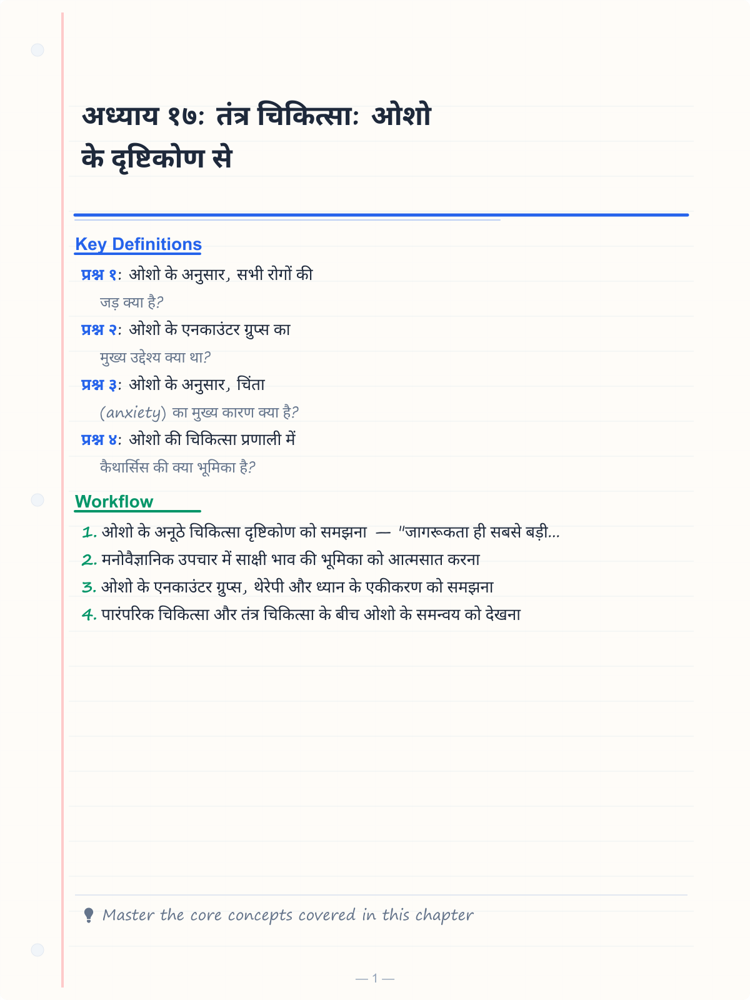
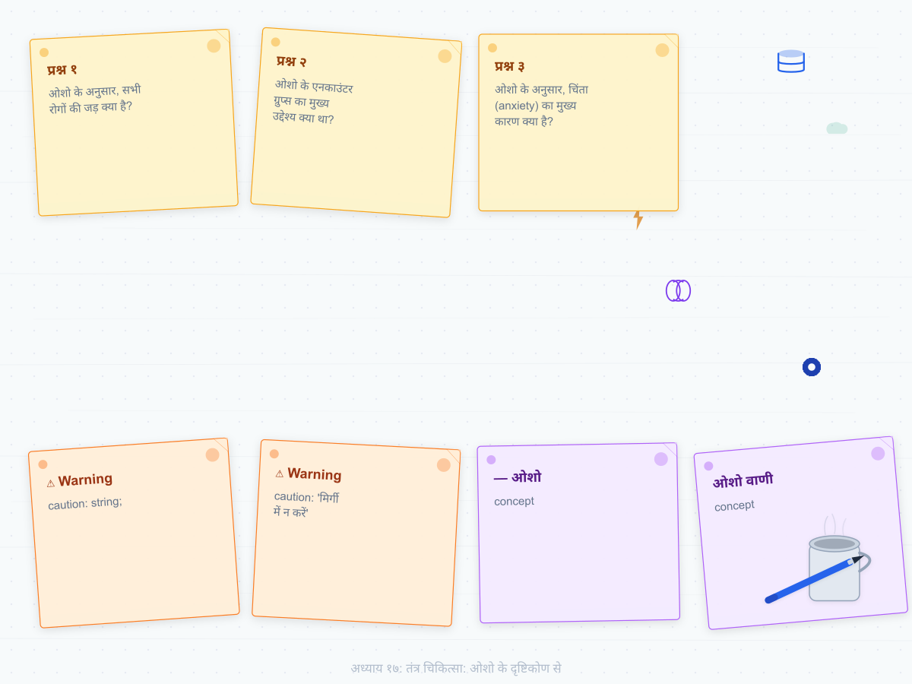
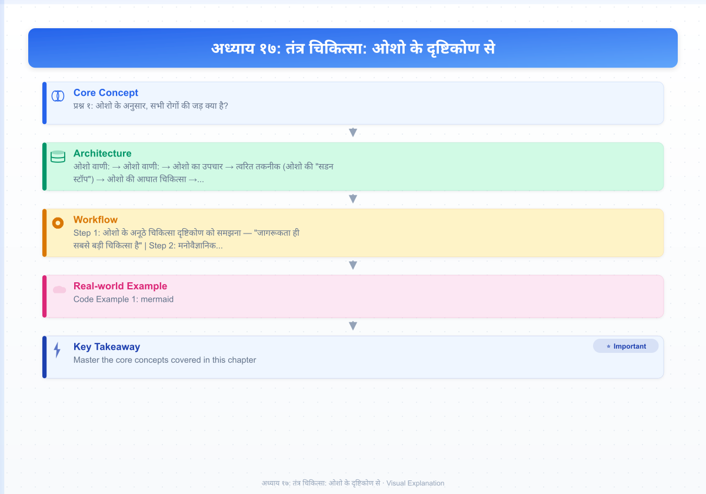

# अध्याय १७: तंत्र चिकित्सा: ओशो के दृष्टिकोण से

<!-- Image Gallery -->
<section class="lesson-visuals" aria-label="Visual learning resources">
  <header><span>VISUAL LEARNING</span><h2>See it. Review it. Remember it.</h2></header>
  <a class="lesson-visual-card" href="../../assets/images/lessons/vigyan-bhairav-tantra/17-chikitsa-osho/handwritten-notes.png" target="_blank" rel="noopener">
    
    <span><strong>Handwritten notes</strong>Condensed notes for deliberate review.</span>
  </a>
  <a class="lesson-visual-card" href="../../assets/images/lessons/vigyan-bhairav-tantra/17-chikitsa-osho/sticky-notes.png" target="_blank" rel="noopener">
    
    <span><strong>Sticky-note revision</strong>Fast recall prompts for revision.</span>
  </a>
  <a class="lesson-visual-card" href="../../assets/images/lessons/vigyan-bhairav-tantra/17-chikitsa-osho/visual-explanation.png" target="_blank" rel="noopener">
    
    <span><strong>Visual concept guide</strong>A connected explanation of the key ideas.</span>
  </a>
</section>
<!-- End Image Gallery -->

## सीखने के उद्देश्य (Learning Objectives)

इस अध्याय को पूरा करने के बाद, तुम निम्नलिखित में सक्षम होगे:

1. ओशो के अनूठे चिकित्सा दृष्टिकोण को समझना — "जागरूकता ही सबसे बड़ी चिकित्सा है"
2. मनोवैज्ञानिक उपचार में साक्षी भाव की भूमिका को आत्मसात करना
3. ओशो के एनकाउंटर ग्रुप्स, थेरेपी और ध्यान के एकीकरण को समझना
4. पारंपरिक चिकित्सा और तंत्र चिकित्सा के बीच ओशो के समन्वय को देखना
5. सभी रोगों की जड़ — अचेतन — और उसके उपचार की ओशो की विधि
6. TypeScript Wellness Assessment Through Osho's Lens विकसित करना

---

## 🔱 प्रस्तावना: "जागरूकता ही सबसे बड़ी चिकित्सा है"

> *"सभी रोगों की एक ही जड़ है — अचेतनता। और सभी चिकित्साओं का एक ही सार है — जागरूकता। जागरूकता ही सबसे बड़ी चिकित्सा है। यह कोई दवा नहीं है — यह तो स्वयं स्वास्थ्य है।"*
> **— ओशो**

**ओशो वाणी:**
*"एक आदमी मेरे पास आया। वह बहुत बीमार था — डॉक्टरों ने उसे छोड़ दिया था। उसकी बीमारी का कोई नाम नहीं था — डॉक्टर कहते थे कि यह सब मन का खेल है। वह रोया और बोला, 'ओशो, मुझे बचाइए।'*

*मैंने उसकी ओर देखा। मैंने कहा, 'मैं तुम्हें बचा सकता हूँ — लेकिन शर्त यह है कि तुम्हें अपनी बीमारी को छोड़ना होगा।'*

*वह घबराया। उसने कहा, 'लेकिन मैं तो छुटकारा पाना चाहता हूँ!'*

*मैंने कहा, 'नहीं — तुम अपनी बीमारी से चिपके हुए हो। वह तुम्हारी पहचान बन गई है। 'मैं बीमार हूँ' — यह तुम्हारा अहंकार है। पहले इसे छोड़ो।'*

*वह समझा नहीं। मैंने कहा, 'देखो — तुम अपने दर्द को देखो। बस देखो — उससे छुटकारा पाने की कोशिश मत करो। जब तुम दर्द को पूरी तरह देख लोगे, तो वह गायब हो जाएगा। क्योंकि दर्द को अस्तित्व चाहिए — तुम्हारा ध्यान ही उसका भोजन है। जब तुम ध्यान हटा लेते हो — वह भूखा मर जाता है।'*

*उस आदमी ने कोशिश की। वह अपने दर्द को देखने लगा — बिना किसी निर्णय के, बिना उससे छुटकारा पाने की कोशिश के। तीन दिन में दर्द कम हो गया। सात दिन में वह आधा रह गया। एक महीने में — वह पूरी तरह ठीक हो गया।*

*वह वापस आया — इस बार खुश। उसने कहा, 'ओशो, आपने मेरी बीमारी ठीक कर दी!'*

*मैंने कहा, 'नहीं — मैंने कुछ नहीं किया। तुमने खुद अपनी बीमारी को देखा — और देखते ही वह गायब हो गई। यही चिकित्सा है। यही तंत्र है। यही ध्यान है।'"*

---

## १. ओशो का चिकित्सा दर्शन — "सभी रोग अचेतनता से हैं"

### १.१ रोग की जड़

> *"पश्चिमी चिकित्सा लक्षणों का इलाज करती है। तंत्र चिकित्सा जड़ का इलाज करती है। और जड़ है — अचेतनता। तुम्हारा शरीर बीमार नहीं है — तुम्हारी जागरूकता बीमार है। जब जागरूकता ठीक होती है, शरीर अपने आप ठीक हो जाता है।"*

```mermaid
flowchart TD
    subgraph जड़[समस्या की जड़]
        A[अचेतनता] --> B[तनाव]
        A --> C[दमन]
        A --> D[अहंकार]
        A --> E[संघर्ष]
    end
    
    subgraph लक्षण[लक्षण]
        B --> F[शारीरिक रोग]
        C --> G[मानसिक रोग]
        D --> H[संबंध समस्याएँ]
        E --> I[जीवन असंतुलन]
    end
    
    subgraph उपचार[ओशो का उपचार]
        J[जागरूकता] --> K[साक्षी भाव]
        K --> L[स्वीकार]
        L --> M[परिवर्तन]
        M --> N[समग्र स्वास्थ्य]
    end
    
    जड़ --> लक्षण
    लक्षण -->|पारंपरिक चिकित्सा| O[लक्षण दबाना]
    लक्षण -->|ओशो चिकित्सा| उपचार
    
    style N fill:#2ecc71,color:#fff,stroke-width:3px
```

### १.2 चेतना के तीन स्तरों पर चिकित्सा

| स्तर | रोग का रूप | ओशो की चिकित्सा |
|------|-------------|-----------------|
| शारीरिक | दर्द, रोग, शारीरिक असंतुलन | शरीर को जागरूकता से देखना — संवेदनाओं का साक्षी |
| मानसिक | चिंता, अवसाद, भय | विचारों और भावनाओं का साक्षी — कैथार्सिस |
| आध्यात्मिक | अर्थहीनता, अलगाव, खालीपन | शून्यता का साक्षी — अहंकार का विघटन |

**ओशो वाणी:**
*"शरीर का रोग — यह सबसे सतही है। मन का रोग — यह गहरा है। आत्मा का रोग — यह सबसे गहरा है। और आत्मा का रोग है — भूल जाना कि तुम कौन हो। इस एक रोग की दवा है — ध्यान। और ध्यान का मतलब है — याद करना। याद करो कि तुम कौन हो। यही चिकित्सा है।"*

---

## २. ओशो के एनकाउंटर ग्रुप्स — थेरेपी और ध्यान का मिलन

### २.1 एनकाउंटर ग्रुप्स का जन्म

ओशो ने पश्चिमी मनोचिकित्सा और पूर्वी ध्यान का एक अनूठा संश्लेषण किया। उनके एनकाउंटर ग्रुप्स में लोग एक सप्ताह तक साथ रहते थे — बिना किसी सामाजिक मुखौटे के।

> *"पश्चिम ने मन को समझा — लेकिन आत्मा को खो दिया। पूर्व ने आत्मा को समझा — लेकिन मन को नज़रअंदाज़ किया। मैं दोनों को जोड़ता हूँ। पहले मन को साफ़ करो — फिर ध्यान में बैठो। पहले कैथार्सिस — फिर मौन। दमित भावनाओं को बाहर निकालो — फिर साक्षी बनो।"*

### २.2 समूह चिकित्सा की ओशो की विधि

```mermaid
flowchart LR
    subgraph चरण१[सप्ताह १: कैथार्सिस]
        A1[क्रोध व्यक्त करो]
        A2[रोओ, चिल्लाओ]
        A3[दमन को तोड़ो]
    end
    
    subgraph चरण२[सप्ताह २: जागरूकता]
        B1[भावनाओं को देखो]
        B2[पैटर्न को पहचानो]
        B3[साक्षी बनो]
    end
    
    subgraph चरण३[सप्ताह ३: एकीकरण]
        C1[स्वीकार करो]
        C2[समझो]
        C3[बदलो]
    end
    
    चरण१ --> चरण२ --> चरण३
```

### २.3 ओशो के प्रमुख चिकित्सा समूह

| समूह | उद्देश्य | ओशो का कथन |
|------|----------|-------------|
| एनकाउंटर | मुखौटे तोड़ना | "अपना असली चेहरा दिखाओ — भले ही वह बदसूरत हो" |
| प्राथमिक थेरेपी | बचपन के घाव | "अपने भीतर के बच्चे को रोने दो — फिर वह हँसेगा" |
| बायोएनर्जेटिक्स | शरीर में दबी ऊर्जा | "शरीर सब कुछ याद रखता है — उसे छोड़ने दो" |
| मिस्टिक रोज़ | हँसी-आँसू-मौन | "पहले हँसो, फिर रोओ, फिर मौन — यही जीवन है" |
| डायनामिक | समग्र कैथार्सिस | "पूरी ऊर्जा को बाहर आने दो — फिर शांति अपने आप आएगी" |

---

## ३. विशिष्ट रोग और ओशो का दृष्टिकोण

### ३.1 अवसाद — उदासी का तंत्र

> *"अवसाद कोई बीमारी नहीं है — यह एक संदेश है। तुम्हारा अस्तित्व तुमसे कह रहा है कि तुम गलत जी रहे हो। अवसाद को दबाओ मत — उसे सुनो। वह तुम्हें कुछ बताना चाहता है।"*

**ओशो का उपचार**:
1. अवसाद को स्वीकार करो — उससे भागो मत
2. उसे देखो — बिना किसी निर्णय के
3. उसे शरीर में महसूस करो — कहाँ है? कैसा है?
4. उसे नाचने दो — शरीर को हिलने दो
5. फिर मौन में बैठो — जो बचा, वही तुम हो

### ३.2 चिंता — बेचैनी का तंत्र

> *"चिंता भविष्य में रहती है। जितना तुम भविष्य में रहोगे, उतनी चिंता बढ़ेगी। वर्तमान में आओ — चिंता गायब हो जाएगी। चिंता का एकमात्र इलाज है — वर्तमान क्षण में जीना।"*

**त्वरित तकनीक (ओशो की "सडन स्टॉप")**:

```mermaid
flowchart TD
    A[चिंता उठी] --> B[रुको!]
    B --> C[एक गहरी साँस लो]
    C --> D{कहाँ हो?}
    D -->|अतीत में| E[यहाँ आओ — अभी]
    D -->|भविष्य में| E
    D -->|यहीं| F[देखो — चिंता कहाँ गई?]
    E --> F
    F --> G[चिंता गायब — तुम रह गए]
```


### ३.3 PTSD और आघात

> *"आघात कोई घटना नहीं है — वह तुम्हारे शरीर में जमा हुआ एक अनुभव है। उसे बाहर निकालने की ज़रूरत है — और वह कैथार्सिस से निकलता है, दवा से नहीं।"*

**ओशो की आघात चिकित्सा**:
1. सुरक्षित स्थान बनाओ — जहाँ तुम पूरी तरह सुरक्षित महसूस करो
2. आघात को याद करो — लेकिन उसमें मत जाओ, बस देखो
3. शरीर को हिलने दो — जो भी हो रहा है, उसे होने दो
4. कैथार्सिस — कंपन, चीख, रोना — सब स्वाभाविक है
5. साक्षी भाव — अब तुम उस घटना के मालिक हो, वह तुम्हारी नहीं

---

## ४. साइकोसोमैटिक बीमारियाँ — ओशो का निदान

### ४.1 मन और शरीर का जुड़ाव

> *"हर बीमारी के दो हिस्से हैं — एक शारीरिक, एक मानसिक। शारीरिक हिस्से का इलाज डॉक्टर कर सकता है। मानसिक हिस्से का इलाज — सिर्फ तुम कर सकते हो। और वह इलाज है — जागरूकता।"*

```mermaid
flowchart LR
    subgraph मन[Mind - कारण]
        A[दमित क्रोध] -->|सिरदर्द| A1[माइग्रेन]
        B[दमित डर] -->|पेट| B1[IBS, अल्सर]
        C[दमित उदासी] -->|छाती| C1[अस्थमा]
        D[दमित तनाव] -->|हृदय| D1[उच्च रक्तचाप]
        E[दमित चिंता] -->|त्वचा| E1[एक्ज़िमा]
    end
    
    subgraph ओशो[Osho Treatment]
        F[भावना को पहचानो]
        G[उसे व्यक्त करो - कैथार्सिस]
        H[उसे देखो - साक्षी]
        I[उसे जाने दो - मुक्ति]
    end
    
    मन -->|जागरूकता| ओशो
    ओशो --> J[समग्र स्वास्थ्य]
    
    style J fill:#2ecc71,color:#fff,stroke-width:3px
```

### ४.2 ओशो के प्रमुख साइकोसोमैटिक निदान

| लक्षण | मानसिक कारण (ओशो के अनुसार) | तंत्र चिकित्सा |
|-------|------------------------------|----------------|
| सिरदर्द | बहुत ज़्यादा सोचना, नियंत्रण की आदत | श्वास ध्यान — विचारों को छोड़ना |
| पीठ दर्द | ज़िम्मेदारियों का बोझ | लेटकर ध्यान — समर्पण |
| पाचन समस्या | चीज़ों को पचा न पाना — अनुभवों को | भोजन ध्यान — जागरूकता से खाना |
| हृदय समस्या | प्रेम न कर पाना, रुकावट | हृदय ध्यान — प्रेम का प्रवाह |
| साँस की समस्या | जीवन को पूरी तरह न ले पाना | प्राणायाम — जीवन को भरना |

**ओशो वाणी:**
*"जब मैं कहता हूँ कि तुम्हारी बीमारी तुम्हारे मन में है — तो इसका मतलब यह नहीं कि वह असली नहीं है। वह बहुत असली है — दर्द असली है, पीड़ा असली है। लेकिन उसकी जड़ मन में है। और मन की जड़ — अचेतनता में है। इसलिए इलाज सिर्फ एक है — जागरूक हो जाओ।"*

---

## ५. समग्र चिकित्सा — ओशो का पूरा प्रोग्राम

### ५.1 चार स्तरों की चिकित्सा

```mermaid
flowchart TD
    subgraph स्तर१[स्तर १: शरीर]
        A[आसन — शरीर को लचीला बनाओ]
        B[प्राणायाम — ऊर्जा को संतुलित करो]
        C[भोजन — जागरूकता से खाओ]
    end
    
    subgraph स्तर२[स्तर २: मन]
        D[कैथार्सिस — दबी भावनाएँ निकालो]
        E[ध्यान — विचारों को देखो]
        F[स्वाध्याय — अपने पैटर्न समझो]
    end
    
    subgraph स्तर३[स्तर ३: भावना]
        G[प्रेम — संबंधों में जागरूकता]
        H[क्षमा — अतीत को छोड़ो]
        I[कृतज्ञता — जीवन का उत्सव]
    end
    
    subgraph स्तर४[स्तर ४: आत्मा]
        J[साक्षी भाव — गवाह बनो]
        K[समाधि — शून्य में विलीन]
        L[स्व-साक्षात्कार — जो हो, वही हो]
    end
    
    स्तर१ --> स्तर२ --> स्तर३ --> स्तर४
    स्तर४ -->|एकीकरण| M[पूर्ण स्वास्थ्य]
    
    style M fill:#2ecc71,color:#fff,stroke-width:3px
```

### ५.2 संपूर्ण चिकित्सा के लिए ओशो के सात नियम

1. **शरीर को प्रेम करो** — उसे दवाओं से मत मारो, समझो
2. **भावनाओं को दबाओ मत** — उन्हें व्यक्त करो, फिर छोड़ दो
3. **विचारों से मत उलझो** — उन्हें देखो, उनमें मत जाओ
4. **वर्तमान में जियो** — अतीत और भविष्य छोड़ो
5. **हँसो — खूब हँसो** — हँसी सबसे अच्छी दवा है
6. **प्रेम करो — बिना शर्त** — प्रेम ही जीवन है
7. **ध्यान करो — नियमित** — यही एकमात्र स्थायी चिकित्सा है

---

## ६. TypeScript कार्यान्वयन: Wellness Assessment (Osho's Lens)

```typescript
/**
 * तंत्र चिकित्सा मूल्यांकन — ओशो के नज़रिए से
 * (Wellness Assessment Through Osho's Lens)
 * 
 * "जागरूकता ही सबसे बड़ी चिकित्सा है। यह टूल तुम्हें
 * अपने रोगों की जड़ देखने में मदद करेगा।" — ओशो
 * 
 * @package OshoVBT
 * @version 1.0.0
 */

// === मुख्य प्रकार ===

type OshoSymptomDomain = 'physical' | 'mental' | 'emotional' | 'relational' | 'spiritual';
type OshoSeverity = 0 | 1 | 2 | 3 | 4 | 5;
type OshoTherapyStage = 'catharsis' | 'awareness' | 'acceptance' | 'transformation' | 'integration';
type OshoBodyWisdom = 'head' | 'chest' | 'stomach' | 'heart' | 'throat' | 'pelvis' | 'whole_body';

interface OshoHealthProfile {
    age: number;
    primarySymptoms: OshoSymptom[];
    medicalHistory: string[];
    medications: string[];
    stressLevel: OshoSeverity;
    sleepQuality: OshoSeverity;
    emotionalState: string;
    relationshipQuality: string;
    meditationExperience: string;
}

interface OshoSymptom {
    name: string;
    domain: OshoSymptomDomain;
    severity: OshoSeverity;
    duration: string; // how long
    bodyLocation?: OshoBodyWisdom;
    oshoRootCause: string;
    emotionalCorrelation: string;
}

interface OshoTherapyPlan {
    profile: OshoHealthProfile;
    diagnosis: OshoDiagnosis;
    recommendedPractices: OshoTherapyPractice[];
    weeklySchedule: TherapyWeek;
    contraindications: string[];
    emergencyNotes: string;
    oshoFinalAdvice: string;
}

interface OshoDiagnosis {
    rootCause: string;
    blockedEnergy: string;
    suppressedEmotion: string;
    neededAwareness: string;
    stage: OshoTherapyStage;
    overallHealth: number; // 0-100
    oshoInsight: string;
}

interface OshoTherapyPractice {
    techniqueNumber: number;
    techniqueName: string;
    target: string;
    duration: number;
    frequency: 'daily' | 'twice_daily' | 'as_needed' | 'weekly';
    timeOfDay: 'morning' | 'afternoon' | 'evening' | 'night' | 'any';
    oshoInstruction: string;
    caution: string;
}

interface TherapyWeek {
    monday: string[];
    tuesday: string[];
    wednesday: string[];
    thursday: string[];
    friday: string[];
    saturday: string[];
    sunday: string[];
}

// === ओशो के रोग-निदान का डेटाबेस ===

const OSHO_SYMPTOM_WISDOM: Record<string, {
    domain: OshoSymptomDomain;
    rootCause: string;
    emotion: string;
    oshoQuote: string;
    technique: number;
    healingMessage: string;
}> = {
    headache: {
        domain: 'physical',
        rootCause: 'बहुत ज़्यादा सोचना — मन को आराम न देना',
        emotion: 'दबा हुआ क्रोध',
        oshoQuote: 'सिरदर्द सिर में नहीं है — वह उन विचारों में है जिन्हें तुम जाने नहीं देते।',
        technique: 24,
        healingMessage: 'अपने विचारों को सिर के ऊपर निकलते देखो — वे तुम्हारे नहीं हैं।'
    },
    insomnia: {
        domain: 'mental',
        rootCause: 'मन का अत्यधिक सक्रिय होना — दिन में न जी पाना',
        emotion: 'चिंता, भय',
        oshoQuote: 'अनिद्रा का मतलब है — तुम दिन में नहीं जी पाए, अब रात में मन उसे दोहरा रहा है।',
        technique: 47,
        healingMessage: 'नींद को मजबूर मत करो — उसे आने दो। और देखो — कैसे नींद आती है।'
    },
    depression: {
        domain: 'emotional',
        rootCause: 'जीवन में अर्थ का अभाव — प्रेम न मिल पाना',
        emotion: 'दबी हुई उदासी',
        oshoQuote: 'अवसाद कोई बीमारी नहीं — यह एक संदेश है। तुम गलत जी रहे हो।',
        technique: 74,
        healingMessage: 'अवसाद को देखो — उससे भागो मत। वह तुम्हें कुछ सिखाने आया है।'
    },
    anxiety: {
        domain: 'mental',
        rootCause: 'भविष्य में जीना — वर्तमान में न होना',
        emotion: 'डर, असुरक्षा',
        oshoQuote: 'चिंता भविष्य में रहती है। वर्तमान में आओ — चिंता गायब हो जाएगी।',
        technique: 1,
        healingMessage: 'एक साँस लो — पूरी, गहरी। इसी साँस में — सब कुछ है।'
    },
    backpain: {
        domain: 'physical',
        rootCause: 'बहुत ज़्यादा ज़िम्मेदारी उठाना, समर्थन की कमी',
        emotion: 'दबा हुआ गुस्सा, बोझ',
        oshoQuote: 'पीठ दर्द का मतलब है — तुम बहुत ज़्यादा उठा रहे हो। कुछ नीचे रखो।',
        technique: 71,
        healingMessage: 'लेट जाओ — पूरी तरह। ज़मीन को अपना बोझ उठाने दो।'
    },
    heart_issues: {
        domain: 'physical',
        rootCause: 'प्रेम न कर पाना — प्रेम का प्रवाह रुक जाना',
        emotion: 'दबा हुआ प्रेम, अकेलापन',
        oshoQuote: 'दिल की बीमारी का मतलब है — तुमने प्रेम को रोक दिया है। प्रेम को बहने दो।',
        technique: 55,
        healingMessage: 'अपने हृदय में देखो — वहाँ क्या छिपा है? उसे बाहर आने दो।'
    },
    digestive: {
        domain: 'physical',
        rootCause: 'अनुभवों को पचा न पाना — चीज़ों को जाने न देना',
        emotion: 'दबा हुआ डर, घृणा',
        oshoQuote: 'पाचन की समस्या है — तुम अनुभवों को नहीं पचा पा रहे। छोड़ना सीखो।',
        technique: 14,
        healingMessage: 'खाने को पूरी जागरूकता से खाओ — हर ग्रास को प्रेम से पचाओ।'
    },
    asthma: {
        domain: 'physical',
        rootCause: 'जीवन को पूरी तरह न ले पाना — सीमित होना',
        emotion: 'दबा हुआ रोना, दबी हुई चीख',
        oshoQuote: 'अस्थमा का मतलब है — तुम जीवन को पूरी तरह नहीं ले रहे। पूरी साँस लो — पूरा जियो।',
        technique: 6,
        healingMessage: 'धीरे-धीरे, गहरी साँस लो — जीवन को अपने में भरने दो।'
    }
};

// === अचेतनता का मानचित्र ===

const OSHO_UNCONSCIOUS_MAP: Record<string, {
    bodyArea: string;
    suppressedContent: string;
    releaseMethod: string;
    oshoAdvice: string;
}> = {
    head: {
        bodyArea: 'सिर — विचारों का केंद्र',
        suppressedContent: 'अति-विचार, नियंत्रण, चिंता',
        releaseMethod: 'डायनामिक मेडिटेशन का पहला चरण — तेज़ श्वास',
        oshoAdvice: 'सिर में बहुत भीड़ है — वहाँ से नीचे आओ, हृदय में।'
    },
    throat: {
        bodyArea: 'गला — अभिव्यक्ति का केंद्र',
        suppressedContent: 'न बोले गए शब्द, दबा हुआ रोना',
        releaseMethod: 'नादब्रह्म — गुनगुनाना, चीखना',
        oshoAdvice: 'जो तुमने कभी नहीं कहा — उसे कहो। चाहे अकेले में, चाहे तकिए से।'
    },
    chest: {
        bodyArea: 'छाती — भावनाओं का केंद्र',
        suppressedContent: 'दबा हुआ प्रेम, दबी हुई उदासी',
        releaseMethod: 'कुंडलिनी का पहला चरण — कंपन',
        oshoAdvice: 'तुम्हारी छाती में बहुत कुछ जमा है — उसे बाहर आने दो। रोओ, हँसो, चीखो।'
    },
    stomach: {
        bodyArea: 'पेट — इच्छाओं और डर का केंद्र',
        suppressedContent: 'डर, असुरक्षा, न पचा पाना',
        releaseMethod: 'गहरी पेट की साँसें, कैथार्सिस',
        oshoAdvice: 'पेट में डर बैठा है — उसे महसूस करो। डर को देखो — वह गायब हो जाएगा।'
    },
    pelvis: {
        bodyArea: 'श्रोणि — ऊर्जा और कामुकता का केंद्र',
        suppressedContent: 'दबी हुई कामुकता, रचनात्मकता का अवरोध',
        releaseMethod: 'नाच, कंपन, श्वास तकनीक',
        oshoAdvice: 'यहाँ तुम्हारी सबसे गहरी ऊर्जा छिपी है — उसे दबाओ मत, उसे नाचने दो।'
    }
};

// === ओशो चिकित्सक ===

class OshoTherapist {
    private sessions: OshoSymptom[][];

    constructor() {
        this.sessions = [];
    }

    /**
     * मूल्यांकन करो — ओशो के नज़रिए से
     */
    assess(profile: OshoHealthProfile): OshoTherapyPlan {
        const diagnosis = this.diagnose(profile);
        const practices = this.recommendPractices(diagnosis);
        
        return {
            profile,
            diagnosis,
            recommendedPractices: practices,
            weeklySchedule: this.buildWeekPlan(practices),
            contraindications: this.checkContraindications(profile),
            emergencyNotes: this.getEmergencyNote(diagnosis),
            oshoFinalAdvice: this.getOshoAdvice(diagnosis)
        };
    }

    /**
     * निदान — जड़ तक जाना
     */
    private diagnose(profile: OshoHealthProfile): OshoDiagnosis {
        const symptoms = profile.primarySymptoms;
        
        // सबसे गंभीर लक्षण का निदान
        const worstSymptom = symptoms.reduce((worst, s) => 
            s.severity > (worst?.severity || 0) ? s : worst
        );

        const wisdom = OSHO_SYMPTOM_WISDOM[worstSymptom.name.toLowerCase()] || {
            domain: 'spiritual',
            rootCause: 'स्वयं से अलगाव — अपने असली स्वरूप को भूल जाना',
            emotion: 'गहरी उदासी',
            oshoQuote: 'सबसे बड़ा रोग है — भूल जाना कि तुम कौन हो।',
            technique: 112,
            healingMessage: 'याद करो — तुम वही हो जिसे तुम खोज रहे हो।'
        };

        // ऊर्जा रुकावट
        const bodyLocation = worstSymptom.bodyLocation || 'whole_body';
        const bodyWisdom = OSHO_UNCONSIOUS_MAP[bodyLocation] || {
            bodyArea: 'पूरा शरीर',
            suppressedContent: 'सामान्य तनाव',
            releaseMethod: 'डायनामिक मेडिटेशन',
            oshoAdvice: 'शरीर को हिलने दो — वह जानता है कि कैसे छोड़ना है।'
        };

        // समग्र स्वास्थ्य स्कोर
        const totalSeverity = symptoms.reduce((s, sym) => s + sym.severity, 0);
        const overallHealth = Math.max(0, 100 - (totalSeverity * 10));

        return {
            rootCause: wisdom.rootCause,
            blockedEnergy: bodyWisdom.bodyArea,
            suppressedEmotion: wisdom.emotion,
            neededAwareness: bodyWisdom.bodyArea,
            stage: overallHealth > 60 ? 'awareness' : overallHealth > 40 ? 'catharsis' : 'acceptance',
            overallHealth,
            oshoInsight: wisdom.oshoQuote
        };
    }

    /**
     * अभ्यास सुझाओ
     */
    private recommendPractices(diagnosis: OshoDiagnosis): OshoTherapyPractice[] {
        const practices: OshoTherapyPractice[] = [];

        // कैथार्सिस के लिए
        if (diagnosis.overallHealth < 60) {
            practices.push({
                techniqueNumber: 32,
                techniqueName: 'भैरवी श्वास — उन्मेष-निमेष',
                target: 'दबी ऊर्जा को मुक्त करना',
                duration: 10,
                frequency: 'daily',
                timeOfDay: 'morning',
                oshoInstruction: 'पलकों को तेज़ी से झपकाओ — ऊर्जा को बाहर आने दो। फिर मौन में बैठो।',
                caution: 'मिर्गी में न करें'
            });
            
            practices.push({
                techniqueNumber: 74,
                techniqueName: 'साक्षी भाव — रोग में गवाही',
                target: 'दर्द और भावना को देखना',
                duration: 15,
                frequency: 'twice_daily',
                timeOfDay: 'any',
                oshoInstruction: 'दर्द को देखो — उससे लड़ो मत। वह तुम्हारा दुश्मन नहीं, शिक्षक है।',
                caution: ''
            });
        }

        // जागरूकता के लिए
        practices.push({
            techniqueNumber: 1,
            techniqueName: 'श्वास जागरूकता',
            target: 'वर्तमान में आना',
            duration: 15,
            frequency: 'daily',
            timeOfDay: 'morning',
            oshoInstruction: 'बैठो। साँस को देखो। बस इतना ही। कोई और काम नहीं।',
            caution: ''
        });

        // भावनात्मक मुक्ति के लिए
        practices.push({
            techniqueNumber: 62,
            techniqueName: 'शून्य ध्यान',
            target: 'अहंकार और पहचान को छोड़ना',
            duration: 20,
            frequency: 'daily',
            timeOfDay: 'evening',
            oshoInstruction: 'सब कुछ खाली है — यह भाव रखो। तुम भी खाली — बस देखना बचा है।',
            caution: 'मानसिक अस्थिरता में सावधानी'
        });

        return practices;
    }

    /**
     * साप्ताहिक योजना
     */
    private buildWeekPlan(practices: OshoTherapyPractice[]): TherapyWeek {
        const week: TherapyWeek = {
            monday: practices.map(p => `${p.techniqueNumber}: ${p.techniqueName}`),
            tuesday: practices.map(p => `${p.techniqueNumber}: ${p.techniqueName}`),
            wednesday: practices.map(p => `${p.techniqueNumber}: ${p.techniqueName}`),
            thursday: practices.map(p => `${p.techniqueNumber}: ${p.techniqueName}`),
            friday: practices.map(p => `${p.techniqueNumber}: ${p.techniqueName}`),
            saturday: [...practices.map(p => `${p.techniqueNumber}: ${p.techniqueName}`), 'विशेष: डायनामिक मेडिटेशन'],
            sunday: ['मौन दिवस — केवल साक्षी भाव', 'सप्ताह का पुनरावलोकन']
        };
        return week;
    }

    /**
     * मतभेद और सावधानियाँ
     */
    private checkContraindications(profile: OshoHealthProfile): string[] {
        const warnings: string[] = [];
        
        if (profile.medications.includes('antidepressants')) {
            warnings.push('ध्यान के साथ दवा जारी रखें — धीरे-धीरे कम करने पर डॉक्टर से सलाह लें।');
        }
        if (profile.medicalHistory.includes('epilepsy')) {
            warnings.push('तेज़ श्वास और झपकाने वाली तकनीक (३२) से बचें।');
        }
        if (profile.medicalHistory.includes('bipolar')) {
            warnings.push('गहन कैथार्सिस से बचें — हल्की तकनीक से शुरू करें। चिकित्सक के साथ समन्वय रखें।');
        }

        return warnings;
    }

    /**
     * आपातकालीन नोट
     */
    private getEmergencyNote(diagnosis: OshoDiagnosis): string {
        if (diagnosis.overallHealth < 20) {
            return '⚠️ आपकी स्वास्थ्य स्थिति गंभीर है। कृपया तुरंत चिकित्सक से संपर्क करें। ध्यान के साथ-साथ चिकित्सीय परामर्श जारी रखें।';
        }
        if (diagnosis.overallHealth < 40) {
            return '⚠️ आपकी स्वास्थ्य स्थिति में सुधार की आवश्यकता है। ध्यान के साथ-साथ चिकित्सकीय परामर्श लें।';
        }
        return '✅ आपकी स्थिति स्थिर है। नियमित अभ्यास जारी रखें।';
    }

    /**
     * ओशो का अंतिम परामर्श
     */
    private getOshoAdvice(diagnosis: OshoDiagnosis): string {
        const advices = [
            `"${diagnosis.oshoInsight}"`,
            '"याद रखो — तुम्हारी बीमारी तुम्हारी दुश्मन नहीं है। वह तुम्हारी मित्र है — वह तुम्हें कुछ सिखाने आई है। उसे सुनो।"',
            '"सबसे बड़ी दवा है — जागरूकता। और जागरूकता कहीं और नहीं, तुम्हारे भीतर है। तुम्हें बस उसे जगाना है।"',
            '"मैं तुम्हें ठीक नहीं कर सकता — कोई तुम्हें ठीक नहीं कर सकता। तुम खुद को ठीक कर सकते हो — बस जागरूक होकर। यही एकमात्र चिकित्सा है।"'
        ];
        return advices[Math.floor(Math.random() * advices.length)];
    }

    /**
     * शरीर की बुद्धि — तुरंत निदान
     */
    getBodyWisdom(symptom: string, bodyPart: OshoBodyWisdom): {
        message: string;
        practice: string;
    } {
        const wisdom = OSHO_SYMPTOM_WISDOM[symptom.toLowerCase()];
        if (!wisdom) {
            return {
                message: 'तुम्हारा शरीर तुमसे बात कर रहा है — उसे सुनो। वह जो कह रहा है, वही तुम्हारी चिकित्सा है।',
                practice: 'साक्षी भाव — बिना निर्णय के शरीर को देखो।'
            };
        }

        return {
            message: wisdom.healingMessage,
            practice: `तकनीक ${wisdom.technique} का अभ्यास करो — ${wisdom.oshoQuote}`
        };
    }

    /**
     * ओशो की चिकित्सा कहानी
     */
    getHealingStory(): { title: string; story: string; moral: string } {
        const stories = [
            {
                title: 'बीमारी एक संदेश है',
                story: 'एक राजा बीमार हुआ। सबसे अच्छे डॉक्टर बुलाए गए — कोई फ़ायदा नहीं। एक फकीर आया। उसने राजा से कहा, "आपकी बीमारी का कोई इलाज नहीं है।" राजा डर गया। फकीर ने कहा, "इसलिए कि यह बीमारी दवा से नहीं जाती — यह तो एक संदेश है। आप गलत जी रहे हैं। अपना जीवन बदलें — बीमारी अपने आप जाएगी।" राजा ने अपना जीवन बदला — बीमारी गायब हो गई।',
                moral: 'हर बीमारी एक संदेश है — उसे सुनो, दवा से मत दबाओ।'
            },
            {
                title: 'दो डॉक्टर',
                story: 'एक आदमी बीमार हुआ। पहले डॉक्टर ने कहा, "यह तुम्हारे खाने की वजह से है।" दूसरे डॉक्टर ने कहा, "यह तुम्हारे सोचने की वजह से है।" आदमी ने कहा, "मैं किसे मानूँ?" एक बुद्ध ने कहा, "दोनों सही हैं। खाना बदलो — और सोचना भी बदलो। लेकिन सबसे गहरा बदलाव — जागरूकता का है। जागरूक हो जाओ — खाना अपने आप बदल जाएगा, सोचना अपने आप बदल जाएगा।"',
                moral: 'सबसे गहरा बदलाव जागरूकता का है — बाकी सब अपने आप होता है।'
            }
        ];
        return stories[Math.floor(Math.random() * stories.length)];
    }
}

// === उपयोग उदाहरण ===

function demonstrateOshoTherapy(): void {
    console.log('🕉️  तंत्र चिकित्सा — ओशो के नज़रिए से');
    console.log('   "जागरूकता ही सबसे बड़ी चिकित्सा है"\n');

    const therapist = new OshoTherapist();

    // एक मरीज़ का प्रोफ़ाइल
    const patient: OshoHealthProfile = {
        age: 35,
        primarySymptoms: [
            {
                name: 'headache',
                domain: 'physical',
                severity: 4,
                duration: '६ महीने से',
                bodyLocation: 'head',
                oshoRootCause: 'अति-विचार, दबा हुआ क्रोध',
                emotionalCorrelation: 'काम में असंतोष, दबा हुआ गुस्सा'
            },
            {
                name: 'insomnia',
                domain: 'mental',
                severity: 3,
                duration: '३ महीने से',
                oshoRootCause: 'मन का अति सक्रिय होना',
                emotionalCorrelation: 'चिंता, अनिश्चितता'
            }
        ],
        medicalHistory: [],
        medications: [],
        stressLevel: 4,
        sleepQuality: 2,
        emotionalState: 'चिड़चिड़ा, थका हुआ',
        relationshipQuality: 'तनावपूर्ण',
        meditationExperience: 'नया'
    };

    console.log('🔍 रोगी का प्रोफ़ाइल:');
    console.log(`   मुख्य लक्षण: ${patient.primarySymptoms.map(s => s.name).join(', ')}`);
    console.log(`   तनाव स्तर: ${patient.stressLevel}/5`);
    console.log(`   नींद: ${patient.sleepQuality}/5`);
    console.log();

    // निदान
    const plan = therapist.assess(patient);
    console.log('🧠 निदान (Diagnosis):');
    console.log(`   मूल कारण: ${plan.diagnosis.rootCause}`);
    console.log(`   दबी हुई भावना: ${plan.diagnosis.suppressedEmotion}`);
    console.log(`   अवरुद्ध ऊर्जा: ${plan.diagnosis.blockedEnergy}`);
    console.log(`   समग्र स्वास्थ्य: ${plan.diagnosis.overallHealth}/100`);
    console.log(`   ओशो की अंतर्दृष्टि: "${plan.diagnosis.oshoInsight}"`);
    console.log();

    // अनुशंसित अभ्यास
    console.log('📋 अनुशंसित अभ्यास:');
    plan.recommendedPractices.forEach((p, i) => {
        console.log(`   ${i + 1}. तकनीक #${p.techniqueNumber} — ${p.techniqueName}`);
        console.log(`      लक्ष्य: ${p.target}`);
        console.log(`      "${p.oshoInstruction}"`);
        console.log();
    });

    // शरीर की बुद्धि
    console.log('💪 शरीर की बुद्धि (Body Wisdom):');
    const bodyWisdom = therapist.getBodyWisdom('headache', 'head');
    console.log(`   "${bodyWisdom.message}"`);
    console.log(`   अभ्यास: ${bodyWisdom.practice}`);
    console.log();

    // चिकित्सा कहानी
    const story = therapist.getHealingStory();
    console.log('📖 ओशो की चिकित्सा कहानी:');
    console.log(`   ${story.title}`);
    console.log(`   "${story.story}"`);
    console.log(`   सीख: ${story.moral}`);
    console.log();

    // ओशो का अंतिम परामर्श
    console.log('💫 ओशो का अंतिम परामर्श:');
    console.log(`   "${plan.oshoFinalAdvice}"`);
    console.log();
    
    // आपातकालीन नोट
    console.log('⚠️ आपातकालीन नोट:');
    console.log(`   ${plan.emergencyNotes}`);
    console.log();
    
    console.log('━━━━━━━━━━━━━━━━━━━━━━━━━━━━━━━━━━━━━');
    console.log('"याद रखो — तुम बीमार नहीं हो।');
    console.log(' तुम बस भूल गए हो कि तुम कौन हो।');
    console.log(' यह याद करना — यही चिकित्सा है।');
    console.log(' यह याद करना — यही ध्यान है।');
    console.log(' यह याद करना — यही सब कुछ है।"');
    console.log(' — ओशो');
}

demonstrateOshoTherapy();

export {
    OshoTherapist,
    OSHO_SYMPTOM_WISDOM,
    OSHO_UNCONSCIOUS_MAP,
    type OshoHealthProfile,
    type OshoSymptom,
    type OshoTherapyPlan,
    type OshoDiagnosis,
    type OshoTherapyPractice,
    type TherapyWeek,
    type OshoSymptomDomain,
    type OshoSeverity,
    type OshoTherapyStage,
    type OshoBodyWisdom
};
```

---

## ७. ओशो के चिकित्सा के पाँच सूत्र

### सूत्र १: जागरूकता ही चिकित्सा है

> *"कोई दवा तुम्हें ठीक नहीं कर सकती — सिर्फ जागरूकता। दवा लक्षण दबाती है, जागरूकता जड़ मिटाती है।"*

### सूत्र २: शरीर को सुनो

> *"शरीर तुम्हारा दुश्मन नहीं है — वह तुम्हारा मित्र है। वह तुमसे हर पल बात कर रहा है। सुनो उसे। वह जो कह रहा है, वही तुम्हारी चिकित्सा है।"*

### सूत्र ३: दबाओ मत, छोड़ो

> *"हर बीमारी के पीछे कोई दबी हुई भावना है। उसे दबाओ मत — उसे बाहर आने दो। रोओ, चिल्लाओ, हँसो, नाचो — जो भी हो, उसे होने दो। यही कैथार्सिस है। यही चिकित्सा है।"*

### सूत्र ४: बीमारी को गले लगाओ

> *"बीमारी से लड़ो मत — उसे गले लगाओ। वह तुम्हारी दुश्मन नहीं है — वह एक संदेशवाहक है। उसने तुम्हें जगाने की कोशिश की है। उसे धन्यवाद दो — और सुनो वह क्या कह रही है।"*

### सूत्र ५: हँसो — यह सबसे अच्छी दवा है

> *"हँसी कोई दवा नहीं है — हँसी तो स्वास्थ्य ही है। जब तुम सच में हँसते हो, तो तुम कुछ पल के लिए पूरे होते हो। वही पूर्णता — वही स्वास्थ्य है।"*

---

## ८. व्यावहारिक अभ्यास (Practical Exercises)

### अभ्यास १: शरीर स्कैन

लेट जाओ। सिर से पैर तक — हर अंग को देखो। कहाँ तनाव है? कहाँ दर्द है? बस देखो — बिना बदलने की कोशिश के। १० मिनट।

### अभ्यास २: कैथार्सिस

एक कमरे में अकेले। तकिया लो। उस पर अपना सारा गुस्सा निकालो — मारो, चिल्लाओ, रोओ। फिर थक जाओ — और मौन में बैठो। २० मिनट।

### अभ्यास ३: हँसी ध्यान

सुबह उठते ही — बिना किसी कारण के — ५ मिनट हँसो। पहले जबरदस्ती, फिर असली। देखो — क्या बदलता है।

### अभ्यास ४: कोडिंग

`OshoTherapist` में एक नई मेथड जोड़ो जो तुम्हारे सप्ताह भर के लक्षणों को ट्रैक करे और बताए कि कौन सी भावना सबसे ज़्यादा दबी हुई है।

---

## सारांश (Summary)

इस अध्याय में हमने ओशो के तंत्र चिकित्सा दृष्टिकोण को समझा:

1. **सभी रोगों की जड़ अचेतनता है** — और एकमात्र चिकित्सा जागरूकता है।
2. **कैथार्सिस + ध्यान** — दबी भावनाओं को निकालो, फिर साक्षी बनो।
3. **शरीर की बुद्धि** — हर लक्षण एक संदेश है, उसे सुनो।
4. **एनकाउंटर ग्रुप्स** — ओशो का पश्चिमी थेरेपी और पूर्वी ध्यान का मिलन।
5. **हँसी ही स्वास्थ्य है** — गंभीरता बीमारी है, उत्सव ही चिकित्सा है।

**ओशो वाणी:**
*"मैं तुम्हें ठीक नहीं कर सकता। कोई तुम्हें ठीक नहीं कर सकता। तुम खुद को ठीक कर सकते हो — बस जागरूक होकर। यही एकमात्र चिकित्सा है। यही एकमात्र तंत्र है। यही एकमात्र ध्यान है। बस जागो — और सब ठीक हो जाएगा।"*

---

## अध्याय प्रश्नोत्तरी (Chapter Quiz)

**प्रश्न १**: ओशो के अनुसार, सभी रोगों की जड़ क्या है?
- क) वायरस और बैक्टीरिया
- ख) अचेतनता
- ग) खराब खान-पान
- घ) आनुवंशिकता

> **उत्तर**: ख) अचेतनता — "सभी रोगों की एक ही जड़ है — अचेतनता।"

**प्रश्न २**: ओशो के एनकाउंटर ग्रुप्स का मुख्य उद्देश्य क्या था?
- क) लोगों को ध्यान सिखाना
- ख) सामाजिक मुखौटों को तोड़ना और असली भावनाओं को बाहर लाना
- ग) शारीरिक व्यायाम कराना
- घ) दार्शनिक चर्चा करना

> **उत्तर**: ख) सामाजिक मुखौटों को तोड़ना — "अपना असली चेहरा दिखाओ — भले ही वह बदसूरत हो।"

**प्रश्न ३**: ओशो के अनुसार, चिंता (anxiety) का मुख्य कारण क्या है?
- क) आनुवंशिकता
- ख) भविष्य में जीना
- ग) खराब आहार
- घ) नींद की कमी

> **उत्तर**: ख) भविष्य में जीना — "चिंता भविष्य में रहती है। वर्तमान में आओ — चिंता गायब हो जाएगी।"

**प्रश्न ४**: ओशो की चिकित्सा प्रणाली में कैथार्सिस की क्या भूमिका है?
- क) यह मुख्य इलाज है
- ख) यह पहला कदम है — दबी भावनाओं को निकालना, फिर ध्यान आता है
- ग) यह वैकल्पिक है
- घ) यह खतरनाक है

> **उत्तर**: ख) यह पहला कदम है — "पहले कैथार्सिस — फिर मौन।"

**प्रश्न ५**: ओशो के अनुसार, सबसे अच्छी दवा क्या है?
- क) जड़ी-बूटियाँ
- ख) ध्यान
- ग) हँसी
- घ) उपवास

> **उत्तर**: ग) हँसी — "हँसी कोई दवा नहीं है — हँसी तो स्वास्थ्य ही है।"

---

## अभ्यास (Exercises)

1. **शरीर स्कैन**: १० मिनट — लेटकर पूरे शरीर को देखो। जहाँ तनाव हो, उसे देखो। बस देखो।

2. **कैथार्सिस**: २० मिनट — अकेले कमरे में। तकिए पर अपना गुस्सा निकालो। फिर ५ मिनट मौन।

3. **हँसी प्रयोग**: ५ मिनट — बिना कारण हँसो। पहले जबरदस्ती, फिर देखो क्या होता है।

4. **कोड**: `OshoTherapist` में एक विधि जोड़ो जो सप्ताह के हर दिन के लिए — लक्षणों के आधार पर — एक अलग ओशो उद्धरण और अभ्यास सुझाए।

---

*"मैं तुम्हें ठीक नहीं कर सकता — क्योंकि तुम बीमार ही नहीं हो। तुम बस भूल गए हो। और भूलने की यह बीमारी — इसकी एक ही दवा है: याद करना। याद करो कि तुम कौन हो। याद करो कि तुम पूरे हो। याद करो कि तुम वही हो जिसे तुम खोज रहे हो। यह याद करना — यही ध्यान है। यही चिकित्सा है। यही मुक्ति है।"*
> **— ओशो**
