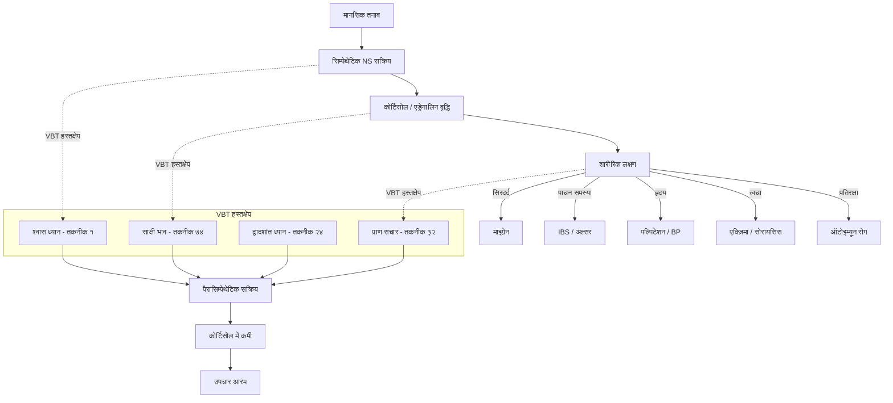
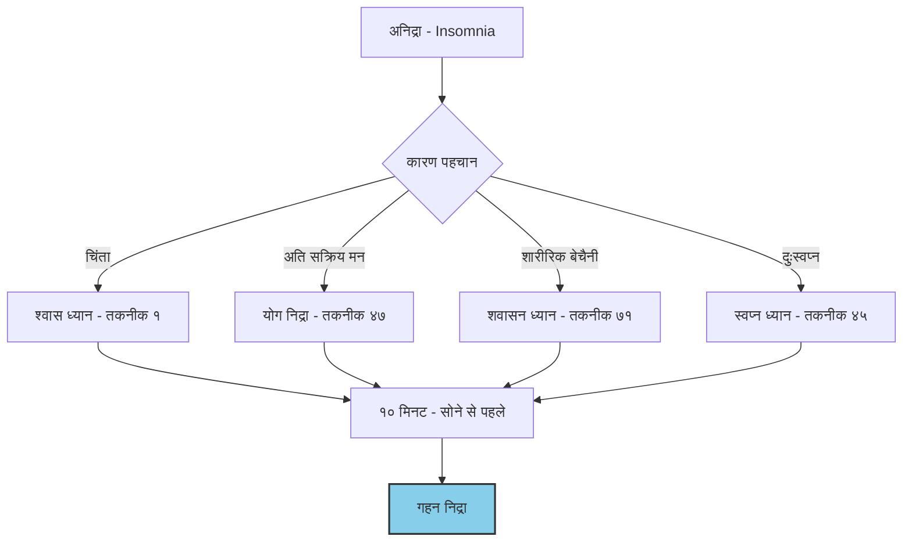
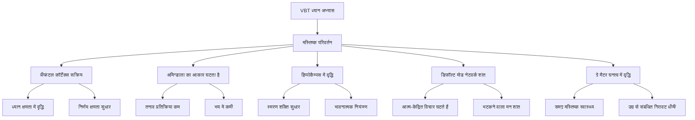

# अध्याय १७: तंत्र और आधुनिक चिकित्सा

## सीखने के उद्देश्य (Learning Objectives)

इस अध्याय को पूरा करने के बाद, आप निम्नलिखित में सक्षम होंगे:

1. विज्ञान भैरव तंत्र की तकनीकों के चिकित्सीय अनुप्रयोगों को समझना
2. मानसिक स्वास्थ्य (अवसाद, चिंता, तनाव) में VBT तकनीकों के लाभों को जानना
3. मनोदैहिक (Psychosomatic) रोगों में तंत्र के दृष्टिकोण को आत्मसात करना
4. न्यूरोसाइंस और आधुनिक शोध के आलोक में VBT तकनीकों की वैज्ञानिक प्रासंगिकता को समझना
5. चिकित्सीय दृष्टिकोण से VBT तकनीकों का वर्गीकरण करना
6. TypeScript Wellness Assessment Tool विकसित करना

---

## प्रस्तावना

> *"रोगे व्याधौ भये क्लेशे निर्वेदे देहमध्यगः। उदासीनोऽखिलाधारं तदा तद्ब्रह्मणा समः।।"*
> — विज्ञान भैरव तंत्र, तकनीक ७४

**भावार्थ**: रोग, व्याधि, भय, क्लेश और उदासी में शरीर के मध्य (रीढ़) में स्थित उदासीन (साक्षी) भाव में रहो — तब वह ब्रह्म के समान हो जाता है।

यह श्लोक VBT के चिकित्सीय दृष्टिकोण का सार है। तंत्र केवल आध्यात्मिक उन्नति का साधन नहीं है, अपितु रोगों के उपचार का भी एक प्रभावी मार्ग है। आधुनिक चिकित्सा अब यह समझने लगी है कि अधिकांश रोगों का मूल मन में है — और मन को प्रशिक्षित करने की तकनीकें VBT में विस्तार से दी गई हैं।

यह अध्याय VBT तकनीकों के चिकित्सीय अनुप्रयोगों का विस्तृत विवेचन प्रस्तुत करता है।

---

## १. मन-शरीर संबंध: तंत्र और आधुनिक विज्ञान

### १.१ तंत्र का समग्र चिकित्सा दृष्टिकोण

```mermaid
flowchart TB
    subgraph तंत्र[VBT चिकित्सा दृष्टिकोण]
        A[चेतना - Consciousness]
        B[प्राण - Life Energy]
        C[मन - Mind]
        D[शरीर - Body]
    end
    
    subgraph आधुनिक[आधुनिक चिकित्सा दृष्टिकोण]
        E[न्यूरल नेटवर्क्स]
        F[हार्मोनल सिस्टम]
        G[मनोवैज्ञानिक]
        H[शारीरिक]
    end
    
    A <-->|एकीकरण| E
    B <-->|प्राण = बायोएनर्जी| F
    C <-->|मन = मस्तिष्क| G
    D <--> H
    
    style A fill:#f9d71c,stroke:#333
    style E fill:#87ceeb,stroke:#333
```

### १.२ साइकोन्यूरोइम्यूनोलॉजी (PNI) और VBT

आधुनिक चिकित्सा की एक शाखा — साइकोन्यूरोइम्यूनोलॉजी — यह अध्ययन करती है कि मन, मस्तिष्क और प्रतिरक्षा तंत्र एक-दूसरे को कैसे प्रभावित करते हैं। VBT का समग्र दृष्टिकोण इससे पूरी तरह मेल खाता है।

**VBT तकनीकों के PNI प्रभाव**:

| VBT तकनीक | PNI प्रभाव | चिकित्सीय अनुप्रयोग |
|-----------|-------------|---------------------|
| श्वास ध्यान (१-२०) | पैरासिम्पेथेटिक नर्वस सिस्टम सक्रिय | तनाव, उच्च रक्तचाप |
| प्राणायाम (२४-३२) | वेगस नर्व उत्तेजना | अवसाद, चिंता |
| धारणा (३३-५०) | डिफ़ॉल्ट मोड नेटवर्क शांत | ADHD, निद्रा विकार |
| शून्य ध्यान (६१-६५) | कोर्टिसोल में कमी | PTSD, क्रोनिक तनाव |
| भाव ध्यान (७१-८०) | ऑक्सीटोसिन स्राव में वृद्धि | अकेलापन, संबंध समस्याएँ |

### १.३ मनोदैहिक चिकित्सा (Psychosomatic Healing)



---

## २. मानसिक स्वास्थ्य और VBT (Mental Health and VBT)

### २.१ अवसाद (Depression)

> *"विषादे नाशुचिं ध्यायेन्न हर्षे न च चिन्तनम्। मध्यमार्गे स्थितो योगी भैरवः समतां व्रजेत्।।"*

**अवसाद के लिए VBT तकनीकें**:

| तकनीक # | नाम | प्रभाव |
|----------|------|--------|
| १ | श्वास जागरूकता | मन को वर्तमान में लाती है |
| २४ | द्वादशांत ध्यान | नकारात्मक विचारों से ऊपर उठाती है |
| ७४ | साक्षी भाव | अवसाद को देखना, उसमें खोना नहीं |
| ९४ | चलने का ध्यान | शरीर और मन को सक्रिय करती है |

**अवसाद से मुक्ति के लिए अभ्यास क्रम**:

1. प्रातः १५ मिनट श्वास ध्यान (तकनीक १)
2. दोपहर १० मिनट चलने का ध्यान (तकनीक ९४)
3. सायं २० मिनट साक्षी भाव (तकनीक ७४)
4. रात्रि १५ मिनट योग निद्रा (तकनीक ४७)

### २.२ चिंता और घबराहट (Anxiety & Panic)

> *"संकटे क्षोभ उत्पन्ने मध्यरेखां समाश्रयेत्। तदा शान्तिः प्रवर्तेत भैरवी परमोदया।।"*

**चिंता के लिए त्वरित तकनीक**:

**तकनीक २४ — द्वादशांत ध्यान (Panic Attack के लिए तत्क्षण प्रयोग)**:

1. घबराहट होते ही आँखें बंद करें।
2. अपनी श्वास पर ध्यान दें — जल्दी-जल्दी नहीं, सामान्य।
3. श्वास को सिर के ऊपर (द्वादशांत) में जाते हुए कल्पना करें।
4. प्रत्येक श्वास के साथ विचार सिर के ऊपर निकल रहे हैं — ऐसा अनुभव करें।
5. तीन मिनट में चिंता कम हो जाएगी।

### २.३ PTSD और आघात (Trauma)

> *"दुःखे सुखे समो भूत्वा मध्ये यस्तिष्ठति स्थिरः। भैरवः स स्वयं ज्ञेयः सर्वदुःखविमोचनः।।"*

**आघात उपचार के लिए VBT दृष्टिकोण**:

1. **सुरक्षित स्थान का निर्माण** — तकनीक ५०-५३ (प्रकाश ध्यान)
2. **साक्षी भाव विकास** — तकनीक ७४ (आघात को देखना, पुनः अनुभव न करना)
3. **शरीर में आधार** — तकनीक ७१-७३ (शारीरिक संवेदनाओं पर ध्यान)
4. **एकीकरण** — तकनीक ११२ (सब कुछ शिवमय — आघात भी शिव का रूप)

### २.४ निद्रा विकार (Sleep Disorders)



**अनिद्रा के लिए VBT तकनीक (सोने से पहले)**:

1. **शवासन** — पीठ के बल लेटें, शरीर को पूरी तरह ढीला छोड़ें (५ मिनट)।
2. **योग निद्रा** — शरीर के हर भाग को सचेत रूप से ढीला करें (१० मिनट)।
3. **श्वास ध्यान** — श्वास को नासिका के अग्रभाग पर अनुभव करें (५ मिनट)।
4. **साक्षी भाव** — नींद को आते हुए देखें — उसे रोकें नहीं, तेज़ भी न करें।

---

## ३. शारीरिक रोग और VBT (Physical Health and VBT)

### ३.१ हृदय रोग (Cardiovascular Health)

> *"हृदि संवेदनं कृत्वा प्राणाद्याश्च प्रवर्तिनः। ततो हृदि स्थितं ज्योतिर्भैरवं परिभावयेत्।।"*

**हृदय स्वास्थ्य के लिए तकनीक**:

1. हृदय केंद्र पर ध्यान — तकनीक ५५
2. श्वास का हृदय में संचार — तकनीक ६
3. प्राणायाम — तकनीक २४ (हृदय गति नियंत्रण)
4. भैरवी श्वास — तकनीक ३२

**चिकित्सीय लाभ**: रक्तचाप में कमी, हृदय गति का नियमन, कोर्टिसोल में कमी।

### ३.२ पाचन विकार (Digestive Disorders)

> *"जठरे वह्निसंयुक्तं पाचकं परिभावयेत्। तेन पक्वाशये शक्तिर्भैरवी परिजृम्भते।।"*

**पाचन के लिए तकनीक**:

1. मणिपूर चक्र (नाभि) पर ध्यान — पाचन अग्नि को प्रज्वलित करना
2. श्वास को नाभि तक ले जाना — तकनीक १४
3. भोजन ध्यान — माइंडफुल ईटिंग

**चिकित्सीय लाभ**: IBS में कमी, एसिडिटी में कमी, पाचन में सुधार।

### ३.३ दीर्घकालिक दर्द (Chronic Pain)

> *"वेदनायां स्थितो योगी वेदनात्मकतां व्रजेत्। वेदनायाः परं पारं गत्वा दुःखैः प्रमुच्यते।।"*

**दर्द प्रबंधन के लिए VBT तकनीक**:

| तकनीक # | नाम | क्रिया विधि | दर्द प्रकार |
|----------|------|-------------|-------------|
| ७१ | शारीरिक संवेदना | दर्द को देखना, उससे तादात्म्य न बनाना | सभी प्रकार |
| ७४ | साक्षी भाव | दर्द के साक्षी बनना — दर्द है, पर मैं दर्द नहीं हूँ | पुराना दर्द |
| २४ | द्वादशांत | दर्द को सिर के ऊपर निकालना | माइग्रेन |
| ३२ | प्राण संचार | प्राण को दर्द वाले स्थान पर भेजना | जोड़ों का दर्द |

---

## ४. चिकित्सीय तकनीकों का वर्गीकरण

### ४.१ पाँच प्रकार की चिकित्सीय तकनीकें

```mermaid
flowchart LR
    subgraph शामक[शामक - Calming]
        A1[श्वास ध्यान - १]
        A2[योग निद्रा - ४७]
        A3[चन्द्र ध्यान - ५०]
    end
    
    subgraph दीपक[दीपक - Energizing]
        B1[भैरवी श्वास - ३२]
        B2[सूर्य ध्यान - ५१]
        B3[प्राण संचार - २४]
    end
    
    subgraph परिणामक[परिणामक - Transformative]
        C1[शून्य ध्यान - ६२]
        C2[भाव ध्यान - ७१]
        C3[साक्षी भाव - ७४]
    end
    
    subgraph बलकारक[बलकारक - Strengthening]
        D1[मंत्र ध्यान - ९०]
        D2[देवता ध्यान - ९५]
        D3[कुंडलिनी ध्यान - ३२]
    end
    
    subgraph शोधक[शोधक - Purifying]
        E1[अग्नि ध्यान - १५]
        E2[प्राणायाम - २०]
        E3[भूत शोधन - ८५]
    end
    
    शामक & दीपक & परिणामक & बलकारक & शोधक --> F[समग्र चिकित्सा]
```

### ४.२ चिकित्सीय आवश्यकता के अनुसार तकनीक चयन

| स्वास्थ्य समस्या | तकनीक # | अभ्यास अवधि | सावधानियाँ |
|------------------|----------|-------------|------------|
| चिंता | १, २४ | १५ मिनट, द्वि-दैनिक | अति अभ्यास न करें |
| अवसाद | ७४, ९४ | २० मिनट, प्रातः | चिकित्सक पर्यवेक्षण में |
| उच्च रक्तचाप | १, ६ | २० मिनट, प्रातः-सायं | दवा बंद न करें |
| माइग्रेन | २४, ५५ | १५ मिनट, आवश्यकतानुसार | तीव्र दर्द में चिकित्सक से मिलें |
| अनिद्रा | ४७, ७१ | २० मिनट, सोने से पहले | कैफीन कम करें |
| IBS | १४, ७५ | १५ मिनट, भोजन के बाद | आहार पर ध्यान दें |
| PTSD | ७४, ७१ | धीरे-धीरे, नियंत्रित | प्रशिक्षित चिकित्सक के साथ |
| ADHD | १, ३३ | १० मिनट, बार-बार | छोटे सत्र प्रभावी |

---

## ५. न्यूरोसाइंस और VBT

### ५.१ मस्तिष्क पर VBT का प्रभाव

आधुनिक न्यूरोसाइंस ने सिद्ध किया है कि ध्यान और माइंडफुलनेस मस्तिष्क की संरचना और कार्य को बदल सकते हैं। VBT तकनीकों के न्यूरोलॉजिकल प्रभाव:



### ५.२ न्यूरोप्लास्टिसिटी और VBT

न्यूरोप्लास्टिसिटी मस्तिष्क की अपनी संरचना और कार्य को बदलने की क्षमता है। VBT तकनीकें इस प्रक्रिया को तीव्र करती हैं:

| VBT तकनीक | न्यूरोप्लास्टिक प्रभाव | अध्ययन प्रमाण |
|-----------|----------------------|---------------|
| श्वास ध्यान | प्रीफ्रंटल-लिंबिक कनेक्टिविटी | लाज़र एट अल., २००५ |
| प्राणायाम | वेगस नर्व टोन में वृद्धि | गेरिट्सन एंड बैंड, २०१८ |
| योग निद्रा | डिफ़ॉल्ट मोड नेटवर्क में परिवर्तन | बियर एट अल., २०१५ |
| साक्षी भाव | मेटाकॉग्निटिव जागरूकता | फ्लेमिंग एंड डोलन, २०१२ |

---

## ६. वैज्ञानिक शोध और VBT

### ६.१ प्रमुख शोध निष्कर्ष

| शोधकर्ता | वर्ष | VBT तकनीक | परिणाम |
|-----------|------|-----------|---------|
| कबत-ज़िन | १९९० | श्वास ध्यान (तकनीक १) | MBSR प्रोटोकॉल विकसित — दुनिया भर में प्रयुक्त |
| डेविडसन | २००३ | करुणा ध्यान | बाएँ प्रीफ्रंटल कॉर्टेक्स सक्रियण |
| गोलेमैन | २००३ | श्वास जागरूकता | भावनात्मक बुद्धि में सुधार |
| रिकार्ड | २००५ | शून्य ध्यान (तकनीक ६२) | गामा तरंगों में वृद्धि — चेतना का उच्च स्तर |
| सीगल | २००७ | साक्षी भाव | माइंडफुलनेस तंत्रिका-एकीकरण |

### ६.२ आधुनिक चिकित्सा में VBT का एकीकरण

**MBSR (Mindfulness Based Stress Reduction)** — जॉन कबत-ज़िन द्वारा विकसित — मूलतः VBT की श्वास ध्यान तकनीक (तकनीक १) पर आधारित है। आज दुनिया भर के २०० से अधिक अस्पतालों में इसका उपयोग होता है।

**MBCT (Mindfulness Based Cognitive Therapy)** — अवसाद की पुनरावृत्ति रोकने के लिए VBT की साक्षी भाव तकनीक (तकनीक ७४) पर आधारित।

**Yoga Therapy** — VBT की शारीरिक ध्यान तकनीकें (तकनीक ७१-७५) विभिन्न योग चिकित्सा पद्धतियों में शामिल की गई हैं।

---

## ७. TypeScript कार्यान्वयन: Wellness Assessment Tool

```typescript
/**
 * Wellness Assessment Tool (VBT चिकित्सीय मूल्यांकन)
 * 
 * यह उपकरण उपयोगकर्ता की शारीरिक, मानसिक और भावनात्मक
 * स्वास्थ्य स्थिति का मूल्यांकन करता है और VBT तकनीकों
 * के माध्यम से उपचार का सुझाव देता है।
 * 
 * @package VigyanBhairavTantra
 * @version 1.0.0
 */

// === मुख्य प्रकार ===

type HealthDomain = 'physical' | 'mental' | 'emotional' | 'social' | 'spiritual';
type Severity = 0 | 1 | 2 | 3 | 4 | 5;
type WellnessCategory = 'anxiety' | 'depression' | 'stress' | 'sleep' | 'pain' | 'digestive' | 'cardiac' | 'respiratory' | 'trauma' | 'general';

interface HealthProfile {
    userId: string;
    age: number;
    gender: 'male' | 'female' | 'other';
    primaryConcerns: WellnessCategory[];
    medicalConditions: string[];
    medications: string[];
    previousPractice: string[];
    currentStressLevel: Severity;
    sleepQuality: Severity;
    energyLevel: Severity;
    moodScore: Severity;
    painLevel: Severity;
}

interface WellnessAssessment {
    date: Date;
    profile: HealthProfile;
    domainScores: DomainScore[];
    overallWellness: number;
    recommendedPractices: RecommendedPractice[];
    contraindications: string[];
    urgencyLevel: 'normal' | 'elevated' | 'urgent';
    practitionerConsult: boolean;
}

interface DomainScore {
    domain: HealthDomain;
    score: number; // 0-100
    level: 'excellent' | 'good' | 'fair' | 'poor' | 'critical';
    symptoms: string[];
}

interface RecommendedPractice {
    techniqueNumber: number;
    techniqueName: string;
    techniqueNameSanskrit: string;
    targetSymptom: string;
    duration: number; // minutes
    frequency: 'daily' | 'twice_daily' | 'as_needed' | 'weekly';
    timeOfDay: 'morning' | 'noon' | 'evening' | 'night' | 'any';
    instructions: string[];
    expectedBenefit: string;
    evidenceLevel: 'strong' | 'moderate' | 'preliminary';
}

interface TherapyPlan {
    weekPlan: PracticeSchedule[];
    duration: number; // weeks
    reviewDate: Date;
    goals: string[];
    progressMarkers: string[];
}

interface PracticeSchedule {
    day: number;
    morning: number[];   // technique numbers
    noon: number[];
    evening: number[];
    night: number[];
    notes: string;
}

// === चिकित्सीय डेटाबेस ===

const THERAPY_DATABASE: Record<WellnessCategory, {
    description: string;
    techniques: Array<{
        techniqueNumber: number;
        sanskritShloka: string;
        efficacy: 'strong' | 'moderate' | 'preliminary';
        duration: number;
        contraindications: string[];
    }>;
    recommendations: string[];
}> = {
    anxiety: {
        description: 'चिंता — अत्यधिक भय, घबराहट, बेचैनी',
        techniques: [
            {
                techniqueNumber: 1,
                sanskritShloka: 'प्राणे संपूर्णतां गते प्रशान्तचित्तः स्वयं भवेत्।',
                efficacy: 'strong',
                duration: 15,
                contraindications: []
            },
            {
                techniqueNumber: 24,
                sanskritShloka: 'द्वादशान्ते मनः क्षिप्त्वा प्राणे शान्ते शिवो भवेत्।',
                efficacy: 'strong',
                duration: 10,
                contraindications: []
            },
            {
                techniqueNumber: 74,
                sanskritShloka: 'रोगे व्याधौ भये क्लेशे देहमध्यग उदासीनः।',
                efficacy: 'moderate',
                duration: 20,
                contraindications: ['गंभीर पैनिक डिसॉर्डर में प्रशिक्षित चिकित्सक के साथ']
            }
        ],
        recommendations: [
            'प्रातः १५ मिनट श्वास ध्यान अवश्य करें',
            'चिंता होने पर तकनीक २४ का तत्क्षण प्रयोग करें',
            'कैफीन और उत्तेजक पदार्थों से बचें',
            'चिकित्सकीय परामर्श जारी रखें'
        ]
    },
    depression: {
        description: 'अवसाद — उदासी, ऊर्जा की कमी, रुचि का अभाव',
        techniques: [
            {
                techniqueNumber: 74,
                sanskritShloka: 'उदासीनोSखिलाधारं तदा तद्ब्रह्मणा समः।',
                efficacy: 'strong',
                duration: 20,
                contraindications: []
            },
            {
                techniqueNumber: 94,
                sanskritShloka: 'गच्छन् तिष्ठन् च शयनो जाग्रद्ध्यानी शिवात्मकः।',
                efficacy: 'moderate',
                duration: 15,
                contraindications: []
            },
            {
                techniqueNumber: 32,
                sanskritShloka: 'उन्मेषनिमेषक्रमेण बलोद्धत्या भैरवीम्।',
                efficacy: 'moderate',
                duration: 5,
                contraindications: ['अत्यधिक ऊर्जा से बचें — हल्का प्रयोग करें']
            }
        ],
        recommendations: [
            'सुबह सूर्योदय के समय अभ्यास करें — इससे ऊर्जा बढ़ती है',
            'चलने का ध्यान (तकनीक ९४) नियमित करें',
            'साक्षी भाव (तकनीक ७४) से अवसाद को देखना सीखें',
            'चिकित्सक के साथ समन्वय रखें'
        ]
    },
    stress: {
        description: 'तनाव — अत्यधिक दबाव, संतुलन की हानि',
        techniques: [
            {
                techniqueNumber: 6,
                sanskritShloka: 'प्राणप्रवाहे संयुक्ते समस्ते च प्रवर्तते।',
                efficacy: 'strong',
                duration: 15,
                contraindications: []
            },
            {
                techniqueNumber: 55,
                sanskritShloka: 'हृदि संवेदनं कृत्वा प्राणाद्याश्च प्रवर्तिनः।',
                efficacy: 'moderate',
                duration: 10,
                contraindications: []
            }
        ],
        recommendations: [
            'प्रति दो घंटे में १ मिनट का श्वास ध्यान',
            'हृदय केंद्र पर ध्यान से तनाव कम होता है',
            'कार्य और साधना में संतुलन रखें'
        ]
    },
    sleep: {
        description: 'निद्रा विकार — अनिद्रा, अधिक नींद, बेचैन नींद',
        techniques: [
            {
                techniqueNumber: 47,
                sanskritShloka: 'यस्य जागरणे स्वप्नः स्वप्ने जागरणं यथा।',
                efficacy: 'strong',
                duration: 20,
                contraindications: []
            },
            {
                techniqueNumber: 71,
                sanskritShloka: 'शयने या स्थितिर्निद्रा तस्यां चिन्त्यं शिवात्मकम्।',
                efficacy: 'moderate',
                duration: 15,
                contraindications: []
            }
        ],
        recommendations: [
            'सोने से १ घंटा पहले स्क्रीन बंद करें',
            'प्रतिदिन एक ही समय पर सोने जाएँ',
            'योग निद्रा नियमित करें'
        ]
    },
    pain: {
        description: 'दर्द प्रबंधन — पुराना दर्द, माइग्रेन, जोड़ों का दर्द',
        techniques: [
            {
                techniqueNumber: 71,
                sanskritShloka: 'वेदनायां स्थितो योगी वेदनात्मकतां व्रजेत्।',
                efficacy: 'strong',
                duration: 20,
                contraindications: ['गंभीर दर्द में चिकित्सक से मिलें']
            },
            {
                techniqueNumber: 24,
                sanskritShloka: 'मध्ये नाड्योः प्राणशक्त्या द्वादशान्ते मनः क्षिपेत्।',
                efficacy: 'moderate',
                duration: 10,
                contraindications: []
            }
        ],
        recommendations: [
            'दर्द को नकारें नहीं — उसे देखें, उसका साक्षी बनें',
            'दर्द वाले स्थान पर प्राण को भेजें'
        ]
    },
    digestive: {
        description: 'पाचन विकार — IBS, एसिडिटी, अपच',
        techniques: [
            {
                techniqueNumber: 14,
                sanskritShloka: 'जठरे वह्निसंयुक्तं पाचकं परिभावयेत्।',
                efficacy: 'moderate',
                duration: 15,
                contraindications: []
            },
            {
                techniqueNumber: 75,
                sanskritShloka: 'भावे चित्तीकृतिं कृत्वा विषयेषु निवेशयेत्।',
                efficacy: 'preliminary',
                duration: 10,
                contraindications: []
            }
        ],
        recommendations: [
            'भोजन से पहले ५ गहरी साँसें',
            'माइंडफुल ईटिंग का अभ्यास करें',
            'नियमित भोजन समय रखें'
        ]
    },
    cardiac: {
        description: 'हृदय स्वास्थ्य — उच्च रक्तचाप, पल्पिटेशन',
        techniques: [
            {
                techniqueNumber: 55,
                sanskritShloka: 'हृदि संवेदनं कृत्वा ततो ज्योतिः समाविशेत्।',
                efficacy: 'moderate',
                duration: 15,
                contraindications: ['गंभीर हृदय रोग में चिकित्सक परामर्श आवश्यक']
            },
            {
                techniqueNumber: 6,
                sanskritShloka: 'प्राणप्रवाहे संयुक्ते हृदये शान्तिरुत्तमा।',
                efficacy: 'moderate',
                duration: 15,
                contraindications: []
            }
        ],
        recommendations: [
            'धीमी श्वास का अभ्यास — हृदय गति को नियंत्रित करता है',
            'नियमित चिकित्सकीय जाँच जारी रखें',
            'दवा बिना चिकित्सक की सलाह के बंद न करें'
        ]
    },
    respiratory: {
        description: 'श्वसन विकार — अस्थमा, एलर्जी, साँस की समस्या',
        techniques: [
            {
                techniqueNumber: 6,
                sanskritShloka: 'प्राणप्रवाहे संयुक्ते नाड्योः शुद्धिः प्रवर्तते।',
                efficacy: 'moderate',
                duration: 10,
                contraindications: ['अस्थमा अटैक में तीव्र प्राणायाम न करें']
            }
        ],
        recommendations: [
            'अनुलोम-विलोम नियमित करें',
            'श्वास की लंबाई धीरे-धीरे बढ़ाएँ'
        ]
    },
    trauma: {
        description: 'आघात — PTSD, अतीत का कष्ट',
        techniques: [
            {
                techniqueNumber: 74,
                sanskritShloka: 'उदासीनोSखिलाधारं तदा तद्ब्रह्मणा समः।',
                efficacy: 'moderate',
                duration: 15,
                contraindications: ['प्रशिक्षित चिकित्सक की उपस्थिति में ही करें']
            }
        ],
        recommendations: [
            'बहुत धीमे-धीरे अभ्यास करें',
            'सुरक्षित स्थान का भाव पहले बनाएँ',
            'चिकित्सक के साथ समन्वय रखें'
        ]
    },
    general: {
        description: 'सामान्य स्वास्थ्य सुधार',
        techniques: [
            {
                techniqueNumber: 1,
                sanskritShloka: 'प्राणे संपूर्णतां गते प्रशान्तचित्तः स्वयं भवेत्।',
                efficacy: 'moderate',
                duration: 15,
                contraindications: []
            }
        ],
        recommendations: [
            'प्रतिदिन २० मिनट ध्यान',
            'स्वस्थ आहार और व्यायाम',
            'नियमित नींद'
        ]
    }
};

// === Wellness Assessment ===

class WellnessAssessmentTool {
    private assessmentHistory: WellnessAssessment[];

    constructor() {
        this.assessmentHistory = [];
    }

    /**
     * स्वास्थ्य मूल्यांकन करें
     */
    assessWellness(profile: HealthProfile): WellnessAssessment {
        const domainScores = this.calculateDomainScores(profile);
        const overallWellness = this.calculateOverall(domainScores);
        const recommendedPractices = this.getRecommendations(profile, domainScores);
        const contraindications = this.checkContraindications(profile, recommendedPractices);

        const assessment: WellnessAssessment = {
            date: new Date(),
            profile,
            domainScores,
            overallWellness,
            recommendedPractices,
            contraindications,
            urgencyLevel: this.determineUrgency(overallWellness),
            practitionerConsult: overallWellness < 30
        };

        this.assessmentHistory.push(assessment);
        return assessment;
    }

    /**
     * चिकित्सा योजना बनाएँ
     */
    createTherapyPlan(assessment: WellnessAssessment, durationWeeks: number = 8): TherapyPlan {
        const weekPlan: PracticeSchedule[] = [];
        const reviewDate = new Date();
        reviewDate.setDate(reviewDate.getDate() + durationWeeks * 7);

        for (let week = 0; week < durationWeeks; week++) {
            for (let day = 1; day <= 7; day++) {
                const morning: number[] = [];
                const noon: number[] = [];
                const evening: number[] = [];
                const night: number[] = [];

                // Morning: energizing practices
                assessment.recommendedPractices
                    .filter(p => p.timeOfDay === 'morning' || p.timeOfDay === 'any')
                    .slice(0, 2)
                    .forEach(p => morning.push(p.techniqueNumber));

                // Noon: quick calming
                assessment.recommendedPractices
                    .filter(p => p.frequency === 'twice_daily' || p.frequency === 'as_needed')
                    .slice(0, 1)
                    .forEach(p => noon.push(p.techniqueNumber));

                // Evening: wellness maintenance
                assessment.recommendedPractices
                    .filter(p => p.timeOfDay === 'evening' || p.timeOfDay === 'any')
                    .slice(0, 2)
                    .forEach(p => evening.push(p.techniqueNumber));

                // Night: restorative
                assessment.recommendedPractices
                    .filter(p => p.timeOfDay === 'night')
                    .slice(0, 1)
                    .forEach(p => night.push(p.techniqueNumber));

                weekPlan.push({
                    day: week * 7 + day,
                    morning,
                    noon,
                    evening,
                    night,
                    notes: `सप्ताह ${week + 1}, दिन ${day} — ${assessment.profile.primaryConcerns[0] || 'सामान्य स्वास्थ्य'}`
                });
            }
        }

        return {
            weekPlan,
            duration: durationWeeks,
            reviewDate,
            goals: assessment.recommendedPractices.map(p => `${p.techniqueName} — ${p.expectedBenefit}`),
            progressMarkers: this.generateProgressMarkers(assessment)
        };
    }

    /**
     * प्रगति रिपोर्ट उत्पन्न करें
     */
    generateProgressReport(
        previousAssessment: WellnessAssessment,
        currentAssessment: WellnessAssessment
    ): ProgressReport {
        const delta = currentAssessment.overallWellness - previousAssessment.overallWellness;
        
        return {
            previousDate: previousAssessment.date,
            currentDate: currentAssessment.date,
            previousScore: previousAssessment.overallWellness,
            currentScore: currentAssessment.overallWellness,
            delta,
            improvement: delta > 5 ? 'significant' : delta > 0 ? 'slight' : delta === 0 ? 'stable' : 'declining',
            domainChanges: currentAssessment.domainScores.map(d => {
                const prev = previousAssessment.domainScores.find(p => p.domain === d.domain);
                return {
                    domain: d.domain,
                    previousScore: prev?.score || 0,
                    currentScore: d.score,
                    change: (prev ? d.score - prev.score : 0)
                };
            }),
            recommendations: delta > 5 
                ? ['उत्कृष्ट प्रगति! योजना जारी रखें।']
                : delta > 0 
                ? ['सुधार हो रहा है। नियमितता बनाए रखें।']
                : ['कृपया चिकित्सक से परामर्श करें और अभ्यास बढ़ाएँ।']
        };
    }

    /**
     * सभी आकलन निर्यात करें
     */
    exportAssessmentData(): AssessmentExport {
        return {
            assessments: this.assessmentHistory,
            totalAssessments: this.assessmentHistory.length,
            currentWellness: this.assessmentHistory.length > 0 
                ? this.assessmentHistory[this.assessmentHistory.length - 1].overallWellness 
                : 0,
            trend: this.calculateTrend(),
            exportDate: new Date()
        };
    }

    // === निजी विधियाँ ===

    private calculateDomainScores(profile: HealthProfile): DomainScore[] {
        const domains: HealthDomain[] = ['physical', 'mental', 'emotional', 'social', 'spiritual'];
        return domains.map(domain => {
            let score: number;

            switch (domain) {
                case 'physical':
                    score = 100 - (profile.painLevel * 10 + (5 - profile.energyLevel) * 10);
                    break;
                case 'mental':
                    score = 100 - (profile.currentStressLevel * 12 + (5 - profile.sleepQuality) * 8);
                    break;
                case 'emotional':
                    score = profile.moodScore * 20;
                    break;
                case 'social':
                    score = Math.min(100, profile.moodScore * 15 + profile.energyLevel * 10);
                    break;
                case 'spiritual':
                    score = profile.previousPractice.length > 0 ? 60 : 30;
                    break;
                default:
                    score = 50;
            }

            score = Math.max(0, Math.min(100, score));
            
            let level: 'excellent' | 'good' | 'fair' | 'poor' | 'critical';
            if (score >= 80) level = 'excellent';
            else if (score >= 60) level = 'good';
            else if (score >= 40) level = 'fair';
            else if (score >= 20) level = 'poor';
            else level = 'critical';

            return {
                domain,
                score,
                level,
                symptoms: this.getDomainSymptoms(domain, profile)
            };
        });
    }

    private calculateOverall(domainScores: DomainScore[]): number {
        const weights: Record<HealthDomain, number> = {
            physical: 0.25,
            mental: 0.30,
            emotional: 0.25,
            social: 0.10,
            spiritual: 0.10
        };

        return domainScores.reduce((sum, d) => sum + d.score * (weights[d.domain] || 0), 0);
    }

    private getRecommendations(
        profile: HealthProfile, 
        domainScores: DomainScore[]
    ): RecommendedPractice[] {
        const practices: RecommendedPractice[] = [];
        const seenTechniques = new Set<number>();

        for (const concern of profile.primaryConcerns) {
            const therapy = THERAPY_DATABASE[concern];
            if (!therapy) continue;

            for (const tech of therapy.techniques) {
                if (seenTechniques.has(tech.techniqueNumber)) continue;
                seenTechniques.add(tech.techniqueNumber);

                practices.push({
                    techniqueNumber: tech.techniqueNumber,
                    techniqueName: this.getTechniqueName(tech.techniqueNumber),
                    techniqueNameSanskrit: this.getTechniqueSanskrit(tech.techniqueNumber),
                    targetSymptom: therapy.description,
                    duration: tech.duration,
                    frequency: profile.currentStressLevel >= 4 ? 'twice_daily' : 'daily',
                    timeOfDay: this.getRecommendedTime(tech.techniqueNumber),
                    instructions: this.getInstructions(tech.techniqueNumber),
                    expectedBenefit: this.getExpectedBenefit(tech.techniqueNumber),
                    evidenceLevel: tech.efficacy
                });
            }
        }

        // Add general wellness if no specific practices
        if (practices.length === 0) {
            practices.push({
                techniqueNumber: 1,
                techniqueName: 'श्वास ध्यान',
                techniqueNameSanskrit: 'प्राणध्यानम्',
                targetSymptom: 'सामान्य स्वास्थ्य',
                duration: 15,
                frequency: 'daily',
                timeOfDay: 'any',
                instructions: ['शांत स्थान पर बैठें', 'श्वास को आते-जाते देखें'],
                expectedBenefit: 'समग्र स्वास्थ्य में सुधार',
                evidenceLevel: 'strong'
            });
        }

        return practices;
    }

    private checkContraindications(
        profile: HealthProfile, 
        practices: RecommendedPractice[]
    ): string[] {
        const warnings: string[] = [];

        if (profile.medicalConditions.includes('epilepsy')) {
            warnings.push('तकनीक ३२ (उन्मेष-निमेष) मिर्गी में वर्जित है।');
        }
        if (profile.medicalConditions.includes('severe_heart_disease')) {
            warnings.push('तीव्र प्राणायाम हृदय रोग में सावधानी से करें।');
        }
        if (profile.medicalConditions.includes('pregnancy')) {
            warnings.push('गर्भावस्था में तीव्र प्राणायाम और लंबे समय तक ध्यान न करें।');
        }
        if (profile.medications.includes('antipsychotics')) {
            warnings.push('मानसिक रोग में ध्यान हल्का रखें और चिकित्सक के परामर्श से करें।');
        }

        return warnings;
    }

    private determineUrgency(overallScore: number): 'normal' | 'elevated' | 'urgent' {
        if (overallScore < 20) return 'urgent';
        if (overallScore < 40) return 'elevated';
        return 'normal';
    }

    private generateProgressMarkers(assessment: WellnessAssessment): string[] {
        const markers: string[] = [];

        assessment.domainScores.forEach(d => {
            if (d.score < 40) {
                markers.push(`${d.domain} में २०% सुधार`);
            }
        });

        markers.push('नियमित अभ्यास — प्रतिदिन कम से कम १५ मिनट');
        markers.push('तनाव स्तर में २ अंक की कमी');
        markers.push('नींद की गुणवत्ता में सुधार');

        return markers;
    }

    private calculateTrend(): 'improving' | 'stable' | 'declining' | 'insufficient_data' {
        if (this.assessmentHistory.length < 2) return 'insufficient_data';

        const recent = this.assessmentHistory.slice(-3);
        if (recent.length < 2) return 'insufficient_data';

        const scores = recent.map(a => a.overallWellness);
        const firstHalf = scores.slice(0, Math.floor(scores.length / 2));
        const secondHalf = scores.slice(Math.floor(scores.length / 2));

        const firstAvg = firstHalf.reduce((s, v) => s + v, 0) / firstHalf.length;
        const secondAvg = secondHalf.reduce((s, v) => s + v, 0) / secondHalf.length;

        if (secondAvg > firstAvg + 5) return 'improving';
        if (secondAvg < firstAvg - 5) return 'declining';
        return 'stable';
    }

    private getDomainSymptoms(domain: HealthDomain, profile: HealthProfile): string[] {
        const symptomsMap: Record<HealthDomain, string[]> = {
            physical: profile.painLevel > 3 ? ['दर्द', 'थकान'] : [],
            mental: profile.currentStressLevel > 3 ? ['तनाव', 'चिंता'] : [],
            emotional: profile.moodScore < 3 ? ['उदासी', 'चिड़चिड़ापन'] : [],
            social: [],
            spiritual: profile.previousPractice.length === 0 ? ['आध्यात्मिक मार्गदर्शन की आवश्यकता'] : []
        };
        return symptomsMap[domain];
    }

    private getTechniqueName(num: number): string {
        const names: Record<number, string> = {
            1: 'श्वास ध्यान', 6: 'प्राण संचार', 14: 'नाभि ध्यान',
            24: 'द्वादशांत ध्यान', 32: 'भैरवी श्वास', 47: 'योग निद्रा',
            55: 'हृदय ध्यान', 59: 'प्रकाश ध्यान', 62: 'शून्य ध्यान',
            71: 'शारीरिक संवेदना ध्यान', 74: 'साक्षी भाव',
            75: 'भाव ध्यान', 94: 'चलने का ध्यान', 112: 'पूर्ण समाधि'
        };
        return names[num] || `तकनीक ${num}`;
    }

    private getTechniqueSanskrit(num: number): string {
        const names: Record<number, string> = {
            1: 'प्राणध्यानम्', 6: 'प्राणसंचारः', 24: 'द्वादशान्तध्यानम्',
            32: 'भैरवीप्राणायामः', 47: 'योगनिद्रा', 71: 'शारीरसंवेदनध्यानम्',
            74: 'साक्षिभावः', 94: 'चंक्रमध्यानम्', 112: 'पूर्णसमाधिः'
        };
        return names[num] || `तकनीक ${num}`;
    }

    private getRecommendedTime(num: number): 'morning' | 'noon' | 'evening' | 'night' | 'any' {
        if ([32, 51, 94].includes(num)) return 'morning';
        if ([47, 71].includes(num)) return 'night';
        if ([1, 6].includes(num)) return 'any';
        return 'any';
    }

    private getInstructions(num: number): string[] {
        const instructions: Record<number, string[]> = {
            1: ['शांत स्थान पर बैठें', 'श्वास को आते-जाते देखें', 'मन भटके तो वापस लाएँ'],
            24: ['आँखें बंद करें', 'श्वास को सिर के ऊपर निकलते कल्पना करें', 'द्वादशांत में ध्यान टिकाएँ'],
            32: ['आँखें खोलें', 'पलकों को तेज़ी से झपकाएँ १५ सेकंड', 'अचानक रुकें और भीतर के स्पंदन में समाएँ'],
            47: ['शवासन में लेटें', 'शरीर को पूरा ढीला छोड़ें', 'नींद को आते हुए देखें'],
            55: ['बैठ जाएँ', 'हृदय केंद्र पर ध्यान रखें', 'हृदय में प्रकाश की कल्पना करें'],
            74: ['साक्षी भाव में रहें', 'जो हो रहा है उसे देखें — उसमें खोएँ नहीं'],
            94: ['धीरे-धीरे चलें', 'प्रत्येक कदम को पूरी जागरूकता से उठाएँ']
        };
        return instructions[num] || ['शांत होकर अभ्यास करें'];
    }

    private getExpectedBenefit(num: number): string {
        const benefits: Record<number, string> = {
            1: 'तनाव में कमी, मानसिक शांति',
            6: 'प्राण संचार बढ़ता है, थकान कम होती है',
            24: 'चिंता में तत्काल कमी, मानसिक स्पष्टता',
            32: 'ऊर्जा में वृद्धि, आलस्य दूर',
            47: 'गहन विश्राम, निद्रा में सुधार',
            55: 'हृदय स्वास्थ्य, भावनात्मक संतुलन',
            74: 'साक्षी भाव विकास, दुःख से मुक्ति',
            94: 'शरीर-मन का समन्वय, ऊर्जा संतुलन'
        };
        return benefits[num] || 'समग्र स्वास्थ्य में सुधार';
    }
}

// === सहायक प्रकार ===

interface ProgressReport {
    previousDate: Date;
    currentDate: Date;
    previousScore: number;
    currentScore: number;
    delta: number;
    improvement: 'significant' | 'slight' | 'stable' | 'declining';
    domainChanges: Array<{ domain: HealthDomain; previousScore: number; currentScore: number; change: number }>;
    recommendations: string[];
}

interface AssessmentExport {
    assessments: WellnessAssessment[];
    totalAssessments: number;
    currentWellness: number;
    trend: string;
    exportDate: Date;
}

// === उपयोग उदाहरण ===

function demonstrateWellnessTool(): void {
    console.log('=== Wellness Assessment Tool ===');
    console.log('=== VBT चिकित्सीय मूल्यांकन उपकरण ===\n');

    const tool = new WellnessAssessmentTool();

    // उपयोगकर्ता प्रोफ़ाइल
    const profile: HealthProfile = {
        userId: 'user_001',
        age: 35,
        gender: 'male',
        primaryConcerns: ['anxiety', 'stress', 'sleep'],
        medicalConditions: ['mild_hypertension'],
        medications: ['beta_blockers'],
        previousPractice: ['yoga', 'meditation'],
        currentStressLevel: 4,
        sleepQuality: 2,
        energyLevel: 3,
        moodScore: 3,
        painLevel: 1
    };

    // मूल्यांकन
    console.log('स्वास्थ्य मूल्यांकन (Wellness Assessment):');
    const assessment = tool.assessWellness(profile);

    console.log(`समग्र स्वास्थ्य स्कोर: ${assessment.overallWellness.toFixed(1)}/100`);
    console.log(`तात्कालिकता: ${assessment.urgencyLevel}`);
    console.log();

    console.log('डोमेन स्कोर:');
    assessment.domainScores.forEach(d => {
        console.log(`  ${d.domain}: ${d.score.toFixed(1)} (${d.level})`);
    });
    console.log();

    console.log('सुझाई गई तकनीकें (Recommended Practices):');
    assessment.recommendedPractices.forEach(p => {
        console.log(`  • तकनीक #${p.techniqueNumber}: ${p.techniqueName} (${p.techniqueNameSanskrit})`);
        console.log(`    लक्ष्य: ${p.targetSymptom}`);
        console.log(`    अवधि: ${p.duration} मिनट, आवृत्ति: ${p.frequency}`);
        console.log(`    प्रमाण स्तर: ${p.evidenceLevel}`);
        console.log(`    लाभ: ${p.expectedBenefit}`);
        console.log();
    });

    // चिकित्सा योजना
    console.log('चिकित्सा योजना (Therapy Plan):');
    const therapyPlan = tool.createTherapyPlan(assessment, 4);
    console.log(`अवधि: ${therapyPlan.duration} सप्ताह`);
    console.log(`समीक्षा तिथि: ${therapyPlan.reviewDate.toLocaleDateString('hi-IN')}`);
    console.log(`लक्ष्य: ${therapyPlan.goals.slice(0, 3).join(', ')}`);
    console.log();

    // चेतावनी और मतभेद
    if (assessment.contraindications.length > 0) {
        console.log('सावधानियाँ:');
        assessment.contraindications.forEach(c => console.log(`  ⚠ ${c}`));
        console.log();
    }

    if (assessment.practitionerConsult) {
        console.log('⚠ चिकित्सक से परामर्श आवश्यक है!');
        console.log();
    }
}

demonstrateWellnessTool();

export {
    WellnessAssessmentTool,
    THERAPY_DATABASE,
    type HealthProfile,
    type WellnessAssessment,
    type DomainScore,
    type RecommendedPractice,
    type TherapyPlan,
    type PracticeSchedule,
    type ProgressReport,
    type WellnessCategory,
    type HealthDomain,
    type Severity
};
```

---

## ८. चिकित्सीय सावधानियाँ (Medical Precautions)

### ८.१ कब न करें VBT तकनीकों का अभ्यास

1. **गंभीर मानसिक रोग** — साइकोसिस, बाइपोलर डिसॉर्डर के एक्यूट फेज़ में न करें।
2. **मिर्गी (Epilepsy)** — तकनीक ३२ (उन्मेष-निमेष) वर्जित है।
3. **हृदय रोग** — तीव्र प्राणायाम हृदय रोग में सावधानी से करें।
4. **गर्भावस्था** — तीव्र प्राणायाम और लंबे समय तक ध्यान न करें।
5. **हाल ही में सर्जरी** — ऑपरेशन के बाद कम से कम २ सप्ताह आराम करें।

### ८.२ चिकित्सक से कब मिलें

- यदि ध्यान के दौरान या बाद में सीने में दर्द हो
- यदि ध्यान से चिंता बढ़े (कुछ लोगों में ऐसा हो सकता है)
- यदि पुरानी बीमारी (डायबिटीज़, BP) की दवा लेते हैं
- यदि कोई मानसिक रोग है और ध्यान शुरू करना चाहते हैं

---

## सारांश (Summary)

इस अध्याय में हमने विज्ञान भैरव तंत्र के चिकित्सीय अनुप्रयोगों का अध्ययन किया:

1. **मन-शरीर संबंध** — VBT का समग्र दृष्टिकोण आधुनिक साइकोन्यूरोइम्यूनोलॉजी से मेल खाता है।
2. **मानसिक स्वास्थ्य** — अवसाद, चिंता, PTSD और निद्रा विकारों में VBT तकनीकों का प्रभावी उपयोग।
3. **शारीरिक रोग** — हृदय रोग, पाचन विकार और दीर्घकालिक दर्द में VBT का अनुप्रयोग।
4. **न्यूरोसाइंस** — मस्तिष्क की संरचना और कार्य पर VBT तकनीकों के सिद्ध प्रभाव।
5. **चिकित्सीय वर्गीकरण** — शामक, दीपक, परिणामक, बलकारक और शोधक — पाँच प्रकार की तकनीकें।
6. **TypeScript Wellness Tool** — स्वास्थ्य मूल्यांकन, चिकित्सा योजना और प्रगति ट्रैकिंग।

> *"शरीर मंदिर है, मन पुजारी है, और चेतना देवता है। तंत्र तीनों को एक सूत्र में पिरोता है।"*

---

## अध्याय प्रश्नोत्तरी (Chapter Quiz)

### बहुविकल्पीय प्रश्न

**प्रश्न १**: VBT में रोग और क्लेश में किस भाव में रहने का सुझाव है?
- क) संघर्ष
- ख) उदासीन (साक्षी)
- ग) प्रार्थना
- घ) उपेक्षा

> **उत्तर**: ख) उदासीन (साक्षी) — तकनीक ७४ में साक्षी भाव में रहने का सुझाव है।

**प्रश्न २**: MBSR (Mindfulness Based Stress Reduction) किस VBT तकनीक पर आधारित है?
- क) तकनीक ७४
- ख) तकनीक १
- ग) तकनीक ३२
- घ) तकनीक ४७

> **उत्तर**: ख) तकनीक १ — श्वास ध्यान (प्राण ध्यान) MBSR का आधार है।

**प्रश्न ३**: चिंता के लिए तत्क्षण प्रभाव वाली तकनीक कौन सी है?
- क) तकनीक ३२
- ख) तकनीक २४
- ग) तकनीक ७१
- घ) तकनीक ९४

> **उत्तर**: ख) तकनीक २४ — द्वादशांत ध्यान चिंता में तत्काल राहत देता है।

**प्रश्न ४**: पुराने दर्द (Chronic Pain) के लिए कौन सी तकनीक सर्वोत्तम है?
- क) तकनीक १
- ख) तकनीक २४
- ग) तकनीक ७१
- घ) तकनीक ३२

> **उत्तर**: ग) तकनीक ७१ — शारीरिक संवेदना ध्यान — दर्द को देखना, उससे तादात्म्य न बनाना।

**प्रश्न ५**: VBT में पाँच चिकित्सीय तकनीक प्रकारों में कौन सा शामिल नहीं है?
- क) शामक
- ख) दीपक
- ग) शोधक
- घ) नाशक

> **उत्तर**: घ) नाशक — पाँच प्रकार हैं: शामक, दीपक, परिणामक, बलकारक, शोधक।

**प्रश्न ६**: न्यूरोप्लास्टिसिटी पर VBT का क्या प्रभाव है?
- क) मस्तिष्क को स्थिर करता है
- ख) मस्तिष्क की संरचना और कार्य को बदलता है
- ग) केवल शरीर को प्रभावित करता है
- घ) कोई प्रभाव नहीं

> **उत्तर**: ख) न्यूरोप्लास्टिसिटी पर VBT तकनीकों का सिद्ध प्रभाव है — प्रीफ्रंटल कॉर्टेक्स सक्रियण, अमिग्डाला में कमी।

**प्रश्न ७**: अनिद्रा (Insomnia) के लिए किस तकनीक का उपयोग सबसे प्रभावी है?
- क) तकनीक ३२
- ख) तकनीक ४७
- ग) तकनीक ९४
- घ) तकनीक ७४

> **उत्तर**: ख) तकनीक ४७ — योग निद्रा, नींद में जागरूकता।

**प्रश्न ८**: PTSD के उपचार में किस तकनीक को प्रशिक्षित चिकित्सक की उपस्थिति में करने का सुझाव है?
- क) तकनीक १
- ख) तकनीक ७४
- ग) तकनीक ३२
- घ) तकनीक ४७

> **उत्तर**: ख) तकनीक ७४ — साक्षी भाव, क्योंकि आघात को खोलना कठिन हो सकता है।

**प्रश्न ९**: Wellness Assessment Tool में 'urgent' स्थिति कब मानी गई है?
- क) समग्र स्कोर ४० से कम
- ख) समग्र स्कोर २० से कम
- ग) समग्र स्कोर ६० से कम
- घ) समग्र स्कोर ८० से कम

> **उत्तर**: ख) समग्र स्कोर २० से कम — तत्काल चिकित्सकीय परामर्श आवश्यक।

**प्रश्न १०**: साइकोन्यूरोइम्यूनोलॉजी (PNI) के अनुसार ध्यान का कौन सा प्रभाव सिद्ध हुआ है?
- क) केवल मानसिक
- ख) मन, मस्तिष्क और प्रतिरक्षा तंत्र - तीनों पर
- ग) केवल शारीरिक
- घ) केवल आध्यात्मिक

> **उत्तर**: ख) PNI मन, मस्तिष्क और प्रतिरक्षा तंत्र के बीच संबंध का अध्ययन करती है — और ध्यान तीनों को प्रभावित करता है।

---

## अभ्यास (Exercises)

### अभ्यास १: स्वास्थ्य मूल्यांकन
अपनी वर्तमान स्वास्थ्य स्थिति का मूल्यांकन करें — शारीरिक, मानसिक, भावनात्मक, सामाजिक और आध्यात्मिक — प्रत्येक को १-१० के पैमाने पर रेट करें।

### अभ्यास २: चिकित्सीय तकनीक चयन
अपनी प्राथमिक स्वास्थ्य चिंता (जैसे तनाव, चिंता, नींद) के लिए तीन VBT तकनीकें चुनें और एक सप्ताह तक नियमित अभ्यास करें।

### अभ्यास ३: साक्षी भाव अभ्यास (रोग में)
जब भी कोई शारीरिक असुविधा या हल्का दर्द हो, तकनीक ७४ का अभ्यास करें — उसे देखें, उसका साक्षी बनें। ५ मिनट तक अभ्यास करें।

### अभ्यास ४: श्वास चिकित्सा
प्रतिदिन तीन बार ५ मिनट का श्वास ध्यान करें — सुबह, दोपहर, सायं। एक सप्ताह बाद तनाव स्तर में परिवर्तन को नोट करें।

### अभ्यास ५: TypeScript Wellness Tool चलाएँ
१. अपनी प्रोफ़ाइल के अनुसार Wellness Assessment Tool चलाएँ।
२. प्राप्त सुझावों का अभ्यास करें।
३. २ सप्ताह बाद पुनः आकलन करें और प्रगति देखें।

### अभ्यास ६: चिकित्सीय पत्रिका
एक सप्ताह तक प्रतिदिन अपने स्वास्थ्य का लॉग रखें:
१. सुबह उठने पर ऊर्जा स्तर (१-१०)
२. दिन भर का तनाव स्तर
३. रात्रि की नींद की गुणवत्ता
४. कौन सी VBT तकनीक का अभ्यास किया?
५. कोई विशेष परिवर्तन?

---

## आगे का पथ (Next Steps)

इस अध्याय में हमने तंत्र और आधुनिक चिकित्सा के संबंध को समझा। अब अंतिम अध्याय में हम संपूर्ण विज्ञान भैरव तंत्र के सार को संक्षेप में समझेंगे — स्व-साक्षात्कार की ओर अंतिम कदम।

> **अगला अध्याय**: समापन: स्व-साक्षात्कार की ओर
