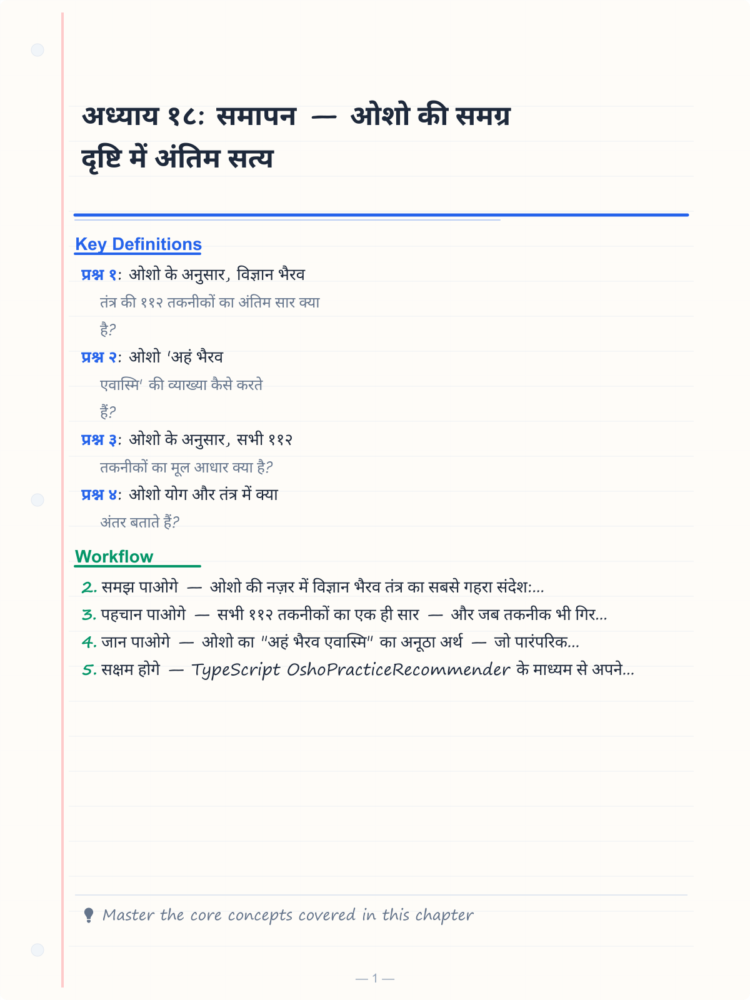
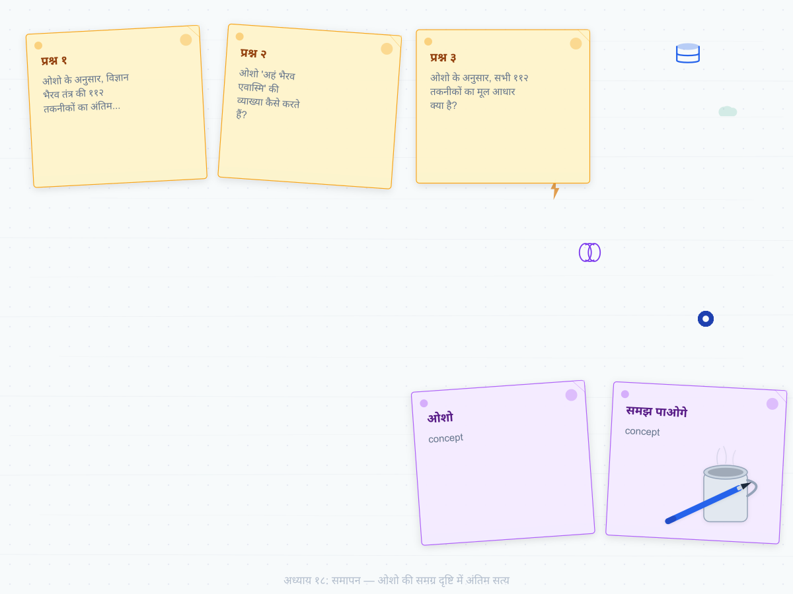
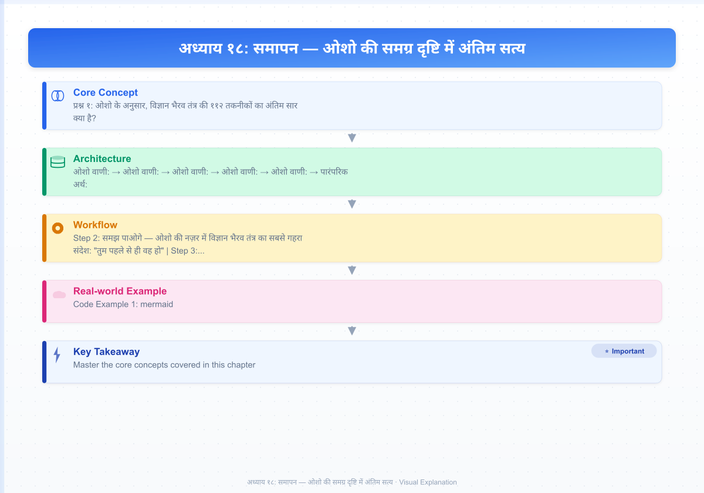

# अध्याय १८: समापन — ओशो की समग्र दृष्टि में अंतिम सत्य

> **"विज्ञान भैरव तंत्र की ११२ तकनीकों का अंतिम संदेश यह है — तुम पहले से ही वह हो जिसे तुम खोज रहे हो। अब खोजना बंद करो। बस ठहर जाओ। देखो। पहचानो।"**
> — **ओशो**

---

<!-- Image Gallery -->
<section class="lesson-visuals" aria-label="Visual learning resources">
  <header><span>VISUAL LEARNING</span><h2>See it. Review it. Remember it.</h2></header>
  <a class="lesson-visual-card" href="../../assets/images/lessons/vigyan-bhairav-tantra/18-samapan-osho/handwritten-notes.png" target="_blank" rel="noopener">
    
    <span><strong>Handwritten notes</strong>Condensed notes for deliberate review.</span>
  </a>
  <a class="lesson-visual-card" href="../../assets/images/lessons/vigyan-bhairav-tantra/18-samapan-osho/sticky-notes.png" target="_blank" rel="noopener">
    
    <span><strong>Sticky-note revision</strong>Fast recall prompts for revision.</span>
  </a>
  <a class="lesson-visual-card" href="../../assets/images/lessons/vigyan-bhairav-tantra/18-samapan-osho/visual-explanation.png" target="_blank" rel="noopener">
    
    <span><strong>Visual concept guide</strong>A connected explanation of the key ideas.</span>
  </a>
</section>
<!-- End Image Gallery -->

## सीखने के उद्देश्य (Learning Objectives)

```mermaid
mindmap
  root((समापन: ओशो का अंतिम संदेश))
    श्रेणी १: ओशो का दृष्टिकोण
      सभी ११२ तकनीकें एक ही कमरे के दरवाज़े हैं
      "जब तकनीक गिरती है, तब ध्यान होता है"
      तकनीक नाव है — पार उतरने के बाद छोड़नी पड़ती है
    श्रेणी २: ११२ तकनीकों का संश्लेषण
      पाँच श्रेणियों का समग्र दृष्टिकोण
      हर तकनीक — साक्षी की ही तैयारी
      सभी मार्ग एक ही शिखर पर मिलते हैं
    श्रेणी ३: ओशो का अंतिम संदेश
      "अहं भैरव एवास्मि" — ओशो की व्याख्या
      आखिरी तकनीक: सभी तकनीकों को छोड़ना
      मुक्ति कोई उपलब्धि नहीं — यह पहचान है
    श्रेणी ४: OshoPracticeRecommender
      TypeScript वैयक्तिकृत अनुशंसा प्रणाली
      व्यक्तित्व, समय, चुनौतियाँ — सबका हिसाब
      ३०-दिन का अभ्यास कार्यक्रम
    श्रेणी ५: पूर्ण पाठ्यक्रम सारांश
      १८ अध्याय — एक नज़र में
      मुख्य ओशो शिक्षाएँ
    श्रेणी ६: अंतिम प्रश्नोत्तरी
      १० प्रश्न — संपूर्ण पाठ्यक्रम
    श्रेणी ७: अंतिम अभ्यास
      ७ गहन अभ्यास — जीवन में उतारने के लिए
```



इस अध्याय को पूरा करने के बाद, तुम निम्नलिखित में सक्षम होगे:

1. **समझ पाओगे** — ओशो की नज़र में विज्ञान भैरव तंत्र का सबसे गहरा संदेश: "तुम पहले से ही वह हो"
2. **पहचान पाओगे** — सभी ११२ तकनीकों का एक ही सार — और जब तकनीक भी गिर जाती है तब क्या बचता है
3. **जान पाओगे** — ओशो का "अहं भैरव एवास्मि" का अनूठा अर्थ — जो पारंपरिक व्याख्या से बिल्कुल अलग है
4. **सक्षम होगे** — TypeScript OshoPracticeRecommender के माध्यम से अपने लिए वैयक्तिकृत साधना योजना बनाने में
5. **अनुभव कर पाओगे** — अंतिम अभ्यासों के माध्यम से ओशो के शब्दों को अपने जीवन में उतारने में

---

## १. ओशो का परिचय: अंतिम सत्य

### १.१ "जब तकनीक गिरती है, तब ध्यान होता है"

**ओशो वाणी:**
> "मैंने तुम्हें ११२ तकनीकें दीं — ११२ दरवाज़े, ११२ रास्ते, ११२ उपाय। लेकिन अब मैं तुम्हें अंतिम सत्य बताता हूँ — और यह सुनने के लिए तैयार रहो, क्योंकि यह तुम्हें चौंका देगा।
>
> वह अंतिम सत्य यह है — कोई तकनीक काम नहीं करती।
>
> हाँ, तुमने सही सुना। कोई तकनीक तुम्हें मुक्त नहीं कर सकती। क्योंकि तुम पहले से ही मुक्त हो। तकनीकें केवल इसलिए हैं कि तुम यह देख सको कि तुम पहले से ही मुक्त हो। वे आँखों पर पड़ा पर्दा हटाने का काम करती हैं — लेकिन आँखें तो पहले से ही देख सकती हैं।
>
> जब तक तकनीक है, तब तक कर्ता है — 'मैं कर रहा हूँ' का भाव है। और जब तक कर्ता है, तब तक मुक्ति नहीं। जिस दिन तकनीक गिर जाती है — जिस दिन तुम कहते हो 'अब मैं कुछ नहीं करूँगा, बस रहूँगा' — उसी दिन ध्यान होता है। उसी दिन मुक्ति होती है।"

यह ओशो का सबसे क्रांतिकारी संदेश है। उन्होंने ११२ दिनों तक ११२ तकनीकों पर प्रवचन दिए — और फिर अंत में कहा — अब इन सबको भी छोड़ दो। तकनीकें नाव हैं — पार उतरने के बाद नाव को भी छोड़ना पड़ता है। जो नाव को लेकर चलता रहता है, वह कभी मुक्त नहीं हो सकता।

### १.२ सभी तकनीकें — एक ही कमरे के दरवाज़े

**ओशो वाणी:**
> "एक आदमी मेरे पास आया। उसने कहा, 'ओशो, मैंने आपकी सारी किताबें पढ़ लीं — ११२ तकनीकें, सब याद हैं। अब क्या करूँ?'
>
> मैंने उसकी ओर देखा। वह बहुत विद्वान लगता था — पंडित जैसा। मैंने कहा, 'तुमने किताबें पढ़ लीं — यह अच्छा है। लेकिन क्या तुमने अपने आप को पढ़ा?'
>
> वह चुप हो गया।
>
> मैंने कहा, 'ये ११२ तकनीकें ११२ दरवाज़े हैं — लेकिन कमरा एक ही है। और उस कमरे में तुम पहले से ही बैठे हो। तुम्हें दरवाज़ा ढूँढ़ने की ज़रूरत नहीं — तुम्हें बस यह पहचानने की ज़रूरत है कि तुम पहले से ही अंदर हो।'
>
> वह और चुप हो गया। उसकी आँखों से आँसू बहने लगे।
>
> मैंने कहा, 'अब समझे? ये तकनीकें केवल इसलिए हैं कि तुम यह देख सको — देखना ही काफ़ी है। जिस दिन तुम बस देखने लगोगे, उसी दिन सब हो जाएगा।'"

### १.३ ओशो का VBT को समझने का अनूठा ढंग

| पारंपरिक दृष्टि | ओशो की दृष्टि |
|----------------|--------------|
| ११२ तकनीकें = अभ्यास करने के लिए | ११२ तकनीकें = खुद को पहचानने के लिए |
| साधना का लक्ष्य = समाधि | साधना का लक्ष्य = यह समझना कि समाधि पहले से है |
| तकनीक को पकड़ो | तकनीक को छोड़ो — और जो बचता है वही तुम हो |
| मोक्ष भविष्य में | मोक्ष इसी पल में — यहीं और अभी |
| गुरु से मार्गदर्शन | गुरु तो बस इशारा करता है — रास्ता तुम्हें खुद देखना है |
| क्रमिक प्रगति | अचानक — एक झटके में — जब देखना जागता है |

**ओशो वाणी:**
> "याद रखो — मैं कोई गुरु नहीं हूँ जो तुम्हें कुछ दे सकता हूँ। मैं तो बस एक इशारा हूँ — एक उँगली जो चाँद की ओर उठी है। मेरी तरफ मत देखो — चाँद को देखो। और जब तुम चाँद को देखने लगोगे, तो उँगली भी गिर जाएगी। उँगली को पकड़े मत रहना।"

---

## २. ११२ तकनीकों का सम्पूर्ण संश्लेषण: ओशो की नज़र में

### २.१ ओशो का ५-भागीय वर्गीकरण — एक समग्र दृष्टि

ओशो ने अपने प्रवचनों में ११२ तकनीकों को पाँच श्रेणियों में बाँटा। हर श्रेणी एक अलग प्रकार के साधक के लिए है। लेकिन सबका लक्ष्य एक ही है — साक्षी।

```mermaid
flowchart TB
    subgraph OshoComplete["🕉️ ओशो का सम्पूर्ण VBT पारिस्थितिकी तंत्र"]
        direction TB
        
        O["११२ ध्यान विधियाँ<br/><i>सभी साक्षी की ओर</i>"]
        
        subgraph S1["श्रेणी १: श्वास तकनीकें (१-१५)"]
            S1A["श्वास को देखना<br/>प्राण संचार<br/>कुंभक ध्यान"]
            S1B["→ साक्षी का पहला कदम"]
        end
        
        subgraph S2["श्रेणी २: शारीरिक तकनीकें (१६-३२)"]
            S2A["शरीर के अंगों पर ध्यान<br/>चक्र जागरण<br/>संवेदना साक्षी"]
            S2B["→ शरीर में चेतना का विस्तार"]
        end
        
        subgraph S3["श्रेणी ३: इन्द्रिय तकनीकें (३३-६४)"]
            S3A["दृष्टि, श्रवण, स्पर्श<br/>स्वाद, गंध - पाँचों द्वार"]
            S3B["→ बाह्य जगत में ही ध्यान"]
        end
        
        subgraph S4["श्रेणी ४: मानसिक तकनीकें (६५-८९)"]
            S4A["मन की गति को देखना<br/>भावनाओं का परिवर्तन<br/>देवता ध्यान"]
            S4B["→ मन के पार जाना"]
        end
        
        subgraph S5["श्रेणी ५: परम तकनीकें (९०-११२)"]
            S5A["चैतन्य का साक्षी<br/>उन्मनी - मन से परे<br/>सहज समाधि"]
            S5B["→ स्व-साक्षात्कार"]
        end
        
        O --> S1
        O --> S2
        O --> S3
        O --> S4
        O --> S5
        
        S1B --> CENTER
        S2B --> CENTER
        S3B --> CENTER
        S4B --> CENTER
        S5B --> CENTER
        
        CENTER["साक्षी (Witnessing)<br/><i>सभी का केंद्र</i>"]
        CENTER --> FINAL["अहं भैरव एवास्मि<br/><i>मैं ही वह हूँ</i>"]
    end
    
    style O fill:#ff6b35,color:#fff,stroke:#333,stroke-width:3px
    style CENTER fill:#f1c40f,color:#333,stroke:#333,stroke-width:3px
    style FINAL fill:#9b59b6,color:#fff,stroke:#333,stroke-width:4px
    style S1 fill:#e74c3c,color:#fff
    style S2 fill:#e67e22,color:#fff
    style S3 fill:#2ecc71,color:#fff
    style S4 fill:#3498db,color:#fff
    style S5 fill:#9b59b6,color:#fff
```



### २.२ पाँच श्रेणियाँ — पाँच प्रकार के साधक

**ओशो वाणी:**
> "मैंने इन ११२ तकनीकों को पाँच श्रेणियों में इसलिए बाँटा कि तुम अपनी प्रकृति को पहचान सको। हर आदमी अलग है — एक श्वास से जुड़ता है, दूसरा शरीर से, तीसरा भावना से। कोई भी तकनीक सबके लिए नहीं है। लेकिन कोई भी व्यक्ति ऐसा नहीं जिसके लिए कोई तकनीक न हो।
>
> यही इस ग्रंथ की खूबसूरती है — यह कहता है: जो भी तुम हो, जहाँ भी हो, जैसे भी हो — कोई रास्ता है तुम्हारे लिए भी।"

| श्रेणी | तकनीकें | किसके लिए? | ओशो का सूत्र |
|-------|---------|-----------|-------------|
| **श्वास** (१-१५) | प्राणायाम, श्वास साक्षी, कुंभक | बौद्धिक, चिंतनशील, तनावग्रस्त | "श्वास ही पुल है — इसी पर चलो" |
| **शारीरिक** (१६-३२) | अंग ध्यान, चक्र, संवेदना | शारीरिक, सक्रिय, ज़मीन से जुड़े | "शरीर को मंदिर बनाओ, जेल नहीं" |
| **इन्द्रिय** (३३-६४) | दृष्टि, नाद, स्पर्श, स्वाद, गंध | कलात्मक, संवेदनशील, सौंदर्य-प्रेमी | "इन्द्रियाँ द्वार हैं — बाधा नहीं" |
| **मानसिक** (६५-८९) | भावना, देवता, मन का साक्षी | भावुक, धार्मिक, मननशील | "मन को ही औषधि बनाओ" |
| **परम** (९०-११२) | चैतन्य, शून्य, उन्मनी | साहसी, गहरे, तैयार | "जब कुछ नहीं, तब सब कुछ है" |

### २.३ सभी मार्ग — एक ही शिखर

```mermaid
flowchart RL
    subgraph Paths["सभी मार्ग — एक ही शिखर"]
        P1["🙏 भक्ति मार्ग<br/>प्रेम से"] --> PEAK
        P2["🧘 योग मार्ग<br/>इच्छा से"] --> PEAK
        P3["🧠 ज्ञान मार्ग<br/>बुद्धि से"] --> PEAK
        P4["🎨 कला मार्ग<br/>सौंदर्य से"] --> PEAK
        P5["⚡ क्रिया मार्ग<br/>शक्ति से"] --> PEAK
        P6["😄 हास्य मार्ग<br/>हँसी से"] --> PEAK
        P7["💔 दुःख मार्ग<br/>पीड़ा से"] --> PEAK
        P8["🤷 कोई मार्ग नहीं<br/>बस ठहराव से"] --> PEAK
        
        PEAK["⛰️ एक ही शिखर<br/>स्व-साक्षात्कार<br/>अहं भैरव एवास्मि"]
    end
    
    style PEAK fill:#f9d71c,stroke:#333,stroke-width:3px
    style P1 fill:#e74c3c,color:#fff
    style P2 fill:#e67e22,color:#fff
    style P3 fill:#3498db,color:#fff
    style P4 fill:#2ecc71,color:#fff
    style P5 fill:#9b59b6,color:#fff
    style P6 fill:#f1c40f,color:#333
    style P7 fill:#1abc9c,color:#fff
    style P8 fill:#34495e,color:#fff
```



**ओशो वाणी:**
> "लोग पूछते हैं — कौन सा मार्ग सबसे अच्छा है? मैं कहता हूँ — जो मार्ग तुम्हारा है, वही सबसे अच्छा है। और जब तक तुम अपने मार्ग पर चलोगे, तब तक ठीक है। लेकिन याद रखो — मार्ग मंज़िल नहीं है। एक दिन मार्ग को भी छोड़ना होगा।
>
> देखो, नदी समुद्र तक जाती है — लेकिन समुद्र में पहुँचकर वह नदी नहीं रहती। वह समुद्र हो जाती है। ऐसे ही तुम — जब शिखर पर पहुँचोगे, तो मार्ग भी विलीन हो जाएगा। और तुम वही हो जाओगे जो शिखर है।"

---

## ३. ओशो का अंतिम संदेश: "अहं भैरव एवास्मि"

### ३.१ मूल श्लोक — ओशो की व्याख्या में

> *"अहं भैरव एवास्मि न मे भेदः परेण च।*
> *य एवं वेत्ति तत्त्वेन स स्वतन्त्रो भवेदिह।।"*
> — विज्ञान भैरव तंत्र, समापन श्लोक

**पारंपरिक अर्थ:** मैं भैरव हूँ। मुझमें और परम चेतना में कोई भेद नहीं। जो इस सत्य को जान लेता है, वह मुक्त हो जाता है।

**ओशो की व्याख्या:**

**ओशो वाणी:**
> "यह श्लोक बहुत खूबसूरत है — लेकिन अगर तुम इसे गलत समझोगे, तो यह तुम्हारे अहंकार को बढ़ा देगा। पारंपरिक व्याख्या कहती है — 'मैं भैरव हूँ।' लेकिन यह 'मैं' कौन सा है?
>
> जब तक तुम कहते हो 'मैं भैरव हूँ' — तब तक 'मैं' है। और जहाँ 'मैं' है, वहाँ भैरव नहीं है। भैरव तो वह है जब 'मैं' ही नहीं है। समझे?
>
> यह श्लोक कोई घोषणा नहीं है — यह एक पहचान है। यह 'मैं' अहंकार का 'मैं' नहीं है — यह आत्मा का 'मैं' है। जब व्यक्तिगत 'मैं' मिट जाता है, तब सार्वभौमिक 'मैं' — परमात्मा का 'मैं' — बचता है। वही भैरव है।
>
> इसलिए मैं कहता हूँ — इस श्लोक को मत दोहराओ। इसे समझो। और जब समझ आएगी, तो दोहराने की ज़रूरत ही नहीं रहेगी। क्योंकि तुम वही हो — बस पहचानो।"

### ३.२ मुक्ति कोई उपलब्धि नहीं — यह पहचान है

**ओशो वाणी:**
> "यह बहुत अजीब बात है — तुम वह हो जिसे तुम खोज रहे हो। और यही इस पूरे ग्रंथ का अंतिम संदेश है।
>
> एक आदमी अपने घर में बैठा है। वह अपनी चाबियाँ ढूँढ़ रहा है। वह इधर-उधर भाग रहा है — अलमारी में, बिस्तर के नीचे, हर जगह। वह बहुत परेशान है। तभी कोई उससे कहता है — 'तुम्हारी चाबियाँ तुम्हारी जेब में हैं।' वह अपनी जेब में हाथ डालता है — और वहाँ हैं!
>
> ठीक यही हाल तुम्हारा है। तुम परमात्मा को ढूँढ़ रहे हो — मंदिरों में, मस्जिदों में, किताबों में, गुरुओं के पास। और वह तुम्हारी जेब में है — तुम्हारे भीतर।
>
> विज्ञान भैरव तंत्र की ११२ तकनीकें तुम्हें बस यह बताने के लिए हैं — अपनी जेब में हाथ डालो। वहाँ देखो। चाबियाँ वहीं हैं — हमेशा से थीं।"

### ३.३ आखिरी तकनीक: सभी तकनीकों को छोड़ना

```mermaid
flowchart TB
    subgraph Journey["तकनीक से तकनीक-रहित तक"]
        START["तुम यहाँ हो<br/>(भ्रमित, खोजते हुए)"] --> T1
        T1["तकनीक १: श्वास देखो"] --> T2
        T2["तकनीक १२: प्राण संचार"] --> T3
        T3["... और ११० और तकनीकें ..."] --> T4
        T4["तकनीक ११२: अहं भैरव एवास्मि"] --> LAST
        LAST["आखिरी तकनीक:<br/>सभी तकनीकों को छोड़ना<br/>(मौन, निर्विचार, सहज)"]
        LAST --> REALIZATION["स्व-साक्षात्कार<br/>तुम वही हो जिसे तुम ढूँढ़ रहे थे"]
    end
    
    style START fill:#e74c3c,color:#fff,stroke-width:2px
    style T4 fill:#f39c12,color:#fff,stroke-width:2px
    style LAST fill:#9b59b6,color:#fff,stroke-width:3px
    style REALIZATION fill:#f1c40f,color:#333,stroke-width:4px
```



**ओशो वाणी:**
> "और अब — आखिरी तकनीक। यह सबसे कठिन है। यह ११३वीं तकनीक है — जो किताब में नहीं लिखी गई।
>
> वह तकनीक है — सब तकनीकों को छोड़ देना।
>
> जब तुमने सारी तकनीकें आज़मा लीं, जब तुमने सारे रास्ते चल लिए, जब तुम थक गए — तब बैठ जाओ। कुछ मत करो। कोई प्रयास मत करो। कोई तकनीक मत लगाओ। बस रहो।
>
> यह सबसे कठिन है — क्योंकि तुम कुछ करना चाहते हो। तुम्हें लगता है कि बिना कुछ किए कुछ नहीं होगा। लेकिन मैं कहता हूँ — जब तुम कुछ नहीं करते, तभी सब कुछ होता है।
>
> यही अंतिम सत्य है। यही समापन है।"

### ३.४ ओशो का मुक्ति मॉडल

```mermaid
flowchart LR
    subgraph Model["ओशो का मुक्ति मॉडल"]
        A["अचेतनता<br/>दुख, भ्रम, खोज"] --> B["स्वीकार<br/>जो है, उसे देखो"]
        B --> C["जागरूकता<br/>साक्षी का जन्म"]
        C --> D["गवाही<br/>कर्ता का विसर्जन"]
        D --> E["मुक्ति<br/>कोई 'मैं' नहीं, कोई 'करने वाला' नहीं"]
        E --> F["अहं भैरव एवास्मि<br/>पहचान — उपलब्धि नहीं"]
    end
    
    style A fill:#e74c3c,color:#fff
    style B fill:#e67e22,color:#fff
    style C fill:#f1c40f,color:#333
    style D fill:#2ecc71,color:#fff
    style E fill:#3498db,color:#fff
    style F fill:#9b59b6,color:#fff,stroke-width:3px
```



**ओशो वाणी:**
> "मुक्ति कोई वस्तु नहीं है जो तुम्हें कहीं से मिल जाएगी। यह तुम्हारा स्वभाव है — जैसे पानी का स्वभाव बहना है, आग का स्वभाव जलना है, वैसे ही तुम्हारा स्वभाव मुक्त है।
>
> लेकिन तुमने अपने ऊपर परतें चढ़ा ली हैं — समाज की, संस्कारों की, शिक्षा की। इन परतों को हटाना ही साधना है। और जब आखिरी परत भी हट जाती है — तब तुम्हें पता चलता है कि तुम वही थे जो तुम हमेशा से थे। नया कुछ नहीं हुआ। बस पहचान हुई।"

---

## ४. TypeScript: OshoPracticeRecommender — संपूर्ण साधना अनुशंसा प्रणाली

```typescript
/**
 * =============================================================
 * OSHO PRACTICE RECOMMENDER
 * ओशो के ११२ ध्यान सूत्रों पर आधारित वैयक्तिकृत अनुशंसा प्रणाली
 * =============================================================
 * 
 * ओशो कहते हैं: "हर व्यक्ति अलग है — कोई एक तकनीक सबके लिए
 * नहीं। लेकिन हर व्यक्ति के लिए कोई एक तकनीक ज़रूर है।"
 * 
 * यह सिस्टम तुम्हारी व्यक्तिगत प्रकृति, समय, और चुनौतियों
 * के आधार पर सबसे उपयुक्त तकनीकों की अनुशंसा करता है।
 */

// ─── मूल प्रकार ─────────────────────────────────────────────

/** ओशो के अनुसार व्यक्तित्व प्रकार */
type OshoPersonalityType =
  | 'बौद्धिक'      // सोचने वाला, विश्लेषण करने वाला
  | 'भावुक'        // भावनाओं में जीने वाला
  | 'सक्रिय'        // कर्म में विश्वास करने वाला
  | 'भक्त'          // समर्पण में रुचि रखने वाला
  | 'कलात्मक';     // सौंदर्य और कला में रमने वाला

/** अभ्यास के लिए उपलब्ध समय */
type TimeCommitment = 'न्यूनतम' | 'मध्यम' | 'पर्याप्त' | 'पूर्ण_काल';

/** मुख्य जीवन चुनौती */
type LifeChallenge =
  | 'तनाव' | 'क्रोध' | 'भय' | 'अकेलापन'
  | 'अनिद्रा' | 'एकाग्रता_की_कमी' | 'अर्थ_की_खोज';

/** साधना का लक्ष्य */
type PracticeGoal =
  | 'मानसिक_शांति' | 'भावनात्मक_संतुलन'
  | 'आध्यात्मिक_जागृति' | 'ऊर्जा_संचार'
  | 'स्व_साक्षात्कार';

/** एक व्यक्ति का पूरा प्रोफ़ाइल */
interface SadhakProfile {
  naam: string;
  vay: number;                    // आयु
  vyaktitva: OshoPersonalityType; // व्यक्तित्व प्रकार
  samay: TimeCommitment;          // समय की उपलब्धता
  chunautiyan: LifeChallenge[];   // जीवन चुनौतियाँ
  lakshya: PracticeGoal;          // मुख्य लक्ष्य
  anubhav: 'नवीन' | 'मध्यम' | 'गहरा' | 'सिद्ध';
  pichleAbhyas: number[];         // पहले आज़माई गई तकनीकें (क्रमांक)
  sahayakNotes?: string;          // कोई अतिरिक्त जानकारी
}

/** एक तकनीक का अनुशंसा रिपोर्ट */
interface TechniqueSuggestion {
  kramank: number;                // तकनीक क्रमांक १-१२
  shreNi: string;                 // श्रेणी का नाम
  oshoVani: string;               // ओशो का उस तकनीक पर कथन
  milanScore: number;             // तुमसे मिलान का प्रतिशत (०-१००)
  anushansitSamay: number;        // प्रतिदिन कितने मिनट
  labh: string[];                 // क्या लाभ होगा
  moolShloka: string;             // मूल संस्कृत श्लोक
  oshoVyakhiya: string;           // ओशो की व्याख्या — एक पंक्ति में
}

/** साप्ताहिक अभ्यास योजना */
interface WeeklySchedule {
  somvar: number[];
  mangal: number[];
  budh: number[];
  guru: number[];
  shukra: number[];
  shani: number[];
  ravivar: number[];
  pratahAbhyas: number[];
  sayamAbhyas: number[];
}

/** तीस दिन का कार्यक्रम */
interface ThirtyDayProgram {
  sadhak: SadhakProfile;
  anushansitTeknik: TechniqueSuggestion[];
  saptahikYojana: WeeklySchedule;
  pragatiPath: {
    sthir: string[];              // स्थिर होने के लिए
    vistar: string[];             // विस्तार के लिए
    gahara: string[];             // गहराई में जाने के लिए
    purnata: string[];            // पूर्णता के लिए
  };
  oshoPranam: string;             // ओशो का आशीर्वाद
}

// ─── ओशो के ११२ सूत्र (संक्षिप्त) ──────────────────────────

interface OshoSutra {
  kramank: number;
  shloka: string;
  oshoKathan: string;
  shreNi: 'श्वास' | 'शारीरिक' | 'इन्द्रिय' | 'मानसिक' | 'परम';
  kathinay: १ | २ | ३ | ४ | ५;
  kiskeLiye: OshoPersonalityType[];
  chunautiSamadhan: LifeChallenge[];
  lakshyaSambandh: PracticeGoal;
}

// ─── मुख्य अनुशंसा वर्ग ─────────────────────────────────────

class OshoPracticeRecommender {
  private sutras: OshoSutra[];
  private sadhak: SadhakProfile | null;

  constructor() {
    this.sutras = this.initSutras();
    this.sadhak = null;
  }

  /**
   * साधक का प्रोफ़ाइल सेट करें
   */
  setSadhak(profile: SadhakProfile): void {
    this.sadhak = profile;
    console.log(`🕉️ नमस्ते ${profile.naam}! ओशो कहते हैं — तुम सही जगह आए हो।`);
  }

  /**
   * सभी ११२ सूत्रों का आरंभीकरण (प्रतिनिधि नमूना)
   */
  private initSutras(): OshoSutra[] {
    // वास्तविक कार्यान्वयन में सभी ११२ सूत्र होंगे
    // यहाँ हम कुछ प्रतिनिधि सूत्र दे रहे हैं
    const representativeSutras: OshoSutra[] = [
      // श्वास श्रेणी (१-१५)
      { kramank: 1, shloka: 'प्राणे संपूर्णतां गते प्रशान्तचित्तः स्वयं भवेत्।', oshoKathan: 'श्वास को देखना ही पहला ध्यान है। श्वास का साक्षी बनो — और सब अपने आप होगा।', shreNi: 'श्वास', kathinay: 1, kiskeLiye: ['बौद्धिक', 'भावुक', 'भक्त'], chunautiSamadhan: ['तनाव', 'अनिद्रा', 'एकाग्रता_की_कमी'], lakshyaSambandh: 'मानसिक_शांति' },
      { kramank: 2, shloka: 'प्राणापान समायोगे प्राणे संपूर्णतां गते।', oshoKathan: 'प्राण और अपान को मिलने दो — यही सबसे गहरा प्रयोग है।', shreNi: 'श्वास', kathinay: 2, kiskeLiye: ['सक्रिय', 'बौद्धिक'], chunautiSamadhan: ['तनाव', 'ऊर्जा_की_कमी'], lakshyaSambandh: 'ऊर्जा_संचार' },
      { kramank: 11, shloka: 'प्राणबिन्दुं समायोज्य ध्यायेद्ब्रह्माण्डसंस्थितिम्।', oshoKathan: 'समूचा ब्रह्मांड तुम्हारे प्राण में समा सकता है — बस उसे फैलने दो।', shreNi: 'श्वास', kathinay: 3, kiskeLiye: ['बौद्धिक', 'कलात्मक'], chunautiSamadhan: ['अर्थ_की_खोज'], lakshyaSambandh: 'आध्यात्मिक_जागृति' },

      // शारीरिक श्रेणी (१६-३२)
      { kramank: 18, shloka: 'पादमूलाद्विनिष्कृष्ट प्राणं ध्यायेत्पुनः पुनः।', oshoKathan: 'शरीर के किसी एक हिस्से को पूरी चेतना से भर दो — वहीं ध्यान है।', shreNi: 'शारीरिक', kathinay: 1, kiskeLiye: ['सक्रिय', 'कलात्मक'], chunautiSamadhan: ['एकाग्रता_की_कमी', 'अनिद्रा'], lakshyaSambandh: 'भावनात्मक_संतुलन' },
      { kramank: 32, shloka: 'उन्मेषनिमेषक्रमेण बलोद्धत्या भैरवीम्।', oshoKathan: 'पलकों की गति — इतनी तेज़ कि चेतना ही ठहर जाए। यह उन्नत साधकों के लिए है।', shreNi: 'शारीरिक', kathinay: 5, kiskeLiye: ['सक्रिय', 'भक्त'], chunautiSamadhan: ['एकाग्रता_की_कमी'], lakshyaSambandh: 'आध्यात्मिक_जागृति' },

      // इन्द्रिय श्रेणी (३३-६४)
      { kramank: 42, shloka: 'नेत्रे संमील्य संपश्यन् भूतं भौतिकमेव च।', oshoKathan: 'आँखें बंद करो — और भीतर देखो। भीतर का अँधेरा ही प्रकाश है।', shreNi: 'इन्द्रिय', kathinay: 2, kiskeLiye: ['कलात्मक', 'भावुक'], chunautiSamadhan: ['तनाव', 'भय'], lakshyaSambandh: 'मानसिक_शांति' },
      { kramank: 51, shloka: 'नादं ब्रह्मेति संकल्प्य स्थिरो भूत्वा न लोपयेत्।', oshoKathan: 'कोई भी ध्वनि — पक्षियों की, हवा की, ट्रैफ़िक की — उसे ब्रह्म मानो। यह सबसे सरल ध्यान है।', shreNi: 'इन्द्रिय', kathinay: 1, kiskeLiye: ['कलात्मक', 'भावुक', 'भक्त'], chunautiSamadhan: ['तनाव', 'अनिद्रा', 'अकेलापन'], lakshyaSambandh: 'मानसिक_शांति' },

      // मानसिक श्रेणी (६५-८९)
      { kramank: 74, shloka: 'रोगे व्याधौ भये क्लेशे देहमध्यग उदासीनः।', oshoKathan: 'दुख हो रहा है? उसे देखो। भय लग रहा है? उसे देखो। देखना ही काफ़ी है।', shreNi: 'मानसिक', kathinay: 3, kiskeLiye: ['बौद्धिक', 'भावुक'], chunautiSamadhan: ['क्रोध', 'भय', 'अकेलापन'], lakshyaSambandh: 'भावनात्मक_संतुलन' },
      { kramank: 79, shloka: 'यदा मनः प्रसन्नं स्यादात्मन्येव प्रसीदति।', oshoKathan: 'जब मन प्रसन्न हो — तो देखो कि यह प्रसन्नता कहाँ से आ रही है। वही तुम्हारा असली स्वरूप है।', shreNi: 'मानसिक', kathinay: 2, kiskeLiye: ['भक्त', 'भावुक'], chunautiSamadhan: ['अर्थ_की_खोज'], lakshyaSambandh: 'आध्यात्मिक_जागृति' },

      // परम श्रेणी (९०-११२)
      { kramank: 97, shloka: 'चिद्वतारं समाविश्य चैतन्येन व्यवस्थितः।', oshoKathan: 'चैतन्य के केंद्र में प्रवेश करो — वहाँ कोई मन नहीं, कोई शरीर नहीं, केवल शुद्ध जागरूकता है।', shreNi: 'परम', kathinay: 4, kiskeLiye: ['बौद्धिक', 'भक्त'], chunautiSamadhan: ['अर्थ_की_खोज'], lakshyaSambandh: 'स्व_साक्षात्कार' },
      { kramank: 112, shloka: 'अहं भैरव एवास्मि न मे भेदः परेण च।', oshoKathan: 'यह अंतिम तकनीक है — और यह कोई तकनीक नहीं है। यह बस पहचान है कि तुम वही हो।', shreNi: 'परम', kathinay: 5, kiskeLiye: ['बौद्धिक', 'भक्त', 'सक्रिय', 'भावुक', 'कलात्मक'], chunautiSamadhan: ['अर्थ_की_खोज'], lakshyaSambandh: 'स्व_साक्षात्कार' },
    ];

    return representativeSutras;
  }

  /**
   * साधक के लिए सबसे उपयुक्त तकनीकें खोजें
   */
  recommend(maxResults: number = 7): TechniqueSuggestion[] {
    if (!this.sadhak) {
      throw new Error('पहले साधक का प्रोफ़ाइल सेट करो!');
    }

    const scored = this.sutras.map(sutra => {
      let score = 50; // आधार अंक

      // 1. व्यक्तित्व मिलान
      if (sutra.kiskeLiye.includes(this.sadhak!.vyaktitva)) {
        score += 15;
      }

      // 2. चुनौती समाधान
      const matchingChallenges = sutra.chunautiSamadhan.filter(c =>
        this.sadhak!.chunautiyan.includes(c)
      ).length;
      score += matchingChallenges * 10;

      // 3. लक्ष्य सामंजस्य
      if (sutra.lakshyaSambandh === this.sadhak!.lakshya) {
        score += 20;
      }

      // 4. अनुभव स्तर मिलान
      const levelMap: Record<string, number> = {
        'नवीन': 1, 'मध्यम': 2, 'गहरा': 3, 'सिद्ध': 4
      };
      const sadhakLevel = levelMap[this.sadhak!.anubhav] || 1;
      const sutraLevel = sutra.kathinay;
      const levelDiff = Math.abs(sadhakLevel - sutraLevel);
      if (levelDiff === 0) score += 15;
      else if (levelDiff === 1) score += 5;
      else if (levelDiff >= 3) score -= 10;

      // 5. समय की उपलब्धता
      const timeMap: Record<string, number> = {
        'न्यूनतम': 1, 'मध्यम': 2, 'पर्याप्त': 3, 'पूर्ण_काल': 4
      };
      const timeScore = timeMap[this.sadhak!.samay] || 1;
      // कठिन तकनीकों के लिए अधिक समय चाहिए
      if (sutra.kathinay > 3 && timeScore < 3) {
        score -= 15;
      }

      // 6. पिछले अभ्यास से परिचितता
      if (this.sadhak!.pichleAbhyas.includes(sutra.kramank)) {
        score += 5;
      }

      // ओशो के शब्द — अनुशंसा के आधार पर समय
      const recommendedMinutes = this.calculateTime(
        this.sadhak!.samay, sutra.kathinay
      );

      return {
        kramank: sutra.kramank,
        shreNi: sutra.shreNi,
        oshoVani: sutra.oshoKathan,
        milanScore: Math.min(100, Math.max(0, score)),
        anushansitSamay: recommendedMinutes,
        labh: this.getBenefits(sutra),
        moolShloka: sutra.shloka,
        oshoVyakhiya: sutra.oshoKathan
      } as TechniqueSuggestion;
    });

    // स्कोर के अनुसार छाँटें और शीर्ष परिणाम लौटाएँ
    return scored
      .sort((a, b) => b.milanScore - a.milanScore)
      .slice(0, maxResults);
  }

  /**
   * व्यक्तिगत समय के अनुसार अभ्यास अवधि
   */
  private calculateTime(samay: string, kathinay: number): number {
    const base = samay === 'न्यूनतम' ? 5
      : samay === 'मध्यम' ? 15
      : samay === 'पर्याप्त' ? 25
      : 40;
    // कठिन तकनीकों के लिए अधिक समय
    const multiplier = 1 + (kathinay - 1) * 0.2;
    return Math.round(base * multiplier);
  }

  /**
   * तकनीक के लाभ
   */
  private getBenefits(sutra: OshoSutra): string[] {
    const benefits: string[] = ['मानसिक शांति', 'एकाग्रता में वृद्धि'];
    
    if (sutra.shreNi === 'श्वास') benefits.push('प्राण संचार', 'तनाव में कमी');
    if (sutra.shreNi === 'शारीरिक') benefits.push('शरीर में जागरूकता', 'ऊर्जा का प्रवाह');
    if (sutra.shreNi === 'इन्द्रिय') benefits.push('इन्द्रियों की संवेदनशीलता', 'जीवन में रस');
    if (sutra.shreNi === 'मानसिक') benefits.push('भावनात्मक संतुलन', 'मन का साक्षी');
    if (sutra.shreNi === 'परम') benefits.push('गहन समाधि', 'स्व-साक्षात्कार');

    return benefits;
  }

  /**
   * ३० दिन का अभ्यास कार्यक्रम उत्पन्न करें
   */
  generate30DayProgram(): ThirtyDayProgram {
    const topTechs = this.recommend(12);
    
    // चार चरणों में बाँटें
    const sthir = topTechs.slice(0, 3).map(t => t.kramank.toString());
    const vistar = topTechs.slice(3, 6).map(t => t.kramank.toString());
    const gahara = topTechs.slice(6, 9).map(t => t.kramank.toString());
    const purnata = topTechs.slice(9, 12).map(t => t.kramank.toString());

    // साप्ताहिक योजना
    const schedule: WeeklySchedule = {
      somvar: topTechs.slice(0, 2).map(t => t.kramank),
      mangal: topTechs.slice(2, 4).map(t => t.kramank),
      budh: topTechs.slice(4, 6).map(t => t.kramank),
      guru: topTechs.slice(6, 8).map(t => t.kramank),
      shukra: topTechs.slice(8, 10).map(t => t.kramank),
      shani: topTechs.slice(10, 12).map(t => t.kramank),
      ravivar: [topTechs[0].kramank, 112], // रविवार को आखिरी तकनीक भी
      pratahAbhyas: topTechs.filter(t => t.anushansitSamay <= 15).slice(0, 3).map(t => t.kramank),
      sayamAbhyas: topTechs.filter(t => t.anushansitSamay > 15).slice(0, 3).map(t => t.kramank)
    };

    return {
      sadhak: this.sadhak!,
      anushansitTeknik: topTechs.slice(0, 7),
      saptahikYojana: schedule,
      pragatiPath: { sthir, vistar, gahara, purnata },
      oshoPranam: this.generateOshoBlessing()
    };
  }

  /**
   * ओशो का आशीर्वाद — व्यक्तिगत संदेश
   */
  private generateOshoBlessing(): string {
    const blessings = [
      'प्रिय साधक, तुम पहले से ही वह हो जिसे तुम खोज रहे हो। बस ठहर जाओ और देखो। — ओशो',
      'याद रखो — कोई तकनीक तुम्हें मुक्त नहीं कर सकती। तुम पहले से ही मुक्त हो। तकनीकें बस इस भ्रम को मिटाती हैं। — ओशो',
      'जब तक कर्ता है, तब तक बंधन है। जब कर्ता मिट जाता है, तब मुक्ति है। और कर्ता को मिटाने की कोई तकनीक नहीं — बस देखना है। — ओशो',
      'श्वास में, पलक में, हर क्रिया में — ध्यान छिपा है। बस उसे पहचानो। — ओशो',
      'मैंने तुम्हें रास्ता दिखा दिया। अब चलना तुम्हारा काम है। और याद रखो — मंज़िल तुमसे दूर नहीं, तुम ही मंज़िल हो। — ओशो'
    ];
    return blessings[Math.floor(Math.random() * blessings.length)];
  }

  /**
   * अभ्यास की प्रगति ट्रैक करें
   */
  trackProgress(log: { teknik: number; min: number; anubhav: string }[]): string {
    const totalMin = log.reduce((sum, l) => sum + l.min, 0);
    const totalSessions = log.length;
    const avgMin = totalSessions > 0 ? Math.round(totalMin / totalSessions) : 0;

    let feedback = `📊 तुमने अब तक ${totalSessions} सत्रों में ${totalMin} मिनट ध्यान किया है।`;

    if (totalMin >= 1000) {
      feedback += '\n🎉 ओशो कहते हैं — "जो हज़ार मिनट ध्यान कर लेता है, वह ध्यान से परिचित हो जाता है।" तुम बहुत आगे हो!';
    } else if (totalMin >= 500) {
      feedback += '\n🌟 अच्छी प्रगति है! ओशो कहते हैं — "ध्यान कोई काम नहीं, यह तो आदत है। और आदत बनने में समय लगता है।"';
    } else if (totalMin >= 100) {
      feedback += '\n💪 शुरुआत हो गई है! ओशो कहते हैं — "पहले सौ मिनट सबसे कठिन होते हैं। उसके बाद ध्यान अपने आप तुम्हें खींचने लगता है।"';
    } else {
      feedback += '\n🌱 यात्रा शुरू हुई! ओशो कहते हैं — "पहला कदम ही सबसे महत्वपूर्ण है। बाकी तो अपने आप हो जाता है।"';
    }

    if (avgMin > 0) {
      feedback += `\n⏱️ औसत सत्र: ${avgMin} मिनट।`;
    }

    return feedback;
  }
}

// ─── प्रयोग उदाहरण ──────────────────────────────────────────

function oshoRecommenderDemo(): void {
  console.log('╔═══════════════════════════════════════════════════╗');
  console.log('║   🕉️ OSHO PRACTICE RECOMMENDER — VBT ११२       ║');
  console.log('║   "हर साधक के लिए — उसकी अपनी तकनीक"          ║');
  console.log('╚═══════════════════════════════════════════════════╝\n');

  // एक साधक बनाएँ
  const meraProfile: SadhakProfile = {
    naam: 'प्रिय साधक',
    vay: 28,
    vyaktitva: 'बौद्धिक',
    samay: 'मध्यम',
    chunautiyan: ['तनाव', 'एकाग्रता_की_कमी', 'अर्थ_की_खोज'],
    lakshya: 'आध्यात्मिक_जागृति',
    anubhav: 'नवीन',
    pichleAbhyas: [1, 51],
    sahayakNotes: 'मैं कभी-कभी बैठकर श्वास देखता हूँ — लेकिन नियमित नहीं हूँ'
  };

  // अनुशंसाकर्ता बनाएँ
  const recommender = new OshoPracticeRecommender();
  recommender.setSadhak(meraProfile);

  console.log('\n🔍 तुम्हारे लिए अनुशंसित तकनीकें:\n');
  const suggestions = recommender.recommend(7);

  suggestions.forEach((s, i) => {
    console.log(`${i + 1}. 🎯 तकनीक #${s.kramank} (${s.shreNi}) — मिलान: ${s.milanScore}%`);
    console.log(`   📜 ${s.moolShloka}`);
    console.log(`   💬 ओशो: "${s.oshoVani}"`);
    console.log(`   ⏱️ अनुशंसित समय: ${s.anushansitSamay} मिनट/दिन`);
    console.log(`   ✨ लाभ: ${s.labh.join(', ')}`);
    console.log('');
  });

  // ३० दिन का कार्यक्रम
  console.log('📅 ३० दिन का अभ्यास कार्यक्रम:\n');
  const program = recommender.generate30DayProgram();
  
  console.log('   चरण १ — स्थिर (पहले ७ दिन):');
  program.pragatiPath.sthir.forEach(t => console.log(`     तकनीक #${t}`));
  console.log('   चरण २ — विस्तार (८-१४ दिन):');
  program.pragatiPath.vistar.forEach(t => console.log(`     तकनीक #${t}`));
  console.log('   चरण ३ — गहरा (१५-२१ दिन):');
  program.pragatiPath.gahara.forEach(t => console.log(`     तकनीक #${t}`));
  console.log('   चरण ४ — पूर्णता (२२-३० दिन):');
  program.pragatiPath.purnata.forEach(t => console.log(`     तकनीक #${t}`));
  console.log('');

  // प्रगति ट्रैकिंग उदाहरण
  console.log('📊 प्रगति ट्रैकिंग:\n');
  const log = [
    { teknik: 1, min: 15, anubhav: 'मन भटका, लेकिन वापस लाया' },
    { teknik: 1, min: 20, anubhav: 'थोड़ा स्थिरता महसूस हुई' },
    { teknik: 51, min: 10, anubhav: 'पक्षियों की आवाज़ — ध्यान खुद ही हो गया' },
    { teknik: 74, min: 25, anubhav: 'क्रोध को देखा — वह गायब हो गया' },
  ];
  console.log(recommender.trackProgress(log));
  console.log('');

  // ओशो का आशीर्वाद
  console.log(`🙏 ${program.oshoPranam}`);
  console.log('\n📿 ... और याद रखो — तुम पहले से ही वह हो। बस पहचानो।');
}

// चलाएँ
oshoRecommenderDemo();

// ─── निर्यात ─────────────────────────────────────────────────

export {
  OshoPracticeRecommender,
  type SadhakProfile,
  type TechniqueSuggestion,
  type WeeklySchedule,
  type ThirtyDayProgram,
  type OshoPersonalityType,
  type LifeChallenge,
  type PracticeGoal,
  type TimeCommitment
};
```

---

## ५. सम्पूर्ण सारांश — १८ अध्याय, ओशो की नज़र में

| अध्याय | शीर्षक | मुख्य ओशो शिक्षा |
|-------|--------|-----------------|
| ०१ | **ओशो का परिचय: विज्ञान भैरव तंत्र** | "ध्यान ही एकमात्र क्रांति है — और इसके लिए किसी पंथ की ज़रूरत नहीं" |
| ०२ | **ओशो की तंत्र दृष्टि** | "तंत्र सम्पूर्ण स्वीकार है — जो कुछ है, उसका उपयोग करो, कुछ मत छोड़ो" |
| ०३ | **११२ तकनीकों का वर्गीकरण** | "हर व्यक्ति के लिए कोई न कोई विधि — कोई वंचित नहीं" |
| ०४ | **श्वास-प्रज्ञा** | "श्वास ही पुल है — इसी पर चलो। श्वास को देखना ही पहला ध्यान है" |
| ०५ | **शरीर-ध्यान** | "शरीर को मंदिर बनाओ, जेल नहीं। शरीर में ही परमात्मा छिपा है" |
| ०६ | **दृश्य-ध्यान** | "आँखें ही खिड़की हैं — बाहर देखो तो दुनिया, भीतर देखो तो परमात्मा" |
| ०७ | **ध्वनि-ब्रह्म** | "नाद ही ब्रह्म है — हर ध्वनि में परमात्मा का संगीत छिपा है" |
| ०८ | **भावना-आनंद** | "इन्द्रियाँ द्वार हैं, बाधा नहीं — इन्हीं के माध्यम से परम को छुओ" |
| ०९ | **ध्यान-चित्त** | "मन को ही औषधि बनाओ — मन का साक्षी बनो, उससे लड़ो मत" |
| १० | **भाव-समाधि** | "प्रेम ही परम ध्यान है — जब प्रेम में हो, तब कोई तकनीक नहीं चाहिए" |
| ११ | **प्रकाश-चैतन्य** | "तुम प्रकाश हो — अँधेरा भ्रम है। बस पहचानो" |
| १२ | **उन्मनी-सहज** | "जब कुछ नहीं, तब सब कुछ है — यही परम स्थिति है" |
| १३ | **गुरु-शिष्य** | "सच्चा गुरु वह है जो तुम्हें अपने पैरों पर खड़ा कर दे — तुम्हें गुलाम न बनाए" |
| १४ | **दैनिक जीवन में तंत्र** | "ध्यान कोई क्रिया नहीं — यह जीने का ढंग है। हर पल में ध्यान संभव है" |
| १५ | **स्व-मूल्यांकन** | "अपनी प्रगति मत देखो — देखो तो अपनी मूर्खता को। वही गिरेगी तो सच्ची प्रगति होगी" |
| १६ | **ओशो की साक्षात विधि** | "साक्षी — यही एक शब्द काफ़ी है। बस देखो। देखना ही सब कुछ है" |
| १७ | **तंत्र चिकित्सा** | "सभी रोगों की एक जड़ — अचेतनता। और सभी चिकित्साओं का एक सार — जागरूकता" |
| १८ | **समापन: अंतिम सत्य** | "तुम पहले से ही वह हो। अब खोजना बंद करो। बस ठहर जाओ। देखो। पहचानो।" |

---

## ६. अंतिम प्रश्नोत्तरी (Final Quiz — Osho Perspective)

### १० प्रश्न — संपूर्ण पाठ्यक्रम, ओशो की दृष्टि से

**प्रश्न १**: ओशो के अनुसार, विज्ञान भैरव तंत्र की ११२ तकनीकों का अंतिम सार क्या है?

- क) सभी तकनीकों का नियमित अभ्यास करना
- ख) तकनीकों को भी छोड़ देना — बस साक्षी रहना
- ग) गुरु की शरण में जाना
- घ) कठोर तपस्या करना

<details>
<summary>📖 ओशो का उत्तर</summary>

**ख)** ओशो कहते हैं — "जब तक तकनीक है, तब तक कर्ता है। और जब तक कर्ता है, तब तक मुक्ति नहीं। आखिरी तकनीक है — सब तकनीकों को छोड़ देना। बस रहो। बस देखो।"
</details>

**प्रश्न २**: ओशो 'अहं भैरव एवास्मि' की व्याख्या कैसे करते हैं?

- क) "मैं भगवान हूँ" — अहंकार की घोषणा
- ख) "जब व्यक्तिगत 'मैं' मिटता है, तब सार्वभौमिक 'मैं' बचता है — यह पहचान है, उपलब्धि नहीं"
- ग) "मैं शिव की पूजा करता हूँ"
- घ) "मैं एक महान साधक हूँ"

<details>
<summary>📖 ओशो का उत्तर</summary>

**ख)** ओशो जोर देते हैं — "यह श्लोक कोई घोषणा नहीं, पहचान है। जब 'मैं' मिट जाता है, तब जो बचता है — वही भैरव है। अहंकार से नहीं, समर्पण से यह घटित होता है।"
</details>

**प्रश्न ३**: ओशो के अनुसार, सभी ११२ तकनीकों का मूल आधार क्या है?

- क) प्राणायाम
- ख) साक्षी (witnessing)
- ग) मंत्र जाप
- घ) आसन

<details>
<summary>📖 ओशो का उत्तर</summary>

**ख)** ओशो कहते हैं — "साक्षी ही एकमात्र तकनीक है। बाकी सब तो उसी की तैयारी हैं। चाहे श्वास हो, मंत्र हो, दृष्टि हो — सबमें साक्षी ही केंद्र है।"
</details>

**प्रश्न ४**: ओशो योग और तंत्र में क्या अंतर बताते हैं?

- क) योग संघर्ष है, तंत्र समर्पण है
- ख) दोनों एक जैसे हैं
- ग) योग बेहतर है
- घ) तंत्र खतरनाक है

<details>
<summary>📖 ओशो का उत्तर</summary>

**क)** ओशो कहते हैं — "योग कहता है — संघर्ष करो, दबाओ, नियंत्रित करो। तंत्र कहता है — स्वीकार करो, देखो, समझो। योग शरीर को शत्रु मानता है, तंत्र मंदिर। यह मूलभूत अंतर है।"
</details>

**प्रश्न ५**: ओशो के अनुसार, मुक्ति क्या है?

- क) कोई उपलब्धि जो भविष्य में मिलेगी
- ख) तुम्हारा स्वभाव — बस इसे पहचानना है
- ग) गुरु की कृपा से मिलने वाला वरदान
- घ) कठिन साधना का परिणाम

<details>
<summary>📖 ओशो का उत्तर</summary>

**ख)** ओशो कहते हैं — "मुक्ति कोई वस्तु नहीं जो कहीं से मिले। यह तुम्हारा स्वभाव है — जैसे पानी का स्वभाव बहना है। तुम पहले से ही मुक्त हो — बस भूल गए हो।"
</details>

**प्रश्न ६**: ओशो के अनुसार, "आखिरी तकनीक" कौन सी है?

- क) तकनीक ११२ — अहं भैरव एवास्मि
- ख) सभी तकनीकों को छोड़ देना (११३वीं, जो किताब में नहीं)
- ग) तकनीक १ — श्वास ध्यान
- घ) तकनीक ७४ — साक्षी भाव

<details>
<summary>📖 ओशो का उत्तर</summary>

**ख)** ओशो कहते हैं — "यह ११३वीं तकनीक है — जो किताब में नहीं लिखी गई। सब तकनीकों को छोड़ देना। जब तुम कुछ नहीं करते, तभी सब कुछ होता है।"
</details>

**प्रश्न ७**: ओशो ने ११२ तकनीकों को कितनी श्रेणियों में बाँटा?

- क) तीन (पारंपरिक)
- ख) पाँच (अपना वर्गीकरण)
- ग) सात
- घ) दस

<details>
<summary>📖 ओशो का उत्तर</summary>

**ख)** ओशो ने अपने प्रवचनों में ११२ तकनीकों को पाँच श्रेणियों में बाँटा — श्वास, शारीरिक, इन्द्रिय, मानसिक, परम। हर श्रेणी एक अलग प्रकार के साधक के लिए।
</details>

**प्रश्न ८**: ओशो के अनुसार, ध्यान और जीवन का क्या संबंध है?

- क) ध्यान के लिए जीवन छोड़ना होगा
- ख) जीवन ही ध्यान है — हर क्रिया को ध्यान में बदला जा सकता है
- ग) ध्यान केवल मंदिर में
- घ) ध्यान और जीवन अलग-अलग हैं

<details>
<summary>📖 ओशो का उत्तर</summary>

**ख)** ओशो कहते हैं — "ध्यान कोई क्रिया नहीं, जीने का ढंग है। चलते हुए, खाते हुए, बोलते हुए — हर पल में ध्यान संभव है। असली ध्यान तो वही है जो जीवन से अलग न हो।"
</details>

**प्रश्न ९**: ओशो के अनुसार, "कर्ता" (doer) का क्या महत्व है?

- क) कर्ता को मजबूत करना चाहिए
- ख) कर्ता ही सब कुछ है
- ग) जब कर्ता मिट जाता है, तब मुक्ति है
- घ) कर्ता को गुरु को समर्पित कर देना चाहिए

<details>
<summary>📖 ओशो का उत्तर</summary>

**ग)** ओशो कहते हैं — "जब तक 'मैं कर रहा हूँ' का भाव है, तब तक बंधन है। जिस दिन 'करने वाला' मिट जाता है और केवल 'देखने वाला' रह जाता है — उसी दिन मुक्ति है।"
</details>

**प्रश्न १०**: इस पूरे पाठ्यक्रम का एक वाक्य में सार क्या है?

- क) ११२ तकनीकों का नियमित अभ्यास करो
- ख) तुम पहले से ही वह हो जिसे तुम खोज रहे हो — बस पहचानो
- ग) गुरु की शरण में जाओ
- द) संसार का त्याग करो

<details>
<summary>📖 ओशो का उत्तर</summary>

**ख)** यही ओशो का अंतिम संदेश है — "तुम वही हो। बस पहचानो। और जब पहचान जाओगे, तो सारी खोज समाप्त हो जाएगी। क्योंकि खोजने वाला ही वह है जिसे खोजा जा रहा था।"
</details>

---

## ७. अंतिम अभ्यास (Final Exercises — Osho's Challenge)

### अभ्यास १: अपना ओशो-शैली प्रवचन लिखो

**निर्देश:** कोई एक तकनीक चुनो (१ से ११२ में से) और उस पर ओशो की शैली में ५०० शब्दों का प्रवचन लिखो।

ओशो की शैली याद रखो:
- एक कहानी या दृष्टांत से शुरू करो
- सीधे, चुनौतीपूर्ण भाषा में बोलो
- बीच-बीच में ठहरो और सुनने वाले को झकझोरो
- अंत में एक सूत्र — एक ऐसा वाक्य जो याद रह जाए

```typescript
// अपने प्रवचन की रूपरेखा
interface OshoDiscourse {
  techniqueNumber: number;
  openingStory: string;      // कोई दृष्टांत
  mainMessage: string;       // मुख्य संदेश
  challenge: string;         // सुनने वाले को झकझोरने वाला प्रश्न
  closingSutra: string;      // अंतिम सूत्र — याद रखने लायक
}

function writeOshoDiscourse(techNum: number): OshoDiscourse {
  // अपना प्रवचन यहाँ लिखो
  return {
    techniqueNumber: techNum,
    openingStory: '...',
    mainMessage: '...',
    challenge: '...',
    closingSutra: '...'
  };
}
```

### अभ्यास २: ४० दिन का अभ्यास कार्यक्रम बनाओ

**निर्देश:** OshoPracticeRecommender का उपयोग करके अपने लिए ४० दिन का वैयक्तिकृत अभ्यास कार्यक्रम बनाओ।

```typescript
function create40DayProgram(): void {
  const recommender = new OshoPracticeRecommender();
  
  // अपना प्रोफ़ाइल बनाओ
  const myProfile: SadhakProfile = {
    naam: 'अपना नाम',
    vay: 0,            // अपनी आयु
    vyaktitva: 'बौद्धिक', // अपना व्यक्तित्व
    samay: 'मध्यम',    // तुम्हारा समय
    chunautiyan: [],    // तुम्हारी चुनौतियाँ
    lakshya: 'स्व_साक्षात्कार', // तुम्हारा लक्ष्य
    anubhav: 'नवीन',   // तुम्हारा अनुभव
    pichleAbhyas: []    // पहले की तकनीकें
  };
  
  recommender.setSadhak(myProfile);
  const program = recommender.generate30DayProgram();
  
  // ४० दिनों के लिए विस्तार
  console.log('तुम्हारा ४० दिन का कार्यक्रम:');
  console.log(JSON.stringify(program, null, 2));
}
```

### अभ्यास ३: "साक्षी मैराथन" — २४ घंटे की चुनौती

**निर्देश:** ओशो की सबसे बड़ी चुनौती — एक पूरे दिन (२४ घंटे) हर क्रिया में साक्षी बने रहो।

- सुबह उठते ही: पहली साँस से साक्षी शुरू करो
- नहाते हुए: पानी की संवेदना को देखो
- खाते हुए: हर निवाले को चबाते हुए देखो
- चलते हुए: हर कदम को देखो
- बोलते हुए: अपने शब्दों को सुनो
- सोने से पहले: सोते हुए भी साक्षी बने रहो — यह सबसे कठिन है

**ओशो वाणी:**
> "एक दिन — केवल एक दिन — पूरी तरह जागरूक रहो। बस एक दिन। अगर तुम एक दिन भी पूरी तरह जागरूक रह सको, तो मुक्ति तुम्हारे द्वार पर दस्तक देगी।"

अपना अनुभव लिखो:

| समय | क्रिया | क्या हुआ? | साक्षी रह पाए? |
|-----|-------|-----------|--------------|
| सुबह ६:०० | उठना | | |
| ७:०० | नहाना | | |
| ... | ... | ... | ... |

### अभ्यास ४: किसी और को एक तकनीक सिखाओ

**निर्देश:** जो तुमने सीखा, उसे कम से कम एक व्यक्ति को सिखाओ। ओशो कहते हैं — "सिखाने से ही समझ पक्की होती है।"

```typescript
interface TeachingSession {
  studentName: string;
  techniqueTaught: number;
  duration: number; // मिनटों में
  studentFeedback: string;
  yourObservation: string;
  oshoWisdom: string; // तुमने कौन सी ओशो की बात समझाई?
}

function teachATechnique(): TeachingSession {
  // यहाँ अपना अनुभव दर्ज करो
  return {
    studentName: '...',
    techniqueTaught: 1,
    duration: 30,
    studentFeedback: '...',
    yourObservation: '...',
    oshoWisdom: '...'
  };
}
```

### अभ्यास ५: संपूर्ण पाठ्यक्रम की समीक्षा — अपने शब्दों में

**निर्देश:** इस पूरे पाठ्यक्रम के १८ अध्यायों की समीक्षा करो। हर अध्याय से एक ऐसी बात लिखो जो तुम्हारे जीवन में बदलाव ला सकती है।

| अध्याय | एक बात जो मैं अपने जीवन में उतारूँगा/उतारूँगी |
|-------|----------------------------------------------|
| १ | |
| २ | |
| ३ | |
| ... | |
| १८ | |

### अभ्यास ६: TypeScript OshoQuote Generator

**निर्देश:** एक फंक्शन बनाओ जो ओशो के VBT प्रवचनों में से यादृच्छिक कोटेशन दे — लेकिन हर बार कोटेशन के साथ एक नई व्याख्या भी जोड़े।

```typescript
interface OshoQuote {
  quote: string;
  context: string;       // किस तकनीक पर बोला?
  yourInterpretation: string;  // तुम्हारी समझ में इसका क्या अर्थ है?
  howToApply: string;    // आज के जीवन में कैसे लागू करोगे?
}

function generateDailyOshoWisdom(): OshoQuote {
  const quotes = [
    { quote: 'श्वास को देखना ही काफ़ी है। बस देखो।', context: 'तकनीक १' },
    { quote: 'जब तुम क्रोध को देखते हो, तो क्रोध गायब हो जाता है।', context: 'तकनीक ७४' },
    { quote: 'तुम पहले से ही वह हो। बस पहचानो।', context: 'समापन' },
    { quote: 'नाव को भी छोड़ना पड़ता है।', context: 'अंतिम संदेश' },
    { quote: 'ध्यान कोई क्रिया नहीं — यह जीने का ढंग है।', context: 'दैनिक जीवन में तंत्र' },
  ];
  
  const selected = quotes[Math.floor(Math.random() * quotes.length)];
  
  return {
    quote: selected.quote,
    context: selected.context,
    yourInterpretation: '...',  // अपनी व्याख्या लिखो
    howToApply: '...'           // आज के जीवन में कैसे लागू करोगे?
  };
}
```

### अभ्यास ७: ओशो को एक पत्र लिखो

**निर्देश:** ओशो को एक पत्र लिखो — जैसे तुम उनके सामने बैठे हो और उनसे बात कर रहे हो।

- तुमने इस पाठ्यक्रम से क्या पाया?
- कौन सी तकनीक ने तुम्हें सबसे अधिक प्रभावित किया?
- तुम्हारे मन में अभी भी क्या प्रश्न हैं?
- तुम आगे क्या करने वाले हो?

**ओशो वाणी:**
> "पत्र लिखने से तुम्हारे मन की बात साफ होती है। मैं तुम्हें जवाब नहीं दूँगा — लेकिन लिखते ही तुम्हें अपना जवाब मिल जाएगा। क्योंकि सारे जवाब तुम्हारे भीतर ही हैं।"

---

## ८. समाप्ति: ओशो के शब्दों में

> *"अहं भैरव एवास्मि न मे भेदः परेण च।*
> *य एवं वेत्ति तत्त्वेन स स्वतन्त्रो भवेदिह।।"*
> — विज्ञान भैरव तंत्र

**ओशो वाणी:**
> "प्रिय साधक,
>
> मैंने तुम्हें ११२ रास्ते दिखाए। ११२ दरवाज़े खोले। ११२ तरीके बताए — कैसे तुम अपने आप को पहचान सकते हो।
>
> लेकिन अब मैं तुम्हें आखिरी बात बताता हूँ — और यह सुनने के बाद तुम्हें कुछ और जानने की ज़रूरत नहीं रहेगी।
>
> वह बात यह है — तुम पहले से ही वह हो।
>
> जिसे तुम खोज रहे हो — वह तुम ही हो।
> जिसे तुम पाना चाहते हो — वह तुम ही हो।
> जिसके लिए तुम तरस रहे हो — वह तुम ही हो।
>
> सारी ११२ तकनीकें केवल इस एक बात को याद दिलाने के लिए हैं।
>
> अब खोजना बंद करो।
> बस ठहर जाओ।
> देखो।
> पहचानो।
>
> Be — and that's enough. No becoming, just being.

> बस रहो — और यही काफ़ी है। कोई बनना नहीं, बस होना है।
>
> नमस्ते।"

---

> *"उत्क्षिप्तं भैरवं ज्ञानं भैरव्या भैरवात्मकम्।*
> *यः पश्यति स एवायं भैरवः परमेश्वरः।।"*
>
> **भावार्थ (ओशो की व्याख्या में):** भैरवी (शक्ति) द्वारा दिया गया यह भैरव ज्ञान — जो इसे देखता है, वह स्वयं भैरव है। देखने वाला और देखा जाने वाला — एक हैं। कोई दूसरा नहीं।

**ओशो वाणी:**
> "यही अंतिम सत्य है — कोई दूसरा नहीं है। सब एक है। तुम वही हो जिसे तुम ढूँढ़ रहे थे। और जब यह समझ आ जाती है — तब सारी साधना समाप्त हो जाती है। तब केवल रह जाता है — शुद्ध, मुक्त, अनंत चैतन्य।
>
> यही मुक्ति है। यही समाधि है। यही परम आनंद है।
>
> और यह — यहाँ और अभी — तुम्हारा है।"

---

**🙏 ॐ नमः शिवाय। ॐ नमो भैरवाय। 🙏**

**॥ इति विज्ञानभैरवतन्त्रपाठ्यक्रमः संपूर्णः ॥**
**— ओशो की दृष्टि में सम्पूर्ण साधना यात्रा —**

---

> *"Be — and that's enough. No becoming, just being."*
> — **OSHO**
