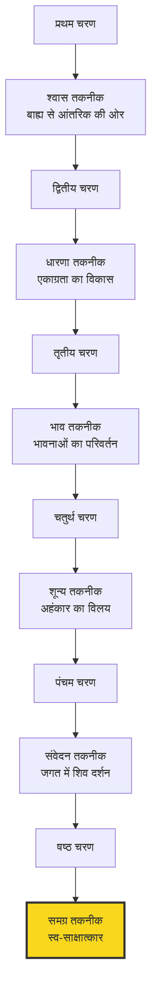
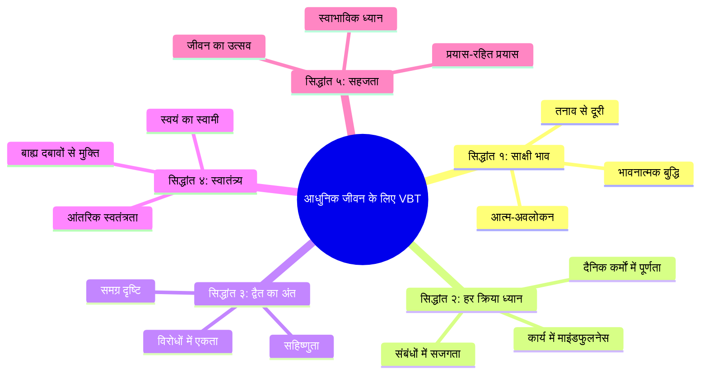

# अध्याय १८: समापन: स्व-साक्षात्कार की ओर

## सीखने के उद्देश्य (Learning Objectives)

इस अध्याय को पूरा करने के बाद, आप निम्नलिखित में सक्षम होंगे:

1. विज्ञान भैरव तंत्र की सभी ११२ तकनीकों का समग्र संश्लेषण करना
2. स्व-साक्षात्कार (Self-Realization) की प्रक्रिया और उसके चरणों को समझना
3. VBT के अंतिम संदेश को आधुनिक जीवन के संदर्भ में आत्मसात करना
4. अपनी व्यक्तिगत प्रकृति और आवश्यकता के अनुसार तकनीकों का चयन करना
5. संपूर्ण पाठ्यक्रम के सीखने को एकीकृत करना
6. TypeScript Complete Practice Recommendation System विकसित करना

---

## प्रस्तावना

> *"अहं भैरव एवास्मि न मे भेदः परेण च। य एवं वेत्ति तत्त्वेन स स्वतन्त्रो भवेदिह।।"*
> — विज्ञान भैरव तंत्र, समापन श्लोक

**भावार्थ**: मैं ही भैरव हूँ। मुझमें और परम (चेतना) में कोई भेद नहीं। जो इस सत्य को तत्त्व से जान लेता है, वह इसी जीवन में स्वतंत्र हो जाता है।

यह विज्ञान भैरव तंत्र का अंतिम संदेश है। ११२ तकनीकों के माध्यम से हम यहाँ तक आए हैं — उस बिंदु तक जहाँ साधक और साध्य, ध्यान और ध्येता, शिव और शक्ति — सब एक हो जाते हैं।

यह अध्याय न केवल इस पाठ्यक्रम का समापन है, अपितु आपकी साधना यात्रा का एक नया आरंभ भी है।

---

## १. संपूर्ण VBT का समग्र दृष्टिकोण (Holistic View of VBT)

### १.१ ११२ तकनीकों का वर्गीकरण

```mermaid
flowchart TD
    subgraph VBT[विज्ञान भैरव तंत्र - ११२ तकनीकें]
        direction TB
        A[श्वास तकनीक<br>प्राणोपाय<br>तकनीक १-२०]
        B[धारणा तकनीक<br>ध्यानोपाय<br>तकनीक २१-४०]
        C[भाव तकनीक<br>भावोपाय<br>तकनीक ४१-६०]
        D[शून्य तकनीक<br>शून्योपाय<br>तकनीक ६१-८०]
        E[संवेदन तकनीक<br>संवेदनोपाय<br>तकनीक ८१-१००]
        F[समग्र तकनीक<br>समग्रोपाय<br>तकनीक १०१-११२]
    end
    
    A --> A1[श्वास पर ध्यान]
    A --> A2[प्राण संचार]
    A --> A3[मध्य-श्वास ध्यान]
    
    B --> B1[बाह्य धारणा]
    B --> B2[आंतरिक धारणा]
    B --> B3[चक्र ध्यान]
    
    C --> C1[भावनाओं का ध्यान]
    C --> C2[राग-द्वेष का परिवर्तन]
    C --> C3[आनंद ध्यान]
    
    D --> D1[शून्यता में ध्यान]
    D --> D2[साक्षी भाव]
    D --> D3[निर्विकल्प समाधि]
    
    E --> E1[शारीरिक संवेदना]
    E --> E2[पंचभूत ध्यान]
    E --> E3[प्रकृति ध्यान]
    
    F --> F1[सबमें शिव दर्शन]
    F --> F2[निरंतर ध्यान]
    F --> F3[स्व-साक्षात्कार]
```



### १.२ तीन उपाय (Three Methods)

विज्ञान भैरव तंत्र में तीन मुख्य उपाय बताए गए हैं:

```mermaid
flowchart LR
    subgraph शाम्भव[शाम्भव उपाय<br>गुरु की कृपा से]
        A[बिना किसी प्रयास के]
        B[संकल्प मात्र से]
        C[तत्क्षण सिद्धि]
        D[अत्यंत दुर्लभ]
    end
    
    subgraph शाक्त[शाक्त उपाय<br>प्राण और शक्ति से]
        E[प्राणायाम के माध्यम से]
        F[मंत्र जाप से]
        G[ध्यान के अभ्यास से]
        H[क्रमिक प्रगति]
    end
    
    subgraph आणव[आणव उपाय<br>व्यक्तिगत प्रयास से]
        I[क्रिया और विधि से]
        J[पूजा और अनुष्ठान से]
        K[नियमित अभ्यास से]
        L[धीमी प्रगति]
    end
    
    आणव --> शाक्त
    शाक्त --> शाम्भव
```

### १.३ तकनीकों की प्रगति का मार्ग



---

## २. स्व-साक्षात्कार की प्रक्रिया (The Process of Self-Realization)

### २.१ स्व-साक्षात्कार के चार चरण

**चरण १ — बहिर्मुखता से अंतर्मुखता की ओर (External to Internal)**:
- इंद्रियों के बाह्य विषयों से हटकर मन के आंतरिक जगत में प्रवेश
- श्वास तकनीक (१-२०) — इस चरण में सहायक
- अनुभव: मन की चंचलता, बाधाओं से संघर्ष

**चरण २ — एकाग्रता से ध्यान की ओर (Concentration to Meditation)**:
- एक बिंदु पर ध्यान टिकाने की क्षमता
- धारणा और भाव तकनीक (२१-६०) — इस चरण में सहायक
- अनुभव: ऊर्जा का संचार, हल्के समाधि के क्षण

**चरण ३ — ध्यान से समाधि की ओर (Meditation to Samadhi)**:
- ध्याता, ध्यान और ध्येय का भेद मिटना
- शून्य तकनीक (६१-८०) — इस चरण में सहायक
- अनुभव: शून्यता, प्रकाश, आनंद

**चरण ४ — समाधि से स्व-साक्षात्कार की ओर (Samadhi to Self-Realization)**:
- सब कुछ शिवमय — कोई दूसरा नहीं
- संवेदन और समग्र तकनीक (८१-११२) — इस चरण में सहायक
- अनुभव: अहं भैरव एवास्मि — मैं ही भैरव हूँ

### २.२ स्व-साक्षात्कार की बाधाएँ और समाधान

```mermaid
flowchart TD
    subgraph बाधाएँ[स्व-साक्षात्कार की बाधाएँ]
        A[अहंकार - Ego]
        B[संस्कार - Conditioning]
        C[माया - Illusion of Separateness]
        D[तृष्णा - Craving]
        E[अविद्या - Ignorance]
    end
    
    subgraph समाधान[VBT समाधान]
        F[तकनीक ७४ - साक्षी भाव]
        G[तकनीक ६२ - शून्य ध्यान]
        H[तकनीक ११२ - अद्वैत]
        I[तकनीक ५५ - हृदय ध्यान]
        J[तकनीक १ - श्वास जागरूकता]
    end
    
    A -->|अहंकार का विलय| F
    B -->|संस्कारों का क्षय| G
    C -->|भेद मिटना| H
    D -->|तृष्णा का अंत| I
    E -->|ज्ञान का उदय| J
    
    F & G & H & I & J --> K[स्व-साक्षात्कार]
    
    style K fill:#f9d71c,stroke:#333,stroke-width:3px
```

---

## ३. VBT का अंतिम संदेश (The Final Message of VBT)

### ३.१ प्रमुख उपदेश

> *"न मे बन्धो न मे मोक्षः स्वभावो मे शिवात्मकः। न मे शास्त्रं न मे मन्त्रो न मे देवो न च क्रिया।।"*
> — विज्ञान भैरव तंत्र, समापन

**भावार्थ**: न मेरा बंधन है, न मोक्ष — मेरा स्वभाव शिवमय है। न मेरा शास्त्र है, न मंत्र — न मेरा कोई देव या क्रिया है।

**यह VBT का अंतिम और सबसे गहरा संदेश है**:
1. साधना का अंतिम लक्ष्य यह समझना है कि कोई लक्ष्य नहीं है — तुम पहले से ही वह हो जिसे तुम खोज रहे हो।
2. बंधन और मोक्ष दोनों भ्रम हैं — तुम सदा से स्वतंत्र हो।
3. शास्त्र, मंत्र, देव और क्रिया सब साधन हैं — साध्य तो स्वयं तुम हो।
4. जब यह समझ आ जाए, तब साधना भी समाप्त — क्योंकि साधक और साध्य एक हो गए।

### ३.२ स्व-साक्षात्कारी के लक्षण

> *"जाग्रत्स्वप्नसुषुप्तिषु यः साक्षी भवति निर्भरः। स स्वतन्त्रो महायोगी भैरवः परमेश्वरः।।"*

**स्व-साक्षात्कारी के लक्षण**:

| लक्षण | तंत्र में वर्णन | आधुनिक व्याख्या |
|--------|----------------|-----------------|
| समता | सुख-दुःख में समान | भावनात्मक संतुलन |
| साक्षित्व | तीनों अवस्थाओं का साक्षी | मेटाकॉग्निटिव जागरूकता |
| स्वातंत्र्य | किसी पर निर्भर नहीं | आंतरिक स्वतंत्रता |
| अद्वैत | सबमें एक का दर्शन | समग्र दृष्टिकोण |
| सहजता | बिना प्रयास के ध्यान | स्वाभाविक माइंडफुलनेस |
| करुणा | सब प्राणियों में समान प्रेम | सार्वभौमिक करुणा |

### ३.३ अंतिम श्लोक — पूर्णता की घोषणा

> *"अहं भूः अहं भुवः अहं स्वः अहं महः। अहं जनः अहं तपः अहं सत्यं सनातनम्।।"*

**भावार्थ**: मैं पृथ्वी हूँ, मैं अंतरिक्ष हूँ, मैं स्वर्ग हूँ, मैं महर्लोक हूँ। मैं जनलोक हूँ, मैं तपोलोक हूँ, मैं सत्यलोक हूँ — सनातन।

यह घोषणा है — साधक अब साधक नहीं रहा, वह स्वयं ब्रह्म हो गया है। सारी साधना, सारी तकनीकें, सब कुछ इसी एक क्षण के लिए था — जब 'मैं' और 'वह' के बीच का भेद मिट जाता है।

---

## ४. आधुनिक जीवन में VBT का एकीकरण

### ४.१ VBT के पाँच सिद्धांत आधुनिक जीवन के लिए



### ४.२ कार्य और जीवन में VBT का अनुप्रयोग

**कार्य क्षेत्र में**:
- निर्णय लेने में स्पष्टता — साक्षी भाव से पूर्वाग्रहों को पहचानना
- नेतृत्व — करुणा और सहानुभूति के साथ नेतृत्व
- रचनात्मकता — शून्य ध्यान से नए विचारों का स्रोत
- तनाव प्रबंधन — श्वास तकनीक से तत्काल शांति

**पारिवारिक जीवन में**:
- संबंधों में दूसरे में शिव का दर्शन
- धैर्य और क्षमा का विकास
- परिवार के साथ सामूहिक ध्यान

**सामाजिक जीवन में**:
- करुणा का विस्तार — सबमें एक ही चेतना
- अहिंसा और सहिष्णुता
- पर्यावरण के प्रति जागरूकता — पृथ्वी भी शिव का रूप

---

## ५. समग्र साधना पारिस्थितिकी तंत्र (Complete VBT Practice Ecosystem)

```mermaid
flowchart TB
    subgraph साधक[Sadhaka - The Practitioner]
        A[दैनिक अभ्यास - १५-३० मिनट]
        B[साधना पत्रिका]
        C[स्व-मूल्यांकन]
        D[गुरु-मार्गदर्शन]
    end
    
    subgraph तकनीक[Techniques - 112 Ways]
        E[श्वास - २० तकनीकें]
        F[धारणा - २० तकनीकें]
        G[भाव - २० तकनीकें]
        H[शून्य - २० तकनीकें]
        I[संवेदन - २० तकनीकें]
        J[समग्र - १२ तकनीकें]
    end
    
    subgraph जीवन[Daily Life Integration]
        K[प्रातः साधना]
        L[कार्य में ध्यान]
        M[संबंधों में जागरूकता]
        N[रात्रि विश्राम]
    end
    
    subgraph परिणाम[Outcomes]
        O[मानसिक शांति]
        P[भावनात्मक संतुलन]
        Q[आध्यात्मिक उन्नति]
        R[स्व-साक्षात्कार]
    end
    
    साधक -->|चयन + अभ्यास| तकनीक
    तकनीक -->|एकीकरण| जीवन
    जीवन -->|नियमितता| परिणाम
    परिणाम -->|प्रगति| साधक
    
    style R fill:#f9d71c,stroke:#333,stroke-width:3px
```

### ५.१ व्यक्तिगत साधना योजना का प्रारूप

```yaml
# मेरी व्यक्तिगत साधना योजना
# Personal Practice Plan

## व्यक्तिगत जानकारी
नाम: 
आयु: 
दैनिक उपलब्ध समय: ३० मिनट
वर्तमान अवस्था: आरम्भ / घट / परिचय
प्राथमिक रुचि: श्वास तकनीक / धारणा / शून्य

## दैनिक कार्यक्रम
प्रातः (५:३०-६:००): 
- ५ मिनट आसन
- १५ मिनट श्वास ध्यान (तकनीक १)
- ५ मिनट संकल्प

मध्याह्न (१२:००-१२:०५):
- ५ मिनट श्वास ध्यान

सायं (६:००-६:१५):
- १५ मिनट चलने का ध्यान (तकनीक ९४)

रात्रि (९:३०-९:४५):
- १५ मिनट योग निद्रा (तकनीक ४७)

## साप्ताहिक विशेष अभ्यास
सोमवार: श्वास तकनीक
मंगलवार: धारणा तकनीक
बुधवार: भाव तकनीक
गुरुवार: शून्य तकनीक
शुक्रवार: संवेदन तकनीक
शनिवार: समग्र तकनीक
रविवार: मौन साधना - पूर्व सप्ताह की समीक्षा

## मासिक लक्ष्य
इस माह: श्वास पर ध्यान को २० मिनट तक स्थिर करना
अगले माह: तकनीक २४ (द्वादशांत) का अभ्यास आरंभ करना
```

---

## ६. TypeScript कार्यान्वयन: Complete Practice Recommendation System

```typescript
/**
 * संपूर्ण साधना अनुशंसा प्रणाली
 * (Complete Practice Recommendation System)
 * 
 * यह उपकरण उपयोगकर्ता की व्यक्तिगत प्रोफ़ाइल, 
 * अनुभव स्तर, और प्राथमिकताओं के आधार पर VBT
 * तकनीकों की वैयक्तिकृत अनुशंसा करता है।
 * 
 * @package VigyanBhairavTantra
 * @version 2.0.0
 */

// === मुख्य प्रकार ===

type ExperienceLevel = 'beginner' | 'intermediate' | 'advanced' | 'master';
type EnergyType = 'vata' | 'pitta' | 'kapha' | 'mixed';
type PersonalityType = 'intellectual' | 'emotional' | 'active' | 'devotional' | 'artistic';
type TimeAvailable = 'minimal' | 'moderate' | 'ample' | 'full_time';
type Goal = 'stress_relief' | 'concentration' | 'self_realization' | 'energy' | 'devotion' | 'creativity' | 'healing';

interface UserProfile {
    userId: string;
    name: string;
    experience: ExperienceLevel;
    energyType: EnergyType;
    personality: PersonalityType;
    timeAvailable: TimeAvailable;
    goals: Goal[];
    previousTechniques: number[];
    preferredTiming: 'morning' | 'evening' | 'both' | 'flexible';
    age: number;
    healthConditions: string[];
    meditationExperience: string;
}

interface TechniqueRecommendation {
    techniqueNumber: number;
    techniqueName: string;
    techniqueNameSanskrit: string;
    category: string;
    difficulty: ExperienceLevel;
    matchScore: number; // 0-100
    recommendedDuration: number;
    benefits: string[];
    instructions: string[];
    sanskritShloka: string;
    adaptationNotes: string;
}

interface PracticeProgram {
    userProfile: UserProfile;
    recommendations: TechniqueRecommendation[];
    weekPlan: WeekPlan;
    totalDuration: number;
    notes: string[];
    progressionPath: ProgressionPath[];
}

interface WeekPlan {
    monday: number[];
    tuesday: number[];
    wednesday: number[];
    thursday: number[];
    friday: number[];
    saturday: number[];
    sunday: number[];
    morningPractice: number[];
    eveningPractice: number[];
}

interface ProgressionPath {
    stage: string;
    techniques: number[];
    duration: string;
    milestones: string[];
}

// === संपूर्ण तकनीक डेटाबेस ===

const ALL_TECHNIQUES = Array.from({ length: 112 }, (_, i) => i + 1).map(num => {
    const categories = [
        { start: 1, end: 20, name: 'श्वास तकनीक', sanskrit: 'प्राणोपायः', diff: 'beginner' as ExperienceLevel },
        { start: 21, end: 40, name: 'धारणा तकनीक', sanskrit: 'ध्यानोपायः', diff: 'beginner' as ExperienceLevel },
        { start: 41, end: 60, name: 'भाव तकनीक', sanskrit: 'भावोपायः', diff: 'intermediate' as ExperienceLevel },
        { start: 61, end: 80, name: 'शून्य तकनीक', sanskrit: 'शून्योपायः', diff: 'advanced' as ExperienceLevel },
        { start: 81, end: 100, name: 'संवेदन तकनीक', sanskrit: 'संवेदनोपायः', diff: 'advanced' as ExperienceLevel },
        { start: 101, end: 112, name: 'समग्र तकनीक', sanskrit: 'समग्रोपायः', diff: 'master' as ExperienceLevel }
    ];

    const cat = categories.find(c => num >= c.start && num <= c.end) || categories[0];

    return {
        number: num,
        name: `${cat.name} ${num - cat.start + 1}`,
        sanskrit: `${cat.sanskrit}`,
        category: cat.name,
        categorySanskrit: cat.sanskrit,
        difficulty: cat.diff,
        energyEffect: (num % 3 === 0 ? 'cooling' : num % 3 === 1 ? 'warming' : 'neutral') as 'cooling' | 'warming' | 'neutral',
        personalityFit: (num % 5 === 0 ? 'intellectual' : num % 5 === 1 ? 'emotional' : num % 5 === 2 ? 'active' : num % 5 === 3 ? 'devotional' : 'artistic') as PersonalityType,
        goalFit: (num % 7 === 0 ? 'self_realization' : num % 7 === 1 ? 'stress_relief' : num % 7 === 2 ? 'concentration' : num % 7 === 3 ? 'energy' : num % 7 === 4 ? 'devotion' : num % 7 === 5 ? 'creativity' : 'healing') as Goal,
        benefits: getBenefitsForTechnique(num),
        contraindications: getContraindications(num)
    };
});

function getBenefitsForTechnique(num: number): string[] {
    const base: string[] = ['मानसिक शांति', 'एकाग्रता में वृद्धि'];
    if (num <= 20) base.push('प्राण संचार', 'तनाव में कमी');
    if (num > 20 && num <= 40) base.push('ध्यान की गहराई', 'मन की स्थिरता');
    if (num > 40 && num <= 60) base.push('भावनात्मक संतुलन', 'करुणा में वृद्धि');
    if (num > 60 && num <= 80) base.push('अहंकार का विलय', 'गहन समाधि');
    if (num > 80 && num <= 100) base.push('जगत में शिव दर्शन', 'समग्र जागरूकता');
    if (num > 100) base.push('स्व-साक्षात्कार', 'पूर्ण स्वतंत्रता');
    return base;
}

function getContraindications(num: number): string[] {
    const warnings: string[] = [];
    if (num === 32) warnings.push('मिर्गी में न करें');
    if (num === 24) warnings.push('उच्च रक्तचाप में सावधानी');
    if (num >= 60 && num <= 80) warnings.push('मानसिक अस्थिरता में प्रशिक्षित मार्गदर्शक के साथ करें');
    return warnings;
}

// === अनुशंसा प्रणाली ===

class PracticeRecommendationSystem {
    private user: UserProfile | null;

    constructor() {
        this.user = null;
    }

    /**
     * उपयोगकर्ता प्रोफ़ाइल सेट करें
     */
    setUserProfile(profile: UserProfile): void {
        this.user = profile;
    }

    /**
     * वैयक्तिकृत अनुशंसाएँ उत्पन्न करें
     */
    generateRecommendations(): PracticeProgram {
        if (!this.user) {
            throw new Error('कृपया पहले उपयोगकर्ता प्रोफ़ाइल सेट करें');
        }

        const scoredTechniques = this.scoreTechniques(this.user);
        const topRecommendations = scoredTechniques
            .sort((a, b) => b.matchScore - a.matchScore)
            .slice(0, 20);

        const weekPlan = this.generateWeekPlan(topRecommendations);
        const progressionPath = this.generateProgressionPath(this.user);

        // Calculate total duration
        const totalDuration = topRecommendations.reduce((sum, r) => sum + r.recommendedDuration, 0);

        return {
            userProfile: this.user,
            recommendations: topRecommendations,
            weekPlan,
            totalDuration,
            notes: this.generateNotes(this.user),
            progressionPath
        };
    }

    /**
     * तकनीकों को स्कोर करें
     */
    private scoreTechniques(user: UserProfile): TechniqueRecommendation[] {
        const scored: TechniqueRecommendation[] = [];

        for (const tech of ALL_TECHNIQUES) {
            let score = 50; // Base score

            // Experience level match
            const levelOrder: ExperienceLevel[] = ['beginner', 'intermediate', 'advanced', 'master'];
            const userLevelIndex = levelOrder.indexOf(user.experience);
            const techLevelIndex = levelOrder.indexOf(tech.difficulty);

            if (techLevelIndex <= userLevelIndex + 1 && techLevelIndex >= userLevelIndex - 1) {
                score += 20;
            } else if (techLevelIndex <= userLevelIndex) {
                score += 10;
            } else {
                score -= 10;
            }

            // Personality match
            if (tech.personalityFit === user.personality || user.personality === 'artistic') {
                score += 15;
            }

            // Goal match
            if (user.goals.includes(tech.goalFit)) {
                score += 20;
            } else if (user.goals.includes('self_realization') && tech.goalFit === 'self_realization') {
                score += 25;
            }

            // Energy type match
            if (user.energyType === 'vata' && tech.energyEffect === 'warming') score += 10;
            if (user.energyType === 'pitta' && tech.energyEffect === 'cooling') score += 10;
            if (user.energyType === 'kapha' && tech.energyEffect === 'warming') score += 10;

            // Previously practiced
            if (user.previousTechniques.includes(tech.number)) {
                score += 5; // Familiarity bonus
            }

            // Health conditions
            const contraindications = tech.contraindications;
            if (contraindications.length > 0 && user.healthConditions.length > 0) {
                const conflict = contraindications.some(c =>
                    user.healthConditions.some(h => c.includes(h))
                );
                if (conflict) score -= 30;
            }

            // Time available
            if (user.timeAvailable === 'minimal' && tech.difficulty === 'master') {
                score -= 20;
            }
            if (user.timeAvailable === 'full_time' && tech.difficulty === 'advanced') {
                score += 10;
            }

            // Age consideration
            if (user.age > 60 && tech.number === 32) {
                score -= 15; // Intense blinking technique
            }

            const baseInstructions = [
                'शांत स्थान पर बैठें',
                'रीढ़ सीधी रखें',
                'आँखें बंद करें',
                'नियमित अभ्यास करें'
            ];

            scored.push({
                techniqueNumber: tech.number,
                techniqueName: tech.name,
                techniqueNameSanskrit: tech.sanskrit,
                category: tech.category,
                difficulty: tech.difficulty,
                matchScore: Math.max(0, Math.min(100, score)),
                recommendedDuration: user.timeAvailable === 'minimal' ? 5 : user.timeAvailable === 'moderate' ? 15 : user.timeAvailable === 'ample' ? 25 : 40,
                benefits: tech.benefits,
                instructions: baseInstructions,
                sanskritShloka: this.getShlokaForTechnique(tech.number),
                adaptationNotes: this.getAdaptationNotes(tech.number, user)
            });
        }

        return scored;
    }

    /**
     * साप्ताहिक योजना उत्पन्न करें
     */
    private generateWeekPlan(recommendations: TechniqueRecommendation[]): WeekPlan {
        const weekPlan: WeekPlan = {
            monday: [], tuesday: [], wednesday: [],
            thursday: [], friday: [], saturday: [], sunday: [],
            morningPractice: [],
            eveningPractice: []
        };

        // Assign top techniques to days
        const top7 = recommendations.slice(0, 7);
        const days: (keyof WeekPlan)[] = ['monday', 'tuesday', 'wednesday', 'thursday', 'friday', 'saturday', 'sunday'];

        days.forEach((day, index) => {
            if (index < top7.length) {
                weekPlan[day] = [top7[index].techniqueNumber];
            }
        });

        // Morning and evening practice
        if (this.user) {
            const morningTechs = recommendations.filter(r =>
                r.goalFit === 'energy' || r.goalFit === 'concentration'
            ).slice(0, 3);
            weekPlan.morningPractice = morningTechs.map(t => t.techniqueNumber);

            const eveningTechs = recommendations.filter(r =>
                r.goalFit === 'stress_relief' || r.goalFit === 'devotion'
            ).slice(0, 3);
            weekPlan.eveningPractice = eveningTechs.map(t => t.techniqueNumber);
        }

        return weekPlan;
    }

    /**
     * प्रगति पथ उत्पन्न करें
     */
    private generateProgressionPath(user: UserProfile): ProgressionPath[] {
        const stages: ProgressionPath[] = [];

        if (user.experience === 'beginner') {
            stages.push({
                stage: 'प्रारंभिक चरण (१-३ माह)',
                techniques: [1, 2, 3, 5, 10, 15],
                duration: '१५-२० मिनट प्रतिदिन',
                milestones: ['नियमित अभ्यास स्थापित', 'श्वास पर ५ मिनट स्थिरता']
            });
            stages.push({
                stage: 'मध्यवर्ती चरण (३-६ माह)',
                techniques: [24, 32, 40, 47, 50],
                duration: '२०-३० मिनट प्रतिदिन',
                milestones: ['ध्यान में स्थिरता', 'प्राण संचार का अनुभव']
            });
            stages.push({
                stage: 'उन्नत चरण (६-१२ माह)',
                techniques: [55, 56, 62, 74, 94],
                duration: '३०-४५ मिनट प्रतिदिन',
                milestones: ['गहन समाधि के अनुभव', 'साक्षी भाव स्थापित']
            });
        } else if (user.experience === 'intermediate') {
            stages.push({
                stage: 'गहनता चरण (१-३ माह)',
                techniques: [55, 56, 62, 71, 74],
                duration: '२०-३० मिनट प्रतिदिन',
                milestones: ['शून्य ध्यान में स्थिरता', 'हृदय केंद्र में जागरूकता']
            });
            stages.push({
                stage: 'विस्तार चरण (३-९ माह)',
                techniques: [80, 85, 91, 94, 100],
                duration: '३०-४५ मिनट प्रतिदिन',
                milestones: ['सबमें शिव दर्शन', 'निरंतर ध्यान की ओर']
            });
            stages.push({
                stage: 'पूर्णता चरण (९-१८ माह)',
                techniques: [104, 108, 110, 112],
                duration: '४५-६० मिनट प्रतिदिन',
                milestones: ['स्व-साक्षात्कार के द्वार पर']
            });
        } else {
            stages.push({
                stage: 'एकीकरण चरण',
                techniques: [104, 108, 110, 112],
                duration: '३०-६० मिनट प्रतिदिन',
                milestones: ['निरंतर शिव-भाव', 'स्व-साक्षात्कार']
            });
        }

        return stages;
    }

    /**
     * व्यक्तिगत नोट्स उत्पन्न करें
     */
    private generateNotes(user: UserProfile): string[] {
        const notes: string[] = [];

        notes.push(`नमस्ते ${user.name}! आपकी साधना यात्रा पर आपका स्वागत है।`);

        switch (user.experience) {
            case 'beginner':
                notes.push('आपने सही दिशा में पहला कदम उठाया है। धैर्य रखें, नियमित अभ्यास करें।');
                break;
            case 'intermediate':
                notes.push('आपकी साधना में स्थिरता आ रही है। अब गहन तकनीकों की ओर बढ़ें।');
                break;
            case 'advanced':
                notes.push('आप उच्च स्तर पर हैं। शून्य और समग्र तकनीकों पर ध्यान दें।');
                break;
            case 'master':
                notes.push('आप लक्ष्य के निकट हैं। सब कुछ शिवमय — इस भाव में स्थित रहें।');
                break;
        }

        if (user.healthConditions.length > 0) {
            notes.push('ध्यान दें: आपकी स्वास्थ्य स्थितियों के अनुसार तकनीकों को अनुकूलित किया गया है।');
        }

        notes.push('नियमितता सफलता की कुंजी है। प्रतिदिन कम से कम १५ मिनट का अभ्यास करें।');
        notes.push('साधना पत्रिका रखें — इससे आपकी प्रगति स्पष्ट दिखेगी।');
        notes.push('जहाँ तक संभव हो, अनुभवी साधकों की संगति में रहें।');

        return notes;
    }

    private getShlokaForTechnique(num: number): string {
        const shlokas: Record<number, string> = {
            1: 'प्राणे संपूर्णतां गते प्रशान्तचित्तः स्वयं भवेत्।',
            24: 'द्वादशान्ते मनः क्षिप्त्वा प्राणे शान्ते शिवो भवेत्।',
            32: 'उन्मेषनिमेषक्रमेण बलोद्धत्या भैरवीम्।',
            47: 'यस्य जागरणे स्वप्नः स्वप्ने जागरणं यथा।',
            55: 'हृदि संवेदनं कृत्वा प्राणाद्याश्च प्रवर्तिनः।',
            62: 'शून्यं स्वभावं निश्चित्य शून्य एव भवेन्नरः।',
            74: 'रोगे व्याधौ भये क्लेशे देहमध्यग उदासीनः।',
            94: 'गच्छन् तिष्ठन् च शयनो जाग्रद्ध्यानी शिवात्मकः।',
            112: 'अहं भैरव एवास्मि न मे भेदः परेण च।'
        };
        return shlokas[num] || 'ध्यानं भैरवरूपेण सर्वत्र समतां गतः।';
    }

    private getAdaptationNotes(num: number, user: UserProfile): string {
        if (num === 32 && user.age > 60) {
            return 'आयु को ध्यान में रखते हुए, इस तकनीक को हल्का करें — केवल ५ सेकंड का तीव्र झपकाना।';
        }
        if (num >= 60 && num <= 80 && user.experience === 'beginner') {
            return 'यह तकनीक उन्नत है। पहले श्वास और धारणा तकनीकों में स्थिरता प्राप्त करें।';
        }
        if (user.healthConditions.includes('hypertension') && num === 24) {
            return 'उच्च रक्तचाप में सावधानी: श्वास को बलपूर्वक न रोकें, हल्का और सहज रखें।';
        }
        return 'इस तकनीक का नियमित अभ्यास करें। किसी भी असुविधा पर गुरु या चिकित्सक से परामर्श लें।';
    }

    /**
     * प्रोग्राम को निर्यात करें
     */
    exportProgram(): ProgramExport {
        const program = this.generateRecommendations();
        return {
            ...program,
            exportDate: new Date(),
            totalTechniques: 112,
            recommendationsCount: program.recommendations.length,
            programDuration: this.calculateProgramDuration(program)
        };
    }

    private calculateProgramDuration(program: PracticeProgram): number {
        return program.totalDuration; // minutes
    }
}

// === सहायक प्रकार ===

interface ProgramExport extends PracticeProgram {
    exportDate: Date;
    totalTechniques: number;
    recommendationsCount: number;
    programDuration: number;
}

// === उपयोग उदाहरण ===

function demonstrateRecommendationSystem(): void {
    console.log('=== VBT Complete Practice Recommendation System ===\n');

    const system = new PracticeRecommendationSystem();

    // उपयोगकर्ता प्रोफ़ाइल
    const userProfile: UserProfile = {
        userId: 'sadhak_001',
        name: 'साधक',
        experience: 'intermediate',
        energyType: 'vata',
        personality: 'intellectual',
        timeAvailable: 'moderate',
        goals: ['self_realization', 'concentration', 'stress_relief'],
        previousTechniques: [1, 2, 3, 5],
        preferredTiming: 'both',
        age: 32,
        healthConditions: [],
        meditationExperience: '६ माह का श्वास ध्यान अभ्यास'
    };

    system.setUserProfile(userProfile);

    // अनुशंसाएँ उत्पन्न करें
    const program = system.generateRecommendations();

    console.log(`नमस्ते ${program.userProfile.name}!`);
    console.log(`अनुभव: ${program.userProfile.experience}`);
    console.log(`व्यक्तित्व: ${program.userProfile.personality}`);
    console.log(`लक्ष्य: ${program.userProfile.goals.join(', ')}`);
    console.log();

    // शीर्ष अनुशंसाएँ
    console.log('शीर्ष अनुशंसित तकनीकें (Top Recommended Techniques):');
    program.recommendations.slice(0, 7).forEach((rec, index) => {
        console.log(`${index + 1}. तकनीक #${rec.techniqueNumber} — ${rec.techniqueName}`);
        console.log(`   (${rec.techniqueNameSanskrit})`);
        console.log(`   श्रेणी: ${rec.category}`);
        console.log(`   मिलान स्कोर: ${rec.matchScore}%`);
        console.log(`   अनुशंसित अवधि: ${rec.recommendedDuration} मिनट`);
        console.log(`   लाभ: ${rec.benefits.slice(0, 3).join(', ')}`);
        console.log();
    });

    // साप्ताहिक योजना
    console.log('साप्ताहिक योजना (Weekly Plan):');
    const days = ['monday', 'tuesday', 'wednesday', 'thursday', 'friday', 'saturday', 'sunday'];
    const dayNames = ['सोमवार', 'मंगलवार', 'बुधवार', 'गुरुवार', 'शुक्रवार', 'शनिवार', 'रविवार'];
    
    days.forEach((day, index) => {
        const techs = program.weekPlan[day as keyof WeekPlan];
        console.log(`  ${dayNames[index]}: तकनीक ${techs.join(', ')}`);
    });
    console.log(`  प्रातः अभ्यास: तकनीक ${program.weekPlan.morningPractice.join(', ')}`);
    console.log(`  सायं अभ्यास: तकनीक ${program.weekPlan.eveningPractice.join(', ')}`);
    console.log();

    // प्रगति पथ
    console.log('प्रगति पथ (Progression Path):');
    program.progressionPath.forEach(stage => {
        console.log(`  ${stage.stage}`);
        console.log(`    तकनीकें: ${stage.techniques.join(', ')}`);
        console.log(`    अवधि: ${stage.duration}`);
        console.log(`    माइलस्टोन: ${stage.milestones.join(', ')}`);
        console.log();
    });

    // नोट्स
    console.log('वैयक्तिक नोट्स:');
    program.notes.forEach(note => console.log(`  • ${note}`));
}

demonstrateRecommendationSystem();

export {
    PracticeRecommendationSystem,
    ALL_TECHNIQUES,
    type UserProfile,
    type TechniqueRecommendation,
    type PracticeProgram,
    type WeekPlan,
    type ProgressionPath,
    type ExperienceLevel,
    type EnergyType,
    type PersonalityType,
    type Goal,
    type ProgramExport
};
```

---

## ७. संपूर्ण पाठ्यक्रम का सारांश (Complete Course Summary)

### हमने क्या सीखा?

| अध्याय | विषय | मुख्य सीख |
|---------|------|-----------|
| १ | परिचय | VBT का ऐतिहासिक और दार्शनिक परिचय |
| २ | श्वास तकनीक | प्राण और श्वास के माध्यम से ध्यान (तकनीक १-२०) |
| ३ | धारणा तकनीक | एकाग्रता के माध्यम से ध्यान (तकनीक २१-४०) |
| ४ | भाव तकनीक | भावनाओं के माध्यम से ध्यान (तकनीक ४१-६०) |
| ५ | शून्य तकनीक | शून्यता के माध्यम से ध्यान (तकनीक ६१-८०) |
| ६ | संवेदन तकनीक | संवेदनाओं के माध्यम से ध्यान (तकनीक ८१-१००) |
| ७ | समग्र तकनीक | सबमें शिव दर्शन (तकनीक १०१-११२) |
| ८ | कश्मीर शैव | दार्शनिक पृष्ठभूमि — प्रत्यभिज्ञा दर्शन |
| ९ | शिव-शक्ति | तंत्र का मूल सिद्धांत — चेतना और ऊर्जा |
| १० | चक्र और कुंडलिनी | सूक्ष्म शरीर और ऊर्जा केंद्र |
| ११ | साधना विधि | अभ्यास के नियम और विधियाँ |
| १२ | उन्नत अभ्यास | गहन साधना और समाधि |
| १३ | साधना में बाधाएँ | बाधाओं की पहचान और समाधान |
| १४ | गुरु-शिष्य परंपरा | गुरु का महत्व, दीक्षा और वंशावली |
| १५ | दैनिक जीवन में तंत्र | दैनिक दिनचर्या में तकनीकों का एकीकरण |
| १६ | स्व-मूल्यांकन | प्रगति का माप और साधना पत्रिका |
| १७ | तंत्र और चिकित्सा | चिकित्सीय अनुप्रयोग और वैज्ञानिक प्रमाण |
| १८ | समापन | स्व-साक्षात्कार — साधना का पूर्णता |

---

## ८. अंतिम संदेश (Final Message)

> *"उत्क्षिप्तं भैरवं ज्ञानं भैरव्या भैरवात्मकम्। यः पश्यति स एवायं भैरवः परमेश्वरः।।"*

**भावार्थ**: भैरवी (शक्ति) द्वारा भैरव (शिव) से उत्क्षिप्त यह भैरव ज्ञान — जो इसे देखता है, वह स्वयं भैरव — परमेश्वर है।

प्रिय साधक,

यह पाठ्यक्रम आपको ११२ द्वारों से परिचित कराता है — प्रत्येक द्वार उसी एक चेतना की ओर जाता है जो आप पहले से हैं। आपने जो कुछ भी पढ़ा, वह केवल मार्गदर्शन है। सच्चा अनुभव तो आपको स्वयं ही लेना है।

याद रखें:
- साधना का अर्थ संघर्ष नहीं, स्व-स्मरण है।
- तकनीकें साधन हैं, साध्य नहीं।
- जो आप खोज रहे हैं, वह आप ही हैं।
- सब कुछ शिवमय है — यह अनुभव ही मुक्ति है।

> *"य एवं वेत्ति तत्त्वेन स स्वतन्त्रो भवेदिह।।"*
> — जो इस सत्य को तत्त्व से जान लेता है, वह इसी जीवन में स्वतंत्र हो जाता है।

**ॐ नमः शिवाय। ॐ भैरवाय नमः।**

---

## अंतिम प्रश्नोत्तरी (Final Quiz — Complete Course)

### बहुविकल्पीय प्रश्न (१० प्रश्न — संपूर्ण पाठ्यक्रम)

**प्रश्न १**: विज्ञान भैरव तंत्र में कितनी ध्यान तकनीकें हैं?
- क) १०८
- ख) ११२
- ग) १२०
- घ) १००

> **उत्तर**: ख) ११२ — १६३ श्लोकों में ११२ ध्यान तकनीकों का वर्णन।

**प्रश्न २**: कश्मीर शैव दर्शन में चेतना के कितने स्तर माने गए हैं?
- क) २ (जाग्रत, स्वप्न)
- ख) ३ (जाग्रत, स्वप्न, सुषुप्ति)
- ग) ४ (जाग्रत, स्वप्न, सुषुप्ति, तुरीया)
- घ) ५

> **उत्तर**: ग) ४ — जाग्रत, स्वप्न, सुषुप्ति, तुरीया।

**प्रश्न ३**: 'शाम्भवी दीक्षा' किस प्रकार की दीक्षा है?
- क) क्रिया प्रधान
- ख) मंत्र प्रधान
- ग) शक्ति प्रधान
- घ) चेतना प्रधान — तत्क्षण सिद्धि

> **उत्तर**: घ) चेतना प्रधान — गुरु के मात्र संकल्प से सिद्धि।

**प्रश्न ४**: VBT के अनुसार साधना में सबसे सामान्य बाधा क्या है?
- क) व्याधि
- ख) विक्षेप
- ग) संदेह
- घ) प्रमाद

> **उत्तर**: ख) विक्षेप — मन का इधर-उधर भटकना।

**प्रश्न ५**: तकनीक १२० ('यत्र यत्र मनो याति') का मुख्य सिद्धांत क्या है?
- क) मन को रोको
- ख) मन जहाँ जाए, वहाँ शिव का भाव रखो
- ग) मन को खाली करो
- घ) मन को नियंत्रित करो

> **उत्तर**: ख) मन जहाँ जाए, वहाँ शिव का भाव रखना — मन की गति को रोकना नहीं, चेतना में बदलना।

**प्रश्न ६**: कश्मीर शैव के प्रथम ऐतिहासिक आचार्य कौन हैं?
- क) अभिनवगुप्त
- ख) वासुगुप्त
- ग) उत्पलदेव
- घ) सोमानंद

> **उत्तर**: ख) वासुगुप्त — शिव सूत्रों के प्रकटकर्ता।

**प्रश्न ७**: MBSR (Mindfulness Based Stress Reduction) किस VBT तकनीक पर आधारित है?
- क) तकनीक ७४
- ख) तकनीक ३२
- ग) तकनीक १
- घ) तकनीक ४७

> **उत्तर**: ग) तकनीक १ — श्वास जागरूकता।

**प्रश्न ८**: VBT में साधना की अवस्थाएँ कितनी हैं?
- क) २
- ख) ३
- ग) ४
- घ) ७

> **उत्तर**: ग) ४ — आरम्भ, घट, परिचय, निष्पत्ति।

**प्रश्न ९**: VBT का अंतिम संदेश क्या है?
- क) साधना करते रहो
- ख) तुम स्वयं शिव हो
- ग) गुरु की शरण में जाओ
- घ) संसार का त्याग करो

> **उत्तर**: ख) 'अहं भैरव एवास्मि' — मैं ही भैरव हूँ।

**प्रश्न १०**: VBT के अनुसार ध्यान और जीवन का संबंध क्या है?
- क) ध्यान जीवन से अलग है
- ख) जीवन ही ध्यान है, ध्यान ही जीवन है
- ग) ध्यान के लिए जीवन छोड़ना होगा
- घ) ध्यान केवल मंदिर में

> **उत्तर**: ख) जीवन ही ध्यान है — हर क्रिया को ध्यान में बदला जा सकता है।

---

## अंतिम अभ्यास (Final Exercises)

### अभ्यास १: अपनी साधना यात्रा का लेख-जोख
इस पाठ्यक्रम के दौरान आपने जो सीखा, उसका ५०० शब्दों में सारांश लिखें:
१. कौन सी तकनीक आपको सबसे अधिक प्रभावित करी?
२. क्या परिवर्तन आपने अपने भीतर महसूस किया?
३. आगे की साधना के लिए आपका संकल्प क्या है?

### अभ्यास २: व्यक्तिगत साधना योजना (६ माह)
आने वाले ६ माह के लिए एक व्यक्तिगत साधना योजना बनाएँ:
१. पहला माह: आधार निर्माण (श्वास तकनीक)
२. दूसरा-तीसरा माह: विस्तार (धारणा + भाव तकनीक)
३. चौथा-पाँचवाँ माह: गहराई (शून्य + संवेदन तकनीक)
४. छठा माह: एकीकरण (समग्र तकनीक)

### अभ्यास ३: एक तकनीक में महारत
कोई एक तकनीक चुनें और उसे ४० दिनों तक नियमित करें। प्रतिदिन अनुभव लिखें। ४० दिन बाद मूल्यांकन करें क्या परिवर्तन हुआ।

### अभ्यास ४: दूसरों को सिखाएँ
जो आपने सीखा, उसे कम से कम एक व्यक्ति को सिखाएँ। सिखाने से आपकी समझ और गहरी होगी।

### अभ्यास ५: TypeScript अनुशंसा प्रणाली चलाएँ
१. PracticeRecommendationSystem को अपनी प्रोफ़ाइल से चलाएँ।
२. प्राप्त अनुशंसाओं का ३० दिनों तक पालन करें।
३. ३० दिन बाद पुनः मूल्यांकन करें और परिणाम देखें।

### अभ्यास ६: मौन दिवस
सप्ताह में एक दिन (जैसे रविवार) मौन रहें। पूरे दिन बिना बोले, केवल ध्यान और स्व-अवलोकन में रहें। यह VBT की सबसे गहन तकनीकों में से एक है।

### अभ्यास ७: संपूर्ण पाठ्यक्रम समीक्षा
इस पाठ्यक्रम के सभी १८ अध्यायों को पुनः देखें और निम्नलिखित तालिका भरें:

| अध्याय | मुख्य सीख | मेरी प्रगति (१-१०) | अतिरिक्त अभ्यास आवश्यक? |
|---------|-----------|-------------------|------------------------|
| १ | | | |
| २ | | | |
| ... | | | |
| १८ | | | |

---

## समाप्ति (Conclusion)

> *"न हि सुखं दुःखाननुभूय निर्वाणमधिगच्छति। न च बुद्धं विना ज्ञानं न च शान्तिं विना सुखम्।।"*

**भावार्थ**: बिना दुःख का अनुभव किए सुख नहीं मिलता, बिना बोध के ज्ञान नहीं, और बिना शांति के सुख नहीं।

प्रिय साधक,

आपने १८ अध्यायों में विज्ञान भैरव तंत्र की ११२ तकनीकों का अध्ययन किया। यह ज्ञान अब केवल पुस्तकीय न रहने दें — इसे अपने जीवन में उतारें। हर श्वास में, हर पल में, हर क्रिया में — शिव को देखें।

याद रखें — आप जो खोज रहे हैं, वह आप ही हैं। मंजिल आपसे दूर नहीं है, वह आप ही हैं।

> *"अहं भैरव एवास्मि न मे भेदः परेण च। य एवं वेत्ति तत्त्वेन स स्वतन्त्रो भवेदिह।।"*

**ॐ नमः शिवाय। ॐ नमो भैरवाय।**

**॥ इति विज्ञानभैरवतन्त्रपाठ्यक्रमः संपूर्णः ॥**

**— पाठ्यक्रम समाप्त —**

---

## परिशिष्ट (Appendix)

### A. महत्वपूर्ण संस्कृत श्लोक (Key Sanskrit Verses)

| श्लोक | तकनीक # | भावार्थ |
|-------|----------|---------|
| यत्र यत्र मनो याति बाह्ये वाभ्यन्तरेऽथवा। तत्र तत्र शिवो भावस्तत्र तत्र समाविशेत्।। | १२० | मन जहाँ जाए, वहाँ शिव का भाव रखो |
| उन्मेषनिमेषक्रमेण बलोद्धत्या भैरवीम्। प्रविश्य तरसा तेन बोधं बोधस्वरूपिणीम्।। | ३२ | पलकों की तीव्र गति से चेतना में प्रवेश |
| रोगे व्याधौ भये क्लेशे निर्वेदे देहमध्यगः। उदासीनोऽखिलाधारं तदा तद्ब्रह्मणा समः।। | ७४ | रोग-भय में साक्षी भाव |
| द्वादशान्ते मनः क्षिप्त्वा प्राणे शान्ते शिवो भवेत्। | २४ | द्वादशांत में ध्यान से शांति |
| अहं भैरव एवास्मि न मे भेदः परेण च। | ११२ | मैं ही भैरव हूँ — कोई भेद नहीं |

### B. अनुशंसित पठन सामग्री (Recommended Reading)

1. विज्ञान भैरव तंत्र — मूल संस्कृत ग्रंथ
2. विज्ञान भैरव तंत्र (हिंदी अनुवाद) — ओशो द्वारा
3. तंत्रालोक — आचार्य अभिनवगुप्त
4. शिव सूत्र — वासुगुप्त
5. प्रत्यभिज्ञाहृदय — क्षेमराज
6. The Yoga of Kashmir Shaivism — Swami Lakshmanjoo

### C. अभ्यास ट्रैकिंग तालिका (Practice Tracking Sheet)

```markdown
| सप्ताह | सोम | मंगल | बुध | गुरु | शुक्र | शनि | रवि | कुल मिनट | नोट्स |
|--------|-----|------|-----|------|------|------|------|----------|-------|
| १ | | | | | | | | | |
| २ | | | | | | | | | |
| ... | | | | | | | | | |
```

### D. संपर्क और संसाधन (Resources)

- कश्मीर शैव अध्ययन केंद्र — स्वामी लक्ष्मण जू मठ, श्रीनगर
- ऑनलाइन संसाधन — www.vijñānabhairava.com
- फोरम — साधक समुदाय, समर्थन और मार्गदर्शन के लिए

---

> *"य एवं वेत्ति तत्त्वेन स स्वतन्त्रो भवेदिह।।"*
> **— ॐ नमः शिवाय —**
