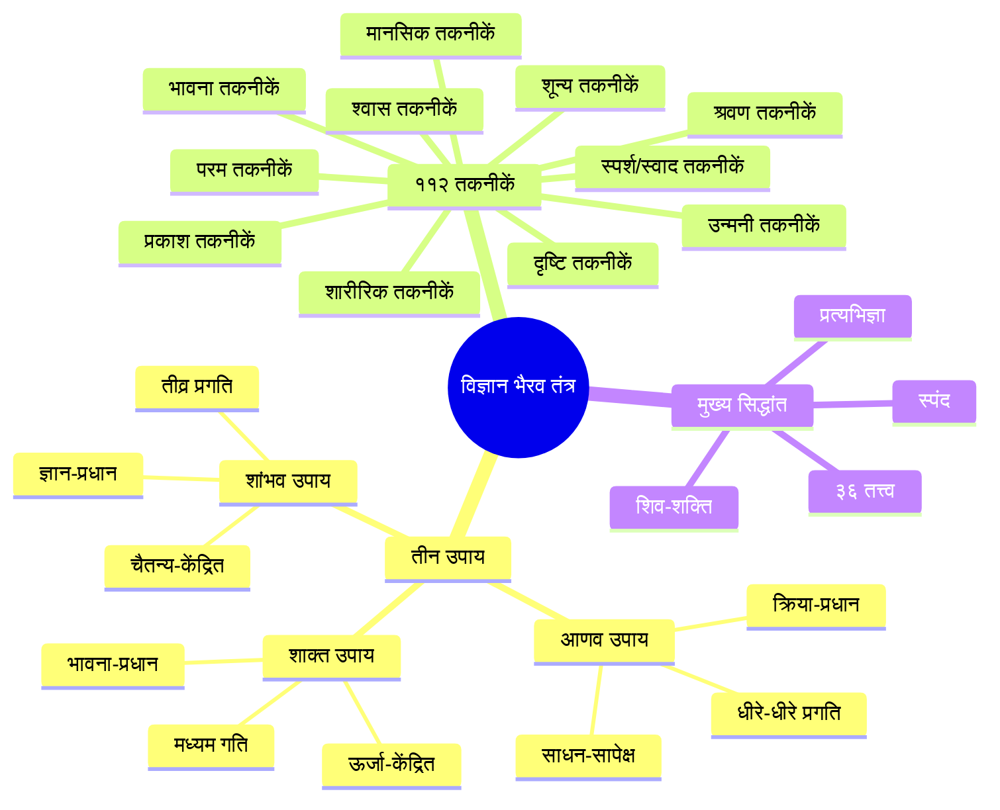
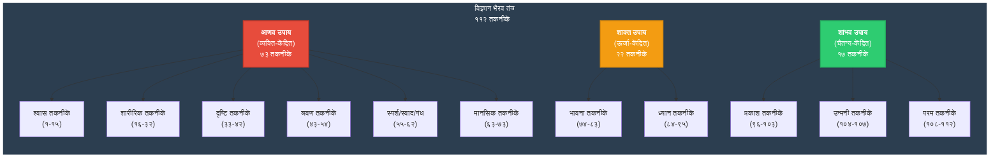
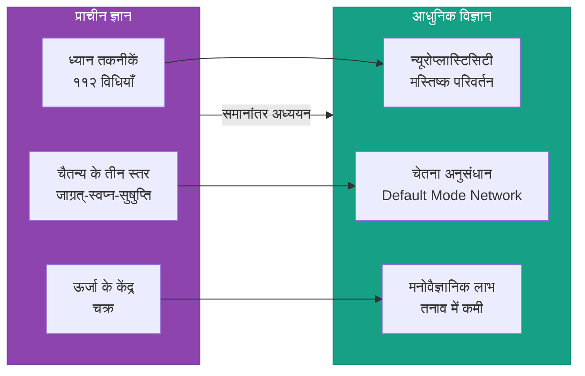
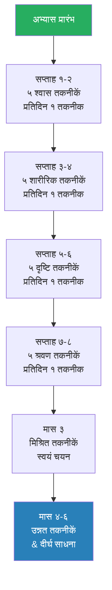
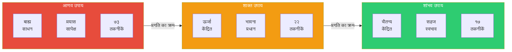
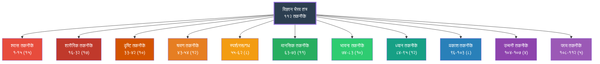

# विज्ञान भैरव तंत्र: ११२ ध्यान तकनीकों का विश्वकोश

> **"यत्र यत्र मनो याति तत्र तत्र शिवः स्मृतः"**
> — जहाँ-जहाँ मन जाता है, वहाँ-वहाँ शिव ही हैं।

## कोर्स का परिचय

विज्ञान भैरव तंत्र (Vigyan Bhairav Tantra) कश्मीर शैव दर्शन का एक अद्वितीय ग्रंथ है जिसमें ११२ ध्यान तकनीकों का संग्रह है। यह कोर्स आपको इस प्राचीन तंत्र ग्रंथ की गहराइयों में ले जाएगा — इसके इतिहास, दर्शन, और प्रत्येक ध्यान तकनीक को विस्तार से समझाएगा।

यह कोर्स पूरी तरह से हिंदी और संस्कृत में है, जिसमें मूल श्लोक संस्कृत में और व्याख्या हिंदी में दी गई है।

### कोर्स की संरचना

यह कोर्स १८ अध्यायों में विभाजित है:

| अध्याय | शीर्षक | विवरण |
|--------|--------|--------|
| ०१ | परिचय: इतिहास और दर्शन | कश्मीर शैव दर्शन का इतिहास, विज्ञान भैरव तंत्र की रचना काल और लेखक |
| ०२ | भैरव-भैरवी संवाद | ग्रंथ का संवाद रूप, भैरवी के ११२ प्रश्न और भैरव के उत्तर |
| ०३ | तंत्र दर्शन के मूल सिद्धांत | ३६ तत्त्व, शिव-शक्ति सिद्धांत, स्पंद और प्रत्यभिज्ञा दर्शन |
| ०४ | ११२ तकनीकों का वर्गीकरण | तीन उपाय (आणव, शाक्त, शांभव) और पाँच मुख्य श्रेणियाँ |
| ०५ | श्वास-प्रश्वास तकनीकें | १५ श्वास-संबंधी ध्यान तकनीकें (प्राणायाम से लेकर केवल कुंभक तक) |
| ०६ | संवेदना और शारीरिक तकनीकें | १७ शारीरिक संवेदनाओं पर आधारित ध्यान तकनीकें |
| ०७ | दृष्टि और बिंदु तकनीकें | १० दृष्टि-संबंधी और बिंदु धारण की तकनीकें |
| ०८ | श्रवण और नाद तकनीकें | १२ श्रवण-संबंधी और नाद-ब्रह्म की तकनीकें |
| ०९ | स्पर्श और स्वाद तकनीकें | ८ स्पर्श, स्वाद और गंध से संबंधित तकनीकें |
| १० | ध्यान और चित्त तकनीकें | १४ मानसिक और ध्यान-केंद्रित तकनीकें |
| ११ | भावना और देवता तकनीकें | ११ भावना, देवता-योग और शून्यता की तकनीकें |
| १२ | प्रकाश और चैतन्य तकनीकें | ८ प्रकाश, चैतन्य और आत्म-बोध की तकनीकें |
| १३ | उन्मनी और सहज अवस्था | ७ उन्मनी और सहज अवस्था में प्रवेश की तकनीकें |
| १४ | शून्य और भ्रमरी तकनीकें | ५ शून्य ध्यान और भ्रमरी जैसी उन्नत तकनीकें |
| १५ | संन्यास और परम तकनीकें | ५ परम या अंतिम तकनीकें — आत्म-समर्पण और पूर्ण विश्रांति |
| १६ | अभ्यास मार्गदर्शिका | प्रतिदिन अभ्यास के लिए मार्गदर्शिका, कैसे चुनें तकनीक |
| १७ | अनुभव और सिद्धियाँ | अभ्यास के दौरान आने वाले अनुभव, सिद्धियाँ और चुनौतियाँ |
| १८ | आधुनिक संदर्भ | वैज्ञानिक शोध, न्यूरोसाइंस, मनोविज्ञान और विज्ञान भैरव तंत्र |

## कोर्स का दर्शन



### यह कोर्स कैसे पढ़ें

यह कोर्स एक व्यवस्थित अध्ययन मार्गदर्शिका है। प्रत्येक अध्याय में निम्नलिखित खंड हैं:

1. **सीखने के उद्देश्य (Learning Objectives)** — प्रत्येक अध्याय की शुरुआत में उद्देश्य जो आपको बताते हैं कि इस अध्याय से आप क्या सीखेंगे।
2. **सिद्धांत (Theory)** — प्रत्येक तकनीक और सिद्धांत का गहन विवरण, मर्मज्ञ व्याख्या।
3. **चित्र और आरेख (Diagrams)** — मर्मज्ञ को समझाने के लिए Mermaid आरेख।
4. **तकनीक विवरण (Technique Details)** — प्रत्येक ध्यान तकनीक का मूल श्लोक, हिंदी अनुवाद, और विस्तृत विधि।
5. **टाइपस्क्रिप्ट कोड (TypeScript Code)** — आधुनिक प्रोग्रामिंग के माध्यम से तकनीकों को समझने के लिए कोड उदाहरण।
6. **सारांश (Summary)** — प्रत्येक अध्याय के मुख्य बिंदुओं का संक्षिप्त सारांश।
7. **प्रश्नोत्तरी (Quiz)** — ५-१० बहुविकल्पीय प्रश्न आपकी समझ को परखने के लिए।
8. **अभ्यास (Exercises)** — व्यावहारिक अभ्यास जो आपको ध्यान तकनीकों का अनुभव कराएंगे।

### किनके लिए है यह कोर्स?

- **साधक (Spiritual Seekers)** — जो ध्यान और आध्यात्मिकता में रुचि रखते हैं
- **योग शिक्षक (Yoga Teachers)** — जो अपने शिक्षण में तंत्र ध्यान को शामिल करना चाहते हैं
- **शोधार्थी (Researchers)** — जो प्राचीन भारतीय दर्शन और चेतना पर शोध कर रहे हैं
- **प्रोग्रामर (Programmers)** — जो तकनीकी दृष्टिकोण से प्राचीन ज्ञान को समझना चाहते हैं
- **मनोवैज्ञानिक (Psychologists)** — जो चेतना की विभिन्न अवस्थाओं में रुचि रखते हैं

### पूर्वापेक्षाएँ (Prerequisites)

- हिंदी भाषा का बुनियादी ज्ञान
- ध्यान और आध्यात्मिकता में रुचि
- कोई पूर्व अनुभव आवश्यक नहीं
- टाइपस्क्रिप्ट को समझने के लिए बुनियादी प्रोग्रामिंग ज्ञान (वैकल्पिक)

## तीन उपायों की संरचना



## संस्कृत पारिभाषिक शब्दावली

| संस्कृत शब्द | लिप्यंतरण | हिंदी अर्थ | तकनीकी अर्थ |
|-------------|-----------|-----------|------------|
| शिव | Śiva | कल्याणस्वरूप | चैतन्य का परम स्रोत, निर्गुण ब्रह्म |
| शक्ति | Śakti | ऊर्जा, सामर्थ्य | गतिशील ब्रह्मांडीय ऊर्जा, शिव की क्रियाशक्ति |
| भैरव | Bhairava | भय-रहित | परम सत्य का भयंकर और करुणामय स्वरूप |
| भैरवी | Bhairavī | भैरव की शक्ति | जिज्ञासु चेतना, साधिका |
| तंत्र | Tantra | तनोति विस्तार | वह शास्त्र जो ज्ञान का विस्तार करे |
| उपाय | Upāya | साधन | आध्यात्मिक साधना की विधि |
| आणव | Āṇava | अणु-संबंधी | जीवात्मा की सीमित दशा से जुड़ा उपाय |
| शाक्त | Śākta | शक्ति-संबंधी | ऊर्जा और भावना पर आधारित उपाय |
| शांभव | Śāmbhava | शंभु-संबंधी | शिव की चैतन्य दशा से जुड़ा उपाय |
| स्पंद | Spanda | कंपन, स्पंदन | ब्रह्मांड की दिव्य स्पंदनशील ऊर्जा |
| प्रत्यभिज्ञा | Pratyabhijñā | पुनर्ज्ञान | अपने वास्तविक स्वरूप की पहचान |
| उन्मनी | Unmanī | मन से परे | विचारों से ऊपर की अवस्था |
| कुंभक | Kumbhaka | श्वास-रोध | श्वास के आने-जाने के बीच का ठहराव |
| नाद | Nāda | ध्वनि | आंतरिक ध्वनि, अनाहत नाद |
| बिंदु | Bindu | बिंदु | एकाग्रता का केंद्रबिंदु, शून्य |
| शून्य | Śūnya | खालीपन | निर्विचार अवस्था, परम शांति |
| चैतन्य | Caitanya | चेतना | जागरूकता, आत्म-प्रकाश |
| मंत्र | Mantra | मनन से त्राण | पवित्र ध्वनि जो चित्त को शुद्ध करे |
| यंत्र | Yantra | आधार | ध्यान के लिए ज्यामितीय आरेख |
| साधक | Sādhaka | अभ्यासी | ध्यान और साधना करने वाला व्यक्ति |

## प्रत्येक तकनीक का प्रारूप

इस कोर्स में प्रत्येक तकनीक को निम्नलिखित प्रारूप में प्रस्तुत किया गया है:

### उदाहरण तकनीक प्रारूप

```
तकनीक क्रमांक: १
उपाय: आणव उपाय
श्रेणी: श्वास तकनीक

मूल श्लोक:
देवी उवाच —
किं तत्त्वं भैरवेदानीं किं कल्पं किं परायणम् ।
किं कल्पं कल्पनारूपं किं देसं किं निकेतनम् ॥

हिंदी अनुवाद:
देवी (भैरवी) ने पूछा — हे भैरव, अब बताइए कि सत्य क्या है?
क्या वह कल्पना है? क्या वह परम आश्रय है?
क्या वह कल्पनारूप है? क्या वह देश (स्थान) से जुड़ा है?
या निकेतन (आश्रय) में है?

विधि:
[तकनीक को करने की विधि]

मर्म:
[गहन व्याख्या और दार्शनिक अर्थ]

चेतावनी:
[किन बातों का ध्यान रखें]
```

## वैज्ञानिक दृष्टिकोण



## विज्ञान भैरव तंत्र का वैश्विक प्रभाव

विज्ञान भैरव तंत्र का प्रभाव केवल भारत तक सीमित नहीं है। इस ग्रंथ ने दुनिया भर के विद्वानों, कलाकारों, वैज्ञानिकों और आध्यात्मिक साधकों को प्रभावित किया है:

- **जिद्दू कृष्णमूर्ति** — उनके शिक्षण में विज्ञान भैरव तंत्र की कई तकनीकों की झलक
- **ओशो (रजनीश)** — उन्होंने इस ग्रंथ पर "विज्ञान भैरव तंत्र" नाम से ११ भागों में प्रवचन दिए
- **लिलियन (Lillian)** — पश्चिमी विद्वान जिन्होंने इसका अंग्रेज़ी अनुवाद किया
- **जौन गरिडो (Jaideva Singh)** — जिन्होंने "Vijñāna Bhairava" नाम से विद्वतापूर्ण अनुवाद प्रकाशित किया
- **पॉल रेप्स (Paul Reps)** — जिन्होंने "Zen Flesh, Zen Bones" में इसका अंश प्रकाशित किया

## आरंभ कैसे करें

### दैनिक अभ्यास योजना



### अभ्यास के सामान्य सिद्धांत

१. नियमितता — प्रतिदिन कम से कम १५ मिनट अभ्यास
२. धैर्य — परिणामों की अपेक्षा न करें, प्रक्रिया का आनंद लें
३. प्रयोग — सभी तकनीकों को आज़माएं, जो सहज लगे उस पर ठहरें
४. दैनंदिनी — प्रतिदिन का अनुभव लिखें
५. मार्गदर्शन — यदि संभव हो तो किसी गुरु या अनुभवी साधक का मार्गदर्शन लें

## टाइपस्क्रिप्ट: कोर्स डैशबोर्ड

प्राचीन ज्ञान को आधुनिक प्रोग्रामिंग से जोड़ने के लिए, हम टाइपस्क्रिप्ट में कोर्स का एक डैशबोर्ड बनाएंगे:

```typescript
/**
 * विज्ञान भैरव तंत्र कोर्स डैशबोर्ड
 * Vijñāna Bhairava Tantra Course Dashboard
 */

// ===== मुख्य डेटा संरचनाएँ =====

/** तकनीक का तीन उपायों में वर्गीकरण */
enum Upaya {
  ANVA = 'आणव उपाय',      // व्यक्ति-केंद्रित
  SHAKTA = 'शाक्त उपाय',    // ऊर्जा-केंद्रित
  SHAMBHAVA = 'शांभव उपाय',  // चैतन्य-केंद्रित
}

/** तकनीक की श्रेणी */
enum TechniqueCategory {
  BREATH = 'श्वास तकनीक',
  BODY = 'शारीरिक तकनीक',
  GAZE = 'दृष्टि तकनीक',
  SOUND = 'श्रवण तकनीक',
  TOUCH = 'स्पर्श/स्वाद/गंध तकनीक',
  MENTAL = 'मानसिक तकनीक',
  EMOTION = 'भावना तकनीक',
  MEDITATION = 'ध्यान तकनीक',
  LIGHT = 'प्रकाश तकनीक',
  UNMANI = 'उन्मनी तकनीक',
  VOID = 'शून्य तकनीक',
  ULTIMATE = 'परम तकनीक',
}

/** एकल ध्यान तकनीक का प्रतिरूप */
interface MeditationTechnique {
  id: number;                           // तकनीक क्रमांक (१-११२)
  sanskritShloka: string;               // मूल संस्कृत श्लोक
  hindiTranslation: string;             // हिंदी अनुवाद
  upaya: Upaya;                         // उपाय वर्गीकरण
  category: TechniqueCategory;          // श्रेणी
  titleHindi: string;                   // हिंदी शीर्षक
  titleEnglish: string;                 // अंग्रेज़ी शीर्षक
  duration: number;                     // अनुशंसित समय (मिनट)
}

/** अभ्यास सत्र */
interface PracticeSession {
  date: Date;
  techniqueId: number;
  duration: number;                     // मिनट
  notes: string;
  experienceLevel: 1 | 2 | 3 | 4 | 5;  // अनुभव स्तर
}

/** कोर्स प्रगति */
interface CourseProgress {
  chaptersCompleted: number[];
  techniquesAttempted: number[];
  totalPracticeMinutes: number;
  sessions: PracticeSession[];
}

// ===== कोर्स डैशबोर्ड वर्ग =====

class VigyanBhairavCourse {
  private readonly totalChapters = 18;
  private readonly totalTechniques = 112;
  private readonly techniques: MeditationTechnique[] = [];
  private progress: CourseProgress = {
    chaptersCompleted: [],
    techniquesAttempted: [],
    totalPracticeMinutes: 0,
    sessions: [],
  };

  constructor() {
    this.initializeTechniques();
  }

  /** ११२ तकनीकों का डेटा प्रारंभ */
  private initializeTechniques(): void {
    // यहाँ हम प्रतीकात्मक रूप में कुछ तकनीकें जोड़ते हैं
    this.techniques.push({
      id: 1,
      sanskritShloka: 'शिव उवाच — रूपं निरूपणं कार्यं दृश्यं द्रष्टा च यद्भवेत्। एकीभावस्तयोर्योगाद्ब्रह्मैकत्वं प्रपद्यते॥',
      hindiTranslation: 'शिव कहते हैं — रूप, निरूपण, कार्य, दृश्य और द्रष्टा — जब ये सब एक हो जाते हैं, उस योग से ब्रह्म की एकता प्राप्त होती है।',
      upaya: Upaya.ANVA,
      category: TechniqueCategory.BREATH,
      titleHindi: 'श्वास-प्रश्वास ध्यान',
      titleEnglish: 'Breath In-Out Meditation',
      duration: 15,
    });
    
    // तकनीक २ जोड़ें
    this.techniques.push({
      id: 2,
      sanskritShloka: 'पूरकान्ते तु कर्तव्यं कुम्भकान्ते तु चिन्तनम्। रेचकान्ते तु कर्तव्यं ध्यानं त्रिधा विधीयते॥',
      hindiTranslation: 'पूरक (श्वास-भरने) के अंत में, कुंभक (रोक) के अंत में, और रेचक (श्वास-निकास) के अंत में — तीनों समय ध्यान करना चाहिए।',
      upaya: Upaya.ANVA,
      category: TechniqueCategory.BREATH,
      titleHindi: 'श्वास के तीन अंत',
      titleEnglish: 'Three Ends of Breath',
      duration: 10,
    });

    // ... इसी प्रकार सभी ११२ तकनीकें होंगी
  }

  /** कुल उपलब्ध तकनीकें */
  getTechniqueCount(): number {
    return this.totalTechniques;
  }

  /** किसी विशिष्ट तकनीक को प्राप्त करें */
  getTechnique(id: number): MeditationTechnique | undefined {
    return this.techniques.find(t => t.id === id);
  }

  /** उपाय के अनुसार तकनीकें प्राप्त करें */
  getTechniquesByUpaya(upaya: Upaya): MeditationTechnique[] {
    return this.techniques.filter(t => t.upaya === upaya);
  }

  /** श्रेणी के अनुसार तकनीकें प्राप्त करें */
  getTechniquesByCategory(category: TechniqueCategory): MeditationTechnique[] {
    return this.techniques.filter(t => t.category === category);
  }

  /** यादृच्छिक तकनीक चुनें (दैनिक सुझाव के लिए) */
  getRandomTechnique(): MeditationTechnique {
    const index = Math.floor(Math.random() * this.techniques.length);
    return this.techniques[index];
  }

  /** अभ्यास सत्र लॉग करें */
  logPracticeSession(session: PracticeSession): void {
    this.progress.sessions.push(session);
    this.progress.totalPracticeMinutes += session.duration;
    
    if (!this.progress.techniquesAttempted.includes(session.techniqueId)) {
      this.progress.techniquesAttempted.push(session.techniqueId);
    }
  }

  /** अध्याय पूर्ण चिह्नित करें */
  markChapterComplete(chapterId: number): void {
    if (!this.progress.chaptersCompleted.includes(chapterId)) {
      this.progress.chaptersCompleted.push(chapterId);
    }
  }

  /** कोर्स प्रगति प्रतिशत */
  getProgressPercentage(): number {
    const chaptersPercent = 
      (this.progress.chaptersCompleted.length / this.totalChapters) * 50;
    const techniquesPercent = 
      (this.progress.techniquesAttempted.length / this.totalTechniques) * 50;
    return Math.round(chaptersPercent + techniquesPercent);
  }

  /** अब तक का कुल अभ्यास समय */
  getTotalPracticeMinutes(): number {
    return this.progress.totalPracticeMinutes;
  }

  /** सप्ताह का औसत अभ्यास */
  getAverageWeeklyPractice(): number {
    if (this.progress.sessions.length === 0) return 0;
    
    const firstDate = this.progress.sessions[0].date;
    const lastDate = this.progress.sessions[this.progress.sessions.length - 1].date;
    const weeks = (lastDate.getTime() - firstDate.getTime()) / (7 * 24 * 60 * 60 * 1000);
    
    if (weeks === 0) return this.progress.totalPracticeMinutes;
    
    return Math.round(this.progress.totalPracticeMinutes / weeks);
  }

  /** सर्वाधिक अभ्यास की गई तकनीक */
  getMostPracticedTechnique(): { technique: MeditationTechnique | undefined; count: number } {
    const counts = new Map<number, number>();
    
    for (const session of this.progress.sessions) {
      counts.set(session.techniqueId, (counts.get(session.techniqueId) || 0) + 1);
    }
    
    let maxCount = 0;
    let maxId = -1;
    
    for (const [id, count] of counts) {
      if (count > maxCount) {
        maxCount = count;
        maxId = id;
      }
    }
    
    return {
      technique: this.getTechnique(maxId),
      count: maxCount,
    };
  }

  /** कोर्स पूर्णता रिपोर्ट */
  generateReport(): string {
    const report = `
╔══════════════════════════════════════════╗
║   विज्ञान भैरव तंत्र प्रगति रिपोर्ट     ║
╠══════════════════════════════════════════╣
║ कुल प्रगति: ${this.getProgressPercentage()}%                      ║
║ पूर्ण अध्याय: ${this.progress.chaptersCompleted.length}/${this.totalChapters}                 ║
║ अभ्यस्त तकनीकें: ${this.progress.techniquesAttempted.length}/${this.totalTechniques}               ║
║ कुल अभ्यास: ${this.progress.totalPracticeMinutes} मिनट             ║
║ साप्ताहिक औसत: ${this.getAverageWeeklyPractice()} मिनट              ║
╚══════════════════════════════════════════╝`;
    return report;
  }
}

// ===== उपयोग उदाहरण =====

function main(): void {
  const course = new VigyanBhairavCourse();
  
  console.log('विज्ञान भैरव तंत्र कोर्स डैशबोर्ड');
  console.log('================================\n');
  
  // कुछ अभ्यास सत्र लॉग करें
  course.logPracticeSession({
    date: new Date(),
    techniqueId: 1,
    duration: 15,
    notes: 'प्रारंभिक अभ्यास अच्छा रहा, मन भटका किंतु श्वास पर वापस आ गया',
    experienceLevel: 3,
  });
  
  course.markChapterComplete(1);
  course.markChapterComplete(2);
  
  // रिपोर्ट दिखाएं
  console.log(course.generateReport());
  
  // यादृच्छिक तकनीक सुझाव
  const suggestion = course.getRandomTechnique();
  console.log(`\nआज की सुझाई गई तकनीक #${suggestion.id}: ${suggestion.titleHindi}`);
  console.log(`उपाय: ${suggestion.upaya}`);
  console.log(`अनुशंसित समय: ${suggestion.duration} मिनट`);
}

main();

export {
  VigyanBhairavCourse,
  Upaya,
  TechniqueCategory,
  MeditationTechnique,
  PracticeSession,
  CourseProgress,
};
```

## कोर्स का उपयोग कैसे करें — तकनीकी विवरण

### डेवलपर के लिए निर्देश

इस कोर्स की फ़ाइलें निम्नलिखित प्रारूप में हैं:

```
vigyan-bhairav-tantra/
├── index.md                 # कोर्स का परिचय और अवलोकन
├── 01-parichay.md           # अध्याय १ — परिचय
├── 02-bhairavi-samvad.md    # अध्याय २ — संवाद
├── 03-tantra-darshan.md     # अध्याय ३ — तंत्र दर्शन
├── 04-112-classification.md # अध्याय ४ — तकनीक वर्गीकरण
├── 05-...                   # शेष अध्याय
└── ...
```

### शैली निर्देश

- सभी मुख्य सामग्री हिंदी और संस्कृत में (देवनागरी लिपि)
- महत्वपूर्ण अवधारणाओं के लिए प्रथम उपयोग पर अंग्रेज़ी कोष्ठक में
- कोड उदाहरण टाइपस्क्रिप्ट में
- आरेख Mermaid प्रारूप में
- उद्धरण और श्लोक > (blockquote) में

## FAQ — अक्सर पूछे जाने वाले प्रश्न

### १. क्या मैं बिना किसी अनुभव के यह कोर्स कर सकता हूँ?

हाँ, यह कोर्स शुरुआती से लेकर उन्नत साधकों तक सभी के लिए है। प्रत्येक तकनीक को चरण-दर-चरण समझाया गया है।

### २. क्या यह कोई धार्मिक ग्रंथ है?

विज्ञान भैरव तंत्र एक आध्यात्मिक ग्रंथ है जो ध्यान और चेतना पर केंद्रित है। यह किसी विशेष धर्म से संबंधित नहीं बल्कि सार्वभौमिक है। कोई भी व्यक्ति इन तकनीकों का अभ्यास कर सकता है।

### ३. क्या मुझे किसी गुरु की आवश्यकता है?

जबकि गुरु का मार्गदर्शन सहायक हो सकता है, यह कोर्स इस तरह डिज़ाइन किया गया है कि आप स्व-अध्ययन द्वारा भी इसे समझ और अभ्यास कर सकते हैं।

### ४. मैं प्रतिदिन कितना समय दूँ?

प्रारंभ में प्रतिदिन १५-२० मिनट पर्याप्त है। आप अपनी सुविधानुसार समय बढ़ा सकते हैं।

### ५. क्या मैं सभी ११२ तकनीकें सीख सकता हूँ?

हाँ, यह कोर्स सभी ११२ तकनीकों को विस्तार से समझाता है। अभ्यास के लिए आप कोई भी तकनीक चुन सकते हैं जो आपको उपयुक्त लगे।

### ६. क्या टाइपस्क्रिप्ट कोड को समझना अनिवार्य है?

नहीं, कोड वैकल्पिक है। जो लोग प्रोग्रामिंग में रुचि नहीं रखते वे केवल आध्यात्मिक और दार्शनिक सामग्री पढ़ सकते हैं।

### ७. क्या इस कोर्स में कोई प्रमाणपत्र मिलता है?

यह कोर्स आपकी व्यक्तिगत साधना और ज्ञान वृद्धि के लिए है। कोई औपचारिक प्रमाणपत्र नहीं दिया जाता।

### ८. मैं किसी अभ्यास में कठिनाई महसूस करूँ तो क्या करूँ?

प्रत्येक तकनीक में सावधानियाँ और वैकल्पिक विधियाँ दी गई हैं। यदि कोई तकनीक कठिन लगे, तो उसे छोड़कर किसी और तकनीक का अभ्यास करें।

## चेतावनी और सावधानियाँ

```
╔══════════════════════════════════════════════════════════════╗
║                     महत्वपूर्ण चेतावनी                       ║
╠══════════════════════════════════════════════════════════════╣
║ १. ध्यान गहन अभ्यास है — धीरे-धीरे आगे बढ़ें              ║
║ २. मानसिक या शारीरिक बीमारी होने पर चिकित्सक से परामर्श   ║
║ ३. श्वास संबंधी तकनीकों में बलपूर्वक कुंभक न करें         ║
║ ४. यदि कोई तकनीक असुविधा पैदा करे तो तुरंत रोक दें        ║
║ ५. यह कोर्स चिकित्सा का विकल्प नहीं है                    ║
╚══════════════════════════════════════════════════════════════╝
```

## तीन उपायों का विस्तृत विवरण

विज्ञान भैरव तंत्र में तीन उपायों (Upayas) का वर्णन है। ये तीन उपाय साधक की क्षमता और स्वभाव के अनुसार मार्ग प्रदान करते हैं:

### १. आणव उपाय (Āṇava Upāya) — क्रिया-प्रधान मार्ग

आणव उपाय का अर्थ है "अणु का मार्ग" — जहाँ साधक अपनी सीमित व्यक्तिगत चेतना (अणु) से शुरुआत करता है। यह क्रिया-प्रधान मार्ग है जिसमें श्वास, शरीर, इंद्रियों पर ध्यान दिया जाता है।

**विशेषताएँ:**
- क्रिया और प्रयास पर बल
- बाह्य साधनों का उपयोग (श्वास, शरीर, दृष्टि)
- धीरे-धीरे प्रगति
- ७३ तकनीकें इस श्रेणी में
- शुरुआती साधकों के लिए उपयुक्त

**उदाहरण तकनीक:** श्वास-प्रश्वास पर ध्यान, शरीर की संवेदनाओं पर ध्यान, किसी बिंदु पर दृष्टि स्थिर करना

### २. शाक्त उपाय (Śākta Upāya) — ऊर्जा-प्रधान मार्ग

शाक्त उपाय में साधक ऊर्जा और भावना के माध्यम से आगे बढ़ता है। यह मार्ग शक्ति (ऊर्जा) को केंद्र में रखता है।

**विशेषताएँ:**
- भावना और ऊर्जा पर बल
- मध्यम प्रयास की आवश्यकता
- चित्त की एकाग्रता स्वाभाविक रूप से विकसित होती है
- २२ तकनीकें इस श्रेणी में
- मध्यम स्तर के साधकों के लिए उपयुक्त

**उदाहरण तकनीक:** भक्ति-भाव से ध्यान, चक्रों पर ध्यान, नाद-ब्रह्म का अभ्यास

### ३. शांभव उपाय (Śāmbhava Upāya) — चैतन्य-प्रधान मार्ग

शांभव उपाय सर्वोच्च मार्ग है जहाँ साधक सीधे चैतन्य (चेतना) पर ध्यान करता है। इसमें किसी क्रिया या भावना की आवश्यकता नहीं — केवल साक्षी-भाव।

**विशेषताएँ:**
- शुद्ध चैतन्य पर बल
- न्यूनतम प्रयास या बिना प्रयास का मार्ग
- तीव्र प्रगति (उपयुक्त साधक के लिए)
- १७ तकनीकें इस श्रेणी में
- उन्नत साधकों के लिए उपयुक्त

**उदाहरण तकनीक:** "मैं शिव हूँ" का भाव, दो विचारों के बीच का खाली स्थान, अचानक साक्षात्कार



## अध्याय-वार विस्तार

### अध्याय १-४: आधारभूत

| अध्याय | शीर्षक | मुख्य विषय | तकनीकों की संख्या |
|--------|--------|-----------|:----------------:|
| ०१ | परिचय: इतिहास और दर्शन | कश्मीर शैव का इतिहास, ग्रंथ की रचना | — |
| ०२ | भैरव-भैरवी संवाद | संवाद शैली, ११२ प्रश्न, चार पीठ | — |
| ०३ | तंत्र दर्शन के मूल सिद्धांत | ३६ तत्त्व, शिव-शक्ति, स्पंद | — |
| ०४ | ११२ तकनीकों का वर्गीकरण | तीन उपाय, पाँच श्रेणियाँ | ११२ |

### अध्याय ५-१५: तकनीक विवरण

| अध्याय | शीर्षक | तकनीक संख्या | तकनीकों की संख्या |
|--------|--------|:------------:|:----------------:|
| ०५ | श्वास-प्रश्वास तकनीकें | १-१५ | १५ |
| ०६ | संवेदना और शारीरिक तकनीकें | १६-३२ | १७ |
| ०७ | दृष्टि और बिंदु तकनीकें | ३३-४२ | १० |
| ०८ | श्रवण और नाद तकनीकें | ४३-५४ | १२ |
| ०९ | स्पर्श और स्वाद तकनीकें | ५५-६२ | ८ |
| १० | ध्यान और चित्त तकनीकें | ६३-७३ | ११ |
| ११ | भावना और देवता तकनीकें | ७४-८३ | १० |
| १२ | प्रकाश और चैतन्य तकनीकें | ८४-९५ | १२ |
| १३ | उन्मनी और सहज अवस्था | ९६-१०३ | ८ |
| १४ | शून्य और भ्रमरी तकनीकें | १०४-१०७ | ४ |
| १५ | संन्यास और परम तकनीकें | १०८-११२ | ५ |

### अध्याय १६-१८: अभ्यास और समीक्षा

| अध्याय | शीर्षक | मुख्य विषय |
|--------|--------|-----------|
| १६ | अभ्यास मार्गदर्शिका | प्रतिदिन अभ्यास प्रणाली, तकनीक चयन, दैनंदिनी |
| १७ | अनुभव और सिद्धियाँ | अभ्यास के चरण, चुनौतियाँ, वैज्ञानिक व्याख्या |
| १८ | आधुनिक संदर्भ | तंत्रिका विज्ञान, मनोविज्ञान, समकालीन प्रासंगिकता |

## विज्ञान भैरव तंत्र की ११२ तकनीकों का सारांश



## संस्कृत उच्चारण गाइड

इस कोर्स के लिए संस्कृत के कुछ महत्वपूर्ण वर्णों के उच्चारण:

| वर्ण | उच्चारण | उदाहरण शब्द | अर्थ |
|------|---------|-------------|------|
| श (śa) | तालव्य 'श' | शिव, शक्ति | कल्याण, ऊर्जा |
| ष (ṣa) | मूर्धन्य 'ष' | सुषुम्ना, त्रिष्टुभ् | मेरुदंड, छंद |
| स (sa) | दंत्य 'स' | स्पंद, सत्त्व | स्पंदन, सत्ता |
| ह (ha) | कंठ्य 'ह' | हृदयम्, हंस | हृदय, आत्मा |
| ण (ṇa) | मूर्धन्य 'ण' | आणव, प्राण | अणु-संबंधी, जीवन-शक्ति |
| ञ (ña) | तालव्य 'ञ' | प्रज्ञा, ज्ञान | बुद्धि, ज्ञान |
| ं (anusvāra) | नासिक्य अनुस्वार | संस्कृतम्, तंत्रम् | संस्कृत, तंत्र |

### श्लोक पढ़ने का तरीका

संस्कृत श्लोकों को पढ़ते समय ध्यान रखें:

१. **संधि** — दो शब्दों के मेल से उत्पन्न परिवर्तन
२. **समास** — दो या अधिक शब्दों का संयोग
३. **विभक्ति** — कारक चिह्न (प्रथमा से सप्तमी तक)
४. **वचन** — एकवचन, द्विवचन, बहुवचन
५. **लिंग** — पुल्लिंग, स्त्रीलिंग, नपुंसकलिंग

## टाइपस्क्रिप्ट: ध्यान अभ्यास टाइमर

```typescript
/**
 * विज्ञान भैरव तंत्र — ध्यान अभ्यास टाइमर
 * VBT Meditation Practice Timer
 */

interface TimerConfig {
  techniqueName: string;
  totalMinutes: number;
  intervalBellMinutes: number;
  preparationBell: boolean;
  closingBell: boolean;
}

type TimerState = 'idle' | 'preparation' | 'running' | 'paused' | 'completed' | 'cancelled';

interface TimerStatus {
  state: TimerState;
  elapsedSeconds: number;
  remainingSeconds: number;
  currentInterval: number;
  totalIntervals: number;
}

class MeditationTimer {
  private config: TimerConfig;
  private state: TimerState = 'idle';
  private elapsedSeconds = 0;
  private remainingSeconds = 0;
  private currentInterval = 0;
  private totalIntervals = 0;
  private timerId: ReturnType<typeof setInterval> | null = null;
  private onTickCallback: ((status: TimerStatus) => void) | null = null;
  private onCompleteCallback: (() => void) | null = null;
  
  constructor(config: TimerConfig) {
    this.config = config;
    this.totalIntervals = Math.floor(config.totalMinutes / config.intervalBellMinutes);
  }

  /** टाइमर शुरू करें */
  start(): void {
    if (this.state !== 'idle' && this.state !== 'paused') {
      throw new Error('टाइमर पहले से चल रहा है');
    }

    if (this.state === 'idle') {
      this.elapsedSeconds = 0;
      this.remainingSeconds = this.config.totalMinutes * 60;
      this.currentInterval = 0;
      
      // प्रारंभिक तैयारी (१० सेकंड)
      if (this.config.preparationBell) {
        this.state = 'preparation';
        this.notifyTick();
        
        setTimeout(() => {
          this.state = 'running';
          this.startTimer();
        }, 10000);
        return;
      }
    }
    
    this.state = 'running';
    this.startTimer();
  }

  /** आंतरिक टाइमर प्रारंभ */
  private startTimer(): void {
    this.timerId = setInterval(() => {
      this.elapsedSeconds++;
      this.remainingSeconds--;
      
      // इंटरवल बेल की जाँच
      const elapsedMinutes = this.elapsedSeconds / 60;
      const expectedInterval = Math.floor(elapsedMinutes / this.config.intervalBellMinutes);
      
      if (expectedInterval > this.currentInterval) {
        this.currentInterval = expectedInterval;
        this.playBell();
      }
      
      this.notifyTick();
      
      // समय समाप्त
      if (this.remainingSeconds <= 0) {
        this.complete();
      }
    }, 1000);
  }

  /** टाइमर रोकें */
  pause(): void {
    if (this.state === 'running') {
      this.state = 'paused';
      if (this.timerId) {
        clearInterval(this.timerId);
        this.timerId = null;
      }
      this.notifyTick();
    }
  }

  /** टाइमर पुनः शुरू करें */
  resume(): void {
    if (this.state === 'paused') {
      this.state = 'running';
      this.startTimer();
    }
  }

  /** टाइमर रद्द करें */
  cancel(): void {
    if (this.timerId) {
      clearInterval(this.timerId);
      this.timerId = null;
    }
    this.state = 'cancelled';
    this.notifyTick();
  }

  /** टाइमर पूरा */
  private complete(): void {
    if (this.timerId) {
      clearInterval(this.timerId);
      this.timerId = null;
    }
    this.state = 'completed';
    
    if (this.config.closingBell) {
      this.playBell();
    }
    
    this.notifyTick();
    if (this.onCompleteCallback) {
      this.onCompleteCallback();
    }
  }

  /** घंटी बजाएं */
  private playBell(): void {
    console.log('🔔 ध्यान घंटी — ' + new Date().toLocaleTimeString('hi-IN'));
    // वास्तविक एप्लिकेशन में यहाँ ऑडियो फ़ाइल बजेगी
  }

  /** टिक कॉलबैक */
  onTick(callback: (status: TimerStatus) => void): void {
    this.onTickCallback = callback;
  }

  /** पूर्णता कॉलबैक */
  onComplete(callback: () => void): void {
    this.onCompleteCallback = callback;
  }

  /** वर्तमान स्थिति सूचना */
  private notifyTick(): void {
    if (this.onTickCallback) {
      this.onTickCallback({
        state: this.state,
        elapsedSeconds: this.elapsedSeconds,
        remainingSeconds: this.remainingSeconds,
        currentInterval: this.currentInterval,
        totalIntervals: this.totalIntervals,
      });
    }
  }

  /** समय को प्रारूपित करें */
  static formatTime(seconds: number): string {
    const m = Math.floor(seconds / 60);
    const s = seconds % 60;
    return `${m.toString().padStart(2, '0')}:${s.toString().padStart(2, '0')}`;
  }

  /** ध्यान का चरण बताएं */
  getMeditationPhase(): string {
    const totalSeconds = this.config.totalMinutes * 60;
    const progress = this.elapsedSeconds / totalSeconds;
    
    if (progress < 0.1) return 'प्रारंभ — शरीर को स्थिर करें';
    if (progress < 0.25) return 'प्रवेश — श्वास पर ध्यान केंद्रित करें';
    if (progress < 0.5) return 'गहराई — मन को शांत होने दें';
    if (progress < 0.75) return 'स्थिरता — चैतन्य में विश्राम';
    if (progress < 0.9) return 'एकाग्रता — शिव-भाव में स्थिति';
    return 'समापन — धीरे-धीरे वापस लौटें';
  }

  /** अभ्यास सत्र का सारांश */
  getSessionSummary(): string {
    const m = Math.floor(this.elapsedSeconds / 60);
    const s = this.elapsedSeconds % 60;
    return `
╔════════════════════════════════╗
║   ध्यान अभ्यास सारांश          ║
╠════════════════════════════════╣
║ तकनीक: ${this.config.techniqueName.padEnd(20)} ║
║ अवधि: ${m} मिनट ${s} सेकंड               ║
║ पूर्ण हुआ: ${new Date().toLocaleString('hi-IN')}  ║
╚════════════════════════════════╝`;
  }
}

// ===== उपयोग उदाहरण =====

function demonstrateMeditationTimer(): void {
  // श्वास ध्यान के लिए टाइमर
  const breathMeditation = new MeditationTimer({
    techniqueName: 'श्वास-प्रश्वास ध्यान (१)',
    totalMinutes: 15,
    intervalBellMinutes: 5,
    preparationBell: true,
    closingBell: true,
  });

  breathMeditation.onTick((status) => {
    const time = MeditationTimer.formatTime(status.remainingSeconds);
    const phase = breathMeditation.getMeditationPhase();
    const bars = '█'.repeat(Math.floor((1 - status.remainingSeconds / (15 * 60)) * 20)) +
                 '░'.repeat(20 - Math.floor((1 - status.remainingSeconds / (15 * 60)) * 20));
    
    if (status.elapsedSeconds % 10 === 0) { // हर १० सेकंड में अपडेट
      console.clear();
      console.log(`\n🧘 ${breathMeditation.getMeditationPhase()}`);
      console.log(`⏱️ समय: ${time} बाकी`);
      console.log(`📊 ${bars}`);
      console.log(`🔔 अगली घंटी: ${status.currentInterval + 1}/${status.totalIntervals}`);
    }
  });

  breathMeditation.onComplete(() => {
    console.log(breathMeditation.getSessionSummary());
  });

  breathMeditation.start();
}

// निर्यात
export { MeditationTimer, TimerConfig, TimerState, TimerStatus };
```

## अभ्यास दैनंदिनी (Practice Journal)

एक अच्छा साधक अपने अभ्यास का रिकॉर्ड रखता है। यहाँ एक टाइपस्क्रिप्ट-आधारित अभ्यास जर्नल दिया गया है:

```typescript
/**
 * विज्ञान भैरव तंत्र — अभ्यास दैनंदिनी
 * VBT Practice Journal
 */

interface JournalEntry {
  date: Date;
  techniqueId: number;
  techniqueName: string;
  duration: number;           // मिनट
  focusLevel: 1 | 2 | 3 | 4 | 5 | 6 | 7 | 8 | 9 | 10;
  distractions: string;
  experiences: string;
  insights: string;
  moodBefore: string;
  moodAfter: string;
}

interface JournalSummary {
  totalEntries: number;
  totalPracticeMinutes: number;
  averageFocus: number;
  mostPracticedTechnique: string;
  longestStreak: number;
  currentStreak: number;
  bestTimeOfDay: string;
}

class PracticeJournal {
  private entries: JournalEntry[] = [];

  /** नया प्रवेश जोड़ें */
  addEntry(entry: JournalEntry): void {
    this.entries.push(entry);
  }

  /** आज के प्रवेश प्राप्त करें */
  getTodayEntries(): JournalEntry[] {
    const today = new Date();
    return this.entries.filter(e => 
      e.date.getDate() === today.getDate() &&
      e.date.getMonth() === today.getMonth() &&
      e.date.getFullYear() === today.getFullYear()
    );
  }

  /** सप्ताह के प्रवेश */
  getThisWeekEntries(): JournalEntry[] {
    const now = new Date();
    const weekAgo = new Date(now.getTime() - 7 * 24 * 60 * 60 * 1000);
    return this.entries.filter(e => e.date >= weekAgo);
  }

  /** लगातार अभ्यास (Streak) की गणना */
  calculateStreak(): { current: number; longest: number } {
    if (this.entries.length === 0) return { current: 0, longest: 0 };

    // तिथियों को क्रमबद्ध करें और अद्वितीय बनाएं
    const dates = [...new Set(
      this.entries.map(e => e.date.toLocaleDateString())
    )].sort((a, b) => new Date(b).getTime() - new Date(a).getTime());

    let currentStreak = 1;
    let longestStreak = 1;
    let tempStreak = 1;

    for (let i = 1; i < dates.length; i++) {
      const curr = new Date(dates[i - 1]);
      const prev = new Date(dates[i]);
      const diffDays = (curr.getTime() - prev.getTime()) / (24 * 60 * 60 * 1000);

      if (diffDays <= 1.5) { // लगभग १ दिन का अंतर
        tempStreak++;
        longestStreak = Math.max(longestStreak, tempStreak);
        if (i === 1) currentStreak = tempStreak;
      } else {
        tempStreak = 1;
        if (i === 1) currentStreak = 1;
      }
    }

    // वर्तमान स्ट्रीक की जाँच (कल या आज का अभ्यास)
    const lastDate = new Date(dates[0]);
    const now = new Date();
    const daysSinceLast = (now.getTime() - lastDate.getTime()) / (24 * 60 * 60 * 1000);
    
    if (daysSinceLast > 1.5) {
      currentStreak = 0;
    }

    return { current: currentStreak, longest: longestStreak };
  }

  /** सबसे अधिक अभ्यास की गई तकनीक */
  getMostPracticedTechnique(): { name: string; count: number } {
    const counts = new Map<string, number>();
    
    for (const entry of this.entries) {
      counts.set(entry.techniqueName, (counts.get(entry.techniqueName) || 0) + 1);
    }

    let maxCount = 0;
    let maxName = '';
    
    for (const [name, count] of counts) {
      if (count > maxCount) {
        maxCount = count;
        maxName = name;
      }
    }

    return { name: maxName, count: maxCount };
  }

  /** सर्वश्रेष्ठ समय का पता लगाएं */
  getBestTimeOfDay(): string {
    const timeSlots = new Map<string, number[]>();
    
    for (const entry of this.entries) {
      const hour = entry.date.getHours();
      let slot: string;
      
      if (hour >= 4 && hour < 8) slot = 'सुबह (४-८)';
      else if (hour >= 8 && hour < 12) slot = 'दोपहर (८-१२)';
      else if (hour >= 12 && hour < 16) slot = 'अपराह्न (१२-४)';
      else if (hour >= 16 && hour < 20) slot = 'शाम (४-८)';
      else slot = 'रात (८-१२)';
      
      if (!timeSlots.has(slot)) timeSlots.set(slot, []);
      timeSlots.get(slot)!.push(entry.focusLevel);
    }

    let bestSlot = '';
    let bestAvg = 0;
    
    for (const [slot, ratings] of timeSlots) {
      const avg = ratings.reduce((a, b) => a + b, 0) / ratings.length;
      if (avg > bestAvg) {
        bestAvg = avg;
        bestSlot = slot;
      }
    }

    return `${bestSlot} — औसत ध्यान स्तर: ${bestAvg.toFixed(1)}/१०`;
  }

  /** पूर्ण सारांश रिपोर्ट */
  generateSummary(): JournalSummary {
    const streak = this.calculateStreak();
    const topTechnique = this.getMostPracticedTechnique();
    const bestTime = this.getBestTimeOfDay();
    
    return {
      totalEntries: this.entries.length,
      totalPracticeMinutes: this.entries.reduce((sum, e) => sum + e.duration, 0),
      averageFocus: Math.round(
        this.entries.reduce((sum, e) => sum + e.focusLevel, 0) / this.entries.length
      ),
      mostPracticedTechnique: topTechnique.name,
      longestStreak: streak.longest,
      currentStreak: streak.current,
      bestTimeOfDay: bestTime,
    };
  }

  /** रिपोर्ट प्रिंट करें */
  printSummary(): void {
    const summary = this.generateSummary();
    console.log(`
╔══════════════════════════════════════════╗
║     विज्ञान भैरव तंत्र — अभ्यास रिपोर्ट   ║
╠══════════════════════════════════════════╣
║ कुल अभ्यास दिन: ${summary.totalEntries}                       ║
║ कुल अभ्यास समय: ${summary.totalPracticeMinutes} मिनट             ║
║ औसत एकाग्रता: ${summary.averageFocus}/१०                        ║
║ सर्वाधिक अभ्यास: ${summary.mostPracticedTechnique}  ║
║ सबसे लंबा स्ट्रीक: ${summary.longestStreak} दिन                  ║
║ वर्तमान स्ट्रीक: ${summary.currentStreak} दिन                    ║
║ सर्वश्रेष्ठ समय: ${summary.bestTimeOfDay}  ║
╚══════════════════════════════════════════╝`);
  }
}

// ===== उपयोग उदाहरण =====
const journal = new PracticeJournal();

journal.addEntry({
  date: new Date(),
  techniqueId: 1,
  techniqueName: 'श्वास-प्रश्वास ध्यान',
  duration: 15,
  focusLevel: 7,
  distractions: 'कुछ बाहरी शोर, पर जल्दी वापस आ गया',
  experiences: 'श्वास स्वाभाविक रूप से गहरी हुई, शरीर हल्का लगा',
  insights: 'श्वास पर ध्यान देने से मन स्वतः शांत हो जाता है',
  moodBefore: 'थोड़ा तनाव',
  moodAfter: 'शांत और तरोताजा',
});

journal.printSummary();

export { PracticeJournal, JournalEntry, JournalSummary };
```

## अभ्यास के लिए सामान्य सुझाव

### शारीरिक तैयारी
- सुबह जल्दी (ब्रह्म मुहूर्त — ४-६ बजे) का समय सर्वश्रेष्ठ
- खाली पेट या हल्का भोजन करके
- साफ़, शांत स्थान में बैठें
- पद्मासन, सिद्धासन या सुखासन में बैठें
- रीढ़ सीधी रखें, शरीर शिथिल

### मानसिक तैयारी
- अभ्यास से पहले ५ गहरी श्वास लें
- संकल्प करें: "मैं अगले [समय] तक शुद्ध चैतन्य में स्थित रहूँगा"
- किसी भी अपेक्षा या परिणाम की चिंता न करें
- अभ्यास के दौरान आने वाले अनुभवों को बस देखें, उनमें न उलझें

### क्या करें और क्या न करें

| ✅ करें | ❌ न करें |
|---------|----------|
| नियमित अभ्यास करें | एक ही दिन में बहुत लंबा अभ्यास करें |
| हल्का भोजन करें | भरपेट भोजन करके तुरंत अभ्यास करें |
| धैर्य रखें | परिणामों की जल्दी करें |
| अनुभवों को डायरी में लिखें | अनुभवों को पकड़ने की कोशिश करें |
| शरीर की सुनें | ज़बरदस्ती लंबा समय बैठने की कोशिश करें |
| विभिन्न तकनीकों का प्रयोग करें | एक ही तकनीक पर अटके रहें (जब तक सहज न लगे) |

### अभ्यास के चरण

१. **प्रारंभ (Week 1-4):** श्वास तकनीकें, प्रतिदिन १५ मिनट
२. **विस्तार (Month 2-3):** ३-४ विभिन्न तकनीकें, २०-३० मिनट
३. **गहनता (Month 4-6):** चुनी हुई तकनीकों का गहन अभ्यास, ३०-४५ मिनट
४. **सहजता (Month 7+):** ध्यान दिनचर्या का अभिन्न अंग बन जाता है

## संसाधन और संदर्भ

### मूल संस्कृत ग्रंथ
- विज्ञान भैरव तंत्र (Vijñāna Bhairava Tantra) — कश्मीर संस्करण

### अनुवाद और टीका
- **जयदेव सिंह (Jaideva Singh)** — "Vijñāna Bhairava: The Yoga of Delight, Wonder, and Astonishment"
- **ओशो (Osho)** — "Vigyan Bhairav Tantra" — ११ भागों में प्रवचन
- **बेतिना बाउमर (Bettina Bäumer)** — आधुनिक विद्वत्तापूर्ण टीका
- **पॉल रेप्स (Paul Reps)** — "Zen Flesh, Zen Bones" में ११२ तकनीकों का अनुवाद

### संबंधित ग्रंथ
- **शिव सूत्र (Śiva Sūtra)** — वसुगुप्त द्वारा
- **स्पंद कारिका (Spanda Kārikā)** — वसुगुप्त द्वारा
- **प्रत्यभिज्ञा हृदयम् (Pratyabhijñā Hṛdayam)** — क्षेमराज द्वारा
- **तंत्रालोक (Tantrāloka)** — अभिनवगुप्त द्वारा
- **मालिनीविजयोत्तर तंत्र (Mālinīvijayottara Tantra)**

### ऑनलाइन संसाधन
- [Muktabodha Indological Research Institute](https://www.muktabodha.org/) — दुर्लभ तंत्र ग्रंथों का डिजिटल संग्रह
- [Kashmir Shaivism Resources](https://www.kashmirshaivism.info/) — कश्मीर शैव पर जानकारी

## अंतिम शब्द

> **"ध्यानं न किंचिदपि चिन्तयति — ध्यान वह नहीं जो कुछ सोचता है, बल्कि वह है जो सोचने की प्रक्रिया को पार कर जाता है।"**

विज्ञान भैरव तंत्र आपको ध्यान की उस परम अवस्था तक ले जाने का मार्ग दिखाता है जहाँ श्वास, विचार, संवेदना — सब शिव में विलीन हो जाते हैं। यह कोर्स उस यात्रा का नक्शा है।

अब, इस पहले अध्याय (index.md) को पढ़ने के बाद, आप अगले अध्याय — **परिचय: इतिहास और दर्शन** — की ओर बढ़ सकते हैं।

---

*"जब श्वास और विचार दोनों शांत हो जाते हैं, तब जो शेष रहता है, वही तुम हो।"*

— विज्ञान भैरव तंत्र
