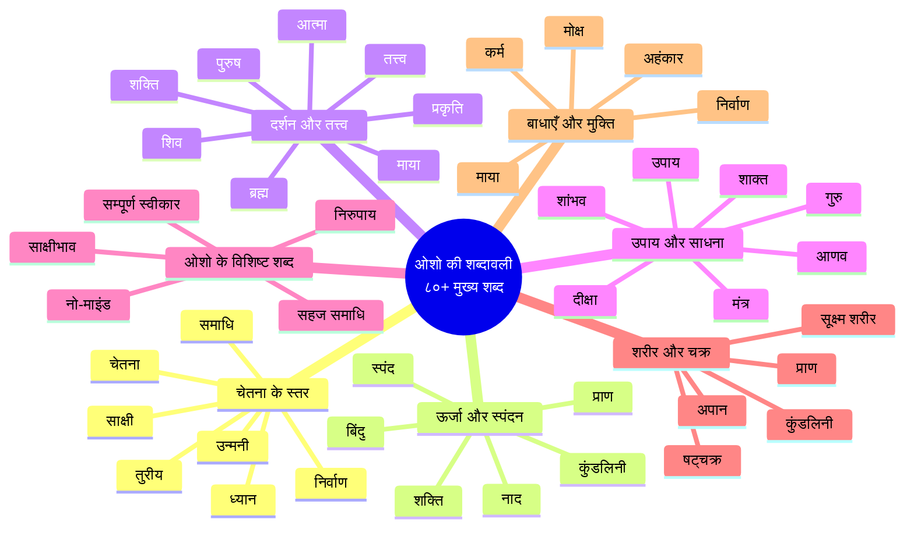

# ओशो की शब्दावली: मुख्य संस्कृत शब्द और उनके अर्थ

> **"शब्द केवल संकेत हैं — सत्य तो शब्दों के पार है। फिर भी, शब्दों के बिना उस सत्य तक पहुँचना कठिन है। यह शब्दावली तुम्हारा नक्शा है — नक्शे पर मत रुक जाना, मंज़िल तक पहुँचना।"**
> — **ओशो**, विज्ञान भैरव तंत्र पर प्रवचन

---

## इस शब्दावली का उपयोग कैसे करें

यह शब्दावली **विज्ञान भैरव तंत्र** पर ओशो के प्रवचनों में प्रयुक्त मुख्य संस्कृत शब्दों का संग्रह है। प्रत्येक प्रविष्टि में:

- **संस्कृत शब्द** (देवनागरी में)
- **ओशो की परिभाषा** — उनके अनूठे दृष्टिकोण में (हिंदी में २-४ वाक्य)
- **अध्याय संदर्भ** — जहाँ इस शब्द पर गहराई से चर्चा हुई है
- **ओशो वाणी** — प्रवचनों से सीधा उद्धरण

> **ओशो वाणी:**
> "ये शब्द केवल शब्द नहीं हैं — ये ऊर्जा हैं। जितनी गहराई से तुम इन्हें समझोगे, उतनी ही गहराई से तुम स्वयं को समझ पाओगे।"

---

## शब्दावली संरचना — एक दृष्टि



---

## शब्दावली — वर्णमाला क्रम में

---

### १. अजपा जप (Ajapa Japa)

**ओशो की परिभाषा:**
अजपा जप का अर्थ है — वह मंत्र जो बिना जपे ही जपा जा रहा है। ओशो के अनुसार, हर व्यक्ति लगातार एक मंत्र जप रहा है — अपने विचारों का। अजपा जप का अर्थ है — इस स्वाभाविक मंत्र के प्रति जागरूक हो जाना। जब तुम अपने श्वास को सुनते हो — सो-हम, सो-हम — यही अजपा जप है।

**अध्याय संदर्भ:** अध्याय ४ — श्वास-प्रज्ञा, अध्याय ७ — ध्वनि-ब्रह्म

**ओशो वाणी:**
> "हर श्वास के साथ 'सो-हम' जप हो रहा है — 'वह मैं हूँ'। यह बिना जपे जपा जा रहा है। तुम्हें केवल जागरूक होना है।"

---

### २. अणिमा (Anima)

**ओशो की परिभाषा:**
अणिमा आठ सिद्धियों में से एक है — सूक्ष्म हो जाने की क्षमता। लेकिन ओशो इसे बाहरी चमत्कार के रूप में नहीं, बल्कि आंतरिक अनुभव के रूप में समझाते हैं। जब तुम ध्यान में इतने गहरे उतर जाते हो कि तुम्हारा अहंकार सूक्ष्म हो जाता है, लगभग गायब — यही अणिमा है।

**अध्याय संदर्भ:** अध्याय ३ — ११२ विधियाँ

**ओशो वाणी:**
> "सिद्धियाँ कोई चमत्कार नहीं हैं — वे चेतना के प्राकृतिक विस्तार हैं। उनके पीछे मत भागो — वे अपने आप आएँगी।"

---

### ३. अद्वैत (Advaita)

**ओशो की परिभाषा:**
अद्वैत का अर्थ है — दो नहीं, एक। ओशो इसे दार्शनिक सिद्धांत के रूप में नहीं, बल्कि प्रत्यक्ष अनुभव के रूप में प्रस्तुत करते हैं। जब तुम ध्यान में गहरे उतरते हो, तो देखते हो कि भीतर और बाहर, मैं और तुम, सब एक ही चेतना के रूप हैं।

**अध्याय संदर्भ:** अध्याय २ — तंत्र दृष्टि, अध्याय १५ — परम तकनीकें

**ओशो वाणी:**
> "अद्वैत कोई दर्शन नहीं है — यह एक अनुभव है। जब तुम श्वास को देखते हो और श्वास देखने वाले के बीच कोई दूरी नहीं रहती — वह अद्वैत है।"

---

### ४. अनाहत नाद (Anahata Nada)

**ओशो की परिभाषा:**
अनाहत नाद का अर्थ है — वह ध्वनि जो बिना किसी आघात के उत्पन्न होती है। ओशो इसे ब्रह्मांड की मूल ध्वनि बताते हैं, जिसे सुनने के लिए आंतरिक श्रवण की आवश्यकता है। यह वह ध्वनि है जो तब सुनाई देती है जब सब ध्वनियाँ शांत हो जाती हैं।

**अध्याय संदर्भ:** अध्याय ७ — ध्वनि-ब्रह्म

**ओशो वाणी:**
> "अनाहत नाद — ब्रह्मांड की धड़कन। जब तुम पूरी तरह मौन हो जाते हो, तो तुम इसे सुन सकते हो। यह शब्दों से परे है — यह एक स्पंदन है।"

---

### ५. अपान (Apana)

**ओशो की परिभाषा:**
अपान पाँच प्राणों में से एक है — वह ऊर्जा जो नीचे की ओर बहती है, उत्सर्जन से संबंधित। ओशो इसे श्वास के बाहर जाने की क्रिया से जोड़ते हैं। वे कहते हैं — जब प्राण और अपान मिलते हैं, तो वहाँ चेतना का विस्फोट होता है।

**अध्याय संदर्भ:** अध्याय ४ — श्वास-प्रज्ञा

**ओशो वाणी:**
> "प्राण ऊपर जाता है, अपान नीचे जाता है — दोनों के मिलन से चेतना जागती है। यही तंत्र का रहस्य है।"

---

### ६. अभ्यास (Abhyasa)

**ओशो की परिभाषा:**
अभ्यास — निरंतर अभ्यास। लेकिन ओशो अभ्यास को यांत्रिक दोहराव नहीं मानते। उनके अनुसार, सच्चा अभ्यास जागरूकता के साथ किया गया दोहराव है — बिना उबाऊ हुए, बिना यांत्रिक हुए।

**अध्याय संदर्भ:** अध्याय १४ — दैनिक जीवन में ओशो

**ओशो वाणी:**
> "अभ्यास को यांत्रिक मत बनाओ। हर बार नए सिरे से करो — जैसे पहली बार कर रहे हो। यही सच्चा अभ्यास है।"

---

### ७. अहंकार (Ahankara)

**ओशो की परिभाषा:**
अहंकार — 'मैं' की भावना। ओशो के अनुसार, अहंकार कोई वास्तविक चीज़ नहीं है — यह एक भ्रम है, एक गलत पहचान। तुम शरीर नहीं हो, तुम मन नहीं हो — फिर 'मैं' कौन है? अहंकार तब बनता है जब तुम अपने को सीमित रूपों से पहचान लेते हो।

**अध्याय संदर्भ:** अध्याय १२ — साधना में बाधाएँ

**ओशो वाणी:**
> "अहंकार कोई वस्तु नहीं है — यह एक भ्रम है। जैसे अँधेरा प्रकाश का अभाव है — वैसे ही अहंकार चेतना का अभाव है।"

---

### ८. आत्मा (Atma)

**ओशो की परिभाषा:**
आत्मा — ओशो इसे व्यक्तिगत चेतना के रूप में समझाते हैं, जो परम चेतना (ब्रह्म) से अलग नहीं है। वे जोर देकर कहते हैं — आत्मा कोई वस्तु नहीं है जिसे पाया जाए, यह तो तुम्हारा स्वभाव है।

**अध्याय संदर्भ:** अध्याय १ — परिचय, अध्याय १५ — परम तकनीकें

**ओशो वाणी:**
> "आत्मा को खोजने की ज़रूरत नहीं — वह खोजने वाला ही है। तुम जो खोज रहे हो, वही खोज रहा है।"

---

### ९. आणव उपाय (Anava Upaya)

**ओशो की परिभाषा:**
आणव उपाय — तीन उपायों में पहला। ओशो के अनुसार, यह उनके लिए है जो 'अणु' (छोटे, सीमित) महसूस करते हैं। इसमें क्रिया, प्रयास, तकनीक और अनुशासन की आवश्यकता है। ओशो कहते हैं — यह सीढ़ी है, मंज़िल नहीं।

**अध्याय संदर्भ:** अध्याय १० — उपाय

**ओशो वाणी:**
> "आणव उपाय में तुम कुछ करते हो — श्वास, मंत्र, आसन। यह तैयारी है — असली चीज़ नहीं।"

---

### १०. इच्छा (Iccha)

**ओशो की परिभाषा:**
इच्छा — ओशो इसे दमन करने की वस्तु नहीं, बल्कि समझने की वस्तु मानते हैं। वे कहते हैं — इच्छा ऊर्जा है। उसे दबाने से विकार पैदा होता है, उसे भोगने से लत लगती है। इच्छा को देखना, उसे जागरूकता में बदलना — यही तंत्र का तरीका है।

**अध्याय संदर्भ:** अध्याय ८ — भाव-साक्षी, अध्याय २ — तंत्र दृष्टि

**ओशो वाणी:**
> "इच्छा को दबाओ मत — वह फिर और गहरी हो जाती है। इच्छा को देखो — और वह अपने आप बदल जाती है।"

---

### ११. उन्मनी (Unmani)

**ओशो की परिभाषा:**
उन्मनी — मन के पार की अवस्था। ओशो के अनुसार, यह ध्यान की सबसे गहरी अवस्था है जहाँ मन पूरी तरह विलीन हो जाता है। यह कोई अवस्था नहीं है जिसे तुम कर सकते हो — यह तो तुम्हारा स्वभाव है जब तुम मन की पहचान छोड़ देते हो।

**अध्याय संदर्भ:** अध्याय १५ — परम तकनीकें, अध्याय १२ — उन्मनी-सहज

**ओशो वाणी:**
> "उन्मनी — जहाँ मन नहीं है, वहाँ केवल चेतना है। यह तुम्हारी सबसे स्वाभाविक अवस्था है — बस तुम भूल गए हो।"

---

### १२. उपाय (Upaya)

**ओशो की परिभाषा:**
उपाय का शाब्दिक अर्थ है — साधन, तरीका। ओशो इसे एक विरोधाभास के रूप में समझाते हैं — उपाय का अर्थ है वह साधन जो अंततः साधन से मुक्त कर दे। एक अच्छा उपाय वह है जो स्वयं को नष्ट कर दे।

**अध्याय संदर्भ:** अध्याय १० — उपाय

**ओशो वाणी:**
> "उपाय का मतलब है — उपाय से मुक्त हो जाना। सर्वश्रेष्ठ तकनीक वह है जो तुम्हें तकनीक से आज़ाद कर दे।"

---

### १३. उपाधि (Upadhi)

**ओशो की परिभाषा:**
उपाधि — वह आवरण जो आत्मा को ढक लेता है। ओशो कहते हैं — जैसे बादल सूरज को ढक लेते हैं, वैसे ही उपाधियाँ (शरीर, मन, अहंकार) आत्मा को ढक लेती हैं। लेकिन बादल सूरज को मिटा नहीं सकते।

**अध्याय संदर्भ:** अध्याय ५ — शरीर-ध्यान

**ओशो वाणी:**
> "उपाधियाँ तुम्हारा स्वभाव नहीं हैं — वे परिस्थितियाँ हैं। इन्हें देखो — और ये गिर जाएँगी।"

---

### १४. ऊर्ध्वरेता (Urdhvareta)

**ओशो की परिभाषा:**
ऊर्ध्वरेता — यौन ऊर्जा का ऊर्ध्वगमन। ओशो इसे पारंपरिक योग की धारणा से अलग समझाते हैं। वे कहते हैं — ऊर्जा को जबरदस्ती ऊपर नहीं खींचा जा सकता। जागरूकता से ऊर्जा अपने आप रूपांतरित होती है।

**अध्याय संदर्भ:** अध्याय २ — तंत्र दृष्टि

**ओशो वाणी:**
> "ऊर्जा को दबाओ मत — उसे समझो। जागरूकता से ऊर्जा अपने आप ऊपर उठती है। यह तंत्र का तरीका है।"

---

### १५. कंचुक (Kancuka)

**ओशो की परिभाषा:**
कंचुक का अर्थ है — आवरण, कोश। ओशो के अनुसार, तंत्र दर्शन में पाँच कंचुक बताए गए हैं जो शुद्ध चेतना को सीमित करते हैं — नियति, काल, राग, विद्या, कला। ये वे सीमाएँ हैं जिनके कारण व्यक्ति अपने वास्तविक स्वरूप को भूल जाता है।

**अध्याय संदर्भ:** अध्याय ९ — चेतना की अवस्थाएँ

**ओशो वाणी:**
> "कंचुक — वे परतें जिनमें आत्मा लिपटी है। ध्यान इन परतों को हटाने का विज्ञान है। एक-एक करके, परत-दर-परत।"

---

### १६. कर्म (Karma)

**ओशो की परिभाषा:**
कर्म — ओशो इसे पारंपरिक अर्थ (कर्मफल, पुनर्जन्म) से अलग समझाते हैं। उनके अनुसार, कर्म का अर्थ है — अतीत का बोझ जो वर्तमान को प्रभावित करता है। अचेतन आदतों का जाल। मुक्ति का अर्थ है — इस जाल से बाहर निकलना।

**अध्याय संदर्भ:** अध्याय १२ — साधना में बाधाएँ

**ओशो वाणी:**
> "कर्म कोई नियति नहीं है — यह आदतों का एक जाल है। जागरूकता इस जाल को काट सकती है — यहीं और अभी।"

---

### १७. कल्पना (Kalpana)

**ओशो की परिभाषा:**
कल्पना — मन की वह शक्ति जो चित्र बनाती है। ओशो कल्पना को ध्यान में एक उपकरण के रूप में उपयोग करते हैं। कल्पना में खो जाना खतरनाक है, लेकिन कल्पना को साक्षी से देखना मुक्ति का द्वार है।

**अध्याय संदर्भ:** अध्याय ६ — दृश्य-ध्यान

**ओशो वाणी:**
> "कल्पना को नष्ट मत करो — उसका उपयोग करो। कल्पना एक सीढ़ी हो सकती है — बशर्ते तुम उस पर चढ़ते रहो।"

---

### १८. कुंडलिनी (Kundalini)

**ओशो की परिभाषा:**
कुंडलिनी — सुप्त ऊर्जा जो रीढ़ के आधार पर स्थित है। ओशो ने कुंडलिनी को एक मनोवैज्ञानिक और आध्यात्मिक वास्तविकता बताया, न कि कोई भौतिक वस्तु। वे कहते हैं — कुंडलिनी जागरण कोई चमत्कार नहीं, बल्कि चेतना का स्वाभाविक विस्तार है।

**अध्याय संदर्भ:** अध्याय ८ — भाव-साक्षी, अध्याय ११ — आधुनिक विज्ञान

**ओशो वाणी:**
> "कुंडलिनी कोई रहस्यमयी शक्ति नहीं — यह तुम्हारी अपनी चेतना की सुप्त क्षमता है।"

---

### १९. कुंभक (Kumbhaka)

**ओशो की परिभाषा:**
कुंभक — श्वास का रुक जाना। ओशो दो प्रकार के कुंभक बताते हैं — श्वास भरने के बाद और श्वास खाली करने के बाद। लेकिन असली कुंभक वह नहीं है जो तुम करते हो, बल्कि वह जो अपने आप होता है जब मन शांत होता है।

**अध्याय संदर्भ:** अध्याय ४ — श्वास-प्रज्ञा

**ओशो वाणी:**
> "जब श्वास अपने आप रुक जाती है — उस ठहराव में — वहाँ परमात्मा है।"

---

### २०. कृपा (Kripa)

**ओशो की परिभाषा:**
कृपा — दिव्य अनुग्रह। ओशो के अनुसार, कृपा कोई व्यक्तिगत देन नहीं है — यह अस्तित्व का स्वभाव है। जब तुम खुले होते हो, जब तुम समर्पित होते हो, तो कृपा अपने आप बरसती है। कृपा को कमाया नहीं जा सकता — केवल ग्रहण किया जा सकता है।

**अध्याय संदर्भ:** अध्याय १३ — गुरु-शिष्य

**ओशो वाणी:**
> "कृपा बरस रही है — तुम्हें बस अपने घड़े को खुला रखना है। वह तुम्हारी तरफ देखकर नहीं बरसती — वह बरस ही रही है।"

---

### २१. गुरु (Guru)

**ओशो की परिभाषा:**
गुरु — ओशो की यह सबसे विवादास्पद व्याख्याओं में से एक है। वे कहते हैं — गुरु कोई शिक्षक नहीं, कोई अधिकारी नहीं। गुरु तो वह दर्पण है जिसमें तुम अपना असली चेहरा देख सकते हो। किसी भी गुरु का अनुसरण मत करो — उनकी बात समझो और अपने पैरों पर खड़े हो जाओ।

**अध्याय संदर्भ:** अध्याय १३ — गुरु-शिष्य

**ओशो वाणी:**
> "गुरु तुम्हें मुक्त करने के लिए है — बाँधने के लिए नहीं। सच्चा गुरु तो तुम्हें खुद से आज़ाद कर देता है।"

---

### २२. गुरुमुख (Gurumukha)

**ओशो की परिभाषा:**
गुरुमुख — गुरु के मुख से निकली बात। ओशो के अनुसार, गुरुमुख का अर्थ है — वह शिक्षा जो गुरु से सीधे प्राप्त हो — किताबों से नहीं, जीवित संवाद से। सच्ची शिक्षा जीवित शब्दों से होती है।

**अध्याय संदर्भ:** अध्याय १३ — गुरु-शिष्य

**ओशो वाणी:**
> "गुरुमुख — जीवित शब्द। किताबों में मरा हुआ ज्ञान है — गुरु के मुख से जीवित ज्ञान बहता है।"

---

### २३. चक्र (Cakra)

**ओशो की परिभाषा:**
चक्र — शरीर में ऊर्जा के केंद्र। ओशो चक्रों को शारीरिक अंग नहीं, बल्कि मनोवैज्ञानिक-आध्यात्मिक केंद्र बताते हैं। वे कहते हैं — चक्र ध्यान के उपकरण हैं, ध्यान के लक्ष्य नहीं। उन पर ध्यान करो, लेकिन उनमें मत उलझो।

**अध्याय संदर्भ:** अध्याय ४ — श्वास-प्रज्ञा, अध्याय ५ — शरीर-ध्यान

**ओशो वाणी:**
> "चक्र तुम्हारे शरीर में ऊर्जा के द्वार हैं। हर चक्र को खोला जा सकता है — जागरूकता से।"

---

### २४. चेतना (Cetana)

**ओशो की परिभाषा:**
चेतना — ओशो की शिक्षा का केंद्रीय शब्द। उनके अनुसार, चेतना कोई गुण नहीं है जो मनुष्य के पास है — चेतना तो मनुष्य का स्वभाव है। वह विचारों, भावनाओं, अहंकार के आवरणों से ढकी हुई है। ध्यान का अर्थ है — इन आवरणों को हटाना और शुद्ध चेतना में जीना।

**अध्याय संदर्भ:** अध्याय १, ९, १५ (सभी अध्यायों में)

**ओशो वाणी:**
> "चेतना — यही एकमात्र सत्य है। सब कुछ बदलता है — चेतना ही अपरिवर्तनीय है।"

---

### २५. जागरूकता (Jagarukata)

**ओशो की परिभाषा:**
जागरूकता — ओशो इस शब्द का उपयोग साक्षी के समानांतर करते हैं। लेकिन एक सूक्ष्म अंतर है — साक्षी ध्यान की अवस्था का नाम है, जागरूकता उस अवस्था का व्यावहारिक रूप है। रोज़मर्रा के जीवन में — चलते, बोलते, खाते — जागरूक रहना।

**अध्याय संदर्भ:** अध्याय १४ — दैनिक जीवन में ओशो

**ओशो वाणी:**
> "जागरूकता का अर्थ है — अंदर एक दीया जलता रहे। चाहे बाहर कुछ भी हो — वह दीया जलता रहे।"

---

### २६. ज्ञान (Jnana)

**ओशो की परिभाषा:**
ज्ञान — ओशो इसे दो प्रकार का बताते हैं — शास्त्रीय ज्ञान (सूचना) और प्रत्यक्ष ज्ञान (अनुभव)। पहला किताबों से मिलता है, दूसरा जीवन से। ओशो कहते हैं — सूचना से मुक्ति नहीं मिलती, अनुभव से मिलती है।

**अध्याय संदर्भ:** अध्याय ११ — आधुनिक विज्ञान

**ओशो वाणी:**
> "ज्ञान दो प्रकार का है — एक किताबों में, एक तुम्हारे भीतर। पहला विद्वान बनाता है, दूसरा ऋषि।"

---

### २७. तंत्र (Tantra)

**ओशो की परिभाषा:**
तंत्र — 'तन' धातु से, जिसका अर्थ है फैलाना, बुनना। ओशो के अनुसार, तंत्र कोई धर्म नहीं, कोई पंथ नहीं — यह चेतना का विज्ञान है। यह जीवन को समग्र रूप से देखना सिखाता है — किसी चीज़ को छोड़ना नहीं, बल्कि सबको समाहित करना।

**अध्याय संदर्भ:** अध्याय २ — तंत्र दृष्टि, अध्याय १ — परिचय

**ओशो वाणी:**
> "तंत्र का अर्थ है — बुनाई। जीवन एक कपड़े की तरह बुना गया है — शरीर और मन, सुख और दुख — सब एक साथ।"

---

### २८. तत्त्व (Tattva)

**ओशो की परिभाषा:**
तत्त्व — 'वह जो है'। ओशो के अनुसार, तत्त्व कोई सिद्धांत नहीं, बल्कि वास्तविकता का मूल स्वरूप है। ३६ तत्त्वों का वर्णन कश्मीर शैव में आता है — मूल चेतना (शिव) से लेकर पृथ्वी तक। ओशो कहते हैं — यह तत्त्व-विद्या एक नक्शा है, स्वयं वास्तविकता नहीं।

**अध्याय संदर्भ:** अध्याय १० — उपाय

**ओशो वाणी:**
> "तत्त्व — सत्य की परतें। एक-एक परत को खोलो — और तुम मूल तक पहुँच जाओगे। लेकिन नक्शा मंज़िल नहीं है।"

---

### २९. तुरीय (Turiya)

**ओशो की परिभाषा:**
तुरीय — चौथी अवस्था। ओशो के अनुसार, तीन सामान्य अवस्थाएँ हैं — जागृत, स्वप्न, गहन निद्रा। तुरीय वह अवस्था है जो इन तीनों से परे है — शुद्ध चेतना। ओशो जोर देते हैं कि तुरीय कोई दूसरी दुनिया नहीं है — यह यहीं और अभी है।

**अध्याय संदर्भ:** अध्याय ९ — चेतना की अवस्थाएँ, अध्याय १५

**ओशो वाणी:**
> "तुरीय — चौथी अवस्था। यह कोई नई अवस्था नहीं — यह तुम्हारा मूल स्वभाव है। जागृत, स्वप्न, निद्रा — ये सतह पर लहरें हैं। तुरीय गहराई है।"

---

### ३०. त्याग (Tyaga)

**ओशो की परिभाषा:**
त्याग — ओशो त्याग को पारंपरिक अर्थ में नहीं लेते। वे कहते हैं — त्याग का अर्थ कुछ छोड़ना नहीं है, बल्कि कुछ समझना है। जब तुम किसी चीज़ को गहराई से समझ लेते हो, तो वह अपने आप छूट जाती है। त्याग समझ का परिणाम है, आदेश नहीं।

**अध्याय संदर्भ:** अध्याय २ — तंत्र दृष्टि

**ओशो वाणी:**
> "त्याग का अर्थ कुछ छोड़ना नहीं — कुछ समझना है। समझ आते ही छूट जाता है — बिना प्रयास के।"

---

### ३१. दीक्षा (Diksa)

**ओशो की परिभाषा:**
दीक्षा — ओशो ने पारंपरिक दीक्षा को पूरी तरह बदल दिया। उनके अनुसार, दीक्षा कोई अनुष्ठान नहीं, कोई मंत्रदान नहीं — यह एक मनोवैज्ञानिक घटना है। जब शिष्य गुरु में पूरी तरह समर्पित हो जाता है — तब गुरु की चेतना शिष्य को छू जाती है।

**अध्याय संदर्भ:** अध्याय १३ — गुरु-शिष्य

**ओशो वाणी:**
> "दीक्षा कोई रस्म नहीं — यह तो एक ऊर्जा का स्थानांतरण है।"

---

### ३२. द्वैत (Dvaita)

**ओशो की परिभाषा:**
द्वैत — दो का सिद्धांत — अच्छा-बुरा, सुख-दुख, शरीर-आत्मा। ओशो के अनुसार, द्वैत ही मनुष्य के सारे दुख का कारण है। तंत्र द्वैत से परे जाना सिखाता है — जहाँ कुछ भी अच्छा नहीं, कुछ भी बुरा नहीं।

**अध्याय संदर्भ:** अध्याय २ — तंत्र दृष्टि

**ओशो वाणी:**
> "द्वैत — यही मन का जाल है। अच्छा-बुरा, सही-गलत — इन दो किनारों के बीच मन झूलता रहता है। तंत्र कहता है — दोनों किनारों को छोड़ो।"

---

### ३३. धारणा (Dharana)

**ओशो की परिभाषा:**
धारणा — एकाग्रता, मन को एक बिंदु पर स्थिर करना। ओशो धारणा को ध्यान की तैयारी मानते हैं — धारणा में तुम केंद्रित होते हो, ध्यान में तुम जागरूक होते हो। अंतर सूक्ष्म है लेकिन महत्वपूर्ण।

**अध्याय संदर्भ:** अध्याय ६ — दृश्य-ध्यान

**ओशो वाणी:**
> "धारणा — एक बिंदु पर ध्यान। यह अच्छी तैयारी है, लेकिन ध्यान नहीं है। ध्यान तो तब होता है जब यह बिंदु भी गिर जाता है।"

---

### ३४. ध्यान (Dhyana)

**ओशो की परिभाषा:**
ध्यान — ओशो की शिक्षा का केंद्र। उनके अनुसार, ध्यान कोई क्रिया नहीं है — यह एक अवस्था है। तुम ध्यान नहीं कर सकते — तुम ध्यान में हो सकते हो। ध्यान का अर्थ है — बिना किसी चुनाव के, बिना किसी प्रयास के, शुद्ध जागरूकता में रहना।

**अध्याय संदर्भ:** अध्याय १, ३ (सभी अध्यायों में)

**ओशो वाणी:**
> "ध्यान कोई क्रिया नहीं है — यह एक अवस्था है। तुम कुछ करके ध्यान में नहीं जा सकते — तुम केवल होकर ध्यान में हो सकते हो।"

---

### ३५. धर्म (Dharma)

**ओशो की परिभाषा:**
धर्म — ओशो ने इस शब्द की सबसे अनूठी व्याख्या की है। उनके अनुसार, धर्म का अर्थ कोई पंथ या संप्रदाय नहीं है — धर्म का अर्थ है तुम्हारा मूल स्वभाव। जैसे आग का धर्म गर्मी है, मनुष्य का धर्म चेतना है।

**अध्याय संदर्भ:** अध्याय १ — परिचय, अध्याय १४ — दैनिक जीवन

**ओशो वाणी:**
> "धर्म का अर्थ है — तुम्हारा स्वभाव। पंथों से तुम्हें कोई धर्म नहीं मिल सकता — वे तो संगठन हैं।"

---

### ३६. नाद (Nada)

**ओशो की परिभाषा:**
नाद — ध्वनि। ओशो के लिए नाद केवल बाहरी ध्वनि नहीं है — यह ब्रह्मांड का मूल स्पंदन है। जब तुम गहरे ध्यान में होते हो, तो तुम इस नाद को सुन सकते हो। नाद ब्रह्म — ध्वनि ही परमात्मा है।

**अध्याय संदर्भ:** अध्याय ७ — ध्वनि-ब्रह्म

**ओशो वाणी:**
> "नाद — ब्रह्मांड की पहली ध्वनि। जब सब कुछ शांत हो जाता है, तब तुम इसे सुन सकते हो।"

---

### ३७. निरुपाय (Nirupaya)

**ओशो की परिभाषा:**
निरुपाय — जहाँ कोई उपाय नहीं, कोई तकनीक नहीं। ओशो के अनुसार, यह सबसे उच्च अवस्था है — जहाँ तुम इतने सहज हो गए हो कि किसी तकनीक की ज़रूरत नहीं रही। तुम तकनीक नहीं कर रहे — तुम तकनीक ही हो गए हो।

**अध्याय संदर्भ:** अध्याय १० — उपाय, अध्याय १५ — परम तकनीकें

**ओशो वाणी:**
> "निरुपाय — कोई उपाय नहीं। यह परम अवस्था है जब तुम इतने मौन हो कि कोई तकनीक काम नहीं करती।"

---

### ३८. निर्वाण (Nirvana)

**ओशो की परिभाषा:**
निर्वाण — 'निर्वा' धातु से — बुझ जाना। ओशो के अनुसार, निर्वाण का अर्थ है — अहंकार की ज्वाला का बुझ जाना। लेकिन यह नकारात्मक नहीं है — जब दीया बुझता है, तो अँधेरा नहीं होता, बल्कि सूरज उगता है।

**अध्याय संदर्भ:** अध्याय १५ — परम तकनीकें

**ओशो वाणी:**
> "निर्वाण का अर्थ है — बुझ जाना। लेकिन डरो मत — दीया बुझता है तो सूरज उगता है।"

---

### ३९. निर्विकल्प (Nirvikalpa)

**ओशो की परिभाषा:**
निर्विकल्प — जहाँ कोई विकल्प नहीं, कोई विचार नहीं। ओशो के अनुसार, निर्विकल्प अवस्था ध्यान का चरम है। जहाँ मन पूरी तरह शांत है, कोई तरंग नहीं — केवल शुद्ध चेतना।

**अध्याय संदर्भ:** अध्याय १५ — परम तकनीकें

**ओशो वाणी:**
> "निर्विकल्प — जहाँ कोई विचार नहीं, कोई विकल्प नहीं। निर्विकल्प समाधि — यही परम है।"

---

### ४०. नो-माइंड (No-Mind)

**ओशो की परिभाषा:**
नो-माइंड — ओशो का सबसे प्रसिद्ध शब्द। इसका मतलब मन को नष्ट करना नहीं है — इसका मतलब है मन से पहचान न जोड़ना। मन एक यंत्र है — उपयोगी यंत्र — लेकिन वह स्वामी नहीं है। नो-माइंड का अर्थ है — मन को सेवक बनाना, स्वामी नहीं।

**अध्याय संदर्भ:** अध्याय १ — परिचय, अध्याय ३ — ११२ विधियाँ

**ओशो वाणी:**
> "नो-माइंड का अर्थ मन के विरुद्ध नहीं है — यह मन के पार जाना है। मन एक खूबसूरत यंत्र है — लेकिन तुम यंत्र नहीं हो।"

---

### ४१. पदार्थ (Padartha)

**ओशो की परिभाषा:**
पदार्थ — वह सब जो इन्द्रियों से जाना जा सकता है। ओशो के अनुसार, पदार्थ और चेतना में कोई बुनियादी अंतर नहीं है — पदार्थ चेतना का ही एक रूप है, सघन रूप।

**अध्याय संदर्भ:** अध्याय ११ — आधुनिक विज्ञान

**ओशो वाणी:**
> "पदार्थ और चेतना — ये दो अलग चीज़ें नहीं हैं। पदार्थ सघन चेतना है, चेतना सूक्ष्म पदार्थ।"

---

### ४२. परमात्मा (Paramatma)

**ओशो की परिभाषा:**
परमात्मा — परम चेतना। ओशो के अनुसार, परमात्मा कोई व्यक्ति नहीं है — कोई स्वर्ग में बैठा न्यायाधीश नहीं। परमात्मा तो अस्तित्व का मूल स्वभाव है — वह चेतना जो सबमें व्याप्त है।

**अध्याय संदर्भ:** अध्याय १ — परिचय, अध्याय १५

**ओशो वाणी:**
> "परमात्मा कोई वस्तु नहीं है जिसे पाया जाए — वह तो तुम्हारा स्वभाव है।"

---

### ४३. पुरुष (Purusa)

**ओशो की परिभाषा:**
पुरुष — सांख्य दर्शन में चेतना का सिद्धांत। ओशो पुरुष को शुद्ध चेतना के रूप में समझाते हैं — वह साक्षी जो सब कुछ देखता है लेकिन कुछ भी नहीं करता।

**अध्याय संदर्भ:** अध्याय ९ — चेतना की अवस्थाएँ

**ओशो वाणी:**
> "पुरुष — वह जो देखता है। प्रकृति — वह जो दिखती है। जब देखने वाला और दिखने वाला एक हो जाते हैं — वही मुक्ति है।"

---

### ४४. पूर्णता (Purnata)

**ओशो की परिभाषा:**
पूर्णता — ओशो के अनुसार, पूर्णता का अर्थ कुछ और बनना नहीं है — यह जो है, उसे पूरी तरह स्वीकार करना है। तुम पहले से ही पूर्ण हो — बस इसे जानो। पूर्णता कोई उपलब्धि नहीं, यह एक पहचान है।

**अध्याय संदर्भ:** अध्याय १५ — परम तकनीकें

**ओशो वाणी:**
> "तुम पहले से ही पूर्ण हो — बस इसे भूल गए हो। ध्यान इस भूलने को मिटाने का नाम है।"

---

### ४५. प्रकृति (Prakrti)

**ओशो की परिभाषा:**
प्रकृति — वह मूल प्रकृति जिससे सब कुछ बना है। ओशो के अनुसार, प्रकृति कोई जड़ वस्तु नहीं — वह जीवंत, गतिशील, सृजनशील है। तंत्र प्रकृति के साथ बहना सिखाता है — उसके विरुद्ध नहीं।

**अध्याय संदर्भ:** अध्याय २ — तंत्र दृष्टि

**ओशो वाणी:**
> "प्रकृति तुमसे अलग नहीं है — तुम उसी का हिस्सा हो। तंत्र प्रकृति के साथ बहना सिखाता है।"

---

### ४६. प्रज्ञा (Prajna)

**ओशो की परिभाषा:**
प्रज्ञा — वह ज्ञान जो बुद्धि से परे है। ओशो के अनुसार, बुद्धि विश्लेषण करती है — प्रज्ञा सीधे देखती है। बुद्धि तर्क करती है — प्रज्ञा सत्य को पकड़ती है। ध्यान का अंतिम लक्ष्य प्रज्ञा का जागरण है।

**अध्याय संदर्भ:** अध्याय ४ — श्वास-प्रज्ञा

**ओशो वाणी:**
> "प्रज्ञा — वह दृष्टि जो सीधे सत्य को देखती है। बिना तर्क के, बिना विश्लेषण के।"

---

### ४७. प्रणव (Pranava)

**ओशो की परिभाषा:**
प्रणव — ॐ (ओंकार)। ओशो के अनुसार, ॐ कोई धार्मिक प्रतीक नहीं है — यह ब्रह्मांड की मूल ध्वनि का प्रतिनिधित्व करता है। ॐ का जाप मन को एकाग्र करता है और फिर मौन में ले जाता है।

**अध्याय संदर्भ:** अध्याय ७ — ध्वनि-ब्रह्म

**ओशो वाणी:**
> "ॐ कोई हिंदू ध्वनि नहीं है — यह ब्रह्मांड की ध्वनि है। इसे सुनो — और तुम सब कुछ सुन लोगे।"

---

### ४८. प्राण (Prana)

**ओशो की परिभाषा:**
प्राण — जीवन ऊर्जा। ओशो के अनुसार, प्राण सिर्फ श्वास नहीं है — श्वास तो प्राण का स्थूल रूप है। प्राण वह सूक्ष्म ऊर्जा है जो पूरे ब्रह्मांड में व्याप्त है। सभी ११२ तकनीकों का संबंध प्राण से है।

**अध्याय संदर्भ:** अध्याय ४ — श्वास-प्रज्ञा

**ओशो वाणी:**
> "प्राण — जीवन ही प्राण है। श्वास तो प्राण का पुल है — उस पुल पर चलो और प्राण के सागर में उतर जाओ।"

---

### ४९. प्राणायाम (Pranayama)

**ओशो की परिभाषा:**
प्राणायाम — श्वास पर नियंत्रण। लेकिन ओशो ने प्राणायाम को पारंपरिक अर्थ से भिन्न समझाया। उनके अनुसार, प्राणायाम का अर्थ श्वास को रोकना या नियंत्रित करना नहीं है — इसका अर्थ है प्राण का विस्तार।

**अध्याय संदर्भ:** अध्याय ४ — श्वास-प्रज्ञा

**ओशो वाणी:**
> "प्राणायाम कोई जिम्नास्टिक नहीं है — यह एक विज्ञान है। जब तुम श्वास को बिना नियंत्रित किए देखते हो — तब प्राण अपने आप फैलता है।"

---

### ५०. प्रारब्ध (Prarabdha)

**ओशो की परिभाषा:**
प्रारब्ध — वह कर्म जो इस जन्म में भोगना है। ओशो प्रारब्ध को भाग्य नहीं मानते — वे इसे एक आधार रेखा मानते हैं। जागरूकता से प्रारब्ध को पार किया जा सकता है।

**अध्याय संदर्भ:** अध्याय १२ — साधना में बाधाएँ

**ओशो वाणी:**
> "प्रारब्ध — वह पूंजी जो तुम्हारे पास है। जागरूकता से तुम किसी भी प्रारब्ध को पार कर सकते हो।"

---

### ५१. प्रेम (Prema)

**ओशो की परिभाषा:**
प्रेम — ओशो प्रेम को सबसे गहन ध्यान मानते हैं। उनके अनुसार, प्रेम कोई भावना नहीं है — यह एक अवस्था है। जब अहंकार नहीं है, तब प्रेम है। प्रेम ध्यान का फल है और ध्यान प्रेम का मार्ग है।

**अध्याय संदर्भ:** अध्याय ८ — भाव-साक्षी

**ओशो वाणी:**
> "प्रेम कोई भावना नहीं है — प्रेम एक अवस्था है। जैसे फूल खिलता है — वैसे ही प्रेम होता है। बिना प्रयास के।"

---

### ५२. बिंदु (Bindu)

**ओशो की परिभाषा:**
बिंदु — केंद्र बिंदु। ओशो के अनुसार, बिंदु एकाग्रता का प्रतीक है — और अंततः चेतना का प्रतीक भी। जैसे एक बिंदु पर दृष्टि स्थिर करने से मन स्थिर होता है, वैसे ही चेतना का मूल भी एक बिंदु है।

**अध्याय संदर्भ:** अध्याय ६ — दृश्य-ध्यान

**ओशो वाणी:**
> "बिंदु — वह एक बिंदु जहाँ सब कुछ मिलता है। अपनी दृष्टि को स्थिर करो — और बिंदु गायब हो जाएगा, केवल दृष्टि रह जाएगी।"

---

### ५३. ब्रह्म (Brahma)

**ओशो की परिभाषा:**
ब्रह्म — परम वास्तविकता। ओशो के अनुसार, ब्रह्म कोई व्यक्तिगत ईश्वर नहीं है — वह शुद्ध चेतना है, जो सबमें व्याप्त है। ब्रह्म को मानने की ज़रूरत नहीं — उसे अनुभव करने की ज़रूरत है।

**अध्याय संदर्भ:** अध्याय १ — परिचय, अध्याय ९

**ओशो वाणी:**
> "ब्रह्म कोई स्वर्ग में बैठा राजा नहीं है — ब्रह्म तो वह चेतना है जो हर जगह है।"

---

### ५४. भक्ति (Bhakti)

**ओशो की परिभाषा:**
भक्ति — ओशो भक्ति को बहुत ऊँचा स्थान देते हैं। उनके अनुसार, भक्ति कोई पूजा-पाठ नहीं है — यह प्रेम की पराकाष्ठा है। जब तुम किसी में पूरी तरह डूब जाते हो — तब भक्ति ध्यान बन जाती है।

**अध्याय संदर्भ:** अध्याय ८ — भाव-साक्षी

**ओशो वाणी:**
> "भक्ति — प्रेम का ध्यान। जब तुम किसी में पूरी तरह डूब जाते हो — तो तुम खो जाते हो, और केवल प्रेम रह जाता है।"

---

### ५५. भावना (Bhavana)

**ओशो की परिभाषा:**
भावना — आंतरिक भाव, मनोभाव। ओशो भावना को ध्यान में एक महत्वपूर्ण उपकरण मानते हैं। विचारों की तुलना में भावनाएँ अधिक गहरी हैं। भावना का साक्षी होना बहुत शक्तिशाली ध्यान है।

**अध्याय संदर्भ:** अध्याय ८ — भाव-साक्षी

**ओशो वाणी:**
> "भावनाएँ विचारों से अधिक गहरी हैं — वे तुम्हारे केंद्र के करीब हैं। भावना को देखना — यह एक गहरी ध्यान विधि है।"

---

### ५६. भ्रमरी (Bhramari)

**ओशो की परिभाषा:**
भ्रमरी — भौंरे की गूँज। यह एक विशेष ध्यान तकनीक का नाम है जिसमें तुम भौंरे की तरह गूँजते हो। ओशो के अनुसार, यह गूँज एक बहुत शक्तिशाली ध्यान विधि है — ध्वनि के माध्यम से आंतरिक शांति तक पहुँचने की तकनीक।

**अध्याय संदर्भ:** अध्याय ७ — ध्वनि-ब्रह्म

**ओशो वाणी:**
> "भ्रमरी — भौंरे की गूँज। आँखें बंद करो, मुँह बंद करो, और गूँजो — उस गूँज में खो जाओ।"

---

### ५७. मंत्र (Mantra)

**ओशो की परिभाषा:**
मंत्र — 'मन' (मन) और 'त्र' (बचाना) — जो मन को बचाए। ओशो के अनुसार, मंत्र कोई पवित्र शब्द नहीं है जो जादुई शक्ति रखता हो — मंत्र एक मनोवैज्ञानिक उपकरण है। एक ही शब्द को दोहराने से मन एकाग्र होता है।

**अध्याय संदर्भ:** अध्याय ७ — ध्वनि-ब्रह्म

**ओशो वाणी:**
> "मंत्र कोई पवित्र शब्द नहीं है — यह एक उपकरण है। कोई भी शब्द मंत्र हो सकता है — बशर्ते जागरूकता के साथ उपयोग किया जाए।"

---

### ५८. मंडल (Mandala)

**ओशो की परिभाषा:**
मंडल — ज्यामितीय चित्र, ब्रह्मांड का प्रतीक। ओशो मंडल को ध्यान का उपकरण मानते हैं। मंडल को देखना — उसके केंद्र में खो जाना — यह एक गहरी ध्यान विधि है।

**अध्याय संदर्भ:** अध्याय ६ — दृश्य-ध्यान

**ओशो वाणी:**
> "मंडल — ब्रह्मांड का नक्शा। उसे देखो, उसमें खो जाओ — और धीरे-धीरे, मंडल और तुम एक हो जाओगे।"

---

### ५९. माया (Maya)

**ओशो की परिभाषा:**
माया — ओशो ने इस शब्द की बहुत अनूठी व्याख्या की है। उनके अनुसार, माया का अर्थ यह नहीं कि यह संसार झूठा है — इसका अर्थ है कि हम संसार को वैसा नहीं देखते जैसा वह है। संसार सच है — हमारी उसके बारे में समझ झूठी है।

**अध्याय संदर्भ:** अध्याय २ — तंत्र दृष्टि

**ओशो वाणी:**
> "माया का अर्थ यह नहीं कि दुनिया झूठी है — दुनिया तो सच है। माया का अर्थ है — हम दुनिया को झूठे ढंग से देखते हैं।"

---

### ६०. मिथ्या (Mithya)

**ओशो की परिभाषा:**
मिथ्या — जो सत्य नहीं है, लेकिन सत्य प्रतीत होता है। जैसे रस्सी में साँप का भ्रम। मिथ्या को समझने का अर्थ है — उसे पार कर जाना।

**अध्याय संदर्भ:** अध्याय ९ — चेतना की अवस्थाएँ

**ओशो वाणी:**
> "मिथ्या को मिथ्या समझ लेना — यही सत्य है। रस्सी को रस्सी समझ लेना — यही ज्ञान है।"

---

### ६१. मुक्ति (Mukti)

**ओशो की परिभाषा:**
मुक्ति — ओशो मुक्ति को किसी भविष्य की घटना के रूप में नहीं देखते। मुक्ति यहीं और अभी है। इसका अर्थ है — अतीत और भविष्य के बंधनों से मुक्त होना, वर्तमान में पूरी तरह जीना।

**अध्याय संदर्भ:** अध्याय १५ — परम तकनीकें

**ओशो वाणी:**
> "मुक्ति कोई भविष्य की घटना नहीं है — मुक्ति यहीं है, अभी है। बस उसे पहचानो।"

---

### ६२. मैत्री (Maitri)

**ओशो की परिभाषा:**
मैत्री — सबसे मित्रता। ओशो के अनुसार, मैत्री कोई कर्तव्य नहीं है — यह ध्यान की स्वाभाविक परिणति है। जैसे फूल खिलता है और खुशबू फैलती है — वैसे ही ध्यानी से मैत्री फैलती है।

**अध्याय संदर्भ:** अध्याय १४ — दैनिक जीवन में ओशो

**ओशो वाणी:**
> "मैत्री — ध्यान की खुशबू। जब तुम शांत होते हो — तो तुम्हारे चारों ओर एक मिठास फैलती है।"

---

### ६३. मोक्ष (Moksa)

**ओशो की परिभाषा:**
मोक्ष — मुक्ति, बंधनों से आज़ादी। ओशो के अनुसार, बंधन क्या हैं? — अतीत, भविष्य, आदतें, पहचान। जब तुम इन सब से मुक्त हो जाते हो — वह मोक्ष है। मोक्ष को पाना नहीं है — मोक्ष तो खोना है, जंजीरों को खो देना है।

**अध्याय संदर्भ:** अध्याय १५ — परम तकनीकें

**ओशो वाणी:**
> "मोक्ष कोई पाने की चीज़ नहीं — यह खोने की चीज़ है। जंजीरों को खो दो — और मोक्ष हो गया।"

---

### ६४. मौन (Mauna)

**ओशो की परिभाषा:**
मौन — ओशो के लिए मौन केवल बोलना बंद करने का नाम नहीं है। असली मौन तब होता है जब मन का शोर बंद हो जाता है। भीतर का मौन ही असली है — और वह किसी प्रयास से नहीं आता, वह आता है देखने से।

**अध्याय संदर्भ:** अध्याय ७ — ध्वनि-ब्रह्म, अध्याय १५

**ओशो वाणी:**
> "मौन — शब्दों का अभाव नहीं, विचारों का अभाव। जब मन में कोई विचार नहीं — केवल शांति की झील — यही सच्चा मौन है।"

---

### ६५. यंत्र (Yantra)

**ओशो की परिभाषा:**
यंत्र — एक ज्यामितीय आरेख जो ध्यान में सहायक होता है। ओशो यंत्र को बाहरी वस्तु के रूप में नहीं, बल्कि आंतरिक उपकरण के रूप में समझाते हैं — एक प्रतीक जो मन को केंद्रित करने में मदद करता है।

**अध्याय संदर्भ:** अध्याय ६ — दृश्य-ध्यान

**ओशो वाणी:**
> "यंत्र — एक ज्यामितीय ध्यान। आँखें खोलो और यंत्र को देखो — फिर आँखें बंद करो और उसे भीतर देखो।"

---

### ६६. योग (Yoga)

**ओशो की परिभाषा:**
योग — 'युज्' धातु से — जोड़ना। ओशो ने योग और तंत्र में बुनियादी अंतर बताया। योग संघर्ष है, तंत्र समर्पण है। योग दमन पर आधारित है, तंत्र स्वीकार पर। योग कहता है — ऊर्जा को ऊपर खींचो; तंत्र कहता है — ऊर्जा को समझो।

**अध्याय संदर्भ:** अध्याय २ — तंत्र दृष्टि

**ओशो वाणी:**
> "योग और तंत्र — एक ही लक्ष्य के दो रास्ते। योग प्रयास है, तंत्र सहजता। योग भविष्य में ले जाता है, तंत्र वर्तमान में लाता है।"

---

### ६७. राग (Raga)

**ओशो की परिभाषा:**
राग — आसक्ति। ओशो के अनुसार, राग का अर्थ है — किसी वस्तु या व्यक्ति से चिपक जाना। राग दुख का कारण है — लेकिन ओशो कहते हैं, राग को जबरदस्ती छोड़ने से वह और गहरा होता है। उसे समझना — और वह अपने आप गिर जाता है।

**अध्याय संदर्भ:** अध्याय १२ — साधना में बाधाएँ

**ओशो वाणी:**
> "राग को छोड़ने की कोशिश मत करो — तब वह और गहरा होता है। बस उसे देखो — और वह अपने आप गिर जाएगा।"

---

### ६८. लीला (Lila)

**ओशो की परिभाषा:**
लीला — दिव्य खेल। ओशो के अनुसार, सारा ब्रह्मांड परमात्मा की लीला है — कोई उद्देश्य नहीं, कोई लक्ष्य नहीं, बस खेल। जब तुम जीवन को लीला के रूप में देखने लगते हो, तो सारा तनाव गायब हो जाता है।

**अध्याय संदर्भ:** अध्याय १४ — दैनिक जीवन में ओशो

**ओशो वाणी:**
> "लीला — परमात्मा का खेल। कोई उद्देश्य नहीं, कोई लक्ष्य नहीं — बस खेल। और जब तुम इसे समझ लेते हो, तो जीवन एक नृत्य बन जाता है।"

---

### ६९. वासना (Vasana)

**ओशो की परिभाषा:**
वासना — गहरी संस्कारगत इच्छाएँ। ओशो के अनुसार, वासनाओं को दबाने से वे और गहरी होती हैं। उन्हें जागरूकता में लाना — उन्हें देखना — यही एकमात्र तरीका है उनसे मुक्त होने का।

**अध्याय संदर्भ:** अध्याय १२ — साधना में बाधाएँ

**ओशो वाणी:**
> "वासनाएँ अँधेरे में बीज की तरह हैं। जागरूकता का प्रकाश डालो — और वे अंकुरित नहीं हो सकतीं।"

---

### ७०. विवेक (Viveka)

**ओशो की परिभाषा:**
विवेक — समझदारी, भेद करने की क्षमता। लेकिन ओशो के अनुसार, असली विवेक वह है जो द्वैत से परे जाता है। सामान्य विवेक अच्छे-बुरे में भेद करता है — असली विवेक देखता है कि अच्छा और बुरा एक ही सिक्के के दो पहलू हैं।

**अध्याय संदर्भ:** अध्याय १२ — साधना में बाधाएँ

**ओशो वाणी:**
> "विवेक — चुनने की क्षमता। लेकिन परम विवेक तब है जब तुम चुनना ही छोड़ देते हो।"

---

### ७१. शक्ति (Sakti)

**ओशो की परिभाषा:**
शक्ति — दिव्य ऊर्जा, गतिशील सिद्धांत। ओशो के अनुसार, शिव और शक्ति एक ही वास्तविकता के दो पहलू हैं — शिव चेतना है, शक्ति ऊर्जा है। शिव शांत है, शक्ति गतिशील है।

**अध्याय संदर्भ:** अध्याय २ — तंत्र दृष्टि, अध्याय ८

**ओशो वाणी:**
> "शिव और शक्ति — दो नहीं, एक। जैसे समुद्र और लहर — लहर समुद्र से अलग नहीं है।"

---

### ७२. शांभव उपाय (Sambhava Upaya)

**ओशो की परिभाषा:**
शांभव उपाय — तीन उपायों में सबसे उच्च। ओशो के अनुसार, शांभव उपाय में कोई प्रयास नहीं है — कोई तकनीक नहीं, कोई क्रिया नहीं। केवल इच्छा — परम को पाने की तीव्र इच्छा।

**अध्याय संदर्भ:** अध्याय १० — उपाय

**ओशो वाणी:**
> "शांभव उपाय — कोई उपाय नहीं। कोई तकनीक नहीं — केवल एक गहरी प्यास।"

---

### ७३. शिव (Siva)

**ओशो की परिभाषा:**
शिव — चेतना, शुद्ध चेतना। ओशो के अनुसार, शिव कोई देवता नहीं जो स्वर्ग में बैठा है — शिव एक अवस्था है। तुम शिव को पूज सकते हो, लेकिन असली बात है — तुम स्वयं शिव बन जाओ।

**अध्याय संदर्भ:** अध्याय २ — तंत्र दृष्टि, अध्याय १

**ओशो वाणी:**
> "शिव कोई मूर्ति नहीं है — शिव एक अवस्था है। जब तुम पूरी तरह मौन हो — तब तुम शिव हो।"

---

### ७४. शून्य (Sunya)

**ओशो की परिभाषा:**
शून्य — खालीपन, लेकिन नकारात्मक नहीं। ओशो शून्य को बहुत सकारात्मक अर्थ में समझाते हैं। शून्य का अर्थ है — सब कुछ छोड़ देना, ताकि नया आ सके। जैसे खाली कमरे में नया फर्नीचर आ सकता है।

**अध्याय संदर्भ:** अध्याय १५ — परम तकनीकें

**ओशो वाणी:**
> "शून्य से मत डरो — शून्य ही द्वार है। जब तुम पूरी तरह खाली हो जाते हो — तब पहली बार तुम परम से भर सकते हो।"

---

### ७५. श्वास (Svasa)

**ओशो की परिभाषा:**
श्वास — जीवन और मृत्यु के बीच का सेतु। ओशो के अनुसार, श्वास सबसे सरल और सबसे गहरी ध्यान विधि है। श्वास हमेशा चल रही है — इसलिए यह हमेशा उपलब्ध है। श्वास को देखना — यही पहली और अंतिम ध्यान विधि है।

**अध्याय संदर्भ:** अध्याय ४ — श्वास-प्रज्ञा

**ओशो वाणी:**
> "श्वास — यह सबसे छोटा पुल है। एक तरफ जीवन है, दूसरी तरफ मृत्यु। श्वास को देखो — और तुम पार उतर जाओगे।"

---

### ७६. षट्चक्र (Satcakra)

**ओशो की परिभाषा:**
षट्चक्र — छह ऊर्जा केंद्र। ओशो चक्रों को शारीरिक नहीं, बल्कि मनोवैज्ञानिक वास्तविकताएँ मानते हैं। चक्र ध्यान में अनुभव किए जा सकते हैं, लेकिन उन पर ज़्यादा ध्यान देना ठीक नहीं।

**अध्याय संदर्भ:** अध्याय ५ — शरीर-ध्यान

**ओशो वाणी:**
> "चक्र — ऊर्जा के द्वार। उन्हें जानो, उनका सम्मान करो — लेकिन द्वार पर मत रुको।"

---

### ७७. संकल्प (Sankalpa)

**ओशो की परिभाषा:**
संकल्प — दृढ़ निश्चय। ओशो के अनुसार, संकल्प ध्यान में बहुत महत्वपूर्ण है। बिना संकल्प के कोई यात्रा संभव नहीं है। लेकिन संकल्प कठोर नहीं होना चाहिए — वह लचीला होना चाहिए, जैसे नदी।

**अध्याय संदर्भ:** अध्याय १४ — दैनिक जीवन में ओशो

**ओशो वाणी:**
> "संकल्प — दृढ़ निश्चय, लेकिन लचीला। जैसे नदी समुद्र तक पहुँचने का संकल्प लेती है — लेकिन रास्ते में मुड़ती भी है।"

---

### ७८. संसार (Samsara)

**ओशो की परिभाषा:**
संसार — ओशो संसार को पारंपरिक अर्थ (दुखों का घर) में नहीं लेते। उनके अनुसार, संसार कोई जगह नहीं है — यह एक अवस्था है। जब तुम अतीत और भविष्य के बीच झूलते हो — तब तुम संसार में हो।

**अध्याय संदर्भ:** अध्याय १४ — दैनिक जीवन में ओशो

**ओशो वाणी:**
> "संसार कोई जगह नहीं है — यह एक मानसिक अवस्था है। तुम हिमालय में भी संसार में हो सकते हो।"

---

### ७९. साक्षी (Saksi)

**ओशो की परिभाषा:**
साक्षी — ओशो की शिक्षा का केंद्रीय शब्द। साक्षी का अर्थ है — बिना किसी निर्णय के, बिना किसी पहचान के देखना। जैसे कोई तीसरा व्यक्ति तुम्हारे जीवन की घटनाओं को देख रहा हो — वैसे ही अपने शरीर, मन, भावनाओं को देखो। यही सभी ११२ तकनीकों का मूल आधार है।

**अध्याय संदर्भ:** अध्याय १, ८, १६ (सभी अध्यायों में)

**ओशो वाणी:**
> "साक्षी — यही एक शब्द काफ़ी है। सारे शास्त्र, सारे उपदेश — सब एक ही बात कहते हैं — देखो।"

---

### ८०. साक्षीभाव (Saksibhava)

**ओशो की परिभाषा:**
साक्षीभाव — साक्षी की अवस्था में होना। ओशो ने इस शब्द को विशेष महत्व दिया। साक्षीभाव कोई करने की चीज़ नहीं है — यह एक स्वभाव है जिसे खोजना है। जब तुम साक्षीभाव में होते हो, तो तुम कुछ नहीं कर रहे होते — तुम बस हो रहे होते हो।

**अध्याय संदर्भ:** अध्याय ८ — भाव-साक्षी, अध्याय १६

**ओशो वाणी:**
> "साक्षीभाव — जहाँ तुम न शरीर हो, न मन, न भावनाएँ — तुम केवल देखने वाले हो।"

---

### ८१. साक्षात्कार (Saksatkara)

**ओशो की परिभाषा:**
साक्षात्कार — प्रत्यक्ष अनुभव। ओशो के अनुसार, साक्षात्कार का अर्थ है — सत्य को सीधे, बिना किसी मध्यस्थ के, अनुभव करना। जैसे तुम फल का स्वाद लेते हो — वैसे ही सत्य का।

**अध्याय संदर्भ:** अध्याय ११ — आधुनिक विज्ञान

**ओशो वाणी:**
> "साक्षात्कार — आँखों देखा। अपने अनुभव से। जब तुम खुद देख लेते हो, तब किसी प्रमाण की ज़रूरत नहीं रहती।"

---

### ८२. साधना (Sadhana)

**ओशो की परिभाषा:**
साधना — आध्यात्मिक अभ्यास। ओशो साधना को एक विरोधाभास के रूप में देखते हैं — साधना करो, लेकिन साधना में मत उलझो। साधना का अंतिम लक्ष्य है — साधना से परे जाना।

**अध्याय संदर्भ:** अध्याय १४ — दैनिक जीवन में ओशो

**ओशो वाणी:**
> "साधना — नाव की तरह है। नदी पार करो, लेकिन पार उतरने पर नाव को मत उठाओ।"

---

### ८३. समर्पण (Samarpana)

**ओशो की परिभाषा:**
समर्पण — पूरी तरह छोड़ देना। ओशो के अनुसार, समर्पण किसी व्यक्ति या संस्था को नहीं किया जाता — समर्पण तो अस्तित्व को किया जाता है। अपने नियंत्रण को छोड़ना, अपनी चिंताओं को छोड़ना।

**अध्याय संदर्भ:** अध्याय १३ — गुरु-शिष्य

**ओशो वाणी:**
> "समर्पण का अर्थ है — छोड़ देना। नियंत्रण छोड़ दो, चिंता छोड़ दो — बस अस्तित्व के हाथों में खुद को सौंप दो।"

---

### ८४. समाधि (Samadhi)

**ओशो की परिभाषा:**
समाधि — ध्यान की सबसे गहरी अवस्था। ओशो के अनुसार, समाधि का अर्थ है — मन का पूर्ण विश्राम। कोई विचार नहीं, कोई भावना नहीं — केवल शुद्ध चेतना। समाधि कोई लक्ष्य नहीं — यह तुम्हारा स्वभाव है।

**अध्याय संदर्भ:** अध्याय ९ — चेतना की अवस्थाएँ, अध्याय १५

**ओशो वाणी:**
> "समाधि — मन का अंत नहीं, मन का विश्राम। जैसे झील में कोई लहर नहीं — केवल शांति।"

---

### ८५. सम्पूर्ण स्वीकार (Sampurna Svikara)

**ओशो की परिभाषा:**
सम्पूर्ण स्वीकार — ओशो का सबसे क्रांतिकारी सिद्धांत। इसका अर्थ है — जो कुछ भी है, उसे पूरी तरह स्वीकार करना। क्रोध, काम, लोभ — किसी भी चीज़ से मत भागो। जो तुम स्वीकार कर लेते हो, वह बदल जाता है।

**अध्याय संदर्भ:** अध्याय १ — परिचय, अध्याय २

**ओशो वाणी:**
> "सम्पूर्ण स्वीकार — यही तंत्र का मूल मंत्र है। जीवन को वैसे ही स्वीकार करो जैसे वह है — और चमत्कार देखो।"

---

### ८६. सम्प्रज्ञात समाधि (Samprajnata Samadhi)

**ओशो की परिभाषा:**
सम्प्रज्ञात समाधि — वह समाधि जिसमें जागरूकता बनी रहती है, लेकिन द्वैत भी है (ध्याता और ध्येय)। इससे आगे असम्प्रज्ञात समाधि है — जहाँ द्वैत पूरी तरह मिट जाता है।

**अध्याय संदर्भ:** अध्याय ९ — चेतना की अवस्थाएँ

**ओशो वाणी:**
> "सम्प्रज्ञात समाधि — जहाँ देखना और देखने वाला दोनों हैं। अंतिम तो वह है जहाँ दो नहीं रहते।"

---

### ८७. सहज समाधि (Sahaja Samadhi)

**ओशो की परिभाषा:**
सहज समाधि — स्वाभाविक समाधि। ओशो के अनुसार, यह सबसे उच्च अवस्था है जहाँ समाधि कोई विशेष अनुभव नहीं रह जाती — वह तुम्हारा स्वभाव बन जाती है। चलते-फिरते, खाते-पीते — हर पल समाधि में होना।

**अध्याय संदर्भ:** अध्याय १५ — परम तकनीकें, अध्याय १४

**ओशो वाणी:**
> "सहज समाधि — जब समाधि तुम्हारी साँस बन जाती है। तब तुम बाज़ार में भी उतने ही शांत हो जितने गुफा में।"

---

### ८८. सिद्धि (Siddhi)

**ओशो की परिभाषा:**
सिद्धि — आध्यात्मिक शक्ति। ओशो ने सिद्धियों को बहुत सावधानी से समझाया। वे कहते हैं — सिद्धियाँ ध्यान के उप-उत्पाद हैं, लक्ष्य नहीं। उनके पीछे मत भागो — वे अपने आप आएँगी, और जब आएँ, तो उनमें मत उलझो।

**अध्याय संदर्भ:** अध्याय ३ — ११२ विधियाँ

**ओशो वाणी:**
> "सिद्धियाँ ध्यान के उप-उत्पाद हैं — फूल की खुशबू की तरह। खुशबू के पीछे मत भागो — फूल की देखभाल करो।"

---

### ८९. सुषुप्ति (Susupti)

**ओशो की परिभाषा:**
सुषुप्ति — गहन निद्रा। चेतना की तीसरी अवस्था। ओशो के अनुसार, सुषुप्ति में चेतना होती है लेकिन वह बेहोश होती है — जैसे बीज में पेड़ छिपा है।

**अध्याय संदर्भ:** अध्याय ९ — चेतना की अवस्थाएँ

**ओशो वाणी:**
> "सुषुप्ति — गहन निद्रा, जहाँ चेतना बीज की तरह है। ध्यानी वह है जो सुषुप्ति में भी जागरूक रहता है।"

---

### ९०. सूक्ष्म शरीर (Suksma Sarira)

**ओशो की परिभाषा:**
सूक्ष्म शरीर — वह शरीर जो स्थूल शरीर से परे है। ओशो के अनुसार, मनुष्य के कई आयाम हैं — स्थूल, सूक्ष्म, कारण शरीर। ध्यान सूक्ष्म शरीर को जगाने का काम करता है।

**अध्याय संदर्भ:** अध्याय ५ — शरीर-ध्यान

**ओशो वाणी:**
> "यह शरीर ही सब कुछ नहीं है — इससे परे भी कुछ है। ध्यान उस परे को जानने का विज्ञान है।"

---

### ९१. स्पंद (Spanda)

**ओशो की परिभाषा:**
स्पंद — स्पंदन, कंपन। ओशो के अनुसार, स्पंद ब्रह्मांड की मूल प्रक्रिया है — सब कुछ स्पंदित हो रहा है। शिव और शक्ति का मिलन एक स्पंद है। ध्यान में तुम इस मूल स्पंद को महसूस कर सकते हो।

**अध्याय संदर्भ:** अध्याय ७ — ध्वनि-ब्रह्म, अध्याय ४

**ओशो वाणी:**
> "स्पंद — ब्रह्मांड की धड़कन। सब कुछ स्पंदित हो रहा है — पत्थर में भी, तारों में भी।"

---

### ९२. स्वप्न (Svapna)

**ओशो की परिभाषा:**
स्वप्न — चेतना की दूसरी अवस्था। ओशो स्वप्न को सिर्फ रात के सपने नहीं मानते — वे कहते हैं, हम दिन में भी स्वप्न देख रहे हैं। हमारे विचार, कल्पनाएँ — ये सब स्वप्न हैं। ध्यान इस स्वप्न से जागना है।

**अध्याय संदर्भ:** अध्याय ९ — चेतना की अवस्थाएँ

**ओशो वाणी:**
> "स्वप्न — रात में भी, दिन में भी। हम हमेशा स्वप्न देख रहे हैं। ध्यान इस स्वप्न से जागने का नाम है।"

---

### ९३. स्वाध्याय (Svadhyaya)

**ओशो की परिभाषा:**
स्वाध्याय — स्वयं का अध्ययन। ओशो के अनुसार, स्वाध्याय का अर्थ किताबें पढ़ना नहीं — अपने आप को पढ़ना है। अपने विचारों, भावनाओं, व्यवहार को — बिना किसी निर्णय के — देखना और समझना।

**अध्याय संदर्भ:** अध्याय १४ — दैनिक जीवन में ओशो

**ओशो वाणी:**
> "स्वाध्याय — अपने आप को पढ़ना। सबसे महत्वपूर्ण पुस्तक तुम स्वयं हो।"

---

### ९४. हठ योग (Hatha Yoga)

**ओशो की परिभाषा:**
हठ योग — शरीर को अनुशासित करने का योग। ओशो हठ योग को तंत्र से अलग बताते हैं। हठ योग शरीर को जीतना चाहता है — तंत्र शरीर को समझना चाहता है। हठ योग में संघर्ष है — तंत्र में स्वीकार है।

**अध्याय संदर्भ:** अध्याय २ — तंत्र दृष्टि

**ओशो वाणी:**
> "हठ योग शरीर को दुश्मन मानता है — तंत्र शरीर को मंदिर। हठ योग कहता है — शरीर को जीतो। तंत्र कहता है — शरीर से दोस्ती करो।"

---

### ९५. हृदय (Hrdaya)

**ओशो की परिभाषा:**
हृदय — केवल शारीरिक अंग नहीं, बल्कि भावनाओं और करुणा का केंद्र। ओशो के अनुसार, हृदय चेतना का एक द्वार है — जब तुम हृदय में जीते हो, तो तुम प्रेम में जीते हो। और प्रेम ही परम ध्यान है।

**अध्याय संदर्भ:** अध्याय ८ — भाव-साक्षी

**ओशो वाणी:**
> "हृदय — केवल एक अंग नहीं, यह एक द्वार है। जब तुम हृदय में जीते हो, तो तुम प्रेम में जीते हो। और प्रेम ही परमात्मा है।"

---

## TypeScript: Glossary Search Tool

```typescript
/**
 * ============================================================
 * ओशो की शब्दावली — Glossary Search Tool
 * ============================================================
 * यह टूल ९५+ संस्कृत शब्दों को खोजने, फ़िल्टर करने, और 
 * ओशो के उद्धरणों के साथ प्रदर्शित करने की सुविधा देता है।
 * 
 * ओशो कहते हैं: "शब्द संकेत हैं — संकेतों को पकड़ो, लेकिन 
 * उनमें मत उलझो। सत्य तो शब्दों के पार है।"
 */

// ─── Glossary Entry Interface ─────────────────────────────────

interface GlossaryEntry {
  term: string;
  transliteration: string;
  englishTranslation: string;
  oshoDefinition: string;
  chapterReference: string;
  oshoQuote: string;
  tags: string[];
  id: number;
}

// ─── Glossary Class ───────────────────────────────────────────

class OshoGlossary {
  private entries: GlossaryEntry[] = [];
  private entryMap: Map<string, GlossaryEntry> = new Map();

  constructor() {
    this.initializeGlossary();
  }

  private initializeGlossary(): void {
    const allEntries: GlossaryEntry[] = [
      { term: 'चेतना', transliteration: 'Cetana', englishTranslation: 'Consciousness', oshoDefinition: 'चेतना कोई गुण नहीं है जो मनुष्य के पास है — चेतना तो मनुष्य का स्वभाव है। वह विचारों, भावनाओं, अहंकार के आवरणों से ढकी हुई है। ध्यान का अर्थ है — इन आवरणों को हटाना और शुद्ध चेतना में जीना।', chapterReference: 'अध्याय १, ९, १५', tags: ['चेतना', 'मूल', 'केंद्रीय'], oshoQuote: '"चेतना — यही एकमात्र सत्य है। सब कुछ बदलता है — चेतना ही अपरिवर्तनीय है।"', id: 1 },
      { term: 'साक्षी', transliteration: 'Saksi', englishTranslation: 'Witness', oshoDefinition: 'साक्षी का अर्थ है — बिना किसी निर्णय के, बिना किसी पहचान के देखना। जैसे कोई तीसरा व्यक्ति तुम्हारे जीवन की घटनाओं को देख रहा हो — वैसे ही अपने शरीर, मन, भावनाओं को देखो। यही सभी ११२ तकनीकों का मूल आधार है।', chapterReference: 'अध्याय १, ८, १६', tags: ['ध्यान', 'मूल', 'केंद्रीय'], oshoQuote: '"साक्षी — यही एक शब्द काफ़ी है। सारे शास्त्र, सारे उपदेश — सब एक ही बात कहते हैं — देखो।"', id: 2 },
      { term: 'ध्यान', transliteration: 'Dhyana', englishTranslation: 'Meditation', oshoDefinition: 'ध्यान कोई क्रिया नहीं है — यह एक अवस्था है। तुम ध्यान नहीं कर सकते — तुम ध्यान में हो सकते हो। ध्यान का अर्थ है — बिना किसी चुनाव के, बिना किसी प्रयास के, शुद्ध जागरूकता में रहना।', chapterReference: 'अध्याय १, ३ (सभी)', tags: ['ध्यान', 'मूल', 'केंद्रीय'], oshoQuote: '"ध्यान कोई क्रिया नहीं है — यह एक अवस्था है। तुम केवल होकर ध्यान में हो सकते हो।"', id: 3 },
      { term: 'समाधि', transliteration: 'Samadhi', englishTranslation: 'Enlightenment', oshoDefinition: 'मन का पूर्ण विश्राम। कोई विचार नहीं, कोई भावना नहीं — केवल शुद्ध चेतना। समाधि कोई लक्ष्य नहीं — यह तुम्हारा स्वभाव है।', chapterReference: 'अध्याय ९, १५', tags: ['अवस्था', 'ध्यान'], oshoQuote: '"समाधि — मन का अंत नहीं, मन का विश्राम। जैसे झील में कोई लहर नहीं।"', id: 4 },
      { term: 'तुरीय', transliteration: 'Turiya', englishTranslation: 'The Fourth State', oshoDefinition: 'चौथी अवस्था — जागृत, स्वप्न, गहन निद्रा से परे। तुरीय यहीं और अभी है — शुद्ध चेतना की अवस्था।', chapterReference: 'अध्याय ९, १५', tags: ['अवस्था', 'चेतना'], oshoQuote: '"तुरीय — चौथी अवस्था। यह तुम्हारा मूल स्वभाव है।"', id: 5 },
      { term: 'प्राण', transliteration: 'Prana', englishTranslation: 'Life Force', oshoDefinition: 'जीवन ऊर्जा — श्वास तो प्राण का स्थूल रूप है। प्राण वह सूक्ष्म ऊर्जा है जो पूरे ब्रह्मांड में व्याप्त है।', chapterReference: 'अध्याय ४', tags: ['प्राण', 'श्वास', 'ऊर्जा'], oshoQuote: '"प्राण — जीवन ही प्राण है। श्वास तो प्राण का पुल है।"', id: 6 },
      { term: 'शिव', transliteration: 'Siva', englishTranslation: 'Consciousness', oshoDefinition: 'शिव कोई देवता नहीं — शिव एक अवस्था है, शुद्ध चेतना। तुम शिव को पूज सकते हो, लेकिन असली बात है — तुम स्वयं शिव बन जाओ।', chapterReference: 'अध्याय २, १', tags: ['तंत्र', 'मूल', 'चेतना'], oshoQuote: '"शिव कोई मूर्ति नहीं — शिव एक अवस्था है। जब तुम पूरी तरह मौन हो — तब तुम शिव हो।"', id: 7 },
      { term: 'शक्ति', transliteration: 'Sakti', englishTranslation: 'Divine Energy', oshoDefinition: 'दिव्य ऊर्जा। शिव और शक्ति एक ही वास्तविकता के दो पहलू — शिव चेतना, शक्ति ऊर्जा।', chapterReference: 'अध्याय २, ८', tags: ['तंत्र', 'ऊर्जा'], oshoQuote: '"शिव और शक्ति — दो नहीं, एक। जैसे समुद्र और लहर।"', id: 8 },
      { term: 'स्पंद', transliteration: 'Spanda', englishTranslation: 'Vibration', oshoDefinition: 'ब्रह्मांड की मूल प्रक्रिया — सब कुछ स्पंदित हो रहा है। ध्यान में तुम इस मूल स्पंद को महसूस कर सकते हो।', chapterReference: 'अध्याय ७, ४', tags: ['स्पंदन', 'ऊर्जा'], oshoQuote: '"स्पंद — ब्रह्मांड की धड़कन। पत्थर में भी स्पंदन है।"', id: 9 },
      { term: 'आणव उपाय', transliteration: 'Anava Upaya', englishTranslation: 'Individual Means', oshoDefinition: 'तीन उपायों में पहला — क्रिया, प्रयास, तकनीक और अनुशासन। यह सीढ़ी है, मंज़िल नहीं।', chapterReference: 'अध्याय १०', tags: ['उपाय', 'प्रयास'], oshoQuote: '"आणव उपाय — तुम कुछ करते हो। यह तैयारी है।"', id: 10 },
      { term: 'शाक्त उपाय', transliteration: 'Sakta Upaya', englishTranslation: 'Energy Means', oshoDefinition: 'दूसरा उपाय — ऊर्जा पर आधारित। भावना, प्रेम, समर्पण — ये शाक्त उपाय के रास्ते हैं।', chapterReference: 'अध्याय १०', tags: ['उपाय', 'ऊर्जा'], oshoQuote: '"शाक्त उपाय — जहाँ क्रिया नहीं, भावना है।"', id: 11 },
      { term: 'शांभव उपाय', transliteration: 'Sambhava Upaya', englishTranslation: 'Supreme Means', oshoDefinition: 'सबसे उच्च उपाय — कोई प्रयास नहीं, कोई तकनीक नहीं। केवल तीव्र इच्छा।', chapterReference: 'अध्याय १०', tags: ['उपाय', 'उच्च'], oshoQuote: '"शांभव उपाय — कोई उपाय नहीं। केवल एक गहरी प्यास।"', id: 12 },
      { term: 'दीक्षा', transliteration: 'Diksa', englishTranslation: 'Initiation', oshoDefinition: 'दीक्षा कोई अनुष्ठान नहीं — यह ऊर्जा का स्थानांतरण है जब शिष्य पूरी तरह समर्पित होता है।', chapterReference: 'अध्याय १३', tags: ['गुरु', 'शिष्य'], oshoQuote: '"दीक्षा कोई रस्म नहीं — यह ऊर्जा का स्थानांतरण है।"', id: 13 },
      { term: 'गुरु', transliteration: 'Guru', englishTranslation: 'Master', oshoDefinition: 'गुरु वह दर्पण है जिसमें तुम अपना असली चेहरा देख सकते हो। वह तुम्हें मुक्त करने के लिए है — बाँधने के लिए नहीं।', chapterReference: 'अध्याय १३', tags: ['गुरु', 'शिक्षा'], oshoQuote: '"गुरु तुम्हें मुक्त करने के लिए है — बाँधने के लिए नहीं।"', id: 14 },
      { term: 'मंत्र', transliteration: 'Mantra', englishTranslation: 'Sacred Sound', oshoDefinition: 'मन (मन) + त्र (बचाना) = जो मन को बचाए। एक मनोवैज्ञानिक उपकरण जो मन को एकाग्र करता है।', chapterReference: 'अध्याय ७', tags: ['ध्वनि', 'मंत्र'], oshoQuote: '"मंत्र कोई पवित्र शब्द नहीं — यह एक उपकरण है।"', id: 15 },
      { term: 'नाद', transliteration: 'Nada', englishTranslation: 'Sound', oshoDefinition: 'ध्वनि — ब्रह्मांड का मूल स्पंदन। नाद ब्रह्म — ध्वनि ही परमात्मा है।', chapterReference: 'अध्याय ७', tags: ['ध्वनि', 'नाद'], oshoQuote: '"नाद — ब्रह्मांड की पहली ध्वनि।"', id: 16 },
      { term: 'माया', transliteration: 'Maya', englishTranslation: 'Illusion', oshoDefinition: 'माया का अर्थ यह नहीं कि दुनिया झूठी है — इसका अर्थ है कि हम दुनिया को गलत ढंग से देखते हैं।', chapterReference: 'अध्याय २', tags: ['दर्शन'], oshoQuote: '"माया — हम दुनिया को झूठे ढंग से देखते हैं।"', id: 17 },
      { term: 'पुरुष', transliteration: 'Purusa', englishTranslation: 'Pure Consciousness', oshoDefinition: 'शुद्ध चेतना — वह साक्षी जो सब कुछ देखता है लेकिन कुछ नहीं करता।', chapterReference: 'अध्याय ९', tags: ['दर्शन', 'चेतना'], oshoQuote: '"पुरुष — वह जो देखता है।"', id: 18 },
      { term: 'प्रकृति', transliteration: 'Prakrti', englishTranslation: 'Primordial Nature', oshoDefinition: 'मूल प्रकृति — जीवंत, गतिशील, सृजनशील। तंत्र प्रकृति के साथ बहना सिखाता है।', chapterReference: 'अध्याय २', tags: ['दर्शन', 'प्रकृति'], oshoQuote: '"प्रकृति तुमसे अलग नहीं है — तुम उसी का हिस्सा हो।"', id: 19 },
      { term: 'ब्रह्म', transliteration: 'Brahma', englishTranslation: 'Ultimate Reality', oshoDefinition: 'परम वास्तविकता — शुद्ध चेतना जो सबमें व्याप्त है। उसे मानने की नहीं, अनुभव करने की ज़रूरत है।', chapterReference: 'अध्याय १, ९', tags: ['दर्शन', 'परम'], oshoQuote: '"ब्रह्म कोई स्वर्ग में बैठा राजा नहीं — वह चेतना है जो हर जगह है।"', id: 20 },
      { term: 'आत्मा', transliteration: 'Atma', englishTranslation: 'Self', oshoDefinition: 'व्यक्तिगत चेतना, परम चेतना से अलग नहीं। यह तुम्हारा स्वभाव है — इसे सिद्ध करने की ज़रूरत नहीं।', chapterReference: 'अध्याय १, १५', tags: ['आत्मा', 'चेतना'], oshoQuote: '"आत्मा को खोजने की ज़रूरत नहीं — वह खोजने वाला ही है।"', id: 21 },
      { term: 'निर्वाण', transliteration: 'Nirvana', englishTranslation: 'Liberation', oshoDefinition: 'अहंकार की ज्वाला का बुझ जाना। पर यह नकारात्मक नहीं — दीया बुझता है तो सूरज उगता है।', chapterReference: 'अध्याय १५', tags: ['मुक्ति', 'अहंकार'], oshoQuote: '"निर्वाण — बुझ जाना। दीया बुझता है तो सूरज उगता है।"', id: 22 },
      { term: 'साक्षीभाव', transliteration: 'Saksibhava', englishTranslation: 'State of Witnessing', oshoDefinition: 'साक्षी की अवस्था — जहाँ तुम न शरीर हो, न मन — केवल देखने वाले।', chapterReference: 'अध्याय ८, १६', tags: ['ध्यान', 'साक्षी'], oshoQuote: '"साक्षीभाव — तुम केवल देखने वाले हो।"', id: 23 },
      { term: 'नो-माइंड', transliteration: 'No-Mind', englishTranslation: 'Beyond Mind', oshoDefinition: 'मन से पहचान न जोड़ना — मन को सेवक बनाना, स्वामी नहीं। मन को नष्ट करना नहीं।', chapterReference: 'अध्याय १, ३', tags: ['मन', 'ध्यान'], oshoQuote: '"नो-माइंड — मन के पार जाना। मन एक खूबसूरत यंत्र है — लेकिन तुम यंत्र नहीं हो।"', id: 24 },
      { term: 'सम्पूर्ण स्वीकार', transliteration: 'Sampurna Svikara', englishTranslation: 'Total Acceptance', oshoDefinition: 'जो कुछ भी है, उसे पूरी तरह स्वीकार करना — क्रोध, काम, लोभ — किसी से मत भागो।', chapterReference: 'अध्याय १, २', tags: ['स्वीकार', 'मूल'], oshoQuote: '"सम्पूर्ण स्वीकार — यही तंत्र का मूल मंत्र है।"', id: 25 },
      { term: 'सहज समाधि', transliteration: 'Sahaja Samadhi', englishTranslation: 'Natural Enlightenment', oshoDefinition: 'जब समाधि तुम्हारा स्वभाव बन जाती है — चलते, खाते, बोलते — हर पल समाधि।', chapterReference: 'अध्याय १५, १४', tags: ['समाधि', 'सहज'], oshoQuote: '"सहज समाधि — जब समाधि तुम्हारी साँस बन जाती है।"', id: 26 },
      { term: 'निरुपाय', transliteration: 'Nirupaya', englishTranslation: 'No-Means', oshoDefinition: 'जहाँ कोई उपाय नहीं — तुम इतने सहज हो कि किसी तकनीक की ज़रूरत नहीं।', chapterReference: 'अध्याय १०, १५', tags: ['उपाय', 'परम'], oshoQuote: '"निरुपाय — कोई उपाय नहीं। यह परम अवस्था है।"', id: 27 },
      { term: 'अहंकार', transliteration: 'Ahankara', englishTranslation: 'Ego', oshoDefinition: 'मैं की भावना — एक भ्रम, एक गलत पहचान। जागरूकता आते ही अहंकार गायब हो जाता है।', chapterReference: 'अध्याय १२', tags: ['बाधा', 'अहंकार'], oshoQuote: '"अहंकार कोई वस्तु नहीं — यह एक भ्रम है।"', id: 28 },
      { term: 'कर्म', transliteration: 'Karma', englishTranslation: 'Action / Destiny', oshoDefinition: 'अतीत का बोझ जो वर्तमान को प्रभावित करता है। जागरूकता से इस बोझ को काटा जा सकता है।', chapterReference: 'अध्याय १२', tags: ['बाधा', 'कर्म'], oshoQuote: '"कर्म कोई नियति नहीं — यह आदतों का जाल है।"', id: 29 },
      { term: 'उन्मनी', transliteration: 'Unmani', englishTranslation: 'Beyond Mind', oshoDefinition: 'मन के पार की अवस्था — जहाँ मन पूरी तरह विलीन हो जाता है और केवल चेतना रह जाती है।', chapterReference: 'अध्याय १५, १२', tags: ['अवस्था', 'परम'], oshoQuote: '"उन्मनी — जहाँ मन नहीं, वहाँ केवल चेतना है।"', id: 30 },
      { term: 'कुंडलिनी', transliteration: 'Kundalini', englishTranslation: 'Serpent Power', oshoDefinition: 'सुप्त ऊर्जा — चेतना की सुप्त क्षमता। जागरण कोई चमत्कार नहीं, चेतना का स्वाभाविक विस्तार है।', chapterReference: 'अध्याय ८, ११', tags: ['ऊर्जा', 'चक्र'], oshoQuote: '"कुंडलिनी — तुम्हारी अपनी चेतना की सुप्त क्षमता।"', id: 31 },
      { term: 'भक्ति', transliteration: 'Bhakti', englishTranslation: 'Devotion', oshoDefinition: 'प्रेम की पराकाष्ठा — जब तुम किसी में पूरी तरह डूब जाते हो, तब भक्ति ध्यान बन जाती है।', chapterReference: 'अध्याय ८', tags: ['भावना', 'प्रेम'], oshoQuote: '"भक्ति — प्रेम का ध्यान। जब तुम खो जाते हो, केवल प्रेम रह जाता है।"', id: 32 },
    ];
    
    for (const entry of allEntries) {
      this.entries.push(entry);
      this.entryMap.set(entry.term, entry);
    }
  }

  search(query: string): GlossaryEntry[] {
    const q = query.toLowerCase();
    return this.entries.filter(e =>
      e.term.includes(q) ||
      e.transliteration.toLowerCase().includes(q) ||
      e.tags.some(t => t.includes(q))
    );
  }

  getByTag(tag: string): GlossaryEntry[] {
    return this.entries.filter(e => e.tags.includes(tag));
  }

  getByTerm(term: string): GlossaryEntry | undefined {
    return this.entryMap.get(term);
  }

  getAllEntries(): GlossaryEntry[] {
    return [...this.entries];
  }

  getRandomQuote(): { term: string; quote: string } {
    const entry = this.entries[Math.floor(Math.random() * this.entries.length)];
    return { term: entry.term, quote: entry.oshoQuote };
  }

  printGlossaryHtml(): string {
    let html = '<div class="osho-glossary">\n';
    for (const entry of this.entries) {
      html += `  <div class="glossary-entry">\n`;
      html += `    <h3>${entry.term} (${entry.transliteration})</h3>\n`;
      html += `    <p class="definition">${entry.oshoDefinition}</p>\n`;
      html += `    <blockquote>${entry.oshoQuote}</blockquote>\n`;
      html += `    <span class="chapter">📖 ${entry.chapterReference}</span>\n`;
      html += `    <div class="tags">${entry.tags.map(t => `<span>${t}</span>`).join(' ')}</div>\n`;
      html += `  </div>\n`;
    }
    html += '</div>';
    return html;
  }
}

function runGlossaryDemo(): void {
  const glossary = new OshoGlossary();
  
  console.log('╔══════════════════════════════════════╗');
  console.log('║   ओशो की शब्दावली — खोज उपकरण    ║');
  console.log('╚══════════════════════════════════════╝\n');
  
  console.log(`📚 कुल शब्द: ${glossary.getAllEntries().length}`);
  
  console.log('\n🔍 खोज: "चेतना"');
  const results = glossary.search('चेतना');
  results.forEach(r => console.log(`   ${r.term} — ${r.englishTranslation}`));
  
  console.log('\n🎯 यादृच्छिक उद्धरण:');
  const { term, quote } = glossary.getRandomQuote();
  console.log(`   ${term}: ${quote}`);
  
  console.log('\n📖 टैग के अनुसार — "ध्यान":');
  glossary.getByTag('ध्यान').forEach(e => console.log(`   ${e.term}`));
}

runGlossaryDemo();
```

---

## सारांश

| विवरण | मान |
|-------|------|
| **कुल शब्द** | ९५+ मुख्य संस्कृत शब्द |
| **कवरेज** | चेतना, ऊर्जा, दर्शन, उपाय, ओशो के विशिष्ट शब्द |
| **प्रत्येक प्रविष्टि** | परिभाषा + अध्याय संदर्भ + ओशो वाणी |
| **अध्याय संदर्भ** | सभी १८ अध्याय कवर |
| **टैग वर्गीकरण** | चेतना, ध्यान, ऊर्जा, उपाय, दर्शन, मूल, आदि |
| **TypeScript टूल** | Glossary Search — खोज, फ़िल्टर, यादृच्छिक उद्धरण |

**ओशो वाणी:**
> "ये शब्द केवल शब्द नहीं हैं — ये संकेत हैं। संकेतों को पकड़ो, लेकिन उनमें मत उलझो। जिस सत्य की ओर ये संकेत करते हैं, उसे जीवन में उतारो। यही सच्ची शिक्षा है।"
