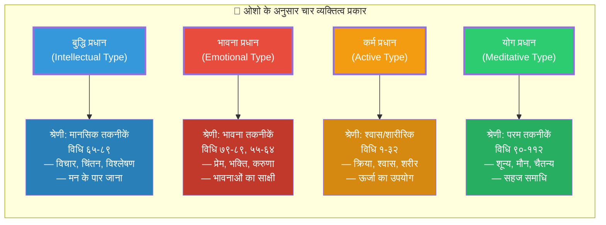
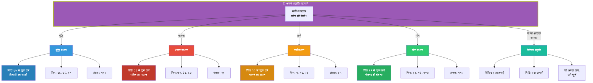

# आपकी प्रकृति के अनुसार तकनीक: व्यक्तित्व परीक्षण

> **"११२ तकनीकें — ११२ प्रकार के लोगों के लिए। हो सकता है कि तुम्हारे पड़ोसी के लिए जो काम करे, वह तुम्हारे लिए न करे। और यह ठीक है। तुम अलग हो — तुम्हारी तकनीक भी अलग होगी।"**
> — **ओशो**, विज्ञान भैरव तंत्र पर प्रवचन

---

<!-- Image Gallery -->
<div style="display:flex;flex-wrap:wrap;gap:4px;margin:16px 0;padding:12px;background:#f8fafc;border-radius:8px;border:1px solid #e2e8f0;">
<a href="../../../assets/images/lessons/vigyan-bhairav-tantra/personality-technique-matcher/hero.svg" target="_blank" rel="noopener">
  
</a>
<a href="../../../assets/images/lessons/vigyan-bhairav-tantra/personality-technique-matcher/handwritten-notes.svg" target="_blank" rel="noopener">
  
</a>
<a href="../../../assets/images/lessons/vigyan-bhairav-tantra/personality-technique-matcher/sticky-notes.svg" target="_blank" rel="noopener">
  
</a>
<a href="../../../assets/images/lessons/vigyan-bhairav-tantra/personality-technique-matcher/visual-explanation.svg" target="_blank" rel="noopener">
  
</a>
<a href="../../../assets/images/lessons/vigyan-bhairav-tantra/personality-technique-matcher/architecture.svg" target="_blank" rel="noopener">
  
</a>
<a href="../../../assets/images/lessons/vigyan-bhairav-tantra/personality-technique-matcher/workflow.svg" target="_blank" rel="noopener">
  
</a>
<a href="../../../assets/images/lessons/vigyan-bhairav-tantra/personality-technique-matcher/mindmap.svg" target="_blank" rel="noopener">
  
</a>
<a href="../../../assets/images/lessons/vigyan-bhairav-tantra/personality-technique-matcher/comparison.svg" target="_blank" rel="noopener">
  
</a>
<a href="../../../assets/images/lessons/vigyan-bhairav-tantra/personality-technique-matcher/cheatsheet.svg" target="_blank" rel="noopener">
  
</a>
<a href="../../../assets/images/lessons/vigyan-bhairav-tantra/personality-technique-matcher/interview-quiz.svg" target="_blank" rel="noopener">
  
</a>
<a href="../../../assets/images/lessons/vigyan-bhairav-tantra/personality-technique-matcher/social-card.svg" target="_blank" rel="noopener">
  
</a>
</div>
<!-- End Image Gallery -->

## इस परीक्षण का उद्देश्य

यह परीक्षण ओशो के **व्यक्तित्व-आधारित वर्गीकरण** पर आधारित है। ओशो ने अपने प्रवचनों में स्पष्ट किया कि सभी ११२ तकनीकें सभी के लिए नहीं हैं — हर व्यक्ति की अपनी प्रकृति होती है, और उसी प्रकृति के अनुसार तकनीक चुननी चाहिए।

**इस परीक्षण के बाद आप:**
- अपनी मूल प्रकृति को पहचान पाएंगे
- जान पाएंगे कि आपके लिए कौन सी २० तकनीकें सबसे उपयुक्त हैं
- समझ पाएंगे कि ओशो ने व्यक्तित्व के अनुसार तकनीकों का वर्गीकरण क्यों किया

---

## ओशो के चार व्यक्तित्व प्रकार



**ओशो वाणी:**
> "चार प्रकार के लोग हैं — और चार प्रकार की तकनीकें। बुद्धिजीवी के लिए मानसिक तकनीकें, भावुक के लिए भावना तकनीकें, कर्मठ के लिए शारीरिक तकनीकें, और ध्यानी के लिए परम तकनीकें। लेकिन याद रखो — ये विभाजन पत्थर की लकीरें नहीं हैं। हर व्यक्ति में चारों प्रकार मौजूद हैं — बस एक प्रधान है।"

---

## व्यक्तित्व परीक्षण: १० प्रश्न

**निर्देश:** प्रत्येक प्रश्न में चार विकल्प हैं। वह चुनें जो आपके सबसे करीब हो। प्रत्येक विकल्प का एक स्कोर है — अपने कुल स्कोर को अंत में जोड़ें।

### प्रश्न १

जब आप किसी समस्या का सामना करते हैं, तो आप सबसे पहले क्या करते हैं?

| विकल्प | स्कोर |
|--------|-------|
| **(क)** मैं उसे तर्क से समझने की कोशिश करता हूँ — कारण ढूँढ़ता हूँ, विश्लेषण करता हूँ | बुद्धि +१ |
| **(ख)** मैं महसूस करता हूँ — अपनी भावनाओं को सुनता हूँ, सहज ज्ञान पर भरोसा करता हूँ | भावना +१ |
| **(ग)** मैं तुरंत कुछ करता हूँ — कोई हल निकालता हूँ, एक्शन लेता हूँ | कर्म +१ |
| **(घ)** मैं ठहर जाता हूँ — देखता हूँ, समस्या को अपने आप सुलझने देता हूँ | योग +१ |

### प्रश्न २

छुट्टी के दिन आप सबसे अधिक क्या करना पसंद करते हैं?

| विकल्प | स्कोर |
|--------|-------|
| **(क)** कोई अच्छी किताब पढ़ना, कोई नया विषय सीखना, कोई वृत्तचित्र देखना | बुद्धि +१ |
| **(ख)** दोस्तों से मिलना, संगीत सुनना, किसी के साथ समय बिताना | भावना +१ |
| **(ग)** टहलना, व्यायाम करना, कोई नया प्रोजेक्ट शुरू करना, बागवानी | कर्म +१ |
| **(घ)** अकेले बैठना, कुछ न करना, शांति का आनंद लेना | योग +१ |

### प्रश्न ३

आपके दोस्त आपको कैसे वर्णित करेंगे?

| विकल्प | स्कोर |
|--------|-------|
| **(क)** विचारशील, बुद्धिमान, विश्लेषणात्मक, कभी-कभी अति-सोचने वाला | बुद्धि +१ |
| **(ख)** संवेदनशील, दयालु, भावुक, दूसरों की भावनाओं को समझने वाला | भावना +१ |
| **(ग)** ऊर्जावान, कार्यशील, व्यावहारिक, हमेशा कुछ न कुछ करता रहता है | कर्म +१ |
| **(घ)** शांत, धैर्यवान, संतुलित, आसानी से विचलित नहीं होता | योग +१ |

### प्रश्न ४

जब आप क्रोधित होते हैं, तो आपकी सामान्य प्रतिक्रिया क्या होती है?

| विकल्प | स्कोर |
|--------|-------|
| **(क)** मैं उसे समझने की कोशिश करता हूँ — क्यों आया, कहाँ से आया | बुद्धि +१ |
| **(ख)** मैं उसे दबाता नहीं — लेकिन उसे दूसरों पर नहीं निकालता; बस महसूस करता हूँ | भावना +१ |
| **(ग)** मैं तुरंत प्रतिक्रिया देता हूँ — कभी चिल्लाता हूँ, कभी कमरे से बाहर निकल जाता हूँ | कर्म +१ |
| **(घ)** मैं चुप रहता हूँ — क्रोध को आने-जाने देता हूँ, उससे पहचान नहीं बनाता | योग +१ |

### प्रश्न ५

ध्यान के बारे में सुनकर आपकी पहली प्रतिक्रिया क्या होती है?

| विकल्प | स्कोर |
|--------|-------|
| **(क)** यह दिलचस्प है — मैं इसके पीछे का विज्ञान और दर्शन समझना चाहता हूँ | बुद्धि +१ |
| **(ख)** यह अच्छा लगता है — मैं शांति और आनंद का अनुभव करना चाहता हूँ | भावना +१ |
| **(ग)** मैं इसे आज़माना चाहता हूँ — कोई तकनीक बताओ, मैं करके देखूँगा | कर्म +१ |
| **(घ)** ध्यान तो वही है जो मैं पहले से कर रहा हूँ — बिना नाम दिए | योग +१ |

### प्रश्न ६

आपके लिए सबसे अधिक आध्यात्मिक अनुभव क्या है?

| विकल्प | स्कोर |
|--------|-------|
| **(क)** सत्य को समझना, कोई गहरा सिद्धांत पकड़ में आना, अचानक कुछ स्पष्ट हो जाना | बुद्धि +१ |
| **(ख)** प्रकृति में खो जाना, किसी से गहरा प्रेम करना, संगीत में डूब जाना | भावना +१ |
| **(ग)** किसी काम में पूरी तरह डूब जाना, नृत्य में खो जाना, दौड़ने के बाद का आनंद | कर्म +१ |
| **(घ)** बिना किसी कारण के शांत और आनंदित होना — बस होना | योग +१ |

### प्रश्न ७

आपकी सबसे बड़ी कमजोरी क्या है?

| विकल्प | स्कोर |
|--------|-------|
| **(क)** अति-विश्लेषण — मैं चीज़ों को इतना सोचता हूँ कि उनमें उलझ जाता हूँ | बुद्धि +१ |
| **(ख)** भावनात्मक अस्थिरता — मैं जल्दी भावनाओं में बह जाता हूँ | भावना +१ |
| **(ग)** बेचैनी — मैं एक जगह शांत नहीं बैठ सकता, हमेशा कुछ करना चाहता हूँ | कर्म +१ |
| **(घ)** अलगाव — मैं इतना शांत हूँ कि लोगों से जुड़ नहीं पाता | योग +१ |

### प्रश्न ८

आप किस वातावरण में सबसे अधिक सहज महसूस करते हैं?

| विकल्प | स्कोर |
|--------|-------|
| **(क)** पुस्तकालय, अध्ययन कक्ष, शांत जगह जहाँ सोचा जा सके | बुद्धि +१ |
| **(ख)** प्रकृति में — पहाड़, नदी, जंगल — जहाँ दिल खुल जाए | भावना +१ |
| **(ग)** जिम, खेल का मैदान, कार्यशाला — जहाँ कुछ किया जा सके | कर्म +१ |
| **(घ)** कोई भी जगह — मैं हर जगह समान महसूस करता हूँ | योग +१ |

### प्रश्न ९

जब आप कोई नई चीज़ सीखते हैं, तो आप कैसे सीखते हैं?

| विकल्प | स्कोर |
|--------|-------|
| **(क)** पहले सिद्धांत समझता हूँ — किताबें पढ़ता हूँ, वीडियो देखता हूँ, फिर अभ्यास करता हूँ | बुद्धि +१ |
| **(ख)** किसी से सीखता हूँ — जिस पर भरोसा हो, उसके साथ सीखना पसंद है | भावना +१ |
| **(ग)** करके सीखता हूँ — सीधे कूद पड़ता हूँ, गलतियाँ करता हूँ, सीखता हूँ | कर्म +१ |
| **(घ)** देखकर सीखता हूँ — पहले दूसरों को करते देखता हूँ, फिर अपने आप हो जाता है | योग +१ |

### प्रश्न १०

आपके अनुसार आध्यात्मिकता का सबसे अच्छा मार्ग क्या है?

| विकल्प | स्कोर |
|--------|-------|
| **(क)** गीता पढ़ना, उपनिषद समझना, दर्शन का अध्ययन करना | बुद्धि +१ |
| **(ख)** भक्ति करना, कीर्तन में शामिल होना, गुरु के प्रति समर्पित होना | भावना +१ |
| **(ग)** सेवा करना, योगाभ्यास करना, तीर्थयात्रा पर जाना | कर्म +१ |
| **(घ)** मौन में बैठना, ध्यान करना, अपने भीतर झाँकना | योग +१ |

---

## स्कोर गणना

प्रत्येक श्रेणी में आपके अंक गिनें:

| श्रेणी | कुल अंक |
|--------|---------|
| **बुद्धि प्रधान** (Intellectual) | ___ / १० |
| **भावना प्रधान** (Emotional) | ___ / १० |
| **कर्म प्रधान** (Active) | ___ / १० |
| **योग प्रधान** (Meditative) | ___ / १० |

> **ध्यान दें:** यदि दो श्रेणियों में समान अंक हैं, तो इसका अर्थ है कि आप मिश्रित प्रकृति के हैं। ओशो कहते हैं — यह अच्छा है। आप कई प्रकार की तकनीकों का लाभ उठा सकते हैं।

---

## परिणाम: आपकी प्रकृति और आपकी तकनीकें

### यदि आप **बुद्धि प्रधान** हैं (सर्वोच्च स्कोर: बुद्धि)

**ओशो वाणी:**
> "बुद्धिजीवी के लिए सबसे कठिन काम है — बुद्धि को छोड़ना। वह अपनी बुद्धि से चिपका रहता है। लेकिन अगर वह अपनी बुद्धि का ही उपयोग करके उसे पार कर जाए — तो उसकी यात्रा सबसे तेज़ होती है। क्योंकि वही समझ सकता है कि मैं शरीर नहीं हूँ, मैं मन नहीं हूँ — मैं चेतना हूँ।"

#### आपकी २० सर्वश्रेष्ठ तकनीकें

| क्रमांक | तकनीक | श्रेणी | कठिनाई | क्यों? (ओशो के अनुसार) |
|---------|-------|--------|--------|------------------------|
| ३ | श्वास-प्रश्वास साक्षी | श्वास | बहुत सरल | बुद्धिजीवी को तुरंत समझ आता है — 'देखना' क्या है |
| ४ | श्वास रुकने पर | श्वास | मध्यम | ठहराव को समझना बुद्धि को आकर्षित करता है |
| ५ | प्राण-शून्य विस्तार | श्वास | मध्यम | अवधारणात्मक — बुद्धि को चुनौती देता है |
| ३३ | बिंदु ध्यान | इन्द्रिय | सरल | एकाग्रता — बुद्धि को स्थिर करता है |
| ३६ | अन्तराल दृष्टि | इन्द्रिय | मध्यम | दो वस्तुओं के बीच — अवधारणात्मक अंतराल |
| ४५ | अपनी ही ध्वनि | इन्द्रिय | मध्यम | आत्म-अवलोकन — बुद्धि को रुचिकर |
| ४६ | मौन को सुनो | इन्द्रिय | मध्यम | ध्वनि और मौन का द्वंद्व — विश्लेषण के लिए उपयुक्त |
| ६५ | विचारों का साक्षी | मानसिक | सरल | **बुद्धिजीवी के लिए सबसे अच्छी तकनीक** — विचारों को देखो |
| ६६ | विचार अंतराल | मानसिक | मध्यम | दो विचारों के बीच — बुद्धि के लिए रोमांचक |
| ६७ | एक विचार पर स्थिर | मानसिक | मध्यम | एक विचार को बार-बार — उसे समाप्त करने के लिए |
| ६८ | मन का मूल | मानसिक | कठिन | "यह विचार कहाँ से आया?" — बुद्धि के लिए परम चुनौती |
| ७३ | समय का ध्यान | मानसिक | कठिन | समय एक अवधारणा है — बुद्धि को भाता है |
| ७६ | अहंकार का विश्लेषण | मानसिक | कठिन | अहंकार को समझना — बुद्धि का अपना क्षेत्र |
| ९० | प्रकाश में प्रकाश | परम | कठिन | चैतन्य की अवधारणा — बुद्धि को गहराई देता है |
| ९१ | चैतन्य ही चैतन्य | परम | कठिन | "मैं शुद्ध चैतन्य हूँ" — अंतिम समझ |
| ९२ | सब चैतन्य है | परम | कठिन | ब्रह्मांड को चेतना के रूप में देखना |
| ९३ | साक्षी का साक्षी | परम | अति कठिन | देखने वाले को देखना — बुद्धि की परम यात्रा |
| ९७ | निर्विकल्प ध्यान | परम | अति कठिन | बिना विकल्प के — बुद्धि का अंतिम विश्राम |
| १०० | शून्य में स्थिर | परम | अति कठिन | शून्य — बुद्धि की सीमा पर |
| ११२ | अंतिम विधि | परम | अति कठिन | सब कुछ छोड़ना — बुद्धि को भी |

**ओशो की सलाह:**
> "बुद्धिजीवी, तुम्हारे लिए मेरी सलाह है — विचारों को मत दबाओ। उन्हें देखो। उन्हें इतनी गहराई से देखो कि वे अपने आप गायब हो जाएँ। विधि ६५ — विचारों का साक्षी — यह तुम्हारी तकनीक है। इससे शुरू करो।"

---

### यदि आप **भावना प्रधान** हैं (सर्वोच्च स्कोर: भावना)

**ओशो वाणी:**
> "भावुक व्यक्ति के पास एक बड़ी ताकत है — वह प्रेम कर सकता है। वह समर्पित हो सकता है। वह अपने आप को भूल सकता है। यही ध्यान का आधार है — स्वयं को भूल जाना। भावुक व्यक्ति के लिए भक्ति सबसे सरल मार्ग है।"

#### आपकी २० सर्वश्रेष्ठ तकनीकें

| क्रमांक | तकनीक | श्रेणी | कठिनाई | क्यों? (ओशो के अनुसार) |
|---------|-------|--------|--------|------------------------|
| ६ | शरीर का प्रवाह | शारीरिक | सरल | शरीर में ऊर्जा को महसूस करना |
| १८ | त्वचा का ध्यान | शारीरिक | सरल | स्पर्श की संवेदना — भावुक के लिए स्वाभाविक |
| १९ | ठंड-गर्म का ध्यान | शारीरिक | मध्यम | द्वंद्व को महसूस करना — संवेदनशीलता विकसित करना |
| २१ | आलिंगन का ध्यान | शारीरिक | मध्यम | **भावुक के लिए विशेष** — प्रेम और ध्यान का मिलन |
| ४३ | सभी ध्वनियाँ | इन्द्रिय | सरल | ध्वनियों में खो जाना — भावुक को आनंद देता है |
| ५५ | स्वाद ध्यान | इन्द्रिय | सरल | भोजन में पूरी उपस्थिति |
| ५७ | स्पर्श का ध्यान | इन्द्रिय | मध्यम | किसी वस्तु को छूना और उसमें डूब जाना |
| ५८ | गंध का ध्यान | इन्द्रिय | सरल | गंध — सबसे भावनात्मक इंद्रिय |
| ६४ | भ्रमरी | इन्द्रिय | मध्यम | गूँज — भावना को गहराई देता है |
| ७९ | भावनाओं का साक्षी | मानसिक | मध्यम | **भावुक के लिए केंद्रीय तकनीक** |
| ८० | क्रोध को देखो | मानसिक | कठिन | क्रोध — भावुक की बड़ी चुनौती |
| ८१ | प्रेम को देखो | मानसिक | कठिन | प्रेम में भी जागरूक रहना |
| ८२ | भक्ति का ध्यान | मानसिक | मध्यम | **भावुक के लिए सबसे उपयुक्त** — देवता/गुरु में डूबना |
| ८३ | शून्य में समर्पण | मानसिक | अति कठिन | पूरा समर्पण — भावुक की परम यात्रा |
| ८४ | करुणा ध्यान | मानसिक | मध्यम | करुणा — भावुक का स्वाभाविक ध्यान |
| ८५ | मैत्री ध्यान | मानसिक | मध्यम | सबसे मित्रता — भावुक के दिल का रास्ता |
| ८७ | आनंद ध्यान | मानसिक | मध्यम | आनंद को देखना — उसमें खोना नहीं |
| ९४ | प्रेम-चैतन्य | परम | अति कठिन | प्रेम और चेतना का मिलन |
| ९९ | हृदय-शून्य | परम | अति कठिन | दिल का खालीपन — भावुक की परम अवस्था |
| १०६ | सहज भाव | परम | अति कठिन | बिना प्रयास के प्रेम में होना |

**ओशो की सलाह:**
> "भावुक, तुम्हारे पास सबसे बड़ी क्षमता है — तुम समर्पण कर सकते हो। यह बहुत बड़ी बात है। विधि ८२ — भक्ति का ध्यान — यह तुम्हारी तकनीक है। किसी देवता या गुरु में पूरी तरह डूब जाओ। खो जाओ। और उस खोने में पाओगे।"

---

### यदि आप **कर्म प्रधान** हैं (सर्वोच्च स्कोर: कर्म)

**ओशो वाणी:**
> "कर्मठ व्यक्ति के लिए सबसे अच्छी बात यह है कि वह शांत नहीं बैठ सकता — और यह कोई बुरी बात नहीं है। उसे क्रिया चाहिए। उसके लिए ध्यान का अर्थ है — क्रिया में ही जागरूक होना। नाचते हुए ध्यान, चलते हुए ध्यान, साँस लेते हुए ध्यान — ये उसके लिए हैं।"

#### आपकी २० सर्वश्रेष्ठ तकनीकें

| क्रमांक | तकनीक | श्रेणी | कठिनाई | क्यों? (ओशो के अनुसार) |
|---------|-------|--------|--------|------------------------|
| १ | श्वास-प्राण धारण | श्वास | बहुत सरल | **कर्मठ के लिए सबसे सरल** — श्वास को देखो |
| २ | प्राण-अपान संयोग | श्वास | सरल | श्वास के साथ कुछ 'करना' — कर्मठ को अच्छा लगता है |
| ६ | श्वास अनुप्राण | श्वास | सरल | श्वास के साथ चलना — क्रिया में ध्यान |
| ७ | कुंभक प्रज्ञा | श्वास | मध्यम | श्वास रोकना — एक क्रिया जो ध्यान में ले जाती है |
| ९ | पूर्ण श्वास | श्वास | सरल | गहरी श्वास — शारीरिक क्रिया |
| १२ | श्वास-नाद | श्वास | मध्यम | श्वास की आवाज़ — करने में मज़ा आता है |
| १६ | शरीर का साक्षी | शारीरिक | सरल | पूरे शरीर को देखना — कर्मठ को स्वाभाविक |
| १७ | अंग-प्रत्यंग ध्यान | शारीरिक | सरल | एक-एक अंग — क्रिया-आधारित |
| २० | दर्द का ध्यान | शारीरिक | कठिन | शारीरिक संवेदना — कर्मठ के लिए चुनौतीपूर्ण |
| २२ | चलने का ध्यान | शारीरिक | सरल | **कर्मठ के लिए उत्तम** — चलते हुए ध्यान |
| २३ | नृत्य ध्यान | शारीरिक | सरल | नाचते हुए ध्यान — ऊर्जा को मुक्त करना |
| २५ | मुद्रा ध्यान | शारीरिक | मध्यम | हाथ की मुद्राएँ — क्रिया-प्रधान |
| २६ | आसन ध्यान | शारीरिक | सरल | बैठने का ध्यान — शरीर को स्थिर करना |
| २८ | भोजन ध्यान | शारीरिक | मध्यम | खाने की क्रिया में ध्यान |
| २९ | स्नान ध्यान | शारीरिक | सरल | नहाने की क्रिया में जागरूकता |
| ३० | कर्म ध्यान | शारीरिक | मध्यम | किसी भी काम को ध्यान बनाना |
| ३५ | प्रकाश ध्यान | इन्द्रिय | सरल | प्रकाश को देखना — एक सरल क्रिया |
| ४४ | नाद ब्रह्म | इन्द्रिय | सरल | ध्वनि पर ध्यान — करने में सरल |
| ५१ | ऊर्जा स्पंदन | इन्द्रिय | मध्यम | शरीर में ऊर्जा को महसूस करना |
| ६९ | कल्पना को देखो | मानसिक | सरल | मन की तस्वीरें — लेकिन केवल देखना |

**ओशो की सलाह:**
> "कर्मठ, तुम्हारे लिए सबसे अच्छी तकनीक है — चलने का ध्यान (विधि २२)। तुम चल सकते हो, तुम दौड़ सकते हो, तुम नाच सकते हो — लेकिन पूरी जागरूकता के साथ। अपनी ऊर्जा को दबाओ मत — उसे ध्यान में बदलो।"

---

### यदि आप **योग प्रधान** हैं (सर्वोच्च स्कोर: योग)

**ओशो वाणी:**
> "ध्यानी व्यक्ति पहले से ही आधा रास्ता तय कर चुका है। वह शांत है, वह ठहरा हुआ है — बस थोड़ी सी चेतना चाहिए। उसके लिए सबसे उपयुक्त हैं — परम तकनीकें, शून्य तकनीकें। उसे कुछ करने की ज़रूरत नहीं — बस थोड़ा और जागना है।"

#### आपकी २० सर्वश्रेष्ठ तकनीकें

| क्रमांक | तकनीक | श्रेणी | कठिनाई | क्यों? (ओशो के अनुसार) |
|---------|-------|--------|--------|------------------------|
| ३ | श्वास-प्रश्वास साक्षी | श्वास | बहुत सरल | केवल देखना — ध्यानी के लिए स्वाभाविक |
| ४ | श्वास रुकने पर | श्वास | मध्यम | ठहराव — ध्यानी का स्वभाव |
| ११ | प्राण-बिंदु धारणा | श्वास | मध्यम | एक बिंदु पर ध्यान — ध्यानी को गहराई देता है |
| १४ | पंच-प्राण एकीकरण | श्वास | कठिन | प्राणों का एकीकरण — ध्यानी की परम तैयारी |
| ३६ | अन्तराल दृष्टि | इन्द्रिय | मध्यम | खाली स्थान — ध्यानी का क्षेत्र |
| ३७ | भौंहों के बीच | इन्द्रिय | मध्यम | तीसरी आँख — ध्यानी का प्राकृतिक केंद्र |
| ४६ | मौन को सुनो | इन्द्रिय | मध्यम | मौन — ध्यानी की भाषा |
| ४७ | अनाहत नाद | इन्द्रिय | कठिन | बिना बजाई आवाज़ — ध्यानी की गहराई |
| ६६ | विचार अंतराल | मानसिक | मध्यम | विचारों के बीच — ध्यानी का प्रवेश द्वार |
| ७० | स्वप्न का ध्यान | मानसिक | मध्यम | स्वप्न में भी जागरूकता |
| ७२ | निद्रा का ध्यान | मानसिक | कठिन | सोते हुए भी जागरूक — परम ध्यान |
| ८३ | शून्य में समर्पण | मानसिक | अति कठिन | पूर्ण शून्यता — ध्यानी के लिए |
| ९० | प्रकाश में प्रकाश | परम | कठिन | चैतन्य का प्रकाश — ध्यानी का स्वभाव |
| ९१ | चैतन्य ही चैतन्य | परम | कठिन | **ध्यानी के लिए सबसे उपयुक्त** |
| ९३ | साक्षी का साक्षी | परम | अति कठिन | देखने वाले को देखना |
| ९५ | निर्विकल्प समाधि | परम | अति कठिन | बिना विकल्प के — ध्यानी की परम अवस्था |
| ९८ | शून्य में डुबकी | परम | अति कठिन | शून्य — ध्यानी का घर |
| १०३ | सहज समाधि | परम | अति कठिन | स्वाभाविक समाधि |
| १०८ | उन्मनी अवस्था | परम | अति कठिन | मन के पार |
| ११२ | अंतिम विधि | परम | अति कठिन | **ध्यानी की परम तकनीक** — बस होना |

**ओशो की सलाह:**
> "ध्यानी, तुम पहले से ही करीब हो। तुम्हारे लिए सबसे अच्छी तकनीक है — विधि ११२ — अंतिम विधि। कुछ मत करो। बस हो। तुम पहले से ही वहाँ हो — बस इसे जानो। और यदि विधि ११२ बहुत कठिन लगे, तो विधि ९१ से शुरू करो — 'मैं शुद्ध चैतन्य हूँ'।"

---

## मिश्रित प्रकृति वालों के लिए

यदि आपके दो या अधिक श्रेणियों में समान स्कोर हैं, तो आप **मिश्रित प्रकृति** के हैं। ओशो के अनुसार, यह दुर्लभ है — लेकिन बहुत संभावनाशील है।

**ओशो वाणी:**
> "कुछ लोग ऐसे होते हैं जो एक श्रेणी में नहीं आते — वे अनेक हैं। यह कठिन भी है और सुंदर भी। कठिन इसलिए कि उन्हें एक तकनीक चुनने में समय लगता है। सुंदर इसलिए कि जब वे चुन लेते हैं, तो उनकी यात्रा और गहरी होती है।"

### मिश्रण के अनुसार सुझाव

| मिश्रण | ओशो का सुझाव |
|--------|--------------|
| **बुद्धि + भावना** | विधि ७९ — भावना का साक्षी (दोनों को जोड़ती है) |
| **बुद्धि + कर्म** | विधि २ — प्राण-अपान संयोग (क्रिया + बुद्धि) |
| **बुद्धि + योग** | विधि ९३ — साक्षी का साक्षी (बुद्धि और ध्यान का मिलन) |
| **भावना + कर्म** | विधि २३ — नृत्य ध्यान (भावना + क्रिया) |
| **भावना + योग** | विधि ८२ — भक्ति का ध्यान (प्रेम + मौन) |
| **कर्म + योग** | विधि १ — श्वास-प्राण धारण (सरल क्रिया + ध्यान) |
| **सभी चारों बराबर** | विधि ११२ — अंतिम विधि (सबसे संतुलित) |

---

## निर्णय वृक्ष: एक दृष्टि में



---

## ओशो के अनुसार तकनीक चुनने के चार नियम

**ओशो वाणी:**
> "तकनीक चुनना कोई विज्ञान नहीं है — यह एक कला है। कोई गारंटी नहीं है कि तुम्हारी पसंद सही होगी। लेकिन चार नियम हैं जो मदद कर सकते हैं।"

### नियम १: तकनीक तुम्हें खींचे

जो तकनीक पढ़ते ही तुम्हारे भीतर कुछ कहती है — "हाँ, यह मेरे लिए है" — वह तुम्हारी तकनीक है। यदि कोई तकनीक उबाऊ लगती है, तो छोड़ दो।

### नियम २: तीन दिन का नियम

किसी तकनीक को कम से कम तीन दिन लगातार करो। ओशो कहते हैं — पहले दिन अजीब लगती है, दूसरे दिन थोड़ी समझ आती है, तीसरे दिन कुछ घटित होता है।

### नियम ३: सरल से शुरू करो

सबसे सरल तकनीक से शुरू करो। ओशो कहते हैं — विधि १ (श्वास देखना) सबसे सरल और सबसे गहरी है। अगर वह काम करे, तो और कुछ चाहिए ही नहीं।

### नियम ४: तकनीक को छोड़ना भी सीखो

जब तकनीक काम करने लगे — जब वह स्वाभाविक हो जाए — तब उसे भी छोड़ दो। तकनीक नाव है — पार उतरने के बाद उसे छोड़ दो।

---

## सात दिन का प्रयोग: अपनी तकनीक को परखें

| दिन | सुबह (१० मिनट) | शाम (१५ मिनट) | अनुभव नोट करें |
|-----|---------------|---------------|----------------|
| **दिन १** | अपनी चुनी तकनीक करें | वही तकनीक दोहराएँ | कैसा लगा? अजीब? सरल? |
| **दिन २** | वही तकनीक — थोड़ा गहरे | वही — अवधि बढ़ाएँ | कोई बदलाव? कोई प्रतिरोध? |
| **दिन ३** | वही तकनीक | वही — ओशो का वीडियो/ऑडियो सुनें | कुछ घटित हुआ? |
| **दिन ४** | कोई दूसरी तकनीक (अगर पहली अच्छी न लगे) | पहली वापस | क्या अंतर महसूस हुआ? |
| **दिन ५** | अपनी पसंदीदा तकनीक | वही — बिना प्रयास के | क्या यह स्वाभाविक लगने लगी? |
| **दिन ६** | वही — लेकिन कम प्रयास | वही — मौन में | क्या तकनीक पतली हो रही है? |
| **दिन ७** | वही या कोई नई | मूल्यांकन करें | क्या यह तुम्हारी तकनीक है? |

**अगर सात दिन बाद तकनीक तुम्हें अच्छी न लगे:** ओशो कहते हैं — कोई बात नहीं। १११ तकनीकें और बची हैं। कोई दूसरी चुनो।

**अगर सात दिन बाद तकनीक तुम्हें गहराई में ले जाए:** ओशो कहते हैं — अब इसे ४० दिन तक करो। चालीस दिन में तकनीक तुम्हारी हड्डियों में उतर जाएगी।

---

## TypeScript: PersonalityTest Class

```typescript
/**
 * ============================================================
 * व्यक्तित्व परीक्षण — ओशो के चार प्रकारों पर आधारित
 * ============================================================
 * यह टूल व्यक्तित्व परीक्षण करता है, स्कोर गणना करता है,
 * और ओशो के अनुसार सर्वश्रेष्ठ तकनीकों की सिफारिश करता है।
 * 
 * ओशो कहते हैं: "अपनी प्रकृति को जानो — और तुम जान जाओगे
 * कि कौन सी तकनीक तुम्हारे लिए है।"
 */

// ─── प्रकार (Types) ─────────────────────────────────────────

/** ओशो के चार व्यक्तित्व प्रकार */
enum PersonalityType {
  BUDDHI = 'बुद्धि_प्रधान',
  BHAVANA = 'भावना_प्रधान',
  KARMA = 'कर्म_प्रधान',
  YOGA = 'योग_प्रधान',
}

/** परीक्षण प्रश्न */
interface QuizQuestion {
  id: number;
  question: string;
  options: {
    text: string;
    type: PersonalityType;
  }[];
}

/** परीक्षण परिणाम */
interface TestResult {
  primaryType: PersonalityType;
  scores: Record<PersonalityType, number>;
  isMixed: boolean;
  mixedTypes: PersonalityType[];
  recommendedTechniques: RecommendedTechnique[];
  oshoMessage: string;
}

/** अनुशंसित तकनीक */
interface RecommendedTechnique {
  id: number;
  name: string;
  category: string;
  difficulty: string;
  reason: string;
  isOshoRecommended: boolean;
}

// ─── व्यक्तित्व परीक्षण वर्ग ───────────────────────────────

class PersonalityTest {
  private questions: QuizQuestion[] = [];
  private techniqueLibrary: Map<string, RecommendedTechnique[]> = new Map();

  constructor() {
    this.initializeQuestions();
    this.initializeTechniques();
  }

  private initializeQuestions(): void {
    this.questions = [
      {
        id: 1,
        question: 'जब आप किसी समस्या का सामना करते हैं, तो आप सबसे पहले क्या करते हैं?',
        options: [
          { text: 'मैं उसे तर्क से समझने की कोशिश करता हूँ', type: PersonalityType.BUDDHI },
          { text: 'मैं महसूस करता हूँ — अपनी भावनाओं को सुनता हूँ', type: PersonalityType.BHAVANA },
          { text: 'मैं तुरंत कुछ करता हूँ — एक्शन लेता हूँ', type: PersonalityType.KARMA },
          { text: 'मैं ठहर जाता हूँ — देखता हूँ', type: PersonalityType.YOGA },
        ],
      },
      {
        id: 2,
        question: 'छुट्टी के दिन आप सबसे अधिक क्या करना पसंद करते हैं?',
        options: [
          { text: 'कोई अच्छी किताब पढ़ना, कोई नया विषय सीखना', type: PersonalityType.BUDDHI },
          { text: 'दोस्तों से मिलना, संगीत सुनना', type: PersonalityType.BHAVANA },
          { text: 'टहलना, व्यायाम करना, कोई नया प्रोजेक्ट', type: PersonalityType.KARMA },
          { text: 'अकेले बैठना, कुछ न करना', type: PersonalityType.YOGA },
        ],
      },
      {
        id: 3,
        question: 'आपके दोस्त आपको कैसे वर्णित करेंगे?',
        options: [
          { text: 'विचारशील, बुद्धिमान, विश्लेषणात्मक', type: PersonalityType.BUDDHI },
          { text: 'संवेदनशील, दयालु, भावुक', type: PersonalityType.BHAVANA },
          { text: 'ऊर्जावान, कार्यशील, व्यावहारिक', type: PersonalityType.KARMA },
          { text: 'शांत, धैर्यवान, संतुलित', type: PersonalityType.YOGA },
        ],
      },
      {
        id: 4,
        question: 'जब आप क्रोधित होते हैं, तो आपकी सामान्य प्रतिक्रिया क्या होती है?',
        options: [
          { text: 'मैं उसे समझने की कोशिश करता हूँ', type: PersonalityType.BUDDHI },
          { text: 'मैं उसे महसूस करता हूँ — दबाता नहीं', type: PersonalityType.BHAVANA },
          { text: 'मैं तुरंत प्रतिक्रिया देता हूँ', type: PersonalityType.KARMA },
          { text: 'मैं चुप रहता हूँ — क्रोध को आने-जाने देता हूँ', type: PersonalityType.YOGA },
        ],
      },
      {
        id: 5,
        question: 'ध्यान के बारे में सुनकर आपकी पहली प्रतिक्रिया क्या होती है?',
        options: [
          { text: 'मैं इसके पीछे का विज्ञान समझना चाहता हूँ', type: PersonalityType.BUDDHI },
          { text: 'यह अच्छा लगता है — शांति का अनुभव चाहता हूँ', type: PersonalityType.BHAVANA },
          { text: 'मैं इसे आज़माना चाहता हूँ — कोई तकनीक बताओ', type: PersonalityType.KARMA },
          { text: 'ध्यान तो वही है जो मैं पहले से कर रहा हूँ', type: PersonalityType.YOGA },
        ],
      },
      {
        id: 6,
        question: 'आपके लिए सबसे अधिक आध्यात्मिक अनुभव क्या है?',
        options: [
          { text: 'सत्य को समझना, कोई गहरा सिद्धांत पकड़ में आना', type: PersonalityType.BUDDHI },
          { text: 'प्रकृति में खो जाना, किसी से गहरा प्रेम करना', type: PersonalityType.BHAVANA },
          { text: 'किसी काम में पूरी तरह डूब जाना', type: PersonalityType.KARMA },
          { text: 'बिना किसी कारण के शांत और आनंदित होना', type: PersonalityType.YOGA },
        ],
      },
      {
        id: 7,
        question: 'आपकी सबसे बड़ी कमजोरी क्या है?',
        options: [
          { text: 'अति-विश्लेषण — चीज़ों में उलझ जाना', type: PersonalityType.BUDDHI },
          { text: 'भावनात्मक अस्थिरता — जल्दी बह जाना', type: PersonalityType.BHAVANA },
          { text: 'बेचैनी — एक जगह शांत न बैठ पाना', type: PersonalityType.KARMA },
          { text: 'अलगाव — लोगों से न जुड़ पाना', type: PersonalityType.YOGA },
        ],
      },
      {
        id: 8,
        question: 'आप किस वातावरण में सबसे अधिक सहज महसूस करते हैं?',
        options: [
          { text: 'पुस्तकालय, अध्ययन कक्ष', type: PersonalityType.BUDDHI },
          { text: 'प्रकृति में — पहाड़, नदी, जंगल', type: PersonalityType.BHAVANA },
          { text: 'जिम, खेल का मैदान, कार्यशाला', type: PersonalityType.KARMA },
          { text: 'कोई भी जगह — हर जगह समान', type: PersonalityType.YOGA },
        ],
      },
      {
        id: 9,
        question: 'जब आप कोई नई चीज़ सीखते हैं, तो कैसे सीखते हैं?',
        options: [
          { text: 'पहले सिद्धांत समझता हूँ — फिर अभ्यास', type: PersonalityType.BUDDHI },
          { text: 'किसी से सीखता हूँ — जिस पर भरोसा हो', type: PersonalityType.BHAVANA },
          { text: 'करके सीखता हूँ — सीधे कूद पड़ता हूँ', type: PersonalityType.KARMA },
          { text: 'देखकर सीखता हूँ — अपने आप हो जाता है', type: PersonalityType.YOGA },
        ],
      },
      {
        id: 10,
        question: 'आपके अनुसार आध्यात्मिकता का सबसे अच्छा मार्ग क्या है?',
        options: [
          { text: 'गीता पढ़ना, दर्शन का अध्ययन करना', type: PersonalityType.BUDDHI },
          { text: 'भक्ति करना, कीर्तन, गुरु के प्रति समर्पण', type: PersonalityType.BHAVANA },
          { text: 'सेवा करना, योगाभ्यास, तीर्थयात्रा', type: PersonalityType.KARMA },
          { text: 'मौन में बैठना, अपने भीतर झाँकना', type: PersonalityType.YOGA },
        ],
      },
    ];
  }

  private initializeTechniques(): void {
    // बुद्धि प्रधान के लिए २० तकनीकें
    this.techniqueLibrary.set(PersonalityType.BUDDHI, [
      { id: 3, name: 'श्वास-प्रश्वास साक्षी', category: 'श्वास', difficulty: 'बहुत सरल', reason: 'बुद्धिजीवी को 'देखना' तुरंत समझ आता है', isOshoRecommended: true },
      { id: 4, name: 'श्वास रुकने पर', category: 'श्वास', difficulty: 'मध्यम', reason: 'ठहराव — बुद्धि को आकर्षित करता है', isOshoRecommended: false },
      { id: 5, name: 'प्राण-शून्य विस्तार', category: 'श्वास', difficulty: 'मध्यम', reason: 'अवधारणात्मक — बुद्धि को चुनौती', isOshoRecommended: false },
      { id: 33, name: 'बिंदु ध्यान', category: 'दृष्टि', difficulty: 'सरल', reason: 'एकाग्रता — बुद्धि को स्थिर करता है', isOshoRecommended: true },
      { id: 36, name: 'अन्तराल दृष्टि', category: 'दृष्टि', difficulty: 'मध्यम', reason: 'अवधारणात्मक अंतराल', isOshoRecommended: false },
      { id: 45, name: 'अपनी ही ध्वनि', category: 'श्रवण', difficulty: 'मध्यम', reason: 'आत्म-अवलोकन', isOshoRecommended: false },
      { id: 46, name: 'मौन को सुनो', category: 'श्रवण', difficulty: 'मध्यम', reason: 'ध्वनि-मौन द्वंद्व', isOshoRecommended: false },
      { id: 65, name: 'विचारों का साक्षी', category: 'मानसिक', difficulty: 'सरल', reason: 'बुद्धिजीवी के लिए सबसे अच्छी तकनीक', isOshoRecommended: true },
      { id: 66, name: 'विचार अंतराल', category: 'मानसिक', difficulty: 'मध्यम', reason: 'बुद्धि के लिए रोमांचक', isOshoRecommended: true },
      { id: 67, name: 'एक विचार पर स्थिर', category: 'मानसिक', difficulty: 'मध्यम', reason: 'विचार को समाप्त करना', isOshoRecommended: false },
      { id: 68, name: 'मन का मूल', category: 'मानसिक', difficulty: 'कठिन', reason: 'बुद्धि के लिए परम चुनौती', isOshoRecommended: true },
      { id: 73, name: 'समय का ध्यान', category: 'मानसिक', difficulty: 'कठिन', reason: 'समय — बुद्धि को भाता है', isOshoRecommended: false },
      { id: 76, name: 'अहंकार का विश्लेषण', category: 'मानसिक', difficulty: 'कठिन', reason: 'बुद्धि का अपना क्षेत्र', isOshoRecommended: false },
      { id: 90, name: 'प्रकाश में प्रकाश', category: 'परम', difficulty: 'कठिन', reason: 'चैतन्य की अवधारणा', isOshoRecommended: false },
      { id: 91, name: 'चैतन्य ही चैतन्य', category: 'परम', difficulty: 'कठिन', reason: 'अंतिम समझ', isOshoRecommended: true },
      { id: 92, name: 'सब चैतन्य है', category: 'परम', difficulty: 'कठिन', reason: 'ब्रह्मांड को चेतना से देखना', isOshoRecommended: false },
      { id: 93, name: 'साक्षी का साक्षी', category: 'परम', difficulty: 'अति कठिन', reason: 'बुद्धि की परम यात्रा', isOshoRecommended: false },
      { id: 97, name: 'निर्विकल्प ध्यान', category: 'परम', difficulty: 'अति कठिन', reason: 'बुद्धि का अंतिम विश्राम', isOshoRecommended: false },
      { id: 100, name: 'शून्य में स्थिर', category: 'परम', difficulty: 'अति कठिन', reason: 'बुद्धि की सीमा पर', isOshoRecommended: false },
      { id: 112, name: 'अंतिम विधि', category: 'परम', difficulty: 'अति कठिन', reason: 'बुद्धि को भी छोड़ना', isOshoRecommended: true },
    ]);

    // भावना प्रधान के लिए २० तकनीकें
    this.techniqueLibrary.set(PersonalityType.BHAVANA, [
      { id: 6, name: 'शरीर का प्रवाह', category: 'शारीरिक', difficulty: 'सरल', reason: 'ऊर्जा को महसूस करना', isOshoRecommended: false },
      { id: 18, name: 'त्वचा का ध्यान', category: 'शारीरिक', difficulty: 'सरल', reason: 'भावुक के लिए स्वाभाविक', isOshoRecommended: true },
      { id: 19, name: 'ठंड-गर्म का ध्यान', category: 'शारीरिक', difficulty: 'मध्यम', reason: 'संवेदनशीलता विकसित करना', isOshoRecommended: false },
      { id: 21, name: 'आलिंगन का ध्यान', category: 'शारीरिक', difficulty: 'मध्यम', reason: 'प्रेम और ध्यान का मिलन', isOshoRecommended: true },
      { id: 43, name: 'सभी ध्वनियाँ', category: 'इन्द्रिय', difficulty: 'सरल', reason: 'ध्वनियों में खो जाना', isOshoRecommended: false },
      { id: 55, name: 'स्वाद ध्यान', category: 'इन्द्रिय', difficulty: 'सरल', reason: 'भोजन में उपस्थिति', isOshoRecommended: false },
      { id: 57, name: 'स्पर्श का ध्यान', category: 'इन्द्रिय', difficulty: 'मध्यम', reason: 'स्पर्श में डूबना', isOshoRecommended: false },
      { id: 58, name: 'गंध का ध्यान', category: 'इन्द्रिय', difficulty: 'सरल', reason: 'सबसे भावनात्मक इंद्रिय', isOshoRecommended: false },
      { id: 64, name: 'भ्रमरी', category: 'इन्द्रिय', difficulty: 'मध्यम', reason: 'गूँज — भावना को गहराई', isOshoRecommended: true },
      { id: 79, name: 'भावना का साक्षी', category: 'मानसिक', difficulty: 'मध्यम', reason: 'भावुक के लिए केंद्रीय तकनीक', isOshoRecommended: true },
      { id: 80, name: 'क्रोध को देखो', category: 'मानसिक', difficulty: 'कठिन', reason: 'भावुक की बड़ी चुनौती', isOshoRecommended: false },
      { id: 81, name: 'प्रेम को देखो', category: 'मानसिक', difficulty: 'कठिन', reason: 'प्रेम में जागरूकता', isOshoRecommended: false },
      { id: 82, name: 'भक्ति का ध्यान', category: 'मानसिक', difficulty: 'मध्यम', reason: 'भावुक के लिए सबसे उपयुक्त', isOshoRecommended: true },
      { id: 83, name: 'शून्य में समर्पण', category: 'मानसिक', difficulty: 'अति कठिन', reason: 'भावुक की परम यात्रा', isOshoRecommended: false },
      { id: 84, name: 'करुणा ध्यान', category: 'मानसिक', difficulty: 'मध्यम', reason: 'भावुक का स्वाभाविक ध्यान', isOshoRecommended: true },
      { id: 85, name: 'मैत्री ध्यान', category: 'मानसिक', difficulty: 'मध्यम', reason: 'भावुक के दिल का रास्ता', isOshoRecommended: false },
      { id: 87, name: 'आनंद ध्यान', category: 'मानसिक', difficulty: 'मध्यम', reason: 'आनंद को देखना', isOshoRecommended: false },
      { id: 94, name: 'प्रेम-चैतन्य', category: 'परम', difficulty: 'अति कठिन', reason: 'प्रेम और चेतना का मिलन', isOshoRecommended: false },
      { id: 99, name: 'हृदय-शून्य', category: 'परम', difficulty: 'अति कठिन', reason: 'भावुक की परम अवस्था', isOshoRecommended: false },
      { id: 106, name: 'सहज भाव', category: 'परम', difficulty: 'अति कठिन', reason: 'बिना प्रयास के प्रेम', isOshoRecommended: false },
    ]);

    // कर्म प्रधान के लिए २० तकनीकें
    this.techniqueLibrary.set(PersonalityType.KARMA, [
      { id: 1, name: 'श्वास-प्राण धारण', category: 'श्वास', difficulty: 'बहुत सरल', reason: 'कर्मठ के लिए सबसे सरल', isOshoRecommended: true },
      { id: 2, name: 'प्राण-अपान संयोग', category: 'श्वास', difficulty: 'सरल', reason: 'श्वास के साथ 'करना'', isOshoRecommended: true },
      { id: 6, name: 'श्वास अनुप्राण', category: 'श्वास', difficulty: 'सरल', reason: 'श्वास के साथ चलना', isOshoRecommended: false },
      { id: 7, name: 'कुंभक प्रज्ञा', category: 'श्वास', difficulty: 'मध्यम', reason: 'क्रिया जो ध्यान में ले जाए', isOshoRecommended: false },
      { id: 9, name: 'पूर्ण श्वास', category: 'श्वास', difficulty: 'सरल', reason: 'गहरी श्वास — शारीरिक क्रिया', isOshoRecommended: false },
      { id: 12, name: 'श्वास-नाद', category: 'श्वास', difficulty: 'मध्यम', reason: 'श्वास की आवाज़', isOshoRecommended: false },
      { id: 16, name: 'शरीर का साक्षी', category: 'शारीरिक', difficulty: 'सरल', reason: 'कर्मठ को स्वाभाविक', isOshoRecommended: true },
      { id: 17, name: 'अंग-प्रत्यंग ध्यान', category: 'शारीरिक', difficulty: 'सरल', reason: 'क्रिया-आधारित', isOshoRecommended: false },
      { id: 20, name: 'दर्द का ध्यान', category: 'शारीरिक', difficulty: 'कठिन', reason: 'कर्मठ के लिए चुनौती', isOshoRecommended: false },
      { id: 22, name: 'चलने का ध्यान', category: 'शारीरिक', difficulty: 'सरल', reason: 'कर्मठ के लिए उत्तम', isOshoRecommended: true },
      { id: 23, name: 'नृत्य ध्यान', category: 'शारीरिक', difficulty: 'सरल', reason: 'ऊर्जा को मुक्त करना', isOshoRecommended: false },
      { id: 25, name: 'मुद्रा ध्यान', category: 'शारीरिक', difficulty: 'मध्यम', reason: 'क्रिया-प्रधान', isOshoRecommended: false },
      { id: 26, name: 'आसन ध्यान', category: 'शारीरिक', difficulty: 'सरल', reason: 'शरीर को स्थिर करना', isOshoRecommended: false },
      { id: 28, name: 'भोजन ध्यान', category: 'शारीरिक', difficulty: 'मध्यम', reason: 'खाने की क्रिया में ध्यान', isOshoRecommended: false },
      { id: 29, name: 'स्नान ध्यान', category: 'शारीरिक', difficulty: 'सरल', reason: 'नहाने में जागरूकता', isOshoRecommended: false },
      { id: 30, name: 'कर्म ध्यान', category: 'शारीरिक', difficulty: 'मध्यम', reason: 'काम को ध्यान बनाना', isOshoRecommended: true },
      { id: 35, name: 'प्रकाश ध्यान', category: 'इन्द्रिय', difficulty: 'सरल', reason: 'सरल क्रिया', isOshoRecommended: false },
      { id: 44, name: 'नाद ब्रह्म', category: 'इन्द्रिय', difficulty: 'सरल', reason: 'ध्वनि पर ध्यान', isOshoRecommended: false },
      { id: 51, name: 'ऊर्जा स्पंदन', category: 'इन्द्रिय', difficulty: 'मध्यम', reason: 'शरीर में ऊर्जा', isOshoRecommended: false },
      { id: 69, name: 'कल्पना को देखो', category: 'मानसिक', difficulty: 'सरल', reason: 'मन की तस्वीरें देखना', isOshoRecommended: false },
    ]);

    // योग प्रधान के लिए २० तकनीकें
    this.techniqueLibrary.set(PersonalityType.YOGA, [
      { id: 3, name: 'श्वास-प्रश्वास साक्षी', category: 'श्वास', difficulty: 'बहुत सरल', reason: 'केवल देखना — ध्यानी के लिए स्वाभाविक', isOshoRecommended: true },
      { id: 4, name: 'श्वास रुकने पर', category: 'श्वास', difficulty: 'मध्यम', reason: 'ठहराव — ध्यानी का स्वभाव', isOshoRecommended: false },
      { id: 11, name: 'प्राण-बिंदु धारणा', category: 'श्वास', difficulty: 'मध्यम', reason: 'ध्यानी को गहराई देता है', isOshoRecommended: false },
      { id: 14, name: 'पंच-प्राण एकीकरण', category: 'श्वास', difficulty: 'कठिन', reason: 'ध्यानी की परम तैयारी', isOshoRecommended: false },
      { id: 36, name: 'अन्तराल दृष्टि', category: 'दृष्टि', difficulty: 'मध्यम', reason: 'खाली स्थान — ध्यानी का क्षेत्र', isOshoRecommended: false },
      { id: 37, name: 'भौंहों के बीच', category: 'दृष्टि', difficulty: 'मध्यम', reason: 'तीसरी आँख — ध्यानी का केंद्र', isOshoRecommended: true },
      { id: 46, name: 'मौन को सुनो', category: 'श्रवण', difficulty: 'मध्यम', reason: 'मौन — ध्यानी की भाषा', isOshoRecommended: false },
      { id: 47, name: 'अनाहत नाद', category: 'श्रवण', difficulty: 'कठिन', reason: 'बिन बजाई आवाज़', isOshoRecommended: true },
      { id: 66, name: 'विचार अंतराल', category: 'मानसिक', difficulty: 'मध्यम', reason: 'ध्यानी का प्रवेश द्वार', isOshoRecommended: false },
      { id: 70, name: 'स्वप्न का ध्यान', category: 'मानसिक', difficulty: 'मध्यम', reason: 'स्वप्न में जागरूकता', isOshoRecommended: false },
      { id: 72, name: 'निद्रा का ध्यान', category: 'मानसिक', difficulty: 'कठिन', reason: 'सोते हुए जागरूक', isOshoRecommended: true },
      { id: 83, name: 'शून्य में समर्पण', category: 'मानसिक', difficulty: 'अति कठिन', reason: 'पूर्ण शून्यता', isOshoRecommended: false },
      { id: 90, name: 'प्रकाश में प्रकाश', category: 'परम', difficulty: 'कठिन', reason: 'चैतन्य का प्रकाश', isOshoRecommended: false },
      { id: 91, name: 'चैतन्य ही चैतन्य', category: 'परम', difficulty: 'कठिन', reason: 'ध्यानी के लिए सबसे उपयुक्त', isOshoRecommended: true },
      { id: 93, name: 'साक्षी का साक्षी', category: 'परम', difficulty: 'अति कठिन', reason: 'देखने वाले को देखना', isOshoRecommended: true },
      { id: 95, name: 'निर्विकल्प समाधि', category: 'परम', difficulty: 'अति कठिन', reason: 'ध्यानी की परम अवस्था', isOshoRecommended: false },
      { id: 98, name: 'शून्य में डुबकी', category: 'परम', difficulty: 'अति कठिन', reason: 'ध्यानी का घर', isOshoRecommended: true },
      { id: 103, name: 'सहज समाधि', category: 'परम', difficulty: 'अति कठिन', reason: 'स्वाभाविक समाधि', isOshoRecommended: false },
      { id: 108, name: 'उन्मनी अवस्था', category: 'परम', difficulty: 'अति कठिन', reason: 'मन के पार', isOshoRecommended: false },
      { id: 112, name: 'अंतिम विधि', category: 'परम', difficulty: 'अति कठिन', reason: 'बस होना — ध्यानी की परम', isOshoRecommended: true },
    ]);
  }

  /** परीक्षण लें और परिणाम प्राप्त करें */
  takeTest(answers: PersonalityType[]): TestResult {
    if (answers.length !== this.questions.length) {
      throw new Error(`कृपया सभी ${this.questions.length} प्रश्नों के उत्तर दें`);
    }

    // स्कोर गणना
    const scores: Record<PersonalityType, number> = {
      [PersonalityType.BUDDHI]: 0,
      [PersonalityType.BHAVANA]: 0,
      [PersonalityType.KARMA]: 0,
      [PersonalityType.YOGA]: 0,
    };

    for (const answer of answers) {
      scores[answer]++;
    }

    // प्राथमिक प्रकार
    const maxScore = Math.max(...Object.values(scores));
    const primaryTypes = (Object.entries(scores) as [PersonalityType, number][])
      .filter(([_, score]) => score === maxScore)
      .map(([type]) => type);

    const isMixed = primaryTypes.length > 1;
    const primaryType = primaryTypes[0];

    // ओशो का संदेश
    const oshoMessage = this.getOshoMessage(primaryType, scores);

    // अनुशंसित तकनीकें
    let recommendedTechniques: RecommendedTechnique[] = [];
    if (isMixed) {
      // मिश्रित प्रकृति — सभी शीर्ष प्रकारों से मिलाएँ
      const allTechs = primaryTypes.flatMap(t => this.techniqueLibrary.get(t) || []);
      // डुप्लिकेट हटाएँ
      const seen = new Set<number>();
      recommendedTechniques = allTechs.filter(t => {
        if (seen.has(t.id)) return false;
        seen.add(t.id);
        return true;
      }).slice(0, 10);
    } else {
      recommendedTechniques = this.techniqueLibrary.get(primaryType) || [];
    }

    return {
      primaryType,
      scores,
      isMixed,
      mixedTypes: primaryTypes,
      recommendedTechniques,
      oshoMessage,
    };
  }

  /** सभी प्रश्न प्राप्त करें */
  getQuestions(): QuizQuestion[] {
    return [...this.questions];
  }

  /** ओशो का व्यक्तिगत संदेश */
  private getOshoMessage(type: PersonalityType, scores: Record<PersonalityType, number>): string {
    const total = Object.values(scores).reduce((a, b) => a + b, 0);
    const percentage = Math.round((scores[type] / total) * 100);

    const messages: Record<PersonalityType, string> = {
      [PersonalityType.BUDDHI]: `"बुद्धिजीवी, तुम्हारी यात्रा बुद्धि से शुरू होती है — लेकिन बुद्धि पर खत्म नहीं होती। बुद्धि को सीढ़ी बनाओ, दीवार नहीं। तुम्हारी ताकत समझ है — और तुम्हारी कमजोरी भी वही है। एक बार जब तुम विचारों के साक्षी बन जाते हो, तो तुम्हारी यात्रा बहुत तेज़ हो जाती है।" — ओशो\n\nतुम्हारा बुद्धि स्कोर: ${scores[PersonalityType.BUDDHI]}/${total} (${percentage}%)`,

      [PersonalityType.BHAVANA]: `"भावुक, तुम्हारे पास सबसे बड़ी क्षमता है — तुम प्रेम कर सकते हो। और प्रेम ही परम ध्यान है। लेकिन सावधान — भावनाओं में बहना आसान है। भावना को देखना सीखो — उसमें खोना नहीं। भक्ति तुम्हारा मार्ग है — लेकिन भक्ति में भी जागरूकता चाहिए।" — ओशो\n\nतुम्हारा भावना स्कोर: ${scores[PersonalityType.BHAVANA]}/${total} (${percentage}%)`,

      [PersonalityType.KARMA]: `"कर्मठ, तुम्हारे लिए सबसे अच्छी बात यह है कि तुम शांत नहीं बैठ सकते। यह कोई बुरी बात नहीं है — इस ऊर्जा का उपयोग करो। लेकिन याद रखो — क्रिया में खो जाना आसान है। क्रिया को ध्यान बनाओ। चलते हुए, नाचते हुए, काम करते हुए — जागरूक रहो। यही तुम्हारा मार्ग है।" — ओशो\n\nतुम्हारा कर्म स्कोर: ${scores[PersonalityType.KARMA]}/${total} (${percentage}%)`,

      [PersonalityType.YOGA]: `"ध्यानी, तुम पहले से ही अपने घर के करीब हो। तुम शांत हो, तुम ठहरे हुए हो — बस थोड़ी सी चेतना चाहिए। तुम्हारे लिए कोई तकनीक नहीं है — या यूँ कहो कि सारी तकनीकें तुम्हारे लिए हैं। विधि ११२ — अंतिम विधि — यह तुम्हारे लिए है। बस होना।" — ओशो\n\nतुम्हारा योग स्कोर: ${scores[PersonalityType.YOGA]}/${total} (${percentage}%)`,
    };

    return messages[type];
  }

  /** प्रिंट रिपोर्ट */
  printReport(result: TestResult): string {
    let output = '\n╔══════════════════════════════════════╗\n';
    output += '║   व्यक्तित्व परीक्षण रिपोर्ट       ║\n';
    output += '╚══════════════════════════════════════╝\n\n';

    output += '📊 तुम्हारे स्कोर:\n';
    output += `   🧠 बुद्धि: ${result.scores[PersonalityType.BUDDHI]}/10\n`;
    output += `   ❤️  भावना: ${result.scores[PersonalityType.BHAVANA]}/10\n`;
    output += `   💪 कर्म: ${result.scores[PersonalityType.KARMA]}/10\n`;
    output += `   🧘 योग: ${result.scores[PersonalityType.YOGA]}/10\n\n`;

    if (result.isMixed) {
      output += '⚠️  तुम मिश्रित प्रकृति के हो — यह दुर्लभ और सुंदर है!\n\n';
    }

    output += `🎯 तुम्हारा प्रकार: ${result.primaryType}\n\n`;
    output += `💬 ओशो का संदेश:\n${result.oshoMessage}\n\n`;

    output += '📋 अनुशंसित तकनीकें (पहली ५ से शुरू करो):\n';
    result.recommendedTechniques.slice(0, 10).forEach((t, i) => {
      const star = t.isOshoRecommended ? '⭐ ' : '';
      output += `   ${i + 1}. ${star}#${t.id} — ${t.name}\n`;
      output += `      (${t.category}, ${t.difficulty})\n`;
      output += `      ${t.reason}\n\n`;
    });

    return output;
  }
}

// ─── प्रदर्शन ────────────────────────────────────────────────

function runPersonalityTestDemo(): void {
  console.log('╔══════════════════════════════════════╗');
  console.log('║   व्यक्तित्व परीक्षण — ओशो         ║');
  console.log('║   अपनी प्रकृति के अनुसार तकनीक     ║');
  console.log('╚══════════════════════════════════════╝\n');

  const test = new PersonalityTest();

  // उदाहरण: एक बुद्धि प्रधान व्यक्ति के उत्तर
  const buddhiAnswers: PersonalityType[] = [
    PersonalityType.BUDDHI, // Q1
    PersonalityType.BUDDHI, // Q2
    PersonalityType.BUDDHI, // Q3
    PersonalityType.BUDDHI, // Q4
    PersonalityType.BUDDHI, // Q5
    PersonalityType.BUDDHI, // Q6
    PersonalityType.YOGA,   // Q7 (थोड़ी कमजोरी)
    PersonalityType.BUDDHI, // Q8
    PersonalityType.BUDDHI, // Q9
    PersonalityType.BUDDHI, // Q10
  ];

  const result = test.takeTest(buddhiAnswers);
  console.log(test.printReport(result));

  // एक भावना प्रधान व्यक्ति के उत्तर
  const bhavanaAnswers: PersonalityType[] = [
    PersonalityType.BHAVANA, // Q1
    PersonalityType.BHAVANA, // Q2
    PersonalityType.BHAVANA, // Q3
    PersonalityType.BHAVANA, // Q4
    PersonalityType.BHAVANA, // Q5
    PersonalityType.BHAVANA, // Q6
    PersonalityType.BUDDHI,  // Q7
    PersonalityType.BHAVANA, // Q8
    PersonalityType.BHAVANA, // Q9
    PersonalityType.BHAVANA, // Q10
  ];

  const result2 = test.takeTest(bhavanaAnswers);
  console.log('--- दूसरा उदाहरण: भावना प्रधान ---');
  console.log(test.printReport(result2));
}

runPersonalityTestDemo();
```

---

## ओशो का अंतिम संदेश

> "तकनीक चुनना कोई पहेली नहीं है — यह एक खेल है। खेलो। मज़ा लो। एक तकनीक आज़माओ — अगर अच्छी लगे, तो रखो। अगर न लगे, तो छोड़ दो। कोई बंधन नहीं है। कोई पाप नहीं है। केवल जागरूकता की यात्रा है।
>
> और याद रखो — असली तकनीक कोई तकनीक नहीं है। असली चीज़ तो वह है जो तब बचती है जब सब तकनीकें गिर जाती हैं — शुद्ध चेतना, शुद्ध होना।
>
> लेकिन उस तक पहुँचने के लिए, तकनीकों की ज़रूरत है। नाव चाहिए नदी पार करने के लिए। लेकिन पार उतरने के बाद — नाव को भी छोड़ देना। यह मत भूलना।"

---

## सारांश

| मुख्य बिंदु | सार |
|------------|------|
| **चार प्रकार** | बुद्धि, भावना, कर्म, योग — ओशो का व्यक्तित्व वर्गीकरण |
| **परीक्षण** | १० प्रश्न — अपनी प्रकृति पहचानें |
| **अनुशंसा** | प्रत्येक प्रकार के लिए २० सर्वश्रेष्ठ तकनीकें |
| **मिश्रित प्रकृति** | यदि दो या अधिक प्रकार बराबर हों — दोनों से मिलाएँ |
| **सात दिन का नियम** | एक तकनीक को ७ दिन आज़माएँ — फिर तय करें |
| **ओशो का आग्रह** | तकनीक को भी छोड़ना सीखें — नाव को पार उतरने पर |
