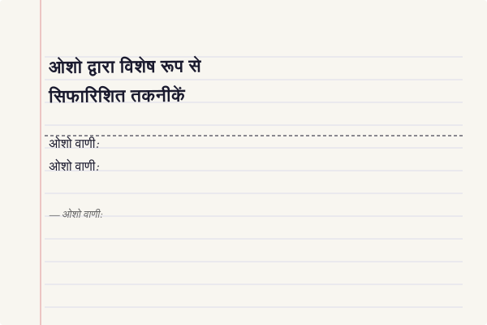
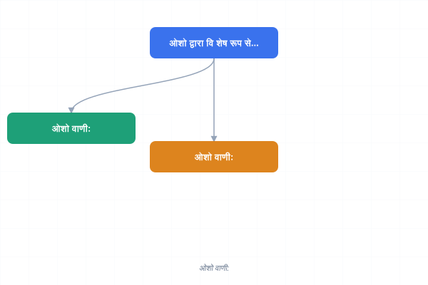
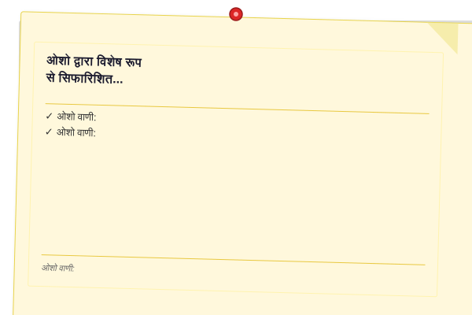
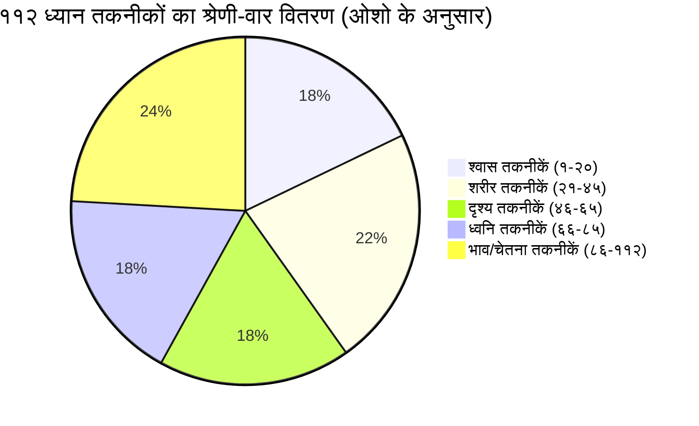
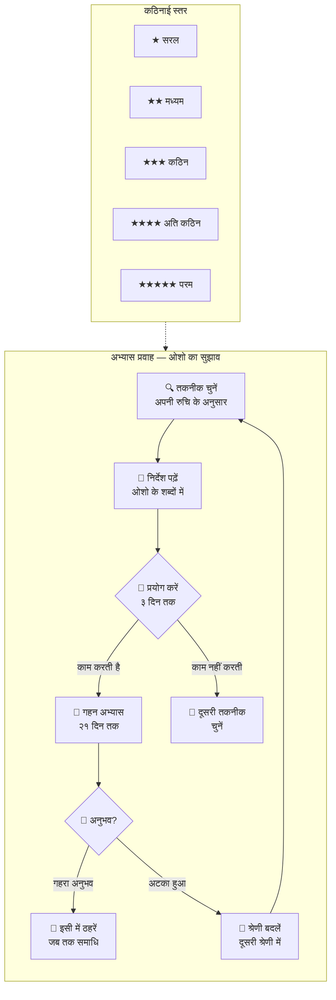

# ११२ ध्यान तकनीकों की त्वरित संदर्शिका (ओशो के अनुसार)

> **"११२ तकनीकें — ११२ द्वार। हर द्वार अलग है, हर द्वार कहीं न कहीं ले जाता है। लेकिन याद रखो — द्वार पर मत रुको। द्वार पार करो।"**
> — **ओशो**

---

## इस संदर्शिका का उपयोग कैसे करें

यह संदर्शिका विज्ञान भैरव तंत्र की सभी ११२ ध्यान तकनीकों का एक त्वरित संदर्भ है — ओशो के प्रवचनों के अनुसार। प्रत्येक तकनीक का संस्कृत नाम, हिंदी विवरण, श्रेणी, कठिनाई स्तर, अनुशंसित समय और ओशो का मुख्य निर्देश दिया गया है।

### उपयोग के तरीके

<a href="../../assets/images/diagrams/vigyan-bhairav-tantra/quick-reference-112/-handwritten.svg" target="_blank" rel="noopener">
  
</a>
<a href="../../assets/images/diagrams/vigyan-bhairav-tantra/quick-reference-112/-diagram.svg" target="_blank" rel="noopener">
  
</a>
<a href="../../assets/images/diagrams/vigyan-bhairav-tantra/quick-reference-112/-sticky.svg" target="_blank" rel="noopener">
  
</a>


| उद्देश्य | कैसे उपयोग करें |
|---------|----------------|
| **त्वरित खोज** | तकनीक संख्या (१-११२) के अनुसार सीधा देखें |
| **श्रेणी अनुसार** | श्रेणी अनुभाग के अनुसार ब्राउज़ करें — श्वास, शरीर, दृश्य, ध्वनि, भाव/चेतना |
| **कठिनाई अनुसार** | सरल (★) से शुरू करें, धीरे-धीरे कठिन (★★★★★) की ओर बढ़ें |
| **समय अनुसार** | ५-१० मिनट की तकनीकों से शुरू करें, फिर लंबी तकनीकों की ओर |
| **यादृच्छिक चयन** | आँख बंद करके किसी भी तकनीक पर उंगली रखें — वही आज की तकनीक |

### ओशो का निर्देश

<a href="../../assets/images/diagrams/vigyan-bhairav-tantra/quick-reference-112/-handwritten.svg" target="_blank" rel="noopener">
  
</a>
<a href="../../assets/images/diagrams/vigyan-bhairav-tantra/quick-reference-112/-diagram.svg" target="_blank" rel="noopener">
  
</a>
<a href="../../assets/images/diagrams/vigyan-bhairav-tantra/quick-reference-112/-sticky.svg" target="_blank" rel="noopener">
  
</a>


**ओशो वाणी:**
> "इस सूची को मत पढ़ो — इसका उपयोग करो। एक तकनीक चुनो। तीन दिन करो। अगर काम करे — तो गहरे जाओ। अगर न करे — तो दूसरी चुनो। यह कोई किताब नहीं है — यह एक प्रयोगशाला है।"

---

## ११२ तकनीकों का वर्गीकरण — ओशो के अनुसार





### कठिनाई मापक

<a href="../../assets/images/diagrams/vigyan-bhairav-tantra/quick-reference-112/-handwritten.svg" target="_blank" rel="noopener">
  
</a>
<a href="../../assets/images/diagrams/vigyan-bhairav-tantra/quick-reference-112/-diagram.svg" target="_blank" rel="noopener">
  
</a>
<a href="../../assets/images/diagrams/vigyan-bhairav-tantra/quick-reference-112/-sticky.svg" target="_blank" rel="noopener">
  
</a>


| प्रतीक | स्तर | विवरण | ओशो के अनुसार |
|--------|------|-------|---------------|
| ★ | सरल | बिना किसी तैयारी के तुरंत किया जा सकता है | "बच्चा भी कर सकता है" |
| ★★ | मध्यम | थोड़े अभ्यास और धैर्य की आवश्यकता | "थोड़ा प्रयोग चाहिए" |
| ★★★ | कठिन | गहरी एकाग्रता और समझ चाहिए | "गहराई में जाने की ज़रूरत" |
| ★★★★ | अति कठिन | साधक को पिछली तकनीकों में स्थिर होना चाहिए | "तेयार रहो — आसान नहीं है" |
| ★★★★★ | परम | केवल उन्नत साधकों के लिए | "बहुत साहस चाहिए" |

### समय मापक

<a href="../../assets/images/diagrams/vigyan-bhairav-tantra/quick-reference-112/-handwritten.svg" target="_blank" rel="noopener">
  
</a>
<a href="../../assets/images/diagrams/vigyan-bhairav-tantra/quick-reference-112/-diagram.svg" target="_blank" rel="noopener">
  
</a>
<a href="../../assets/images/diagrams/vigyan-bhairav-tantra/quick-reference-112/-sticky.svg" target="_blank" rel="noopener">
  
</a>


| समय | संकेत | उपयुक्तता |
|------|-------|-----------|
| ५-१० मिनट | 🕐 | शुरुआती, व्यस्त दिनचर्या |
| १०-२० मिनट | 🕑 | नियमित अभ्यास |
| २०-३० मिनट | 🕒 | गहन अभ्यास |
| ३०+ मिनट | 🕓 | उन्नत साधक |

---

## श्रेणी १: श्वास तकनीकें (प्राण-प्रज्ञा) — विधि १-२०

> **ओशो वाणी:** "श्वास सबसे छोटा पुल है — इस पार से उस पार तक। और यह पुल हमेशा उपलब्ध है — चौबीसों घंटे। श्वास को देखना सीख लो — तो सब कुछ सीख लिया।"

| # | संस्कृत नाम | तकनीक (हिंदी) | श्रेणी | कठिनाई | समय | ओशो का मुख्य निर्देश |
|---|------------|--------------|--------|--------|------|---------------------|
| १ | प्राणे संस्थिते नाड्याम् | श्वास-प्राण धारण — श्वास को नासिका में आते-जाते देखना | श्वास | ★ | 🕐 १०-२० मि | "श्वास को बदलो मत — बस देखो। जैसे कोई नदी बह रही है — तुम किनारे बैठे देख रहे हो।" |
| २ | प्राणापानौ समौ कृत्वा | प्राण-अपान संयोग — श्वास और प्रश्वास को एक में मिलाना | श्वास | ★★ | 🕑 २०-२५ मि | "प्राण (श्वास) और अपान (प्रश्वास) को मिलने दो — जैसे दो नदियाँ मिलती हैं। जहाँ वे मिलते हैं, वहीं द्वार है।" |
| ३ | श्वासप्रश्वासयोरैक्यम् | श्वास-प्रश्वास साक्षी — आने और जाने दोनों का साक्षी बनना | श्वास | ★ | 🕐 १०-१५ मि | "यह विधि १ से थोड़ी अलग है — यहाँ तुम आने और जाने दोनों को एक साथ देखो। दोनों के बीच का अंतराल — वही शून्य है।" |
| ४ | यदा प्राणः स्थितो देहे | श्वास रुकने पर ध्यान — दो श्वासों के बीच के ठहराव में प्रवेश | श्वास | ★★★ | 🕑 २०-३० मि | "जब श्वास अंदर जाकर रुकती है — उस ठहराव को देखो। जब बाहर जाकर रुकती है — उसे भी देखो। यह ठहराव ही परमात्मा का द्वार है।" |
| ५ | प्राणं शून्ये विस्तार्य | प्राण-शून्य विस्तार — श्वास को पूरे ब्रह्मांड में फैलने देना | श्वास | ★★★ | 🕑 २०-३० मि | "श्वास को सीमित मत रखो — उसे फैलने दो। जब तुम श्वास लेते हो, पूरा ब्रह्मांड तुममें प्रवेश करता है। जब छोड़ते हो, तुम पूरे ब्रह्मांड में फैल जाते हो।" |
| ६ | स्थूलसूक्ष्मप्राणयोः | स्थूल-सूक्ष्म श्वास — स्थूल श्वास से सूक्ष्म प्राण की ओर यात्रा | श्वास | ★★ | 🕐 १५-२० मि | "पहले स्थूल श्वास को देखो — नासिका पर। फिर सूक्ष्म प्राण को महसूस करो — पूरे शरीर में फैलती हुई ऊर्जा।" |
| ७ | प्राणे नाडीप्रबोधिनि | प्राण-नाड़ी प्रबोधन — श्वास के माध्यम से सुषुम्ना नाड़ी जागरण | श्वास | ★★★ | 🕑 २०-३० मि | "रीढ़ की हड्डी में श्वास के प्रवाह को महसूस करो — मूलाधार से सहस्रार तक। यह प्राण की यात्रा है।" |
| ८ | श्वासप्रश्वासमध्यस्थम् | श्वास-प्रश्वास मध्य — दो श्वासों के बीच के जोड़ पर ध्यान | श्वास | ★★ | 🕐 १५-२० मि | "श्वास और प्रश्वास के बीच का जोड़ — जहाँ एक समाप्त होता है और दूसरा शुरू होता है। वह जोड़ शून्य है। वहीं टिको।" |
| ९ | पूर्णकुम्भकधारणम् | पूर्ण कुंभक धारण — श्वास को पूरा भरकर रोकना और खाली करके रोकना | श्वास | ★★★ | 🕑 २०-३० मि | "श्वास को पूरा भरो — रोको — छोड़ो — रोको। चारों अवस्थाओं में साक्षी बने रहो। कुंभक ही कुंजी है।" |
| १० | उर्ध्वाधःप्राणसंचारः | उर्ध्व-अधः प्राण संचार — श्वास को ऊपर-नीचे घुमाना | श्वास | ★★ | 🕑 २०-२५ मि | "श्वास को ऊपर से नीचे और नीचे से ऊपर घूमते हुए देखो — जैसे कोई लहर। पूरे शरीर में श्वास की लहर को महसूस करो।" |
| ११ | प्राणबिन्दुधारणम् | प्राण-बिंदु धारण — प्राण को एक बिंदु पर केंद्रित करना | श्वास | ★★★★ | 🕒 २५-३० मि | "प्राण को भौंहों के बीच या हृदय में एक बिंदु पर इकट्ठा करो। पूरी ऊर्जा उस एक बिंदु पर। यह गहन एकाग्रता है।" |
| १२ | श्वासनादब्रह्मभावः | श्वास-नाद ब्रह्म — श्वास की आवाज़ को सुनना, सबसे सूक्ष्म मंत्र | श्वास | ★★ | 🕐 १५-२० मि | "श्वास की आवाज़ सुनो — 'सो' अंदर, 'हम' बाहर। यह सबसे स्वाभाविक मंत्र है। इसे बदलो मत, केवल सुनो।" |
| १३ | सुषुम्नाप्राणधारणम् | सुषुम्ना श्वास — रीढ़ में श्वास के प्रवाह को महसूस करना | श्वास | ★★★ | 🕑 २०-३० मि | "रीढ़ की नली में श्वास को ऊपर-नीचे चलते हुए महसूस करो। जैसे कोई साँप ऊपर चढ़ रहा हो — कुंडलिनी।" |
| १४ | पंचप्राणैकीकरणम् | पंच-प्राण एकीकरण — पाँच प्राणों (प्राण, अपान, समान, उदान, व्यान) को एक करना | श्वास | ★★★★ | 🕒 ३०+ मि | "पाँच प्राणों को एक-एक करके महसूस करो — श्वास, अपान, समान, उदान, व्यान। फिर सबको एक में मिल जाने दो।" |
| १५ | श्वासचैतन्यलयः | श्वास-चैतन्य लय — श्वास और चेतना का एक हो जाना | श्वास | ★★★★★ | 🕒 ३०+ मि | "अब श्वास और चेतना में कोई अंतर नहीं। तुम श्वास को नहीं देख रहे — तुम ही श्वास हो। यह परम एकता है।" |
| १६ | प्राणापानसमायोगः | प्राण-अपान समायोग — प्राण और अपान के मिलन से तीसरी ऊर्जा जागरण | श्वास | ★★★ | 🕑 २५-३० मि | "प्राण और अपान के मिलन से एक तीसरी ऊर्जा पैदा होती है। वह तुम्हारी चेतना है। उस मिलन बिंदु पर ध्यान रखो।" |
| १७ | नाडीशोधनप्रज्ञा | नाड़ी शोधन प्रज्ञा — श्वास के माध्यम से ऊर्जा नाड़ियों को शुद्ध करना | श्वास | ★★ | 🕐 १५-२० मि | "बाएँ नथुने से श्वास लो — दाएँ से छोड़ो। फिर उल्टा। यह नाड़ियों को शुद्ध करता है। लेकिन यंत्रवत मत करो — जागरूक रहो।" |
| १८ | श्वासप्रश्वासैक्यम् | श्वास-प्रश्वास ऐक्य — श्वास और प्रश्वास को एक ही ऊर्जा के रूप में देखना | श्वास | ★ | 🕐 १०-१५ मि | "श्वास और प्रश्वास को अलग-अलग मत देखो — दोनों एक ही ऊर्जा के दो रूप हैं। जैसे एक ही सिक्के के दो पहलू।" |
| १९ | प्राणप्रवाहसाक्षी | प्राण-प्रवाह साक्षी — श्वास की सतत धारा का साक्षी बनना | श्वास | ★★ | 🕑 २०-२५ मि | "श्वास की निर्बाध धारा को देखो — बिना किसी रुकावट के। जैसे कोई नदी बह रही हो — शुरू से अंत तक।" |
| २० | श्वासमौनसमाधिः | श्वास-मौन समाधि — श्वास के माध्यम से मौन में समा जाना | श्वास | ★★★★ | 🕒 ३०+ मि | "श्वास को इतनी गहराई से देखो कि श्वास अपने आप मिट जाए — और केवल मौन रह जाए। वह मौन ही समाधि है।" |

---

## श्रेणी २: शरीर तकनीकें (देह-प्रज्ञा) — विधि २१-४५

> **ओशो वाणी:** "शरीर कोई बाधा नहीं है — शरीर एक सीढ़ी है। तुम शरीर का उपयोग करके शरीर से परे जा सकते हो। शरीर के प्रति जागरूक होकर, तुम शरीर से मुक्त हो जाते हो।"

| # | संस्कृत नाम | तकनीक (हिंदी) | श्रेणी | कठिनाई | समय | ओशो का मुख्य निर्देश |
|---|------------|--------------|--------|--------|------|---------------------|
| २१ | अङ्गेऽङ्गे स्थितम् | अंग-अंग में चेतना — शरीर के एक-एक अंग पर क्रमशः ध्यान | शरीर | ★ | 🕐 १५-२० मि | "पैर के अंगूठे से शुरू करो — धीरे-धीरे ऊपर बढ़ो। हर अंग पर रुको। नाम मत लो — बस महसूस करो। जल्दी मत करो।" |
| २२ | त्वचि संवेदनाम् | त्वचा संवेदना ध्यान — त्वचा की संवेदना पर पूर्ण ध्यान | शरीर | ★ | 🕐 १०-१५ मि | "त्वचा तुम्हारा सबसे बड़ा अंग है। पूरे शरीर की त्वचा पर एक साथ ध्यान दो। हवा का स्पर्श, कपड़ों का स्पर्श — सबको महसूस करो।" |
| २३ | शीतोष्णसंवेदनम् | शीत-उष्ण संवेदन — ठंड और गर्म की संवेदना पर ध्यान | शरीर | ★★ | 🕐 १५-२० मि | "शरीर के अलग-अलग हिस्सों का तापमान महसूस करो — कहीं ठंड, कहीं गर्म। द्वंद्व को देखो — और उसके पार जाओ।" |
| २४ | वेदनाध्यानम् | वेदना ध्यान — दर्द की संवेदना को देखना, उससे भागना नहीं | शरीर | ★★★ | 🕑 २०-३० मि | "जब दर्द हो — उसे देखो। उसे दबाओ मत, उससे भागो मत। बस देखो। देखते-देखते दर्द बदल जाता है — वह ऊर्जा बन जाता है।" |
| २५ | आलिङ्गनध्यानम् | आलिंगन ध्यान — किसी को गले लगाकर उस ऊर्जा के मिलन को देखना | शरीर | ★★ | 🕐 १०-१५ मि | "किसी प्रिय को गले लगाओ — और दो शरीरों की ऊर्जा के मिलन को देखो। जहाँ दो ऊर्जाएँ मिलती हैं, वहाँ एक तीसरी पैदा होती है — प्रेम।" |
| २६ | भ्रमणध्यानम् | भ्रमण ध्यान — चलने की प्रत्येक क्रिया पर ध्यान | शरीर | ★ | 🕐 १५-२० मि | "धीरे-धीरे चलो। हर कदम को देखो — पैर उठता है, आगे बढ़ता है, ज़मीन को छूता है। चलना ही ध्यान बन जाए।" |
| २७ | नृत्यध्यानम् | नृत्य ध्यान — शरीर को पूरी तरह नृत्य में समर्पित कर देना | शरीर | ★ | 🕐 १५-२० मि | "संगीत पर नाचो — पूरे शरीर को बहने दो। कर्ता को खो दो। केवल नृत्य रह जाए — नर्तक न रहे। यही ध्यान है।" |
| २८ | मुद्राध्यानम् | मुद्रा ध्यान — किसी एक मुद्रा में स्थिर होकर शरीर की संवेदना को देखना | शरीर | ★★ | 🕑 २०-२५ मि | "शवासन में लेट जाओ — बिल्कुल स्थिर। शरीर की हर हलचल को देखो। जब कोई हलचल नहीं — तब तुम हो।" |
| २९ | भोजनध्यानम् | भोजन ध्यान — खाने की प्रत्येक क्रिया को ध्यानपूर्वक करना | शरीर | ★ | 🕐 १५-२० मि | "खाना खाओ — धीरे-धीरे। हर कौर को चबाओ — स्वाद को महसूस करो। जल्दी मत करो। भोजन ही ध्यान बन जाए।" |
| ३० | स्पर्शध्यानम् | स्पर्श ध्यान — किसी वस्तु के स्पर्श को पूरी चेतना से महसूस करना | शरीर | ★ | 🕐 १०-१५ मि | "किसी वस्तु को छुओ — एक पत्थर, एक कपड़ा, एक फूल। उसके स्पर्श को पूरी तरह महसूस करो। स्पर्श ही परमात्मा का स्पंदन है।" |
| ३१ | देहसीमाज्ञानम् | देह-सीमा ज्ञान — शरीर की सीमाओं को महसूस करना और उनके पार जाना | शरीर | ★★ | 🕐 १५-२० मि | "शरीर की सीमाओं को महसूस करो — जहाँ त्वचा समाप्त होती है और हवा शुरू होती है। फिर उन सीमाओं को धीरे-धीरे पिघलने दो।" |
| ३२ | जलसमर्पणम् | जल समर्पण — पानी में लेटकर या स्नान करते हुए शरीर को पानी में समर्पित करना | शरीर | ★ | 🕐 १५-२० मि | "पानी में लेट जाओ — शरीर को पानी में तैरने दो। सीमाएँ मिट जाती हैं — शरीर और पानी एक हो जाते हैं। यही एकता ध्यान है।" |
| ३३ | प्राणाधारध्यानम् | प्राणाधार ध्यान — शरीर के प्रमुख ऊर्जा केंद्रों (चक्रों) पर ध्यान | शरीर | ★★★ | 🕑 २०-३० मि | "मूलाधार से शुरू करो — रीढ़ की निचली हड्डी पर ध्यान। फिर धीरे-धीरे ऊपर — स्वाधिष्ठान, मणिपूर, अनाहत, विशुद्धि, आज्ञा, सहस्रार।" |
| ३४ | मूलाधारप्रज्ञा | मूलाधार प्रज्ञा — रीढ़ के आधार पर ऊर्जा को महसूस करना | शरीर | ★★★ | 🕑 २०-२५ मि | "रीढ़ के बिल्कुल निचले सिरे पर ध्यान दो। वहाँ ऊर्जा सोई हुई है — कुंडलिनी। बस उस स्थान पर मौजूद रहो — जागरूक रहो।" |
| ३५ | अनाहतध्यानम् | अनाहत ध्यान — हृदय केंद्र पर ध्यान, प्रेम और करुणा का जागरण | शरीर | ★ | 🕐 १०-१५ मि | "हृदय के केंद्र पर हाथ रखो — वहाँ की धड़कन को महसूस करो। वह धड़कन ही तुम्हारे जीवन की लय है। उस लय में समा जाओ।" |
| ३६ | विशुद्धिचक्रम् | विशुद्धि चक्र ध्यान — कंठ केंद्र पर ध्यान, मौन का द्वार | शरीर | ★★ | 🕑 २०-२५ मि | "कंठ खात (गले के गड्ढे) पर ध्यान दो। वहाँ ऊर्जा को इकट्ठा होने दो। यह मौन का केंद्र है — यहाँ बोलने की इच्छा मिट जाती है।" |
| ३७ | आज्ञाचक्रध्यानम् | आज्ञा चक्र ध्यान — भौंहों के बीच तीसरी आँख पर ध्यान | शरीर | ★★ | 🕐 १०-१५ मि | "भौंहों के बीच के बिंदु पर ध्यान दो। आँखें बंद करो — वहाँ एक प्रकाश दिखेगा। उस प्रकाश में समा जाओ। यह आज्ञा चक्र है।" |
| ३८ | सहस्रारप्रज्ञा | सहस्रार प्रज्ञा — सिर के शीर्ष पर सहस्रार चक्र पर ध्यान | शरीर | ★★★★ | 🕒 २५-३० मि | "सिर के बिल्कुल ऊपरी भाग पर ध्यान दो — जहाँ बच्चों की नर्म जगह होती है। वहाँ से ऊर्जा को बाहर निकलने दो — ब्रह्मांड में विलीन।" |
| ३९ | कायस्थिरता | काया स्थिरता — शरीर को बिल्कुल स्थिर रखकर आंतरिक हलचल को देखना | शरीर | ★★ | 🕑 २०-२५ मि | "बिल्कुल स्थिर बैठो — एक भी मांसपेशी मत हिलाओ। अंदर की हलचल को देखो — कंपन, झुनझुनाहट, ऊर्जा का प्रवाह।" |
| ४० | देहप्रकाशः | देह प्रकाश — शरीर को प्रकाश से भरा हुआ देखना | शरीर | ★★★ | 🕐 १५-२० मि | "अपने शरीर को प्रकाश से भरा हुआ कल्पना करो — सिर से पैर तक। हर कोशिका प्रकाश से चमक रही है। यह प्रकाश तुम्हारी चेतना है।" |
| ४१ | शरीरप्राणलयः | शरीर-प्राण लय — शरीर और प्राण की एक साथ लय को देखना | शरीर | ★★ | 🕑 २०-२५ मि | "शरीर की प्रत्येक गति के साथ प्राण की गति को देखो — एक साथ। जैसे दो नर्तक एक ही लय में नाच रहे हों — शरीर और प्राण।" |
| ४२ | संवेदनापारम् | संवेदना पार — सभी संवेदनाओं के पार जाकर शुद्ध चेतना में स्थिर होना | शरीर | ★★★★ | 🕒 २५-३० मि | "सुखद संवेदनाओं में मत उलझो — दुखद से मत भागो। सबको समान भाव से देखो। देखते-देखते — तुम सब संवेदनाओं के पार चले जाओगे।" |
| ४३ | स्वप्नदेहध्यानम् | स्वप्न-देह ध्यान — सोते समय शरीर को देखना, स्वप्न में भी जागरूक रहना | शरीर | ★★★★★ | 🕒 ३०+ मि | "सोने से पहले शरीर को देखो — और सोते समय भी उसे देखते रहो। धीरे-धीरे नींद में भी जागरूकता बनी रहेगी। यह उन्नत तकनीक है।" |
| ४४ | ज्वालाध्यानम् | ज्वाला ध्यान — शरीर में जलती हुई ऊर्जा की लौ को महसूस करना | शरीर | ★★★ | 🕑 २०-३० मि | "शरीर के अंदर एक ज्वाला जल रही है — उसे महसूस करो। पहले पेट में, फिर पूरे शरीर में। यह जीवन की अग्नि है — इसे देखो।" |
| ४५ | अहंग्रहोपासना | अहंग्रह उपासना — "मैं शरीर नहीं हूँ, मैं चेतना हूँ" — इस भाव में स्थिर होना | शरीर | ★★★★ | 🕑 २०-३० मि | "बार-बार महसूस करो — 'मैं यह शरीर नहीं हूँ। मैं शरीर के अंदर की चेतना हूँ।' यह भाव धीरे-धीरे सत्य बन जाता है।" |

---

## श्रेणी ३: दृश्य तकनीकें (चक्षु-प्रज्ञा) — विधि ४६-६५

> **ओशो वाणी:** "आँखें — ये सिर्फ देखने का उपकरण नहीं हैं। ये प्रक्षेपण का भी उपकरण हैं। जो तुम बाहर देखते हो, वह अंदर भी है। आँखों के माध्यम से तुम बाहर और अंदर — दोनों को जान सकते हो।"

| # | संस्कृत नाम | तकनीक (हिंदी) | श्रेणी | कठिनाई | समय | ओशो का मुख्य निर्देश |
|---|------------|--------------|--------|--------|------|---------------------|
| ४६ | बिन्दुध्यानम् | बिंदु ध्यान — एक बिंदु पर दृष्टि स्थिर करना, बिना पलक झपकाए | दृश्य | ★ | 🕐 १०-१५ मि | "दीवार पर एक काला बिंदु बनाओ — उस पर आँखें गड़ाओ। बिना पलक झपकाए देखो। देखते-देखते बिंदु गायब हो जाएगा — और तुम रह जाओगे।" |
| ४७ | प्रकाशध्यानम् | प्रकाश ध्यान — प्रकाश को देखना, फिर आँखें बंद करके उसकी छाप को देखना | दृश्य | ★ | 🕐 १०-१५ मि | "दीपक की लौ को देखो — एक मिनट। फिर आँखें बंद करो — और उस प्रकाश की छाप को देखो। वह छाप ही ध्यान बन जाए।" |
| ४८ | अन्धकारध्यानम् | अंधकार ध्यान — अँधेरे को खुली या बंद आँखों से देखना | दृश्य | ★ | 🕐 १०-१५ मि | "एक अँधेरे कमरे में बैठो — आँखें खुली रखो। अँधेरे को देखो। उसे घूरो मत — बस देखो। वह अँधेरा प्रकाश से भरा है।" |
| ४९ | अन्तरालदृष्टिः | अंतराल दृष्टि — दो वस्तुओं के बीच के खाली स्थान को देखना | दृश्य | ★★ | 🕐 १५-२० मि | "दो वस्तुओं के बीच के खालीपन को देखो — जैसे दो पेड़ों के बीच। वह खालीपन ही सब कुछ है। सब वस्तुएँ उसी खालीपन से निकलती हैं।" |
| ५० | भ्रूमध्यदृष्टिः | भ्रूमध्य दृष्टि — दोनों भौंहों के बीच के बिंदु पर दृष्टि स्थिर करना | दृश्य | ★★ | 🕐 १५-२० मि | "आँखें बंद करो — दोनों भौंहों के बीच के बिंदु पर दृष्टि को स्थिर करो। वहाँ एक नीला प्रकाश दिखेगा। उसमें समा जाओ।" |
| ५१ | नासाग्रदृष्टिः | नासाग्र दृष्टि — नाक की नोक पर दृष्टि स्थिर करना | दृश्य | ★★ | 🕐 १५-२० मि | "नाक की नोक पर आँखें जमाओ — बिना पलक झपकाए। पहले आँखें थकेंगी, फिर स्थिर होंगी। स्थिरता में ही ध्यान खिलता है।" |
| ५२ | छायाध्यानम् | छाया ध्यान — अपनी या किसी वस्तु की छाया को देखना | दृश्य | ★★ | 🕐 १५-२० मि | "अपनी छाया को देखो — धूप में। वह तुम्हारा प्रतिबिंब है, लेकिन वह तुम नहीं हो। इस भेद को देखो। फिर छाया और तुम — दोनों कहाँ जाते हैं?" |
| ५३ | जलप्रतिबिम्बः | जल प्रतिबिंब — पानी में अपने प्रतिबिंब को देखना | दृश्य | ★ | 🕐 १०-१५ मि | "शांत पानी में अपना चेहरा देखो — बिना पलक झपकाए। जैसे-जैसे तुम स्थिर होगे, पानी और चेहरा एक हो जाएंगे। वहाँ कौन है — देखने वाला या प्रतिबिंब?" |
| ५४ | आकाशदृष्टिः | आकाश दृष्टि — खुले आकाश को बिना पलक झपकाए देखना | दृश्य | ★ | 🕐 १५-२० मि | "खुले आकाश को देखो — बादलों के बीच का नीला आकाश। उसे घूरो मत — बस देखो। आकाश की तरह तुम भी साक्षी हो — सब कुछ तुममें घटित होता है।" |
| ५५ | दीपकध्यानम् | दीपक ध्यान — तेल के दीपक या मोमबत्ती की लौ पर ध्यान | दृश्य | ★ | 🕐 १०-१५ मि | "एक मोमबत्ती जलाओ — उसकी लौ को देखो। लौ की गति को देखो — कंपन, रंग, प्रकाश। फिर आँखें बंद करो — लौ अंदर जलती रहेगी।" |
| ५६ | चन्द्रध्यानम् | चंद्र ध्यान — पूर्णिमा के चंद्रमा को देखना | दृश्य | ★ | 🕐 १०-१५ मि | "पूर्णिमा के चाँद को देखो — शांत, स्थिर, शीतल। तुम भी वैसे ही हो जाओ। चाँद की शीतलता को अपने में समा लो। यह बहुत सरल और गहरी तकनीक है।" |
| ५७ | तारकध्यानम् | तारक ध्यान — तारों से भरे आकाश को देखना | दृश्य | ★ | 🕐 १५-२० मि | "रात को तारों से भरे आकाश के नीचे लेट जाओ। पूरे आकाश को एक साथ देखो। तुम भी एक तारे हो — इस विराट ब्रह्मांड में। यह भाव ही ध्यान है।" |
| ५८ | दर्पणध्यानम् | दर्पण ध्यान — दर्पण में अपनी आँखों में आँखें डालकर देखना | दृश्य | ★★ | 🕐 १५-२० मि | "दर्पण में अपनी आँखों में आँखें डालकर देखो — बिना पलक झपकाए। वहाँ कौन है? क्या वह तुम हो या कोई और? यह प्रश्न ही ध्यान बन जाए।" |
| ५९ | शून्यदृष्टिः | शून्य दृष्टि — किसी खाली स्थान पर दृष्टि स्थिर करना, दीवार या आकाश | दृश्य | ★★ | 🕐 १५-२० मि | "एक खाली सफेद दीवार पर आँखें जमाओ — बिना कुछ सोचे। देखो — बस देखो। दीवार गायब हो जाएगी — और तुम शून्य में खो जाओगे।" |
| ६० | सूर्यध्यानम् | सूर्य ध्यान — सूर्योदय या सूर्यास्त के समय सूर्य की डिस्क को देखना | दृश्य | ★★ | 🕐 १०-१५ मि | "सूर्योदय या सूर्यास्त के समय सूर्य की लाल डिस्क को देखो — बिना पलक झपकाए। फिर आँखें बंद करो — वही प्रकाश अंदर जलता रहेगा।" |
| ६१ | अग्निसंस्कारः | अग्नि संस्कार — अग्नि की ज्वाला को देखना और उसमें मन को विसर्जित करना | दृश्य | ★ | 🕐 १५-२० मि | "अग्नि के सामने बैठो — उसकी ज्वाला को देखो। ज्वाला सब कुछ जला देती है — तुम्हारे विचारों को भी। अग्नि को जलने दो — और मन को जल जाने दो।" |
| ६२ | मेघध्यानम् | मेघ ध्यान — बादलों को देखना, उनके आकार और गति पर ध्यान | दृश्य | ★ | 🕐 १०-१५ मि | "आसमान में बादलों को देखो — वे आते हैं और जाते हैं। जैसे बादल आसमान में — वैसे ही विचार तुम्हारे मन में। तुम आसमान हो, बादल नहीं।" |
| ६३ | चित्रध्यानम् | चित्र ध्यान — किसी देवता या गुरु के चित्र पर ध्यान, आँखों में आँखें डालकर | दृश्य | ★★ | 🕐 १५-२० मि | "ओशो या किसी देवता की तस्वीर को देखो — आँखों में आँखें डालकर। फिर आँखें बंद करो — वही चित्र अंदर दिखेगा। उस चित्र में समा जाओ।" |
| ६४ | प्रतिमाध्यानम् | प्रतिमा ध्यान — किसी मूर्ति या मंडल (यंत्र) पर ध्यान स्थिर करना | दृश्य | ★★ | 🕐 १५-२० मि | "किसी यंत्र या मूर्ति पर ध्यान स्थिर करो — श्रीयंत्र, बुद्ध मूर्ति, या कोई भी ज्यामितीय आकृति। उसे देखो — और देखने में ही समा जाओ।" |
| ६५ | नेत्रप्रकाशः | नेत्र प्रकाश — आँखों से निकलने वाले प्रकाश को देखना या महसूस करना | दृश्य | ★★★ | 🕐 १५-२० मि | "आँखें बंद करो — महसूस करो कि तुम्हारी आँखों से एक किरण निकल रही है। वह किरण तुम्हारी चेतना है। उस किरण को बाहर जाने दो — और फिर वापस आने दो।" |

---

## श्रेणी ४: ध्वनि तकनीकें (नाद-प्रज्ञा) — विधि ६६-८५

> **ओशो वाणी:** "ध्वनि — यह ईश्वर की प्रथम अभिव्यक्ति है। 'नाद ब्रह्म' — ध्वनि ही ब्रह्म है। जब सब कुछ शून्य था, तब पहली ध्वनि हुई — 'ओम'। और उसी ध्वनि से सब कुछ बना। ध्वनि को सुनना — यह ब्रह्म को सुनना है।"

| # | संस्कृत नाम | तकनीक (हिंदी) | श्रेणी | कठिनाई | समय | ओशो का मुख्य निर्देश |
|---|------------|--------------|--------|--------|------|---------------------|
| ६६ | सर्वध्वनिध्यानम् | सर्व ध्वनि ध्यान — चारों ओर की सभी ध्वनियों को बिना भेदभाव के सुनना | ध्वनि | ★ | 🕐 १०-१५ मि | "आँखें बंद करो — चारों ओर की सभी ध्वनियों को सुनो। पक्षियों की आवाज़, हवा की सरसराहट, दूर की गाड़ियाँ — सबको समान भाव से सुनो। किसी को मत चुनो।" |
| ६७ | नादब्रह्मोपासना | नाद ब्रह्म उपासना — किसी एक ध्वनि पर पूरा ध्यान, जैसे घंटी या झरना | ध्वनि | ★ | 🕐 १०-१५ मि | "किसी एक ध्वनि को चुनो — घंटी की आवाज़, झरने का पानी, कोई संगीत। उसी में पूरी तरह डूब जाओ। ध्वनि और श्रोता — दोनों एक हो जाएं।" |
| ६८ | स्वध्वनिध्यानम् | स्व-ध्वनि ध्यान — अपनी ही आवाज़ को सुनना, बोलते या सोचते हुए | ध्वनि | ★★ | 🕐 १५-२० मि | "अपने बोलने की आवाज़ सुनो — जैसे कोई और बोल रहा हो। बोलने वाले से अलग हो जाओ — सुनने वाले बन जाओ। तुम वह नहीं हो जो बोलता है — तुम वह हो जो सुनता है।" |
| ६९ | मौनध्यानम् | मौन ध्यान — ध्वनियों के बीच के मौन को सुनना | ध्वनि | ★★ | 🕐 १५-२० मि | "सभी ध्वनियों के बीच एक मौन है — जैसे दो नोटों के बीच का अंतराल। उस मौन को सुनो। वह मौन कभी नहीं टूटता — वह शाश्वत है।" |
| ७० | अनाहतनादः | अनाहत नाद — बिना बजाई आवाज़, अंतरिक्ष की ध्वनि को सुनना | ध्वनि | ★★★★ | 🕒 २५-३० मि | "बहुत शांत जगह पर बैठो — कानों को बंद करो। भीतर एक सूक्ष्म ध्वनि सुनाई देगी — अनाहत नाद। वह सृष्टि की मूल ध्वनि है। उसमें समा जाओ।" |
| ७१ | ओंकारध्यानम् | ओंकार ध्यान — 'ॐ' का उच्चारण और उसकी अनुगूँज को सुनना | ध्वनि | ★ | 🕐 १०-१५ मि | "ॐ का उच्चारण करो — लंबा, गहरा। उसकी अनुगूँज को सुनो — कंठ में, छाती में, पूरे शरीर में। वह कंपन ही ध्यान है। फिर मौन में वही ध्वनि जारी रहेगी।" |
| ७२ | मन्त्रध्यानम् | मंत्र ध्यान — किसी मंत्र को बार-बार दोहराना और उसकी ऊर्जा में समाना | ध्वनि | ★★ | 🕐 १५-२० मि | "कोई भी मंत्र लो — 'राम', 'ओम', 'हरि', या कोई और। उसे बार-बार दोहराओ — धीरे-धीरे। मंत्र की ऊर्जा तुम्हें भर देगी। अर्थ मत सोचो — केवल ध्वनि में डूबो।" |
| ७३ | संगीतध्यानम् | संगीत ध्यान — संगीत को पूरी चेतना से सुनना, उसमें खो जाना | ध्वनि | ★ | 🕐 १०-२० मि | "कोई शांत संगीत बजाओ — बीन, सितार, या कोई भी वाद्य। आँखें बंद करो — संगीत को पूरे शरीर से सुनो। संगीत में इतना खो जाओ कि सुनने वाला न बचे।" |
| ७४ | उच्चारणसाक्षी | उच्चारण साक्षी — बोलते समय अपने हर शब्द के उच्चारण को सुनना | ध्वनि | ★★ | 🕐 १५-२० मि | "धीरे-धीरे कुछ बोलो — एक शब्द, एक वाक्य। हर शब्द के उच्चारण को सुनो — उसकी ध्वनि, उसकी ऊर्जा। शब्द के अर्थ में मत उलझो — ध्वनि में रहो।" |
| ७५ | कोलाहलध्यानम् | कोलाहल ध्यान — शोरगुल के बीच भी आंतरिक मौन को बनाए रखना | ध्वनि | ★★★ | 🕐 १५-२० मि | "शोरगुल वाली जगह पर बैठो — बाज़ार में, स्टेशन पर। सारे शोर को सुनो — लेकिन अपने भीतर के मौन को मत खोओ। शोर के बीच मौन — यही सच्चा ध्यान है।" |
| ७६ | रहस्यध्वनिः | रहस्य ध्वनि — अपने दिल की धड़कन या अपने खून के बहने की ध्वनि सुनना | ध्वनि | ★★ | 🕐 १५-२० मि | "एक शांत जगह पर बैठो — कानों को बंद करो। अपने दिल की धड़कन सुनो। अपने खून के बहने की आवाज़ सुनो। यह जीवन की मूल ध्वनि है। इसे सुनो।" |
| ७७ | प्राकृतध्वनिः | प्राकृत ध्वनि — प्रकृति की ध्वनियों को सुनना — हवा, पानी, पक्षी, कीट | ध्वनि | ★ | 🕐 १०-१५ मि | "प्रकृति में बैठो — बस सुनो। हवा की सरसराहट, पक्षियों की चहचहाहट, पत्तों की खड़खड़ाहट। हर ध्वनि प्रकृति का मंत्र है। बस सुनो — और विलीन हो जाओ।" |
| ७८ | दूरध्वनिध्यानम् | दूर ध्वनि ध्यान — दूर से आती ध्वनियों को सुनना, धीरे-धीरे उन्हें पास लाना | ध्वनि | ★★ | 🕐 १५-२० मि | "दूर की किसी ध्वनि को सुनो — एक गाड़ी, एक हवाई जहाज़। धीरे-धीरे उसे पास लाओ — अपने कानों के अंदर। फिर उसे दूर भेजो। यह चेतना का विस्तार है।" |
| ७९ | ध्वनिलयः | ध्वनि-लय — एक ध्वनि को बार-बार दोहराना, जब तक वह गायब न हो जाए | ध्वनि | ★★★ | 🕑 २०-२५ मि | "एक ही शब्द या ध्वनि को बार-बार दोहराओ — तेज़, फिर धीमी, फिर मौन में। जब ध्वनि गायब हो जाए — तब जो बचता है, वही परमात्मा है।" |
| ८० | नादानुसंधानम् | नाद अनुसंधान — ध्वनि के स्रोत की खोज करना, ध्वनि कहाँ से उत्पन्न होती है | ध्वनि | ★★★ | 🕑 २०-२५ मि | "कोई ध्वनि सुनो — उसके स्रोत की ओर जाओ। स्रोत तक पहुँचो — वहाँ और क्या है? अंततः सभी ध्वनियाँ उसी एक स्रोत से निकलती हैं — मौन।" |
| ८१ | वीणाध्वनिः | वीणा ध्वनि — तार वाले वाद्य की ध्वनि पर ध्यान, तार की कंपन में समाना | ध्वनि | ★★ | 🕐 १५-२० मि | "तानपुरा या सितार की ध्वनि सुनो — तार की लंबी अनुगूँज। उस ध्वनि में पूरी तरह डूब जाओ। ध्वनि और तुम — एक हो जाओ। तार की तरह तुम भी कंपन हो।" |
| ८२ | मृदंगध्यानम् | मृदंग ध्यान — ढोल या मृदंग की ताल पर ध्यान, लय में समाना | ध्वनि | ★ | 🕐 १०-१५ मि | "ढोल या मृदंग की ताल सुनो — एक ही ताल। मन को ताल में बहने दो। मन का शोर बंद हो जाता है — केवल ताल रह जाती है। वह ताल ही ध्यान है।" |
| ८३ | घण्टानादः | घंटा नाद — घंटी की ध्वनि को उसके शुरू से अंत तक सुनना | ध्वनि | ★ | 🕐 १०-१५ मि | "एक घंटी बजाओ — उसकी ध्वनि को सुनो, जैसे वह पैदा होती है, फैलती है, और फिर धीरे-धीरे गायब हो जाती है। जब ध्वनि समाप्त हो — उस मौन में ठहरो।" |
| ८४ | श्रवणचैतन्यम् | श्रवण चैतन्य — सुनने की क्रिया को ही देखना, ध्वनि पर नहीं | ध्वनि | ★★★ | 🕑 २०-२५ मि | "ध्वनि पर ध्यान मत दो — सुनने की क्रिया पर ध्यान दो। कौन सुन रहा है? सुनने वाले को देखो। ध्वनि आती और जाती है — सुनने वाला हमेशा है।" |
| ८५ | ध्वनिब्रह्मैक्यम् | ध्वनि-ब्रह्म ऐक्य — सभी ध्वनियों को ईश्वर का ही रूप मानकर सुनना | ध्वनि | ★★★★ | 🕑 २०-३० मि | "हर ध्वनि को ईश्वर मानकर सुनो — चाहे वह सुखद हो या अप्रिय। हर ध्वनि उसी एक परमात्मा की अभिव्यक्ति है। इस भाव में सुनो — और ध्वनि तुम्हें परमात्मा से मिला देगी।" |

---

## श्रेणी ५: भाव/चेतना तकनीकें (भाव-प्रज्ञा) — विधि ८६-११२

> **ओशो वाणी:** "भावनाएँ ऊर्जा हैं। क्रोध भी ऊर्जा है, प्रेम भी, दुख भी। इन्हें दबाओ मत — इन्हें देखो। देखते-देखते ये बदल जाती हैं — क्रोध करुणा बन जाता है, दुख गहराई बन जाता है, भय साहस बन जाता है। यह तंत्र का रसायन है।"

| # | संस्कृत नाम | तकनीक (हिंदी) | श्रेणी | कठिनाई | समय | ओशो का मुख्य निर्देश |
|---|------------|--------------|--------|--------|------|---------------------|
| ८६ | भावसाक्ष्यम् | भाव साक्षी — जो भी भावना उठे, उसे बिना निर्णय के देखना | भाव/चेतना | ★★ | 🕐 १५-२० मि | "जो भी भावना आए — क्रोध, दुख, प्रेम, भय — उसे देखो। उसे दबाओ मत, उसमें बहो मत। बस देखो — जैसे कोई बादल आसमान में आता और जाता है।" |
| ८७ | क्रोधध्यानम् | क्रोध ध्यान — क्रोध की ऊर्जा को देखना, न दबाना, न व्यक्त करना | भाव/चेतना | ★★★ | 🕐 १५-२० मि | "जब क्रोध आए — उसे मत दबाओ, मत व्यक्त करो। बस देखो। क्रोध एक ऊर्जा है — अगर तुम उसे देखते हो, तो वह बदल जाती है — करुणा में।" |
| ८८ | प्रेमध्यानम् | प्रेम ध्यान — प्रेम की भावना को देखना, उसमें जागरूक रहना | भाव/चेतना | ★★★ | 🕐 १५-२० मि | "जब प्रेम हो — तो उसमें खो मत जाओ। प्रेम को देखो — वह एक ऊर्जा है। वह कहाँ से आती है, कहाँ जाती है? प्रेम में भी साक्षी बने रहो।" |
| ८९ | भक्तिसमर्पणम् | भक्ति समर्पण — किसी देवता या गुरु में पूरी तरह डूब जाना, समर्पित हो जाना | भाव/चेतना | ★★ | 🕐 १५-२० मि | "किसी देवता या गुरु को याद करो — उनमें पूरी तरह डूब जाओ। अपने को पूरी तरह उनके हवाले कर दो। जब कोई 'मैं' नहीं बचता — तब परमात्मा प्रकट होता है।" |
| ९० | शून्यसमर्पणम् | शून्य समर्पण — सब कुछ छोड़ देना, शून्य में गिर जाना, पूर्ण त्याग | भाव/चेतना | ★★★★★ | 🕒 ३०+ मि | "सब कुछ छोड़ दो — शरीर, मन, भावनाएँ, अहंकार। पूरी तरह गिर जाओ — शून्य में। डरो मत — यह शून्य ही परमात्मा है। यह खालीपन नहीं, परिपूर्णता है।" |
| ९१ | करुणाध्यानम् | करुणा ध्यान — सभी प्राणियों के प्रति करुणा की भावना का विस्तार | भाव/चेतना | ★★ | 🕐 १५-२० मि | "एक व्यक्ति से शुरू करो — उसके प्रति करुणा महसूस करो। फिर उसे बढ़ाओ — सभी मनुष्यों, सभी प्राणियों, पूरे ब्रह्मांड के प्रति। करुणा ही अंतिम ध्यान है।" |
| ९२ | मैत्रीध्यानम् | मैत्री ध्यान — सबके प्रति मैत्री का भाव रखना, शत्रु का भी मित्र बनना | भाव/चेतना | ★★★ | 🕑 २०-२५ मि | "अपने शत्रु को याद करो — उसके प्रति मैत्री का भाव रखो। यह कठिन है, लेकिन यही तंत्र है। द्वंद्व के पार जाओ — मैत्री ही परम सत्य है।" |
| ९३ | उदासीध्यानम् | उदासी ध्यान — उदासी को देखना, उसकी गहराई में जाना, उसे ऊर्जा में बदलना | भाव/चेतना | ★★ | 🕐 १५-२० मि | "उदासी को दूर मत भगाओ — उसे आने दो, बैठने दो। उसकी गहराई में जाओ। उदासी एक गहराई है — और गहराई में ही परमात्मा छिपा है।" |
| ९४ | आनन्दध्यानम् | आनंद ध्यान — आनंद की भावना को पूरे शरीर में फैलने देना | भाव/चेतना | ★ | 🕐 १०-१५ मि | "आनंद को महसूस करो — वह पहले से है। बस उसे पहचानो। आनंद को पूरे शरीर में फैलने दो — हर कोशिका में। तुम आनंद हो — यह याद रखो।" |
| ९५ | भावशून्यता | भाव शून्यता — सभी भावनाओं के पार जाकर शुद्ध चेतना में स्थिर होना | भाव/चेतना | ★★★★ | 🕒 २५-३० मि | "अच्छी और बुरी — सभी भावनाओं को समान भाव से देखो। फिर एक दिन — भावनाएँ आएंगी ही नहीं। तब केवल तुम रहोगे — शुद्ध, निर्विकार।" |
| ९६ | संकल्पध्यानम् | संकल्प ध्यान — एक दृढ़ संकल्प (जैसे 'मैं जागृत हूँ') को बार-बार दोहराना | भाव/चेतना | ★★ | 🕐 १५-२० मि | "एक संकल्प लो — 'मैं जागृत हूँ', 'मैं चेतना हूँ'। इसे बार-बार दोहराओ — धीरे-धीरे, पूरे भाव से। संकल्प ही सत्य बन जाता है।" |
| ९७ | चैतन्यप्रकाशः | चैतन्य प्रकाश — अपने भीतर के चैतन्य प्रकाश को देखना और पहचानना | भाव/चेतना | ★★★ | 🕑 २०-२५ मि | "अपने भीतर के प्रकाश को देखो — वह हमेशा जल रहा है। आँखें बंद करो — महसूस करो। वह प्रकाश ही तुम हो — वह कभी बुझता नहीं।" |
| ९८ | चैतन्यैक्यम् | चैतन्य ऐक्य — 'मैं शुद्ध चैतन्य हूँ' — इस भाव में स्थिर होना | भाव/चेतना | ★★★★ | 🕑 २०-३० मि | "बार-बार महसूस करो — 'मैं शरीर नहीं, मैं विचार नहीं, मैं शुद्ध चैतन्य हूँ'। यह भाव धीरे-धीरे सत्य बन जाएगा। यह अंतिम सत्य है।" |
| ९९ | सर्वचैतन्यम् | सर्व चैतन्य — हर चीज़ को चैतन्य के रूप में देखना, एक ही चेतना का रूप | भाव/चेतना | ★★★★ | 🕑 २०-३० मि | "हर चीज़ को चेतना से भरी देखो — पत्थर, पेड़, पक्षी, मनुष्य। सब एक ही चेतना के रूप हैं। यह दृष्टि ही ध्यान है। यही तंत्र का अद्वैत है।" |
| १०० | साक्ष्यात्मकम् | साक्षी का साक्षी — देखने वाले को भी देखना, साक्षी का भी साक्षी बनना | भाव/चेतना | ★★★★★ | 🕒 ३०+ मि | "तुम देख रहे हो — कौन देख रहा है? उस देखने वाले को भी देखो। फिर उसके भी पीछे कौन है? यह प्रश्न तुम्हें अनंत की ओर ले जाता है।" |
| १०१ | आकाशचैतन्यम् | आकाश चैतन्य — चेतना को आकाश की तरह व्यापक और असीम महसूस करना | भाव/चेतना | ★★★★ | 🕒 २५-३० मि | "आकाश को देखो — फिर महसूस करो कि तुम्हारी चेतना भी वैसी ही व्यापक है। तुम्हारी चेतना का कोई अंत नहीं — वह सब जगह है। इस भाव में रहो।" |
| १०२ | व्यापकचैतन्यम् | व्यापक चैतन्य — चेतना को सबमें और सबको चेतना में देखना | भाव/चेतना | ★★★★★ | 🕒 ३०+ मि | "तुम सब जगह हो — सब कुछ तुममें है। यह कोई दार्शनिक विचार नहीं — इसे महसूस करो। जब यह भाव स्थिर हो जाता है — तब अद्वैत का अनुभव होता है।" |
| १०३ | एकत्वचैतन्यम् | एकत्व चैतन्य — सबको एक में और एक को सबमें देखना | भाव/चेतना | ★★★★★ | 🕒 ३०+ मि | "सब अलग-अलग रूपों में एक ही चेतना है — जैसे अलग-अलग लहरों में एक ही पानी। इस एकता को महसूस करो। यह भावना ही मुक्ति है।" |
| १०४ | निर्विकल्पचैतन्यम् | निर्विकल्प चैतन्य — बिना किसी विकल्प के, शुद्ध चेतना में स्थिर होना | भाव/चेतना | ★★★★★ | 🕒 ३०+ मि | "कोई विकल्प मत चुनो — न अच्छा, न बुरा, न यह, न वह। सब विकल्पों के पार जाओ। जब कोई विकल्प नहीं — तब जो बचता है, वह शुद्ध चेतना है।" |
| १०५ | सहजसमाधिः | सहज समाधि — बिना किसी प्रयास के, बस 'होने' की अवस्था | भाव/चेतना | ★★★★★ | 🕒 ३०+ मि | "कुछ मत करो — बस हो। कोई प्रयास नहीं, कोई तकनीक नहीं, कोई ध्यान नहीं। केवल होना — सहज, स्वाभाविक। यह सबसे कठिन है क्योंकि यह सबसे सरल है।" |
| १०६ | उन्मनीचैतन्यम् | उन्मनी चैतन्य — मन के पार जाने की अवस्था, मन को पूरी तरह शून्य करना | भाव/चेतना | ★★★★★ | 🕒 ३०+ मि | "मन को पूरी तरह खाली कर दो — कोई विचार नहीं, कोई भावना नहीं, कोई छवि नहीं। यह शून्यता उन्मनी है — मन के पार। यहाँ समय समाप्त हो जाता है।" |
| १०७ | अद्वैतचैतन्यम् | अद्वैत चैतन्य — द्वैत के पार जाकर अद्वैत में स्थिर होना | भाव/चेतना | ★★★★★ | 🕒 ३०+ मि | "सब द्वंद्वों के पार जाओ — सुख-दुख, शुभ-अशुभ, मैं-तू। जहाँ कोई दो नहीं — वहाँ केवल एक है। वह एक ही परमात्मा है। उस एक में स्थिर हो जाओ।" |
| १०८ | भैरवचैतन्यम् | भैरव चैतन्य — भय के पार जाकर शिव चेतना में स्थिर होना | भाव/चेतना | ★★★★★ | 🕒 ३०+ मि | "भय को देखो — उसके पार जाओ। डर ही तुम्हें बचाता है — और डर ही तुम्हें सीमित करता है। भैरव का अर्थ है — भय के पार जाने वाला। वही तुम हो।" |
| १०९ | निःसङ्गता | निःसंगता — किसी भी चीज़ से आसक्ति न रखना, पूर्ण अनासक्ति | भाव/चेतना | ★★★★ | 🕑 २०-३० मि | "किसी भी चीज़ से मत चिपको — न शरीर से, न मन से, न भावनाओं से। सब जाने दो। जब कुछ नहीं पकड़ा — तब सब कुछ तुम्हारा है। यह निःसंगता ही मुक्ति है।" |
| ११० | स्वप्रकाशः | स्वप्रकाश — अपने ही प्रकाश में प्रकाशित होना, बिना किसी बाहरी स्रोत के | भाव/चेतना | ★★★★ | 🕒 २५-३० मि | "तुम अपने ही प्रकाश हो — किसी दूसरे प्रकाश की ज़रूरत नहीं। जैसे सूर्य अपने ही प्रकाश से प्रकाशित होता है — वैसे ही तुम। इस स्वप्रकाश को पहचानो।" |
| १११ | मुक्तिचैतन्यम् | मुक्ति चैतन्य — जीवनमुक्त की अवस्था, जीते जी मुक्त हो जाना | भाव/चेतना | ★★★★★ | 🕒 ३०+ मि | "अभी, इसी पल — मुक्त हो। स्वतंत्र हो। बंधन केवल तुम्हारे विचारों में है। यह महसूस करो कि तुम पहले से ही मुक्त हो। यह अहसास ही मुक्ति है।" |
| ११२ | परमध्यानम् | परम ध्यान — सब तकनीकों से परे, केवल शुद्ध अस्तित्व में स्थिर होना | भाव/चेतना | ★★★★★ | 🕒 ३०+ मि | "अब कुछ मत करो। सब तकनीकें छोड़ दो। न तकनीक, न ध्यान, न साधक, न साधना — केवल हो। यह अंतिम विधि है। ओशो कहते हैं — यहीं आकर सब विधियाँ समाप्त हो जाती हैं।" |

---

## तकनीक चयन योजना — ओशो के अनुसार

### आपके स्वभाव के अनुसार सर्वोत्तम तकनीकें

<a href="../../assets/images/diagrams/vigyan-bhairav-tantra/quick-reference-112/-handwritten.svg" target="_blank" rel="noopener">
  
</a>
<a href="../../assets/images/diagrams/vigyan-bhairav-tantra/quick-reference-112/-diagram.svg" target="_blank" rel="noopener">
  
</a>
<a href="../../assets/images/diagrams/vigyan-bhairav-tantra/quick-reference-112/-sticky.svg" target="_blank" rel="noopener">
  
</a>


| आपका स्वभाव | शुरुआत के लिए | ७ दिन बाद | २१ दिन बाद |
|------------|--------------|-----------|-----------|
| **शारीरिक प्रकार** (Body type) | #१, #२६, #४६ | #७, #३३, #५५ | #१४, #४५, #९८ |
| **भावनात्मक प्रकार** (Emotional type) | #८६, #८९, #९४ | #८७, #९१, #९३ | #९०, #९५, #१०७ |
| **बौद्धिक प्रकार** (Intellectual type) | #३, #४८, #८८ | #१३, #६९, #२० | #१५, #१००, #११० |
| **कर्मठ प्रकार** (Active type) | #२६, #२७, #६१ | #२९, #३९, #७७ | #४३, #७५, #९० |
| **सहज प्रकार** (Spontaneous type) | #४९, #५९, #६९ | #७०, #१०५, #१०९ | #१११, #११२, #९८ |

### ओशो द्वारा विशेष रूप से सिफारिशित तकनीकें

<a href="../../assets/images/diagrams/vigyan-bhairav-tantra/quick-reference-112/-handwritten.svg" target="_blank" rel="noopener">
  
</a>
<a href="../../assets/images/diagrams/vigyan-bhairav-tantra/quick-reference-112/-diagram.svg" target="_blank" rel="noopener">
  
</a>
<a href="../../assets/images/diagrams/vigyan-bhairav-tantra/quick-reference-112/-sticky.svg" target="_blank" rel="noopener">
  
</a>


**ओशो वाणी:**
> "अगर कोई मुझसे पूछे — 'सिर्फ एक तकनीक बताओ' — तो मैं कहूँगा विधि १ — बस श्वास को देखो। यह सबसे सरल और सबसे गहरी है। लेकिन अगर वह और गहरा जाना चाहे — तो विधि ११२ — कुछ मत करो, बस हो।"

| क्रमांक | तकनीक | कारण |
|--------|-------|------|
| #१ | श्वास-प्राण धारण | सबसे सरल, सबसे सुरक्षित, सबसे गहरी — सबके लिए |
| #४ | श्वास रुकने पर ध्यान | ठहराव में प्रवेश सिखाती है — तंत्र का हृदय |
| #२१ | अंग-अंग में चेतना | शरीर जागरूकता का सबसे सरल मार्ग |
| #४६ | बिंदु ध्यान | एकाग्रता के लिए सर्वोत्तम |
| #६७ | नाद ब्रह्म | ध्वनि का सबसे सरल उपयोग |
| #८६ | भाव साक्षी | भावनाओं से निपटने का सबसे अच्छा तरीका |
| #९८ | चैतन्य ऐक्य | उन्नत साधकों के लिए सीधा मार्ग |
| #११२ | परम ध्यान | अंतिम विधि — सब विधियों का अंत |

---

## टाइपस्क्रिप्ट: QuickReferenceFilter — त्वरित खोज प्रणाली

```typescript
/**
 * ============================================================
 * ११२ ध्यान तकनीकों की त्वरित संदर्शिका — खोज एवं छनन प्रणाली
 * ============================================================
 * यह टाइपस्क्रिप्ट वर्गीकरण ओशो के ११२ ध्यान तकनीकों के
 * वर्गीकरण पर आधारित है। इसकी सहायता से आप श्रेणी, कठिनाई,
 * समय और पाठ के आधार पर तकनीकों को खोज सकते हैं।
 * 
 * ओशो कहते हैं: "११२ में से कोई एक तुम्हारे लिए है — 
 * बस उसे ढूँढ़ना है। यह फ़िल्टर उसी ढूँढ़ने में मदद करेगा।"
 */

// ─── मूल प्रकार ─────────────────────────────────────────────

/** ओशो के अनुसार ५ श्रेणियाँ (यह संदर्शिका अनुसार) */
type QuickCategory = 'श्वास' | 'शरीर' | 'दृश्य' | 'ध्वनि' | 'भाव_चेतना';

/** कठिनाई स्तर */
type QuickDifficulty = 1 | 2 | 3 | 4 | 5;

/** अनुशंसित समय (मिनट) */
type QuickDurationRange = '५-१०' | '१०-२०' | '२०-३०' | '३०+';

/** एक तकनीक का पूरा रिकॉर्ड */
interface QuickTechniqueRecord {
  id: number;
  sanskritName: string;
  hindiName: string;
  hindiDetail: string;
  category: QuickCategory;
  difficulty: QuickDifficulty;
  durationRange: QuickDurationRange;
  durationMin: number;
  durationMax: number;
  oshoInstruction: string;
}

/** खोज छनन मापदंड */
interface QuickFilterCriteria {
  category?: QuickCategory;
  maxDifficulty?: QuickDifficulty;
  maxTime?: number;
  minTime?: number;
  searchText?: string;
  durationRange?: QuickDurationRange;
}

/** सांख्यिकी रिपोर्ट */
interface QuickFilterStats {
  totalTechniques: number;
  categoryDistribution: Record<QuickCategory, number>;
  difficultyDistribution: Record<QuickDifficulty, number>;
  averageDuration: number;
  easiestTechniques: QuickTechniqueRecord[];
  hardestTechniques: QuickTechniqueRecord[];
}

// ─── त्वरित संदर्भ छन्नक ──────────────────────────────────

class QuickReferenceFilter {
  private techniques: QuickTechniqueRecord[] = [];

  constructor() {
    this.initializeTechniques();
  }

  /** सभी ११२ तकनीकों का डेटा लोड करें */
  private initializeTechniques(): void {
    // श्रेणी १: श्वास तकनीकें (१-२०)
    const breathTechniques: [string, string, QuickDifficulty, string, string][] = [
      ['प्राणे संस्थिते नाड्याम्', 'श्वास-प्राण धारण', 1, '१०-२०', 'श्वास को आते-जाते देखो — बस देखो। सबसे सरल और सबसे गहरी तकनीक।'],
      ['प्राणापानौ समौ कृत्वा', 'प्राण-अपान संयोग', 2, '२०-२५', 'प्राण और अपान को मिलने दो — जैसे दो नदियाँ मिलती हैं।'],
      ['श्वासप्रश्वासयोरैक्यम्', 'श्वास-प्रश्वास साक्षी', 1, '१०-१५', 'आने और जाने दोनों को देखो — उनके बीच का अंतराल ही शून्य है।'],
      ['यदा प्राणः स्थितो देहे', 'श्वास रुकने पर ध्यान', 3, '२०-३०', 'दो श्वासों के बीच के ठहराव में प्रवेश करो — वहीं परमात्मा है।'],
      ['प्राणं शून्ये विस्तार्य', 'प्राण-शून्य विस्तार', 3, '२०-३०', 'श्वास को पूरे ब्रह्मांड में फैलने दो — सीमाओं को मिटाओ।'],
      ['स्थूलसूक्ष्मप्राणयोः', 'स्थूल-सूक्ष्म श्वास', 2, '१५-२०', 'स्थूल श्वास से शुरू करो — फिर सूक्ष्म प्राण को महसूस करो।'],
      ['प्राणे नाडीप्रबोधिनि', 'प्राण-नाड़ी प्रबोधन', 3, '२०-३०', 'रीढ़ में प्राण के प्रवाह को महसूस करो — मूल से शीर्ष तक।'],
      ['श्वासप्रश्वासमध्यस्थम्', 'श्वास-प्रश्वास मध्य', 2, '१५-२०', 'दो श्वासों के बीच के जोड़ पर ध्यान — वहीं टिको।'],
      ['पूर्णकुम्भकधारणम्', 'पूर्ण कुंभक धारण', 3, '२०-३०', 'श्वास भरो — रोको — छोड़ो — रोको। चारों अवस्थाओं में साक्षी रहो।'],
      ['उर्ध्वाधःप्राणसंचारः', 'उर्ध्व-अधः प्राण संचार', 2, '२०-२५', 'श्वास की लहर को ऊपर-नीचे घूमते देखो — पूरे शरीर में।'],
      ['प्राणबिन्दुधारणम्', 'प्राण-बिंदु धारण', 4, '२५-३०', 'प्राण को भौंहों के बीच एक बिंदु पर इकट्ठा करो — गहन एकाग्रता।'],
      ['श्वासनादब्रह्मभावः', 'श्वास-नाद ब्रह्म', 2, '१५-२०', 'श्वास की आवाज़ सुनो — 'सो' अंदर, 'हम' बाहर।'],
      ['सुषुम्नाप्राणधारणम्', 'सुषुम्ना श्वास', 3, '२०-३०', 'रीढ़ की नली में श्वास को ऊपर-नीचे चलते महसूस करो।'],
      ['पंचप्राणैकीकरणम्', 'पंच-प्राण एकीकरण', 4, '३०+', 'पाँच प्राणों को एक-एक करके महसूस करो — फिर सबको एक करो।'],
      ['श्वासचैतन्यलयः', 'श्वास-चैतन्य लय', 5, '३०+', 'श्वास और चेतना को एक हो जाने दो — कोई भेद न रहे।'],
      ['प्राणापानसमायोगः', 'प्राण-अपान समायोग', 3, '२५-३०', 'प्राण-अपान के मिलन से तीसरी ऊर्जा जाग्रत होती है।'],
      ['नाडीशोधनप्रज्ञा', 'नाड़ी शोधन प्रज्ञा', 2, '१५-२०', 'बाएँ-दाएँ नथुने के साथ श्वास — नाड़ियों को शुद्ध करो।'],
      ['श्वासप्रश्वासैक्यम्', 'श्वास-प्रश्वास ऐक्य', 1, '१०-१५', 'दोनों को एक ही ऊर्जा के दो रूपों के रूप में देखो।'],
      ['प्राणप्रवाहसाक्षी', 'प्राण-प्रवाह साक्षी', 2, '२०-२५', 'श्वास की निर्बाध धारा का साक्षी बनो — नदी की तरह।'],
      ['श्वासमौनसमाधिः', 'श्वास-मौन समाधि', 4, '३०+', 'श्वास को इतनी गहराई से देखो कि वह मिट जाए — केवल मौन रहे।'],
    ];

    breathTechniques.forEach(([sanskrit, name, diff, dur, instr], i) => {
      const [minS, maxS] = dur.split('-');
      const min = parseInt(minS);
      const max = dur.endsWith('+') ? 60 : parseInt(maxS);
      this.techniques.push({
        id: i + 1,
        sanskritName: sanskrit,
        hindiName: name,
        hindiDetail: instr,
        category: 'श्वास',
        difficulty: diff as QuickDifficulty,
        durationRange: (dur as QuickDurationRange) || '१०-२०',
        durationMin: min || 10,
        durationMax: max || 20,
        oshoInstruction: instr,
      });
    });

    // श्रेणी २: शरीर तकनीकें (२१-४५)
    const bodyTechniques: [string, string, QuickDifficulty, string, string][] = [
      ['अङ्गेऽङ्गे स्थितम्', 'अंग-अंग में चेतना', 1, '१५-२०', 'पैर के अंगूठे से सिर तक — हर अंग पर रुको, महसूस करो, नाम मत लो।'],
      ['त्वचि संवेदनाम्', 'त्वचा संवेदना ध्यान', 1, '१०-१५', 'पूरे शरीर की त्वचा पर एक साथ ध्यान दो — सबसे बड़ा अंग।'],
      ['शीतोष्णसंवेदनम्', 'शीत-उष्ण संवेदन', 2, '१५-२०', 'ठंड-गर्म के द्वंद्व को देखो — और उसके पार जाओ।'],
      ['वेदनाध्यानम्', 'वेदना ध्यान', 3, '२०-३०', 'दर्द को देखो — उससे भागो मत। देखते-देखते दर्द ऊर्जा बन जाता है।'],
      ['आलिङ्गनध्यानम्', 'आलिंगन ध्यान', 2, '१०-१५', 'किसी को गले लगाओ — दो ऊर्जाओं के मिलन को देखो।'],
      ['भ्रमणध्यानम्', 'भ्रमण ध्यान', 1, '१५-२०', 'धीरे-धीरे चलो — हर कदम को देखो। चलना ही ध्यान बन जाए।'],
      ['नृत्यध्यानम्', 'नृत्य ध्यान', 1, '१५-२०', 'संगीत पर नाचो — नर्तक को खो दो, केवल नृत्य रह जाए।'],
      ['मुद्राध्यानम्', 'मुद्रा ध्यान', 2, '२०-२५', 'शवासन में लेटो — बिल्कुल स्थिर। हलचल के पार।'],
      ['भोजनध्यानम्', 'भोजन ध्यान', 1, '१५-२०', 'खाना धीरे-धीरे खाओ — हर कौर को पूरे ध्यान से चबाओ।'],
      ['स्पर्शध्यानम्', 'स्पर्श ध्यान', 1, '१०-१५', 'किसी वस्तु को छुओ — उस स्पर्श को पूरी तरह महसूस करो।'],
      ['देहसीमाज्ञानम्', 'देह-सीमा ज्ञान', 2, '१५-२०', 'शरीर की सीमाओं को महसूस करो — फिर उन्हें पिघलने दो।'],
      ['जलसमर्पणम्', 'जल समर्पण', 1, '१५-२०', 'पानी में तैरो — शरीर और पानी की एकता को महसूस करो।'],
      ['प्राणाधारध्यानम्', 'प्राणाधार ध्यान', 3, '२०-३०', 'सात चक्रों पर क्रमशः ध्यान — मूलाधार से सहस्रार तक।'],
      ['मूलाधारप्रज्ञा', 'मूलाधार प्रज्ञा', 3, '२०-२५', 'रीढ़ के आधार पर ऊर्जा को महसूस करो — कुंडलिनी जागरण।'],
      ['अनाहतध्यानम्', 'अनाहत ध्यान', 1, '१०-१५', 'हृदय की धड़कन को महसूस करो — उस लय में समा जाओ।'],
      ['विशुद्धिचक्रम्', 'विशुद्धि चक्र ध्यान', 2, '२०-२५', 'कंठ खात पर ध्यान — मौन का द्वार।'],
      ['आज्ञाचक्रध्यानम्', 'आज्ञा चक्र ध्यान', 2, '१०-१५', 'भौंहों के बीच — तीसरी आँख पर ध्यान। प्रकाश में समा जाओ।'],
      ['सहस्रारप्रज्ञा', 'सहस्रार प्रज्ञा', 4, '२५-३०', 'सिर के शीर्ष पर ध्यान — ब्रह्मांड में विलीन हो जाओ।'],
      ['कायस्थिरता', 'काया स्थिरता', 2, '२०-२५', 'बिल्कुल स्थिर बैठो — अंदर की हलचल को देखो।'],
      ['देहप्रकाशः', 'देह प्रकाश', 3, '१५-२०', 'शरीर को प्रकाश से भरा देखो — हर कोशिका चमक रही है।'],
      ['शरीरप्राणलयः', 'शरीर-प्राण लय', 2, '२०-२५', 'शरीर और प्राण की एक साथ लय को देखो।'],
      ['संवेदनापारम्', 'संवेदना पार', 4, '२५-३०', 'सुख-दुख दोनों को समान देखो — संवेदनाओं के पार जाओ।'],
      ['स्वप्नदेहध्यानम्', 'स्वप्न-देह ध्यान', 5, '३०+', 'सोते समय भी शरीर को देखते रहो — स्वप्न में जागरूकता।'],
      ['ज्वालाध्यानम्', 'ज्वाला ध्यान', 3, '२०-३०', 'शरीर में जलती जीवन की अग्नि को महसूस करो।'],
      ['अहंग्रहोपासना', 'अहंग्रह उपासना', 4, '२०-३०', '"मैं शरीर नहीं, मैं चेतना हूँ" — इस भाव में स्थिर होना।'],
    ];

    bodyTechniques.forEach(([sanskrit, name, diff, dur, instr], i) => {
      const [minS, maxS] = dur.split('-');
      const min = parseInt(minS);
      const max = dur.endsWith('+') ? 60 : parseInt(maxS);
      this.techniques.push({
        id: i + 21,
        sanskritName: sanskrit,
        hindiName: name,
        hindiDetail: instr,
        category: 'शरीर',
        difficulty: diff as QuickDifficulty,
        durationRange: (dur as QuickDurationRange) || '१५-२०',
        durationMin: min || 15,
        durationMax: max || 20,
        oshoInstruction: instr,
      });
    });

    // श्रेणी ३: दृश्य तकनीकें (४६-६५)
    const visualTechniques: [string, string, QuickDifficulty, string, string][] = [
      ['बिन्दुध्यानम्', 'बिंदु ध्यान', 1, '१०-१५', 'एक काले बिंदु पर दृष्टि स्थिर — बिना पलक झपकाए।'],
      ['प्रकाशध्यानम्', 'प्रकाश ध्यान', 1, '१०-१५', 'दीपक की लौ को देखो — फिर आँखें बंद करो, वह छाप ही ध्यान है।'],
      ['अन्धकारध्यानम्', 'अंधकार ध्यान', 1, '१०-१५', 'अँधेरे को देखो — वह प्रकाश से भरा है।'],
      ['अन्तरालदृष्टिः', 'अंतराल दृष्टि', 2, '१५-२०', 'दो वस्तुओं के बीच के खालीपन को देखो।'],
      ['भ्रूमध्यदृष्टिः', 'भ्रूमध्य दृष्टि', 2, '१५-२०', 'भौंहों के बीच — नीला प्रकाश दिखेगा, उसमें समा जाओ।'],
      ['नासाग्रदृष्टिः', 'नासाग्र दृष्टि', 2, '१५-२०', 'नाक की नोक पर दृष्टि जमाओ — स्थिरता में ध्यान खिलता है।'],
      ['छायाध्यानम्', 'छाया ध्यान', 2, '१५-२०', 'अपनी छाया को देखो — वह तुम नहीं हो। यह भेद देखो।'],
      ['जलप्रतिबिम्बः', 'जल प्रतिबिंब', 1, '१०-१५', 'शांत पानी में प्रतिबिंब देखो — देखने वाला और प्रतिबिंब।'],
      ['आकाशदृष्टिः', 'आकाश दृष्टि', 1, '१५-२०', 'खुले आकाश को देखो — तुम भी वैसे ही साक्षी हो।'],
      ['दीपकध्यानम्', 'दीपक ध्यान', 1, '१०-१५', 'मोमबत्ती की लौ देखो — फिर अंदर की लौ को।'],
      ['चन्द्रध्यानम्', 'चंद्र ध्यान', 1, '१०-१५', 'पूर्णिमा के चाँद को देखो — उसकी शीतलता में समा जाओ।'],
      ['तारकध्यानम्', 'तारक ध्यान', 1, '१५-२०', 'तारों से भरे आकाश को देखो — तुम भी एक तारा हो।'],
      ['दर्पणध्यानम्', 'दर्पण ध्यान', 2, '१५-२०', 'दर्पण में आँखों में आँखें डालकर देखो — वहाँ कौन है?'],
      ['शून्यदृष्टिः', 'शून्य दृष्टि', 2, '१५-२०', 'एक खाली दीवार पर देखो — दीवार गायब हो जाएगी।'],
      ['सूर्यध्यानम्', 'सूर्य ध्यान', 2, '१०-१५', 'सूर्योदय की लाल डिस्क देखो — फिर अंदर का प्रकाश।'],
      ['अग्निसंस्कारः', 'अग्नि संस्कार', 1, '१५-२०', 'अग्नि की ज्वाला में मन को जल जाने दो।'],
      ['मेघध्यानम्', 'मेघ ध्यान', 1, '१०-१५', 'बादलों को देखो — तुम आसमान हो, बादल नहीं।'],
      ['चित्रध्यानम्', 'चित्र ध्यान', 2, '१५-२०', 'गुरु चित्र में आँखें डालकर देखो — फिर अंदर।'],
      ['प्रतिमाध्यानम्', 'प्रतिमा ध्यान', 2, '१५-२०', 'किसी यंत्र या मूर्ति पर ध्यान स्थिर करो।'],
      ['नेत्रप्रकाशः', 'नेत्र प्रकाश', 3, '१५-२०', 'आँखों से निकलती किरण को महसूस करो — चेतना की किरण।'],
    ];

    visualTechniques.forEach(([sanskrit, name, diff, dur, instr], i) => {
      const [minS, maxS] = dur.split('-');
      const min = parseInt(minS);
      const max = dur.endsWith('+') ? 60 : parseInt(maxS);
      this.techniques.push({
        id: i + 46,
        sanskritName: sanskrit,
        hindiName: name,
        hindiDetail: instr,
        category: 'दृश्य',
        difficulty: diff as QuickDifficulty,
        durationRange: (dur as QuickDurationRange) || '१०-१५',
        durationMin: min || 10,
        durationMax: max || 15,
        oshoInstruction: instr,
      });
    });

    // श्रेणी ४: ध्वनि तकनीकें (६६-८५)
    const soundTechniques: [string, string, QuickDifficulty, string, string][] = [
      ['सर्वध्वनिध्यानम्', 'सर्व ध्वनि ध्यान', 1, '१०-१५', 'सभी ध्वनियों को समान भाव से सुनो — किसी को मत चुनो।'],
      ['नादब्रह्मोपासना', 'नाद ब्रह्म उपासना', 1, '१०-१५', 'एक ध्वनि को चुनो — उसमें पूरी तरह डूब जाओ।'],
      ['स्वध्वनिध्यानम्', 'स्व-ध्वनि ध्यान', 2, '१५-२०', 'अपनी आवाज़ सुनो — जैसे कोई और बोल रहा हो।'],
      ['मौनध्यानम्', 'मौन ध्यान', 2, '१५-२०', 'ध्वनियों के बीच के मौन को सुनो — वह कभी नहीं टूटता।'],
      ['अनाहतनादः', 'अनाहत नाद', 4, '२५-३०', 'बिना बजाई आवाज़ — अंतरिक्ष की ध्वनि को सुनो।'],
      ['ओंकारध्यानम्', 'ओंकार ध्यान', 1, '१०-१५', 'ॐ का उच्चारण — उसकी अनुगूँज को सुनो।'],
      ['मन्त्रध्यानम्', 'मंत्र ध्यान', 2, '१५-२०', 'मंत्र को बार-बार दोहराओ — ध्वनि में डूबो, अर्थ मत सोचो।'],
      ['संगीतध्यानम्', 'संगीत ध्यान', 1, '१०-२०', 'शांत संगीत सुनो — उसमें इतना खो जाओ कि सुनने वाला न बचे।'],
      ['उच्चारणसाक्षी', 'उच्चारण साक्षी', 2, '१५-२०', 'हर शब्द के उच्चारण को सुनो — ध्वनि में रहो, अर्थ में नहीं।'],
      ['कोलाहलध्यानम्', 'कोलाहल ध्यान', 3, '१५-२०', 'शोर के बीच मौन रखो — यही सच्चा ध्यान है।'],
      ['रहस्यध्वनिः', 'रहस्य ध्वनि', 2, '१५-२०', 'दिल की धड़कन और खून के बहने की आवाज़ सुनो।'],
      ['प्राकृतध्वनिः', 'प्राकृत ध्वनि', 1, '१०-१५', 'हवा, पानी, पक्षी — प्रकृति के मंत्र सुनो, विलीन हो जाओ।'],
      ['दूरध्वनिध्यानम्', 'दूर ध्वनि ध्यान', 2, '१५-२०', 'दूर की ध्वनि को पास लाओ — फिर दूर भेजो। चेतना का विस्तार।'],
      ['ध्वनिलयः', 'ध्वनि-लय', 3, '२०-२५', 'एक ध्वनि दोहराओ — जब तक गायब न हो जाए।'],
      ['नादानुसंधानम्', 'नाद अनुसंधान', 3, '२०-२५', 'ध्वनि के स्रोत की खोज — अंततः सब मौन से निकलता है।'],
      ['वीणाध्वनिः', 'वीणा ध्वनि', 2, '१५-२०', 'तार की लंबी अनुगूँज में समा जाओ — तुम भी कंपन हो।'],
      ['मृदंगध्यानम्', 'मृदंग ध्यान', 1, '१०-१५', 'ताल को सुनो — मन उसमें बह जाएगा।'],
      ['घण्टानादः', 'घंटा नाद', 1, '१०-१५', 'घंटी की ध्वनि को शुरू से अंत तक सुनो — फिर मौन में ठहरो।'],
      ['श्रवणचैतन्यम्', 'श्रवण चैतन्य', 3, '२०-२५', 'ध्वनि पर नहीं — सुनने की क्रिया पर ध्यान दो।'],
      ['ध्वनिब्रह्मैक्यम्', 'ध्वनि-ब्रह्म ऐक्य', 4, '२०-३०', 'हर ध्वनि को ईश्वर मानकर सुनो — यह परम श्रवण है।'],
    ];

    soundTechniques.forEach(([sanskrit, name, diff, dur, instr], i) => {
      const [minS, maxS] = dur.split('-');
      const min = parseInt(minS);
      const max = dur.endsWith('+') ? 60 : parseInt(maxS);
      this.techniques.push({
        id: i + 66,
        sanskritName: sanskrit,
        hindiName: name,
        hindiDetail: instr,
        category: 'ध्वनि',
        difficulty: diff as QuickDifficulty,
        durationRange: (dur as QuickDurationRange) || '१०-२०',
        durationMin: min || 10,
        durationMax: max || 20,
        oshoInstruction: instr,
      });
    });

    // श्रेणी ५: भाव/चेतना तकनीकें (८६-११२)
    const emotionTechniques: [string, string, QuickDifficulty, string, string][] = [
      ['भावसाक्ष्यम्', 'भाव साक्षी', 2, '१५-२०', 'जो भी भावना आए — उसे बिना निर्णय के देखो।'],
      ['क्रोधध्यानम्', 'क्रोध ध्यान', 3, '१५-२०', 'क्रोध को न दबाओ, न व्यक्त करो — बस देखो। वह करुणा बन जाता है।'],
      ['प्रेमध्यानम्', 'प्रेम ध्यान', 3, '१५-२०', 'प्रेम में खो मत जाओ — प्रेम को देखो, वह एक ऊर्जा है।'],
      ['भक्तिसमर्पणम्', 'भक्ति समर्पण', 2, '१५-२०', 'देवता में पूरी तरह डूब जाओ — 'मैं' मिट जाए।'],
      ['शून्यसमर्पणम्', 'शून्य समर्पण', 5, '३०+', 'सब कुछ छोड़ दो — शून्य में गिर जाओ। डरो मत — वह परिपूर्णता है।'],
      ['करुणाध्यानम्', 'करुणा ध्यान', 2, '१५-२०', 'एक से शुरू करो — फिर सभी प्राणियों तक करुणा फैलाओ।'],
      ['मैत्रीध्यानम्', 'मैत्री ध्यान', 3, '२०-२५', 'शत्रु के प्रति भी मैत्री — द्वंद्व के पार जाओ।'],
      ['उदासीध्यानम्', 'उदासी ध्यान', 2, '१५-२०', 'उदासी को दूर मत भगाओ — उसकी गहराई में जाओ।'],
      ['आनन्दध्यानम्', 'आनंद ध्यान', 1, '१०-१५', 'आनंद पहले से है — बस उसे पहचानो और फैलने दो।'],
      ['भावशून्यता', 'भाव शून्यता', 4, '२५-३०', 'सब भावनाओं के पार — शुद्ध चेतना में स्थिर हो जाओ।'],
      ['संकल्पध्यानम्', 'संकल्प ध्यान', 2, '१५-२०', '"मैं जागृत हूँ" — इस संकल्प को बार-बार दोहराओ।'],
      ['चैतन्यप्रकाशः', 'चैतन्य प्रकाश', 3, '२०-२५', 'भीतर के चैतन्य प्रकाश को देखो — वह कभी बुझता नहीं।'],
      ['चैतन्यैक्यम्', 'चैतन्य ऐक्य', 4, '२०-३०', '"मैं शुद्ध चैतन्य हूँ" — यह भाव धीरे-धीरे सत्य बनता है।'],
      ['सर्वचैतन्यम्', 'सर्व चैतन्य', 4, '२०-३०', 'हर चीज़ को चेतना से भरी देखो — सब एक ही चेतना।'],
      ['साक्ष्यात्मकम्', 'साक्षी का साक्षी', 5, '३०+', 'देखने वाले को देखो — फिर उसके भी पीछे कौन है?'],
      ['आकाशचैतन्यम्', 'आकाश चैतन्य', 4, '२५-३०', 'चेतना को आकाश की तरह व्यापक महसूस करो।'],
      ['व्यापकचैतन्यम्', 'व्यापक चैतन्य', 5, '३०+', 'तुम सब जगह हो — सब कुछ तुममें है। इसे महसूस करो।'],
      ['एकत्वचैतन्यम्', 'एकत्व चैतन्य', 5, '३०+', 'लहरों में वही पानी — सबमें वही चेतना। एकता को महसूस करो।'],
      ['निर्विकल्पचैतन्यम्', 'निर्विकल्प चैतन्य', 5, '३०+', 'कोई विकल्प मत चुनो — सब विकल्पों के पार जाओ।'],
      ['सहजसमाधिः', 'सहज समाधि', 5, '३०+', 'कुछ मत करो — बस हो। कोई तकनीक नहीं। केवल होना।'],
      ['उन्मनीचैतन्यम्', 'उन्मनी चैतन्य', 5, '३०+', 'मन को पूरी तरह खाली करो — मन के पार जाओ।'],
      ['अद्वैतचैतन्यम्', 'अद्वैत चैतन्य', 5, '३०+', 'द्वैत के पार — केवल एक है। उस एक में स्थिर हो जाओ।'],
      ['भैरवचैतन्यम्', 'भैरव चैतन्य', 5, '३०+', 'भय के पार जाओ — भैरव का अर्थ है भय के पार जाने वाला।'],
      ['निःसङ्गता', 'निःसंगता', 4, '२०-३०', 'किसी से मत चिपको — पूर्ण अनासक्ति ही मुक्ति है।'],
      ['स्वप्रकाशः', 'स्वप्रकाश', 4, '२५-३०', 'तुम अपने ही प्रकाश से प्रकाशित हो — इसे पहचानो।'],
      ['मुक्तिचैतन्यम्', 'मुक्ति चैतन्य', 5, '३०+', 'अभी, इसी पल मुक्त हो — बंधन केवल विचारों में है।'],
      ['परमध्यानम्', 'परम ध्यान', 5, '३०+', 'अब कुछ मत करो — सब विधियाँ छोड़ दो। केवल हो।'],
    ];

    emotionTechniques.forEach(([sanskrit, name, diff, dur, instr], i) => {
      const [minS, maxS] = dur.split('-');
      const min = parseInt(minS);
      const max = dur.endsWith('+') ? 60 : parseInt(maxS);
      this.techniques.push({
        id: i + 86,
        sanskritName: sanskrit,
        hindiName: name,
        hindiDetail: instr,
        category: 'भाव_चेतना',
        difficulty: diff as QuickDifficulty,
        durationRange: (dur as QuickDurationRange) || '१५-२०',
        durationMin: min || 15,
        durationMax: max || 20,
        oshoInstruction: instr,
      });
    });
  }

  // ─── खोज एवं छन्नन विधियाँ ──────────────────────────────

  /** सभी तकनीकें प्राप्त करें */
  getAll(): QuickTechniqueRecord[] {
    return [...this.techniques];
  }

  /** विधि संख्या से तकनीक प्राप्त करें */
  getById(id: number): QuickTechniqueRecord | undefined {
    return this.techniques.find(t => t.id === id);
  }

  /** श्रेणी के अनुसार तकनीकें */
  getByCategory(cat: QuickCategory): QuickTechniqueRecord[] {
    return this.techniques.filter(t => t.category === cat);
  }

  /** कठिनाई के अनुसार तकनीकें */
  getByDifficulty(diff: QuickDifficulty): QuickTechniqueRecord[] {
    return this.techniques.filter(t => t.difficulty === diff);
  }

  /** समय सीमा के अनुसार तकनीकें */
  getByDuration(min: number, max: number): QuickTechniqueRecord[] {
    return this.techniques.filter(t => t.durationMin >= min && t.durationMax <= max);
  }

  /** पूर्ण छन्नन प्रणाली */
  filter(criteria: QuickFilterCriteria): QuickTechniqueRecord[] {
    let results = [...this.techniques];

    if (criteria.category) {
      results = results.filter(t => t.category === criteria.category);
    }
    if (criteria.maxDifficulty) {
      results = results.filter(t => t.difficulty <= criteria.maxDifficulty!);
    }
    if (criteria.maxTime) {
      results = results.filter(t => t.durationMax <= criteria.maxTime!);
    }
    if (criteria.minTime) {
      results = results.filter(t => t.durationMin >= criteria.minTime!);
    }
    if (criteria.durationRange) {
      results = results.filter(t => t.durationRange === criteria.durationRange);
    }
    if (criteria.searchText) {
      const q = criteria.searchText.toLowerCase();
      results = results.filter(t =>
        t.hindiName.includes(q) ||
        t.hindiDetail.includes(q) ||
        t.oshoInstruction.includes(q)
      );
    }

    return results;
  }

  /** आज की तकनीक (यादृच्छिक) */
  getDailyTechnique(): QuickTechniqueRecord {
    const day = new Date().getDate();
    const idx = (day * 7 + new Date().getMonth() * 31) % this.techniques.length;
    return this.techniques[idx];
  }

  /** सबसे सरल तकनीकें */
  getEasiest(limit: number = 5): QuickTechniqueRecord[] {
    return this.techniques
      .filter(t => t.difficulty === 1)
      .sort((a, b) => a.durationMin - b.durationMin)
      .slice(0, limit);
  }

  /** सबसे कठिन तकनीकें */
  getHardest(limit: number = 5): QuickTechniqueRecord[] {
    return this.techniques
      .filter(t => t.difficulty === 5)
      .sort((a, b) => b.durationMax - a.durationMax)
      .slice(0, limit);
  }

  /** शुरुआत के लिए तकनीकें (कठिनाई १, समय < २० मिनट) */
  getBeginnerFriendly(): QuickTechniqueRecord[] {
    return this.techniques
      .filter(t => t.difficulty <= 2 && t.durationMax <= 20)
      .sort((a, b) => a.difficulty - b.difficulty || a.durationMin - b.durationMin);
  }

  /** सांख्यिकी प्राप्त करें */
  getStats(): QuickFilterStats {
    const cats: Record<string, number> = {};
    const diffs: Record<string, number> = {};

    this.techniques.forEach(t => {
      cats[t.category] = (cats[t.category] || 0) + 1;
      const key = String(t.difficulty);
      diffs[key] = (diffs[key] || 0) + 1;
    });

    const totalDuration = this.techniques.reduce((s, t) => s + (t.durationMin + t.durationMax) / 2, 0);

    return {
      totalTechniques: this.techniques.length,
      categoryDistribution: cats as Record<QuickCategory, number>,
      difficultyDistribution: diffs as unknown as Record<QuickDifficulty, number>,
      averageDuration: Math.round(totalDuration / this.techniques.length),
      easiestTechniques: this.getEasiest(3),
      hardestTechniques: this.getHardest(3),
    };
  }

  /** विभिन्न श्रेणियों से संतुलित योजना बनाएं */
  createBalancedPlan(days: number): QuickTechniqueRecord[] {
    const shuffled = [...this.techniques].sort(() => Math.random() - 0.5);
    const plan: QuickTechniqueRecord[] = [];
    const categories: QuickCategory[] = ['श्वास', 'शरीर', 'दृश्य', 'ध्वनि', 'भाव_चेतना'];
    let catIdx = 0;

    for (let i = 0; i < days && i < 112; i++) {
      const currentCat = categories[catIdx % 5];
      const available = shuffled.filter(t =>
        t.category === currentCat &&
        !plan.find(p => p.id === t.id)
      );
      if (available.length > 0) {
        plan.push(available[0]);
      }
      catIdx++;
    }

    return plan;
  }

  /** ओशो का प्रोत्साहन — अभ्यास के आधार पर */
  getOshoMotivation(streak: number): string {
    if (streak === 0) return '"आज से शुरू करो। कल का इंतज़ार मत करो। समय बीत रहा है।" — ओशो';
    if (streak < 7) return '"लगातार अभ्यास करो — कुछ दिनों में तुम्हें फर्क महसूस होने लगेगा।" — ओशो';
    if (streak < 21) return '"सात दिन — एक अच्छी शुरुआत। अब और गहरे जाओ।" — ओशो';
    if (streak < 40) return '"२१ दिन — बहुत अच्छे। अब यह तकनीक तुम्हारी हो गई।" — ओशो';
    if (streak < 112) return '"४० दिन — तुमने न केवल तकनीक सीखी, बल्कि ध्यान तुम्हारा स्वभाव बन गया।" — ओशो';
    return '"११२ दिन — पूरी यात्रा। अब विधियों को भी छोड़ दो। केवल हो।" — ओशो';
  }

  /** प्रैक्टिस रिकॉमेंडेशन */
  recommendForTimeAvailable(minutes: number): QuickTechniqueRecord[] {
    return this.techniques
      .filter(t => t.durationMax <= minutes)
      .sort((a, b) => b.difficulty - a.difficulty)
      .slice(0, 3);
  }
}

// ─── प्रदर्शन ────────────────────────────────────────────────

function runQuickReferenceDemo(): void {
  console.log('╔════════════════════════════════════════════════════╗');
  console.log('║   ११२ ध्यान तकनीकों की त्वरित संदर्शिका         ║');
  console.log('║   QuickReferenceFilter — खोज एवं छन्नन प्रणाली   ║');
  console.log('╚════════════════════════════════════════════════════╝\n');

  const filter = new QuickReferenceFilter();

  // सांख्यिकी
  const stats = filter.getStats();
  console.log('📊 सांख्यिकी:');
  console.log(`   कुल तकनीकें: ${stats.totalTechniques}`);
  console.log(`   औसत अवधि: ${stats.averageDuration} मिनट`);
  console.log('');
  console.log('   श्रेणी-वार वितरण:');
  for (const [cat, count] of Object.entries(stats.categoryDistribution)) {
    console.log(`     ${cat}: ${count}`);
  }
  console.log('');

  // ओशो के सुझाव
  console.log('🎯 ओशो द्वारा सिफारिशित सरल तकनीकें:');
  filter.getEasiest(5).forEach(t => {
    console.log(`   #${t.id} [${t.category}] ${t.hindiName} ⏱ ${t.durationMin}-${t.durationMax} मि`);
  });
  console.log('');

  // कठिन तकनीकें
  console.log('🔥 गहन तकनीकें (उन्नत साधकों के लिए):');
  filter.getHardest(5).forEach(t => {
    console.log(`   #${t.id} [${t.category}] ${t.hindiName} ⏱ ${t.durationMin}-${t.durationMax} मि`);
  });
  console.log('');

  // शुरुआती
  console.log('🌱 शुरुआत के लिए सर्वोत्तम (कठिनाई ★, समय < २० मिनट):');
  filter.getBeginnerFriendly().forEach(t => {
    console.log(`   #${t.id} — ${t.hindiName} (${t.category}, ⏱ ${t.durationMin}-${t.durationMax} मि)`);
  });
  console.log('');

  // आज की तकनीक
  const today = filter.getDailyTechnique();
  console.log('🌟 आज की तकनीक:');
  console.log(`   #${today.id} — ${today.hindiName}`);
  console.log(`   📝 ${today.hindiDetail}`);
  console.log(`   📂 ${today.category} | ★${today.difficulty} | ⏱ ${today.durationMin}-${today.durationMax} मि`);
  console.log('');

  // ओशो का प्रोत्साहन
  console.log(`🎙️ ओशो का संदेश:`);
  console.log(`   ${filter.getOshoMotivation(0)}`);
}

// ─── उपयोग उदाहरण ─────────────────────────────────────────

/*
// सभी ध्वनि तकनीकें खोजें
const soundTechs = filter.getByCategory('ध्वनि');

// कठिनाई १ और २ की तकनीकें, १५ मिनट से कम
const simpleQuick = filter.filter({
  maxDifficulty: 2,
  maxTime: 15,
});

// पाठ के आधार पर खोज
const searchResults = filter.filter({
  searchText: 'प्रकाश',
});

// संतुलित १०-दिवसीय योजना
const plan = filter.createBalancedPlan(10);
*/

export { QuickReferenceFilter, QuickCategory, QuickDifficulty, QuickTechniqueRecord, QuickFilterCriteria, QuickFilterStats };
```

---

## सारांश

यह संदर्शिका विज्ञान भैरव तंत्र की ११२ ध्यान तकनीकों का एक व्यापक संदर्भ है — ओशो के अनुसार। प्रत्येक तकनीक का संस्कृत नाम, हिंदी विवरण, श्रेणी, कठिनाई, समय और ओशो का मुख्य निर्देश यहाँ दिया गया है।

**ओशो वाणी:**
> "याद रखो — ये सिर्फ तकनीकें हैं। ये नाव हैं — पार उतरने के बाद नाव को भी छोड़ना होगा। लेकिन पहले नाव का उपयोग करो। पार उतरो। फिर — नाव को छोड़ देना। यही अंतिम तकनीक है — विधि ११२ — कुछ मत करो, बस हो।"

| मुख्य बिंदु | सार |
|------------|------|
| **कुल तकनीकें** | ११२ |
| **श्रेणियाँ** | ५ — श्वास, शरीर, दृश्य, ध्वनि, भाव/चेतना |
| **कठिनाई** | ★ (सरल) से ★★★★★ (परम) तक |
| **समय** | 🕐 ५-१० मिनट से 🕓 ३०+ मिनट तक |
| **अंतिम संदेश** | विधि ११२ — सब तकनीकों का अंत: "कुछ मत करो, बस हो" |
