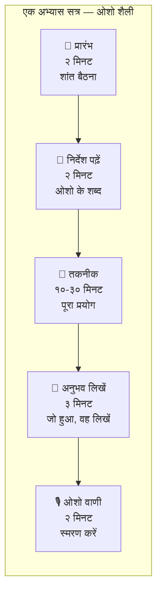
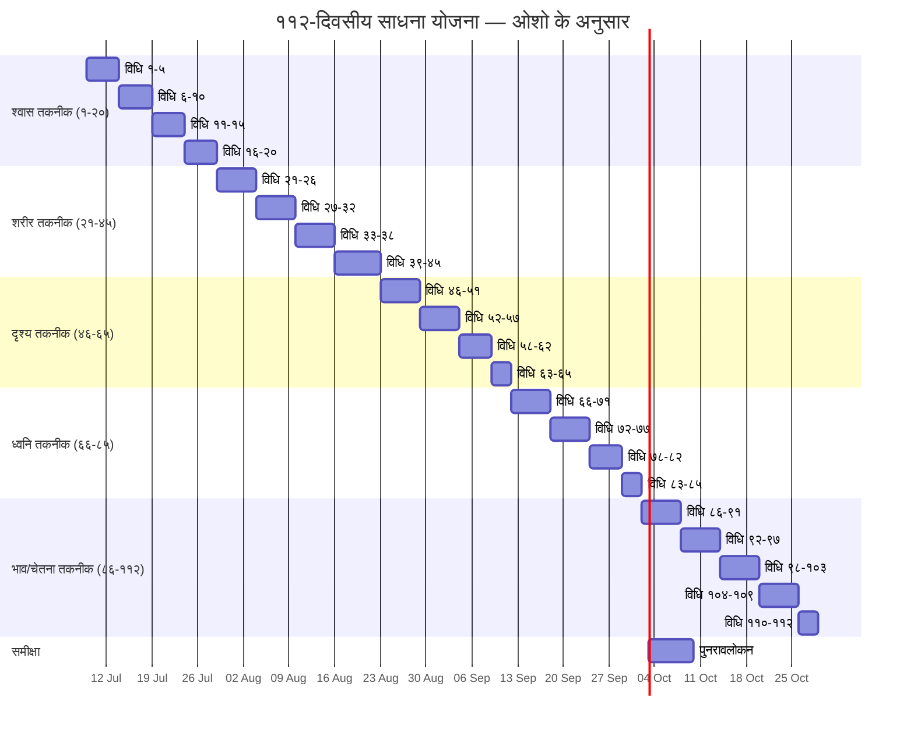

# साधना योजना: ११२ दिनों में ११२ तकनीकें (ओशो के अनुसार)

> **"११२ दिन — ११२ तकनीकें। हर दिन एक नया प्रयोग। हर दिन एक नया अनुभव। यह कोई जल्दबाज़ी नहीं है — यह एक गहन यात्रा है। एक-एक कदम चलना है। एक-एक तकनीक को जीना है।"**
> — **ओशो**

---

## इस योजना का उपयोग कैसे करें

यह योजना विज्ञान भैरव तंत्र की ११२ तकनीकों को व्यवस्थित रूप से सीखने और अभ्यास करने के लिए बनाई गई है। इसमें चार स्तरों पर योजनाएँ दी गई हैं — ७ दिन, २१ दिन, ४० दिन और ११२ दिन।

### प्रत्येक अभ्यास सत्र का प्रारूप

<a href="../../../assets/images/diagrams/vigyan-bhairav-tantra/sadhna-yojana/-handwritten.svg" target="_blank" rel="noopener">
  
</a>
<a href="../../../assets/images/diagrams/vigyan-bhairav-tantra/sadhna-yojana/-diagram.svg" target="_blank" rel="noopener">
  
</a>
<a href="../../../assets/images/diagrams/vigyan-bhairav-tantra/sadhna-yojana/-sticky.svg" target="_blank" rel="noopener">
  
</a>




### अभ्यास के नियम (ओशो के अनुसार)

<a href="../../../assets/images/diagrams/vigyan-bhairav-tantra/sadhna-yojana/-handwritten.svg" target="_blank" rel="noopener">
  
</a>
<a href="../../../assets/images/diagrams/vigyan-bhairav-tantra/sadhna-yojana/-diagram.svg" target="_blank" rel="noopener">
  
</a>
<a href="../../../assets/images/diagrams/vigyan-bhairav-tantra/sadhna-yojana/-sticky.svg" target="_blank" rel="noopener">
  
</a>


**ओशो वाणी:**
> "कुछ नियम हैं — लेकिन नियम बंधन नहीं हैं, वे मार्गदर्शन हैं। इन्हें पत्थर की लकीर मत समझो — ये तो सिर्फ संकेत हैं। तुम्हारा अपना अनुभव ही अंतिम नियम है।"

| नियम | विवरण |
|------|-------|
| **नियम १: निरंतरता** | हर दिन अभ्यास करें — भले ही ५ मिनट ही क्यों न हो |
| **नियम २: धैर्य** | तीन दिन से पहले कोई तकनीक मत छोड़ें |
| **नियम ३: साक्षी भाव** | तकनीक करते समय करने वाले को भी देखें |
| **नियम ४: कोई निर्णय नहीं** | "अच्छा सत्र" या "बुरा सत्र" — ऐसा मत सोचें |
| **नियम ५: जो हो, उसे स्वीकारें** | जो अनुभव हो, उसे वैसे ही स्वीकार करें |
| **नियम ६: प्रतिदिन लिखें** | अनुभव को डायरी में दर्ज करें |

---

## १. ७-दिवसीय परिचय योजना (Introduction Week)

### उद्देश्य

<a href="../../../assets/images/diagrams/vigyan-bhairav-tantra/sadhna-yojana/-handwritten.svg" target="_blank" rel="noopener">
  
</a>
<a href="../../../assets/images/diagrams/vigyan-bhairav-tantra/sadhna-yojana/-diagram.svg" target="_blank" rel="noopener">
  
</a>
<a href="../../../assets/images/diagrams/vigyan-bhairav-tantra/sadhna-yojana/-sticky.svg" target="_blank" rel="noopener">
  
</a>


इस सप्ताह का उद्देश्य विज्ञान भैरव तंत्र का स्वाद लेना है — पाँचों श्रेणियों से एक-एक तकनीक का अभ्यास। यह योजना उन सभी के लिए है जो पहली बार VBT का अभ्यास कर रहे हैं।

**ओशो वाणी:**
> "सात दिन — बस सात दिन। इतना तो दे सकते हो। सात दिन लगातार प्रयोग करो। अगर कुछ न हो — तो छोड़ दो। लेकिन सात दिन तो दो। एक दिन भी मत छोड़ो।"

### दैनिक योजना

<a href="../../../assets/images/diagrams/vigyan-bhairav-tantra/sadhna-yojana/-handwritten.svg" target="_blank" rel="noopener">
  
</a>
<a href="../../../assets/images/diagrams/vigyan-bhairav-tantra/sadhna-yojana/-diagram.svg" target="_blank" rel="noopener">
  
</a>
<a href="../../../assets/images/diagrams/vigyan-bhairav-tantra/sadhna-yojana/-sticky.svg" target="_blank" rel="noopener">
  
</a>


| दिन | तकनीक # | तकनीक (हिंदी) | श्रेणी | कठिनाई | समय | ओशो का मुख्य निर्देश | अपेक्षित अनुभव |
|-----|---------|--------------|--------|--------|------|---------------------|----------------|
| दिन १ | #१ | श्वास-प्राण धारण | श्वास | ★ | १० मिनट | "बस श्वास को देखो — नासिका में आते-जाते। कुछ मत करो। बस देखो।" | मन भटकेगा — यह सामान्य है। धीरे-धीरे श्वास धीमी होगी। |
| दिन २ | #२१ | अंग-अंग में चेतना | शरीर | ★ | १५ मिनट | "पैर के अंगूठे से शुरू करो — धीरे-धीरे ऊपर बढ़ो। हर अंग पर रुको।" | शरीर के कुछ हिस्से सुन्न लगेंगे — धीरे-धीरे संवेदना लौटेगी। |
| दिन ३ | #४६ | बिंदु ध्यान | दृश्य | ★ | १० मिनट | "एक बिंदु पर आँखें गड़ाओ — बिना पलक झपकाए। देखते-देखते बिंदु गायब होगा।" | आँखों में पानी आ सकता है — यह सामान्य है। |
| दिन ४ | #६७ | नाद ब्रह्म उपासना | ध्वनि | ★ | १० मिनट | "एक ध्वनि को चुनो — घंटी, संगीत, कोई भी। उसमें पूरी तरह डूब जाओ।" | मन ध्वनि में लीन होता जाएगा — समय का पता नहीं चलेगा। |
| दिन ५ | #८६ | भाव साक्षी | भाव/चेतना | ★★ | १५ मिनट | "जो भी भावना उठे — क्रोध, दुख, प्रेम — उसे देखो। बस देखो।" | भावनाएँ उठेंगी और गिरेंगी — तुम स्थिर रहोगे। |
| दिन ६ | #२७ | नृत्य ध्यान | शरीर | ★ | १५ मिनट | "संगीत पर नाचो — पूरे शरीर को बहने दो। नर्तक को खो दो।" | शरीर ऊर्जा से भर जाएगा — हल्कापन महसूस होगा। |
| दिन ७ | #९४ | आनंद ध्यान | भाव/चेतना | ★ | १० मिनट | "आनंद पहले से है — बस उसे पहचानो। उसे पूरे शरीर में फैलने दो।" | गहरी शांति और आनंद का अनुभव — यह तुम्हारा स्वभाव है। |

### सप्ताह १ के लिए विशेष निर्देश

<a href="../../../assets/images/diagrams/vigyan-bhairav-tantra/sadhna-yojana/-handwritten.svg" target="_blank" rel="noopener">
  
</a>
<a href="../../../assets/images/diagrams/vigyan-bhairav-tantra/sadhna-yojana/-diagram.svg" target="_blank" rel="noopener">
  
</a>
<a href="../../../assets/images/diagrams/vigyan-bhairav-tantra/sadhna-yojana/-sticky.svg" target="_blank" rel="noopener">
  
</a>


**ओशो वाणी:**
> "पहले सप्ताह में किसी निष्कर्ष पर मत पहुँचो। सिर्फ प्रयोग करो। बच्चे की तरह — जिज्ञासु, मासूम, बिना किसी अपेक्षा के।"

| समय | करने योग्य |
|------|-----------|
| सुबह (उठते ही) | ५ मिनट — विधि #१ (श्वास देखना) |
| दोपहर (खाने से पहले) | निर्धारित तकनीक — पूरे ध्यान से |
| शाम (सोने से पहले) | ५ मिनट — दिन का अनुभव लिखें |

---

## २. २१-दिवसीय आधार योजना (Foundation Plan)

### उद्देश्य

<a href="../../../assets/images/diagrams/vigyan-bhairav-tantra/sadhna-yojana/-handwritten.svg" target="_blank" rel="noopener">
  
</a>
<a href="../../../assets/images/diagrams/vigyan-bhairav-tantra/sadhna-yojana/-diagram.svg" target="_blank" rel="noopener">
  
</a>
<a href="../../../assets/images/diagrams/vigyan-bhairav-tantra/sadhna-yojana/-sticky.svg" target="_blank" rel="noopener">
  
</a>


२१ दिनों में पाँचों श्रेणियों की कम से कम २१ तकनीकों का गहराई से अभ्यास। प्रत्येक श्रेणी से ३-५ तकनीकें। इस योजना का उद्देश्य एक मजबूत नींव बनाना है।

**ओशो वाणी:**
> "इक्कीस दिन — यह एक आदत बनाने का समय है। तीन सप्ताह। ध्यान को अपने जीवन का हिस्सा बनाओ। फिर यह कोई 'करने' की चीज़ नहीं रहेगी — यह तुम्हारा होना बन जाएगी।"

### सप्ताह १: श्वास और शरीर (दिन १-७)

<a href="../../../assets/images/diagrams/vigyan-bhairav-tantra/sadhna-yojana/-handwritten.svg" target="_blank" rel="noopener">
  
</a>
<a href="../../../assets/images/diagrams/vigyan-bhairav-tantra/sadhna-yojana/-diagram.svg" target="_blank" rel="noopener">
  
</a>
<a href="../../../assets/images/diagrams/vigyan-bhairav-tantra/sadhna-yojana/-sticky.svg" target="_blank" rel="noopener">
  
</a>


| दिन | तकनीक # | तकनीक | श्रेणी | समय | ओशो का निर्देश |
|-----|---------|-------|--------|------|----------------|
| १ | #३ | श्वास-प्रश्वास साक्षी | श्वास | १५ मि | "आने और जाने दोनों को देखो — और बीच का अंतराल भी।" |
| २ | #२ | प्राण-अपान संयोग | श्वास | २० मि | "प्राण और अपान को एक दूसरे में मिलने दो। जहाँ वे मिलते हैं, वहीं द्वार है।" |
| ३ | #२२ | त्वचा संवेदना ध्यान | शरीर | १५ मि | "पूरे शरीर की त्वचा पर एक साथ ध्यान दो — सबसे बड़ा अंग।" |
| ४ | #३५ | अनाहत ध्यान | शरीर | १५ मि | "हृदय की धड़कन को महसूस करो — उस लय में समा जाओ।" |
| ५ | #८ | श्वास-प्रश्वास मध्य | श्वास | २० मि | "दो श्वासों के बीच के जोड़ पर ध्यान — वहीं टिको।" |
| ६ | #२९ | भोजन ध्यान | शरीर | २० मि | "खाना धीरे-धीरे खाओ — हर कौर को पूरे ध्यान से।" |
| ७ | #१ | श्वास-प्राण धारण | श्वास | २० मि | "श्वास को देखो — बस देखो। पूरे २० मिनट। सिर्फ श्वास।" |

### सप्ताह २: दृश्य और ध्वनि (दिन ८-१४)

<a href="../../../assets/images/diagrams/vigyan-bhairav-tantra/sadhna-yojana/-handwritten.svg" target="_blank" rel="noopener">
  
</a>
<a href="../../../assets/images/diagrams/vigyan-bhairav-tantra/sadhna-yojana/-diagram.svg" target="_blank" rel="noopener">
  
</a>
<a href="../../../assets/images/diagrams/vigyan-bhairav-tantra/sadhna-yojana/-sticky.svg" target="_blank" rel="noopener">
  
</a>


| दिन | तकनीक # | तकनीक | श्रेणी | समय | ओशो का निर्देश |
|-----|---------|-------|--------|------|----------------|
| ८ | #४७ | प्रकाश ध्यान | दृश्य | १५ मि | "दीपक की लौ को देखो — फिर आँखें बंद करो — वह छाप ही ध्यान बन जाए।" |
| ९ | #५४ | आकाश दृष्टि | दृश्य | १५ मि | "खुले आकाश को देखो — तुम भी वैसे ही साक्षी हो।" |
| १० | #५१ | नासाग्र दृष्टि | दृश्य | २० मि | "नाक की नोक पर दृष्टि जमाओ — स्थिरता में ध्यान खिलता है।" |
| ११ | #७१ | ओंकार ध्यान | ध्वनि | १५ मि | "ॐ का उच्चारण करो — उसकी अनुगूँज को सुनो — पूरे शरीर में।" |
| १२ | #६६ | सर्व ध्वनि ध्यान | ध्वनि | १५ मि | "सभी ध्वनियों को समान भाव से सुनो — किसी को मत चुनो।" |
| १३ | #६९ | मौन ध्यान | ध्वनि | २० मि | "ध्वनियों के बीच के मौन को सुनो — वह कभी नहीं टूटता।" |
| १४ | #७३ | संगीत ध्यान | ध्वनि | २० मि | "शांत संगीत सुनो — उसमें इतना खो जाओ कि सुनने वाला न बचे।" |

### सप्ताह ३: भाव/चेतना और समन्वय (दिन १५-२१)

<a href="../../../assets/images/diagrams/vigyan-bhairav-tantra/sadhna-yojana/-handwritten.svg" target="_blank" rel="noopener">
  
</a>
<a href="../../../assets/images/diagrams/vigyan-bhairav-tantra/sadhna-yojana/-diagram.svg" target="_blank" rel="noopener">
  
</a>
<a href="../../../assets/images/diagrams/vigyan-bhairav-tantra/sadhna-yojana/-sticky.svg" target="_blank" rel="noopener">
  
</a>


| दिन | तकनीक # | तकनीक | श्रेणी | समय | ओशो का निर्देश |
|-----|---------|-------|--------|------|----------------|
| १५ | #८६ | भाव साक्षी | भाव/चेतना | २० मि | "जो भी भावना उठे — उसे बिना निर्णय के देखो। वह आएगी और जाएगी।" |
| १६ | #९१ | करुणा ध्यान | भाव/चेतना | २० मि | "एक से शुरू करो — फिर सभी प्राणियों तक करुणा फैलाओ।" |
| १७ | #९३ | उदासी ध्यान | भाव/चेतना | २० मि | "उदासी को दूर मत भगाओ — उसकी गहराई में जाओ। वहाँ कुछ और है।" |
| १८ | #८ | श्वास-प्रश्वास मध्य | श्वास | २५ मि | "अंतराल को और गहराई से देखो — वह बढ़ रहा है।" |
| १९ | #३७ | आज्ञा चक्र ध्यान | शरीर | २० मि | "भौंहों के बीच — नीला प्रकाश दिखेगा। उसमें समा जाओ।" |
| २० | #५५ | दीपक ध्यान | दृश्य | २० मि | "लौ को देखो — फिर आँखें बंद करो — अंदर की लौ को देखो।" |
| २१ | #१ | श्वास-प्राण धारण | श्वास | ३० मि | "पूरे ३० मिनट — केवल श्वास का साक्षी। आज देखो कितनी गहराई तक जा सकते हो।" |

### २१ दिन के बाद — आत्म-मूल्यांकन

<a href="../../../assets/images/diagrams/vigyan-bhairav-tantra/sadhna-yojana/-handwritten.svg" target="_blank" rel="noopener">
  
</a>
<a href="../../../assets/images/diagrams/vigyan-bhairav-tantra/sadhna-yojana/-diagram.svg" target="_blank" rel="noopener">
  
</a>
<a href="../../../assets/images/diagrams/vigyan-bhairav-tantra/sadhna-yojana/-sticky.svg" target="_blank" rel="noopener">
  
</a>


| प्रश्न | हाँ | कभी-कभी | नहीं |
|-------|-----|---------|------|
| क्या मैं प्रतिदिन अभ्यास कर पाया? | ☐ | ☐ | ☐ |
| क्या मुझे कम से कम एक तकनीक में गहराई महसूस हुई? | ☐ | ☐ | ☐ |
| क्या मेरा मन पहले से अधिक शांत है? | ☐ | ☐ | ☐ |
| क्या मैं दिनचर्या में अधिक जागरूक हूँ? | ☐ | ☐ | ☐ |
| क्या मुझे किसी तकनीक में कठिनाई हुई? | ☐ | ☐ | ☐ |

---

## ३. ४०-दिवसीय गहन योजना (Intensive Plan)

### उद्देश्य

<a href="../../../assets/images/diagrams/vigyan-bhairav-tantra/sadhna-yojana/-handwritten.svg" target="_blank" rel="noopener">
  
</a>
<a href="../../../assets/images/diagrams/vigyan-bhairav-tantra/sadhna-yojana/-diagram.svg" target="_blank" rel="noopener">
  
</a>
<a href="../../../assets/images/diagrams/vigyan-bhairav-tantra/sadhna-yojana/-sticky.svg" target="_blank" rel="noopener">
  
</a>


४० दिनों में ४० तकनीकों का गहन अभ्यास — प्रत्येक श्रेणी से ८ तकनीकें। इस योजना में सरल और मध्यम तकनीकों के साथ-साथ कुछ कठिन तकनीकें भी शामिल हैं।

**ओशो वाणी:**
> "चालीस दिन — एक पूर्ण चक्र। चालीस दिन लगातार अभ्यास करो — और देखो, ध्यान अब कोई क्रिया नहीं, कोई प्रयास नहीं — यह तुम्हारा स्वभाव बन गया है। चालीस दिनों में तुम बदल जाओगे।"

### सप्ताह १-२: श्वास गहन (दिन १-१४)

<a href="../../../assets/images/diagrams/vigyan-bhairav-tantra/sadhna-yojana/-handwritten.svg" target="_blank" rel="noopener">
  
</a>
<a href="../../../assets/images/diagrams/vigyan-bhairav-tantra/sadhna-yojana/-diagram.svg" target="_blank" rel="noopener">
  
</a>
<a href="../../../assets/images/diagrams/vigyan-bhairav-tantra/sadhna-yojana/-sticky.svg" target="_blank" rel="noopener">
  
</a>


| दिन | तकनीक # | तकनीक | समय | ओशो का निर्देश |
|-----|---------|-------|------|----------------|
| १ | #१ | श्वास-प्राण धारण | २० मि | "श्वास को बदलो मत — बस देखो। जैसे कोई नदी बह रही हो।" |
| २ | #३ | श्वास-प्रश्वास साक्षी | २० मि | "आने और जाने दोनों को एक साथ देखो। दोनों के बीच का अंतराल — वही शून्य है।" |
| ३ | #६ | स्थूल-सूक्ष्म श्वास | २० मि | "पहले स्थूल श्वास — फिर सूक्ष्म प्राण। पूरे शरीर में ऊर्जा को महसूस करो।" |
| ४ | #१२ | श्वास-नाद ब्रह्म | २० मि | "'सो' अंदर — 'हम' बाहर। यह सबसे स्वाभाविक मंत्र है।" |
| ५ | #८ | श्वास-प्रश्वास मध्य | २५ मि | "जोड़ पर ध्यान — जहाँ श्वास समाप्त और प्रश्वास शुरू होता है।" |
| ६ | #२ | प्राण-अपान संयोग | २५ मि | "दो नदियों को मिलने दो — जहाँ वे मिलती हैं, वहीं प्रयाग है।" |
| ७ | #४ | श्वास रुकने पर ध्यान | २५ मि | "ठहराव को देखो — यह ठहराव ही परमात्मा का द्वार है।" |
| ८ | #१७ | नाड़ी शोधन प्रज्ञा | २० मि | "बाएँ-दाएँ — नाड़ियों को शुद्ध करो। लेकिन जागरूक रहो, यंत्रवत मत करो।" |
| ९ | #५ | प्राण-शून्य विस्तार | ३० मि | "श्वास को फैलने दो — पूरे ब्रह्मांड में। सीमाओं को मिटाओ।" |
| १० | #१० | उर्ध्व-अधः प्राण संचार | २५ मि | "श्वास की लहर को देखो — ऊपर-नीचे, पूरे शरीर में।" |
| ११ | #७ | प्राण-नाड़ी प्रबोधन | ३० मि | "रीढ़ में प्राण के प्रवाह को महसूस करो — मूल से शीर्ष तक।" |
| १२ | #१८ | श्वास-प्रश्वास ऐक्य | २० मि | "दोनों को एक ही ऊर्जा के रूप में देखो — जैसे सिक्के के दो पहलू।" |
| १३ | #९ | पूर्ण कुंभक धारण | ३० मि | "भरो — रोको — छोड़ो — रोको। चारों अवस्थाओं में साक्षी।" |
| १४ | #१९ | प्राण-प्रवाह साक्षी | २५ मि | "श्वास की निर्बाध धारा — बिना रुकावट के। नदी की तरह।" |

### सप्ताह ३-४: शरीर और दृश्य (दिन १५-२८)

<a href="../../../assets/images/diagrams/vigyan-bhairav-tantra/sadhna-yojana/-handwritten.svg" target="_blank" rel="noopener">
  
</a>
<a href="../../../assets/images/diagrams/vigyan-bhairav-tantra/sadhna-yojana/-diagram.svg" target="_blank" rel="noopener">
  
</a>
<a href="../../../assets/images/diagrams/vigyan-bhairav-tantra/sadhna-yojana/-sticky.svg" target="_blank" rel="noopener">
  
</a>


| दिन | तकनीक # | तकनीक | समय | ओशो का निर्देश |
|-----|---------|-------|------|----------------|
| १५ | #२१ | अंग-अंग में चेतना | २० मि | "पैर के अंगूठे से सिर तक — हर अंग पर रुको, महसूस करो।" |
| १६ | #२३ | शीत-उष्ण संवेदन | २० मि | "ठंड-गर्म के द्वंद्व को देखो — और उसके पार जाओ।" |
| १७ | #२६ | भ्रमण ध्यान | २० मि | "धीरे-धीरे चलो। हर कदम को देखो। चलना ही ध्यान बन जाए।" |
| १८ | #३५ | अनाहत ध्यान | १५ मि | "हृदय की धड़कन को महसूस करो — उस लय में समा जाओ।" |
| १९ | #३७ | आज्ञा चक्र ध्यान | २० मि | "भौंहों के बीच — तीसरी आँख पर ध्यान। प्रकाश में समा जाओ।" |
| २० | #३३ | प्राणाधार ध्यान | ३० मि | "सात चक्रों पर क्रमशः ध्यान — मूलाधार से सहस्रार तक।" |
| २१ | #३९ | काया स्थिरता | २५ मि | "बिल्कुल स्थिर बैठो — एक मांसपेशी मत हिलाओ। अंदर की हलचल को देखो।" |
| २२ | #४६ | बिंदु ध्यान | १५ मि | "एक बिंदु पर आँखें गड़ाओ — बिना पलक झपकाए।" |
| २३ | #५० | भ्रूमध्य दृष्टि | २० मि | "भौंहों के बीच — नीला प्रकाश दिखेगा। उसमें समा जाओ।" |
| २४ | #४९ | अंतराल दृष्टि | २० मि | "दो वस्तुओं के बीच के खालीपन को देखो — वहीं सब कुछ है।" |
| २५ | #५३ | जल प्रतिबिंब | १५ मि | "शांत पानी में अपना प्रतिबिंब देखो — देखने वाला और प्रतिबिंब।" |
| २६ | #५९ | शून्य दृष्टि | २० मि | "खाली दीवार पर आँखें जमाओ — दीवार गायब हो जाएगी।" |
| २७ | #६१ | अग्नि संस्कार | २० मि | "अग्नि की ज्वाला में मन को जल जाने दो — सब विचार जल जाएं।" |
| २८ | #६२ | मेघ ध्यान | १५ मि | "बादलों को देखो — तुम आसमान हो, बादल नहीं।" |

### सप्ताह ५-६: ध्वनि और भाव/चेतना (दिन २९-४०)

<a href="../../../assets/images/diagrams/vigyan-bhairav-tantra/sadhna-yojana/-handwritten.svg" target="_blank" rel="noopener">
  
</a>
<a href="../../../assets/images/diagrams/vigyan-bhairav-tantra/sadhna-yojana/-diagram.svg" target="_blank" rel="noopener">
  
</a>
<a href="../../../assets/images/diagrams/vigyan-bhairav-tantra/sadhna-yojana/-sticky.svg" target="_blank" rel="noopener">
  
</a>


| दिन | तकनीक # | तकनीक | समय | ओशो का निर्देश |
|-----|---------|-------|------|----------------|
| २९ | #६७ | नाद ब्रह्म उपासना | २० मि | "एक ध्वनि चुनो — उसमें पूरी तरह डूब जाओ। ध्वनि और श्रोता एक हो जाएं।" |
| ३० | #७७ | प्राकृत ध्वनि | १५ मि | "प्रकृति में बैठो — बस सुनो। हर ध्वनि प्रकृति का मंत्र है।" |
| ३१ | #६८ | स्व-ध्वनि ध्यान | २० मि | "अपनी आवाज़ सुनो — जैसे कोई और बोल रहा हो।" |
| ३२ | #७२ | मंत्र ध्यान | २० मि | "मंत्र को बार-बार दोहराओ — ध्वनि में डूबो, अर्थ मत सोचो।" |
| ३३ | #७५ | कोलाहल ध्यान | २० मि | "शोर के बीच मौन रखो — यही सच्चा ध्यान है।" |
| ३४ | #७६ | रहस्य ध्वनि | २० मि | "दिल की धड़कन को सुनो — यह जीवन की मूल ध्वनि है।" |
| ३५ | #८६ | भाव साक्षी | २० मि | "जो भी भावना उठे — उसे बिना निर्णय के देखो। वह आएगी और जाएगी।" |
| ३६ | #९४ | आनंद ध्यान | १५ मि | "आनंद पहले से है — बस उसे पहचानो और फैलने दो।" |
| ३७ | #९७ | चैतन्य प्रकाश | २५ मि | "भीतर के चैतन्य प्रकाश को देखो — वह कभी बुझता नहीं।" |
| ३८ | #९३ | उदासी ध्यान | २० मि | "उदासी को दूर मत भगाओ — उसकी गहराई में जाओ। वहाँ प्रकाश है।" |
| ३९ | #९६ | संकल्प ध्यान | २० मि | "'मैं जागृत हूँ' — इस संकल्प को दोहराओ। संकल्प ही सत्य बनता है।" |
| ४० | #९८ | चैतन्य ऐक्य | ३० मि | "'मैं शुद्ध चैतन्य हूँ' — यह भाव धीरे-धीरे सत्य बनता है। आज पूरे ३० मिनट।" |

### ४० दिन का उपलब्धि स्तर

<a href="../../../assets/images/diagrams/vigyan-bhairav-tantra/sadhna-yojana/-handwritten.svg" target="_blank" rel="noopener">
  
</a>
<a href="../../../assets/images/diagrams/vigyan-bhairav-tantra/sadhna-yojana/-diagram.svg" target="_blank" rel="noopener">
  
</a>
<a href="../../../assets/images/diagrams/vigyan-bhairav-tantra/sadhna-yojana/-sticky.svg" target="_blank" rel="noopener">
  
</a>


| मापदंड | शुरुआत (दिन १) | अब (दिन ४०) | बदलाव |
|--------|----------------|-------------|-------|
| ध्यान में स्थिरता | ___ मिनट | ___ मिनट | ___ |
| मन की शांति (१-१०) | ___ / १० | ___ / १० | ___ |
| दैनिक जागरूकता (१-१०) | ___ / १० | ___ / १० | ___ |
| पसंदीदा तकनीक | ___ | ___ | ___ |

---

## ४. ११२-दिवसीय पूर्ण योजना (Complete Plan)

### उद्देश्य

<a href="../../../assets/images/diagrams/vigyan-bhairav-tantra/sadhna-yojana/-handwritten.svg" target="_blank" rel="noopener">
  
</a>
<a href="../../../assets/images/diagrams/vigyan-bhairav-tantra/sadhna-yojana/-diagram.svg" target="_blank" rel="noopener">
  
</a>
<a href="../../../assets/images/diagrams/vigyan-bhairav-tantra/sadhna-yojana/-sticky.svg" target="_blank" rel="noopener">
  
</a>


सभी ११२ तकनीकों का क्रमबद्ध अभ्यास — ११२ दिन, ११२ तकनीकें। यह एक पूर्ण यात्रा है — श्वास से लेकर परम चेतना तक।

**ओशो वाणी:**
> "११२ दिन — ११२ तकनीकें। यह कोई रेस नहीं है। एक-एक दिन जिओ। एक-एक तकनीक को पूरा अनुभव करो। जल्दी मत करो — जल्दी से तुम केवल अपने आप को चूकोगे। हर तकनीक में इतना डूबो कि वह तुम्हारा पूरा अनुभव बन जाए।"

### ११२-दिवसीय गैंट चार्ट

<a href="../../../assets/images/diagrams/vigyan-bhairav-tantra/sadhna-yojana/-handwritten.svg" target="_blank" rel="noopener">
  
</a>
<a href="../../../assets/images/diagrams/vigyan-bhairav-tantra/sadhna-yojana/-diagram.svg" target="_blank" rel="noopener">
  
</a>
<a href="../../../assets/images/diagrams/vigyan-bhairav-tantra/sadhna-yojana/-sticky.svg" target="_blank" rel="noopener">
  
</a>




### क्रमबद्ध तकनीक सूची (११२ दिन)

<a href="../../../assets/images/diagrams/vigyan-bhairav-tantra/sadhna-yojana/-handwritten.svg" target="_blank" rel="noopener">
  
</a>
<a href="../../../assets/images/diagrams/vigyan-bhairav-tantra/sadhna-yojana/-diagram.svg" target="_blank" rel="noopener">
  
</a>
<a href="../../../assets/images/diagrams/vigyan-bhairav-tantra/sadhna-yojana/-sticky.svg" target="_blank" rel="noopener">
  
</a>


| सप्ताह | दिन | तकनीक # | तकनीक | श्रेणी | कठिनाई | समय |
|-------|-----|---------|-------|--------|--------|------|
| सप्ताह १ | १-७ | #१-#७ | श्वास-प्राण धारण से प्राण-नाड़ी प्रबोधन तक | श्वास | ★-★★★ | १५-२५ मि |
| सप्ताह २ | ८-१४ | #८-#१४ | श्वास-प्रश्वास मध्य से पंच-प्राण एकीकरण तक | श्वास | ★★-★★★★ | २०-३० मि |
| सप्ताह ३ | १५-२० | #१५-#२० | श्वास-चैतन्य लय से श्वास-मौन समाधि तक | श्वास | ★★★-★★★★★ | २५-३०+ मि |
| सप्ताह ४ | २१-२७ | #२१-#२७ | अंग-अंग में चेतना से नृत्य ध्यान तक | शरीर | ★-★ | १५-२० मि |
| सप्ताह ५ | २८-३४ | #२८-#३४ | मुद्रा ध्यान से मूलाधार प्रज्ञा तक | शरीर | ★★-★★★ | २०-२५ मि |
| सप्ताह ६ | ३५-३९ | #३५-#३९ | अनाहत ध्यान से काया स्थिरता तक | शरीर | ★-★★ | १०-२५ मि |
| सप्ताह ७ | ४०-४५ | #४०-#४५ | देह प्रकाश से अहंग्रह उपासना तक | शरीर | ★★★-★★★★ | २०-३० मि |
| सप्ताह ८ | ४६-५२ | #४६-#५२ | बिंदु ध्यान से छाया ध्यान तक | दृश्य | ★-★★ | १०-२० मि |
| सप्ताह ९ | ५३-५९ | #५३-#५९ | जल प्रतिबिंब से शून्य दृष्टि तक | दृश्य | ★-★★ | १०-२० मि |
| सप्ताह १० | ६०-६५ | #६०-#६५ | सूर्य ध्यान से नेत्र प्रकाश तक | दृश्य | ★-★★★ | १०-२० मि |
| सप्ताह ११ | ६६-७२ | #६६-#७२ | सर्व ध्वनि ध्यान से मंत्र ध्यान तक | ध्वनि | ★-★★ | १०-२० मि |
| सप्ताह १२ | ७३-७९ | #७३-#७९ | संगीत ध्यान से ध्वनि-लय तक | ध्वनि | ★-★★★ | १०-२५ मि |
| सप्ताह १३ | ८०-८५ | #८०-#८५ | नाद अनुसंधान से ध्वनि-ब्रह्म ऐक्य तक | ध्वनि | ★★-★★★★ | १५-३० मि |
| सप्ताह १४ | ८६-९२ | #८६-#९२ | भाव साक्षी से मैत्री ध्यान तक | भाव/चेतना | ★★-★★★ | १५-२५ मि |
| सप्ताह १५ | ९३-९९ | #९३-#९९ | उदासी ध्यान से सर्व चैतन्य तक | भाव/चेतना | ★-★★★★ | १०-३० मि |
| सप्ताह १६ | १००-१०६ | #१००-#१०६ | साक्षी का साक्षी से उन्मनी चैतन्य तक | भाव/चेतना | ★★★★★ | २५-३०+ मि |
| सप्ताह १७ | १०७-११२ | #१०७-#११२ | अद्वैत चैतन्य से परम ध्यान तक | भाव/चेतना | ★★★★★ | ३०+ मि |

### प्रत्येक तकनीक के लिए सत्र संरचना

<a href="../../../assets/images/diagrams/vigyan-bhairav-tantra/sadhna-yojana/-handwritten.svg" target="_blank" rel="noopener">
  
</a>
<a href="../../../assets/images/diagrams/vigyan-bhairav-tantra/sadhna-yojana/-diagram.svg" target="_blank" rel="noopener">
  
</a>
<a href="../../../assets/images/diagrams/vigyan-bhairav-tantra/sadhna-yojana/-sticky.svg" target="_blank" rel="noopener">
  
</a>


| चरण | समय | कार्य |
|------|------|-------|
| प्रारंभ | २ मिनट | शांत बैठना, आँखें बंद करना, ३ गहरी श्वास |
| निर्देश | २ मिनट | ओशो का मुख्य निर्देश — इस संदर्शिका से पढ़ें |
| अभ्यास | १०-३० मिनट | तकनीक का पूरा प्रयोग — बिना किसी अपेक्षा के |
| विश्राम | २ मिनट | तकनीक छोड़ दें, बस बैठे रहें — जो है, उसे होने दें |
| लेखन | ३ मिनट | अनुभव को तीन वाक्यों में लिखें |

### सप्ताह ४ में से एक का नमूना (सप्ताह १४ — भाव/चेतना)

<a href="../../../assets/images/diagrams/vigyan-bhairav-tantra/sadhna-yojana/-handwritten.svg" target="_blank" rel="noopener">
  
</a>
<a href="../../../assets/images/diagrams/vigyan-bhairav-tantra/sadhna-yojana/-diagram.svg" target="_blank" rel="noopener">
  
</a>
<a href="../../../assets/images/diagrams/vigyan-bhairav-tantra/sadhna-yojana/-sticky.svg" target="_blank" rel="noopener">
  
</a>


| दिन | तकनीक # | तकनीक | ओशो का निर्देश | अनुभव लिखें |
|-----|---------|-------|----------------|-------------|
| ८६ | #८६ | भाव साक्षी | "जो भी भावना उठे — उसे बिना निर्णय के देखो। अच्छा-बुरा मत कहो। बस देखो।" | कौन सी भावना उठी? कितनी देर रही? |
| ८७ | #८७ | क्रोध ध्यान | "पुराने क्रोध को याद करो — या किसी को अपने पर क्रोध करने दो। अब उसे देखो — न दबाओ, न व्यक्त करो।" | क्रोध कैसा लगा? शरीर में कहाँ महसूस हुआ? |
| ८८ | #९४ | आनंद ध्यान | "आनंद पहले से है — बस उसे पहचानो। किसी सुखद स्मृति को याद करो — उस आनंद को पूरे शरीर में फैलने दो।" | आनंद कहाँ महसूस हुआ? शरीर का कौन सा भाग खिल उठा? |
| ८९ | #९१ | करुणा ध्यान | "एक व्यक्ति को याद करो जो दुखी है — उसके प्रति करुणा महसूस करो। फिर सभी दुखी प्राणियों के प्रति।" | हृदय में कैसा अनुभव हुआ? क्या आँसू आए? |
| ९० | #९७ | चैतन्य प्रकाश | "अपने भीतर के प्रकाश को देखो — वह हर समय जल रहा है। आँखें बंद करो — महसूस करो। वह प्रकाश तुम हो।" | क्या प्रकाश दिखा? किस रंग का? कितना तेज़? |
| ९१ | #९६ | संकल्प ध्यान | "'मैं जागृत हूँ' — इस संकल्प को बार-बार दोहराओ। पूरी शक्ति से। यह संकल्प तुम्हें जगाएगा।" | कितनी देर तक जागरूकता बनी रही? |
| ९२ | #९८ | चैतन्य ऐक्य | "'मैं शरीर नहीं हूँ — मैं विचार नहीं हूँ — मैं शुद्ध चैतन्य हूँ।' आज पूरे ३० मिनट इस भाव में रहो।" | कोई भेद रह गया? कितनी गहराई तक गए? |

---

## ५. प्रगति ट्रैकिंग तालिका (Progress Tracking Table)

### दैनिक अभ्यास लॉग

<a href="../../../assets/images/diagrams/vigyan-bhairav-tantra/sadhna-yojana/-handwritten.svg" target="_blank" rel="noopener">
  
</a>
<a href="../../../assets/images/diagrams/vigyan-bhairav-tantra/sadhna-yojana/-diagram.svg" target="_blank" rel="noopener">
  
</a>
<a href="../../../assets/images/diagrams/vigyan-bhairav-tantra/sadhna-yojana/-sticky.svg" target="_blank" rel="noopener">
  
</a>


| दिनांक | दिन # | तकनीक # | तकनीक | समय (मि) | कठिनाई (१-५) | गहराई (१-१०) | मुख्य अनुभव | अगले दिन का संकल्प |
|--------|-------|---------|-------|----------|--------------|--------------|------------|-------------------|
| / | १ | #१ | श्वास-प्राण धारण | १० | १ | ४ | मन बार-बार भटका | कल १२ मिनट करूँ |
| / | २ | #२१ | अंग-अंग में चेतना | १५ | १ | ५ | पैर में झुनझुनाहट | पूरे शरीर पर ध्यान |
| / | ३ | #४६ | बिंदु ध्यान | १० | १ | ३ | आँखों में पानी | पलक मत झपकाना |
| / | ४ | #६७ | नाद ब्रह्म | १० | १ | ६ | ध्वनि में खो गया | और गहरे जाना |
| / | ५ | #८६ | भाव साक्षी | १५ | २ | ५ | क्रोध आया — देखा | बिना निर्णय के |
| / | ६ | #२७ | नृत्य ध्यान | १५ | १ | ७ | शरीर ऊर्जा से भरा | नर्तक को खोना |
| / | ७ | #९४ | आनंद ध्यान | १० | १ | ६ | गहरी शांति | दिन में भी याद रखना |

> **निर्देश:** प्रत्येक पंक्ति एक दिन का अभ्यास रिकॉर्ड करती है। कठिनाई १ (सरल) से ५ (अति कठिन)। गहराई १ (सतही) से १० (गहन समाधि)।

### साप्ताहिक प्रगति मूल्यांकन

<a href="../../../assets/images/diagrams/vigyan-bhairav-tantra/sadhna-yojana/-handwritten.svg" target="_blank" rel="noopener">
  
</a>
<a href="../../../assets/images/diagrams/vigyan-bhairav-tantra/sadhna-yojana/-diagram.svg" target="_blank" rel="noopener">
  
</a>
<a href="../../../assets/images/diagrams/vigyan-bhairav-tantra/sadhna-yojana/-sticky.svg" target="_blank" rel="noopener">
  
</a>


| सप्ताह | कुल तकनीकें | कुल समय | श्रेणियाँ कवर | सबसे अच्छा अनुभव | सबसे कठिन | अगले सप्ताह का लक्ष्य |
|--------|------------|---------|--------------|-----------------|-----------|---------------------|
| १ | ___ | ___ मि | ___ | ___ | ___ | ___ |
| २ | ___ | ___ मि | ___ | ___ | ___ | ___ |
| ३ | ___ | ___ मि | ___ | ___ | ___ | ___ |
| ४ | ___ | ___ मि | ___ | ___ | ___ | ___ |
| ... | ... | ... | ... | ... | ... | ... |
| १६ | ___ | ___ मि | ___ | ___ | ___ | ___ |

### पूरी यात्रा की प्रगति डैशबोर्ड

<a href="../../../assets/images/diagrams/vigyan-bhairav-tantra/sadhna-yojana/-handwritten.svg" target="_blank" rel="noopener">
  
</a>
<a href="../../../assets/images/diagrams/vigyan-bhairav-tantra/sadhna-yojana/-diagram.svg" target="_blank" rel="noopener">
  
</a>
<a href="../../../assets/images/diagrams/vigyan-bhairav-tantra/sadhna-yojana/-sticky.svg" target="_blank" rel="noopener">
  
</a>


```
═══════════════════════════════════════════════════════════════
        ११२-दिवसीय साधना यात्रा — प्रगति डैशबोर्ड
═══════════════════════════════════════════════════════════════

दिन: [████████░░░░░░░░░░░░░░░░░░░░░░] ४० / ११२ (३५.७%)

श्रेणी-वार प्रगति:
  श्वास (१-२०):      [████████░░░░] १० / २० — ५०%
  शरीर (२१-४५):     [█████░░░░░░░] ७ / २५ — २८%
  दृश्य (४६-६५):    [███░░░░░░░░░] ४ / २० — २०%
  ध्वनि (६६-८५):    [██░░░░░░░░░░] २ / २० — १०%
  भाव/चेतना (८६-११२): [█░░░░░░░░░░] १ / २७ — ४%

कुल अभ्यास समय: ७२० मिनट (१२ घंटे)
औसत दैनिक समय: १८ मिनट
लगातार दिन: ४० 🏆

ओशो कहते हैं:
"चालीस दिन — एक नई आदत, एक नया जन्म!
अब और गहरे जाओ — असली यात्रा तो अभी शुरू हुई है।"
═══════════════════════════════════════════════════════════════
```

### खाली प्रगति ट्रैकर (प्रिंट करने योग्य)

<a href="../../../assets/images/diagrams/vigyan-bhairav-tantra/sadhna-yojana/-handwritten.svg" target="_blank" rel="noopener">
  
</a>
<a href="../../../assets/images/diagrams/vigyan-bhairav-tantra/sadhna-yojana/-diagram.svg" target="_blank" rel="noopener">
  
</a>
<a href="../../../assets/images/diagrams/vigyan-bhairav-tantra/sadhna-yojana/-sticky.svg" target="_blank" rel="noopener">
  
</a>


```
दिन # | तिथि | विधि | तकनीक | समय | कठिनाई (१-५) | गहराई (१-१०) | अनुभव (३ शब्द)
──────┼──────┼──────┼────────┼──────┼──────────────┼──────────────┼───────────────
  १   │      │  #१  │ श्वास  │      │              │              │
  २   │      │ #२१  │ शरीर  │      │              │              │
  ३   │      │ #४६  │ दृश्य  │      │              │              │
  ४   │      │ #६७  │ ध्वनि  │      │              │              │
  ५   │      │ #८६  │ भाव   │      │              │              │
  ६   │      │ #२७  │ शरीर  │      │              │              │
  ७   │      │ #९४  │ आनंद  │      │              │              │
 ...  │      │  ...  │ ...   │      │              │              │
 ११२ │      │ #११२ │ परम   │      │              │              │
```

---

## टाइपस्क्रिप्ट: SadhanaPlanner — योजना निर्माण प्रणाली

```typescript
/**
 * ============================================================
 * साधना योजना: ११२ दिनों में ११२ तकनीकें (ओशो के अनुसार)
 * ============================================================
 * यह टाइपस्क्रिप्ट वर्गीकरण आपके लिए व्यक्तिगत साधना योजनाएँ
 * बनाता है — चाहे आप ७ दिन, २१ दिन, ४० दिन या ११२ दिन का
 * अभ्यास करना चाहें।
 * 
 * ओशो कहते हैं: "योजना बनाओ — लेकिन उसमें अकड़ो मत।
 * योजना तुम्हारी सेवक है, तुम उसके सेवक नहीं।"
 */

// ─── मूल प्रकार ─────────────────────────────────────────────

/** योजना के प्रकार */
type PlanType = '७_दिन' | '२१_दिन' | '४०_दिन' | '११२_दिन';

/** दैनिक सत्र की जानकारी */
interface DailySession {
  day: number;
  techniqueId: number;
  techniqueName: string;
  category: string;
  durationMinutes: number;
  difficulty: number;
  oshoInstruction: string;
  completed: boolean;
  experience?: string;
  depthLevel?: number; // १-१०
  date?: Date;
}

/** योजना का पूरा रिकॉर्ड */
interface SadhanaPlan {
  planType: PlanType;
  startDate: Date;
  totalDays: number;
  sessions: DailySession[];
  focusAreas: string[];
  specialInstructions: string[];
}

/** प्रगति के आँकड़े */
interface SadhanaProgressStats {
  totalDaysCompleted: number;
  totalMinutesPracticed: number;
  averageDailyMinutes: number;
  categoriesCovered: string[];
  longestStreak: number;
  currentStreak: number;
  averageDepth: number;
  mostPracticedCategory: string;
  favoriteTechnique: string;
  oshoMilestone: string;
}

/** व्यक्तिगत प्राथमिकताएँ */
interface UserPreferences {
  preferredDuration: number; // मिनट
  preferredCategories: string[];
  availableTimeSlot: 'सुबह' | 'दोपहर' | 'शाम' | 'रात';
  experienceLevel: 'शुरुआती' | 'मध्यम' | 'उन्नत';
  focusAreas: string[];
}

// ─── साधना योजना निर्माता ──────────────────────────────────

class SadhanaPlanner {
  private techniques: { id: number; name: string; category: string; difficulty: number; defaultDuration: number; oshoInstruction: string }[] = [];
  private plans: Map<string, SadhanaPlan> = new Map();

  constructor() {
    this.initializeTechniques();
  }

  /** ११२ तकनीकों का मूल डेटा */
  private initializeTechniques(): void {
    // श्वास तकनीकें (१-२०)
    const breathTechniques = [
      { name: 'श्वास-प्राण धारण', difficulty: 1, duration: 15, instruction: 'श्वास को आते-जाते देखो — बस देखो।' },
      { name: 'प्राण-अपान संयोग', difficulty: 2, duration: 20, instruction: 'प्राण और अपान को मिलने दो — जहाँ वे मिलते हैं, वहीं द्वार है।' },
      { name: 'श्वास-प्रश्वास साक्षी', difficulty: 1, duration: 15, instruction: 'आने और जाने दोनों को देखो — बीच का अंतराल ही शून्य है।' },
      { name: 'श्वास रुकने पर ध्यान', difficulty: 3, duration: 25, instruction: 'दो श्वासों के बीच के ठहराव में प्रवेश करो।' },
      { name: 'प्राण-शून्य विस्तार', difficulty: 3, duration: 25, instruction: 'श्वास को पूरे ब्रह्मांड में फैलने दो — सीमाएँ मिटाओ।' },
      { name: 'स्थूल-सूक्ष्म श्वास', difficulty: 2, duration: 20, instruction: 'पहले स्थूल श्वास — फिर सूक्ष्म प्राण को महसूस करो।' },
      { name: 'प्राण-नाड़ी प्रबोधन', difficulty: 3, duration: 25, instruction: 'रीढ़ में प्राण के प्रवाह को महसूस करो — मूल से शीर्ष तक।' },
      { name: 'श्वास-प्रश्वास मध्य', difficulty: 2, duration: 20, instruction: 'दो श्वासों के बीच के जोड़ पर ध्यान — वहीं टिको।' },
      { name: 'पूर्ण कुंभक धारण', difficulty: 3, duration: 25, instruction: 'भरो — रोको — छोड़ो — रोको। चारों अवस्थाओं में साक्षी।' },
      { name: 'उर्ध्व-अधः प्राण संचार', difficulty: 2, duration: 20, instruction: 'श्वास की लहर को ऊपर-नीचे घूमते देखो।' },
      { name: 'प्राण-बिंदु धारण', difficulty: 4, duration: 30, instruction: 'प्राण को एक बिंदु पर केंद्रित करो — गहन एकाग्रता।' },
      { name: 'श्वास-नाद ब्रह्म', difficulty: 2, duration: 20, instruction: 'श्वास की आवाज़ सुनो — सबसे स्वाभाविक मंत्र।' },
      { name: 'सुषुम्ना श्वास', difficulty: 3, duration: 25, instruction: 'रीढ़ की नली में श्वास को चलते महसूस करो।' },
      { name: 'पंच-प्राण एकीकरण', difficulty: 4, duration: 30, instruction: 'पाँच प्राणों को एक-एक करके महसूस करो — फिर सबको एक करो।' },
      { name: 'श्वास-चैतन्य लय', difficulty: 5, duration: 30, instruction: 'श्वास और चेतना को एक हो जाने दो — कोई भेद न रहे।' },
      { name: 'प्राण-अपान समायोग', difficulty: 3, duration: 25, instruction: 'प्राण-अपान के मिलन से तीसरी ऊर्जा जाग्रत होती है।' },
      { name: 'नाड़ी शोधन प्रज्ञा', difficulty: 2, duration: 20, instruction: 'बाएँ-दाएँ — नाड़ियों को शुद्ध करो, जागरूक रहो।' },
      { name: 'श्वास-प्रश्वास ऐक्य', difficulty: 1, duration: 15, instruction: 'दोनों को एक ही ऊर्जा के दो रूपों के रूप में देखो।' },
      { name: 'प्राण-प्रवाह साक्षी', difficulty: 2, duration: 20, instruction: 'श्वास की निर्बाध धारा को देखो — नदी की तरह।' },
      { name: 'श्वास-मौन समाधि', difficulty: 4, duration: 30, instruction: 'श्वास को इतना देखो कि वह मिट जाए — केवल मौन रहे।' },
    ];
    breathTechniques.forEach((t, i) => this.techniques.push({ id: i + 1, category: 'श्वास', ...t }));

    // शरीर तकनीकें (२१-४५)
    const bodyNames = [
      'अंग-अंग में चेतना', 'त्वचा संवेदना ध्यान', 'शीत-उष्ण संवेदन', 'वेदना ध्यान',
      'आलिंगन ध्यान', 'भ्रमण ध्यान', 'नृत्य ध्यान', 'मुद्रा ध्यान', 'भोजन ध्यान',
      'स्पर्श ध्यान', 'देह-सीमा ज्ञान', 'जल समर्पण', 'प्राणाधार ध्यान', 'मूलाधार प्रज्ञा',
      'अनाहत ध्यान', 'विशुद्धि चक्र ध्यान', 'आज्ञा चक्र ध्यान', 'सहस्रार प्रज्ञा',
      'काया स्थिरता', 'देह प्रकाश', 'शरीर-प्राण लय', 'संवेदना पार', 'स्वप्न-देह ध्यान',
      'ज्वाला ध्यान', 'अहंग्रह उपासना',
    ];
    const bodyDurations = [15, 12, 18, 22, 15, 18, 18, 22, 18, 12, 18, 18, 25, 22, 12, 22, 15, 28, 22, 18, 22, 28, 30, 25, 25];
    const bodyDifficulties = [1, 1, 2, 3, 2, 1, 1, 2, 1, 1, 2, 1, 3, 3, 1, 2, 2, 4, 2, 3, 2, 4, 5, 3, 4];
    bodyNames.forEach((name, i) => {
      this.techniques.push({
        id: 21 + i,
        name,
        category: 'शरीर',
        difficulty: bodyDifficulties[i],
        defaultDuration: bodyDurations[i],
        oshoInstruction: `शरीर की संवेदना में ध्यान — ${name}`,
      });
    });

    // दृश्य तकनीकें (४६-६५)
    const visualNames = [
      'बिंदु ध्यान', 'प्रकाश ध्यान', 'अंधकार ध्यान', 'अंतराल दृष्टि',
      'भ्रूमध्य दृष्टि', 'नासाग्र दृष्टि', 'छाया ध्यान', 'जल प्रतिबिंब',
      'आकाश दृष्टि', 'दीपक ध्यान', 'चंद्र ध्यान', 'तारक ध्यान',
      'दर्पण ध्यान', 'शून्य दृष्टि', 'सूर्य ध्यान', 'अग्नि संस्कार',
      'मेघ ध्यान', 'चित्र ध्यान', 'प्रतिमा ध्यान', 'नेत्र प्रकाश',
    ];
    const visualDurations = [12, 12, 12, 18, 18, 18, 18, 12, 18, 12, 12, 18, 18, 18, 15, 18, 12, 18, 18, 18];
    const visualDifficulties = [1, 1, 1, 2, 2, 2, 2, 1, 1, 1, 1, 1, 2, 2, 2, 1, 1, 2, 2, 3];
    visualNames.forEach((name, i) => {
      this.techniques.push({
        id: 46 + i,
        name,
        category: 'दृश्य',
        difficulty: visualDifficulties[i],
        defaultDuration: visualDurations[i],
        oshoInstruction: `दृष्टि के माध्यम से ध्यान — ${name}`,
      });
    });

    // ध्वनि तकनीकें (६६-८५)
    const soundNames = [
      'सर्व ध्वनि ध्यान', 'नाद ब्रह्म उपासना', 'स्व-ध्वनि ध्यान', 'मौन ध्यान',
      'अनाहत नाद', 'ओंकार ध्यान', 'मंत्र ध्यान', 'संगीत ध्यान',
      'उच्चारण साक्षी', 'कोलाहल ध्यान', 'रहस्य ध्वनि', 'प्राकृत ध्वनि',
      'दूर ध्वनि ध्यान', 'ध्वनि-लय', 'नाद अनुसंधान', 'वीणा ध्वनि',
      'मृदंग ध्यान', 'घंटा नाद', 'श्रवण चैतन्य', 'ध्वनि-ब्रह्म ऐक्य',
    ];
    const soundDurations = [12, 12, 18, 18, 28, 12, 18, 15, 18, 18, 18, 12, 18, 22, 22, 18, 12, 12, 22, 25];
    const soundDifficulties = [1, 1, 2, 2, 4, 1, 2, 1, 2, 3, 2, 1, 2, 3, 3, 2, 1, 1, 3, 4];
    soundNames.forEach((name, i) => {
      this.techniques.push({
        id: 66 + i,
        name,
        category: 'ध्वनि',
        difficulty: soundDifficulties[i],
        defaultDuration: soundDurations[i],
        oshoInstruction: `ध्वनि के माध्यम से ध्यान — ${name}`,
      });
    });

    // भाव/चेतना तकनीकें (८६-११२)
    const emotionNames = [
      'भाव साक्षी', 'क्रोध ध्यान', 'प्रेम ध्यान', 'भक्ति समर्पण',
      'शून्य समर्पण', 'करुणा ध्यान', 'मैत्री ध्यान', 'उदासी ध्यान',
      'आनंद ध्यान', 'भाव शून्यता', 'संकल्प ध्यान', 'चैतन्य प्रकाश',
      'चैतन्य ऐक्य', 'सर्व चैतन्य', 'साक्षी का साक्षी', 'आकाश चैतन्य',
      'व्यापक चैतन्य', 'एकत्व चैतन्य', 'निर्विकल्प चैतन्य', 'सहज समाधि',
      'उन्मनी चैतन्य', 'अद्वैत चैतन्य', 'भैरव चैतन्य', 'निःसंगता',
      'स्वप्रकाश', 'मुक्ति चैतन्य', 'परम ध्यान',
    ];
    const emotionDurations = [18, 18, 18, 18, 30, 18, 22, 18, 12, 28, 18, 22, 25, 25, 30, 28, 30, 30, 30, 30, 30, 30, 30, 25, 28, 30, 30];
    const emotionDifficulties = [2, 3, 3, 2, 5, 2, 3, 2, 1, 4, 2, 3, 4, 4, 5, 4, 5, 5, 5, 5, 5, 5, 5, 4, 4, 5, 5];
    emotionNames.forEach((name, i) => {
      this.techniques.push({
        id: 86 + i,
        name,
        category: 'भाव_चेतना',
        difficulty: emotionDifficulties[i],
        defaultDuration: emotionDurations[i],
        oshoInstruction: `भाव और चेतना के माध्यम से ध्यान — ${name}`,
      });
    });
  }

  // ─── योजना निर्माण ──────────────────────────────────────

  /** ७-दिवसीय परिचय योजना */
  create7DayPlan(startDate: Date = new Date()): SadhanaPlan {
    const planTechniques = [1, 21, 46, 67, 86, 27, 94]; // प्रत्येक श्रेणी से
    const instructions = [
      'बस श्वास को देखो — नासिका में आते-जाते। कुछ मत करो।',
      'पैर के अंगूठे से शुरू करो — धीरे-धीरे ऊपर बढ़ो।',
      'एक बिंदु पर आँखें गड़ाओ — बिना पलक झपकाए।',
      'एक ध्वनि में पूरी तरह डूब जाओ — श्रोता और ध्वनि एक हो जाएं।',
      'जो भी भावना उठे — उसे बिना निर्णय के देखो।',
      'संगीत पर नाचो — नर्तक को खो दो, केवल नृत्य रहे।',
      'आनंद पहले से है — बस उसे पहचानो और फैलने दो।',
    ];

    const sessions: DailySession[] = planTechniques.map((id, i) => {
      const tech = this.techniques.find(t => t.id === id)!;
      return {
        day: i + 1,
        techniqueId: id,
        techniqueName: tech.name,
        category: tech.category,
        durationMinutes: i === 0 ? 10 : i === 6 ? 10 : 15,
        difficulty: tech.difficulty,
        oshoInstruction: instructions[i],
        completed: false,
      };
    });

    return {
      planType: '७_दिन',
      startDate,
      totalDays: 7,
      sessions,
      focusAreas: ['परिचय', 'सभी श्रेणियाँ'],
      specialInstructions: [
        'हर दिन एक नई श्रेणी — पाँचों श्रेणियों का स्वाद लें।',
        'अगर कोई तकनीक अच्छी लगे — तो उसे अगले दिन भी दोहराएँ।',
        'किसी निष्कर्ष पर मत पहुँचें — बस प्रयोग करें।',
      ],
    };
  }

  /** २१-दिवसीय आधार योजना */
  create21DayPlan(startDate: Date = new Date()): SadhanaPlan {
    const planTechniqueIds = [
      3, 2, 22, 35, 8, 29, 1,           // सप्ताह १ — श्वास और शरीर
      47, 54, 51, 71, 66, 69, 73,       // सप्ताह २ — दृश्य और ध्वनि
      86, 91, 93, 8, 37, 55, 1,         // सप्ताह ३ — भाव और समन्वय
    ];

    const instructions = [
      'आने और जाने दोनों को देखो', 'प्राण और अपान को मिलने दो',
      'त्वचा पर ध्यान', 'हृदय की धड़कन सुनो',
      'दो श्वासों के बीच का जोड़', 'भोजन को ध्यान से खाओ',
      'श्वास का साक्षी — पूरे २० मिनट', 'दीपक की लौ देखो',
      'आकाश को देखो', 'नाक की नोक पर दृष्टि',
      'ॐ का उच्चारण', 'सब ध्वनियाँ सुनो',
      'मौन को सुनो', 'संगीत में खो जाओ',
      'भाव साक्षी', 'करुणा फैलाओ',
      'उदासी की गहराई में जाओ', 'अंतराल को देखो',
      'तीसरी आँख पर ध्यान', 'अंदर की लौ देखो',
      'श्वास का साक्षी — पूरे ३० मिनट',
    ];

    const durations = [15, 20, 15, 15, 20, 20, 20, 15, 15, 20, 15, 15, 20, 20, 20, 20, 20, 25, 20, 20, 30];

    const sessions: DailySession[] = planTechniqueIds.map((id, i) => {
      const tech = this.techniques.find(t => t.id === id)!;
      return {
        day: i + 1,
        techniqueId: id,
        techniqueName: tech.name,
        category: tech.category,
        durationMinutes: durations[i],
        difficulty: tech.difficulty,
        oshoInstruction: instructions[i],
        completed: false,
      };
    });

    return {
      planType: '२१_दिन',
      startDate,
      totalDays: 21,
      sessions,
      focusAreas: ['आधार', 'पाँचों श्रेणियाँ'],
      specialInstructions: [
        'पहले ७ दिन — श्वास और शरीर पर ध्यान।',
        'दूसरे ७ दिन — दृश्य और ध्वनि पर ध्यान।',
        'तीसरे ७ दिन — भाव/चेतना और समन्वय।',
        'हर दिन कम से कम १५ मिनट — अधिकतम ३० मिनट।',
        '२१ दिन बाद — अपनी पसंदीदा तकनीक चुनें और उसे गहराई से करें।',
      ],
    };
  }

  /** ४०-दिवसीय गहन योजना */
  create40DayPlan(startDate: Date = new Date()): SadhanaPlan {
    const ids = [
      1, 3, 6, 12, 8, 2, 4, 17, 5, 10, 7, 18, 9, 19,    // सप्ताह १-२ (श्वास)
      21, 23, 26, 35, 37, 33, 39,                         // सप्ताह ३ (शरीर)
      46, 50, 49, 53, 59, 61, 62,                         // सप्ताह ४ (दृश्य)
      67, 77, 68, 72, 75, 76,                             // सप्ताह ५ (ध्वनि)
      86, 94, 97, 93, 96, 98,                             // सप्ताह ६ (भाव/चेतना)
    ];

    const durations = [
      20, 20, 20, 20, 25, 25, 25, 20, 30, 25, 30, 20, 30, 25,
      20, 20, 20, 15, 20, 30, 25,
      15, 20, 20, 15, 20, 20, 15,
      20, 15, 20, 20, 20, 20,
      20, 15, 25, 20, 20, 30,
    ];

    const instructions = [
      'बस देखो', 'आने-जाने का साक्षी', 'स्थूल से सूक्ष्म', 'सो-हम',
      'जोड़ पर ध्यान', 'प्राण-अपान संयोग', 'ठहराव में प्रवेश', 'नाड़ी शोधन',
      'श्वास को फैलाओ', 'लहर को देखो', 'रीढ़ में प्रवाह', 'दोनों एक हैं',
      'चार अवस्थाएँ', 'निर्बाध धारा',
      'अंग-अंग में ध्यान', 'ठंड-गर्म', 'चलने का ध्यान', 'हृदय ध्यान',
      'तीसरी आँख', 'सात चक्र', 'पूर्ण स्थिरता',
      'बिंदु पर दृष्टि', 'भ्रूमध्य', 'खालीपन देखो', 'पानी में प्रतिबिंब',
      'खाली दीवार', 'अग्नि में समर्पण', 'बादल देखो',
      'एक ध्वनि में डूबो', 'प्रकृति सुनो', 'अपनी आवाज़ सुनो',
      'मंत्र जप', 'शोर में मौन', 'दिल की धड़कन',
      'भाव साक्षी', 'आनंद फैलाओ', 'चैतन्य प्रकाश',
      'उदासी में गहराई', 'मैं जागृत हूँ', 'मैं चैतन्य हूँ',
    ];

    const sessions: DailySession[] = ids.map((id, i) => {
      const tech = this.techniques.find(t => t.id === id)!;
      return {
        day: i + 1,
        techniqueId: id,
        techniqueName: tech.name,
        category: tech.category,
        durationMinutes: durations[i],
        difficulty: tech.difficulty,
        oshoInstruction: instructions[i] || tech.oshoInstruction,
        completed: false,
      };
    });

    return {
      planType: '४०_दिन',
      startDate,
      totalDays: 40,
      sessions,
      focusAreas: ['गहन अभ्यास', 'सभी श्रेणियाँ', 'लगातार ४० दिन'],
      specialInstructions: [
        '४० दिन लगातार — एक दिन भी मत छोड़ो।',
        'अगर छूट जाए — तो उसी दिन से फिर शुरू करो, आगे मत बढ़ो।',
        'हर दिन अपना अनुभव लिखो — कम से कम तीन वाक्य।',
        '४० दिन बाद — एक दिन का विश्राम लो। फिर तय करो आगे क्या करना है।',
      ],
    };
  }

  /** ११२-दिवसीय पूर्ण योजना */
  create112DayPlan(startDate: Date = new Date()): SadhanaPlan {
    const sessions: DailySession[] = [];

    for (let i = 0; i < 112; i++) {
      const tech = this.techniques[i];
      sessions.push({
        day: i + 1,
        techniqueId: tech.id,
        techniqueName: tech.name,
        category: tech.category,
        durationMinutes: tech.defaultDuration,
        difficulty: tech.difficulty,
        oshoInstruction: tech.oshoInstruction,
        completed: false,
      });
    }

    return {
      planType: '११२_दिन',
      startDate,
      totalDays: 112,
      sessions,
      focusAreas: ['पूर्ण यात्रा', 'सभी ११२ तकनीकें', 'क्रमबद्ध अभ्यास'],
      specialInstructions: [
        'एक-एक दिन जिओ — कल की चिंता मत करो।',
        'हर तकनीक को कम से कम एक बार पूरा अनुभव करो।',
        'अगर कोई तकनीक बहुत गहरी लगे — तो उस पर दो दिन रुको।',
        'अपनी प्रगति डायरी ज़रूर रखो।',
        '११२ दिन बाद — एक सप्ताह का मौन विश्राम लो। फिर — विधि ११२ को जिओ।',
      ],
    };
  }

  // ─── योजना प्रबंधन ──────────────────────────────────────

  /** उपयोगकर्ता के लिए व्यक्तिगत योजना बनाएँ */
  createPersonalizedPlan(prefs: UserPreferences, startDate: Date = new Date()): SadhanaPlan {
    if (prefs.experienceLevel === 'शुरुआती') {
      const plan = this.create7DayPlan(startDate);
      plan.specialInstructions.push(`आपका पसंदीदा समय: ${prefs.availableTimeSlot}`);
      return plan;
    }
    if (prefs.experienceLevel === 'मध्यम') {
      return this.create40DayPlan(startDate);
    }
    return this.create112DayPlan(startDate);
  }

  /** योजना को पुनर्प्राप्त करें */
  getPlan(type: PlanType): SadhanaPlan | undefined {
    return this.plans.get(type);
  }

  /** सभी योजनाएँ प्राप्त करें */
  getAllPlans(): SadhanaPlan[] {
    return Array.from(this.plans.values());
  }

  /** सत्र को पूर्ण चिह्नित करें */
  markSessionComplete(plan: SadhanaPlan, day: number, experience: string, depth: number): SadhanaPlan {
    const session = plan.sessions.find(s => s.day === day);
    if (session) {
      session.completed = true;
      session.experience = experience;
      session.depthLevel = depth;
      session.date = new Date();
    }
    return plan;
  }

  /** प्रगति आँकड़े प्राप्त करें */
  getProgressStats(plan: SadhanaPlan): SadhanaProgressStats {
    const completed = plan.sessions.filter(s => s.completed);
    const totalMinutes = completed.reduce((sum, s) => sum + s.durationMinutes, 0);
    const categoriesCovered = [...new Set(completed.map(s => s.category))];
    const avgDepth = completed.length > 0
      ? Math.round(completed.reduce((sum, s) => sum + (s.depthLevel || 0), 0) / completed.length * 10) / 10
      : 0;

    // सबसे ज्यादा अभ्यास की गई श्रेणी
    const catCount: Record<string, number> = {};
    completed.forEach(s => {
      catCount[s.category] = (catCount[s.category] || 0) + 1;
    });
    let maxCat = '';
    let maxCount = 0;
    for (const [cat, count] of Object.entries(catCount)) {
      if (count > maxCount) { maxCount = count; maxCat = cat; }
    }

    // स्ट्रीक
    let currentStreak = 0;
    const sorted = [...completed].sort((a, b) => (b.date?.getTime() || 0) - (a.date?.getTime() || 0));
    for (let i = 0; i < sorted.length; i++) {
      if (sorted[i].completed) currentStreak++;
      else break;
    }

    // ओशो माइलस्टोन
    let milestone = '';
    if (currentStreak >= 112) milestone = '"११२ दिन — पूर्ण यात्रा। अब विधियों को भी छोड़ दो। केवल हो।" — ओशो';
    else if (currentStreak >= 40) milestone = '"४० दिन — तुमने सिद्ध कर दिया। अब ध्यान तुम्हारा स्वभाव है।" — ओशो';
    else if (currentStreak >= 21) milestone = '"२१ दिन — बहुत अच्छे। अब और गहरे जाओ।" — ओशो';
    else if (currentStreak >= 7) milestone = '"७ दिन — अच्छी शुरुआत। लगे रहो।" — ओशो';
    else milestone = '"पहला कदम — यही सबसे कठिन है। अब चलते रहो।" — ओशो';

    return {
      totalDaysCompleted: completed.length,
      totalMinutesPracticed: totalMinutes,
      averageDailyMinutes: completed.length > 0 ? Math.round(totalMinutes / completed.length) : 0,
      categoriesCovered,
      longestStreak: currentStreak,
      currentStreak,
      averageDepth: avgDepth,
      mostPracticedCategory: maxCat || 'कोई नहीं',
      favoriteTechnique: completed.length > 0 ? completed.sort((a, b) => (b.depthLevel || 0) - (a.depthLevel || 0))[0].techniqueName : 'कोई नहीं',
      oshoMilestone: milestone,
    };
  }

  /** योजना को हिंदी में प्रदर्शित करें */
  displayPlan(plan: SadhanaPlan): string {
    let output = `\n╔══════════════════════════════════════════════╗\n`;
    output += `║  साधना योजना: ${plan.planType}                     ║\n`;
    output += `╚══════════════════════════════════════════════╝\n\n`;
    output += `📅 आरंभ: ${plan.startDate.toDateString()}\n`;
    output += `📆 कुल दिन: ${plan.totalDays}\n\n`;

    output += `═══════════════════════════════════════════════\n`;
    output += ` दिन  #   तकनीक              श्रेणी    समय\n`;
    output += `═══════════════════════════════════════════════\n`;

    plan.sessions.forEach(s => {
      const status = s.completed ? '✅' : '☐';
      output += ` ${status} ${String(s.day).padStart(3)}  #${String(s.techniqueId).padStart(3)} ${s.techniqueName.padEnd(18)} ${s.category.padEnd(8)} ${s.durationMinutes}मि\n`;
    });

    output += `\n📌 विशेष निर्देश:\n`;
    plan.specialInstructions.forEach(instr => {
      output += `   • ${instr}\n`;
    });

    return output;
  }
}

// ─── प्रदर्शन ────────────────────────────────────────────────

function runSadhanaPlannerDemo(): void {
  const planner = new SadhanaPlanner();

  console.log('╔══════════════════════════════════════════════╗');
  console.log('║  साधना योजना: ११२ दिनों में ११२ तकनीकें   ║');
  console.log('╚══════════════════════════════════════════════╝\n');

  // ७-दिवसीय योजना बनाएँ
  const plan7 = planner.create7DayPlan(new Date(2026, 6, 9));
  console.log(planner.displayPlan(plan7));

  // व्यक्तिगत योजना
  const prefs: UserPreferences = {
    preferredDuration: 20,
    preferredCategories: ['श्वास', 'शरीर'],
    availableTimeSlot: 'सुबह',
    experienceLevel: 'शुरुआती',
    focusAreas: ['श्वास जागरूकता', 'शरीर संवेदना'],
  };

  const personalPlan = planner.createPersonalizedPlan(prefs);
  console.log('\n🎯 व्यक्तिगत योजना तैयार है!');
  console.log(`   स्तर: शुरुआती | समय: सुबह | दिन: ${personalPlan.totalDays}`);

  // प्रगति सिमुलेशन
  console.log('\n📊 प्रगति सिमुलेशन:');
  for (let i = 0; i < 5; i++) {
    planner.markSessionComplete(personalPlan, i + 1, 'अच्छा अनुभव', Math.floor(Math.random() * 5 + 3));
  }
  const stats = planner.getProgressStats(personalPlan);
  console.log(`   पूर्ण दिन: ${stats.totalDaysCompleted}`);
  console.log(`   कुल अभ्यास: ${stats.totalMinutesPracticed} मिनट`);
  console.log(`   औसत गहराई: ${stats.averageDepth}/१०`);
  console.log(`   पसंदीदा तकनीक: ${stats.favoriteTechnique}`);
  console.log(`\n🎙️ ${stats.oshoMilestone}`);
}

// ─── उपयोग उदाहरण ─────────────────────────────────────────

/*
// 112-दिवसीय पूर्ण योजना बनाएँ
const fullPlan = planner.create112DayPlan(new Date(2026, 6, 9));

// दिन 1 पूर्ण करें
planner.markSessionComplete(fullPlan, 1, 'श्वास स्थिर हुई, मन शांत', 6);

// प्रगति देखें
const progress = planner.getProgressStats(fullPlan);
console.log(progress.oshoMilestone);
*/

export { SadhanaPlanner, SadhanaPlan, DailySession, SadhanaProgressStats, UserPreferences, PlanType };
```

---

## सारांश: आपकी यात्रा आपकी पसंद

**ओशो वाणी:**
> "११२ तकनीकें — ११२ दिन। लेकिन याद रखो — यह कोई प्रतियोगिता नहीं है। कोई पुरस्कार नहीं है कोई — सिवाय तुम्हारे अपने जागरण के। जल्दी मत करो। एक-एक दिन जिओ। एक-एक श्वास जिओ। एक-एक तकनीक को पूरा पियो — जैसे कोई अमृत हो। और जब सब तकनीकें समाप्त हो जाएँ — तब तकनीक को भी छोड़ दो। विधि ११२ — कुछ मत करो, बस हो।"

| योजना | दिन | तकनीकें | किसके लिए |
|-------|-----|---------|-----------|
| **७-दिवसीय परिचय** | ७ | ७ | नए साधक, जिज्ञासु |
| **२१-दिवसीय आधार** | २१ | २१ | नियमित अभ्यासी |
| **४०-दिवसीय गहन** | ४० | ४० | गंभीर साधक |
| **११२-दिवसीय पूर्ण** | ११२ | ११२ | पूर्ण समर्पित साधक |

**अंतिम शब्द:**
> "चुनो। कोई भी योजना चुनो। लेकिन आज से शुरू करो। कल का इंतज़ार मत करो। समय बीत रहा है — और तुम अभी भी वहीं हो जहाँ कल थे। उठो। एक तकनीक चुनो। और शुरू करो।" — ओशो
