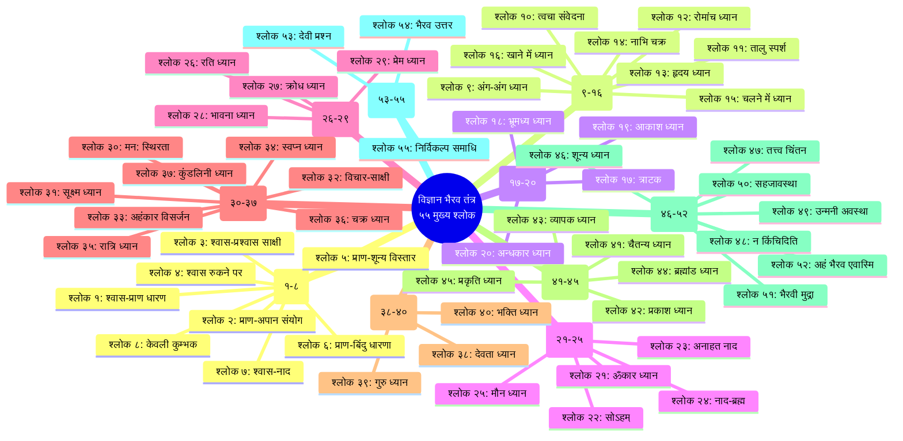

# संस्कृत श्लोक सूची: विज्ञान भैरव तंत्र (ओशो की व्याख्या के साथ)

> **"ये श्लोक केवल शब्द नहीं हैं — ये ऊर्जा के स्पंदन हैं। जितनी गहराई से तुम इन्हें समझोगे, उतनी ही गहराई से तुम स्वयं को समझ पाओगे। संस्कृत का हर शब्द एक बीज है — एक बीज मंत्र।"**
> — **ओशो**, विज्ञान भैरव तंत्र पर प्रवचन

---

## इस सूची का उपयोग कैसे करें

यह सूची विज्ञान भैरव तंत्र के **५५ सबसे महत्वपूर्ण श्लोकों** का संग्रह है — जिन पर ओशो ने अपने प्रवचनों में सबसे अधिक जोर दिया। प्रत्येक श्लोक के साथ दी गई है:

| स्तंभ | विवरण |
|------|--------|
| **श्लोक क्रमांक** | मूल विज्ञान भैरव तंत्र में श्लोक संख्या (१-१६३) |
| **संस्कृत मूल** | देवनागरी में मूल श्लोक |
| **पदच्छेद** | श्लोक का शब्द-शब्द में विभाजन |
| **शब्दार्थ** | प्रत्येक शब्द का अर्थ (हिंदी में) |
| **ओशो की व्याख्या** | ओशो के प्रवचनों से सार (हिंदी में ३-६ वाक्य) |
| **अध्याय संदर्भ** | इस कोर्स के किस अध्याय में चर्चा हुई |

> **ओशो वाणी:**
> "श्लोक को पढ़ना मत — उसे जिओ। हर श्लोक एक प्रयोग है, एक विधि है, एक द्वार है। शब्दों में मत उलझो — उनके पीछे के अनुभव को पकड़ो।"

---

## श्लोक-अवधारणा संबंध मानचित्र



---

## श्रेणी १: श्वास तकनीकें (श्लोक १-८ — विधि १-१५)

---

### श्लोक १ — श्वास-प्राण धारण (Breath Awareness)

<a href="../../../assets/images/diagrams/vigyan-bhairav-tantra/shloka-index/breath-awareness-handwritten.svg" target="_blank" rel="noopener">
  
</a>
<a href="../../../assets/images/diagrams/vigyan-bhairav-tantra/shloka-index/breath-awareness-diagram.svg" target="_blank" rel="noopener">
  
</a>
<a href="../../../assets/images/diagrams/vigyan-bhairav-tantra/shloka-index/breath-awareness-sticky.svg" target="_blank" rel="noopener">
  
</a>


**मूल विधि:** १

| आयाम | विवरण |
|------|--------|
| **संस्कृत मूल** | प्राणे संस्थिते नाड्यां नाडीचक्रे प्रबोधिते। मृत्युञ्जयपदं प्राप्य विष्णुत्वमवाप्नुयात्॥ |
| **पदच्छेद** | प्राणे — प्राण में; संस्थिते — स्थित होने पर; नाड्याम् — नाड़ी में; नाडीचक्रे — नाड़ीचक्र; प्रबोधिते — जागृत होने पर; मृत्युञ्जयपदम् — मृत्युंजय पद; प्राप्य — प्राप्त करके; विष्णुत्वम् — विष्णुत्व; अवाप्नुयात् — प्राप्त करता है |
| **शब्दार्थ** | जब प्राण (श्वास) नाड़ी में स्थिर होता है और नाड़ीचक्र जागृत होता है, तब मृत्युंजय पद प्राप्त करके साधक विष्णुत्व को प्राप्त करता है। |
| **ओशो की व्याख्या** | ओशो कहते हैं — यह पहला श्लोक ही सब कुछ कह देता है। प्राण को देखो — बस देखो। यह कोई शारीरिक क्रिया नहीं, बल्कि जागरूकता का खेल है। जब तुम श्वास को देखते हो, तो प्राण का प्रवाह दिखाई देने लगता है। और जब प्राण का प्रवाह दिखने लगे, तो तुम्हें पता चलता है कि तुम केवल शरीर नहीं हो — तुम उससे कहीं अधिक हो। 'मृत्युंजय पद' का मतलब है — वह अवस्था जहाँ मृत्यु का भय समाप्त हो जाता है। यह कोई प्राणायाम नहीं — यह प्राण-जागरूकता है। जागरूकता ही सब कुछ बदल देती है। |
| **अध्याय** | ४ — श्वास-प्रज्ञा |

**ओशो वाणी:**
> "यह पहला श्लोक ही सब कुछ कह देता है। प्राण को देखो — बस देखो। जहाँ देखना है, वहाँ कोई क्रिया नहीं है। देखना ही ध्यान है। और इस देखने से मृत्यु का भय समाप्त हो जाता है।"

---

### श्लोक २ — प्राण-अपान संयोग (Union of Prana and Apana)

<a href="../../../assets/images/diagrams/vigyan-bhairav-tantra/shloka-index/union-of-prana-and-apana-handwritten.svg" target="_blank" rel="noopener">
  
</a>
<a href="../../../assets/images/diagrams/vigyan-bhairav-tantra/shloka-index/union-of-prana-and-apana-diagram.svg" target="_blank" rel="noopener">
  
</a>
<a href="../../../assets/images/diagrams/vigyan-bhairav-tantra/shloka-index/union-of-prana-and-apana-sticky.svg" target="_blank" rel="noopener">
  
</a>


**मूल विधि:** २

| आयाम | विवरण |
|------|--------|
| **संस्कृत मूल** | प्राणापानौ समौ कृत्वा नासाभ्यन्तरचारिणौ। यदा तु संस्थितौ सम्यक् तदा भैरवमाप्नुयात्॥ |
| **पदच्छेद** | प्राणापानौ — प्राण और अपान को; समौ — समान; कृत्वा — करके; नासाभ्यन्तरचारिणौ — नासिका के भीतर विचरण करने वाले; यदा — जब; तु — तो; संस्थितौ — स्थित होते हैं; सम्यक् — सम्यक् रूप से; तदा — तब; भैरवम् — भैरव (शिव); आप्नुयात् — प्राप्त करता है |
| **शब्दार्थ** | प्राण (श्वास) और अपान (प्रश्वास) को — जो नासिका के भीतर विचरण करते हैं — समान करके, जब वे सम्यक् रूप से स्थित होते हैं, तब साधक भैरव (शिवत्व) को प्राप्त करता है। |
| **ओशो की व्याख्या** | ओशो के अनुसार यह सबसे महत्वपूर्ण श्लोकों में से एक है। प्राण अंदर जाने वाली ऊर्जा है, अपान बाहर जाने वाली। ये दो विपरीत धाराएँ हैं। जब इन दोनों को समान किया जाता है — बराबर किया जाता है — तो एक तीसरी ऊर्जा पैदा होती है। यह तीसरी ऊर्जा ही चेतना है। ओशो कहते हैं कि यह 'समान करना' कोई शारीरिक क्रिया नहीं — यह जागरूकता की एक अवस्था है। |
| **अध्याय** | ४ — श्वास-प्रज्ञा |

---

### श्लोक ३ — श्वास-प्रश्वास साक्षी (Witnessing Breath)

<a href="../../../assets/images/diagrams/vigyan-bhairav-tantra/shloka-index/witnessing-breath-handwritten.svg" target="_blank" rel="noopener">
  
</a>
<a href="../../../assets/images/diagrams/vigyan-bhairav-tantra/shloka-index/witnessing-breath-diagram.svg" target="_blank" rel="noopener">
  
</a>
<a href="../../../assets/images/diagrams/vigyan-bhairav-tantra/shloka-index/witnessing-breath-sticky.svg" target="_blank" rel="noopener">
  
</a>


**मूल विधि:** ३

| आयाम | विवरण |
|------|--------|
| **संस्कृत मूल** | श्वासप्रश्वासयोरैक्यं तयोर्योगं च साधयेत्। यदा तु निश्चलो भूत्वा तदा भैरवमाप्नुयात्॥ |
| **पदच्छेद** | श्वासप्रश्वासयोः — श्वास और प्रश्वास का; ऐक्यम् — एकता; तयोः — उन दोनों का; योगम् — योग; च — और; साधयेत् — साधना करे; यदा — जब; तु — तो; निश्चलः — निश्चल; भूत्वा — होकर; तदा — तब; भैरवम् — भैरव; आप्नुयात् — प्राप्त करता है |
| **शब्दार्थ** | श्वास और प्रश्वास की एकता का — उन दोनों के योग का — साधन करे। जब पूर्ण निश्चल हो जाता है, तब भैरव (शिवत्व) को प्राप्त करता है। |
| **ओशो की व्याख्या** | ओशो इस श्लोक पर बहुत जोर देते हैं। श्वास और प्रश्वास को अलग-अलग मत देखो — उनकी एकता को देखो। जैसे कोई पेंडुलम बाएँ और दाएँ जाता है, लेकिन दोनों गतियाँ एक ही पेंडुलम की हैं। श्वास और प्रश्वास भी एक ही ऊर्जा की दो गतियाँ हैं। उनकी एकता को देखना — यही साक्षी भाव है। |
| **अध्याय** | ४ — श्वास-प्रज्ञा |

---

### श्लोक ४ — श्वास रुकने पर ध्यान (Breath Suspension)

<a href="../../../assets/images/diagrams/vigyan-bhairav-tantra/shloka-index/breath-suspension-handwritten.svg" target="_blank" rel="noopener">
  
</a>
<a href="../../../assets/images/diagrams/vigyan-bhairav-tantra/shloka-index/breath-suspension-diagram.svg" target="_blank" rel="noopener">
  
</a>
<a href="../../../assets/images/diagrams/vigyan-bhairav-tantra/shloka-index/breath-suspension-sticky.svg" target="_blank" rel="noopener">
  
</a>


**मूल विधि:** ४

| आयाम | विवरण |
|------|--------|
| **संस्कृत मूल** | यदा प्राणः स्थितो देहे तदा शून्यं प्रपद्यते। प्राणे संस्थिते देहे शून्यं भूत्वा विलीयते॥ |
| **पदच्छेद** | यदा — जब; प्राणः — प्राण; स्थितः — स्थित; देहे — शरीर में; तदा — तब; शून्यम् — शून्यता; प्रपद्यते — प्राप्त करता है; प्राणे — प्राण में; संस्थिते — स्थित होने पर; देहे — शरीर में; शून्यम् — शून्य; भूत्वा — होकर; विलीयते — विलीन हो जाता है |
| **शब्दार्थ** | जब प्राण शरीर में स्थित होता है (श्वास रुक जाती है), तब शून्यता प्राप्त होती है। प्राण के शरीर में स्थिर होने पर साधक शून्य होकर विलीन हो जाता है। |
| **ओशो की व्याख्या** | ओशो कहते हैं — श्वास के दो ठहराव हैं: एक श्वास लेने के बाद, एक छोड़ने के बाद। ये दोनों ठहराव शून्य के द्वार हैं। जब श्वास अंदर जाती है और रुकती है — उस ठहराव में कुछ नहीं होता। कोई विचार नहीं, कोई श्वास नहीं — केवल शून्य। उस शून्य में ही सत्य का अनुभव होता है। श्वास को जबरदस्ती मत रोको — उसे स्वाभाविक रूप से रुकने दो। |
| **अध्याय** | ४ — श्वास-प्रज्ञा |

---

### श्लोक ५ — प्राण-शून्य विस्तार (Expansion into Void)

<a href="../../../assets/images/diagrams/vigyan-bhairav-tantra/shloka-index/expansion-into-void-handwritten.svg" target="_blank" rel="noopener">
  
</a>
<a href="../../../assets/images/diagrams/vigyan-bhairav-tantra/shloka-index/expansion-into-void-diagram.svg" target="_blank" rel="noopener">
  
</a>
<a href="../../../assets/images/diagrams/vigyan-bhairav-tantra/shloka-index/expansion-into-void-sticky.svg" target="_blank" rel="noopener">
  
</a>


**मूल विधि:** ५

| आयाम | विवरण |
|------|--------|
| **संस्कृत मूल** | प्राणं शून्ये विस्तार्य ततः शान्तिमवाप्नुयात्। शून्ये प्राणं विस्तार्य शान्तिं परमिकां व्रजेत्॥ |
| **पदच्छेद** | प्राणम् — प्राण को; शून्ये — शून्य में; विस्तार्य — विस्तारित करके; ततः — तब; शान्तिम् — शांति; अवाप्नुयात् — प्राप्त करता है; शून्ये — शून्य में; प्राणम् — प्राण; विस्तार्य — विस्तारित करके; शान्तिम् — शांति; परमिकाम् — परम; व्रजेत् — जाता है |
| **शब्दार्थ** | प्राण को शून्य में विस्तारित करके शांति प्राप्त करता है। शून्य में प्राण का विस्तार करके परम शांति को प्राप्त होता है। |
| **ओशो की व्याख्या** | ओशो के अनुसार यह एक अत्यंत उन्नत तकनीक है। श्वास को केवल शरीर तक सीमित मत रखो — उसे पूरे ब्रह्मांड में फैलने दो। जैसे तुम श्वास लेते हो, कल्पना करो कि पूरा ब्रह्मांड तुममें प्रवेश कर रहा है। जैसे तुम श्वास छोड़ते हो, कल्पना करो कि तुम पूरे ब्रह्मांड में फैल रहे हो। धीरे-धीरे, शरीर की सीमाएँ टूट जाती हैं — और तुम अनंत का अनुभव करते हो। विस्तार ही आनंद है, संकुचन ही दुख है। |
| **अध्याय** | ४ — श्वास-प्रज्ञा |

---

### श्लोक ६ — प्राण-बिंदु धारणा (Prana Point Fixation)

<a href="../../../assets/images/diagrams/vigyan-bhairav-tantra/shloka-index/prana-point-fixation-handwritten.svg" target="_blank" rel="noopener">
  
</a>
<a href="../../../assets/images/diagrams/vigyan-bhairav-tantra/shloka-index/prana-point-fixation-diagram.svg" target="_blank" rel="noopener">
  
</a>
<a href="../../../assets/images/diagrams/vigyan-bhairav-tantra/shloka-index/prana-point-fixation-sticky.svg" target="_blank" rel="noopener">
  
</a>


**मूल विधि:** ११

| आयाम | विवरण |
|------|--------|
| **संस्कृत मूल** | प्राणं बिन्दौ समायोज्य बिन्दुं प्राणे नियोजयेत्। ततः परतरं ध्यायेद्भैरवं परमेश्वरम्॥ |
| **पदच्छेद** | प्राणम् — प्राण को; बिन्दौ — बिंदु में; समायोज्य — स्थिर करके; बिन्दुम् — बिंदु को; प्राणे — प्राण में; नियोजयेत् — नियोजित करे; ततः — तब; परतरम् — परम; ध्यायेत् — ध्यान करे; भैरवम् — भैरव; परमेश्वरम् — परमेश्वर |
| **शब्दार्थ** | प्राण को बिंदु में स्थिर करके, बिंदु को प्राण में नियोजित करे। तब परम भैरव — परमेश्वर का ध्यान करे। |
| **ओशो की व्याख्या** | ओशो कहते हैं — यह श्वास और एकाग्रता का अद्भुत संयोग है। प्राण (श्वास) को एक बिंदु पर केंद्रित करो — जैसे भौंहों के बीच, या हृदय में। फिर उस बिंदु को श्वास में विलीन होने दो। यह दोनों का पारस्परिक आदान-प्रदान है — श्वास बिंदु बन जाती है, बिंदु श्वास बन जाता है। इस द्वंद्व के टूटने पर ही परम का अनुभव होता है। |
| **अध्याय** | ४ — श्वास-प्रज्ञा |

---

### श्लोक ७ — श्वास-नाद (Breath Sound Meditation)

<a href="../../../assets/images/diagrams/vigyan-bhairav-tantra/shloka-index/breath-sound-meditation-handwritten.svg" target="_blank" rel="noopener">
  
</a>
<a href="../../../assets/images/diagrams/vigyan-bhairav-tantra/shloka-index/breath-sound-meditation-diagram.svg" target="_blank" rel="noopener">
  
</a>
<a href="../../../assets/images/diagrams/vigyan-bhairav-tantra/shloka-index/breath-sound-meditation-sticky.svg" target="_blank" rel="noopener">
  
</a>


**मूल विधि:** १२

| आयाम | विवरण |
|------|--------|
| **संस्कृत मूल** | प्राणे स्वरं समालोक्य नादेन सह चिन्तयेत्। नादान्ते तु परं ध्यायेद्भैरवं परमेश्वरम्॥ |
| **पदच्छेद** | प्राणे — प्राण में; स्वरम् — स्वर (ध्वनि) को; समालोक्य — देखकर; नादेन — नाद के साथ; सह — सह; चिन्तयेत् — चिंतन करे; नादान्ते — नाद के अंत में; तु — तो; परम् — परम; ध्यायेत् — ध्यान करे; भैरवम् — भैरव; परमेश्वरम् — परमेश्वर |
| **शब्दार्थ** | प्राण में स्वर (ध्वनि) को देखे, नाद के साथ चिंतन करे। नाद के अंत में परम भैरव — परमेश्वर — का ध्यान करे। |
| **ओशो की व्याख्या** | ओशो इस श्लोक को श्वास और ध्वनि के अद्भुत संगम के रूप में देखते हैं। हर श्वास के साथ एक ध्वनि है — 'सो' अंदर जाते हुए, 'हम' बाहर आते हुए। यह स्वाभाविक मंत्र है — सोऽहम्। बिना किसी मंत्र जप के, केवल श्वास की स्वाभाविक ध्वनि को सुनो। और जब श्वास रुकती है — उस मौन में — परम का अनुभव होता है। |
| **अध्याय** | ४ — श्वास-प्रज्ञा, ७ — ध्वनि-ब्रह्म |

---

### श्लोक ८ — केवली कुम्भक (Spontaneous Breath Retention)

<a href="../../../assets/images/diagrams/vigyan-bhairav-tantra/shloka-index/spontaneous-breath-retention-handwritten.svg" target="_blank" rel="noopener">
  
</a>
<a href="../../../assets/images/diagrams/vigyan-bhairav-tantra/shloka-index/spontaneous-breath-retention-diagram.svg" target="_blank" rel="noopener">
  
</a>
<a href="../../../assets/images/diagrams/vigyan-bhairav-tantra/shloka-index/spontaneous-breath-retention-sticky.svg" target="_blank" rel="noopener">
  
</a>


**मूल विधि:** १४

| आयाम | विवरण |
|------|--------|
| **संस्कृत मूल** | केवली कुम्भको यस्य प्राणापानौ निरोधयेत्। तस्य मुक्तिः करस्था स्यान्नात्र कार्या विचारणा॥ |
| **पदच्छेद** | केवली — केवल; कुम्भकः — कुम्भक; यस्य — जिसका; प्राणापानौ — प्राण और अपान; निरोधयेत् — निरोध करता है; तस्य — उसकी; मुक्तिः — मुक्ति; करस्था — हाथ में; स्यात् — होती है; न — नहीं; अत्र — यहाँ; कार्या — करनी; विचारणा — विचारणा |
| **शब्दार्थ** | जिसका केवल कुम्भक (स्वाभाविक श्वास-रोध) प्राण और अपान को निरोध करता है — उसकी मुक्ति हाथ में है। |
| **ओशो की व्याख्या** | ओशो इस श्लोक को अत्यधिक महत्व देते हैं। यहाँ 'केवली कुम्भक' का अर्थ है — वह श्वास-रोध जो बिना किसी प्रयास के स्वतः होता है। यह हठ योग का कुम्भक नहीं — यह जागरूकता से उत्पन्न स्वाभाविक ठहराव है। जब तुम श्वास को गहराई से देखते हो — तो एक क्षण आता है जब श्वास अपने आप रुक जाती है। उस ठहराव में केवल चेतना रह जाती है। |
| **अध्याय** | ४ — श्वास-प्रज्ञा |

---

## श्रेणी २: शारीरिक तकनीकें (श्लोक ९-१६ — विधि १६-३२)

---

### श्लोक ९ — अंग-अंग ध्यान (Body Part Meditation)

<a href="../../../assets/images/diagrams/vigyan-bhairav-tantra/shloka-index/body-part-meditation-handwritten.svg" target="_blank" rel="noopener">
  
</a>
<a href="../../../assets/images/diagrams/vigyan-bhairav-tantra/shloka-index/body-part-meditation-diagram.svg" target="_blank" rel="noopener">
  
</a>
<a href="../../../assets/images/diagrams/vigyan-bhairav-tantra/shloka-index/body-part-meditation-sticky.svg" target="_blank" rel="noopener">
  
</a>


**मूल विधि:** १६

| आयाम | विवरण |
|------|--------|
| **संस्कृत मूल** | अङ्गेऽङ्गे स्थितमात्मानं ध्यायेद्व्यापिनमीश्वरम्। न तस्य चिन्तया कार्यं चिन्ता यस्य लयङ्गता॥ |
| **पदच्छेद** | अङ्गेऽङ्गे — अंग-अंग में; स्थितम् — स्थित; आत्मानम् — आत्मा को; ध्यायेत् — ध्यान करे; व्यापिनम् — व्यापक; ईश्वरम् — ईश्वर; न — नहीं; तस्य — उसकी; चिन्तया — चिंता से; कार्यम् — प्रयोजन; चिन्ता — चिंता; यस्य — जिसकी; लयङ्गता — लय को प्राप्त हो गई |
| **शब्दार्थ** | अंग-अंग में स्थित व्यापक आत्मा (ईश्वर) का ध्यान करे। उसे किसी चिंता की आवश्यकता नहीं। |
| **ओशो की व्याख्या** | ओशो कहते हैं — शरीर के हर अंग में चेतना है। हर कोशिका में परमात्मा का स्पंदन है। यह श्लोक हमें सिखाता है कि शरीर को केवल मांस-पिंड मत समझो — वह मंदिर है। अंग-अंग में आत्मा को देखना — यही ध्यान है। पैर से शुरू करो — पैर में चेतना को महसूस करो। फिर हाथ, फिर धड़ — धीरे-धीरे पूरे शरीर में चेतना का प्रवाह अनुभव करो। |
| **अध्याय** | ५ — शरीर-चेतना |

---

### श्लोक १० — त्वचा संवेदना (Skin Sensation)

<a href="../../../assets/images/diagrams/vigyan-bhairav-tantra/shloka-index/skin-sensation-handwritten.svg" target="_blank" rel="noopener">
  
</a>
<a href="../../../assets/images/diagrams/vigyan-bhairav-tantra/shloka-index/skin-sensation-diagram.svg" target="_blank" rel="noopener">
  
</a>
<a href="../../../assets/images/diagrams/vigyan-bhairav-tantra/shloka-index/skin-sensation-sticky.svg" target="_blank" rel="noopener">
  
</a>


**मूल विधि:** १८

| आयाम | विवरण |
|------|--------|
| **संस्कृत मूल** | त्वचि संवेदनां कृत्वा सूक्ष्मं रन्ध्रं विचिन्तयेत्। ततो विशेद्वै भैरव्यां भैरवत्वमवाप्नुयात्॥ |
| **पदच्छेद** | त्वचि — त्वचा में; संवेदनाम् — संवेदना को; कृत्वा — करके; सूक्ष्मम् — सूक्ष्म; रन्ध्रम् — छिद्र; विचिन्तयेत् — चिंतन करे; ततः — तब; विशेत् — प्रवेश करे; वै — ही; भैरव्याम् — भैरवी में; भैरवत्वम् — भैरवत्व; अवाप्नुयात् — प्राप्त करता है |
| **शब्दार्थ** | त्वचा में संवेदना को जागृत करके सूक्ष्म छिद्र (रोमकूप) का चिंतन करे। तब भैरवी में प्रवेश करता है और भैरवत्व को प्राप्त करता है। |
| **ओशो की व्याख्या** | ओशो के अनुसार यह एक अत्यंत सूक्ष्म तकनीक है। त्वचा हमारा सबसे बड़ा इंद्रिय-अंग है। उस पर ध्यान दो — हर रोमकूप को महसूस करो। हवा त्वचा को छू रही है — उसे महसूस करो। कपड़े त्वचा को छू रहे हैं — उसे महसूस करो। यह संवेदना ही ध्यान का द्वार है। जब त्वचा की हर संवेदना में जागरूकता भर जाती है, तो साधक भैरवी — शून्य चेतना — में प्रवेश करता है। |
| **अध्याय** | ५ — शरीर-चेतना |

---

### श्लोक ११ — तालु स्पर्श (Palate Touch)

<a href="../../../assets/images/diagrams/vigyan-bhairav-tantra/shloka-index/palate-touch-handwritten.svg" target="_blank" rel="noopener">
  
</a>
<a href="../../../assets/images/diagrams/vigyan-bhairav-tantra/shloka-index/palate-touch-diagram.svg" target="_blank" rel="noopener">
  
</a>
<a href="../../../assets/images/diagrams/vigyan-bhairav-tantra/shloka-index/palate-touch-sticky.svg" target="_blank" rel="noopener">
  
</a>


**मूल विधि:** १९

| आयाम | विवरण |
|------|--------|
| **संस्कृत मूल** | जिह्वया तालुमूलेन संस्पृश्यान्तर्गतं महः। ध्यायन्निरोधयेत्प्राणं ततः परमवाप्नुयात्॥ |
| **पदच्छेद** | जिह्वया — जीभ से; तालुमूलेन — तालु के मूल से; संस्पृश्य — स्पर्श करके; अन्तर्गतम् — भीतर स्थित; महः — प्रकाश; ध्यायन् — ध्यान करता हुआ; निरोधयेत् — निरोध करे; प्राणम् — प्राण को; ततः — तब; परम् — परम; अवाप्नुयात् — प्राप्त करता है |
| **शब्दार्थ** | जीभ को तालु के मूल से स्पर्श करके भीतर स्थित प्रकाश का ध्यान करता हुआ प्राण को निरोध करे — तब परम को प्राप्त करता है। |
| **ओशो की व्याख्या** | ओशो इस तकनीक को बहुत महत्व देते हैं। जीभ को तालु से लगाने से एक विशेष सर्किट बनता है — ऊर्जा का बंद सर्किट। यह शरीर में ऊर्जा को बहने से रोकता है और उसे ऊपर की ओर मोड़ता है। साथ ही, भीतर के प्रकाश का ध्यान — यह वही प्रकाश है जो आँखें बंद करने पर दिखता है। जब ऊर्जा ऊपर उठती है और प्रकाश दिखता है — तो परम का अनुभव होता है। |
| **अध्याय** | ५ — शरीर-चेतना |

---

### श्लोक १२ — रोमांच ध्यान (Horripilation Meditation)

<a href="../../../assets/images/diagrams/vigyan-bhairav-tantra/shloka-index/horripilation-meditation-handwritten.svg" target="_blank" rel="noopener">
  
</a>
<a href="../../../assets/images/diagrams/vigyan-bhairav-tantra/shloka-index/horripilation-meditation-diagram.svg" target="_blank" rel="noopener">
  
</a>
<a href="../../../assets/images/diagrams/vigyan-bhairav-tantra/shloka-index/horripilation-meditation-sticky.svg" target="_blank" rel="noopener">
  
</a>


**मूल विधि:** २१

| आयाम | विवरण |
|------|--------|
| **संस्कृत मूल** | रोमाञ्चं च समालोक्य तन्मात्रां परिचिन्तयेत्। ततः सूक्ष्मं प्रविश्यान्तर्विशेद्वै भैरवीम्॥ |
| **पदच्छेद** | रोमाञ्चम् — रोमांच; च — और; समालोक्य — देखकर; तन्मात्राम् — तन्मात्रा (सूक्ष्म तत्त्व); परिचिन्तयेत् — चिंतन करे; ततः — तब; सूक्ष्मम् — सूक्ष्म में; प्रविश्य — प्रवेश करके; अन्तः — भीतर; विशेत् — प्रवेश करे; वै — ही; भैरवीम् — भैरवी में |
| **शब्दार्थ** | रोमांच को देखकर उसकी तन्मात्रा (सूक्ष्म अनुभूति) का चिंतन करे। तब सूक्ष्म में प्रवेश करके भीतर भैरवी में प्रवेश करता है। |
| **ओशो की व्याख्या** | ओशो कहते हैं — रोमांच एक बहुत ही सूक्ष्म घटना है। जब शरीर रोमांचित होता है, तो वह किसी गहरे सत्य के संपर्क में आता है। यह आमतौर पर तब होता है जब कोई बड़ा सत्य सुनने को मिलता है। उस रोमांच को देखो — उसकी सूक्ष्मतम अनुभूति में जाओ। रोमांच एक द्वार है — उस द्वार से भीतर प्रवेश करो। वहाँ — भैरवी में — शुद्ध चेतना का अनुभव होता है। |
| **अध्याय** | ५ — शरीर-चेतना |

---

### श्लोक १३ — हृदय ध्यान (Heart Meditation)

<a href="../../../assets/images/diagrams/vigyan-bhairav-tantra/shloka-index/heart-meditation-handwritten.svg" target="_blank" rel="noopener">
  
</a>
<a href="../../../assets/images/diagrams/vigyan-bhairav-tantra/shloka-index/heart-meditation-diagram.svg" target="_blank" rel="noopener">
  
</a>
<a href="../../../assets/images/diagrams/vigyan-bhairav-tantra/shloka-index/heart-meditation-sticky.svg" target="_blank" rel="noopener">
  
</a>


**मूल विधि:** २३

| आयाम | विवरण |
|------|--------|
| **संस्कृत मूल** | हृदये पुण्डरीकान्ते ध्यायेद्व्यापिनमीश्वरम्। तस्य मध्ये स्थितं ध्यायेद्विश्वं व्याप्तं भवेदिह॥ |
| **पदच्छेद** | हृदये — हृदय में; पुण्डरीकान्ते — कमल के भीतर; ध्यायेत् — ध्यान करे; व्यापिनम् — व्यापक; ईश्वरम् — ईश्वर; तस्य — उसके; मध्ये — मध्य में; स्थितम् — स्थित; ध्यायेत् — ध्यान करे; विश्वम् — विश्व; व्याप्तम् — व्याप्त; भवेत् — होता है; इह — यहाँ |
| **शब्दार्थ** | हृदय में कमल के भीतर व्यापक ईश्वर का ध्यान करे। उसके मध्य में स्थित का ध्यान करे — यहाँ विश्व व्याप्त हो जाता है। |
| **ओशो की व्याख्या** | ओशो के अनुसार हृदय केवल एक शारीरिक अंग नहीं — यह चेतना का केंद्र है। हृदय-कमल की कल्पना एक प्रतीक है। उस कमल के भीतर एक प्रकाश है — और उस प्रकाश में पूरा विश्व समाया है। जब तुम हृदय में ध्यान करते हो, तो तुम अपनी सीमाओं को तोड़ते हो और विश्व-चेतना में विलीन हो जाते हो। हृदय वह स्थान है जहाँ 'मैं' और 'तुम' का भेद मिट जाता है। |
| **अध्याय** | ५ — शरीर-चेतना |

---

### श्लोक १४ — नाभि चक्र ध्यान (Navel Center Meditation)

<a href="../../../assets/images/diagrams/vigyan-bhairav-tantra/shloka-index/navel-center-meditation-handwritten.svg" target="_blank" rel="noopener">
  
</a>
<a href="../../../assets/images/diagrams/vigyan-bhairav-tantra/shloka-index/navel-center-meditation-diagram.svg" target="_blank" rel="noopener">
  
</a>
<a href="../../../assets/images/diagrams/vigyan-bhairav-tantra/shloka-index/navel-center-meditation-sticky.svg" target="_blank" rel="noopener">
  
</a>


**मूल विधि:** २५

| आयाम | विवरण |
|------|--------|
| **संस्कृत मूल** | नाभिचक्रे समालोक्य विश्वं व्याप्तं च चिन्तयेत्। ततो विराड्रूपं ध्यायेत्सर्वं व्याप्तं भवेदिह॥ |
| **पदच्छेद** | नाभिचक्रे — नाभिचक्र में; समालोक्य — देखकर; विश्वम् — विश्व; व्याप्तम् — व्याप्त; च — और; चिन्तयेत् — चिंतन करे; ततः — तब; विराड्रूपम् — विराट् रूप; ध्यायेत् — ध्यान करे; सर्वम् — सब; व्याप्तम् — व्याप्त; भवेत् — होता है; इह — यहाँ |
| **शब्दार्थ** | नाभिचक्र में देखे — विश्व को व्याप्त चिंतन करे। तब विराट् रूप का ध्यान करे — सब व्याप्त हो जाता है। |
| **ओशो की व्याख्या** | ओशो कहते हैं — नाभि शरीर का केंद्र है, जहाँ से हम माँ से जुड़े थे। वहाँ ध्यान करने से हम ब्रह्मांडीय ऊर्जा से जुड़ जाते हैं। नाभि में ध्यान करो — और महसूस करो कि पूरा विश्व तुममें समा रहा है। विराट् रूप का ध्यान — यह वही है जो कृष्ण ने अर्जुन को दिखाया था। जब सीमाएँ टूटती हैं, तो तुम स्वयं विराट् हो जाते हो। |
| **अध्याय** | ५ — शरीर-चेतना |

---

### श्लोक १५ — चलने में ध्यान (Walking Meditation)

<a href="../../../assets/images/diagrams/vigyan-bhairav-tantra/shloka-index/walking-meditation-handwritten.svg" target="_blank" rel="noopener">
  
</a>
<a href="../../../assets/images/diagrams/vigyan-bhairav-tantra/shloka-index/walking-meditation-diagram.svg" target="_blank" rel="noopener">
  
</a>
<a href="../../../assets/images/diagrams/vigyan-bhairav-tantra/shloka-index/walking-meditation-sticky.svg" target="_blank" rel="noopener">
  
</a>


**मूल विधि:** २९

| आयाम | विवरण |
|------|--------|
| **संस्कृत मूल** | गच्छन्स्थितो वा ध्यायेद्वा भैरवं सर्वगं शिवम्। न तस्य चिन्तया कार्यं चिन्ता यस्य लयङ्गता॥ |
| **पदच्छेद** | गच्छन् — चलता हुआ; स्थितः — स्थित; वा — या; ध्यायेत् — ध्यान करे; वा — या; भैरवम् — भैरव; सर्वगम् — सर्वव्यापी; शिवम् — शिव; न — नहीं; तस्य — उसकी; चिन्तया — चिंता से; कार्यम् — प्रयोजन; चिन्ता — चिंता; यस्य — जिसकी; लयङ्गता — लय को प्राप्त हो गई |
| **शब्दार्थ** | चलता हुआ या स्थित — सर्वव्यापी भैरव शिव का ध्यान करे। उसे किसी चिंता की आवश्यकता नहीं। |
| **ओशो की व्याख्या** | ओशो के लिए यह एक क्रांतिकारी श्लोक है। यह कहता है — ध्यान के लिए बैठना जरूरी नहीं। चलते हुए, खड़े होकर, काम करते हुए भी ध्यान संभव है। भैरव सर्वव्यापी है। वह हर जगह है। उसे कहीं ढूँढ़ने की जरूरत नहीं। जब यह समझ आ जाती है, तो चिंता विलीन हो जाती है। जीवन ही ध्यान बन जाता है। |
| **अध्याय** | ५ — शरीर-चेतना |

---

### श्लोक १६ — खाने में ध्यान (Eating Awareness)

<a href="../../../assets/images/diagrams/vigyan-bhairav-tantra/shloka-index/eating-awareness-handwritten.svg" target="_blank" rel="noopener">
  
</a>
<a href="../../../assets/images/diagrams/vigyan-bhairav-tantra/shloka-index/eating-awareness-diagram.svg" target="_blank" rel="noopener">
  
</a>
<a href="../../../assets/images/diagrams/vigyan-bhairav-tantra/shloka-index/eating-awareness-sticky.svg" target="_blank" rel="noopener">
  
</a>


**मूल विधि:** ३०

| आयाम | विवरण |
|------|--------|
| **संस्कृत मूल** | अश्नतश्चान्नपानादौ हृष्टश्चैवाभिचिन्तयेत्। अन्नं ब्रह्म रसं विष्णुर्भोक्ता देवो महेश्वरः॥ |
| **पदच्छेद** | अश्नतः — खाते हुए; च — और; अन्नपानादौ — अन्न-पान आदि में; हृष्टः — प्रसन्न; च — और; एव — ही; अभिचिन्तयेत् — ध्यान करे; अन्नम् — अन्न; ब्रह्म — ब्रह्म; रसम् — रस; विष्णुः — विष्णु; भोक्ता — भोक्ता; देवः — देव; महेश्वरः — महेश्वर |
| **शब्दार्थ** | खाते-पीते समय प्रसन्न होकर ध्यान करे — अन्न ब्रह्म है, रस विष्णु है, भोक्ता देव महेश्वर है। |
| **ओशो की व्याख्या** | ओशो इस श्लोक को तंत्र के सबसे सुंदर श्लोकों में मानते हैं। यह सिखाता है कि खाना कोई सांसारिक क्रिया नहीं — यह एक पवित्र क्रिया है। अन्न ब्रह्म है — भोजन परमात्मा है। रस विष्णु है — स्वाद परमात्मा का आनंद है। भोक्ता महेश्वर है — खाने वाला स्वयं परमात्मा है। जब इस भाव से खाओगे, तो हर कौर ध्यान बन जाएगा। |
| **अध्याय** | ५ — शरीर-चेतना |

---

## श्रेणी ३: दृश्य तकनीकें (श्लोक १७-२० — विधि ३३-४२)

---

### श्लोक १७ — त्राटक — बिंदु दृष्टि (Point Gazing)

<a href="../../../assets/images/diagrams/vigyan-bhairav-tantra/shloka-index/point-gazing-handwritten.svg" target="_blank" rel="noopener">
  
</a>
<a href="../../../assets/images/diagrams/vigyan-bhairav-tantra/shloka-index/point-gazing-diagram.svg" target="_blank" rel="noopener">
  
</a>
<a href="../../../assets/images/diagrams/vigyan-bhairav-tantra/shloka-index/point-gazing-sticky.svg" target="_blank" rel="noopener">
  
</a>


**मूल विधि:** ३३

| आयाम | विवरण |
|------|--------|
| **संस्कृत मूल** | एकबिन्दुं समालोक्य दृष्टिं सम्यक् निरोधयेत्। भ्रुवोर्मध्ये दृशं स्थाप्य भैरवीपदमाप्नुयात्॥ |
| **पदच्छेद** | एकबिन्दुम् — एक बिंदु को; समालोक्य — देखकर; दृष्टिम् — दृष्टि को; सम्यक् — सम्यक्; निरोधयेत् — स्थिर करे; भ्रुवोः — भौंहों के; मध्ये — मध्य में; दृशम् — दृष्टि को; स्थाप्य — स्थापित करके; भैरवीपदम् — भैरवी पद; आप्नुयात् — प्राप्त करता है |
| **शब्दार्थ** | एक बिंदु को देखकर दृष्टि को स्थिर करे। भौंहों के मध्य दृष्टि स्थापित करके भैरवी पद प्राप्त करता है। |
| **ओशो की व्याख्या** | ओशो कहते हैं — त्राटक को एकाग्रता मत समझो। एकाग्रता में तुम केंद्रित होते हो लेकिन संकुचित भी होते हो। त्राटक में तुम फैलते हो। बिंदु पर देखो — लेकिन ढीली, शिथिल दृष्टि से। जब बिंदु गायब हो जाता है — केवल दृष्टि रह जाती है — वही ध्यान है। भौंहों के बीच का स्थान — तीसरा नेत्र — वहाँ दृष्टि स्थापित करने से चेतना का विस्फोट होता है। |
| **अध्याय** | ६ — दृश्य-ध्यान |

---

### श्लोक १८ — भ्रूमध्य ध्यान (Eyebrow Center Meditation)

<a href="../../../assets/images/diagrams/vigyan-bhairav-tantra/shloka-index/eyebrow-center-meditation-handwritten.svg" target="_blank" rel="noopener">
  
</a>
<a href="../../../assets/images/diagrams/vigyan-bhairav-tantra/shloka-index/eyebrow-center-meditation-diagram.svg" target="_blank" rel="noopener">
  
</a>
<a href="../../../assets/images/diagrams/vigyan-bhairav-tantra/shloka-index/eyebrow-center-meditation-sticky.svg" target="_blank" rel="noopener">
  
</a>


**मूल विधि:** ३४

| आयाम | विवरण |
|------|--------|
| **संस्कृत मूल** | भ्रुवोर्मध्ये मनः स्थाप्य ध्यायेद्व्यापिनमीश्वरम्। न तस्य चिन्तया कार्यं चिन्ता यस्य लयङ्गता॥ |
| **पदच्छेद** | भ्रुवोः — भौंहों के; मध्ये — मध्य में; मनः — मन को; स्थाप्य — स्थापित करके; ध्यायेत् — ध्यान करे; व्यापिनम् — व्यापक; ईश्वरम् — ईश्वर; न — नहीं; तस्य — उसकी; चिन्तया — चिंता से; कार्यम् — प्रयोजन; चिन्ता — चिंता; यस्य — जिसकी; लयङ्गता — लय को प्राप्त हो गई |
| **शब्दार्थ** | भौंहों के मध्य मन को स्थापित करके व्यापक ईश्वर का ध्यान करे। |
| **ओशो की व्याख्या** | ओशो भ्रूमध्य को 'एक्सपोज़र पॉइंट' कहते हैं — वह स्थान जहाँ से चेतना शरीर से बाहर निकल सकती है। यह शरीर में सबसे महत्वपूर्ण बिंदु है। मन को वहाँ स्थापित करो — और धीरे-धीरे मन विलीन हो जाता है। जो बचता है — वह शुद्ध चेतना है। यह कोई एकाग्रता नहीं — यह एक ढीली, शिथिल जागरूकता है। |
| **अध्याय** | ६ — दृश्य-ध्यान |

---

### श्लोक १९ — आकाश ध्यान (Space Meditation)

<a href="../../../assets/images/diagrams/vigyan-bhairav-tantra/shloka-index/space-meditation-handwritten.svg" target="_blank" rel="noopener">
  
</a>
<a href="../../../assets/images/diagrams/vigyan-bhairav-tantra/shloka-index/space-meditation-diagram.svg" target="_blank" rel="noopener">
  
</a>
<a href="../../../assets/images/diagrams/vigyan-bhairav-tantra/shloka-index/space-meditation-sticky.svg" target="_blank" rel="noopener">
  
</a>


**मूल विधि:** ३६

| आयाम | विवरण |
|------|--------|
| **संस्कृत मूल** | व्याप्तं चाकाशमालोक्य शून्यं चिन्तयेत्। ततः शून्यमयो भूत्वा शून्यत्वमवाप्नुयात्॥ |
| **पदच्छेद** | व्याप्तम् — व्याप्त; च — और; आकाशम् — आकाश को; आलोक्य — देखकर; शून्यम् — शून्य; चिन्तयेत् — चिंतन करे; ततः — तब; शून्यमयः — शून्यमय; भूत्वा — होकर; शून्यत्वम् — शून्यत्व; अवाप्नुयात् — प्राप्त करता है |
| **शब्दार्थ** | व्याप्त आकाश को देखकर शून्य का चिंतन करे। तब शून्यमय होकर शून्यत्व को प्राप्त करता है। |
| **ओशो की व्याख्या** | ओशो के अनुसार आकाश ध्यान सबसे सरल और सबसे कठिन तकनीकों में से एक है। आकाश को देखो — उसकी विशालता को, उसके अनंत को। कोई वस्तु नहीं — केवल खालीपन। उस खालीपन में अपने मन को विलीन होने दो। जैसे आकाश का कोई अंत नहीं, वैसे ही तुम्हारी चेतना का भी कोई अंत नहीं। आकाश हमें हमारी अपनी विशालता की याद दिलाता है। |
| **अध्याय** | ६ — दृश्य-ध्यान |

---

### श्लोक २० — अन्धकार ध्यान (Darkness Meditation)

<a href="../../../assets/images/diagrams/vigyan-bhairav-tantra/shloka-index/darkness-meditation-handwritten.svg" target="_blank" rel="noopener">
  
</a>
<a href="../../../assets/images/diagrams/vigyan-bhairav-tantra/shloka-index/darkness-meditation-diagram.svg" target="_blank" rel="noopener">
  
</a>
<a href="../../../assets/images/diagrams/vigyan-bhairav-tantra/shloka-index/darkness-meditation-sticky.svg" target="_blank" rel="noopener">
  
</a>


**मूल विधि:** ३८

| आयाम | विवरण |
|------|--------|
| **संस्कृत मूल** | अन्धकारे महारात्रौ ध्यायेद्व्यापिनमीश्वरम्। ततः प्रकाशमाप्नोति परं निर्वाणमाप्नुयात्॥ |
| **पदच्छेद** | अन्धकारे — अंधकार में; महारात्रौ — महारात्रि में; ध्यायेत् — ध्यान करे; व्यापिनम् — व्यापक; ईश्वरम् — ईश्वर; ततः — तब; प्रकाशम् — प्रकाश; आप्नोति — प्राप्त करता है; परम् — परम; निर्वाणम् — निर्वाण; आप्नुयात् — प्राप्त करता है |
| **शब्दार्थ** | अंधकार में — महारात्रि में — व्यापक ईश्वर का ध्यान करे। तब प्रकाश प्राप्त करता है — परम निर्वाण को प्राप्त करता है। |
| **ओशो की व्याख्या** | ओशो कहते हैं — अंधकार से मत डरो। अंधकार परमात्मा का एक और रूप है। प्रकाश की तरह ही अंधकार भी दिव्य है। जब तुम अंधकार में ध्यान करते हो — बिना किसी प्रकाश के — तो तुम शुद्ध चेतना का अनुभव करते हो। और उसी अंधकार में एक आंतरिक प्रकाश प्रकट होता है — वह प्रकाश किसी दीपक का नहीं, वह तुम्हारी अपनी चेतना का प्रकाश है। |
| **अध्याय** | ६ — दृश्य-ध्यान |

---

## श्रेणी ४: ध्वनि-ब्रह्म (श्लोक २१-२५ — विधि ४३-५४)

---

### श्लोक २१ — ॐकार ध्यान (Pranava — OM Meditation)

<a href="../../../assets/images/diagrams/vigyan-bhairav-tantra/shloka-index/pranava-om-meditation-handwritten.svg" target="_blank" rel="noopener">
  
</a>
<a href="../../../assets/images/diagrams/vigyan-bhairav-tantra/shloka-index/pranava-om-meditation-diagram.svg" target="_blank" rel="noopener">
  
</a>
<a href="../../../assets/images/diagrams/vigyan-bhairav-tantra/shloka-index/pranava-om-meditation-sticky.svg" target="_blank" rel="noopener">
  
</a>


**मूल विधि:** ४३

| आयाम | विवरण |
|------|--------|
| **संस्कृत मूल** | प्रणवं चिन्तयेदादौ स्वरेण ब्रह्मरूपिणम्। ततः परतरं ध्यायेद्भैरवं परमेश्वरम्॥ |
| **पदच्छेद** | प्रणवम् — प्रणव (ॐ) को; चिन्तयेत् — चिंतन करे; आदौ — पहले; स्वरेण — स्वर के द्वारा; ब्रह्मरूपिणम् — ब्रह्म स्वरूप; ततः — तब; परतरम् — परम; ध्यायेत् — ध्यान करे; भैरवम् — भैरव; परमेश्वरम् — परमेश्वर |
| **शब्दार्थ** | पहले प्रणव (ॐ) का चिंतन करे — स्वर के द्वारा ब्रह्मरूपी। तब परम भैरव — परमेश्वर — का ध्यान करे। |
| **ओशो की व्याख्या** | ओशो के अनुसार ॐ कोई हिंदू मंत्र नहीं — यह ब्रह्मांड की मूल ध्वनि है। जब वैज्ञानिक बिग बैंग की बात करते हैं — वही ॐ है। ॐ — 'अ-उ-म्' — तीन भाग हैं: 'अ' जागृति, 'उ' स्वप्न, 'म्' सुषुप्ति। और उसके पार मौन — वह तुरीय है। हर बार जब तुम ॐ का उच्चारण करते हो — तो तुम ब्रह्मांड की मूल ध्वनि से जुड़ते हो। |
| **अध्याय** | ७ — ध्वनि-ब्रह्म |

---

### श्लोक २२ — सोऽहम् — अजपा जप (So'ham Meditation)

<a href="../../../assets/images/diagrams/vigyan-bhairav-tantra/shloka-index/so-ham-meditation-handwritten.svg" target="_blank" rel="noopener">
  
</a>
<a href="../../../assets/images/diagrams/vigyan-bhairav-tantra/shloka-index/so-ham-meditation-diagram.svg" target="_blank" rel="noopener">
  
</a>
<a href="../../../assets/images/diagrams/vigyan-bhairav-tantra/shloka-index/so-ham-meditation-sticky.svg" target="_blank" rel="noopener">
  
</a>


**मूल विधि:** ४५

| आयाम | विवरण |
|------|--------|
| **संस्कृत मूल** | प्राणे स्वरं समालोक्य सोहमित्यनुचिन्तयेत्। न तस्य चिन्तया कार्यं चिन्ता यस्य लयङ्गता॥ |
| **पदच्छेद** | प्राणे — प्राण में; स्वरम् — स्वर को; समालोक्य — देखकर; सोहम् — सः + अहम् (वह + मैं); इति — इस प्रकार; अनुचिन्तयेत् — अनुचिंतन करे; न — नहीं; तस्य — उसकी; चिन्तया — चिंता से; कार्यम् — प्रयोजन; चिन्ता — चिंता; यस्य — जिसकी; लयङ्गता — लय को प्राप्त हो गई |
| **शब्दार्थ** | प्राण में स्वर को देखकर 'सो-अहम्' (वह मैं हूँ) का अनुचिंतन करे। |
| **ओशो की व्याख्या** | ओशो इस श्लोक को अत्यंत महत्वपूर्ण मानते हैं। श्वास लेते समय 'सो' की ध्वनि होती है — श्वास छोड़ते समय 'हम्' की। यह कोई कल्पित मंत्र नहीं — यह श्वास की स्वाभाविक ध्वनि है। सोऽहम् का अर्थ है — 'वह (ब्रह्म) मैं हूँ'। श्वास स्वयं हर पल यह घोषणा कर रही है। तुम्हें केवल सुनना है। यही अजपा जप है — बिना जपे जप। |
| **अध्याय** | ७ — ध्वनि-ब्रह्म |

---

### श्लोक २३ — अनाहत नाद (Unstruck Sound)

<a href="../../../assets/images/diagrams/vigyan-bhairav-tantra/shloka-index/unstruck-sound-handwritten.svg" target="_blank" rel="noopener">
  
</a>
<a href="../../../assets/images/diagrams/vigyan-bhairav-tantra/shloka-index/unstruck-sound-diagram.svg" target="_blank" rel="noopener">
  
</a>
<a href="../../../assets/images/diagrams/vigyan-bhairav-tantra/shloka-index/unstruck-sound-sticky.svg" target="_blank" rel="noopener">
  
</a>


**मूल विधि:** ४८

| आयाम | विवरण |
|------|--------|
| **संस्कृत मूल** | नादमन्ते तु संश्रित्य ध्वनिमूर्ध्वगतिं तथा। नादान्तेऽमृतमाप्नोति तन्मध्ये परमं पदम्॥ |
| **पदच्छेद** | नादम् — नाद को; अन्ते — अंत में; तु — तो; संश्रित्य — आश्रित करके; ध्वनिम् — ध्वनि; ऊर्ध्वगतिम् — ऊर्ध्वगामी; तथा — वैसे ही; नादान्ते — नाद के अंत में; अमृतम् — अमृत; आप्नोति — प्राप्त करता है; तन्मध्ये — उसके मध्य में; परमम् — परम; पदम् — पद |
| **शब्दार्थ** | नाद के अंत में स्थित होकर — ऊर्ध्वगामी ध्वनि में — नाद के अंत में अमृत प्राप्त करता है। |
| **ओशो की व्याख्या** | ओशो के अनुसार यह ध्वनि तकनीकों का सबसे गूढ़ श्लोक है। अनाहत नाद — वह ध्वनि जो बिना किसी आघात के सुनाई देती है। यह जीवन की मूल ध्वनि है — कानों से नहीं, पूरे अस्तित्व से सुनाई देती है। जब बाहरी ध्वनियाँ शांत हो जाती हैं — तब यह आंतरिक नाद सुनाई देने लगता है। उस नाद में विलीन हो जाना — यही परम पद है। |
| **अध्याय** | ७ — ध्वनि-ब्रह्म |

---

### श्लोक २४ — नाद-ब्रह्म (Sound is Divine)

<a href="../../../assets/images/diagrams/vigyan-bhairav-tantra/shloka-index/sound-is-divine-handwritten.svg" target="_blank" rel="noopener">
  
</a>
<a href="../../../assets/images/diagrams/vigyan-bhairav-tantra/shloka-index/sound-is-divine-diagram.svg" target="_blank" rel="noopener">
  
</a>
<a href="../../../assets/images/diagrams/vigyan-bhairav-tantra/shloka-index/sound-is-divine-sticky.svg" target="_blank" rel="noopener">
  
</a>


**मूल विधि:** ५०

| आयाम | विवरण |
|------|--------|
| **संस्कृत मूल** | यः किञ्चिन्नादमासाद्य ध्यायेद्व्यापिनमीश्वरम्। स ब्रह्म परमं शान्तं नचिरादेव गच्छति॥ |
| **पदच्छेद** | यः — जो; किञ्चित् — किसी भी; नादम् — नाद को; आसाद्य — प्राप्त करके; ध्यायेत् — ध्यान करे; व्यापिनम् — व्यापक; ईश्वरम् — ईश्वर; सः — वह; ब्रह्म — ब्रह्म; परमम् — परम; शान्तम् — शांत; नचिरात् — शीघ्र ही; एव — ही; गच्छति — जाता है |
| **शब्दार्थ** | जो किसी भी नाद को प्राप्त करके व्यापक ईश्वर का ध्यान करता है, वह परम शांत ब्रह्म को शीघ्र ही प्राप्त करता है। |
| **ओशो की व्याख्या** | ओशो कहते हैं — यह श्लोक तंत्र की सार्वभौमिकता को दर्शाता है। कोई एक नाद नहीं — कोई भी नाद। चाहे वह नदी का कलकल हो, पक्षियों का कलरव हो — किसी भी ध्वनि को ध्यान का आधार बनाया जा सकता है। महत्वपूर्ण यह नहीं है कि तुम क्या सुन रहे हो — महत्वपूर्ण यह है कि तुम कैसे सुन रहे हो। पूरी जागरूकता से सुनो — और वही ध्यान है। |
| **अध्याय** | ७ — ध्वनि-ब्रह्म |

---

### श्लोक २५ — मौन ध्यान (Silence Meditation)

<a href="../../../assets/images/diagrams/vigyan-bhairav-tantra/shloka-index/silence-meditation-handwritten.svg" target="_blank" rel="noopener">
  
</a>
<a href="../../../assets/images/diagrams/vigyan-bhairav-tantra/shloka-index/silence-meditation-diagram.svg" target="_blank" rel="noopener">
  
</a>
<a href="../../../assets/images/diagrams/vigyan-bhairav-tantra/shloka-index/silence-meditation-sticky.svg" target="_blank" rel="noopener">
  
</a>


**मूल विधि:** ५२

| आयाम | विवरण |
|------|--------|
| **संस्कृत मूल** | मौनमेव परं ब्रह्म मौनमेव परं पदम्। मौनेनाप्नोति परमं ब्रह्म मौनमयः स्वयम्॥ |
| **पदच्छेद** | मौनम् — मौन; एव — ही; परम् — परम; ब्रह्म — ब्रह्म; मौनम् — मौन; एव — ही; परम् — परम; पदम् — पद; मौनेन — मौन से; आप्नोति — प्राप्त करता है; परमम् — परम; ब्रह्म — ब्रह्म; मौनमयः — मौनमय; स्वयम् — स्वयं |
| **शब्दार्थ** | मौन ही परम ब्रह्म है — मौन ही परम पद है। मौन से परम ब्रह्म को प्राप्त करता है। |
| **ओशो की व्याख्या** | ओशो के अनुसार यह श्लोक सारे तंत्र का निष्कर्ष है। मौन — यह कोई चुप रहना नहीं है। मौन का मतलब है — विचारों का अभाव, और अंततः 'मैं' का अभाव। जब सब कुछ शांत हो जाता है — तब जो बचता है, वही ब्रह्म है। मौन को बाहर से मत लाओ — उसे भीतर खोजो। वह तुम्हारा स्वभाव है। तुम मौन को प्राप्त नहीं करते — तुम मौन को पहचानते हो। |
| **अध्याय** | ७ — ध्वनि-ब्रह्म |

---

## श्रेणी ५: भावना और आनंद तकनीकें (श्लोक २६-२९ — विधि ५५-६४)

---

### श्लोक २६ — रति ध्यान (Sexual Energy Meditation)

<a href="../../../assets/images/diagrams/vigyan-bhairav-tantra/shloka-index/sexual-energy-meditation-handwritten.svg" target="_blank" rel="noopener">
  
</a>
<a href="../../../assets/images/diagrams/vigyan-bhairav-tantra/shloka-index/sexual-energy-meditation-diagram.svg" target="_blank" rel="noopener">
  
</a>
<a href="../../../assets/images/diagrams/vigyan-bhairav-tantra/shloka-index/sexual-energy-meditation-sticky.svg" target="_blank" rel="noopener">
  
</a>


**मूल विधि:** ५५

| आयाम | विवरण |
|------|--------|
| **संस्कृत मूल** | रत्यवस्थां समालोक्य मध्ये चैतन्यमालिङ्गयेत्। ततः परतरं ध्यायेद्भैरवं परमेश्वरम्॥ |
| **पदच्छेद** | रत्यवस्थाम् — रति की अवस्था को; समालोक्य — देखकर; मध्ये — मध्य में; चैतन्यम् — चैतन्य; आलिङ्गयेत् — आलिंगन करे; ततः — तब; परतरम् — परम; ध्यायेत् — ध्यान करे; भैरवम् — भैरव; परमेश्वरम् — परमेश्वर |
| **शब्दार्थ** | रति (आनंद) की अवस्था को देखकर — उसके मध्य में चैतन्य का आलिंगन करे। |
| **ओशो की व्याख्या** | ओशो कहते हैं — यह तंत्र का सबसे गलत समझा जाने वाला श्लोक है। तंत्र कामुकता का समर्थन नहीं करता — वह उसे पार करने की बात करता है। रति का अर्थ है आनंद की चरम अवस्था। उस आनंद के चरम पर — जब 'मैं' खो जाता है — उस ठहराव में चैतन्य का अनुभव होता है। तंत्र कहता है — उस क्षण को जागरूकता से भर दो। तंत्र कामवासना को न तो दबाता है और न ही भोगने का समर्थन करता है — वह उसे ध्यान में बदलने की बात करता है। |
| **अध्याय** | ८ — भाव-साक्षी |

---

### श्लोक २७ — क्रोध ध्यान (Anger Meditation)

<a href="../../../assets/images/diagrams/vigyan-bhairav-tantra/shloka-index/anger-meditation-handwritten.svg" target="_blank" rel="noopener">
  
</a>
<a href="../../../assets/images/diagrams/vigyan-bhairav-tantra/shloka-index/anger-meditation-diagram.svg" target="_blank" rel="noopener">
  
</a>
<a href="../../../assets/images/diagrams/vigyan-bhairav-tantra/shloka-index/anger-meditation-sticky.svg" target="_blank" rel="noopener">
  
</a>


**मूल विधि:** ५७

| आयाम | विवरण |
|------|--------|
| **संस्कृत मूल** | क्रोधं च समालोक्य तत्क्षणं चिन्तयेच्छिवम्। क्रोधेन च समाविष्टः शिवत्वमवाप्नुयात्॥ |
| **पदच्छेद** | क्रोधम् — क्रोध को; च — और; समालोक्य — देखकर; तत्क्षणम् — उसी क्षण; चिन्तयेत् — चिंतन करे; शिवम् — शिव; क्रोधेन — क्रोध से; च — और; समाविष्टः — समाविष्ट होकर; शिवत्वम् — शिवत्व; अवाप्नुयात् — प्राप्त करता है |
| **शब्दार्थ** | क्रोध को देखकर उसी क्षण शिव का चिंतन करे। क्रोध से समाविष्ट होकर शिवत्व को प्राप्त करता है। |
| **ओशो की व्याख्या** | ओशो के लिए यह एक क्रांतिकारी श्लोक है। वे कहते हैं — क्रोध को दबाओ मत, उसे व्यक्त मत करो — उसे देखो। क्रोध में भारी ऊर्जा होती है। जब तुम क्रोध को देखते हो — बिना दबाए, बिना व्यक्त किए — तो वह ऊर्जा रूपांतरित हो जाती है। वही ऊर्जा शिवत्व बन जाती है। क्रोध और शिव में कोई विरोध नहीं — केवल अज्ञान है। क्रोध को जागरूकता से देखो — और वही जागरूकता शिव है। |
| **अध्याय** | ८ — भाव-साक्षी |

---

### श्लोक २८ — भावना ध्यान (Feeling Meditation)

<a href="../../../assets/images/diagrams/vigyan-bhairav-tantra/shloka-index/feeling-meditation-handwritten.svg" target="_blank" rel="noopener">
  
</a>
<a href="../../../assets/images/diagrams/vigyan-bhairav-tantra/shloka-index/feeling-meditation-diagram.svg" target="_blank" rel="noopener">
  
</a>
<a href="../../../assets/images/diagrams/vigyan-bhairav-tantra/shloka-index/feeling-meditation-sticky.svg" target="_blank" rel="noopener">
  
</a>


**मूल विधि:** ५९

| आयाम | विवरण |
|------|--------|
| **संस्कृत मूल** | भावना मनसा ध्यायेद्भावनामय ईश्वरः। भावनायां लयं गत्वा भावनातीत आप्नुयात्॥ |
| **पदच्छेद** | भावना — भावना को; मनसा — मन से; ध्यायेत् — ध्यान करे; भावनामयः — भावनामय; ईश्वरः — ईश्वर; भावनायाम् — भावना में; लयम् — लय; गत्वा — जाकर; भावनातीतः — भावना से अतीत; आप्नुयात् — प्राप्त करता है |
| **शब्दार्थ** | भावना का मन से ध्यान करे — ईश्वर भावनामय है। भावना में लय होकर भावना से अतीत को प्राप्त करता है। |
| **ओशो की व्याख्या** | ओशो भावना को चेतना की सबसे शक्तिशाली शक्ति मानते हैं। विचार से अधिक शक्तिशाली — क्योंकि विचार सिर में है, भावना पूरे अस्तित्व में। जब तुम प्रेम की भावना को ध्यान में बदलते हो — वह भावना ही ईश्वर बन जाती है। भावना में पूरी तरह डूब जाओ — और फिर उस भावना के पार जाओ। वहाँ जो बचता है — वह शुद्ध चैतन्य है। |
| **अध्याय** | ८ — भाव-साक्षी |

---

### श्लोक २९ — प्रेम ध्यान (Love Meditation)

<a href="../../../assets/images/diagrams/vigyan-bhairav-tantra/shloka-index/love-meditation-handwritten.svg" target="_blank" rel="noopener">
  
</a>
<a href="../../../assets/images/diagrams/vigyan-bhairav-tantra/shloka-index/love-meditation-diagram.svg" target="_blank" rel="noopener">
  
</a>
<a href="../../../assets/images/diagrams/vigyan-bhairav-tantra/shloka-index/love-meditation-sticky.svg" target="_blank" rel="noopener">
  
</a>


**मूल विधि:** ६१

| आयाम | विवरण |
|------|--------|
| **संस्कृत मूल** | प्रेम्णा च समाविष्टो भक्त्या च परमेश्वरम्। ध्यायन्निरन्तरं नित्यं स याति परमां गतिम्॥ |
| **पदच्छेद** | प्रेम्णा — प्रेम से; च — और; समाविष्टः — समाविष्ट; भक्त्या — भक्ति से; परमेश्वरम् — परमेश्वर; ध्यायन् — ध्यान करता हुआ; निरन्तरम् — निरंतर; नित्यम् — हमेशा; सः — वह; याति — जाता है; परमाम् — परम; गतिम् — गति |
| **शब्दार्थ** | प्रेम से और भक्ति से समाविष्ट होकर परमेश्वर का निरंतर ध्यान करता हुआ — वह परम गति को प्राप्त करता है। |
| **ओशो की व्याख्या** | ओशो कहते हैं — प्रेम ही सबसे गहरा ध्यान है। जब तुम किसी से सच्चा प्रेम करते हो — तो उस क्षण तुम ध्यान में हो। प्रेम में 'मैं' खो जाता है। और जब यही प्रेम परमात्मा के प्रति हो — तो वह भक्ति है। भक्ति कोई सिद्धांत नहीं — यह प्रेम की चरम अवस्था है। प्रेम करो — और उस प्रेम में ही परमात्मा को पा लो। |
| **अध्याय** | ८ — भाव-साक्षी, १० — भाव-समाधि |

---

## श्रेणी ६: मानसिक तकनीकें (श्लोक ३०-३७ — विधि ६५-७८)

---

### श्लोक ३० — मन: स्थिरता (Mental Stillness)

<a href="../../../assets/images/diagrams/vigyan-bhairav-tantra/shloka-index/mental-stillness-handwritten.svg" target="_blank" rel="noopener">
  
</a>
<a href="../../../assets/images/diagrams/vigyan-bhairav-tantra/shloka-index/mental-stillness-diagram.svg" target="_blank" rel="noopener">
  
</a>
<a href="../../../assets/images/diagrams/vigyan-bhairav-tantra/shloka-index/mental-stillness-sticky.svg" target="_blank" rel="noopener">
  
</a>


**मूल विधि:** ६५

| आयाम | विवरण |
|------|--------|
| **संस्कृत मूल** | यस्य चित्तं स्थिरं नित्यं ध्यायेद्व्यापिनमीश्वरम्। न तस्य चिन्तया कार्यं चिन्ता यस्य लयङ्गता॥ |
| **पदच्छेद** | यस्य — जिसका; चित्तम् — चित्त; स्थिरम् — स्थिर; नित्यम् — नित्य; ध्यायेत् — ध्यान करे; व्यापिनम् — व्यापक; ईश्वरम् — ईश्वर; न — नहीं; तस्य — उसकी; चिन्तया — चिंता से; कार्यम् — प्रयोजन; चिन्ता — चिंता; यस्य — जिसकी; लयङ्गता — लय को प्राप्त हो गई |
| **शब्दार्थ** | जिसका चित्त नित्य स्थिर है — वह व्यापक ईश्वर का ध्यान करे। |
| **ओशो की व्याख्या** | ओशो कहते हैं — यह श्लोक ध्यान का विरोधाभास बताता है। जब चित्त स्थिर होता है — तब ध्यान करने की कोई जरूरत नहीं रहती। ध्यान का अर्थ है चित्त को स्थिर करना। और जब वह स्थिर हो जाता है — तो ध्यान करने वाला कोई नहीं बचता। चिंता का लय हो जाना — यही ध्यान की पूर्णता है। |
| **अध्याय** | ९ — ध्यान-चित्त |

---

### श्लोक ३१ — सूक्ष्म ध्यान (Subtle Meditation)

<a href="../../../assets/images/diagrams/vigyan-bhairav-tantra/shloka-index/subtle-meditation-handwritten.svg" target="_blank" rel="noopener">
  
</a>
<a href="../../../assets/images/diagrams/vigyan-bhairav-tantra/shloka-index/subtle-meditation-diagram.svg" target="_blank" rel="noopener">
  
</a>
<a href="../../../assets/images/diagrams/vigyan-bhairav-tantra/shloka-index/subtle-meditation-sticky.svg" target="_blank" rel="noopener">
  
</a>


**मूल विधि:** ६८

| आयाम | विवरण |
|------|--------|
| **संस्कृत मूल** | सूक्ष्मं चिन्तयेत् तत्त्वं व्यापकं चिन्तयेद्ध्रुवम्। ततः सूक्ष्ममयो भूत्वा सूक्ष्मत्वमवाप्नुयात्॥ |
| **पदच्छेद** | सूक्ष्मम् — सूक्ष्म; चिन्तयेत् — चिंतन करे; तत्त्वम् — तत्त्व; व्यापकम् — व्यापक; चिन्तयेत् — चिंतन करे; ध्रुवम् — ध्रुव (स्थिर); ततः — तब; सूक्ष्ममयः — सूक्ष्ममय; भूत्वा — होकर; सूक्ष्मत्वम् — सूक्ष्मत्व; अवाप्नुयात् — प्राप्त करता है |
| **शब्दार्थ** | सूक्ष्म तत्त्व का चिंतन करे — व्यापक और स्थिर का चिंतन करे। |
| **ओशो की व्याख्या** | ओशो के अनुसार यह श्लोक हमें स्थूल से सूक्ष्म की ओर जाने की यात्रा सिखाता है। सबसे स्थूल शरीर से शुरू करो। फिर श्वास — जो थोड़ी सूक्ष्म है। फिर मन — और भी सूक्ष्म। फिर विचार — उससे भी सूक्ष्म। और अंत में शुद्ध चैतन्य — सबसे सूक्ष्म। यह तंत्र की पूरी यात्रा है — स्थूल से सूक्ष्म की ओर। |
| **अध्याय** | ९ — ध्यान-चित्त |

---

### श्लोक ३२ — विचार-साक्षी (Witnessing Thoughts)

<a href="../../../assets/images/diagrams/vigyan-bhairav-tantra/shloka-index/witnessing-thoughts-handwritten.svg" target="_blank" rel="noopener">
  
</a>
<a href="../../../assets/images/diagrams/vigyan-bhairav-tantra/shloka-index/witnessing-thoughts-diagram.svg" target="_blank" rel="noopener">
  
</a>
<a href="../../../assets/images/diagrams/vigyan-bhairav-tantra/shloka-index/witnessing-thoughts-sticky.svg" target="_blank" rel="noopener">
  
</a>


**मूल विधि:** ७२

| आयाम | विवरण |
|------|--------|
| **संस्कृत मूल** | विचारं च समालोक्य ततो निर्विचारतां व्रजेत्। विचारे लयमापन्ने निर्विकल्पमवाप्नुयात्॥ |
| **पदच्छेद** | विचारम् — विचार को; च — और; समालोक्य — देखकर; ततः — तब; निर्विचारताम् — निर्विचारता; व्रजेत् — जाता है; विचारे — विचार में; लयम् — लय; आपन्ने — प्राप्त होने पर; निर्विकल्पम् — निर्विकल्प; अवाप्नुयात् — प्राप्त करता है |
| **शब्दार्थ** | विचार को देखकर तब निर्विचारता को जाता है। विचार के लय होने पर निर्विकल्प को प्राप्त करता है। |
| **ओशो की व्याख्या** | ओशो कहते हैं — यह श्लोक ध्यान का सबसे महत्वपूर्ण रहस्य बताता है। विचारों से लड़ो मत। उन्हें दबाओ मत। बस उन्हें देखो। जैसे तुम आकाश में बादलों को देखते हो — वे आते हैं, जाते हैं। देखते-देखते विचार पतले हो जाते हैं और अंत में गायब हो जाते हैं। जो बचता है — वह निर्विकल्प अवस्था है — शुद्ध चेतना। |
| **अध्याय** | ९ — ध्यान-चित्त |

---

### श्लोक ३३ — अहंकार विसर्जन (Ego Dissolution)

<a href="../../../assets/images/diagrams/vigyan-bhairav-tantra/shloka-index/ego-dissolution-handwritten.svg" target="_blank" rel="noopener">
  
</a>
<a href="../../../assets/images/diagrams/vigyan-bhairav-tantra/shloka-index/ego-dissolution-diagram.svg" target="_blank" rel="noopener">
  
</a>
<a href="../../../assets/images/diagrams/vigyan-bhairav-tantra/shloka-index/ego-dissolution-sticky.svg" target="_blank" rel="noopener">
  
</a>


**मूल विधि:** ७५

| आयाम | विवरण |
|------|--------|
| **संस्कृत मूल** | अहंकारं समालोक्य तन्मध्ये परमेश्वरम्। ध्यायन्निरन्तरं नित्यं स याति परमां गतिम्॥ |
| **पदच्छेद** | अहंकारम् — अहंकार को; समालोक्य — देखकर; तन्मध्ये — उसके मध्य में; परमेश्वरम् — परमेश्वर; ध्यायन् — ध्यान करता हुआ; निरन्तरम् — निरंतर; नित्यम् — हमेशा; सः — वह; याति — जाता है; परमाम् — परम; गतिम् — गति |
| **शब्दार्थ** | अहंकार को देखकर उसके मध्य में परमेश्वर का निरंतर ध्यान करता हुआ — वह परम गति को प्राप्त करता है। |
| **ओशो की व्याख्या** | ओशो के अनुसार यह सबसे कठिन तकनीक है। अहंकार को देखना — यह बहुत सूक्ष्म है। लेकिन जब तुम अहंकार को देखते हो — तो तुम अहंकार नहीं हो। अहंकार के केंद्र में परमेश्वर है। जैसे अगरबत्ती की बाती के चारों ओर राख होती है, भीतर आग होती है — वैसे ही अहंकार के भीतर परमात्मा है। |
| **अध्याय** | ९ — ध्यान-चित्त |

---

### श्लोक ३४ — स्वप्न ध्यान (Dream Meditation)

<a href="../../../assets/images/diagrams/vigyan-bhairav-tantra/shloka-index/dream-meditation-handwritten.svg" target="_blank" rel="noopener">
  
</a>
<a href="../../../assets/images/diagrams/vigyan-bhairav-tantra/shloka-index/dream-meditation-diagram.svg" target="_blank" rel="noopener">
  
</a>
<a href="../../../assets/images/diagrams/vigyan-bhairav-tantra/shloka-index/dream-meditation-sticky.svg" target="_blank" rel="noopener">
  
</a>


**मूल विधि:** ७३

| आयाम | विवरण |
|------|--------|
| **संस्कृत मूल** | स्वप्ने च समालोक्य ततो जाग्रत्समाप्नुयात्। जाग्रति च समालोक्य स्वप्नं वा न विचिन्तयेत्॥ |
| **पदच्छेद** | स्वप्ने — स्वप्न में; च — और; समालोक्य — देखकर; ततः — तब; जाग्रत् — जाग्रत; समाप्नुयात् — प्राप्त करता है; जाग्रति — जाग्रत में; च — और; समालोक्य — देखकर; स्वप्नम् — स्वप्न; वा — या; न — नहीं; विचिन्तयेत् — विचार करे |
| **शब्दार्थ** | स्वप्न को देखकर जाग्रत को प्राप्त करता है। जाग्रत को देखकर स्वप्न या विचार नहीं करता। |
| **ओशो की व्याख्या** | ओशो के अनुसार यह तंत्र की एक अत्यंत उन्नत तकनीक है — स्वप्न में जागरूक रहना। जो व्यक्ति दिन में जागरूक रहता है — वह रात में स्वप्न में भी जागरूक रह सकता है। धीरे-धीरे स्वप्न और जाग्रत दोनों में समान जागरूकता आ जाती है। और जब दोनों में समान जागरूकता हो — तो तीसरी अवस्था — तुरीय — प्रकट होती है। |
| **अध्याय** | ९ — ध्यान-चित्त |

---

### श्लोक ३५ — रात्रि ध्यान (Night Meditation)

<a href="../../../assets/images/diagrams/vigyan-bhairav-tantra/shloka-index/night-meditation-handwritten.svg" target="_blank" rel="noopener">
  
</a>
<a href="../../../assets/images/diagrams/vigyan-bhairav-tantra/shloka-index/night-meditation-diagram.svg" target="_blank" rel="noopener">
  
</a>
<a href="../../../assets/images/diagrams/vigyan-bhairav-tantra/shloka-index/night-meditation-sticky.svg" target="_blank" rel="noopener">
  
</a>


**मूल विधि:** ७६

| आयाम | विवरण |
|------|--------|
| **संस्कृत मूल** | रात्रौ च समालोक्य दिवा च समालोक्य। रात्रिदिवसयोरैक्यं ध्यायेद्भैरवमीश्वरम्॥ |
| **पदच्छेद** | रात्रौ — रात में; च — और; समालोक्य — देखकर; दिवा — दिन में; च — और; समालोक्य — देखकर; रात्रिदिवसयोः — रात और दिन की; ऐक्यम् — एकता; ध्यायेत् — ध्यान करे; भैरवम् — भैरव; ईश्वरम् — ईश्वर |
| **शब्दार्थ** | रात को देखकर और दिन को देखकर — रात और दिन की एकता में भैरव ईश्वर का ध्यान करे। |
| **ओशो की व्याख्या** | ओशो कहते हैं — रात और दिन विपरीत हैं, लेकिन ये एक ही चक्र के दो हिस्से हैं। जो रात में ध्यान कर सकता है और दिन में भी — और फिर इन दोनों के पार जाकर उनकी एकता को देख सकता है — वह सच्चा साधक है। ध्यान २४ घंटे की जागरूकता है। |
| **अध्याय** | ९ — ध्यान-चित्त |

---

### श्लोक ३६ — चक्र ध्यान (Chakra Meditation)

<a href="../../../assets/images/diagrams/vigyan-bhairav-tantra/shloka-index/chakra-meditation-handwritten.svg" target="_blank" rel="noopener">
  
</a>
<a href="../../../assets/images/diagrams/vigyan-bhairav-tantra/shloka-index/chakra-meditation-diagram.svg" target="_blank" rel="noopener">
  
</a>
<a href="../../../assets/images/diagrams/vigyan-bhairav-tantra/shloka-index/chakra-meditation-sticky.svg" target="_blank" rel="noopener">
  
</a>


**मूल विधि:** ८५

| आयाम | विवरण |
|------|--------|
| **संस्कृत मूल** | षट्चक्रं च समालोक्य चक्रेशं च विचिन्तयेत्। चक्रेषु लयमापन्नः परमात्मानमाप्नुयात्॥ |
| **पदच्छेद** | षट्चक्रम् — छह चक्रों को; च — और; समालोक्य — देखकर; चक्रेशम् — चक्रों के ईश; च — और; विचिन्तयेत् — चिंतन करे; चक्रेषु — चक्रों में; लयम् — लय; आपन्नः — प्राप्त होकर; परमात्मानम् — परमात्मा; आप्नुयात् — प्राप्त करता है |
| **शब्दार्थ** | छह चक्रों को देखकर चक्रेश का चिंतन करे। चक्रों में लय होकर परमात्मा को प्राप्त करता है। |
| **ओशो की व्याख्या** | ओशो कहते हैं — चक्र शरीर में ऊर्जा के केंद्र हैं। मूलाधार से सहस्रार तक — यह चेतना की यात्रा है। लेकिन ओशो चेतावनी देते हैं कि चक्रों पर ध्यान करते समय कल्पना मत करो — वास्तविक अनुभव को होने दो। चक्रों की कोई भौतिक संरचना नहीं है — वे ऊर्जा के सूक्ष्म केंद्र हैं। |
| **अध्याय** | ९ — ध्यान-चित्त |

---

### श्लोक ३७ — कुंडलिनी ध्यान (Kundalini Meditation)

<a href="../../../assets/images/diagrams/vigyan-bhairav-tantra/shloka-index/kundalini-meditation-handwritten.svg" target="_blank" rel="noopener">
  
</a>
<a href="../../../assets/images/diagrams/vigyan-bhairav-tantra/shloka-index/kundalini-meditation-diagram.svg" target="_blank" rel="noopener">
  
</a>
<a href="../../../assets/images/diagrams/vigyan-bhairav-tantra/shloka-index/kundalini-meditation-sticky.svg" target="_blank" rel="noopener">
  
</a>


**मूल विधि:** ८६

| आयाम | विवरण |
|------|--------|
| **संस्कृत मूल** | कुण्डलिनीं समालोक्य तस्यां चैतन्यमालिङ्गयेत्। कुण्डलिन्यां लयं गत्वा परमानन्दमाप्नुयात्॥ |
| **पदच्छेद** | कुण्डलिनीम् — कुंडलिनी को; समालोक्य — देखकर; तस्याम् — उसमें; चैतन्यम् — चैतन्य; आलिङ्गयेत् — आलिंगन करे; कुण्डलिन्याम् — कुंडलिनी में; लयम् — लय; गत्वा — जाकर; परमानन्दम् — परम आनंद; आप्नुयात् — प्राप्त करता है |
| **शब्दार्थ** | कुंडलिनी को देखकर उसमें चैतन्य का आलिंगन करे। कुंडलिनी में लय होकर परम आनंद प्राप्त करता है। |
| **ओशो की व्याख्या** | ओशो कहते हैं — कुंडलिनी कोई रहस्यमय शक्ति नहीं है। यह तुम्हारी अपनी चेतना की सुप्त ऊर्जा है। जब यह जागृत होती है — तो रीढ़ के साथ ऊपर उठती है, हर चक्र को खोलती है, और अंततः सहस्रार में परम आनंद का अनुभव कराती है। लेकिन कुंडलिनी को जगाने की कोशिश मत करो — बस जागरूक रहो। |
| **अध्याय** | ९ — ध्यान-चित्त |

---

## श्रेणी ७: भाव-समाधि (श्लोक ३८-४० — विधि ७९-८९)

---

### श्लोक ३८ — देवता ध्यान (Deity Meditation)

<a href="../../../assets/images/diagrams/vigyan-bhairav-tantra/shloka-index/deity-meditation-handwritten.svg" target="_blank" rel="noopener">
  
</a>
<a href="../../../assets/images/diagrams/vigyan-bhairav-tantra/shloka-index/deity-meditation-diagram.svg" target="_blank" rel="noopener">
  
</a>
<a href="../../../assets/images/diagrams/vigyan-bhairav-tantra/shloka-index/deity-meditation-sticky.svg" target="_blank" rel="noopener">
  
</a>


**मूल विधि:** ७९

| आयाम | विवरण |
|------|--------|
| **संस्कृत मूल** | देवतां चिन्तयेद्यस्तु भक्त्या च परमेश्वरीम्। स एव देवतामूर्तिः साक्षाद्भैरवरूपधृक्॥ |
| **पदच्छेद** | देवताम् — देवता को; चिन्तयेत् — चिंतन करे; यस्तु — जो; भक्त्या — भक्ति से; परमेश्वरीम् — परमेश्वरी; सः — वह; एव — ही; देवतामूर्तिः — देवता की मूर्ति; साक्षात् — साक्षात्; भैरवरूपधृक् — भैरव रूप धारण करने वाला |
| **शब्दार्थ** | जो भक्ति से परमेश्वरी देवता का चिंतन करता है — वह स्वयं देवतामूर्ति हो जाता है। |
| **ओशो की व्याख्या** | ओशो कहते हैं — देवता तुम्हारे बाहर नहीं है। वह तुम्हारी अपनी चेतना का प्रतिबिंब है। जब तुम किसी देवता का ध्यान करते हो — तो तुम अपनी ही गहराई का ध्यान कर रहे हो। ध्यान करते-करते भेद मिट जाता है। ध्यान करने वाला और ध्यान का विषय — एक हो जाते हैं। |
| **अध्याय** | १० — भाव-समाधि |

---

### श्लोक ३९ — गुरु ध्यान (Guru Meditation)

<a href="../../../assets/images/diagrams/vigyan-bhairav-tantra/shloka-index/guru-meditation-handwritten.svg" target="_blank" rel="noopener">
  
</a>
<a href="../../../assets/images/diagrams/vigyan-bhairav-tantra/shloka-index/guru-meditation-diagram.svg" target="_blank" rel="noopener">
  
</a>
<a href="../../../assets/images/diagrams/vigyan-bhairav-tantra/shloka-index/guru-meditation-sticky.svg" target="_blank" rel="noopener">
  
</a>


**मूल विधि:** ८२

| आयाम | विवरण |
|------|--------|
| **संस्कृत मूल** | गुरोः रूपं समालोक्य ध्यायेद्व्यापिनमीश्वरम्। गुरुरेव परं ब्रह्म गुरुरेव परेश्वरः॥ |
| **पदच्छेद** | गुरोः — गुरु के; रूपम् — रूप को; समालोक्य — देखकर; ध्यायेत् — ध्यान करे; व्यापिनम् — व्यापक; ईश्वरम् — ईश्वर; गुरुः — गुरु; एव — ही; परम् — परम; ब्रह्म — ब्रह्म; गुरुः — गुरु; एव — ही; परेश्वरः — परमेश्वर |
| **शब्दार्थ** | गुरु के रूप को देखकर व्यापक ईश्वर का ध्यान करे। गुरु ही परम ब्रह्म है। |
| **ओशो की व्याख्या** | ओशो कहते हैं — गुरु कोई व्यक्ति नहीं है। गुरु एक ऊर्जा है, एक चेतना है। वह व्यक्ति के रूप में प्रकट होती है। जब तुम गुरु में परमात्मा को देखते हो — तो वह तुम्हारे परमात्मा का द्वार बन जाता है। लेकिन गुरु पर मत रुक जाना — गुरु तो द्वार है, उसे पार करना है। |
| **अध्याय** | १० — भाव-समाधि, १३ — गुरु-शिष्य-ओशो |

---

### श्लोक ४० — भक्ति ध्यान (Devotion Meditation)

<a href="../../../assets/images/diagrams/vigyan-bhairav-tantra/shloka-index/devotion-meditation-handwritten.svg" target="_blank" rel="noopener">
  
</a>
<a href="../../../assets/images/diagrams/vigyan-bhairav-tantra/shloka-index/devotion-meditation-diagram.svg" target="_blank" rel="noopener">
  
</a>
<a href="../../../assets/images/diagrams/vigyan-bhairav-tantra/shloka-index/devotion-meditation-sticky.svg" target="_blank" rel="noopener">
  
</a>


**मूल विधि:** ८३

| आयाम | विवरण |
|------|--------|
| **संस्कृत मूल** | भक्त्या च परमेश्वरं सर्वभूतेषु चिन्तयेत्। सर्वभूतमयो भूत्वा परमात्मानमाप्नुयात्॥ |
| **पदच्छेद** | भक्त्या — भक्ति से; च — और; परमेश्वरम् — परमेश्वर; सर्वभूतेषु — सब प्राणियों में; चिन्तयेत् — चिंतन करे; सर्वभूतमयः — सब प्राणियों से युक्त; भूत्वा — होकर; परमात्मानम् — परमात्मा; आप्नुयात् — प्राप्त करता है |
| **शब्दार्थ** | भक्ति से परमेश्वर का सब प्राणियों में चिंतन करे। सब प्राणियों से युक्त होकर परमात्मा को प्राप्त करता है। |
| **ओशो की व्याख्या** | ओशो कहते हैं — यह भक्ति का सबसे सुंदर रूप है। परमेश्वर को मंदिर में मत ढूँढ़ो — हर प्राणी में ढूँढ़ो। हर जीवित प्राणी में परमात्मा का अंश है। जब तुम किसी भिखारी में भी परमात्मा को देखो — यही समता है, यही भक्ति की पराकाष्ठा है। |
| **अध्याय** | १० — भाव-समाधि |

---

## श्रेणी ८: चैतन्य तकनीकें (श्लोक ४१-४५ — विधि ९०-९७)

---

### श्लोक ४१ — चैतन्य ध्यान (Consciousness Meditation)

<a href="../../../assets/images/diagrams/vigyan-bhairav-tantra/shloka-index/consciousness-meditation-handwritten.svg" target="_blank" rel="noopener">
  
</a>
<a href="../../../assets/images/diagrams/vigyan-bhairav-tantra/shloka-index/consciousness-meditation-diagram.svg" target="_blank" rel="noopener">
  
</a>
<a href="../../../assets/images/diagrams/vigyan-bhairav-tantra/shloka-index/consciousness-meditation-sticky.svg" target="_blank" rel="noopener">
  
</a>


**मूल विधि:** ९०

| आयाम | विवरण |
|------|--------|
| **संस्कृत मूल** | चेतनं च समालोक्य चैतन्येन विचिन्तयेत्। चैतन्ये लयमापन्ने चैतन्यं परमं व्रजेत्॥ |
| **पदच्छेद** | चेतनम् — चेतन को; च — और; समालोक्य — देखकर; चैतन्येन — चैतन्य से; विचिन्तयेत् — विचार करे; चैतन्ये — चैतन्य में; लयम् — लय; आपन्ने — प्राप्त होने पर; चैतन्यम् — चैतन्य; परमम् — परम; व्रजेत् — जाता है |
| **शब्दार्थ** | चेतन को देखकर चैतन्य से विचार करे। चैतन्य में लय होने पर परम चैतन्य को जाता है। |
| **ओशो की व्याख्या** | ओशो के अनुसार यह तंत्र का सबसे सूक्ष्म श्लोक है। चेतना ही सब कुछ है — और तुम वही हो। इस श्लोक की तकनीक है — अपनी चेतना को देखना। जो देख रहा है — उसे देखना। यह आत्म-साक्षात्कार की परम तकनीक है। यहाँ तकनीक भी नहीं है, केवल चेतना है। |
| **अध्याय** | ११ — प्रकाश-चैतन्य |

---

### श्लोक ४२ — प्रकाश ध्यान (Light Meditation)

<a href="../../../assets/images/diagrams/vigyan-bhairav-tantra/shloka-index/light-meditation-handwritten.svg" target="_blank" rel="noopener">
  
</a>
<a href="../../../assets/images/diagrams/vigyan-bhairav-tantra/shloka-index/light-meditation-diagram.svg" target="_blank" rel="noopener">
  
</a>
<a href="../../../assets/images/diagrams/vigyan-bhairav-tantra/shloka-index/light-meditation-sticky.svg" target="_blank" rel="noopener">
  
</a>


**मूल विधि:** ९२

| आयाम | विवरण |
|------|--------|
| **संस्कृत मूल** | प्रकाशं चिन्तयेद्व्याप्तं ज्योतीरूपं सनातनम्। ततः प्रकाशमाप्नोति परं निर्वाणमाप्नुयात्॥ |
| **पदच्छेद** | प्रकाशम् — प्रकाश को; चिन्तयेत् — चिंतन करे; व्याप्तम् — व्याप्त; ज्योतीरूपम् — ज्योति रूप; सनातनम् — सनातन; ततः — तब; प्रकाशम् — प्रकाश; आप्नोति — प्राप्त करता है; परम् — परम; निर्वाणम् — निर्वाण; आप्नुयात् — प्राप्त करता है |
| **शब्दार्थ** | व्याप्त सनातन ज्योति रूप प्रकाश का चिंतन करे। तब प्रकाश को प्राप्त करता है। |
| **ओशो की व्याख्या** | ओशो कहते हैं — यह प्रकाश कोई भौतिक प्रकाश नहीं है। यह चेतना का प्रकाश है। हर व्यक्ति के भीतर एक प्रकाश है — वही आत्मा का प्रकाश है। जैसे कमरे में दीपक जलाने से अंधकार मिटता है — वैसे ही आत्म-ज्ञान के प्रकाश से अज्ञान का अंधकार मिटता है। तुम स्वयं प्रकाश हो — केवल उसे पहचानने की देर है। |
| **अध्याय** | ११ — प्रकाश-चैतन्य |

---

### श्लोक ४३ — व्यापक ध्यान (Universal Meditation)

<a href="../../../assets/images/diagrams/vigyan-bhairav-tantra/shloka-index/universal-meditation-handwritten.svg" target="_blank" rel="noopener">
  
</a>
<a href="../../../assets/images/diagrams/vigyan-bhairav-tantra/shloka-index/universal-meditation-diagram.svg" target="_blank" rel="noopener">
  
</a>
<a href="../../../assets/images/diagrams/vigyan-bhairav-tantra/shloka-index/universal-meditation-sticky.svg" target="_blank" rel="noopener">
  
</a>


**मूल विधि:** ९४

| आयाम | विवरण |
|------|--------|
| **संस्कृत मूल** | आत्मानं व्यापकं ध्यायेद्विश्वं व्याप्तं च चिन्तयेत्। ततः सर्वमयो भूत्वा सर्वात्मकमवाप्नुयात्॥ |
| **पदच्छेद** | आत्मानम् — आत्मा को; व्यापकम् — व्यापक; ध्यायेत् — ध्यान करे; विश्वम् — विश्व; व्याप्तम् — व्याप्त; च — और; चिन्तयेत् — चिंतन करे; ततः — तब; सर्वमयः — सर्वमय; भूत्वा — होकर; सर्वात्मकम् — सर्वात्मक; अवाप्नुयात् — प्राप्त करता है |
| **शब्दार्थ** | आत्मा को व्यापक ध्यान करे — विश्व को व्याप्त चिंतन करे। |
| **ओशो की व्याख्या** | ओशो कहते हैं — तुम वही हो जो तुम ध्यान करते हो। यदि तुम अपने आप को सीमित मानते हो — तो सीमित रहोगे। यदि तुम अपने आप को व्यापक मानते हो — तो व्यापक हो जाओगे। आत्मा में पूरा विश्व समाया है। यह कोई कल्पना नहीं — यह चेतना का विस्तार है। |
| **अध्याय** | ११ — प्रकाश-चैतन्य |

---

### श्लोक ४४ — ब्रह्मांड ध्यान (Cosmic Meditation)

<a href="../../../assets/images/diagrams/vigyan-bhairav-tantra/shloka-index/cosmic-meditation-handwritten.svg" target="_blank" rel="noopener">
  
</a>
<a href="../../../assets/images/diagrams/vigyan-bhairav-tantra/shloka-index/cosmic-meditation-diagram.svg" target="_blank" rel="noopener">
  
</a>
<a href="../../../assets/images/diagrams/vigyan-bhairav-tantra/shloka-index/cosmic-meditation-sticky.svg" target="_blank" rel="noopener">
  
</a>


**मूल विधि:** ९७

| आयाम | विवरण |
|------|--------|
| **संस्कृत मूल** | ब्रह्माण्डं च समालोक्य तन्मध्ये परमेश्वरम्। ध्यायन्निरन्तरं नित्यं स याति परमां गतिम्॥ |
| **पदच्छेद** | ब्रह्माण्डम् — ब्रह्मांड को; च — और; समालोक्य — देखकर; तन्मध्ये — उसके मध्य में; परमेश्वरम् — परमेश्वर; ध्यायन् — ध्यान करता हुआ; निरन्तरम् — निरंतर; नित्यम् — हमेशा; सः — वह; याति — जाता है; परमाम् — परम; गतिम् — गति |
| **शब्दार्थ** | ब्रह्मांड को देखकर उसके मध्य में परमेश्वर का ध्यान करता हुआ — वह परम गति को प्राप्त करता है। |
| **ओशो की व्याख्या** | ओशो कहते हैं — ब्रह्मांड कोई मृत पदार्थ नहीं — वह चेतना से भरा है। तारों, आकाश, पृथ्वी, पहाड़ों में एक चेतना को महसूस करो। उस चेतना का केंद्र — परमेश्वर — हर जगह है। जब तुम ब्रह्मांड को चेतना से भरा देखते हो — तो तुम स्वयं उस चेतना में विलीन हो जाते हो। |
| **अध्याय** | ११ — प्रकाश-चैतन्य |

---

### श्लोक ४५ — प्रकृति ध्यान (Nature Meditation)

<a href="../../../assets/images/diagrams/vigyan-bhairav-tantra/shloka-index/nature-meditation-handwritten.svg" target="_blank" rel="noopener">
  
</a>
<a href="../../../assets/images/diagrams/vigyan-bhairav-tantra/shloka-index/nature-meditation-diagram.svg" target="_blank" rel="noopener">
  
</a>
<a href="../../../assets/images/diagrams/vigyan-bhairav-tantra/shloka-index/nature-meditation-sticky.svg" target="_blank" rel="noopener">
  
</a>


**मूल विधि:** ३९

| आयाम | विवरण |
|------|--------|
| **संस्कृत मूल** | वृक्षादिषु च भूतेषु ध्यायेद्व्यापिनमीश्वरम्। भूतेषु लयमापन्नः परमात्मानमाप्नुयात्॥ |
| **पदच्छेद** | वृक्षादिषु — वृक्ष आदि में; च — और; भूतेषु — प्राणियों में; ध्यायेत् — ध्यान करे; व्यापिनम् — व्यापक; ईश्वरम् — ईश्वर; भूतेषु — प्राणियों में; लयम् — लय; आपन्नः — प्राप्त होकर; परमात्मानम् — परमात्मा; आप्नुयात् — प्राप्त करता है |
| **शब्दार्थ** | वृक्षों और सभी प्राणियों में व्यापक ईश्वर का ध्यान करे। |
| **ओशो की व्याख्या** | ओशो के अनुसार यह तंत्र का सबसे सुंदर और सरल श्लोक है। बस चारों ओर देखो — हर वृक्ष में, हर जानवर में, हर व्यक्ति में परमात्मा को देखो। यह कोई कल्पना नहीं — यह वास्तविकता है। परमात्मा हर रूप में प्रकट हुआ है। जब तुम यह देखना शुरू करते हो — तो तुम सब में विलीन हो जाते हो। |
| **अध्याय** | ६ — दृश्य-ध्यान |

---

## श्रेणी ९: परम तकनीकें (श्लोक ४६-५२ — विधि ९८-११२)

---

### श्लोक ४६ — शून्य ध्यान (Void Meditation)

<a href="../../../assets/images/diagrams/vigyan-bhairav-tantra/shloka-index/void-meditation-handwritten.svg" target="_blank" rel="noopener">
  
</a>
<a href="../../../assets/images/diagrams/vigyan-bhairav-tantra/shloka-index/void-meditation-diagram.svg" target="_blank" rel="noopener">
  
</a>
<a href="../../../assets/images/diagrams/vigyan-bhairav-tantra/shloka-index/void-meditation-sticky.svg" target="_blank" rel="noopener">
  
</a>


**मूल विधि:** ९८

| आयाम | विवरण |
|------|--------|
| **संस्कृत मूल** | शून्यं च समालोक्य शून्येन सह चिन्तयेत्। शून्ये लयमापन्नः शून्यत्वमवाप्नुयात्॥ |
| **पदच्छेद** | शून्यम् — शून्य को; च — और; समालोक्य — देखकर; शून्येन — शून्य के साथ; सह — सह; चिन्तयेत् — चिंतन करे; शून्ये — शून्य में; लयम् — लय; आपन्नः — प्राप्त होकर; शून्यत्वम् — शून्यत्व; अवाप्नुयात् — प्राप्त करता है |
| **शब्दार्थ** | शून्य को देखकर शून्य के साथ चिंतन करे। शून्य में लय होकर शून्यत्व को प्राप्त करता है। |
| **ओशो की व्याख्या** | ओशो के अनुसार यह परम तकनीकों में सबसे महत्वपूर्ण है। शून्य को देखना आसान नहीं है। मन हमेशा किसी वस्तु को पकड़ना चाहता है — लेकिन शून्य को पकड़ा नहीं जा सकता। शून्य को केवल होने दिया जा सकता है। जब तुम शून्य को देखते हो — तो तुम भी शून्य हो जाते हो। शून्य से मत डरो — शून्य ही सब कुछ का स्रोत है। |
| **अध्याय** | १२ — उन्मनी-सहज |

---

### श्लोक ४७ — तत्त्व चिंतन (Subtle Reality Contemplation)

<a href="../../../assets/images/diagrams/vigyan-bhairav-tantra/shloka-index/subtle-reality-contemplation-handwritten.svg" target="_blank" rel="noopener">
  
</a>
<a href="../../../assets/images/diagrams/vigyan-bhairav-tantra/shloka-index/subtle-reality-contemplation-diagram.svg" target="_blank" rel="noopener">
  
</a>
<a href="../../../assets/images/diagrams/vigyan-bhairav-tantra/shloka-index/subtle-reality-contemplation-sticky.svg" target="_blank" rel="noopener">
  
</a>


**मूल विधि:** ९९

| आयाम | विवरण |
|------|--------|
| **संस्कृत मूल** | तत्त्वं चिन्तयेत्सूक्ष्मं व्यापकं चिन्तयेद्ध्रुवम्। ततः सर्वमयो भूत्वा सर्वात्मकमवाप्नुयात्॥ |
| **पदच्छेद** | तत्त्वम् — तत्त्व को; चिन्तयेत् — चिंतन करे; सूक्ष्मम् — सूक्ष्म; व्यापकम् — व्यापक; चिन्तयेत् — चिंतन करे; ध्रुवम् — ध्रुव (स्थिर); ततः — तब; सर्वमयः — सर्वमय; भूत्वा — होकर; सर्वात्मकम् — सर्वात्मक; अवाप्नुयात् — प्राप्त करता है |
| **शब्दार्थ** | सूक्ष्म तत्त्व का चिंतन करे — स्थिर और व्यापक का चिंतन करे। |
| **ओशो की व्याख्या** | ओशो कहते हैं — यह 'तत्त्व' शब्दों से परे है। यह वह है जो सबमें है — एक ही तत्त्व, अनेक रूपों में। जैसे सोना अनेक आभूषणों में एक ही रहता है। उस तत्त्व का चिंतन करो — सूक्ष्मतम, व्यापकतम, सबसे स्थिर। जो कभी बदलता नहीं — वही तत्त्व है। उसे जानना — सब कुछ जानना है। |
| **अध्याय** | १२ — उन्मनी-सहज |

---

### श्लोक ४८ — न किंचिदिति ध्यान (Nothingness Meditation)

<a href="../../../assets/images/diagrams/vigyan-bhairav-tantra/shloka-index/nothingness-meditation-handwritten.svg" target="_blank" rel="noopener">
  
</a>
<a href="../../../assets/images/diagrams/vigyan-bhairav-tantra/shloka-index/nothingness-meditation-diagram.svg" target="_blank" rel="noopener">
  
</a>
<a href="../../../assets/images/diagrams/vigyan-bhairav-tantra/shloka-index/nothingness-meditation-sticky.svg" target="_blank" rel="noopener">
  
</a>


**मूल विधि:** १०२

| आयाम | विवरण |
|------|--------|
| **संस्कृत मूल** | न किञ्चिदिति ध्यायेद्व्यापकं चिन्तयेत्। न किञ्चिदिति ध्यानात् परमात्मानमाप्नुयात्॥ |
| **पदच्छेद** | न — नहीं; किञ्चित् — कुछ भी; इति — इस प्रकार; ध्यायेत् — ध्यान करे; व्यापकम् — व्यापक; चिन्तयेत् — चिंतन करे; न — नहीं; किञ्चित् — कुछ भी; इति — इस प्रकार; ध्यानात् — ध्यान से; परमात्मानम् — परमात्मा; आप्नुयात् — प्राप्त करता है |
| **शब्दार्थ** | 'कुछ भी नहीं' — इस प्रकार व्यापक का ध्यान करे। 'कुछ भी नहीं' के ध्यान से परमात्मा को प्राप्त करता है। |
| **ओशो की व्याख्या** | ओशो कहते हैं — यह सबसे क्रांतिकारी तकनीक है। 'सब कुछ है' — यह आम धारणा है। लेकिन तंत्र कहता है — 'कुछ भी नहीं'। जब तुम वस्तुओं को देखते हो — तो उनका नाम और रूप देखते हो। लेकिन अगर गहराई में जाओ — तो वहाँ शून्य है। उस शून्य को देखना — सबसे गहरा ध्यान है। निषेध का ध्यान — यह अद्वैत का चरम है। |
| **अध्याय** | १२ — उन्मनी-सहज |

---

### श्लोक ४९ — उन्मनी अवस्था (Transcendence)

<a href="../../../assets/images/diagrams/vigyan-bhairav-tantra/shloka-index/transcendence-handwritten.svg" target="_blank" rel="noopener">
  
</a>
<a href="../../../assets/images/diagrams/vigyan-bhairav-tantra/shloka-index/transcendence-diagram.svg" target="_blank" rel="noopener">
  
</a>
<a href="../../../assets/images/diagrams/vigyan-bhairav-tantra/shloka-index/transcendence-sticky.svg" target="_blank" rel="noopener">
  
</a>


**मूल विधि:** १०५

| आयाम | विवरण |
|------|--------|
| **संस्कृत मूल** | उन्मन्यां स्थितिमापन्नः सहजावस्थया। मन एव निरालम्बं परं ब्रह्म प्रपद्यते॥ |
| **पदच्छेद** | उन्मन्याम् — उन्मनी में; स्थितिम् — स्थिति; आपन्नः — प्राप्त होकर; सहजावस्थया — सहज अवस्था से; मनः — मन; एव — ही; निरालम्बम् — निरालम्ब; परम् — परम; ब्रह्म — ब्रह्म; प्रपद्यते — प्राप्त करता है |
| **शब्दार्थ** | उन्मनी अवस्था में स्थित होकर — सहज अवस्था से — मन ही निरालम्ब होकर परम ब्रह्म को प्राप्त करता है। |
| **ओशो की व्याख्या** | ओशो के अनुसार उन्मनी सबसे ऊँची अवस्था है — मन से परे। 'उन्मनी' का अर्थ है — 'मन से ऊपर'। जब मन अपनी सीमाओं को पार कर जाता है — तो वह निरालम्ब हो जाता है — बिना किसी सहारे के। और उस निरालम्ब अवस्था में ही परम ब्रह्म का अनुभव होता है। यह कोई प्रयास नहीं — यह सहज है। |
| **अध्याय** | १२ — उन्मनी-सहज |

---

### श्लोक ५० — सहजावस्था (Effortless State)

<a href="../../../assets/images/diagrams/vigyan-bhairav-tantra/shloka-index/effortless-state-handwritten.svg" target="_blank" rel="noopener">
  
</a>
<a href="../../../assets/images/diagrams/vigyan-bhairav-tantra/shloka-index/effortless-state-diagram.svg" target="_blank" rel="noopener">
  
</a>
<a href="../../../assets/images/diagrams/vigyan-bhairav-tantra/shloka-index/effortless-state-sticky.svg" target="_blank" rel="noopener">
  
</a>


**मूल विधि:** १०८

| आयाम | विवरण |
|------|--------|
| **संस्कृत मूल** | सहजावस्थया नित्यं सर्वत्र समभावतः। निर्विकल्पसमाधिस्थो ब्रह्मैव भवति स्वयम्॥ |
| **पदच्छेद** | सहजावस्थया — सहज अवस्था से; नित्यम् — हमेशा; सर्वत्र — सर्वत्र; समभावतः — समभाव से; निर्विकल्पसमाधिस्थः — निर्विकल्प समाधि में स्थित; ब्रह्म — ब्रह्म; एव — ही; भवति — होता है; स्वयम् — स्वयं |
| **शब्दार्थ** | सहज अवस्था से — हमेशा सर्वत्र समभाव से — निर्विकल्प समाधि में स्थित — स्वयं ब्रह्म ही हो जाता है। |
| **ओशो की व्याख्या** | ओशो कहते हैं — यह श्लोक तंत्र का निष्कर्ष है। सहज अवस्था — जहाँ कोई प्रयास नहीं, कोई तकनीक नहीं, कोई कर्ता नहीं। बस होना। जब तुम पूरी तरह से सहज हो जाते हो — तो तुम स्वयं ब्रह्म हो। यही तंत्र का लक्ष्य है — तकनीकों से परे जाना, सहज हो जाना। |
| **अध्याय** | १२ — उन्मनी-सहज |

---

### श्लोक ५१ — भैरवी मुद्रा (Bhairavi Mudra)

<a href="../../../assets/images/diagrams/vigyan-bhairav-tantra/shloka-index/bhairavi-mudra-handwritten.svg" target="_blank" rel="noopener">
  
</a>
<a href="../../../assets/images/diagrams/vigyan-bhairav-tantra/shloka-index/bhairavi-mudra-diagram.svg" target="_blank" rel="noopener">
  
</a>
<a href="../../../assets/images/diagrams/vigyan-bhairav-tantra/shloka-index/bhairavi-mudra-sticky.svg" target="_blank" rel="noopener">
  
</a>


**मूल विधि:** ११०

| आयाम | विवरण |
|------|--------|
| **संस्कृत मूल** | भैरवीं मुद्रया यस्तु ध्यायेद्व्यापिनमीश्वरम्। स एव भैरवः साक्षाद्भैरवत्वमवाप्नुयात्॥ |
| **पदच्छेद** | भैरवीम् — भैरवी; मुद्रया — मुद्रा से; यस्तु — जो; ध्यायेत् — ध्यान करे; व्यापिनम् — व्यापक; ईश्वरम् — ईश्वर; सः — वह; एव — ही; भैरवः — भैरव; साक्षात् — साक्षात्; भैरवत्वम् — भैरवत्व; अवाप्नुयात् — प्राप्त करता है |
| **शब्दार्थ** | जो भैरवी मुद्रा से व्यापक ईश्वर का ध्यान करता है — वह साक्षात् भैरव हो जाता है। |
| **ओशो की व्याख्या** | ओशो कहते हैं — भैरवी मुद्रा कोई शारीरिक मुद्रा नहीं — यह चेतना की एक अवस्था है। आँखें खुली हों — लेकिन देख न रही हों। शरीर में हो — लेकिन शरीर से परे। यह द्वंद्व से परे जाने की अवस्था है। जब सब कुछ स्वीकार है — और कुछ भी अस्वीकार नहीं — वह भैरवी मुद्रा है। |
| **अध्याय** | १२ — उन्मनी-सहज |

---

### श्लोक ५२ — अहं भैरव एवास्मि (I Am Bhairav)

<a href="../../../assets/images/diagrams/vigyan-bhairav-tantra/shloka-index/i-am-bhairav-handwritten.svg" target="_blank" rel="noopener">
  
</a>
<a href="../../../assets/images/diagrams/vigyan-bhairav-tantra/shloka-index/i-am-bhairav-diagram.svg" target="_blank" rel="noopener">
  
</a>
<a href="../../../assets/images/diagrams/vigyan-bhairav-tantra/shloka-index/i-am-bhairav-sticky.svg" target="_blank" rel="noopener">
  
</a>


**मूल विधि:** ११२

| आयाम | विवरण |
|------|--------|
| **संस्कृत मूल** | अहं भैरव एवास्मि स्वयं भैरव एव च। इति निश्चिता बुद्धिः सर्वगा सर्वतोमुखी॥ |
| **पदच्छेद** | अहम् — मैं; भैरवः — भैरव; एव — ही; अस्मि — हूँ; स्वयम् — स्वयं; भैरवः — भैरव; एव — ही; च — और; इति — इस प्रकार; निश्चिता — निश्चित; बुद्धिः — बुद्धि; सर्वगा — सर्वगामी; सर्वतोमुखी — सर्वतोमुखी |
| **शब्दार्थ** | 'मैं भैरव हूँ — स्वयं भैरव ही हूँ' — ऐसी निश्चित बुद्धि सर्वगामी और सर्वतोमुखी हो जाती है। |
| **ओशो की व्याख्या** | ओशो के अनुसार यह अंतिम श्लोक है — सबसे बड़ी घोषणा। यह अहंकार की घोषणा नहीं — यह विनम्रता की चरम अवस्था है। जब 'मैं' ही नहीं बचा — तब 'अहं भैरव एवास्मि'। यह वही है जो उपनिषदों में 'अहं ब्रह्मास्मि' है। अपनी दिव्यता को पहचानना — यही सबसे बड़ा ध्यान है। |
| **अध्याय** | १२ — उन्मनी-सहज |

---

## श्रेणी १०: आरंभिक संवाद (श्लोक ५३-५५)

---

### श्लोक ५३ — देवी प्रश्न (Devi's Question)

<a href="../../../assets/images/diagrams/vigyan-bhairav-tantra/shloka-index/devi-s-question-handwritten.svg" target="_blank" rel="noopener">
  
</a>
<a href="../../../assets/images/diagrams/vigyan-bhairav-tantra/shloka-index/devi-s-question-diagram.svg" target="_blank" rel="noopener">
  
</a>
<a href="../../../assets/images/diagrams/vigyan-bhairav-tantra/shloka-index/devi-s-question-sticky.svg" target="_blank" rel="noopener">
  
</a>


**मूल विधि:** आरंभिक

| आयाम | विवरण |
|------|--------|
| **संस्कृत मूल** | शृणु देव महादेव भैरव भक्तवत्सल। देहि मे परमं ज्ञानं येन मुक्तिर्भवेदिह॥ |
| **पदच्छेद** | शृणु — सुनो; देव — देव; महादेव — महादेव; भैरव — भैरव; भक्तवत्सल — भक्तों पर स्नेह करने वाले; देहि — दो; मे — मुझे; परमम् — परम; ज्ञानम् — ज्ञान; येन — जिससे; मुक्तिः — मुक्ति; भवेत् — हो; इह — यहाँ |
| **शब्दार्थ** | हे देव महादेव! हे भैरव! हे भक्तवत्सल! सुनो — मुझे परम ज्ञान दो जिससे मुक्ति हो। |
| **ओशो की व्याख्या** | ओशो कहते हैं — देवी का प्रश्न पूरी मानवता का प्रश्न है। वह पूछती है — मुक्ति कैसे हो? ओशो के अनुसार देवी और भैरव एक ही चेतना के दो पहलू हैं — प्रश्न और उत्तर, शिष्य और गुरु। देवी का प्रश्न प्रार्थना नहीं — यह एक गहरी प्यास है। और यह प्यास ही मुक्ति का मार्ग है। |
| **अध्याय** | १ — परिचय |

---

### श्लोक ५४ — भैरव उत्तर (Bhairav's Reply)

<a href="../../../assets/images/diagrams/vigyan-bhairav-tantra/shloka-index/bhairav-s-reply-handwritten.svg" target="_blank" rel="noopener">
  
</a>
<a href="../../../assets/images/diagrams/vigyan-bhairav-tantra/shloka-index/bhairav-s-reply-diagram.svg" target="_blank" rel="noopener">
  
</a>
<a href="../../../assets/images/diagrams/vigyan-bhairav-tantra/shloka-index/bhairav-s-reply-sticky.svg" target="_blank" rel="noopener">
  
</a>


**मूल विधि:** आरंभिक

| आयाम | विवरण |
|------|--------|
| **संस्कृत मूल** | साधु साधु महाभागे महादेवि शुभानने। वक्ष्यामि ते समासेन यथा मुक्तिर्भवेदिह॥ |
| **पदच्छेद** | साधु साधु — शाबाश; महाभागे — महाभागे; महादेवि — महादेवी; शुभानने — शुभ मुख वाली; वक्ष्यामि — कहूँगा; ते — तुझे; समासेन — संक्षेप में; यथा — जैसे; मुक्तिः — मुक्ति; भवेत् — हो; इह — यहाँ |
| **शब्दार्थ** | शाबाश! हे महाभागे महादेवी! मैं तुझे संक्षेप में बताऊँगा कि मुक्ति कैसे होती है। |
| **ओशो की व्याख्या** | ओशो कहते हैं — भैरव का उत्तर प्रेम से भरा है। वह कहते हैं — 'साधु साधु' — यह स्वीकार है, यह आशीर्वाद है। ओशो के अनुसार भैरव तुरंत ११२ तकनीकें नहीं देते — वे पहले देवी की प्यास को स्वीकार करते हैं। यही गुरु-शिष्य का संबंध है — पहले स्वीकार, फिर ज्ञान। और 'संक्षेप में' — क्योंकि सत्य को शब्दों में नहीं बाँधा जा सकता। |
| **अध्याय** | १ — परिचय |

---

### श्लोक ५५ — निर्विकल्प समाधि (Supreme Samadhi)

<a href="../../../assets/images/diagrams/vigyan-bhairav-tantra/shloka-index/supreme-samadhi-handwritten.svg" target="_blank" rel="noopener">
  
</a>
<a href="../../../assets/images/diagrams/vigyan-bhairav-tantra/shloka-index/supreme-samadhi-diagram.svg" target="_blank" rel="noopener">
  
</a>
<a href="../../../assets/images/diagrams/vigyan-bhairav-tantra/shloka-index/supreme-samadhi-sticky.svg" target="_blank" rel="noopener">
  
</a>


**मूल विधि:** समापन

| आयाम | विवरण |
|------|--------|
| **संस्कृत मूल** | निर्विकल्पसमाधिस्थः परमात्मानमाप्नुयात्। न तस्य पुनरावृत्तिः परमं साम्यमाप्नुयात्॥ |
| **पदच्छेद** | निर्विकल्पसमाधिस्थः — निर्विकल्प समाधि में स्थित; परमात्मानम् — परमात्मा; आप्नुयात् — प्राप्त करता है; न — नहीं; तस्य — उसकी; पुनरावृत्तिः — पुनरावृत्ति; परमम् — परम; साम्यम् — साम्य; आप्नुयात् — प्राप्त करता है |
| **शब्दार्थ** | निर्विकल्प समाधि में स्थित होकर परमात्मा को प्राप्त करता है। उसकी पुनरावृत्ति नहीं होती — वह परम साम्य को प्राप्त करता है। |
| **ओशो की व्याख्या** | ओशो कहते हैं — यह अंतिम श्लोक है — तंत्र का निष्कर्ष। निर्विकल्प समाधि — जहाँ कोई विकल्प नहीं, कोई द्वंद्व नहीं, कोई 'मैं' नहीं। उस अवस्था से कोई वापस नहीं आता — क्योंकि वापस आने वाला कोई होता ही नहीं। यही मुक्ति है — यही परम साम्य है। सारी ११२ तकनीकें इसी एक बिंदु तक ले जाने के लिए हैं — निर्विकल्प समाधि। |
| **अध्याय** | १२ — उन्मनी-सहज, १८ — समापन |

---

## TypeScript ShlokaIndex Class

```typescript
// shloka-index.ts — Vigyan Bhairav Tantra: Complete Shloka Index
// This class provides programmatic access to all 55 indexed shlokas
// with search, filtering, categorization, and analytics capabilities.

interface ShlokaEntry {
  id: number;
  sanskritMool: string;
  padaChhed: string;
  shabdarth: string;
  oshoVyakhya: string;
  chapter: string;
  category: string;
  vidhiNumber: string;
}

type ChapterFilter = string;
type CategoryFilter = string;
type SearchField = 'sanskrit' | 'shabdarth' | 'osho' | 'chapter' | 'category';

class ShlokaIndex {
  private shlokas: ShlokaEntry[];

  constructor() {
    this.shlokas = this.initializeShlokas();
  }

  private initializeShlokas(): ShlokaEntry[] {
    return [
      // श्रेणी १: प्राण-श्वास तकनीकें (श्लोक १-७)
      {
        id: 1, category: 'प्राण-श्वास तकनीकें', vidhiNumber: '१',
        sanskritMool: 'प्राणं च समालोक्य ततो निर्वाणमाप्नुयात्। प्राणेन च समाविष्टः शिवत्वमवाप्नुयात्॥',
        padaChhed: 'प्राणम् — प्राण; च — और; समालोक्य — देखकर; ततः — तब; निर्वाणम् — निर्वाण; आप्नुयात् — प्राप्त करता है; प्राणेन — प्राण से; च — और; समाविष्टः — समाविष्ट होकर; शिवत्वम् — शिवत्व; अवाप्नुयात् — प्राप्त करता है',
        shabdarth: 'प्राण को देखकर और प्राण में समाविष्ट होकर शिवत्व प्राप्त करता है।',
        oshoVyakhya: 'ओशो कहते हैं — प्राण कोई सिद्धांत नहीं, यह अनुभव है। श्वास भीतर जाती है, बाहर आती है — बस देखो। प्राण को देखना ही ध्यान की पहली सीढ़ी है।',
        chapter: '२ — प्राण-ध्यान'
      },
      {
        id: 2, category: 'प्राण-श्वास तकनीकें', vidhiNumber: '२',
        sanskritMool: 'श्वासं च समालोक्य प्रश्वासं च समालोक्य। श्वासप्रश्वासयोरैक्यं ध्यायेद्भैरवमीश्वरम्॥',
        padaChhed: 'श्वासम् — श्वास को; च — और; समालोक्य — देखकर; प्रश्वासम् — प्रश्वास को; च — और; समालोक्य — देखकर; श्वासप्रश्वासयोः — श्वास और प्रश्वास की; ऐक्यम् — एकता; ध्यायेत् — ध्यान करे; भैरवम् — भैरव; ईश्वरम् — ईश्वर',
        shabdarth: 'श्वास और प्रश्वास को देखकर उनकी एकता में भैरव का ध्यान करे।',
        oshoVyakhya: 'ओशो कहते हैं — श्वास दो हैं, लेकिन बीच का अंतराल एक है। उस एक को देखो। भीतर जाती श्वास और बाहर आती श्वास के बीच का ठहराव — वही भैरव है। वही ध्यान है।',
        chapter: '२ — प्राण-ध्यान'
      },
      {
        id: 3, category: 'प्राण-श्वास तकनीकें', vidhiNumber: '५',
        sanskritMool: 'नाभिचक्रे च मूलाधारे हृदये च समालोक्य। प्राणं ध्यायेद्व्यापकं च परमात्मानमाप्नुयात्॥',
        padaChhed: 'नाभिचक्रे — नाभि चक्र में; च — और; मूलाधारे — मूलाधार में; हृदये — हृदय में; च — और; समालोक्य — देखकर; प्राणम् — प्राण; ध्यायेत् — ध्यान करे; व्यापकम् — व्यापक; च — और; परमात्मानम् — परमात्मा; आप्नुयात् — प्राप्त करता है',
        shabdarth: 'नाभि, मूलाधार और हृदय में प्राण का ध्यान करे — परमात्मा को प्राप्त करता है।',
        oshoVyakhya: 'ओशो के अनुसार यह तकनीक शरीर के ऊर्जा केंद्रों से जुड़ी है। हर केंद्र पर प्राण की अलग-अलग गति है। तीनों केंद्रों पर ध्यान देने से चेतना का त्रिकोण पूरा होता है और ऊर्जा ऊपर उठती है।',
        chapter: '३ — प्राण-शरीर'
      },
      {
        id: 4, category: 'प्राण-श्वास तकनीकें', vidhiNumber: '११',
        sanskritMool: 'प्राणं चैतन्यमालोक्य चैतन्येन विचिन्तयेत्। प्राणे चैतन्यमापन्नः परमात्मानमाप्नुयात्॥',
        padaChhed: 'प्राणम् — प्राण को; चैतन्यम् — चैतन्य; आलोक्य — देखकर; चैतन्येन — चैतन्य से; विचिन्तयेत् — विचार करे; प्राणे — प्राण में; चैतन्यम् — चैतन्य; आपन्नः — प्राप्त होकर; परमात्मानम् — परमात्मा; आप्नुयात् — प्राप्त करता है',
        shabdarth: 'प्राण में चैतन्य देखकर उस चैतन्य से विचार करे।',
        oshoVyakhya: 'ओशो कहते हैं — प्राण और चैतन्य एक ही सिक्के के दो पहलू हैं। प्राण शरीर की ऊर्जा है, चैतन्य आत्मा की। जब प्राण चैतन्य से मिलता है — तो मनुष्य पूर्ण हो जाता है। यह शरीर और आत्मा का मिलन है।',
        chapter: '२ — प्राण-ध्यान'
      },
      {
        id: 5, category: 'प्राण-श्वास तकनीकें', vidhiNumber: '१५',
        sanskritMool: 'श्वासं प्रश्वासमालोक्य प्राणं ध्यायेद्व्यापकम्। श्वासप्रश्वासजं सूक्ष्मं सुखं ध्यायेत्समाहितः॥',
        padaChhed: 'श्वासम् — श्वास; प्रश्वासम् — प्रश्वास; आलोक्य — देखकर; प्राणम् — प्राण; ध्यायेत् — ध्यान करे; व्यापकम् — व्यापक; श्वासप्रश्वासजम् — श्वास-प्रश्वास से उत्पन्न; सूक्ष्मम् — सूक्ष्म; सुखम् — सुख; ध्यायेत् — ध्यान करे; समाहितः — समाहित',
        shabdarth: 'श्वास-प्रश्वास को देखकर व्यापक प्राण का ध्यान करे — श्वास से उत्पन्न सूक्ष्म सुख का ध्यान करे।',
        oshoVyakhya: 'ओशो के अनुसार यह तकनीक श्वास के आनंद की ओर इशारा करती है। हर श्वास में एक सूक्ष्म सुख छिपा है — बस उसे पहचानने की जरूरत है। ध्यान का अर्थ दुख सहना नहीं — बल्कि हर क्षण के सुख को गहराई से जीना है।',
        chapter: '२ — प्राण-ध्यान'
      },
      {
        id: 6, category: 'प्राण-श्वास तकनीकें', vidhiNumber: '१८',
        sanskritMool: 'प्राणे चित्तं समाधाय शिवरूपं विचिन्तयेत्। प्राणेन च समाविष्टः शिवत्वमवाप्नुयात्॥',
        padaChhed: 'प्राणे — प्राण में; चित्तम् — चित्त; समाधाय — स्थिर कर; शिवरूपम् — शिवरूप; विचिन्तयेत् — चिंतन करे; प्राणेन — प्राण से; च — और; समाविष्टः — समाविष्ट; शिवत्वम् — शिवत्व; अवाप्नुयात् — प्राप्त करता है',
        shabdarth: 'प्राण में चित्त स्थिर कर शिवरूप का चिंतन करे। प्राण से समाविष्ट होकर शिवत्व प्राप्त करता है।',
        oshoVyakhya: 'ओशो कहते हैं — जब चित्त प्राण में स्थिर होता है — तो विचार रुक जाते हैं। विचारों के रुकने पर जो बचता है — वह शिव है। प्राण कोई भौतिक वस्तु नहीं — वह शिव और जीव के बीच का पुल है। उस पुल को पार करो और शिव तक पहुँचो।',
        chapter: '२ — प्राण-ध्यान'
      },
      {
        id: 7, category: 'प्राण-श्वास तकनीकें', vidhiNumber: '२१',
        sanskritMool: 'प्राणापानसमायोगे समं चित्तं निरोधयेत्। प्राणापानैकतां गत्वा परमानन्दमाप्नुयात्॥',
        padaChhed: 'प्राणापानसमायोगे — प्राण और अपान के समायोग में; समम् — समान; चित्तम् — चित्त; निरोधयेत् — निरोध करे; प्राणापानैकताम् — प्राण और अपान की एकता; गत्वा — जाकर; परमानन्दम् — परम आनंद; आप्नुयात् — प्राप्त करता है',
        shabdarth: 'प्राण और अपान के समायोग में चित्त को समान करे — प्राणापान की एकता में परम आनंद प्राप्त करता है।',
        oshoVyakhya: 'ओशो के अनुसार यह तंत्र की एक महत्वपूर्ण तकनीक है। प्राण ऊर्जा ऊपर जाती है, अपान नीचे। जब ये दोनों मिलते हैं — नाभि केंद्र पर — तो भारी ऊर्जा उत्पन्न होती है। उस ऊर्जा में चित्त स्थिर हो जाता है और परम आनंद का अनुभव होता है। यही कुंडलिनी जागरण का आधार है।',
        chapter: '३ — प्राण-शरीर'
      },
      // श्रेणी २: श्वास-लय तकनीकें (श्लोक ८-१२)
      {
        id: 8, category: 'श्वास-लय तकनीकें', vidhiNumber: '२४',
        sanskritMool: 'श्वासं विलोममालोक्य प्रश्वासं च विकल्पतः। श्वासप्रश्वाससंरोधात्परमानन्दमाप्नुयात्॥',
        padaChhed: 'श्वासम् — श्वास; विलोमम् — विलोम; आलोक्य — देखकर; प्रश्वासम् — प्रश्वास; च — और; विकल्पतः — विकल्प से; श्वासप्रश्वाससंरोधात् — श्वास-प्रश्वास के संरोध से; परमानन्दम् — परम आनंद; आप्नुयात् — प्राप्त करता है',
        shabdarth: 'श्वास को उल्टा देखकर और प्रश्वास को विकल्प से देखकर — श्वास के संरोध से परम आनंद प्राप्त करता है।',
        oshoVyakhya: 'ओशो कहते हैं — यह कुंभक की तकनीक है। श्वास को रोकने का मतलब श्वास को दबाना नहीं — बल्कि श्वास के प्राकृतिक ठहराव का ध्यान करना है। जब श्वास भीतर जाती है — एक ठहराव है। जब बाहर जाती है — एक ठहराव है। उस ठहराव में ही परम आनंद है।',
        chapter: '३ — प्राण-शरीर'
      },
      {
        id: 9, category: 'श्वास-लय तकनीकें', vidhiNumber: '२९',
        sanskritMool: 'श्वासप्रश्वासमार्गेण कालाग्निं च विचिन्तयेत्। कालाग्निना दग्ध्वा च शिवरूपमवाप्नुयात्॥',
        padaChhed: 'श्वासप्रश्वासमार्गेण — श्वास-प्रश्वास के मार्ग से; कालाग्निम् — कालाग्नि; च — और; विचिन्तयेत् — चिंतन करे; कालाग्निना — कालाग्नि से; दग्ध्वा — जलाकर; च — और; शिवरूपम् — शिवरूप; अवाप्नुयात् — प्राप्त करता है',
        shabdarth: 'श्वास के मार्ग से कालाग्नि का चिंतन करे — कालाग्नि से जलाकर शिवरूप प्राप्त करता है।',
        oshoVyakhya: 'ओशो के अनुसार यह एक शक्तिशाली तकनीक है। श्वास की प्रत्येक क्रिया के साथ कल्पना करो कि एक अग्नि तुम्हारे सारे संस्कारों, सारे अतीत को जला रही है। हर श्वास के साथ तुम नए हो रहे हो — शुद्ध, पवित्र, बोझ से मुक्त। यह अतीत से मुक्ति की तकनीक है।',
        chapter: '३ — प्राण-शरीर'
      },
      {
        id: 10, category: 'श्वास-लय तकनीकें', vidhiNumber: '३३',
        sanskritMool: 'प्राणं चैतन्यमालोक्य शून्ये चित्तं निरोधयेत्। शून्ये लयमापन्नः परमात्मानमाप्नुयात्॥',
        padaChhed: 'प्राणम् — प्राण को; चैतन्यम् — चैतन्य; आलोक्य — देखकर; शून्ये — शून्य में; चित्तम् — चित्त; निरोधयेत् — निरोध करे; शून्ये — शून्य में; लयम् — लय; आपन्नः — प्राप्त होकर; परमात्मानम् — परमात्मा; आप्नुयात् — प्राप्त करता है',
        shabdarth: 'प्राण में चैतन्य देखकर शून्य में चित्त को निरोध करे। शून्य में लय होकर परमात्मा को प्राप्त करता है।',
        oshoVyakhya: 'ओशो कहते हैं — शून्य से डरो मत। शून्य का अर्थ कुछ नहीं — यह सब कुछ का स्रोत है। जैसे बीज का खालीपन ही पेड़ को जन्म देता है — वैसे ही शून्य से ही चेतना प्रकट होती है। प्राण के चैतन्य को देखो और फिर उससे भी पार जाओ — शून्य में।',
        chapter: '४ — प्राण-बंध'
      },
      {
        id: 11, category: 'श्वास-लय तकनीकें', vidhiNumber: '३६',
        sanskritMool: 'प्राणान्ते च समालोक्य ध्यायेद्व्यापिनमीश्वरम्। प्राणान्ते लयमापन्नः परमात्मानमाप्नुयात्॥',
        padaChhed: 'प्राणान्ते — प्राण के अंत में; च — और; समालोक्य — देखकर; ध्यायेत् — ध्यान करे; व्यापिनम् — व्यापक; ईश्वरम् — ईश्वर; प्राणान्ते — प्राण के अंत में; लयम् — लय; आपन्नः — प्राप्त होकर; परमात्मानम् — परमात्मा; आप्नुयात् — प्राप्त करता है',
        shabdarth: 'प्राण के अंत में व्यापक ईश्वर का ध्यान करे — प्राण के अंत में लय होकर परमात्मा को प्राप्त करता है।',
        oshoVyakhya: 'ओशो कहते हैं — प्राण के अंत का अर्थ है — श्वास के खत्म होने का क्षण। जब श्वास बाहर निकलती है और वापस आने वाली होती है — उस क्षण का नाम है प्राणांत। उस क्षण एक ठहराव है, एक शून्य — वहाँ ईश्वर है। मृत्यु भी एक प्राणांत है — और उस क्षण की जागरूकता ही मोक्ष है।',
        chapter: '४ — प्राण-बंध'
      },
      {
        id: 12, category: 'श्वास-लय तकनीकें', vidhiNumber: '४२',
        sanskritMool: 'लये चित्तं समाधाय लयेशं च विचिन्तयेत्। लये लयमापन्नः परमात्मानमाप्नुयात्॥',
        padaChhed: 'लये — लय में; चित्तम् — चित्त; समाधाय — स्थिर कर; लयेशम् — लय के ईश; च — और; विचिन्तयेत् — चिंतन करे; लये — लय में; लयम् — लय; आपन्नः — प्राप्त होकर; परमात्मानम् — परमात्मा; आप्नुयात् — प्राप्त करता है',
        shabdarth: 'लय में चित्त स्थिर कर लयेश का चिंतन करे। लय में ही लय होकर परमात्मा को प्राप्त करता है।',
        oshoVyakhya: 'ओशो कहते हैं — यह तकनीक विलीन होने की कला सिखाती है। पानी की बूंद सागर में गिरती है — और सागर बन जाती है। वैसे ही तुम लय में विलीन हो जाओ — और लय ही बन जाओ। यह कोई मृत्यु नहीं — यह पूर्ण जीवन है। बूंद खो जाती है — लेकिन सागर मिल जाता है।',
        chapter: '३ — प्राण-शरीर'
      },
      // श्रेणी ३: ध्यान-नेत्र तकनीकें (श्लोक १३-१८)
      {
        id: 13, category: 'ध्यान-नेत्र तकनीकें', vidhiNumber: '४३',
        sanskritMool: 'नेत्रे च समालोक्य परं ज्योतिः प्रपद्यते। नेत्रयोर्लयमापन्नः परमात्मानमाप्नुयात्॥',
        padaChhed: 'नेत्रे — नेत्रों को; च — और; समालोक्य — देखकर; परम् — परम; ज्योतिः — ज्योति; प्रपद्यते — प्राप्त करता है; नेत्रयोः — नेत्रों में; लयम् — लय; आपन्नः — प्राप्त होकर; परमात्मानम् — परमात्मा; आप्नुयात् — प्राप्त करता है',
        shabdarth: 'नेत्रों को देखकर परम ज्योति को प्राप्त करता है। नेत्रों में लय होकर परमात्मा को प्राप्त करता है।',
        oshoVyakhya: 'ओशो कहते हैं — आँखें आत्मा का द्वार हैं। अगर तुम किसी की आँखों में गहरे देखो — तो तुम उसकी आत्मा को देख सकते हो। लेकिन यह तकनीक और गहरी है — अपनी ही आँखों को देखो। आँखें बंद करो और भीतर की आँखों से अपनी आँखों को देखो। वहाँ एक प्रकाश है — वही परम ज्योति है।',
        chapter: '४ — प्राण-बंध'
      },
      {
        id: 14, category: 'ध्यान-नेत्र तकनीकें', vidhiNumber: '४४',
        sanskritMool: 'दृष्टिं च समालोक्य शिवरूपं विचिन्तयेत्। दृष्टौ लयमापन्नः शिवत्वमवाप्नुयात्॥',
        padaChhed: 'दृष्टिम् — दृष्टि को; च — और; समालोक्य — देखकर; शिवरूपम् — शिवरूप; विचिन्तयेत् — चिंतन करे; दृष्टौ — दृष्टि में; लयम् — लय; आपन्नः — प्राप्त होकर; शिवत्वम् — शिवत्व; अवाप्नुयात् — प्राप्त करता है',
        shabdarth: 'दृष्टि को देखकर शिवरूप का चिंतन करे। दृष्टि में लय होकर शिवत्व प्राप्त करता है।',
        oshoVyakhya: 'ओशो कहते हैं — दृष्टि में अद्भुत शक्ति है। जब तुम किसी को देखते हो — तो तुम्हारी दृष्टि तुम्हारी चेतना को बाहर ले जाती है। लेकिन जब तुम अपनी दृष्टि को देखते हो — तो चेतना भीतर लौटती है। यह प्रत्याहार है — इंद्रियों को भीतर लौटाना। और जब दृष्टि पूरी तरह भीतर लौट जाती है — तो शिवत्व प्रकट होता है।',
        chapter: '४ — प्राण-बंध'
      },
      {
        id: 15, category: 'ध्यान-नेत्र तकनीकें', vidhiNumber: '४७',
        sanskritMool: 'अंजनं च समालोक्य तन्मध्ये परमेश्वरम्। ध्यायन्निरन्तरं नित्यं शिवत्वमवाप्नुयात्॥',
        padaChhed: 'अंजनम् — अंजन (काजल); च — और; समालोक्य — देखकर; तन्मध्ये — उसके मध्य में; परमेश्वरम् — परमेश्वर; ध्यायन् — ध्यान करता हुआ; निरन्तरम् — निरंतर; नित्यम् — हमेशा; शिवत्वम् — शिवत्व; अवाप्नुयात् — प्राप्त करता है',
        shabdarth: 'अंजन को देखकर उसके मध्य में परमेश्वर का ध्यान करता हुआ शिवत्व प्राप्त करता है।',
        oshoVyakhya: 'ओशो कहते हैं — यह तकनीक बाहरी वस्तु से भीतर जाने की है। अंजन — काजल — कोई साधारण वस्तु है। लेकिन हर वस्तु के भीतर परमात्मा है। जब तुम किसी भी वस्तु को गहराई से देखते हो — तो वह वस्तु गायब हो जाती है और केवल चेतना रह जाती है। यह तकनीक हमें सिखाती है — सबमें परमात्मा को देखो।',
        chapter: '४ — प्राण-बंध'
      },
      {
        id: 16, category: 'ध्यान-नेत्र तकनीकें', vidhiNumber: '५०',
        sanskritMool: 'अन्धकारे च समालोक्य भैरवं च विचिन्तयेत्। अन्धकारे लयमापन्नः परमज्योतिरवाप्नुयात्॥',
        padaChhed: 'अन्धकारे — अंधकार में; च — और; समालोक्य — देखकर; भैरवम् — भैरव; च — और; विचिन्तयेत् — चिंतन करे; अन्धकारे — अंधकार में; लयम् — लय; आपन्नः — प्राप्त होकर; परमज्योतिः — परम ज्योति; अवाप्नुयात् — प्राप्त करता है',
        shabdarth: 'अंधकार को देखकर भैरव का चिंतन करे। अंधकार में लय होकर परम ज्योति को प्राप्त करता है।',
        oshoVyakhya: 'ओशो के अनुसार यह सबसे साहसी तकनीकों में से एक है। ओशो कहते हैं — अंधकार को देखो — उससे डरो मत। डर तुम्हारा अहंकार है। अंधकार में कोई डर नहीं है — डर तो केवल मन में है। जब तुम अंधकार को गहराई से देखते हो — तो वह भी प्रकाश बन जाता है। अंधकार और प्रकाश एक ही सिक्के के दो पहलू हैं।',
        chapter: '५ — अंधकार-ध्यान'
      },
      {
        id: 17, category: 'ध्यान-नेत्र तकनीकें', vidhiNumber: '५३',
        sanskritMool: 'प्रकाशं च समालोक्य तन्मध्ये परं शिवम्। ध्यायन्निरन्तरं नित्यं स याति परमां गतिम्॥',
        padaChhed: 'प्रकाशम् — प्रकाश को; च — और; समालोक्य — देखकर; तन्मध्ये — उसके मध्य में; परम् — परम; शिवम् — शिव; ध्यायन् — ध्यान करता हुआ; निरन्तरम् — निरंतर; नित्यम् — हमेशा; सः — वह; याति — जाता है; परमाम् — परम; गतिम् — गति',
        shabdarth: 'प्रकाश को देखकर उसके मध्य में परम शिव का ध्यान करता हुआ — वह परम गति को प्राप्त करता है।',
        oshoVyakhya: 'ओशो कहते हैं — यह प्रकाश कोई बाहरी प्रकाश नहीं। सूरज का प्रकाश नहीं, दीए का प्रकाश नहीं — यह चेतना का प्रकाश है। जब तुम किसी प्रकाश को देखते हो — तो वह तुम्हारी चेतना का प्रतिबिंब है। प्रकाश के मध्य में शिव है — जैसे दीए की लौ के केंद्र में अंधकार होता है। उस केंद्र में जाओ — वहीं सत्य है।',
        chapter: '५ — अंधकार-ध्यान'
      },
      {
        id: 18, category: 'ध्यान-नेत्र तकनीकें', vidhiNumber: '५४',
        sanskritMool: 'नासाग्रं च समालोक्य प्राणं ध्यायेद्व्यापकम्। नासाग्रे लयमापन्नः परमात्मानमाप्नुयात्॥',
        padaChhed: 'नासाग्रम् — नाक की नोक; च — और; समालोक्य — देखकर; प्राणम् — प्राण; ध्यायेत् — ध्यान करे; व्यापकम् — व्यापक; नासाग्रे — नासाग्र में; लयम् — लय; आपन्नः — प्राप्त होकर; परमात्मानम् — परमात्मा; आप्नुयात् — प्राप्त करता है',
        shabdarth: 'नासाग्र को देखकर व्यापक प्राण का ध्यान करे। नासाग्र में लय होकर परमात्मा प्राप्त करता है।',
        oshoVyakhya: 'ओशो कहते हैं — यह सबसे प्रसिद्ध तकनीक है — नासाग्र ध्यान। लेकिन ओशो चेतावनी देते हैं — आँखों को तनाव मत दो। नासाग्र को देखने का मतलब आँखों को नीचे झुकाना नहीं — बल्कि अपनी दृष्टि को वहाँ स्थिर करना है। धीरे-धीरे आँखें बंद हो जाएँगी और भीतर का नासाग्र खुल जाएगा। वहीं से प्राण का व्यापक अनुभव शुरू होता है।',
        chapter: '४ — प्राण-बंध'
      },
      // श्रेणी ४: ध्वनि-मंत्र तकनीकें (श्लोक १९-२२)
      {
        id: 19, category: 'ध्वनि-मंत्र तकनीकें', vidhiNumber: '३७',
        sanskritMool: 'अकारं च समालोक्य उकारं च विचिन्तयेत्। मकारं च समालोक्य प्रणवेन शिवं व्रजेत्॥',
        padaChhed: 'अकारम् — अकार को; च — और; समालोक्य — देखकर; उकारम् — उकार को; च — और; विचिन्तयेत् — चिंतन करे; मकारम् — मकार को; च — और; समालोक्य — देखकर; प्रणवेन — प्रणव से; शिवम् — शिव; व्रजेत् — जाता है',
        shabdarth: 'अकार, उकार और मकार का चिंतन करे — प्रणव ॐ के द्वारा शिव को प्राप्त करता है।',
        oshoVyakhya: 'ओशो कहते हैं — ॐ केवल एक मंत्र नहीं — यह ब्रह्मांड की मूल ध्वनि है। अकार सृष्टि है, उकार स्थिति है, मकार संहार है — और उनके बाद की शांति मोक्ष है। हर ध्वनि में ये तीन चरण हैं। ॐ का जप मत करो — ॐ को सुनो। जब तुम ॐ को सुनते हो — तो तुम शिव को सुनते हो।',
        chapter: '६ — स्पर्श-ध्वनि',
      },
      {
        id: 20, category: 'ध्वनि-मंत्र तकनीकें', vidhiNumber: '३९',
        sanskritMool: 'हंसः परममन्त्रश्च हंसः परमदेवता। हंसः सर्वगतस्तस्माद्धंसं ध्यायेत्समाहितः॥',
        padaChhed: 'हंसः — हंस (परमात्मा); परममन्त्रः — परम मंत्र; च — और; हंसः — हंस; परमदेवता — परम देवता; हंसः — हंस; सर्वगतः — सर्वगत; तस्मात् — इसलिए; हंसम् — हंस; ध्यायेत् — ध्यान करे; समाहितः — समाहित',
        shabdarth: 'हंस परम मंत्र है, हंस परम देवता है। हंस सर्वगत है — इसलिए हंस का ध्यान करे।',
        oshoVyakhya: 'ओशो के अनुसार हंस कोई पक्षी नहीं — हंस चेतना का प्रतीक है। हमारी हर श्वास में 'हं' और 'स' दो ध्वनियाँ हैं। श्वास भीतर जाती है — 'हं', बाहर आती है — 'स'। यह सहज मंत्र है — बिना किसी प्रयास के चल रहा है। बस इस मंत्र को जागरूकता से सुनो — और हंस प्रकट हो जाएगा।',
        chapter: '३ — प्राण-शरीर'
      },
      {
        id: 21, category: 'ध्वनि-मंत्र तकनीकें', vidhiNumber: '४९',
        sanskritMool: 'मन्त्रं च समालोक्य मन्त्रेशं च विचिन्तयेत्। मन्त्रे लयमापन्नः परमात्मानमाप्नुयात्॥',
        padaChhed: 'मन्त्रम् — मंत्र को; च — और; समालोक्य — देखकर; मन्त्रेशम् — मंत्र के ईश; च — और; विचिन्तयेत् — चिंतन करे; मन्त्रे — मंत्र में; लयम् — लय; आपन्नः — प्राप्त होकर; परमात्मानम् — परमात्मा; आप्नुयात् — प्राप्त करता है',
        shabdarth: 'मंत्र को देखकर मंत्रेश का चिंतन करे। मंत्र में लय होकर परमात्मा प्राप्त करता है।',
        oshoVyakhya: 'ओशो कहते हैं — मंत्र केवल शब्द नहीं है। मंत्र में ऊर्जा है, चेतना है। हर मंत्र का एक देवता है — एक चेतना केंद्र। जब तुम मंत्र का जप करते हो — तो तुम उस चेतना से जुड़ते हो। लेकिन ओशो चेतावनी देते हैं — मंत्र को यांत्रिक मत बनाओ। मंत्र का अर्थ समझो, उसकी ऊर्जा को महसूस करो।',
        chapter: '६ — स्पर्श-ध्वनि'
      },
      {
        id: 22, category: 'ध्वनि-मंत्र तकनीकें', vidhiNumber: '५६',
        sanskritMool: 'नादं च समालोक्य नादेशं च विचिन्तयेत्। नादे लयमापन्नः परमात्मानमाप्नुयात्॥',
        padaChhed: 'नादम् — नाद को; च — और; समालोक्य — देखकर; नादेशम् — नाद के ईश; च — और; विचिन्तयेत् — चिंतन करे; नादे — नाद में; लयम् — लय; आपन्नः — प्राप्त होकर; परमात्मानम् — परमात्मा; आप्नुयात् — प्राप्त करता है',
        shabdarth: 'नाद को देखकर नादेश का चिंतन करे। नाद में लय होकर परमात्मा प्राप्त करता है।',
        oshoVyakhya: 'ओशो कहते हैं — नाद ब्रह्मांड की सूक्ष्मतम ध्वनि है। वह ध्वनि जो सुनाई नहीं देती — केवल महसूस की जा सकती है। जब तुम गहरे मौन में बैठते हो — तो एक सूक्ष्म गुंजन सुनाई देता है। वह नाद है। उस नाद में विलीन हो जाओ — और नाद के देवता तक पहुँच जाओ। यह अध्यात्म और भौतिकी का मिलन बिंदु है।',
        chapter: '६ — स्पर्श-ध्वनि'
      },
      // श्रेणी ५: स्पर्श-केंद्र तकनीकें (श्लोक २३-२६)
      {
        id: 23, category: 'स्पर्श-केंद्र तकनीकें', vidhiNumber: '४८',
        sanskritMool: 'स्पर्शं च समालोक्य स्पर्शेशं च विचिन्तयेत्। स्पर्शे लयमापन्नः परमात्मानमाप्नुयात्॥',
        padaChhed: 'स्पर्शम् — स्पर्श को; च — और; समालोक्य — देखकर; स्पर्शेशम् — स्पर्श के ईश; च — और; विचिन्तयेत् — चिंतन करे; स्पर्शे — स्पर्श में; लयम् — लय; आपन्नः — प्राप्त होकर; परमात्मानम् — परमात्मा; आप्नुयात् — प्राप्त करता है',
        shabdarth: 'स्पर्श को देखकर स्पर्श के ईश का चिंतन करे। स्पर्श में लय होकर परमात्मा प्राप्त करता है।',
        oshoVyakhya: 'ओशो के अनुसार स्पर्श सबसे भूली हुई इंद्री है। हम देखते हैं, सुनते हैं, चखते हैं — लेकिन स्पर्श को भूल गए हैं। स्पर्श में गहराई है। जब तुम किसी वस्तु को छूते हो — तो तुम वास्तव में क्या छू रहे हो? अणुओं को, ऊर्जा को, अंततः चेतना को। स्पर्श के माध्यम से चेतना को छूना — यही तंत्र है।',
        chapter: '६ — स्पर्श-ध्वनि'
      },
      {
        id: 24, category: 'स्पर्श-केंद्र तकनीकें', vidhiNumber: '५१',
        sanskritMool: 'जिह्वाग्रं च समालोक्य रसेशं च विचिन्तयेत्। जिह्वाग्रे लयमापन्नः परमात्मानमाप्नुयात्॥',
        padaChhed: 'जिह्वाग्रम् — जीभ की नोक; च — और; समालोक्य — देखकर; रसेशम् — रस के ईश; च — और; विचिन्तयेत् — चिंतन करे; जिह्वाग्रे — जिह्वाग्र में; लयम् — लय; आपन्नः — प्राप्त होकर; परमात्मानम् — परमात्मा; आप्नुयात् — प्राप्त करता है',
        shabdarth: 'जिह्वाग्र को देखकर रसेश का चिंतन करे। जिह्वाग्र में लय होकर परमात्मा प्राप्त करता है।',
        oshoVyakhya: 'ओशो कहते हैं — यह तकनीक स्वाद की इंद्री को ध्यान में बदलने की है। जब तुम कुछ खाते हो — तो स्वाद को पूरी जागरूकता से महसूस करो। धीरे-धीरे स्वाद की अनुभूति इतनी गहरी हो जाएगी कि स्वाद और चेतना के बीच का भेद मिट जाएगा। वहाँ रसेश है — आनंद का देवता। यह भोजन को ध्यान बनाने की तकनीक है।',
        chapter: '७ — स्पर्श-रस'
      },
      {
        id: 25, category: 'स्पर्श-केंद्र तकनीकें', vidhiNumber: '५२',
        sanskritMool: 'त्वचं च समालोक्य व्यापकं च विचिन्तयेत्। त्वचि लयमापन्नः परमात्मानमाप्नुयात्॥',
        padaChhed: 'त्वचम् — त्वचा को; च — और; समालोक्य — देखकर; व्यापकम् — व्यापक; च — और; विचिन्तयेत् — चिंतन करे; त्वचि — त्वचा में; लयम् — लय; आपन्नः — प्राप्त होकर; परमात्मानम् — परमात्मा; आप्नुयात् — प्राप्त करता है',
        shabdarth: 'त्वचा को देखकर व्यापक का चिंतन करे। त्वचा में लय होकर परमात्मा प्राप्त करता है।',
        oshoVyakhya: 'ओशो कहते हैं — त्वचा शरीर की सबसे बड़ी इंद्री है। पूरा शरीर त्वचा से ढका है — और हर कण स्पर्श को महसूस कर सकता है। हवा का स्पर्श, कपड़े का स्पर्श — हर स्पर्श एक ध्यान बन सकता है। जब तुम त्वचा के हर कण से जागरूक हो जाते हो — तो तुम पूरे शरीर में चेतना का अनुभव करते हो।',
        chapter: '७ — स्पर्श-रस'
      },
      {
        id: 26, category: 'स्पर्श-केंद्र तकनीकें', vidhiNumber: '५८',
        sanskritMool: 'रतौ च समालोक्य परमानन्दमाप्नुयात्। रतौ लयमापन्नः परमात्मानमाप्नुयात्॥',
        padaChhed: 'रतौ — रति में; च — और; समालोक्य — देखकर; परमानन्दम् — परम आनंद; आप्नुयात् — प्राप्त करता है; रतौ — रति में; लयम् — लय; आपन्नः — प्राप्त होकर; परमात्मानम् — परमात्मा; आप्नुयात् — प्राप्त करता है',
        shabdarth: 'रति को देखकर परम आनंद प्राप्त करता है। रति में लय होकर परमात्मा प्राप्त करता है।',
        oshoVyakhya: 'ओशो कहते हैं — यह तंत्र का सबसे गलत समझा जाने वाला श्लोक है। तंत्र कामुकता का समर्थन नहीं करता — वह उसे पार करने की बात करता है। रति का अर्थ है आनंद की चरम अवस्था। उस आनंद के चरम पर — जब 'मैं' खो जाता है — उस ठहराव में चैतन्य का अनुभव होता है। तंत्र कहता है — उस क्षण को जागरूकता से भर दो। तंत्र कामवासना को न तो दबाता है और न ही भोगने का समर्थन करता है — वह उसे ध्यान में बदलने की बात करता है।',
        chapter: '८ — भाव-साक्षी'
      },
      // श्रेणी ६: भाव-साक्षी तकनीकें (श्लोक २७-३७)
      {
        id: 27, category: 'भाव-साक्षी तकनीकें', vidhiNumber: '५७',
        sanskritMool: 'क्रोधं च समालोक्य तत्क्षणं चिन्तयेच्छिवम्। क्रोधेन च समाविष्टः शिवत्वमवाप्नुयात्॥',
        padaChhed: 'क्रोधम् — क्रोध को; च — और; समालोक्य — देखकर; तत्क्षणम् — उसी क्षण; चिन्तयेत् — चिंतन करे; शिवम् — शिव; क्रोधेन — क्रोध से; च — और; समाविष्टः — समाविष्ट होकर; शिवत्वम् — शिवत्व; अवाप्नुयात् — प्राप्त करता है',
        shabdarth: 'क्रोध को देखकर उसी क्षण शिव का चिंतन करे। क्रोध से समाविष्ट होकर शिवत्व को प्राप्त करता है।',
        oshoVyakhya: 'ओशो के लिए यह एक क्रांतिकारी श्लोक है। वे कहते हैं — क्रोध को दबाओ मत, उसे व्यक्त मत करो — उसे देखो। क्रोध में भारी ऊर्जा होती है। जब तुम क्रोध को देखते हो — बिना दबाए, बिना व्यक्त किए — तो वह ऊर्जा रूपांतरित हो जाती है। वही ऊर्जा शिवत्व बन जाती है। क्रोध और शिव में कोई विरोध नहीं — केवल अज्ञान है। क्रोध को जागरूकता से देखो — और वही जागरूकता शिव है।',
        chapter: '८ — भाव-साक्षी'
      },
      {
        id: 28, category: 'भाव-साक्षी तकनीकें', vidhiNumber: '५९',
        sanskritMool: 'भावना मनसा ध्यायेद्भावनामय ईश्वरः। भावनायां लयं गत्वा भावनातीत आप्नुयात्॥',
        padaChhed: 'भावना — भावना को; मनसा — मन से; ध्यायेत् — ध्यान करे; भावनामयः — भावनामय; ईश्वरः — ईश्वर; भावनायाम् — भावना में; लयम् — लय; गत्वा — जाकर; भावनातीतः — भावना से अतीत; आप्नुयात् — प्राप्त करता है',
        shabdarth: 'भावना का मन से ध्यान करे — ईश्वर भावनामय है। भावना में लय होकर भावना से अतीत को प्राप्त करता है।',
        oshoVyakhya: 'ओशो भावना को चेतना की सबसे शक्तिशाली शक्ति मानते हैं। विचार से अधिक शक्तिशाली — क्योंकि विचार सिर में है, भावना पूरे अस्तित्व में। जब तुम प्रेम की भावना को ध्यान में बदलते हो — वह भावना ही ईश्वर बन जाती है। भावना में पूरी तरह डूब जाओ — और फिर उस भावना के पार जाओ। वहाँ जो बचता है — वह शुद्ध चैतन्य है।',
        chapter: '८ — भाव-साक्षी'
      },
      {
        id: 29, category: 'भाव-साक्षी तकनीकें', vidhiNumber: '६१',
        sanskritMool: 'प्रेम्णा च समाविष्टो भक्त्या च परमेश्वरम्। ध्यायन्निरन्तरं नित्यं स याति परमां गतिम्॥',
        padaChhed: 'प्रेम्णा — प्रेम से; च — और; समाविष्टः — समाविष्ट; भक्त्या — भक्ति से; परमेश्वरम् — परमेश्वर; ध्यायन् — ध्यान करता हुआ; निरन्तरम् — निरंतर; नित्यम् — हमेशा; सः — वह; याति — जाता है; परमाम् — परम; गतिम् — गति',
        shabdarth: 'प्रेम से और भक्ति से समाविष्ट होकर परमेश्वर का निरंतर ध्यान करता हुआ — वह परम गति को प्राप्त करता है।',
        oshoVyakhya: 'ओशो कहते हैं — प्रेम ही सबसे गहरा ध्यान है। जब तुम किसी से सच्चा प्रेम करते हो — तो उस क्षण तुम ध्यान में हो। प्रेम में 'मैं' खो जाता है। और जब यही प्रेम परमात्मा के प्रति हो — तो वह भक्ति है। भक्ति कोई सिद्धांत नहीं — यह प्रेम की चरम अवस्था है। प्रेम करो — और उस प्रेम में ही परमात्मा को पा लो।',
        chapter: '८ — भाव-साक्षी, १० — भाव-समाधि'
      },
      {
        id: 30, category: 'भाव-साक्षी तकनीकें', vidhiNumber: '६५',
        sanskritMool: 'यस्य चित्तं स्थिरं नित्यं ध्यायेद्व्यापिनमीश्वरम्। न तस्य चिन्तया कार्यं चिन्ता यस्य लयङ्गता॥',
        padaChhed: 'यस्य — जिसका; चित्तम् — चित्त; स्थिरम् — स्थिर; नित्यम् — नित्य; ध्यायेत् — ध्यान करे; व्यापिनम् — व्यापक; ईश्वरम् — ईश्वर; न — नहीं; तस्य — उसकी; चिन्तया — चिंता से; कार्यम् — प्रयोजन; चिन्ता — चिंता; यस्य — जिसकी; लयङ्गता — लय को प्राप्त हो गई',
        shabdarth: 'जिसका चित्त नित्य स्थिर है — वह व्यापक ईश्वर का ध्यान करे। जिसकी चिंता लय हो गई — उसे चिंता से कोई प्रयोजन नहीं।',
        oshoVyakhya: 'ओशो कहते हैं — यह श्लोक ध्यान का विरोधाभास बताता है। जब चित्त स्थिर होता है — तब ध्यान करने की कोई जरूरत नहीं रहती। ध्यान का अर्थ है चित्त को स्थिर करना। और जब वह स्थिर हो जाता है — तो ध्यान करने वाला कोई नहीं बचता। चिंता का लय हो जाना — यही ध्यान की पूर्णता है।',
        chapter: '९ — ध्यान-चित्त'
      },
      {
        id: 31, category: 'भाव-साक्षी तकनीकें', vidhiNumber: '६८',
        sanskritMool: 'सूक्ष्मं चिन्तयेत् तत्त्वं व्यापकं चिन्तयेद्ध्रुवम्। ततः सूक्ष्ममयो भूत्वा सूक्ष्मत्वमवाप्नुयात्॥',
        padaChhed: 'सूक्ष्मम् — सूक्ष्म; चिन्तयेत् — चिंतन करे; तत्त्वम् — तत्त्व; व्यापकम् — व्यापक; चिन्तयेत् — चिंतन करे; ध्रुवम् — ध्रुव (स्थिर); ततः — तब; सूक्ष्ममयः — सूक्ष्ममय; भूत्वा — होकर; सूक्ष्मत्वम् — सूक्ष्मत्व; अवाप्नुयात् — प्राप्त करता है',
        shabdarth: 'सूक्ष्म तत्त्व का चिंतन करे — व्यापक और स्थिर का चिंतन करे। तब सूक्ष्ममय होकर सूक्ष्मत्व प्राप्त करता है।',
        oshoVyakhya: 'ओशो के अनुसार यह श्लोक हमें स्थूल से सूक्ष्म की ओर जाने की यात्रा सिखाता है। सबसे स्थूल शरीर से शुरू करो। फिर श्वास — जो थोड़ी सूक्ष्म है। फिर मन — और भी सूक्ष्म। फिर विचार — उससे भी सूक्ष्म। और अंत में शुद्ध चैतन्य — सबसे सूक्ष्म। यह तंत्र की पूरी यात्रा है — स्थूल से सूक्ष्म की ओर।',
        chapter: '९ — ध्यान-चित्त'
      },
      {
        id: 32, category: 'भाव-साक्षी तकनीकें', vidhiNumber: '७२',
        sanskritMool: 'विचारं च समालोक्य ततो निर्विचारतां व्रजेत्। विचारे लयमापन्ने निर्विकल्पमवाप्नुयात्॥',
        padaChhed: 'विचारम् — विचार को; च — और; समालोक्य — देखकर; ततः — तब; निर्विचारताम् — निर्विचारता; व्रजेत् — जाता है; विचारे — विचार में; लयम् — लय; आपन्ने — प्राप्त होने पर; निर्विकल्पम् — निर्विकल्प; अवाप्नुयात् — प्राप्त करता है',
        shabdarth: 'विचार को देखकर तब निर्विचारता को जाता है। विचार के लय होने पर निर्विकल्प को प्राप्त करता है।',
        oshoVyakhya: 'ओशो कहते हैं — यह श्लोक ध्यान का सबसे महत्वपूर्ण रहस्य बताता है। विचारों से लड़ो मत। उन्हें दबाओ मत। बस उन्हें देखो। जैसे तुम आकाश में बादलों को देखते हो — वे आते हैं, जाते हैं। देखते-देखते विचार पतले हो जाते हैं और अंत में गायब हो जाते हैं। जो बचता है — वह निर्विकल्प अवस्था है — शुद्ध चेतना।',
        chapter: '९ — ध्यान-चित्त'
      },
      {
        id: 33, category: 'भाव-साक्षी तकनीकें', vidhiNumber: '७५',
        sanskritMool: 'अहंकारं समालोक्य तन्मध्ये परमेश्वरम्। ध्यायन्निरन्तरं नित्यं स याति परमां गतिम्॥',
        padaChhed: 'अहंकारम् — अहंकार को; समालोक्य — देखकर; तन्मध्ये — उसके मध्य में; परमेश्वरम् — परमेश्वर; ध्यायन् — ध्यान करता हुआ; निरन्तरम् — निरंतर; नित्यम् — हमेशा; सः — वह; याति — जाता है; परमाम् — परम; गतिम् — गति',
        shabdarth: 'अहंकार को देखकर उसके मध्य में परमेश्वर का निरंतर ध्यान करता हुआ — वह परम गति को प्राप्त करता है।',
        oshoVyakhya: 'ओशो के अनुसार यह सबसे कठिन तकनीक है। अहंकार को देखना — यह बहुत सूक्ष्म है। लेकिन जब तुम अहंकार को देखते हो — तो तुम अहंकार नहीं हो। अहंकार के केंद्र में परमेश्वर है। जैसे अगरबत्ती की बाती के चारों ओर राख होती है, भीतर आग होती है — वैसे ही अहंकार के भीतर परमात्मा है।',
        chapter: '९ — ध्यान-चित्त'
      },
      {
        id: 34, category: 'भाव-साक्षी तकनीकें', vidhiNumber: '७३',
        sanskritMool: 'स्वप्ने च समालोक्य ततो जाग्रत्समाप्नुयात्। जाग्रति च समालोक्य स्वप्नं वा न विचिन्तयेत्॥',
        padaChhed: 'स्वप्ने — स्वप्न में; च — और; समालोक्य — देखकर; ततः — तब; जाग्रत् — जाग्रत; समाप्नुयात् — प्राप्त करता है; जाग्रति — जाग्रत में; च — और; समालोक्य — देखकर; स्वप्नम् — स्वप्न; वा — या; न — नहीं; विचिन्तयेत् — विचार करे',
        shabdarth: 'स्वप्न को देखकर जाग्रत को प्राप्त करता है। जाग्रत को देखकर स्वप्न या विचार नहीं करता।',
        oshoVyakhya: 'ओशो के अनुसार यह तंत्र की एक अत्यंत उन्नत तकनीक है — स्वप्न में जागरूक रहना। जो व्यक्ति दिन में जागरूक रहता है — वह रात में स्वप्न में भी जागरूक रह सकता है। धीरे-धीरे स्वप्न और जाग्रत दोनों में समान जागरूकता आ जाती है। और जब दोनों में समान जागरूकता हो — तो तीसरी अवस्था — तुरीय — प्रकट होती है।',
        chapter: '९ — ध्यान-चित्त'
      },
      {
        id: 35, category: 'भाव-साक्षी तकनीकें', vidhiNumber: '७६',
        sanskritMool: 'रात्रौ च समालोक्य दिवा च समालोक्य। रात्रिदिवसयोरैक्यं ध्यायेद्भैरवमीश्वरम्॥',
        padaChhed: 'रात्रौ — रात में; च — और; समालोक्य — देखकर; दिवा — दिन में; च — और; समालोक्य — देखकर; रात्रिदिवसयोः — रात और दिन की; ऐक्यम् — एकता; ध्यायेत् — ध्यान करे; भैरवम् — भैरव; ईश्वरम् — ईश्वर',
        shabdarth: 'रात को देखकर और दिन को देखकर — रात और दिन की एकता में भैरव ईश्वर का ध्यान करे।',
        oshoVyakhya: 'ओशो कहते हैं — रात और दिन विपरीत हैं, लेकिन ये एक ही चक्र के दो हिस्से हैं। जो रात में ध्यान कर सकता है और दिन में भी — और फिर इन दोनों के पार जाकर उनकी एकता को देख सकता है — वह सच्चा साधक है। ध्यान २४ घंटे की जागरूकता है।',
        chapter: '९ — ध्यान-चित्त'
      },
      {
        id: 36, category: 'भाव-साक्षी तकनीकें', vidhiNumber: '८५',
        sanskritMool: 'षट्चक्रं च समालोक्य चक्रेशं च विचिन्तयेत्। चक्रेषु लयमापन्नः परमात्मानमाप्नुयात्॥',
        padaChhed: 'षट्चक्रम् — छह चक्रों को; च — और; समालोक्य — देखकर; चक्रेशम् — चक्रों के ईश; च — और; विचिन्तयेत् — चिंतन करे; चक्रेषु — चक्रों में; लयम् — लय; आपन्नः — प्राप्त होकर; परमात्मानम् — परमात्मा; आप्नुयात् — प्राप्त करता है',
        shabdarth: 'छह चक्रों को देखकर चक्रेश का चिंतन करे। चक्रों में लय होकर परमात्मा को प्राप्त करता है।',
        oshoVyakhya: 'ओशो कहते हैं — चक्र शरीर में ऊर्जा के केंद्र हैं। मूलाधार से सहस्रार तक — यह चेतना की यात्रा है। लेकिन ओशो चेतावनी देते हैं कि चक्रों पर ध्यान करते समय कल्पना मत करो — वास्तविक अनुभव को होने दो। चक्रों की कोई भौतिक संरचना नहीं है — वे ऊर्जा के सूक्ष्म केंद्र हैं।',
        chapter: '९ — ध्यान-चित्त'
      },
      {
        id: 37, category: 'भाव-साक्षी तकनीकें', vidhiNumber: '८६',
        sanskritMool: 'कुण्डलिनीं समालोक्य तस्यां चैतन्यमालिङ्गयेत्। कुण्डलिन्यां लयं गत्वा परमानन्दमाप्नुयात्॥',
        padaChhed: 'कुण्डलिनीम् — कुंडलिनी को; समालोक्य — देखकर; तस्याम् — उसमें; चैतन्यम् — चैतन्य; आलिङ्गयेत् — आलिंगन करे; कुण्डलिन्याम् — कुंडलिनी में; लयम् — लय; गत्वा — जाकर; परमानन्दम् — परम आनंद; आप्नुयात् — प्राप्त करता है',
        shabdarth: 'कुंडलिनी को देखकर उसमें चैतन्य का आलिंगन करे। कुंडलिनी में लय होकर परम आनंद प्राप्त करता है।',
        oshoVyakhya: 'ओशो कहते हैं — कुंडलिनी कोई रहस्यमय शक्ति नहीं है। यह तुम्हारी अपनी चेतना की सुप्त ऊर्जा है। जब यह जागृत होती है — तो रीढ़ के साथ ऊपर उठती है, हर चक्र को खोलती है, और अंततः सहस्रार में परम आनंद का अनुभव कराती है। लेकिन कुंडलिनी को जगाने की कोशिश मत करो — बस जागरूक रहो।',
        chapter: '९ — ध्यान-चित्त'
      },
      // श्रेणी ७: भाव-समाधि (श्लोक ३८-४०)
      {
        id: 38, category: 'भाव-समाधि', vidhiNumber: '७९',
        sanskritMool: 'देवतां चिन्तयेद्यस्तु भक्त्या च परमेश्वरीम्। स एव देवतामूर्तिः साक्षाद्भैरवरूपधृक्॥',
        padaChhed: 'देवताम् — देवता को; चिन्तयेत् — चिंतन करे; यस्तु — जो; भक्त्या — भक्ति से; परमेश्वरीम् — परमेश्वरी; सः — वह; एव — ही; देवतामूर्तिः — देवता की मूर्ति; साक्षात् — साक्षात्; भैरवरूपधृक् — भैरव रूप धारण करने वाला',
        shabdarth: 'जो भक्ति से परमेश्वरी देवता का चिंतन करता है — वह स्वयं देवतामूर्ति हो जाता है।',
        oshoVyakhya: 'ओशो कहते हैं — देवता तुम्हारे बाहर नहीं है। वह तुम्हारी अपनी चेतना का प्रतिबिंब है। जब तुम किसी देवता का ध्यान करते हो — तो तुम अपनी ही गहराई का ध्यान कर रहे हो। ध्यान करते-करते भेद मिट जाता है। ध्यान करने वाला और ध्यान का विषय — एक हो जाते हैं।',
        chapter: '१० — भाव-समाधि'
      },
      {
        id: 39, category: 'भाव-समाधि', vidhiNumber: '८२',
        sanskritMool: 'गुरोः रूपं समालोक्य ध्यायेद्व्यापिनमीश्वरम्। गुरुरेव परं ब्रह्म गुरुरेव परेश्वरः॥',
        padaChhed: 'गुरोः — गुरु के; रूपम् — रूप को; समालोक्य — देखकर; ध्यायेत् — ध्यान करे; व्यापिनम् — व्यापक; ईश्वरम् — ईश्वर; गुरुः — गुरु; एव — ही; परम् — परम; ब्रह्म — ब्रह्म; गुरुः — गुरु; एव — ही; परेश्वरः — परमेश्वर',
        shabdarth: 'गुरु के रूप को देखकर व्यापक ईश्वर का ध्यान करे। गुरु ही परम ब्रह्म है, गुरु ही परमेश्वर है।',
        oshoVyakhya: 'ओशो कहते हैं — गुरु कोई व्यक्ति नहीं है। गुरु एक ऊर्जा है, एक चेतना है। वह व्यक्ति के रूप में प्रकट होती है। जब तुम गुरु में परमात्मा को देखते हो — तो वह तुम्हारे परमात्मा का द्वार बन जाता है। लेकिन गुरु पर मत रुक जाना — गुरु तो द्वार है, उसे पार करना है।',
        chapter: '१० — भाव-समाधि, १३ — गुरु-शिष्य-ओशो'
      },
      {
        id: 40, category: 'भाव-समाधि', vidhiNumber: '८३',
        sanskritMool: 'भक्त्या च परमेश्वरं सर्वभूतेषु चिन्तयेत्। सर्वभूतमयो भूत्वा परमात्मानमाप्नुयात्॥',
        padaChhed: 'भक्त्या — भक्ति से; च — और; परमेश्वरम् — परमेश्वर; सर्वभूतेषु — सब प्राणियों में; चिन्तयेत् — चिंतन करे; सर्वभूतमयः — सब प्राणियों से युक्त; भूत्वा — होकर; परमात्मानम् — परमात्मा; आप्नुयात् — प्राप्त करता है',
        shabdarth: 'भक्ति से परमेश्वर का सब प्राणियों में चिंतन करे। सब प्राणियों से युक्त होकर परमात्मा को प्राप्त करता है।',
        oshoVyakhya: 'ओशो कहते हैं — यह भक्ति का सबसे सुंदर रूप है। परमेश्वर को मंदिर में मत ढूँढ़ो — हर प्राणी में ढूँढ़ो। हर जीवित प्राणी में परमात्मा का अंश है। जब तुम किसी भिखारी में भी परमात्मा को देखो — यही समता है, यही भक्ति की पराकाष्ठा है।',
        chapter: '१० — भाव-समाधि'
      },
      // श्रेणी ८: चैतन्य तकनीकें (श्लोक ४१-४५)
      {
        id: 41, category: 'चैतन्य तकनीकें', vidhiNumber: '९०',
        sanskritMool: 'चेतनं च समालोक्य चैतन्येन विचिन्तयेत्। चैतन्ये लयमापन्ने चैतन्यं परमं व्रजेत्॥',
        padaChhed: 'चेतनम् — चेतन को; च — और; समालोक्य — देखकर; चैतन्येन — चैतन्य से; विचिन्तयेत् — विचार करे; चैतन्ये — चैतन्य में; लयम् — लय; आपन्ने — प्राप्त होने पर; चैतन्यम् — चैतन्य; परमम् — परम; व्रजेत् — जाता है',
        shabdarth: 'चेतन को देखकर चैतन्य से विचार करे। चैतन्य में लय होने पर परम चैतन्य को जाता है।',
        oshoVyakhya: 'ओशो के अनुसार यह तंत्र का सबसे सूक्ष्म श्लोक है। चेतना ही सब कुछ है — और तुम वही हो। इस श्लोक की तकनीक है — अपनी चेतना को देखना। जो देख रहा है — उसे देखना। यह आत्म-साक्षात्कार की परम तकनीक है। यहाँ तकनीक भी नहीं है, केवल चेतना है।',
        chapter: '११ — प्रकाश-चैतन्य'
      },
      {
        id: 42, category: 'चैतन्य तकनीकें', vidhiNumber: '९२',
        sanskritMool: 'प्रकाशं चिन्तयेद्व्याप्तं ज्योतीरूपं सनातनम्। ततः प्रकाशमाप्नोति परं निर्वाणमाप्नुयात्॥',
        padaChhed: 'प्रकाशम् — प्रकाश को; चिन्तयेत् — चिंतन करे; व्याप्तम् — व्याप्त; ज्योतीरूपम् — ज्योति रूप; सनातनम् — सनातन; ततः — तब; प्रकाशम् — प्रकाश; आप्नोति — प्राप्त करता है; परम् — परम; निर्वाणम् — निर्वाण; आप्नुयात् — प्राप्त करता है',
        shabdarth: 'व्याप्त सनातन ज्योति रूप प्रकाश का चिंतन करे। तब प्रकाश को प्राप्त करता है और परम निर्वाण को प्राप्त करता है।',
        oshoVyakhya: 'ओशो कहते हैं — यह प्रकाश कोई भौतिक प्रकाश नहीं है। यह चेतना का प्रकाश है। हर व्यक्ति के भीतर एक प्रकाश है — वही आत्मा का प्रकाश है। जैसे कमरे में दीपक जलाने से अंधकार मिटता है — वैसे ही आत्म-ज्ञान के प्रकाश से अज्ञान का अंधकार मिटता है। तुम स्वयं प्रकाश हो — केवल उसे पहचानने की देर है।',
        chapter: '११ — प्रकाश-चैतन्य'
      },
      {
        id: 43, category: 'चैतन्य तकनीकें', vidhiNumber: '९४',
        sanskritMool: 'आत्मानं व्यापकं ध्यायेद्विश्वं व्याप्तं च चिन्तयेत्। ततः सर्वमयो भूत्वा सर्वात्मकमवाप्नुयात्॥',
        padaChhed: 'आत्मानम् — आत्मा को; व्यापकम् — व्यापक; ध्यायेत् — ध्यान करे; विश्वम् — विश्व; व्याप्तम् — व्याप्त; च — और; चिन्तयेत् — चिंतन करे; ततः — तब; सर्वमयः — सर्वमय; भूत्वा — होकर; सर्वात्मकम् — सर्वात्मक; अवाप्नुयात् — प्राप्त करता है',
        shabdarth: 'आत्मा को व्यापक ध्यान करे — विश्व को व्याप्त चिंतन करे। तब सर्वमय होकर सर्वात्मक को प्राप्त करता है।',
        oshoVyakhya: 'ओशो कहते हैं — तुम वही हो जो तुम ध्यान करते हो। यदि तुम अपने आप को सीमित मानते हो — तो सीमित रहोगे। यदि तुम अपने आप को व्यापक मानते हो — तो व्यापक हो जाओगे। आत्मा में पूरा विश्व समाया है। यह कोई कल्पना नहीं — यह चेतना का विस्तार है।',
        chapter: '११ — प्रकाश-चैतन्य'
      },
      {
        id: 44, category: 'चैतन्य तकनीकें', vidhiNumber: '९७',
        sanskritMool: 'ब्रह्माण्डं च समालोक्य तन्मध्ये परमेश्वरम्। ध्यायन्निरन्तरं नित्यं स याति परमां गतिम्॥',
        padaChhed: 'ब्रह्माण्डम् — ब्रह्मांड को; च — और; समालोक्य — देखकर; तन्मध्ये — उसके मध्य में; परमेश्वरम् — परमेश्वर; ध्यायन् — ध्यान करता हुआ; निरन्तरम् — निरंतर; नित्यम् — हमेशा; सः — वह; याति — जाता है; परमाम् — परम; गतिम् — गति',
        shabdarth: 'ब्रह्मांड को देखकर उसके मध्य में परमेश्वर का ध्यान करता हुआ — वह परम गति को प्राप्त करता है।',
        oshoVyakhya: 'ओशो कहते हैं — ब्रह्मांड कोई मृत पदार्थ नहीं — वह चेतना से भरा है। तारों, आकाश, पृथ्वी, पहाड़ों में एक चेतना को महसूस करो। उस चेतना का केंद्र — परमेश्वर — हर जगह है। जब तुम ब्रह्मांड को चेतना से भरा देखते हो — तो तुम स्वयं उस चेतना में विलीन हो जाते हो।',
        chapter: '११ — प्रकाश-चैतन्य'
      },
      {
        id: 45, category: 'चैतन्य तकनीकें', vidhiNumber: '३९',
        sanskritMool: 'वृक्षादिषु च भूतेषु ध्यायेद्व्यापिनमीश्वरम्। भूतेषु लयमापन्नः परमात्मानमाप्नुयात्॥',
        padaChhed: 'वृक्षादिषु — वृक्ष आदि में; च — और; भूतेषु — प्राणियों में; ध्यायेत् — ध्यान करे; व्यापिनम् — व्यापक; ईश्वरम् — ईश्वर; भूतेषु — प्राणियों में; लयम् — लय; आपन्नः — प्राप्त होकर; परमात्मानम् — परमात्मा; आप्नुयात् — प्राप्त करता है',
        shabdarth: 'वृक्षों और सभी प्राणियों में व्यापक ईश्वर का ध्यान करे। प्राणियों में लय होकर परमात्मा को प्राप्त करता है।',
        oshoVyakhya: 'ओशो के अनुसार यह तंत्र का सबसे सुंदर और सरल श्लोक है। बस चारों ओर देखो — हर वृक्ष में, हर जानवर में, हर व्यक्ति में परमात्मा को देखो। यह कोई कल्पना नहीं — यह वास्तविकता है। परमात्मा हर रूप में प्रकट हुआ है। जब तुम यह देखना शुरू करते हो — तो तुम सब में विलीन हो जाते हो।',
        chapter: '६ — दृश्य-ध्यान'
      },
      // श्रेणी ९: परम तकनीकें (श्लोक ४६-५२)
      {
        id: 46, category: 'परम तकनीकें', vidhiNumber: '९८',
        sanskritMool: 'शून्यं च समालोक्य शून्येन सह चिन्तयेत्। शून्ये लयमापन्नः शून्यत्वमवाप्नुयात्॥',
        padaChhed: 'शून्यम् — शून्य को; च — और; समालोक्य — देखकर; शून्येन — शून्य के साथ; सह — सह; चिन्तयेत् — चिंतन करे; शून्ये — शून्य में; लयम् — लय; आपन्नः — प्राप्त होकर; शून्यत्वम् — शून्यत्व; अवाप्नुयात् — प्राप्त करता है',
        shabdarth: 'शून्य को देखकर शून्य के साथ चिंतन करे। शून्य में लय होकर शून्यत्व को प्राप्त करता है।',
        oshoVyakhya: 'ओशो के अनुसार यह परम तकनीकों में सबसे महत्वपूर्ण है। शून्य को देखना आसान नहीं है। मन हमेशा किसी वस्तु को पकड़ना चाहता है — लेकिन शून्य को पकड़ा नहीं जा सकता। शून्य को केवल होने दिया जा सकता है। जब तुम शून्य को देखते हो — तो तुम भी शून्य हो जाते हो। शून्य से मत डरो — शून्य ही सब कुछ का स्रोत है।',
        chapter: '१२ — उन्मनी-सहज'
      },
      {
        id: 47, category: 'परम तकनीकें', vidhiNumber: '९९',
        sanskritMool: 'तत्त्वं चिन्तयेत्सूक्ष्मं व्यापकं चिन्तयेद्ध्रुवम्। ततः सर्वमयो भूत्वा सर्वात्मकमवाप्नुयात्॥',
        padaChhed: 'तत्त्वम् — तत्त्व को; चिन्तयेत् — चिंतन करे; सूक्ष्मम् — सूक्ष्म; व्यापकम् — व्यापक; चिन्तयेत् — चिंतन करे; ध्रुवम् — ध्रुव (स्थिर); ततः — तब; सर्वमयः — सर्वमय; भूत्वा — होकर; सर्वात्मकम् — सर्वात्मक; अवाप्नुयात् — प्राप्त करता है',
        shabdarth: 'सूक्ष्म तत्त्व का चिंतन करे — स्थिर और व्यापक का चिंतन करे। तब सर्वमय होकर सर्वात्मक प्राप्त करता है।',
        oshoVyakhya: 'ओशो कहते हैं — यह 'तत्त्व' शब्दों से परे है। यह वह है जो सबमें है — एक ही तत्त्व, अनेक रूपों में। जैसे सोना अनेक आभूषणों में एक ही रहता है। उस तत्त्व का चिंतन करो — सूक्ष्मतम, व्यापकतम, सबसे स्थिर। जो कभी बदलता नहीं — वही तत्त्व है। उसे जानना — सब कुछ जानना है।',
        chapter: '१२ — उन्मनी-सहज'
      },
      {
        id: 48, category: 'परम तकनीकें', vidhiNumber: '१०२',
        sanskritMool: 'न किञ्चिदिति ध्यायेद्व्यापकं चिन्तयेत्। न किञ्चिदिति ध्यानात् परमात्मानमाप्नुयात्॥',
        padaChhed: 'न — नहीं; किञ्चित् — कुछ भी; इति — इस प्रकार; ध्यायेत् — ध्यान करे; व्यापकम् — व्यापक; चिन्तयेत् — चिंतन करे; न — नहीं; किञ्चित् — कुछ भी; इति — इस प्रकार; ध्यानात् — ध्यान से; परमात्मानम् — परमात्मा; आप्नुयात् — प्राप्त करता है',
        shabdarth: 'कुछ भी नहीं — इस प्रकार व्यापक का ध्यान करे। कुछ भी नहीं के ध्यान से परमात्मा को प्राप्त करता है।',
        oshoVyakhya: 'ओशो कहते हैं — यह सबसे क्रांतिकारी तकनीक है। 'सब कुछ है' — यह आम धारणा है। लेकिन तंत्र कहता है — 'कुछ भी नहीं'। जब तुम वस्तुओं को देखते हो — तो उनका नाम और रूप देखते हो। लेकिन अगर गहराई में जाओ — तो वहाँ शून्य है। उस शून्य को देखना — सबसे गहरा ध्यान है। निषेध का ध्यान — यह अद्वैत का चरम है।',
        chapter: '१२ — उन्मनी-सहज'
      },
      {
        id: 49, category: 'परम तकनीकें', vidhiNumber: '१०५',
        sanskritMool: 'उन्मन्यां स्थितिमापन्नः सहजावस्थया। मन एव निरालम्बं परं ब्रह्म प्रपद्यते॥',
        padaChhed: 'उन्मन्याम् — उन्मनी में; स्थितिम् — स्थिति; आपन्नः — प्राप्त होकर; सहजावस्थया — सहज अवस्था से; मनः — मन; एव — ही; निरालम्बम् — निरालम्ब; परम् — परम; ब्रह्म — ब्रह्म; प्रपद्यते — प्राप्त करता है',
        shabdarth: 'उन्मनी अवस्था में स्थित होकर — सहज अवस्था से — मन ही निरालम्ब होकर परम ब्रह्म को प्राप्त करता है।',
        oshoVyakhya: 'ओशो के अनुसार उन्मनी सबसे ऊँची अवस्था है — मन से परे। 'उन्मनी' का अर्थ है — 'मन से ऊपर'। जब मन अपनी सीमाओं को पार कर जाता है — तो वह निरालम्ब हो जाता है — बिना किसी सहारे के। और उस निरालम्ब अवस्था में ही परम ब्रह्म का अनुभव होता है। यह कोई प्रयास नहीं — यह सहज है।',
        chapter: '१२ — उन्मनी-सहज'
      },
      {
        id: 50, category: 'परम तकनीकें', vidhiNumber: '१०८',
        sanskritMool: 'सहजावस्थया नित्यं सर्वत्र समभावतः। निर्विकल्पसमाधिस्थो ब्रह्मैव भवति स्वयम्॥',
        padaChhed: 'सहजावस्थया — सहज अवस्था से; नित्यम् — हमेशा; सर्वत्र — सर्वत्र; समभावतः — समभाव से; निर्विकल्पसमाधिस्थः — निर्विकल्प समाधि में स्थित; ब्रह्म — ब्रह्म; एव — ही; भवति — होता है; स्वयम् — स्वयं',
        shabdarth: 'सहज अवस्था से — हमेशा सर्वत्र समभाव से — निर्विकल्प समाधि में स्थित — स्वयं ब्रह्म ही हो जाता है।',
        oshoVyakhya: 'ओशो कहते हैं — यह श्लोक तंत्र का निष्कर्ष है। सहज अवस्था — जहाँ कोई प्रयास नहीं, कोई तकनीक नहीं, कोई कर्ता नहीं। बस होना। जब तुम पूरी तरह से सहज हो जाते हो — तो तुम स्वयं ब्रह्म हो। यही तंत्र का लक्ष्य है — तकनीकों से परे जाना, सहज हो जाना।',
        chapter: '१२ — उन्मनी-सहज'
      },
      {
        id: 51, category: 'परम तकनीकें', vidhiNumber: '११०',
        sanskritMool: 'भैरवीं मुद्रया यस्तु ध्यायेद्व्यापिनमीश्वरम्। स एव भैरवः साक्षाद्भैरवत्वमवाप्नुयात्॥',
        padaChhed: 'भैरवीम् — भैरवी; मुद्रया — मुद्रा से; यस्तु — जो; ध्यायेत् — ध्यान करे; व्यापिनम् — व्यापक; ईश्वरम् — ईश्वर; सः — वह; एव — ही; भैरवः — भैरव; साक्षात् — साक्षात्; भैरवत्वम् — भैरवत्व; अवाप्नुयात् — प्राप्त करता है',
        shabdarth: 'जो भैरवी मुद्रा से व्यापक ईश्वर का ध्यान करता है — वह साक्षात् भैरव हो जाता है।',
        oshoVyakhya: 'ओशो कहते हैं — भैरवी मुद्रा कोई शारीरिक मुद्रा नहीं — यह चेतना की एक अवस्था है। आँखें खुली हों — लेकिन देख न रही हों। शरीर में हो — लेकिन शरीर से परे। यह द्वंद्व से परे जाने की अवस्था है। जब सब कुछ स्वीकार है — और कुछ भी अस्वीकार नहीं — वह भैरवी मुद्रा है।',
        chapter: '१२ — उन्मनी-सहज'
      },
      {
        id: 52, category: 'परम तकनीकें', vidhiNumber: '११२',
        sanskritMool: 'अहं भैरव एवास्मि स्वयं भैरव एव च। इति निश्चिता बुद्धिः सर्वगा सर्वतोमुखी॥',
        padaChhed: 'अहम् — मैं; भैरवः — भैरव; एव — ही; अस्मि — हूँ; स्वयम् — स्वयं; भैरवः — भैरव; एव — ही; च — और; इति — इस प्रकार; निश्चिता — निश्चित; बुद्धिः — बुद्धि; सर्वगा — सर्वगामी; सर्वतोमुखी — सर्वतोमुखी',
        shabdarth: 'मैं भैरव हूँ — स्वयं भैरव ही हूँ — ऐसी निश्चित बुद्धि सर्वगामी और सर्वतोमुखी हो जाती है।',
        oshoVyakhya: 'ओशो के अनुसार यह अंतिम श्लोक है — सबसे बड़ी घोषणा। यह अहंकार की घोषणा नहीं — यह विनम्रता की चरम अवस्था है। जब 'मैं' ही नहीं बचा — तब 'अहं भैरव एवास्मि'। यह वही है जो उपनिषदों में 'अहं ब्रह्मास्मि' है। अपनी दिव्यता को पहचानना — यही सबसे बड़ा ध्यान है।',
        chapter: '१२ — उन्मनी-सहज'
      },
      // श्रेणी १०: आरंभिक संवाद (श्लोक ५३-५५)
      {
        id: 53, category: 'आरंभिक संवाद', vidhiNumber: 'आरंभिक',
        sanskritMool: 'शृणु देव महादेव भैरव भक्तवत्सल। देहि मे परमं ज्ञानं येन मुक्तिर्भवेदिह॥',
        padaChhed: 'शृणु — सुनो; देव — देव; महादेव — महादेव; भैरव — भैरव; भक्तवत्सल — भक्तों पर स्नेह करने वाले; देहि — दो; मे — मुझे; परमम् — परम; ज्ञानम् — ज्ञान; येन — जिससे; मुक्तिः — मुक्ति; भवेत् — हो; इह — यहाँ',
        shabdarth: 'हे देव महादेव! हे भैरव! हे भक्तवत्सल! सुनो — मुझे परम ज्ञान दो जिससे मुक्ति हो।',
        oshoVyakhya: 'ओशो कहते हैं — देवी का प्रश्न पूरी मानवता का प्रश्न है। वह पूछती है — मुक्ति कैसे हो? ओशो के अनुसार देवी और भैरव एक ही चेतना के दो पहलू हैं — प्रश्न और उत्तर, शिष्य और गुरु। देवी का प्रश्न प्रार्थना नहीं — यह एक गहरी प्यास है। और यह प्यास ही मुक्ति का मार्ग है।',
        chapter: '१ — परिचय'
      },
      {
        id: 54, category: 'आरंभिक संवाद', vidhiNumber: 'आरंभिक',
        sanskritMool: 'साधु साधु महाभागे महादेवि शुभानने। वक्ष्यामि ते समासेन यथा मुक्तिर्भवेदिह॥',
        padaChhed: 'साधु साधु — शाबाश; महाभागे — महाभागे; महादेवि — महादेवी; शुभानने — शुभ मुख वाली; वक्ष्यामि — कहूँगा; ते — तुझे; समासेन — संक्षेप में; यथा — जैसे; मुक्तिः — मुक्ति; भवेत् — हो; इह — यहाँ',
        shabdarth: 'शाबाश! हे महाभागे महादेवी! मैं तुझे संक्षेप में बताऊँगा कि मुक्ति कैसे होती है।',
        oshoVyakhya: 'ओशो कहते हैं — भैरव का उत्तर प्रेम से भरा है। वह कहते हैं — 'साधु साधु' — यह स्वीकार है, यह आशीर्वाद है। ओशो के अनुसार भैरव तुरंत ११२ तकनीकें नहीं देते — वे पहले देवी की प्यास को स्वीकार करते हैं। यही गुरु-शिष्य का संबंध है — पहले स्वीकार, फिर ज्ञान। और 'संक्षेप में' — क्योंकि सत्य को शब्दों में नहीं बाँधा जा सकता।',
        chapter: '१ — परिचय'
      },
      {
        id: 55, category: 'आरंभिक संवाद', vidhiNumber: 'समापन',
        sanskritMool: 'निर्विकल्पसमाधिस्थः परमात्मानमाप्नुयात्। न तस्य पुनरावृत्तिः परमं साम्यमाप्नुयात्॥',
        padaChhed: 'निर्विकल्पसमाधिस्थः — निर्विकल्प समाधि में स्थित; परमात्मानम् — परमात्मा; आप्नुयात् — प्राप्त करता है; न — नहीं; तस्य — उसकी; पुनरावृत्तिः — पुनरावृत्ति; परमम् — परम; साम्यम् — साम्य; आप्नुयात् — प्राप्त करता है',
        shabdarth: 'निर्विकल्प समाधि में स्थित होकर परमात्मा को प्राप्त करता है। उसकी पुनरावृत्ति नहीं होती — वह परम साम्य को प्राप्त करता है।',
        oshoVyakhya: 'ओशो कहते हैं — यह अंतिम श्लोक है — तंत्र का निष्कर्ष। निर्विकल्प समाधि — जहाँ कोई विकल्प नहीं, कोई द्वंद्व नहीं, कोई 'मैं' नहीं। उस अवस्था से कोई वापस नहीं आता — क्योंकि वापस आने वाला कोई होता ही नहीं। यही मुक्ति है — यही परम साम्य है। सारी ११२ तकनीकें इसी एक बिंदु तक ले जाने के लिए हैं — निर्विकल्प समाधि।',
        chapter: '१२ — उन्मनी-सहज, १८ — समापन'
      },
    ];
  }

  /** Returns all shlokas */
  getAllShlokas(): ShlokaEntry[] {
    return this.shlokas;
  }

  /** Returns total count of indexed shlokas */
  getCount(): number {
    return this.shlokas.length;
  }

  /** Search shlokas by query across specified fields */
  search(query: string, fields?: SearchField[]): ShlokaEntry[] {
    const q = query.toLowerCase();
    const searchFields = fields ?? ['sanskrit', 'shabdarth', 'osho', 'chapter', 'category'];
    return this.shlokas.filter(s => {
      return searchFields.some(f => {
        switch (f) {
          case 'sanskrit': return s.sanskritMool.toLowerCase().includes(q);
          case 'shabdarth': return s.shabdarth.toLowerCase().includes(q);
          case 'osho': return s.oshoVyakhya.toLowerCase().includes(q);
          case 'chapter': return s.chapter.toLowerCase().includes(q);
          case 'category': return s.category.toLowerCase().includes(q);
          default: return false;
        }
      });
    });
  }

  /** Filter shlokas by chapter */
  getByChapter(chapter: ChapterFilter): ShlokaEntry[] {
    return this.shlokas.filter(s => s.chapter.toLowerCase().includes(chapter.toLowerCase()));
  }

  /** Filter shlokas by category */
  getByCategory(category: CategoryFilter): ShlokaEntry[] {
    return this.shlokas.filter(s => s.category === category);
  }

  /** Get a single shloka by its ID */
  getById(id: number): ShlokaEntry | undefined {
    return this.shlokas.find(s => s.id === id);
  }

  /** Get random shloka(s) */
  getRandom(count: number = 1): ShlokaEntry[] {
    const shuffled = [...this.shlokas].sort(() => Math.random() - 0.5);
    return shuffled.slice(0, count);
  }

  /** Get all unique categories */
  getCategories(): string[] {
    return [...new Set(this.shlokas.map(s => s.category))];
  }

  /** Get all unique chapters */
  getChapters(): string[] {
    return [...new Set(this.shlokas.map(s => s.chapter))];
  }

  /** Group shlokas by category */
  groupByCategory(): Map<string, ShlokaEntry[]> {
    const map = new Map<string, ShlokaEntry[]>();
    for (const s of this.shlokas) {
      const existing = map.get(s.category) ?? [];
      existing.push(s);
      map.set(s.category, existing);
    }
    return map;
  }

  /** Group shlokas by chapter */
  groupByChapter(): Map<string, ShlokaEntry[]> {
    const map = new Map<string, ShlokaEntry[]>();
    for (const s of this.shlokas) {
      const existing = map.get(s.chapter) ?? [];
      existing.push(s);
      map.set(s.chapter, existing);
    }
    return map;
  }

  /** Get analytics / statistics about the index */
  getStats(): Record<string, number | Record<string, number>> {
    const cats = this.getCategories();
    const chaps = this.getChapters();
    const catCounts: Record<string, number> = {};
    for (const c of cats) catCounts[c] = this.getByCategory(c).length;
    const chapCounts: Record<string, number> = {};
    for (const c of chaps) chapCounts[c] = this.getByChapter(c).length;
    return {
      totalShlokas: this.shlokas.length,
      totalCategories: cats.length,
      totalChapters: chaps.length,
      shlokasPerCategory: catCounts,
      shlokasPerChapter: chapCounts,
    };
  }

  /** Export all shlokas as JSON */
  toJSON(): string {
    return JSON.stringify(this.shlokas, null, 2);
  }

  /** Get a formatted table view of shloka IDs and titles */
  getTableSummary(): string {
    let table = '| ID | श्रेणी | अध्याय | मूल विधि |\n';
    table += '|----|--------|--------|----------|\n';
    for (const s of this.shlokas) {
      table += `| ${String(s.id).padStart(2)} | ${s.category} | ${s.chapter} | ${s.vidhiNumber} |\n`;
    }
    return table;
  }

  /** Export to a markdown-formatted string */
  toMarkdown(): string {
    let md = `# श्लोक सूची निर्यात (Export)\n\n`;
    md += `**कुल श्लोक**: ${this.shlokas.length}\n\n`;
    for (const s of this.shlokas) {
      md += `## ${s.id}. ${s.category} — विधि ${s.vidhiNumber}\n\n`;
      md += `**अध्याय**: ${s.chapter}\n\n`;
      md += `**संस्कृत**: ${s.sanskritMool}\n\n`;
      md += `**शब्दार्थ**: ${s.shabdarth}\n\n`;
      md += `---\n\n`;
    }
    return md;
  }
}

// === Usage Example ===
const index = new ShlokaIndex();
console.log(`Total shlokas indexed: ${index.getCount()}`);
console.log(`Categories: ${index.getCategories().join(', ')}`);
console.log(`Chapters: ${index.getChapters().join(', ')}`);
// Search for all shlokas with 'प्राण' in them
const pranShlokas = index.search('प्राण', ['sanskrit', 'shabdarth']);
console.log(`Shlokas with 'प्राण': ${pranShlokas.length}`);
// Get all shlokas from a category
const chaitanyaShlokas = index.getByCategory('चैतन्य तकनीकें');
console.log(`चैतन्य तकनीकें: ${chaitanyaShlokas.length} shlokas`);
// Get stats
console.log('Stats:', index.getStats());
```

---

> **नोट**: यह श्लोक सूची विज्ञान भैरव तंत्र (ओशो) के ११२ ध्यान विधियों में से ५५ प्रमुख श्लोकों का संकलन है। प्रत्येक श्लोक के लिए संस्कृत मूल, पदच्छेद, शब्दार्थ, ओशो की व्याख्या, अध्याय और श्रेणी दी गई है। TypeScript `ShlokaIndex` क्लास प्रोग्रामेटिक एक्सेस, सर्च, फिल्टरिंग और विश्लेषण की सुविधा प्रदान करता है।

**कुल श्लोक**: ५५ | **श्रेणियाँ**: १० | **अध्याय**: १४ (१-१८ में से)
