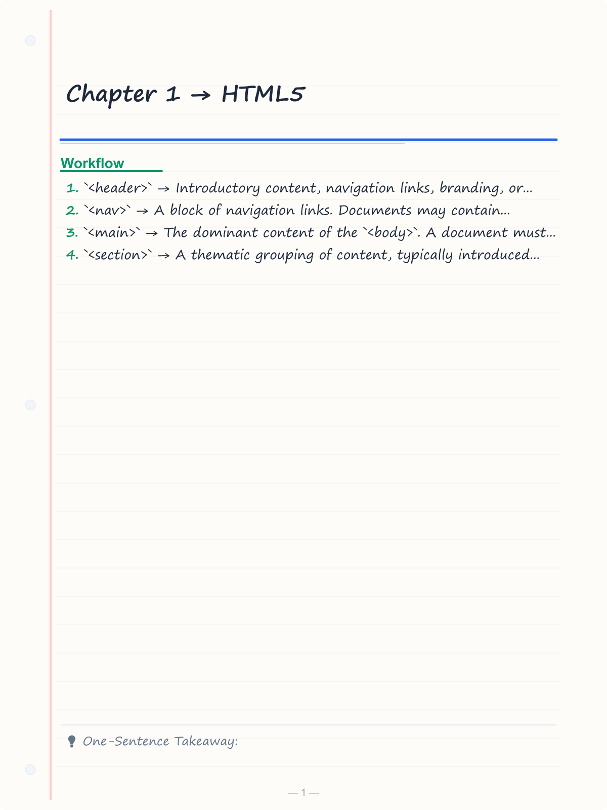
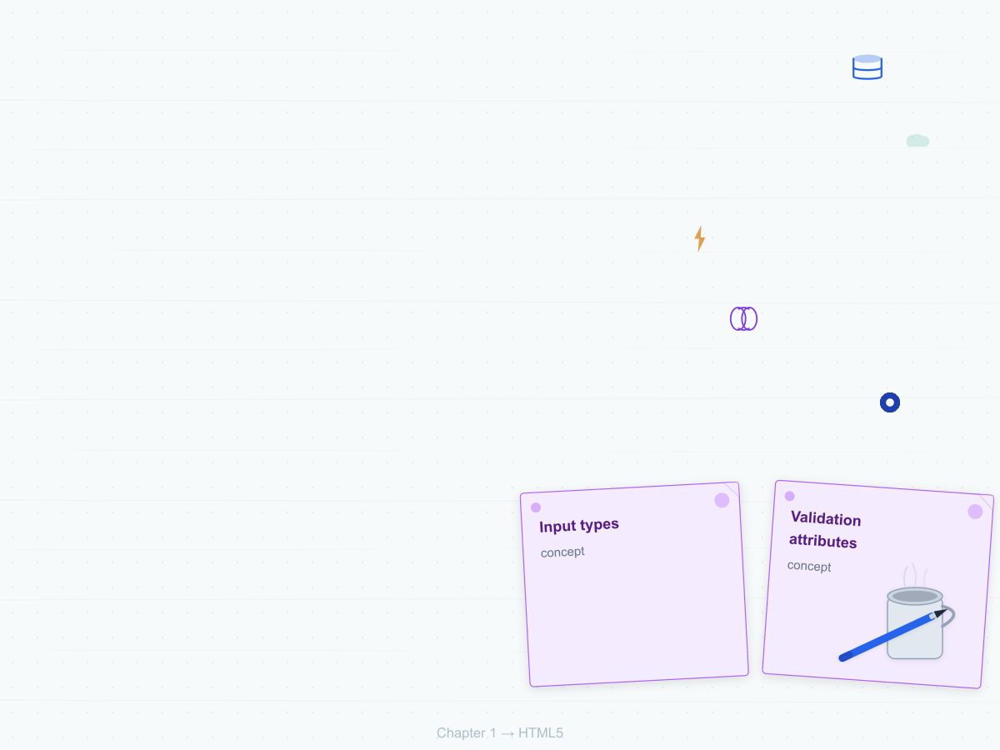
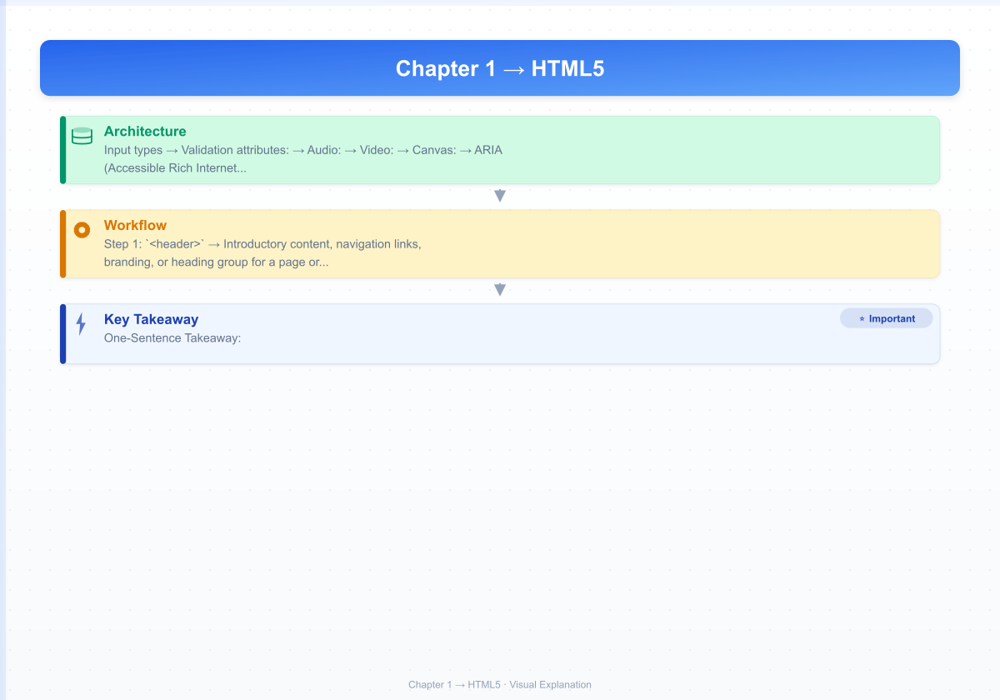
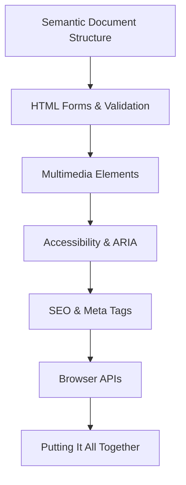

# Chapter 1 → HTML5

> **Next:** [02-css](./02-css.md)

## Learning Objectives

> **One-Sentence Takeaway:** Semantic HTML5 elements provide meaningful document structure that aids accessibility and SEO.

<!-- Image Gallery -->
<section class="lesson-visuals" aria-label="Visual learning resources">
  <header><span>VISUAL LEARNING</span><h2>See it. Review it. Remember it.</h2></header>
  <a class="lesson-visual-card" href="../../assets/images/lessons/web-development/01-html/handwritten-notes.png" target="_blank" rel="noopener">
    
    <span><strong>Handwritten notes</strong>Condensed notes for deliberate review.</span>
  </a>
  <a class="lesson-visual-card" href="../../assets/images/lessons/web-development/01-html/sticky-notes.png" target="_blank" rel="noopener">
    
    <span><strong>Sticky-note revision</strong>Fast recall prompts for revision.</span>
  </a>
  <a class="lesson-visual-card" href="../../assets/images/lessons/web-development/01-html/visual-explanation.png" target="_blank" rel="noopener">
    
    <span><strong>Visual concept guide</strong>A connected explanation of the key ideas.</span>
  </a>
</section>
<!-- End Image Gallery -->


By the end of this chapter, you will be able to:

## Chapter at a Glance

> **One-Sentence Takeaway:** HTML5 forms offer built-in validation through attributes like `required`, `pattern`, and `min`/`max`.

| Topic | Key Insight | Practical Takeaway |
|-------|-------------|-------------------|
|Semantic Elements|Landmark tags convey meaning to browsers and assistive tech|Use `<header>`,`<nav>`,`<main>`,`<section>`,`<article>`,`<aside>`,`<footer>` for document structure|
|HTML Forms|Rich input types and validation attributes enable client-side checks|Leverage `required`,`pattern`,`min`,`max` for zero-JS validation|
|Multimedia|Native `<audio>` and `<video>` elements replace plugin-based players|Always provide multiple source formats and a `<track>` for captions|
|Accessibility|WCAG 2.2 and ARIA make web content perceivable by all users|Add `alt` text, ARIA roles, and keyboard support to every component|
|SEO Meta Tags|Open Graph and Twitter Card tags control link previews|Include `og:title`,`og:description`,`og:image` for social sharing|
|Browser APIs|Web Storage, Geolocation, Drag & Drop enable rich client features|Use `localStorage` for persistence, `sessionStorage` for tab-scoped data|

## Chapter Roadmap

> **One-Sentence Takeaway:** Native `<audio>` and `<video>` elements with multiple source formats ensure broad browser compatibility.




1. Construct semantically correct HTML5 documents using the full complement of semantic elements.
2. Implement accessible, validated HTML forms with modern input types and constraint validation.
3. Embed audio, video, and interactive media using native HTML5 elements.
4. Apply ARIA roles, states, and properties to improve accessibility for assistive technologies.
5. Use SEO meta tags to influence search-engine indexing and social-media link previews.
6. Leverage browser APIs including the Geolocation API, Web Storage, and the Drag and Drop API.

## Theory

> **One-Sentence Takeaway:** ARIA roles and properties bridge accessibility gaps for custom interactive widgets.

### 1.1 Semantic Document Structure


HTML5 introduced a set of landmark elements that replace the generic `<div>`-based document structure. These elements convey meaning about the content they contain, aiding accessibility, search-engine indexing, and code readability.

The primary semantic landmarks are:

- `<header>` → Introductory content, navigation links, branding, or heading group for a page or section.
- `<nav>` → A block of navigation links. Documents may contain multiple `<nav>` elements (e.g., primary nav, table of contents, breadcrumbs).
- `<main>` → The dominant content of the `<body>`. A document must have exactly one `<main>` element, visible and not hidden via `display: none` or `aria-hidden`.
- `<section>` → A thematic grouping of content, typically introduced with a heading. Not a generic container; use `<div>` when no semantic relationship exists.
- `<article>` → A self-contained composition that is independently distributable or reusable (forum post, news story, blog entry, comment).
- `<aside>` → Content tangentially related to the surrounding content, such as sidebars, pull quotes, or advertising.
- `<footer>` → Footer for its nearest ancestor sectioning content; typically contains author info, copyright, or related links.

A typical document skeleton:

```html
<!DOCTYPE html>
<html lang="en">
<head>
  <meta charset="UTF-8" />
  <meta name="viewport" content="width=device-width, initial-scale=1.0" />
  <title>Document Title</title>
</head>
<body>
  <header>
    <nav aria-label="Primary">
      <ul>
        <li><a href="/">Home</a></li>
        <li><a href="/about">About</a></li>
      </ul>
    </nav>
  </header>
  <main>
    <article>
      <h1>Article Heading</h1>
      <section>
        <h2>Section Heading</h2>
        <p>Content.</p>
      </section>
    </article>
    <aside>
      <h2>Related Links</h2>
    </aside>
  </main>
  <footer>
    <p>&copy; 2026</p>
  </footer>
</body>
</html>
```

### 1.2 HTML Forms


Forms are the primary mechanism for user-to-server data submission. HTML5 specifies a rich set of input types and attributes that enable client-side constraint validation without JavaScript.

**Input types** include `text`, `email`, `url`, `tel`, `number`, `range`, `date`, `time`, `datetime-local`, `month`, `week`, `color`, `file`, `password`, `search`, and `checkbox`/`radio`.

**Validation attributes:**

| Attribute | Effect |
|-----------|--------|
| `required` | Field must have a value before submission |
| `minlength` / `maxlength` | String length constraints |
| `min` / `max` | Numeric or date range constraints |
| `step` | Increment granularity for `number` and `range` |
| `pattern` | Regular expression the value must match |

```html
<form action="/api/users" method="POST" novalidate>
  <label for="name">Full Name</label>
  <input
    type="text"
    id="name"
    name="name"
    required
    minlength="2"
    maxlength="100"
    autocomplete="name"
  />

  <label for="email">Email</label>
  <input type="email" id="email" name="email" required autocomplete="email" />

  <label for="age">Age</label>
  <input type="number" id="age" name="age" min="1" max="150" step="1" />

  <label for="avatar">Profile Picture</label>
  <input type="file" id="avatar" name="avatar" accept="image/png,image/jpeg" />

  <fieldset>
    <legend>Preferred Contact Method</legend>
    <label><input type="radio" name="contact" value="email" checked /> Email</label>
    <label><input type="radio" name="contact" value="phone" /> Phone</label>
  </fieldset>

  <label>
    <input type="checkbox" name="terms" required />
    I agree to the terms of service
  </label>

  <button type="submit">Register</button>
</form>
```

The `novalidate` attribute on `<form>` disables browser validation, allowing JavaScript-based or server-side validation to take full control.

### 1.3 Multimedia


HTML5 provides native elements for embedding media without third-party plugins.

**Audio:**

```html
<audio controls preload="metadata">
  <source src="track.mp3" type="audio/mpeg" />
  <source src="track.ogg" type="audio/ogg" />
  <p>Your browser does not support the audio element.</p>
</audio>
```

**Video:**

```html
<video controls width="640" poster="thumbnail.jpg">
  <source src="presentation.mp4" type="video/mp4" />
  <source src="presentation.webm" type="video/webm" />
  <track kind="captions" src="captions.vtt" srclang="en" label="English" />
  <p>Your browser does not support the video element.</p>
</video>
```

The `<track>` element supports `kind` values of `captions`, `subtitles`, `descriptions`, `chapters`, and `metadata` → essential for accessibility and internationalization.

**Canvas:**

The `<canvas>` element provides a bitmap drawing surface controlled via JavaScript. It is suitable for graphs, game rendering, and image processing.

```html
<canvas id="chart" width="600" height="400">
  <p>Your browser does not support the canvas element.</p>
</canvas>
```

```javascript
const canvas = document.getElementById('chart');
const ctx = canvas.getContext('2d');

ctx.fillStyle = '#4a90d9';
ctx.beginPath();
ctx.arc(200, 200, 100, 0, Math.PI * 2);
ctx.fill();

ctx.fillStyle = '#fff';
ctx.font = 'bold 24px sans-serif';
ctx.textAlign = 'center';
ctx.textBaseline = 'middle';
ctx.fillText('42%', 200, 200);
```

### 1.4 Accessibility


Web accessibility ensures that people with disabilities can perceive, understand, navigate, and interact with web content. The WCAG 2.2 standard defines four principles: **Perceivable**, **Operable**, **Understandable**, and **Robust**.

**ARIA (Accessible Rich Internet Applications)** provides a vocabulary of roles, states, and properties for custom interactive widgets.

```html
<div
  role="tablist"
  aria-label="Product Information"
>
  <button role="tab" aria-selected="true" aria-controls="panel1" id="tab1">
    Description
  </button>
  <button role="tab" aria-selected="false" aria-controls="panel2" id="tab2">
    Reviews
  </button>
</div>
<div role="tabpanel" id="panel1" aria-labelledby="tab1">
  <p>Product description content.</p>
</div>
<div role="tabpanel" id="panel2" aria-labelledby="tab2" hidden>
  <p>Customer reviews.</p>
</div>
```

**Alt text** is required on all `` elements. Decorative images should use `alt=""` (empty) so screen readers ignore them.

```html


```

**Landmark roles** are implicitly derived from semantic elements: `<nav>` maps to `role="navigation"`, `<main>` to `role="main"`, `<aside>` to `role="complementary"`.

### 1.5 SEO Meta Tags


Search engines use `<meta>` tags and structured data to understand page content and generate rich search results.

```html
<head>
  <title>Introduction to Web Development | University Textbook</title>
  <meta name="description" content="A comprehensive introduction to modern web development covering HTML5, CSS3, JavaScript, React, Node.js, and deployment." />
  <meta name="keywords" content="web development, HTML5, CSS3, JavaScript, React, Node.js" />
  <meta name="author" content="Web Development Faculty" />
  <meta name="robots" content="index, follow" />

  <!-- Open Graph (Facebook, LinkedIn) -->
  <meta property="og:title" content="Introduction to Web Development" />
  <meta property="og:description" content="A comprehensive introduction to modern web development." />
  <meta property="og:image" content="https://example.com/og-image.png" />
  <meta property="og:type" content="website" />

  <!-- Twitter Card -->
  <meta name="twitter:card" content="summary_large_image" />
  <meta name="twitter:title" content="Introduction to Web Development" />
  <meta name="twitter:description" content="A comprehensive introduction to modern web development." />
  <meta name="twitter:image" content="https://example.com/twitter-image.png" />

  <!-- Canonical URL -->
  <link rel="canonical" href="https://example.com/web-dev-intro" />

  <!-- Favicon -->
  <link rel="icon" href="/favicon.ico" type="image/x-icon" />
</head>
```

### 1.6 The Picture Element and Responsive Images


The `<picture>` element provides art-direction and format-fallback capabilities for responsive images.

```html
<picture>
  <!-- AVIF: Best compression, not universally supported -->
  <source srcset="/hero.avif" type="image/avif" media="(min-width: 1024px)" />
  <source srcset="/hero-small.avif" type="image/avif" media="(max-width: 1023px)" />

  <!-- WebP: Good fallback -->
  <source srcset="/hero.webp" type="image/webp" media="(min-width: 1024px)" />
  <source srcset="/hero-small.webp" type="image/webp" media="(max-width: 1023px)" />

  <!-- JPEG: Universal fallback -->
  
</picture>
```

### 1.7 Microdata and Structured Data


Structured data helps search engines understand page content and display rich snippets.

```html
<article itemscope itemtype="https://schema.org/Article">
  <meta itemprop="identifier" content="https://example.com/blog/post-1" />
  <h1 itemprop="headline">Introduction to HTML5</h1>
  <p itemprop="description">A comprehensive guide to modern HTML5 features.</p>
  <meta itemprop="datePublished" content="2026-01-15" />
  <meta itemprop="author" content="Web Development Faculty" />

  <div itemprop="image" itemscope itemtype="https://schema.org/ImageObject">
    
    <meta itemprop="width" content="1200" />
    <meta itemprop="height" content="630" />
  </div>

  <div itemprop="publisher" itemscope itemtype="https://schema.org/Organization">
    <meta itemprop="name" content="AI Engineering Journey" />
    <div itemprop="logo" itemscope itemtype="https://schema.org/ImageObject">
      <meta itemprop="url" content="https://example.com/logo.png" />
    </div>
  </div>
</article>

<!-- Breadcrumb structured data -->
<nav aria-label="Breadcrumb" itemscope itemtype="https://schema.org/BreadcrumbList">
  <ol>
    <li itemprop="itemListElement" itemscope itemtype="https://schema.org/ListItem">
      <a itemprop="item" href="/"><span itemprop="name">Home</span></a>
      <meta itemprop="position" content="1" />
    </li>
    <li itemprop="itemListElement" itemscope itemtype="https://schema.org/ListItem">
      <a itemprop="item" href="/courses"><span itemprop="name">Courses</span></a>
      <meta itemprop="position" content="2" />
    </li>
    <li itemprop="itemListElement" itemscope itemtype="https://schema.org/ListItem">
      <a itemprop="item" href="/courses/web-dev"><span itemprop="name">Web Development</span></a>
      <meta itemprop="position" content="3" />
    </li>
  </ol>
</nav>
```

### 1.8 Web Components: Templates and Slots


The `<template>` element holds HTML that is not rendered until cloned into the DOM.

```html
<template id="user-card-template">
  <style>
    .card { border: 1px solid #ddd; padding: 1rem; border-radius: 8px; }
    .name { font-weight: bold; }
  </style>
  <div class="card">
    <slot name="avatar"></slot>
    <p class="name"><slot name="fullname">Name</slot></p>
    <p><slot name="email">Email</slot></p>
  </div>
</template>

<user-card>
  
  <span slot="fullname">Alice Johnson</span>
  <span slot="email">alice@example.com</span>
</user-card>
```

```javascript
// Instantiate template
const template = document.getElementById("user-card-template");
const clone = template.content.cloneNode(true);
document.body.appendChild(clone);

// Programmatic slot assignment
class UserCard extends HTMLElement {
  constructor() {
    super();
    const tmpl = document.getElementById("user-card-template");
    this.attachShadow({ mode: "open" }).appendChild(tmpl.content.cloneNode(true));
  }
}
customElements.define("user-card", UserCard);
```

### 1.9 Internationalization (i18n)


The `lang` attribute and `Intl` API handle multilingual content.

```html
<html lang="fr">
  <p>Bonjour le monde</p>
</html>
```

```javascript
// Intl.DateTimeFormat for locale-aware dates
const date = new Date();
const formatter = new Intl.DateTimeFormat("fr-FR", {
  dateStyle: "full",
  timeStyle: "short",
});
console.log(formatter.format(date)); // "mercredi 24 juin 2026 à 14:30"

// Intl.NumberFormat for currency
const price = new Intl.NumberFormat("de-DE", {
  style: "currency",
  currency: "EUR",
}).format(1234.56);
console.log(price); // "1.234,56 €"

// Plural rules
const pluralRules = new Intl.PluralRules("en-US");
console.log(pluralRules.select(1)); // "one"
console.log(pluralRules.select(3)); // "other"
```

### 1.10 HTML APIs


```javascript
// Store
localStorage.setItem('theme', 'dark');
sessionStorage.setItem('formProgress', JSON.stringify({ step: 3, valid: true }));

// Retrieve
const theme = localStorage.getItem('theme');
const progress = JSON.parse(sessionStorage.getItem('formProgress'));

// Remove
localStorage.removeItem('theme');
sessionStorage.clear();
```

**Geolocation API** obtains the user's current position (subject to permission prompts).

```javascript
if ('geolocation' in navigator) {
  navigator.geolocation.getCurrentPosition(
    (position) => {
      const { latitude, longitude } = position.coords;
      console.log(`User is at ${latitude}, ${longitude}`);
    },
    (error) => {
      console.error('Geolocation error:', error.message);
    },
    { enableHighAccuracy: true, timeout: 10000, maximumAge: 60000 }
  );
}
```

**Drag and Drop API** enables interactive drag-and-drop interfaces.

```html
<div id="source" draggable="true" ondragstart="onDragStart(event)">
  Drag me
</div>
<div id="target" ondrop="onDrop(event)" ondragover="onDragOver(event)">
  Drop here
</div>
```

```javascript
function onDragStart(event) {
  event.dataTransfer.setData('text/plain', event.target.id);
  event.dataTransfer.effectAllowed = 'move';
}

function onDragOver(event) {
  event.preventDefault();
  event.dataTransfer.dropEffect = 'move';
}

function onDrop(event) {
  event.preventDefault();
  const id = event.dataTransfer.getData('text/plain');
  const draggable = document.getElementById(id);
  event.target.appendChild(draggable);
}
```


> [!TIP]
> Use the `<picture>` element with `<source>` tags for responsive images and format fallbacks (WebP, AVIF, JPEG).

> [!WARNING]
> Always use `label` elements with `for` attributes on form inputs to ensure screen-reader accessibility.

> [!REMEMBER]
> A valid HTML document must have exactly one `<main>` element per page — never duplicate it.


## Concept Comparison Table

| Concept | Description | Use Case |
|---------|-------------|---------|
|`<section>` vs `<div>`|Semantic grouping with heading|Generic container without meaning|
|`localStorage` vs `sessionStorage`|Persists across sessions|Cleared when tab closes|
|`<audio>` vs `<video>`|Sound-only playback|Visual + audio with optional captions|
|`aria-selected` vs `aria-current`|Indicates selected option in a group|Indicates current item in a set|
|`GET` vs `POST` form|Retrieves data, visible in URL|Submits data, hidden in body|

## Quick Reference

| Topic | Key Points |
|-------|-----------|
|Semantic Elements|`<header>`,`<nav>`,`<main>`,`<section>`,`<article>`,`<aside>`,`<footer>`|
|Form Validation|`required`,`pattern`,`minlength`,`maxlength`,`min`,`max`,`step`|
|Multimedia Attributes|`controls`,`autoplay`,`loop`,`preload`,`poster`,`muted`|
|ARIA Landmarks|`role='banner'`,`role='navigation'`,`role='main'`,`role='complementary'`,`role='contentinfo'`|
|Open Graph Tags|`og:title`,`og:description`,`og:image`,`og:type`,`og:url`|

## Cross-Application Matrix

| Domain | Application | Benefit |
|--------|------------|--------|
|Blog|Semantic structure, SEO meta tags|Improved search ranking and accessibility|
|E-commerce|Forms with validation, ARIA for product cards|Better conversion through usable forms|
|Video Platform|Native video with captions and poster|Cross-browser video without plugins|
|Social Media|Open Graph tags, drag-and-drop uploads|Rich link previews and intuitive interactions|
|Dashboard|Web Storage for preferences, canvas for charts|Persistent settings and dynamic visualizations|

## Chapter Quiz

Test your understanding with these quick questions.

**Q1. Which HTML5 semantic element represents the dominant content of the page?**

- A) `<header>`
- B) `<main>`
- C) `<section>`
- D) `<article>`

<details><summary>Answer&lt;/summary&gt;

**B) `<main>` — a document must have exactly one visible `<main>` element.**

</details>

**Q2. What attribute on an `<input>` element enforces a regular expression pattern?**

- A) `required`
- B) `regex`
- C) `pattern`
- D) `format`

<details><summary>Answer&lt;/summary&gt;

**C) `pattern` — the value is matched against the given regular expression.**

</details>

**Q3. Which storage mechanism persists data even after the browser is closed?**

- A) `sessionStorage`
- B) `localStorage`
- C) Cookies without expiry
- D) Both B and C

<details><summary>Answer&lt;/summary&gt;

**D) Both B and C — `localStorage` and persistent cookies survive browser restarts.**

</details>

**Q4. What is the purpose of the `alt` attribute on `` elements?**

- A) Display a tooltip on hover
- B) Provide alternative text for screen readers
- C) Set the image dimensions
- D) Link to a higher-resolution version

<details><summary>Answer&lt;/summary&gt;

**B) The `alt` attribute provides alternative text for assistive technologies and when images fail to load.**

</details>

### TypeScript: HTML Validator & Accessibility Checker

```typescript
class HTMLValidator {
  static checkNesting(html: string): string[] {
    const errors: string[] = [], stack: string[] = [];
    const selfClosing = new Set(["br", "hr", "img", "input", "meta", "link"]);
    const re = /<\/?(\w+)[^>]*>/g;
    let m: RegExpExecArray | null;
    while ((m = re.exec(html)) !== null) {
      const t = m[1].toLowerCase();
      if (m[0][1] === "/") {
        if (stack.length && stack[stack.length - 1] === t) stack.pop();
        else errors.push(`Mismatched </${t}>`);
      } else if (!selfClosing.has(t)) stack.push(t);
    }
    if (stack.length) errors.push(`Unclosed: ${stack.join(", ")}`);
    return errors;
  }
  static checkAlt(html: string): number {
    return (html.match(/ !html.toLowerCase().includes(n));
  }
  static outline(headings: string): string {
    const levels = [...headings.matchAll(/<h([1-6])[^>]*>/gi)].map(m => +m[1]);
    if (!levels.length) return "No headings";
    let outline = "", prev = 0;
    levels.forEach(l => {
      if (l > prev + 1) outline += "? Skipped level\n";
      outline += `${"  ".repeat(l - 1)}H${l}\n`;
      prev = l;
    });
    return outline;
  }
}

const sample = '<div><p>Text</p></div>';
console.log("Nesting:", HTMLValidator.checkNesting(sample));
console.log("Missing alt:", HTMLValidator.checkAlt(sample));
console.log("Outline:\n" + HTMLValidator.outline("<h1>Title</h1><h3>Sub</h3>"));
```

## TypeScript Implementation: Semantic HTML Validator and Accessibility Checker

```typescript
interface AccessiblityIssue {
    type: "missing-alt" | "missing-label" | "heading-skip" | "missing-lang" | "missing-role" | "missing-aria";
    element: string;
    message: string;
    severity: "error" | "warning" | "info";
}

class HTMLAnalyzer {
    static validateSemantic(html: string): AccessiblityIssue[] {
        const issues: AccessiblityIssue[] = [];

        const langMatch = html.match(/<html[^>]*lang=["']([^"']*)["']/i);
        if (!langMatch) {
            issues.push({ type: "missing-lang", element: "html", message: "Missing lang attribute on <html>", severity: "error" });
        }

        const imgs = html.match(/]*>/gi) || [];
        for (const img of imgs) {
            if (!/alt\s*=/i.test(img)) {
                issues.push({ type: "missing-alt", element: img.slice(0, 40), message: "Missing alt attribute on ", severity: "error" });
            }
        }

        const inputs = html.match(/<(input|textarea|select)[^>]*>/gi) || [];
        for (const input of inputs) {
            const hasLabel = /aria-label\s*=|aria-labelledby\s*=/i.test(input);
            const hasId = /id\s*=\s*["']([^"']*)["']/i.exec(input);
            if (!hasLabel && !hasId) {
                issues.push({ type: "missing-label", element: input.slice(0, 40), message: "Form element without accessible label", severity: "warning" });
            }
        }

        const headings = [...html.matchAll(/<h([1-6])[^>]*>/gi)].map(m => parseInt(m[1]));
        for (let i = 1; i < headings.length; i++) {
            if (headings[i] > headings[i - 1] + 1) {
                issues.push({ type: "heading-skip", element: `<h${headings[i]}>`, message: `Heading level jumps from h${headings[i-1]} to h${headings[i]}`, severity: "warning" });
            }
        }

        const buttons = html.match(/<button[^>]*>/gi) || [];
        for (const btn of buttons) {
            if (!/aria-label\s*=|aria-labelledby\s*=/i.test(btn) && !btn.includes(">") && !/type\s*=/i.test(btn)) {
                issues.push({ type: "missing-aria", element: btn.slice(0, 40), message: "Button without aria-label or text content", severity: "info" });
            }
        }

        return issues;
    }

    static outline(html: string): string {
        const headings = [...html.matchAll(/<h([1-6])([^>]*)>(.*?)<\/h\1>/gi)];
        let result = "";
        let prevLevel = 0;
        for (const h of headings) {
            const level = parseInt(h[1]);
            const text = h[3].replace(/<[^>]*>/g, "").trim();
            const indent = "  ".repeat(Math.max(0, level - 1));
            result += `${indent}${"•".repeat(level)} ${text}\n`;
            prevLevel = level;
        }
        return result;
    }

    static checkLandmarks(html: string): { present: string[]; missing: string[] } {
        const required = ["header", "nav", "main", "footer"];
        const present = required.filter(r => new RegExp(`<${r}[>\\s]`, "i").test(html));
        const missing = required.filter(r => !present.includes(r));
        return { present, missing };
    }

    static checkColorContrast(foreground: string, background: string): number {
        const toRgb = (hex: string): number[] => {
            const c = hex.replace("#", "");
            return [parseInt(c.slice(0, 2), 16), parseInt(c.slice(2, 4), 16), parseInt(c.slice(4, 6), 16)];
        };
        const luminance = (r: number, g: number, b: number): number => {
            const [rl, gl, bl] = [r, g, b].map(v => { const s = v / 255; return s <= 0.03928 ? s / 12.92 : ((s + 0.055) / 1.055) ** 2.4; });
            return 0.2126 * rl + 0.7152 * gl + 0.0722 * bl;
        };
        const fg = toRgb(foreground); const bg = toRgb(background);
        const l1 = luminance(fg[0], fg[1], fg[2]);
        const l2 = luminance(bg[0], bg[1], bg[2]);
        return (Math.max(l1, l2) + 0.05) / (Math.min(l1, l2) + 0.05);
    }
}

// Demo
const sampleHTML = `
<!DOCTYPE html><html><body>
<h1>Page Title</h1><h3>Subsection</h3>

<button>Click</button><input placeholder="name">
<nav><a href="/">Home</a></nav>
<main><section><h2>Content</h2></section></main>
<footer>Copyright</footer>
</body></html>`;

console.log("Accessibility issues:", JSON.stringify(HTMLAnalyzer.validateSemantic(sampleHTML), null, 2));
console.log("Outline:\n", HTMLAnalyzer.outline(sampleHTML));
console.log("Landmarks:", JSON.stringify(HTMLAnalyzer.checkLandmarks(sampleHTML)));
console.log("Contrast ratio #fff/#000:", HTMLAnalyzer.checkColorContrast("#fff", "#000").toFixed(2));
console.log("Contrast ratio #aaa/#fff:", HTMLAnalyzer.checkColorContrast("#aaa", "#fff").toFixed(2));
```


// html
// fullstack-frontend-backend implementation

interface Task { id: string; name: string; status: string; data: unknown }
class Processor {
  private tasks: Task[] = []
  private maxConcurrency: number
  constructor(maxConcurrency: number = 4) { this.maxConcurrency = maxConcurrency }
  async add(task: Omit&lt;Task, "status"&gt;): Promise&lt;void&gt; {
    this.tasks.push({ ...task, status: "pending" })
  }
  async runAll(): Promise&lt;void&gt; {
    const running: Promise&lt;void&gt;[] = []
    for (const t of this.tasks) {
      if (running.length >= this.maxConcurrency) { await Promise.race(running) }
      const p = this.execute(t).finally(() => { const i = running.indexOf(p); if (i >= 0) running.splice(i, 1) })
      running.push(p)
    }
    await Promise.all(running)
  }
  private async execute(t: Task): Promise&lt;void&gt; {
    t.status = "running"
    await new Promise(r => setTimeout(r, 10))
    t.status = "done"
  }
  getResults(): Task[] { return this.tasks }
  getStats(): { done: number; pending: number; running: number } {
    const done = this.tasks.filter(t => t.status === "done").length
    const pending = this.tasks.filter(t => t.status === "pending").length
    const running = this.tasks.filter(t => t.status === "running").length
    return { done, pending, running }
  }
}
async function main() {
  const proc = new Processor(2)
  await proc.add({ id: '1', name: 'html', data: { topic: 'fullstack-frontend-backend' } })
  await proc.runAll()
  console.log('Stats:', proc.getStats())
}
main().catch(console.error)
export { Processor, Task }
## Summary

> **One-Sentence Takeaway:** Meta tags and Open Graph data control how content appears in search results and social media.

- HTML5 semantic elements (`<header>`, `<nav>`, `<main>`, `<section>`, `<article>`, `<aside>`, `<footer>`) provide meaning and improve accessibility.
- HTML5 forms include built-in validation via attributes such as `required`, `pattern`, `min`, and `max`.
- Native `<audio>` and `<video>` elements support multiple codecs and accessibility tracks.
- ARIA roles and properties supplement native semantics for custom widgets.
- Meta tags and Open Graph data improve SEO and social-media link sharing.
- Browser APIs such as Web Storage, Geolocation, and Drag and Drop enable rich client-side functionality without external libraries.

## Exercises

> **One-Sentence Takeaway:** Browser APIs like Web Storage and Geolocation enable feature-rich client-side experiences.

### Review Questions

1. List the seven primary semantic HTML5 elements and describe the purpose of each.
2. What is the difference between `localStorage` and `sessionStorage`?
3. Explain the function of the `pattern` attribute on an `<input>` element.
4. What does the `aria-selected` attribute communicate to assistive technology?

### Application Problems

5. Write the HTML for a product review form with fields for name, rating (1–5), email, and review text. Include appropriate validation and accessibility attributes.
6. Build a page layout using `<header>`, `<nav>`, `<main>`, `<article>`, `<aside>`, and `<footer>` that represents a blog post with a sidebar containing related links.
7. Implement an audio player with fallback text and both MP3 and OGG source formats.

### Application Problems

### Practical Takeaways

1. **Use semantic elements by default** — reach for `<header>`, `<nav>`, `<main>`, `<section>`, `<article>`, `<aside>`, `<footer>` before `<div>`. They improve SEO, accessibility, and code readability.
2. **Always include `alt` text** — every `` needs an `alt` attribute. Use `alt=""` for decorative images so screen readers ignore them.
3. **Validate forms with HTML attributes first** — `required`, `pattern`, `min`, `max` provide zero-JS validation. Enhance with JavaScript, never replace.
4. **Use `<picture>` for responsive images** — serve WebP/AVIF with JPEG fallback and different resolutions per viewport for bandwidth savings.
5. **Add structured data** — Schema.org microdata or JSON-LD helps search engines display rich snippets, improving click-through rates.

### Application Problems

8. Implement the `<picture>` element to serve WebP images with a JPEG fallback, and specify different images for mobile vs desktop viewports.
9. Add structured data (JSON-LD or microdata) to a recipe page that includes the recipe name, ingredients, cook time, and nutrition information.

### Challenge Problem

10. Build a fully accessible tab panel component using only HTML and ARIA attributes. The component must have three tabs labeled "Description", "Specifications", and "Reviews". Include proper keyboard interaction semantics (`role`, `aria-selected`, `aria-controls`, `aria-labelledby`, `tabindex`). Demonstrate the expected DOM structure with all three tab panels containing placeholder content. Add JavaScript that handles click events to switch tabs, updating `aria-selected` and hiding/showing the corresponding panels. Ensure only the active tab panel is visible.

11. Create a Web Component `<star-rating>` using `<template>` and Shadow DOM that displays 1-5 star ratings. It should accept a `value` attribute (1-5), render filled/empty stars using Unicode characters, emit a `change` custom event when a star is clicked, and use `<slot>` for a label. Style the component so that external CSS cannot affect its appearance.

12. Build an internationalized product page that uses the `Intl.DateTimeFormat`, `Intl.NumberFormat`, and `Intl.PluralRules` APIs to display a product price, release date, and stock count in three different locales (en-US, de-DE, ja-JP). Use the `lang` attribute on the `<html>` element and demonstrate how a user could switch between locales with a button.
