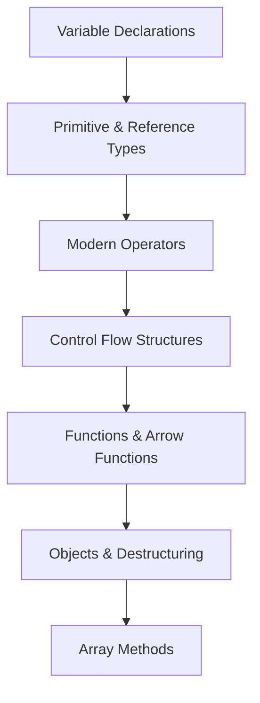

# Chapter 3 → JavaScript Basics

> **Previous:** [02-css](./02-css.md) | **Next:** [04-js-dom](./04-js-dom.md)

## Learning Objectives

> **One-Sentence Takeaway:** `const` and `let` provide block scoping while `var` is function-scoped and should be avoided in modern code.

<!-- Image Gallery -->
<section class="lesson-visuals" aria-label="Visual learning resources">
  <header><span>VISUAL LEARNING</span><h2>See it. Review it. Remember it.</h2></header>
  <a class="lesson-visual-card" href="../../../assets/images/lessons/web-development/03-js-basics/handwritten-notes.svg" target="_blank" rel="noopener">
    
    <span><strong>Handwritten notes</strong>Condensed notes for deliberate review.</span>
  </a>
  <a class="lesson-visual-card" href="../../../assets/images/lessons/web-development/03-js-basics/sticky-notes.svg" target="_blank" rel="noopener">
    
    <span><strong>Sticky-note revision</strong>Fast recall prompts for revision.</span>
  </a>
  <a class="lesson-visual-card" href="../../../assets/images/lessons/web-development/03-js-basics/visual-explanation.svg" target="_blank" rel="noopener">
    
    <span><strong>Visual concept guide</strong>A connected explanation of the key ideas.</span>
  </a>
</section>
<!-- End Image Gallery -->


By the end of this chapter, you will be able to:

## Chapter at a Glance

> **One-Sentence Takeaway:** JavaScript primitives are immutable and passed by value; objects are mutable and passed by reference.

| Topic | Key Insight | Practical Takeaway |
|-------|-------------|-------------------|
|Variables|`let` and `const` provide block scoping with the Temporal Dead Zone|Prefer `const` by default, use `let` when reassignment is necessary|
|Types|JavaScript has 7 primitives and objects — `typeof null` returns `'object'` (a bug)|Use explicit coercion like `Number()`, `String()`, `Boolean()` for clarity|
|Operators|Optional chaining `?.` and nullish coalescing `??` prevent runtime errors|Always use `===` for equality to avoid type coercion surprises|
|Control Flow|`for…of` iterates values, `for…in` iterates keys (with prototype chain)|Use `Object.hasOwn()` to filter inherited properties in `for…in`|
|Functions|Arrow functions have lexical `this` and no `arguments` object|Use arrow functions for callbacks, regular functions for methods|
|Arrays|Modern methods like `map`, `filter`, `reduce` enable declarative data transformations|Prefer non-mutating methods that return new arrays over mutating ones|

## Chapter Roadmap

> **One-Sentence Takeaway:** Always use strict equality `===` and take advantage of optional chaining `?.` and nullish coalescing `??`.




1. Declare variables using `var`, `let`, and `const` and explain the differences in scope and hoisting.
2. Identify and use JavaScript primitive types and reference types with `typeof` and `instanceof`.
3. Apply modern operators including optional chaining, nullish coalescing, spread/rest, and strict equality.
4. Write control flow statements with loops, conditionals, and `switch`.
5. Define and invoke functions using declarations, expressions, and arrow functions.
6. Manipulate objects and arrays using destructuring, spread, and modern methods.

## Theory

> **One-Sentence Takeaway:** `for…of` loops over iterable values; `for…in` iterates property keys including inherited ones.


### 3.1 Variables


JavaScript provides three variable declaration keywords, each with distinct scoping rules.

```javascript
// var → function-scoped, hoisted, can be redeclared
var x = 10;
if (true) {
  var x = 20; // Same variable → leaks out of block
}
console.log(x); // 20

// let → block-scoped, hoisted but not initialized (TDZ)
let y = 10;
if (true) {
  let y = 20; // Different variable → block-scoped
}
console.log(y); // 10

// const → block-scoped, must be initialized, cannot be reassigned
const z = 30;
// z = 40; // TypeError: Assignment to constant variable

// const does NOT make objects immutable
const obj = { a: 1 };
obj.a = 2; // Allowed
```

**Temporal Dead Zone (TDZ):** Variables declared with `let` and `const` exist in the scope but cannot be accessed until the declaration is evaluated.

```javascript
{
  console.log(a); // ReferenceError: Cannot access 'a' before initialization
  let a = 5;
}
```

Rule: Prefer `const` by default, use `let` when reassignment is necessary, never use `var` in modern code.

### 3.2 Types


JavaScript has seven primitive types and one reference type (Object).

```javascript
// Primitives (immutable, passed by value)
typeof 42;           // 'number'
typeof 'hello';      // 'string'
typeof true;         // 'boolean'
typeof undefined;    // 'undefined'
typeof null;         // 'object' (historical bug)
typeof 123n;         // 'bigint'
typeof Symbol('id'); // 'symbol'

// Objects (mutable, passed by reference)
typeof {};           // 'object'
typeof [];           // 'object'
typeof function(){}; // 'function'
```

**Type coercion** occurs implicitly in many contexts:

```javascript
'5' - 2;   // 3 (string coerced to number)
'5' + 2;   // '52' (number coerced to string)
+ '42';    // 42 (unary plus coerces to number)
!!'text';  // true (truthy value coerced to boolean)
```

Use explicit coercion for clarity:

```javascript
Number('42');        // 42
String(42);          // '42'
Boolean(0);          // false
parseInt('42px', 10); // 42
```

### 3.3 Operators


**Equality:** Always use `===` and `!==` to avoid type coercion.

```javascript
0 == false;   // true (coercion)
0 === false;  // false
'' == 0;      // true
'' === 0;     // false
null == undefined; // true
null === undefined; // false
```

**Optional chaining (`?.`)** short-circuits if the operand is `null` or `undefined`:

```javascript
const user = { profile: { name: 'Alice' } };
console.log(user?.profile?.name);  // 'Alice'
console.log(user?.address?.city);  // undefined (no error)
console.log(user?.address?.city ?? 'Unknown'); // 'Unknown'
```

**Nullish coalescing (`??`)** returns the right operand only when the left is `null` or `undefined` (not for other falsy values):

```javascript
const count = 0;
count ?? 10;   // 0 (0 is not nullish)
undefined ?? 10; // 10
null ?? 10;     // 10
```

**Spread (`...`)** expands iterables into elements:

```javascript
const arr = [1, 2, 3];
const copy = [...arr];       // [1, 2, 3]
const merged = [...arr, 4, 5]; // [1, 2, 3, 4, 5]

const obj1 = { a: 1, b: 2 };
const obj2 = { b: 3, c: 4 };
const combined = { ...obj1, ...obj2 }; // { a: 1, b: 3, c: 4 }
```

**Rest (`...`)** collects remaining parameters:

```javascript
function sum(first, ...rest) {
  return rest.reduce((acc, n) => acc + n, first);
}
sum(1, 2, 3, 4); // 10
```

### 3.4 Control Flow


```javascript
// if / else if / else
const score = 85;
let grade;
if (score >= 90) {
  grade = 'A';
} else if (score >= 80) {
  grade = 'B';
} else {
  grade = 'C';
}

// switch → strict comparison
switch (grade) {
  case 'A':
    console.log('Excellent');
    break;
  case 'B':
    console.log('Good');
    break;
  default:
    console.log('Needs improvement');
}

// Loops
for (let i = 0; i < 5; i++) {
  console.log(i);
}

for (const item of iterable) {
  // Values of arrays, strings, Maps, Sets
}

for (const key in object) {
  // Keys/property names (includes prototype chain)
  if (Object.hasOwn(object, key)) {
    // Own property check
  }
}

let n = 0;
while (n < 3) {
  n++;
}

do {
  n--;
} while (n > 0);
```

### 3.5 Functions


**Function declaration** (hoisted):

```javascript
function greet(name) {
  return `Hello, ${name}!`;
}
```

**Function expression** (not hoisted):

```javascript
const greet = function(name) {
  return `Hello, ${name}!`;
};
```

**Arrow functions** (lexical `this`, no `arguments` object, concise body):

```javascript
const greet = (name) => `Hello, ${name}!`;
const double = (n) => n * 2;
const sum = (a, b) => {
  const result = a + b;
  return result;
};

// Lexical this binding
const counter = {
  count: 0,
  increment() {
    setInterval(() => {
      this.count++; // Arrow inherits this from surrounding scope
    }, 1000);
  },
};
```

**Default parameters:**

```javascript
function createUser(name, role = 'user', isActive = true) {
  return { name, role, isActive };
}
```

### 3.6 Objects


Objects are collections of key-value pairs.

```javascript
// Object literal
const user = {
  name: 'Alice',
  age: 30,
  greet() {
    return `Hi, I'm ${this.name}`;
  },
};

// Computed property keys
const key = 'dynamicField';
const obj = {
  [key]: 'value',
};

// Property shorthand
const name = 'Bob';
const person = { name }; // { name: 'Bob' }

// Methods
Object.keys(user);   // ['name', 'age']
Object.values(user); // ['Alice', 30]
Object.entries(user); // [['name', 'Alice'], ['age', 30]]

// Property descriptors
Object.defineProperty(user, 'id', {
  value: 1,
  writable: false,
  enumerable: false,
  configurable: false,
});
```

### 3.7 Promises and Async/Await


JavaScript handles asynchronous operations via Promises and async/await.

```javascript
// Creating a Promise
function fetchUser(id) {
  return new Promise((resolve, reject) => {
    setTimeout(() => {
      if (id > 0) {
        resolve({ id, name: "Alice", role: "admin" });
      } else {
        reject(new Error("Invalid user ID"));
      }
    }, 1000);
  });
}

// Consuming with .then/.catch
fetchUser(1)
  .then((user) => console.log(user.name))
  .catch((err) => console.error(err));

// Consuming with async/await (preferred)
async function loadUserProfile(id) {
  try {
    const user = await fetchUser(id);
    return user;
  } catch (error) {
    console.error("Failed to load user:", error);
    return null;
  }
}

// Parallel execution with Promise.all
async function loadDashboard() {
  const [user, posts, notifications] = await Promise.all([
    fetchUser(1),
    fetchPosts(),
    fetchNotifications(),
  ]);
  return { user, posts, notifications };
}

// Promise.race - returns first settled promise
async function fetchWithTimeout(url, ms = 5000) {
  const controller = new AbortController();
  const timeout = setTimeout(() => controller.abort(), ms);
  try {
    const response = await fetch(url, { signal: controller.signal });
    return response;
  } finally {
    clearTimeout(timeout);
  }
}

// Promise.allSettled - waits for all, regardless of rejection
const results = await Promise.allSettled([
  fetch("/api/users"),
  fetch("/api/posts"),
  fetch("/api/invalid-endpoint"),
]);

const successful = results.filter((r) => r.status === "fulfilled").map((r) => r.value);
const failed = results.filter((r) => r.status === "rejected").map((r) => r.reason);
```

### 3.8 Arrays


Arrays are ordered, zero-indexed collections.

```javascript
const arr = [1, 2, 3, 4, 5];

// Destructuring
const [first, second, ...rest] = arr;
// first = 1, second = 2, rest = [3, 4, 5]

// Mutating methods
arr.push(6);       // [1,2,3,4,5,6]
arr.pop();         // Removes and returns last element
arr.shift();       // Removes and returns first element
arr.unshift(0);    // Prepends element
arr.splice(2, 1);  // Removes 1 element at index 2

// Non-mutating methods (return new array)
const doubled = arr.map((n) => n * 2);
const evens = arr.filter((n) => n % 2 === 0);
const sum = arr.reduce((acc, n) => acc + n, 0);
const found = arr.find((n) => n > 3);
const hasLarge = arr.some((n) => n > 10);
const allPositive = arr.every((n) => n > 0);
const sorted = [...arr].sort((a, b) => a - b);

// Array-like to array conversion
const args = Array.from(arguments);
const fromSet = [...new Set([1, 2, 2, 3])];

// Flat and flatMap
const nested = [1, [2, [3]]];
nested.flat(2); // [1, 2, 3]

const phrases = ['hello world', 'goodbye'];
phrases.flatMap((s) => s.split(' ')); // ['hello', 'world', 'goodbye']
```

**Object destructuring:**

```javascript
const user = { id: 1, name: 'Alice', role: 'admin' };
const { name, role, ...rest } = user;
// name = 'Alice', role = 'admin', rest = { id: 1 }

// Renaming and defaults
const { name: fullName, status = 'active' } = user;

// Nested destructuring
const data = { user: { address: { city: 'Portland' } } };
const { user: { address: { city } } } = data;
```


> [!TIP]
> Use `Array.from()` to convert array-like objects (like `arguments` or NodeList) into true arrays for method chaining.

> [!WARNING]
> `typeof null === 'object'` is a long-standing JavaScript bug. Use `value === null` to check for null.

> [!REMEMBER]
> `const` does not make objects immutable — only the binding is constant. Use `Object.freeze()` for shallow immutability.


## Concept Comparison Table

| Concept | Description | Use Case |
|---------|-------------|---------|
|`var` vs `let` vs `const`|Function-scoped, hoisted, redeclarable|Block-scoped, TDZ, no redeclaration|
|`==` vs `===`|Abstract equality with coercion|Strict equality without coercion|
|`?.` vs `&&`|Short-circuits only on null/undefined|Short-circuits on any falsy value|
|`??` vs `||`|Nullish (null/undefined) default|Any falsy default|
|Function Declaration vs Expression|Hoisted, named|Not hoisted, can be anonymous|

## Quick Reference

| Topic | Key Points |
|-------|-----------|
|Primitives|`number`,`string`,`boolean`,`undefined`,`null`,`bigint`,`symbol`|
|Array Methods|`map`,`filter`,`reduce`,`find`,`some`,`every`,`flat`,`flatMap`|
|Object Methods|`Object.keys()`,`Object.values()`,`Object.entries()`,`Object.assign()`|
|Operators|`===`,`!==`,`?.`,`??`,`...` (spread/rest)|
|Loop Types|`for`,`for…of`,`for…in`,`while`,`do…while`|

## Cross-Application Matrix

| Domain | Application | Benefit |
|--------|------------|--------|
|Form Validation|String and number type checks|Prevents invalid data submission|
|Data Processing|Array methods (map, filter, reduce)|Declarative, readable data pipelines|
|API Integration|Optional chaining for nested responses|Graceful handling of missing data|
|Configuration|Const for defaults, spread for merging|Immutable configuration objects|
|Event Handlers|Arrow functions for lexical this|Correct context in callback closures|

## Chapter Quiz

Test your understanding with these quick questions.

**Q1. What is the Temporal Dead Zone (TDZ)?**

- A) The time between hoisting and initialization of `let`/`const` variables
- B) A Firefox-specific debugging tool
- C) The period when `var` variables are undefined
- D) A zone where garbage collection is paused

<details><summary>Answer&lt;/summary&gt;

**A) The TDZ is the period between when a `let` or `const` variable enters scope and when it is initialized.**

</details>

**Q2. Which of the following returns `true`?**

- A) `0 == false`
- B) `0 === false`
- C) `'' === 0`
- D) `null === undefined`

<details><summary>Answer&lt;/summary&gt;

**A) `0 == false` returns `true` due to type coercion. Strict equality `===` would return `false`.**

</details>

**Q3. What does the spread operator `...` do when used with objects?**

- A) Creates a deep clone
- B) Copies own enumerable properties into a new object
- C) Removes properties from the original
- D) Converts the object to an array

<details><summary>Answer&lt;/summary&gt;

**B) Spread creates a shallow copy — nested objects are still shared between the original and the copy.**

</details>

**Q4. Which array method creates a new array by applying a function to each element?**

- A) `filter()`
- B) `reduce()`
- C) `map()`
- D) `forEach()`

<details><summary>Answer&lt;/summary&gt;

**C) `map()` returns a new array with the results of calling a function on every element.**

</details>

### TypeScript: Closure Analyzer & Data Transformer

```typescript
class ClosureAnalyzer {
  static memoize<T extends (...args: any[]) => any>(fn: T): T {
    const cache = new Map<string, ReturnType<T>>();
    return ((...args: any[]) => {
      const key = JSON.stringify(args);
      if (!cache.has(key)) cache.set(key, fn(...args));
      return cache.get(key);
    }) as T;
  }
  static createCounter(start: number = 0): { value: number; increment: () => number; reset: () => void } {
    let count = start;
    return { value: count, increment: () => ++count, reset: () => { count = start; } };
  }
  static compose<T>(...fns: ((x: T) => T)[]): (x: T) => T {
    return (x: T) => fns.reduceRight((acc, fn) => fn(acc), x);
  }
}

class DataPipeline {
  static async chain<T>(data: T[], ...transforms: ((arr: T[]) => T[])[]): Promise<T[]> {
    return transforms.reduce((acc, fn) => fn(acc), data);
  }
  static groupBy<T, K extends string | number>(items: T[], keyFn: (item: T) => K): Record<K, T[]> {
    return items.reduce((acc, item) => {
      const key = keyFn(item);
      (acc[key] ?? (acc[key] = [])).push(item);
      return acc;
    }, {} as Record<K, T[]>);
  }
}

const fib = ClosureAnalyzer.memoize((n: number): number => n <= 1 ? n : fib(n - 1) + fib(n - 2));
console.log("Fib(42):", fib(42));
const grouped = DataPipeline.groupBy([1, 2, 3, 4, 5, 6], n => (n % 2 === 0 ? "even" : "odd"));
console.log("Grouped:", JSON.stringify(grouped));
```

## TypeScript Implementation: Polyfill Detector, Type Coercion Analyzer, Prototype Walker

```typescript
class PolyfillDetector {
    static check(feature: string): { supported: boolean; polyfill?: string } {
        const checks: Record<string, { test: () => boolean; polyfillUrl: string }> = {
            "Promise": { test: () => typeof Promise !== "undefined", polyfillUrl: "core-js/stable/promise" },
            "Array.prototype.includes": { test: () => typeof Array.prototype.includes === "function", polyfillUrl: "core-js/stable/array/includes" },
            "Object.entries": { test: () => typeof Object.entries === "function", polyfillUrl: "core-js/stable/object/entries" },
            "Object.values": { test: () => typeof Object.values === "function", polyfillUrl: "core-js/stable/object/values" },
            "String.prototype.startsWith": { test: () => typeof String.prototype.startsWith === "function", polyfillUrl: "core-js/stable/string/starts-with" },
            "fetch": { test: () => typeof fetch !== "undefined", polyfillUrl: "whatwg-fetch" },
            "Symbol": { test: () => typeof Symbol !== "undefined", polyfillUrl: "core-js/stable/symbol" },
            "Map": { test: () => typeof Map !== "undefined", polyfillUrl: "core-js/stable/map" },
            "Set": { test: () => typeof Set !== "undefined", polyfillUrl: "core-js/stable/set" },
            "Array.from": { test: () => typeof Array.from === "function", polyfillUrl: "core-js/stable/array/from" },
            "Object.assign": { test: () => typeof Object.assign === "function", polyfillUrl: "core-js/stable/object/assign" },
            "Array.prototype.flat": { test: () => typeof Array.prototype.flat === "function", polyfillUrl: "core-js/stable/array/flat" },
            "Array.prototype.flatMap": { test: () => typeof Array.prototype.flatMap === "function", polyfillUrl: "core-js/stable/array/flat-map" },
            "globalThis": { test: () => typeof globalThis !== "undefined", polyfillUrl: "core-js/stable/global-this" },
            "WeakRef": { test: () => typeof WeakRef !== "undefined", polyfillUrl: "core-js/stable/weak-ref" },
        };
        const c = checks[feature];
        if (!c) return { supported: false, polyfill: "unknown feature" };
        try { return { supported: c.test(), polyfill: c.polyfillUrl }; } catch { return { supported: false, polyfill: c.polyfillUrl }; }
    }

    static scanAll(): { feature: string; supported: boolean; polyfill: string }[] {
        const features = ["Promise", "Array.prototype.includes", "Object.entries", "fetch", "Symbol", "Map", "Set", "Array.from", "Object.assign", "Array.prototype.flat"];
        return features.map(f => {
            const result = PolyfillDetector.check(f);
            return { feature: f, supported: result.supported, polyfill: result.polyfill || "" };
        });
    }
}

class TypeCoercionAnalyzer {
    static analyze(value: any, context: string): { input: any; type: string; coerced: string; result: any; explanation: string } {
        let coerced: string = "none";
        let result: any = value;
        let explanation = "No coercion needed";

        if (context === "number") {
            result = Number(value);
            coerced = "ToNumber";
            explanation = `Number(${JSON.stringify(value)}) = ${result}`;
        } else if (context === "string") {
            result = String(value);
            coerced = "ToString";
            explanation = `String(${JSON.stringify(value)}) = ${JSON.stringify(result)}`;
        } else if (context === "boolean") {
            result = Boolean(value);
            coerced = "ToBoolean";
            explanation = `Boolean(${JSON.stringify(value)}) = ${result}`;
        } else if (context === "loose-equal") {
            const eq = value == 0;
            result = eq;
            coerced = "Abstract Equality";
            explanation = `${JSON.stringify(value)} == 0 ? ${eq}`;
        }

        return { input: value, type: typeof value, coerced, result, explanation };
    }

    static demonstrate(): string[] {
        const lines: string[] = [];
        const cases = [
            { v: "5", ctx: "number" }, { v: null, ctx: "number" },
            { v: undefined, ctx: "number" }, { v: [], ctx: "number" },
            { v: [1], ctx: "number" }, { v: [1, 2], ctx: "number" },
            { v: {}, ctx: "string" }, { v: [1, 2], ctx: "string" },
            { v: 0, ctx: "boolean" }, { v: "", ctx: "boolean" },
            { v: "false", ctx: "boolean" },
        ];
        for (const c of cases) {
            const a = TypeCoercionAnalyzer.analyze(c.v, c.ctx);
            lines.push(`  ${JSON.stringify(c.v)} (${a.type}) ? ${a.coerced} ? ${JSON.stringify(a.result)}`);
        }
        return lines;
    }
}

class PrototypeChainWalker {
    static walk(obj: any, maxDepth: number = 10): { constructor: string; proto: any; properties: string[]; depth: number }[] {
        const chain: { constructor: string; proto: any; properties: string[]; depth: number }[] = [];
        let current = obj;
        let depth = 0;
        while (current !== null && depth < maxDepth) {
            const proto = Object.getPrototypeOf(current);
            if (!proto) break;
            const props = [
                ...Object.getOwnPropertyNames(proto),
                ...Object.getOwnPropertySymbols(proto).map(s => s.toString())
            ];
            chain.push({
                constructor: proto.constructor?.name || "(anonymous)",
                proto,
                properties: props.filter(p => p !== "constructor"),
                depth
            });
            current = proto;
            depth++;
        }
        return chain;
    }

    static visualize(obj: any): string {
        const chain = this.walk(obj);
        return chain.map((l, i) => {
            const indent = "  ".repeat(i);
            const props = l.properties.slice(0, 8);
            return `${indent}? ${l.constructor}${props.length > 0 ? ` [${props.join(", ")}${l.properties.length > 8 ? ", …" : ""}]` : " [empty]"}`;
        }).join("\n");
    }
}

// Demo
console.log("Polyfills:", JSON.stringify(PolyfillDetector.scanAll().slice(0, 3), null, 2));
console.log("Type coercion:\n", TypeCoercionAnalyzer.demonstrate().join("\n"));
console.log("Array prototype chain:\n", PrototypeChainWalker.visualize([1, 2, 3]));
```


// js basics
// fullstack-frontend-backend implementation

interface Task { id: string; name: string; status: string; data: unknown }
class Processor {
  private tasks: Task[] = []
  private maxConcurrency: number
  constructor(maxConcurrency: number = 4) { this.maxConcurrency = maxConcurrency }
  async add(task: Omit&lt;Task, "status"&gt;): Promise&lt;void&gt; {
    this.tasks.push({ ...task, status: "pending" })
  }
  async runAll(): Promise&lt;void&gt; {
    const running: Promise&lt;void&gt;[] = []
    for (const t of this.tasks) {
      if (running.length >= this.maxConcurrency) { await Promise.race(running) }
      const p = this.execute(t).finally(() => { const i = running.indexOf(p); if (i >= 0) running.splice(i, 1) })
      running.push(p)
    }
    await Promise.all(running)
  }
  private async execute(t: Task): Promise&lt;void&gt; {
    t.status = "running"
    await new Promise(r => setTimeout(r, 10))
    t.status = "done"
  }
  getResults(): Task[] { return this.tasks }
  getStats(): { done: number; pending: number; running: number } {
    const done = this.tasks.filter(t => t.status === "done").length
    const pending = this.tasks.filter(t => t.status === "pending").length
    const running = this.tasks.filter(t => t.status === "running").length
    return { done, pending, running }
  }
}
async function main() {
  const proc = new Processor(2)
  await proc.add({ id: '1', name: 'js basics', data: { topic: 'fullstack-frontend-backend' } })
  await proc.runAll()
  console.log('Stats:', proc.getStats())
}
main().catch(console.error)
export { Processor, Task }
## Summary

> **One-Sentence Takeaway:** Arrow functions inherit `this` from their enclosing scope, making them ideal for callbacks.

- `const` and `let` provide block scoping; prefer `const` unless reassignment is required.
- Primitives are immutable and passed by value; objects are mutable and passed by reference.
- Use `===` for comparisons, `?.` for safe property access, `??` for nullish defaults.
- Control flow includes `if/else`, `switch`, and `for/of` loops over iterables.
- Arrow functions provide concise syntax and lexical `this` binding.
- Object and array destructuring enables readable extraction of nested values.
- Modern array methods (`map`, `filter`, `reduce`, `flatMap`) enable declarative data transformation.

## Exercises

> **One-Sentence Takeaway:** Modern array methods enable declarative, chainable data transformations without side effects.

### Review Questions

1. What is the Temporal Dead Zone and how does it affect `let` and `const`?
2. Why is `typeof null === 'object'` considered a bug? How should you test for null?
3. What is the difference between spreading an array and spreading an object?
4. How does optional chaining (`?.`) differ from logical AND (`&&`) for property access?

### Application Problems

5. Write a function `deepClone(obj)` that creates a deep copy of a serializable object using `JSON.parse`/`JSON.stringify` and explain its limitations.
6. Implement a function `groupBy(arr, key)` that groups an array of objects by a specified key and returns an object mapping keys to arrays of matching objects.
7. Write a pipeline function `pipe(...fns)` that composes functions left-to-right: `pipe(f, g)(x)` should return `g(f(x))`.

### Application Problems

8. Implement a function `retry(fn, retries)` that calls an async function and retries it up to N times if it rejects, with exponential backoff (100ms, 200ms, 400ms, ...) between attempts.
9. Write a function `parallelWithLimit(tasks, limit)` that runs an array of async functions with at most `limit` concurrent executions, returning results in order.

### structuredClone and Deep Copying

The `structuredClone` global creates deep copies of objects.

```javascript
const original = {
  name: "Alice",
  hobbies: ["reading", "coding"],
  address: { city: "Portland", zip: 97201 },
};

// Deep clone — no mutation to original
const clone = structuredClone(original);
clone.hobbies.push("hiking");
clone.address.zip = 97202;

console.log(original.hobbies); // ["reading", "coding"] — unchanged
console.log(original.address.zip); // 97201 — unchanged

// Supports: objects, arrays, maps, sets, dates, regexps, typed arrays, blobs
// Not supported: functions, DOM nodes, class instances with prototypes, Error objects
```

### Event Loop Deep Dive: Microtasks vs Macrotasks

```javascript
console.log("1: sync");

setTimeout(() => console.log("2: macrotask"), 0);

Promise.resolve().then(() => console.log("3: microtask"));

queueMicrotask(() => console.log("4: queueMicrotask"));

requestAnimationFrame(() => console.log("5: animation frame"));

// Output order:
// 1: sync
// 3: microtask  (microtask queue empties after each macrotask)
// 4: queueMicrotask
// 2: macrotask  (next macrotask cycle)
// 5: animation frame (before paint, after macrotask)
```

### WeakRef and FinalizationRegistry

```javascript
const cache = new Map();

function fetchData(id) {
  if (cache.has(id)) return cache.get(id);
  const data = { id, timestamp: Date.now() };
  cache.set(id, new WeakRef(data));
  return data;
}

// Clean up unreferenced entries
const registry = new FinalizationRegistry((id) => {
  console.log(`Data ${id} was garbage collected`);
});

function track(id, ref) {
  registry.register(ref, id);
}
```

### Challenge Problem

10. Implement a `class`-free functional event emitter with methods `on(event, handler)`, `off(event, handler)`, and `emit(event, ...args)`. The implementation must support multiple handlers per event, removal of specific handlers, and wildcard listeners that receive all events. Use a plain object as the handlers store and the rest/spread syntax for variable arguments. Ensure that removing a handler during emission does not skip other handlers. Write unit-test-style assertions that demonstrate all three methods working correctly, including the wildcard behavior.

### Practical Takeaways

1. **Prefer `const` by default** — use `const` for variables that are never reassigned. Use `let` only when you need to reassign. Never use `var` in modern code.
2. **Always use `===` for equality** — avoid `==` coercion surprises. The only exception is `== null` to check both `null` and `undefined`.
3. **Use async/await over raw Promises** — it reads like synchronous code, has better error stacks, and works naturally with try/catch.
4. **Use `Promise.all` for independent parallel work** — when tasks do not depend on each other, `Promise.all` runs them concurrently and fails fast on any rejection.
5. **Prefer array methods over loops** — `map`, `filter`, `reduce`, `find`, and `some` express data transformations declaratively without manual indexing.
