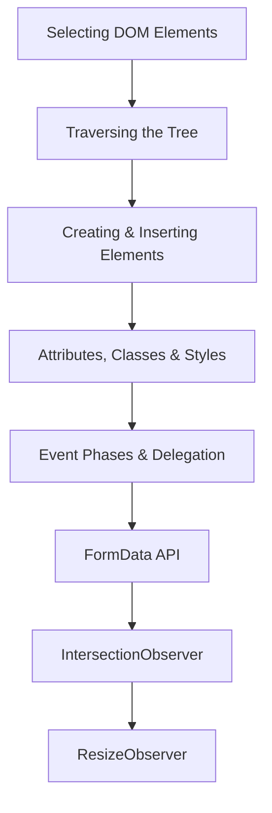

# Chapter 4 — JavaScript and the DOM

> **Previous:** [03-js-basics](./03-js-basics.md) | **Next:** [05-es6-plus](./05-es6-plus.md)

## Learning Objectives

> **One-Sentence Takeaway:** Modern DOM selection uses CSS-selector-based methods like `querySelector` and `querySelectorAll`.

By the end of this chapter, you will be able to:

## Chapter at a Glance

> **One-Sentence Takeaway:** DOM traversal properties allow navigation among parent, child, and sibling nodes.

| Topic | Key Insight | Practical Takeaway |
|-------|-------------|-------------------|
|Selecting Elements|`querySelector` and `querySelectorAll` use CSS selector syntax|Use `closest()` to find the nearest ancestor matching a selector|
|DOM Traversal|Properties like `parentElement`, `children`, and `nextElementSibling` navigate the tree|Chain traversal methods cautiously — check for null at each step|
|Manipulation|`createElement`,`appendChild`,`prepend`,`remove` modify the DOM tree|Use `insertAdjacentHTML` as a safer alternative to `innerHTML`|
|Events|The event lifecycle has capture, target, and bubble phases|Use event delegation to handle many child elements with one listener|
|FormData|Captures form field values and file uploads programmatically|Pass `FormData` directly to `fetch()` — `Content-Type` auto-sets to multipart|
|Observers|`IntersectionObserver` and `ResizeObserver` enable performant reactive behaviors|Use `IntersectionObserver` for lazy loading and `ResizeObserver` for responsive components|

## Chapter Roadmap

> **One-Sentence Takeaway:** Create, insert, remove, and clone elements using modern methods like `prepend()`, `after()`, and `remove()`.




1. Select DOM nodes using modern selector methods (`querySelector`, `querySelectorAll`, `closest`).
2. Traverse the DOM tree among parent, child, and sibling nodes.
3. Create, insert, remove, and clone DOM elements.
4. Manipulate element content, attributes, classes, and inline styles.
5. Handle events using `addEventListener`, understand event phases (capture, target, bubble), implement event delegation, and create custom events.
6. Use `FormData`, `IntersectionObserver`, and `ResizeObserver` for modern DOM interactions.

## Theory

> **One-Sentence Takeaway:** Events propagate through capture, target, and bubble phases — delegation exploits bubbling for efficiency.


### 4.1 Selecting Elements

Modern DOM selection uses CSS-selector-based methods:

```javascript
const root = document.querySelector('#root');           // First matching element
const items = document.querySelectorAll('.item');        // Static NodeList
const form = document.querySelector('form[data-type]');
const parent = element.closest('.container');            // Nearest ancestor matching selector
```

Legacy methods (still widely supported):

```javascript
document.getElementById('app');
document.getElementsByClassName('item');
document.getElementsByTagName('div');
```

`querySelectorAll` returns a **static NodeList**. For a **live** collection, use:

```javascript
const liveItems = document.getElementsByClassName('item');
```

### 4.2 Traversal

```javascript
const el = document.querySelector('.target');

// Children
el.children;                    // HTMLCollection (elements only)
el.childNodes;                  // NodeList (including text/comment nodes)
el.firstElementChild;           // First child element
el.lastElementChild;            // Last child element

// Parent
el.parentElement;               // Parent element node
el.closest('.container');       // Nearest ancestor matching selector

// Siblings
el.previousElementSibling;
el.nextElementSibling;

// Check
el.contains(otherEl);           // Is otherEl a descendant?
el.matches('.active');          // Does el match selector?
```

### 4.3 Manipulation

**Creating and inserting elements:**

```javascript
const div = document.createElement('div');
div.textContent = 'Hello, World!';
div.className = 'greeting';
div.dataset.index = '1';

// Insertion methods
parent.appendChild(div);                    // Appends at end
parent.prepend(div);                        // Inserts at beginning
parent.insertBefore(div, referenceChild);   // Before reference child
reference.after(div);                       // Inserts after reference
reference.before(div);                      // Inserts before reference

// HTML injection (use with caution — XSS risk)
element.innerHTML = '<strong>Bold text</strong>';

// Safer alternative
element.insertAdjacentHTML('beforeend', '<strong>Bold text</strong>');
// Positions: 'beforebegin', 'afterbegin', 'beforeend', 'afterend'
```

**Removing elements:**

```javascript
element.remove();          // Removes from DOM (modern)
parent.removeChild(child); // Traditional method
```

**Attributes and properties:**

```javascript
const input = document.querySelector('input');

// Standard attributes
input.id = 'email-field';
input.type = 'email';
input.value = 'alice@example.com';

// Data attributes
input.dataset.validation = 'required';          // data-validation="required"
console.log(input.dataset.validation);           // 'required'

// ARIA attributes
input.setAttribute('aria-label', 'Email address');
input.getAttribute('aria-label');                // 'Email address'
input.removeAttribute('disabled');

// Class manipulation
div.classList.add('active', 'highlighted');
div.classList.remove('hidden');
div.classList.toggle('expanded');
div.classList.replace('old', 'new');
div.classList.contains('active');               // true/false
```

**Style manipulation:**

```javascript
element.style.color = '#3b82f6';
element.style.backgroundColor = '#f0f0f0';
element.style.setProperty('--custom-var', 'value');
const existing = element.style.getPropertyValue('--custom-var');

// For computed styles
const computed = getComputedStyle(element);
console.log(computed.fontSize);
```

### 4.4 Events

**addEventListener:**

```javascript
element.addEventListener('click', handler, options);

function handler(event) {
  console.log(event.type);       // 'click'
  console.log(event.target);     // Element that triggered the event
  console.log(event.currentTarget); // Element the listener is attached to
  event.preventDefault();        // Cancel default behavior
  event.stopPropagation();       // Stop further propagation
  // event.stopImmediatePropagation(); // Also prevents other listeners on same element
}

// Options object
element.addEventListener('click', handler, {
  capture: false,    // Run during capture phase?
  once: true,        // Auto-remove after first invocation
  passive: true,     // Indicates preventDefault will not be called (scroll optimization)
});
```

**Event phases:**

When a DOM event fires, it travels in three phases:

1. **Capture phase** — Event travels from `document` down to the target element.
2. **Target phase** — Event reaches the target element.
3. **Bubble phase** — Event travels from target back up to `document`.

```javascript
document.addEventListener('click', () => console.log('capture: document'), true);
parent.addEventListener('click', () => console.log('capture: parent'), true);
child.addEventListener('click', () => console.log('bubble: child'), false); // default
parent.addEventListener('click', () => console.log('bubble: parent'), false);
document.addEventListener('click', () => console.log('bubble: document'), false);

// Click on child outputs:
// capture: document
// capture: parent
// bubble: child
// bubble: parent
// bubble: document
```

**Event delegation** exploits bubbling: attach a single listener to a parent to handle events from many children.

```javascript
document.querySelector('table').addEventListener('click', (event) => {
  const row = event.target.closest('tr');
  if (!row) return;

  const action = row.dataset.action;
  switch (action) {
    case 'edit':
      editRecord(row.dataset.id);
      break;
    case 'delete':
      deleteRecord(row.dataset.id);
      break;
  }
});
```

**Custom events:**

```javascript
// Create
const event = new CustomEvent('userLogin', {
  detail: { userId: 123, username: 'alice' },
  bubbles: true,
  cancelable: true,
});

// Dispatch
document.dispatchEvent(event);

// Listen
document.addEventListener('userLogin', (e) => {
  console.log(`User logged in: ${e.detail.username}`);
});
```

### 4.5 FormData

The `FormData` API captures form data programmatically:

```javascript
const form = document.querySelector('#registration-form');

form.addEventListener('submit', (event) => {
  event.preventDefault();

  const data = new FormData(form);

  // Iterate entries
  for (const [name, value] of data) {
    console.log(name, value);
  }

  // Get single value
  const email = data.get('email');

  // Get all values for a key (checkboxes, multi-select)
  const roles = data.getAll('role');

  // Check if key exists
  const hasAvatar = data.has('avatar');

  // Append additional data
  data.append('submitted_at', new Date().toISOString());

  // Send as multipart/form-data
  fetch('/api/users', {
    method: 'POST',
    body: data, // Content-Type automatically set
  });
});
```

### 4.6 IntersectionObserver

`IntersectionObserver` asynchronously observes visibility changes of elements relative to a parent or the viewport — essential for lazy loading, infinite scroll, and animation triggers.

```javascript
const observer = new IntersectionObserver(
  (entries) => {
    for (const entry of entries) {
      if (entry.isIntersecting) {
        const img = entry.target;
        img.src = img.dataset.src;   // Lazy load
        img.classList.add('loaded');
        observer.unobserve(img);     // Stop observing
      }
    }
  },
  {
    root: null,              // Viewport (default)
    rootMargin: '200px',     // Trigger 200px before element enters viewport
    threshold: 0.1,          // Trigger when 10% visible
  }
);

document.querySelectorAll('img[data-src]').forEach((img) => observer.observe(img));
```

### 4.7 MutationObserver

`MutationObserver` watches for DOM changes — useful for detecting when content is dynamically added.

```javascript
const observer = new MutationObserver((mutations) => {
  for (const mutation of mutations) {
    if (mutation.type === 'childList') {
      mutation.addedNodes.forEach((node) => {
        if (node.nodeType === Node.ELEMENT_NODE) {
          console.log('Element added:', node);
          // Apply behavior to dynamically added elements
          if (node.matches('[data-lazy]')) {
            loadLazyContent(node);
          }
        }
      });
    }

    if (mutation.type === 'attributes') {
      console.log(`Attribute ${mutation.attributeName} changed`);
    }

    if (mutation.type === 'characterData') {
      console.log('Text content changed');
    }
  }
});

observer.observe(document.getElementById('comments-section'), {
  childList: true,      // Watch for added/removed children
  subtree: true,        // Watch entire subtree
  attributes: false,    // Watch attribute changes
  characterData: false, // Watch text changes
});

// Disconnect when done
// observer.disconnect();
```

### 4.8 Custom Element Lifecycle

Custom elements (Web Components) provide lifecycle callbacks.

```javascript
class TooltipElement extends HTMLElement {
  constructor() {
    super();
    this.attachShadow({ mode: 'open' });
    this._tooltipVisible = false;
    this._tooltipText = 'Default tooltip text';
  }

  // Called when element is added to DOM
  connectedCallback() {
    this._tooltipText = this.getAttribute('text') || this._tooltipText;
    this.render();
    this.addEventListener('mouseenter', this._showTooltip.bind(this));
    this.addEventListener('mouseleave', this._hideTooltip.bind(this));
  }

  // Called when element is removed from DOM
  disconnectedCallback() {
    this.removeEventListener('mouseenter', this._showTooltip);
    this.removeEventListener('mouseleave', this._hideTooltip);
  }

  // Called when observed attributes change
  attributeChangedCallback(name, oldValue, newValue) {
    if (name === 'text') {
      this._tooltipText = newValue;
      this.render();
    }
  }

  static get observedAttributes() {
    return ['text'];
  }

  _showTooltip() { this._tooltipVisible = true; this.render(); }
  _hideTooltip() { this._tooltipVisible = false; this.render(); }

  render() {
    this.shadowRoot.innerHTML = `
      <style>
        .tooltip { position: relative; display: inline-block; }
        .tooltip-text {
          visibility: ${this._tooltipVisible ? 'visible' : 'hidden'};
          background: #333; color: #fff; padding: 4px 8px;
          border-radius: 4px; position: absolute; bottom: 100%;
        }
      </style>
      <div class="tooltip">
        <slot></slot>
        <div class="tooltip-text">${this._tooltipText}</div>
      </div>
    `;
  }
}

customElements.define('my-tooltip', TooltipElement);
```

Usage in HTML:
```html
<my-tooltip text="Click to save your changes">
  <button>Save</button>
</my-tooltip>
```

### 4.9 ResizeObserver

```javascript
const resizeObserver = new ResizeObserver((entries) => {
  for (const entry of entries) {
    const { width, height } = entry.contentBoxSize[0];
    console.log(`Element is now ${width}px × ${height}px`);

    // Adjust layout or behavior based on size
    entry.target.classList.toggle('compact', width < 400);
  }
});

resizeObserver.observe(document.querySelector('.responsive-panel'));
```


> [!TIP]
> Use `event delegation` for dynamic lists: attach one listener to a parent and use `event.target.closest()` to identify the affected child.

> [!WARNING]
> `innerHTML` poses an XSS risk. Use `textContent` for text and `insertAdjacentHTML` when you must insert HTML from trusted sources.

> [!REMEMBER]
> `querySelectorAll` returns a static NodeList — changes to the DOM after selection are not reflected. Use `getElementsByClassName` for a live collection.


## Concept Comparison Table

| Concept | Description | Use Case |
|---------|-------------|---------|
|`querySelectorAll` vs `getElementsByClassName`|Static NodeList (snapshot)|Live HTMLCollection (updates)|
|`appendChild` vs `append`|Accepts one node, returns it|Accepts multiple nodes/strings, returns undefined|
|`innerHTML` vs `insertAdjacentHTML`|Replaces all child content|Inserts at a specified position|
|`event.target` vs `event.currentTarget`|Element that triggered the event|Element the listener is attached to|
|`IntersectionObserver` vs `ResizeObserver`|Detects visibility changes|Detects dimension changes|

## Quick Reference

| Topic | Key Points |
|-------|-----------|
|Selection|`document.querySelector()`,`document.querySelectorAll()`,`element.closest()`|
|Traversal|`parentElement`,`children`,`firstElementChild`,`lastElementChild`,`nextElementSibling`,`previousElementSibling`|
|Manipulation|`createElement()`,`appendChild()`,`prepend()`,`after()`,`before()`,`remove()`|
|Classes|`classList.add()`,`classList.remove()`,`classList.toggle()`,`classList.replace()`,`classList.contains()`|
|Events|`addEventListener(event, handler, options)`,`event.preventDefault()`,`event.stopPropagation()`|

## Cross-Application Matrix

| Domain | Application | Benefit |
|--------|------------|--------|
|Image Gallery|IntersectionObserver for lazy loading|Faster initial page load, saved bandwidth|
|Data Table|Event delegation for row actions|Single listener handles all rows|
|Drag-and-Drop|Drag and Drop API with dataTransfer|Intuitive file and item reordering|
|Form Submission|FormData + fetch API|Simplified multipart form handling|
|Responsive Components|ResizeObserver for breakpoint-specific UI|Element-level responsive design|

## Chapter Quiz

Test your understanding with these quick questions.

**Q1. What is the key advantage of event delegation?**

- A) It runs in the capture phase
- B) A single listener handles events from many child elements
- C) It prevents event bubbling
- D) It works only for click events

<details><summary>Answer</summary>

**B) Event delegation uses a single parent listener to handle events from current and future child elements via bubbling.**

</details>

**Q2. Which method safely inserts HTML without replacing existing content?**

- A) `innerHTML`
- B) `textContent`
- C) `insertAdjacentHTML`
- D) `outerHTML`

<details><summary>Answer</summary>

**C) `insertAdjacentHTML` inserts HTML at a specified position without disturbing existing child nodes.**

</details>

**Q3. What does the `passive: true` option on `addEventListener` indicate?**

- A) The listener runs only once
- B) The listener will not call `preventDefault()`
- C) The listener runs in the capture phase
- D) The listener is debounced

<details><summary>Answer</summary>

**B) `passive: true` is a performance optimization that tells the browser `preventDefault()` will never be called, enabling smoother scrolling.**

</details>

**Q4. How do you stop an event from traveling up the DOM tree?**

- A) `event.preventDefault()`
- B) `event.stopPropagation()`
- C) `event.stopImmediatePropagation()`
- D) Both B and C

<details><summary>Answer</summary>

**D) Both B and C stop propagation; `stopImmediatePropagation()` also prevents other listeners on the same element from firing.**

</details>

### TypeScript: DOM Tree Analyzer & Event Delegation Helper

```typescript
class DOMTreeAnalyzer {
  static countTags(html: string): Record<string, number> {
    const counts: Record<string, number> = {};
    const re = /<(\w+)[^>]*>/g;
    let m: RegExpExecArray | null;
    while ((m = re.exec(html)) !== null) {
      const t = m[1].toLowerCase();
      counts[t] = (counts[t] || 0) + 1;
    }
    return counts;
  }
  static findDepth(html: string): number {
    let depth = 0, max = 0;
    const selfClosing = new Set(["br", "hr", "img", "input", "meta", "link"]);
    const re = /<\/?(\w+)[^>]*>/g;
    let m: RegExpExecArray | null;
    while ((m = re.exec(html)) !== null) {
      if (m[0][1] === "/") depth--;
      else if (!selfClosing.has(m[1].toLowerCase())) max = Math.max(max, ++depth);
    }
    return max;
  }
}

class EventDelegator {
  static selector(eventType: string, selector: string, handler: string): string {
    return `document.addEventListener("${eventType}", (e) => {
  const target = e.target.closest("${selector}");
  if (target) { ${handler} }
});`;
  }
  static throttle<T extends (...args: any[]) => void>(fn: T, ms: number): T {
    let last = 0;
    return ((...args: any[]) => {
      const now = Date.now();
      if (now - last >= ms) { last = now; fn(...args); }
    }) as T;
  }
}

class FormDataSimulator {
  static serialize(form: Record<string, string>): string {
    return Object.entries(form).map(([k, v]) => `${encodeURIComponent(k)}=${encodeURIComponent(v)}`).join("&");
  }
}

console.log("Tags:", DOMTreeAnalyzer.countTags("<div><p><span>Hi</span></p></div>"));
console.log("Depth:", DOMTreeAnalyzer.findDepth("<div><section><article><p>Deep</p></article></section></div>"));
console.log("Throttled:", EventDelegator.throttle(() => console.log("ok"), 1000).toString().slice(0, 50) + "...");
```

## Summary

> **One-Sentence Takeaway:** `FormData` provides a convenient interface for capturing form data including file uploads.

- Use `querySelector` and `querySelectorAll` for CSS-selector-based element selection.
- DOM manipulation involves creating elements, inserting them, modifying attributes/classes/styles, and removing them.
- Events propagate in capture-target-bubble phases; delegation leverages bubbling for efficient listener management.
- `FormData` provides a convenient interface for capturing and submitting form data, including file uploads.
- `IntersectionObserver` enables performant visibility-based features like lazy loading and infinite scroll.
- `ResizeObserver` allows responsive components to react to dimension changes at the element level.

## Exercises

> **One-Sentence Takeaway:** `IntersectionObserver` and `ResizeObserver` enable performant visibility and dimension-based behaviors.

### Review Questions

1. How does `querySelectorAll` differ from `getElementsByClassName` in terms of return value liveness?
2. What is the purpose of the `passive` option in `addEventListener`?
3. Why is `innerHTML` dangerous for inserting user-generated content?
4. What is the difference between `event.target` and `event.currentTarget`?

### Application Problems

5. Implement a tab panel component using event delegation. A single click listener on the tablist should handle switching between panels based on the `aria-controls` attribute.
6. Build an image gallery that uses `IntersectionObserver` to lazy-load images as the user scrolls, with a 100px rootMargin.
7. Create a form with `FormData` that collects a user's name, email, profile picture (file), and selected interests (checkboxes). Log the complete `FormData` on submit.

### Application Problems

8. Build a custom `<my-avatar>` Web Component that displays a user avatar with initials fallback. It should accept `src`, `name`, and `size` attributes and render initials (first letter of name) as a fallback when the image fails to load.

### Challenge Problem

9. Implement a fully accessible custom dropdown select (replacing `<select>`) using ARIA roles

### Practical Takeaways

1. **Use event delegation for dynamic content** — attach one listener to a parent and use `event.target.closest()` to handle events from elements added after initial render.
2. **Prefer `textContent` over `innerHTML`** — `textContent` is safe from XSS and faster because it does not parse HTML. Use `insertAdjacentHTML` when you must insert safe HTML.
3. **Use `IntersectionObserver` for lazy loading** — it is more performant than scroll event listeners because it is browser-native and does not block the main thread.
4. **Passive event listeners improve scroll performance** — add `{ passive: true }` to scroll and touch event listeners when you do not need `preventDefault()`.
5. **Custom Elements encapsulate reusable behavior** — use Shadow DOM for style isolation and lifecycle callbacks for setup/cleanup. (`listbox`, `option`), keyboard navigation (arrow keys, Enter, Escape), and `ResizeObserver` to ensure the dropdown panel stays within the viewport. The component must:
   - Expand and collapse on click and Enter/Space
   - Navigate options with arrow keys (circular wrapping)
   - Set `aria-selected` on the active option
   - Announce selection changes to screen readers using `aria-live`
   - Close on Escape and click outside
   - Recalculate dropdown direction (above or below) when viewport changes using `ResizeObserver`
