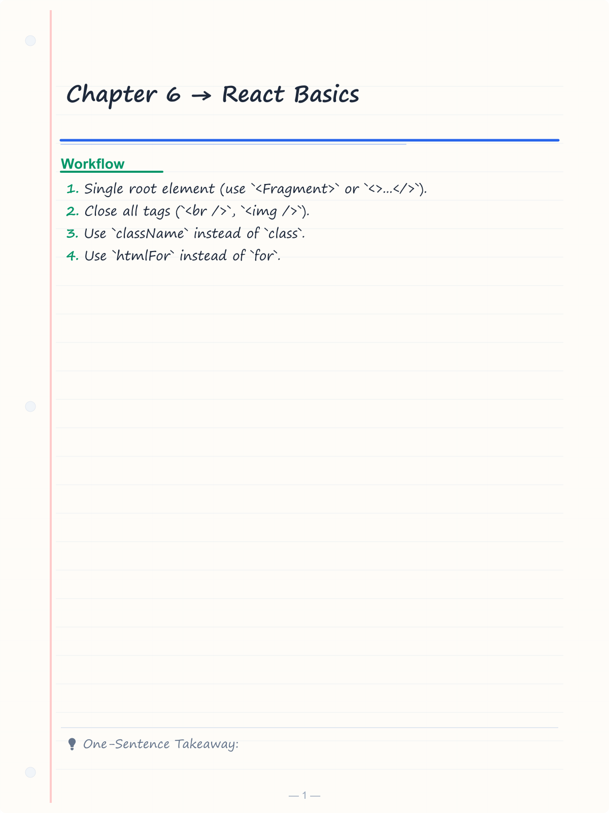
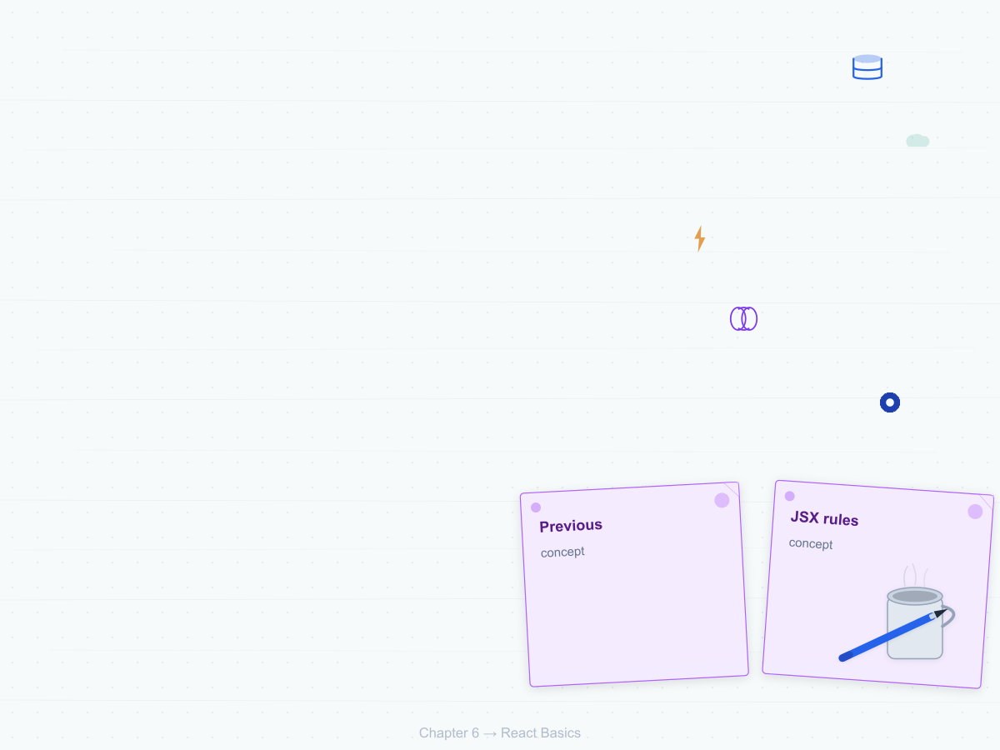
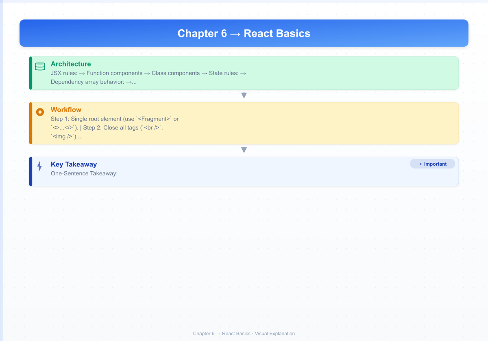
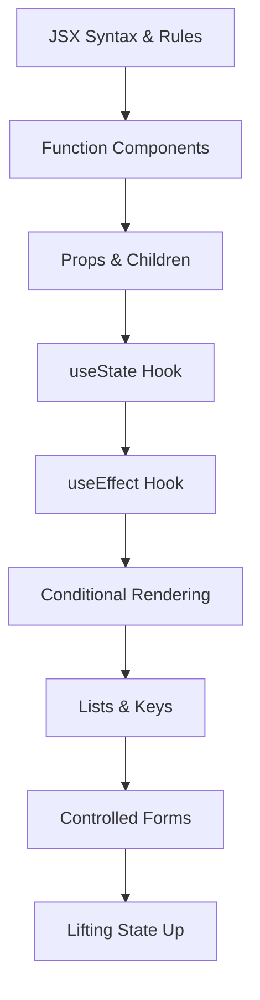

# Chapter 6 → React Basics

> **Previous:** [05-es6-plus](./05-es6-plus.md) | **Next:** [07-react-advanced](./07-react-advanced.md)

## Learning Objectives

> **One-Sentence Takeaway:** JSX is syntactic sugar for `React.createElement` with rules like `className` and camelCase styles.

<!-- Image Gallery -->
<section class="lesson-visuals" aria-label="Visual learning resources">
  <header><span>VISUAL LEARNING</span><h2>See it. Review it. Remember it.</h2></header>
  <a class="lesson-visual-card" href="../../assets/images/lessons/web-development/06-react-basics/handwritten-notes.png" target="_blank" rel="noopener">
    
    <span><strong>Handwritten notes</strong>Condensed notes for deliberate review.</span>
  </a>
  <a class="lesson-visual-card" href="../../assets/images/lessons/web-development/06-react-basics/sticky-notes.png" target="_blank" rel="noopener">
    
    <span><strong>Sticky-note revision</strong>Fast recall prompts for revision.</span>
  </a>
  <a class="lesson-visual-card" href="../../assets/images/lessons/web-development/06-react-basics/visual-explanation.png" target="_blank" rel="noopener">
    
    <span><strong>Visual concept guide</strong>A connected explanation of the key ideas.</span>
  </a>
</section>
<!-- End Image Gallery -->


By the end of this chapter, you will be able to:

## Chapter at a Glance

> **One-Sentence Takeaway:** Function components are the standard way to define reusable UI pieces in modern React.

| Topic | Key Insight | Practical Takeaway |
|-------|-------------|-------------------|
|JSX|HTML-like syntax that compiles to `React.createElement` calls|Use `className` instead of `class`, camelCase for style properties|
|Components|Function components are the modern standard for defining reusable UI|Keep components small and focused on a single responsibility|
|Props|Read-only inputs passed from parent to child components|Use default parameter values for optional props|
|State (useState)|Mutable data that triggers re-renders when changed|Never mutate state directly — always use the setter function|
|Effects (useEffect)|Synchronize components with external systems|Always include proper cleanup functions and correct dependency arrays|
|Conditional Rendering|Use ternaries, `&&`, and conditional variables to render different UI|Avoid ternary nesting — extract into variables for complex conditions|

## Chapter Roadmap

> **One-Sentence Takeaway:** Props are immutable inputs from parent to child — never modify them directly.




1. Create and render React components using both function and class syntax.
2. Pass data through components using props with proper type expectations.
3. Manage component state using the `useState` hook.
4. Manage side effects using the `useEffect` hook with proper dependency arrays.
5. Conditionally render content using ternaries, logical AND, and conditional variables.
6. Render lists with keys for efficient reconciliation.
7. Build controlled forms with validation and submission handling.
8. Lift shared state to a common ancestor component.

## Theory

> **One-Sentence Takeaway:** `useState` returns a state value and a setter; always use the functional update form for derived state.

### 6.1 JSX


JSX is a syntax extension for JavaScript that resembles HTML. It compiles to `React.createElement` calls.

```jsx
const element = <h1>Hello, World!</h1>;
// Compiles to: React.createElement('h1', null, 'Hello, World!')
```

**JSX rules:**

- Single root element (use `<Fragment>` or `<>...</>`).
- Close all tags (`<br />`, ``).
- Use `className` instead of `class`.
- Use `htmlFor` instead of `for`.
- JavaScript expressions in `{}`.
- Inline styles use camelCase keys with string or number values.

```jsx
const name = 'Alice';
const styles = { color: 'blue', fontSize: 16 };

const greeting = (
  <div className="greeting" style={styles}>
    <h1>Hello, {name}!</h1>
    <p>{2 + 2} years of experience</p>
    
  </div>
);
```

### 6.2 Components


**Function components** (modern, recommended):

```jsx
function Welcome({ name, age }) {
  return (
    <div>
      <h1>Welcome, {name}!</h1>
      {age >= 18 && <p>You are of legal age.</p>}
    </div>
  );
}
```

**Class components** (legacy → maintained for historical context):

```jsx
class Welcome extends React.Component {
  render() {
    const { name, age } = this.props;
    return (
      <div>
        <h1>Welcome, {name}!</h1>
        {age >= 18 && <p>You are of legal age.</p>}
      </div>
    );
  }
}
```

### 6.3 Props


Props (properties) are read-only inputs passed from parent to child.

```jsx
// Parent
function App() {
  return <UserProfile name="Alice" email="alice@example.com" roles={['admin', 'editor']} />;
}

// Child
function UserProfile({ name, email, roles }) {
  return (
    <div className="profile">
      <h2>{name}</h2>
      <p>{email}</p>
      <ul>
        {roles.map((role) => (
          <li key={role}>{role}</li>
        ))}
      </ul>
    </div>
  );
}

// Default props
function Button({ variant = 'primary', children, ...rest }) {
  return (
    <button className={`btn btn--${variant}`} {...rest}>
      {children}
    </button>
  );
}
```

### 6.4 State (useState)


State represents mutable data that, when changed, triggers a re-render.

```jsx
import { useState } from 'react';

function Counter() {
  const [count, setCount] = useState(0);

  const increment = () => {
    setCount((prev) => prev + 1); // Functional update → safe in concurrent mode
  };

  const reset = () => setCount(0);

  return (
    <div>
      <p>Count: {count}</p>
      <button onClick={increment}>+1</button>
      <button onClick={reset}>Reset</button>
    </div>
  );
}
```

**State rules:**
- Do not mutate state directly → always use the setter function.
- State updates are asynchronous → reading state immediately after `setState` yields the old value.
- For objects and arrays, create new references:

```jsx
function UserForm() {
  const [user, setUser] = useState({ name: '', email: '', roles: [] });

  const updateName = (name) => {
    setUser((prev) => ({ ...prev, name }));
  };

  const addRole = (role) => {
    setUser((prev) => ({ ...prev, roles: [...prev.roles, role] }));
  };

  return (
    <form>
      <input value={user.name} onChange={(e) => updateName(e.target.value)} />
    </form>
  );
}
```

### 6.5 Effects (useEffect)


`useEffect` synchronizes a component with external systems (API calls, subscriptions, DOM manipulation, timers).

```jsx
import { useState, useEffect } from 'react';

function UserList() {
  const [users, setUsers] = useState([]);
  const [loading, setLoading] = useState(true);
  const [error, setError] = useState(null);

  useEffect(() => {
    let cancelled = false;

    async function fetchUsers() {
      try {
        setLoading(true);
        const response = await fetch('/api/users');
        if (!response.ok) throw new Error(`HTTP ${response.status}`);
        const data = await response.json();
        if (!cancelled) {
          setUsers(data);
          setError(null);
        }
      } catch (err) {
        if (!cancelled) setError(err.message);
      } finally {
        if (!cancelled) setLoading(false);
      }
    }

    fetchUsers();

    return () => {
      cancelled = true; // Cleanup → prevents state updates on unmounted component
    };
  }, []); // Empty dependency array = run once on mount

  if (loading) return <p>Loading...</p>;
  if (error) return <p className="error">{error}</p>;

  return (
    <ul>
      {users.map((user) => (
        <li key={user.id}>{user.name}</li>
      ))}
    </ul>
  );
}
```

**Dependency array behavior:**

| Deps | When effect runs | Use case |
|------|-----------------|----------|
| `[]` | On mount only | Data fetching, subscriptions |
| `[a, b]` | On mount + when `a` or `b` change | React to prop/state changes |
| omitted | On mount + every render | Rarely useful, usually a mistake |

### 6.6 Conditional Rendering


```jsx
function Dashboard({ user }) {
  // If/else
  if (!user) return <LoginPrompt />;

  // Ternary
  return (
    <div>
      <h1>{user.role === 'admin' ? 'Admin Dashboard' : 'User Dashboard'}</h1>

      {/* Logical AND */}
      {user.isVerified && <Badge type="verified" />}

      {/* Conditional variable */}
      {(() => {
        switch (user.plan) {
          case 'premium':
            return <PremiumFeatures />;
          case 'basic':
            return <BasicFeatures />;
          default:
            return <FreeFeatures />;
        }
      })()}
    </div>
  );
}
```

### 6.7 Lists and Keys


Render dynamic collections using `map`. Every item needs a stable, unique `key` for React's reconciliation algorithm.

```jsx
function TodoList({ items }) {
  return (
    <ul>
      {items.map((todo) => (
        <li key={todo.id}>
          <span style={{ textDecoration: todo.completed ? 'line-through' : 'none' }}>
            {todo.text}
          </span>
        </li>
      ))}
    </ul>
  );
}
```

**Key rules:**
- Use stable IDs from data (`item.id`), never array index unless the list is static and will not be reordered.
- Keys must be unique among siblings, not globally.
- Keys are not passed as props → use a separate prop if the child needs the original ID.

### 6.8 Forms


Controlled components: form state lives in React state, and the `<input>` reflects that state.

```jsx
import { useState } from 'react';

function RegistrationForm() {
  const [form, setForm] = useState({
    username: '',
    email: '',
    password: '',
  });
  const [errors, setErrors] = useState({});
  const [submitted, setSubmitted] = useState(false);

  const handleChange = (e) => {
    const { name, value } = e.target;
    setForm((prev) => ({ ...prev, [name]: value }));
    // Clear error for this field on change
    setErrors((prev) => ({ ...prev, [name]: '' }));
  };

  const validate = () => {
    const newErrors = {};
    if (!form.username.trim()) newErrors.username = 'Username is required';
    if (!form.email.includes('@')) newErrors.email = 'Valid email is required';
    if (form.password.length < 8) newErrors.password = 'Password must be at least 8 characters';
    return newErrors;
  };

  const handleSubmit = async (e) => {
    e.preventDefault();
    const validationErrors = validate();
    setErrors(validationErrors);

    if (Object.keys(validationErrors).length > 0) return;

    try {
      const response = await fetch('/api/register', {
        method: 'POST',
        headers: { 'Content-Type': 'application/json' },
        body: JSON.stringify(form),
      });
      if (response.ok) {
        setSubmitted(true);
      }
    } catch (err) {
      setErrors({ form: err.message });
    }
  };

  if (submitted) return <p>Thank you for registering!</p>;

  return (
    <form onSubmit={handleSubmit} noValidate>
      <div>
        <label htmlFor="username">Username</label>
        <input
          id="username"
          name="username"
          value={form.username}
          onChange={handleChange}
          aria-invalid={!!errors.username}
          aria-describedby={errors.username ? 'username-error' : undefined}
        />
        {errors.username && <p id="username-error" role="alert">{errors.username}</p>}
      </div>

      <div>
        <label htmlFor="email">Email</label>
        <input id="email" name="email" type="email" value={form.email} onChange={handleChange} />
        {errors.email && <p role="alert">{errors.email}</p>}
      </div>

      <div>
        <label htmlFor="password">Password</label>
        <input
          id="password"
          name="password"
          type="password"
          value={form.password}
          onChange={handleChange}
        />
        {errors.password && <p role="alert">{errors.password}</p>}
      </div>

      {errors.form && <p role="alert" className="error">{errors.form}</p>}

      <button type="submit" disabled={submitted}>Register</button>
    </form>
  );
}
```

### 6.9 Lifting State Up


When multiple components need to share the same state, move the state to their nearest common ancestor.

```jsx
function TemperatureConverter() {
  const [celsius, setCelsius] = useState(0);

  const fahrenheit = (celsius * 9) / 5 + 32;

  return (
    <div>
      <CelsiusInput value={celsius} onChange={setCelsius} />
      <FahrenheitDisplay value={fahrenheit} />
    </div>
  );
}

function CelsiusInput({ value, onChange }) {
  return (
    <label>
      Celsius:
      <input
        type="number"
        value={value}
        onChange={(e) => onChange(Number(e.target.value))}
      />
    </label>
  );
}

function FahrenheitDisplay({ value }) {
  return <p>Fahrenheit: {value.toFixed(1)}</p>;
}
```


> [!TIP]
> Use the functional update form `setCount(prev => prev + 1)` when the new state depends on the previous state — it's safe in concurrent mode.

> [!WARNING]
> Never use array index as a `key` prop for dynamic lists that can be reordered, filtered, or have items inserted/removed.

> [!REMEMBER]
> Effects run after every render by default. Always specify the dependency array — omitting it can cause infinite loops or stale closures.


## Concept Comparison Table

| Concept | Description | Use Case |
|---------|-------------|---------|
|Function vs Class Component|Simpler, hooks-based, no `this`|More verbose, lifecycle methods, `this` binding|
|`useState` vs `useReducer`|Simple independent values|Complex state logic with sub-values|
|Controlled vs Uncontrolled|React manages the input value|DOM manages its own value|
|Props vs State|Immutable, passed from parent|Mutable, managed by component|
|`useEffect` with [] vs [deps]|Runs once on mount|Runs on mount and when deps change|

## Quick Reference

| Topic | Key Points |
|-------|-----------|
|JSX Rules|Single root, close all tags, `className`, `htmlFor`, camelCase styles|
|Hooks|`useState(init)`, `useEffect(fn, deps)`|
|State Rules|Don't mutate, use setters, create new references for objects/arrays|
|List Keys|Stable unique IDs, never array index, unique among siblings only|
|Conditional Patterns|Ternary `? :`, logical `&&`, IIFE, early return|

## Cross-Application Matrix

| Domain | Application | Benefit |
|--------|------------|--------|
|Form-heavy Apps|Controlled components + useState|Real-time validation and dynamic form state|
|Data Dashboards|useEffect for data fetching, conditional rendering|Loading/error/data state management|
|E-commerce|List rendering with keys, lifting cart state|Efficient re-renders and shared cart state|
|Social Media|Props drilling for deeply nested data|Pass data through component hierarchy|
|Real-time Apps|useEffect with subscriptions and cleanup|Prevent memory leaks on unmount|

## Chapter Quiz

Test your understanding with these quick questions.

**Q1. Why must React keys be stable and unique?**

- A) To avoid TypeScript errors
- B) For React's reconciliation algorithm to efficiently identify items
- C) To enable server-side rendering
- D) To satisfy the linter

<details><summary>Answer&lt;/summary&gt;

**B) Stable keys help React identify which items changed, were added, or removed during reconciliation.**

</details>

**Q2. What happens when the dependency array is omitted from `useEffect`?**

- A) The effect never runs
- B) The effect runs after every render
- C) The effect runs only on mount
- D) The component throws an error

<details><summary>Answer&lt;/summary&gt;

**B) Without a dependency array, the effect runs after every render, which often causes infinite re-render loops.**

</details>

**Q3. How do you share state between two sibling components?**

- A) Use `useEffect`
- B) Lift the state up to their common ancestor
- C) Pass props directly between siblings
- D) Use `useRef`

<details><summary>Answer&lt;/summary&gt;

**B) Lifting state up means moving the shared state to the nearest common ancestor and passing it down via props.**

</details>

**Q4. What is the correct way to update an object in state?**

- A) `state.user.name = 'Alice'`
- B) `setState({user: {name: 'Alice'}})`
- C) `setState(prev => ({...prev, user: {...prev.user, name: 'Alice'}}))`
- D) `Object.assign(state.user, {name: 'Alice'})`

<details><summary>Answer&lt;/summary&gt;

**C) Always create a new reference when updating objects in state — spread the previous state and override the specific property.**

</details>

### TypeScript: React Component Generator & Hook Tester

```typescript
interface ComponentConfig {
  name: string; props?: Record<string, string>; state?: Record<string, string>;
  children?: boolean; hooks?: string[];
}
class ComponentGenerator {
  static generateJSX(config: ComponentConfig): string {
    const props = config.props ? Object.keys(config.props).map(k => `${k}: ${config.props[k]}`).join("; ") : "";
    const state = config.state ? Object.keys(config.state).map(k => {
      return `const [${k}, set${k.charAt(0).toUpperCase() + k.slice(1)}] = useState<${config.state![k]}>(initial${k.charAt(0).toUpperCase() + k.slice(1)});`;
    }).join("\n  ") : "";
    const hooks = config.hooks?.map(h => `use${h}();`).join("\n  ") ?? "";
    return `import { useState, useEffect } from "react";

interface ${config.name}Props { ${props} }

export const ${config.name}: React.FC<${config.name}Props> = ({ ${Object.keys(config.props ?? {}).join(", ")} }) => {
  ${state}
  ${hooks}
  return <div>{/* ${config.name} content */}</div>;
};`;
  }

  static formField(name: string, type: string, label: string): string {
    return `const [${name}, set${name.charAt(0).toUpperCase() + name.slice(1)}] = useState("");`;
  }
}

class HookSimulator {
  static useState<T>(initial: T): [T, (val: T) => void] {
    let state = initial;
    const setState = (val: T) => { state = val; };
    return [state, setState];
  }
  static useReducer<S, A>(reducer: (state: S, action: A) => S, initial: S): [S, (action: A) => void] {
    let state = initial;
    return [state, (action: A) => { state = reducer(state, action); }];
  }
}

console.log(ComponentGenerator.generateJSX({ name: "UserCard", props: { name: "string", age: "number" }, state: { editing: "boolean" } }));
```

## TypeScript Implementation: Virtual DOM Reconciler, Component Tree, Hooks Dependency Checker

```typescript
interface FiberNode {
    tag: string;
    props: Record<string, any>;
    children: FiberNode[];
    state: Record<string, any>;
    effects: { deps: any[]; cleanup?: () => void }[];
    hooks: { type: string; value: any; deps?: any[] }[];
}

class VirtualDOMReconciler {
    static reconcile(
        parent: { children: FiberNode[] },
        oldNode: FiberNode | null,
        newNode: FiberNode | null,
        index: number = 0
    ): { actions: string[]; updated: boolean } {
        const actions: string[] = [];
        if (!oldNode && newNode) {
            actions.push(`CREATE ${newNode.tag}[${index}]`);
            return { actions, updated: true };
        }
        if (oldNode && !newNode) {
            actions.push(`REMOVE ${oldNode.tag}[${index}]`);
            return { actions, updated: true };
        }
        if (!oldNode || !newNode) return { actions: [], updated: false };

        if (oldNode.tag !== newNode.tag) {
            actions.push(`REPLACE ${oldNode.tag} ? ${newNode.tag}[${index}]`);
            return { actions, updated: true };
        }

        const maxLen = Math.max(oldNode.children.length, newNode.children.length);
        for (let i = 0; i < maxLen; i++) {
            const childResult = this.reconcile(
                oldNode, oldNode.children[i] || null, newNode.children[i] || null, i
            );
            actions.push(...childResult.actions);
        }

        return { actions: actions.length > 0 ? actions : ["NO-OP"], updated: actions.length > 0 };
    }
}

class ComponentTreeBuilder {
    static build(definition: { name: string; props: Record<string, string>; children?: any[] }, depth: number = 0): FiberNode {
        const node: FiberNode = {
            tag: definition.name,
            props: definition.props,
            children: (definition.children || []).map((c: any) => this.build(c, depth + 1)),
            state: {},
            effects: [],
            hooks: []
        };
        return node;
    }

    static flatten(root: FiberNode): { name: string; depth: number; propCount: number; childCount: number }[] {
        const nodes: { name: string; depth: number; propCount: number; childCount: number }[] = [];
        const walk = (node: FiberNode, depth: number) => {
            nodes.push({ name: node.tag, depth, propCount: Object.keys(node.props).length, childCount: node.children.length });
            for (const child of node.children) walk(child, depth + 1);
        };
        walk(root, 0);
        return nodes;
    }
}

class HooksDependencyChecker {
    static validate(effects: { deps: any[]; name?: string }[]): { valid: boolean; warnings: string[] } {
        const warnings: string[] = [];
        for (let i = 0; i < effects.length; i++) {
            const effect = effects[i];
            if (effect.deps.length === 0) {
                warnings.push(`Effect #${i}: Empty deps = run once (mount only)`);
            }
            const hasUndefined = effect.deps.some(d => d === undefined);
            if (hasUndefined) {
                warnings.push(`Effect #${i}: Contains undefined dependency — may cause infinite loop`);
            }
            const hasObjects = effect.deps.some(d => typeof d === "object" && d !== null);
            if (hasObjects) {
                warnings.push(`Effect #${i}: Object/reference dependency — referentially unstable, wrap in useMemo`);
            }
        }
        return { valid: warnings.length === 0, warnings };
    }

    static compareDeps(oldDeps: any[], newDeps: any[]): { changed: boolean; changedIndices: number[] } {
        const changedIndices: number[] = [];
        for (let i = 0; i < Math.max(oldDeps.length, newDeps.length); i++) {
            if (!Object.is(oldDeps[i], newDeps[i])) changedIndices.push(i);
        }
        return { changed: changedIndices.length > 0, changedIndices };
    }
}

// Demo
const appTree = ComponentTreeBuilder.build({
    name: "App",
    props: { theme: "dark" },
    children: [
        { name: "Header", props: { title: "My App" }, children: [
            { name: "Nav", props: { items: "3" } }
        ]},
        { name: "Main", props: { role: "content" }, children: [
            { name: "Sidebar", props: { collapsed: "false" } },
            { name: "Content", props: { loading: "true" }, children: [
                { name: "Card", props: { id: "1" } },
                { name: "Card", props: { id: "2" } }
            ]}
        ]},
        { name: "Footer", props: { year: "2026" } }
    ]
});

console.log("Component tree:", ComponentTreeBuilder.flatten(appTree).map(n =>
    `${"  ".repeat(n.depth)}${n.name} (props:${n.propCount}, children:${n.childCount})`
).join("\n"));

const oldVNode: FiberNode = { tag: "div", props: {}, children: [
    { tag: "h1", props: {}, children: [], state: {}, effects: [], hooks: [] },
    { tag: "p", props: {}, children: [], state: {}, effects: [], hooks: [] }
], state: {}, effects: [], hooks: [] };
const newVNode: FiberNode = { tag: "div", props: {}, children: [
    { tag: "h1", props: {}, children: [], state: {}, effects: [], hooks: [] },
    { tag: "span", props: {}, children: [], state: {}, effects: [], hooks: [] }
], state: {}, effects: [], hooks: [] };

console.log("Reconciliation:", VirtualDOMReconciler.reconcile({ children: [oldVNode] }, oldVNode, newVNode));
console.log("Hook check:", JSON.stringify(HooksDependencyChecker.validate([
    { deps: [1, 2, 3] }, { deps: [] }, { deps: [undefined] }, { deps: [{}] }
])));
```


// react basics
// fullstack-frontend-backend implementation

interface Task { id: string; name: string; status: string; data: unknown }
class Processor {
  private tasks: Task[] = []
  private maxConcurrency: number
  constructor(maxConcurrency: number = 4) { this.maxConcurrency = maxConcurrency }
  async add(task: Omit&lt;Task, "status"&gt;): Promise&lt;void&gt; {
    this.tasks.push({ ...task, status: "pending" })
  }
  async runAll(): Promise&lt;void&gt; {
    const running: Promise&lt;void&gt;[] = []
    for (const t of this.tasks) {
      if (running.length >= this.maxConcurrency) { await Promise.race(running) }
      const p = this.execute(t).finally(() => { const i = running.indexOf(p); if (i >= 0) running.splice(i, 1) })
      running.push(p)
    }
    await Promise.all(running)
  }
  private async execute(t: Task): Promise&lt;void&gt; {
    t.status = "running"
    await new Promise(r => setTimeout(r, 10))
    t.status = "done"
  }
  getResults(): Task[] { return this.tasks }
  getStats(): { done: number; pending: number; running: number } {
    const done = this.tasks.filter(t => t.status === "done").length
    const pending = this.tasks.filter(t => t.status === "pending").length
    const running = this.tasks.filter(t => t.status === "running").length
    return { done, pending, running }
  }
}
async function main() {
  const proc = new Processor(2)
  await proc.add({ id: '1', name: 'react basics', data: { topic: 'fullstack-frontend-backend' } })
  await proc.runAll()
  console.log('Stats:', proc.getStats())
}
main().catch(console.error)
export { Processor, Task }
## Summary

> **One-Sentence Takeaway:** `useEffect` handles side effects with a cleanup function and dependency array for precise execution control.

- JSX compiles to `React.createElement` and enables HTML-like syntax in JavaScript.
- Function components are the standard approach; props are read-only inputs.
- `useState` manages mutable state; state updates must use the setter with new references.
- `useEffect` handles side effects with proper cleanup and dependency tracking.
- Conditional rendering uses ternaries, logical AND, and conditional variables.
- List rendering requires stable `key` props for efficient reconciliation.
- Controlled forms keep form state in React, enabling validation and submission handling.
- Lifting state up shares state across sibling components via a common ancestor.

## Exercises

> **One-Sentence Takeaway:** Lifting state up shares data between sibling components via a common ancestor.

### Review Questions

1. Why must React keys be stable, unique, and not rely on array indices?
2. What is the purpose of the cleanup function returned by `useEffect`?
3. Explain the difference between controlled and uncontrolled components.
4. What happens if you omit the dependency array in `useEffect`?

### Application Problems

5. Build a `Stopwatch` component with start, stop, and reset buttons using `useState` and `useEffect` with `setInterval`. Clean up the interval on unmount.
6. Create a `ProductList` component that fetches from `/api/products`, displays loading/error/data states, and renders each product as a card with image, name, and price.
7. Implement a `SearchFilter` component that takes a list of items and renders a search input that filters the list in real time as the user types.

### Practical Takeaways

1. **Components return JSX trees** — every component is a function returning a single root element. Use fragments (`<>...</>`) to avoid extra DOM nodes.
2. **State drives the UI** — never mutate state directly. Use the setter function and treat state as immutable.
3. **Keep components small** — if a component does more than one thing, split it. Aim for single-responsibility components under 50 lines.
4. **Lift state up, drill props down** — shared state lives in the closest common ancestor. Pass data via props, not global state.
5. **Effects have cleanup** — every `useEffect` that subscribes, timers, or event listeners must return a cleanup function to prevent memory leaks.

### Challenge Problem

8. Build a multi-step checkout form with the following steps: (1) Shipping Address, (2) Payment Method, (3) Order Review, (4) Confirmation. Use a single parent component (`Checkout`) that holds all form state as a single object and passes down only the relevant slice to each step component. Implement:
   - Navigation between steps with "Back" and "Next" buttons
   - Per-step validation before allowing progression
   - An order summary sidebar that updates as data is entered
   - A progress indicator showing steps completed vs remaining
   - Form data persistence across step transitions (not cleared on back)
   - A final submission handler that logs the complete data to the console
   - Disabled "Next" when the current step's data is invalid
