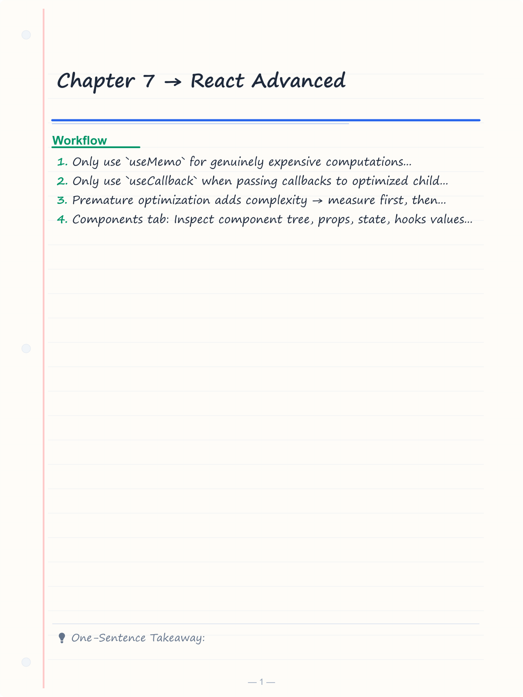
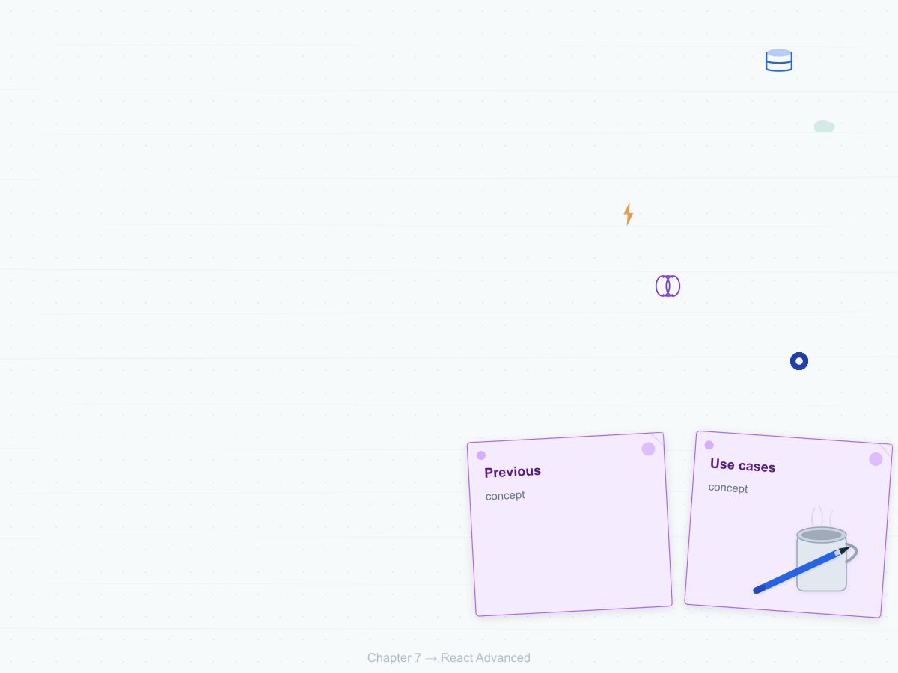
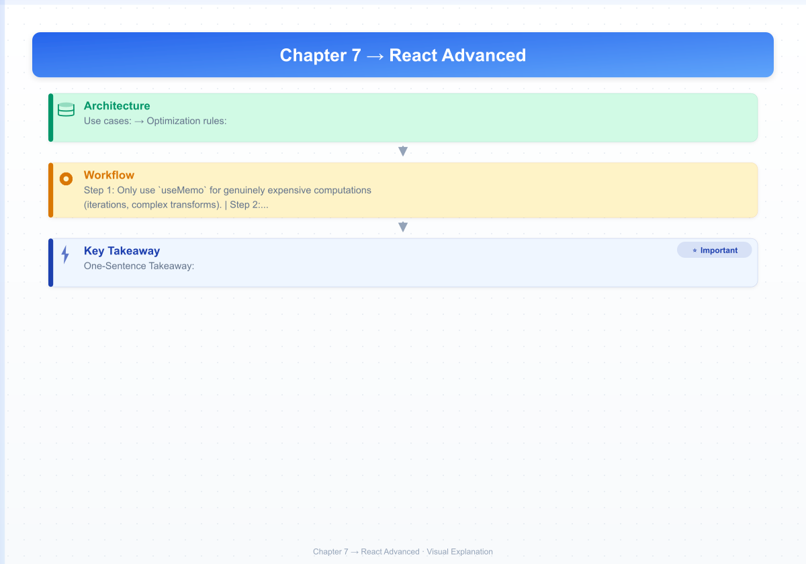
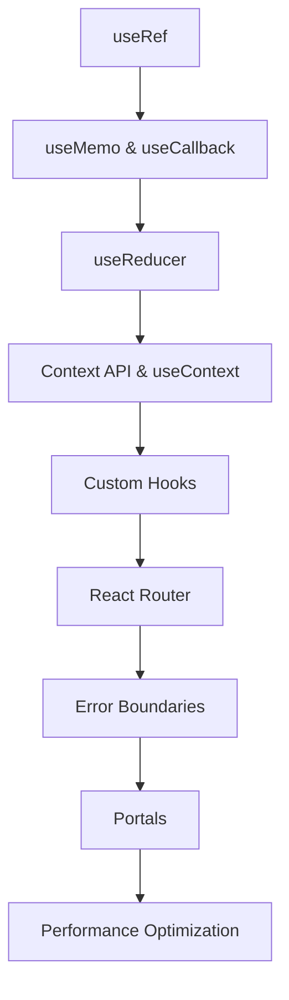

# Chapter 7 → React Advanced

> **Previous:** [06-react-basics](./06-react-basics.md) | **Next:** [08-node-express](./08-node-express.md)

## Learning Objectives

> **One-Sentence Takeaway:** `useRef` persists mutable values across renders without causing re-renders when mutated.

<!-- Image Gallery -->
<section class="lesson-visuals" aria-label="Visual learning resources">
  <header><span>VISUAL LEARNING</span><h2>See it. Review it. Remember it.</h2></header>
  <a class="lesson-visual-card" href="../../assets/images/lessons/web-development/07-react-advanced/handwritten-notes.png" target="_blank" rel="noopener">
    
    <span><strong>Handwritten notes</strong>Condensed notes for deliberate review.</span>
  </a>
  <a class="lesson-visual-card" href="../../assets/images/lessons/web-development/07-react-advanced/sticky-notes.png" target="_blank" rel="noopener">
    
    <span><strong>Sticky-note revision</strong>Fast recall prompts for revision.</span>
  </a>
  <a class="lesson-visual-card" href="../../assets/images/lessons/web-development/07-react-advanced/visual-explanation.png" target="_blank" rel="noopener">
    
    <span><strong>Visual concept guide</strong>A connected explanation of the key ideas.</span>
  </a>
</section>
<!-- End Image Gallery -->


By the end of this chapter, you will be able to:

## Chapter at a Glance

> **One-Sentence Takeaway:** `useMemo` and `useCallback` cache computations and function references to avoid wasted work.

| Topic | Key Insight | Practical Takeaway |
|-------|-------------|-------------------|
|useRef|Mutable references that persist across renders without causing re-renders|Use for DOM access, previous values, and render count tracking|
|useMemo/useCallback|Memoize expensive computations and function references|Only memoize after measuring — premature optimization adds complexity|
|useReducer|Handles complex state transitions with a reducer function|Ideal for state that depends on previous state with multiple sub-values|
|useContext|Provides dependency injection across the component tree|Create custom hooks with context validation for better developer experience|
|Custom Hooks|Encapsulate reusable stateful logic into functions that can use other hooks|Prefix custom hooks with `use` and compose them from built-in hooks|
|React Router|Declarative client-side routing with nested routes and navigation|Use `Outlet` for nested layouts and `NavLink` for active link styling|

## Chapter Roadmap

> **One-Sentence Takeaway:** `useReducer` manages complex state logic with a reducer function and action dispatches.




1. Manage mutable references and DOM access using `useRef`.
2. Memoize expensive computations with `useMemo` and callback identity with `useCallback`.
3. Manage complex state transitions with `useReducer`.
4. Share state across the component tree using `useContext` and the Context API.
5. Build custom hooks that encapsulate reusable logic.
6. Implement client-side routing using React Router.
7. Use error boundaries, portals, and performance optimization techniques.

## Theory

> **One-Sentence Takeaway:** Context API with `useContext` provides dependency injection across the component tree.


### 7.1 useRef


`useRef` creates a mutable object that persists across renders without causing re-renders when mutated.

```jsx
import { useRef, useEffect } from 'react';

function AutoFocusInput() {
  const inputRef = useRef(null);

  useEffect(() => {
    inputRef.current?.focus();
  }, []);

  return <input ref={inputRef} type="text" />;
}
```

**Use cases:**

```jsx
function VideoPlayer({ src }) {
  const videoRef = useRef(null);
  const [isPlaying, setIsPlaying] = useState(false);

  const togglePlay = () => {
    if (videoRef.current.paused) {
      videoRef.current.play();
      setIsPlaying(true);
    } else {
      videoRef.current.pause();
      setIsPlaying(false);
    }
  };

  return (
    <div>
      <video ref={videoRef} src={src} />
      <button onClick={togglePlay}>{isPlaying ? 'Pause' : 'Play'}</button>
    </div>
  );
}

// Storing previous value
function usePrevious(value) {
  const ref = useRef();
  useEffect(() => {
    ref.current = value;
  }, [value]);
  return ref.current;
}

// Tracking render count
function RenderCounter() {
  const count = useRef(0);
  count.current++;
  return <p>Rendered {count.current} times</p>;
}
```

### 7.2 useMemo and useCallback


`useMemo` caches the result of a computation; `useCallback` caches a function reference.

```jsx
import { useMemo, useCallback } from 'react';

// useMemo → cache computed values
function ExpensiveList({ items, filter }) {
  const filtered = useMemo(() => {
    console.log('Filtering...');
    return items.filter((item) =>
      item.name.toLowerCase().includes(filter.toLowerCase())
    );
  }, [items, filter]);

  const total = useMemo(
    () => items.reduce((sum, item) => sum + item.price, 0),
    [items]
  );

  return (
    <div>
      <ul>
        {filtered.map((item) => (
          <li key={item.id}>{item.name} → ${item.price}</li>
        ))}
      </ul>
      <p>Total: ${total.toFixed(2)}</p>
    </div>
  );
}

// useCallback → cache function references
function ProductPage({ productId, onAddToCart }) {
  const [product, setProduct] = useState(null);

  useEffect(() => {
    fetch(`/api/products/${productId}`)
      .then((r) => r.json())
      .then(setProduct);
  }, [productId]);

  // Stable reference → does not re-create unless productId changes
  const handleAdd = useCallback(() => {
    onAddToCart(productId);
  }, [productId, onAddToCart]);

  if (!product) return <p>Loading...</p>;

  return (
    <div>
      <h2>{product.name}</h2>
      <AddToCartButton onAdd={handleAdd} />
    </div>
  );
}
```

**Optimization rules:**
- Only use `useMemo` for genuinely expensive computations (iterations, complex transforms).
- Only use `useCallback` when passing callbacks to optimized child components (wrapped in `React.memo`).
- Premature optimization adds complexity → measure first, then memoize.

### 7.3 useReducer


`useReducer` handles complex state logic with multiple sub-values or transitions that depend on previous state.

```jsx
import { useReducer } from 'react';

const initialState = {
  items: [],
  total: 0,
  discount: 0,
};

function cartReducer(state, action) {
  switch (action.type) {
    case 'ADD_ITEM': {
      const newItems = [...state.items, action.payload];
      return {
        ...state,
        items: newItems,
        total: newItems.reduce((sum, item) => sum + item.price, 0),
      };
    }
    case 'REMOVE_ITEM': {
      const newItems = state.items.filter((_, i) => i !== action.index);
      return {
        ...state,
        items: newItems,
        total: newItems.reduce((sum, item) => sum + item.price, 0),
      };
    }
    case 'APPLY_DISCOUNT': {
      return {
        ...state,
        discount: Math.min(action.percentage, 50), // Cap at 50%
      };
    }
    case 'CLEAR_CART':
      return initialState;
    default:
      throw new Error(`Unknown action: ${action.type}`);
  }
}

function ShoppingCart() {
  const [cart, dispatch] = useReducer(cartReducer, initialState);

  const addItem = (item) => dispatch({ type: 'ADD_ITEM', payload: item });
  const removeItem = (index) => dispatch({ type: 'REMOVE_ITEM', index });
  const applyDiscount = (pct) => dispatch({ type: 'APPLY_DISCOUNT', percentage: pct });

  const finalTotal = cart.total * (1 - cart.discount / 100);

  return (
    <div>
      {cart.items.map((item, i) => (
        <div key={i}>
          {item.name} → ${item.price}
          <button onClick={() => removeItem(i)}>Remove</button>
        </div>
      ))}
      <p>Subtotal: ${cart.total.toFixed(2)}</p>
      <p>Discount: {cart.discount}%</p>
      <p>Total: ${finalTotal.toFixed(2)}</p>
    </div>
  );
}
```

### 7.4 useContext


Context provides a way to pass data through the component tree without manually threading props at every level.

```jsx
import { createContext, useContext, useState } from 'react';

// Create context
const AuthContext = createContext(null);

// Provider component
function AuthProvider({ children }) {
  const [user, setUser] = useState(null);

  const login = async (email, password) => {
    const response = await fetch('/api/auth/login', {
      method: 'POST',
      headers: { 'Content-Type': 'application/json' },
      body: JSON.stringify({ email, password }),
    });
    if (!response.ok) throw new Error('Login failed');
    const userData = await response.json();
    setUser(userData);
    return userData;
  };

  const logout = () => {
    setUser(null);
    localStorage.removeItem('token');
  };

  return (
    <AuthContext.Provider value={{ user, login, logout, isAuthenticated: !!user }}>
      {children}
    </AuthContext.Provider>
  );
}

// Custom hook for consuming
function useAuth() {
  const context = useContext(AuthContext);
  if (!context) {
    throw new Error('useAuth must be used within an AuthProvider');
  }
  return context;
}

// Using the context
function ProfileButton() {
  const { user, logout } = useAuth();
  return (
    <div>
      <span>{user?.name}</span>
      <button onClick={logout}>Logout</button>
    </div>
  );
}

function App() {
  return (
    <AuthProvider>
      <Navbar />
      <MainContent />
    </AuthProvider>
  );
}
```

### 7.5 Custom Hooks


Custom hooks extract reusable stateful logic into functions that may use other hooks.

```jsx
// useFetch → generic data fetching
function useFetch(url, options = {}) {
  const [data, setData] = useState(null);
  const [loading, setLoading] = useState(true);
  const [error, setError] = useState(null);

  useEffect(() => {
    let cancelled = false;
    setLoading(true);
    setError(null);

    fetch(url, options)
      .then((res) => {
        if (!res.ok) throw new Error(`HTTP ${res.status}`);
        return res.json();
      })
      .then((json) => {
        if (!cancelled) setData(json);
      })
      .catch((err) => {
        if (!cancelled) setError(err.message);
      })
      .finally(() => {
        if (!cancelled) setLoading(false);
      });

    return () => { cancelled = true; };
  }, [url]);

  return { data, loading, error };
}

// useLocalStorage → synced with localStorage
function useLocalStorage(key, initialValue) {
  const [storedValue, setStoredValue] = useState(() => {
    try {
      const item = localStorage.getItem(key);
      return item ? JSON.parse(item) : initialValue;
    } catch {
      return initialValue;
    }
  });

  const setValue = (value) => {
    const valueToStore = value instanceof Function ? value(storedValue) : value;
    setStoredValue(valueToStore);
    localStorage.setItem(key, JSON.stringify(valueToStore));
  };

  return [storedValue, setValue];
}

// useMediaQuery → responsive breakpoints
function useMediaQuery(query) {
  const [matches, setMatches] = useState(() => window.matchMedia(query).matches);

  useEffect(() => {
    const mql = window.matchMedia(query);
    const handler = (e) => setMatches(e.matches);
    mql.addEventListener('change', handler);
    return () => mql.removeEventListener('change', handler);
  }, [query]);

  return matches;
}

// Usage
function ResponsiveComponent() {
  const { data: users, loading } = useFetch('/api/users');
  const isMobile = useMediaQuery('(max-width: 768px)');
  const [theme, setTheme] = useLocalStorage('theme', 'light');

  if (loading) return <p>Loading...</p>;

  return (
    <div className={isMobile ? 'mobile' : 'desktop'}>
      <h1>Users ({theme} mode)</h1>
      <button onClick={() => setTheme((t) => (t === 'light' ? 'dark' : 'light'))}>
        Toggle Theme
      </button>
      <ul>
        {users?.map((user) => <li key={user.id}>{user.name}</li>)}
      </ul>
    </div>
  );
}
```

### 7.6 React Router


React Router provides declarative client-side routing.

```jsx
import { BrowserRouter, Routes, Route, Link, NavLink, useParams, useNavigate, Outlet } from 'react-router-dom';

function App() {
  return (
    <BrowserRouter>
      <nav>
        <NavLink to="/" end>Home</NavLink>
        <NavLink to="/products">Products</NavLink>
        <NavLink to="/about">About</NavLink>
      </nav>

      <Routes>
        <Route path="/" element={<Home />} />
        <Route path="/products" element={<Products />}>
          <Route index element={<ProductList />} />
          <Route path=":id" element={<ProductDetail />} />
        </Route>
        <Route path="/about" element={<About />} />
        <Route path="*" element={<NotFound />} />
      </Routes>
    </BrowserRouter>
  );
}

// Nested routes with Outlet
function Products() {
  return (
    <div>
      <h1>Products</h1>
      <Outlet /> {/* Child routes render here */}
    </div>
  );
}

// Route parameters
function ProductDetail() {
  const { id } = useParams();
  const navigate = useNavigate();

  return (
    <div>
      <h2>Product {id}</h2>
      <button onClick={() => navigate('/products')}>Back to Products</button>
    </div>
  );
}
```

### 7.7 Error Boundaries


Error boundaries catch JavaScript errors in their child component tree, log the error, and display a fallback UI.

```jsx
import { Component } from 'react';

class ErrorBoundary extends Component {
  constructor(props) {
    super(props);
    this.state = { hasError: false, error: null };
  }

  static getDerivedStateFromError(error) {
    return { hasError: true, error };
  }

  componentDidCatch(error, info) {
    console.error('Error caught by boundary:', error, info.componentStack);
    // Send to error tracking service
  }

  render() {
    if (this.state.hasError) {
      return this.props.fallback || (
        <div role="alert">
          <h2>Something went wrong.</h2>
          <p>{this.state.error?.message}</p>
          <button onClick={() => this.setState({ hasError: false, error: null })}>
            Try again
          </button>
        </div>
      );
    }

    return this.props.children;
  }
}
```

### 7.8 Portals


Portals render children into a different DOM node outside the parent hierarchy.

```jsx
import { createPortal } from 'react-dom';

function Modal({ open, onClose, children }) {
  if (!open) return null;

  return createPortal(
    <div className="modal-overlay" onClick={onClose} role="dialog" aria-modal="true">
      <div className="modal-content" onClick={(e) => e.stopPropagation()}>
        <button onClick={onClose} aria-label="Close">X</button>
        {children}
      </div>
    </div>,
    document.getElementById('modal-root')
  );
}
```

### 7.9 Performance Optimization


```jsx
import { memo } from 'react';

// React.memo → prevent re-render when props haven't changed (shallow comparison)
const ExpensiveChart = memo(function ExpensiveChart({ data, config }) {
  return <svg>{/* Complex rendering */}</svg>;
});

// Usage with useCallback ensures memoized children don't re-render
function Dashboard() {
  const [filter, setFilter] = useState('all');
  const [data, setData] = useState([]);

  const handleFilterChange = useCallback((newFilter) => {
    setFilter(newFilter);
  }, []);

  const filteredData = useMemo(
    () => data.filter((d) => filter === 'all' || d.category === filter),
    [data, filter]
  );

  return (
    <div>
      <FilterBar onChange={handleFilterChange} />
      <ExpensiveChart data={filteredData} config={chartConfig} />
    </div>
  );
}
```

### 7.10 React DevTools


React DevTools (browser extension) provides:
- **Components tab**: Inspect component tree, props, state, hooks values in real time.
- **Profiler tab**: Record performance flamegraphs showing render duration and reason.
- **Source maps**: Navigate from component to source file.


> [!TIP]
> Create a custom hook for every piece of reusable stateful logic. Extract `useFetch`, `useLocalStorage`, and `useMediaQuery` early — they pay for themselves.

> [!WARNING]
> `useMemo` and `useCallback` add complexity. Only use them when you've measured a performance problem — React is fast without them in most cases.

> [!REMEMBER]
> Error boundaries catch errors during rendering, in lifecycle methods, and in constructors. They do NOT catch errors in event handlers, async code, or SSR.


## Concept Comparison Table

| Concept | Description | Use Case |
|---------|-------------|---------|
|`useRef` vs `useState`|Mutable, no re-render on change|Immutable setter, triggers re-render|
|`useMemo` vs `useCallback`|Returns cached value|Returns cached function reference|
|`useReducer` vs `useState`|Complex state, action-based updates|Simple independent values|
|Context vs Props Drilling|Global state without manual threading|Passes through every intermediate layer|
|Error Boundary vs try/catch|Declarative, catches render errors|Imperative, catches synchronous code|

## Quick Reference

| Topic | Key Points |
|-------|-----------|
|Hooks|`useRef`,`useMemo`,`useCallback`,`useReducer`,`useContext`|
|Memoization|`React.memo(Component)` for props comparison, `useMemo` for values, `useCallback` for functions|
|Context|`createContext`,`Context.Provider`,`useContext()`|
|Router Components|`BrowserRouter`,`Routes`,`Route`,`Link`,`NavLink`,`Outlet`|
|Advanced Patterns|Error boundaries, Portals, React.memo, Code splitting with `React.lazy`|

## Cross-Application Matrix

| Domain | Application | Benefit |
|--------|------------|--------|
|Shopping Cart|useReducer for cart state, Context for user data|Complex state transitions with predictable actions|
|Dashboard|useMemo for filtered data, React.memo for charts|Smooth rendering with large datasets|
|Auth System|Context for user session, custom useAuth hook|Global user state accessible from any component|
|Form Wizard|useReducer for multi-step form state|Step navigation with validation at each step|
|Real-time App|Custom useWebSocket hook, useRef for instance tracking|Encapsulated WebSocket lifecycle management|

## Chapter Quiz

Test your understanding with these quick questions.

**Q1. When should you use `useReducer` over `useState`?**

- A) Always — it's more powerful
- B) When state has multiple sub-values or complex transition logic
- C) When you need synchronous updates
- D) Never — useReducer is deprecated

<details><summary>Answer&lt;/summary&gt;

**B) `useReducer` excels when state logic involves multiple sub-values, complex transitions, or when the next state depends on the previous one.**

</details>

**Q2. What is the purpose of `React.memo`?**

- A) To memoize function results
- B) To prevent re-renders when props haven't changed (shallow comparison)
- C) To memoize API calls
- D) To track render count

<details><summary>Answer&lt;/summary&gt;

**B) `React.memo` is a higher-order component that prevents re-rendering when the component's props haven't changed according to shallow comparison.**

</details>

**Q3. What types of errors do Error Boundaries NOT catch?**

- A) Render errors
- B) Errors in lifecycle methods
- C) Errors in event handlers
- D) Constructor errors

<details><summary>Answer&lt;/summary&gt;

**C) Error boundaries do not catch errors in event handlers, asynchronous code (setTimeout, fetch), or server-side rendering.**

</details>

**Q4. How do you prevent unnecessary re-renders when passing callbacks to memoized children?**

- A) Use `useRef`
- B) Use `useMemo`
- C) Use `useCallback`
- D) Use `React.Fragment`

<details><summary>Answer&lt;/summary&gt;

**C) `useCallback` returns a stable function reference that only changes when its dependencies change, preventing unnecessary re-renders of memoized children.**

</details>

### TypeScript: Custom Hook Builder & Context Generator

```typescript
class CustomHookGenerator {
  static createReducer<S extends Record<string, any>>(
    initial: S, handlers: Record<string, (state: S, action: any) => S>
  ): { initialState: S; reducer: (state: S, action: { type: string; payload?: any }) => S } {
    return {
      initialState: initial,
      reducer: (state, action) => handlers[action.type]?.(state, action.payload) ?? state,
    };
  }

  static contextTemplate<T>(name: string, defaultValue: T): string {
    return `import { createContext, useContext, useState, ReactNode } from "react";

interface ${name}ContextType {
  value: ${typeof defaultValue};
  setValue: (val: ${typeof defaultValue}) => void;
}

const ${name}Context = createContext<${name}ContextType | undefined>(undefined);

export const ${name}Provider: React.FC<{ children: ReactNode }> = ({ children }) => {
  const [value, setValue] = useState<${typeof defaultValue}>(${JSON.stringify(defaultValue)});
  return <${name}Context.Provider value={{ value, setValue }}>{children}</${name}Context.Provider>;
};

export const use${name} = (): ${name}ContextType => {
  const ctx = useContext(${name}Context);
  if (!ctx) throw new Error("use${name} must be used within ${name}Provider");
  return ctx;
};`;
  }
}

class PerformanceOptimizer {
  static memoCompare<T>(prev: T, next: T, deps: (keyof T)[]): boolean {
    return deps.every(d => prev[d] === next[d]);
  }
  static debounce<T extends (...args: any[]) => void>(fn: T, ms: number): T {
    let timer: ReturnType<typeof setTimeout>;
    return ((...args: any[]) => { clearTimeout(timer); timer = setTimeout(() => fn(...args), ms); }) as T;
  }
}

console.log(CustomHookGenerator.createReducer({ count: 0 }, { increment: (s) => ({ count: s.count + 1 }) }));
```

## TypeScript Implementation: Redux-Style State Manager, Context Provider, Custom Hook Creator

```typescript
type Reducer<S, A> = (state: S, action: A) => S;
type Listener = () => void;

class ReduxStore<S, A> {
    private state: S;
    private reducer: Reducer<S, A>;
    private listeners: Set<Listener> = new Set();

    constructor(reducer: Reducer<S, A>, initialState: S) {
        this.reducer = reducer;
        this.state = initialState;
    }

    getState(): S { return this.state; }

    dispatch(action: A): void {
        this.state = this.reducer(this.state, action);
        this.listeners.forEach(l => l());
    }

    subscribe(listener: Listener): () => void {
        this.listeners.add(listener);
        return () => this.listeners.delete(listener);
    }

    combineReducers<R extends Record<string, Reducer<any, any>>>(reducers: R): Reducer<{ [K in keyof R]: ReturnType<R[K]> }, any> {
        return (state: any, action: any) => {
            const nextState: any = {};
            for (const key of Object.keys(reducers)) {
                nextState[key] = reducers[key](state?.[key], action);
            }
            return nextState;
        };
    }

    static applyMiddleware<S, A>(...middlewares: ((store: ReduxStore<S, A>) => (next: (action: A) => void) => (action: A) => void)[]) {
        return (store: ReduxStore<S, A>) => {
            let dispatch = store.dispatch.bind(store);
            for (const middleware of [...middlewares].reverse()) {
                dispatch = middleware(store)(dispatch);
            }
            return { ...store, dispatch };
        };
    }
}

class ContextProvider<T> {
    private value: T;
    private subscribers: Set<() => void> = new Set();

    constructor(defaultValue: T) { this.value = defaultValue; }

    getValue(): T { return this.value; }

    setValue(newValue: T): void {
        this.value = newValue;
        this.subscribers.forEach(cb => cb());
    }

    subscribe(cb: () => void): () => void {
        this.subscribers.add(cb);
        return () => this.subscribers.delete(cb);
    }

    static createContext<T>(defaultValue: T): { Provider: ContextProvider<T>; useContext: () => T } {
        const provider = new ContextProvider(defaultValue);
        return {
            Provider: provider,
            useContext: () => provider.getValue()
        };
    }
}

type AnyHook = (...args: any[]) => any;

class CustomHookCreator {
    static compose(...hooks: ((...args: any[]) => any)[]): (...args: any[]) => any[] {
        return (...args: any[]) => hooks.map(h => h(...args));
    }

    static createStateful<T>(initialValue: T): { get: () => T; set: (v: T) => void; subscribe: (cb: (v: T) => void) => () => void } {
        let value = initialValue;
        const subscribers = new Set<(v: T) => void>();
        return {
            get: () => value,
            set: (v: T) => { value = v; subscribers.forEach(cb => cb(value)); },
            subscribe: (cb: (v: T) => void) => { subscribers.add(cb); return () => subscribers.delete(cb); }
        };
    }

    static createDebounced<T>(delay: number): { get: () => T | undefined; set: (v: T) => void } {
        let value: T | undefined;
        let timer: ReturnType<typeof setTimeout>;
        return {
            get: () => value,
            set: (v: T) => {
                clearTimeout(timer);
                timer = setTimeout(() => { value = v; }, delay);
            }
        };
    }

    static createToggle(initial: boolean = false): { value: boolean; toggle: () => void; setTrue: () => void; setFalse: () => void } {
        let value = initial;
        return {
            get value() { return value; },
            toggle: () => { value = !value; },
            setTrue: () => { value = true; },
            setFalse: () => { value = false; }
        };
    }
}

// Demo
const counterReducer = (state = 0, action: any) => {
    switch (action.type) {
        case "INCREMENT": return state + 1;
        case "DECREMENT": return state - 1;
        case "RESET": return 0;
        default: return state;
    }
};
const store = new ReduxStore(counterReducer, 0);
store.subscribe(() => console.log("State:", store.getState()));
store.dispatch({ type: "INCREMENT" });
store.dispatch({ type: "INCREMENT" });
store.dispatch({ type: "DECREMENT" });

const toggle = CustomHookCreator.createToggle(false);
console.log("Toggle initial:", toggle.value);
toggle.toggle();
console.log("Toggle after:", toggle.value);

const ctx = ContextProvider.createContext("default");
console.log("Context value:", ctx.useContext());
ctx.Provider.setValue("updated");
```


// react advanced
// fullstack-frontend-backend implementation

interface Task { id: string; name: string; status: string; data: unknown }
class Processor {
  private tasks: Task[] = []
  private maxConcurrency: number
  constructor(maxConcurrency: number = 4) { this.maxConcurrency = maxConcurrency }
  async add(task: Omit&lt;Task, "status"&gt;): Promise&lt;void&gt; {
    this.tasks.push({ ...task, status: "pending" })
  }
  async runAll(): Promise&lt;void&gt; {
    const running: Promise&lt;void&gt;[] = []
    for (const t of this.tasks) {
      if (running.length >= this.maxConcurrency) { await Promise.race(running) }
      const p = this.execute(t).finally(() => { const i = running.indexOf(p); if (i >= 0) running.splice(i, 1) })
      running.push(p)
    }
    await Promise.all(running)
  }
  private async execute(t: Task): Promise&lt;void&gt; {
    t.status = "running"
    await new Promise(r => setTimeout(r, 10))
    t.status = "done"
  }
  getResults(): Task[] { return this.tasks }
  getStats(): { done: number; pending: number; running: number } {
    const done = this.tasks.filter(t => t.status === "done").length
    const pending = this.tasks.filter(t => t.status === "pending").length
    const running = this.tasks.filter(t => t.status === "running").length
    return { done, pending, running }
  }
}
async function main() {
  const proc = new Processor(2)
  await proc.add({ id: '1', name: 'react advanced', data: { topic: 'fullstack-frontend-backend' } })
  await proc.runAll()
  console.log('Stats:', proc.getStats())
}
main().catch(console.error)
export { Processor, Task }
## Summary

> **One-Sentence Takeaway:** Custom hooks encapsulate reusable stateful logic and must start with the `use` prefix.

- `useRef` persists mutable values across renders without causing re-renders.
- `useMemo` and `useCallback` memoize values and functions to avoid wasted work.
- `useReducer` handles complex state transitions with a reducer function.
- Context API with `useContext` provides dependency injection across the component tree.
- Custom hooks encapsulate reusable stateful logic following naming conventions.
- React Router enables declarative, nested client-side routing.
- Error boundaries catch rendering errors in child trees.
- Portals render content outside the parent DOM hierarchy.
- `React.memo` and memoization hooks optimize re-renders.
- React DevTools enables real-time inspection and profiling.

## Exercises

> **One-Sentence Takeaway:** React Router enables declarative nested routing with `BrowserRouter`, `Routes`, and `Route`.

### Review Questions

1. What is the difference between `useRef` and `useState`? When would you choose one over the other?
2. Explain the concept of "lifting state up" and how Context API changes this pattern.
3. Why does `useCallback` help with performance and what happens if its dependency array is incorrect?
4. What are the limitations of error boundaries? What types of errors do they not catch?

### Application Problems

5. Build a custom hook `useDebounce(value, delay)` that returns a debounced version of the value. Demonstrate its use in a search input that waits 300ms before triggering an API call.
6. Implement a `ThemeProvider` context with `useTheme` hook that provides `theme` (light/dark) and `toggleTheme` to all descendants. Persist the choice in localStorage.
7. Create a `useIntersectionObserver` custom hook that takes options and returns a `ref` to attach to an element, plus an `isVisible` boolean. Use it to build an infinite scroll component.

### Challenge Problem

8. Build a complete shopping cart application featuring:
   - **Product listing** with add-to-cart functionality
   - **Cart** managed with `useReducer` supporting add, remove, quantity update, and clear
   - **Checkout form** with field-level validation and form-wide submission
   - **Theme toggle** using Context
   - **Routing** with React Router: `/products`, `/cart`, `/checkout`, `/order-confirmation`
   - **Custom hook** `useLocalStorage` for persisting the cart
   - **Error boundary** wrapping the product detail page
   - **Memoized** product list to prevent unnecessary re-renders
   - No external state management library → only React built-ins
