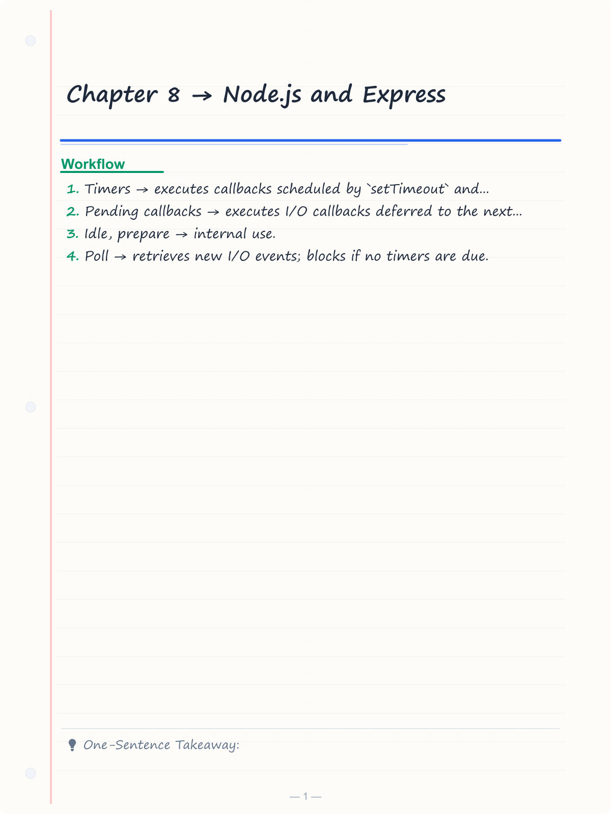
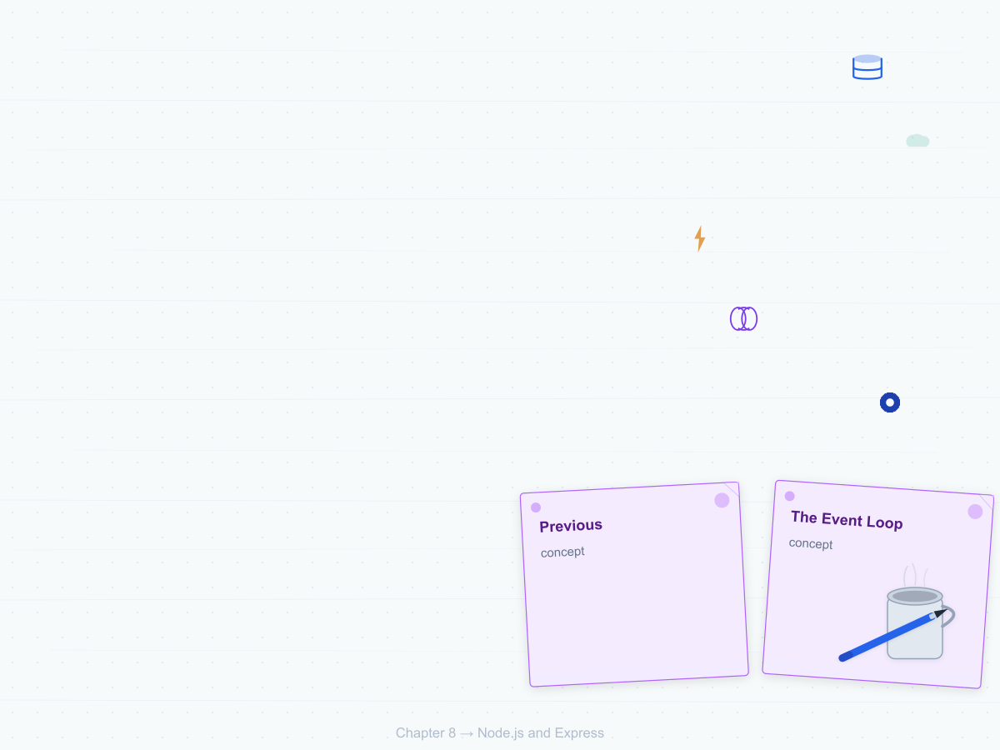
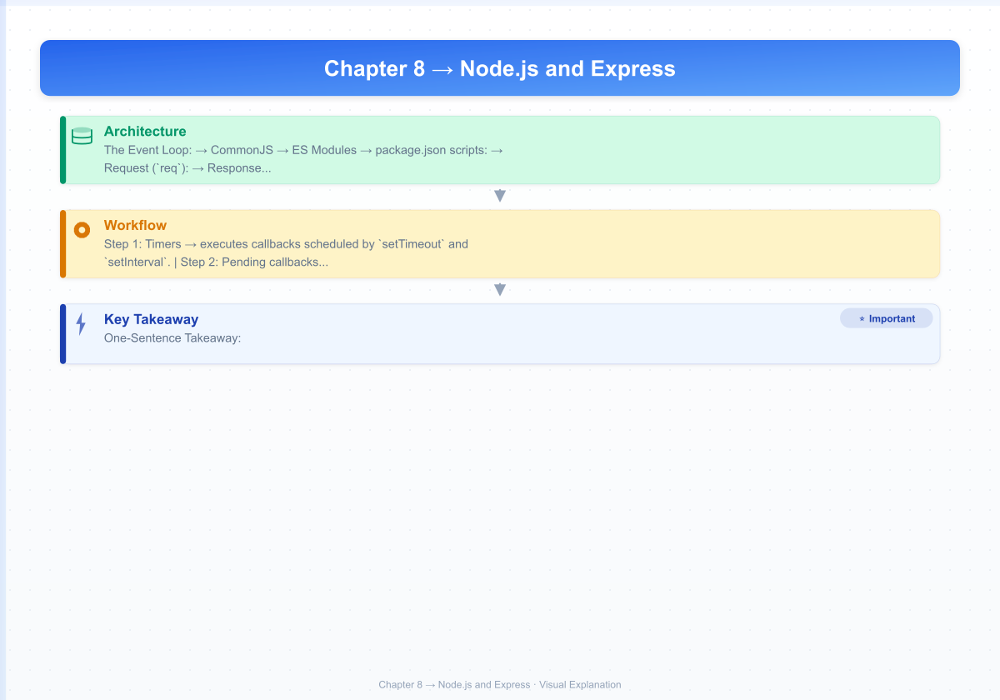
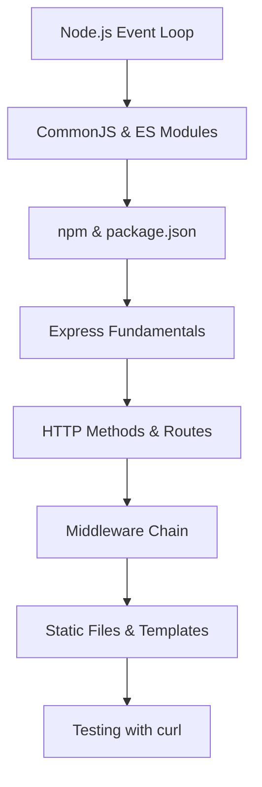

# Chapter 8 → Node.js and Express

> **Previous:** [07-react-advanced](./07-react-advanced.md) | **Next:** [09-rest-apis](./09-rest-apis.md)

## Learning Objectives

> **One-Sentence Takeaway:** Node.js uses a single-threaded event loop with six phases for async I/O processing.

<!-- Image Gallery -->
<section class="lesson-visuals" aria-label="Visual learning resources">
  <header><span>VISUAL LEARNING</span><h2>See it. Review it. Remember it.</h2></header>
  <a class="lesson-visual-card" href="../../assets/images/lessons/web-development/08-node-express/handwritten-notes.png" target="_blank" rel="noopener">
    
    <span><strong>Handwritten notes</strong>Condensed notes for deliberate review.</span>
  </a>
  <a class="lesson-visual-card" href="../../assets/images/lessons/web-development/08-node-express/sticky-notes.png" target="_blank" rel="noopener">
    
    <span><strong>Sticky-note revision</strong>Fast recall prompts for revision.</span>
  </a>
  <a class="lesson-visual-card" href="../../assets/images/lessons/web-development/08-node-express/visual-explanation.png" target="_blank" rel="noopener">
    
    <span><strong>Visual concept guide</strong>A connected explanation of the key ideas.</span>
  </a>
</section>
<!-- End Image Gallery -->


By the end of this chapter, you will be able to:

## Chapter at a Glance

> **One-Sentence Takeaway:** CommonJS uses `require()` synchronously while ES modules use `import` statically and `import()` dynamically.

| Topic | Key Insight | Practical Takeaway |
|-------|-------------|-------------------|
|Event Loop|Single-threaded, non-blocking I/O with six phases|`process.nextTick` runs before Promise microtasks, which run before timer callbacks|
|Node Modules|CommonJS (`require`) and ES modules (`import`) are both supported|Use `.mjs` extension or `type: module` in package.json for ESM|
|npm|Dependency management with `package.json`, scripts, and semantic versioning|Pin critical dependencies with exact versions; use `npm ci` for CI builds|
|Express Routes|Map HTTP methods and URL paths to handler functions|Always validate request parameters and return appropriate status codes|
|Middleware|Functions that process requests in a chain before the final handler|Order matters — error-handling middleware must have 4 parameters and be last|
|Static Files|Express serves files from a directory with optional virtual path prefix|Use `express.static()` with caching headers for production assets|

## Chapter Roadmap

> **One-Sentence Takeaway:** npm manages project dependencies through `package.json` with `dependencies` and `devDependencies`.




1. Explain the Node.js event loop, its phases, and how asynchronous I/O works.
2. Organize code using CommonJS and ES modules in Node.js.
3. Manage project dependencies using npm.
4. Create an Express web server with routing, middleware, and error handling.
5. Serve static files and render dynamic templates.
6. Test HTTP endpoints using Postman, curl, or a browser.

## Theory

> **One-Sentence Takeaway:** Express maps HTTP methods and URL paths to handler functions with route parameters.

### 8.1 Node.js Overview


Node.js is a JavaScript runtime built on Chrome's V8 engine. It provides an event-driven, non-blocking I/O model that makes it efficient for data-intensive real-time applications.

**The Event Loop:**

Node.js processes JavaScript on a single thread using an event loop. The loop has six phases:

1. **Timers** → executes callbacks scheduled by `setTimeout` and `setInterval`.
2. **Pending callbacks** → executes I/O callbacks deferred to the next iteration.
3. **Idle, prepare** → internal use.
4. **Poll** → retrieves new I/O events; blocks if no timers are due.
5. **Check** → executes `setImmediate` callbacks.
6. **Close callbacks** → executes close event handlers (e.g., socket `close`).

```javascript
console.log('1: Start');

setTimeout(() => console.log('2: Timeout'), 0);
setImmediate(() => console.log('3: Immediate'));
process.nextTick(() => console.log('4: NextTick'));

Promise.resolve().then(() => console.log('5: Promise'));

console.log('6: End');

// Output: 1, 6, 4, 5, 2 or 3, 2 or 3
// nextTick runs before Promise microtasks, which run before timer phase
```

### 8.2 Node.js Modules


**CommonJS** (default, `.js` or `.cjs` extension):

```javascript
// math.js
const PI = 3.14159;
function square(x) { return x * x; }
module.exports = { PI, square };
module.exports.default = { PI, square };

// app.js → synchronous require
const math = require('./math.js');
console.log(math.PI); // 3.14159
```

**ES Modules** (`.mjs` or `"type": "module"` in `package.json`):

```json
// package.json
{
  "type": "module",
  "engines": { "node": ">=22" }
}
```

```javascript
// math.mjs
export const PI = 3.14159;
export function square(x) { return x * x; }

// app.mjs → static import
import { PI, square } from './math.mjs';

// Dynamic import
const module = await import('./heavy-module.mjs');
```

### 8.3 npm


```bash
# Initialize a project
npm init -y

# Install dependencies
npm install express
npm install --save-dev nodemon typescript

# Install globally
npm install -g nodemon

# Run scripts
npm run dev
npm test
```

**package.json scripts:**

```json
{
  "scripts": {
    "start": "node src/server.js",
    "dev": "nodemon src/server.js",
    "lint": "eslint src/",
    "test": "vitest run"
  }
}
```

### 8.4 Express Fundamentals


Express is a minimal, flexible web application framework for Node.js.

```javascript
import express from 'express';

const app = express();
const PORT = process.env.PORT || 3000;

// Middleware → runs for every request
app.use(express.json());
app.use(express.urlencoded({ extended: true }));

// Routes
app.get('/', (req, res) => {
  res.json({ message: 'Hello, World!' });
});

// Start server
app.listen(PORT, () => {
  console.log(`Server running on http://localhost:${PORT}`);
});
```

### 8.5 HTTP Methods and Routes


Express routes map HTTP methods and URL paths to handler functions.

```javascript
// GET → Retrieve resources
app.get('/api/users', (req, res) => {
  res.json(users);
});

// GET with route parameter
app.get('/api/users/:id', (req, res) => {
  const user = users.find((u) => u.id === parseInt(req.params.id));
  if (!user) return res.status(404).json({ error: 'User not found' });
  res.json(user);
});

// POST → Create resource
app.post('/api/users', (req, res) => {
  const { name, email } = req.body;
  if (!name || !email) {
    return res.status(400).json({ error: 'Name and email are required' });
  }
  const newUser = { id: users.length + 1, name, email, createdAt: new Date() };
  users.push(newUser);
  res.status(201).json(newUser);
});

// PUT → Replace resource
app.put('/api/users/:id', (req, res) => {
  const index = users.findIndex((u) => u.id === parseInt(req.params.id));
  if (index === -1) return res.status(404).json({ error: 'User not found' });
  users[index] = { ...users[index], ...req.body };
  res.json(users[index]);
});

// PATCH → Partial update
app.patch('/api/users/:id', (req, res) => {
  const user = users.find((u) => u.id === parseInt(req.params.id));
  if (!user) return res.status(404).json({ error: 'User not found' });
  Object.assign(user, req.body);
  res.json(user);
});

// DELETE → Remove resource
app.delete('/api/users/:id', (req, res) => {
  const index = users.findIndex((u) => u.id === parseInt(req.params.id));
  if (index === -1) return res.status(404).json({ error: 'User not found' });
  users.splice(index, 1);
  res.status(204).send();
});
```

### 8.6 Request and Response Objects


**Request (`req`):**

```javascript
app.use((req, res, next) => {
  console.log({
    method: req.method,
    url: req.url,
    path: req.path,
    params: req.params,
    query: req.query,
    body: req.body,
    headers: req.headers,
    ip: req.ip,
  });
  next();
});
```

**Response (`res`):**

```javascript
app.get('/example', (req, res) => {
  // Status
  res.status(200);

  // JSON
  res.json({ success: true });

  // Send raw string
  res.send('OK');

  // Send file
  res.sendFile('/path/to/file.pdf');

  // Redirect
  res.redirect('/new-url');

  // Set headers
  res.set('X-Custom-Header', 'value');
  res.set({
    'Cache-Control': 'no-cache',
    'X-Powered-By': 'Express',
  });

  // Chain
  res.status(201).location('/api/users/123').json({ id: 123 });
});
```

### 8.7 Middleware


Middleware functions are functions that have access to `req`, `res`, and `next`. They can execute code, modify request/response objects, end the request cycle, or call the next middleware.

```javascript
import morgan from 'morgan';
import helmet from 'helmet';
import cors from 'cors';

// Third-party middleware
app.use(morgan('dev'));
app.use(helmet());
app.use(cors());

// Application-level middleware
app.use((req, res, next) => {
  req.requestTime = Date.now();
  next();
});

// Route-specific middleware
function requireAuth(req, res, next) {
  const token = req.headers.authorization?.split(' ')[1];
  if (!token) {
    return res.status(401).json({ error: 'Authentication required' });
  }
  try {
    req.user = verifyToken(token);
    next();
  } catch {
    res.status(403).json({ error: 'Invalid token' });
  }
}

app.get('/api/profile', requireAuth, (req, res) => {
  res.json(req.user);
});

// Error-handling middleware (4 parameters)
app.use((err, req, res, next) => {
  console.error(err.stack);
  res.status(err.status || 500).json({
    error: process.env.NODE_ENV === 'production'
      ? 'Internal server error'
      : err.message,
  });
});
```

### 8.8 Static Files


Express serves static files from a directory:

```javascript
// Serve files from the 'public' directory
app.use(express.static('public'));

// Requests to /styles/main.css map to ./public/styles/main.css

// Virtual path prefix
app.use('/assets', express.static('public/assets'));

// Multiple directories
app.use(express.static('public'));
app.use(express.static('uploads'));
```

### 8.9 Template Engines


Express supports template engines for server-side rendering:

```javascript
// Setup EJS
app.set('view engine', 'ejs');
app.set('views', './views');

// Route renders template
app.get('/profile', (req, res) => {
  res.render('profile', {
    user: { name: 'Alice', email: 'alice@example.com' },
    pageTitle: 'User Profile',
  });
});
```

```html
<!-- views/profile.ejs -->
<!DOCTYPE html>
<html>
<head>
  <title><%= pageTitle %></title>
</head>
<body>
  <h1><%= user.name %></h1>
  <p><%= user.email %></p>
</body>
</html>
```

### 8.10 Testing with curl


```bash
# GET
curl http://localhost:3000/api/users

# GET with parameter
curl http://localhost:3000/api/users/1

# POST with JSON body
curl -X POST http://localhost:3000/api/users \
  -H "Content-Type: application/json" \
  -d '{"name": "Bob", "email": "bob@example.com"}'

# PUT
curl -X PUT http://localhost:3000/api/users/1 \
  -H "Content-Type: application/json" \
  -d '{"name": "Robert"}'

# DELETE
curl -X DELETE http://localhost:3000/api/users/1
```


> [!TIP]
> Use `nodemon` in development for auto-restart: `nodemon src/server.js` watches for file changes.

> [!WARNING]
> Always place error-handling middleware (4 parameters) LAST in the middleware chain, after all routes.

> [!REMEMBER]
> `process.nextTick` runs before `Promise.then()` callbacks, which run before `setTimeout(fn, 0)` — this microtask priority is critical for understanding execution order.


## Concept Comparison Table

| Concept | Description | Use Case |
|---------|-------------|---------|
|CommonJS vs ESM|`require()`, `module.exports`, synchronous|`import`/`export`, static analysis, dynamic `import()`|
|`process.nextTick` vs `setImmediate`|Runs before I/O, in current phase|Runs after I/O, in check phase|
|`app.use()` vs `app.get()`|Runs for all HTTP methods on matching path|Runs only for GET requests on matching path|
|Route param vs Query param|`/users/:id` ? `req.params.id`|`/users?id=5` ? `req.query.id`|
|3-param vs 4-param middleware|Normal middleware|Error-handling middleware (err, req, res, next)|

## Quick Reference

| Topic | Key Points |
|-------|-----------|
|Event Loop Phases|timers ? I/O callbacks ? poll ? check (setImmediate) ? close|
|Module Systems|`.cjs` (CommonJS), `.mjs` (ESM), `type: module` in package.json|
|Express Methods|`app.get()`, `.post()`, `.put()`, `.patch()`, `.delete()`, `.use()`, `.all()`|
|Response Methods|`res.json()`, `.send()`, `.status()`, `.redirect()`, `.sendFile()`, `.render()`|
|Status Codes|200 OK, 201 Created, 204 No Content, 400 Bad Request, 401 Unauthorized, 404 Not Found, 500 Server Error|

## Cross-Application Matrix

| Domain | Application | Benefit |
|--------|------------|--------|
|REST API|Express routes with CRUD handlers|Clean, testable HTTP endpoints|
|Full-Stack App|Express backend + React frontend|Separation of concerns with API layer|
|Microservices|Multiple Express apps communicating via HTTP|Independent deployable services|
|File Server|express.static for serving built frontend assets|Simple static hosting without a web server|
|BFF (Backend for Frontend)|Express as a thin API layer aggregating downstream services|Optimized data shapes for specific frontend needs|

## Chapter Quiz

Test your understanding with these quick questions.

**Q1. What is the correct order of execution for Node.js async operations?**

- A) setTimeout ? Promise ? process.nextTick
- B) process.nextTick ? Promise ? setTimeout
- C) Promise ? process.nextTick ? setTimeout
- D) setTimeout ? nextTick ? Promise

<details><summary>Answer&lt;/summary&gt;

**B) `process.nextTick` runs before Promise microtasks, which run before the timer phase (setTimeout).**

</details>

**Q2. How does Express middleware ordering affect request processing?**

- A) Middleware runs in alphabetical order
- B) Middleware runs in the order it is registered with `app.use()`
- C) Middleware runs from last to first
- D) The order does not matter

<details><summary>Answer&lt;/summary&gt;

**B) Express middleware executes in the order it is registered. Place route-specific middleware before routes and error middleware last.**

</details>

**Q3. What distinguishes error-handling middleware from normal middleware?**

- A) It uses `async/await`
- B) It has four parameters: `(err, req, res, next)`
- C) It is registered with `app.error()`
- D) It runs before route handlers

<details><summary>Answer&lt;/summary&gt;

**B) Error-handling middleware has exactly four parameters. Express identifies it by checking `fn.length === 4`.**

</details>

**Q4. What does `express.json()` middleware do?**

- A) Parses JSON request bodies and populates `req.body`
- B) Sends JSON responses
- C) Validates JSON schemas
- D) Compresses JSON responses

<details><summary>Answer&lt;/summary&gt;

**A) `express.json()` parses incoming requests with `Content-Type: application/json` and makes the parsed data available on `req.body`.**

</details>

### TypeScript: Middleware Chain Simulator & Route Tester

```typescript
class MiddlewareChain {
  private middlewares: Array<(req: any, res: any, next: () => void) => void> = [];

  use(fn: (req: any, res: any, next: () => void) => void): void {
    this.middlewares.push(fn);
  }
  async run(req: any, res: any): Promise<void> {
    let idx = 0;
    const next = async () => {
      if (idx < this.middlewares.length) await this.middlewares[idx++](req, res, next);
    };
    await next();
  }
}

class RouteTester {
  static testRoute(method: string, path: string): { match: boolean; params: Record<string, string> } {
    const routeRegex = /:(\w+)/g;
    const paramNames: string[] = [];
    let pattern = "^" + path.replace(routeRegex, (_, name) => { paramNames.push(name); return "([^/]+)"; }) + "$";
    return { match: new RegExp(pattern).test(method.toLowerCase()), params: {} };
  }
}

class EventLoopSimulator {
  static async simulate(tasks: Array<() => Promise<any>>): Promise<any[]> {
    const results: any[] = [];
    for (const task of tasks) results.push(await task());
    return results;
  }
  static async parallel<T>(tasks: (() => Promise<T>)[]): Promise<T[]> {
    return Promise.all(tasks.map(t => t()));
  }
}

console.log("Chain sim:", new MiddlewareChain().use((req, res, n) => n()));
console.log("Route:", RouteTester.testRoute("get", "/users/:id"));
```

## TypeScript Implementation: HTTP Server Router, Middleware Chain, Stream Pipeline Builder

```typescript
type RequestHandler = (req: any, res: any, next: (err?: any) => void) => void;

class HTTPServerRouter {
    private routes: Map<string, Map<string, RequestHandler>> = new Map();

    private addRoute(method: string, path: string, handler: RequestHandler): void {
        if (!this.routes.has(method)) this.routes.set(method, new Map());
        this.routes.get(method)!.set(path, handler);
    }

    get(path: string, handler: RequestHandler): void { this.addRoute("GET", path, handler); }
    post(path: string, handler: RequestHandler): void { this.addRoute("POST", path, handler); }
    put(path: string, handler: RequestHandler): void { this.addRoute("PUT", path, handler); }
    delete(path: string, handler: RequestHandler): void { this.addRoute("DELETE", path, handler); }

    match(method: string, url: string): { handler: RequestHandler | null; params: Record<string, string> } {
        const routes = this.routes.get(method);
        if (!routes) return { handler: null, params: {} };
        const urlParts = url.split("/").filter(Boolean);
        for (const [pattern, handler] of routes) {
            const patternParts = pattern.split("/").filter(Boolean);
            if (patternParts.length !== urlParts.length) continue;
            const params: Record<string, string> = {};
            let match = true;
            for (let i = 0; i < patternParts.length; i++) {
                if (patternParts[i].startsWith(":")) {
                    params[patternParts[i].slice(1)] = urlParts[i];
                } else if (patternParts[i] !== urlParts[i]) {
                    match = false; break;
                }
            }
            if (match) return { handler, params };
        }
        return { handler: null, params: {} };
    }

    routeTable(): { method: string; path: string }[] {
        const table: { method: string; path: string }[] = [];
        for (const [method, routes] of this.routes) {
            for (const path of routes.keys()) table.push({ method, path });
        }
        return table.sort((a, b) => a.method.localeCompare(b.method));
    }
}

class MiddlewareChain {
    private middlewares: RequestHandler[] = [];

    use(fn: RequestHandler): MiddlewareChain {
        this.middlewares.push(fn);
        return this;
    }

    execute(req: any, res: any, finalHandler: RequestHandler): void {
        let idx = 0;
        const next = (err?: any) => {
            if (err) {
                console.error("Middleware error:", err);
                res.statusCode = 500;
                res.end("Internal Server Error");
                return;
            }
            if (idx < this.middlewares.length) {
                this.middlewares[idx++](req, res, next);
            } else {
                finalHandler(req, res, () => {});
            }
        };
        next();
    }

    static compose(...middlewares: RequestHandler[]): RequestHandler {
        return (req, res, next) => {
            let idx = 0;
            const dispatch = (err?: any) => {
                if (err) return next(err);
                if (idx >= middlewares.length) return next();
                return middlewares[idx++](req, res, dispatch);
            };
            dispatch();
        };
    }
}

class StreamPipelineBuilder {
    static pipeline<T>(...transforms: ((data: T) => T)[]): (data: T) => T {
        return (data: T) => transforms.reduce((acc, fn) => fn(acc), data);
    }

    static buffer(stream: { on: (ev: string, cb: (...args: any[]) => void) => void }): Promise<Buffer> {
        return new Promise((resolve, reject) => {
            const chunks: Buffer[] = [];
            stream.on("data", (chunk: Buffer) => chunks.push(chunk));
            stream.on("end", () => resolve(Buffer.concat(chunks)));
            stream.on("error", reject);
        });
    }

    static transformStream(size: number): { write: (chunk: string) => string[]; end: () => string } {
        const buffer: string[] = [];
        return {
            write: (chunk: string) => {
                buffer.push(chunk);
                const lines: string[] = [];
                let remaining = buffer.join("");
                const idx = remaining.lastIndexOf("\n");
                if (idx >= 0) {
                    lines.push(...remaining.slice(0, idx).split("\n"));
                    buffer.length = 0;
                    buffer.push(remaining.slice(idx + 1));
                }
                return lines;
            },
            end: () => buffer.join("")
        };
    }

    static async batch<T>(items: T[], batchSize: number, fn: (item: T) => Promise<any>): Promise<any[]> {
        const results: any[] = [];
        for (let i = 0; i < items.length; i += batchSize) {
            const batch = items.slice(i, i + batchSize);
            const batchResults = await Promise.all(batch.map(fn));
            results.push(...batchResults);
        }
        return results;
    }
}

// Demo
const router = new HTTPServerRouter();
router.get("/users", (req, res, next) => {});
router.get("/users/:id", (req, res, next) => {});
router.post("/users", (req, res, next) => {});
router.put("/users/:id", (req, res, next) => {});
router.delete("/users/:id", (req, res, next) => {});

const match = router.match("GET", "/users/42");
console.log("Route match:", match.params);

const chain = new MiddlewareChain();
chain.use((req, res, next) => { console.log("Logger"); next(); });
chain.use((req, res, next) => { console.log("Auth"); next(); });
chain.execute({}, { statusCode: 200, end: (msg: string) => {} }, (req, res) => console.log("Handler"));
console.log("Pipeline:", StreamPipelineBuilder.pipeline(
    (s: number) => s * 2, (s: number) => s + 1
)(5));
```


// node express
// fullstack-frontend-backend implementation

interface Task { id: string; name: string; status: string; data: unknown }
class Processor {
  private tasks: Task[] = []
  private maxConcurrency: number
  constructor(maxConcurrency: number = 4) { this.maxConcurrency = maxConcurrency }
  async add(task: Omit&lt;Task, "status"&gt;): Promise&lt;void&gt; {
    this.tasks.push({ ...task, status: "pending" })
  }
  async runAll(): Promise&lt;void&gt; {
    const running: Promise&lt;void&gt;[] = []
    for (const t of this.tasks) {
      if (running.length >= this.maxConcurrency) { await Promise.race(running) }
      const p = this.execute(t).finally(() => { const i = running.indexOf(p); if (i >= 0) running.splice(i, 1) })
      running.push(p)
    }
    await Promise.all(running)
  }
  private async execute(t: Task): Promise&lt;void&gt; {
    t.status = "running"
    await new Promise(r => setTimeout(r, 10))
    t.status = "done"
  }
  getResults(): Task[] { return this.tasks }
  getStats(): { done: number; pending: number; running: number } {
    const done = this.tasks.filter(t => t.status === "done").length
    const pending = this.tasks.filter(t => t.status === "pending").length
    const running = this.tasks.filter(t => t.status === "running").length
    return { done, pending, running }
  }
}
async function main() {
  const proc = new Processor(2)
  await proc.add({ id: '1', name: 'node express', data: { topic: 'fullstack-frontend-backend' } })
  await proc.runAll()
  console.log('Stats:', proc.getStats())
}
main().catch(console.error)
export { Processor, Task }
## Summary

> **One-Sentence Takeaway:** Middleware functions process requests in order and can modify request/response objects.

- Node.js uses a single-threaded event loop with phases for timers, I/O polling, and callbacks.
- Modules may use CommonJS (`require`) or ES modules (`import`/`export`).
- npm manages dependencies with `package.json` and `node_modules`.
- Express provides routing, middleware chains, and request/response abstractions.
- Middleware can be application-level, route-specific, or error-handling (four parameters).
- Static files and template engines enable full-stack applications.
- HTTP endpoints are testable with curl, Postman, or HTTPie.

### Middleware Patterns in Practice

```typescript
// Rate limiter
import rateLimit from "express-rate-limit";
const apiLimiter = rateLimit({
  windowMs: 15 * 60 * 1000,
  max: 100,
  message: { error: "Too many requests" },
});
app.use("/api/", apiLimiter);

// Security headers
import helmet from "helmet";
app.use(helmet());

// CORS configuration
import cors from "cors";
app.use(cors({
  origin: ["https://example.com"],
  credentials: true,
}));

// Conditional logging
if (process.env.NODE_ENV === "development") {
  const morgan = require("morgan");
  app.use(morgan("dev"));
}
```

### Environment Configuration with Validation

```typescript
import { z } from "zod";

const envSchema = z.object({
  NODE_ENV: z.enum(["development", "staging", "production"]),
  PORT: z.coerce.number().default(3000),
  DATABASE_URL: z.string().url(),
  JWT_SECRET: z.string().min(32),
});

const parsed = envSchema.safeParse(process.env);
if (!parsed.success) {
  console.error("Invalid env:", parsed.error.flatten());
  process.exit(1);
}

export const config = {
  port: parsed.data.PORT,
  isDev: parsed.data.NODE_ENV === "development",
} as const;
```

## Exercises

> **One-Sentence Takeaway:** Express serves static files and supports template engines for server-side rendering.

### Review Questions

1. What is the difference between `process.nextTick` and `setImmediate`?
2. How does Express middleware ordering affect request processing?
3. What is the purpose of `express.json()` middleware?
4. Why should error-handling middleware have four parameters?

### Application Problems

5. Build an Express server with routes for a todo API: `GET /todos`, `GET /todos/:id`, `POST /todos`, `PUT /todos/:id`, `DELETE /todos/:id`. Store todos in memory. Each todo should have `id`, `title`, `completed`, and `createdAt`. Return appropriate status codes.
6. Implement request logging middleware that records the HTTP method, URL, status code, and response time for every request.
7. Create a middleware function `validateResource(schema)` that validates `req.body` against a plain-object schema and returns 400 with error details on validation failure.

### Challenge Problem

8. Build a complete RESTful blog API server with:
   - `GET /api/posts` → list posts with pagination (`?page=1&limit=10`)
   - `GET /api/posts/:id` → single post with author details
   - `POST /api/posts` → create post (requires auth middleware)
   - `PUT /api/posts/:id` → update post (only by author)
   - `DELETE /api/posts/:id` → soft-delete post (sets `deletedAt`)
   - `GET /api/posts/:id/comments` → nested comments
   - `POST /api/posts/:id/comments` → add comment
   - `DELETE /api/comments/:id` → delete comment (only by author)
   - Custom middleware for: request logging, auth (Bearer token), error handling, 404 catch-all
   - Test coverage with curl commands in a README
