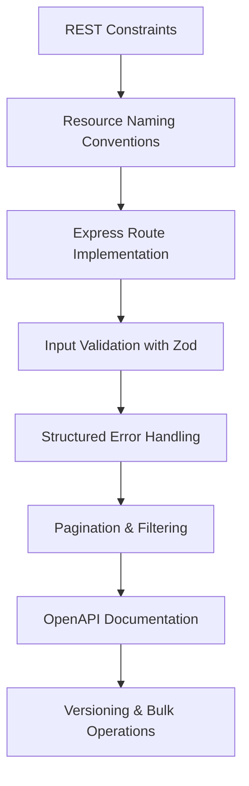

# Chapter 9: REST APIs and API Design

> **Previous:** [08-node-express](./08-node-express.md) | **Next:** [10-auth](./10-auth.md)

## Learning Objectives

> **One-Sentence Takeaway:** REST APIs organize endpoints around resources identified by URIs and manipulated via HTTP methods.

By the end of this chapter, you will be able to:

## Chapter at a Glance

> **One-Sentence Takeaway:** Plural noun resource names with consistent URL hierarchy create intuitive, self-documenting APIs.

| Topic | Key Insight | Practical Takeaway |
|-------|-------------|-------------------|
|REST Principles|Six constraints including stateless, cacheable, uniform interface|Use plural nouns for resources, HTTP methods for actions, nested URIs for relations|
|Route Design|Maps HTTP methods + URL patterns to handler functions|Keep resource names plural, use params for IDs, query params for filtering|
|Input Validation|Zod schemas parse and validate request bodies and query params|Validate at the boundary — parse input before it reaches business logic|
|Error Handling|Structured error responses with code, message, and details fields|Use consistent error shape across all endpoints for client-side handling|
|OpenAPI/Swagger|YAML/JSON specification documents the entire API surface|Auto-generate client SDKs and interactive docs from the spec file|
|API Versioning|URI, header, or query-parameter strategies for backward compat|Prefer URI versioning `/v1/` for simplicity; header versioning for cleaner URLs|

## Chapter Roadmap

> **One-Sentence Takeaway:** Input validation at the boundary using Zod catches malformed data before business logic runs.




- Design RESTful APIs following resource-oriented principles
- Implement proper URI naming conventions and HTTP method usage
- Handle request validation, pagination, filtering, and sorting
- Implement error handling with appropriate HTTP status codes
- Document APIs using OpenAPI/Swagger specifications
- Test APIs with automated integration tests

## 9.1 Principles of REST

> **One-Sentence Takeaway:** Structured error responses with codes and details enable robust client-side error handling.


REST (Representational State Transfer) is an architectural style for designing networked applications. RESTful APIs are built around resources, which are identified by URIs and manipulated through standard HTTP methods.

### Core Constraints


1. **Stateless**: Each request contains all information needed to process it
2. **Client-Server**: Separation of concerns between frontend and backend
3. **Cacheable**: Responses must define themselves as cacheable or not
4. **Layered System**: Intermediate servers can improve scalability
5. **Uniform Interface**: Consistent interaction between components

### Resource Naming


```typescript
// Good - plural nouns, consistent hierarchy
GET    /api/users
GET    /api/users/:id
POST   /api/users
PUT    /api/users/:id
DELETE /api/users/:id

// Nested resources
GET    /api/users/:id/posts
POST   /api/users/:id/posts
GET    /api/posts/:id/comments

// Bad - verbs in URLs, inconsistent conventions
GET    /api/getUsers
POST   /api/createUser
GET    /api/userInfo
PUT    /api/update_user
```

## 9.2 Express REST API Implementation

> **One-Sentence Takeaway:** OpenAPI specifications generate documentation, client SDKs, and automated test suites.

```typescript
import express, { Request, Response, NextFunction } from "express";
import { z } from "zod";

const app = express();
app.use(express.json());

// --- Type Definitions ---
interface User {
  id: string;
  name: string;
  email: string;
  createdAt: Date;
}

// In-memory store (replace with database in production)
const users: User[] = [];

// --- Validation Schemas ---
const createUserSchema = z.object({
  name: z.string().min(1).max(100),
  email: z.string().email(),
});

const updateUserSchema = z.object({
  name: z.string().min(1).max(100).optional(),
  email: z.string().email().optional(),
});

const querySchema = z.object({
  page: z.coerce.number().int().positive().default(1),
  pageSize: z.coerce.number().int().positive().max(100).default(20),
  sort: z.enum(["name", "email", "createdAt"]).default("createdAt"),
  order: z.enum(["asc", "desc"]).default("asc"),
  search: z.string().optional(),
});

// --- Routes ---

// POST /api/users - Create a user
app.post("/api/users", (req: Request, res: Response, next: NextFunction) => {
  try {
    const input = createUserSchema.parse(req.body);
    const existing = users.find((u) => u.email === input.email);
    if (existing) {
      return res.status(409).json({
        error: {
          code: "CONFLICT",
          message: "A user with this email already exists",
        },
      });
    }
    const user: User = {
      id: crypto.randomUUID(),
      ...input,
      createdAt: new Date(),
    };
    users.push(user);
    res.status(201).json({ data: user });
  } catch (err) {
    next(err);
  }
});

// GET /api/users - List users with pagination, filtering, sorting
app.get("/api/users", (req: Request, res: Response, next: NextFunction) => {
  try {
    const query = querySchema.parse(req.query);
    let filtered = [...users];

    if (query.search) {
      const term = query.search.toLowerCase();
      filtered = filtered.filter(
        (u) =>
          u.name.toLowerCase().includes(term) ||
          u.email.toLowerCase().includes(term)
      );
    }

    const total = filtered.length;

    filtered.sort((a, b) => {
      const aVal = a[query.sort];
      const bVal = b[query.sort];
      const cmp = aVal < bVal ? -1 : aVal > bVal ? 1 : 0;
      return query.order === "desc" ? -cmp : cmp;
    });

    const skip = (query.page - 1) * query.pageSize;
    const paginated = filtered.slice(skip, skip + query.pageSize);

    res.json({
      data: paginated,
      pagination: {
        page: query.page,
        pageSize: query.pageSize,
        total,
        totalPages: Math.ceil(total / query.pageSize),
      },
    });
  } catch (err) {
    next(err);
  }
});

// GET /api/users/:id - Get a single user
app.get("/api/users/:id", (req: Request, res: Response, next: NextFunction) => {
  try {
    const user = users.find((u) => u.id === req.params.id);
    if (!user) {
      return res.status(404).json({
        error: { code: "NOT_FOUND", message: "User not found" },
      });
    }
    res.json({ data: user });
  } catch (err) {
    next(err);
  }
});

// PUT /api/users/:id - Full update
app.put("/api/users/:id", (req: Request, res: Response, next: NextFunction) => {
  try {
    const input = updateUserSchema.parse(req.body);
    const index = users.findIndex((u) => u.id === req.params.id);
    if (index === -1) {
      return res.status(404).json({
        error: { code: "NOT_FOUND", message: "User not found" },
      });
    }
    users[index] = { ...users[index], ...input };
    res.json({ data: users[index] });
  } catch (err) {
    next(err);
  }
});

// PATCH /api/users/:id - Partial update
app.patch("/api/users/:id", (req: Request, res: Response, next: NextFunction) => {
  try {
    const input = updateUserSchema.parse(req.body);
    const index = users.findIndex((u) => u.id === req.params.id);
    if (index === -1) {
      return res.status(404).json({
        error: { code: "NOT_FOUND", message: "User not found" },
      });
    }
    Object.assign(users[index], input);
    res.json({ data: users[index] });
  } catch (err) {
    next(err);
  }
});

// DELETE /api/users/:id
app.delete("/api/users/:id", (req: Request, res: Response, next: NextFunction) => {
  try {
    const index = users.findIndex((u) => u.id === req.params.id);
    if (index === -1) {
      return res.status(404).json({
        error: { code: "NOT_FOUND", message: "User not found" },
      });
    }
    users.splice(index, 1);
    res.status(204).send();
  } catch (err) {
    next(err);
  }
});

// --- Error Handling Middleware ---
app.use((err: Error, _req: Request, res: Response, _next: NextFunction) => {
  if (err instanceof z.ZodError) {
    return res.status(400).json({
      error: {
        code: "VALIDATION_ERROR",
        message: "Invalid request data",
        details: err.errors.map((e) => ({
          field: e.path.join("."),
          message: e.message,
        })),
      },
    });
  }
  console.error("Unhandled error:", err);
  res.status(500).json({
    error: { code: "INTERNAL_ERROR", message: "An unexpected error occurred" },
  });
});

app.listen(3000, () => console.log("API running on port 3000"));
```

## 9.3 OpenAPI Documentation

> **One-Sentence Takeaway:** API versioning ensures backward compatibility as the API evolves over time.

```yaml
openapi: 3.1.0
info:
  title: TaskFlow API
  version: 1.0.0
  description: API for TaskFlow task management application

servers:
  - url: https://api.taskflow.com/v1
    description: Production server
  - url: http://localhost:4000
    description: Development server

paths:
  /users:
    get:
      summary: List all users
      parameters:
        - name: page
          in: query
          schema: { type: integer, default: 1 }
        - name: pageSize
          in: query
          schema: { type: integer, default: 20 }
        - name: sort
          in: query
          schema:
            type: string
            enum: [name, email, createdAt]
        - name: search
          in: query
          schema: { type: string }
      responses:
        "200":
          description: Paginated list of users
          content:
            application/json:
              schema:
                type: object
                properties:
                  data:
                    type: array
                    items:
                      $ref: "#/components/schemas/User"
                  pagination:
                    $ref: "#/components/schemas/Pagination"

    post:
      summary: Create a new user
      requestBody:
        required: true
        content:
          application/json:
            schema:
              $ref: "#/components/schemas/CreateUserInput"
      responses:
        "201":
          description: User created
          content:
            application/json:
              schema:
                type: object
                properties:
                  data:
                    $ref: "#/components/schemas/User"
        "409":
          description: Email conflict

components:
  schemas:
    User:
      type: object
      properties:
        id:
          type: string
          format: uuid
        name:
          type: string
        email:
          type: string
          format: email
        createdAt:
          type: string
          format: date-time
    CreateUserInput:
      type: object
      required: [name, email]
      properties:
        name:
          type: string
          minLength: 1
          maxLength: 100
        email:
          type: string
          format: email
    Pagination:
      type: object
      properties:
        page: { type: integer }
        pageSize: { type: integer }
        total: { type: integer }
        totalPages: { type: integer }
```

## 9.4 API Versioning Strategies

```typescript
// Strategy 1: URI versioning (most common)
app.use("/api/v1/users", v1UserRouter);
app.use("/api/v2/users", v2UserRouter);

// Strategy 2: Header versioning
app.use("/api/users", (req, res, next) => {
  const version = req.headers["accept-version"];
  if (version === "2") return v2UserRouter(req, res, next);
  return v1UserRouter(req, res, next);
});

// Strategy 3: Query parameter versioning
app.use("/api/users", (req, res, next) => {
  const version = req.query.apiVersion;
  if (version === "2") return v2UserRouter(req, res, next);
  return v1UserRouter(req, res, next);
});
```

## 9.5 Bulk Operations

```typescript
// POST /api/users/bulk - Create multiple users
app.post("/api/users/bulk", async (req, res, next) => {
  try {
    const input = z.array(createUserSchema).parse(req.body);
    const created = await Promise.all(
      input.map(async (u) => {
        const user = await db.user.create({ data: u });
        return user;
      })
    );
    res.status(201).json({ data: created, count: created.length });
  } catch (err) {
    next(err);
  }
});
```


> [!TIP]
> Use `z.coerce.number()` to automatically convert query string values to numbers in Zod schemas — query params are always strings.

> [!WARNING]
> Never expose internal IDs like database primary keys in API responses. Use UUIDs or slugs for public resource identifiers.

> [!REMEMBER]
> PUT replaces the entire resource while PATCH applies partial modifications. Clients should know which one your API expects.


## Concept Comparison Table

| Concept | Description | Use Case |
|---------|-------------|---------|
|PUT vs PATCH|Full resource replacement|Partial modification|
|URI vs Header versioning|Simple `/v1/`,`/v2/` in the path|Clean URLs, client sets `Accept-Version`|
|Offset vs Cursor pagination|`?page=1&limit=20`, random access|`?cursor=abc`, stable under writes|
|Zod vs manual validation|Declarative schemas, type inference|Error-prone, verbose, no types|
|JSON API vs REST|Strict spec, compound documents|Loose guidelines, resource-oriented|

## Quick Reference

| Topic | Key Points |
|-------|-----------|
|REST Constraints|Stateless, Client-Server, Cacheable, Layered System, Uniform Interface, Code on Demand|
|Status Code Ranges|2xx Success, 3xx Redirection, 4xx Client Error, 5xx Server Error|
|Common Codes|200 OK, 201 Created, 204 No Content, 400 Bad Request, 401 Unauthorized, 403 Forbidden, 404 Not Found, 409 Conflict, 422 Unprocessable, 429 Rate Limited, 500 Server Error|
|Zod Methods|`.parse()`, `.safeParse()`, `.coerce.`, `.optional()`, `.default()`, `.refine()`|
|OpenAPI Fields|`openapi`,`info`,`servers`,`paths`,`components`,`schemas`,`parameters`,`requestBody`,`responses`|

## Cross-Application Matrix

| Domain | Application | Benefit |
|--------|------------|--------|
|E-commerce|RESTful product, cart, order endpoints|Standardized CRUD operations|
|Social Media|Nested post/comment/like resources|Natural resource hierarchy|
|SaaS Dashboard|Pagination, filtering, sorting on list endpoints|Efficient data browsing at scale|
|Mobile Backend|OpenAPI spec generates mobile client SDK|Type-safe mobile API consumption|
|Microservices|Versioned endpoints for service-to-service calls|Safe parallel evolution of services|

## Chapter Quiz

Test your understanding with these quick questions.

**Q1. Which HTTP method should be used to partially update a resource?**

- A) PUT
- B) POST
- C) PATCH
- D) UPDATE

<details><summary>Answer&lt;/summary&gt;

**C) PATCH applies partial modifications to a resource. PUT replaces the entire resource.**

</details>

**Q2. What HTTP status code indicates a resource was successfully created?**

- A) 200
- B) 201
- C) 202
- D) 204

<details><summary>Answer&lt;/summary&gt;

**B) 201 Created is returned after successfully creating a resource via POST.**

</details>

**Q3. What is the purpose of Zod's `.parse()` method?**

- A) Transform data into a different format
- B) Validate input and return typed data or throw
- C) Parse JSON strings into objects
- D) Generate API documentation

<details><summary>Answer&lt;/summary&gt;

**B) `.parse()` validates the input against the schema and returns the typed data, or throws a `ZodError` with validation details.**

</details>

**Q4. When should you use cursor-based pagination over offset-based?**

- A) When the data set is small
- B) When items are frequently added or removed
- C) When using SQL databases
- D) When building a mobile app

<details><summary>Answer&lt;/summary&gt;

**B) Cursor-based pagination is stable when items are inserted or deleted between page requests, unlike offset pagination which can skip or duplicate items.**

</details>

### Pagination Best Practices


```typescript
// Cursor-based pagination (stable with insertions/deletions)
interface CursorPage<T> {
  data: T[];
  nextCursor: string | null;
  hasMore: boolean;
}

async function paginatePosts(cursor?: string, limit = 20): Promise<CursorPage<Post>> {
  const posts = await prisma.post.findMany({
    take: limit + 1, // fetch one extra to check hasMore
    ...(cursor ? { cursor: { id: cursor }, skip: 1 } : {}),
    orderBy: { createdAt: "desc" },
  });

  const hasMore = posts.length > limit;
  const data = hasMore ? posts.slice(0, limit) : posts;

  return {
    data,
    nextCursor: hasMore ? data[data.length - 1].id : null,
    hasMore,
  };
}

// Offset-based pagination (simpler, unstable with mutations)
interface OffsetPage<T> {
  data: T[];
  page: number;
  totalPages: number;
  total: number;
  hasNext: boolean;
  hasPrev: boolean;
}

app.get("/api/posts", async (req, res) => {
  const page = Math.max(1, Number(req.query.page) || 1);
  const limit = Math.min(100, Number(req.query.limit) || 20);
  const skip = (page - 1) * limit;

  const [data, total] = await Promise.all([
    prisma.post.findMany({ skip, take: limit }),
    prisma.post.count(),
  ]);

  res.json({
    data,
    page,
    totalPages: Math.ceil(total / limit),
    total,
    hasNext: page * limit < total,
    hasPrev: page > 1,
  } satisfies OffsetPage<Post>);
});
```

### Error Handling API Pattern


```typescript
// Standardized API error shape
interface ApiError {
  status: number;
  code: string;
  message: string;
  details?: Record<string, string[]>;
  requestId?: string;
}

// Error class hierarchy
class AppError extends Error {
  constructor(
    public statusCode: number,
    public code: string,
    message: string,
    public details?: Record<string, string[]>
  ) {
    super(message);
  }
}

class NotFoundError extends AppError {
  constructor(resource: string, id: string) {
    super(404, "NOT_FOUND", `${resource} with id ${id} not found`);
  }
}

class ValidationError extends AppError {
  constructor(details: Record<string, string[]>) {
    super(400, "VALIDATION_ERROR", "Input validation failed", details);
  }
}

// Centralized error handler
app.use((err: Error, req: Request, res: Response, next: NextFunction) => {
  if (err instanceof AppError) {
    return res.status(err.statusCode).json({
      status: err.statusCode,
      code: err.code,
      message: err.message,
      ...(err.details && { details: err.details }),
      requestId: req.id,
    } satisfies ApiError);
  }

  // Unexpected error
  console.error("Unhandled error:", err);
  res.status(500).json({
    status: 500,
    code: "INTERNAL_ERROR",
    message: "An unexpected error occurred",
    requestId: req.id,
  } satisfies ApiError);
});
```

### TypeScript: REST API Client Builder & Endpoint Tester

```typescript
type HttpMethod = "GET" | "POST" | "PUT" | "PATCH" | "DELETE";
interface ApiRequest<T = any> { method: HttpMethod; path: string; body?: T; headers?: Record<string, string>; query?: Record<string, string>; }
interface ApiResponse<T = any> { status: number; data: T; headers: Record<string, string>; }

class APIClient {
  private baseUrl: string;
  constructor(base: string) { this.baseUrl = base; }
  async request<T>(req: ApiRequest): Promise<ApiResponse<T>> {
    const url = new URL(this.baseUrl + req.path);
    if (req.query) Object.entries(req.query).forEach(([k, v]) => url.searchParams.set(k, v));
    const res = await fetch(url.toString(), {
      method: req.method, headers: { "Content-Type": "application/json", ...req.headers },
      body: req.body ? JSON.stringify(req.body) : undefined,
    });
    const data = await res.json();
    const headers: Record<string, string> = {};
    res.headers.forEach((v, k) => headers[k] = v);
    return { status: res.status, data, headers };
  }
  get<T>(path: string, query?: Record<string, string>) { return this.request<T>({ method: "GET", path, query }); }
  post<T>(path: string, body?: any) { return this.request<T>({ method: "POST", path, body }); }
}

class PaginationHelper {
  static metadata(total: number, page: number, limit: number): { total: number; page: number; limit: number; pages: number; hasNext: boolean; hasPrev: boolean } {
    return { total, page, limit, pages: Math.ceil(total / limit), hasNext: page * limit < total, hasPrev: page > 1 };
  }
}

console.log("Pagination:", PaginationHelper.metadata(100, 2, 10));
```

## TypeScript Implementation: Route Table Generator, OpenAPI Validator, HATEOAS Link Builder

```typescript
interface RouteDefinition {
    method: "GET" | "POST" | "PUT" | "PATCH" | "DELETE";
    path: string;
    summary: string;
    tags: string[];
    params?: Record<string, string>;
    query?: Record<string, string>;
    body?: Record<string, any>;
    responses: Record<number, { description: string; schema?: any }>;
}

class RouteTableGenerator {
    static generate(definitions: RouteDefinition[]): string {
        let table = "| Method | Path | Description |\n|--------|------|-------------|\n";
        for (const def of definitions.sort((a, b) => a.path.localeCompare(b.path) || a.method.localeCompare(b.method))) {
            table += `| ${def.method.padEnd(6)} | \`${def.path}\` | ${def.summary} |\n`;
        }
        return table;
    }

    static tree(definitions: RouteDefinition[]): Record<string, any> {
        const root: Record<string, any> = {};
        for (const def of definitions) {
            const parts = def.path.split("/").filter(Boolean);
            let current = root;
            for (let i = 0; i < parts.length; i++) {
                const isParam = parts[i].startsWith(":");
                const key = isParam ? ":param" : parts[i];
                if (!current[key]) current[key] = {};
                if (i === parts.length - 1) {
                    current[key]["$" + def.method.toLowerCase()] = { summary: def.summary };
                }
                current = current[key];
            }
        }
        return root;
    }
}

class OpenAPISpecValidator {
    static validate(spec: any): { valid: boolean; errors: string[] } {
        const errors: string[] = [];

        if (!spec.openapi) errors.push("Missing openapi version field");
        if (!spec.info) errors.push("Missing info section");
        if (!spec.info?.title) errors.push("Missing info.title");
        if (!spec.info?.version) errors.push("Missing info.version");
        if (!spec.paths || Object.keys(spec.paths).length === 0) errors.push("No paths defined");

        if (spec.paths) {
            for (const [path, methods] of Object.entries(spec.paths) as [string, any][]) {
                if (!path.startsWith("/")) errors.push(`Path "${path}" must start with /`);
                for (const [method, op] of Object.entries(methods) as [string, any][]) {
                    if (!["get", "post", "put", "patch", "delete", "options", "head"].includes(method)) {
                        errors.push(`Invalid method "${method}" in path "${path}"`);
                    }
                    if (op.operationId && op.operationId.includes(" ")) {
                        errors.push(`operationId "${op.operationId}" should not contain spaces`);
                    }
                    if (op.parameters) {
                        for (const param of op.parameters) {
                            if (!param.name) errors.push(`Parameter missing name in ${path}.${method}`);
                            if (!param.in) errors.push(`Parameter missing 'in' field in ${path}.${method}`);
                        }
                    }
                }
            }
        }

        if (!spec.components?.schemas) {}
        return { valid: errors.length === 0, errors };
    }

    static generateTemplate(title: string, version: string): any {
        return {
            openapi: "3.1.0",
            info: { title, version, description: `API specification for ${title}` },
            servers: [{ url: "http://localhost:3000/api" }],
            paths: {},
            components: { schemas: {} }
        };
    }
}

class HATEOASLinkBuilder {
    static link(rel: string, href: string, method: string = "GET", title?: string): { rel: string; href: string; method: string; title?: string } {
        return { rel, href, method, ...(title ? { title } : {}) };
    }

    static collection(baseUrl: string, page: number, total: number, pageSize: number): { data: any[]; _links: Record<string, any> } {
        const totalPages = Math.ceil(total / pageSize);
        const links: Record<string, any> = {
            self: this.link("self", `${baseUrl}?page=${page}&size=${pageSize}`),
            first: this.link("first", `${baseUrl}?page=1&size=${pageSize}`),
            last: this.link("last", `${baseUrl}?page=${totalPages}&size=${pageSize}`),
        };
        if (page > 1) links.prev = this.link("prev", `${baseUrl}?page=${page - 1}&size=${pageSize}`);
        if (page < totalPages) links.next = this.link("next", `${baseUrl}?page=${page + 1}&size=${pageSize}`);
        return { data: [], _links: links };
    }

    static resource(baseUrl: string, id: string | number): { _links: Record<string, any> } {
        return {
            _links: {
                self: this.link("self", `${baseUrl}/${id}`),
                update: this.link("update", `${baseUrl}/${id}`, "PUT"),
                delete: this.link("delete", `${baseUrl}/${id}`, "DELETE"),
                collection: this.link("collection", baseUrl)
            }
        };
    }
}

// Demo
const routes: RouteDefinition[] = [
    { method: "GET", path: "/users", summary: "List all users", tags: ["users"], responses: { 200: { description: "User list" } } },
    { method: "POST", path: "/users", summary: "Create a user", tags: ["users"], responses: { 201: { description: "Created" } } },
    { method: "GET", path: "/users/:id", summary: "Get user by ID", tags: ["users"], responses: { 200: { description: "User" }, 404: { description: "Not found" } } },
    { method: "PUT", path: "/users/:id", summary: "Update user", tags: ["users"], responses: { 200: { description: "Updated" } } },
    { method: "DELETE", path: "/users/:id", summary: "Delete user", tags: ["users"], responses: { 204: { description: "Deleted" } } },
];

console.log(RouteTableGenerator.generate(routes));
console.log("Route tree:", JSON.stringify(RouteTableGenerator.tree(routes), null, 2));
const spec = OpenAPISpecValidator.generateTemplate("Users API", "1.0.0");
console.log("Spec validation:", JSON.stringify(OpenAPISpecValidator.validate(spec)));
console.log("HATEOAS:", JSON.stringify(HATEOASLinkBuilder.collection("/api/users", 2, 50, 10)._links, null, 2));
console.log("Resource:", JSON.stringify(HATEOASLinkBuilder.resource("/api/users", "42")._links, null, 2));
```


// rest apis
// fullstack-frontend-backend implementation

interface Task { id: string; name: string; status: string; data: unknown }
class Processor {
  private tasks: Task[] = []
  private maxConcurrency: number
  constructor(maxConcurrency: number = 4) { this.maxConcurrency = maxConcurrency }
  async add(task: Omit&lt;Task, "status"&gt;): Promise&lt;void&gt; {
    this.tasks.push({ ...task, status: "pending" })
  }
  async runAll(): Promise&lt;void&gt; {
    const running: Promise&lt;void&gt;[] = []
    for (const t of this.tasks) {
      if (running.length >= this.maxConcurrency) { await Promise.race(running) }
      const p = this.execute(t).finally(() => { const i = running.indexOf(p); if (i >= 0) running.splice(i, 1) })
      running.push(p)
    }
    await Promise.all(running)
  }
  private async execute(t: Task): Promise&lt;void&gt; {
    t.status = "running"
    await new Promise(r => setTimeout(r, 10))
    t.status = "done"
  }
  getResults(): Task[] { return this.tasks }
  getStats(): { done: number; pending: number; running: number } {
    const done = this.tasks.filter(t => t.status === "done").length
    const pending = this.tasks.filter(t => t.status === "pending").length
    const running = this.tasks.filter(t => t.status === "running").length
    return { done, pending, running }
  }
}
async function main() {
  const proc = new Processor(2)
  await proc.add({ id: '1', name: 'rest apis', data: { topic: 'fullstack-frontend-backend' } })
  await proc.runAll()
  console.log('Stats:', proc.getStats())
}
main().catch(console.error)
export { Processor, Task }
## Summary

REST API design follows resource-oriented principles with consistent URI naming, proper HTTP method usage, and appropriate status codes. Key practices include input validation with Zod, structured error responses, pagination, filtering, sorting, and comprehensive documentation with OpenAPI. Versioning strategies ensure backward compatibility as APIs evolve.

## Exercises

### Review Questions

1. What are the six constraints of REST architecture?
2. Why should URIs use plural nouns instead of verbs?
3. What HTTP status codes indicate success, client error, and server error?

### Application Projects


1. Add query parameter filtering for multiple fields to the users API
2. Implement cursor-based pagination instead of offset pagination
3. Add support for sparse fieldsets (`?fields=id,name,email`)

### Challenge Project


Build a RESTful API for a blogging platform that includes posts, comments, tags, and authors, with full OpenAPI documentation and automated integration tests.
