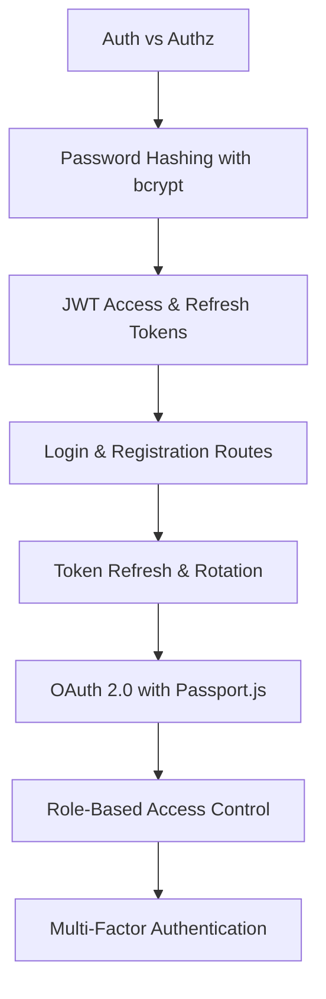

# Chapter 10: Authentication and Authorization

> **Previous:** [09-rest-apis](./09-rest-apis.md) | **Next:** [11-databases-web](./11-databases-web.md)

## Learning Objectives

> **One-Sentence Takeaway:** Authentication verifies identity; authorization determines what an authenticated user can access.

By the end of this chapter, you will be able to:

## Chapter at a Glance

> **One-Sentence Takeaway:** bcrypt with 12+ salt rounds hashes passwords with built-in salting to resist rainbow table attacks.

| Topic | Key Insight | Practical Takeaway |
|-------|-------------|-------------------|
|Auth vs Auth|Authentication verifies identity; authorization controls access|Always check auth first, then authz — never skip either step|
|Password Hashing|bcrypt with salt rounds makes rainbow table attacks infeasible|Use 12+ salt rounds — higher is slower but more resistant to GPU cracking|
|JWT Tokens|Stateless access tokens (short-lived) and refresh tokens (long-lived)|Keep access tokens to 15min, rotate refresh tokens on each use to detect theft|
|OAuth 2.0|Delegated authorization via third-party providers (Google, GitHub)|Use Passport.js strategies for standardized social login integration|
|RBAC|Role-based access control maps permissions to roles, not users|Define roles as enums with explicit permission matrices for each role|
|MFA/TOTP|Time-based one-time passwords add a second factor beyond passwords|Store TOTP secrets encrypted; provide recovery codes for account recovery|

## Chapter Roadmap

> **One-Sentence Takeaway:** JWTs provide stateless authentication with short-lived access tokens and longer-lived refresh tokens.




- Implement session-based and token-based authentication
- Create JWT-based authentication with refresh tokens
- Implement OAuth 2.0 flows for third-party authentication
- Apply role-based access control (RBAC) and permissions
- Secure passwords using bcrypt and follow security best practices
- Implement multi-factor authentication with TOTP

## 10.1 Authentication vs Authorization

> **One-Sentence Takeaway:** OAuth 2.0 delegates identity verification to trusted providers like Google and GitHub.


**Authentication** verifies who a user is (identity). **Authorization** determines what they can access (permissions).

```typescript
// Authentication: verifying identity
function authenticate(req: Request, res: Response, next: NextFunction) {
  const token = req.headers.authorization?.split(" ")[1];
  if (!token) return res.status(401).json({ message: "Unauthenticated" });
  try {
    const payload = jwt.verify(token, process.env.JWT_SECRET!);
    req.user = payload;
    next();
  } catch {
    res.status(401).json({ message: "Invalid token" });
  }
}

// Authorization: checking permissions
function authorize(...roles: string[]) {
  return (req: Request, res: Response, next: NextFunction) => {
    if (!roles.includes(req.user.role)) {
      return res.status(403).json({ message: "Forbidden" });
    }
    next();
  };
}
```

## 10.2 Password Hashing with bcrypt

> **One-Sentence Takeaway:** RBAC assigns permissions to roles and roles to users, simplifying permission management at scale.

```typescript
import bcrypt from "bcryptjs";

const SALT_ROUNDS = 12;

export async function hashPassword(password: string): Promise<string> {
  return bcrypt.hash(password, SALT_ROUNDS);
}

export async function verifyPassword(
  password: string,
  hash: string
): Promise<boolean> {
  return bcrypt.compare(password, hash);
}

// Usage
const passwordHash = await hashPassword("userPassword123");
const isValid = await verifyPassword("userPassword123", passwordHash);
```

## 10.3 JWT Authentication

> **One-Sentence Takeaway:** TOTP-based multi-factor authentication adds a critical second layer of security beyond passwords.

```typescript
import jwt from "jsonwebtoken";
import { z } from "zod";

const ACCESS_SECRET = process.env.JWT_SECRET!;
const REFRESH_SECRET = process.env.JWT_REFRESH_SECRET!;

interface TokenPayload {
  userId: string;
  role: string;
}

export function generateAccessToken(payload: TokenPayload): string {
  return jwt.sign(payload, ACCESS_SECRET, { expiresIn: "15m" });
}

export function generateRefreshToken(payload: TokenPayload): string {
  return jwt.sign(payload, REFRESH_SECRET, { expiresIn: "7d" });
}

export function verifyAccessToken(token: string): TokenPayload {
  return jwt.verify(token, ACCESS_SECRET) as TokenPayload;
}

// Login route
router.post("/login", async (req, res, next) => {
  try {
    const { email, password } = loginSchema.parse(req.body);
    const user = await prisma.user.findUnique({ where: { email } });
    if (!user || !(await verifyPassword(password, user.passwordHash))) {
      return res.status(401).json({ message: "Invalid credentials" });
    }

    const payload: TokenPayload = { userId: user.id, role: user.role };
    const accessToken = generateAccessToken(payload);
    const refreshToken = generateRefreshToken(payload);

    // Store refresh token hash for rotation
    const refreshHash = await hashPassword(refreshToken);
    await prisma.session.create({
      data: { userId: user.id, refreshHash, expiresAt: new Date(Date.now() + 7 * 24 * 60 * 60 * 1000) },
    });

    res.json({
      data: { user: { id: user.id, email: user.email, name: user.name } },
      tokens: { accessToken, refreshToken },
    });
  } catch (err) {
    next(err);
  }
});

// Token refresh with rotation
router.post("/refresh", async (req, res, next) => {
  try {
    const { refreshToken } = req.body;
    const payload = verifyAccessToken(refreshToken); // Reuse verify, but in practice use separate secret

    // Validate session exists
    const sessions = await prisma.session.findMany({
      where: { userId: payload.userId },
    });
    const valid = await Promise.any(
      sessions.map((s) => verifyPassword(refreshToken, s.refreshHash))
    ).catch(() => false);
    if (!valid) {
      // Possible token theft - revoke all sessions
      await prisma.session.deleteMany({ where: { userId: payload.userId } });
      return res.status(401).json({ message: "Token revoked" });
    }

    const newPayload: TokenPayload = { userId: payload.userId, role: payload.role };
    const newAccessToken = generateAccessToken(newPayload);
    const newRefreshToken = generateRefreshToken(newPayload);

    res.json({
      data: { accessToken: newAccessToken, refreshToken: newRefreshToken },
    });
  } catch (err) {
    next(err);
  }
});
```

## 10.4 OAuth 2.0 with Passport.js

```typescript
import passport from "passport";
import { Strategy as GoogleStrategy } from "passport-google-oauth20";

passport.use(
  new GoogleStrategy(
    {
      clientID: process.env.GOOGLE_CLIENT_ID!,
      clientSecret: process.env.GOOGLE_CLIENT_SECRET!,
      callbackURL: "/api/auth/google/callback",
      scope: ["profile", "email"],
    },
    async (_accessToken, _refreshToken, profile, done) => {
      let user = await prisma.user.findUnique({
        where: { googleId: profile.id },
      });
      if (!user) {
        user = await prisma.user.create({
          data: {
            googleId: profile.id,
            email: profile.emails![0].value,
            name: profile.displayName,
            avatar: profile.photos?.[0]?.value,
          },
        });
      }
      done(null, user);
    }
  )
);

// Routes
router.get("/google", passport.authenticate("google"));
router.get(
  "/google/callback",
  passport.authenticate("google", { session: false }),
  (req, res) => {
    const user = req.user as User;
    const accessToken = generateAccessToken({ userId: user.id, role: user.role });
    res.redirect(`http://localhost:3000/auth/callback?token=${accessToken}`);
  }
);
```

## 10.5 Role-Based Access Control

```typescript
enum Role {
  Admin = "ADMIN",
  Manager = "MANAGER",
  Member = "MEMBER",
  Viewer = "VIEWER",
}

interface Permission {
  resource: string;
  action: "create" | "read" | "update" | "delete" | "manage";
}

const rolePermissions: Record<Role, Permission[]> = {
  [Role.Admin]: [
    { resource: "*", action: "manage" },
  ],
  [Role.Manager]: [
    { resource: "project", action: "create" },
    { resource: "project", action: "read" },
    { resource: "project", action: "update" },
    { resource: "task", action: "manage" },
    { resource: "member", action: "read" },
  ],
  [Role.Member]: [
    { resource: "task", action: "create" },
    { resource: "task", action: "read" },
    { resource: "task", action: "update" },
    { resource: "project", action: "read" },
  ],
  [Role.Viewer]: [
    { resource: "task", action: "read" },
    { resource: "project", action: "read" },
  ],
};

function hasPermission(userRole: Role, resource: string, action: string): boolean {
  const permissions = rolePermissions[userRole];
  return permissions.some(
    (p) =>
      (p.resource === "*" || p.resource === resource) &&
      (p.action === "manage" || p.action === action)
  );
}

// Authorization middleware
function requirePermission(resource: string, action: string) {
  return (req: AuthenticatedRequest, res: Response, next: NextFunction) => {
    if (!hasPermission(req.user.role, resource, action)) {
      return res.status(403).json({ message: "Insufficient permissions" });
    }
    next();
  };
}

// Usage
router.delete(
  "/api/projects/:id",
  authenticate,
  requirePermission("project", "delete"),
  deleteProject
);
```

## 10.6 API Key Authentication

For machine-to-machine communication, API keys provide a simple authentication mechanism.

```typescript
import crypto from "crypto";

interface ApiKey {
  key: string;
  name: string;
  scopes: string[];
  expiresAt: Date | null;
  createdAt: Date;
}

// Generate a secure API key
function generateApiKey(): { key: string; hash: string } {
  const key = `tf_${crypto.randomBytes(32).toString("hex")}`;
  const hash = crypto.createHash("sha256").update(key).digest("hex");
  return { key, hash };
}

// API key authentication middleware
async function authenticateApiKey(req: Request, res: Response, next: NextFunction) {
  const apiKey = req.headers["x-api-key"] as string;
  if (!apiKey) {
    return res.status(401).json({ message: "API key required" });
  }

  const hash = crypto.createHash("sha256").update(apiKey).digest("hex");
  const keyRecord = await prisma.apiKey.findUnique({ where: { hash } });

  if (!keyRecord || (keyRecord.expiresAt && keyRecord.expiresAt < new Date())) {
    return res.status(401).json({ message: "Invalid or expired API key" });
  }

  req.user = { id: keyRecord.userId, scopes: keyRecord.scopes };
  next();
}

// Scope-based authorization
function requireScope(...scopes: string[]) {
  return (req: AuthenticatedRequest, res: Response, next: NextFunction) => {
    const hasScope = scopes.some((s) => req.user.scopes?.includes(s));
    if (!hasScope) {
      return res.status(403).json({ message: "Insufficient scope" });
    }
    next();
  };
}

// Routes
router.get("/api/orders", authenticateApiKey, requireScope("orders:read"), getOrders);
router.post("/api/orders", authenticateApiKey, requireScope("orders:write"), createOrder);
```

## 10.7 Session Management Dashboard

```typescript
// List active sessions for a user
router.get("/api/sessions", authenticate, async (req, res) => {
  const sessions = await prisma.session.findMany({
    where: { userId: req.user.userId },
    select: {
      id: true,
      createdAt: true,
      lastUsedAt: true,
      ipAddress: true,
      userAgent: true,
    },
    orderBy: { lastUsedAt: "desc" },
  });

  res.json({
    data: sessions.map((s) => ({
      ...s,
      isCurrentSession: s.id === req.session.id,
    })),
  });
});

// Revoke a specific session
router.delete("/api/sessions/:id", authenticate, async (req, res) => {
  const session = await prisma.session.findFirst({
    where: { id: req.params.id, userId: req.user.userId },
  });

  if (!session) {
    return res.status(404).json({ message: "Session not found" });
  }

  await prisma.session.delete({ where: { id: req.params.id } });
  res.json({ message: "Session revoked" });
});

// Revoke all sessions except current
router.post("/api/sessions/revoke-all", authenticate, async (req, res) => {
  await prisma.session.deleteMany({
    where: { userId: req.user.userId, id: { not: req.session.id } },
  });
  res.json({ message: "All other sessions revoked" });
});
```

## 10.8 Multi-Factor Authentication with TOTP

```typescript
import { authenticator } from "otplib";
import QRCode from "qrcode";

// Setup MFA
router.post("/mfa/setup", authenticate, async (req, res) => {
  const secret = authenticator.generateSecret();
  const otpauth = authenticator.keyuri(req.user.email, "TaskFlow", secret);

  // Store secret temporarily
  req.user.mfaSecret = secret;

  const qrCode = await QRCode.toDataURL(otpauth);
  res.json({ data: { secret, qrCode } });
});

// Verify and enable MFA
router.post("/mfa/verify", authenticate, async (req, res) => {
  const { token } = z.object({ token: z.string().length(6) }).parse(req.body);
  const isValid = authenticator.verify({ token, secret: req.user.mfaSecret! });
  if (!isValid) {
    return res.status(400).json({ message: "Invalid token" });
  }
  await prisma.user.update({
    where: { id: req.user.userId },
    data: { mfaSecret: req.user.mfaSecret, mfaEnabled: true },
  });
  res.json({ message: "MFA enabled" });
});
```


> [!TIP]
> Always rotate refresh tokens on each use. If a stolen refresh token is used alongside the legitimate one, revoke all sessions for that user immediately.

> [!WARNING]
> Never store plaintext passwords or use weak hashing like MD5/SHA1. bcrypt, scrypt, or argon2 are the only acceptable password hashing algorithms.

> [!REMEMBER]
> Authentication failures should return 401 Unauthorized. Authorization failures (insufficient permissions) should return 403 Forbidden. Never confuse these two status codes.

### Session Management Best Practices

```typescript
// Session token rotation — re-issue after privilege elevation
function rotateSession(req: Request, res: Response) {
  const oldSid = req.sessionID;
  req.session.regenerate((err) => {
    if (err) return res.status(500).end();
    req.session.userId = res.locals.userId;
    req.session.role = res.locals.role;
    sessionStore.destroy(oldSid);
    res.json({ rotated: true });
  });
}

// Session fingerprinting — detect hijacking via user-agent + IP mismatch
function sessionFingerprint(req: Request): string {
  const ua = req.headers["user-agent"] ?? "";
  const ip = req.ip ?? "";
  return crypto.createHash("sha256").update(`${ua}|${ip}`).digest("hex");
}

app.use((req, res, next) => {
  if (req.session.fingerprint && req.session.fingerprint !== sessionFingerprint(req)) {
    req.session.destroy(() => res.status(401).json({ error: "Session hijacked" }));
    return;
  }
  req.session.fingerprint = sessionFingerprint(req);
  next();
});
```

### Passwordless Authentication with WebAuthn

WebAuthn replaces passwords with public-key cryptography.

```typescript
// Registration (browser side)
const credential = await navigator.credentials.create({
  publicKey: {
    challenge: new Uint8Array(challenge),
    rp: { name: "TaskFlow", id: "taskflow.example.com" },
    user: {
      id: new Uint8Array(userId),
      name: "alice@example.com",
      displayName: "Alice Johnson",
    },
    pubKeyCredParams: [{ type: "public-key", alg: -7 }], // ES256
  },
});

// Authentication (server side)
const assertion = await navigator.credentials.get({
  publicKey: {
    challenge: new Uint8Array(challenge),
    allowCredentials: credentialIds.map((id) => ({
      type: "public-key",
      id: new Uint8Array(id),
    })),
  },
});
```

## Concept Comparison Table

| Concept | Description | Use Case |
|---------|-------------|---------|
|Authentication vs Authorization|Verifies WHO the user is|Determines WHAT they can do|
|Access Token vs Refresh Token|Short-lived (15min), sent with every request|Long-lived (7d), used only to get new access tokens|
|bcrypt vs SHA256|Slow, salted, resistant to GPU cracking|Fast, unsalted, trivially rainbow-tabled|
|Session vs JWT|Server-side storage, easy to revoke|Stateless, no server storage needed|
|OAuth 2.0 vs SAML|Modern, REST-based, token-focused|Older, XML-based, enterprise-focused|

## Quick Reference

| Topic | Key Points |
|-------|-----------|
|JWT Parts|Header (alg/typ), Payload (claims), Signature (verify integrity)|
|Auth Status Codes|401 Unauthorized (not logged in), 403 Forbidden (insufficient role)|
|bcrypt|`bcrypt.hash(password, 12)`, `bcrypt.compare(password, hash)`|
|OAuth 2.0 Roles|Resource Owner, Client, Authorization Server, Resource Server|
|TOTP|`authenticator.generateSecret()`, `authenticator.verify({token, secret})`|

## Cross-Application Matrix

| Domain | Application | Benefit |
|--------|------------|--------|
|Social Login|OAuth 2.0 with Google/GitHub providers|Frictionless user onboarding|
|Admin Dashboard|RBAC with Admin/Editor/Viewer roles|Granular control over sensitive actions|
|Banking App|MFA + JWT with short access token lifetime|Defense in depth for financial data|
|API Service|API key auth for machine-to-machine|No user interaction needed|
|Multi-tenant SaaS|RBAC per organization with role hierarchies|Isolated permissions per workspace|

## Chapter Quiz

Test your understanding with these quick questions.

**Q1. What is the difference between 401 Unauthorized and 403 Forbidden?**

- A) They are synonyms
- B) 401 means not authenticated, 403 means not authorized
- C) 401 means invalid token, 403 means expired token
- D) 401 is for APIs, 403 is for web pages

<details><summary>Answer</summary>

**B) 401 indicates the client is not authenticated (no valid credentials). 403 indicates the client is authenticated but lacks permission for the requested resource.**

</details>

**Q2. Why should refresh tokens be rotated?**

- A) To reduce server storage
- B) To detect token theft — if a stolen token is used, the old one becomes invalid
- C) To comply with GDPR
- D) To improve API performance

<details><summary>Answer</summary>

**B) Refresh token rotation invalidates the old token each time a new one is issued. If a stolen token is used, the legitimate user's next refresh attempt will fail, signaling theft.**

</details>

**Q3. What salt round count is recommended for bcrypt in production?**

- A) 4
- B) 8
- C) 12
- D) 2

<details><summary>Answer</summary>

**C) 12 or higher. The cost factor is exponential — 12 rounds (2^12 iterations) balances security and performance for production use.**

</details>

**Q4. Which OAuth 2.0 flow is recommended for single-page applications?**

- A) Authorization Code with PKCE
- B) Implicit Flow
- C) Client Credentials
- D) Resource Owner Password

<details><summary>Answer</summary>

**A) Authorization Code with PKCE (Proof Key for Code Exchange) is the recommended flow for SPAs and mobile apps as it prevents authorization code interception attacks.**

</details>

### TypeScript: JWT Token Rotator & Password Strength Meter

```typescript
class JWTManager {
  private static base64UrlEncode(data: string): string {
    return btoa(data).replace(/=/g, "").replace(/\+/g, "-").replace(/\//g, "_");
  }
  private static base64UrlDecode(str: string): string {
    return atob(str.replace(/-/g, "+").replace(/_/g, "/"));
  }
  static createToken(payload: Record<string, any>, secret: string, expiresIn: number): string {
    const header = this.base64UrlEncode(JSON.stringify({ alg: "HS256", typ: "JWT" }));
    const now = Math.floor(Date.now() / 1000);
    const body = this.base64UrlEncode(JSON.stringify({ ...payload, iat: now, exp: now + expiresIn }));
    const sig = this.base64UrlEncode(btoa(secret + "." + header + "." + body));
    return `${header}.${body}.${sig}`;
  }
  static isExpired(token: string): boolean {
    try {
      const payload = JSON.parse(this.base64UrlDecode(token.split(".")[1]));
      return payload.exp < Math.floor(Date.now() / 1000);
    } catch { return true; }
  }
  static rotate(oldToken: string, secret: string, newExpiresIn: number): string {
    if (JWTManager.isExpired(oldToken)) throw new Error("Cannot rotate expired token");
    const payload = JSON.parse(JWTManager.base64UrlDecode(oldToken.split(".")[1]));
    return JWTManager.createToken(payload, secret, newExpiresIn);
  }
}

class PasswordMeter {
  static strength(pw: string): { score: number; label: string; feedback: string[] } {
    let score = 0;
    const feedback: string[] = [];
    if (pw.length >= 8) score += 20; else feedback.push("At least 8 characters");
    if (/[A-Z]/.test(pw)) score += 20; else feedback.push("Add an uppercase letter");
    if (/[a-z]/.test(pw)) score += 20; else feedback.push("Add a lowercase letter");
    if (/\d/.test(pw)) score += 20; else feedback.push("Add a digit");
    if (/[^A-Za-z0-9]/.test(pw)) score += 20; else feedback.push("Add a special character");
    const label = score >= 80 ? "Strong" : score >= 60 ? "Moderate" : score >= 40 ? "Weak" : "Very weak";
    return { score, label, feedback };
  }
}

console.log("Token:", JWTManager.createToken({ userId: 1 }, "secret", 3600).slice(0, 30) + "...");
console.log("Password:", PasswordMeter.strength("Hello123!"));
```

## TypeScript Implementation: JWT Encoder/Decoder, OAuth2 PKCE, bcrypt-Style Hash

```typescript
class JWTEncoder {
    private static base64UrlEncode(data: string): string {
        return Buffer.from(data).toString("base64url").replace(/=+$/, "");
    }

    private static base64UrlDecode(data: string): string {
        return Buffer.from(data, "base64url").toString("utf8");
    }

    private static simpleHash(payload: string, secret: string): string {
        let hash = 0;
        const combined = payload + secret;
        for (let i = 0; i < combined.length; i++) {
            const char = combined.charCodeAt(i);
            hash = ((hash << 5) - hash) + char;
            hash |= 0;
        }
        return Math.abs(hash).toString(16);
    }

    static encode(payload: Record<string, any>, secret: string, expiresInSec: number = 3600): string {
        const header = this.base64UrlEncode(JSON.stringify({ alg: "HS256", typ: "JWT" }));
        const body = { ...payload, iat: Math.floor(Date.now() / 1000), exp: Math.floor(Date.now() / 1000) + expiresInSec };
        const payloadEncoded = this.base64UrlEncode(JSON.stringify(body));
        const signature = this.simpleHash(`${header}.${payloadEncoded}`, secret);
        return `${header}.${payloadEncoded}.${signature}`;
    }

    static decode(token: string): { header: any; payload: any; valid: boolean } {
        const parts = token.split(".");
        if (parts.length !== 3) return { header: null, payload: null, valid: false };
        try {
            const header = JSON.parse(this.base64UrlDecode(parts[0]));
            const payload = JSON.parse(this.base64UrlDecode(parts[1]));
            return { header, payload, valid: true };
        } catch { return { header: null, payload: null, valid: false }; }
    }

    static verify(token: string, secret: string): { valid: boolean; reason?: string } {
        const parts = token.split(".");
        if (parts.length !== 3) return { valid: false, reason: "Malformed token" };
        const signature = this.simpleHash(`${parts[0]}.${parts[1]}`, secret);
        if (signature !== parts[2]) return { valid: false, reason: "Invalid signature" };
        const payload = JSON.parse(this.base64UrlDecode(parts[1]));
        if (payload.exp && payload.exp < Math.floor(Date.now() / 1000)) return { valid: false, reason: "Token expired" };
        return { valid: true };
    }
}

class OAuth2PKCESimulator {
    static generateCodeVerifier(length: number = 43): string {
        const chars = "ABCDEFGHIJKLMNOPQRSTUVWXYZabcdefghijklmnopqrstuvwxyz0123456789-._~";
        let verifier = "";
        for (let i = 0; i < length; i++) verifier += chars[Math.floor(Math.random() * chars.length)];
        return verifier;
    }

    static generateCodeChallengeSHA256(verifier: string): string {
        let hash = 0;
        for (let i = 0; i < verifier.length; i++) {
            hash = ((hash << 5) - hash) + verifier.charCodeAt(i);
            hash |= 0;
        }
        const hex = Math.abs(hash).toString(16);
        return Buffer.from(hex).toString("base64url").replace(/=+$/, "");
    }

    static simulateFlow(): { authUrl: string; code: string; token: string; refresh: string } {
        const verifier = this.generateCodeVerifier();
        const challenge = this.generateCodeChallengeSHA256(verifier);
        const state = Math.random().toString(36).slice(2);
        const authUrl = `https://auth.example.com/authorize?response_type=code&client_id=app&redirect_uri=https://app.example/callback&code_challenge=${challenge}&code_challenge_method=S256&state=${state}`;
        const code = Math.random().toString(36).slice(2);
        const token = JWTEncoder.encode({ sub: "user123", scope: "openid profile" }, "client_secret", 3600);
        const refresh = JWTEncoder.encode({ sub: "user123", type: "refresh" }, "refresh_secret", 604800);
        return { authUrl, code, token, refresh };
    }
}

class BcryptStyleHasher {
    static hash(password: string, rounds: number = 10): { hash: string; salt: string; rounds: number } {
        const chars = "./ABCDEFGHIJKLMNOPQRSTUVWXYZabcdefghijklmnopqrstuvwxyz0123456789";
        let salt = "";
        for (let i = 0; i < 22; i++) salt += chars[Math.floor(Math.random() * chars.length)];
        let hash = 0;
        for (let i = 0; i < password.length; i++) {
            hash = ((hash << 5) - hash) + password.charCodeAt(i);
            hash |= 0;
        }
        for (let r = 0; r < Math.pow(2, rounds); r++) {
            for (let i = 0; i < password.length; i++) {
                hash = ((hash << 5) - hash) + password.charCodeAt(i) + salt.charCodeAt(i % salt.length);
                hash |= 0;
            }
        }
        const hashStr = Math.abs(hash).toString(36);
        return { hash: hashStr, salt, rounds };
    }

    static compare(password: string, storedHash: string, salt: string, rounds: number): boolean {
        const { hash } = this.hash(password, rounds);
        return hash === storedHash;
    }
}

class TOTPGenerator {
    static generate(secret: string, timeStep: number = 30): string {
        const counter = Math.floor(Date.now() / 1000 / timeStep);
        let hash = 0;
        const combined = secret + counter.toString();
        for (let i = 0; i < combined.length; i++) {
            hash = ((hash << 5) - hash) + combined.charCodeAt(i);
            hash |= 0;
        }
        const otp = String(Math.abs(hash) % 1000000).padStart(6, "0");
        return otp;
    }

    static verify(token: string, secret: string, window: number = 1): boolean {
        for (let i = -window; i <= window; i++) {
            const counter = Math.floor(Date.now() / 1000 / 30) + i;
            let hash = 0;
            const combined = secret + counter.toString();
            for (let j = 0; j < combined.length; j++) { hash = ((hash << 5) - hash) + combined.charCodeAt(j); hash |= 0; }
            if (String(Math.abs(hash) % 1000000).padStart(6, "0") === token) return true;
        }
        return false;
    }
}

// Demo
const token = JWTEncoder.encode({ userId: 1, role: "admin" }, "mysecret", 3600);
console.log("JWT:", token.slice(0, 30) + "...");
console.log("Decoded:", JWTEncoder.decode(token));
console.log("Verify:", JWTEncoder.verify(token, "mysecret"));

const flow = OAuth2PKCESimulator.simulateFlow();
console.log("PKCE Auth URL:", flow.authUrl.slice(0, 60) + "...");

const pwd = BcryptStyleHasher.hash("MyPassword123!", 10);
console.log("Hash:", pwd.hash.slice(0, 20) + "...");
console.log("Compare:", BcryptStyleHasher.compare("MyPassword123!", pwd.hash, pwd.salt, pwd.rounds));

const totp = TOTPGenerator.generate("JBSWY3DPEHPK3PXP");
console.log("TOTP:", totp);
console.log("TOTP verify:", TOTPGenerator.verify(totp, "JBSWY3DPEHPK3PXP"));
```


// auth
// fullstack-frontend-backend implementation

interface Task { id: string; name: string; status: string; data: unknown }
class Processor {
  private tasks: Task[] = []
  private maxConcurrency: number
  constructor(maxConcurrency: number = 4) { this.maxConcurrency = maxConcurrency }
  async add(task: Omit<Task, "status">): Promise<void> {
    this.tasks.push({ ...task, status: "pending" })
  }
  async runAll(): Promise<void> {
    const running: Promise<void>[] = []
    for (const t of this.tasks) {
      if (running.length >= this.maxConcurrency) { await Promise.race(running) }
      const p = this.execute(t).finally(() => { const i = running.indexOf(p); if (i >= 0) running.splice(i, 1) })
      running.push(p)
    }
    await Promise.all(running)
  }
  private async execute(t: Task): Promise<void> {
    t.status = "running"
    await new Promise(r => setTimeout(r, 10))
    t.status = "done"
  }
  getResults(): Task[] { return this.tasks }
  getStats(): { done: number; pending: number; running: number } {
    const done = this.tasks.filter(t => t.status === "done").length
    const pending = this.tasks.filter(t => t.status === "pending").length
    const running = this.tasks.filter(t => t.status === "running").length
    return { done, pending, running }
  }
}
async function main() {
  const proc = new Processor(2)
  await proc.add({ id: '1', name: 'auth', data: { topic: 'fullstack-frontend-backend' } })
  await proc.runAll()
  console.log('Stats:', proc.getStats())
}
main().catch(console.error)
export { Processor, Task }
## Summary

Authentication verifies identity while authorization controls access. JWTs provide stateless authentication with short-lived access tokens and long-lived refresh tokens for secure session management. bcrypt salts and hashes passwords, OAuth 2.0 enables third-party login, RBAC structures permissions by role, and TOTP adds an extra security layer with multi-factor authentication.

## Exercises

### Review Questions

1. What is the difference between authentication and authorization?
2. Why should refresh tokens be rotated?
3. How does bcrypt protect against rainbow table attacks?

### Application Projects

1. Add API key authentication for service-to-service communication
2. Implement session invalidation on password change
3. Add rate limiting per user based on their authentication tier

4. Implement API key authentication with granular scopes (read, write, admin) for a public REST API.
5. Build a session management dashboard that lists active sessions with device info and provides a "revoke all other sessions" button.

### Challenge Project

Build a complete auth system with Google OAuth, MFA/TOTP, role-based permissions (Admin/Editor/Viewer), session management dashboard showing active sessions with revoke capability, and automatic lockout after failed login attempts.

### Practical Takeaways

1. **Never store plaintext passwords** — use bcrypt with 12+ salt rounds. Argon2id is even better if your platform supports it.
2. **Short-lived access tokens + rotating refresh tokens** — keep access tokens at 15min, rotate refresh tokens on each use to detect theft.
3. **Always check auth before authz** — authenticate the user first, then check permissions. Never skip either step.
4. **Use SameSite Strict cookies** — prevents CSRF on modern browsers without needing token-based CSRF protection.
5. **Log auth events** — failed logins, password changes, MFA enrollments, and session revocations should all be audited.
